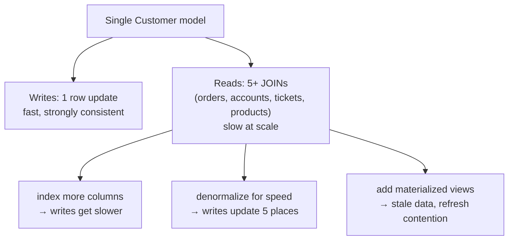
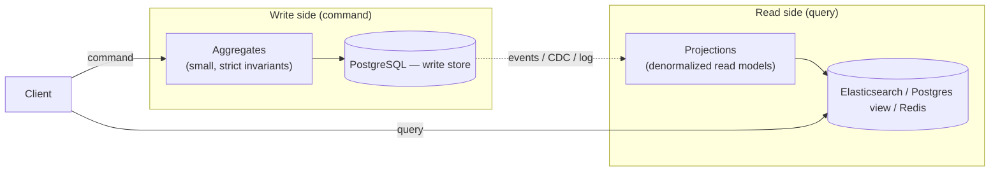
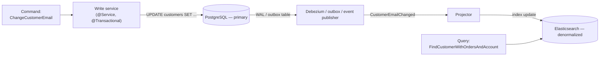
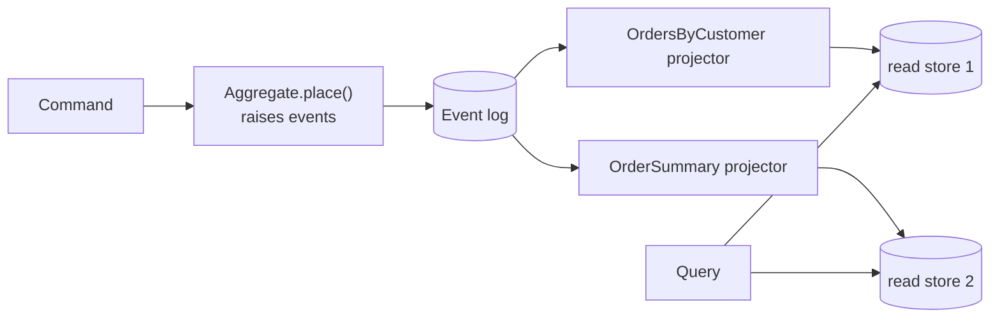

# CQRS

**CQRS — Command Query Responsibility Segregation** — is the architectural pattern that splits the system's write path (commands) from its read path (queries) into *two separate models, often two separate databases, and sometimes two separate codebases*. The intuition: in most non-trivial systems, the shape that makes a write *correct* (small aggregates, strong invariants, transactional boundaries) is the opposite of the shape that makes a read *fast* (large denormalized views, eventual consistency, optimized indexes). Forcing both sides through the same model is a compromise that satisfies neither — the write side becomes harder to test, the read side becomes harder to query, and every change has to balance both. CQRS gives each side what it wants by giving them up on being the same thing.

The pattern was named by Greg Young in 2010, but it descends from Bertrand Meyer's 1988 **Command-Query Separation** principle ("every method should either be a command that changes state or a query that returns state, never both"). Young's contribution was to lift the principle from a method-level rule to an architectural-level rule, and to point out that the two sides could be different *systems* — different databases, different teams, different scaling profiles. The pattern most often shows up paired with **event sourcing** ([T08](./T08-event-sourcing.md)) because event sourcing's natural read story *is* CQRS — replay events into denormalized projections — but **CQRS is independent of event sourcing**, and is usefully applied to plain Postgres-CRUD systems where reads and writes have diverged enough that a single model hurts both.

The depth bar here is **mechanism and the trade-off**: when does the asymmetry pay back the cost of running two models? We trace what each side owns (the write side: aggregates, invariants, `@Transactional` boundaries; the read side: denormalized projections, materialized views, polyglot stores), how the eventual-consistency gap between them gets handled (read-your-writes is a real product requirement), the operational tools (Axon's command bus and event bus; .NET's MediatR pattern's Java analogs; bespoke Postgres + Debezium + Elasticsearch), and the well-named anti-patterns (CQRS-by-name-only, the "we'll add reads later" problem, the missing-projection trap). We name the production systems that embraced it (Stack Overflow's read replication, eBay's read-heavy listing services, Microsoft's CRM Dynamics) and the typical failure mode (teams that adopted CQRS for a CRUD admin tool and never recovered the productivity). By the end you will choose CQRS deliberately for the right read/write asymmetries, implement it in Spring with or without event sourcing, design eventual-consistency handling that customers don't notice, and refuse it for the majority of services where one model is fine.

> [!NOTE]
> Prerequisites: [DDD](./T03-domain-driven-design-ddd.md) (aggregates as the write-side unit), [Service Communication](./T06-service-communication-sync-vs-async.md) (event publication), [Event Sourcing](./T08-event-sourcing.md) (the natural pairing). CQRS is *often* paired with event sourcing but is its own pattern; this topic covers it standalone, then with ES, then together.

## Where CQRS Came From — Meyer's Principle, Then Young's Lift

CQRS has an unusually clean intellectual lineage: it descends from a *single principle* (Bertrand Meyer's Command-Query Separation, 1988) that Greg Young *lifted from method level to architectural level* (2010). Understanding the lift matters because it explains why CQRS is a *structural* pattern, not a *tactical* one — and why so many teams adopt it incorrectly.

### Bertrand Meyer And The 1988 Principle

**Bertrand Meyer** (born 1950) is a French computer scientist, best known as the creator of **Eiffel** (1985), the OO programming language that introduced **Design by Contract**, and for *Object-Oriented Software Construction* (1988, second edition 1997), one of the canonical OO textbooks of the era.

In *Object-Oriented Software Construction* (1988, Chapter 23), Meyer introduced **Command-Query Separation (CQS)**:

> "Every method should either be a command that performs an action, or a query that returns data to the caller, but not both. In other words, asking a question should not change the answer."

The motivation was about *programmer reasoning*. If a method both *modifies state* AND *returns data*, you cannot reason about the data without considering the modification. Mixing the two violates a fundamental cognitive principle: the caller must always know whether their call has side effects.

Meyer's classical example of a violation: `stack.pop()`. In most languages, `pop()` *both* removes the top element and *returns* it. Meyer would split this into `stack.top()` (query, no side effect) and `stack.removeTop()` (command, no return value). The pattern is deliberately stricter than common practice.

CQS at the method level was widely respected but **rarely strictly followed**. The convenience of `pop()` (returns the popped value) usually outweighed the cognitive purity. CQS remained a principle that engineers acknowledged but routinely violated.

### Greg Young's Architectural Lift (2010)

In 2010, **Greg Young** (the same architect who articulated modern event sourcing — see [T08](./T08-event-sourcing.md)) made the conceptual leap: **apply Meyer's principle at the architectural level**. Don't just separate commands and queries within a class — separate the *entire codebase* into a command side and a query side, with potentially different models, different databases, different deployment shapes.

Young's articulation came through several talks (2010 QCon, various .NET meetups) and was consolidated in his ["CQRS Documents" PDF](https://cqrs.files.wordpress.com/2010/11/cqrs_documents.pdf) (November 2010, 53 pages). The acronym CQRS — Command Query Responsibility Segregation — became the recognized term.

Young's specific insight: the *shape* that makes data writeable correctly (aggregates with invariants, normalized to prevent inconsistency) is *opposite* to the shape that makes data readable performantly (denormalized projections optimized for specific queries). Pre-CQRS, every system tried to use *one* model for both, accepting compromise on both sides. CQRS says: stop compromising, build two models.

### Why The Lift Mattered

Meyer's CQS at the method level was tactical advice. Young's CQRS at the architectural level was *strategic restructuring*. The differences:

| | CQS (Meyer 1988) | CQRS (Young 2010) |
|---|---|---|
| Scope | Method | System |
| Cost | Renaming methods | Restructuring deployment |
| Benefit | Cognitive clarity | Independent optimization |
| Adoption | Universal principle, often violated | Specific pattern, selectively used |

The lift was *not obvious*. Several earlier articulations had hinted at it — Udi Dahan's writing on "service-oriented commands and queries" (late 2000s), Jimmy Bogard's MediatR-style command/query handlers (2014) — but Young was the one who packaged it as a complete architectural pattern with the CQRS name.

### The .NET Community's Outsized Role

CQRS was disproportionately developed and adopted by the .NET community. Several reasons:

1. **Young, Dahan, Bogard, Eric Evans's American collaborators** — the dominant CQRS voices were .NET-rooted.
2. **MediatR** (Jimmy Bogard, 2014) — the canonical .NET library for the in-process command/query bus. It made CQRS practically deployable in any ASP.NET project.
3. **Entity Framework's pain points** — EF's tendency to load entire object graphs even for read-only queries motivated splitting into separate query models.

The Java community adopted CQRS more slowly (2014–2018 inflection), often via **Axon Framework** (Allard Buijze) which provided MediatR-equivalent bus mechanics. By 2026, CQRS is well-known in Java but adoption remains lower than in .NET.

### The 2014 Microservices Reframing

After 2014, CQRS was often re-presented as a *microservices pattern* — with the command side and query side becoming separate services. This is *one* way to deploy CQRS but is not what Young originally described. Young's 2010 articulation explicitly allowed *single-process CQRS* where the two sides are different classes in the same monolith.

The senior engineer's caution: the "CQRS requires microservices" framing is a recent overlay, not the original intent.

## Why CQRS, Specifically: The Senior Engineer's Q&A

### Q1: What problem does CQRS solve that one-model approaches don't?

Three concrete problems:

1. **The read-write shape conflict**. An order is *written* as a normalized graph (Order → OrderLines → Products) with invariants. The same order is *read* as a denormalized view (OrderSummary with embedded line totals, customer name, shipping status). A single model serves both badly: writes are slow because the model is denormalized; reads are slow because they require JOINs across the normalized graph.

2. **The scaling-profile conflict**. Reads typically outnumber writes 10:1 or 100:1 in user-facing systems. Scaling the *write* model to handle read traffic is wasteful (writes need careful consistency; reads can use caching, replicas, denormalization). Scaling the *read* model to handle write traffic is impossible (reads don't constrain consistency).

3. **The query-flexibility conflict**. Operational reads ("show this order") and analytical reads ("total revenue this quarter by region") have wildly different shapes. A single model serves both poorly: relational normalization is wrong for analytical aggregates; columnar storage is wrong for operational lookups.

CQRS lets each side be optimized for its actual workload.

### Q2: What did people do before CQRS?

The dominant pattern was **active-record-over-relational**, where one model served everything. The compromises:

- **Service-layer projections** that mapped entities to DTOs for specific queries. Limited because the entity shape constrained the projection.
- **Materialized views** in the database to denormalize for reads. Useful but tied to the same database.
- **Reporting databases** populated by ETL. The first step toward CQRS — separate read store — but without explicit command/query split.
- **N+1 query problems** as a way of life, because the entity-per-row model made aggregations expensive.

CQRS systematized what teams were already doing ad-hoc (separate read store, denormalization, caching) and made it a deliberate architectural choice.

### Q3: How does CQRS compare to GraphQL?

Interesting comparison. **GraphQL** lets clients specify exactly the shape they want, server-side. The runtime resolves the query against the underlying data sources. From the client's perspective, GraphQL solves the query-flexibility problem.

But **GraphQL doesn't change the server's data model**. The server still has *one* underlying data shape; GraphQL just lets clients re-shape it for the response. The write side and read side are still using the same database.

CQRS goes further: the server *itself* has two different data models. GraphQL can be the API on top of either or both, but the server-side architecture is independent.

The two patterns compose well: CQRS on the server, GraphQL on the read API.

### Q4: Why hasn't CQRS become the default?

Several structural costs:

1. **Two models means twice the code**. Each side has its own classes, mappers, validators. For simple CRUD, this is overhead with no benefit.
2. **Eventual consistency complicates UI**. The user writes; reads from the same user may not yet reflect the write. The "read-your-writes" problem requires explicit handling.
3. **The mental model is unfamiliar**. Developers raised on ActiveRecord and Hibernate find the two-model approach inverted.

For the 80% of services that are CRUD admin tools or simple resource APIs, CQRS is overkill. For the 20% with measurable read-write asymmetry or query-flexibility needs, it's a 10× win.

### Q5: How does CQRS interact with event sourcing?

ES and CQRS are *independent* patterns that *compose excellently*:

- **CQRS without ES**: write side uses a traditional database (RDBMS); read side projects from CDC events. This is *common* for teams adopting CQRS without committing to ES.
- **CQRS with ES**: write side stores events; read side projects from the event stream. This is the *natural pairing* — the event stream becomes the propagation mechanism between sides.
- **ES without CQRS**: theoretically possible but rarely useful. The replay-for-reads cost makes a read-side projection almost mandatory.

The senior judgment: adopt CQRS *first* (it's cheaper and more general), then *add* ES when audit/replay/multi-consumer needs justify it.

## The Mechanism In Depth — Why The Two Sides Cannot Share Connection Pools

The CQRS abstraction looks simple ("just split read from write"). The mechanical implementation has subtle requirements.

### Why Separate Databases (Not Just Separate Tables)

A common CQRS implementation mistake: use the same database with separate tables. This *partly* works but breaks down at scale:

1. **The connection pool is shared**. Heavy read traffic exhausts the pool, blocking writes. Separating read traffic onto its own pool requires separating databases.

2. **The lock contention is shared**. Heavy reads can take row-level shared locks that delay writes. Separating to a read replica eliminates this.

3. **The schema is shared**. The "denormalized read tables" require migrations alongside the write tables. Separating databases lets read-side migrations happen independently.

4. **The backup strategy is shared**. The read side typically doesn't need point-in-time recovery (it can be rebuilt from events). Separating databases lets the read side use cheaper backup.

The mechanical conclusion: *true* CQRS uses separate databases. Same-database CQRS is a stepping stone, not the destination.

### Why The Propagation Mechanism Matters

CQRS requires data to flow from write to read. Three propagation choices:

1. **Application-level publication**: the write-side service publishes events on success. Risk: dual-write inconsistency (DB commits, Kafka publish fails).
2. **Transactional outbox**: write the event to an `outbox` table in the same transaction; Debezium ships from the outbox. Reliable; standard pattern.
3. **CDC from the write database directly**: Debezium tails the WAL and produces events. Reliable but the events are *technical* (row changes), not *business* (semantic operations).

The senior judgment: use the transactional outbox for application-meaningful events; use raw CDC for technical replication.

### How The Read Side Achieves Performance

A naive read side denormalizes by materializing JOINs at write time. The performance characteristics:

- **Read latency**: O(1) lookup by key. Typically < 1 ms.
- **Write latency**: O(N) updates to N read-side projections per source write. Typically 5–50 ms.
- **Storage**: O(N) copies of denormalized data per source row.

This is the **read-write trade-off** that CQRS makes explicit. The total work is the same (or more); it's just moved to write time, when the user isn't waiting.

## Common Misconceptions Explained

### "CQRS requires event sourcing."

False. CQRS is structural; ES is a particular way to implement the propagation. CQRS can use CDC, transactional outbox, or even synchronous replication.

### "CQRS doubles the development cost."

Partially true. CQRS adds the read-side projection code and the propagation pipeline. For new features, it adds ~30–50% to the per-feature cost. The win comes from operational performance and query flexibility, not from feature velocity.

### "CQRS works only with microservices."

False. CQRS predates microservices and was originally articulated in a monolithic context. The two sides can be classes in the same Spring Boot app with different package responsibilities.

### "CQRS solves the read-your-writes problem."

False. CQRS *creates* the read-your-writes problem (because reads come from a stale projection). The application must explicitly handle it — via wait-for-projection, optimistic UI, or read-from-write-side-for-critical-paths.

### "CQRS is just service layer + repositories done right."

False. The defining property of CQRS is *separate storage models*, not just separate code paths. A controller that calls one service for writes and another for reads, both backed by the same JPA repository, is *not* CQRS.

## The Asymmetry — Why One Model Hurts Both Sides

A single model for a `Customer` entity, persisted in a single PostgreSQL row, asked to do everything:

- **The write side wants**: small object, clear invariants, fast inserts and updates, strong consistency, row-level locking. `Customer.changeEmail(...)` validates the new email and updates one row.
- **The read side wants**: `Customer + lastOrder + accountValue + recommendedProducts + loyaltyTier + recentSupportTickets` in one query, sub-50 ms p99, eventual consistency is fine, served from a denormalized read store.

Forcing both through one model produces:



Every read-optimization makes writes worse; every write-optimization makes reads slower; every team meeting is a tug-of-war between the two sides. The codebase grows tendril services and view-only repositories that are not enforced; the architecture decays.

CQRS says: **stop. Split. Let each side optimize for itself. Pay the cost of an extra model in exchange for releasing both sides from compromise.**



The arrow from write store to read side is critical — it's the **propagation mechanism**. Events from the write side flow to the read side; projections update the read store. Eventual consistency is in the diagram; the system commits to a finite lag.

## Two Flavors — CQRS Without And With Event Sourcing

CQRS does *not* require event sourcing, but its appeal compounds when paired with one. The two flavors deserve separate attention.

### Flavor 1: CQRS Without Event Sourcing

The write store is a traditional relational database; the read store is something denormalized. The propagation mechanism is *change data capture* (Debezium, AWS DMS) or *application-level publish* (the write-side service publishes events after each commit).



Concretely:

- **Write side**: Spring Boot service with JPA, hibernating aggregates, `@Transactional` updates. Outbox table receives the same event the projector will consume.
- **CDC / outbox**: Debezium tails the WAL or the outbox table; publishes events to Kafka.
- **Read side**: separate service or projector subscribes to Kafka events; updates Elasticsearch (or a denormalized PG view, or a Redis cache, or a Druid OLAP store).
- **Queries** hit the read store directly; they never touch the primary.

This flavor's benefit: keep PostgreSQL on the write side (familiar, transactional) and use whatever shape best fits reads (search, aggregation, key-value). The cost: a propagation pipeline to maintain.

### Flavor 2: CQRS With Event Sourcing

The write store is the event log. The read store is one or more projections built by replaying events.



Concretely:

- **Write side**: event-sourced aggregates ([T08](./T08-event-sourcing.md)).
- **Read side**: one projector per query shape, each maintaining its own store.
- **Adding a new query** = adding a new projector + replaying events.

This flavor's benefit: the propagation mechanism is the same as the persistence mechanism — there is no separate outbox/CDC pipeline. The cost: all of event sourcing's costs (schema evolution, projection management, GDPR conflict).

## Implementation In Spring — A Concrete Walkthrough

A small CQRS-without-ES walkthrough.

### The Write Side

```java
@RestController
public class CustomerCommandController {
  private final CustomerService writeService;

  @PostMapping("/v1/customers/{id}/email")
  public ResponseEntity<Void> changeEmail(@PathVariable long id, @RequestBody ChangeEmailCommand cmd) {
    writeService.changeEmail(new CustomerId(id), cmd.newEmail());
    return ResponseEntity.accepted().build();        // 202 — async to read side
  }
}

@Service
public class CustomerService {
  private final CustomerRepository repo;
  private final OutboxRepository outbox;

  @Transactional
  public void changeEmail(CustomerId id, EmailAddress newEmail) {
    Customer c = repo.findById(id).orElseThrow();
    c.changeEmail(newEmail);                          // aggregate enforces invariants
    repo.save(c);                                     // UPDATE
    outbox.save(new CustomerEmailChanged(id, newEmail, Instant.now()));   // SAME transaction
  }
}
```

The `outbox` write is in the same transaction as the customer update; both commit or both don't. A separate Debezium connector watches the outbox table and publishes events to Kafka.

### The Read Side

```java
@RestController
public class CustomerQueryController {
  private final CustomerReadStore readStore;

  @GetMapping("/v1/customers/{id}")
  public CustomerView find(@PathVariable long id) {
    return readStore.findById(id);                    // hits Elasticsearch
  }

  @GetMapping("/v1/customers/{id}/full")
  public CustomerFullView findFull(@PathVariable long id) {
    return readStore.findFullView(id);                // hits a different store / index
  }
}

@Component
public class CustomerProjector {
  private final CustomerReadStore readStore;

  @KafkaListener(topics = "customer-events", groupId = "customer-projector")
  public void on(ConsumerRecord<String, DomainEvent> record) {
    DomainEvent e = record.value();
    switch (e) {
      case CustomerEmailChanged c -> readStore.updateEmail(c.id(), c.newEmail());
      case CustomerCreated c      -> readStore.create(c);
      case CustomerSuspended c    -> readStore.markSuspended(c.id());
      default                     -> { /* ignore unknown */ }
    }
  }
}
```

Three pieces of nuance:

1. **The query controller returns DTOs, not entities.** The read model has its own shape — `CustomerView` is *whatever the query needs*, not a mirror of the write side's `Customer`.
2. **The projector is idempotent.** `updateEmail(id, newEmail)` is idempotent; running it twice is harmless. This is *required* for at-least-once Kafka delivery (see [T06](./T06-service-communication-sync-vs-async.md)).
3. **The write-side returns 202 Accepted**, not 200 OK. The command was accepted; the read side will reflect it momentarily.

## The Eventual Consistency Problem — Read-Your-Writes

The fundamental CQRS trade-off: between accepting the write and seeing it on the read side, **time passes**. Typically 10–500 ms (depending on Kafka, projector throughput, read-store write latency). For most operations, fine. For some operations, painful:

- User changes their email, then immediately visits `/profile`, sees the *old* email. Files a support ticket.
- User places an order, gets routed to `/orders` to see it. The order isn't there yet.

This is the **read-your-writes** problem, and it's one of the harder things in CQRS to solve well. The patterns:

### 1. Wait For Projection — Read After Sync

After the write, the write side returns a *version* or *correlation id*. The client passes that on the next read; the read side waits until its projection has caught up to that version before responding.

```java
@PostMapping("/v1/customers/{id}/email")
public ResponseEntity<Map<String, String>> changeEmail(@PathVariable long id, @RequestBody ChangeEmailCommand cmd) {
  Long version = writeService.changeEmail(new CustomerId(id), cmd.newEmail());
  return ResponseEntity.accepted().body(Map.of("version", version.toString()));
}

@GetMapping("/v1/customers/{id}")
public CustomerView find(@PathVariable long id, @RequestHeader(value = "X-Min-Version", required = false) Long minVersion) {
  if (minVersion != null) {
    readStore.awaitVersion(id, minVersion, Duration.ofSeconds(2));   // poll/block until projection catches up
  }
  return readStore.findById(id);
}
```

Works. Adds latency for the read-after-write. Hard to scale (the read store must track per-stream versions).

### 2. Optimistic UI

After the write, the client *displays the new state immediately* (it knows what the change was) and replaces the optimistic value when the next server response arrives. This is how modern UIs handle the gap; the user never notices.

The cost: client code becomes more complex. But this is the right answer for most user-facing CQRS systems.

### 3. Read From The Write Side For Critical Paths

For the small set of operations where read-your-writes is non-negotiable (e.g., a banking "show me my balance" right after a deposit), bypass CQRS for that one path: query the write side directly. Accept the slower read for the consistency.

### 4. Tolerate The Gap

Many domains genuinely don't need read-your-writes. A user updating their profile picture doesn't need it to appear instantly on the public profile page; a 1-second delay is fine. Be deliberate about which operations need consistency; don't pay for it everywhere.

## Read Models — How They're Shaped

A read model is whatever shape the query needs. Common kinds:

| Kind | Stored in | Best for |
|------|-----------|---------|
| **Denormalized table** | PostgreSQL (separate from write DB) | Complex JOINs collapsed to single-row lookups |
| **Search index** | Elasticsearch, OpenSearch | Full-text search, faceted filters, type-ahead |
| **Key-value cache** | Redis, Memcached | Profile-like lookups, session data |
| **OLAP cube** | Druid, Pinot, ClickHouse | Time-series aggregation, dashboards |
| **Graph view** | Neo4j, Neptune | Relationship-traversal queries (recommendations, social) |
| **Materialized view** | Postgres `MATERIALIZED VIEW` | Same DB, refreshed periodically — light CQRS |

A single CQRS system often maintains **multiple read models**, each tuned to one query family. Each model has its own projector, its own freshness budget, and its own scaling profile. **Adding a new query shape is a normal feature**, not a schema migration that contends with everyone else.

### A Realistic Read-Model Set

For an e-commerce write side with one `Order` aggregate, the read models might be:

- `orders_by_customer_recent` (Postgres) — fast "my orders" view for the logged-in user.
- `orders_by_status` (Postgres) — for the operations team.
- `orders_search` (Elasticsearch) — full-text search across SKU, customer name, address.
- `order_metrics_daily` (Druid) — for analytics dashboards.
- `customer_order_summary` (Redis) — cached for the recommendation engine's fast access.

Five read stores, each maintained by a projector subscribed to the write side's events. Each independent. Failure of one doesn't degrade the others. Replacement (a new ES version, a different cache) is a project for one store, not a system migration.

## Polyglot Persistence Per Side

CQRS is the cleanest justification for polyglot persistence. The write side uses what it needs (usually a single transactional store — Postgres, MySQL, EventStoreDB). The read side uses what *each query* needs — multiple stores, each justified.

The flip side: each store is operational complexity. The discipline is to *justify each store with a query that genuinely needs it*. A read model "in case we need it" is just garbage. Keep the set lean; add stores when measured queries genuinely demand them.

## CQRS Without Event Sourcing — When It's The Right Choice

Many teams reach for CQRS thinking event sourcing comes with it. They don't have to. Useful CQRS-without-ES situations:

- A legacy system you can't event-source but where reads are killing the write store. Add Debezium + Elasticsearch as a CQRS read side.
- A system where the write model is genuinely best as relational (transactional invariants over a tabular schema) but reads need a search index or OLAP cube.
- A team that wants the CQRS payoff without the event-sourcing learning curve.

CQRS-with-CDC is operationally simpler than CQRS-with-ES (the event store is just Postgres). The trade-off: you can't replay history that wasn't captured at the time. Adding a new projection requires either (a) running a backfill from the current PG state, or (b) accepting that the new projection only sees events from creation.

## CQRS With Event Sourcing — When They Compound

When the team is already event-sourcing (for audit, history, multi-consumer integration), CQRS is essentially free — the event stream *is* the propagation mechanism. Adding a new projection is "subscribe and replay." Backfilling is trivial.

The combo is the natural fit for:

- Trading platforms (event-sourced fills + real-time positions projection + historical analytics projection).
- Banking ledgers (event-sourced transactions + balances projection + statements projection + fraud projection).
- Insurance claims (event-sourced state machine + claims summary + actuarial projections).
- Any domain where the write side benefits from event sourcing.

## Anti-Patterns — How CQRS Goes Wrong

### 1. CQRS By Name Only

The team has a `CommandService` and a `QueryService` in the same module, both backed by the same JPA repository. The "separation" is decoration. The promised benefits (independent scaling, polyglot per side, denormalized reads) don't appear because the underlying storage hasn't separated. This is **the most common failure mode** — CQRS as ceremony.

Fix: separate the *stores* (or at least separate the schemas, with the read side denormalized). If you can't justify even that, you don't need CQRS.

### 2. "We'll Add Reads Later"

A team starts event-sourcing the write side, ships, and then realizes they need a query API. They have no projections. They write a service that *queries the event log* by replay every time — slow, expensive, scaling poorly. Months pass. They reluctantly add projections, but the early users are conditioned to the slow API.

Fix: design at least one projection on day one. The discipline of "we have a read side" prevents the trap.

### 3. The Synchronous Update Anti-Pattern

The team makes the read side update *synchronously* inside the write-side transaction — write to Postgres + write to Elasticsearch in one transaction, hoping for consistency.

Two problems: (a) the two writes are not actually transactional (Postgres and Elasticsearch don't share a transaction manager); (b) the write latency now includes the read-store latency. When Elasticsearch slows down, writes slow down. CQRS's whole point — decoupling — is gone.

Fix: write to the outbox or rely on event publication; let the read side catch up asynchronously.

### 4. The Missing Projection Re-Build Mechanism

The team builds projections, but never tests rebuilding them from scratch. Six months later, a projection bug requires a rebuild — and they discover the projector can't replay history (events have expired from Kafka, schemas have evolved, the projector's idempotency was never tested).

Fix: replay drills are a normal operational activity. Rebuild a projection in test environments quarterly. Keep events for the duration you'd ever rebuild (event sourcing's retention discipline applies even to CQRS-with-CDC).

### 5. Eventual-Consistency Surprise

The team launches; a user reports "I updated my email but it's still the old one." Engineering investigates, discovers the read side lags by ~10 seconds. They didn't think about this. They scramble to fix it with optimistic UI or projection-aware reads.

Fix: design read-your-writes from the start. Identify the operations where the gap is noticeable; decide their handling.

## Tooling — Spring, Axon, And The .NET Comparison

In Spring, CQRS is typically assembled from primitives — a command service, an event publisher, a Kafka projector. No single framework dominates. **Axon Framework** (Java) provides explicit `@CommandHandler` and `@QueryHandler` annotations, a command bus, a query bus, and integrates with its own event store; it's the most explicitly-CQRS Java framework.

```java
// Axon-style
@Aggregate
public class Order {
  @AggregateIdentifier private OrderId id;
  @CommandHandler
  public Order(PlaceOrderCommand cmd) {
    AggregateLifecycle.apply(new OrderPlaced(cmd.id(), cmd.customer(), cmd.total()));
  }
  @EventSourcingHandler
  public void on(OrderPlaced e) {
    this.id = e.id();
    // ...
  }
}

@Component
public class OrderProjector {
  @EventHandler
  public void on(OrderPlaced e) { /* update read model */ }
  @QueryHandler
  public OrderView handle(FindOrder query) { /* return from read store */ }
}
```

Axon's command bus, event bus, and query bus give you the buses for free; the trade-off is vendor lock-in and a learning curve. For most Spring shops, *not* using Axon — assembling CQRS from Spring's existing pieces (`@Service`, `KafkaTemplate`, `@KafkaListener`) — is the more flexible and supportable path.

In **.NET**, the equivalent pattern is **MediatR** — a library that provides command and query handlers via an in-process bus. The Java analog is roughly Axon Framework or a hand-rolled equivalent.

## Real Adopters — Where CQRS Has Paid Back

- **Stack Overflow** — relational write side (SQL Server), read-heavy traffic served from denormalized in-memory caches. Not "pure" CQRS but the same idea. Public engineering write-ups.
- **eBay** — read-heavy listing services with denormalized read paths fed by event streams from the write side.
- **Microsoft Dynamics CRM** — write-side and read-side separation built into the product.
- **Banking systems** — write-side ledger + multiple projected views (balances, statements, fraud, regulatory reporting).
- **High-frequency trading platforms** — event-sourced write side + real-time position projection + historical analytics projections.

The common thread: **measurable read/write asymmetry, multiple distinct read shapes, a clear team boundary between command and query work**.

## Cross-Language Notes

| Ecosystem | CQRS support |
|-----------|--------------|
| **Java / Spring** | Hand-rolled (Spring + Kafka + JPA + ES); Axon for explicit framework |
| **C# / .NET** | MediatR (huge adoption); EventFlow; native CQRS in many enterprise apps |
| **Node.js** | Hand-rolled; wolkenkit, nestjs/cqrs |
| **Python** | Hand-rolled; eventsourcing library (provides CQRS pieces) |
| **Elixir** | Commanded (full ES + CQRS framework) |
| **Go** | Hand-rolled, no dominant framework |
| **Rust** | cqrs-es (third party), hand-rolled |

The pattern transcends framework. The .NET ecosystem has the most explicit CQRS culture (MediatR, the Greg-Young blog tradition). Java is catching up but most Spring teams roll their own.

## Trade-Off Summary

| Concern | Single-model | CQRS (no ES) | CQRS + ES |
|---------|:------------:|:------------:|:---------:|
| Read performance | Compromised | Excellent (denormalized) | Excellent |
| Write performance | Compromised | Good (write-only PG) | Excellent (append-only) |
| Read-your-writes | Trivial | Hard (eventual consistency) | Hard |
| Schema evolution | Easy | Easy (writes only) | Hard (events immutable) |
| Audit | Side-effort | Side-effort | Free |
| New query shapes | Schema migration | New projection | New projection (with replay) |
| Operational complexity | Low | Medium (outbox + CDC + read store) | High (event store + projections + GDPR + upcasters) |
| Team learning curve | None | Medium | High |
| Fit for CRUD | Native | Overkill | Massive overkill |

The diagonal: **start single-model. Move to CQRS without ES when measured read/write asymmetry hurts. Move to CQRS with ES only when audit/replay/history/multi-consumer needs justify event sourcing for its own sake.**

> [!INTERVIEW]
> A common L5 prompt: "How would you implement CQRS in Spring?" A weak answer cites the buzzwords. A strong answer (a) decides whether to pair with event sourcing or use CDC (and justifies), (b) names a specific propagation pipeline (outbox + Debezium + Kafka + ES, or Axon's buses), (c) addresses read-your-writes explicitly, (d) identifies the operational ownership of the read store as a real concern.

## Deeper Dive — Complete CQRS Implementation Walkthrough

### Architecture: E-Commerce Product Catalog

```
WRITE SIDE (Command):
  - PostgreSQL primary
  - Spring Data JPA repositories
  - Aggregate: Product (with versions, variants, attributes)
  
READ SIDE (Query):
  - Elasticsearch for product search
  - PostgreSQL read replica for admin views
  - Redis for hot-product lookups
  
PROPAGATION:
  - Postgres outbox table for events
  - Debezium captures changes
  - Kafka topic "product-events"
  - 3 projectors (one per read store)
```

### Write Side: Command Handler

```java
@RestController
@RequestMapping("/api/v1/products")
public class ProductCommandController {
    private final ProductCommandService commandService;

    @PostMapping
    public ResponseEntity<ProductCreatedResponse> create(
            @Valid @RequestBody CreateProductCommand cmd) {
        ProductId id = commandService.create(cmd);
        return ResponseEntity.accepted()
            .body(new ProductCreatedResponse(id, "Processing"));
    }

    @PutMapping("/{id}")
    public ResponseEntity<Void> update(
            @PathVariable ProductId id,
            @Valid @RequestBody UpdateProductCommand cmd) {
        commandService.update(id, cmd);
        return ResponseEntity.accepted().build();
    }
}

@Service
public class ProductCommandService {
    private final ProductRepository productRepo;
    private final OutboxEventRepository outboxRepo;

    @Transactional
    public ProductId create(CreateProductCommand cmd) {
        // Domain logic: validate, create aggregate
        Product product = Product.create(
            new ProductId(UUID.randomUUID()),
            cmd.name(),
            cmd.category(),
            cmd.price()
        );
        productRepo.save(product);

        // Outbox event in same transaction
        outboxRepo.save(new OutboxEvent(
            UUID.randomUUID(),
            "ProductCreated",
            product.id().toString(),
            json.write(new ProductCreatedEvent(
                product.id(),
                product.name(),
                product.category(),
                product.price(),
                Instant.now()
            )),
            Instant.now()
        ));

        return product.id();
    }

    @Transactional
    public void update(ProductId id, UpdateProductCommand cmd) {
        Product product = productRepo.findById(id)
            .orElseThrow(() -> new ProductNotFoundException(id));

        product.update(cmd);   // domain logic
        productRepo.save(product);

        outboxRepo.save(new OutboxEvent(
            UUID.randomUUID(),
            "ProductUpdated",
            product.id().toString(),
            json.write(new ProductUpdatedEvent(...)),
            Instant.now()
        ));
    }
}
```

### Debezium / Outbox Configuration

```yaml
# Debezium PostgreSQL connector
name: product-outbox-connector
config:
  connector.class: io.debezium.connector.postgresql.PostgresConnector
  database.hostname: postgres
  database.dbname: products
  table.include.list: public.outbox_events
  
  transforms: outbox
  transforms.outbox.type: io.debezium.transforms.outbox.EventRouter
  transforms.outbox.route.by.field: event_type
  transforms.outbox.table.field.event.id: id
  transforms.outbox.table.field.event.payload: payload
```

### Read Projector: Elasticsearch

```java
@Component
public class ProductSearchProjector {
    private final ElasticsearchClient esClient;

    @KafkaListener(topics = "ProductCreated", containerFactory = "kafkaListenerFactory")
    public void onProductCreated(ProductCreatedEvent event) throws IOException {
        IndexRequest<ProductSearchDocument> req = IndexRequest.of(b -> b
            .index("products")
            .id(event.id().toString())
            .document(new ProductSearchDocument(
                event.id().toString(),
                event.name(),
                event.category(),
                event.price().doubleValue(),
                Instant.now(),
                buildSearchKeywords(event)
            ))
        );
        esClient.index(req);
    }

    @KafkaListener(topics = "ProductUpdated")
    public void onProductUpdated(ProductUpdatedEvent event) throws IOException {
        UpdateRequest<ProductSearchDocument, ProductSearchDocumentUpdate> req =
            UpdateRequest.of(b -> b
                .index("products")
                .id(event.id().toString())
                .doc(new ProductSearchDocumentUpdate(...))
            );
        esClient.update(req, ProductSearchDocument.class);
    }
}

// Search-optimized document
public record ProductSearchDocument(
    String id,
    String name,
    String category,
    double price,
    Instant updatedAt,
    List<String> searchKeywords
) {}
```

### Read Side: Search Query API

```java
@RestController
@RequestMapping("/api/v1/products")
public class ProductQueryController {
    private final ElasticsearchClient esClient;

    @GetMapping("/search")
    public ResponseEntity<SearchResults> search(
            @RequestParam String q,
            @RequestParam(defaultValue = "0") int page,
            @RequestParam(defaultValue = "20") int size) {

        SearchResponse<ProductSearchDocument> response = esClient.search(
            s -> s.index("products")
                .query(q1 -> q1.multiMatch(m -> m
                    .query(q)
                    .fields("name^2", "category", "searchKeywords")
                ))
                .from(page * size)
                .size(size)
                .sort(so -> so.field(f -> f.field("price")))
            , ProductSearchDocument.class
        );

        return ResponseEntity.ok(new SearchResults(
            response.hits().hits().stream()
                .map(Hit::source)
                .toList(),
            response.hits().total().value()
        ));
    }
}
```

### Cache Projector: Redis

```java
@Component
public class ProductCacheProjector {
    private final RedisTemplate<String, Product> redis;

    @KafkaListener(topics = "ProductCreated")
    public void onProductCreated(ProductCreatedEvent event) {
        redis.opsForValue().set(
            "product:" + event.id(),
            buildCachedProduct(event),
            Duration.ofHours(24)
        );
    }

    @KafkaListener(topics = "ProductUpdated")
    public void onProductUpdated(ProductUpdatedEvent event) {
        redis.opsForValue().set(
            "product:" + event.id(),
            buildCachedProduct(event),
            Duration.ofHours(24)
        );
    }

    @KafkaListener(topics = "ProductDeleted")
    public void onProductDeleted(ProductDeletedEvent event) {
        redis.delete("product:" + event.id());
    }
}
```

## Deeper Dive — Handling Read-Your-Writes

The classic CQRS bug: user creates product, immediately queries — sees nothing.

```java
@RestController
public class ProductController {

    @PostMapping("/products")
    public ResponseEntity<ProductResponse> create(@RequestBody CreateProductCommand cmd) {
        ProductId id = commandService.create(cmd);
        
        // OPTION 1: Wait for projection (synchronous CQRS bug)
        // BAD: blocks request; couples client to projection time
        
        // OPTION 2: Return the command result as the response
        // GOOD: tell client the canonical state from the write side
        return ResponseEntity.accepted()
            .header("X-Created-Id", id.toString())
            .body(ProductResponse.fromCommand(cmd, id));
    }

    @GetMapping("/products/{id}")
    public ResponseEntity<ProductResponse> get(@PathVariable ProductId id,
                                                @RequestHeader(value = "X-Wait-For-Projection", required = false) Boolean wait) {
        if (Boolean.TRUE.equals(wait)) {
            // Short-poll until projection catches up (with timeout)
            return waitForProjection(id, Duration.ofSeconds(5));
        }
        
        // Default: return whatever's in the read model (eventually consistent)
        return readModelRepo.findById(id)
            .map(p -> ResponseEntity.ok(p))
            .orElse(ResponseEntity.notFound().build());
    }

    private ResponseEntity<ProductResponse> waitForProjection(ProductId id, Duration timeout) {
        long deadline = System.currentTimeMillis() + timeout.toMillis();
        while (System.currentTimeMillis() < deadline) {
            Optional<ProductResponse> result = readModelRepo.findById(id);
            if (result.isPresent()) return ResponseEntity.ok(result.get());
            try { Thread.sleep(50); } catch (InterruptedException e) { Thread.currentThread().interrupt(); break; }
        }
        return ResponseEntity.status(202).build();   // Accepted, not yet available
    }
}
```

### Alternative: Optimistic UI

```
Client UI:
  1. User clicks "Save Product"
  2. UI immediately shows "Saved!" (optimistic)
  3. UI sends command to server
  4. Server returns 202 Accepted
  5. UI continues to function
  6. If server eventually returns error, UI shows error notification
  7. Otherwise, UI silently transitions to authoritative state

ADVANTAGES:
  - Perceived latency is 0
  - User doesn't wait for projection
  - Works on slow networks

DISADVANTAGES:
  - UI must handle conflict/error gracefully
  - State is briefly speculative
```

### Alternative: Read Your Own Writes from Command Store

```java
@GetMapping("/products/{id}")
public ResponseEntity<ProductResponse> get(@PathVariable ProductId id,
                                            @RequestParam(required = false) Boolean fresh) {
    if (Boolean.TRUE.equals(fresh)) {
        // Read from write side (Postgres primary) — guaranteed up-to-date
        return commandService.findById(id)
            .map(p -> ResponseEntity.ok(p))
            .orElse(ResponseEntity.notFound().build());
    }
    
    // Default: read from optimized read model (Elasticsearch)
    return readModelRepo.findById(id)
        .map(p -> ResponseEntity.ok(p))
        .orElse(ResponseEntity.notFound().build());
}
```

## Deeper Dive — Replay and Rebuild

### Scenario: Add a New Read Store

```
SCENARIO: 6 months in production. Adding analytics dashboard requires 
  new ClickHouse projection. 1M products, 10M events.

STEP 1: BUILD NEW PROJECTOR
  - Subscribe to existing event topics
  - Project to new ClickHouse table

STEP 2: REPLAY HISTORICAL EVENTS
  - Read all events from Kafka topic (from offset 0)
  - Process through new projector
  - Takes ~6 hours for 10M events

STEP 3: SWITCH OVER
  - At cutover time, new projector caught up to head
  - Dashboard reads from ClickHouse
```

```java
@Component
public class ProjectionRebuilder {
    private final KafkaConsumer<String, ProductEvent> consumer;
    private final ClickHouseProjector projector;

    public void rebuildClickHouse() {
        consumer.subscribe(List.of("product-events"));
        consumer.seekToBeginning(consumer.assignment());

        AtomicLong processed = new AtomicLong();
        long start = System.currentTimeMillis();

        while (true) {
            ConsumerRecords<String, ProductEvent> records = consumer.poll(Duration.ofMillis(100));
            if (records.isEmpty() && isCaughtUp()) break;

            for (ConsumerRecord<String, ProductEvent> record : records) {
                projector.project(record.value());
                if (processed.incrementAndGet() % 100_000 == 0) {
                    long elapsed = (System.currentTimeMillis() - start) / 1000;
                    log.info("Projected {} events in {}s ({}/sec)",
                        processed.get(), elapsed, processed.get() / Math.max(elapsed, 1));
                }
            }
        }
    }

    private boolean isCaughtUp() {
        Map<TopicPartition, Long> endOffsets = consumer.endOffsets(consumer.assignment());
        return consumer.assignment().stream()
            .allMatch(tp -> consumer.position(tp) >= endOffsets.get(tp));
    }
}
```

## Deeper Dive — CQRS Anti-Patterns

### Anti-Pattern 1: CQRS for Simple CRUD

```
SYMPTOM: Every entity has CQRS, even those with no read/write asymmetry
RESULT: Operational complexity without benefit
FIX: Identify entities with REAL asymmetry first
  - Search-heavy (CMS, catalog, blog)
  - Reporting/analytics
  - Caching with invalidation challenges
For others: use single model (CRUD)
```

### Anti-Pattern 2: CQRS as Decoration

```
SYMPTOM: "We have CQRS" but read side is same DB, same tables
RESULT: Just added a "Reader" class for organization
FIX: Either commit to genuine separation OR call it what it is (good organization)
```

### Anti-Pattern 3: Synchronous Projection

```
SYMPTOM: Command and projection run in same transaction
RESULT: Lost half the benefits (no async, no separate scaling)
FIX: Outbox + Kafka + separate projector consumer
```

### Anti-Pattern 4: No Replay Capability

```
SYMPTOM: Projection corrupted; no way to rebuild
RESULT: Operational nightmare; can't add new read stores
FIX: Event log retention + replay tooling from day one
```

### Anti-Pattern 5: Schema Changes Across Stores

```
SYMPTOM: Add field to event → must update 5 projectors + retrigger backfill
RESULT: Slow evolution; high coordination cost
FIX: Schema registry; backwards-compatible event versions
```

## Deeper Dive — When to Use CQRS (Decision Framework)

```
QUESTION: Do read and write workloads differ by 10× or more?

  YES → CQRS likely beneficial
  NO → Single model probably fine

QUESTION: Are read queries dominantly different from write entities?

  YES → CQRS likely beneficial
  NO → Single model probably fine

QUESTION: Do you need audit log or temporal queries?

  YES → Event Sourcing + CQRS
  NO → CQRS without ES might suffice

QUESTION: Multiple downstream consumers with different read needs?

  YES → CQRS beneficial
  NO → Single model + caching might suffice

QUESTION: Team capability for distributed systems operations?

  YES → CQRS feasible
  NO → Single model (improve maturity first)

CONCRETE GUIDANCE:
  - E-commerce catalog: CQRS without ES (Elasticsearch for search)
  - Banking ledger: CQRS WITH event sourcing (audit + temporal)
  - Simple admin tool: Single model (CRUD)
  - User profile: Single model + Redis cache
  - Order/payment: CQRS without ES (Postgres + outbox)
  - Reporting/BI: CQRS to OLAP (Snowflake/BigQuery)
```

## Deeper Dive — Real CQRS Adopters

| Company | What They CQRS | Why |
|---|---|---|
| **GOV.UK (UK Government)** | Forms / policy lookups | Read-heavy, multi-format outputs |
| **Walmart** | Catalog, recommendations | Different read shapes for site vs mobile |
| **Bank of America** | Account / ledger | Audit + multiple query shapes |
| **Spotify** | Music search | Specialized search vs CRUD library |
| **Microsoft Cosmos DB** | Backing pattern | Multiple consistency models, change feed |

## Practice

1. **Identify the asymmetry.** In any system you know, pick one entity. List five queries the read side runs against it and the shape each query wants. Compare to the write-side shape. Identify the friction.
2. **Sketch a CQRS-without-ES architecture.** For the same entity, design the write side (Spring + PG + outbox), the propagation (Debezium + Kafka), and one read side (Elasticsearch). Specify the events crossing.
3. **Read-your-writes design.** For a specific operation in your system, decide how read-your-writes is handled: wait-for-projection, optimistic UI, write-side read for that op, or "tolerate the gap." Justify in one paragraph.
4. **Outbox implementation.** Implement the transactional outbox in a Spring service: write the outbox table, write the application event in the same transaction, set up Debezium to publish to Kafka. Test that nothing diverges under crash conditions.
5. **Projection design.** For one read shape your system needs, design the projector: what events it consumes, how it maintains the read model, how it handles duplicate delivery, what its replay strategy is.
6. **The "CQRS by name only" hunt.** Find a system (yours or open-source) that claims CQRS. Verify whether the read and write stores are genuinely separate, or whether the separation is decoration. If the latter, propose the simplest real separation.
7. **Polyglot decision.** For an e-commerce system, justify which of these read stores it needs: PG denormalized table, Elasticsearch, Redis cache, OLAP cube. Refuse the ones that don't justify themselves.
8. **Replay drill.** Take a projector you control. Force-rebuild its read store from event history. Measure how long it takes; identify the bottleneck (event store read, projector compute, read store writes).
9. **CQRS-vs-ES decision tree.** Three scenarios: (a) a banking ledger; (b) an internal admin tool; (c) a recommendation engine. For each, decide single-model, CQRS-no-ES, or CQRS+ES. Justify each.
10. **The skeptic conversation.** A senior engineer says "we should do CQRS for this feature." Write a 200-word response that takes the position seriously, asks the right diagnostic questions (read/write asymmetry, query shapes, audit needs), and reaches a conclusion based on the evidence.

## Recap

You should now be able to:

- Articulate **CQRS** as the architectural-level split of write models (commands, aggregates, invariants) from read models (projections, denormalized views).
- Distinguish **CQRS without event sourcing** (RDB write + CDC propagation + denormalized read) from **CQRS with event sourcing** (event log + projection-only reads).
- Implement a **Spring CQRS pipeline**: write service with `@Transactional` aggregate updates, transactional outbox, Debezium-to-Kafka propagation, idempotent projector, separate read store.
- Choose **read-store shapes** by query family — denormalized PG, Elasticsearch, Redis, OLAP cube, materialized views, graph databases.
- Handle the **read-your-writes** problem via wait-for-projection, optimistic UI, write-side reads for critical paths, or deliberate tolerance of the gap.
- Recognize and refuse **five anti-patterns** — CQRS-by-name-only, "reads later," synchronous read-store updates, missing rebuild mechanisms, eventual-consistency surprise.
- Compare **Axon Framework** vs **hand-rolled Spring CQRS** and explain when each is the right choice.
- Place CQRS in **cross-language context** — .NET's MediatR culture, Spring's hand-rolled tradition, Elixir's Commanded framework.
- Read the **trade-off matrix** — single-model, CQRS-no-ES, CQRS+ES — and pick the right point on it.
- Cite **real adopters** (Stack Overflow, eBay, banking ledgers, trading platforms) and the common pattern of measurable read/write asymmetry.

## Next

Continue to [Saga Pattern (Distributed Transactions)](./T10-saga-pattern-distributed-transactions.md) — when a business operation spans multiple services or aggregates and atomic transactions are impossible, the saga pattern coordinates the work with compensating actions for partial failures.
