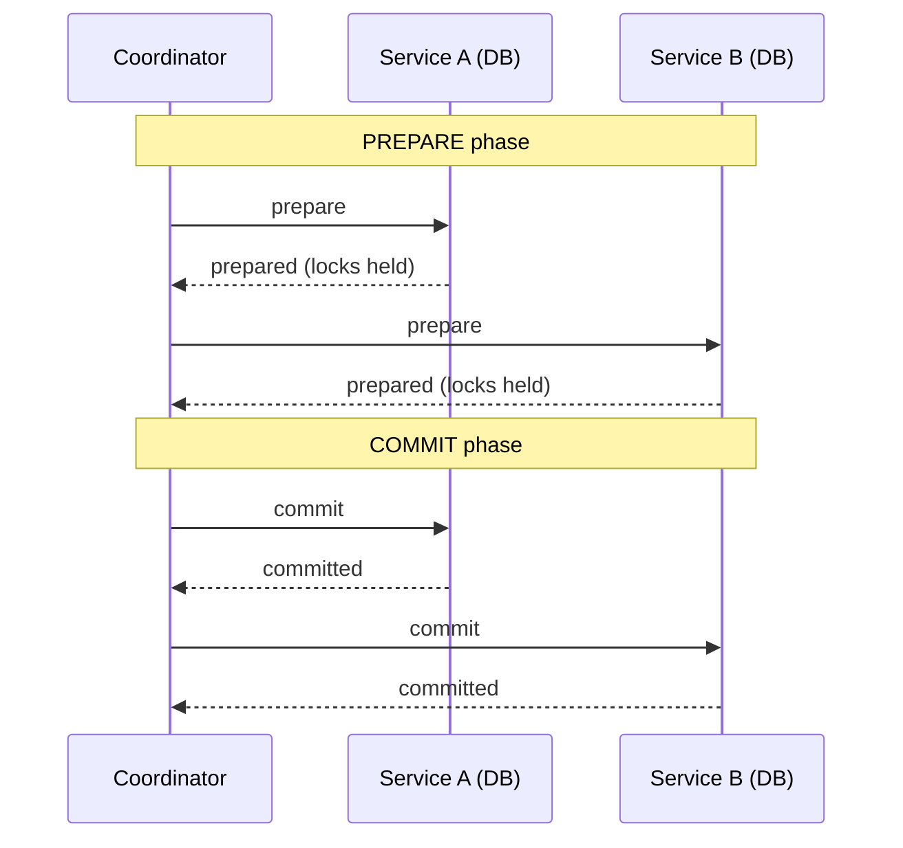
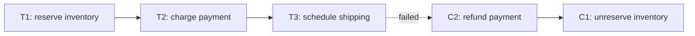
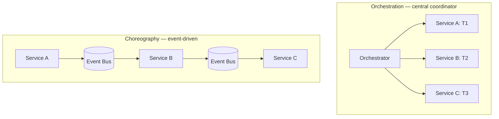
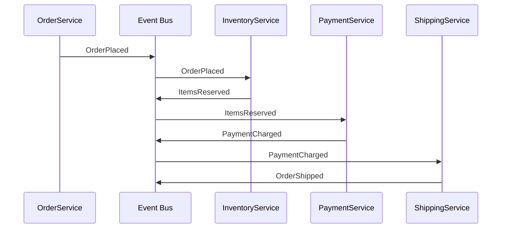
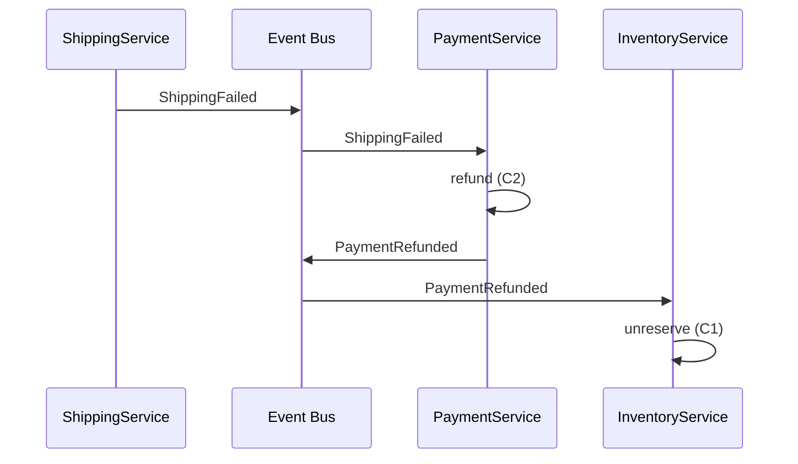

# Saga Pattern (Distributed Transactions)

A single ACID transaction inside one database is the easiest correctness mechanism in computing — you wrap multiple writes in `BEGIN/COMMIT`, and either they all happen or none do. The moment your business operation has to coordinate writes across **multiple services with separate databases** (the normal microservices state), that mechanism is gone. Across services, there is no transaction — A and B have separate connection pools, separate write-ahead logs, separate clocks. The traditional answer, **two-phase commit (2PC)**, is theoretically beautiful and operationally hostile: it requires a coordinator, blocks participants holding locks during the prepare phase (so a coordinator crash can lock the database for hours), and scales poorly with participant count. **2PC is essentially never used between independently-owned microservices**, despite the fact that "distributed transaction" as a phrase usually conjures it.

The **saga pattern** is the pragmatic answer. A saga is a sequence of *local* transactions — each one ACID inside its own service — where each step has a **compensating transaction** that semantically undoes it if a later step fails. Place an order: reserve inventory (local tx), charge payment (local tx), schedule shipping (local tx). If shipping fails, *compensate* — refund the payment (a new local tx), unreserve the inventory (another new local tx). The system is never atomically consistent across services — there are observable moments where the order is paid but unshipped, or where inventory is unreserved but the payment refund is in flight — but it is *eventually* consistent, and each individual service's data remains valid by its own rules.

The depth bar here is **how sagas actually run**, what the failure modes are, and why "compensation" is *semantically* different from "rollback." We trace orchestrated sagas (a central coordinator drives the steps) and choreographed sagas (each service emits events that the next service reacts to) — when each is the right choice, what their failure modes look like, and what tooling each uses (Temporal, Camunda, AWS Step Functions, Axon for orchestration; Kafka events for choreography). We tackle the hard semantic problems: an isolated step that *can't be compensated* (sending an email is irreversible), the **isolation anomalies** that 2PC prevents but sagas don't (a "dirty read" of an order that's about to be cancelled), the **lost-update** race conditions when two sagas compete. We name the real systems and the real failure modes — Uber's Cadence/Temporal birth, the Airbnb saga incidents, the famous "compensating transaction failed to compensate" production stories that taught the industry to design sagas as carefully as it once designed ACID transactions. By the end you will design a saga that handles the four canonical failure modes (step fails, compensation fails, network drops mid-step, timeout mid-step), choose between orchestration and choreography on engineering grounds, refuse the saga for use cases that should have stayed inside a single service, and know precisely why "we'll use 2PC" is the wrong instinct.

> [!NOTE]
> Prerequisites: [Microservices Decomposition](./T05-microservices-decomposition.md), [Service Communication](./T06-service-communication-sync-vs-async.md), [DDD](./T03-domain-driven-design-ddd.md) (aggregates as the local-transaction unit). See also [C02/T06 — Distributed Transactions](../C02-distributed-systems-and-system-design/T06-distributed-transactions-2pc-saga.md) for the deeper distributed-systems mechanics (2PC, Paxos commit, the FLP impossibility result); this topic is the architecture/operational view.

## Where The Saga Pattern Came From — A 1987 Database Paper Reborn

Of all the patterns in this chapter, the saga has the most curious origin: it was **invented in 1987** by Hector Garcia-Molina and Kenneth Salem for a *completely different problem* (long-running database transactions on mainframes), forgotten for two decades, and then **rediscovered around 2007** as the solution to microservices' distributed-transaction problem. The rediscovery is one of the field's clearest examples of an old idea finding new relevance in a new context.

### The Original 1987 Paper

[*Sagas*](https://www.cs.cornell.edu/andru/cs711/2002fa/reading/sagas.pdf) (Garcia-Molina & Salem, ACM SIGMOD 1987) addressed a specific problem: **long-lived transactions in a mainframe DBMS**. In the 1980s, certain business transactions ran for hours or days — a quarterly accounting close, a large batch reconciliation, a complex underwriting workflow. These transactions held database locks for their entire duration, blocking other transactions and producing operational paralysis.

The paper's proposal: break the long transaction into a sequence of *short* transactions T₁, T₂, ..., Tₙ. Each short transaction commits independently. If any Tᵢ fails, the system runs compensating transactions C₁, C₂, ..., Cᵢ₋₁ to *semantically* (not transactionally) reverse the earlier work.

The paper was modest in scope. The authors did not imagine microservices (which didn't exist) or distributed systems at internet scale (which was rare). They were solving a specific mainframe problem. The paper was cited a few hundred times in academic database literature through the 1990s and 2000s but had little industrial influence.

### Who Hector Garcia-Molina Was

**Hector Garcia-Molina** (1953–2019) was a Stanford CS professor and one of the foundational figures in database systems research. He advised Sergey Brin and Larry Page during the early Google days; the original Google PageRank work was conducted under his advisorship. His database textbook (Ullman, Garcia-Molina, Widom — *Database Systems: The Complete Book*) is one of the canonical graduate-level database texts.

Garcia-Molina's 1987 saga paper was one piece in a productive academic career; he died in 2019, before the saga pattern's full industrial maturity but after seeing its rediscovery.

### The 2007–2014 Rediscovery

The saga's path from forgotten 1987 paper to industry pattern took roughly two decades, with several waypoints:

- **2007**: as Amazon and eBay deployed early microservices, engineers encountered the cross-service-atomicity problem. The naive answers (2PC across services, distributed locks) failed in production. Some teams reinvented compensation-based patterns without naming them.
- **2011**: Clemens Vasters (Microsoft, working on Azure Service Bus) wrote about [*Sagas in Distributed Systems*](https://vasters.com/clemensv/), explicitly referencing the 1987 paper.
- **2014**: Chris Richardson started the [microservices.io](https://microservices.io/) site that became the canonical microservices pattern catalogue. The saga pattern was one of the first he documented.
- **2017**: Chris Richardson's *Microservices Patterns* book (Manning, 2018) gave the saga its definitive modern articulation.
- **2018**: Uber's *Cadence* (later open-sourced as **Temporal**) provided the first production-grade workflow engine for orchestrated sagas in the JVM world.

By 2020, saga was *the* canonical answer to "how do I do cross-service transactions in microservices?" The original 1987 paper had been retrofitted into the microservices vocabulary.

### Chris Richardson And The Saga Vocabulary

**Chris Richardson** is a Boston-based consultant who became one of the most influential voices on microservices in the late 2010s. His [microservices.io](https://microservices.io/) catalog documented the patterns most teams adopted (Database per Service, API Gateway, Saga, Event Sourcing, etc.). His *Microservices Patterns* book (2018) became the most-cited microservices reference after Sam Newman's books.

Richardson's specific contribution to saga was **codifying the two implementation styles**: **orchestrated** (central coordinator drives the saga) and **choreographed** (each service emits events; the next reacts). This binary captured the operational choice teams faced and made the pattern actionable.

### Temporal And The Workflow-Engine Renaissance (2017+)

The most significant 2017+ development was the rise of **workflow engines** that made orchestrated sagas dramatically easier:

- **Temporal** (founded 2019 by Maxim Fateev, ex-Uber Cadence team): the dominant cross-language workflow engine. Write saga logic as normal sequential code; the engine handles durability, retries, recovery.
- **AWS Step Functions** (2016): serverless workflow with declarative state machines.
- **Camunda** (open source since 2013): BPMN-based workflows with strong .NET/Java support.

These engines turned what was previously bespoke saga code (each team writing its own coordinator) into infrastructure (the engine handles the saga; the team writes the steps). Adoption of Temporal in particular has been explosive: by 2024, it backs major sagas at Uber, Coinbase, Stripe, Snap, Yelp, and hundreds of other companies.

## Why Sagas, Specifically: The Senior Engineer's Q&A

### Q1: Why can't we just use 2PC?

Three structural problems with 2PC at the microservices scale:

1. **The coordinator is a single point of failure**. When the coordinator crashes between prepare and commit, all participants are *blocked* holding locks, waiting for the coordinator to recover. In production microservices with N services and frequent failures, the lock-hold time becomes unbounded. (Detail: [C02/T06](../C02-distributed-systems-and-system-design/T06-distributed-transactions-2pc-saga.md).)

2. **Modern stores don't support XA**. The X/Open XA specification (1991) requires participants to implement specific protocol steps. PostgreSQL has limited XA support; MongoDB, DynamoDB, Cassandra, Elasticsearch, Kafka have none. Without participant support, 2PC cannot be implemented.

3. **The lock-hold time amplifies contention**. A 2PC transaction across 3 services locks rows in 3 databases for the duration of the transaction. Other transactions touching any of those rows must wait. Throughput craters under load.

The saga avoids all three by **abandoning distributed atomicity** in exchange for **eventual consistency with compensation**.

### Q2: What was the lived experience that motivated rediscovering sagas?

A pattern that played out at multiple companies in 2007–2015: a team adopts microservices for the modularity benefits, then encounters cross-service writes (place order → reserve inventory → charge payment → schedule shipping). They try:

1. **Synchronous chain with retry** — every step is a synchronous HTTP call; failures retry. Works for happy path; falls over with partial failures because a "charge payment" that succeeded but had its response lost is permanently lost.

2. **2PC with XA** — fails because the heterogeneous stores don't support it (one team had Cassandra; another had MongoDB; payments was through Stripe).

3. **Best-effort with reconciliation** — accept inconsistency and fix it later with a reconciliation job. Works but the inconsistency window is uncomfortable.

4. **Saga with compensation** — encode the failure flow explicitly. Each step has a compensation. The compensation runs on failure.

Option 4 was the only one that actually worked at scale, and rediscovering the saga pattern gave it a name.

### Q3: How does the saga compare to other distributed-transaction approaches?

| Approach | Atomicity | Latency | Operational Cost | When |
|----------|-----------|---------|------------------|------|
| **2PC / XA** | Strong | High | Very high | Trusted single-team perimeter; XA-capable stores |
| **3PC** | Strong (theoretical) | Higher | Even higher | Almost never used in practice |
| **Paxos Commit** | Strong | High | Very high | Inside managed distributed DBs (Spanner) |
| **TCC (Try-Confirm-Cancel)** | Eventual | Medium | Medium | Operations with natural reservation semantics |
| **Saga (orchestrated)** | Eventual | Medium | Medium | Most cross-service modern microservices |
| **Saga (choreographed)** | Eventual | Medium | Medium-high | Event-driven systems |
| **Best-effort + reconcile** | None | Low | Low | Non-critical operations where occasional inconsistency is acceptable |

The senior judgment: pick the right cell based on (a) whether the operation can be safely partially-completed and reversed, (b) whether participant stores support XA, (c) whether the team can operate a workflow engine.

### Q4: What does "compensation" mean exactly, and why is it weird?

Compensation is **semantic reversal**, not transactional rollback. The distinction is sharp and consequential.

A transactional rollback in a relational database *erases* the change — the row reverts to its pre-update state with no trace (except in the WAL).

A saga compensation produces a *new* transaction that *semantically reverses* the previous one. The original action is *still recorded*; the compensation is also recorded. The history shows both. Specifically:

- A `Charge` saga step charges the customer's card.
- The `ChargeCompensation` is a *refund*, not an erasure. The customer's statement shows both the charge and the refund. The bank's books reflect both.

This is a feature, not a bug: it makes the system *auditable*. But it requires that **every compensable operation has a meaningful compensation**. Some operations don't:

- Sending an email cannot be compensated (you can send another email, but the first is in the recipient's inbox).
- Calling an external API that physically dispatched a truck cannot be compensated (the truck is already moving).

The saga's design constraint: **place uncompensatable operations *last* in the sequence**, after all compensable operations have completed. This way, if the uncompensatable step fails, you compensate the earlier compensable steps. If the uncompensatable step succeeds, everything else has already succeeded.

### Q5: Why is orchestration vs choreography the central design choice?

Because it determines *where the saga logic lives* and *how the team coordinates on it*.

**Orchestrated saga**: the workflow logic lives in *one place* (the orchestrator). The team that owns the orchestrator owns the cross-service flow. Pros: explicit, debuggable, easy to reason about. Cons: the orchestrator becomes a coupling point — the orchestrator team needs to know about every downstream service.

**Choreographed saga**: each service reacts to events from others. There is *no single place* the workflow lives — it emerges from the event subscriptions. Pros: decoupled, no single team owns the flow. Cons: the workflow is *implicit*, scattered across N services; debugging requires correlating logs across services.

The senior judgment: orchestration when there's a clear primary team for the flow (e.g., order placement is "owned" by the order team) and the flow has explicit failure modes that require coordinated compensation. Choreography when the flow is genuinely decoupled (an order being placed should trigger inventory, billing, notifications independently, without an order-team coordinator).

Most mature companies use **both** in different parts of the system.

## The Mechanism In Depth — Why Idempotency Is Required, Not Optional

The saga abstraction looks simple. The mechanical implementation has several non-obvious requirements.

### Why Every Step Must Be Idempotent

A saga step may execute *more than once*: the network call may timeout (caller thinks it failed, retries; first attempt actually succeeded). The orchestrator may crash mid-step and recover, replaying the step. **Without idempotency, a single saga can charge the customer twice.**

Idempotency in saga steps is typically implemented via:
- **Idempotency keys**: the caller generates a key; the callee dedupes on the key. Stripe's [Idempotency-Key header](https://stripe.com/docs/api/idempotent_requests) is the canonical example.
- **Sequence numbers**: each step has a monotonic sequence; the callee tracks the last-seen sequence per saga.
- **Natural idempotency**: the operation is naturally idempotent (e.g., "set status to PAID" is idempotent; "increment counter" is not).

The senior rule: **no saga step ships without an idempotency mechanism**. This is non-negotiable.

### Why Compensations Must Also Be Idempotent

A compensation may also execute more than once: the saga's recovery mechanism might re-run a compensation that already ran but whose acknowledgment was lost. **A compensation that's not idempotent can charge the refund twice.**

The pattern is the same: idempotency keys on compensations, sequence numbers, natural idempotency.

### Why Saga State Must Be Persisted Transactionally

If the orchestrator crashes mid-saga, it must resume from where it left off — without losing track of which steps completed and which haven't. This requires **transactional persistence of saga state** alongside the step's local transaction.

In Temporal, this is handled automatically: the workflow's event log is persisted to Cassandra/MySQL, and on recovery, the workflow replays its history to reconstruct state.

In hand-rolled sagas, this is the *most-skipped* mechanical detail. Teams write sagas without durable state, and orchestrator crashes leave sagas in inconsistent states that require manual intervention to clean up.

### Why Choreographed Sagas Risk Distributed Cycles

In choreography, the workflow emerges from event subscriptions. A subtle failure mode: an event triggers another event, which triggers another, which (incorrectly) loops back to the first. The result: an infinite event loop.

The defenses:
- **Saga-level visibility**: a distributed tracing system that shows the full event graph per saga.
- **Loop detection**: services refuse events that have already been processed for the same saga.
- **Bounded retries**: events have a retry count; after N, they go to a DLQ.

The senior practice: instrument every choreographed saga with distributed tracing from day one.

## Common Misconceptions Explained

### "Sagas are eventually-consistent, so they're worse than ACID."

False. **Sagas are eventually-consistent in a specific, controlled way**: each saga eventually reaches a globally-defined end state (all-committed or all-compensated). The intermediate states are explicit and observable. ACID transactions across services are *not an option*, so the comparison is moot — sagas vs nothing-works.

### "Sagas only work for happy paths."

False. The defining feature of sagas is the *compensation* path. If your saga doesn't handle compensations carefully, you don't have a saga; you have a synchronous chain that fails badly.

### "Choreography is just events; orchestration is just calls."

Half true. Both *can* use either communication mechanism. Orchestration can use events (the orchestrator subscribes to step-completion events). Choreography can use synchronous calls (each service synchronously calls the next). The distinction is *who owns the flow logic*, not *what protocol is used*.

### "Sagas require event sourcing."

False. Sagas are a transaction-coordination pattern; event sourcing is a persistence pattern. They compose well but are independent.

### "Temporal/Camunda magically solves the saga problem."

Half true. Workflow engines handle the *plumbing* (durability, retries, recovery) but you still must design *what* the steps and compensations are. The workflow engine doesn't tell you whether a step is idempotent or whether a compensation actually compensates.

### "Sagas guarantee eventual consistency."

Half true. Sagas guarantee that the *saga reaches a defined end state*. They do not guarantee that *all downstream observers see the same state*. If a customer service crashes mid-saga and recovers later, it may see an intermediate state for a window. The application must tolerate this.

## Why ACID Across Services Is Not An Option

Inside one database, the transaction manager guarantees atomicity, consistency, isolation, durability. Across services, *none* of those guarantees hold for free. A naive attempt to make them hold uses 2PC:



The promise: atomicity across A and B. The price:

1. **The coordinator is a single point of failure** — if it crashes between prepare and commit, A and B both hold prepared transactions with locks. They cannot make progress; they cannot abort. The "in-doubt" state persists until the coordinator recovers (or a human intervenes).
2. **The locks block every other transaction** trying to touch the same rows. A 30-second 2PC across three services means 30 seconds of held locks.
3. **The prepare phase requires participant cooperation** — A and B must implement the XA protocol or equivalent, which most modern databases support poorly (PostgreSQL has limited XA support; MongoDB, DynamoDB, Elasticsearch, Cassandra have none).
4. **It scales poorly** — every participant adds a round trip; failure probability multiplies.

Production reality: **2PC across microservices is essentially never used.** The few systems that try (some bank cores, some legacy enterprise stacks) live with the operational pain. The industry consensus, codified by Hector Garcia-Molina and Kenneth Salem in their 1987 paper "Sagas," is to abandon distributed atomicity and embrace **compensated eventual consistency**.

## What A Saga Is

A saga is a sequence of local transactions T₁, T₂, …, Tₙ, where each Tᵢ has a compensating transaction Cᵢ. If all Tᵢ succeed, the saga succeeds. If Tₖ fails, the system runs Cₖ₋₁, Cₖ₋₂, …, C₁ in reverse order to semantically undo the earlier steps.



Crucial properties:

- Each Tᵢ is **a local ACID transaction** inside its service. No cross-service locking.
- Each Cᵢ is **a separate local ACID transaction** that semantically reverses Tᵢ.
- Between Tᵢ and Tᵢ₊₁, the system is **in an intermediate state** observable to other transactions. This is the saga's key trade-off: no isolation.
- The system reaches eventual consistency: either all forward steps succeed, or all completed steps are compensated.

### Why "Compensation" Is Not "Rollback"

This is the subtlety. An ACID rollback *erases* the work — the database state reverts as if the transaction never happened. A saga compensation does *not* erase the work; it produces a new transaction whose effect *semantically reverses* the original.

Concrete consequence: between T₂ (charge payment) and C₂ (refund), the world has observed the charge. The customer saw it on their statement. The credit card network has the transaction. The compensation can issue a refund but cannot make the original charge un-happen — it can only produce a matching reverse charge. There are now **two transactions on the customer's account** (charge + refund), not zero, and a moment in time during which someone could have seen only the charge.

This semantic difference is the source of most saga complexity:

- **Some operations cannot be compensated.** Sending an email can't be unsent. Sending an SMS can't be unsent. Calling an external API that *physically* dispatched a truck can't be undone. Sagas that include irreversible steps must put those steps either *first* (so they happen only if everything else has succeeded) or *last* (after all other steps have committed).
- **Compensation can fail.** The refund attempt itself can fail (network drop, payment gateway down). The saga must retry the compensation, possibly indefinitely, and have a manual-intervention path for permanent failure.
- **The system is observable mid-saga.** A query in the middle of a saga sees inconsistent state. Sagas tolerating this is a business decision, not just a technical one.

## Two Patterns — Orchestration And Choreography



### Orchestrated Sagas

A central coordinator (the *orchestrator*) drives the saga by calling each service in turn and reacting to results. It maintains the **saga state** — which steps have completed, which is in progress, which failed — and decides what to do next.

```java
public class PlaceOrderSaga {
  private final InventoryService inv;
  private final PaymentService pay;
  private final ShippingService ship;
  private final SagaRepository sagaRepo;

  public void run(PlaceOrderCommand cmd) {
    SagaState state = SagaState.start(cmd);
    sagaRepo.save(state);

    try {
      var reservation = inv.reserve(cmd.items());      // T1
      state.markReserved(reservation.id());
      sagaRepo.save(state);

      var payment = pay.charge(cmd.method(), cmd.total());  // T2
      state.markPaid(payment.id());
      sagaRepo.save(state);

      var shipment = ship.schedule(cmd.address(), reservation.id());  // T3
      state.markShipped(shipment.id());
      sagaRepo.save(state);

      state.markComplete();
      sagaRepo.save(state);

    } catch (PaymentFailed e) {
      compensateReservation(state);
      state.markFailed("payment failed");
      sagaRepo.save(state);
    } catch (ShippingFailed e) {
      compensatePayment(state);
      compensateReservation(state);
      state.markFailed("shipping failed");
      sagaRepo.save(state);
    }
  }

  private void compensatePayment(SagaState state) {
    pay.refund(state.paymentId());     // C2
    state.markRefunded();
    sagaRepo.save(state);
  }
  private void compensateReservation(SagaState state) {
    inv.unreserve(state.reservationId());  // C1
    state.markUnreserved();
    sagaRepo.save(state);
  }
}
```

The `SagaState` (a row in a database) is the durable record. After each step, the orchestrator saves the new state, so a crash mid-saga can be recovered by reading the state and resuming.

**Pros**: explicit; debuggable (one place owns the logic); easy to reason about the saga as a whole.

**Cons**: the orchestrator becomes a service that knows about every downstream service; high coupling concentrated in one place; the orchestrator team's velocity gates everything.

### Choreographed Sagas

No central orchestrator. Each service emits an event when its step completes (success or failure); the next service in the saga reacts to that event.



On failure, the failing service emits a failure event; upstream services react with their compensating transactions:



**Pros**: services are decoupled; each owns its own compensation logic; new participants subscribe without changing existing code.

**Cons**: the overall flow is *implicit* — to understand "what happens when an order is placed," you have to read every subscriber. Debugging requires distributed-tracing discipline. Hard to verify the saga is correct as a whole.

### Choosing

| | Orchestration | Choreography |
|---|---|---|
| Flow visibility | Explicit | Implicit |
| Coupling | Concentrated in orchestrator | Distributed across services |
| Change cost | Touches orchestrator | Touches one service |
| Failure handling | Centralized | Distributed |
| Best for | Critical paths with known shape | Many independent reactions |
| Tooling | Temporal, Camunda, Axon, Step Functions | Kafka, RabbitMQ, NATS |

Many mature systems use **both**: orchestration for the critical, evolving flows (place order); choreography for the broad fan-out (notify analytics, send confirmation, update recommendations).

## Saga State And Durability

A saga that crashes mid-flight must be recoverable. The state lives somewhere persistent:

- **Database row(s)** keyed by saga instance ID. Each step updates the row with what's been done. A scheduler scans for incomplete sagas and resumes them.
- **Event-sourced saga state**: a stream per saga where each step is an event. The orchestrator re-derives state by replaying events.
- **Workflow engines' built-in state** (Temporal, Camunda, Step Functions): the engine persists state for you; the application code is just the steps.

The discipline is **save state after every step**. Don't try to be clever ("save every other step"); the cost of an extra DB write per step is dwarfed by the recovery complexity of a sparse state record.

## Tooling — How Sagas Are Actually Run

A short field guide.

### Temporal (formerly Cadence — Uber, 2017)

**Temporal** is a workflow engine purpose-built for orchestrated sagas. Workflow code looks like normal sequential code; Temporal handles state persistence, retries, timeouts, recovery, and human intervention.

```java
@WorkflowInterface
public interface PlaceOrderWorkflow {
  @WorkflowMethod
  void placeOrder(PlaceOrderCommand cmd);
}

public class PlaceOrderWorkflowImpl implements PlaceOrderWorkflow {
  private final InventoryActivities inv = Workflow.newActivityStub(InventoryActivities.class);
  private final PaymentActivities   pay = Workflow.newActivityStub(PaymentActivities.class);
  private final ShippingActivities  ship= Workflow.newActivityStub(ShippingActivities.class);

  @Override
  public void placeOrder(PlaceOrderCommand cmd) {
    String reservation = inv.reserve(cmd.items());
    try {
      String payment = pay.charge(cmd.method(), cmd.total());
      try {
        ship.schedule(cmd.address(), reservation);
      } catch (Exception e) {
        pay.refund(payment);
        throw e;
      }
    } catch (Exception e) {
      inv.unreserve(reservation);
      throw e;
    }
  }
}
```

Reads like normal code. The magic: Temporal records every activity call's input and output; when the workflow worker dies, the workflow is re-played on another worker using the recorded history, and execution resumes exactly where it left off. The developer never has to write a state machine — the code *is* the state machine, and Temporal makes it durable.

Temporal is the canonical 2024–2026 choice for orchestrated sagas in Java. Born at Uber (as Cadence), now an independent open-source project with substantial commercial backing.

### Camunda (BPMN-based)

**Camunda** is a workflow engine using BPMN (Business Process Model and Notation, a visual standard from business-process management). Sagas are modeled as flowcharts; engineers implement the steps as Java services.

Pros: visual, comprehensible by business stakeholders; standard notation.
Cons: BPMN has a learning curve; the visual model can drift from the implementation.

Camunda is widely used in enterprise contexts (banks, insurance) where BPMN is the lingua franca.

### AWS Step Functions

**Step Functions** is AWS's serverless workflow engine. Sagas are defined in JSON (Amazon States Language); each step invokes a Lambda or another AWS service.

Pros: serverless, integrates with AWS natively, no infrastructure.
Cons: AWS lock-in; debugging is harder than Temporal; cost per state transition.

### Axon (CQRS + Saga Together)

Axon Framework's `@Saga` annotation marks classes that implement choreographed sagas via event handlers. Used in Java/Spring shops already on Axon for CQRS+ES.

### Hand-Rolled

For simple sagas, a `SagaState` table + a `@Scheduled` resumer + clear step methods is enough. Temporal is overkill for two-step sagas. **Start hand-rolled; reach for Temporal when the third or fourth saga starts duplicating infrastructure.**

## The Four Failure Modes And How To Handle Them

A saga's robustness lives in how it handles failures. The four canonical modes:

### 1. A Step Fails

Tₖ fails (the service throws, returns an error, times out). The orchestrator (or the next service in choreography) initiates compensation: Cₖ₋₁, Cₖ₋₂, …, C₁.

**Handling**: clear failure semantics. Every step's success/failure must be unambiguous — a timeout means "we don't know," which is treated as failure (with idempotent retry to disambiguate).

### 2. A Compensation Fails

Cₖ fails. Now you have a saga that can neither complete nor compensate cleanly. The system is in a *stuck* state.

**Handling**: retry the compensation indefinitely (with exponential backoff); after N retries, escalate to a human or a dead-letter queue. **Compensations must be idempotent** — retrying must not produce double effects (a refund retried 5× must produce one refund, not five).

### 3. A Step Times Out / Network Drops Mid-Step

The orchestrator sent T₃ but never heard back. Did the service receive it? Did it run? Did it commit? The orchestrator doesn't know.

**Handling**: every step must be **idempotent** — receiving the same command twice produces the same result. The orchestrator retries the step (with the same idempotency key). The service deduplicates ([C02/T07](../C02-distributed-systems-and-system-design/T07-idempotency-and-deduplication.md)) and returns the result of the original execution.

### 4. The Orchestrator Itself Crashes

Between T₂ committing in the orchestrator's state record and the orchestrator returning to invoke T₃, the orchestrator dies.

**Handling**: durable state + a recoverer that picks up the saga where it left off. Temporal makes this transparent; hand-rolled sagas need an explicit scheduler that scans for in-flight sagas and resumes them.

## Isolation Anomalies — What Sagas Cannot Prevent

ACID's "I" (isolation) prevents anomalies like dirty reads and lost updates. **Sagas give up isolation.** Three consequences:

### Dirty Reads

Between T₂ (`PaymentCharged`) and T₃ (`OrderShipped`), a query against the order returns `PAID`. If T₃ fails and compensation runs, the order ends up `CANCELLED`. The reader saw `PAID` for an order that never paid. Their downstream action (sending a "thank you" email, updating their dashboard) is now wrong.

**Mitigation**: design queries to be defensive — distinguish "paid and shipped" from "paid but not yet shipped." Use intermediate statuses (`PAID_PENDING_SHIPMENT`) that explicitly say "in flight."

### Lost Updates

Two sagas modify the same aggregate concurrently. Both read the same starting state; both write back. Without optimistic concurrency control on the aggregate, one update overwrites the other.

**Mitigation**: optimistic concurrency (`version` column on aggregates); reject conflicting updates; the losing saga retries from fresh state.

### Non-Repeatable Reads

A long-running saga reads the customer's email at T₁, uses it at T₃. Between those reads, the customer changed their email. The saga acts on stale data.

**Mitigation**: pass the value through the saga; don't re-read.

## Real Stories — Where Sagas Have Worked And Failed

### Uber → Cadence → Temporal

Uber's 2014–2016 microservices proliferation hit the saga problem head-on; the team built **Cadence** as their internal workflow engine, eventually open-sourced and (as the core team left) re-spun as **Temporal** in 2019. The pattern: ride matching is a saga (find driver, accept, dispatch, monitor, complete, settle); compensation for each step is well-defined. Cadence/Temporal grew from this specific need.

**Lesson**: sagas at scale demand purpose-built workflow engines. The hand-rolled approach decays as the number of sagas and failure-modes grows.

### Airbnb's Reliability Push

Airbnb publicly documented their move from informal sagas to a Temporal-based workflow engine for booking flows. The drivers: too many inconsistent reservations between guest charges and host notifications; manual reconciliation taking ops time.

**Lesson**: even well-designed informal sagas reach a complexity ceiling; workflow engines pay back the investment in a fraction of the lost-state-debugging time.

### "Compensation Failed To Compensate"

Many production incidents (mostly not publicly documented) have the same shape: a compensation attempted but failed to compensate cleanly. A refund attempt that hit a payment gateway error; the system marked it "refunded" but no refund actually occurred. The state lied. The customer was charged. The compensation needed to be compensated.

**Lesson**: every compensation must check whether it actually compensated. Treat "we asked for a refund" and "a refund happened" as separate states. Reconcile.

### The "Saga With Irreversible Email" Anti-Pattern

A saga: validate order, send confirmation email, charge payment, ship. The email is step 2. The charge fails at step 3. Compensation: well, the email already went out, so the customer thinks they have an order. Now compensation has to *send a second email* explaining the cancellation. The "compensation" is making promises about future emails the system might or might not send.

**Lesson**: irreversible steps go *last* (after all the reversible work has committed), or are wrapped in a deliberate undoable shim ("we promised, but actually we'll only really send if we don't get a cancel within 30 seconds").

## When Not To Use Sagas

Three cases where sagas are the wrong tool:

1. **The "saga" lives inside one aggregate.** A multi-step operation on a single Order aggregate doesn't need a saga — it's just one local transaction. Sagas exist because cross-service or cross-aggregate atomicity is impossible; intra-aggregate transactions don't have the problem.
2. **The compensation isn't real.** If the operation cannot be meaningfully compensated (send-email, send-SMS, dispatched-truck), structure the system to avoid needing a saga across that boundary, or design the irreversible step to fail safely.
3. **Strong consistency is non-negotiable** (e.g., regulatory). Some operations genuinely need 2PC or single-database-with-aggregates. Sagas' tolerated inconsistency may be unacceptable.

For everything else where a business operation crosses services — orders, bookings, transfers, registrations — sagas are the right tool.

## Cross-Language Notes

| Ecosystem | Saga tooling |
|-----------|--------------|
| **Java / Spring** | Temporal (canonical), Camunda, Axon `@Saga`, hand-rolled |
| **C# / .NET** | MassTransit Sagas, NServiceBus Sagas, Temporal-dotnet |
| **Go** | Temporal-go (first-class), bespoke |
| **TypeScript / Node** | Temporal-typescript, Conductor |
| **Python** | Temporal-python, Celery for choreographed simple sagas |
| **Elixir** | Commanded sagas, GenServer-based bespoke |

Temporal has rapidly become the cross-language canonical choice. It supports SDKs in Java, Go, TypeScript, Python, .NET, PHP, Ruby — a saga's workflow can be written in any of them, with activities (steps) in others. This polyglot capability is one of the few things Temporal does that hand-rolled cannot.

## Trade-Off Summary

| Concern | 2PC | Orchestrated saga | Choreographed saga | No transaction (best effort) |
|---------|:---:|:----------------:|:-----------------:|:-----------------------------:|
| Atomicity | ✓ (theoretical) | ✗ (eventual) | ✗ (eventual) | ✗ |
| Isolation | ✓ | ✗ | ✗ | ✗ |
| Latency | High (round trips) | Medium | Medium | Low |
| Operational complexity | Very high | Medium | Medium | Low |
| Failure handling | Coordinator blocks | Compensation | Compensation | Lost work |
| Visibility | Locks observable | Saga state observable | Distributed | None |
| Suitable for microservices | No (impractical) | **Yes** | **Yes** | Rarely (sometimes for audit logs) |

> [!INTERVIEW]
> A common L5 prompt: "Why not just use 2PC?" Strong answers explain (a) the coordinator single-point-of-failure problem, (b) lock-hold time, (c) participant-protocol cost, (d) why most modern data stores don't support XA. And: "How do you handle a saga step that can't be compensated (like a sent email)?" — strong answers reorder the saga to put irreversible steps last, or wrap them in deliberate delay-and-confirm patterns.

## Deeper Dive — Complete Orchestrated Saga in Spring Boot

### Saga State Machine

```java
@Entity
@Table(name = "saga_state")
public class SagaState {
    @Id
    private UUID sagaId;
    
    @Enumerated(EnumType.STRING)
    private SagaType type;
    
    @Enumerated(EnumType.STRING)
    private SagaStatus status;
    
    @Type(JsonType.class)
    @Column(columnDefinition = "jsonb")
    private Map<String, Object> context;
    
    @Type(JsonType.class)
    @Column(columnDefinition = "jsonb")
    private List<CompensationStep> compensationStack;
    
    private Instant startedAt;
    private Instant lastUpdatedAt;
    private int version;
    
    @Version
    private Long optimisticLockVersion;
}

public enum SagaStatus {
    STARTED,
    EXECUTING_STEP,
    COMPENSATING,
    COMPLETED,
    FAILED_COMPENSATED,
    FAILED_INCONSISTENT
}

public record CompensationStep(
    String stepName,
    Map<String, Object> data
) {}
```

### Orchestrator Implementation

```java
@Service
public class OrderSagaOrchestrator {
    private final SagaStateRepo sagaRepo;
    private final InventoryService inventoryService;
    private final PaymentService paymentService;
    private final ShippingService shippingService;
    private final NotificationService notificationService;
    private final SagaEventPublisher eventPublisher;

    public CompletableFuture<OrderResult> placeOrder(PlaceOrderRequest req) {
        SagaState saga = startSaga(SagaType.PLACE_ORDER, req);
        return executeSaga(saga);
    }

    @Transactional
    private SagaState startSaga(SagaType type, Object initialData) {
        SagaState saga = new SagaState();
        saga.setSagaId(UUID.randomUUID());
        saga.setType(type);
        saga.setStatus(SagaStatus.STARTED);
        saga.setContext(Map.of("request", initialData));
        saga.setCompensationStack(new ArrayList<>());
        saga.setStartedAt(Instant.now());
        saga.setLastUpdatedAt(Instant.now());
        
        return sagaRepo.save(saga);
    }

    private CompletableFuture<OrderResult> executeSaga(SagaState saga) {
        return CompletableFuture.supplyAsync(() -> {
            try {
                // Step 1: Reserve inventory
                ReservationResult reservation = executeStep(
                    saga,
                    "reserve-inventory",
                    () -> inventoryService.reserve(extractItems(saga.getContext())),
                    result -> new CompensationStep(
                        "release-inventory",
                        Map.of("reservationId", result.reservationId())
                    )
                );

                // Step 2: Charge payment
                ChargeResult payment = executeStep(
                    saga,
                    "charge-payment",
                    () -> paymentService.charge(extractAmount(saga.getContext())),
                    result -> new CompensationStep(
                        "refund-payment",
                        Map.of("chargeId", result.chargeId())
                    )
                );

                // Step 3: Schedule shipping
                ShipmentResult shipment = executeStep(
                    saga,
                    "schedule-shipping",
                    () -> shippingService.schedule(extractShippingDetails(saga.getContext())),
                    result -> new CompensationStep(
                        "cancel-shipment",
                        Map.of("shipmentId", result.shipmentId())
                    )
                );

                // Step 4: Send notification (irreversible - put LAST)
                notificationService.sendOrderConfirmation(
                    extractCustomerId(saga.getContext()),
                    reservation.orderId()
                );

                // Mark complete
                markSagaComplete(saga, reservation.orderId());
                return OrderResult.success(reservation.orderId());

            } catch (SagaStepFailureException e) {
                compensate(saga, e);
                return OrderResult.failed(e.getMessage());
            }
        });
    }

    private <T> T executeStep(SagaState saga,
                               String stepName,
                               Supplier<T> action,
                               Function<T, CompensationStep> compensationBuilder) {
        log.info("Executing step {} for saga {}", stepName, saga.getSagaId());
        
        try {
            T result = action.get();
            
            // Record compensation BEFORE marking step complete
            saga.getCompensationStack().add(compensationBuilder.apply(result));
            saga.setStatus(SagaStatus.EXECUTING_STEP);
            saga.setLastUpdatedAt(Instant.now());
            sagaRepo.save(saga);
            
            eventPublisher.publishStepCompleted(saga.getSagaId(), stepName, result);
            return result;
            
        } catch (Exception e) {
            log.error("Step {} failed", stepName, e);
            eventPublisher.publishStepFailed(saga.getSagaId(), stepName, e.getMessage());
            throw new SagaStepFailureException(stepName, e);
        }
    }

    @Transactional
    private void compensate(SagaState saga, SagaStepFailureException originalFailure) {
        saga.setStatus(SagaStatus.COMPENSATING);
        sagaRepo.save(saga);

        // Execute compensations in REVERSE order
        List<CompensationStep> reversedStack = new ArrayList<>(saga.getCompensationStack());
        Collections.reverse(reversedStack);

        for (CompensationStep step : reversedStack) {
            try {
                executeCompensation(step);
                eventPublisher.publishCompensationCompleted(saga.getSagaId(), step.stepName());
            } catch (Exception compensationError) {
                // Compensation failed - this is bad
                log.error("CRITICAL: compensation {} failed for saga {}", 
                    step.stepName(), saga.getSagaId(), compensationError);
                
                saga.setStatus(SagaStatus.FAILED_INCONSISTENT);
                sagaRepo.save(saga);
                
                eventPublisher.publishSagaInconsistent(saga.getSagaId(), step.stepName());
                alertOpsTeam(saga, step, compensationError);
                throw new SagaCompensationFailureException(saga.getSagaId(), step, compensationError);
            }
        }

        saga.setStatus(SagaStatus.FAILED_COMPENSATED);
        saga.setLastUpdatedAt(Instant.now());
        sagaRepo.save(saga);
    }

    private void executeCompensation(CompensationStep step) {
        switch (step.stepName()) {
            case "release-inventory" -> {
                UUID reservationId = (UUID) step.data().get("reservationId");
                inventoryService.releaseReservation(reservationId);
            }
            case "refund-payment" -> {
                UUID chargeId = (UUID) step.data().get("chargeId");
                paymentService.refund(chargeId);
            }
            case "cancel-shipment" -> {
                UUID shipmentId = (UUID) step.data().get("shipmentId");
                shippingService.cancel(shipmentId);
            }
            default -> throw new IllegalStateException("Unknown compensation: " + step.stepName());
        }
    }
}
```

### Saga Recovery on Crash

```java
@Component
public class SagaRecoveryScheduler {
    private final SagaStateRepo sagaRepo;
    private final OrderSagaOrchestrator orchestrator;

    @Scheduled(fixedDelay = 60_000)   // every minute
    public void recoverIncompleteSagas() {
        // Find sagas that started > 5 minutes ago and aren't terminal
        Instant cutoff = Instant.now().minus(Duration.ofMinutes(5));
        List<SagaState> stuck = sagaRepo.findByStatusNotInAndLastUpdatedAtBefore(
            List.of(SagaStatus.COMPLETED, SagaStatus.FAILED_COMPENSATED, SagaStatus.FAILED_INCONSISTENT),
            cutoff
        );

        for (SagaState saga : stuck) {
            log.warn("Recovering stuck saga: {}", saga.getSagaId());
            
            switch (saga.getStatus()) {
                case STARTED, EXECUTING_STEP -> {
                    // Resume execution from last known state
                    orchestrator.resumeSaga(saga);
                }
                case COMPENSATING -> {
                    // Continue compensation
                    orchestrator.resumeCompensation(saga);
                }
            }
        }
    }
}
```

## Deeper Dive — Choreographed Saga with Spring + Kafka

### Producer (Order Service)

```java
@Service
public class OrderService {
    private final OrderRepo orderRepo;
    private final KafkaTemplate<String, Object> kafka;

    @Transactional
    public Order create(PlaceOrderRequest req) {
        Order order = orderRepo.save(new Order(req, OrderStatus.PENDING));
        
        // Publish event - other services react
        kafka.send("order-events", order.id().toString(),
            new OrderCreatedEvent(order.id(), req.items(), req.customerId()));
        
        return order;
    }
}
```

### Inventory Service Reacts

```java
@Service
public class InventoryEventHandler {
    private final InventoryService inventoryService;
    private final KafkaTemplate<String, Object> kafka;

    @KafkaListener(topics = "order-events")
    public void on(OrderCreatedEvent event) {
        try {
            ReservationResult reservation = inventoryService.reserve(event.items());
            
            kafka.send("inventory-events", event.orderId().toString(),
                new InventoryReservedEvent(event.orderId(), reservation.reservationId()));
                
        } catch (InsufficientInventoryException e) {
            kafka.send("inventory-events", event.orderId().toString(),
                new InventoryReservationFailedEvent(event.orderId(), e.getMessage()));
        }
    }
}
```

### Payment Service Reacts

```java
@Service
public class PaymentEventHandler {
    private final PaymentService paymentService;
    private final KafkaTemplate<String, Object> kafka;

    @KafkaListener(topics = "inventory-events")
    public void on(InventoryReservedEvent event) {
        try {
            ChargeResult charge = paymentService.charge(getAmount(event.orderId()));
            
            kafka.send("payment-events", event.orderId().toString(),
                new PaymentChargedEvent(event.orderId(), charge.chargeId()));
                
        } catch (PaymentFailedException e) {
            // Trigger compensation: release inventory
            kafka.send("payment-events", event.orderId().toString(),
                new PaymentFailedEvent(event.orderId(), e.getMessage()));
        }
    }
}
```

### Compensation Handler

```java
@Service
public class CompensationEventHandler {
    private final InventoryService inventoryService;

    @KafkaListener(topics = "payment-events")
    public void on(PaymentFailedEvent event) {
        // Compensation: release the inventory that was reserved
        UUID reservationId = lookupReservationId(event.orderId());
        inventoryService.releaseReservation(reservationId);
        
        log.info("Released inventory for failed order {}", event.orderId());
    }
}
```

## Deeper Dive — Temporal Implementation (Modern Way)

```java
@WorkflowInterface
public interface OrderWorkflow {
    @WorkflowMethod
    OrderResult placeOrder(PlaceOrderRequest req);
}

public class OrderWorkflowImpl implements OrderWorkflow {
    
    private final InventoryActivities inventoryActivities = 
        Workflow.newActivityStub(InventoryActivities.class,
            ActivityOptions.newBuilder()
                .setStartToCloseTimeout(Duration.ofSeconds(30))
                .setRetryOptions(RetryOptions.newBuilder()
                    .setMaximumAttempts(3)
                    .build())
                .build());
    
    private final PaymentActivities paymentActivities = 
        Workflow.newActivityStub(PaymentActivities.class,
            ActivityOptions.newBuilder()
                .setStartToCloseTimeout(Duration.ofSeconds(30))
                .build());

    @Override
    public OrderResult placeOrder(PlaceOrderRequest req) {
        // Reserve inventory
        ReservationResult reservation = inventoryActivities.reserve(req.items());
        
        // Saga step with compensation
        Saga saga = new Saga(new Saga.Options.Builder().build());
        try {
            saga.addCompensation(() -> 
                inventoryActivities.release(reservation.reservationId()));
            
            // Charge payment
            ChargeResult charge = paymentActivities.charge(req.amount());
            saga.addCompensation(() -> 
                paymentActivities.refund(charge.chargeId()));
            
            // Schedule shipping
            ShipmentResult shipment = shippingActivities.schedule(req.address());
            saga.addCompensation(() -> 
                shippingActivities.cancel(shipment.shipmentId()));
            
            return new OrderResult(reservation.orderId());
            
        } catch (Exception e) {
            saga.compensate();   // Temporal handles all compensation
            throw e;
        }
    }
}

// Activities are just regular methods
public class InventoryActivitiesImpl implements InventoryActivities {
    @Override
    public ReservationResult reserve(List<OrderItem> items) {
        // Implementation
        return inventoryRepo.reserve(items);
    }
}
```

**Why Temporal**: handles all the hard parts (state persistence, retries, compensations, recovery) automatically. Used by Uber, Snap, Stripe.

## Deeper Dive — Avoiding the Irreversible Step Problem

### The Problem

```
SAGA STEPS:
  1. Reserve inventory     - Reversible (release)
  2. Charge payment        - Reversible (refund)
  3. Send confirmation email  - IRREVERSIBLE
  4. Schedule shipping     - Reversible (cancel)

PROBLEM: If step 4 fails after step 3, you've sent an email confirming
the order, but you need to compensate. You can't "unsend" the email.

You'd have to send: "Sorry, we cancelled the order we just confirmed."
That's a terrible UX.
```

### Solution 1: Reorder

```
BETTER SAGA STEPS:
  1. Reserve inventory     - Reversible
  2. Charge payment        - Reversible
  3. Schedule shipping     - Reversible
  4. Send confirmation email  - LAST (only after everything else succeeds)
```

### Solution 2: Delay + Confirm

```java
@Service
public class NotificationScheduler {
    
    public void scheduleConfirmation(OrderId orderId, Duration delay) {
        // Queue a delayed email
        delayedQueue.enqueue(
            new SendConfirmationEmailTask(orderId),
            delay
        );
    }
    
    @Scheduled(fixedDelay = 1000)
    public void processQueue() {
        List<DelayedTask> ready = delayedQueue.pollReady();
        for (DelayedTask task : ready) {
            Order order = orderRepo.findById(task.orderId());
            if (order.status() == OrderStatus.CONFIRMED) {
                emailService.sendConfirmation(order);
            }
            // If status changed to CANCELLED during delay, don't send
        }
    }
}

// In saga:
// Step 1-3: reserve, charge, ship
// Step 4: notificationScheduler.scheduleConfirmation(orderId, Duration.ofMinutes(5))
// If compensation happens within 5 min, email never sent
```

### Solution 3: Quarantine Period

```
For really critical operations:
- Order placed but stored as PENDING
- 10-minute "cooling off" period
- If no cancellation during that time, send confirmation
- This is how Amazon "delivery in 30 seconds" works at low volumes
```

## Deeper Dive — Saga Anti-Patterns

### Anti-Pattern 1: Single-Service "Saga"

```
SCENARIO: One service with multiple DB tables uses a "saga"

WHY IT'S WRONG:
  - You have @Transactional - use it!
  - Sagas exist for CROSS-service consistency
  - Within one service: ACID is available
```

### Anti-Pattern 2: Cross-Saga Coupling

```
SCENARIO: Saga A waits for events from Saga B

WHY IT'S WRONG:
  - Creates tight coupling
  - Failure in B blocks A
  - Hard to reason about

BETTER: explicit handoff with idempotency
```

### Anti-Pattern 3: Silent Failures

```
SCENARIO: Compensation fails, saga marked "complete" anyway

WHY IT'S WRONG:
  - System ends up inconsistent
  - No one knows about the inconsistency
  - Customer service learns about it from customer

BETTER: 
  - Mark saga FAILED_INCONSISTENT
  - Alert ops team
  - Don't proceed silently
```

### Anti-Pattern 4: No Saga State Persistence

```
SCENARIO: Saga state in memory only

WHY IT'S WRONG:
  - Service crash = saga lost forever
  - No recovery possible
  - System left in unknown state

BETTER: persist saga state to durable storage with each step
```

### Anti-Pattern 5: Sequential When Parallel Works

```
SCENARIO: All saga steps run sequentially even when independent

WHY IT'S WRONG:
  - Adds unnecessary latency
  - Misses parallel opportunities

BETTER: identify independent steps, run in parallel
  Example: send notification email AND schedule shipping in parallel
```

## Deeper Dive — Real Saga Implementations

### Uber: Cadence/Temporal Adoption

```
USE CASE: Trip lifecycle (rider request → driver match → pickup → drop-off → payment)
SCALE: Billions of trips/year
APPROACH:
  - Cadence (their open-source version of what became Temporal)
  - Each trip is a workflow
  - State persisted to Cassandra
  - Activities are independent services (matching, payment, etc.)

RESULTS:
  - 99.99% reliability
  - Easy to add new steps
  - Automatic recovery from crashes
  - Visualization of in-flight workflows
```

### Netflix: Conductor

```
USE CASE: Content encoding pipeline (upload → transcode → CDN distribute → notify)
SCALE: Thousands of new pieces of content daily
APPROACH:
  - Conductor (their open-source orchestrator)
  - JSON-defined workflows
  - Task workers can be any language

RESULTS:
  - Decoupled workflow definition from execution
  - Easy to add new workflow types
  - Visibility into in-flight workflows
```

### Stripe: Saga for Payments

```
USE CASE: Payment intent lifecycle (require_payment_method → require_confirmation → 
  processing → succeeded/canceled)
SCALE: Trillions in payment volume
APPROACH:
  - Hand-rolled state machines
  - Strong idempotency
  - Compensation = refunds
  - All state persisted

RESULTS:
  - 99.9999% reliability
  - Compensations are themselves auditable
  - Customer service can replay events
```

## Practice

1. **Design a saga.** For a "transfer money between accounts at two banks" operation, design the saga: list the steps, the compensations, and the failure modes for each.
2. **Hand-write the orchestrator.** Implement a hand-rolled orchestrator in Spring for a simple 3-step saga. Include durable state, retries, and compensation. Identify what Temporal would replace.
3. **Spot the unsanctioned 2PC.** In any system you know, find a multi-service operation that requires "both must succeed or both must fail." Determine whether the team is (a) using 2PC (rare), (b) using a saga, (c) using best-effort and accepting inconsistency.
4. **Compensation design exercise.** Take a real business operation in your domain. Write the compensation for each step. Identify any step whose compensation is *semantic but not real* (i.e., produces an apology, not an undo).
5. **Choreography from orchestration.** Take an orchestrated saga and rewrite it as choreographed events. Identify what's harder, what's easier, and what becomes invisible.
6. **Isolation anomaly hunt.** For an in-flight saga, write a query that returns the order state. Identify three intermediate states the query could observe; for each, describe what downstream action would be wrong.
7. **Temporal evaluation.** Adopt Temporal for one saga in a test environment. Compare the developer experience to your hand-rolled version. Identify what Temporal does for you that you didn't realize you needed.
8. **The irreversible step.** For a saga that includes "send confirmation email," redesign so that compensation doesn't produce a "we cancelled what we said we'd do" follow-up. Where does the email go now?
9. **Compensation failure handling.** Inject a fake failure into a compensation step (the refund API returns an error). Walk the system through: what happens? Where does the state end up? Who notices? Improve the handling.
10. **The skeptic conversation.** A senior engineer says "let's just use 2PC; it's simpler." Write a 200-word response that takes the position seriously, names the specific failures they're underestimating, and proposes the saga as the better alternative.

## Recap

You should now be able to:

- Explain why **2PC across microservices is impractical** — coordinator single-point-of-failure, lock-hold time, protocol cost, missing XA support in modern stores.
- Define a **saga** as a sequence of local transactions, each with a **compensating transaction**, achieving eventual consistency without distributed atomicity.
- Distinguish **compensation** from **rollback** — compensation is a semantic reversal, not an erasure; some operations cannot be cleanly compensated.
- Choose between **orchestrated** and **choreographed** sagas by flow visibility, coupling, change cost, and team structure.
- Handle the **four failure modes**: step fails, compensation fails, network drop / timeout, orchestrator crash.
- Address **isolation anomalies** — dirty reads, lost updates, non-repeatable reads — through intermediate statuses, optimistic concurrency, and value passing.
- Choose tooling: **Temporal** (canonical orchestration), **Camunda** (BPMN), **AWS Step Functions** (serverless), **Axon Saga** (Java + CQRS), **hand-rolled** for simple cases.
- Refuse sagas where they don't apply — single-aggregate operations, unreversible operations placed badly, strong-consistency-required regulatory contexts.
- Place Java/Spring saga tooling in **cross-language context** and recognize Temporal as the canonical 2024–2026 polyglot choice.
- Cite real systems and incidents — **Uber → Cadence → Temporal, Airbnb's workflow migration**, the "compensation failed to compensate" anti-pattern — and the lessons each carries.

## Next

Continue to [Strangler Fig & Migration Patterns](./T11-strangler-fig-and-migration-patterns.md) — the patterns for safely evolving systems over time: extracting from monoliths, migrating between technologies, replacing legacy without big-bang risk.
