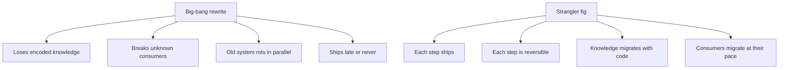
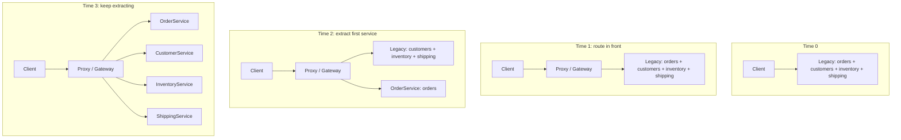
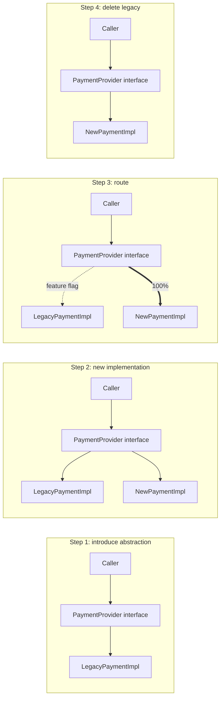
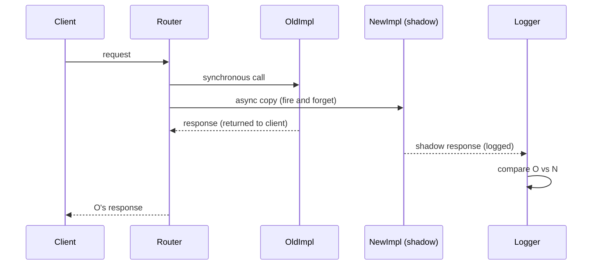
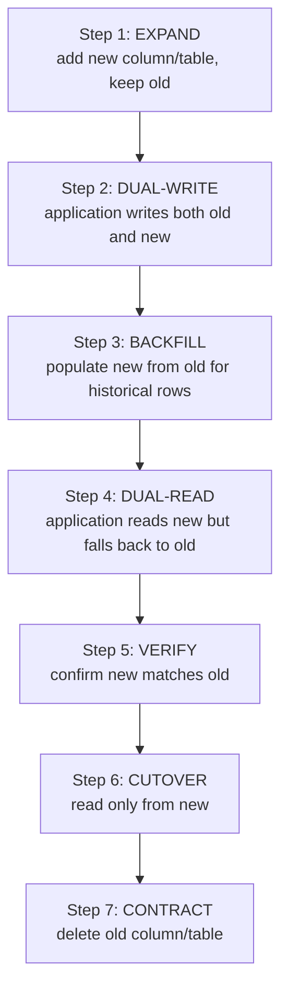
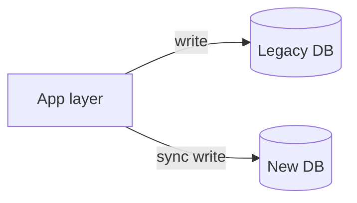
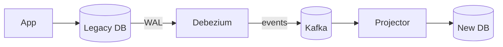

# Strangler Fig & Migration Patterns

The single most expensive way to modernize a software system is to **rewrite it from scratch**. The track record is consistent and decades long: the "two-year rewrite" ships at four years (if at all), accumulates bugs the original system had already fixed and re-encounters edge cases the original system had already discovered, ships without the legacy system's quiet integrations and undocumented behaviors that production depended on, and is announced as "done" while a parallel team grudgingly keeps the original alive because too many things still depend on it. Joel Spolsky's 2000 essay "Things You Should Never Do, Part I" enumerated this pattern using the example of Netscape's 1998 rewrite, which arguably handed the browser market to Internet Explorer. The lesson is older than Joel — Frederick Brooks's *The Mythical Man-Month* in 1975 made the same point — and it has been re-learned dozens of times since.

The **strangler fig pattern**, named by Martin Fowler in 2004 after the fig tree that grows around a host trunk until the host is dead inside, is the standard alternative. It runs the *new* system alongside the *old*, gradually shifting responsibility from old to new, until the old is empty and can be removed. **At every moment of the migration, the system is working**: no big bang, no flag day, no Saturday-night cutover where 200 engineers stand by a "switch." The cost is more total engineering time on paper — the migration *takes longer* than the imagined rewrite would have — but the cost is *paid out over months in small, reversible commits* rather than concentrated in a high-risk cutover that often doesn't happen.

The depth bar here is **the specific mechanisms**: how do you actually route traffic from the old system to the new (proxy, feature flag, API gateway), how do you migrate the data (dual-write, backfill, expand-contract), what *kinds* of migration patterns sit inside the strangler-fig umbrella (parallel run, dark launch, branch by abstraction), and how do you avoid the well-named failure mode where a strangler-fig migration gets stuck halfway and lives forever as a *two-system steady state*. We trace the real migrations — Airbnb's Rails-to-SOA from 2018, eBay's three-rewrites story, Shopify's monolith-to-modular evolution, the Amazon "two-pizza team" decomposition over a decade — and the failure modes that produced the most expensive rewrites in industry history. By the end you will plan a strangler-fig migration of a non-trivial monolith, sequence the patterns (parallel run for confidence, branch by abstraction for safety, expand-contract for schemas), defend incrementalism against pressure for a clean rewrite, and recognize the three regimes where the strangler fig is *not* the right pattern.

> [!NOTE]
> Prerequisites: [Microservices Decomposition](./T05-microservices-decomposition.md) — what you are extracting; [Monolith vs Microservices](./T04-monolith-vs-microservices-vs-modular-monolith.md) — what to extract toward; [Service Communication](./T06-service-communication-sync-vs-async.md) — the routing mechanisms. This topic assumes a target architecture has been chosen; the question is how to get there safely.

## Where The Strangler Fig Came From — Martin Fowler's 2004 Travel Insight

The strangler fig pattern is one of the most directly-named patterns in software engineering. **Martin Fowler** literally encountered the *Ficus aurea* (strangler fig tree) in Queensland, Australia on a family vacation in 2003, and the analogy became the basis for his June 2004 essay [*StranglerFigApplication*](https://martinfowler.com/bliki/StranglerFigApplication.html).

### Who Martin Fowler Is

**Martin Fowler** (born 1963) is a British software developer, author, and Chief Scientist at ThoughtWorks. He is one of the most influential voices in software architecture of the past 25 years. His major books:

- *Analysis Patterns: Reusable Object Models* (1997) — covered in [T03 of C01](./T03-domain-driven-design-ddd.md).
- *Refactoring: Improving the Design of Existing Code* (1999, second edition 2018) — defined the modern refactoring discipline.
- *Patterns of Enterprise Application Architecture* (2002) — the canonical PEAA book, where patterns like Active Record, Domain Model, Service Layer, Repository, and Unit of Work were codified.
- *Domain-Specific Languages* (2010), with Rebecca Parsons.

Fowler is also a *co-author of the Agile Manifesto* (2001). His [bliki](https://martinfowler.com/bliki/) (blog + wiki) has been the canonical reference for software vocabulary since the early 2000s.

### The Literal Strangler Fig

The strangler fig is a tropical tree (genus *Ficus*) whose seeds germinate in the canopy of an existing tree. The seedling drops aerial roots to the ground, which thicken and eventually surround the host tree. Over decades, the strangler fig's roots fuse and grow into a self-supporting trunk; meanwhile, the host tree dies inside, its bark and wood decomposing, leaving the strangler fig standing in its place — often as a hollow column where the host once stood.

The biological detail Fowler emphasized: **the host tree is alive throughout most of the process**. There is no moment when the host is killed; it's a gradual displacement. The strangler fig doesn't "kill" the host so much as *outcompete* it for sunlight and resources until the host dies of starvation. At any moment during this multi-decade process, an observer sees both trees coexisting.

The software analogy: **a new system grows alongside the legacy system, gradually taking over its responsibilities until the legacy can be safely removed**. At any moment during the migration, both systems are running. The legacy isn't *replaced* in a single event; it's gradually rendered unnecessary.

### Why Fowler Named The Pattern

Fowler had been observing for years that **legacy modernization projects almost always failed when attempted as big-bang rewrites**. He had documented this in numerous client engagements at ThoughtWorks; the failure pattern was so consistent that he was looking for a way to articulate the *alternative* — incremental modernization.

The 2004 essay is short (about 400 words) — Fowler's bliki entries usually are. It describes the analogy, identifies the key benefit ("a working system at every commit"), and contrasts with the rewrite approach.

The essay's significance: **it gave the pattern a name engineers could use in conversation**. Pre-2004, the alternative to rewrites was simply "do it gradually" — a recommendation that didn't survive contact with executives demanding a specific plan. With the strangler fig name and analogy, engineers had a *concrete artifact* (the analogy) to point to.

### The Rewrite Failure Lineage Fowler Was Responding To

The pattern wasn't invented in 2004; it was *named* in 2004. The underlying observation — that big-bang rewrites fail — was older. Specifically:

#### Joel Spolsky's 2000 Essay

**Joel Spolsky's [*Things You Should Never Do, Part I*](https://www.joelonsoftware.com/2000/04/06/things-you-should-never-do-part-i/)** (April 6, 2000) is the canonical statement of the rewrite failure mode. Spolsky used the Netscape rewrite as the central example — Netscape's decision to rewrite their browser from scratch in 1998 led to a 2.5-year gap during which Internet Explorer captured 90%+ market share. By the time the rewrite shipped (Mozilla, eventually Firefox), the browser war was lost.

Spolsky's specific argument:
> "The idea that new code is better than old is patently absurd. Old code has been used. It has been tested. Lots of bugs have been found, and they've been fixed. There's nothing wrong with it. ... When you throw away code and start from scratch, you are throwing away all that knowledge."

This was the *theoretical* basis for Fowler's pattern. Spolsky said "don't rewrite"; Fowler said "here's what to do instead."

#### Fred Brooks's 1975 Book

Earlier still, **Fred Brooks's [*The Mythical Man-Month*](https://en.wikipedia.org/wiki/The_Mythical_Man-Month)** (1975, anniversary edition 1995) coined the **second-system effect**: a developer who has built one system tends to over-engineer the next one, packing in everything they wanted in the first. The second system fails because of over-ambition.

Brooks's specific observation predates rewrites as a concept (1975 was the structured-programming era; rewrites in the modern sense weren't yet a debate). But the underlying psychological insight — that engineers underestimate the complexity of what's been built — explains *why* rewrites consistently fail.

### The Migration-Pattern Catalogue (2018+)

Around 2018, the migration-pattern conversation matured into a *catalogue*:

- **Sam Newman's [*Monolith to Microservices*](https://www.amazon.com/Monolith-Microservices-Evolutionary-Patterns-Transform/dp/1492047848)** (2019, second edition 2024) is the canonical migration-patterns book. Newman documents strangler fig, branch by abstraction, parallel run, decorating collaborator, change data capture — a full taxonomy.

- **Paul Hammant's [*Branch by Abstraction*](https://paulhammant.com/blog/branch_by_abstraction.html)** (2007) named the in-process variant of the strangler-fig pattern — when the migration is at the class level rather than the service level.

- **Various ThoughtWorks essays** documented specific migration tactics: parallel run, dark launching, expand-contract.

The 2024 state of practice: there's a recognized vocabulary for migration patterns, with strangler fig as the umbrella concept and several specific tactics underneath.

## Why The Strangler Fig, Specifically: The Senior Engineer's Q&A

### Q1: Why do rewrites fail so consistently?

Three structural reasons that almost always apply:

1. **The legacy system encodes years of bug fixes and edge cases**: every if-statement is a fix for something that broke in production. A rewrite re-discovers them all (or ships without them and re-introduces the bugs).

2. **The legacy system has undocumented integrations**: other systems, batch jobs, partner APIs depend on it. The rewrite team can audit *known* integrations but not *unknown* ones. Production reveals the gaps painfully.

3. **The team that built the legacy has different incentives than the team rewriting**: the rewrite team gets praise for shipping; the maintenance team gets blame for outages. While the rewrite happens, the legacy degrades. By the time the rewrite is "done," the legacy is in worse shape than when the rewrite started.

These reasons are *structural*, not avoidable. Even with excellent engineers, rewrites consistently fail.

### Q2: How is the strangler fig different from "do it gradually"?

Three specific commitments:

1. **The new system handles real traffic from week one**, even if at 0.001% volume. This forces continuous integration with the production environment.

2. **Every commit leaves both systems in a working state**. There's no "broken transition" period; you can always roll back.

3. **The legacy is decommissioned at the end, not as a step**. The migration doesn't end with both systems running; it ends with only the new system.

These commitments distinguish the strangler fig from vague "incremental" migrations that often become permanent two-system states.

### Q3: What's the canonical failure mode of the strangler fig?

The **stuck strangler**: the migration starts; 20% of traffic moves to the new system; the team gets pulled to other priorities; the migration stalls; *both systems persist forever*. Now there are two systems to maintain, both in production, neither owned.

This is the most common strangler-fig failure. The fix is *committing to completion* — track the migration percentage as a KPI; escalate when it stalls; treat half-finished migrations as worse than the original problem.

Most production "strangler-fig migrations" end stuck at 30–80% complete, with both systems running indefinitely.

### Q4: How does this relate to organizational structure?

The strangler fig requires *continuous engineering capacity allocated to the migration* for its full duration. This means:

- **A team owns the migration** as their primary work, not as a side project.
- **The team has authority to make routing decisions** without negotiating each one.
- **The team can decommission the legacy** when traffic has migrated.

Migrations without dedicated ownership tend to stall. The senior engineer's role: secure the organizational commitment before starting, not just the technical plan.

### Q5: What patterns sit inside the strangler fig umbrella?

Several specific tactics:

- **Branch by Abstraction** (Hammant 2007): introduce an internal abstraction, run both implementations behind it, gradually shift traffic.
- **Parallel Run**: send the same input to both old and new, compare outputs, verify equivalence before flipping.
- **Decorating Collaborator** (Newman 2024): the new service intercepts calls to the old, transparently handling some, forwarding others.
- **Change Data Capture**: stream changes from the legacy database to the new one, keeping them in sync.
- **Event Interception**: the new system listens to events from the old, building its own state.

Each tactic fits different points in the migration. The senior judgment: pick the tactic that matches the specific seam being migrated.

## Common Misconceptions Explained

### "Strangler fig is just rewriting incrementally."

Half true. Strangler fig is *specifically* about *running both systems in parallel* during the transition, with routing logic that moves traffic gradually. Incremental rewriting without parallel operation has the same failure modes as big-bang rewriting.

### "Strangler fig takes longer than a rewrite."

True, in calendar time. The strangler fig *takes longer* but *ships value continuously*. A rewrite has zero shipping for months; the strangler fig has continuous shipping. Total business value delivered is higher with strangler fig.

### "Strangler fig is risk-free."

False. The strangler fig has its own risks: stuck migrations, dual-system maintenance cost, complex routing logic. But the risks are *bounded and recoverable*; rewrite risk is *unbounded and catastrophic*.

### "The strangler fig requires the old and new systems to have identical functionality."

False. The new system can have *expanded* functionality (most do) or *reduced* functionality (deprecating features). The routing logic handles the differences. The key is that the *currently-routed* traffic always lands somewhere that can serve it.

### "Strangler fig is only for microservices."

False. The pattern applies at every level: extracting a class from a monolith (branch by abstraction), migrating a database (expand-contract), replacing a third-party service. The principle — gradual replacement with continuous operation — is universal.

### "Once the migration is done, the strangler fig is gone."

True, ideally. The successful migration ends with only the new system; the legacy is decommissioned. In practice, decommissioning is often skipped — teams move on, the legacy lingers. The senior practice: treat decommissioning as a required step, not optional.

## The Rewrite Trap — Why "Just Start Over" Almost Always Fails

The argument for a rewrite is always compelling: the legacy system is a tangled mess, the new system would be clean, and modern stacks make it "easy." Three reasons the math is wrong:

### 1. The Legacy System Contains Decades Of Knowledge

Every weird if-statement in the legacy system is a bug fix for something that happened in production. The leap-year handling for February 29, 1900 (which isn't a leap year, despite the pattern). The customer ID that used to be a string but has been coerced to an int since 2014. The retry that kicks in only for a specific upstream provider that's been quietly flaky for years. A rewrite either re-discovers all of these (the optimistic case) or ships without them and re-introduces the original bugs (the pessimistic case, which is the actual case).

### 2. The Legacy System Is Connected To Things That Don't Have Source Code

Bank teller machines, mainframe reporting jobs, an Excel spreadsheet a CFO has been emailing for 11 years, a third-party integration whose "documentation" is a 2017 phone call. The rewrite assumes you can audit and recreate every consumer. You can't. The strangler fig lets each consumer migrate at its own pace.

### 3. The Rewrite Team Has Different Incentives Than The Operations Team

The rewrite team ships features and gets praise. The operations team keeps the legacy alive and gets blamed for every outage. The rewrite stretches; the legacy degrades because no one invests in it. By the time the rewrite is "done," the legacy is worse than it was when the rewrite started — and the rewrite has accumulated its own legacy debt.



## The Strangler Fig — The Core Mechanic

The pattern:



Four steps:

1. **Put a router in front.** A proxy / gateway / load balancer / DNS sits between clients and the legacy. All traffic flows through it. The legacy is still doing 100% of the work, but the router now controls who sees what.
2. **Stand up the new component empty.** A new service is deployed with the same external interface as a slice of the legacy. It initially returns errors or routes back through to the legacy — but it exists.
3. **Route some traffic, compare, increase.** A small percentage of traffic goes to the new service. The rest still goes to the legacy. Compare results (parallel run). When confidence is high, increase the percentage. Iterate until 100%.
4. **Decommission the legacy slice.** Once the new service owns 100% of the traffic and the legacy's code is no longer called, delete it.

At every step, the system is working. A bug discovered at step 3 means rolling traffic back to the legacy — no incident, no panic.

## The Sub-Patterns Inside The Strangler Fig

The strangler fig is the umbrella. Specific migration *moves* sit inside it.

### Branch By Abstraction (Paul Hammant, 2008)

When the change you want to make is too big to be a single commit but you can't keep the code on a branch for months, **branch by abstraction** introduces an internal interface (an abstraction) between the callers and the implementation. The new implementation grows behind the same abstraction; callers don't change.



The abstraction is the "router" inside the codebase. Useful when the migration is at a *class* or *module* level rather than a *service* level. Combines naturally with **feature flags** — a runtime toggle decides which implementation handles each call.

### Parallel Run (Sometimes Called "Tee And Verify")

**Parallel run** sends the same input to both old and new implementations, returns the *old* implementation's result to the caller, but *compares* the two results offline and logs discrepancies. The new implementation is shadowed; bugs surface without affecting users.



A team can run parallel-run for weeks, fixing N until it matches O for 99.99%+ of inputs. *Then* swap N to primary. The investment is the comparison logging and the cost of running N — small relative to the confidence delivered.

Stripe's API migration to a new processing engine ran in parallel-run mode for over a year. Airbnb's search ranking changes routinely use parallel-run before flipping.

### Dark Launch (Shadow Traffic)

**Dark launch** is parallel-run focused on *production load*: a new service is invoked under real traffic, but its responses are discarded. The goal is to *load-test* the new service against the real input distribution and *prove operational readiness* (latency, error rate, dependency health) before sending real traffic.

```mermaid
flowchart LR
  C[Client] --> R[Router]
  R --> O[OldService]
  R -.->|"shadow"| N[NewService]
  O --> C
  N -.->|"discarded"| Trash[/dev/null]
```

Used to validate scale, dependencies, latency profile, error patterns. Sometimes called "passive deployment."

### Expand-Contract (Database Schema Migrations)

The most surgical migration pattern, for schema changes that cannot happen in one transaction.



**Example**: changing a column type from `INT customer_id` to `UUID customer_uuid`.

1. **Expand**: `ALTER TABLE orders ADD COLUMN customer_uuid UUID`.
2. **Dual-write**: every new row writes both `customer_id` and `customer_uuid`.
3. **Backfill**: a background job populates `customer_uuid` for historical rows in batches.
4. **Dual-read**: queries try `customer_uuid` first; fall back to `customer_id` lookup for rows where it's missing.
5. **Verify**: monitor for "fallbacks" — if any, the backfill missed rows.
6. **Cutover**: reads use only `customer_uuid`.
7. **Contract**: `ALTER TABLE orders DROP COLUMN customer_id`.

Each step is independently reversible. The system runs continuously. Total time: weeks to months. Total risk: minimal compared to a 4-hour maintenance window.

### Blue-Green Deployment

**Blue-green** is *deployment-time* parallel running: the running "blue" version stays live while the new "green" version is deployed and tested out-of-band. When ready, the router flips traffic to green; if green misbehaves, flip back.

```mermaid
flowchart LR
  subgraph Before
    Router1[Router]
    Blue1[Blue (live, v1)]
    Green1[Green (idle, v2)]
    Router1 --> Blue1
  end
  subgraph After
    Router2[Router]
    Blue2[Blue (idle, v1)]
    Green2[Green (live, v2)]
    Router2 --> Green2
  end
```

Blue-green is the *deployment* analog of strangler fig. Same principle: reversible, gradual, no big-bang.

### Canary Deployment

**Canary** is blue-green with a percentage knob: route 1% of traffic to green; observe; if good, 5%, 25%, 50%, 100%. The name is from coal miners' canaries — the small detector dies first if there's trouble.

Canary is the operational standard for production rollouts; Spring Boot apps deployed on Kubernetes use Argo Rollouts, Flagger, or Istio's traffic splitting for canary. Modern teams *never* do 100% deployments without canary.

## Data Migration — The Quiet Hard Part

Code migration is the visible part; **data migration is where most strangler-fig migrations actually stumble.** The new service needs the old data; producing it without big-bang cutover requires careful coordination.

### Pattern 1: Dual-Write

The legacy continues to be the source of truth; the new service maintains a synchronized copy. As traffic shifts, the new service's copy becomes the source.



The hard part: two writes are not atomic. Either use a transactional outbox + Debezium (clean), accept eventual consistency between the two stores (often fine), or run periodic reconciliation jobs (necessary as a backstop regardless).

### Pattern 2: Change Data Capture (CDC)

Debezium tails the legacy database's WAL (write-ahead log) and replays the changes into the new database. The legacy continues to be the writer; the new database is a streaming replica.



Best for: keeping the legacy untouched (no app changes), while building toward a future cutover.

### Pattern 3: Backfill + Live Sync

For a one-time migration: a backfill job migrates historical data; live sync handles ongoing writes. Cutover happens when the backfill catches up and live sync is verified.

Backfill costs: bandwidth, application slowdown if it shares resources, the need for "this row hasn't been migrated yet" handling during the in-flight period.

## A Real Migration Sequence — A Worked Example

A 12-year-old PHP monolith with one MySQL database. The team wants to extract `customers` into a Spring Boot service backed by Postgres. The sequence:

| Week | Step | What happens |
|------|------|--------------|
| 1 | Stand up router | API gateway in front of monolith; routes all traffic to monolith. |
| 2 | Stand up CustomerService | New Spring Boot service deployed; empty endpoints; no real DB. |
| 3–4 | Build CustomerService basics | `GET /customers/{id}` proxies to monolith (a thin pass-through for now). Build the actual logic next to it. |
| 5 | Expand: add Postgres alongside MySQL | New service has its own DB; monolith still owns truth. |
| 6 | Dual-write from monolith | Every monolith customer-write also writes to Postgres via the new service's API. |
| 7 | Backfill historical | Job copies historical customer rows from MySQL to Postgres. |
| 8 | Verify | Compare row counts, sample values; fix discrepancies. |
| 9 | Dual-read | Monolith reads customer data through the new service; new service tries Postgres first, falls back to MySQL. |
| 10 | Reduce fallback | Track fallback rate; fix until zero. |
| 11 | Shadow customer-read traffic | API gateway sends a copy of customer reads to the new service; compare. |
| 12 | Canary: 1% real customer reads | 1% of `GET /customers/{id}` routes to new service. |
| 13–16 | Ramp to 100% | 5%, 25%, 50%, 100% over weeks. |
| 17 | Switch writes | Monolith's customer-write path delegates to new service (instead of dual-writing). |
| 18 | Decommission MySQL customer tables | After observation window, drop the tables. |
| 19 | Monolith customer code deleted | Slim down the monolith. |

The migration takes 4–5 months. The system is live every single day. Any step can be rolled back to the prior state. The team is doing other feature work in parallel.

Compare to the alternative: a 4–5 month full rewrite that would have shipped at month 9 with new bugs, broken integrations, and a parallel monolith no one has been maintaining.

## Real Migrations — Lessons From Production

### Airbnb's Rails To SOA (2018–2020)

Airbnb publicly documented their migration from a monolithic Rails app to a service-oriented architecture. The key choices: identify "core flows" first (booking, search, payments); extract them as services; use strangler-fig routing through a gateway. The migration ran in parallel with feature development. Some flows took 18 months.

**Lesson**: even with a heavily-resourced team, the migration runs in years, and that's fine if features ship throughout.

### Shopify's Monolith Evolution (Ongoing)

Shopify famously runs one of the largest Rails monoliths in the world. Their approach: instead of microservices, they evolved toward a **modular monolith** ([T04](./T04-monolith-vs-microservices-vs-modular-monolith.md)) with strict component boundaries — a strangler-fig migration within a single deployable. Pods (modules) own areas; cross-pod calls go through interfaces.

**Lesson**: the strangler fig doesn't have to lead to microservices. It can lead to a better-organized monolith.

### Amazon's Decomposition Over A Decade

Amazon's transition from a single retail monolith to the famous "thousands of services" took roughly 2002–2012. Driven by the "two-pizza team" mandate, each team extracted its area into a service when ready. There was no Big Day; the migration was a continuous program.

**Lesson**: strangler fig at organizational scale takes a decade. Plan accordingly.

### Netscape (1998) — The Cautionary Tale

Netscape rewrote their browser from scratch (Mozilla / Gecko). The rewrite shipped 2.5 years late. During those years, Internet Explorer captured 90%+ market share. The browser market that Netscape had pioneered was lost. Joel Spolsky's 2000 essay used this as the canonical example.

**Lesson**: in a competitive market, a rewrite is a multi-year vacation from shipping. Competitors don't wait.

### eBay's Three Rewrites

eBay famously rewrote its core three times in the late 1990s and early 2000s — Perl → C++ → Java. Each rewrite *was* successful (it shipped, and the new system was better), but each was a heroic effort that delayed product roadmaps and consumed enormous engineering resources. eBay had the market position to absorb the cost; most companies don't.

**Lesson**: rewrites can succeed when the company has dominance and time. The strangler fig is the technique for everyone else.

## Anti-Patterns

### 1. The Stuck Strangler

The migration starts; 20% of traffic moves; the team gets pulled to other priorities; the dual-system state persists for years. Now there are *two* systems to maintain, both used in production, neither owned by anyone. This is the **most common strangler-fig failure**.

**Prevention**: treat the migration as a single project with a completion date. Track the percentage migrated as a metric on a dashboard. When it stalls, escalate. **A strangler fig that doesn't finish is more expensive than the original problem.**

### 2. The Big-Bang Disguised As Strangler

The team builds the new service for 18 months without integrating; the "strangler" is a one-step cutover at the end. This is a rewrite with strangler-fig vocabulary. All the rewrite risks return.

**Prevention**: integrate from week one. The new service handles real traffic at week one even if it's 0.001%. The discipline of "this code must run in production today" is what produces incremental, low-risk changes.

### 3. Migrating The Wrong Thing First

The team starts by extracting an interesting-but-low-traffic component (the reporting dashboard). After 6 months, the bulk of the legacy is unchanged; the team is exhausted; the value to the business is invisible.

**Prevention**: extract the **highest-pain** or **highest-feature-velocity** area first. Demonstrate business value early. Pick the *load-bearing* component, not the easy one.

### 4. Letting The New System Adopt The Old System's Shape

The team extracts the new service by copying the legacy's database schema, API shape, and conventions. The new system is a microservice clone of the old monolith. Nothing improves.

**Prevention**: the strangler fig is *also an opportunity* to fix design. Apply DDD at the seam ([T03](./T03-domain-driven-design-ddd.md)); design the new bounded context, not the old one. The migration *is* the redesign.

### 5. The Two-Source-Of-Truth Failure

During dual-write, the legacy and new databases diverge — different rules, different validations, different normalization. Reconciliation gets harder over time, not easier. The cutover is delayed indefinitely.

**Prevention**: one source of truth at any moment. During dual-write, the legacy is truth; the new is a replica. The cutover *changes which one is truth*; it doesn't merge them.

## When The Strangler Fig Is Not The Right Pattern

Three regimes:

1. **The system is genuinely small and the rewrite is genuinely days, not months.** A 5,000-line internal tool can sometimes be rewritten in a sprint. The strangler-fig overhead exceeds the rewrite cost.
2. **The legacy is so broken it can't be safely modified.** A system with no tests, no documentation, no live owners — sometimes "do not touch" is the only safe answer. A clean-slate rewrite *with the discipline to preserve every observed behavior* is the only path. Rare.
3. **The legacy is being decommissioned, not replaced.** If the business is shutting down the function, freeze the legacy and don't invest in migration.

For every other case — the 95% case — the strangler fig is the answer.

## Cross-Language Notes

The strangler fig is language-agnostic. The patterns within it have ecosystem-specific tooling:

| Pattern | Java/Spring tooling |
|---------|--------------------|
| Routing | Spring Cloud Gateway, Kong, AWS API Gateway, Nginx, Envoy |
| Feature flags | Unleash, LaunchDarkly, FF4j, Spring Cloud Config, OpenFeature |
| Canary | Argo Rollouts, Flagger, Spinnaker |
| CDC | Debezium (the default for Java), AWS DMS, Kafka Connect |
| Branch by abstraction | Plain Java interfaces + DI |
| Parallel run | Hand-rolled (compare service); some logging platforms (Datadog APM) help |
| Schema migration | Flyway, Liquibase |

The cross-language note is mainly that **Debezium, Kafka, and the open-source service-mesh stack are the modern operational foundation**. Java/Spring teams using these are well-equipped; teams without them are essentially hand-rolling each migration.

## Trade-Off Summary

| Concern | Big-bang rewrite | Strangler fig |
|---------|:----------------:|:------------:|
| Time to first shipment | Long (months to years) | Immediate (week one) |
| Total time | Often longer (re-discovery) | Often longer (per step overhead) |
| Risk | Concentrated at cutover | Distributed across small steps |
| Reversibility | Late (or never) | Each step |
| Feature velocity during migration | Frozen | Maintained |
| Knowledge preservation | Re-discovered | Migrated with the code |
| Cost predictability | Unpredictable | Predictable per step |
| Suitable for production systems | Rarely | Almost always |

> [!INTERVIEW]
> A common L5 prompt: "How would you migrate a 2M-line monolith to microservices?" Strong answers (a) refuse the big-bang rewrite, (b) sketch a strangler-fig sequence with the routing mechanism, (c) include data-migration with expand-contract, (d) name the failure modes (stuck strangler, wrong-thing-first), (e) commit to ship in week one and continuously thereafter.

## Practice

1. **Read your last big project.** Was it a rewrite or a strangler fig? Walk through the actual sequence of commits. How many concentrated big-bang risks were there?
2. **Pick a target.** In any system you know, pick one component you'd extract. Sketch the 6-week strangler-fig plan with the routing, the dual-write, the cutover steps.
3. **Branch by abstraction drill.** Take a class with two callers and one implementation. Introduce an interface; add a second implementation; route via feature flag. Confirm the abstraction adds no behavior on its own.
4. **Expand-contract on a column.** Plan an expand-contract migration for a real column type change (e.g., `VARCHAR` to `JSONB`). Write each of the 7 steps explicitly; estimate the time and risk per step.
5. **Parallel run setup.** For one service call, implement parallel run: send the request to both old and new; return old; compare async. Run for a week; report match rate.
6. **Canary the next deploy.** If your team doesn't canary, set up Argo Rollouts or Flagger for one service. Deploy with 1% → 25% → 100% over 30 minutes. Note what you'd catch.
7. **Stuck-strangler diagnosis.** Find a migration in your organization that's been "in progress" for over a year. Identify why it's stuck and what would unblock it.
8. **CDC pipeline.** Set up Debezium against a Postgres dev database; stream changes into Kafka. Consume them in a new service that maintains a denormalized read model.
9. **The skeptic conversation.** A senior engineer says "let's just rewrite this; the legacy is too messy." Write a 200-word response that takes the position seriously and proposes the strangler fig with a concrete first step.
10. **Migration impact estimation.** For a hypothetical 200K LOC monolith with 8 services to extract, estimate total time and team cost for (a) strangler fig and (b) big-bang rewrite. Compare to the Airbnb / Shopify / Amazon timelines.

## Recap

You should now be able to:

- Articulate why **big-bang rewrites almost always fail** — encoded knowledge, hidden consumers, parallel-team incentives, the consistent multi-decade pattern.
- Apply the **strangler fig** as the standard alternative: route in front, build new alongside, migrate incrementally, decommission the old.
- Apply **branch by abstraction** for in-process migrations: introduce an interface, build the new implementation behind it, route via feature flag.
- Use **parallel run / shadow traffic / dark launch** to build confidence in new implementations under real load before flipping traffic.
- Execute **expand-contract** for database schema changes: add new structures, dual-write, backfill, dual-read, verify, cutover, drop old.
- Deploy with **blue-green** and **canary** patterns to make every deployment incremental and reversible.
- Migrate data with **dual-write, CDC (Debezium), backfill + live sync**, treating dual-source-of-truth as a hazard.
- Recognize and prevent **anti-patterns**: stuck strangler, big-bang disguised as strangler, wrong-thing-first, old-shape-in-new-code, dual-source-of-truth.
- Identify the **three regimes** where a rewrite is the right call and recognize how rare they are.
- Plan a **realistic migration sequence** that delivers business value at every step, takes months to years, and never has a single high-risk cutover.
- Cite **real migrations**: Airbnb's Rails-to-SOA, Shopify's modular evolution, Amazon's decade, Netscape's cautionary tale, eBay's three rewrites.

## Next

Continue to [Twelve-Factor App](./T12-twelve-factor-app.md) — the operational discipline that makes services deployable, scalable, and replaceable. The twelve factors are deceptively simple; their absence is the root cause of more outages than any specific architectural choice.
