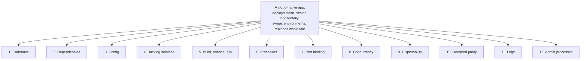

# Twelve-Factor App

The Twelve-Factor App methodology was published in 2011 by Adam Wiggins, co-founder of Heroku, as a synthesis of the patterns that distinguished applications that ran *well* on cloud platforms from those that fought them. At the time, Heroku was the prototype Platform-as-a-Service, hosting thousands of apps written in Rails, Django, Node, Java, Clojure, and Scala; the methodology emerged from watching what kinds of apps succeeded versus what kinds limped, crashed, or were impossible to scale. Fifteen years later, the twelve factors have become **the operational standard for cloud-native software** — adopted explicitly by Spring Boot's defaults, by Kubernetes' design assumptions, by every modern container orchestrator, by every "deploy to production" CI/CD pipeline. **The twelve factors do not feel like architecture — they feel like common sense — and that is the point.** When a system violates one of them, the violation is invisible until it produces a specific class of operational failure that the factor exists to prevent.

The depth bar here is **not the recitation of the twelve factors** — they are documented at <https://12factor.net> in 30 minutes of reading. The depth bar is **what production breaks when each is violated**, the **specific Spring Boot mappings** (Spring's defaults align with most factors; the few that require deliberate choice are worth naming), and the **post-2011 updates** that have aged into the methodology — the so-called "fifteen-factor app" (Kevin Hoffman's 2016 book *Beyond the Twelve-Factor App*) that adds API-first, telemetry, authentication, and other concerns the 2011 list under-emphasized. We trace what each factor actually *means* at the operating-system, container, and JVM level: what "stateless processes" requires of an HTTP session ("don't store it on the heap"), what "logs as event streams" requires of the JVM (`System.out` and `System.err`, not log files), what "concurrency via the process model" looks like for a Java server (multiple JVMs, not threads — and the surprising consequences of that view). We name the production failures that the twelve factors prevent — the config-baked-into-deployable-artifact incident at Knight Capital, the local-files-instead-of-object-store failure mode every junior team rediscovers, the "but the dev environment ran SQLite" deployment that wasted a Saturday. By the end you will audit any Spring service against the twelve factors in twenty minutes, justify each factor's discipline against an "is this really necessary?" challenge, and recognize the failure mode each is structured to prevent.

> [!NOTE]
> Prerequisites: [Monolith vs Microservices](./T04-monolith-vs-microservices-vs-modular-monolith.md). The factors apply to both, but their *value* compounds under microservices (config drift, dependency hell, scaling differences) and shows up sharply under container orchestration.

## Where The Twelve-Factor App Came From — Heroku's 2011 Synthesis

The Twelve-Factor App methodology was published in **late 2011** by **Adam Wiggins**, co-founder of **Heroku**. The methodology synthesized lessons from Heroku's 2007–2011 platform-as-a-service experience — hosting tens of thousands of applications in different languages and watching which patterns made applications succeed vs fail on the platform.

### Who Adam Wiggins And Heroku Are

**Heroku** was founded in 2007 by James Lindenbaum, Adam Wiggins, and Orion Henry. The original product was a *web-based Ruby on Rails IDE* — but the founders quickly realized that the *deployment* experience was the actual breakthrough. By 2008, Heroku had pivoted to **platform-as-a-service** — `git push heroku master` deployed a Rails app to a managed runtime.

Heroku was acquired by Salesforce in December 2010 for $212M, but the engineering team remained independent and continued the work. **The Twelve-Factor methodology was published in late 2011** as a distillation of what Heroku had learned about *which apps thrive on a managed platform*.

**Adam Wiggins** (born ~1978) co-founded Heroku and later went on to co-found **Ink & Switch**, the experimental research lab focused on local-first computing. His current work focuses on tools that respect user autonomy — a thematic continuation of Twelve-Factor's emphasis on operability and portability.

### The Specific Heroku Pain That Motivated It

By 2010, Heroku was hosting thousands of applications in Ruby, Python, Node.js, Java, Clojure, and Scala. The Heroku engineering team noticed a pattern: **applications fell into two clear categories** — those that ran smoothly on the platform and those that fought it constantly.

The smooth-running apps had common properties:
- Configuration came from environment variables, not files.
- Logs went to stdout, not files.
- They didn't write to local disk.
- They started up quickly and could be restarted at will.
- They had no shared in-memory state between instances.

The struggling apps had common anti-patterns:
- Hardcoded database URLs in configuration files.
- Logs written to filesystem paths that didn't exist on Heroku's ephemeral filesystem.
- Session state stored in memory, lost when the dyno restarted.
- Shared filesystem assumptions that broke when scaling out.

The Heroku team had been informally documenting these patterns in customer-success conversations. The Twelve-Factor methodology was the *formalized* version — codified as twelve specific factors with explanations.

### The 2011 Publication

The methodology was published at **<https://12factor.net>** in late 2011 (the exact date varies in sources; the site has been continuously updated). The original twelve factors:

1. **Codebase** — one codebase, many deploys.
2. **Dependencies** — explicitly declare and isolate.
3. **Config** — store config in the environment.
4. **Backing services** — treat as attached resources.
5. **Build, release, run** — strictly separate.
6. **Processes** — execute as one or more stateless processes.
7. **Port binding** — export services via port binding.
8. **Concurrency** — scale out via the process model.
9. **Disposability** — fast startup, graceful shutdown.
10. **Dev/prod parity** — keep environments similar.
11. **Logs** — treat as event streams.
12. **Admin processes** — run as one-off processes.

The brilliance of the methodology: **each factor was independently small and verifiable**. Engineers could audit their applications against each factor in 10–15 minutes. The methodology was *operational*, not aspirational.

### Why It Aligned With The Container Revolution (2013+)

The Twelve-Factor methodology was published in 2011; **Docker was released in March 2013**; **Kubernetes was open-sourced in 2014**. The container revolution happened *after* Twelve-Factor was articulated — but the methodology turned out to be *exactly* what containers required.

Specifically:
- Docker containers have ephemeral filesystems → Factor VI (stateless processes) is mandatory.
- Containers are configured via environment variables → Factor III (config in environment).
- Container orchestrators stop and start containers freely → Factor IX (disposability).
- Container logs are captured from stdout → Factor XI (logs as event streams).

The methodology had been articulated by Heroku engineers solving a 2008–2011 PaaS-hosting problem, but turned out to be the right answer for the 2013+ container era. **Twelve-Factor is widely credited as "the methodology that made containers possible to operate at scale"** — even though it predates Docker.

### Kevin Hoffman's Beyond The Twelve-Factor App (2016)

In 2016, **Kevin Hoffman** (a Pivotal engineer) published [*Beyond the Twelve-Factor App*](https://www.oreilly.com/library/view/beyond-the-twelve-factor/9781492042631/) (O'Reilly, 2016, free PDF version available). Hoffman extended the methodology to fifteen factors:

13. **API First** — design the API before implementation.
14. **Telemetry** — observability is non-negotiable.
15. **Authentication and Authorization** — security is built in.

Plus refinements to several original factors (e.g., codebase becomes "one codebase, one application" — emphasizing that multiple apps in one repo violates the principle).

The 2016 additions reflected the *microservices reality* that emerged after 2014. The original twelve were focused on *single-application operability*; the new three addressed *cross-service concerns*. By 2024, "Twelve-Factor" colloquially includes Hoffman's fifteen.

### Why The Methodology Endures (15+ Years Later)

Most methodologies from 2010-era startup environments are forgotten. Twelve-Factor remains the operational standard because:

1. **It was right**: each factor addressed a real failure mode that hadn't been articulated before.
2. **It was small**: twelve factors fit in one sitting; engineers can internalize the entire methodology.
3. **It was concrete**: each factor was specific and testable.
4. **It anticipated containers**: the methodology turned out to be exactly what Docker and Kubernetes required.
5. **It was language-agnostic**: the factors applied to Ruby, Python, Java, Go, Node.js — no preferred stack.

In 2026, "Is your app Twelve-Factor compliant?" remains a meaningful question, asked in code reviews, architecture reviews, and platform-readiness audits.

## Why Twelve-Factor, Specifically: The Senior Engineer's Q&A

### Q1: Why does the methodology endure when so many others have been forgotten?

Because it captures *operational invariants* — properties that hold regardless of language, framework, or platform. Most methodologies (RUP, SCRUM, XP) are *process* methodologies that specify how teams work. Twelve-Factor is an *application* methodology that specifies how applications behave. Applications are the *output* of teams; the output property is more durable than the team process.

### Q2: What did Heroku's pre-Twelve-Factor era look like?

The 2008–2010 Heroku platform had to *force* customers into Twelve-Factor compliance through platform constraints:
- The filesystem was ephemeral, forcing apps to externalize state.
- Logs went to stdout, captured by the platform.
- Environment variables held all config.
- The platform restarted dynos at random, forcing disposability.

Applications that *fought* these constraints had operational problems — sessions lost, logs missing, configuration drift between environments. Applications that *embraced* them ran smoothly.

Twelve-Factor took the operational lessons and made them *prescriptive* rather than *coerced by platform*. Apps could become Twelve-Factor on any platform, anticipating the future of containerization.

### Q3: How does Twelve-Factor relate to microservices?

Each microservice should be individually Twelve-Factor compliant. The methodology's emphasis on *stateless processes* and *backing services as attached resources* means each service can be scaled, restarted, and deployed independently — exactly what microservices require.

Twelve-Factor was *not* specifically about microservices (the term didn't exist when Wiggins wrote the methodology), but it provides the *per-service* operational foundation that microservices rely on.

### Q4: How does Twelve-Factor relate to Cloud Native Computing?

The **Cloud Native Computing Foundation** (CNCF, founded 2015) embraced Twelve-Factor as foundational. The CNCF's [Cloud Native definition](https://github.com/cncf/toc/blob/main/DEFINITION.md) implicitly assumes Twelve-Factor compliance — containers, dynamic orchestration, microservices, declarative APIs.

Modern "cloud-native" applications are essentially Twelve-Factor applications running on Kubernetes. The two methodologies aren't formally linked, but they reinforce each other so completely that they're effectively one body of practice.

### Q5: Are there factors that have aged poorly?

Two minor critiques:

1. **Factor VI (Stateless Processes)** can be too strict for some workloads. Long-running connections (WebSockets), persistent caches, and game-server state genuinely need *in-process* state. Pure Twelve-Factor strictness produces sub-optimal architectures for these.

2. **Factor IX (Disposability)** assumes graceful shutdown is easy. In practice, many applications struggle to gracefully shut down — long-running transactions, in-flight requests, mid-batch processing. The methodology takes graceful shutdown as a given without acknowledging the implementation difficulty.

Both critiques are minor. The core methodology remains robust 15 years later.

### Q6: What's the Java/Spring-specific interpretation?

Spring Boot specifically addresses most Twelve-Factor factors out of the box:

- **Factor III (Config)**: Spring Boot's external configuration (application.properties, environment variables, `@Value`, `@ConfigurationProperties`) directly implements this.
- **Factor VI (Stateless Processes)**: stateless `@Service` beans by default; sessions externalized to Redis is a one-line change.
- **Factor IX (Disposability)**: Spring Boot 2.3+ has built-in graceful shutdown support.
- **Factor XI (Logs)**: Logback/Log4j2 default to stdout-friendly configurations.

The Spring ecosystem's Twelve-Factor alignment is one reason Spring Boot dominates modern Java backend development.

## Common Misconceptions Explained

### "Twelve-Factor requires Heroku or PaaS."

False. The methodology is platform-agnostic. It works on Heroku, Kubernetes, ECS, raw EC2, bare metal. The factors are about *application properties*, not *deployment platform*.

### "Twelve-Factor is just for cloud-native."

Half true. The methodology applies to *any* application, on-premises or cloud. Cloud platforms *reward* compliance more visibly (Heroku, Kubernetes), but on-prem deployments benefit equally.

### "Twelve-Factor is outdated; modern apps don't need it."

False. The methodology remains foundational. Modern *additions* (observability, security, API-first design) extend it but don't replace it.

### "Stateless means in-memory caches are forbidden."

False. **In-memory caches as performance optimizations** are fine. The constraint is that the *correctness* doesn't depend on in-memory state surviving restarts. A cache that can be repopulated from the source of truth is compatible with Twelve-Factor.

### "Twelve-Factor requires one process per container."

False. The methodology doesn't specify container deployment. **Factor VIII (Concurrency via processes)** suggests scaling via more processes, but a single container can run multiple processes if needed (though this is generally discouraged for operational reasons).

### "Logs as event streams means using Elastic/Splunk/Datadog."

False. The factor says *applications write to stdout*. The infrastructure decides where stdout goes. The application doesn't choose; it just writes events. The infrastructure can route to local files (during development) or to centralized log aggregation (in production).

## The Methodology In One Frame

The twelve factors are a checklist with a unifying intent: an app is **cloud-native** if it can be deployed to a fresh environment with no manual setup, replicated horizontally without coordination, configured per environment without code changes, observed without bespoke tooling, and replaced wholesale without losing state. Each factor is a discipline that makes one of those properties hold.



We will go through each, name what it actually requires of a Spring Boot service, and identify what fails when it's violated.

## I. Codebase — One Codebase Tracked In Version Control, Many Deploys

**Rule**: one app = one repository (or one module within a monorepo). One codebase produces *many* deploys (dev, staging, production, EU, US, customer-specific).

**Why**: a deploy is a configuration of a known codebase. If two deploys come from different codebases, there is no source of truth for "what is running where," and bug-fix backports are guaranteed.

**Spring mapping**: trivial — `pom.xml` or `build.gradle` plus a git repo. The discipline is that *one* deployment artifact is built once; different environments get the same JAR with different config.

**What fails when violated**: the prod hotfix that never makes it into the main branch; the staging environment that's 6 commits behind prod; the EU build that quietly diverged after a hotfix. Standard cause of "it worked in staging" mysteries.

## II. Dependencies — Explicitly Declare And Isolate

**Rule**: every dependency is declared in a manifest (Maven `pom.xml`, Gradle build file). No reliance on system-wide packages.

**Why**: an explicit manifest is reproducible; relying on "the Java installed on the server" is not. The same JAR must run identically on developer laptops, CI, staging, and production.

**Spring mapping**: Maven/Gradle plus a **fat JAR** (`spring-boot-maven-plugin`'s repackaging) that contains the application code *and* all its dependencies. No need for the OS to have specific libraries.

**What fails when violated**: the dev-machine deploy that works because the developer happens to have a specific library installed; the production deploy that fails because a transitive dependency has a different patch version on the server.

## III. Config — Store Config In The Environment

**Rule**: anything that differs between environments — database URLs, API keys, log levels, feature flags — lives in **environment variables**. Never committed to the codebase.

**Why**: config in the codebase couples deployments to source changes. Changing a database URL in production should not require a code commit. And — the famous failure mode — a checked-in secret leaks the moment the repo is.

**Spring mapping**: `application.properties` reads from environment variables (`${DATABASE_URL}`). Spring Cloud Config or Kubernetes ConfigMaps + Secrets externalize config from the artifact entirely. **Never check secrets into git.**

```yaml
# application.yml — Spring reads env vars by name
spring:
  datasource:
    url: ${DATABASE_URL}
    username: ${DATABASE_USER}
    password: ${DATABASE_PASSWORD}
```

**What fails when violated**: the Knight Capital incident ([T01](./T01-layered-architecture.md#production-failure-modes--real-incidents-tied-to-layer-violations)) had multiple causes, but configuration of legacy features baked into the deployable was one of them. The GitHub credential-leak class of incidents — `aws_access_key_id` in committed `.env` files — is the canonical recurrent case.

## IV. Backing Services — Treat As Attached Resources

**Rule**: a backing service (database, cache, message broker, email service, third-party API) is identified by a URL in config. Swapping a local PostgreSQL for an Amazon RDS instance requires only changing `DATABASE_URL`.

**Why**: tight coupling to a specific backing service makes swapping painful. The app should not "know" whether the database is on `localhost` or RDS — it just connects to `${DATABASE_URL}`.

**Spring mapping**: connection URLs from environment; the app reaches the service via its driver (PG JDBC, Lettuce for Redis, KafkaProducer); no hard-coded service identity.

**What fails when violated**: the developer who hard-coded `localhost:5432` for development, then learned production wanted a different host *at build time*. Or worse: the application that has hard-coded *certificate paths* to a specific TLS cert that doesn't exist in production.

## V. Build, Release, Run — Strictly Separate

**Rule**: three distinct stages.

- **Build**: source → compiled JAR. Deterministic; reproducible.
- **Release**: JAR + config → a tagged release (a versioned, immutable bundle).
- **Run**: the release is executed in the target environment.

**Why**: separation means rollback is trivial — every release is identified and re-runnable. There is no "fix in production by editing a file" path; changes go through build → release → run.

**Spring mapping**: CI builds the JAR (or Docker image); the deployment tool releases the artifact with environment-specific config; the runtime runs the artifact unchanged.

**What fails when violated**: the prod server with a "small fix" in `application.properties` that no one remembers and no source control records. Eventually, the server is replaced, the fix is lost, and the system breaks in a way no test can catch.

## VI. Processes — Execute As One Or More Stateless Processes

**Rule**: the application is a stateless process. Any state that must persist lives in a backing service (the database, the cache, the object store), not in the process's memory or local filesystem.

**Why**: stateless processes are interchangeable — a new instance can join the cluster instantly; any instance can serve any request. Stateful processes (HTTP sessions in memory, files on disk) bind requests to specific instances and can't scale horizontally.

**Spring mapping**: by default, Spring Boot is stateless. The traps:

- **HTTP session in memory** (`HttpSession`): default Tomcat behavior is in-memory; load-balanced traffic loses sessions when bouncing instances. **Externalize sessions** to Redis via `spring-session-data-redis`, or use stateless JWTs.
- **In-memory caches** (Caffeine, ConcurrentHashMap): fine for derived data, fatal if treated as a source of truth.
- **Local file uploads**: an upload to `/tmp/uploads/` is gone the moment the pod restarts. Use S3 or equivalent.
- **In-memory rate limiters**: each instance counts separately; the effective limit is N × the intended limit. Use Redis or a gateway-level limiter.

**What fails when violated**: the classic "logged in on one instance, can't access from the load balancer's other one" failure; the file uploads that vanish at deploy; the rate limit that's enforced 10× too leniently.

## VII. Port Binding — Export Services Via Port Binding

**Rule**: the app is self-contained — it includes its own web server and listens on a port specified by `$PORT` (or similar). No reliance on an external web server (Apache, IIS) wrapping the app.

**Why**: the app is a unit; how it's reached is the deployment's concern. Anything can route to it — a load balancer, an API gateway, an Istio sidecar — as long as the port is bound.

**Spring mapping**: Spring Boot's embedded Tomcat / Jetty / Undertow does exactly this. `server.port = ${PORT:8080}` reads from environment, defaults to 8080.

**What fails when violated**: this is hard to violate in modern Spring Boot. The legacy form (deploying a WAR to an external Tomcat) is mostly extinct.

## VIII. Concurrency — Scale Out Via The Process Model

**Rule**: scale horizontally by running more processes, not by making each process internally bigger.

**Why**: more processes scale predictably across machines; bigger processes hit memory and locking ceilings. Horizontal scale is also more failure-tolerant — losing one of 100 instances drops 1% of capacity; losing the single fat process drops 100%.

**Spring mapping**: this is where Spring/Java differs slightly from the 12-factor original (written with Unix process forks in mind). In Java, the JVM is itself a heavyweight process; we typically run *multiple* JVMs (one per pod / container), and each JVM uses internal threading. The factor's intent — "scale horizontally by adding instances, not by tuning one giant instance" — applies fully.

**What fails when violated**: the team that scales by giving the one production JVM 64 GB of heap and 96 cores and is then surprised when GC pauses go to 4 seconds. The horizontal scale would have given the same throughput with smaller, more predictable instances.

## IX. Disposability — Maximize Robustness With Fast Startup And Graceful Shutdown

**Rule**: processes start quickly (seconds) and shut down gracefully (drain in-flight requests, commit in-flight work). Crashes are fine — the orchestrator will restart.

**Why**: fast startup means scale-up and recovery are quick. Graceful shutdown means rolling deploys don't drop requests. Both make the system robust to ordinary events (deploys, node failures, autoscaling).

**Spring mapping**: Spring Boot 2.3+ has built-in **graceful shutdown** (`server.shutdown=graceful`) — Tomcat stops accepting new requests and waits for in-flight ones to complete within `spring.lifecycle.timeout-per-shutdown-phase`. Startup time for Spring Boot 3.x is typically 3–8 seconds for a typical service; for the fastest startup, GraalVM native image compilation drops this to 50–200 ms.

**What fails when violated**: deploys that drop requests mid-flight; node failures that cause user-visible errors; "we can't deploy during business hours because we'd lose 30 seconds of orders."

## X. Dev/Prod Parity — Keep Development, Staging, And Production As Similar As Possible

**Rule**: the dev environment uses the same backing services as production. Use PostgreSQL locally, not SQLite. Use Redis locally, not an in-memory map. Use Kafka locally (via Docker Compose), not a fake.

**Why**: the differences are where bugs hide. SQLite supports things PostgreSQL doesn't (and vice versa); the in-memory cache behaves differently from Redis under concurrency; the fake Kafka doesn't reproduce real partitioning behavior. The "works in dev, broken in prod" gap closes when dev and prod are the same shape.

**Spring mapping**: Testcontainers (Spring Boot 3.1+ ships `@ServiceConnection` integration) runs real backing services in Docker for tests and local dev. Modern Java teams in 2026 default to Testcontainers; SQLite or H2 for testing relational queries is increasingly seen as a bug source.

**What fails when violated**: "the query worked on H2; on PostgreSQL it returns different ordering." "The test passed against the fake; production throws because real Kafka requires schema-registry registration." Saturday-night debug sessions.

## XI. Logs — Treat Logs As Event Streams

**Rule**: write logs to standard output (`stdout`). Don't manage log files. The execution environment captures the stream and routes it to wherever (Elasticsearch, CloudWatch, Loki).

**Why**: the app should not know or care where its logs go. Writing to a file requires log rotation, requires permissions, breaks under container orchestration where filesystems are ephemeral.

**Spring mapping**: by default, Spring Boot logs to `System.out`. Container orchestrators (Docker, Kubernetes) collect the stream. Structured logging via Logback / Log4j2 with JSON output makes logs machine-parseable downstream.

```xml
<!-- Logback structured JSON to stdout -->
<configuration>
  <appender name="STDOUT" class="ch.qos.logback.core.ConsoleAppender">
    <encoder class="net.logstash.logback.encoder.LogstashEncoder"/>
  </appender>
  <root level="INFO">
    <appender-ref ref="STDOUT"/>
  </root>
</configuration>
```

**What fails when violated**: log files that fill the disk; logs that vanish when a pod restarts; logs that are spread across N hosts and impossible to correlate; rotation jobs that broke 9 months ago and no one noticed.

## XII. Admin Processes — Run Admin/Management Tasks As One-Off Processes

**Rule**: a database migration, a backfill job, a one-time data fix runs as a *process* using the same codebase and dependencies as the app — not as a script SSHed into production.

**Why**: ad-hoc admin scripts drift from the app's actual code; they import their own (possibly stale) versions; they have unmonitored side effects. The discipline: admin tasks are first-class deliverables, version-controlled, deployable.

**Spring mapping**: Flyway / Liquibase for schema migrations (running automatically at app start or as a separate `--migrate` flag). Spring Batch for backfills. Custom CLI runners (`CommandLineRunner` beans gated by a profile) for one-offs.

**What fails when violated**: the production DBA who ran `UPDATE customers SET email=NULL WHERE created_at < '2020-01-01'` by hand, with no record, no review, and no rollback. The migration that ran successfully in staging because someone typo'd a column name in the script before re-running.

## Beyond Twelve — The 2016 Updates (Kevin Hoffman's "Fifteen-Factor")

Hoffman's 2016 book added three factors that the 2011 list under-emphasized. They have become part of the de-facto standard:

### XIII. API First

Design the API before the implementation. Document with OpenAPI / Protobuf / GraphQL schema. Contracts are versioned and consumer-friendly.

### XIV. Telemetry

The app emits metrics (Prometheus / Micrometer), distributed traces (OpenTelemetry), and structured logs. Operators can answer "what's happening" without code changes.

### XV. Authentication & Authorization

Identity is enforced as a first-class concern: every API call has an identity attached; authorization is explicit; secrets management is deliberate. Not buried in implementation detail.

For Java/Spring teams in 2026, the **fifteen** factors are the practical bar. Twelve is the historical reference.

## The Practical Audit — A 20-Minute Review

Given a Spring Boot service, the senior architect's audit walks each factor:

| # | Question | Verify by |
|---|----------|-----------|
| 1 | One repo, many deploys? | Look at the git history; verify no parallel branches with divergent code. |
| 2 | All dependencies in `pom.xml`/`build.gradle`? | `mvn dependency:tree`; check for `provided` scope reliance on the runtime. |
| 3 | Config from env vars only? | Grep the codebase for hard-coded URLs / secrets; look at `application.yml` references. |
| 4 | Backing services attachable via URL? | Verify the database URL, Kafka URL, S3 endpoint are all env vars. |
| 5 | Build/release/run separated? | Check CI/CD: does the same JAR/image go to all environments? |
| 6 | Stateless processes? | Search for `HttpSession`, `@SessionScope`, in-memory caches treated as truth, local file paths. |
| 7 | Self-contained port binding? | Verify embedded server (Tomcat/Netty), not WAR-on-external-Tomcat. |
| 8 | Horizontal scale? | Check Kubernetes HPA or autoscaling config; verify state externalized. |
| 9 | Fast startup, graceful shutdown? | Measure startup time; verify `server.shutdown=graceful`. |
| 10 | Dev/prod parity? | Verify Testcontainers (or equivalent) for tests; no SQLite / in-memory backings for relational/Kafka/Redis. |
| 11 | Logs to stdout? | Check Logback config; verify no `RollingFileAppender`. |
| 12 | Admin tasks as processes? | Verify Flyway/Liquibase for migrations; check for SSH scripts in `Makefile` / docs. |
| 13 | API documented? | OpenAPI/Protobuf spec versioned in repo? |
| 14 | Telemetry emitted? | Prometheus endpoint? OpenTelemetry tracing? Structured logs? |
| 15 | Auth/Z explicit? | Spring Security configured? Secrets in Vault/Sealed Secrets? |

A Spring Boot service that passes all 15 is *cloud-ready*. Most services pass 9–13 by Spring Boot's defaults; the gaps are the audit's value.

## Real Failures Tied To Factor Violations

- **Config in source (factor III)**. The 2011 "Secret keys in git" CVE class — committed AWS keys harvested by bots within minutes. Causes million-dollar bills overnight.
- **Stateful processes (factor VI)**. Heroku's own customer support post-mortems frequently cited "in-memory session" failures during autoscale events as the most common deployment problem.
- **Dev/prod parity (factor X)**. Every Java team's first run-in with PostgreSQL's stricter SQL after testing on H2: ambiguous column references, sort ordering differences, missing functions.
- **Disposability (factor IX)**. The 2017 GitLab incident where a database drop on the primary was not recoverable from backups partly because backup processes were entangled with the running application; cleaner separation per factor 12 (admin processes) would have helped.
- **Logs to files (factor XI)**. The "production disk filled because the log file rotated incorrectly" incident is a perennial occurrence in shops that haven't internalized factor XI.

## When The Factors Don't Apply Cleanly

Three regimes where the methodology needs adaptation:

1. **Stateful workloads.** Databases, distributed stores (Cassandra, Kafka brokers themselves), specialized AI inference servers with multi-GB model files. The factor VI "stateless processes" doesn't apply to the thing *holding* the state. The factor applies to *applications that use those stateful systems*, not to the stateful systems themselves.
2. **Long-lived workloads.** Some workloads (batch jobs, ML training) genuinely need to run for hours and aren't well-modeled as stateless web processes. The factors still mostly apply (config, dependencies, logs) — but factor IX (fast startup) and factor VI (statelessness) are less relevant.
3. **Edge / embedded.** Apps deployed to physical devices (IoT, embedded systems) don't have the cloud-orchestrator assumption. The factors that depend on a backing-service plane (factor IV) need rethinking.

For 95% of business backend Java services, **the twelve (or fifteen) factors apply directly**, and Spring Boot's defaults plus modest discipline get you most of the way there.

## Cross-Language Notes

The factors are language-agnostic; the tooling differs.

| Ecosystem | Per-factor tooling notes |
|-----------|--------------------------|
| **Java / Spring** | Most factors are Spring Boot defaults; Testcontainers for factor X; Micrometer + OpenTelemetry for factor XIV |
| **C# / .NET** | ASP.NET Core has similar defaults; `IConfiguration` reads from env vars; OpenTelemetry first-class |
| **Go** | Smaller frameworks; factors satisfied via stdlib + a couple of libraries |
| **Node.js** | `dotenv` for factor III; Twelve-Factor Node is a known idiom |
| **Python** | `python-dotenv` for factor III; `gunicorn`/`uvicorn` for factor VII; well-established |
| **Ruby on Rails** | Heroku's home turf; the factors were largely *derived* from Rails-on-Heroku experience |
| **Elixir** | OTP releases align with factor V; Phoenix is stateless-by-default |

The methodology's universality is its strength. **A Spring Boot service that follows the twelve factors runs, with minor adjustment, on any modern cloud platform.** Heroku, Kubernetes, AWS ECS, Google Cloud Run, Azure App Service — the factor-compliant app is portable.

## Trade-Off Summary

| Factor | Cost when followed | Cost when violated |
|--------|--------------------|---------------------|
| I. Codebase | Trivial | Diverged-codebase mysteries |
| II. Dependencies | Manifest discipline | "Works on my machine" |
| III. Config | Env-var ceremony | Leaked secrets, code-driven config changes |
| IV. Backing services | URL-based attach | Coupled to specific service identity |
| V. Build/release/run | CI/CD pipeline | Lost manual fixes |
| VI. Processes | State externalization | Sticky sessions, lost uploads |
| VII. Port binding | Embedded server | External-server complexity |
| VIII. Concurrency | Horizontal-scale design | Vertical-scale ceilings |
| IX. Disposability | Startup tuning, graceful shutdown | Lost requests on deploy |
| X. Dev/prod parity | Docker/Testcontainers | "Worked in dev" failures |
| XI. Logs | Stdout discipline | Disk fills, lost logs |
| XII. Admin processes | First-class admin code | Drift, lost migrations |
| XIII. API first | Spec discipline | Consumer breakage |
| XIV. Telemetry | Instrumentation | Blind operations |
| XV. Auth/Z | Explicit security | Quietly-broken access control |

> [!INTERVIEW]
> A common L5 prompt: "What's the difference between a cloud-ready and a cloud-native app?" Strong answers (a) cite the twelve-factor methodology, (b) name the *specific* factors most often violated by lift-and-shift projects (config, processes, disposability, logs), (c) describe the audit process, (d) acknowledge the post-2011 additions (API first, telemetry, auth) that round out the modern bar.

## Practice

1. **Audit a real service.** Take any Spring Boot service you have access to. Run through all fifteen factors in 20 minutes. Score: how many does it satisfy?
2. **Config audit.** Grep the codebase for hard-coded URLs, secrets, and environment-specific values. Move each to an environment variable; verify the test suite still passes against the unchanged tests.
3. **Stateless verification.** Find any state stored in process memory (sessions, caches, in-flight uploads). Decide for each: externalize or accept the constraint?
4. **Dev/prod parity drill.** If your tests use H2 or in-memory Redis, switch to Testcontainers. Measure the test-run time delta. Reflect on whether the parity is worth it.
5. **Graceful shutdown test.** Send 100 requests; trigger a graceful shutdown mid-stream. Count: how many complete, how many error, how many time out? Tune `spring.lifecycle.timeout-per-shutdown-phase` until completion is 100%.
6. **Log to stdout.** If you have any `RollingFileAppender` or similar in your Logback config, replace with stdout. Verify the orchestrator (Docker / Kubernetes) collects the stream.
7. **Migration as code.** Move any database migration from `manual.sql` scripts to Flyway/Liquibase. Run it on a test database; verify the migration history is recorded.
8. **Startup time measurement.** Measure JVM startup time for a Spring Boot service. Try AOT compilation (`spring-aot`) or GraalVM native image; compare.
9. **Secrets externalization.** If any secret is in source, move it. If it's in env vars but accessible to anyone running the deployment, move it to Vault, Sealed Secrets, or AWS Secrets Manager.
10. **The skeptic conversation.** A senior engineer says "the twelve-factor methodology is dated; we use Kubernetes now." Write a 200-word response explaining why Kubernetes *is* the twelve-factor enforcement layer.

## Recap

You should now be able to:

- Recite the **twelve factors** and explain the production failure each prevents.
- Map each factor to its **Spring Boot mechanism** — `application.yml` env-var binding, embedded server, graceful shutdown, Testcontainers, Flyway, structured stdout logging.
- Audit a service against the **fifteen-factor extended methodology** including API first, telemetry, auth/Z.
- Recognize the **historical context** — 2011 Heroku, derived from Rails-on-Heroku patterns — and the **2016 updates** by Kevin Hoffman.
- Identify which factors **Spring Boot satisfies by default** (most) and which require deliberate choice (statelessness, dev/prod parity, telemetry).
- Cite **production failures** tied to specific factor violations — Knight Capital config baking, GitLab admin-processes entanglement, GitHub secret-in-git leaks.
- Recognize where the methodology **doesn't apply cleanly** — stateful systems, long-lived batch jobs, embedded/edge.
- Place the methodology in **cross-language context** — language-agnostic, with Spring Boot, ASP.NET Core, Phoenix, and Rails as the major ecosystem mappings.
- Use the methodology as an **operational standard for cloud-native services**, not a checklist of rules.

## Next

Continue to [Anti-Corruption Layer](./T13-anti-corruption-layer.md) — the boundary pattern that protects a clean domain model from a messy external system's vocabulary, used when consuming third-party APIs, legacy systems, or services owned by other teams whose model would otherwise leak into yours.
