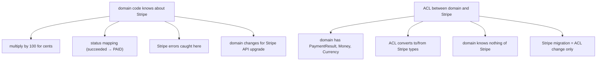
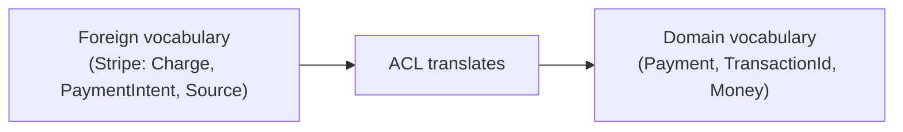
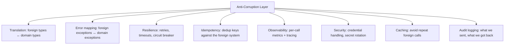

# Anti-Corruption Layer

A clean domain model ([T03](./T03-domain-driven-design-ddd.md)) only stays clean if you protect it. The moment your domain code imports a Stripe SDK type, a Salesforce field name, or a legacy mainframe XML structure, the foreign system's vocabulary has leaked in — and now any change to Stripe's SDK, any rename in Salesforce, any tweak in the mainframe propagates into your domain. The "anti-corruption layer" (ACL), named by Eric Evans in 2003, is the boundary code that **translates between the foreign system's model and yours**, keeping the foreign vocabulary on the foreign side. A well-built ACL means your domain knows nothing about Stripe, Salesforce, or the mainframe; the ACL knows about both worlds and speaks each in its own terms.

The ACL is a specialization of the hexagonal **driven adapter** ([T02](./T02-clean-hexagonal-onion-architecture.md)), with the explicit responsibility to *not just call the foreign API* but to **rephrase its outputs** into the domain's words. The distinction matters: a thin SDK wrapper that returns `Stripe.Charge` objects is *not* an ACL — it's a layer leak with extra ceremony. An ACL receives the Stripe response, **translates** it into a domain `PaymentResult`, and discards everything Stripe-specific. The domain sees only `PaymentResult`, with no idea Stripe exists.

The depth bar here is **what the ACL actually translates, why each translation matters, and the failure modes when teams build something that *looks* like an ACL but isn't**. We name four kinds of corruption an ACL prevents — vocabulary mismatch (the foreign system's words differ from yours), semantic mismatch (a "customer" in Salesforce means something different from your "customer"), shape mismatch (a deeply nested foreign payload becomes a flat domain value), and behavioral mismatch (the foreign system's error model maps awkwardly to yours). We trace real ACLs against the most common foreign-system categories — third-party SDKs (Stripe, Twilio, SendGrid), legacy systems (SAP, Salesforce, mainframe COBOL), other-team microservices (the "Customer Service" owned by another team) — and show the specific Java code patterns: domain interface in the port package, ACL implementation in the adapter, translation functions that are pure, testable, and the one place foreign types appear. We name the well-known anti-patterns: the "thin wrapper" that's an ACL in name only, the "shared schema" where teams accept a foreign vocabulary as their own (DDD's *conformist* pattern, sometimes correct but rarely deliberate), the "leaky ACL" where some foreign types still escape. By the end you will design an ACL that survives a foreign-system upgrade without touching the domain, defend the translation work against pressure to "just use the SDK," and choose conformist over ACL only when the *cost* of translation genuinely outweighs the *value* of independent vocabulary.

> [!NOTE]
> Prerequisites: [DDD](./T03-domain-driven-design-ddd.md) (ubiquitous language, bounded contexts, context map's eight patterns); [Hexagonal Architecture](./T02-clean-hexagonal-onion-architecture.md) (driven adapters, ports). The ACL is the eight-context-map's "Anti-Corruption Layer" pattern, made concrete in code.

## Where The Anti-Corruption Layer Came From — Eric Evans's 2003 Insight

The Anti-Corruption Layer pattern was named and articulated by **Eric Evans in his 2003 book *Domain-Driven Design*** (Chapter 14, on Context Maps). Unlike many DDD patterns that synthesize older ideas, the ACL is more directly Evans's own observation, drawn from his consulting experience.

### The Specific Consulting Pain That Motivated The Pattern

Evans's consulting work in the late 1990s and early 2000s repeatedly involved **integrations with legacy systems**:

- Banking systems integrating with mainframe COBOL applications.
- Insurance systems integrating with regulator data feeds.
- Healthcare systems integrating with electronic medical records (HL7 v2).
- Trading systems integrating with market-data feeds.

The pattern Evans observed: when a new system *had* to integrate with an older one, the older system's vocabulary, structure, and conventions would *infiltrate* the new system. Engineers would write code that talked in HL7 v2 terms, mainframe COBOL terms, or insurance regulator terms — because those were the terms the integration required.

Over time, the new system's domain model would *corrupt* to match the legacy system's. The new system's bounded context dissolved; it became a *thin wrapper* around the legacy system's concepts. The clean domain model that motivated the new build was lost.

Evans's insight: **draw a literal boundary, called the Anti-Corruption Layer, between the new bounded context and the foreign system**. *All* communication crosses this boundary. The ACL's job is to translate from the foreign vocabulary to the new system's vocabulary, *preventing* the foreign concepts from leaking into the new model.

### Why "Corruption" Is The Right Word

The word *corruption* in this context is Evans's deliberate choice. The implied analogy: a clean codebase is *contaminated* by foreign concepts the way water is contaminated by pollutants. The contamination spreads silently; by the time it's noticed, removing it is enormously expensive.

The ACL is a *barrier* against this contamination. It's not just a translation function; it's a *defensive structure* whose purpose is to protect the integrity of the domain model.

### The Hexagonal Architecture Connection

Cockburn's hexagonal architecture (2005) and Evans's ACL (2003) are *complementary* patterns. Hexagonal provides the *structural* mechanism (ports and adapters separate domain from external systems); ACL provides the *semantic* mechanism (translation between vocabularies).

A hexagonal architecture without ACL discipline allows adapter-shaped types to leak into the domain through the port interface. A non-hexagonal codebase with ACL discipline often has the translation in the wrong place (mixed with business logic instead of at the boundary). The two patterns *together* — hexagonal structure + ACL semantics — produce the cleanest integration.

### The 2010s Practical Adoption

ACL adoption in practice accelerated 2014–2018 as:

1. **Microservices created many integration boundaries**: every service-to-service integration is a potential corruption vector.
2. **Third-party SaaS APIs proliferated**: Stripe, Twilio, SendGrid, Algolia, Salesforce — each with their own vocabulary.
3. **Legacy modernization projects multiplied**: strangler-fig migrations require ACLs at the seam.

By 2024, ACL is standard practice in DDD-influenced Java codebases. The pattern is so well-established that it's often applied without naming it explicitly — engineers just *know* you wrap a third-party SDK in a domain-friendly interface.

### Vaughn Vernon's 2013 Codification

**Vaughn Vernon's [*Implementing Domain-Driven Design*](https://www.amazon.com/Implementing-Domain-Driven-Design-Vaughn-Vernon/dp/0321834577)** (2013) provided the most concrete code-level treatment of ACL. Vernon's examples (in C# and Java) showed *exactly* how to structure the ACL — domain interfaces, adapter implementations, translation methods, error mapping.

Vernon is the most practical DDD author; his book is what made DDD's patterns implementable for engineers who hadn't worked under Evans's direct mentorship. The ACL examples in Vernon's book are still cited as canonical.

## Why ACL, Specifically: The Senior Engineer's Q&A

### Q1: What's wrong with just using a third-party SDK directly?

Three concrete problems:

1. **The SDK becomes part of your domain vocabulary**. Stripe's `Charge`, `PaymentIntent`, `Source` types appear in your business code. Stripe is now baked into your model.

2. **SDK upgrades become breaking changes**. Stripe deprecated `Charge` in favor of `PaymentIntent` in 2017. Every service using `Charge` directly had to migrate. With an ACL, only the ACL changed.

3. **Vendor switches require system-wide changes**. If you decide to switch from Stripe to Adyen, every service touching Stripe types needs rewriting. With an ACL, only the ACL changes.

These problems compound: a codebase with 5 SDKs integrated directly has 5× the migration burden when any of them changes.

### Q2: When is an ACL not worth the effort?

Three regimes:

1. **The integration is short-lived**: a one-off data migration, a temporary integration during a transition.
2. **The foreign vocabulary matches yours**: rare but possible — if the third party uses your same domain language, translation is redundant.
3. **The foreign system is a long-term, stable, deeply embedded standard**: e.g., HL7 v2 in healthcare. The "standard" is unlikely to change; the ACL would be permanent translation overhead.

For everything else — and that's most cases — the ACL pays back its cost within 2–3 years of the integration's lifespan.

### Q3: How does ACL differ from a simple wrapper?

A *wrapper* is a thin shim that just forwards calls. A wrapper class with methods like `public Charge createCharge(...)` that internally calls `Stripe.Charge.create(...)` is just a wrapper — the type signature still exposes Stripe's vocabulary.

An *ACL* translates *both directions* — domain types in, domain types out. The ACL's public interface uses *your* vocabulary (`PaymentResult charge(Money amount)`); internally it converts to/from the foreign vocabulary. The foreign types never escape the ACL.

The senior test: **can you delete the SDK from your dependencies and still compile your business logic?** If yes, you have an ACL. If no, you have a wrapper.

### Q4: How does ACL relate to the eight context-map patterns?

The Context Map (DDD strategic patterns) identifies **eight relationships** between bounded contexts: Shared Kernel, Customer-Supplier, Conformist, Anti-Corruption Layer, Open Host Service, Published Language, Separate Ways, Partnership.

ACL is the *defensive* pattern. The relationship between your bounded context and the foreign one is: "we don't trust their model; we translate at the boundary." Other patterns assume more cooperation:

- **Conformist**: you accept the foreign model (cheap but you become coupled).
- **Customer-Supplier**: cooperative relationship; foreign team accommodates you.
- **Shared Kernel**: jointly-owned shared model.
- **Open Host Service**: foreign system publishes a stable contract for everyone.
- **Published Language**: agreed-upon interchange format.
- **Separate Ways**: deliberate non-integration.
- **Partnership**: deep mutual commitment.

ACL is appropriate when you *cannot* influence the foreign system (legacy, vendor, regulator) but must integrate with it. The senior judgment: identify the relationship deliberately; use ACL only where defense is needed.

### Q5: How does ACL compare to Hexagonal's adapters?

They overlap but aren't identical:

- **Hexagonal adapter**: any code that translates between external systems and the domain. Could be database adapters, HTTP adapters, message-queue adapters.
- **ACL**: specifically the *translation logic* at the boundary, focused on *protecting* the domain from foreign vocabulary.

Every ACL is a hexagonal adapter. Not every hexagonal adapter is an ACL — a simple JPA repository adapter that maps to native domain types is hexagonal but not really "anti-corruption" because there's no foreign domain to translate from.

The naming distinction matters: ACL emphasizes the *protective* purpose; adapter emphasizes the *structural* role.

## Common Misconceptions Explained

### "ACL is just a translation function."

False. An ACL is a *structural boundary* with translation as one of its responsibilities. It also includes error mapping, retry logic, contract validation, and (often) caching. A bare translation function is not an ACL.

### "ACL means writing your own SDK from scratch."

False. ACL means *wrapping* the SDK with a domain-friendly interface, not reimplementing it. You still use Stripe's SDK underneath; you just hide it behind your domain types.

### "ACL is only for third-party integrations."

False. ACL applies whenever your bounded context integrates with *any* external system whose vocabulary differs from yours — third-party SDKs, legacy systems, partner APIs, *and other internal microservices owned by other teams*. The corruption can come from anywhere.

### "If we have hexagonal architecture, we don't need ACL."

False. Hexagonal provides the *structure*; ACL provides the *content* of the translation. You can have hexagonal architecture with adapters that *leak* the foreign vocabulary (a "Stripe adapter" that returns Stripe types). The hexagonal structure is necessary but not sufficient.

### "ACL is over-engineering."

Often false, sometimes true. For *integrations that will outlive the third party* (most third-party SDKs are short-lived; Twilio and SendGrid have changed APIs significantly multiple times), ACL is essential. For *one-shot integrations*, it's overkill. The senior judgment depends on the integration's expected lifespan.

### "ACL means hiding the third-party API."

Half true. ACL hides the *types and vocabulary* of the third party, but it doesn't hide the *functionality*. Your domain can still do everything Stripe enables; it just speaks in *your* terms about it.

## What Corruption Looks Like

A team builds an order service whose domain has a clean `Order` model. They need to charge a credit card. They reach for Stripe. The first cut:

```java
@Service
class OrderService {
  @Autowired StripeClient stripe;

  public Order placeOrder(PlaceOrderCommand cmd) {
    var charge = Charge.create(Map.of(             // <-- Stripe SDK call
      "amount", cmd.total().multiply(BigDecimal.valueOf(100)).intValue(),
      "currency", "usd",
      "customer", cmd.customer().externalId(),
      "metadata", Map.of("order_id", cmd.orderId().toString())
    ));
    Order order = Order.placeNew(cmd, charge.getId(), charge.getStatus());
    return order;
  }
}
```

Three corruptions have entered:

1. **The `OrderService` knows about Stripe.** Specifically: that amounts must be multiplied by 100 (Stripe uses cents), that currency strings are lowercase, that metadata is a string map. The domain code now teaches you Stripe.
2. **The `Order` factory takes Stripe-shaped fields.** `Order.placeNew(cmd, chargeId, status)` — what kind of `status`? Stripe's `"succeeded"`, `"requires_action"`, `"failed"`? The domain's `OrderStatus` enum or Stripe's string?
3. **Errors leak.** When Stripe throws a `CardException` or a `StripeException`, the service must either catch and re-throw (or worse, let it bubble up to the controller). The domain handles Stripe errors as native errors.

A year later, Stripe deprecates the `Charge` API in favor of PaymentIntents. The team migrates: now `OrderService` calls `PaymentIntent.create(...)`, with different fields, different statuses, different error shapes. **Every change in the domain code is required for what's really a foreign-system change.** The domain isn't the domain anymore; it's a domain-flavored Stripe wrapper.



## The Pattern — One Port, One Translating Adapter

The hexagonal version of the same code:

```java
// Domain port — in com.shop.orders.domain.port.out
public interface PaymentGatewayPort {
  PaymentResult charge(Money amount, PaymentMethod method);
}
```

```java
// Domain types — pure java
public record Money(BigDecimal amount, Currency currency) { /* ... */ }
public record PaymentResult(TransactionId id, PaymentStatus status) { /* ... */ }
public enum PaymentStatus { PAID, PENDING_AUTH, FAILED }
public enum PaymentMethod { CARD, BANK_TRANSFER, WALLET }
```

```java
// ACL adapter — in com.shop.orders.adapter.out.payment
@Component
public class StripePaymentAdapter implements PaymentGatewayPort {

  private final StripeClient stripe;

  @Override
  public PaymentResult charge(Money amount, PaymentMethod method) {
    try {
      Charge stripeCharge = Charge.create(Map.of(
        "amount", toCents(amount),                       // <-- translation
        "currency", amount.currency().getCurrencyCode().toLowerCase(),
        "payment_method", toStripeMethod(method),
        "confirm", true
      ));
      return new PaymentResult(
          new TransactionId(stripeCharge.getId()),       // <-- translation
          fromStripeStatus(stripeCharge.getStatus()));   // <-- translation
    } catch (CardException e) {
      throw new PaymentDeclined(e.getDeclineCode());     // <-- translation
    } catch (StripeException e) {
      throw new PaymentGatewayUnavailable(e.getMessage());
    }
  }

  private int toCents(Money money) {
    return money.amount().movePointRight(2).intValueExact();
  }
  private String toStripeMethod(PaymentMethod m) {
    return switch (m) {
      case CARD -> "card";
      case BANK_TRANSFER -> "us_bank_account";
      case WALLET -> "wallet";
    };
  }
  private PaymentStatus fromStripeStatus(String s) {
    return switch (s) {
      case "succeeded" -> PaymentStatus.PAID;
      case "requires_action" -> PaymentStatus.PENDING_AUTH;
      case "failed", "canceled" -> PaymentStatus.FAILED;
      default -> throw new IllegalStateException("Unknown Stripe status: " + s);
    };
  }
}
```

Now the domain code:

```java
@Service
class OrderService {
  private final PaymentGatewayPort payments;            // <-- port, not Stripe

  public Order placeOrder(PlaceOrderCommand cmd) {
    PaymentResult result = payments.charge(cmd.total(), cmd.paymentMethod());
    return Order.placeNew(cmd, result.id(), result.status());
  }
}
```

Three things happened:

1. **The domain code is Stripe-free.** Search the `com.shop.orders.domain` package — you will not find `Stripe`, `Charge`, `PaymentIntent`, or any cents-multiplication. It's a domain about orders and money.
2. **The ACL holds all translation.** Cents conversion, currency-code lowercasing, status mapping, error mapping — all in one class. When Stripe upgrades to PaymentIntents, *this is the only file that changes*.
3. **The ACL throws domain-vocabulary exceptions.** `PaymentDeclined` and `PaymentGatewayUnavailable` are domain types — the rest of the system catches them and reacts in domain terms.

## The Four Corruptions An ACL Prevents

### 1. Vocabulary Mismatch

The foreign system has words that aren't yours. Stripe says "charge," "PaymentIntent," "Customer," "Source." Twilio says "Message," "MediaResource," "Application." Salesforce says "Lead," "Opportunity," "Contact" — and "Lead" is not "Customer." Adopting these words in your domain teaches your engineers the foreign system; rejecting them keeps the domain's ubiquitous language pure.



### 2. Semantic Mismatch

The foreign system uses a word that *looks* like yours but means something different. Salesforce's "Customer" includes prospects; your "Customer" only includes confirmed buyers. SAP's "Order" includes purchase orders from your suppliers; your "Order" is customer-facing. **Equating these would not just be a coding mistake; it would corrupt the domain's vocabulary.** The ACL identifies and resolves the mismatch with explicit translation.

### 3. Shape Mismatch

The foreign system returns a deeply nested payload; your domain wants a flat value. Stripe's `Charge.outcome.network_status.declined.reason.subreason.code` is a structure that *belongs in Stripe's world*. Your domain has a `PaymentDeclineReason` enum with 8 values. The ACL collapses the nested structure into the flat domain value, judging which Stripe paths map to which domain reason.

### 4. Behavioral / Error-Model Mismatch

The foreign system signals failure via exception subtypes, HTTP status codes, response field flags, or "magic values." Your domain has its own error model. The ACL maps `CardException` to `PaymentDeclined`, `StripeException` to `PaymentGatewayUnavailable`, HTTP 429 to `RateLimited`, HTTP 5xx to `Retryable`. The domain catches and handles its own types.

## When To Use An ACL — And When To Conform

DDD's [context map](./T03-domain-driven-design-ddd.md#context-map--the-eight-relationships-between-bounded-contexts) names **eight** relationship patterns between bounded contexts. ACL is one. **Conformist** is another — it accepts the upstream model unchanged. The choice between them is the question.

### Use An ACL When

1. **The foreign vocabulary is alien to your domain.** Stripe's words don't fit your business; bringing them in would distort the model.
2. **The foreign system is volatile or third-party.** SDK upgrades, breaking changes, vendor switches — the ACL absorbs them.
3. **You will replace the foreign system someday.** Stripe today; maybe Adyen tomorrow. The ACL means the domain doesn't care.
4. **The semantic mismatch matters.** "Customer" in Salesforce ≠ "Customer" in your domain — silently equating them is a bug factory.
5. **You consume from a legacy system you don't control.** SAP fields, mainframe XML, COBOL field names. The cost of bringing those into your domain is huge.

### Conformist (No ACL) When

1. **The foreign vocabulary already matches yours, or is the *de facto* standard.** Calling a "Customer" by exactly the name the upstream team uses is fine if the semantics match.
2. **The integration is temporary or low-volume.** The cost of an ACL might exceed the benefit for a one-off integration.
3. **The foreign system is stable and you have no leverage.** Government compliance APIs (tax authority, regulatory reporting) — accept their shape; they don't care about your domain.
4. **The translation would be pure cosmetic.** If "amount" and "amount" mean the exact same thing, don't rename them just for purity.

DDD's lesson: **most third-party APIs warrant ACLs. Most other-team microservices warrant a thin ACL or none, *if* there is a shared domain language.** The choice is a senior judgment call about coupling, volatility, and vocabulary value.

## Anatomy Of A Production-Grade ACL

A real ACL has more responsibilities than translation. The full package:



The translation is the *core*; the rest is the operational packaging. Each lives in the ACL because the domain shouldn't have to know.

### Translation

The actual mapping functions. Pure, testable, deterministic. **The ACL's tests are primarily translation tests** — feed in a foreign payload, assert the domain object; feed in a domain command, assert the foreign call.

### Error Mapping

Each foreign-error mode maps to a domain-error mode. The mapping table is itself part of the design:

| Foreign error | Domain exception | Handling |
|---------------|------------------|----------|
| `CardException` (declined) | `PaymentDeclined(reason)` | Show user the reason, don't retry |
| `RateLimitException` | `RateLimited(retryAfter)` | Back off; retry after `retryAfter` |
| `StripeException` (5xx) | `PaymentGatewayUnavailable` | Circuit-breaker open; degrade |
| HTTP 401 | `PaymentGatewayMisconfigured` | Alert ops; do not retry |
| Network timeout | `PaymentGatewayUnknown` | Idempotency-key retry |

### Resilience

The ACL is where circuit breakers, timeouts, and retries live ([T14 — resilience](../C02-distributed-systems-and-system-design/T14-resilience-circuit-breaker-bulkhead-retry-timeout-backpressure.md)). The domain calls `payments.charge(...)` and trusts that the ACL handled retries appropriately. Resilience4j configuration sits on the adapter method:

```java
@CircuitBreaker(name = "stripe")
@Retry(name = "stripe")
@TimeLimiter(name = "stripe")
public PaymentResult charge(Money amount, PaymentMethod method) { /* ... */ }
```

### Idempotency

Foreign APIs often have idempotency mechanisms (Stripe's `Idempotency-Key` header). The ACL generates and tracks these, so retries don't double-charge. This is critical and is *not* the domain's concern.

### Observability

Per-call metrics (Stripe call rate, p99 latency, error rate by error type) live in the ACL. The domain sees "payments worked" or "payment failed"; the ACL records the underlying truth.

### Security

Credentials (API keys, OAuth tokens) live in the ACL's config, loaded from environment variables or a secrets manager ([T12](./T12-twelve-factor-app.md)). The domain never sees them.

### Caching

If the foreign API rate-limits or charges per call (Stripe's `Customer.retrieve` is rate-limited; Salesforce has API call quotas), the ACL caches when safe. The domain calls without worrying about the cost.

### Audit Logging

For regulated industries, the exact request and response to the foreign system must be logged. The ACL is the natural place — it's the only code that sees the foreign payload.

## Common Foreign-System Categories And Their ACL Patterns

### Third-Party SDKs

Stripe, Twilio, SendGrid, AWS SDKs, Algolia, MailChimp. ACL wraps each in a domain interface.

```java
public interface PaymentGatewayPort { /* ... */ }
public interface EmailGatewayPort   { /* ... */ }
public interface SmsGatewayPort     { /* ... */ }
public interface SearchIndexPort    { /* ... */ }
```

Each has one adapter; the domain depends only on the interface. Migrations between vendors (Twilio → MessageBird, SendGrid → Mailgun) become a one-class change.

### Legacy Systems

SAP, Salesforce, mainframe COBOL, in-house legacy services. ACL is heavier — translation is denser, error modes more exotic, network behavior worse.

```java
public interface CustomerSyncPort {
  // Domain operation; nothing of SAP leaks
  void recordCustomerUpdate(CustomerId id, CustomerUpdate update);
}

@Component
class SapCustomerSyncAdapter implements CustomerSyncPort {
  // Translates CustomerUpdate to a 200-field SAP BAPI call,
  // handles SAP's idiosyncratic "everything is a string" response,
  // maps SAP error codes (4-digit numbers) to domain exceptions.
}
```

The legacy ACL is often the *most valuable* code in the system — the only thing standing between an ancient system's quirks and a modern domain.

### Other-Team Microservices

A `CustomerService` owned by another team. The decision: ACL or conformist? Depends on:

- **Is their vocabulary your vocabulary?** If they have a `Customer` and you have a `Customer` and they mean the same thing, conformist is fine.
- **Are they volatile?** If they ship breaking changes, you want an ACL.
- **Do you control the relationship?** If you're a peer team with shared ownership, conformist is cheaper; if they're an unmaintained legacy, ACL.

### Published Standards

Tax-authority APIs, regulatory reporting, EDI, FHIR (healthcare), ISO-20022 (finance). These are usually conformist — the standard is the standard. An "ACL" here translates the standard's shape into your *internal* domain, but the wire format is fixed.

## Anti-Patterns

### 1. The "Wrapper" That Isn't An ACL

A class called `StripeWrapper` whose every method returns a `Stripe.Charge`. The "wrapper" has the *form* of an ACL but does no translation. The domain still sees Stripe types. This is the most common failure mode — the team thinks they have an ACL because they have a class with "wrapper" in its name. **Read the return types**: if they're foreign types, it's not an ACL.

### 2. The Leaky ACL

Most of the foreign types are translated, but one or two slip through. A `PaymentResult` whose `metadata` field is `Map<String, String>` — the format Stripe used. A `Customer` whose `salesforceId` field is unique to that integration. The domain is *almost* clean; the residual leak is precisely the place that breaks when the foreign system changes.

### 3. The Bidirectional ACL With Different Translations

The ACL's "in" path translates Stripe → domain; the "out" path translates domain → Stripe with a *different* mapping. (`PAID` in maps to `succeeded`; `PAID` out maps to `success`.) The asymmetry is a bug waiting to happen. **Same translation in both directions.**

### 4. The Bloated ACL

The ACL accumulates business logic over time. "When charging a card, also notify the loyalty system." "When refunding, also unreserve inventory." The ACL is now a use case in disguise. Move that logic *out* of the ACL into a domain service; the ACL should be *only* translation + operational packaging.

### 5. The ACL As Shared Library

Multiple services share a `payment-acl.jar`. Each service depends on it; updates propagate via the JAR. Now the ACL is a *coupling* mechanism — a change in one service's needs forces a change in everyone's. Better: each service owns its own ACL; they may look similar but evolve independently.

## Real ACL Examples

- **Banks integrating SWIFT, FedWire, ACH.** Each payment rail has its own format, errors, and timing. Banks build an ACL per rail; the domain's `Payment` is the same regardless of which rail moves the money.
- **Insurance integrating with reinsurance markets.** The reinsurance market has its own century-old vocabulary (cedant, retrocession, premium accounting standards). The ACL translates between insurance's domain and reinsurance's.
- **E-commerce integrating with payment gateways.** Stripe, Adyen, Braintree, PayPal — each is a different ACL, all behind the same `PaymentGatewayPort`. The domain switches providers per market without changing.
- **Healthcare integrating with EHR systems.** Epic, Cerner, AllScripts — each has its own data model. FHIR is the *attempt* at a standard; the ACL still translates FHIR-shaped data into the domain's clinical model.

The category is enormous; **most real systems have many ACLs**, each protecting against a specific foreign system.

## Cross-Language Notes

The pattern is universal; the tooling is largely language-agnostic.

| Ecosystem | ACL idioms |
|-----------|------------|
| **Java / Spring** | Interface in `domain/port`, `@Component` in `adapter/`, MapStruct for translation |
| **C# / .NET** | Interface in Core; implementation in Infrastructure; AutoMapper for translation |
| **Go** | Interface in domain package; struct implementation in adapter package |
| **Rust** | Trait in core crate; impl in adapter crate; no translation library needed (`From`/`Into`) |
| **TypeScript** | Interface + class; `class-transformer` or hand-written mapping |

Rust's trait system makes ACLs natural: the `PaymentGateway` trait lives in the core crate; the `StripePaymentGateway` impl lives in an adapter crate; the `From`/`Into` traits handle translation idiomatically. Rust's compile-time type system catches type leaks the moment they happen — a cleaner enforcement than Java's runtime-reflection.

## Trade-Off Summary

| Aspect | With ACL | Without (conformist or no translation) |
|--------|---------|---------------------------------------|
| Domain purity | Preserved | Eroded over time |
| Foreign-system upgrade cost | Single class | System-wide |
| Vendor migration | Single class | Multi-quarter project |
| Onboarding speed | Domain readable without foreign knowledge | Need to learn foreign system first |
| Code volume | Higher (interface + impl + translation) | Lower |
| Test surface | Wider (translation tests required) | Narrower |
| Vocabulary discipline | Maintained | Drift inevitable |
| Suitable for stable standard | Optional | Often fine |
| Suitable for volatile vendor | Strongly | Painful long-term |

> [!INTERVIEW]
> A common L5 prompt: "When would you use an Anti-Corruption Layer?" Strong answers (a) cite the DDD context map's eight relationships, (b) explicitly identify the conformist alternative and when it's correct, (c) explain that an "SDK wrapper" returning foreign types is not an ACL, (d) name the four corruptions (vocabulary, semantic, shape, error model) the ACL prevents.

## Practice

1. **Find a leak.** In any Spring service you know, search for imports of third-party SDK types in the `service/` or `domain/` packages. Each is a missing ACL. Pick one; sketch the ACL.
2. **Design a `PaymentGatewayPort`.** Write the interface. Specify the method signatures, the domain types in/out, the exception hierarchy. Don't mention Stripe, Adyen, or PayPal.
3. **Implement a Stripe ACL.** Use the Stripe Java SDK to implement `PaymentGatewayPort` from question 2. The implementation class is the only place Stripe types appear. Verify with `jdeps` or ArchUnit.
4. **Translation testing.** Write unit tests for the ACL's translation only (without calling the real Stripe). Feed sample Stripe responses; assert the resulting domain types.
5. **The conformist call.** Find an integration where your team accepted the foreign vocabulary unchanged. Justify whether that was a deliberate conformist choice or accidental drift. If accidental, plan the ACL.
6. **Bidirectional consistency check.** For an existing ACL, audit: does the in-mapping match the out-mapping? Find one asymmetry; fix it.
7. **The semantic mismatch hunt.** Find a "Customer" or "Order" or similar word in your domain that's shared with a foreign system. Compare the semantics carefully — are they really the same? If not, propose terminology.
8. **Error mapping table.** For a third-party API your system uses, list every error mode you've observed. For each, write the domain exception and the handling.
9. **Vendor switch exercise.** Pick a third-party SDK your system uses. Imagine the vendor disappears tomorrow. List the files that would change if you have an ACL; list them if you don't. Compare.
10. **The skeptic conversation.** A senior engineer says "The Stripe SDK is fine; we don't need a wrapper." Write a 200-word response that takes the position seriously, identifies what's lost (testability, vendor independence, semantic clarity), and recommends an ACL with a concrete first step.

## Recap

You should now be able to:

- Articulate the **Anti-Corruption Layer** as a specialization of the hexagonal driven adapter, with explicit translation between foreign vocabulary and domain vocabulary.
- Identify and prevent the **four corruptions** an ACL protects against — vocabulary mismatch, semantic mismatch, shape mismatch, behavioral / error-model mismatch.
- Choose between **ACL** and **conformist** by foreign-system volatility, vocabulary value, and integration permanence.
- Design a **production-grade ACL** that bundles translation, error mapping, resilience, idempotency, observability, security, caching, and audit logging — all in one boundary class.
- Apply ACLs to the canonical categories — **third-party SDKs, legacy systems, other-team microservices, published standards** — with the right level of investment for each.
- Recognize five **anti-patterns** — wrapper-that-isn't, leaky ACL, asymmetric translation, bloated ACL, ACL-as-shared-library.
- Implement ACLs in **Spring Boot** — interface in `domain/port/out`, `@Component` in `adapter/out/<vendor>`, MapStruct or hand-written translation, resilience and idempotency annotations on the adapter.
- Place the ACL pattern in **cross-language context** — Rust's `From`/`Into` traits, C#'s AutoMapper, Go's structural typing — and recognize the universality.
- Cite **real ACL deployments**: banks per payment rail, insurance / reinsurance, e-commerce multi-gateway, healthcare EHRs.

## Next

Continue to [Architecture Trade-Off Analysis](./T14-architecture-trade-off-analysis.md) — the meta-skill of evaluating and choosing among architectural styles, the formal frameworks (ATAM, lightweight ADR-driven evaluation), and the senior judgment that selects, defends, and revisits architectural decisions.
