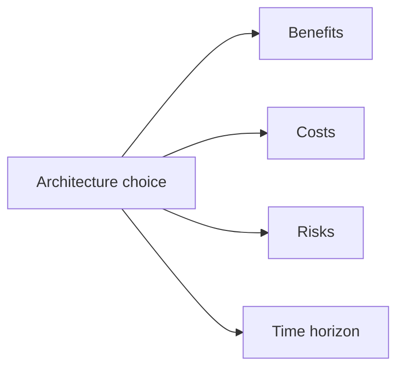
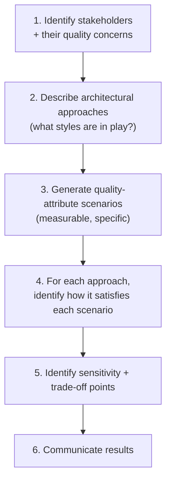
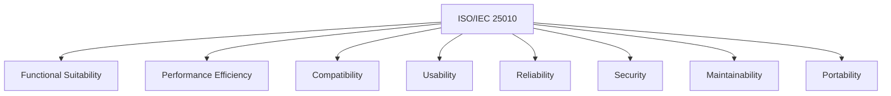
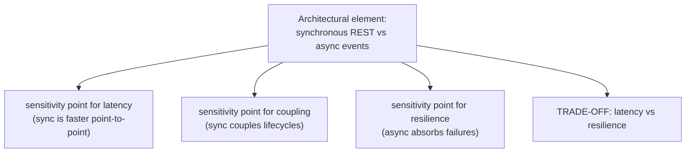

# Architecture Trade-off Analysis

The thirteen topics that came before this one — layered architecture, hexagonal, DDD, monolith vs microservices, decomposition, sync vs async, gateways and meshes, event sourcing, CQRS, sagas, strangler-fig, twelve-factor, ACL — are not a list of *answers*. They are a list of *moves*, each with its own benefits and costs, and the senior architect's craft is **choosing among them in context**. The hard truth about architecture is that no choice is universally right; every one is a trade-off, and the same trade-off that is correct for one team can be wrong for another. Knowing the patterns means almost nothing without the discipline to evaluate them against the system's actual constraints — the team size, the deployment cadence, the latency budget, the audit requirements, the operational capability, the time horizon. This topic is about that evaluation discipline.

The depth bar here is **the explicit frameworks (ATAM, lightweight ADR-driven analysis, fitness functions) and the practical habits** that senior engineers use to make architecture decisions defensibly. We cover the **Architecture Trade-off Analysis Method (ATAM)** — published by the Software Engineering Institute in 2000 — its stakeholder roles, its quality-attribute scenarios, the way it identifies sensitivity points (where small changes have big impact) and trade-off points (where one quality is bought at the cost of another). We cover the *lightweight* alternative — an Architecture Decision Record (ADR) per significant choice ([T03 of C03 covers ADRs in depth](../C03-engineering-leadership/T03-architecture-decision-records-adrs.md)) — because most teams will never run a formal ATAM but every team can write a one-page ADR. We cover the **ISO/IEC 25010 quality attribute taxonomy** as the standard vocabulary for what "good" means (performance efficiency, reliability, security, maintainability, portability, compatibility, usability, functional suitability) and how each attribute admits measurable scenarios. We name the **architectural anti-patterns of decision-making**: hype-driven development, status-quo bias, the architect-astronaut, the bikeshedding distraction, the silent vendor-driven choice. We give the **fitness function** mechanism (Neal Ford / *Building Evolutionary Architectures*) for continuously verifying that architectural intent is preserved as code evolves. By the end you will run a half-day architecture trade-off analysis on a real system, write ADRs that survive a six-year horizon, distinguish a genuine trade-off from a confused decision, and refuse the most common form of architecture-by-trend.

> [!NOTE]
> Prerequisites: all twelve preceding topics — this one synthesizes them. Without the building blocks (layered, hexagonal, DDD, monolith vs microservices, etc.), the trade-off analysis has nothing to analyze. The companion topic [C03/T03 — Architecture Decision Records](../C03-engineering-leadership/T03-architecture-decision-records-adrs.md) goes deep on the documentation discipline; this topic is about the *evaluation*.

## Where Architectural Trade-Off Analysis Came From — From DoD Procurement To Engineering Standard

The formal practice of *architectural trade-off analysis* — evaluating an architecture against quality attributes — was developed at the **Carnegie Mellon Software Engineering Institute (SEI)** in the 1990s, motivated by Department of Defense software procurement failures. The vocabulary you use today (quality attribute scenarios, sensitivity points, trade-off points, architectural approaches) all comes from a specific SEI research program.

### The DoD Software Crisis (1980s–1990s)

The US Department of Defense had been buying software for decades, but the **1990s saw a series of high-profile failures**: large defense software projects that delivered late, over budget, or not at all. Specific examples:

- **The Advanced Automation System (FAA, 1981–1994)**: a $7.5 billion air-traffic-control modernization that was cancelled after 13 years with little to show.
- **The Future Combat Systems (Army, 2003–2009)**: cancelled after spending $18 billion without producing operational systems.
- **Numerous smaller programs** that failed silently — over budget, behind schedule, or not meeting specs.

The DoD funded SEI (founded 1984, located at CMU) specifically to *understand why software procurement was failing*. SEI's role was to develop *evaluation methodologies* that the DoD could use to assess proposed architectures *before* contracts were signed.

### The Software Architecture Practice At SEI (1990s)

SEI's Software Architecture Practice group, led by **Rick Kazman, Mark Klein, Paul Clements, Len Bass**, and others, developed several evaluation methodologies during the 1990s:

#### Software Architecture Analysis Method (SAAM, 1994)

The first formal method, developed by **Rick Kazman and others** in the 1991–1994 period. SAAM evaluated architectures by walking through specific scenarios (use cases) and seeing how the architecture handled each. The method was rough but established the *vocabulary* — quality attributes, scenarios, architectural approaches.

#### ATAM — The Architecture Trade-off Analysis Method (1998–2000)

ATAM was the refinement of SAAM, introduced in [*The Architecture Tradeoff Analysis Method*](https://insights.sei.cmu.edu/library/the-architecture-tradeoff-analysis-method/) (Kazman, Klein, Clements, IEEE Software, 1998). ATAM's specific contributions:

1. **Quality Attribute Scenarios**: a formal structure for stating quality requirements (stimulus, source, environment, artifact, response, response measure).
2. **Sensitivity Points**: architectural decisions where small changes have large effects on quality attributes.
3. **Trade-off Points**: architectural decisions that affect multiple quality attributes in opposing directions.
4. **Risks**: identified during evaluation, where the architecture's response to a scenario is uncertain.

ATAM was developed as a *consulting service* — SEI sent teams of trained evaluators to DoD contractors and ran multi-day workshops. The methodology was *not* designed for lightweight in-team use; it was a heavyweight evaluation for large procurement programs.

#### Who Rick Kazman, Mark Klein, And Paul Clements Are

**Rick Kazman**: SEI senior researcher and University of Hawaii professor. Co-author of *Software Architecture in Practice* (Bass, Clements, Kazman; 1998, 4th edition 2021), the canonical software architecture textbook in academic programs.

**Mark Klein**: SEI senior researcher, specialist in real-time systems and architecture evaluation. Long-tenured at SEI through the 2000s and 2010s.

**Paul Clements**: SEI researcher (later at BigLever Software). Co-author of multiple SEI architecture books, including *Documenting Software Architectures* (2002, 2nd ed 2010).

The Bass-Clements-Kazman book *Software Architecture in Practice* is essentially the textbook version of the SEI ATAM work — required reading in many graduate software architecture programs.

### The Industrial Adoption (2000s)

Through the 2000s, ATAM moved beyond DoD procurement into:

- **Large insurance and banking systems**: where multi-million-dollar architectural decisions warranted formal evaluation.
- **Telecommunications equipment**: companies like Nokia, Ericsson, and Cisco used ATAM for product-line architecture decisions.
- **Aerospace**: Boeing, Lockheed Martin, and others adopted ATAM for safety-critical systems.

By 2010, ATAM was an established practice in *high-stakes* engineering contexts. But it remained too heavy for *typical* enterprise software — running an ATAM workshop required trained evaluators, multi-day sessions, and extensive documentation.

### The Lightweight Variants (2010s)

The 2010s saw the emergence of *lightweight* trade-off analysis approaches:

#### Lightweight Architecture Decision Records (Michael Nygard, 2011)

[Nygard's ADR essay](https://cognitect.com/blog/2011/11/15/documenting-architecture-decisions) (November 2011) provided a *minimal* alternative to heavyweight architecture documentation. ADRs are essentially **trade-off analyses in a one-page format** — context, decision, consequences, alternatives.

The contrast with ATAM: ATAM is a *process* for multi-day evaluation workshops; ADRs are *artifacts* that can be produced in 30 minutes. ADRs scale down to teams of 5–10 engineers; ATAM requires organizational investment.

For most companies, ADRs replaced ATAM. The full ATAM remains in use for genuinely high-stakes decisions, but ADRs are the everyday practice.

#### Evolutionary Architecture (Ford, Parsons, Kua, 2017)

Neal Ford, Rebecca Parsons, and Patrick Kua's [*Building Evolutionary Architectures*](https://www.amazon.com/Building-Evolutionary-Architectures-Support-Constant/dp/1491986360) (O'Reilly, 2017) introduced **fitness functions** — automated tests that verify quality attributes continuously, rather than evaluating once. This shifts trade-off analysis from a *decision-time* activity to an *ongoing* discipline.

The 2017 book is the modern alternative to ATAM's once-and-done evaluation — recognizing that architectures evolve, the analysis must evolve too.

### Why The Trade-Off Vocabulary Matters

The SEI work codified a *vocabulary* that lets engineers reason about architecture *systematically*:

- **Quality Attribute Scenarios** (instead of vague quality requirements).
- **Sensitivity Points** (instead of intuition about what matters).
- **Trade-off Points** (instead of pretending choices are free).
- **Risks** (instead of optimism about uncertainty).

This vocabulary is what makes architectural conversations *productive* rather than opinion battles. The senior engineer's value: bringing this vocabulary to bear on team decisions.

## Why Trade-Off Analysis, Specifically: The Senior Engineer's Q&A

### Q1: Why do most architectural decisions ignore trade-off analysis?

Because the *cost* of analysis is up-front and visible; the *benefit* (avoiding bad decisions) is delayed and invisible. Teams under deadline pressure skip the analysis and accept whatever architecture emerges, hoping it works.

The pattern repeats: a team makes an under-analyzed decision; it produces problems 6–18 months later; the team blames "tech debt" or "legacy decisions." In reality, the decision was *made* without analysis, not *forced* by circumstances.

The senior engineer's value: insisting on analysis even under deadline pressure, because the deadline pressure is *exactly when* bad decisions are most costly.

### Q2: What's the minimum viable trade-off analysis?

Three questions, in writing, before any significant architectural decision:

1. **What are we trying to achieve?** (Quality attributes — what matters, with measurable criteria.)
2. **What alternatives are we considering?** (At least three.)
3. **What trade-offs does each alternative make?** (What's bought, what's paid.)

This minimal version — three questions, one page — fits in a 30-minute meeting. It's enormously better than no analysis.

### Q3: How does this connect to ADRs?

ADRs are the *recording* of trade-off analysis decisions. Each ADR captures:
- Context (what triggered the decision).
- Decision (what was decided).
- Consequences (what trade-offs were accepted).
- Alternatives (what was considered but rejected).

The ADR is the *artifact*; the analysis is the *process*. The ADR records the conclusion; the analysis produces it.

The senior practice: every significant decision gets an ADR; every ADR is backed by analysis.

### Q4: When is full ATAM worth running?

When the decision is *genuinely high-stakes*: large system, long-lived, expensive to change, with multiple competing quality attributes. Examples:

- **Choosing a primary database for a new product line**.
- **Deciding between monolith and microservices at organizational scale**.
- **Selecting between cloud providers for multi-region deployment**.
- **Designing a safety-critical system** (medical, aviation, automotive).

For most decisions, lightweight ADR-driven analysis is sufficient. ATAM is reserved for decisions where the cost of being wrong justifies the analysis investment.

### Q5: How do you balance trade-offs when the team disagrees?

Three steps:

1. **Make the disagreement specific**: "we disagree about whether to use microservices" is too vague. "We disagree about whether to optimize for deploy independence vs operational simplicity" is specific.

2. **Identify the quality attributes**: each side typically prioritizes different attributes. Make this explicit.

3. **Force a decision criterion**: what would have to be true for one side to win? Often, the disagreement dissolves when the criterion is articulated.

The senior practice: facilitate the disagreement to *specifics*, not to consensus. Disagreement on specifics is productive; consensus on vagueness is not.

## Common Misconceptions Explained

### "Trade-off analysis is for big decisions only."

False. Trade-offs apply at every scale — choosing between two API designs, picking a logging library, deciding on a caching strategy. The *depth* of analysis scales with the stakes, but every decision involves trade-offs.

### "Trade-off analysis slows down development."

Half true. Analysis adds upfront cost but prevents downstream rework. Teams that skip analysis often spend *more* time fixing bad decisions than they saved.

### "If we have a strong architect, we don't need analysis."

False. Even excellent architects benefit from forcing themselves to articulate trade-offs. The act of writing the analysis reveals assumptions that intuition would skip.

### "Trade-off analysis means using ATAM."

False. ATAM is *one* methodology; lightweight ADR-driven analysis is another; fitness functions are a third. The methodology should match the decision's stakes.

### "Architecture is about finding the optimal solution."

False. Architecture is about *picking among trade-offs* — there is no optimal solution that wins on all dimensions. The architect's job is choosing *which* dimensions to optimize for.

### "Quality attributes are obvious."

False. Different stakeholders have different quality attributes. Performance for the user; cost for the CFO; maintainability for engineering; security for compliance. The act of *eliciting* quality attributes is non-trivial; the analysis reveals competing priorities the architecture must balance.

## The Central Claim — Architecture Is Trade-Offs

The opening sentence of Mark Richards and Neal Ford's *Fundamentals of Software Architecture*:

> "Everything in software architecture is a trade-off."

The implication: **any architectural recommendation without a stated cost is a sales pitch, not engineering.** "We should use microservices" is meaningless; "we should accept the network tax and the operational floor of microservices because we need independent deployment cadences across teams" is engineering. Senior architects are characterized less by which patterns they prefer and more by which costs they name aloud.



Every choice has all four dimensions. Listing only the benefits is the most common form of dishonesty in architecture conversations.

## The ATAM Framework — A Half-Day Method

The **Architecture Trade-off Analysis Method** was published by Rick Kazman, Mark Klein, and Paul Clements (SEI, 2000) as a formal method for evaluating an architecture against its quality requirements. ATAM is heavy — a full ATAM is a multi-day workshop with a trained evaluation team — but the *concepts* are useful in lightweight form for any architecture review.

### ATAM's Steps (Lightweight Version)



A team of 2–4 engineers can run a lightweight ATAM in 4 hours on a non-trivial system.

### Quality Attribute Scenarios

A scenario is a *concrete, measurable* statement of what the system must do:

> Under normal load of 1,000 req/s with 100 GB of customer data, the `GET /customers/{id}` endpoint must respond in under 100 ms at p99, observed from a client in the same region.

That sentence has six parts: stimulus (a GET request), source (a client in the same region), environment (normal load + 100 GB data), artifact (the customer endpoint), response (responds with the customer), response measure (under 100 ms p99). Vague quality goals ("the system should be fast") become explicit scenarios that an architecture can be evaluated against.

The **ISO/IEC 25010** standard (2011, revised 2023) catalogues eight quality attribute categories:



For each category, write 2–5 scenarios specific to your system. The exercise produces 15–40 scenarios — enough to evaluate architecture meaningfully, few enough to keep the analysis tractable.

### Sensitivity Points And Trade-Off Points

For each scenario, identify:

- **Sensitivity point**: an element of the architecture whose value strongly affects this scenario's outcome. Example: the choice of synchronous vs asynchronous communication is a sensitivity point for the latency scenario.
- **Trade-off point**: an element that *simultaneously* affects multiple scenarios in *opposing* directions. Example: synchronous communication might *improve* observability while *worsening* failure-isolation — the choice is a trade-off.



The trade-off points are the *real* output of the analysis. They are the decisions worth recording in ADRs.

## Practical Architecture Review — A Workshop Recipe

A 4-hour architecture review using ATAM-lite:

| Time | Activity |
|------|----------|
| 0:00–0:30 | Stakeholders present quality concerns (product, ops, security, on-call) |
| 0:30–1:00 | Architect presents proposed architecture (no decisions to defend, just describe) |
| 1:00–2:00 | Generate 15–30 scenarios across the 8 ISO categories |
| 2:00–3:00 | For each scenario, evaluate the architecture's response (excellent / acceptable / poor) |
| 3:00–3:30 | Identify sensitivity + trade-off points; write each as a draft ADR |
| 3:30–4:00 | Risks, follow-ups, next-review trigger |

The output: a list of trade-off points each captured as an ADR. Each ADR names the choice, the alternatives considered, the trade-off, the deciding criterion. ADRs are versioned in git alongside code ([C03/T03](../C03-engineering-leadership/T03-architecture-decision-records-adrs.md) covers the format and discipline).

## The Six Most Common Trade-Off Axes

In practice, architecture trade-offs cluster along six axes. Naming them explicitly makes conversations sharper.

### 1. Performance Vs. Maintainability

A complex hand-tuned caching scheme is faster than a clean architecture but harder to change. Java's escape analysis ([L3/C02](../../L3-advanced-jvm/C02-jvm-internals-and-performance/)) can elide allocations the developer would otherwise hand-pool; reaching for hand-pooling for the speed costs you future readability. **Default toward maintainability; reach for performance optimization with measured evidence**.

### 2. Consistency Vs. Availability

The CAP theorem ([C02/T01](../C02-distributed-systems-and-system-design/T01-cap-theorem-and-pacelc.md)) tells us we choose between strong consistency and high availability when a network partition occurs. Sagas ([T10](./T10-saga-pattern-distributed-transactions.md)) trade atomic consistency for availability. CQRS ([T09](./T09-cqrs.md)) trades read-after-write consistency for read scalability. **The default consistency story should be the one the business will tolerate**; build no more than that.

### 3. Simplicity Vs. Flexibility

A modular monolith ([T04](./T04-monolith-vs-microservices-vs-modular-monolith.md)) is simpler than microservices but less flexible to scale independently. An event-sourced log ([T08](./T08-event-sourcing.md)) is more flexible for adding consumers but radically more complex to operate. **Lean simple unless flexibility is concretely required**, not just speculated.

### 4. Cost Vs. Reliability

Multi-region active-active is more reliable than single-region but doubles infra costs. Auto-scaling fast-startup services is more cost-efficient than provisioning for peak. Self-managed clusters are cheaper than managed services until headcount calculus reverses it. **Cost includes opportunity cost of engineering time, not just AWS bills**.

### 5. Cohesion Vs. Independence

Bounded contexts ([T03](./T03-domain-driven-design-ddd.md)) traded across services give independence at the cost of coordination on shared concepts. Modular monoliths give cohesion across modules at the cost of release independence. **The right axis position is determined by how much the contexts genuinely diverge**.

### 6. Vendor Capability Vs. Lock-In

AWS Step Functions are great if you stay on AWS. Salesforce is great if you stay on Salesforce. The vendor's capability arrives with a multi-year coupling. **The lock-in cost grows with time; assess by the project's horizon**.

## Sample Trade-Off Decisions From C01

A senior architect's evaluation across topics covered in C01:

| Decision | Pattern that wins on *simplicity* | Pattern that wins on *scale* | Trade-off |
|----------|-----------------------------------|------------------------------|-----------|
| Architecture style | Layered ([T01](./T01-layered-architecture.md)) | Hexagonal ([T02](./T02-clean-hexagonal-onion-architecture.md)) | Files-per-feature ceremony vs framework-migration survival |
| Boundaries | Anemic services | DDD ([T03](./T03-domain-driven-design-ddd.md)) | Vocabulary investment vs immediate productivity |
| Deployment | Monolith ([T04](./T04-monolith-vs-microservices-vs-modular-monolith.md)) | Microservices | Coordination tax vs operational floor cost |
| Communication | Sync REST ([T06](./T06-service-communication-sync-vs-async.md)) | Async events | Latency budget vs decoupling investment |
| Edge | Single edge LB | Gateway + Mesh ([T07](./T07-api-gateway-and-service-mesh.md)) | Cross-cutting concerns in code vs platform |
| Persistence | Mutable state | Event sourcing ([T08](./T08-event-sourcing.md)) | Operational simplicity vs audit/replay |
| Read/write | One model | CQRS ([T09](./T09-cqrs.md)) | Cognitive load vs read/write asymmetry |
| Cross-service tx | Single aggregate | Saga ([T10](./T10-saga-pattern-distributed-transactions.md)) | Local consistency vs cross-service workflow |
| Migration | Rewrite | Strangler fig ([T11](./T11-strangler-fig-and-migration-patterns.md)) | Time-to-clean vs continuous shipping |
| Cloud readiness | Single environment | 12-factor ([T12](./T12-twelve-factor-app.md)) | Deployment effort vs portability |
| Integration | Direct SDK use | ACL ([T13](./T13-anti-corruption-layer.md)) | Translation cost vs domain purity |

Each row is a decision worth its own ADR for a real system. The trade-off column is the heart of the conversation.

## Anti-Patterns Of Architectural Decision-Making

Five failure modes a senior engineer must recognize and refuse.

### 1. Hype-Driven Development

Adopting a pattern because it's trending — microservices in 2018, GraphQL in 2019, gRPC in 2020, eBPF meshes in 2024. **Each is valuable in the right context; none is valuable as the default.** The diagnostic: "we should use X" without a follow-up sentence stating the specific problem X solves.

The cure is the explicit cost analysis. *Why* X? *What does X cost?* *What changes if we don't use X?*

### 2. Status-Quo Bias

The opposite failure: adopting the team's existing pattern because it's familiar, even when the problem has outgrown it. A 50-service organization where every new service is microservices because the team did microservices last year. A team that keeps building monoliths past the point where coordination is killing them.

The cure is periodic explicit review. Quarterly: "Is our architectural shape still right for our problem?" If the answer is "I don't know," that's the answer.

### 3. The Architect Astronaut

A pattern Joel Spolsky identified in 2001: an architect who works at extreme levels of abstraction — "let's build a framework for choosing event-sourcing implementations" — disconnected from the actual code, customers, and deadlines. Their decisions are theoretically sound and practically useless.

The cure is grounding architecture in concrete scenarios. Every architecture conversation should be able to name three real customer requests it makes faster or safer to satisfy.

### 4. Bikeshedding

C. Northcote Parkinson's 1957 observation that committees spend disproportionate time on trivial decisions (the color of the bike shed) because everyone can have an opinion. In architecture: long debates about indentation, naming conventions, or which gRPC framework, while major decisions (which database, how to cut services) get rushed.

The cure is naming the stakes. "We have 30 minutes; let's spend 25 on which database and 5 on the naming convention."

### 5. The Silent Vendor-Driven Choice

A decision is made because of a vendor's sales pitch — adopted *because* the vendor demonstrated it, not because the engineering case is independent. AWS Step Functions, Salesforce platforms, Confluent Cloud, Mongo Atlas — each has legitimate use cases, but vendor-led adoption often gets the cost analysis wrong.

The cure is explicit vendor neutrality in the evaluation. Compare to two non-vendor alternatives.

## Fitness Functions — Continuous Verification

Architecture decisions decay if not enforced. A "we use hexagonal architecture" decision is meaningless six months later if a leak imported `@Transactional` into the domain. Neal Ford and Rebecca Parsons coined **architectural fitness functions** (2017, *Building Evolutionary Architectures*) as automated checks that verify architectural intent over time.

Examples:

- **ArchUnit test**: "no class in the `domain` package may import `org.springframework.*`." Verified on every CI run.
- **Latency test**: "the `place-order` endpoint must complete within 200 ms p99 in the load test." Verified on every release.
- **Dependency test**: "no service may have more than 8 inbound RPC calls per request." Verified by tracing analysis.
- **Schema-evolution test**: "every Kafka topic schema is backward-compatible with the previous version." Verified in CI.

```java
@ArchTest
static final ArchRule domainIsFrameworkFree =
    noClasses().that().resideInAnyPackage("..domain..")
               .should().dependOnClassesThat().resideInAnyPackage(
                   "org.springframework..",
                   "jakarta.persistence..");
```

Without fitness functions, architecture decisions are *aspirations*. With them, they are *enforced* — the build fails the moment intent erodes.

## The ADR — The Lightweight Discipline

For every significant architectural choice, write an ADR. The format (Michael Nygard, 2011):

```markdown
# ADR-0008: Use Event Sourcing for the Trade Ledger

## Status
Accepted (2025-03-14, supersedes ADR-0003)

## Context
The trade ledger requires immutable audit, time-travel queries for compliance,
and multiple downstream consumers (analytics, fraud, regulatory reporting).
Traditional RDB persistence requires custom audit tables, makes time-travel
expensive, and forces every new consumer to backfill from current state.

## Decision
The trade ledger will be event-sourced. The event store will be EventStoreDB.
The application code will use Axon Framework for command handling and event
publication.

## Consequences
+ Audit and time-travel are first-class properties.
+ Adding a new consumer (e.g., a new analytics warehouse) is a subscription, not a backfill.
+ Schema evolution becomes harder; events are immutable.
- The team must learn event sourcing; estimated 6 weeks of onboarding.
- Operational complexity rises; EventStoreDB requires its own ops practice.

## Alternatives Considered
- RDB with audit tables (rejected: time-travel cost too high)
- RDB + Debezium CDC (rejected: doesn't give time-travel for historic state changes)
- Append-only ledger in PostgreSQL (acceptable; chose EventStoreDB for native projection support)
```

ADRs are short. They are versioned in git in `docs/adr/`. Future engineers read them to understand *why* the system is the way it is — and to evaluate whether the context has changed and the decision should be revisited.

[C03/T03](../C03-engineering-leadership/T03-architecture-decision-records-adrs.md) covers the ADR discipline in depth.

## A Trade-Off Analysis Example — Choosing An Architecture For A New Service

A working example. The team is building a new "Risk Scoring" service. The constraints:

- 4 engineers, 1 senior architect, 18-month roadmap.
- The domain involves credit, behavior signals, fraud detection — moderately complex but not extreme.
- Latency budget: 50 ms p99 for online scoring.
- Audit: every score must be reproducible from inputs and model version.
- Integration: pulls signals from 6 other services (some sync, some async).

A lightweight ATAM walk produces these scenarios:

| Scenario | Quality | Measure |
|----------|---------|---------|
| 1 | Performance | p99 latency < 50 ms |
| 2 | Reliability | 99.9% availability over a quarter |
| 3 | Auditability | Every score reproducible from inputs + model version |
| 4 | Maintainability | New scoring rule shipped in < 1 day |
| 5 | Scalability | 10× traffic in 6 months without re-architecture |
| 6 | Operational | Single on-call engineer can debug a failure |

Architecture candidates:

- **A: Layered Spring Boot monolith** with rich aggregates.
- **B: Hexagonal Spring Boot service** with the domain in the center, ports for signal inputs.
- **C: Event-sourced + CQRS** with full audit via event log.
- **D: Microservices split by signal type.**

Evaluation:

| Scenario | A: Layered | B: Hexagonal | C: ES+CQRS | D: MS |
|----------|:----------:|:-----------:|:----------:|:------:|
| 1. Latency p99 < 50 ms | ✓ | ✓ | ✓ (with snapshots) | ✗ (network tax) |
| 2. 99.9% reliability | ✓ | ✓ | ✓ | ✗ (multi-service blast) |
| 3. Audit | ✗ (needs audit tables) | ✗ (needs audit tables) | ✓✓ | ✗ |
| 4. New rule < 1 day | ✓ | ✓ | partial (schema evolution) | ✗ (multi-service deploys) |
| 5. 10× scale | ✓ (modular monolith) | ✓ | partial (projections scale) | ✓ (overkill) |
| 6. On-call debuggable | ✓ | ✓ | ✗ (ES ops complexity) | ✗ |

The strongest fit is **B (Hexagonal)** with a deliberate audit-table addition (separately built). The team learning curve is small; the patterns map to scenarios well; future migration to C (if audit needs grow) is open. The team writes ADR-0001 capturing the choice and the criteria, plus a follow-up "revisit when X" trigger (e.g., "if quarterly audit becomes a 3-month project, revisit C").

Six months later the architecture is still serving the scenarios. The trade-off was named, and the system is on the right side of it.

## When To Revisit Architecture Decisions

ADRs do not bind forever; they bind *until the context changes*. The triggers to revisit:

1. **A scenario's measure changes.** Latency budget was 50 ms; new business case requires 10 ms. Revisit.
2. **A constraint dissolves.** "We can't afford a managed service" was true at $500K ARR; at $5M ARR, maybe it isn't.
3. **A new constraint emerges.** Regulatory audit requirement that didn't exist; multi-region requirement that didn't exist.
4. **A scaling axis hits a wall.** "10× more traffic" was projected; it arrived in 3 months instead of 12.
5. **Team / org changes.** The team that ran the modular monolith split into 8 squads; team-aligned microservices may be right now.

A periodic architecture review (semi-annual or annual) gives a forum for these triggers to surface. The result is either "we're still on the right side of our trade-offs" or "ADR-N is superseded by ADR-N+M." Either output is healthy.

## Cross-Discipline Notes

Architecture trade-off analysis is not Java-specific — it's a general engineering discipline. Cross-discipline:

- **Mechanical engineering** has had formal trade-off analysis for centuries (strength vs weight, cost vs durability). Software inherited late.
- **Construction architecture** uses similar formalisms — stakeholder requirements, quality attributes, alternatives, decisions.
- **Civil and aerospace** are heavier on formal analysis because consequences (collapse, crash) are catastrophic.
- **Software** lives in the middle: high enough stakes to deserve real analysis; low enough that ATAM is overkill for most decisions and the lightweight ADR is the practical norm.

## Trade-Off Summary

| Approach | When to use |
|----------|-------------|
| **Formal ATAM** | A large new system with high stakes and broad stakeholders (banks, government, safety-critical) |
| **Lightweight ATAM (4 hours)** | A new bounded context or service with non-trivial quality requirements |
| **ADR per decision** | Every significant choice, every team |
| **Fitness functions** | Continuous, automated verification of architectural intent |
| **Periodic review** | Semi-annual at minimum; check whether trade-offs are still on the right side |

> [!INTERVIEW]
> The most common L5 architecture question: "Why did you choose X?" A weak answer is the benefits list. A strong answer is: "We chose X because of [scenarios A, B, C]. We considered Y but rejected it because of [trade-off]. The cost we accepted with X is [specific cost]. We're watching [metric Z]; if it crosses [threshold], we'll revisit." That structure — scenarios, alternatives, named trade-off, accepted cost, revisit trigger — is the architectural fluency interviewers test for.

## Practice

1. **Audit any architecture.** Take a system you know. Write down the architecture in one paragraph. List the four most consequential trade-off decisions implicit in it. Are they explicit anywhere? Are they ADR'd?
2. **Write your first ADR.** Pick one decision your team has made in the last six months. Write it as an ADR following the Nygard format. Get peer review on whether the trade-off and consequences are honest.
3. **Run a lightweight ATAM.** Schedule a 4-hour workshop. Pick a system. Run the recipe in this topic. Produce ADRs as the artifact.
4. **Generate scenarios.** For any service in your system, write 8 quality-attribute scenarios across the ISO categories. Each must be measurable.
5. **Find a sensitivity point.** In your service, identify one architectural element whose value strongly affects a key quality (e.g., the choice of sync vs async). Document it.
6. **Find a trade-off point.** Identify an element whose value affects multiple qualities in opposite directions. Document the trade-off.
7. **Add a fitness function.** Write one ArchUnit (or equivalent) test that codifies an architectural intent in your system. Commit it. Watch the build refuse a violation.
8. **The architect-astronaut diagnostic.** Read your team's last 3 architecture documents. Do they ground in concrete customer scenarios, or float in abstraction? If the latter, rewrite one.
9. **Find a hype-driven decision.** Identify an adoption in your system that was driven by trends. Re-evaluate: would you make the same choice with the framework from this topic? Write the resulting ADR (either confirming or replacing).
10. **The skeptic conversation.** A senior engineer dismisses ATAM as "academic ceremony." Write a 200-word response: when is the ceremony worth it, when is the lightweight version sufficient, and what's the minimum discipline every team should have.

## Recap

You should now be able to:

- Articulate that **all of architecture is trade-offs** and refuse architectural recommendations that name only benefits.
- Run a **lightweight ATAM** — stakeholder concerns, architectural approaches, quality-attribute scenarios, sensitivity points, trade-off points — in a 4-hour workshop.
- Use **ISO/IEC 25010** as the canonical taxonomy of quality attributes and generate measurable scenarios across all eight categories.
- Recognize the **six common trade-off axes** — performance vs maintainability, consistency vs availability, simplicity vs flexibility, cost vs reliability, cohesion vs independence, vendor capability vs lock-in — and name where any given decision sits.
- Write an **Architecture Decision Record (ADR)** in the Nygard format that captures choice, alternatives, trade-off, accepted cost, and revisit trigger.
- Use **architectural fitness functions** (ArchUnit, latency tests, dependency tests, schema-compat tests) to continuously verify architectural intent.
- Identify and refuse the five **decision-making anti-patterns**: hype-driven development, status-quo bias, architect astronaut, bikeshedding, silent vendor-driven choice.
- Run a **periodic architecture review** that revisits ADRs when scenarios, constraints, scaling axes, or team structure change.
- Apply the trade-off discipline to every topic in C01 — layered vs hexagonal, monolith vs microservices, sync vs async, event sourcing or not — and recognize the **diagonal of trade-offs** as the senior architect's mental model.
- Tell the difference between an architectural *opinion* and an architectural *engineering decision*: the latter has scenarios, alternatives, named trade-offs, accepted costs, and revisit triggers.

## Next

You have completed **C01 — Software Architecture**. The fourteen topics together form the patterns library; this last topic is the meta-skill that selects from them.

Continue to **[C02 — Distributed Systems & System Design](../C02-distributed-systems-and-system-design/)** — the chapter that goes deeper into the *operational* reality of multi-service systems: CAP theorem and consistency models, consensus algorithms, replication, partitioning, distributed locking, clocks and ordering, resilience, system design methodology, and worked end-to-end designs of common interview targets (URL shortener, rate limiter, news feed, chat, payments, notifications, ride-hailing).
