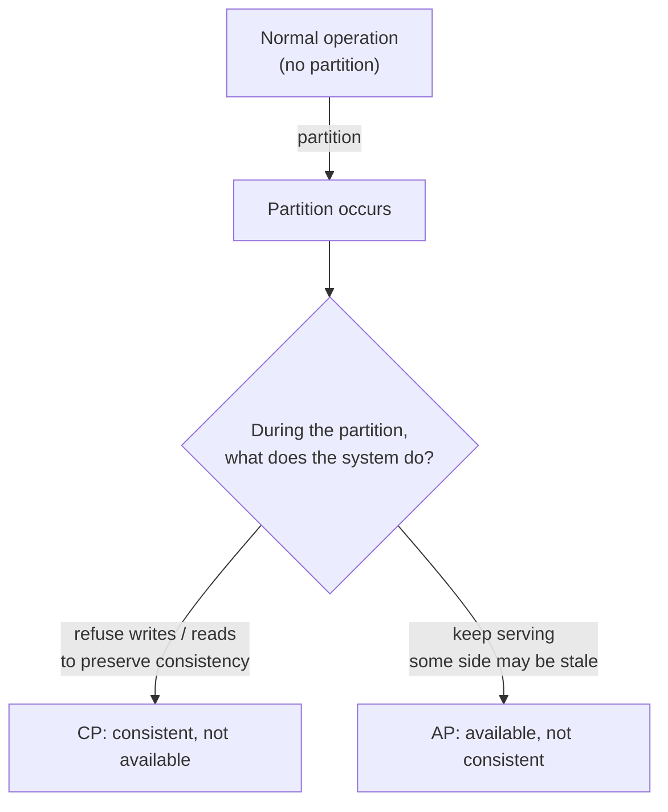
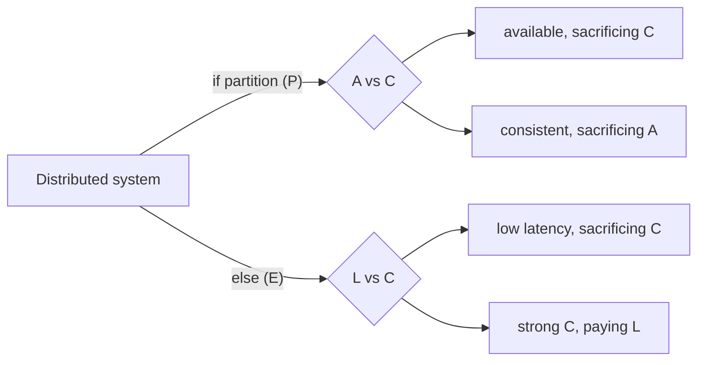

# CAP Theorem & PACELC

The **CAP theorem** is the most-cited and most-misunderstood result in distributed systems. Eric Brewer presented it as a conjecture at the 2000 PODC conference; Seth Gilbert and Nancy Lynch proved it formally in 2002. The original statement: *in a distributed system, you can have at most two of consistency, availability, and partition tolerance — but never all three at once.* In the two decades since, the theorem has been routinely misquoted to justify architectural choices ("we picked AP", "Cassandra is CP") that, on inspection, are not quite what CAP actually said. Daniel Abadi's **PACELC** (2010) corrected one of CAP's worst omissions by adding what the system does *the rest of the time* — when there is no partition — naming the latency-vs-consistency trade-off that dominates ordinary operation.

The depth bar here is **the precise statement and the common misreadings**. CAP is *not* a menu of three things you pick two of; it is a constraint that activates *during a partition*, and "available + consistent + partition-tolerant" is not achievable specifically because *during a partition* you must choose to either keep accepting reads/writes (at the cost of consistency) or refuse them (at the cost of availability). Outside of partitions, *every* system trades latency against consistency, which is what PACELC names. We trace what "consistency," "availability," and "partition tolerance" each mean *in the CAP sense* (which is narrower than colloquial use), prove the theorem's intuition, and walk through how real database systems — PostgreSQL, MongoDB, DynamoDB, Cassandra, Spanner, Redis Cluster — actually behave during partitions and outside them. We name the cases where the theorem is correctly applied (split-brain mitigation, quorum design, geo-distributed databases) and the cases where it is wielded incorrectly ("CAP says we can't have transactions across services" — no it doesn't). By the end you will read any database's documentation and predict its CAP and PACELC behavior, defend a consistency/availability choice with explicit trade-off language, and refuse the most common form of CAP misuse in architecture conversations.

> [!NOTE]
> Prerequisites: a working understanding of TCP, replication, and what a "database transaction" is. The earlier L2/C03 networking material covers the network-layer mechanics; this topic operates at the distributed-systems level.

## The Origin Of CAP — Brewer, The 2000 Keynote, And The Industry It Came From

CAP is one of the few results in distributed systems with a precise origin moment. **Eric Brewer's keynote at the Principles of Distributed Computing (PODC) conference in Portland, Oregon, July 19, 2000**, titled [*Towards Robust Distributed Systems*](https://people.eecs.berkeley.edu/~brewer/cs262b-2004/PODC-keynote.pdf), introduced what became known as the CAP conjecture. To understand *why* Brewer made the conjecture, you have to understand the systems he was building at the time.

### Who Eric Brewer Is

Brewer (born 1967) was a Berkeley computer science professor and the **co-founder of Inktomi Corporation (1996)**. Inktomi built the search engine infrastructure that powered HotBot, Yahoo Search, Microsoft's MSN Search, and others through the late 1990s. **Inktomi's distinctive contribution was running search across many commodity Linux machines**, a radical architecture at the time when search engines like AltaVista ran on expensive DEC Alpha servers. Inktomi's distributed-cluster architecture was the *first widely-deployed industrial distributed system at internet scale*.

In running Inktomi, Brewer's team encountered specific failures that motivated the CAP conjecture. The search-index cluster needed to handle:

1. **Constant availability** — search queries that returned "try later" were unacceptable; users would switch to AltaVista.
2. **Eventually-consistent index updates** — new crawled pages had to appear in the index, but a few seconds of delay was acceptable.
3. **Network partitions** between the index nodes were *routine* in 1996–2000 commodity hardware — switches died, NICs failed, kernel panics took machines down.

The team consistently found themselves making the same trade-off: *during a partition, we either fail queries (preserving consistency with the not-yet-updated index) or serve queries from the still-reachable nodes (accepting that they have stale data)*. **There was no third option**. Brewer's PODC keynote articulated this as a general principle.

### The 2000 Conjecture vs The 2002 Proof

What Brewer said in 2000 was a **conjecture** — an observation he believed to be generally true based on experience but had not formally proved. The keynote (slide 14) stated:

> "You can have at most two of: Consistency, Availability, Partition-tolerance."

**Seth Gilbert and Nancy Lynch at MIT proved the conjecture formally in 2002** in their paper [*Brewer's Conjecture and the Feasibility of Consistent, Available, Partition-Tolerant Web Services*](https://www.glassbeam.com/sites/all/themes/glassbeam/images/blog/10.1.1.67.6951.pdf). The proof is short — about 12 pages — and proceeds by contradiction: assume a system that maintains linearizable consistency and full availability across a partition; construct a sequence of operations that produces an inconsistent observation; conclude impossibility.

The Gilbert–Lynch proof is *narrower* than Brewer's conjecture. Specifically:
- "Availability" in the proof means **every request to a non-failing node receives a response that is not an error**, on an asynchronous network where message delays are unbounded.
- "Consistency" in the proof is **linearizability** — the strongest single-object consistency model.
- "Partition tolerance" is **the system continues to operate when arbitrary messages are dropped**.

The conjecture as commonly cited ("pick 2 of 3") is a simplification of the actual result. The precise statement is closer to: **during a partition, a system cannot simultaneously preserve linearizable consistency and full availability**. Outside of partitions, you can have both.

### Why CAP Took Off In The Industry (2006–2010)

Between 2002 (the proof) and 2006, CAP was a *theoretical* result discussed primarily in academic distributed systems courses. The transition to industry vocabulary happened in **2006–2010** as the "NoSQL" movement emerged, driven by:

- **Google's BigTable paper** (2006) and **Spanner paper** (2012).
- **Amazon's Dynamo paper** (October 2007), which explicitly framed itself as a CAP-aware design.
- **The 2009 NoSQL meetup** in San Francisco, which crystallized the term "NoSQL."
- **Werner Vogels's 2008 ACM article** [*Eventually Consistent*](https://queue.acm.org/detail.cfm?id=1466448), which used CAP terminology to explain DynamoDB's design choices.

The marketing of NoSQL databases (Cassandra, Riak, MongoDB, CouchDB) used CAP as a positioning framework: "we chose AP; relational chose CA." This is where the **misreading** of CAP as a "pick 2 of 3 menu" became widespread. The actual result is more subtle, as covered in [§ Common Misreadings Of CAP](#common-misreadings-of-cap).

### PACELC — Daniel Abadi's 2010 Refinement

By 2010, the limitation of CAP as a design framework was clear: **it only described behavior during partitions, but partitions are rare**. The 99% case is *normal operation*, where CAP says nothing. **Daniel Abadi, then a Yale professor (now Maryland)**, published [*Problems with CAP, and Yahoo's little known NoSQL system*](http://dbmsmusings.blogspot.com/2010/04/problems-with-cap-and-yahoos-little.html) in 2010 introducing PACELC.

PACELC adds: **if Partition then A or C, Else L or C** — where L is Latency. The observation: even when there is no partition, a system makes a trade-off between latency (synchronous replication is slow) and consistency (asynchronous replication produces stale reads). Spanner pays latency for consistency; Cassandra at CL=ONE pays consistency for latency.

PACELC is **the more complete framework**, but CAP remained the more widely-cited term because it had 10 years of vocabulary head-start.

## Why CAP, Specifically: The Senior Engineer's Q&A

### Q1: What problem does CAP solve, and why does it matter for an engineer?

CAP is not a *recommendation*; it is an *impossibility result*. It matters because it tells you what is **not buildable**. If a vendor claims "consistent, available, partition-tolerant, all at once" — they are either misunderstanding their own product or using non-standard definitions. CAP gives you the right *skeptical question* to ask: "what does your system do during a network partition?"

The senior engineer's use of CAP: **eliminate impossible architectures from consideration**. If the requirement is "must serve every read with the most-recent write, even during regional partitions, with high availability" — CAP says that is impossible at the relevant scale. The requirement must be relaxed somewhere. Identifying *where* it must be relaxed is the senior's job.

### Q2: What was the industry doing before CAP, and why was it inadequate?

Pre-CAP, the industry believed (and marketing supported the belief) that **the right database technology** could deliver all three properties. Oracle's marketing in the 1990s and early 2000s positioned RAC (Real Application Clusters) as "highly available and consistent across nodes." DB2's marketing made similar claims. **These claims were technically defensible only because the systems failed in undefined ways during partitions** — they did not lose consistency *because* they did not function during partitions; the cluster suspended both reads and writes when split-brain was detected.

CAP made this *explicit*. Once it was clear that all systems are CP or AP during partition (and "CA" means "we crash or hang"), engineers could make the trade-off deliberately rather than discovering it during an outage.

### Q3: Why is "linearizability" the consistency in CAP rather than serializability?

Subtle distinction with major consequences:

- **Linearizability** is *single-object* consistency: every operation appears to take effect at some instant between its invocation and its completion, in a real-time order.
- **Serializability** is *multi-object transactional* consistency: a set of transactions appears to execute in some serial order that produces the observed results.

CAP's C is linearizability because the *original problem* (Brewer's web services) was about single-object reads and writes (search results). Database transactions were not Brewer's focus. The Gilbert–Lynch proof is formally a single-register proof.

A system can be **serializable but not linearizable** (snapshot isolation does this — Postgres's default `READ COMMITTED` is non-linearizable but achieves serializability for the visible transactions). A system can be **linearizable but not serializable** (a single-register linearizable system doesn't handle multi-key transactions at all).

This is why understanding CAP precisely matters: a Postgres claim of "Serializable" doesn't address the CAP question, and a Cassandra claim of "tunable consistency to QUORUM" can be CAP-strongly-consistent without being serializable. **The two axes are independent**, and conflating them produces architectural confusion.

### Q4: What was the actual lived experience that motivated Brewer in 2000?

A concrete example from Inktomi's operation: the search index was sharded across ~100 servers. When the team deployed a new index version (say, a re-crawl with new pages), the deployment took roughly 30 minutes to propagate to all shards. During those 30 minutes, **the cluster contained mixed versions**.

Three options during the propagation:
1. **Refuse queries** — block search for 30 minutes (unacceptable to Yahoo, who paid the bills).
2. **Serve queries from old version only** — predictable but stale.
3. **Serve from whatever version each shard had** — fast but inconsistent across shards.

Inktomi chose option 3, with the reasoning that "users get slightly stale results but the system is fast" was acceptable for search. **Brewer generalized this into "we chose AP."** The CAP keynote was Brewer formalizing a decision he was *already making* daily.

### Q5: How does CAP compare to other impossibility results?

Three notable ones a staff engineer should know:

#### FLP Impossibility (Fischer–Lynch–Paterson, 1985)

In an asynchronous system with even one crash failure, no deterministic consensus algorithm can guarantee both **safety** (all nodes decide the same value) and **liveness** (the algorithm terminates). This is older than CAP and deeper.

The practical consequence: Paxos and Raft (see [T03](./T03-consensus-raft-paxos-intro.md)) sidestep FLP by using *randomized timeouts*, which means they're not strictly deterministic. They almost always terminate but cannot guarantee it in finite time.

#### The Two Generals' Problem (Akkoyunlu, Ekanadham, Huber, 1975)

Two generals communicating via unreliable messengers cannot reliably synchronize attack times. **No finite protocol can guarantee shared knowledge over an unreliable channel.** This underlies why distributed transactions are hard (2PC cannot guarantee commit in finite time over a flaky network) and why exactly-once delivery is impossible across an unreliable network without compensation.

#### Consensus Number Hierarchy (Maurice Herlihy, 1991)

Synchronization primitives have a *consensus number* — the number of processes they can solve consensus among. Compare-and-swap has infinite consensus number; test-and-set has 2; atomic registers have 1. This explains why x86-64's `CMPXCHG` instruction is so important: it's the consensus primitive of choice for shared-memory algorithms.

CAP sits in this lineage of "what you cannot have in distributed systems." Knowing the lineage prevents the common error of treating each result as a standalone constraint.

### Q6: How did CAP shape NoSQL adoption (and where did vendors mislead)?

Between 2008 and 2014, the NoSQL marketing claimed CAP-classified positioning:

- **MongoDB**: "CP — strong consistency at the cost of availability during partition."
- **Cassandra**: "AP — tunable, prefer availability."
- **Riak**: "AP with eventual consistency."
- **HBase**: "CP — column-family store with strong consistency."

**Jepsen testing by Kyle Kingsbury (2013+)** systematically disproved most of these claims. Riak passed (with proper conflict resolution); MongoDB failed (it could lose writes in CP mode); Cassandra failed (it could produce stale reads even at QUORUM); HBase failed (region-server failures lost data under specific scenarios).

The Jepsen reports forced the industry to **distinguish vendor claims from actual behavior**. By 2018, most NoSQL vendors had revised their CAP positioning to be more honest. The senior engineer's lesson: **read the Jepsen report before believing any database vendor's CAP claim**.

## The Mechanism In Depth — What Actually Happens During A Partition

The CAP abstraction hides what's physically happening. Let's trace through both choices concretely.

### Tracing The CP Choice (Spanner-style)

Spanner uses two-phase commit with Paxos-replicated coordinators. During a partition:

1. **Detection**: heartbeat timeouts identify which nodes are unreachable.
2. **Paxos termination**: the partition prevents the majority of replicas from being reachable to one side; that side cannot make progress in any Paxos round. The minority side stalls.
3. **Client behavior**: clients on the minority side receive timeouts. Their reads and writes block, then fail.
4. **TrueTime cushion**: Spanner's commit-wait protocol (built on GPS+atomic clock-bounded uncertainty) ensures that even brief partitions don't produce stale-read inconsistencies once the partition heals.
5. **Resolution**: when the partition heals, the minority side rejoins, catches up on Paxos rounds it missed, and resumes serving.

The cost: **the minority side is unavailable for the duration of the partition**, typically 30 seconds to several minutes for a healthy data center. Users on the minority side see errors.

### Tracing The AP Choice (Cassandra at CL=ONE)

Cassandra at consistency level ONE during a partition:

1. **Detection**: gossip protocol identifies unreachable nodes within ~5 seconds.
2. **Local writes**: each side of the partition continues accepting writes to its local replicas. Each write succeeds at the ONE node it reaches.
3. **Hint storage**: if the write was for a key whose primary replica is unreachable, a coordinator on the live side stores a "hint" for later delivery.
4. **Read with stale data**: reads served from CL=ONE may return any replica's view, including stale data from one side that hasn't seen the other side's writes.
5. **Resolution**: when the partition heals, hinted handoffs deliver missed writes, anti-entropy repair reconciles divergence over time. **Conflict resolution is last-writer-wins by timestamp**, which can silently lose updates if clocks are skewed.

The cost: **applications see stale data during partition, and may permanently lose concurrent writes if conflict resolution chooses incorrectly**.

### The Asymmetric Cost (Why "Just Pick AP" Is Often Wrong)

Engineers often default to AP because "users can't see error messages." But the cost of AP is *permanent data corruption* (lost writes), while the cost of CP is *temporary unavailability*. For financial data, identity systems, inventory counts — **a brief outage is recoverable; a silently lost write is not**. The senior engineer's heuristic:

- **Can I tell the user "try again in 60 seconds"?** → CP is acceptable.
- **Is the data tolerant of last-writer-wins conflict resolution?** → AP is acceptable.
- **Is the data both intolerant of outages and intolerant of LWW?** → you have a problem CAP cannot solve, and you need to redesign so that the affected data isn't both critical and partition-prone (often: replicate the critical subset synchronously while accepting AP elsewhere).

## Common Misconceptions Explained

### "CAP says you must pick 2 of 3."

False. CAP says: **during a partition**, you must choose between consistency and availability. Outside of partitions, you can have both. The "pick 2 of 3" framing is a popular oversimplification that obscures the partition-conditional nature of the trade-off.

### "Picking CA means rejecting partition tolerance."

False. **Picking CA means assuming partitions don't happen** — which they always eventually do. Any system labeled "CA" is undefined under partitions, which usually means it has lurking bugs. The CA label in distributed systems is essentially a marketing euphemism for "we hang or crash during partitions."

### "Modern systems have solved CAP."

False. **CAP is a theorem, not a problem.** Modern systems like Spanner have *engineered around* the practical pain (TrueTime makes partitions effectively brief), but they have not "solved" CAP. During a partition, Spanner is CP — the minority side stalls.

### "CAP applies to microservices."

False. **CAP is about distributed data stores.** The reasoning is about *replicated state*. Microservices are *stateless* (mostly); their CAP-equivalent question is "what happens to your application during a partition?" — which is answered by resilience patterns ([T14](./T14-resilience-circuit-breaker-bulkhead-retry-timeout-backpressure.md)), not by CAP.

### "Cassandra is AP."

Partially true. **Cassandra is tunable** — at CL=QUORUM with R+W>N, it is CP. The defaults are AP-leaning, but the same cluster can run a query at QUORUM and be CP for that query. The blanket "Cassandra is AP" obscures the per-query nature of the choice.

### "Linearizability and Serializability are the same."

False. **Linearizability is real-time order; serializability is some serial order.** As covered in Q3, these are independent axes. Postgres's default is serializable but not linearizable (snapshot isolation). Spanner achieves both (its "external consistency" claim combines linearizability and serializability).

### "Eventual consistency means 'eventually correct.'"

Partially true but misleading. **Eventual consistency means: if writes stop, all replicas converge to the same value eventually**. It does *not* mean "the value will be correct" — if your conflict resolution is last-writer-wins and your clocks are wrong, you can converge to *incorrect* values. The "eventual" is about convergence, not correctness.

## What CAP Actually Says

The 2002 Gilbert–Lynch formalization, in plain terms:

> In an asynchronous network model with no clocks and arbitrary message delays, no distributed data store can simultaneously provide all three of: linearizable consistency, perfect availability of every non-failing node, and tolerance of arbitrary network partitions.

Three terms need precise definitions:

### Consistency (in CAP)

CAP's "C" is **linearizability** (also called atomic or strong consistency): every read receives the most recently written value, *as if* the system were a single process. A write at time T is visible to every read at time T+ε, for some ε that goes to zero. This is a *strong* notion of consistency — much stronger than the "eventual consistency" that systems like DynamoDB or Cassandra default to.

This is *not* the same as the "C" in ACID. ACID's C is "consistency = the database remains in a valid state per its constraints." CAP's C is "consistency = single-image of data across nodes." The two letters share three characters and zero meaning.

### Availability

CAP's "A" is **every request to a non-failing node receives a non-error response**. The system never returns "I can't talk to my peers, try later." Any node that is up answers any query, with *some* value (which may be stale, but that's CAP's "A" cost paid against CAP's "C").

This is a *strong* form of availability. Real-system availability is usually weaker — uptime percentages tolerate occasional unavailability — but CAP's binary notion is what the theorem operates on.

### Partition Tolerance

CAP's "P" is **the system continues to operate when the network drops messages between groups of nodes**. A partition is the network splitting some nodes from others; partition tolerance is "we keep going."

This is the misread term in CAP. Engineers sometimes say "we don't need partition tolerance because our network is reliable" — but **partitions happen on any real network**, given enough time. AWS availability zones have had hours-long partitions. Cross-region links go down. Switches reboot. Cables get cut by construction. *Choosing not to be partition-tolerant means choosing to be unavailable when (not if) a partition occurs.* "P is optional" is mostly false in practice.

## The Theorem In Action



The theorem's force is the moment a partition occurs: **the system has to choose**. Either some nodes refuse requests (preserving consistency, sacrificing availability — the CP choice) or all nodes serve requests with their local state (preserving availability, sacrificing consistency — the AP choice). There is no third option that preserves both, because reconciling state requires communication, and communication has been cut.

A simple proof sketch: suppose nodes A and B both hold replicas of value X. A partition cuts them off from each other. A client writes `X = 5` to A. A second client reads X from B. If the system claims linearizability (the second client must see 5), B has to refuse — A and B can't communicate, so B can't know about the write. If the system claims availability (B must respond), B returns its stale value (not 5). One of them gives.

### Why "CA" Doesn't Exist (Except In Marketing)

Some systems are labeled "CA" — consistent and available, no partition tolerance. The honest reading: such a system *assumes* the network never partitions, and behaves undefined when one occurs. A single-node database (no network) is genuinely CA. A distributed system claiming CA is hiding partition-induced bugs under the carpet — when a partition happens, it might lose data, split-brain, or have undefined behavior. The "CA" label in distributed systems is a sales euphemism.

## PACELC — What CAP Forgot

CAP says nothing about what the system does when there is no partition. Daniel Abadi observed in 2010 that *every* distributed system makes another trade-off in normal operation: between **L**atency and **C**onsistency.



The PACELC notation: **if Partition then A or C, Else L or C**. Each system is labeled with both choices. Examples:

| System | Partition behavior | Normal behavior | PACELC |
|--------|-------------------|------------------|--------|
| **Spanner** | CP (refuse during partition) | EC (strong consistency via TrueTime; pays latency) | PC/EC |
| **DynamoDB** | AP (eventual consistency) | EL (low latency by default; eventual consistency) | PA/EL |
| **Cassandra** | AP | EL | PA/EL |
| **MongoDB (strong reads from primary)** | CP (refuses during partition) | EC | PC/EC |
| **MongoDB (eventual reads from secondary)** | AP | EL | PA/EL |
| **CockroachDB** | CP | EC | PC/EC |
| **PostgreSQL (single-primary)** | CP | EC | PC/EC |
| **PostgreSQL (with sync replication)** | CP | EC (higher latency) | PC/EC |
| **Redis Cluster** | depends on config | depends on config | varies |

The PACELC view makes clear that **calling a system "AP" or "CP" only describes half its behavior**. Spanner is famously CP — but its global consistency in normal operation comes at a latency cost (TrueTime waits a few milliseconds to bound clock uncertainty). DynamoDB is AP but its eventual consistency is the default; you can request strongly-consistent reads at higher latency. PACELC captures the full picture.

## Tracing Through Real Systems

A walk through how the popular databases handle the trade-off.

### PostgreSQL (Single-Primary)

Default deployment: one primary, one or more read replicas with asynchronous replication.

- **Normal operation**: writes go to the primary; reads from the primary are linearizable; reads from replicas are eventually consistent (lag by milliseconds).
- **During a partition**: if the primary loses its replicas, writes continue on the primary (sacrificing replication durability briefly); replicas continue serving stale reads. If the primary itself is on the wrong side of the partition, a failover may promote a replica — and during the failover window, the system is unavailable or risks split-brain if misconfigured.
- **PACELC**: PC/EC for writes, PA/EL for replica reads.

Modern PostgreSQL setups with synchronous replication (`synchronous_commit = on`) and quorum failover via tools like **Patroni** become genuinely CP — primary won't ack a write until enough replicas confirm. The latency cost is the cross-replica round-trip; the consistency benefit is no lost writes on failover.

### MongoDB

A replica set with one primary and N secondaries.

- **Strong reads** (`readConcern: linearizable` from primary): CP/EC.
- **Eventual reads** (`readPreference: secondary`): PA/EL.
- **Partition behavior**: primary that loses majority steps down; with majority unreachable, the cluster has no primary and writes fail. CP under that mode.

### DynamoDB

AWS's managed key-value / document store. Partitioned across many nodes; replicated 3-way across availability zones.

- **Default reads**: eventual consistency (cheaper).
- **Strong reads**: `ConsistentRead = true` (twice as expensive; reads from leader replica).
- **During a partition**: the AZ that has the leader keeps serving; others may return stale data. Auto-failover when the leader is unreachable.
- **PACELC**: PA/EL by default; PA/EC for strong reads.

### Cassandra

A masterless, peer-to-peer cluster. Every node is equal. Writes go to *any* node and replicate.

- **Tunable consistency**: per query, choose how many replicas must ack (`CL=ONE`, `CL=QUORUM`, `CL=ALL`).
- **CL=ONE**: write to one replica, return. Eventually consistent. PA/EL.
- **CL=QUORUM**: write to majority, return. Strongly consistent (R + W > N gives strong reads). PC/EC.
- **During a partition**: with `CL=QUORUM`, writes to the minority side fail. Majority side keeps writing. After the partition heals, anti-entropy (hinted handoff, read repair) reconciles.

### Spanner

Google's globally-distributed, strongly-consistent database.

- **TrueTime**: GPS- and atomic-clock-derived bounded-error clocks. Every commit waits for the clock uncertainty window to pass, guaranteeing real-time ordering.
- **Global transactions**: serializable across continents.
- **During a partition**: minority side stops accepting writes. CP.
- **PACELC**: PC/EC. The "EC" is the real cost — a transaction pays a few milliseconds of latency for the TrueTime wait, even when no partition is happening.

### Redis Cluster

Redis Cluster shards keys across multiple primary nodes with replicas.

- **Default**: writes are async-replicated to replicas; *not* strongly consistent.
- **During a partition**: behavior depends on `cluster-allow-reads-when-down`, `cluster-require-full-coverage`, and `cluster-node-timeout`. Often AP-ish, but with the famous risk of *lost writes* during failover — Redis is *not* designed for strong consistency.
- **PACELC**: PA/EL — Redis prioritizes speed over consistency by design. Use cases that need consistency on top of Redis are misusing it.

## Common Misreadings Of CAP

### Misreading 1: "CAP says you can't have transactions across services."

False. CAP is about a *single* distributed data store. Cross-service transactions are a different problem (atomic commit, see [T06](./T06-distributed-transactions-2pc-saga.md)). The reason cross-service transactions are hard has more to do with two-phase commit's coordinator dependency than CAP.

### Misreading 2: "We don't need P; our network is reliable."

False in practice. Real networks partition. Cloud-provider data shows availability zones partition for tens of minutes per year on average. A system claiming to be CA is a system that is undefined under partitions — which means it has lurking bugs.

### Misreading 3: "Cassandra is AP, period."

Partial. Cassandra is *tunably* AP or CP based on consistency level per query. The system's *defaults* are AP-leaning, but the same cluster can run a query at `CL=QUORUM` and be CP for that query.

### Misreading 4: "We picked AP because we don't care about consistency."

Usually a misread of business requirements. Most businesses care a lot about consistency for *some* operations (financial, identity, inventory) and not so much for others (analytics, recommendations, content). The architecture should make explicit per-operation choices, not blanket "AP-ness."

### Misreading 5: "CAP is solved by [vendor]."

No vendor has solved CAP — it's a theorem, not a problem. What vendors offer is sophisticated handling of the trade-off (TrueTime in Spanner, conflict-free replicated data types in Riak, tunable consistency in Cassandra). The trade-off is still there; the vendor just gives better tools for navigating it.

## Strategies For Living With CAP

Given that CAP is a constraint we cannot escape, four practical strategies dominate.

### 1. Pick CP And Accept Brief Unavailability

For data that *must* be consistent — account balances, inventory counts, user credentials — choose CP. Accept that during a partition, the minority side will refuse requests. Make the partition window short (good operations, fast failover); make the unavailability customer-friendly (clear error message, retry guidance).

### 2. Pick AP With Conflict Resolution

For data where availability matters more than instant consistency — shopping carts, edit history, replicated configuration — choose AP. Reconcile conflicts on read or at heal time. Strategies:

- **Last writer wins (LWW)**: simple, sometimes wrong, sometimes fine.
- **Application-level reconciliation**: the application decides how to merge concurrent writes.
- **CRDTs (Conflict-free Replicated Data Types)**: mathematical structures that guarantee any two replicas converge on the same value after exchanging information. Counter CRDTs, set CRDTs, sequence CRDTs.

### 3. Use Separate Stores For Different Consistency Needs

A single system often has both CP and AP-appropriate data. Use the right store for each. Postgres for the consistent core (accounts, orders, identity); Cassandra or DynamoDB for the eventually-consistent periphery (timeline, recommendations, sessions). This is the natural pairing of CQRS ([T09 of C01](../C01-software-architecture/T09-cqrs.md)) with the right store per side.

### 4. Engineer The Partitions Down

CAP only activates during a partition. Minimizing partition frequency and duration is a separate engineering investment: redundant network paths, careful AZ design, fast partition detection, quick failover. The CAP choice is what you do *during* a partition; engineering the network is reducing how often you have to make it.

## CAP And The Theoretical Boundary

CAP is a *statement of impossibility*, like the FLP impossibility result (Fischer, Lynch, Paterson 1985 — no deterministic consensus in an asynchronous network with even one crash failure). These results don't prevent useful systems; they bound what useful systems can claim. Raft and Paxos (see [T03](./T03-consensus-raft-paxos-intro.md)) sidestep FLP by using randomization (timeouts that vary), giving probabilistic — not deterministic — termination. Spanner sidesteps CAP's harshness by engineering TrueTime, making the partition window short enough and the clocks tight enough that the trade-off is invisible most of the time.

The theoretical bound is real. The engineering response is to make the bound's costs invisible *for the use cases that matter*.

## How To Apply CAP/PACELC In Architecture Discussions

A practical checklist for using these correctly in a senior engineering conversation:

1. **Name the data store under discussion.** CAP is about one store, not a system.
2. **Name the operation.** Tunable systems behave differently per operation.
3. **Say what partition behavior is acceptable.** "During a 30-second partition, we will accept writes failing on the minority side" is a real requirement.
4. **Say what normal-operation latency is acceptable.** "Reads must be < 10 ms p99" implies you can't pay TrueTime's cross-region wait.
5. **Don't conflate consistency models.** Linearizable (CAP's C), serializable (transactions), causal, eventual — these are not synonyms.
6. **Don't generalize to systems beyond data stores.** "Microservices can't be CAP-consistent" is a category mistake.

## Cross-Language / Cross-Platform Notes

CAP applies wherever distributed data stores do. Java, Go, Rust, Python — irrelevant. The relevant tool is the data store, not the application language. JVM clients to all major distributed databases (PostgreSQL JDBC, Cassandra Java driver, MongoDB driver, AWS SDK for DynamoDB) expose the consistency knobs:

```java
// Cassandra: per-query consistency level
Statement stmt = SimpleStatement.builder("SELECT * FROM users WHERE id = ?")
    .addPositionalValue(id)
    .setConsistencyLevel(DefaultConsistencyLevel.QUORUM)
    .build();

// DynamoDB: strongly consistent read
GetItemRequest req = GetItemRequest.builder()
    .tableName("users")
    .key(Map.of("id", AttributeValue.builder().s(id).build()))
    .consistentRead(true)
    .build();
```

The same conscientiousness applies regardless of language — the JVM is exposing the database's CAP/PACELC knob; the application has to know which side of the trade-off it wants for which operation.

## Trade-Off Summary

| Choice | When to prefer |
|--------|----------------|
| **CP, EC (Spanner-style)** | Money, identity, inventory; consistency cost is a few ms of latency |
| **CP, EL (PostgreSQL with primary)** | Most relational workloads; mostly fast, sometimes briefly unavailable on failover |
| **AP, EL (DynamoDB default, Cassandra)** | High-scale read-heavy; consistency at integrate-points but eventual elsewhere |
| **AP, EC (DynamoDB strong reads)** | When you can afford the latency for occasional strong reads in an AP system |
| **Per-operation tunable** | Mixed workloads — most of CAP/PACELC's expressive power |

> [!INTERVIEW]
> A common L5 prompt: "Explain CAP." Strong answers (a) give the precise statement (not three-of-three but C-or-A during a partition), (b) add PACELC for the non-partition case, (c) name a real system per axis, (d) call out at least one common misreading. The interviewer is testing whether you understand the theorem or just its name.

## Practice

1. **Real systems audit.** For three data stores you use in production (PostgreSQL, Redis, DynamoDB, MongoDB, Kafka, etc.), classify each under PACELC. Defend each classification.
2. **Trace a partition.** Pick one store. Sketch what happens, second by second, when a network partition cuts off half the cluster. Identify which side serves which requests.
3. **Choose per-operation.** For an e-commerce system: list 8 operations (place order, view product, add to cart, view order history, search, recommend, log activity, send email). Assign each to CP or AP with reasoning.
4. **Linearizability vs serializability.** Explain the difference in one paragraph. Identify a scenario where a system is serializable but not linearizable.
5. **CRDT introduction.** Read about counter CRDTs. Sketch how a `+1` counter can be merged across two diverging replicas without conflict. Implement in Java.
6. **The Spanner question.** Explain why Spanner is CP but "feels" available. Identify the engineering investment (TrueTime, fast failover, dense cells) that makes the CP cost invisible.
7. **Tunable Cassandra design.** Design a Cassandra schema for an order system. For each table, pick a default consistency level (`R`, `W`) and justify.
8. **Misreading hunt.** Find a CAP claim in a vendor's marketing or a blog post. Identify whether it's correct, misread, or a category mistake.
9. **PACELC table for your system.** Build a table of every data store in your production system. For each, fill PACELC. Identify mismatches (a store used in a way its PACELC doesn't fit).
10. **The skeptic conversation.** A senior engineer says "CAP is academic; we just use Postgres." Write a 200-word response that takes the position seriously but identifies the partition scenario the team should have a plan for.

## Recap

You should now be able to:

- State the **CAP theorem** precisely — under a partition, a system chooses between consistency and availability — and avoid the "two of three" miscasting.
- Define **CAP's C, A, P** in the precise sense (linearizability, all-non-failing-nodes-respond, partition-tolerated) and recognize that they are stronger than colloquial use.
- Apply **PACELC** to capture both the partition behavior and the normal-operation latency-vs-consistency trade-off.
- Classify real data stores under PACELC: **PostgreSQL, MongoDB, DynamoDB, Cassandra, Spanner, Redis** — and read their docs to predict behavior.
- Recognize and refuse **five common misreadings**: "CAP forbids transactions," "we don't need P," "Cassandra is AP period," "we picked AP because consistency doesn't matter," "vendor X solved CAP."
- Apply the **four living-with-CAP strategies**: pick CP and accept brief unavailability, pick AP with conflict resolution, separate stores per consistency need, engineer partitions down.
- Tune the **Cassandra / DynamoDB / Mongo consistency knobs** per operation, in Java code.
- Articulate CAP / PACELC in **architecture conversations** with the discipline of naming the store, the operation, the partition behavior, the normal-operation latency, the consistency model in precise terms.
- Place CAP next to the **FLP impossibility** result and other distributed-systems boundaries — these are limits engineering navigates, not solves.

## Next

Continue to [Consistency Models (Strong, Eventual)](./T02-consistency-models-strong-eventual.md) — the spectrum of consistency models that distributed systems actually offer, from linearizable down through causal, read-your-writes, monotonic, and eventual. CAP names the dichotomy; this topic gives the full vocabulary.
