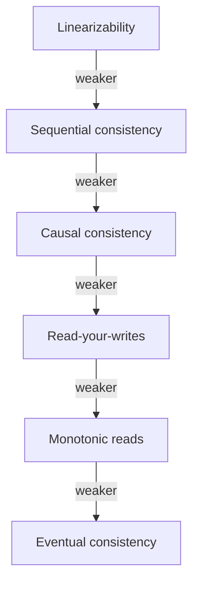
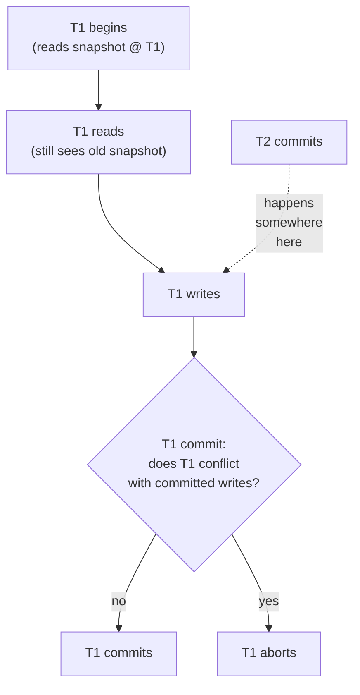

# Consistency Models (Strong, Eventual)

[CAP](./T01-cap-theorem-and-pacelc.md) names a dichotomy — consistency or availability during a partition — that suggests consistency is binary. It isn't. In practice, there are **at least nine consistency models** that distributed systems offer, arranged on a spectrum from the strictest (linearizability — every read sees the very latest write, as if from one global timeline) down through several intermediate models (causal, read-your-writes, monotonic reads) to the weakest practical model (eventual consistency — all replicas will agree *eventually*, with no promise about when). Each model is a *contract* between the database and the application: the application can rely on certain guarantees holding, and in exchange the database charges a cost in latency, availability, or throughput. **Choosing the right model is the most consequential database decision in any distributed system**, and the model the team picks by accident (by defaulting to whatever the database does) is rarely the right one.

The depth bar here is **what each model guarantees, what it disallows, what real anomalies it prevents, and what each costs**. We trace the canonical anomalies that consistency models exist to prevent — lost updates, dirty reads, non-repeatable reads, phantom reads, write skew, read skew — and show which models prevent which, drawn from Adya/Liskov/O'Neil's 1999 *Generalized Isolation Level Definitions* and the Hermitage testing framework (Martin Kleppmann, 2014). We trace the *separate* lineage of database isolation levels (the ANSI SQL hierarchy: Read Uncommitted, Read Committed, Repeatable Read, Serializable — plus the practical Snapshot Isolation that PostgreSQL and Oracle actually implement) and show how isolation models intersect with replication consistency models. We name **Jepsen** — Kyle Kingsbury's testing framework that has, since 2013, repeatedly demonstrated that major databases' real-world behavior diverges from their advertised consistency models, the source of dozens of CVEs and bug-fix releases. We compare consistency models across Postgres, MySQL, MongoDB, DynamoDB, Cassandra, Spanner, and CockroachDB. By the end you will choose the right consistency model per operation, recognize the anomalies the wrong choice would admit, defend the choice with named anomalies and named models, and read any database's docs to verify what it actually delivers.

> [!NOTE]
> Prerequisites: [CAP Theorem & PACELC](./T01-cap-theorem-and-pacelc.md) (`L5/C02/T01`). The vocabulary here is the *spectrum* CAP collapses into "C". The two topics are inseparable: CAP names the boundary; this topic names the choices inside it.

## Where Consistency Models Came From — The 50-Year Vocabulary Evolution

Consistency models did not arrive in a single insight; they evolved over fifty years of trying to understand "what does it mean for a distributed system to be consistent?" The vocabulary you use today — linearizability, sequential consistency, causal consistency, eventual consistency — comes from specific moments in the academic and industrial conversation between roughly 1979 and 2010. Each model was introduced to express something its predecessors couldn't, and each name has a specific person, paper, and motivating problem behind it.

### Why Anyone Needed To Define "Consistency" In The First Place

In the 1970s, distributed systems barely existed; the consistency question didn't arise because there was nothing to be inconsistent about. The need to define consistency emerged with three converging technologies:

1. **Multiprocessor systems** (mid-1970s): early shared-memory machines (the Sequent Balance, the Encore Multimax) raised the question of *what one CPU sees when another CPU writes*. The naive answer ("the latest value") was meaningless without specifying *when* the latest write becomes visible.

2. **Database replication** (1976+): databases like System R and IBM IMS introduced replication for availability. Replicas could be out of sync; what did the application see?

3. **Distributed filesystems** (NFS 1984, AFS 1985): files cached on client machines could diverge from the server. What did "open" return after another client wrote?

Each of these systems had to *specify* what consistency it offered, because the naive intuition (a global memory) was no longer accurate. The consistency-model vocabulary grew up to name the choices.

### Strict Consistency (Bernstein, Hadzilacos, Goodman, 1986)

The first formal definition of *strong consistency* in databases was [*Concurrency Control and Recovery in Database Systems*](https://www.microsoft.com/en-us/research/people/philbe/) (Bernstein, Hadzilacos, Goodman, 1986), the canonical textbook of database concurrency. **Strict consistency**: every read returns the value of the most recent write, where "most recent" is defined by a global clock.

This was an *impossible* model in any real distributed system (clocks aren't globally synchronized), but it provided the *gold standard* against which weaker models could be compared. Every subsequent consistency model is a *weakening* of strict consistency in some specific way.

### Linearizability (Maurice Herlihy and Jeannette Wing, 1987–1990)

The canonical formal definition of **linearizability** came from [*Linearizability: A Correctness Condition for Concurrent Objects*](https://cs.brown.edu/~mph/HerlihyW90/p463-herlihy.pdf) (Herlihy & Wing, ACM TOPLAS, July 1990). The paper formalized what "single-machine-like" meant for distributed objects: every operation appears to take effect at some instant between its invocation and its completion.

**Maurice Herlihy** (born 1954) is a Brown University CS professor; he received the 2003 Dijkstra Prize for this work. **Jeannette Wing** (born 1956) was later Vice President at Microsoft Research and Columbia's professor; she co-developed linearizability while at CMU.

Linearizability replaced strict consistency as the *target* of distributed systems because it was *achievable* — it required only a logical ordering of operations, not a synchronized clock. CAP's "C" is linearizability precisely because of this paper.

### Sequential Consistency (Leslie Lamport, 1979)

Predating linearizability by a decade, **Lamport's 1979 paper** [*How to Make a Multiprocessor Computer That Correctly Executes Multiprocess Programs*](https://www.microsoft.com/en-us/research/wp-content/uploads/2016/12/How-to-Make-a-Multiprocessor-Computer-That-Correctly-Executes-Multiprocess-Programs.pdf) (IEEE Transactions on Computers, September 1979) introduced **sequential consistency**: operations appear in *some* total order that respects each process's program order.

The distinction from linearizability is subtle but crucial: **linearizability requires real-time order**; **sequential consistency requires only program order**. A sequentially consistent system can serve operations that "happened" in some order that doesn't match the wall-clock order, as long as each process's own operations appear in their program order.

This was originally a *multiprocessor* memory model, not a distributed-systems one. But it generalized: most distributed databases that claim "strong consistency" without TrueTime-like real-time bounds are actually offering sequential consistency, not linearizability.

### Causal Consistency (Mustaque Ahamad, et al., 1991+)

[*Causal memory: definitions, implementation, and programming*](https://link.springer.com/article/10.1007/BF01784241) (Ahamad et al., 1991) introduced **causal consistency** formally. The motivation: sequential consistency was too strong (required global coordination) and eventual consistency was too weak (provided no guarantees at all). Causal sat between them.

The intuition: operations that are *causally related* (one influenced the other) appear in the same order to all observers. Concurrent (causally unrelated) operations may appear in different orders. This is the **happens-before relation** ([T09](./T09-clocks-and-ordering-logical-vector-clocks.md)) applied to consistency.

Causal consistency became important for *collaborative applications* (Google Docs, Slack, etc.) where the user's own actions must appear in order but others' concurrent actions can interleave freely.

### Eventual Consistency (Werner Vogels, 2007–2008)

[*Eventually Consistent*](https://queue.acm.org/detail.cfm?id=1466448) (Vogels, December 2008, ACM Queue) was the popularization of the term, though the concept predates the article by decades (it's implicit in Bayou, Coda, and other 1990s replicated-systems work).

**Werner Vogels** (born 1958) is the CTO of Amazon. His ACM Queue article was *enormously influential* because it gave the NoSQL marketing a vocabulary to position itself against relational databases. "We're eventually consistent" became a positioning statement, with the implication that strong consistency was a cost not worth paying for most workloads.

The article specifically defined: a system is eventually consistent if, when no new updates are made to an object, eventually all accesses will return the last updated value. This is the weakest non-trivial consistency model — no guarantees about *when* convergence happens, just that it eventually will.

### The 2010s Refinements

Between 2010 and 2020, several refinements emerged:

#### Strong Eventual Consistency (Marc Shapiro et al., 2011)

[*Conflict-free Replicated Data Types*](https://hal.inria.fr/inria-00609399/document) (Shapiro et al., 2011) introduced **CRDTs** and the notion of **strong eventual consistency**: a system is strongly eventually consistent if any two nodes that have received the same set of updates are in the same state. The "strong" addition: convergence is *guaranteed*, not just *eventual*.

#### Read-Your-Writes And Monotonic Reads (Various, 1990s+)

These weaker session-level guarantees became formalized in industry contexts (Eric Brewer's papers, Amazon's Dynamo paper, the Bayou system). They specify per-session properties: a client always sees its own writes; a client never sees an *earlier* value of the same data on subsequent reads.

#### PRAM Consistency (Lipton and Sandberg, 1988)

[*PRAM: A scalable shared memory*](https://web.cs.ucla.edu/classes/spring02/cs213/papers/lipton-sandberg.pdf) formalized **Pipelined RAM** consistency: writes from each process appear in order, but writes from different processes can be observed in different orders. This is essentially "monotonic writes" formalized.

### Why The Spectrum Matters For The Senior Engineer

The vocabulary is dense, but the practical use is straightforward: **each consistency model is a contract that the application can rely on**. Stronger contracts cost more (latency, availability, throughput); weaker contracts cost less. Picking the right contract per operation is the senior judgment.

The historical lesson: **none of these models was invented to satisfy a research itch**. Each emerged because real systems needed to specify *exactly* what guarantees they provided, and no existing vocabulary was precise enough. The proliferation of models is the proliferation of *real engineering choices* that had to be named.

## Why Consistency Models, Specifically: The Senior Engineer's Q&A

### Q1: Why isn't strong consistency just always the right choice?

Because strong consistency is *expensive*. Specifically:

- **Latency**: strong consistency requires coordination, which requires network round-trips. A linearizable write across regions takes ~100 ms; an eventually-consistent write takes ~1 ms.
- **Availability**: strong consistency requires majority quorum, which means failure of a majority node makes the system unavailable.
- **Throughput**: serialized writes have a ceiling determined by the coordination overhead.

For data that *doesn't need it* — analytics events, recommendations, activity feeds, logging — the cost is wasted. For data that *does need it* — money, identity, inventory — the cost is non-negotiable. The senior judgment is picking per-operation.

### Q2: How do I know which consistency model my database actually offers?

Read the docs *carefully*, then verify with [Jepsen](https://jepsen.io/analyses). Vendors routinely misrepresent their consistency:

- **MongoDB** before 2018 claimed strong consistency in scenarios where Jepsen showed lost writes.
- **Aerospike** advertised strict consistency that Jepsen demonstrated wasn't.
- **Riak** documented eventually consistency accurately.
- **CockroachDB and Spanner** documented serializable + linearizable accurately and pass Jepsen tests.

The senior engineer's rule: **trust the Jepsen report over the vendor's marketing**.

### Q3: How does session consistency relate to the other models?

Session consistency is a *combination* of session-scoped guarantees that don't fit cleanly into the linearizability/causal/eventual spectrum. It typically combines:
- Read-your-writes (you see your own writes).
- Monotonic reads (your reads never go backward in time).
- Monotonic writes (your writes apply in the order you issued them).
- Writes follow reads (writes from you are ordered after reads from you that they depend on).

This is the *practical default for most user-facing applications*: each user's interactions appear consistent to them, while other users' updates may interleave eventually. MongoDB's "causal consistency" mode and DynamoDB's session-token API both provide this.

### Q4: How does the spectrum interact with database isolation levels?

**These are independent axes** despite being commonly conflated:

- **Consistency models** address *what one operation sees across replicas*.
- **Isolation levels** address *what multiple operations see within a transaction*.

A database can be:
- Serializable but not linearizable (Postgres default: SI is serializable but doesn't guarantee real-time order across nodes).
- Linearizable but not serializable (a single-key linearizable register).
- Both (Spanner's external consistency).
- Neither (most NoSQL stores at low consistency levels).

The senior question for any database choice: *what consistency does it offer at the replica level, AND what isolation does it offer for transactions?* Both need answering.

### Q5: When is eventual consistency genuinely the right choice?

Three regimes:

1. **High-volume telemetry and analytics**: metrics, logs, event tracking. The data is statistical; a few seconds of lag doesn't change the business decision.
2. **Read-heavy reference data**: product catalogs, configuration. Updates are rare; stale reads cost nothing.
3. **User-generated content feeds**: social timelines, comment threads. Users tolerate seeing a slight delay on others' posts.

The pattern: data that is *intrinsically tolerant of staleness* fits eventual consistency. The mistake is using it for data that *needs* strong consistency (financial balances, authentication tokens, inventory counts).

### Q6: How do CRDTs change the conversation?

CRDTs (Conflict-free Replicated Data Types) are a mathematical structure that allows eventually-consistent systems to achieve *deterministic convergence* without coordination. Two replicas that have received the same set of operations are *guaranteed* to be in the same state, regardless of order.

This is *strong eventual consistency* (Shapiro 2011), and it's powerful: it lets you build collaborative editors (Google Docs uses operational transformation, a CRDT cousin), distributed counters, and replicated sets without needing consensus. The cost: only certain data shapes have CRDT implementations, and the implementations can be subtle (set membership, counters, sequences are well-studied; complex business state is not).

The senior judgment: CRDTs are appropriate when you have a *specific* data shape that fits a CRDT and you need conflict-free replication. They are not a general-purpose strong-consistency replacement.

## The Mechanism In Depth — What "Linearizability" Means In Practice

The textbook definition of linearizability is abstract. The concrete mechanism is more illuminating.

### How A Linearizable Read Actually Works In Spanner

Spanner uses **TrueTime** (a hardware-supported clock with bounded uncertainty) to achieve linearizability across geographically distributed replicas. A read works as follows:

1. The read arrives at a Spanner instance.
2. Spanner's TrueTime API returns `[earliest, latest]` — an interval bounding the true time.
3. The instance waits for the local clock to reach `latest`.
4. The instance reads from the local replica.
5. By construction, any write that committed *before* this read's `earliest` is visible; any write committed *after* `latest` is not yet committed.

The wait (step 3) is typically 1–10 ms — the TrueTime uncertainty interval. This is the *cost of linearizability* paid on every read. Spanner's engineering achievement is keeping the uncertainty interval narrow through hardware investment (GPS receivers and atomic clocks in every data center).

### How A Linearizable Write Works In Raft

In a Raft-based system (etcd, CockroachDB), a linearizable write requires:

1. The client sends the write to the leader.
2. The leader appends the write to its log.
3. The leader replicates to all followers via AppendEntries RPCs.
4. The leader waits for a majority ack.
5. The leader marks the entry committed and applies it to its state machine.
6. The leader responds to the client.

The round-trip to the majority is the linearization point. Reads can be served *without* additional consensus if they go through the leader, or with a *read index* trick (Raft optimization) that confirms the leader is still the leader without a full round-trip.

Cost: one round-trip per write, typically 5–10 ms in a single data center, 50–100 ms cross-region.

### Why Eventually-Consistent Reads Are Faster

A Cassandra read at consistency level ONE:

1. The client sends the read to any coordinator.
2. The coordinator forwards to the first replica that responds.
3. The replica reads from local storage and returns.

No coordination. No quorum. Typical latency: 1–3 ms for the entire round-trip including driver and network.

The cost is that the response might be from a replica that missed a recent write. If the application requires the recent write, it must specify a stronger consistency level (QUORUM) or accept the possibility.

### The MESI Cache Coherence Analogy

The same consistency questions arise at the CPU level. Modern multi-core processors use the **MESI protocol** (Modified, Exclusive, Shared, Invalid) to maintain cache coherence — when one core writes to a cache line, other cores must observe the new value.

The MESI protocol provides *sequential consistency at the cache line level* but with significant performance cost. The x86 memory model is *not* sequentially consistent at the application level — it allows certain reorderings for performance. This is why `volatile` in Java, `std::atomic` in C++, and memory barriers exist: they restore the coherence guarantees the hardware optimizes away.

The senior insight: **the same consistency-vs-performance trade-off appears at every level of the system, from CPU caches to global databases**. The vocabulary of consistency models gives you the framework to reason about all of them.

## Common Misconceptions Explained

### "Strong consistency means transactions are ACID."

False. ACID's "C" is *integrity constraint preservation*, not distributed consistency. A serializable transaction (the "I" in ACID) is independent of whether the underlying replicas are linearizable. The two letters share a name and zero meaning.

### "Eventual consistency means eventually correct."

False. Eventual consistency means *eventual convergence*, not *correctness*. Convergence is to *some* value, which may be wrong if the conflict resolution chose poorly (e.g., LWW with skewed clocks losing a legitimate write).

### "Causal consistency requires vector clocks."

Half true. Vector clocks are *one* implementation of causal consistency; logical clocks (Lamport timestamps) can implement it more efficiently for systems with few writers. The choice of mechanism is independent of the consistency contract.

### "MongoDB is eventually consistent."

Partially true. MongoDB's default `read preference: secondary` provides eventual consistency, but `read preference: primary` with `readConcern: majority` provides strong consistency. The blanket "MongoDB is X" obscures the per-operation tunability.

### "Linearizable systems are slower than eventually-consistent ones."

True for writes, partially true for reads. Linearizable writes pay the coordination cost. Linearizable reads can be *as fast as eventual reads* if served from the leader, but require some coordination check. The blanket "linearizability is slow" obscures the per-operation cost.

### "Consistency models are theoretical and don't matter in production."

False. The Jepsen reports of the 2010s demonstrated that real production incidents were caused by misunderstanding of consistency models. The vocabulary is *the engineering language* for reasoning about what your database will do under stress.

## The Spectrum — From Strongest To Weakest



Each model below is *strictly weaker* than the one above — it allows more anomalies and pays less for it. A model that allows X automatically allows everything weaker. Choosing a strong model gives you fewer anomalies but pays more in latency, availability, or throughput.

### Linearizability (Strict Consistency)

The strictest. Every read returns the most recent write, *as if* the system were a single computer that processes operations one at a time, with each operation taking effect at some instant between its invocation and its completion.

Practical consequence: if write W1 completes before write W2 begins (in real time), then any subsequent read must see W2 (or some later write), never W1. The system is a "single timeline."

**Cost**: every write requires consensus among replicas. Cross-region replication's network round-trip is the floor (10–100 ms typically).

**Real systems**: Spanner, etcd, ZooKeeper, single-node PostgreSQL.

### Sequential Consistency

Operations appear to execute in *some* total order that respects each process's program order. Unlike linearizability, the order need not match real time — a write from one process may "logically" appear after a write from another, even if it happened earlier on a clock.

**Cost**: lower than linearizability (no real-time clock requirement), but operations still funnel through a single logical timeline.

**Real systems**: most distributed databases when configured for "strong consistency" without TrueTime-like real-time bounds.

### Causal Consistency

Operations that are causally related (one influenced the other) appear in the same order to all observers. Concurrent operations may appear in different orders to different observers.

**Practical consequence**: if Alice writes "I'm engaged" and then writes "we're getting married," anyone who sees the second post must already see the first. But unrelated posts from Bob may interleave in different orders for different readers.

**Cost**: significantly lower than sequential consistency. No global coordination; uses vector clocks to track causality.

**Real systems**: COPS (academic), CausalDB, MongoDB's causal consistency mode, some Cosmos DB configurations.

### Read-Your-Writes

A client always sees the effects of its own previous writes. Other clients may see stale data, but the writer doesn't.

**Practical consequence**: the user who updates their profile picture sees the new picture on the next page load, even if other users still see the old.

**Cost**: low. Implemented via session-token tracking or sticky-session routing.

**Real systems**: most session-bound configurations across MongoDB, DynamoDB, Cassandra.

### Monotonic Reads

If a client has read value V at time T, it never reads an *earlier* value of the same data at time T+ε. Reads only move forward in time for any given client.

**Cost**: low. Often combined with read-your-writes.

**Real systems**: many session-consistent configurations.

### Monotonic Writes

A client's writes are applied in the order the client issued them. Without this, writes from one client could be reordered, causing later writes to appear "before" earlier ones.

**Cost**: low.

### Eventual Consistency

The only promise is that *if* writes stop, *all replicas* will eventually converge to the same value. No bound on when. No promise about what reads see in the meantime.

**Cost**: minimal — writes can go anywhere, reads can read anywhere.

**Real systems**: DynamoDB (default), Cassandra (default), DNS, S3 (mostly).

### Session-Level Consistency

A combination, often used as the practical default: within a single session (client), the system provides read-your-writes + monotonic reads + monotonic writes. Across sessions, the system provides only eventual consistency.

This is **the sweet spot most applications want by default** — the user's own actions feel consistent; other users' actions appear eventually. MongoDB's "causal consistency" mode and DynamoDB's session token provide this.

## The Canonical Anomalies

Consistency models are defined by the anomalies they prevent. Knowing the named anomalies makes architecture conversations sharper.

### Dirty Read

A transaction T1 reads a value written by an uncommitted transaction T2. If T2 later aborts, T1 has read a value that "never existed." Disallowed by every reasonable model.

### Non-Repeatable Read

T1 reads a row. T2 modifies and commits. T1 reads the same row again and sees a different value. Disallowed by "Repeatable Read" and stronger.

### Phantom Read

T1 issues a range query (`WHERE age > 18`). T2 inserts a row matching the predicate. T1 re-issues the same query and sees an additional row. Disallowed by "Serializable" — even Repeatable Read allows phantoms in many implementations.

### Lost Update

T1 reads a row, computes a new value, writes it back. T2 does the same concurrently. One of the writes overwrites the other; that update is lost. Prevented by serializable or explicit optimistic concurrency control.

### Write Skew

T1 and T2 each check a predicate, find it satisfied, and write based on the result. Each write individually preserves the invariant, but together they violate it. Classic example: two doctors are on call. Each checks "is at least one other doctor on call?" Both see yes; both go off duty. Now nobody is on call.

Write skew is the **most dangerous concurrency anomaly** that Snapshot Isolation does not prevent — and Snapshot Isolation is what Postgres and Oracle actually call "Serializable" by default (Postgres has true Serializable Snapshot Isolation via SSI; Oracle's "serializable" allows write skew).

### Read Skew

T1 reads value A, then value B, in two queries. Between them, T2 updates both A and B atomically. T1 sees an inconsistent pair (old A, new B) that violates an invariant.

## The ANSI SQL Isolation Levels — And Why They're Misleading

The 1992 ANSI SQL standard defined four isolation levels based on which anomalies each prevents:

| Level | Dirty Read | Non-Repeatable Read | Phantom | Lost Update | Write Skew |
|-------|:---------:|:-------------------:|:-------:|:-----------:|:----------:|
| Read Uncommitted | ✗ | ✗ | ✗ | ✗ | ✗ |
| Read Committed | ✓ | ✗ | ✗ | ✗ | ✗ |
| Repeatable Read | ✓ | ✓ | ✗ | partial | ✗ |
| Serializable | ✓ | ✓ | ✓ | ✓ | ✓ |

The ANSI specification was written before snapshot isolation existed. In practice:

- **PostgreSQL's "Read Committed"** (default) is read-committed snapshot isolation — sees a snapshot per statement.
- **PostgreSQL's "Repeatable Read"** is snapshot isolation across the whole transaction — allows write skew.
- **PostgreSQL's "Serializable"** is *true* serializable via Serializable Snapshot Isolation (SSI) — detects and aborts conflicting transactions.
- **MySQL's "Repeatable Read"** (default) is snapshot isolation with phantom-blocking via gap locks.
- **Oracle's "Serializable"** is snapshot isolation, allowing write skew.

The ANSI levels are **not a reliable contract** across databases. The real anomaly profile depends on the database's implementation, not the level name. Always check the docs.

## Snapshot Isolation In Detail

The model that 95% of real-world databases offer under various names.



Each transaction sees a consistent snapshot of the database at its start. Writes don't appear in others' snapshots until commit. On commit, the database checks for write-write conflicts (Postgres) or read-write conflicts (Serializable Snapshot Isolation) and aborts the conflicting transaction.

**Implemented via MVCC** (Multi-Version Concurrency Control): each row has multiple versions tagged with creation/deletion transaction IDs. Reads filter to the version visible at the transaction's snapshot time. Writes create new versions.

The famous anomaly **Snapshot Isolation allows** is write skew. Two transactions each read a state, each write based on what they read; neither sees the other's write; both commit; the combined effect violates an invariant. Genuine Serializable (Postgres's SSI) detects this and aborts one.

## Jepsen And The Reality Check

Kyle Kingsbury's **Jepsen** testing framework (2013–) has subjected major distributed databases to real-world network-partition scenarios and rigorously verified their consistency claims. The results have been *catastrophic for vendor marketing*:

- **MongoDB** had multiple findings (2013, 2017, 2020) where advertised consistency was lost during partitions; led to changes in MongoDB's defaults and the introduction of `writeConcern: majority`.
- **Elasticsearch** had several Jepsen reports showing lost updates and silent data loss under partition.
- **Aerospike, Cassandra, Riak, Redis, Etcd, FoundationDB** — all have been tested; many have had violations of advertised guarantees.
- **CockroachDB, Spanner-like systems** generally pass, but with caveats.

**Lesson**: don't trust the marketed consistency level; trust the Jepsen report and the database's bug-fix history. The community's Jepsen analyses are at <https://jepsen.io/analyses>.

## Mapping Models To Real Systems

| System | Default model | Tunable up to |
|--------|---------------|---------------|
| **PostgreSQL** (single primary) | Read Committed | Serializable (SSI) |
| **PostgreSQL** (with sync replicas) | RC on primary, RC eventual on replicas | Serializable on primary |
| **MySQL InnoDB** | Repeatable Read | Serializable |
| **Oracle** | Read Committed | "Serializable" = SI |
| **MongoDB** (single replica set) | Read-your-writes (session) | Linearizable on primary |
| **Cassandra** | Eventual (CL=ONE) | Strong (CL=QUORUM with R+W>N) |
| **DynamoDB** | Eventual | Strongly consistent reads (per-op) |
| **Spanner** | External (linearizable + serializable) | Same |
| **CockroachDB** | Serializable | Same |
| **Redis Cluster** | Eventual (async replication) | Roughly RC with `WAIT` command |
| **Kafka** | Per-partition strict ordering | Cross-partition unordered |
| **ZooKeeper** | Linearizable writes, sequential reads | Linearizable reads with `sync` |

A senior architect's exercise: pick any system you operate. Verify its actual consistency contract (not the marketing) by reading the Jepsen report or the docs' fine print.

## How To Choose A Model Per Operation

Not every operation in a system needs the same model. The decision per operation:

| Operation type | Needs | Typical model |
|----------------|-------|---------------|
| Money transfer | No lost updates, no double-spend | Serializable / Linearizable |
| Inventory deduction | No overselling | Linearizable on the counter, eventual elsewhere |
| User profile update | Read-your-writes | Session consistency |
| Activity feed | Eventual fine | Eventual |
| Authentication / login | No stale credentials | Linearizable |
| Analytics counter | Eventual fine | Eventual / approximate |
| Distributed lock | Linearizable | Linearizable |
| Configuration distribution | Causal at least | Causal or stronger |

A mature system makes these choices **explicitly per operation**, sometimes per query. Cassandra's tunable consistency, DynamoDB's per-operation strong reads, MongoDB's per-query read concern — all exist for this reason.

## The Cost Of Strong Consistency

Strong consistency is expensive at three levels:

1. **Latency**: cross-region linearizability requires geo-round trips per write (50–150 ms for global clusters). TrueTime-style systems pay milliseconds for clock-bound waits.
2. **Throughput**: serializable transactions abort on conflicts; high-contention workloads abort more often, retry, and slow down.
3. **Availability**: CAP — strong consistency during partition implies refusing the minority side.

The cost is unavoidable. The choice is whether to pay it — for which data, in which operations.

## Cross-Language Notes

Consistency models are at the *database* level; language-agnostic. The JVM drivers expose the consistency knobs:

```java
// PostgreSQL JDBC: explicit isolation level
@Transactional(isolation = Isolation.SERIALIZABLE)
public void transfer(AccountId from, AccountId to, Money amount) { /* ... */ }

// Spring + MongoDB causal consistency
@Service
class CausalService {
  private final ClientSession session;
  public void op() {
    template.withSession(session).insert(...);   // session provides causal consistency
  }
}

// DynamoDB SDK
GetItemRequest req = GetItemRequest.builder()
    .tableName("users")
    .consistentRead(true)        // <-- per-operation strong read
    .build();
```

The discipline is independent of language: read the database's contract; set the knob; encode the choice in the application.

## Trade-Off Summary

| Model | Cost | When to use |
|-------|-----:|-------------|
| Linearizability | Highest (geo-round-trip, consensus) | Money, identity, leader election |
| Sequential | High | When linearizable's real-time cost is unaffordable |
| Causal | Medium | Social, collaborative apps where causality is the actual contract |
| Read-your-writes / monotonic | Low | User-facing UI where users see their own changes |
| Eventual | Lowest | Analytics, feeds, recommendations |
| Snapshot isolation | RDB MVCC cost | Default for most relational workloads |
| Serializable (SSI) | High (conflict-abort overhead) | When write skew is a real concern |

> [!INTERVIEW]
> A common L5 prompt: "What's the difference between strong and eventual consistency?" Strong answers walk the *full* spectrum (linearizable, sequential, causal, read-your-writes, monotonic, eventual), name the anomalies each prevents, and give a real-system example for each. Naming write skew unprompted signals senior depth.

## Deeper Dive — The 6 Classic Anomalies with Concrete Examples

### Anomaly 1: Dirty Read

```
Tx A: BEGIN
Tx A:   UPDATE accounts SET balance = balance - 100 WHERE id = 1
Tx B: BEGIN
Tx B:   SELECT balance FROM accounts WHERE id = 1    -- sees uncommitted change!
Tx B: COMMIT (acts on stale data)
Tx A: ROLLBACK (the deduction never happened)

EFFECT: Tx B made a decision based on data that was never real.
PREVENTS AT: READ COMMITTED or higher
```

### Anomaly 2: Non-Repeatable Read

```
Tx A: BEGIN
Tx A:   SELECT balance FROM accounts WHERE id = 1  -- $100
Tx B: BEGIN
Tx B:   UPDATE accounts SET balance = 200 WHERE id = 1
Tx B: COMMIT
Tx A:   SELECT balance FROM accounts WHERE id = 1  -- $200 (DIFFERENT!)
Tx A:   -- Tx A's logic was based on $100, now sees $200

EFFECT: Same query in same transaction returns different results.
PREVENTS AT: REPEATABLE READ or higher
```

### Anomaly 3: Phantom Read

```
Tx A: BEGIN
Tx A:   SELECT COUNT(*) FROM orders WHERE status = 'PENDING'  -- 5
Tx B: BEGIN
Tx B:   INSERT INTO orders (..., status='PENDING')
Tx B: COMMIT
Tx A:   SELECT COUNT(*) FROM orders WHERE status = 'PENDING'  -- 6 (PHANTOM!)

EFFECT: Range query returns different rows on re-read.
PREVENTS AT: SERIALIZABLE (or REPEATABLE READ with range locks)
```

### Anomaly 4: Lost Update

```
Tx A: BEGIN
Tx A:   SELECT balance FROM accounts WHERE id = 1  -- $100
Tx A:   (in memory: balance = 100 + 50 = 150)
Tx B: BEGIN
Tx B:   SELECT balance FROM accounts WHERE id = 1  -- $100
Tx B:   (in memory: balance = 100 + 30 = 130)
Tx A:   UPDATE accounts SET balance = 150
Tx A: COMMIT
Tx B:   UPDATE accounts SET balance = 130           -- OVERWRITES A!
Tx B: COMMIT

EFFECT: Tx A's $50 deposit is LOST.
PREVENTS AT: SNAPSHOT ISOLATION (with explicit conflict detection) or SERIALIZABLE
FIX: Use atomic UPDATE balance = balance + delta, or version checks
```

### Anomaly 5: Write Skew (The Senior Trap)

```
INVARIANT: at least one doctor must be on call at any time

Initial: Doctor A on call = TRUE, Doctor B on call = TRUE

Tx A: BEGIN
Tx A:   SELECT COUNT(*) FROM doctors WHERE on_call = TRUE  -- 2 (sees both)
Tx A:   -- "There are 2; safe for me to go off-call"
Tx B: BEGIN
Tx B:   SELECT COUNT(*) FROM doctors WHERE on_call = TRUE  -- 2 (sees both)
Tx B:   -- "There are 2; safe for me to go off-call"
Tx A:   UPDATE doctors SET on_call = FALSE WHERE name = 'A'
Tx B:   UPDATE doctors SET on_call = FALSE WHERE name = 'B'
Tx A: COMMIT
Tx B: COMMIT

RESULT: NOBODY on call. Invariant violated.

EFFECT: Both transactions read consistent data, write to different rows,
        but VIOLATE A GLOBAL INVARIANT.
NOT PREVENTED BY: SNAPSHOT ISOLATION (this is the famous SI anomaly)
PREVENTS AT: SERIALIZABLE (true serializability)
FIX in Postgres: SERIALIZABLE isolation, or row-level locks (SELECT ... FOR UPDATE)
```

### Anomaly 6: Read Skew (a.k.a. Inconsistent Snapshot)

```
Tx A: BEGIN
Tx A:   SELECT balance FROM accounts WHERE id = 1  -- $500
Tx B: BEGIN
Tx B:   UPDATE accounts SET balance = balance - 100 WHERE id = 1
Tx B:   UPDATE accounts SET balance = balance + 100 WHERE id = 2
Tx B: COMMIT
Tx A:   SELECT balance FROM accounts WHERE id = 2  -- $600 (post-transfer)
Tx A:   -- Sum of A+B = 1100 (WRONG! Should be 1000)

EFFECT: Read across multiple rows sees inconsistent snapshot.
PREVENTS AT: REPEATABLE READ (uses MVCC snapshot) or higher
```

## Deeper Dive — Anomaly Prevention Matrix

| Isolation Level | Dirty | Non-Rep | Phantom | Lost Update | Write Skew | Read Skew |
|---|---|---|---|---|---|---|
| READ UNCOMMITTED | ❌ | ❌ | ❌ | ❌ | ❌ | ❌ |
| READ COMMITTED | ✅ | ❌ | ❌ | ❌ | ❌ | ❌ |
| REPEATABLE READ | ✅ | ✅ | ❌¹ | ❌ | ❌ | ✅ |
| SNAPSHOT (MVCC) | ✅ | ✅ | ✅ | ❌² | ❌ | ✅ |
| SERIALIZABLE | ✅ | ✅ | ✅ | ✅ | ✅ | ✅ |

¹ MySQL InnoDB REPEATABLE READ prevents phantoms via gap locks; standard SQL allows them.
² Postgres SI detects some lost update cases; MySQL InnoDB doesn't.

## Deeper Dive — Real Database Isolation Levels (Surprising Reality)

```
POSTGRES DEFAULT: READ COMMITTED
  - Each statement sees a fresh snapshot
  - Multiple SELECTs in one tx can see different data
  - No phantom protection
  
POSTGRES REPEATABLE READ: actually SNAPSHOT ISOLATION
  - Whole tx sees one snapshot taken at first read
  - Subject to WRITE SKEW
  - Allows phantoms in the strict sense (but rare in practice)
  
POSTGRES SERIALIZABLE: SSI (Serializable Snapshot Isolation, Cahill 2008)
  - Detects conflict patterns; aborts one tx
  - Pay-for-real-serializability via abort overhead
  - About 5-15% slower than RR in benchmarks

MYSQL INNODB DEFAULT: REPEATABLE READ (NOT standard SQL RR)
  - Uses next-key locks → prevents phantoms
  - Stronger than standard RR; closer to serializable
  - Subject to deadlock from gap locks

SQL SERVER DEFAULT: READ COMMITTED
  - Optional: READ_COMMITTED_SNAPSHOT_ISOLATION (RCSI) — MVCC variant
  
ORACLE DEFAULT: READ COMMITTED (multiversion)
  - Each statement: own snapshot
  - SERIALIZABLE = SI; no SSI

MONGODB:
  - Per-document atomicity by default
  - Multi-document transactions: snapshot isolation
  - Optional: readConcern=linearizable for true linearizable reads

CASSANDRA / DYNAMODB:
  - Quorum-based; READ_QUORUM + WRITE_QUORUM with W+R > N for strong reads
  - LWT (lightweight transactions): linearizable via Paxos (slow)
```

### MySQL InnoDB Quirk: Phantom Protection via Gap Locks

```
Tx A: SELECT * FROM orders WHERE id BETWEEN 10 AND 20 FOR UPDATE

InnoDB places GAP LOCKS on the index range
→ Tx B's INSERT INTO orders (id=15, ...) BLOCKS until Tx A commits
→ Prevents phantoms

Side effect: GAP LOCKS frequently cause deadlock in concurrent INSERTs
Mitigation: tune transactions or use NO INDEX / RC isolation
```

## Deeper Dive — Choosing Consistency Per Operation (Real E-Commerce)

```
OPERATION: User views product page
  CONSISTENCY: Eventual (showing 5-min-old price is OK)
  STORE: DynamoDB cache, refresh every 5 min
  RATIONALE: Million reads/sec; latency-critical; staleness OK

OPERATION: User adds to cart
  CONSISTENCY: Read-your-writes (must see what you just added)
  STORE: Redis with session affinity (sticky)
  RATIONALE: Same user must see consistent view of their own cart

OPERATION: User checks out (creates order)
  CONSISTENCY: Linearizable (price must be current; inventory must be available)
  STORE: PostgreSQL with SERIALIZABLE isolation
  RATIONALE: Money + inventory; mistakes have legal cost

OPERATION: Order placed → inventory decrement
  CONSISTENCY: Linearizable across product
  STORE: PostgreSQL with FOR UPDATE row lock
  RATIONALE: Prevent overselling; serialize concurrent purchases of same item

OPERATION: Order history shown to user
  CONSISTENCY: Eventual (within seconds is OK)
  STORE: Read replica of orders DB
  RATIONALE: Old data acceptable for non-critical view

OPERATION: Inventory reorder threshold check
  CONSISTENCY: Eventual (aggregate snapshot)
  STORE: Materialized view, refresh hourly
  RATIONALE: Reorder decisions are slow; precision not needed

OPERATION: Loyalty points
  CONSISTENCY: Causal (if I see points spent, I should see balance update)
  STORE: Causally consistent K/V store (e.g., MongoDB causal session)
  RATIONALE: User-visible consistency for money-adjacent feature
```

## Deeper Dive — Programming Models for Each Consistency Level

### Linearizable (Strong Consistency)

```java
@Service
@Transactional(isolation = Isolation.SERIALIZABLE)
public class PaymentService {
    public void transfer(String fromAccount, String toAccount, BigDecimal amount) {
        // SQL: SELECT ... FOR UPDATE on both rows
        Account from = accountRepo.findByIdForUpdate(fromAccount);
        Account to = accountRepo.findByIdForUpdate(toAccount);
        
        if (from.balance().compareTo(amount) < 0) {
            throw new InsufficientFundsException();
        }
        
        from.debit(amount);
        to.credit(amount);
        accountRepo.save(from);
        accountRepo.save(to);
        // Both rows locked; no concurrent modification possible
    }
}
```

### Snapshot Isolation (MVCC)

```java
@Service
@Transactional(isolation = Isolation.REPEATABLE_READ)
public class OrderHistoryService {
    public OrderHistory getHistory(String userId, LocalDate start, LocalDate end) {
        // All reads in this tx see a consistent snapshot
        List<Order> orders = orderRepo.findByUserAndDateRange(userId, start, end);
        BigDecimal totalSpent = orders.stream()
            .map(Order::amount)
            .reduce(BigDecimal.ZERO, BigDecimal::add);
        int orderCount = orders.size();
        return new OrderHistory(userId, totalSpent, orderCount, orders);
        // All values consistent with each other
    }
}
```

### Read-Your-Writes

```java
@Service
public class UserProfileService {
    // Mark tx as "must use primary" so user sees their own writes
    @Transactional
    @ReadFromPrimary    // custom annotation routing to primary
    public UserProfile updateProfile(String userId, ProfileUpdate update) {
        UserProfile profile = userRepo.findById(userId);
        profile.applyUpdate(update);
        userRepo.save(profile);
        return profile;   // returns the updated state to caller
    }
    
    // After write, route subsequent reads to primary briefly
    @Transactional(readOnly = true)
    public UserProfile getMyProfile(String userId) {
        if (recentlyWroteByUser.contains(userId, Duration.ofSeconds(5))) {
            return userRepoPrimary.findById(userId);   // primary
        }
        return userRepoReplica.findById(userId);       // replica
    }
}
```

### Causal Consistency (MongoDB)

```java
@Service
public class MongoOrderService {

    public void placeOrderAndNotifyCausally(String userId, OrderRequest req) {
        try (ClientSession session = mongoClient.startSession(
                ClientSessionOptions.builder().causallyConsistent(true).build())) {

            // Operation 1: insert order
            orderCollection.insertOne(session, new Order(userId, req));
            
            // Operation 2: insert notification — happens-after order
            notificationCollection.insertOne(session, new Notification(userId, "Order placed"));
            
            // Any subsequent read in this session is GUARANTEED to see both
            // (or neither — atomicity not promised, but causal order is)
        }
    }
}
```

### Eventual Consistency

```java
@Service
public class AnalyticsService {

    public DashboardStats getDashboard(String userId) {
        // Read from materialized view (eventually consistent)
        // May lag DB by minutes
        DashboardStats stats = analyticsRepo.findCachedStats(userId);
        if (stats.isStale(Duration.ofMinutes(15))) {
            // Trigger async refresh
            CompletableFuture.runAsync(() -> refreshDashboard(userId));
        }
        return stats;
    }
}
```

## Deeper Dive — Jepsen Findings on Real Databases

Jepsen has tested many databases and found surprising consistency violations:

| Database | Claim | Jepsen Finding |
|---|---|---|
| **MongoDB 3.x** | "writeConcern majority = linearizable" | Found stale reads + lost writes; required readConcern=linearizable explicitly |
| **Redis Sentinel** | "high availability" | Not consensus-safe; can lose acknowledged writes during failover |
| **Aerospike** | "ACID for single record" | Found violations in 2018; fixed in later versions |
| **CockroachDB** | "Serializable" | Generally passes; documented edge cases |
| **etcd** | "Linearizable" | Generally passes; failures during pathological partitions |
| **PostgreSQL** | "SERIALIZABLE = SSI" | Passes most tests; one historical bug fixed |
| **YugabyteDB** | "Strong consistency" | Generally passes |
| **TiDB** | "Snapshot Isolation" | Some lost-update issues fixed; ongoing |
| **Kafka** | "Exactly-once" | Generally works with EOS=v2; subtle edge cases reported |

**Lesson**: vendor claims often differ from reality. Read Jepsen reports before depending on a database's strongest consistency guarantee.

## Deeper Dive — The Cost of Strong Consistency

```
LATENCY COST
  Linearizable single-key: ~10ms (quorum write + read)
  Linearizable cross-region: 50-100ms (replication round-trip)
  Spanner global linearizable: ~100ms (TrueTime commit-wait)
  
THROUGHPUT COST
  Single-key writes: limited by leader (10K-50K writes/sec)
  Multi-key transactions: limited by conflict detection (5K-20K)
  Cross-region writes: limited by quorum across regions
  
AVAILABILITY COST
  CP system: brief unavailability during failover (10-30s typical)
  AP system: always available but eventually consistent
  
COMPLEXITY COST
  Application code must handle: optimistic concurrency conflicts, retry logic,
  unique constraint violations, deadlocks (in RDBMS)
```

### When Strong Consistency IS Worth It

- **Money**: account balances, transfers, inventory
- **Identity**: user authentication, authorization decisions
- **Compliance**: audit logs (no missing events), regulatory data
- **Critical state**: leader election, cluster membership

### When Strong Consistency Is NOT Worth It

- Page views, clicks, analytics
- Cache, search index, recommendations
- Notifications, emails (have their own dedup)
- Social media feeds, follower counts
- Anywhere "approximately right" is fine

## Practice

1. **Read the docs.** Pick three databases you operate. Find each one's exact consistency contract in the official docs. Write down the model in PACELC + the named anomalies it prevents.
2. **Find write skew in your code.** Look for an application pattern like "check then write" without a database constraint. Construct a concurrent scenario where write skew breaks an invariant. Decide whether to add a constraint or escalate to serializable.
3. **Anomaly walkthrough.** For each of the six anomalies (dirty/non-repeatable/phantom read, lost update, write skew, read skew), construct a concrete two-transaction trace that exhibits it. Identify which isolation level prevents it.
4. **Choose per operation.** For an e-commerce checkout flow, list 5 operations. Choose a consistency model for each; defend it.
5. **Read a Jepsen report.** Pick any Jepsen report (the recent MongoDB, Aerospike, or Redis ones are good). Identify what the database claimed and what Jepsen actually found.
6. **Snapshot isolation tracing.** In Postgres, set isolation to `REPEATABLE READ` (which is SI). Construct a write-skew scenario across two transactions. Verify it commits. Now set isolation to `SERIALIZABLE` and verify it aborts.
7. **Tunable Cassandra.** Design a Cassandra schema for orders. For each table, pick the read consistency and write consistency levels. Show R+W>N for the tables that need strong reads.
8. **The "fake serializable" hunt.** Find a system whose isolation level is set to "Serializable" but is actually SI. Identify the write-skew risk; propose the fix (true serializable, or application-level locking).
9. **MongoDB causal consistency.** Configure a session with causal consistency. Demonstrate two reads in a session see causally-related state, where they would not without the session.
10. **The skeptic conversation.** A senior engineer says "we just use whatever the database defaults to." Write a 200-word response on why default isolation/consistency is rarely the right choice for non-trivial operations.

## Recap

You should now be able to:

- Walk the **consistency spectrum** from linearizability through sequential, causal, read-your-writes, monotonic reads, monotonic writes, session, to eventual consistency.
- Name the **six canonical anomalies** — dirty read, non-repeatable read, phantom, lost update, write skew, read skew — and identify which model prevents which.
- Distinguish the **ANSI SQL isolation hierarchy** from the **snapshot-isolation reality** that PostgreSQL, Oracle, MySQL actually implement.
- Recognize **snapshot isolation** as the dominant relational model and identify its characteristic anomaly: **write skew**.
- Use **Postgres's Serializable Snapshot Isolation (SSI)** to get true serializability when write skew matters.
- Map each major database (PostgreSQL, MySQL, MongoDB, Cassandra, DynamoDB, Spanner, CockroachDB, Redis, Kafka, ZooKeeper) to its **default and tunable consistency models**.
- Read **Jepsen reports** and distinguish vendor marketing from operational reality.
- Choose **per-operation** consistency — explicitly setting `consistencyLevel`, `readConcern`, `consistentRead`, `Isolation.SERIALIZABLE` — instead of defaulting blindly.
- Quantify the cost of strong consistency in **latency, throughput, and availability** and decide where it's worth paying.

## Next

Continue to [Consensus (Raft / Paxos, Intro)](./T03-consensus-raft-paxos-intro.md) — the algorithms that distributed systems use to agree on a single value despite failures, the substrate underneath linearizability and serializability.
