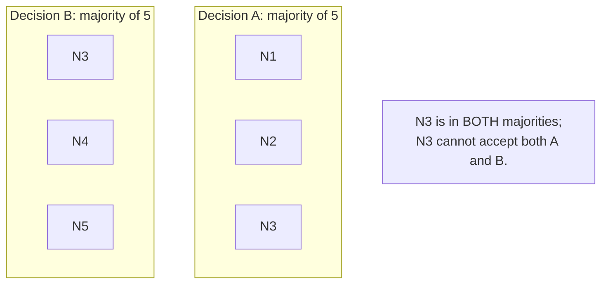
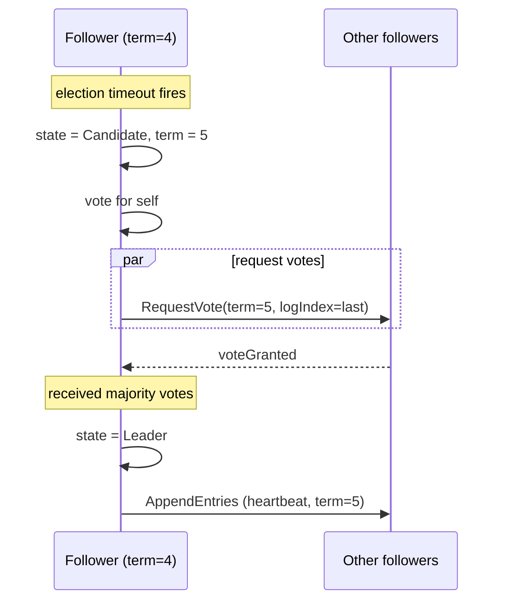
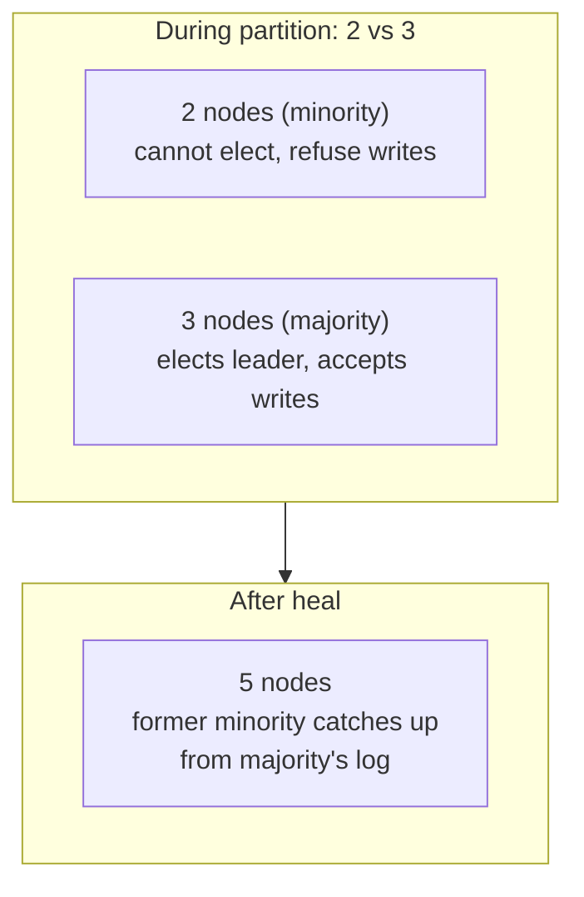

# Consensus (Raft / Paxos, Intro)

How does a distributed system agree on *anything*? When five replicas hold a counter and concurrent writes arrive, how do all five end up with the same value? When a cluster has a leader and the leader dies, how do the survivors agree on a new leader without two of them claiming the role simultaneously (the dreaded split-brain)? **Consensus algorithms** are the mathematical machinery that solves this problem — a class of protocols that allow a set of unreliable processes (each of which may crash or be slow) to agree on a single value, despite some fraction of them failing or being temporarily partitioned. Without consensus, no distributed database can offer linearizability ([T02](./T02-consistency-models-strong-eventual.md)), no leader election is safe, no distributed lock is actually exclusive, no Kubernetes control plane can decide anything. **Consensus is the substrate underneath every "strongly consistent" distributed system.**

Two algorithms have defined the field: **Paxos** (Leslie Lamport, 1989, published 1998 in "The Part-Time Parliament," reformulated in 2001's "Paxos Made Simple") and **Raft** (Diego Ongaro and John Ousterhout, 2014, designed explicitly for understandability after Paxos's notorious complexity). Paxos came first and is foundational; Raft followed and is what the industry actually deploys in new systems because it's reasonable to implement without a PhD. The third entrant — Viewstamped Replication (Brian Oki and Barbara Liskov, 1988) — predates both and influenced both; the recent **PBFT** (Castro and Liskov, 1999) and successors extend consensus to handle *Byzantine* failures (malicious / arbitrary behavior, not just crashes), at significantly higher cost.

The depth bar here is **the actual mechanism** — what Raft does in steady state, how leader election handles failure, how log replication ensures the same sequence of operations applies on every replica, how the **2f+1 quorum rule** lets the system tolerate `f` simultaneous failures with `2f+1` total replicas — not just naming the algorithm. We trace what happens on the wire when a Raft node sends an AppendEntries RPC, when an election starts, when a partitioned minority finds itself rejoining a healed cluster. We name the production systems that implement consensus — **etcd** (Kubernetes, CoreDNS), **ZooKeeper** (Hadoop, Kafka pre-KIP-500), **Consul** (HashiCorp), **CockroachDB** (per-range Raft), **Spanner** (Paxos), **MongoDB** (a Raft variant), **Kafka KRaft** (replaces ZooKeeper) — and what each does with consensus underneath. We name the canonical failures consensus prevents (split-brain, double-leader, lost-commit, inconsistent-state) and the engineering investments that make it tractable (the bounded quorum requirement, the leader-based leader steady-state, the snapshot mechanisms for log compaction). By the end you will explain Raft's mechanics to a junior engineer in 30 minutes, predict any consensus system's behavior under f failures, refuse the wrong consensus choice (using DynamoDB-style AP storage for a leader-election problem, for example), and operate the most common Java consensus library (`jraft` or Atomix) with awareness of its failure modes.

> [!NOTE]
> Prerequisites: [CAP](./T01-cap-theorem-and-pacelc.md) (consensus is the engineering that lets a system be CP); [Consistency Models](./T02-consistency-models-strong-eventual.md) (linearizability needs consensus). This is an *intro* — the topic introduces Raft well and Paxos lightly; deeper consensus theory (Multi-Paxos, EPaxos, Flexible Paxos, the Heidi Howard work) is graduate material.

## The History Of Consensus — A 40-Year Intellectual Journey

The consensus problem is one of computer science's *oldest* unsolved-then-solved problems. The path from the problem's identification (early 1970s) through the production deployments of 2026 took **roughly 40 years**, with key figures, key papers, and key failures along the way. Understanding the lineage matters because it tells you *why each successive algorithm exists* — what flaw in the previous one it was trying to fix.

### The Pre-Paxos Era: The 1980s Foundation

The consensus problem was formalized in the early 1980s, building on three foundational results:

#### 1. The Byzantine Generals Problem (Lamport, Shostak, Pease, 1982)

[*The Byzantine Generals Problem*](https://lamport.azurewebsites.net/pubs/byz.pdf) (Lamport et al., July 1982) introduced the canonical formulation of distributed agreement under malicious failure. The setting: several generals must coordinate an attack on a city; some generals are traitors who send conflicting messages. The result: agreement requires **at least 3f+1 generals to tolerate f traitors** if message authentication is unavailable, or **2f+1 with authentication**.

This paper coined the term *Byzantine* (Lamport later said he picked it because Byzantium "no longer existed and the name would not offend any ethnic group"). It established that consensus has *fault-model-dependent thresholds*: crash-fault-tolerance requires fewer nodes than Byzantine-fault-tolerance.

#### 2. The FLP Impossibility Result (Fischer, Lynch, Paterson, 1985)

[*Impossibility of Distributed Consensus with One Faulty Process*](https://groups.csail.mit.edu/tds/papers/Lynch/jacm85.pdf) (April 1985) proved that **in an asynchronous network, no deterministic consensus algorithm can guarantee both safety and termination if even one process can crash**. The proof is by constructing an infinite sequence of message delays that prevent termination.

FLP was a **devastating result** for the field: it meant that any practical consensus algorithm must either (a) sacrifice determinism (use randomization or timeouts), (b) sacrifice termination (allow the algorithm to hang under worst-case conditions), or (c) sacrifice asynchrony (require bounded message delays).

Real Paxos and Raft work around FLP by **using randomized timeouts**: they almost always terminate but cannot guarantee it in worst-case adversarial timing. In practice, this is acceptable because the worst-case adversarial timing is astronomically unlikely.

#### 3. Viewstamped Replication (Brian Oki and Barbara Liskov, 1988)

Often forgotten, [*Viewstamped Replication: A New Primary Copy Method to Support Highly-Available Distributed Systems*](https://pmg.csail.mit.edu/papers/vr.pdf) (August 1988) presented an algorithm that solved the same problem Paxos solved a year later, with a *more readable* structure. Liskov herself has noted (in various retrospectives) that Viewstamped Replication and Paxos are *fundamentally equivalent* — both reduce to the same core algorithm — but Paxos got the publicity.

The historical accident: Liskov's paper was published in a SOSP workshop and didn't reach the broader systems community as widely. Lamport's Paxos paper, despite being rejected from its first submission, eventually became the canonical reference. Modern algorithms like Raft owe more structurally to Viewstamped Replication than to Paxos — Raft's "leader + followers + log" shape is essentially VR's "primary + backups + log" shape.

### The Paxos Era — Lamport's Famously Obscure Paper

#### Leslie Lamport, Who He Is, And Why He Wrote Paxos

**Leslie Lamport** (born 1941) is one of the foundational figures of distributed systems. He received the **2013 Turing Award** for "fundamental contributions to the theory and practice of distributed and concurrent systems." Among his prior contributions:

- **Lamport timestamps** (1978, see [T09](./T09-clocks-and-ordering-logical-vector-clocks.md)) — the logical clocks used in every consensus algorithm.
- **LaTeX** (1985) — the document preparation system, derived from Knuth's TeX.
- **Byzantine Generals** (1982) — as above.
- **Bakery algorithm** (1974) — mutual exclusion for shared memory.

Lamport worked at SRI, then DEC's Systems Research Center (1985–2001), then Microsoft Research (2001–present). His SRC career was the period during which he developed Paxos.

#### The 1989 Submission And The 1998 Publication

Lamport's [*The Part-Time Parliament*](https://lamport.azurewebsites.net/pubs/lamport-paxos.pdf) was **submitted in 1989** and **rejected**. The reviewers (Lamport later wrote in his retrospective) found the paper's allegorical framing — pretending the algorithm was discovered on the Aegean island of "Paxos" by a parliament of vacationing politicians — to be obscure and unprofessional.

Lamport sat on the paper for years. In 1996, Butler Lampson at DEC SRC presented Paxos in a more accessible way, citing Lamport's unpublished work. This created demand, and in **May 1998** the paper was finally published in *ACM Transactions on Computer Systems*. Lamport's biographical sketch in the paper described "the late Greek archaeologist Λεωνίδας Παξός" — the joke being that the entire framing was a fiction.

#### Why Paxos Is So Hard To Understand

The 1998 Paxos paper is widely considered *one of the hardest papers in distributed systems to read*. The allegorical framing was abandoned for serious presentations, and Lamport himself wrote [*Paxos Made Simple*](https://lamport.azurewebsites.net/pubs/paxos-simple.pdf) (November 2001) — a 14-page re-explanation. Even *Paxos Made Simple* is widely considered hard to read.

The reasons:
- Lamport's formal style emphasizes **invariants and proofs** rather than algorithmic flow.
- The paper distinguishes between **Single-Decree Paxos** (the basic version) and **Multi-Paxos** (running Single-Decree repeatedly for a log) without clearly separating them.
- The roles (Proposer, Acceptor, Learner) can be played by the same process, but the paper doesn't initially make this clear.
- Implementation details (leader election, log truncation, snapshots) are *not covered* in the original paper, leading to the *Paxos Made Live* paper (Chandra, Griesemer, Redstone at Google, 2007) describing what it took to actually deploy Paxos in production.

This obscurity directly motivated the Raft design.

### The Production-Paxos Era — Chubby, ZooKeeper, And Multi-Paxos

#### Google's Chubby Lock Service (2006)

[*The Chubby lock service for loosely-coupled distributed systems*](https://research.google/pubs/the-chubby-lock-service-for-loosely-coupled-distributed-systems/) (Burrows, OSDI 2006) was the first major *production* description of Paxos in use. Chubby was Google's distributed coordination service, used internally for leader election, name service, and configuration storage for GFS, BigTable, and MapReduce.

Chubby revealed *what Paxos required in production*:
- Leader election (Multi-Paxos with a stable leader).
- Log compaction via snapshots.
- Cell membership changes.
- Client-session handling.
- The reality that **most of the code is the non-Paxos parts**.

#### Yahoo's ZooKeeper (2008)

ZooKeeper (Apache top-level project from 2008) implemented a Paxos variant called **Zab** (ZooKeeper Atomic Broadcast). Zab differed from classical Paxos by emphasizing *broadcast semantics*: every committed transaction is delivered to every replica in the same order.

ZooKeeper became enormously influential because it was the **first widely-available consensus system that engineers outside of Google could deploy**. Hadoop, HBase, Kafka (pre-KRaft), Solr, Storm, Mesos all used ZooKeeper. Curator (Apache, originally from Netflix) provided Java patterns on top.

#### Paxos Made Live (2007)

The Google paper [*Paxos Made Live - An Engineering Perspective*](https://research.google/pubs/paxos-made-live-an-engineering-perspective/) (Chandra, Griesemer, Redstone, 2007) documented the engineering work required to deploy Paxos. Critical observation:

> "There are significant gaps between the description of the Paxos algorithm and the needs of a real-world system. In order to build a real-world system, an expert needs to use numerous ideas scattered in the literature and make several relatively small protocol extensions. The cumulative effort will be substantial and the final system will be based on an unproven protocol."

This paper effectively documented that **getting Paxos right requires roughly 18 months of engineering work** even with expert engineers. This created the demand for a *more comprehensible* algorithm — which is where Raft enters.

### The Raft Era — Ongaro & Ousterhout's Pedagogical Revolution

#### Why Raft Was Created (2014)

Diego Ongaro's [*Consensus: Bridging Theory and Practice*](https://github.com/ongardie/dissertation/blob/master/online.pdf) (Stanford PhD dissertation, 2014, advised by John Ousterhout) opened with an explicit complaint:

> "Despite Paxos having served as the foundation of consensus protocols in industry and academia for over a decade, ... Paxos is exceptionally difficult to understand. ... It is widely accepted that Paxos has, alternatively, helped or hindered the field, depending on whom you ask."

Ongaro and Ousterhout designed Raft with a *pedagogical* primary goal: **the algorithm should be understandable**. They specifically decomposed consensus into three sub-problems (leader election, log replication, safety) that could be reasoned about independently — a structural choice Paxos doesn't make.

The Raft paper [*In Search of an Understandable Consensus Algorithm*](https://raft.github.io/raft.pdf) (Ongaro & Ousterhout, USENIX ATC 2014) was conducted with a *user study*: graduate students were taught either Paxos or Raft, then quizzed. Raft outscored Paxos significantly. The paper's title is the punchline.

#### Who John Ousterhout Is

**John Ousterhout** (born 1954) is a Stanford CS professor with a long systems career. Among his prior contributions:
- **Tcl/Tk** (1988) — the scripting language and toolkit.
- **Log-Structured Filesystem (LFS, 1992)** — the precursor to ZFS, btrfs, and modern flash-aware filesystems.
- **RAMCloud** (2009–) — a distributed in-memory store, the project that motivated Raft.

Ousterhout was Ongaro's PhD advisor, and Raft emerged from RAMCloud's need for a consensus algorithm Ousterhout could **explain to a class of graduate students in one lecture**.

#### Raft's Rapid Adoption

Raft was adopted in production with unprecedented speed for a distributed systems algorithm:

- **etcd** (CoreOS, 2013–2014): Raft-based key-value store. Became the storage backbone of Kubernetes.
- **Consul** (HashiCorp, 2014): Raft-based service registry.
- **CockroachDB** (2015): Raft per data range.
- **TiDB** (PingCAP, 2016): Raft per region.
- **MongoDB** (3.2, 2015): replica set election uses a Raft-like algorithm.
- **Kafka KRaft** (2021): replaces ZooKeeper-based controller with Raft.

By 2020, **Raft had displaced Paxos as the default new-system choice** for crash-fault-tolerant consensus. Paxos remains in use in older systems (Google Spanner, Chubby) and in academic research (EPaxos, Flexible Paxos), but new systems pick Raft.

## Why Consensus, Specifically: The Senior Engineer's Q&A

### Q1: Why do we need consensus at all?

Because **distributed systems must agree on something** despite failures. Without consensus, you cannot:
- Elect a single leader (two leaders = split-brain).
- Maintain a consistent replicated state.
- Implement distributed locks that are actually exclusive.
- Provide linearizable reads from a replicated store.
- Coordinate distributed transactions correctly.

CAP says you cannot have linearizability + availability during partition. Consensus is *how you achieve linearizability*. If you give up linearizability (choose AP), you don't need consensus. If you need linearizability (need CP), consensus is the only known way.

### Q2: Why is consensus computationally expensive?

The mechanical cost: each consensus operation requires at least one **round-trip to a majority of nodes**. For a 5-node cluster (tolerating 2 failures), that's writing to and hearing back from 3 nodes. Across a data center, each round-trip is ~0.5–1 ms; across a region, ~10 ms; across the globe, ~100 ms.

Consensus systems therefore have **fundamentally higher write latency than non-consensus systems**. A single Postgres write is ~1 ms; a CockroachDB write (per-range Raft) is ~10–20 ms for cross-AZ replication. The cost is the consensus round-trips.

The senior judgment: pay this cost only when you need linearizability. For high-volume, low-consistency data (logs, metrics, sessions), don't.

### Q3: Why 2f+1 and not some other number?

The math: to tolerate f failures while still having a majority, you need 2f+1 total nodes. This guarantees that **any two majorities overlap by at least one node**, which is the safety mechanism — that overlapping node prevents two different decisions from both achieving quorum.

For f=1 (tolerate one failure), 2f+1=3.
For f=2 (tolerate two failures), 2f+1=5.
For f=3 (tolerate three failures), 2f+1=7.

The cost is proportional to the failure tolerance. Most production deployments use 3 or 5; very few use 7+.

### Q4: How does this compare to Byzantine fault tolerance?

Raft and Paxos handle **crash failures** (a node stops responding). They do *not* handle **Byzantine failures** (a node sends incorrect or malicious messages). Byzantine consensus (PBFT, HotStuff, the algorithms underlying public blockchains) requires **3f+1 nodes** to tolerate f Byzantine failures, and is significantly more expensive.

The senior question: do you need to tolerate malicious nodes? For internal enterprise infrastructure (etcd, ZooKeeper, etc.), the answer is no — all nodes are owned by the same team. For public blockchains and trustless systems, yes. The 3f+1 cost is paid only when malicious-node tolerance is required.

### Q5: When should I use consensus and when shouldn't I?

**Use consensus for**:
- Leader election (Kubernetes uses etcd for this).
- Distributed locks that must be safe.
- Strongly-consistent metadata stores (service discovery, config distribution).
- Distributed transactions that must be linearizable.

**Don't use consensus for**:
- High-volume application data (use eventually-consistent stores like Cassandra or DynamoDB).
- Read-heavy workloads (read from replicas, even if writes go through consensus).
- Caching (use Redis or Memcached).
- Logging and analytics.

The senior heuristic: **consensus is for the *control plane*, not the *data plane***. Your service-discovery, leader-election, and config-distribution use consensus; your application's actual data uses cheaper replication strategies.

## The Mechanism In Depth — Raft's Three Sub-Problems

The pedagogical insight of Raft is that consensus decomposes into three problems that can be reasoned about independently.

### Sub-Problem 1: Leader Election

Without a leader, every node would propose values independently, and the algorithm would have to resolve conflicts on each one. Raft elects a *single leader per term*, and that leader serializes all writes. The election uses:

- **Randomized timeouts**: each follower has a 150–300 ms randomized election timeout. The first one to timeout becomes a candidate.
- **Term numbers**: monotonically-increasing integers. A new election bumps the term.
- **Vote restriction**: a voter only votes for a candidate whose log is at least as up-to-date as their own.

The randomization solves the FLP problem: in pathological synchronization, elections could repeat indefinitely, but random timeouts make this practically impossible.

### Sub-Problem 2: Log Replication

Once elected, the leader appends operations to its log, replicates to followers via `AppendEntries` RPCs, and commits when a majority has replicated. The log is the source of truth; the state machine is derived by applying committed log entries in order.

The mechanical guarantee: **if a log entry is committed in term T, every leader of term > T contains that entry**. This comes from the election rule (voters only vote for up-to-date logs) combined with majority quorum overlap.

### Sub-Problem 3: Safety

Raft guarantees that **no two leaders commit conflicting entries for the same log index**. The safety property follows from the quorum overlap: any committed entry was acknowledged by a majority, and any new leader must have been elected by a majority, so the new leader has at least one node from the committing majority, which means it has the committed entry.

This is the **same algebraic argument as Paxos** but expressed via different mechanisms. Raft's separation makes the argument easier to follow.

## Common Misconceptions Explained

### "Paxos and Raft are different algorithms."

Half true. **They solve the same problem and use the same algebraic structure** (majority quorum, term/ballot numbers, leader-based steady state). The differences are in *exposition* and *operational detail*, not in the core algorithm. A Multi-Paxos implementation and a Raft implementation, optimized for the same workload, perform almost identically.

### "Consensus systems are slow."

Misleading. **Consensus adds ~5–10 ms of latency per operation** (the majority round-trip), which is significant for in-data-center workloads but negligible for cross-region or human-perceptible operations. The cost is per-write; reads can be served from replicas without consensus overhead.

### "Raft tolerates Byzantine failures."

False. Raft handles crash failures only. Byzantine consensus is a separate algorithm class.

### "etcd is the same as ZooKeeper."

Half true. Both provide consensus-backed coordination. The differences:
- **etcd**: Raft-based, HTTP/gRPC API, lease-based (ephemeral) keys, used by Kubernetes.
- **ZooKeeper**: Zab-based, native TCP protocol, ephemeral z-nodes, used by Hadoop ecosystem.

For new projects, etcd is generally preferred because of its simpler operational model and the Kubernetes-native integration.

### "Consensus solves all distributed-systems problems."

False. Consensus solves the *agreement* problem. It does not solve:
- Throughput scaling (consensus is a bottleneck if you put it on every operation).
- Cross-system transactions (sagas remain necessary).
- Geographic distribution (consensus across regions is high-latency).
- Disagreement-by-design (event-driven systems prefer eventual consistency).

The senior judgment: consensus is one tool among many. Use it where its strengths (safety, linearizability) match your needs; reach for other tools where its weaknesses (latency, throughput) bind.

## What Consensus Means

Formally, a consensus algorithm has three properties:

1. **Agreement**: all non-faulty processes decide the same value.
2. **Validity**: the decided value was proposed by some process.
3. **Termination**: every non-faulty process eventually decides.

The challenge: any of these processes might crash, run slowly, or be cut off by a network partition. The algorithm must handle this without sacrificing agreement (which would produce split-brain). **The FLP impossibility result** (Fischer, Lynch, Paterson, 1985) proved that no deterministic algorithm can guarantee all three in an asynchronous network — there is *some* failure pattern that prevents termination. Real algorithms (Paxos, Raft) sidestep FLP by using *randomized timeouts* to break symmetry, providing probabilistic — not deterministic — termination.

## The Quorum Rule — Why 2f+1

A consensus system tolerates `f` simultaneous failures by having `2f + 1` total replicas. The math:

- 3 replicas tolerate 1 failure (`f=1`, `2f+1=3`).
- 5 replicas tolerate 2 failures (`f=2`, `2f+1=5`).
- 7 replicas tolerate 3 failures (`f=3`, `2f+1=7`).

Why this exact ratio? Because every decision must be approved by a **majority** of the replicas. With `2f + 1` total, the majority is `f + 1`. Two different decisions can each get a majority only if `2(f+1) ≤ 2f+1`, which is `2f+2 ≤ 2f+1` — false. So two different decisions cannot both get a majority. **Two majorities of a 2f+1 set always overlap by at least one node**, and that overlapping node ensures consistency.



The corollary: **the system survives if up to `f` nodes are down, but freezes if `f+1` or more are down** (no majority is reachable). Three-replica clusters are common; five-replica is the next step up for higher availability.

## Raft — In Detail

Raft (2014) was designed to be understandable. It decomposes consensus into three problems that can be reasoned about separately: **leader election**, **log replication**, and **safety**.

### Roles And Terms

At any moment, every node is in one of three roles:

- **Leader**: handles client requests, replicates the log to followers.
- **Follower**: passive; accepts updates from the leader.
- **Candidate**: a node that has timed out without hearing from a leader and is trying to become one.

**Time is divided into "terms"** — monotonically increasing integers. Each term has *at most one* leader. A term that begins with an election and no winner ends with a new election in a higher-numbered term.

### Steady-State Operation

```mermaid
sequenceDiagram
  participant C as Client
  participant L as Leader
  participant F1 as Follower 1
  participant F2 as Follower 2
  participant F3 as Follower 3
  participant F4 as Follower 4

  C->>L: write request (e.g., set x = 5)
  L->>L: append to local log (uncommitted)
  par broadcast
    L->>F1: AppendEntries
    L->>F2: AppendEntries
    L->>F3: AppendEntries
    L->>F4: AppendEntries
  end
  F1-->>L: ack
  F2-->>L: ack
  Note over L: majority (3 of 5) acked; commit
  L->>L: apply to state machine
  L-->>C: success
  par later heartbeats
    L->>F1: AppendEntries (commit index advanced)
    L->>F2: AppendEntries
    L->>F3: AppendEntries
    L->>F4: AppendEntries
  end
```

The leader appends the operation to its log, broadcasts to followers, waits for majority ack, then commits. **Commitment requires majority**. Once committed, the operation is durable — even if the leader crashes, any new leader will have it (proven below).

### Heartbeats And Election

The leader sends periodic AppendEntries (often empty — heartbeats) to all followers, every ~50 ms. Followers reset their election timeout on each heartbeat. If a follower's election timeout expires (typical: 150–300 ms randomized) without a heartbeat, it suspects the leader has failed and starts an election:



Each node votes for at most one candidate per term, and only if the candidate's log is *at least as up-to-date* as the voter's. If two candidates split the votes, neither gets a majority; the election times out and both try again with a higher term. The randomized timeouts mean one usually wins the next round.

### Log Replication And Safety

Every entry in the log has a term and an index. Two key invariants:

1. **Log Matching**: if two logs have an entry at the same index with the same term, they are identical up to that index. (Means: once a log entry is replicated, the prefix is fixed.)
2. **Leader Completeness**: if a log entry is committed in term T, every leader of term > T contains that entry. (Means: committed entries are never lost.)

The Leader Completeness property comes from the election rule: a candidate is elected only with a majority vote, and each voter votes only if the candidate's log is up-to-date. The majority that elected the candidate must contain at least one node from the majority that committed any prior entry (quorum overlap), and that node would only vote for a candidate with that entry — therefore the new leader has it.

This is the central beauty of Raft: a small set of rules (majority quorum, log-up-to-date voting) produces strong safety guarantees algebraically.

### Failure Scenarios

What does Raft actually do under various failures?

- **Leader crash**: followers' election timers expire; a new leader is elected; client requests resume (after a brief unavailability window of ~150–300 ms).
- **Follower crash**: leader notices unack'd messages; client requests still proceed if majority of followers are alive.
- **Network partition (minority side)**: minority cannot elect a leader (no majority); minority side refuses writes, returns errors. The cluster is unavailable on this side.
- **Network partition (majority side)**: majority side keeps the leader (or elects a new one if the old leader was on the minority side); writes proceed normally.
- **Partition heals**: minority side rejoins; followers update their logs from the leader. Any uncommitted writes on the minority side are discarded (correctly — they never reached majority).



The minority side's behavior — refusing writes — is the **CP** choice from CAP ([T01](./T01-cap-theorem-and-pacelc.md)). It is the cost paid to preserve consistency.

## Paxos — A Sketch

Paxos is older, more general, more confusing, and less widely implemented. The basic idea:

- Phase 1 (Prepare): a proposer asks acceptors to promise not to accept proposals with a lower number. Acceptors that promise return any previously-accepted value.
- Phase 2 (Accept): if a majority promised, the proposer sends a value (the highest previously-accepted, if any, otherwise its own) to be accepted. Acceptors that haven't broken their promise accept.
- A value is *chosen* when a majority has accepted it.

Two rounds per operation; multiple-Paxos optimizations bundle the prepare phase into a one-time leader election, after which only accept rounds run (essentially like Raft's steady state). Variants — Multi-Paxos, EPaxos (Egalitarian Paxos), Flexible Paxos (Heidi Howard's thesis), Cheap Paxos — relax constraints to gain throughput or availability.

Most modern systems that "use Paxos" use Multi-Paxos in shape much like Raft's steady state. The differences are subtle for the practitioner; Raft's recognizable structure (leader, logs, AppendEntries) is the operational model most teams hold in their heads.

## Real Systems Using Consensus

| System | Consensus | Role |
|--------|-----------|------|
| **etcd** | Raft | Kubernetes' state store; distributed configuration; service discovery |
| **ZooKeeper** | Zab (Paxos variant) | Hadoop, Kafka pre-KIP-500, distributed coordination |
| **Consul** | Raft | Service mesh, KV store, distributed locking |
| **CockroachDB** | Raft (per range) | Strongly-consistent multi-region SQL |
| **Spanner** | Paxos | Google's global SQL with strong consistency |
| **MongoDB** | Raft variant ("replica set election") | Replica set coordination |
| **Kafka KRaft** | Raft | Replaces ZooKeeper for Kafka's metadata (Kafka 3.x+) |
| **TiDB** | Raft (per region) | Distributed SQL |
| **Riak** | (older) Riak Core / now uses Raft | Distributed KV |
| **HashiCorp Nomad** | Raft | Cluster orchestrator |

**Pattern**: most systems published 2014+ use Raft. Older systems use Paxos variants. The decision factor was rarely correctness (both are correct); it was understandability and operational tooling.

## When You Need Consensus (And When You Don't)

Consensus is **expensive** — every operation pays for a majority round-trip. Use it where you must, not where you can avoid it.

### Need Consensus

- **Leader election** in any distributed system.
- **Distributed locks** that must be safe (no two clients hold the lock simultaneously).
- **Strongly-consistent state** (Kubernetes' "what pods exist" registry).
- **Linearizable counter / sequence** (a monotonically increasing global ID).
- **Atomic commit** across partitions of a database.
- **Configuration distribution** (the source of truth for "what services are deployed where").

### Don't Need Consensus

- **High-volume writes** where eventual consistency is fine (analytics events, logs).
- **Read-heavy workloads** (use a consensus-backed write path, read from replicas eventually).
- **Sharded data** where each shard can have its own leader (CockroachDB, Spanner — per-range Raft, not global).
- **Cache invalidation** (eventual is fine; consensus is overkill).
- **Pub/sub at scale** (Kafka per-partition ordering is enough; full consensus would tank throughput).

The expensive operation should be infrequent (leader election, config change); the high-volume operations should ride on top without paying full consensus cost per operation.

## Java Implementations And Libraries

Several mature options:

- **Apache Curator** — high-level ZooKeeper client; leader election, distributed locks, queues.
- **etcd-java** — JDK client for etcd; consensus via etcd cluster.
- **jraft** (Sofa-jraft, Alibaba) — pure-Java Raft implementation; embeddable in JVM apps.
- **Atomix** (Camunda's distributed coordination toolkit) — Raft-based; Java APIs for distributed primitives.
- **Apache Ratis** — Java Raft library; used by Hadoop Ozone and others.
- **Akka Cluster Sharding + Distributed Data** — uses gossip + CRDTs, not strict consensus, but provides similar building blocks.

For Spring Boot teams, **Spring Cloud + Consul** or **Spring Cloud + ZooKeeper** is the path of least resistance — the consensus system runs externally; the Spring app uses it via a client library.

### Simple Leader Election With Curator

```java
LeaderSelector selector = new LeaderSelector(client, "/myapp/leader",
    new LeaderSelectorListenerAdapter() {
      @Override
      public void takeLeadership(CuratorFramework client) {
        // I am the leader; do leader work until interrupted
        while (running) {
          doLeaderWork();
          Thread.sleep(5000);
        }
      }
    });
selector.autoRequeue();
selector.start();
```

ZooKeeper provides the consensus; the application gets a `takeLeadership` callback when its node holds the lock. On crash, ZooKeeper releases the lock (ephemeral z-node), and another node takes leadership.

## Failure Modes Specific To Consensus Systems

### Split-Brain

Two leaders simultaneously believe they are leader. **Properly-implemented Raft cannot have split-brain** (the term mechanism guarantees only one leader per term; the majority-vote rule guarantees terms don't overlap with valid commits). Real-world "split-brain" reports are almost always implementation bugs or misconfigurations (timeouts too short causing rapid leader churn that *appears* split-brain to clients).

### Unbounded Log Growth

Raft's log grows forever unless compacted. Each operation is appended; logs of long-lived clusters can be gigabytes. **Snapshots** (a periodic checkpoint of the state machine + a log truncation) compact the log. Implementations must produce snapshots safely without blocking the leader.

### Slow Follower

A follower lags arbitrarily behind the leader. Sometimes the follower catches up; sometimes it falls so far behind it needs a snapshot transfer. Operators must monitor and respond.

### Election Storms

Misconfigured timeouts (too short) cause rapid leader churn — every time a leader is elected, it gets demoted before establishing leadership. The cluster spends all its time in elections. The fix: increase `electionTimeout` to be significantly larger than the worst-case network round-trip; tune with Jepsen-style testing.

### Quorum Loss

If more than `f` nodes fail, the cluster cannot make progress. Recovery requires bringing nodes back online, or in extreme cases a manual "force quorum" override that risks data loss. The discipline: provision enough nodes that two simultaneous failures don't break the cluster.

## Byzantine Failures — A Brief Note

Raft and Paxos assume **crash failures** — nodes that fail by stopping, not by sending wrong data. **Byzantine failure** means a node can behave arbitrarily (malicious, corrupt, bug). Byzantine consensus (PBFT, HotStuff, the algorithms behind blockchain consensus) requires `3f + 1` nodes to tolerate `f` Byzantine failures and is significantly more expensive. Public blockchains (Bitcoin, Ethereum, etc.) deal with Byzantine consensus at internet scale via different mechanisms (proof-of-work, proof-of-stake) — outside the scope of this topic.

For ordinary enterprise infrastructure, crash-fault-tolerant consensus (Raft, Paxos) is sufficient because the nodes are all owned by the same team.

## Trade-Off Summary

| Need | Use |
|------|-----|
| Distributed lock | etcd / ZooKeeper / Consul via Curator |
| Kubernetes-style state | etcd (already in the cluster) |
| Distributed config | Consul KV |
| Multi-region SQL | CockroachDB / Spanner |
| Replicated state machine in JVM | jraft / Atomix |
| Cross-region with strong consistency | accept latency cost; use Spanner / CockroachDB |
| High-volume sharded writes | per-shard consensus (CockroachDB, TiDB) |
| Eventual consistency is fine | DynamoDB / Cassandra — no consensus per write |
| Byzantine fault tolerance | Tendermint / HotStuff / blockchain (rare) |

> [!INTERVIEW]
> A common L5 prompt: "Explain Raft." Strong answers cover (a) the three roles (leader, follower, candidate), (b) terms and the safety property they enforce, (c) the majority quorum and its `2f+1` justification, (d) what happens on partition (minority can't elect; majority continues), (e) at least one real-world consequence (etcd is the Kubernetes substrate).

## Practice

1. **Walk a Raft trace.** Sketch a 5-node Raft cluster. Trace a write through it, naming the AppendEntries messages and acks. Now trace a leader crash and election. Now trace a partition that isolates the leader.
2. **Quorum arithmetic.** For a 7-node cluster, what's the worst-case number of simultaneous failures it survives? How many would prevent progress?
3. **Find consensus in your stack.** Identify every consensus system in your production stack — etcd, ZK, Consul, etc. For each, name what it coordinates.
4. **Implement leader election.** Use Apache Curator to implement leader election in a Spring Boot app. Run two instances; kill one; verify the other becomes leader.
5. **The split-brain story.** Find a real-world split-brain incident in any public postmortem. Identify the implementation bug or misconfiguration that caused it.
6. **Election timeout tuning.** For an etcd cluster, identify the election timeout. Estimate worst-case round-trip in your network. Decide whether the timeout is appropriate.
7. **Compare consensus systems.** Read the docs for etcd, ZooKeeper, and Consul. Compare their consensus algorithms, their APIs, and their operational characteristics. Recommend one for a new project.
8. **Snapshot story.** In any consensus system, find evidence of snapshot/log-compaction. Explain when it runs and what it prevents.
9. **Byzantine consideration.** Explain why a public blockchain needs Byzantine consensus and ordinary enterprise infrastructure does not.
10. **The skeptic conversation.** A senior engineer says "we'll just use leader election with a heartbeat." Write a 200-word response on why distributed locks without consensus are subtly broken.

## Recap

You should now be able to:

- Articulate **consensus** as the property of distributed agreement under failure (agreement, validity, termination) and recognize the **FLP impossibility** as why algorithms use randomization.
- Apply the **2f+1 quorum rule** and explain why two majorities of a 2f+1 set always overlap.
- Trace **Raft** in steady state (leader's AppendEntries to majority), under leader failure (election with randomized timeouts, term increment), and under partition (minority refuses writes, majority continues).
- Recognize the **Log Matching** and **Leader Completeness** properties as the algebraic guarantees of safety.
- Sketch **Paxos** at a high level — Prepare and Accept phases, the role of the proposer/acceptor — and recognize Multi-Paxos as functionally equivalent to Raft's steady state.
- Map **production consensus systems** to their algorithms: etcd / ZooKeeper / Consul / CockroachDB / Spanner / Kafka KRaft.
- Choose when to **use consensus** (leader election, locks, strongly-consistent state) and when not (high-volume eventual-consistency workloads).
- Use **Java consensus libraries** — Curator, jraft, Atomix, etcd-java — for distributed coordination in Spring Boot.
- Recognize and prevent **consensus-specific failure modes** — split-brain (impossible if implemented correctly), unbounded log growth, slow followers, election storms, quorum loss.
- Distinguish **crash-fault-tolerant** consensus (Raft, Paxos) from **Byzantine-fault-tolerant** consensus (PBFT, HotStuff, blockchain) and explain when each is needed.

## Next

Continue to [Replication Strategies](./T04-replication-strategies.md) — the patterns for keeping multiple copies of data: single-leader (Postgres / MySQL), multi-leader (CRDTs, multi-master), leaderless (DynamoDB, Cassandra). Each strategy's consistency properties build on consensus, eventual consistency, or both.
