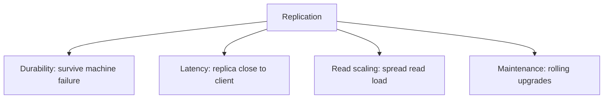
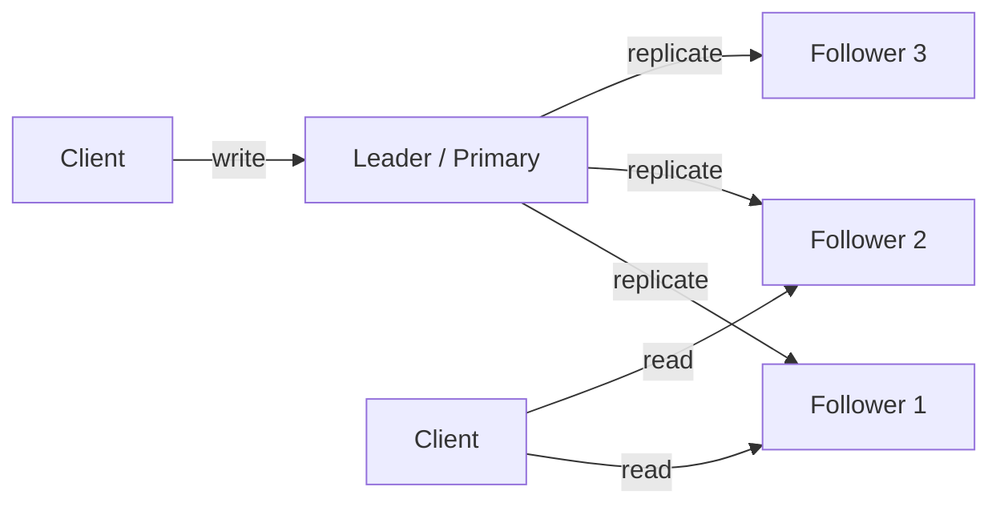
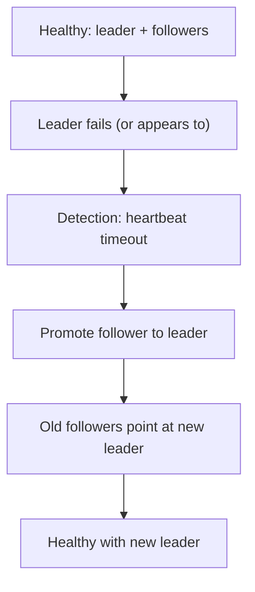
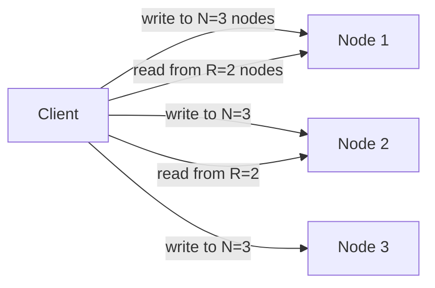

# Replication Strategies

Replication — keeping copies of the same data on multiple machines — is the foundation of every distributed database's claims about availability, latency, and durability. **You replicate because**: one machine can fail (durability), one machine can be far away (latency near each client), one machine can be overloaded (read scaling), and one machine's maintenance becomes an outage without alternatives. But replication is not free; every write becomes "send to N replicas," every read must choose which replica to ask, and the gap between when one replica gets a write and when another sees it (the **replication lag**) is the source of most consistency anomalies. **Choosing a replication strategy is choosing which problems to have.**

There are three canonical strategies — **single-leader**, **multi-leader**, **leaderless** — and within each, choices of **synchronous vs asynchronous** replication that shift the trade-off. Single-leader (PostgreSQL, MySQL, MongoDB) is the simplest and most common — one node accepts writes, replicates to followers, fails over on leader loss. Multi-leader (geo-distributed master-master setups) allows local writes in each region but introduces conflict resolution. Leaderless (DynamoDB, Cassandra) treats all nodes equally — any node accepts any write — and uses *quorum reads/writes* plus *anti-entropy* to converge.

The depth bar here is **mechanism plus the failure modes**. We trace what physically happens during a Postgres streaming-replication setup (the primary writes WAL; the standby replays it; lag is the delta in WAL bytes), what synchronous vs asynchronous replication actually mean (sync waits for replica ack; async doesn't), what happens on leader failover (the brief unavailability window, the risk of split-brain, the lost-write window). We cover multi-leader replication's conflict-resolution menu — **last-writer-wins** (often wrong), **operational transformation** (Google Docs), **CRDTs** (Riak, Redis CRDT, Akka Distributed Data). We trace leaderless replication's **N, R, W** parameters and the **R + W > N** quorum-overlap rule that gives Cassandra and Dynamo strong consistency. We name the production failures replication exists to prevent and the new failures it introduces. By the end you will choose a replication strategy with explicit trade-offs, tune `synchronous_commit` or `acks=all` deliberately, and operate a multi-leader or leaderless cluster with awareness of replication lag and conflict resolution.

> [!NOTE]
> Prerequisites: [CAP](./T01-cap-theorem-and-pacelc.md), [Consistency Models](./T02-consistency-models-strong-eventual.md), [Consensus](./T03-consensus-raft-paxos-intro.md). Replication strategies are the engineering that produces particular CAP and PACELC behaviors; consensus is what makes some of them strongly consistent.

## Where Replication Strategies Came From — A 50-Year Engineering Arc

Database replication is one of the oldest non-trivial problems in computer science, and the strategies in use today (single-leader, multi-leader, leaderless) emerged from specific failure modes in earlier systems. Understanding the lineage prevents the common error of treating each replication choice as equally suitable; each has *specific* preconditions that made it the right answer for *specific* problems.

### The Pre-Replication Era (Pre-1980s)

The first commercial database systems (IMS in 1968, IDMS in 1971, System R prototypes in 1974, Ingres in 1975) ran on **single machines without replication**. Backups were "the recovery strategy" — if the machine died, restore from tape, accept hours of downtime. This was acceptable in the era when:

- Computers were rare and expensive enough that businesses planned around downtime.
- Online transaction volumes were low.
- Hardware reliability was good enough that catastrophic failures were rare.

By the late 1970s, two pressures changed this:
1. **Mainframe systems became business-critical** (airlines, banks). Hours of downtime were unacceptable.
2. **Workloads outgrew single machines**. The first hint of horizontal scaling problems.

### The 1980s — Standby Replication And Two-Phase Commit

The first replication strategies emerged in the 1980s as **standby systems**:

- **IBM IMS Remote Site Recovery** (early 1980s): primary IMS site replicated transactions to a standby site for disaster recovery. Failover took hours.
- **DEC Rdb / Oracle 7** (late 1980s): primary database periodically shipped redo logs to a standby. The "log shipping" pattern.
- **Tandem NonStop** (1976+): a *different* approach — pair processors running the same transactions in lockstep. Used in banking and stock exchanges.

The 1980s also saw the canonical work on **two-phase commit (2PC)** — Jim Gray's 1978 paper on transactional models, the 1985 ACID acronym (Theo Härder and Andreas Reuter), and Lampson's 1981 work on synchronous replication. These laid the theoretical foundation for what later became distributed transactions.

The 1980s replication was **single-leader, asynchronous, manual failover**. It was the baseline that everything else improved on.

### The 1990s — The MySQL/Postgres Lineage And Read Replicas

Two specific 1990s developments shaped Linux-era replication:

#### MySQL Statement-Based Replication (1996)

**MySQL** (Michael Widenius and David Axmark, 1995) introduced its **statement-based replication** in 1996. The mechanism: the primary writes a binary log of SQL statements; replicas read the log and re-execute the statements. Simple, replication-protocol agnostic, but **fragile** — non-deterministic statements (`NOW()`, `RAND()`, certain auto-increments) produced different results on different replicas.

MySQL's replication popularized **read replicas** as a common pattern. Suddenly, every web application could scale reads by adding replicas — a transformative capability for the dot-com era.

#### Postgres Streaming Replication (2010, after PG 9.0)

**PostgreSQL** took a different path. Until version 9.0 (2010), Postgres had no native replication; teams used third-party solutions (Slony-I, Bucardo, pgpool-II). PG 9.0 introduced **streaming replication** based on the **Write-Ahead Log (WAL)** — the primary streams its WAL to replicas, which replay it.

This is **physical replication** — the replica's data files become byte-identical to the primary's. It's *more* faithful than MySQL's statement-based approach but requires the replica's binary version to match exactly.

Postgres now also supports **logical replication** (PG 10, 2017) — replicas can subscribe to specific tables, transform data en route, and have different schemas. This is closer to MySQL's pre-2017 approach with stronger guarantees.

### The 2000s — The Dynamo Paper And Leaderless Replication

The most influential 2000s replication paper was **Amazon's Dynamo** ([*Dynamo: Amazon's Highly Available Key-Value Store*](https://www.allthingsdistributed.com/files/amazon-dynamo-sosp2007.pdf), Werner Vogels et al., SOSP 2007). It described how Amazon ran shopping-cart state across thousands of nodes with no single point of failure.

The Dynamo paper made several radical choices:

1. **Leaderless replication**: no primary. Any node can accept any write.
2. **Consistent hashing**: data distributed by hashing keys onto a ring of nodes.
3. **Tunable consistency**: per-request choice of how many replicas must confirm.
4. **Vector clocks for conflict detection**: simultaneous writes from different nodes detected and surfaced.
5. **Application-level conflict resolution**: the application (not the database) decides how to merge conflicting versions.

Dynamo's approach inspired **Cassandra** (Apache, 2008), **Riak** (Basho, 2009), **Voldemort** (LinkedIn, 2009), and influenced **DynamoDB** (AWS, 2012). The "NoSQL" movement of 2009–2015 was largely Dynamo-flavored.

### Werner Vogels And The "Eventually Consistent" Article (2008)

Werner Vogels's article [*Eventually Consistent*](https://queue.acm.org/detail.cfm?id=1466448) (ACM Queue, December 2008) was the *manifesto* for leaderless replication. It explicitly argued that for many applications — shopping carts, user profiles, session data — strict consistency was a cost not worth paying. The article popularized the per-request consistency model and gave the NoSQL marketing its positioning vocabulary.

The pendulum swung too far. By 2015, the industry had learned (often painfully) that **eventual consistency required application-level conflict resolution**, which most teams handled badly. The 2015+ correction toward "strong consistency where it matters" produced systems like Spanner, CockroachDB, and FoundationDB that paired Dynamo-style horizontal scaling with serializable transactions.

### The 2010s — Spanner And The TrueTime Innovation

**Google Spanner** ([*Spanner: Google's Globally-Distributed Database*](https://research.google/pubs/spanner-googles-globally-distributed-database/), Corbett et al., OSDI 2012) was the 2010s' most influential database paper. Spanner achieved **externally consistent transactions across continents** by:

1. **Paxos-replicated tablets** (sharded data, each shard with strong replication).
2. **TrueTime API**: hardware-supported globally-synchronized clocks with bounded uncertainty.
3. **Two-phase commit across Paxos groups**.

The trick: TrueTime made it possible to *order* transactions globally without coordination — each transaction gets a timestamp bounded by TrueTime's uncertainty interval. This allows linearizable reads from any replica.

Spanner's significance: it proved that **strong consistency at global scale was technically possible**, breaking the Dynamo-era assumption that horizontal scale required eventual consistency. The cost: roughly 10 ms of commit wait per transaction, plus the operational complexity of TrueTime hardware.

**CockroachDB** (Cockroach Labs, 2014) is the open-source spiritual descendant of Spanner, using a hybrid logical clock (HLC) instead of TrueTime. **TiDB** (PingCAP, 2016) is the Chinese counterpart.

### Why The Lineage Matters

Each replication strategy in use today maps to a specific 1980s–2010s development:

- **Single-leader sync**: 1980s standby replication, with better failover.
- **Single-leader async**: 1990s MySQL/Postgres read replicas.
- **Leaderless tunable**: 2007 Dynamo.
- **Multi-leader (multi-master)**: 1990s academic research, productized only recently.
- **Per-shard Paxos with global linearizability**: 2012 Spanner.

The senior judgment requires *knowing which lineage you're inheriting* and what failure modes it's known for. A team that adopts Cassandra is buying into the Dynamo lineage (with all its conflict-resolution complexity). A team adopting CockroachDB is buying into the Spanner lineage (with its commit-latency cost). Both are valid; both come with the accumulated wisdom (and scar tissue) of their lineage.

## Why Replication, Specifically: The Senior Engineer's Q&A

### Q1: Why bother replicating at all?

Three concrete benefits, all of which compound:

1. **Survive single-machine failures**: a primary dies; a replica takes over. Without replication, single-machine failure equals downtime.
2. **Scale reads**: traffic patterns are typically 10:1 or 100:1 read-to-write. Replicas absorb read traffic, freeing the primary for writes.
3. **Reduce read latency for geographically distributed users**: replicas in EU and APAC serve users closer to home than a US-only primary.

Each benefit is individually sufficient to justify replication; together they're why every production database is replicated.

### Q2: What was the lived experience that motivated leaderless replication?

A specific Amazon experience around 2003–2006: the shopping-cart service. Single-leader replication had operational problems specific to Amazon's scale:

- **Failover took 30+ seconds** — long enough that user-facing cart operations would fail.
- **Cross-region failover was particularly painful** — a US-East failover affected EU users for minutes.
- **Write availability was tied to leader availability** — a leader's degradation degraded the whole system.

Werner Vogels's team realized that **the shopping cart could tolerate eventual consistency**. If two clients added items concurrently to the same cart (one from desktop, one from mobile), the right answer was *both items in the cart*, not "the latest one wins." This was the *application-specific* observation that justified abandoning single-leader: the conflict-resolution policy was natural to the domain.

The Dynamo paper's specific contribution: making this trade-off *available to other Amazon teams*, not just shopping cart. By 2007 it was the standard pattern for AWS internal services that could tolerate eventual consistency.

### Q3: How does Spanner achieve what Dynamo couldn't?

By investing in hardware. Specifically, **TrueTime requires GPS receivers and atomic clocks in every data center**, plus careful management of clock uncertainty.

The mechanical reasoning: linearizable ordering requires *a globally-synchronized clock*. NTP gives ~10 ms accuracy on a good network; TrueTime gives sub-millisecond bounded uncertainty. With sub-millisecond uncertainty, Spanner can timestamp transactions and *wait out the uncertainty* (~5–10 ms of commit-wait) to ensure any earlier transaction completed before any later one started.

Most companies cannot afford TrueTime. **CockroachDB's hybrid logical clocks** approximate TrueTime in software, accepting larger uncertainty in exchange for working on commodity hardware. The trade-off is wider commit-wait windows (~30–50 ms typical) and stricter requirements on NTP discipline.

### Q4: How does this compare to filesystem replication?

Filesystem replication (NFS, CephFS, GlusterFS) has the same conceptual problem — multiple nodes, shared data, consistency questions — but with **different access patterns**: large files, sequential access, append-heavy. The strategies are similar:

- **Synchronous replication** (Ceph rep size = 3 with all-replicas-must-ack): strong consistency, write latency proportional to slowest replica.
- **Asynchronous replication** (rsync, periodic): cheap, lossy on failure.
- **Erasure coding** (Ceph with EC pools, S3 internals): instead of N full copies, store N+K erasure-coded chunks. Trades CPU for storage efficiency.

The interesting cross-pollination: erasure coding is widely used in object storage (S3, Ceph) but rare in databases (transactional updates are too small for EC to amortize the encoding cost). When you hear "Cassandra is 3x replicated" vs "S3 is 11 nines durable" you're seeing different replication strategies for different workload shapes.

### Q5: When is single-leader the right choice?

Almost always, for OLTP workloads. The reasoning:

- **Most applications have a single team owning the data** — multi-leader's conflict resolution requires coordinated business logic across teams.
- **Most failures are not partition-related** — single-leader failover handles most failure modes adequately.
- **Most workloads are read-heavy** — read replicas with async replication scale reads cheaply.
- **Most application code can tolerate brief failover latency** — 30 seconds is acceptable for non-real-time apps.

The exceptions where single-leader is wrong:
- **Geographic distribution with local writes** — multi-leader fits.
- **No single point of failure tolerance** — leaderless with R+W>N fits.
- **High write volume single-leader can't sustain** — sharding with single-leader per shard.

The senior judgment: start single-leader. Reach for multi-leader or leaderless only with measured pressure.

## Common Misconceptions Explained

### "Synchronous replication means no data loss."

Half true. Synchronous replication means *no data loss to the synchronous replica set*. If the entire replica set fails (data center destroyed), data is lost. True zero-data-loss requires geographic replication, multiple availability zones, and careful application of bounded staleness.

### "Asynchronous replication is fine if lag is low."

Misleading. **Async replication can lose any-recent-window of writes on failover**. Even with millisecond-level lag, a primary that fails before replicating its last 100 ms of writes loses those writes. For data where loss is unacceptable (payments, audit), async is wrong regardless of lag.

### "Multi-leader replication is just like single-leader with extras."

False. Multi-leader's defining feature is **conflict resolution**. Single-leader has no conflicts (the primary serializes all writes). Multi-leader has conflicts whenever two leaders accept conflicting writes; resolving them is a *business* decision, not just a technical one. Teams that adopt multi-leader without designing conflict resolution produce systems that silently corrupt data.

### "Leaderless replication is just multi-leader with no leader."

False. Leaderless typically uses **quorum-based reads and writes** (R+W>N for strong consistency). Multi-leader uses **per-leader writes with async propagation**. The mechanics and failure modes differ substantially.

### "Replication is just for HA."

False. Replication serves three purposes simultaneously: HA (survive failures), read scaling (handle more read traffic), and latency reduction (serve closer to users). Each is independently valuable.

### "More replicas is always better."

False. Each replica costs storage, bandwidth, and compute. Each replica adds coordination overhead. The right number is the *minimum* that satisfies your availability, scale, and latency requirements. Three replicas is the typical answer for most workloads; five for high-reliability; more rarely justified.

## Why Replicate — Four Reasons



Each reason is independently sufficient to justify replication; together, they're why every production database is replicated. The cost is that **writes now must propagate to all replicas**, and the gap between propagation completing on one replica and another is real time during which inconsistencies are observable.

## Strategy 1: Single-Leader Replication

One node is the **leader (primary)**; all writes go to it. The leader replicates to **followers (replicas/standbys)**. Reads can go to any node (with consistency caveats).



**Implementations**: PostgreSQL (streaming replication), MySQL (binlog replication), Microsoft SQL Server, Oracle Data Guard, MongoDB (replica sets), Redis (master-replica).

### Synchronous Vs Asynchronous

The leader has a choice when a write arrives:

- **Asynchronous (default in most systems)**: write to local disk, ack the client, replicate in the background. **Fast, durable as a single machine. Lose recently-acked writes if the leader fails before they replicate.**
- **Synchronous**: write to local disk *and* wait for at least one replica to ack, *then* ack the client. **Slower, no recent-write loss on failover.**
- **Semi-synchronous**: wait for at least one replica's ack with a configurable timeout; degrade to async if no replica responds in time.

PostgreSQL's `synchronous_commit`:
- `off`: async (default for highest write throughput)
- `local`: wait for local WAL flush
- `remote_write`: wait for at least one replica's WAL receipt
- `on`: wait for at least one replica's WAL flush
- `remote_apply`: wait for replica to apply (read-your-writes against the replica)

The trade-off is exact: each step up in synchrony adds latency (the cross-replica RTT) and reduces lost-write risk on failover. **Most production deployments run with `synchronous_commit = on` to a single sync replica plus one or more async replicas** — the standard "one sync + many async" topology.

### Failover

When the leader fails, the cluster needs a new leader. Three approaches:

- **Manual**: a human declares the failover. Slow but safe.
- **Automated (with Patroni, repmgr, pg_auto_failover, MongoDB's built-in)**: a coordinator detects the leader is dead and promotes a replica. Fast but risks split-brain if the dead leader recovers and thinks it's still leader.
- **Consensus-backed (e.g., Patroni + etcd)**: the failover decision goes through consensus, preventing split-brain.



The classic failover failure: the old leader hadn't actually died (network partition); it returns thinking it's still leader, accepting writes. Now two "leaders" exist. **The cure is consensus-backed promotion or fencing tokens** — a generation number assigned at promotion; any write attempted by the old leader is rejected because its generation is stale.

### Replication Lag

The standby is *behind* the primary by some number of bytes (WAL position) or transactions. Lag has consequences:

- **Stale reads**: read from replica returns old data.
- **Read-your-writes failure**: user writes to primary, reads from replica, doesn't see their own change.
- **Lost-write window on failover**: if the primary fails and the most-up-to-date replica is promoted, writes the primary hadn't yet replicated are lost.

PostgreSQL's `pg_stat_replication` exposes the lag. Healthy lag: milliseconds. Pathological lag: seconds, minutes, more. Monitoring lag is mandatory; alerting on its growth is non-negotiable.

## Strategy 2: Multi-Leader Replication

Multiple nodes accept writes; each replicates to the others. Used when:

- **Geo-distributed clusters** where each region has a local leader (low write latency near each user).
- **Offline-capable clients** (mobile apps that write locally and sync when reconnected).
- **Multi-datacenter resilience** (no single leader is the bottleneck).


**Implementations**: MySQL group replication, PostgreSQL with BDR (Bi-Directional Replication), CouchDB, MariaDB Galera, MongoDB Atlas global clusters.

The hard problem: **conflicts**. A user updates their email in EU; simultaneously, an admin updates it in US-east. Both writes apply locally; replication brings them to each other. Which wins?

### Conflict Resolution

Three approaches:

#### Last Writer Wins (LWW)

Each write has a timestamp (from a synchronized clock or a logical Lamport clock). The write with the later timestamp wins. **Fast, simple, sometimes catastrophically wrong** — clocks aren't perfectly synchronized, so "later" is unreliable, and the lost write is permanently gone with no record.

Cassandra uses LWW by default. Riak's `last-write-wins` bucket type. For data where the wrong value is acceptable, LWW is fine. For data where you want both writes preserved (e.g., shopping cart contents), LWW is wrong.

#### Application-Level Resolution

The application reads conflicting versions and decides. CouchDB returns the conflict; the app picks. The application code becomes more complex but the resolution is correct.

#### CRDTs (Conflict-Free Replicated Data Types)

Mathematical structures designed so that *any* two replicas, given the same set of operations in *any* order, converge to the same state. Examples:

- **G-Counter** (grow-only counter): each replica tracks its own count; merge takes the max per replica; sum gives the total.
- **PN-Counter** (positive-negative): two G-counters for increments and decrements.
- **OR-Set** (observed-remove set): elements tagged with unique IDs; remove only what you've seen.
- **LWW-Element-Set**: timestamp-based set.

CRDTs are deployed in Riak, Redis (CRDT-as-a-feature), Akka Distributed Data, Yjs (collaborative editing). They eliminate conflict resolution by design — but only for data shapes that fit a CRDT.

```java
// G-Counter — simplified
class GCounter {
  private final Map<NodeId, Long> counts = new ConcurrentHashMap<>();
  void increment(NodeId node) { counts.merge(node, 1L, Long::sum); }
  long value() { return counts.values().stream().mapToLong(Long::longValue).sum(); }
  GCounter merge(GCounter other) {
    GCounter r = new GCounter();
    Stream.concat(this.counts.keySet().stream(), other.counts.keySet().stream())
          .distinct()
          .forEach(node -> r.counts.put(node,
              Math.max(this.counts.getOrDefault(node, 0L), other.counts.getOrDefault(node, 0L))));
    return r;
  }
}
```

The merge is *associative*, *commutative*, and *idempotent* — convergence is automatic.

## Strategy 3: Leaderless Replication

No single leader; every node accepts writes. The client (or a coordinator on its behalf) sends each write to N nodes; it considers the write successful when W nodes ack. Reads query R nodes; if R + W > N, at least one node in the read set has the latest write.



**Implementations**: DynamoDB (the canonical 2007 Dynamo paper), Cassandra, Riak, Voldemort (LinkedIn), Scylla.

### N, R, W Parameters

- **N**: total replicas for any key (typically 3).
- **W**: number of replicas that must ack a write.
- **R**: number of replicas that must respond to a read.

**The quorum rule**: `R + W > N` guarantees that any read overlaps with any successful write — there's at least one node in the read set that has the latest write.

Common configurations:

| N | W | R | Notes |
|:-:|:-:|:-:|-------|
| 3 | 3 | 1 | Strong consistency, slow writes |
| 3 | 1 | 3 | Strong consistency, slow reads |
| 3 | 2 | 2 | Balanced: strong consistency, moderate latency (the default) |
| 3 | 1 | 1 | Eventual consistency, fast both |

Cassandra's per-query consistency levels (`ONE`, `QUORUM`, `ALL`, etc.) are exactly this.

### Anti-Entropy

Even with quorum writes, replicas can diverge — a node was down during a write and missed it; a network blip dropped messages. Three repair mechanisms:

1. **Read repair**: at read time, if replicas return different values, the client (or coordinator) updates the lagging replicas to the latest. Self-healing on every read.
2. **Hinted handoff**: when a target node is unreachable, the coordinator stores the write locally with a "hint" — when the node comes back, the hint is delivered. Limits lag duration but loses writes if hint storage runs out.
3. **Anti-entropy / Merkle tree comparison**: periodic background process that compares replicas (using Merkle trees for efficiency) and reconciles differences. Cassandra's `nodetool repair` runs this.

These mechanisms keep the system *eventually consistent* even when individual writes don't reach all replicas immediately.

### Vector Clocks Vs Timestamps

When two writes to the same key concurrently happen at different nodes, the system needs to know they were concurrent (rather than one being earlier than the other). **Vector clocks** (Lamport 1978) tag each write with a per-node counter; comparing two writes' vector clocks reveals whether one happened-before the other or they're concurrent.

Riak originally used vector clocks; the operational complexity led to its replacement with **dotted version vectors** and ultimately to LWW in most use cases. Cassandra never bothered — it uses wall-clock timestamps and accepts the LWW failure modes.

## Real-World Mapping

| System | Strategy | Sync mode | Conflict resolution |
|--------|----------|-----------|---------------------|
| **PostgreSQL** | Single-leader | sync / async / semi-sync | N/A (one leader) |
| **MySQL** | Single-leader (or group replication) | sync / async | N/A or group-replication-managed |
| **MongoDB** | Single-leader (replica set) | configurable per-operation `w` | N/A |
| **Spanner** | Single-leader per range, Paxos backed | sync (consensus) | N/A |
| **DynamoDB** | Leaderless | quorum (configurable) | LWW or app-level |
| **Cassandra** | Leaderless | quorum (configurable) | LWW |
| **Riak** | Leaderless | quorum + CRDTs | CRDTs (or LWW per bucket) |
| **CouchDB** | Multi-leader | async | app-resolves conflicts |
| **Postgres BDR** | Multi-leader | async | LWW or app-level |
| **Redis (replication)** | Single-leader | async | N/A |
| **Redis CRDTs (Redis Enterprise)** | Multi-leader | async | CRDTs |

## How Spring/JVM Apps Interact With Replication

Most JVM apps interact through the driver, which exposes the replication knobs:

```java
// MongoDB: write concern
WriteConcern wc = WriteConcern.MAJORITY.withWTimeout(Duration.ofSeconds(5));
collection.withWriteConcern(wc).insertOne(doc);

// Cassandra: per-query consistency
SimpleStatement stmt = SimpleStatement.builder("INSERT INTO ...")
    .setConsistencyLevel(DefaultConsistencyLevel.QUORUM)
    .build();

// DynamoDB: strong-consistent read
GetItemRequest req = GetItemRequest.builder()
    .tableName("users").key(...).consistentRead(true).build();
```

The discipline: read each operation; pick the right consistency level. The default is rarely the right answer for non-trivial operations.

## Failure Modes Specific To Replication

### Lost Writes On Async Failover

Primary fails; the most up-to-date replica isn't promoted (it was a few writes behind); those writes are gone. Lesson: synchronous replication or fast failover (low lag tolerance).

### Split-Brain

Primary appears to fail; a replica is promoted; the old primary reappears. Both think they're leader. **Fencing tokens** (epoch numbers) or consensus-backed promotion are the cures.

### Read-Your-Writes Failure

User writes to primary, reads from replica, sees old data. **Cure**: session consistency, routing the user's reads back to primary for a short window after a write.

### Cascading Replication Lag

A heavy write load builds replica lag; the standby falls behind; clients reading from the standby see increasingly stale data. **Cure**: replica auto-scaling, write throttling, query routing based on lag.

### Hot Partition / Hot Replica

In leaderless systems, all writes to a particular key go to the same N replicas. If that key is hot, those N replicas saturate. **Cure**: partitioning by composite key, salting, or moving to a streaming model.

## Trade-Off Summary

| Strategy | Strengths | Weaknesses |
|----------|-----------|------------|
| **Single-leader** | Simple, strong consistency | Single point of write failure, failover unavailability |
| **Multi-leader** | Local writes per region, geo-distributed | Conflict resolution complexity |
| **Leaderless** | Any node accepts any write, high availability | Eventual consistency by default, LWW conflicts |
| **Single-leader + sync** | No lost writes | Higher write latency |
| **Single-leader + async** | Low latency | Lost writes possible on failover |

> [!INTERVIEW]
> A common L5 prompt: "How does Postgres replication work?" Strong answers (a) describe WAL streaming, (b) name `synchronous_commit` modes, (c) explain replica lag and how it's monitored, (d) describe failover (manual, Patroni, repmgr), (e) call out fencing / split-brain prevention.

## Deeper Dive — PostgreSQL Replication Production Configuration

### Primary Configuration

```ini
# /etc/postgresql/16/main/postgresql.conf
wal_level = replica                    # required for streaming replication
max_wal_senders = 10                   # max concurrent replicas
wal_keep_size = 1024                   # MB of WAL kept (avoid replica falling off)
synchronous_commit = on                # default; durable but waits for replication
                                       # off: faster but possible data loss
                                       # remote_write: replica received WAL but not applied
                                       # remote_apply: replica applied; full consistency
synchronous_standby_names = 'replica1,replica2'  # which standbys must ack
                                                 # 'FIRST 2 (replica1,replica2,replica3)' = quorum
```

```sql
-- Create replication user
CREATE ROLE replicator WITH REPLICATION LOGIN PASSWORD 'secret';

-- Allow replica connections
-- /etc/postgresql/16/main/pg_hba.conf
host replication replicator 10.0.0.0/24 scram-sha-256
```

### Replica Configuration

```bash
# Initialize replica from primary
pg_basebackup -h primary-host -D /var/lib/postgresql/16/main \
    -U replicator -X stream -W

# /var/lib/postgresql/16/main/postgresql.auto.conf (added by pg_basebackup)
primary_conninfo = 'host=primary-host port=5432 user=replicator password=secret'
primary_slot_name = 'replica_slot_1'
```

### Monitoring Replica Lag

```sql
-- On primary: see all replicas + their lag
SELECT
    client_addr,
    state,
    sync_state,                       -- 'sync', 'async', 'potential'
    pg_wal_lsn_diff(pg_current_wal_lsn(), sent_lsn) AS sent_lag_bytes,
    pg_wal_lsn_diff(pg_current_wal_lsn(), write_lsn) AS write_lag_bytes,
    pg_wal_lsn_diff(pg_current_wal_lsn(), flush_lsn) AS flush_lag_bytes,
    pg_wal_lsn_diff(pg_current_wal_lsn(), replay_lsn) AS replay_lag_bytes,
    write_lag,                        -- duration the standby has been falling behind
    flush_lag,
    replay_lag
FROM pg_stat_replication;

-- On replica: check lag from replica's view
SELECT
    pg_last_wal_receive_lsn(),
    pg_last_wal_replay_lsn(),
    EXTRACT(EPOCH FROM (now() - pg_last_xact_replay_timestamp())) AS lag_seconds;
```

```promql
# Prometheus alerts for replication lag
- alert: ReplicationLagHigh
  expr: pg_replication_lag_seconds > 30
  for: 5m
  annotations:
    summary: "Replica {{$labels.client_addr}} is {{$value}}s behind primary"
```

### Failover with Patroni

```yaml
# patroni.yml
scope: postgres-cluster
namespace: /service/
name: postgres-1

restapi:
  listen: 0.0.0.0:8008
  connect_address: 10.0.0.1:8008

etcd:
  hosts: etcd1:2379,etcd2:2379,etcd3:2379

bootstrap:
  dcs:
    ttl: 30
    loop_wait: 10
    retry_timeout: 10
    master_start_timeout: 300
    synchronous_mode: true             # ALWAYS keep one sync standby
    postgresql:
      use_pg_rewind: true              # fast resync of old primary
      parameters:
        wal_level: replica
        max_wal_senders: 10
        synchronous_commit: on
        synchronous_standby_names: '*'

postgresql:
  listen: 0.0.0.0:5432
  data_dir: /var/lib/postgresql/16/main
  authentication:
    replication:
      username: replicator
      password: secret
```

**Patroni's failover flow**:
1. Distributed lock via etcd/Consul/ZooKeeper
2. Health check timeouts → failover triggered
3. Patroni promotes most up-to-date replica (highest LSN)
4. Old primary becomes replica via `pg_rewind`
5. DNS / VIP updated to point at new primary
6. **Typical RTO: 15-30 seconds**

### Connection Routing for Read Replicas

```yaml
# HikariCP for primary + replica
spring:
  datasource:
    primary:
      url: jdbc:postgresql://primary-host:5432/orders
      username: app
      password: ${DB_PASSWORD}
    replica:
      url: jdbc:postgresql://replica-host:5432/orders
      username: app_readonly
      password: ${REPLICA_DB_PASSWORD}
```

```java
@Configuration
public class RoutingDataSourceConfig {

    @Bean
    @Primary
    public DataSource routingDataSource(
            @Qualifier("primaryDataSource") DataSource primary,
            @Qualifier("replicaDataSource") DataSource replica) {

        ReplicaAwareRoutingDataSource routing = new ReplicaAwareRoutingDataSource();
        Map<Object, Object> targets = new HashMap<>();
        targets.put(DataSourceType.PRIMARY, primary);
        targets.put(DataSourceType.REPLICA, replica);
        routing.setTargetDataSources(targets);
        routing.setDefaultTargetDataSource(primary);
        return routing;
    }
}

public class ReplicaAwareRoutingDataSource extends AbstractRoutingDataSource {
    @Override
    protected Object determineCurrentLookupKey() {
        return TransactionSynchronizationManager.isCurrentTransactionReadOnly()
            ? DataSourceType.REPLICA
            : DataSourceType.PRIMARY;
    }
}

// Now @Transactional(readOnly = true) routes to replica
@Service
public class OrderQueryService {
    @Transactional(readOnly = true)
    public List<Order> findOrders(String userId) { ... }   // → replica
}

@Service
public class OrderCommandService {
    @Transactional
    public Order createOrder(OrderRequest req) { ... }      // → primary
}
```

## Deeper Dive — Read-Your-Writes Pattern

The classic problem: write to primary, immediately read from replica, get stale data.

```java
@Service
public class OrderService {
    private final OrderRepo orderRepo;
    private final Map<String, Long> writeTimestamps = new ConcurrentHashMap<>();

    @Transactional
    public Order createOrder(OrderRequest req, String userId) {
        Order order = orderRepo.save(new Order(req));
        // Record write time for this user
        writeTimestamps.put(userId, System.currentTimeMillis());
        return order;
    }

    public List<Order> getMyOrders(String userId) {
        Long writeTime = writeTimestamps.get(userId);
        long timeSinceWrite = writeTime != null
            ? System.currentTimeMillis() - writeTime
            : Long.MAX_VALUE;

        if (timeSinceWrite < 5_000) {           // within 5 sec of write
            return orderRepo.findByUserId(userId);   // primary
        } else {
            return orderRepoReplica.findByUserId(userId);  // replica
        }
    }
}
```

**Alternative**: pass LSN to replica.

```java
// After write, capture current LSN
public Order createOrder(OrderRequest req) {
    Order order = orderRepo.save(new Order(req));
    long lsn = jdbcTemplate.queryForObject(
        "SELECT pg_current_wal_lsn()::text::pg_lsn", Long.class);
    HttpHeaders headers = new HttpHeaders();
    headers.set("X-Min-LSN", String.valueOf(lsn));
    return order;
}

// Client sends X-Min-LSN; server routes to replica only if replica caught up
public List<Order> getOrders(String userId, @RequestHeader("X-Min-LSN") long minLsn) {
    long replicaLsn = getReplicaLsn();
    if (replicaLsn >= minLsn) {
        return replicaRepo.findByUserId(userId);
    }
    return primaryRepo.findByUserId(userId);   // replica hasn't caught up
}
```

## Deeper Dive — Multi-Leader Conflict Resolution Patterns

### Last-Writer-Wins (LWW) with Timestamps

```sql
CREATE TABLE products (
    product_id UUID PRIMARY KEY,
    name TEXT NOT NULL,
    last_update_time TIMESTAMPTZ NOT NULL,
    last_update_node TEXT NOT NULL
);

-- On conflict during replication merge:
INSERT INTO products (product_id, name, last_update_time, last_update_node)
VALUES (...)
ON CONFLICT (product_id) DO UPDATE
SET name = EXCLUDED.name,
    last_update_time = EXCLUDED.last_update_time,
    last_update_node = EXCLUDED.last_update_node
WHERE EXCLUDED.last_update_time > products.last_update_time
   OR (EXCLUDED.last_update_time = products.last_update_time
       AND EXCLUDED.last_update_node > products.last_update_node);
```

**Limitation**: lost data — one update silently overwritten. Use only when occasional loss is acceptable.

### CRDT — Conflict-Free Replicated Data Types

```java
// G-Counter (grow-only counter) — conflict-free merge
public class GCounter {
    private final Map<String, Long> counts = new HashMap<>();
    private final String nodeId;

    public GCounter(String nodeId) { this.nodeId = nodeId; }

    public void increment() {
        counts.merge(nodeId, 1L, Long::sum);
    }

    public long value() {
        return counts.values().stream().mapToLong(Long::longValue).sum();
    }

    public GCounter merge(GCounter other) {
        GCounter merged = new GCounter(nodeId);
        Set<String> allNodes = new HashSet<>(counts.keySet());
        allNodes.addAll(other.counts.keySet());
        for (String node : allNodes) {
            long maxCount = Math.max(
                counts.getOrDefault(node, 0L),
                other.counts.getOrDefault(node, 0L)
            );
            merged.counts.put(node, maxCount);
        }
        return merged;
    }
}

// Replicas converge regardless of merge order
GCounter a = new GCounter("node-a");
a.increment(); a.increment(); a.increment();

GCounter b = new GCounter("node-b");
b.increment(); b.increment();

GCounter merged = a.merge(b);
System.out.println(merged.value());   // 5
```

**Real CRDT systems**: Riak DT, Yjs, Automerge, Redis CRDT.

### Application-Level Resolution

```java
// Shopping cart example
@Service
public class ShoppingCartService {

    public Cart resolveCart(Cart localCart, Cart remoteCart) {
        // Strategy: union of items, max quantity per item
        Map<ProductId, CartItem> merged = new HashMap<>();
        for (CartItem item : localCart.items()) {
            merged.put(item.productId(), item);
        }
        for (CartItem item : remoteCart.items()) {
            merged.merge(item.productId(), item, (a, b) ->
                new CartItem(a.productId(), Math.max(a.quantity(), b.quantity()))
            );
        }
        return new Cart(localCart.userId(), List.copyOf(merged.values()));
    }
}
```

**This is the Amazon Dynamo paper's "shopping cart" pattern**: never lose an "add to cart" event.

## Deeper Dive — Cassandra Tunable Consistency Recipes

```
N=3 cluster (replication factor 3)

RECIPE: STRONG CONSISTENCY EVERYWHERE
  W=QUORUM (2), R=QUORUM (2)
  → 2+2 > 3 → every read sees latest write
  → Latency: medium write, medium read
  → Use for: financial data, identity, anywhere "wrong answer" is unacceptable

RECIPE: WRITE-HEAVY (e.g., audit logs)
  W=ONE (1), R=ALL (3)
  → 1+3 > 3 → strongly consistent at read
  → Latency: very fast write, slow read
  → Trade-off: any node down blocks reads
  → Use for: writes far exceed reads; rare consistent reads needed

RECIPE: READ-HEAVY (e.g., product catalog)
  W=ALL (3), R=ONE (1)
  → 3+1 > 3 → strongly consistent at read
  → Latency: slow write, very fast read
  → Trade-off: any node down blocks writes
  → Use for: rare writes (catalog updates), heavy reads

RECIPE: AVAILABILITY OVER CONSISTENCY
  W=ONE, R=ONE
  → 1+1 = 2 ≤ 3 → eventually consistent
  → Latency: very fast write + read
  → Always available even with 2/3 nodes down
  → Use for: caches, page views, "likes"

RECIPE: MULTI-REGION
  W=LOCAL_QUORUM, R=LOCAL_QUORUM
  → Strong consistency within region
  → Eventual cross-region (via cluster replication)
  → Use for: globally distributed services

RECIPE: WRITE THEN READ-YOUR-WRITES
  W=QUORUM, R=LOCAL_ONE
  → Write strongly consistent
  → Read fast on local node (which usually has latest if you write here)
  → Add sticky routing per session
  → Use for: typical web app where user reads their own data
```

## Deeper Dive — Real-World Replication Lag Stories

| System | Typical lag | What goes wrong at this lag |
|---|---|---|
| **PostgreSQL streaming async** | 10-100ms | None for most apps |
| **PostgreSQL streaming with load** | 1-10s | Read-your-writes broken; dashboard staleness |
| **PostgreSQL logical (CDC)** | 100ms-1s | Eventually-consistent downstream OK |
| **MySQL async** | 10-500ms | Same as Postgres |
| **MongoDB replica** | <100ms typical | Use `readPreference=primaryPreferred` |
| **Cassandra eventual consistency** | <1s with read repair | Always assume some staleness |
| **DynamoDB Global Tables** | <1s typical | Geographic eventual consistency |
| **Redis async replication** | ms range | Cache may be stale briefly during write spike |

### When Lag Becomes a Real Problem

```
LAG > 5 SECONDS:
  - Bug in application code (a session's read after write)
  - Slack from "I created my order and it's not there" complaints

LAG > 30 SECONDS:
  - Replica falling behind under load
  - WAL retention may be exhausted (replica needs full re-sync)
  - Network slowdown between primary/replica

LAG > 5 MINUTES:
  - Replica disk full
  - Replica process hung
  - Network partition

LAG GROWING UNBOUNDED:
  - Replica can't keep up with write rate
  - Need to scale (bigger replica, multiple read paths, or migrate to sharded system)
```

## Deeper Dive — Choosing the Right Replication Strategy

```
WHAT'S YOUR REQUIREMENT?
│
├── Strong consistency + simple ops?
│   └── Single-leader (Postgres, MySQL with sync standby)
│       Pro: ACID, easy mental model
│       Con: Primary is SPOF; failover unavailability
│
├── Geographic distribution + local writes?
│   └── Multi-leader
│       Pro: Local write latency in every region
│       Con: Conflict resolution complexity
│       Recommend: CRDT or LWW for conflict-tolerant data
│                  Eventual consistency for everything else
│
├── Massive scale + high availability + can tolerate eventual?
│   └── Leaderless (Cassandra, DynamoDB)
│       Pro: Always available; horizontal scale
│       Con: Eventually consistent by default
│
├── Need both strong consistency AND geo-distribution AND scale?
│   └── Use distributed strong-consistency: Spanner, CockroachDB
│       Pro: All three guarantees
│       Con: Cost; complex pricing; vendor lock-in
│
└── Caching with low consistency requirement?
    └── Single-leader Redis with replication
        Pro: Sub-ms reads everywhere
        Con: Brief staleness during failover
```

## Practice

1. **Tune `synchronous_commit`.** For a Postgres deployment, decide on the right mode. Justify in two paragraphs: throughput vs lost-write tolerance.
2. **Compute lag.** Read `pg_stat_replication` on a running Postgres cluster. Compute the replica lag in bytes and ms. Decide whether it's acceptable.
3. **CRDT counter.** Implement a G-Counter in Java. Show it converges across two replicas with concurrent increments.
4. **Quorum drill.** For a Cassandra cluster with N=5, list all (R, W) pairs that give strong consistency. Pick the right one for a high-write, low-read workload.
5. **Failover plan.** Document the failover plan for a single-leader system: detection, promotion, fencing, recovery of the old primary.
6. **Multi-leader conflict design.** Design conflict resolution for a multi-region shopping-cart application. Pick between LWW, app-resolves, or CRDT — justify.
7. **Read-your-writes.** In a single-leader read replica setup, implement read-your-writes: write to primary, read from primary for the next N seconds, then revert to replica reads.
8. **Anti-entropy verification.** Run `nodetool repair` on a Cassandra cluster. Read the output. Identify which Merkle tree comparisons triggered actual data movement.
9. **Spring Data choice.** For a Spring Data MongoDB app, choose the right `WriteConcern` and `ReadPreference` for an order-processing service. Justify per operation.
10. **The skeptic conversation.** A senior engineer says "we don't need sync replication; we have RAID." Write a 200-word response on why disk redundancy and replication address different failure modes.

## Recap

You should now be able to:

- Choose among **single-leader**, **multi-leader**, and **leaderless** replication based on geo distribution, conflict tolerance, and consistency needs.
- Configure **synchronous vs asynchronous** replication and explain the latency vs lost-write trade-off.
- Operate **single-leader replication** including replica lag monitoring, failover, and fencing.
- Handle **multi-leader conflicts** with LWW, application-level resolution, or CRDTs.
- Tune **leaderless N, R, W** parameters and apply the `R + W > N` rule.
- Apply **anti-entropy** mechanisms — read repair, hinted handoff, Merkle-tree comparison — to keep leaderless systems eventually consistent.
- Map real databases (Postgres, MySQL, MongoDB, Cassandra, DynamoDB, Riak, CouchDB) to their replication strategies and consistency knobs.
- Use **Spring/JVM drivers** to set per-operation consistency and write concern.
- Recognize and prevent **replication failure modes** — lost writes, split-brain, read-your-writes failure, cascading lag, hot partitions.

## Next

Continue to [Partitioning & Consistent Hashing](./T05-partitioning-and-consistent-hashing.md) — how to split a dataset across many machines when no one machine can hold all of it, and why naive hashing causes massive data movement during cluster changes.
