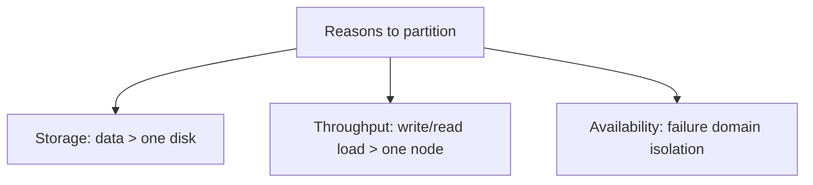
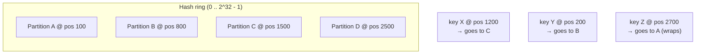
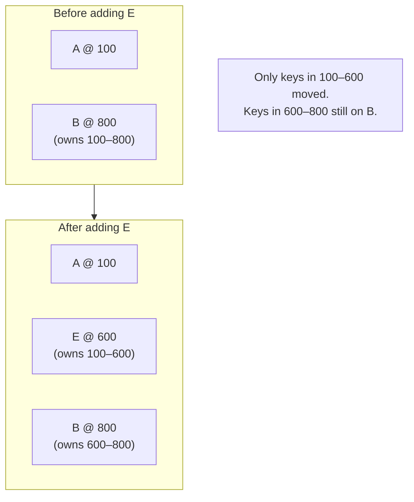
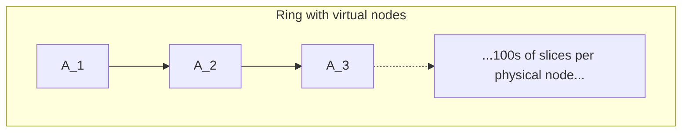

# Partitioning & Consistent Hashing

When the data set is bigger than any one machine — or when no one machine can serve the request rate — the data has to be **partitioned** (also called **sharded**) across multiple machines. The simple version is conceptually easy: take a key, send it to one of N machines. The hard version is: when N changes (add a machine, remove a machine, replace a failed one), *don't move everything*. Naive partitioning by `hash(key) mod N` requires moving (N−1)/N of the data when N changes by one — for a 100-node cluster, that's 99% of the data moving for a single node addition. **Consistent hashing** (David Karger and the Akamai team, 1997) solved this by reducing the data movement on a cluster change from "most of it" to "1/N of it." The technique is what makes elastic distributed data possible — Dynamo, Cassandra, Akamai's CDN, Discord's message store, Riak, memcached's libketama, Couchbase, Bigtable's tablet servers all use consistent hashing or a close relative.

The depth bar here is **what each partitioning strategy actually does on the wire and on disk** when the cluster changes. We trace the naive `hash mod N` rebalance (move 99% of data); the consistent hash ring (move 1/N); the addition of **virtual nodes** (a single physical node owns many points on the ring, smoothing load distribution); modern alternatives like **jump consistent hash** (Lamping and Veach, 2014, used by Google for storage) and **rendezvous hashing** (HRW — highest random weight, 1996). We cover the operational realities — hot partitions, repartitioning windows, the relationship between partitioning and replication. We compare **range partitioning** (HBase, BigTable, Spanner — keys are sorted and split into ranges) with **hash partitioning** (DynamoDB, Cassandra, Redis Cluster) and identify which each is good for. We name the partition counts real systems use (Kafka's typical 10–1000 partitions per topic; DynamoDB's 1000+ partitions per table; Vitess's MySQL shards with custom routing). By the end you will choose a partitioning strategy and partition count for a new system, predict cluster-rebalance behavior under failures and additions, and recognize hot-partition symptoms before they take production down.

> [!NOTE]
> Prerequisites: [Replication Strategies](./T04-replication-strategies.md), [Consistency Models](./T02-consistency-models-strong-eventual.md). Partitioning is the *across-machines* dimension; replication is the *within-partition* dimension. They are independent: each partition can be replicated, and a system's full design is "P partitions × N replicas per partition."

## Where Consistent Hashing Came From — Karger's 1997 MIT Paper And The Akamai Connection

Consistent hashing is one of the few CS algorithms where you can identify *both* the inventor and the *specific problem* that drove the invention. The story is a clean example of how academic research becomes industrial infrastructure.

### David Karger And The 1997 Paper

[*Consistent Hashing and Random Trees: Distributed Caching Protocols for Relieving Hot Spots on the World Wide Web*](https://www.akamai.com/site/de/documents/research-paper/consistent-hashing-and-random-trees-distributed-caching-protocols-for-relieving-hot-spots-on-the-world-wide-web-technical-publication.pdf) (Karger, Lehman, Leighton, Levine, Lewin, Panigrahy — STOC 1997) introduced consistent hashing. The authors were all MIT-affiliated, including:

- **David Karger** (born 1967): MIT professor, theoretical computer scientist, primary author.
- **Tom Leighton**: MIT applied math professor, co-founder of Akamai.
- **Danny Lewin** (1970–2001): Israeli-American mathematician, MIT PhD student, co-founder of Akamai. Tragically died on American Airlines Flight 11 on September 11, 2001.

The specific motivation: **the 1997 web was experiencing "flash crowd" problems** — sudden traffic spikes (e.g., a news story breaking) that overwhelmed origin servers. The proposed solution: **distribute cached copies of popular pages across many edge servers, with a consistent way to route requests to the right server**.

The simple `hash(URL) mod N` approach failed because **N changed**. The cache fleet grew, shrank, and recovered from failures constantly. When N changed, the modulo arithmetic remapped most URLs to different servers, evicting all their caches at once. The flash crowd that caused the scaling event would then re-overwhelm the new server.

Karger's insight: **map both URLs and servers onto a circular hash space (a "ring")**, and route each URL to the *next server clockwise*. When a server is added or removed, only the URLs in *its* arc on the ring are remapped — typically 1/N of the keys. The rest are unaffected.

### Akamai (1998)

The Karger paper directly produced **Akamai Technologies**, founded by Leighton and Lewin in August 1998. Akamai's content delivery network was the first major industrial deployment of consistent hashing, applied to the cache-routing problem the paper had originally described.

Akamai's early success was dramatic: it onboarded Apple as a customer in 1999 (for QuickTime's launch), Yahoo in early 2000, and by 2001 was handling significant portions of the web's static content. The CDN industry that followed (Limelight, EdgeCast, Cloudflare, Fastly) all use consistent hashing or close cousins.

**The historical lesson**: consistent hashing wasn't theoretical — it was *the specific algorithm that made the modern CDN possible*. The web of 2026 (and the resilience to traffic spikes that the web takes for granted) depends on a 1997 paper.

### The Dynamo Paper's Re-Application (2007)

The second major industrial application of consistent hashing was **Amazon's Dynamo** ([Dynamo paper](https://www.allthingsdistributed.com/files/amazon-dynamo-sosp2007.pdf), 2007). The Dynamo authors applied consistent hashing to a *different* problem: not CDN cache routing, but distributing data across hundreds of database nodes for the shopping cart service.

The Dynamo paper added the critical refinement of **virtual nodes** (vnodes): each physical server is represented by 100–200 points on the ring rather than one. This dramatically smooths the load distribution — a single physical node owning many ring positions has its load averaged out, vs the original Karger paper's "one server, one point" which produced uneven distributions.

Dynamo's authors credit Karger explicitly. The paper marks the moment when consistent hashing crossed from "CDN-specific" to "general distributed-systems primitive."

### The 2010s Refinements

#### Jump Consistent Hash (Lamping & Veach, 2014)

[*A Fast, Minimal Memory, Consistent Hash Algorithm*](https://arxiv.org/pdf/1406.2294.pdf) (John Lamping and Eric Veach, Google, 2014) introduced a clever variant: a stateless hash that maps a key to one of N buckets, with **1/N data movement** when N changes. The algorithm uses only a few multiplications and a loop, requiring no ring data structure.

The trade-off: bucket numbering is fixed (0, 1, 2, ..., N-1), so removing a bucket in the middle requires renumbering. Jump consistent hashing is ideal for *growing* systems but awkward for arbitrary removal.

#### Rendezvous Hashing (Thaler & Ravishankar, 1996)

[*A Name-Based Mapping Scheme for Rendezvous*](https://www.microsoft.com/en-us/research/wp-content/uploads/2017/04/papers-tr98-26.pdf) (David Thaler and Chinya Ravishankar, 1996) predates Karger but was less widely known. The algorithm — also called HRW (Highest Random Weight) — assigns a key to the *node whose hash with the key is highest*. It avoids the ring data structure entirely but is O(N) per lookup.

For small N (10s of nodes), rendezvous hashing has excellent properties: simple, no ring, no virtual nodes, optimal distribution. For large N (1000s), the O(N) cost dominates.

#### Bounded-Load Consistent Hashing (Mirrokni, Thorup, Zadimoghaddam, 2017)

[*Consistent Hashing with Bounded Loads*](https://research.google/pubs/consistent-hashing-with-bounded-loads/) (Google, 2017) addressed a real production problem: a single hot key can saturate one server. Their refinement: cap the load per server; if the natural target is full, walk the ring to the next.

This is used in Google Cloud Load Balancer and made consistent hashing viable for traffic-distribution use cases where hot keys are a problem.

### Why This Lineage Matters

The 1997 Karger paper provided the *theoretical foundation*. The 1998 Akamai deployment proved it worked in production. The 2007 Dynamo paper extended it to data systems. The 2014–2017 refinements addressed specific failure modes (state, hot keys, removal).

When you read about Cassandra's vnodes, DynamoDB's partition map, Redis Cluster's hash slots, or Cloudflare's request routing, you're seeing applications of one or more of these papers. The senior engineer's value: recognizing the lineage and the trade-offs it implies.

## Why Partitioning, Specifically: The Senior Engineer's Q&A

### Q1: Why do we partition? Aren't bigger machines an answer?

Three problems vertical scaling alone doesn't solve:

1. **Single-machine throughput ceiling**: a Postgres primary maxes out at ~50,000 writes/sec on top hardware. Higher-volume workloads need horizontal scale.
2. **Single-machine storage ceiling**: a 10 TB Postgres database is workable; 100 TB is painful; 1 PB requires partitioning.
3. **Single-machine failure domain**: one machine = one outage on failure. Even with replication, the failover unavailability is significant.

For workloads exceeding any of these limits, partitioning is required. For workloads within them, single-machine designs are often *better* (less complexity, lower cost).

### Q2: Why did the naive `hash mod N` approach fail so badly?

Because **N changes**. In a cluster with 100 servers, adding one to make 101 causes ~99% of keys to remap. Specifically:

- Old: `hash(k) mod 100`
- New: `hash(k) mod 101`
- Match: only when `hash(k) mod 100 == hash(k) mod 101`, which is approximately 1/101 of keys.

So 100/101 of the data moves on a single-node addition. **In practice, this defeated the whole motivation for horizontal scaling** — you couldn't actually add capacity because adding capacity meant copying everything.

This is *the* problem consistent hashing solved.

### Q3: How does consistent hashing compare to range partitioning?

The classic comparison:

| Dimension | Hash partitioning | Range partitioning |
|-----------|------------------|---------------------|
| Load distribution | Even (assumes good hash) | Risk of hot ranges |
| Range queries | Fan out to all partitions | Efficient (single partition) |
| Locality | None | High (related keys close) |
| Hot-key risk | If skewed key distribution | Always present at range edges |
| Used by | DynamoDB, Cassandra, Redis Cluster | HBase, BigTable, Spanner |

The senior judgment: **range partitioning when locality matters** (time-series data, user-by-user grouping, sorted query patterns). **Hash partitioning when load distribution matters** (random-access workloads, no range queries).

Modern systems sometimes combine both. Cassandra's clustering keys give some range-within-partition. CockroachDB uses range partitioning but rebalances ranges automatically based on load.

### Q4: How do real systems use 16,384 hash slots (Redis) vs unbounded vnodes (Cassandra)?

Different design philosophies:

**Redis Cluster's fixed 16,384 slots**: pre-decided at design time. Easier to reason about (each slot has a definite owner); easier to migrate (move slot 1234 from node A to node B). The trade-off: maximum cluster size is essentially capped at ~1,000 nodes (smaller numbers of slots per node become wasteful).

**Cassandra's vnodes**: each physical node owns 256 vnodes by default. Distribution is automatic. The trade-off: more complex; failed-node recovery requires moving many vnodes; some operations are slower.

Neither approach is wrong; they suit different operational profiles.

### Q5: When does the consistent-hash hot key become catastrophic?

When the hot key's traffic exceeds *one* partition's capacity. Examples:

- **A celebrity user with 50% of all writes**: every write hits one partition.
- **A timestamp-key (`yyyy-mm-dd`) with all writes going to today**: time-based hot partition.
- **A counter incremented by all users**: serialized at one node.

Mitigations:

1. **Composite keys**: `celebrity_user_id:date` splits across many partitions.
2. **Salting**: prepend a random byte to spread monotonic keys.
3. **Bounded-load consistent hashing**: explicitly cap per-node load.
4. **Replication-of-hot-partition**: maintain N replicas just for the hot range, route reads across them.

The senior practice: **identify hot keys at design time, not after the production incident**. If your access pattern has a long tail (Pareto-distributed), you have hot keys whether you've noticed them or not.

## Common Misconceptions Explained

### "Consistent hashing eliminates data movement."

False. Consistent hashing **minimizes** data movement to ~1/N on cluster changes. Some movement is unavoidable; CH gives you the *minimum*.

### "Virtual nodes are required for consistent hashing."

False. The original Karger paper had no virtual nodes. Vnodes are an optimization (smoothing load distribution) added by Dynamo (2007). For workloads with few keys and many nodes, vnodes can be unnecessary; for workloads with many keys and few nodes, vnodes are typically essential.

### "Range partitioning is obsolete because hash partitioning is better."

False. Range partitioning is *the right answer* for many workloads — time-series data, sorted index scans, related-keys-must-be-together patterns. HBase, BigTable, and Spanner all use range partitioning successfully at internet scale.

### "Consistent hashing is just for caches."

False. Originally designed for caches, consistent hashing now distributes data in databases (Cassandra, DynamoDB), load balances HTTP traffic (Envoy, Nginx with consistent_hash), routes messages (some MQ systems), and shards work (Spark, Flink). It's a general-purpose primitive.

### "Sharding once is enough."

False. As data grows, the initial sharding may become inadequate. Re-sharding (or "rebalancing") is one of the most painful operations in any sharded system. Pre-allocating extra shards (e.g., Vitess's "vindex" with 64 shards from day 1, even if 8 would be enough) is a common defensive practice.

### "All systems should use consistent hashing."

False. Range partitioning has its place. Some systems (Spanner, CockroachDB) use range partitioning with automatic load-balancing rebalancing — getting the benefits of both. The choice should follow the workload.

## Why Partition — Three Drivers



Storage is the obvious driver — a 10 TB dataset doesn't fit on a 4 TB disk. Throughput is often the *real* driver — a single Postgres primary maxes out around 50,000 writes/sec; sharding across 10 primaries gives 500,000. Availability is the subtle driver — a partition failure that takes down 1/N of users is far better than a full outage.

The cost of partitioning is significant: cross-partition queries become hard (or impossible without a coordinator), cross-partition transactions usually require sagas ([T06](./T06-distributed-transactions-2pc-saga.md)), and any operation that touches all data (a full-table scan, an analytics query) becomes a fan-out across all partitions.

## The Naive Approach — `hash(key) mod N`

The obvious algorithm: compute a hash of the key, modulo the number of partitions, and route to that partition.

```java
int partition = (key.hashCode() & 0x7FFFFFFF) % N;
```

For a fixed N, this works fine. The disaster is **when N changes**. If you add a partition (N becomes N+1), the modulo arithmetic changes for *most* keys — typically (N)/(N+1) of keys hash to a different partition than before. Concretely:

- 4 partitions → 5: ~80% of keys move.
- 10 partitions → 11: ~91% of keys move.
- 100 partitions → 101: ~99% of keys move.

In a real cluster, moving 99% of data triggers hours of network and disk I/O, makes the cluster unavailable for normal traffic, and is so painful that teams *avoid scaling*. The whole motivation for distributed databases — elastic capacity — is defeated.

## Consistent Hashing — Karger's 1997 Solution

The idea: instead of mapping keys to partitions via modulo, map both **keys** and **partitions** to positions on a circular hash space (a "ring"). Each key belongs to the *first partition clockwise* from its position on the ring.



A typical hash space is 0 to 2^32 − 1 or 2^64 − 1; each partition is a point on the ring (typically a hash of the partition's identifier or IP); each key is also a point; each key belongs to the next partition clockwise.

### What Happens When A Partition Is Added

Add partition E at position 600. Keys previously routed to B (positions 100–800) that fall in 100–600 now route to E instead. **Only keys in the range 100–600 move**; everything else is unaffected.



In a cluster of N partitions, adding one moves roughly **1/N of the data** instead of (N−1)/N. **Massive operational improvement.**

### The Problem — Uneven Distribution

If partitions are positioned by `hash(partitionId)`, the spacing on the ring is random. Some partitions own large ranges (lots of keys); some own small ranges. Load imbalance is the result. With N=10 partitions, the largest partition typically owns ~3× the data of the smallest.

### The Fix — Virtual Nodes (Vnodes)

Each physical partition is represented by **many points** on the ring — typically 100–200. Now the per-physical-node load distribution is the average over its 200 ring slices, which is much closer to uniform.



Cassandra's default is 256 vnodes per physical node. Dynamo's original design used about 100. The cost is more ring positions to track; for modern hardware, this is negligible.

### Replication On The Ring

The ring also supports replication trivially: store each key on the *next K nodes clockwise* (where K is the replication factor). Dynamo and Cassandra use this directly. A partition addition or removal redistributes a small slice of data; replica writes find the right K nodes by walking the ring.

## Modern Alternatives — Jump Consistent Hash And Rendezvous Hashing

Consistent hashing on a ring is the canonical algorithm; two alternatives have specific advantages.

### Jump Consistent Hash (Lamping And Veach, 2014)

A clever algorithm that maps a key to one of N buckets with **minimal state** (no ring required) and only **1/N data movement** when buckets are added. Used in Google's storage layer.

```java
// Lamping & Veach 2014 - "A Fast, Minimal Memory, Consistent Hash Algorithm"
public static int jumpConsistentHash(long key, int numBuckets) {
  long b = -1, j = 0;
  while (j < numBuckets) {
    b = j;
    key = key * 2862933555777941757L + 1;
    j = (long)((b + 1) * ((double)(1L << 31) / (double)((key >>> 33) + 1)));
  }
  return (int)b;
}
```

A handful of multiplications produces the bucket assignment with the same data-movement properties as a ring. No ring data structure. Faster lookup.

The trade-off: buckets are referenced by *integer index* (0, 1, 2, …). Removing a bucket in the middle requires renumbering — works if removed buckets are at the end (downscaling) but harder for arbitrary removal.

### Rendezvous Hashing (Highest Random Weight, 1996)

For each key, compute `hash(key, nodeId)` for *every* node, and route to the node with the maximum value. Adding or removing a node only affects keys whose top-scoring node was the changed one.

```java
public static String rendezvous(String key, List<String> nodes) {
  return nodes.stream()
      .max(Comparator.comparingLong(node -> hash(key + ":" + node)))
      .orElseThrow();
}
```

Pros: no ring, no virtual nodes, perfectly distributed. Cons: O(N) per lookup. Often used for small N (10s of nodes), e.g., cache shards.

## Range Partitioning Vs Hash Partitioning

Two fundamental choices.

### Hash Partitioning

Partition by `hash(key)`. Each partition gets a uniformly-distributed subset of keys.

**Pros**: load is naturally balanced; no hot partitions for evenly-distributed keys.

**Cons**: range queries (`WHERE id BETWEEN 100 AND 200`) require scanning all partitions; no locality.

**Used by**: DynamoDB, Cassandra, Redis Cluster, Riak.

### Range Partitioning

Partition by *key ranges*. Partition 1 owns A–F, partition 2 owns G–M, partition 3 owns N–Z. Each partition holds a contiguous range.

**Pros**: range queries hit one or few partitions; locality for related keys.

**Cons**: requires care to avoid hot partitions; if all writes go to the latest range (timestamp-based keys), one partition saturates.

**Used by**: HBase, Bigtable, Spanner, CockroachDB.

### Hybrid

Many modern systems blend both. CockroachDB uses range partitioning but rebalances ranges automatically. Cassandra supports a "clustering key" within a partition that gives some range capability without losing hash distribution.

## Hot Partitions — The Operational Pain

A *hot partition* is one that handles disproportionate load. Symptoms: that one partition is timing out; the rest of the cluster is idle; throughput is bottlenecked.

Causes:

- **Skewed key distribution**: most writes go to one customer (the "celebrity" customer in social systems). DynamoDB's split-and-shard helps; not all systems do.
- **Time-based keys without distribution**: `timestamp_seconds` as a partition key means all writes go to the latest partition.
- **Bad partition function**: `hash(key)` that's not well-distributed for the actual key shape.
- **Small dataset, large partitions**: with few partitions, even uniform load is per-partition heavy.

Mitigations:

- **Composite keys**: `customer_id:date` instead of `customer_id` — splits a hot customer across partitions.
- **Salting**: prepend a random byte to keys before hashing; spreads even monotonic keys.
- **Splitting partitions**: dynamic resharding (DynamoDB's adaptive capacity, Cassandra's manual `nodetool cleanup`).
- **Replica-of-the-hot-partition**: replicate the hot range to more nodes; reads spread across replicas.

## Partition Counts In Practice

How many partitions should a system have? Three considerations:

1. **Future growth**: too few partitions caps future scale; too many wastes resources.
2. **Per-partition cost**: each partition has overhead (replication, metadata, monitoring).
3. **Resharding pain**: changing partition count is expensive; pick a target that survives 5+ years of growth.

| System | Typical partition count |
|--------|------------------------|
| **Kafka** | 10–1,000 per topic |
| **DynamoDB** | 1–1,000s (auto-managed) |
| **Cassandra** | 256 vnodes per node × N nodes = thousands |
| **Spanner** | 1,000s of ranges (auto-managed) |
| **Redis Cluster** | 16,384 hash slots (fixed) |
| **CockroachDB** | 1,000s of ranges (auto-managed) |
| **Vitess** | 4–64 shards typically (manual) |
| **Citus (PG)** | 32–128 shards typically (manual) |

The trend toward auto-managed (Spanner, CockroachDB, DynamoDB) is the future direction — operators don't pick partition counts; the system splits and merges ranges based on load and size.

## Real System Internals

### DynamoDB

Originally 2007 Dynamo paper used consistent hashing with vnodes. Modern DynamoDB uses a layered approach: a table is split into partitions (each ~10 GB or 3000 RCU / 1000 WCU). Hot partitions auto-split. The hash space is internal; the user just sees keys.

### Cassandra

Token ring with vnodes (256 by default per physical node). Replication factor RF determines how many ring positions a key replicates to. Consistency tunable per query ([T02](./T02-consistency-models-strong-eventual.md)).

### Kafka

Each topic has a fixed partition count. Each partition is a single ordered log; consumers within a group split the partitions. Messages with the same key always go to the same partition (`hash(key) mod numPartitions`). **Partition count is fixed at topic creation**; increasing requires creating a new topic and migrating.

### Redis Cluster

Always 16,384 hash slots (fixed). Each Redis Cluster master owns some subset of slots. Resharding is moving slots between masters; the count doesn't change. Clients use `CRC16(key) mod 16384` to determine the slot.

### Bigtable / HBase

Range partitions called "tablets" (Bigtable) or "regions" (HBase). Each is a contiguous key range. The master assigns tablets to tablet servers; tablets split automatically when they grow.

## Cross-Partition Operations — The Hidden Cost

Once you partition, the simple operations that were free in a single-node database become hard:

- **JOINs across partitions**: usually require fetching data to a coordinator and joining there, or denormalizing to avoid the join.
- **Transactions across partitions**: distributed transactions ([T06](./T06-distributed-transactions-2pc-saga.md)) or sagas ([T06 of C01](../C01-software-architecture/T10-saga-pattern-distributed-transactions.md)).
- **Sequence numbers**: a global incrementing ID becomes a hot partition; alternatives are Snowflake IDs (Twitter), UUIDs, or per-partition sequences.
- **Aggregate queries**: scan all partitions, aggregate at the coordinator. Slow but tractable.

The architectural lesson: **design data models with partitioning in mind from day one**. Choose partition keys so the operations you care about are *single-partition*; design schemas to denormalize for query patterns.

## Trade-Off Summary

| Strategy | Strengths | Weaknesses |
|----------|-----------|------------|
| **Hash partitioning** | Even load distribution | No range queries, no locality |
| **Range partitioning** | Range queries fast, locality | Hot-partition risk |
| **Consistent hashing (ring)** | 1/N rebalance | Vnodes needed for even distribution |
| **Jump consistent hash** | Fastest lookup, no state | Bucket addition only at end |
| **Rendezvous hashing** | Perfect distribution | O(N) per lookup |
| **Auto-managed (Spanner, CRDB)** | No operator choice | Vendor lock-in |

> [!INTERVIEW]
> A common L5 prompt: "Explain consistent hashing." Strong answers (a) describe the ring, (b) explain why naive modulo fails (99% data movement), (c) cite virtual nodes for distribution, (d) name a production system that uses it (Cassandra, DynamoDB, Akamai). Mentioning jump consistent hash or rendezvous unprompted signals senior depth.

## Practice

1. **Naive mod failure.** For a cluster of 10 nodes with 1 million keys, simulate the rebalance when one node is added using `hash mod N`. Count keys moved.
2. **Consistent hash simulation.** Implement a basic consistent hash ring in Java with 3 nodes and 100 vnodes per node. Simulate node addition; count keys moved.
3. **Rendezvous hashing benchmark.** Implement HRW for 50 nodes. Measure lookup time. Compare to a hash-ring lookup.
4. **Hot-partition diagnosis.** In a Cassandra or DynamoDB system you operate, find any hot partition. Identify the cause (skewed key, monotonic key, bad function). Propose a key restructuring.
5. **Partition count for Kafka.** For a new Kafka topic expected to handle 100K msg/sec, choose a partition count. Defend in two paragraphs.
6. **Range vs hash decision.** For three use cases — time-series logs, user profiles, range-scan analytics — choose between range and hash partitioning. Justify each.
7. **Composite key design.** Take a schema with a hot partition risk. Design a composite key that mitigates. Verify distribution by hashing 1M samples.
8. **Cross-partition transaction plan.** For an order-and-inventory system with order_id-partitioned orders and product_id-partitioned inventory, design how a "place order" operation works. (Hint: see [T10 of C01](../C01-software-architecture/T10-saga-pattern-distributed-transactions.md).)
9. **Resharding plan.** Plan the resharding of a Kafka topic from 10 to 30 partitions. List every step.
10. **The skeptic conversation.** A senior engineer says "we don't need sharding; we have a big server." Write a 200-word response on the throughput, failure-domain, and growth-trajectory arguments.

## Recap

You should now be able to:

- Explain why **naive `hash mod N`** fails — (N−1)/N of data moves on cluster changes — and why this defeats elastic scaling.
- Describe **consistent hashing**: the ring, keys-to-next-partition-clockwise, 1/N data movement on changes.
- Add **virtual nodes** to even out per-physical-node load distribution.
- Compare **jump consistent hashing** (state-free, fast) and **rendezvous hashing** (perfect distribution, O(N) lookup) as alternatives.
- Choose between **hash partitioning** (uniform load, no range queries) and **range partitioning** (range queries, hot-partition risk).
- Recognize **hot partitions**: causes (skewed keys, monotonic keys, bad function), symptoms, mitigations (composite keys, salting, splitting, replica reads).
- Pick **partition counts** for new systems, balancing future growth against per-partition overhead.
- Read the internals of **DynamoDB, Cassandra, Kafka, Redis Cluster, Bigtable** and identify their partitioning approach.
- Design schemas with **single-partition operations** in mind, accepting denormalization to avoid cross-partition queries.
- Plan **resharding**: when partition count must change, the steps to migrate without big-bang risk.

## Next

Continue to [Distributed Transactions (2PC, Saga)](./T06-distributed-transactions-2pc-saga.md) — once data is partitioned across machines, transactions that touch multiple partitions become a hard problem. The classical answer (two-phase commit) and the modern answer (sagas) each have their place.
