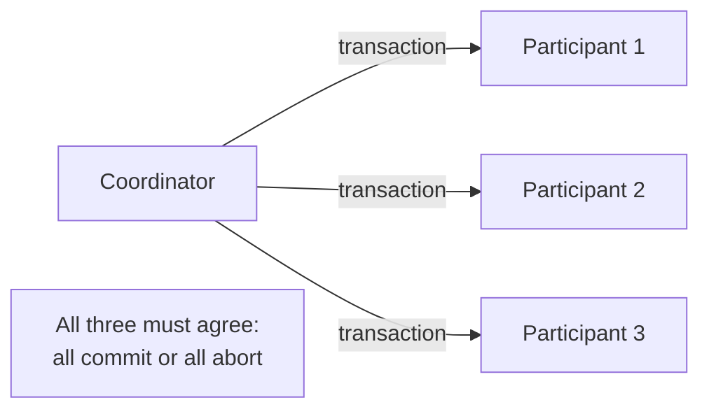
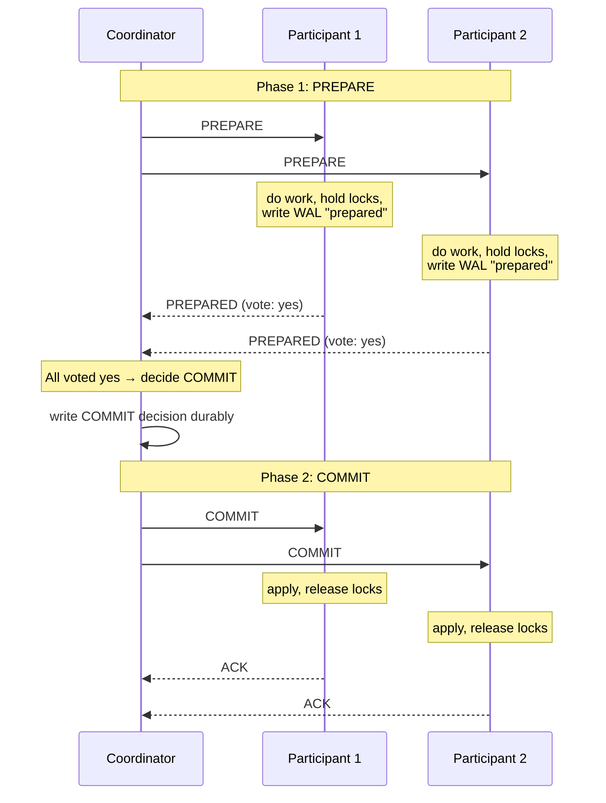
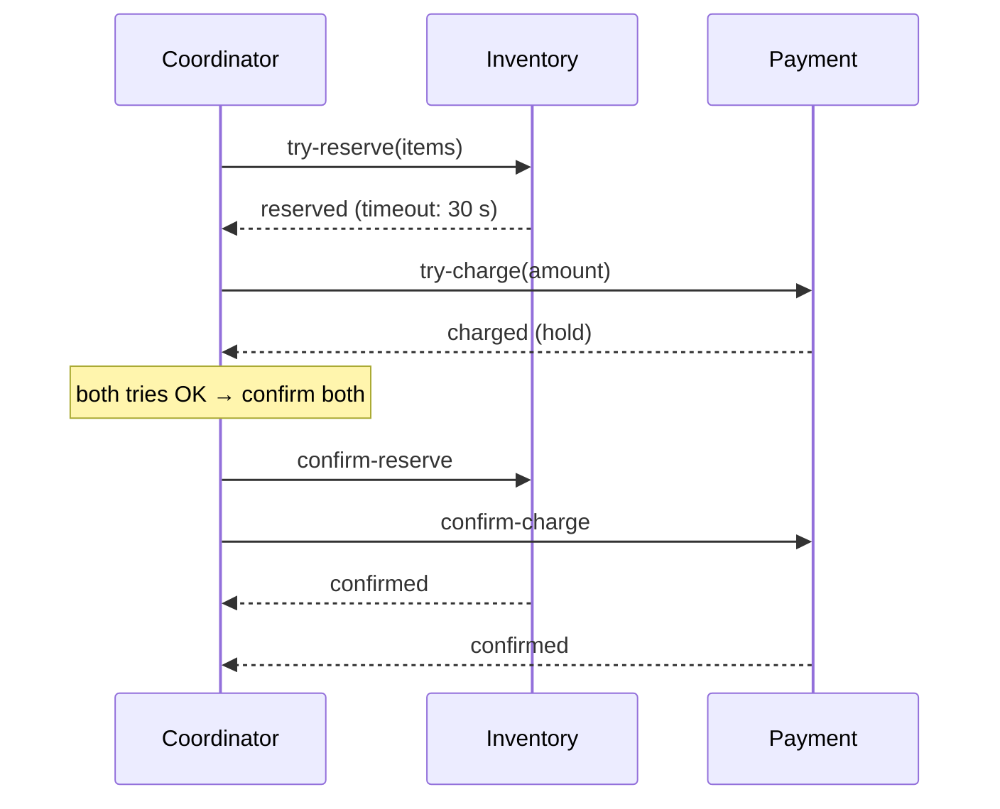
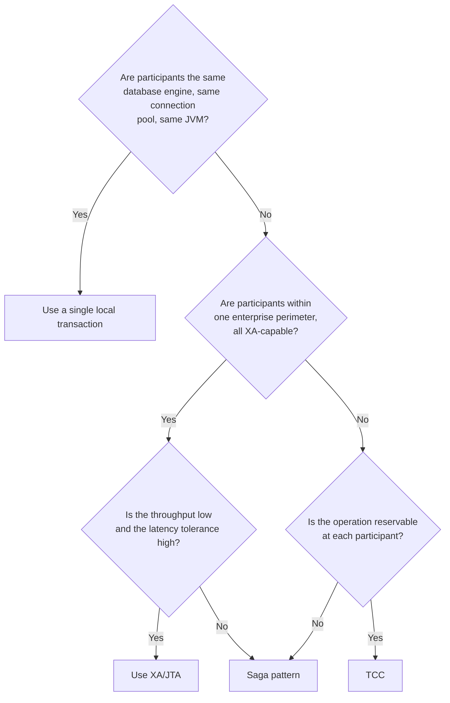

# Distributed Transactions (2PC, Saga)

A transaction inside a single database is ACID — atomic, consistent, isolated, durable. The moment you have **two databases** that must agree on a commit (the order goes into the orders database *if and only if* the inventory drops in the inventory database), you have left ACID's natural home. The classical solution, **two-phase commit (2PC)**, was developed in the 1970s alongside relational databases; it has a clean theoretical model and a notorious operational reputation. The pragmatic modern alternative, the **saga pattern** ([C01/T10](../C01-software-architecture/T10-saga-pattern-distributed-transactions.md)), trades atomicity for availability and compensability. **TCC** (Try-Confirm-Cancel) sits between them — a two-phase protocol where each participant maintains its own reservation state.

The depth bar here is **mechanism and failure modes**. We trace 2PC step by step — the coordinator's `PREPARE` to each participant, the participant's vote (prepared or abort), the coordinator's `COMMIT` or `ABORT` decision, the participant's apply. We name the **catastrophic failure mode** that has made 2PC unfashionable: the coordinator crashes between the prepare and commit phases, leaving participants in the **in-doubt state**, holding locks indefinitely, blocking any other transaction. We cover **3PC** (Skeen 1981) and **Paxos Commit** (Gray and Lamport 2004) as theoretical answers that solve some of 2PC's problems at significant complexity cost. We trace **XA** — the X/Open standard for distributed transactions that JTA implements in Java — and the operational reasons most modern data stores have abandoned XA support. We compare with sagas ([C01/T10](../C01-software-architecture/T10-saga-pattern-distributed-transactions.md)) and TCC, and identify which to choose when. By the end you will know precisely why 2PC across microservices is essentially never the answer, when XA can still be useful inside a tightly-coupled enterprise database fleet, and how to compose sagas correctly for the cross-service cases.

> [!NOTE]
> Prerequisites: [Consensus](./T03-consensus-raft-paxos-intro.md), [Replication](./T04-replication-strategies.md), [Partitioning](./T05-partitioning-and-consistent-hashing.md). This topic operates at the protocol level; the architecture-level discussion of sagas in microservices is in [C01/T10](../C01-software-architecture/T10-saga-pattern-distributed-transactions.md).

## Where Distributed Transactions Came From — The 1970s ACID Tradition And Its Distributed Limits

Distributed transactions are one of the *oldest* problems in database research. The conceptual framework — ACID transactions across multiple resources — was developed at IBM in the 1970s alongside System R, the foundational relational database. The specific protocols (2PC, 3PC, Paxos Commit) emerged from 1970s–80s research that addressed the question: "how do we extend single-machine ACID to multi-machine systems?"

### The 1970s — System R And The ACID Foundation

The conceptual foundation is **IBM's System R**, the research project that produced the first relational database (1974–1979). System R introduced:

- **Two-phase locking** (Gray, 1976): the canonical concurrency control mechanism.
- **Write-ahead logging** (Gray, 1981): the canonical durability mechanism.
- **Serializability theory** (multiple authors): the formal framework for transaction correctness.

**Jim Gray** (1944–2007) was the central figure. His 1981 paper [*The Transaction Concept: Virtues and Limitations*](https://jimgray.azurewebsites.net/papers/theTransactionConcept.pdf) introduced the foundational vocabulary that became ACID. The acronym **ACID** itself was coined by **Theo Härder and Andreas Reuter** in their 1983 paper [*Principles of Transaction-Oriented Database Recovery*](https://dl.acm.org/doi/10.1145/289.291).

Gray's transaction model assumed *single-machine* databases. The distributed extension came soon after.

#### Who Jim Gray Is

**Jim Gray** is one of the most influential figures in database history. After his System R work, he moved to Tandem Computers (where he developed fault-tolerant systems) and then to Microsoft Research (where he led the database group). He received the 1998 Turing Award.

Gray's disappearance at sea in January 2007 — his sailing boat *Tenacious* vanished off the California coast and was never found — was one of the most discussed events in computer science. The community organized an unprecedented search using massive imaging arrays; Gray's body and boat were never recovered.

His work shaped every modern transactional system. The ACID concept, the WAL technique, and the foundational transaction theory all trace back to Gray's papers.

### Two-Phase Commit — The 1970s Solution

**Two-phase commit (2PC)** was formalized in the 1970s as the canonical solution for distributed atomic commit. The protocol was developed simultaneously by multiple research groups:

- **Jim Gray's 1978 paper** [*Notes on Data Base Operating Systems*](https://jimgray.azurewebsites.net/papers/dbos.pdf) included 2PC.
- **Butler Lampson and Howard Sturgis** (Xerox PARC, 1976): independently developed similar protocols.

The 2PC protocol:

1. **Phase 1 (Prepare)**: coordinator asks all participants to prepare. Each participant durably logs its intent to commit but doesn't commit yet.
2. **Phase 2 (Commit/Abort)**: if all participants prepared successfully, coordinator instructs commit; otherwise abort.

The protocol is *correct* — it guarantees atomicity. The problem is *blocking*: if the coordinator fails between phase 1 and phase 2, participants are stuck holding prepared transactions indefinitely.

This **blocking problem** would prove fundamental to 2PC's adoption story.

### The X/Open XA Standardization (1991)

In 1991, the **X/Open consortium** (which became the Open Group) standardized the distributed transaction model as **XA**. The XA specification defined:

- **Transaction Manager (TM)**: coordinates transactions.
- **Resource Manager (RM)**: a database, message queue, or other resource that participates in transactions.
- **XA protocol**: the messages between TM and RMs.

XA enabled **heterogeneous transactions** — transactions spanning Oracle and DB2 and IBM MQ. The Java analog is **JTA (Java Transaction API)**, standardized in 1999 as part of J2EE.

XA had a *significant* moment in late-1990s enterprise computing. Java EE application servers (WebLogic, WebSphere) supported XA prominently; cross-database transactions were a featured capability.

But XA had problems that became apparent in production:

1. **The blocking problem**: 2PC's coordinator failure caused real outages.
2. **Performance overhead**: XA's protocol roundtrips were measurable.
3. **Vendor incompatibility**: XA implementations had subtle differences.
4. **Operational complexity**: recovering stuck transactions required DBA intervention.

By 2010, XA was *avoided* in new systems. It remained in legacy enterprise contexts but wasn't recommended for greenfield work.

### The 1980s — 3PC, Lampson, And The Theoretical Refinements

Researchers identified 2PC's blocking problem and proposed solutions:

#### Three-Phase Commit (Skeen, 1981)

**Dale Skeen's [*Nonblocking Commit Protocols*](https://dl.acm.org/doi/10.1145/582353.582361)** (SIGMOD 1981) introduced **3PC**, which adds a "pre-commit" phase to make the protocol non-blocking under fail-stop failures.

3PC's caveat: it requires assumptions (synchronous communication with bounded message delays) that often don't hold in real networks. In practice, 3PC is rarely deployed.

#### Paxos Commit (Lamport And Gray, 2004)

In 2004, **Lamport and Gray** published [*Consensus on Transaction Commit*](https://lamport.azurewebsites.net/pubs/paxos-commit.pdf), which combined Paxos with 2PC. The protocol uses Paxos for the coordinator's decisions, achieving the *non-blocking* property without 3PC's assumptions.

Paxos Commit is *theoretically* better than 2PC but operationally complex. It's used in some Google systems (Spanner) but rarely in commodity databases.

### The Saga Pattern's Modern Re-emergence (2012+)

By the early 2010s, the microservices movement made 2PC impractical at internet scale. The saga pattern (Garcia-Molina & Salem 1987 — covered in [C01/T10](../C01-software-architecture/T10-saga-pattern-distributed-transactions.md)) was re-discovered and applied. By 2018, "use sagas, not 2PC" was the canonical microservices advice.

The transition was significant: from 1990s-2000s ("XA is the right answer for cross-system transactions") to 2010s-2020s ("XA is legacy; use sagas"). This shift was *not* because 2PC became wrong — it remained correct — but because the operational cost became unacceptable at scale.

## Why Distributed Transactions Matter, Specifically: The Senior Engineer's Q&A

### Q1: Why is 2PC so problematic in modern systems?

Three specific operational problems:

1. **Blocking on coordinator failure**: if the coordinator crashes between prepare and commit, participants are stuck holding row-level locks indefinitely. Other transactions queue. Throughput collapses.

2. **XA support is patchy**: modern data stores (DynamoDB, Cassandra, MongoDB, Kafka, Elasticsearch) don't support XA. Only relational databases and some message brokers do.

3. **Performance overhead**: 2PC requires multiple round trips. For high-throughput systems, the overhead is significant.

The combination makes 2PC impractical for microservices. The saga pattern accepts weaker consistency in exchange for operational viability.

### Q2: When is 2PC still appropriate?

Three regimes:

1. **Trusted single-team perimeter**: all participants owned and operated by the same team, all XA-capable, low transaction volume.
2. **Legacy enterprise systems**: existing applications that already use XA shouldn't be migrated lightly.
3. **Specific high-value transactions**: a small number of cross-database transactions where 2PC's correctness is worth its operational cost.

For modern microservices, 2PC is essentially never the right answer.

### Q3: What's the actual cost of a saga vs 2PC?

**2PC cost**: ~2 network round trips per transaction; coordinator state; participant lock-hold time.

**Saga cost**: orchestration logic; compensating transaction logic for each step; the application-level handling of partial failures.

The 2PC cost is *more*; the saga cost is *more* (in different ways). The choice depends on which costs your system can afford.

### Q4: How does this relate to consensus algorithms?

Consensus (Paxos, Raft) is *necessary* for some distributed transaction protocols. Paxos Commit explicitly uses Paxos; 2PC uses a single coordinator (which is a single point of failure unless the coordinator itself is consensus-replicated).

Most production 2PC implementations don't consensus-replicate the coordinator; they assume the coordinator is reliable enough. This assumption fails sometimes, causing the blocking problem.

### Q5: How does this compare to Spanner's distributed transactions?

**Spanner** achieves distributed serializable transactions using:

1. **Paxos-replicated tablets**: each shard has its own Paxos group.
2. **TrueTime**: globally-synchronized clocks with bounded uncertainty.
3. **Two-phase commit across Paxos groups**: cross-shard transactions use 2PC, but each participant is a Paxos group (not a single node), so coordinator and participant failures are tolerated.

This is *expensive* (multiple Paxos rounds plus 2PC) but works at Google scale. It's the high end of what's possible with distributed transactions.

## Common Misconceptions Explained

### "Distributed transactions are impossible."

False. They're *possible* but expensive. Spanner, CockroachDB, FoundationDB all provide distributed transactions. The cost is high, but the capability exists.

### "Sagas are weaker than 2PC."

True in *consistency*; the comparison isn't simple. 2PC provides atomicity at the cost of blocking; sagas provide eventual consistency without blocking. Neither is universally "better."

### "XA was a mistake."

Partially false. XA was *right* for the systems it served (single-team, single-perimeter, transactional). It became *wrong* for the microservices systems that emerged later.

### "Modern systems don't need transactions."

False. **Modern systems need transactions**; they just structure them differently. Sagas, idempotency keys, event sourcing — all are *transaction patterns* in distributed contexts.

### "Eventual consistency means no transactions."

False. Eventual consistency means *eventually all replicas converge*. Transactions can be expressed eventually consistently (sagas).

### "2PC is the only way to atomic distributed commit."

False. Paxos Commit, Calvin (Daniel Abadi's work), and FoundationDB's optimistic concurrency are alternatives. 2PC is canonical but not the only option.

## The Atomic Commit Problem

Two or more participants (databases, services, resource managers) must *all* commit or *all* abort a transaction. There must be no scenario where some commit and others abort — that violates atomicity. The challenge is that participants can fail, networks can drop messages, and we have no shared clock.



A simple "send commit to all" doesn't work — what if one participant's commit fails? The system is now in an inconsistent state. We need a protocol that gathers commitment from all participants before committing any.

## Two-Phase Commit (2PC)

The classical protocol. The coordinator drives the transaction through two phases.

### The Protocol



Phase 1 (Prepare): coordinator asks each participant if it can commit. Each does its work *but does not commit* — it writes the transaction to a write-ahead log marked "prepared" and holds locks. It votes yes (prepared) or no (abort).

Phase 2 (Commit / Abort): if all voted yes, the coordinator writes its decision durably ("global commit") and tells each to commit. If any voted no, it tells all to abort. Participants apply the decision and release locks.

### What 2PC Guarantees

If every participant follows the protocol and the coordinator's decision survives, every participant arrives at the same outcome (all commit or all abort). Atomicity.

### What 2PC Doesn't Guarantee — The Coordinator-Crash Problem

The coordinator can crash between Phase 1 and Phase 2. The participants have voted yes; they hold locks; they don't know the decision. **They cannot make a safe decision on their own.**

- If they unilaterally commit, the coordinator might have decided abort, producing inconsistency.
- If they unilaterally abort, the coordinator might have decided commit, also producing inconsistency.

The protocol's prescription: **wait**. Hold the locks. Wait for the coordinator to recover. Read the coordinator's recovered log to learn the decision. Apply it.

In practice: locks held for **minutes to hours**. The entire database is blocked on transactions that touch the same rows. The "in-doubt" transaction lingers until an operator intervenes (a "heuristic decision" — committing or aborting under duress, accepting the risk of inconsistency).

This is the operational failure mode that has made 2PC unfashionable. **Coordinator availability is critical**, and making the coordinator highly available reintroduces consensus ([T03](./T03-consensus-raft-paxos-intro.md)) — which means 2PC + Paxos for the coordinator is more complex than just doing Paxos for the operation.

### Other 2PC Failure Modes

- **Participant crash after voting yes, before applying commit**: the participant must, on recovery, read its WAL, find the prepared transaction, and ask the coordinator for the decision. If the coordinator is gone or doesn't remember, it's in-doubt.
- **Network partition**: similar to coordinator crash — participants can't reach the coordinator.
- **Cascading lock contention**: a long-running 2PC transaction blocks all subsequent transactions touching the same data. Throughput craters.

### Optimizations And Variants

- **Presumed Abort**: if the coordinator hasn't logged a decision, default to abort. Reduces logging.
- **Presumed Commit**: opposite. Used in some implementations.
- **One-phase commit (1PC)**: if there's only one participant, skip the prepare phase. Most databases auto-detect.
- **Read-only optimization**: if a participant has only read, it doesn't need to participate in phase 2.

## Three-Phase Commit (3PC) — A Theoretical Fix

Skeen's 1981 3PC adds a phase to avoid blocking on coordinator failure:

1. CanCommit? (like PREPARE — vote)
2. PreCommit (coordinator promises to commit if all confirmed)
3. DoCommit

If the coordinator crashes after PreCommit, participants can complete the commit on their own (they know the coordinator had decided). If it crashes before PreCommit, they can safely abort.

**Why 3PC is rarely used**: it doesn't handle network partitions correctly. The assumption that participants can detect coordinator failure reliably is wrong on real networks. 3PC trades known reliability problems for unknown ones.

## Paxos Commit (Gray And Lamport, 2004)

Replaces the coordinator with a Paxos-replicated coordinator. The decision (commit or abort) is itself decided by Paxos among multiple coordinator replicas. **This is the correct theoretical answer** — but the practical complexity is significant, and the use cases that justify it are narrow.

Spanner's distributed transactions use a Paxos-replicated transaction manager underneath; the architecture is industrial Paxos Commit.

## XA / JTA — The Java Standard

The **X/Open DTP** specification (1991) standardized 2PC across heterogeneous resources. The Java analog is **JTA** (Java Transaction API), used via implementations like Atomikos, Bitronix, and Narayana (Red Hat / WildFly).

```java
// JTA example — coordinated transaction across two databases
UserTransaction tx = transactionManager.getUserTransaction();
tx.begin();
try {
  ordersDataSource.update(orderInsertSql);
  inventoryDataSource.update(inventoryDecrementSql);
  tx.commit();             // 2PC across both resources
} catch (Exception e) {
  tx.rollback();
}
```

In a Spring app:

```java
@Configuration
@EnableJtaTransactionManager
public class JtaConfig {
  @Bean public PlatformTransactionManager transactionManager() {
    return new JtaTransactionManager();
  }
}

@Service
class OrderService {
  @Transactional   // crosses two DataSources via JTA
  public void placeOrder(...) { /* ... */ }
}
```

**Why XA has fallen out of fashion in microservices**:

1. **Most modern data stores don't support XA**. MongoDB, DynamoDB, Cassandra, Elasticsearch, Kafka — none.
2. **Operational complexity is high.** Atomikos / Bitronix / Narayana add a transaction manager to the stack.
3. **Blocking semantics conflict with microservices' independence assumption.** A microservice that participates in XA is *not* independent.
4. **The scale-out path is blocked.** XA assumes a small number of tightly-coupled resources.

XA still has a place in **classical enterprise integration**: a Java EE application server (WildFly, WebSphere) coordinating two SQL databases plus a JMS broker, all within a single trusted perimeter. Outside that niche, sagas or eventual consistency are the modern answers.

## TCC — Try-Confirm-Cancel

A two-phase protocol where each participant exposes three operations:

- **Try**: reserve the resource; return ok or fail. Reservations time out.
- **Confirm**: commit the reservation.
- **Cancel**: release the reservation.



If any Try fails, cancel the ones that succeeded. Reservations time out, so a coordinator crash doesn't permanently lock resources (unlike 2PC).

**TCC is a saga with explicit reservation semantics.** It works well when each service can model "reserved but not yet committed" as a first-class state (inventory's "reserved" vs "available," payment's "authorized" vs "captured"). Stripe's authorize-and-capture flow is TCC; airline ticket reservations are TCC. Saga is more general; TCC is more rigid but easier to reason about.

## The Modern Decision

For Java microservices in 2026, the decision tree:



**Default to sagas.** XA only when the heterogeneous resources genuinely support it and the team accepts the operational cost. TCC when reservation semantics are natural.

## Cross-Database Atomic Commit Without XA

Some modern systems offer cross-database atomicity without classical 2PC:

- **CockroachDB / Spanner / FaunaDB** — internally distributed transactions across nodes (Paxos Commit under the hood); external API looks like ACID.
- **Postgres + Debezium + Outbox** — write to two stores eventually consistent, with the outbox table as the source of truth ([C01/T08](../C01-software-architecture/T08-event-sourcing.md)).
- **Two-phase commit via consensus** — etcd's transaction API (not 2PC, but a single linearizable multi-key operation).

## What "Microservices Should Not Use 2PC" Actually Means

The advice is correct, but often misapplied. The precise version:

- **Don't use 2PC across services owned by different teams.** Coordination costs.
- **Don't use 2PC across heterogeneous data stores.** Many don't support XA.
- **Don't use 2PC where individual service availability is required.** Coordinator failure blocks everyone.

The exceptions:

- **A single team's two co-deployed databases can use XA** if it solves a real problem.
- **A legacy enterprise integration can use JTA** within a single application server.
- **A single managed system that does Paxos Commit internally** (Spanner, CockroachDB) is *not* "microservices doing 2PC" — it's one database doing it for its tenants.

## Cross-Language Notes

| Ecosystem | Distributed transaction support |
|-----------|--------------------------------|
| **Java / Spring** | JTA via Atomikos/Narayana; Spring `@Transactional` with JTA bound |
| **C# / .NET** | `System.Transactions` (MSDTC); rarely used in modern microservices |
| **Go** | No native; teams use sagas or hand-rolled 2PC |
| **Rust** | No standard; ecosystem-specific |
| **Node.js** | Sagas via libraries (TypeORM transactions, Sequelize); no XA |

Java's JTA is the most mature native support; even so, the modern Java microservices community has moved largely toward sagas.

## Trade-Off Summary

| Pattern | When to use | When to avoid |
|---------|-------------|---------------|
| Local transaction | Single database / connection pool | N/A |
| 2PC / XA / JTA | Tight enterprise integration, all XA-capable | Microservices, mixed stores, scaling needs |
| 3PC | Theoretical interest | Production (handles partitions poorly) |
| Paxos Commit | Inside a managed distributed DB | DIY (too complex) |
| TCC | Operations with natural reservation semantics | Operations that can't be reserved |
| Saga | Most modern microservices cross-service | High-frequency operations needing strict isolation |
| Eventual consistency | Cross-service operations where eventual is fine | Where atomicity is non-negotiable |

> [!INTERVIEW]
> A common L5 prompt: "Why don't we just use 2PC?" Strong answers (a) name the coordinator-crash + in-doubt-blocking failure mode, (b) cite the XA support gap in modern data stores, (c) propose sagas as the practical alternative, (d) optionally name Paxos Commit as the theoretical fix.

## Practice

1. **Trace a 2PC failure.** Walk through 2PC for a coordinator + two participants. Inject a coordinator crash between Phase 1 and Phase 2. Trace what each participant does.
2. **JTA setup.** In a Spring Boot project, configure Atomikos for two PostgreSQL data sources. Write a `@Transactional` method that updates both. Force a failure midway; verify both roll back.
3. **TCC implementation.** Implement TCC for an inventory + payment system. Show the Try, Confirm, Cancel methods. Test what happens when Confirm fails.
4. **Saga vs 2PC decision.** For five real cross-service operations, decide saga or 2PC or eventual consistency. Justify.
5. **Read a Spanner paper.** Read the Spanner / Percolator paper sections on transactions. Identify the Paxos Commit pattern in action.
6. **Outbox pattern.** Implement the transactional outbox for a Spring + Kafka service. Confirm DB write + Kafka publish are atomic.
7. **XA failure analysis.** Find a public postmortem involving a stuck XA transaction. Identify the coordinator failure and the operational recovery.
8. **In-doubt resolution.** For a PostgreSQL transaction stuck in `prepared` state, document the resolution procedure (heuristic commit or abort, accepting the inconsistency risk).
9. **Comparison memo.** Write a 1-page memo to a team considering XA for a new microservices project. Recommend against; explain alternatives.
10. **The skeptic conversation.** A senior engineer says "we should use 2PC; it's the only true atomic commit." Write a 200-word response that takes the position seriously and identifies the specific operational realities that make it impractical.

## Recap

You should now be able to:

- Explain the **atomic commit problem** — all participants must agree to commit or all must abort — and why it's hard.
- Trace **two-phase commit (2PC)** through its two phases — Prepare and Commit — naming the participant's prepared state and the coordinator's decision log.
- Name the **catastrophic 2PC failure mode** — coordinator crash between phases leaves participants in-doubt, holding locks indefinitely.
- Distinguish **3PC** (handles coordinator crashes, fails on partitions) and **Paxos Commit** (correct theoretically, complex practically).
- Implement **XA / JTA** in Spring with Atomikos / Narayana for the narrow enterprise case where it fits.
- Recognize **TCC (Try-Confirm-Cancel)** as a reservation-based protocol that handles coordinator crashes gracefully via reservation timeouts.
- Apply the decision tree: local transaction → JTA in trusted perimeter → TCC when reservations are natural → saga otherwise.
- Refuse 2PC for microservices and articulate the exceptions (single team's co-deployed databases, legacy enterprise integration, internal-to-a-distributed-DB).
- Use the **transactional outbox + CDC** as the modern atomic-commit alternative across a database and a message broker.
- Place distributed transactions in **cross-language context** and recognize Java's JTA as the most mature implementation.

## Next

Continue to [Idempotency & Deduplication](./T07-idempotency-and-deduplication.md) — the operational discipline that makes at-least-once delivery and retries safe. Without it, every retry is a bug; with it, distributed systems become reliable.
