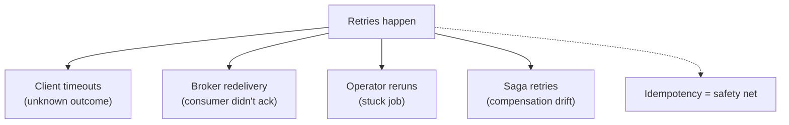
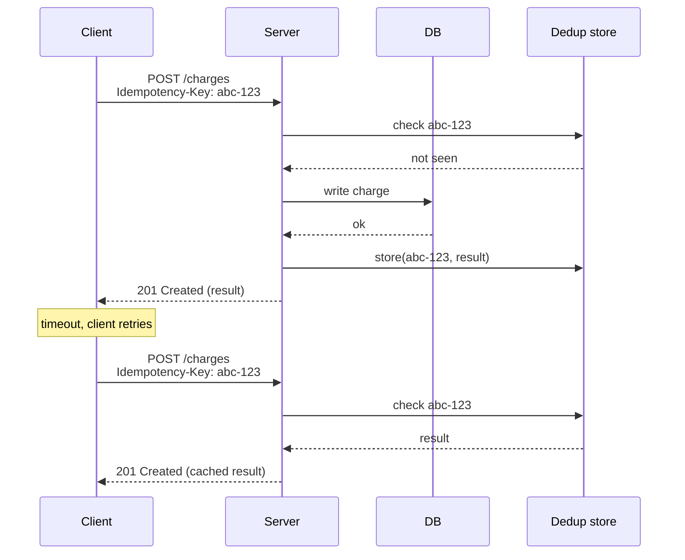
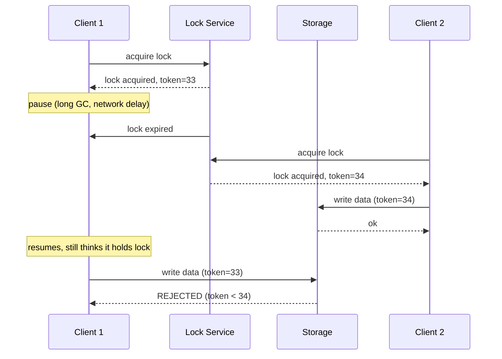

# Idempotency & Deduplication

In a distributed system, **every request will be retried** — by clients on timeouts, by message brokers on consumer ack failures, by load balancers on transient errors, by the operator's mid-incident rerun of a job. The retries are not bugs; they are the only way to recover from the partial failures distributed systems naturally produce. But every retry must satisfy one rule: **processing the same operation twice must produce the same effect as processing it once**. This property is **idempotency**, and a system that doesn't have it cannot survive its own retries — every retry adds an unwanted side effect (a duplicate charge, a duplicate email, a duplicate row, a duplicate decrement). Without idempotency, a distributed system is hostage to the rare cases where retries happen to be free; with it, retries become the *primary* fault-tolerance mechanism.

The depth bar here is **how to make operations idempotent in practice**, the mechanisms at each layer (HTTP idempotency, idempotency keys, transactional outbox, deduplication stores), and the well-known production incidents caused by missing idempotency. We trace Stripe's `Idempotency-Key` header pattern, the most famous and most-copied idempotency mechanism in payments, and explain the storage and lifetime questions it raises. We cover **semantic idempotency** (the underlying operation is idempotent — `set x = 5` is, `x = x + 1` is not) versus **mechanical idempotency** (the operation is non-idempotent but the system *dedupes* it via a tracking mechanism). We name the canonical patterns: **idempotency key + dedup store** for HTTP, **transactional outbox + consumer dedup** for Kafka events, **fencing tokens** for leader-bound writes, **monotonic identifiers** for write ordering. We trace Kafka's "exactly-once" semantics — which is at-least-once delivery + idempotent producer + transactional consumer — and the operational realities. We cover failure modes: the dedup-store TTL that's too short, the idempotency key reused for different operations, the case where the underlying business operation can't be idempotent and the system has to live with the consequences. By the end you will design idempotent endpoints, debug duplicate-side-effect incidents, and refuse the "we'll just retry" answer that has no idempotency story.

> [!NOTE]
> Prerequisites: [Service Communication](../C01-software-architecture/T06-service-communication-sync-vs-async.md), [Replication](./T04-replication-strategies.md), [Distributed Transactions](./T06-distributed-transactions-2pc-saga.md). Idempotency is the engineering that lets at-least-once delivery be safe; without it, at-least-once is at-most-multiple.

## Where Idempotency Came From — Mathematics, Networking, And Stripe's 2015 Productization

The word **idempotent** comes from mathematics: a function f is *idempotent* if f(f(x)) = f(x). Applying the function twice yields the same result as applying it once. The term was introduced by **Benjamin Peirce** in his 1870 paper [*Linear Associative Algebra*](https://en.wikipedia.org/wiki/Linear_Associative_Algebra), describing matrix multiplication. The concept is purely mathematical; the engineering application would come a century later.

### The Networking Application (1970s–1980s)

The networking application of idempotency emerged with the development of **reliable network protocols**. TCP (Transmission Control Protocol, RFC 793, 1981) and the earlier ARPANET protocols had to handle a fundamental problem: **messages could be duplicated, reordered, or lost**. The protocols needed semantics that worked despite all three.

The specific TCP mechanism: **sequence numbers**. Each byte in the stream has a sequence number; receivers can detect duplicates (same sequence number seen twice) and reorder out-of-order packets. The TCP layer absorbs the duplication; the application receives each byte exactly once.

This was *one form* of idempotency: the *transport layer* deduplicates messages so the application doesn't have to. But it only worked *within* a single TCP connection. Across connections, across processes, across system reboots — the application had to handle duplication itself.

### The HTTP Method Definitions (1996–1999)

The HTTP/1.1 RFC (RFC 2068, 1996, updated RFC 2616, 1999) formally defined which HTTP methods were *idempotent*:

- **GET, HEAD, PUT, DELETE, OPTIONS**: idempotent. A client can retry these safely.
- **POST**: NOT idempotent. Two POSTs may create two resources.

This was a *design decision*, not a mathematical fact. The HTTP spec authors recognized that *some operations could be retried safely* and named those operations explicitly. For *unsafe* operations (POST), the retry was the client's responsibility.

The HTTP spec also introduced the concept of **safe methods** — methods that don't modify state. GET and HEAD are safe; POST, PUT, DELETE are not.

These distinctions remain foundational. When a developer writes a GET endpoint, they're committing to idempotent semantics; when they write a POST, they're not. The HTTP method choice has semantic implications.

### The Mid-2000s Web Service Era

By the mid-2000s, web services were proliferating, and the idempotency problem was emerging in distributed application contexts. Specific scenarios:

- **Payment processing**: a network timeout left the client uncertain whether the payment succeeded. A retry might charge twice.
- **Order placement**: a duplicate order from retry would create two database records.
- **API integrations**: cross-service calls had no built-in deduplication.

Different teams solved this *ad hoc* — request IDs, sequence numbers, database constraints. The pattern wasn't standardized; each company invented their own approach.

### Stripe's Idempotency Key (2015)

The breakthrough was **Stripe's 2015 introduction of the `Idempotency-Key` header**. Stripe — the payments-as-a-service company founded by Patrick and John Collison in 2010 — had been growing rapidly and encountering customer issues with retry semantics. Customers who experienced a network blip during a charge would retry; sometimes the original charge had succeeded, and the retry charged a second time.

The solution: **let the client generate a unique key per operation**. Stripe stores the key with the operation result; if the same key arrives again, return the stored result without re-executing. The retry sees the original result; no duplicate operation.

The Stripe API documentation made this **explicit and prominent** — every POST endpoint accepted `Idempotency-Key`, every example in the documentation used it, the SDK auto-generated keys. By 2018, this pattern was **the standard for safe POST operations** across the payments industry.

### Who Patrick And John Collison Are

The **Collison brothers** (Patrick born 1988, John born 1990) are Irish entrepreneurs who founded **Auctomatic** (a payment/auction tool) while still teenagers, sold it for $5M, and then founded **Stripe** in 2010. By 2024, Stripe is valued at ~$70B and processes a significant fraction of internet commerce. The company is famous in engineering circles for its developer-friendly API design — Stripe's API documentation is widely held as the gold standard for clarity.

The Idempotency-Key pattern was *one of many* Stripe-introduced conventions that became industry standards. The pattern's success was as much about *clear documentation* as about technical novelty.

### The 2017+ Standardization

After Stripe popularized the pattern:

- **The IETF drafted standards** for idempotency keys in HTTP (work-in-progress as of 2024).
- **AWS introduced idempotency tokens** across their APIs.
- **Major fintech and payments companies** (Square, PayPal, Adyen, Plaid) all adopted Stripe-style idempotency keys.
- **Resilience4j, Spring Retry, and other Java libraries** added idempotency-key support.

By 2024, "idempotency keys" are a *standard* pattern in API design, expected on any POST endpoint that modifies critical state.

### The Kafka Exactly-Once Semantics (2017)

In parallel with the API-level standardization, **Apache Kafka introduced "Exactly-Once Semantics" (EOS)** in version 0.11 (June 2017), specifically [*KIP-98: Exactly Once Delivery and Transactional Messaging*](https://cwiki.apache.org/confluence/display/KAFKA/KIP-98+-+Exactly+Once+Delivery+and+Transactional+Messaging). EOS achieved exactly-once *within Kafka* — events published once would be delivered once, regardless of failures.

The mechanism: producer IDs and sequence numbers, similar to TCP but at the message level. Kafka tracks per-producer sequence; duplicates are detected and discarded.

The important caveat: **exactly-once is within Kafka**. End-to-end exactly-once (from producer through external system) still requires application-level idempotency. KIP-98 doesn't eliminate the application's responsibility.

### Why Idempotency Now Pervades Distributed Systems

By 2024, every senior engineer encounters idempotency *constantly*:

- API design: every POST has an idempotency mechanism.
- Message processing: every Kafka consumer must be idempotent.
- Workflow engines: Temporal, Camunda all enforce idempotency.
- Database operations: upserts with deterministic keys.

The pattern has become *infrastructure* — not something engineers implement from scratch, but something they verify they're using correctly.

## Why Idempotency, Specifically: The Senior Engineer's Q&A

### Q1: Why is idempotency mandatory in distributed systems?

Because **retries are inevitable**. Networks fail, processes crash, timeouts trigger retries. Without idempotency, every retry might cause duplicate effects. With idempotency, retries are safe.

The math: in a system with N services, the probability of *some* failure occurring during a request is roughly 1 - (1 - p)^N where p is the per-service failure probability. For p = 0.01 and N = 10, this is ~10%. Without idempotency, ~10% of requests have potential for duplicate side effects.

The senior judgment: **assume retries; design for them**.

### Q2: How does idempotency relate to at-least-once delivery?

They're complementary:

- **At-least-once delivery** ensures messages aren't lost. Duplicates are possible.
- **Idempotent processing** ensures duplicates don't cause harm.

Together: at-least-once + idempotent = "effectively exactly-once." This is the standard pattern for Kafka consumers, message-driven architectures, and reliable APIs.

Without idempotency, at-least-once delivery is at-least-once-and-sometimes-twice — typically broken.

### Q3: What's the right scope for idempotency?

Three scopes:

1. **Method-level**: `setUserName(id, name)` is idempotent — calling twice with the same arguments leaves the state the same.
2. **Operation-level**: `transferMoney(from, to, amount, idempotencyKey)` is idempotent *for the same key* — the first call processes, subsequent calls with the same key return the original result.
3. **Workflow-level**: an entire multi-step saga is idempotent — re-executing the saga from scratch produces the same final state.

The scope you choose affects implementation. Method-level is built into the operation; operation-level needs explicit keys; workflow-level needs durable saga state.

### Q4: What's the canonical implementation of operation-level idempotency?

The Stripe pattern:

1. Client generates a unique UUID (the idempotency key).
2. Client sends the request with `Idempotency-Key: <uuid>` header.
3. Server checks a key-value store for the key.
4. If found, return the stored response (don't re-execute).
5. If not found, execute the operation, store the result keyed by the UUID, return the result.
6. TTL on the stored key (typically 24 hours to a week).

The implementation is conceptually simple but has subtle requirements:
- The check-and-execute must be atomic (race condition between concurrent requests with the same key).
- The stored result must be complete (status code, headers, body).
- The TTL must be longer than client retry windows.

### Q5: When does idempotency fail to help?

Three failure modes:

1. **Time-bound operations**: "process this transaction" may not be safely retryable if the transaction has time-sensitive validity.
2. **External side effects**: if the operation sends an email or makes a phone call, the side effect is non-idempotent regardless of the database state.
3. **Race conditions in the idempotency mechanism**: if two concurrent requests with the same key arrive simultaneously, both may check the store, both find no entry, both execute, both store results.

Mitigations: distinguish "safe to retry" from "any retry"; use database locks or compare-and-swap for race protection; design external side effects to be deduplicated at the side-effect layer.

### Q6: How does this relate to message broker delivery semantics?

Three brokers, three approaches:

- **Kafka with EOS** (KIP-98): exactly-once within Kafka. Producers send with sequence numbers; brokers deduplicate.
- **RabbitMQ**: at-least-once with consumer acknowledgments. Idempotent consumer needed for duplicate-safe processing.
- **AWS SQS Standard**: at-least-once with possible duplicates. Idempotent consumer mandatory.

In all cases, application-level idempotency is needed for end-to-end exactly-once processing. The broker's delivery guarantee is *necessary but not sufficient*.

## Common Misconceptions Explained

### "Idempotency means the operation is safe to retry."

Mostly true, with caveats. Idempotency means the *result* is the same regardless of how many times the operation is retried. The *operation* may still have rate limits, expiry, or other constraints that make repeated execution wasteful.

### "GET requests are inherently idempotent."

True, by HTTP spec. But the *application logic* must respect this. A GET that side-effectfully creates a log entry is technically violating the HTTP contract.

### "Idempotency keys solve all distributed-system retry problems."

False. Idempotency keys handle *one type* of duplicate (same operation, retried). They don't handle *different* operations that have the same effect (a duplicate order placed with different keys).

### "Kafka's exactly-once means I don't need idempotent consumers."

False. Kafka EOS is *within Kafka*. Consumers writing to external systems must still be idempotent.

### "Idempotency is just deduplication."

Half true. Idempotency *includes* deduplication but is broader. A truly idempotent operation works correctly regardless of retries; deduplication is one mechanism for achieving it.

### "Idempotency comes for free with PUT and DELETE."

False. The HTTP spec *defines* PUT and DELETE as idempotent semantically, but the implementation must enforce it. A PUT that has side effects in addition to the resource update may not be idempotent.

## The Retry Reality

Three facts about distributed systems make retries mandatory:

1. **Timeouts don't tell you whether the operation succeeded.** A client times out at 30 s, but the server might have completed the operation, the response just got lost.
2. **Message brokers retry on ack failures.** Kafka, RabbitMQ, SQS all redeliver if the consumer doesn't ack in time.
3. **Operators rerun jobs.** A failed batch job is reinvoked. A "let me try that again" support action.



If retries are inevitable, **either every operation is idempotent, or the system corrupts data**. There is no middle ground.

## Semantic Vs Mechanical Idempotency

Two distinct ways an operation becomes idempotent.

### Semantic Idempotency

The operation's *meaning* is naturally idempotent. `set x = 5` produces the same result whether run once or ten times. `DELETE /resource/42` produces the same result. `UPDATE orders SET status = 'SHIPPED' WHERE id = 42 AND status = 'PAID'` is conditionally idempotent (it's only effective once; subsequent runs are no-ops).

Semantic idempotency is the cleanest answer. Design operations so the natural semantics are idempotent:

- Use `set X = value` instead of `X = X + delta` where possible.
- Use conditional updates (`WHERE status = 'expected'`) that no-op after the first success.
- Use HTTP `PUT` (idempotent) instead of `POST` (not) where the operation creates with a client-chosen ID.

### Mechanical Idempotency

The operation is *not* semantically idempotent, but the system **tracks** which operation has been performed and refuses to repeat it. A charge is `x = x + delta`; the dedup mechanism records "charge attempt with key K already processed."

Mechanical idempotency is more general but operationally heavier — it requires a deduplication store and rules for its lifecycle.

## The Idempotency Key Pattern (Stripe-Style)

The canonical mechanical-idempotency mechanism. Every request carries an `Idempotency-Key` header (typically a UUID, generated by the client and identical across retries). The server stores the key + the result of the first request; subsequent requests with the same key return the stored result without re-executing.



Stripe's [Idempotency](https://stripe.com/docs/api/idempotent_requests) is the canonical implementation. Two retries with the same key return the same response without performing the charge twice — even if those retries cross days or use different network paths.

### Implementation Details

The dedup store has several non-trivial concerns:

1. **Storage**: a Redis instance with TTL (typically 24 hours), a Postgres table with a unique constraint on key, or DynamoDB with TTL.
2. **TTL**: too short and a legitimate retry sees the key expired and re-executes; too long and the store grows unbounded. Stripe's TTL is 24 hours — generous for client retries, bounded enough for storage.
3. **Concurrency**: two concurrent requests with the same key must not both execute. Use a database unique constraint or `SETNX` in Redis to serialize.
4. **Storing the response**: the dedup store records the *entire* response so retries get the original outcome. Tens to hundreds of bytes per entry.
5. **Schema evolution**: the dedup store outlives application versions; stored responses must remain decodable.

### A Java Implementation

```java
@RestController
class ChargeController {
  private final ChargeService service;
  private final IdempotencyStore store;

  @PostMapping("/charges")
  public ChargeResponse charge(@RequestHeader("Idempotency-Key") String key,
                                @RequestBody ChargeRequest req) {
    return store.exec(key, () -> service.charge(req));
  }
}

@Component
class IdempotencyStore {
  private final JdbcTemplate jdbc;
  private final ObjectMapper json;

  public <T> T exec(String key, Supplier<T> op) {
    Optional<String> cached = jdbc.queryForObject(
        "SELECT response FROM idempotency_keys WHERE key = ? AND expires_at > NOW()",
        new Object[]{key}, String.class);
    if (cached.isPresent()) {
      return deserialize(cached.get());
    }
    T result = op.get();
    String body = serialize(result);
    try {
      jdbc.update("INSERT INTO idempotency_keys(key, response, expires_at) VALUES (?, ?, NOW() + INTERVAL '24 hours')",
          key, body);
    } catch (DuplicateKeyException e) {
      // concurrent retry inserted first; fetch its result
      return deserialize(jdbc.queryForObject("SELECT response FROM idempotency_keys WHERE key = ?",
          new Object[]{key}, String.class));
    }
    return result;
  }
}
```

A real production-grade implementation handles partial failures (the request completed but the store couldn't record it) and inspects the request body to detect when the same key is reused for a *different* operation (a strong signal of a client bug).

## Idempotency For Consumers — Kafka And Friends

For message-based systems (Kafka, RabbitMQ, SQS), idempotency lives in the **consumer**. The pattern: each message has a unique identifier; the consumer records identifiers it has processed; duplicates are detected and skipped.

```java
@KafkaListener(topics = "orders")
public void on(ConsumerRecord<String, OrderEvent> record) {
  String eventId = record.value().eventId();
  if (dedupStore.exists(eventId)) {
    return;          // already processed
  }
  try {
    process(record.value());
    dedupStore.markProcessed(eventId);
  } catch (Exception e) {
    // don't mark processed; will retry on next delivery
    throw e;
  }
}
```

The dedup store can be:

- **A database table** with a unique constraint on `event_id`.
- **Redis** with `SETNX` and TTL.
- **The application's own state** if the operation produces a state that's naturally checkable (a row insertion with a unique key).

The TTL is governed by the maximum redelivery window. Kafka can redeliver weeks-old messages if a consumer fully restarts. Keep dedup entries for at least the message retention period.

### Naturally-Idempotent Consumers

Sometimes the operation itself is naturally idempotent and no dedup store is needed:

- `UPDATE accounts SET balance = 100 WHERE customer_id = 7` is idempotent.
- `INSERT ... ON CONFLICT DO NOTHING` is idempotent.
- `PUT` to an object store with a fixed key is idempotent.

For these, the consumer can process duplicates safely without explicit tracking.

## Kafka "Exactly-Once" — A Closer Look

Kafka markets "exactly-once semantics" (EOS). What it actually provides:

1. **Idempotent producer**: each producer has a unique ID; the broker dedupes by (producer ID, sequence number). A producer retry produces the same effect as one publish.
2. **Transactional producer**: a producer can group writes across topics and partitions into a transaction; consumers configured with `isolation.level = read_committed` see all or nothing.
3. **Exactly-once stream processing**: Kafka Streams ties producer transactions to consumer offset commits, so a "read-process-write" loop is exactly-once.

This is *exactly-once within Kafka* — events flowing Kafka → Kafka. **External side effects (database writes, HTTP calls, emails) are not transactional with Kafka**, and exactly-once doesn't extend there. The standard answer for cross-boundary exactly-once is *at-least-once + idempotent consumer*.

## The Transactional Outbox — Atomic Database And Message Publish

A classic distributed-systems problem: a service must write to its database *and* publish a Kafka event. Both must succeed or both must fail. They cannot be transactionally tied (the database and Kafka are separate systems).

The transactional outbox solves it:


1. Application writes the order *and* a row in the `outbox` table in the same DB transaction. The DB guarantees both commit together.
2. Debezium (or a similar CDC tool, or a custom poller) tails the database's WAL or polls the outbox table.
3. It publishes outbox rows to Kafka.
4. Consumers read from Kafka with idempotency.

The transactional outbox is **the standard pattern for guaranteed event publication from a Spring service to Kafka**. Spring Modulith and ChrisRichardson's eventuate-tram library provide implementations.

## Fencing Tokens — Idempotency For Leader-Bound Writes

A subtle problem: a client thinks it holds a distributed lock; the lock has expired but the client doesn't know; it does work; the new lock holder also does work. Concurrent execution.

**Fencing tokens** (Martin Kleppmann's *Designing Data-Intensive Applications*) add a monotonically-increasing token to every lock acquisition. Every write under the lock carries the token. The storage layer rejects writes with stale tokens.



The storage layer's check makes the second write fail safely. Fencing tokens require the storage layer to participate; this is one reason consensus-based stores (etcd, ZooKeeper) are recommended for distributed locking.

## When Idempotency Is Impossible

Some operations genuinely can't be made idempotent:

- **Send an email**. Once dispatched, you cannot undo it. A retry sends a second email.
- **Dispatch a physical truck**. Telling FedEx to pick up twice produces two pickups.
- **Call an external API without idempotency**. If Stripe didn't have idempotency keys, your retries would create duplicate charges.

For these:

1. **Put them last in the saga.** All the reversible work has committed first; the irreversible step happens once.
2. **Pre-condition checks.** Send the email only after checking "did we already send for this order?" — a manual dedup at the application level.
3. **Accept the duplicate**. Sometimes the cost of double emails is less than the cost of building dedup. Be deliberate.

## Production Incidents Tied To Missing Idempotency

- **Stripe-style duplicate charges**: any payment service without idempotency keys has had a duplicate-charge incident. The class of incident is so common that idempotency keys are now a regulatory expectation.
- **Slack 2018 outage** ([C01/T06](../C01-software-architecture/T06-service-communication-sync-vs-async.md)): non-idempotent Kafka consumer multiplied load on retries.
- **Various NPM publish duplicates**: the registry's pre-2017 design allowed duplicate publishes from retries.
- **Many email-sending bugs**: retries that double-send marketing or transactional emails.

The pattern: a system that didn't think about retries explicitly will discover idempotency was needed only after a customer complains.

## Cross-Language Notes

Idempotency is a discipline, not a library. Each ecosystem has helpers:

| Ecosystem | Tools |
|-----------|-------|
| **Java / Spring** | Custom interceptors, Spring Retry, Resilience4j, Redis for dedup |
| **C# / .NET** | MediatR pipelines for dedup, Polly for retries, Redis dedup |
| **Go** | Hand-rolled middleware, Redis dedup |
| **Node.js** | Express middleware, Redis dedup |
| **Python** | FastAPI middleware, Redis dedup |

The pattern is universal; the implementation is a few hundred lines plus storage.

## Trade-Off Summary

| Concern | Pattern |
|---------|---------|
| HTTP POST | Idempotency-Key header + dedup store |
| Kafka consumer | Event ID + dedup table |
| Database upsert | `ON CONFLICT DO NOTHING` or `MERGE` |
| Cross-DB + broker | Transactional outbox + Debezium |
| Leader-bound write | Fencing token + storage rejection |
| Irreversible step | Put last; accept rarely-duplicated risk |

> [!INTERVIEW]
> A common L5 prompt: "How do you make a payment API idempotent?" Strong answers (a) name the Idempotency-Key header pattern, (b) describe the dedup store and its TTL, (c) handle concurrent retries via DB unique constraint, (d) name the storage / response cache details. Mentioning the transactional outbox unprompted shows depth.

## Deeper Dive — Spring Boot Idempotency Middleware Implementation

### Idempotency Interceptor with Redis Backing

```java
@Component
public class IdempotencyInterceptor implements HandlerInterceptor {
    private final RedisTemplate<String, String> redis;
    private final ObjectMapper json;

    private static final Duration TTL = Duration.ofHours(72);

    @Override
    public boolean preHandle(HttpServletRequest req, HttpServletResponse resp, Object handler) throws Exception {
        // Only enforce on mutating methods
        String method = req.getMethod();
        if (!Set.of("POST", "PUT", "PATCH", "DELETE").contains(method)) return true;

        String key = req.getHeader("Idempotency-Key");
        if (key == null) {
            // No key → reject mutating requests (strict mode)
            resp.setStatus(400);
            resp.getWriter().write("Idempotency-Key header required");
            return false;
        }

        // Validate key format
        try { UUID.fromString(key); }
        catch (IllegalArgumentException e) {
            resp.setStatus(400);
            resp.getWriter().write("Idempotency-Key must be UUID");
            return false;
        }

        // Cache key combines method + path + idempotency key
        String cacheKey = "idem:" + method + ":" + req.getRequestURI() + ":" + key;

        // Compute hash of request body for change detection
        byte[] body = StreamUtils.copyToByteArray(req.getInputStream());
        String requestHash = DigestUtils.sha256Hex(body);

        // Atomic: SET NX with hash + expiry
        String existing = redis.opsForValue().get(cacheKey);

        if (existing != null) {
            // Replay: check hash matches
            IdempotencyRecord record = json.readValue(existing, IdempotencyRecord.class);

            if (!record.requestHash().equals(requestHash)) {
                resp.setStatus(422);
                resp.getWriter().write("Idempotency-Key reused with different body");
                return false;
            }

            if (record.status().equals("COMPLETED")) {
                // Return cached response
                resp.setStatus(record.statusCode());
                record.headers().forEach(resp::setHeader);
                resp.getWriter().write(record.responseBody());
                return false;
            }
            if (record.status().equals("PROCESSING")) {
                resp.setStatus(409);
                resp.getWriter().write("Request in progress");
                return false;
            }
        }

        // Mark as PROCESSING; wrap request to capture body + response
        IdempotencyRecord processing = new IdempotencyRecord(
            key, requestHash, "PROCESSING", null, null, null, Instant.now()
        );
        redis.opsForValue().set(cacheKey, json.writeValueAsString(processing), TTL);

        // Store in request attribute for post-handler use
        req.setAttribute("idem_cache_key", cacheKey);
        req.setAttribute("idem_request_hash", requestHash);

        return true;
    }

    @Override
    public void afterCompletion(HttpServletRequest req, HttpServletResponse resp,
                                  Object handler, Exception ex) throws Exception {
        String cacheKey = (String) req.getAttribute("idem_cache_key");
        String requestHash = (String) req.getAttribute("idem_request_hash");
        if (cacheKey == null) return;

        // Cache the response for future retries
        String responseBody = captureResponseBody(resp);   // requires response wrapping
        Map<String, String> responseHeaders = captureHeaders(resp);

        IdempotencyRecord completed = new IdempotencyRecord(
            UUID.fromString(req.getHeader("Idempotency-Key")).toString(),
            requestHash,
            ex == null && resp.getStatus() < 500 ? "COMPLETED" : "FAILED",
            resp.getStatus(),
            responseHeaders,
            responseBody,
            Instant.now()
        );

        redis.opsForValue().set(cacheKey, json.writeValueAsString(completed), TTL);
    }
}

@Configuration
public class WebConfig implements WebMvcConfigurer {
    @Autowired private IdempotencyInterceptor interceptor;

    @Override
    public void addInterceptors(InterceptorRegistry registry) {
        registry.addInterceptor(interceptor)
            .addPathPatterns("/api/**")
            .excludePathPatterns("/api/health", "/api/metrics");
    }
}

public record IdempotencyRecord(
    String key,
    String requestHash,
    String status,             // PROCESSING / COMPLETED / FAILED
    Integer statusCode,
    Map<String, String> headers,
    String responseBody,
    Instant createdAt
) {}
```

### Database-Backed Idempotency (Stronger Durability)

For payment APIs where Redis loss is unacceptable:

```sql
CREATE TABLE idempotency_keys (
    key UUID PRIMARY KEY,
    request_hash CHAR(64) NOT NULL,
    request_method TEXT NOT NULL,
    request_path TEXT NOT NULL,
    response_status INTEGER,
    response_headers JSONB,
    response_body TEXT,
    status TEXT NOT NULL,                          -- PROCESSING / COMPLETED / FAILED
    created_at TIMESTAMPTZ NOT NULL DEFAULT NOW(),
    expires_at TIMESTAMPTZ NOT NULL                -- typically created_at + 72h
);

CREATE INDEX idx_idem_expires ON idempotency_keys(expires_at);
```

```java
@Service
@Transactional
public class IdempotencyService {

    public Optional<IdempotencyRecord> reserveOrGet(String key, String requestHash,
                                                      String method, String path) {
        // Try INSERT ON CONFLICT for atomic claim
        int rows = jdbc.update("""
            INSERT INTO idempotency_keys (key, request_hash, request_method,
                                         request_path, status, expires_at)
            VALUES (?, ?, ?, ?, 'PROCESSING', NOW() + INTERVAL '72 hours')
            ON CONFLICT (key) DO NOTHING
            """,
            UUID.fromString(key), requestHash, method, path);

        if (rows == 1) {
            return Optional.empty();   // we got the lock; proceed with request
        }

        // Key existed; return current state
        return repo.findById(UUID.fromString(key));
    }

    public void recordCompletion(String key, int status,
                                  Map<String, String> headers, String body) {
        jdbc.update("""
            UPDATE idempotency_keys
            SET response_status = ?, response_headers = ?::jsonb,
                response_body = ?, status = 'COMPLETED'
            WHERE key = ?
            """,
            status, json.writeValueAsString(headers), body, UUID.fromString(key));
    }
}
```

## Deeper Dive — Kafka Consumer Idempotency Pattern

```java
@Component
public class IdempotentKafkaConsumer {

    @Autowired private DedupRepo dedupRepo;
    @Autowired private OrderService orderService;

    @KafkaListener(topics = "orders", groupId = "order-processor")
    @Transactional
    public void consume(ConsumerRecord<String, Order> record,
                        Acknowledgment ack) {
        // Extract dedup key from message header or compute from content
        UUID dedupKey = extractDedupKey(record);

        // Try to record this message as processed
        boolean isNew = dedupRepo.tryInsert(dedupKey, Instant.now());

        if (!isNew) {
            log.info("Duplicate message {} skipped", dedupKey);
            ack.acknowledge();
            return;
        }

        try {
            // Process — same DB transaction as dedup insert
            orderService.processOrder(record.value());
            ack.acknowledge();
        } catch (Exception e) {
            // DB transaction rolls back BOTH the dedup insert AND business state
            // Message will be re-delivered; will retry
            throw e;
        }
    }
}

@Repository
public class DedupRepo {
    @Autowired private JdbcTemplate jdbc;

    public boolean tryInsert(UUID key, Instant timestamp) {
        try {
            int rows = jdbc.update(
                "INSERT INTO message_dedup (msg_id, processed_at) VALUES (?, ?)",
                key, Timestamp.from(timestamp));
            return rows == 1;
        } catch (DuplicateKeyException e) {
            return false;   // already processed
        }
    }
}
```

### Dedup Table Cleanup

```sql
-- Periodically clean old dedup records
DELETE FROM message_dedup
WHERE processed_at < NOW() - INTERVAL '7 days';

-- Or use partition pruning for large-scale dedup
CREATE TABLE message_dedup_2024_06 PARTITION OF message_dedup
FOR VALUES FROM ('2024-06-01') TO ('2024-07-01');

-- Drop old partitions monthly
DROP TABLE message_dedup_2024_03;
```

## Deeper Dive — Common Idempotency Bugs

### Bug 1: Idempotency Key Without Body Check

```java
// BAD: same key, different body → returns CACHED response anyway
public Response chargeIdempotent(UUID key, ChargeRequest req) {
    return cache.get(key).orElseGet(() -> {
        Response r = doCharge(req);
        cache.put(key, r);
        return r;
    });
}

// Attack scenario:
// 1. Client sends ChargeRequest($100) with key "abc"
// 2. Cache stores the result
// 3. Client mistakenly sends ChargeRequest($1000) with SAME key "abc"
// 4. Server returns cached "charged $100" response BUT $1000 was the actual intent
//    → Silent loss; user gets wrong charge confirmation
```

```java
// GOOD: hash the body; reject on mismatch
public Response chargeIdempotent(UUID key, ChargeRequest req) {
    String bodyHash = sha256(json.write(req));

    Optional<CachedResponse> cached = cache.get(key);
    if (cached.isPresent()) {
        if (!cached.get().bodyHash().equals(bodyHash)) {
            throw new IdempotencyKeyConflictException();
        }
        return cached.get().response();
    }

    Response r = doCharge(req);
    cache.put(key, new CachedResponse(bodyHash, r));
    return r;
}
```

### Bug 2: Race Between Concurrent Requests with Same Key

```java
// BAD: both requests check cache, both proceed, both execute
if (cache.get(key).isPresent()) return cache.get(key);
Response r = doCharge(req);   // ← TWO concurrent calls execute
cache.put(key, r);
```

```java
// GOOD: atomic insert + state machine
boolean isFirstRequest = cache.insertIfAbsent(key, "PROCESSING");
if (!isFirstRequest) {
    // Another request is processing or completed
    waitForResult(key);   // or return 409 / 202 "Accepted, processing"
}

try {
    Response r = doCharge(req);
    cache.update(key, "COMPLETED", r);
    return r;
} catch (Exception e) {
    cache.update(key, "FAILED", null);
    throw e;
}
```

### Bug 3: Idempotency Without Considering Downstream Calls

```java
// BAD: server-side dedup but downstream calls happen multiple times
@Idempotent
public Order placeOrder(OrderRequest req) {
    Order order = orderRepo.save(new Order(req));
    paymentClient.charge(order.id());          // ← What if THIS retries?
    inventoryClient.reserve(order.id());        // ← Or THIS?
    notificationClient.send(order.id());        // ← Or THIS?
    return order;
}
```

```java
// GOOD: each downstream call has its own idempotency
@Idempotent
public Order placeOrder(OrderRequest req) {
    Order order = orderRepo.save(new Order(req));

    // Each call uses order_id as idempotency key
    paymentClient.charge(order.id(), order.id().toString());
    inventoryClient.reserve(order.id(), order.id().toString());
    notificationClient.send(order.id(), order.id().toString());

    return order;
}
```

### Bug 4: TTL Too Short

```
Idempotency TTL: 1 hour
Customer service uses webhook retries with 24-hour backoff
After 1 hour, webhook fires → idempotency cache empty → DUPLICATE charge

LESSON: TTL must exceed maximum retry window of all sources
RECOMMENDATION: 72-168 hours for payment-critical operations
```

## Deeper Dive — Idempotency for Different Operation Types

```
INSERT (CREATE):
  Strategy: Unique constraint on natural key + idempotency key
    INSERT INTO orders (..., idempotency_key)
    VALUES (...)
    ON CONFLICT (idempotency_key) DO UPDATE
    SET retry_count = retry_count + 1
    RETURNING ...
  
  Or: separate idempotency table that maps key → resource ID
    INSERT INTO idempotency (key, resource_id) ON CONFLICT DO NOTHING

UPDATE:
  Strategy 1: Naturally idempotent via SET
    UPDATE users SET email = 'new@example.com' WHERE id = ?
    → Multiple retries produce same end state
  
  Strategy 2: Version check (optimistic locking)
    UPDATE users SET email = ?, version = ? + 1
    WHERE id = ? AND version = ?
    → Stale retries fail safely

DELETE:
  Strategy: Naturally idempotent
    DELETE FROM users WHERE id = ?
    → Repeating gives same result (id no longer exists)
  
  Or: Soft delete with idempotency
    UPDATE users SET deleted_at = NOW()
    WHERE id = ? AND deleted_at IS NULL

EVENT EMISSION:
  Strategy: Outbox pattern
    INSERT INTO outbox (event_id, payload) ON CONFLICT DO NOTHING
    → Idempotent at DB layer
    → Relay handles at-least-once Kafka delivery
    → Consumers must dedup

INCREMENT/DECREMENT:
  Strategy: Idempotency key + recorded operation
    INSERT INTO operations (key, account_id, delta)
    VALUES (?, ?, ?) ON CONFLICT DO NOTHING
    UPDATE balances SET amount = (SELECT SUM(delta) FROM operations WHERE account_id = ?)
    WHERE id = ?
    → Sum-based; replays don't double-count

SEND EMAIL / SMS:
  Strategy: Track sends by idempotency key
    INSERT INTO email_sends (key, recipient, sent_at)
    VALUES (?, ?, NOW()) ON CONFLICT (key) DO NOTHING
    → If row inserted, fire the send
    → If conflict, the send already happened
```

## Deeper Dive — When Idempotency Is Genuinely Hard

### The Email Send Problem

```
SEND EMAIL CALLS THIRD-PARTY API
  SES.send(...) → returns message_id
  Network failure → did SES receive it?
  
  OPTION A: dedupTable + retry-on-success
    Before SES call: INSERT INTO email_sends (key, status='PENDING')
    Call SES
    On success: UPDATE status='SENT', message_id=...
    On failure: DELETE the row → can retry
    On timeout: leave as PENDING; reconciliation job
    
    Risk: 5% double-send on uncertain timeout
  
  OPTION B: Use provider's idempotency
    AWS SES supports Idempotency-Key header (recently added)
    Stripe also supports

  REAL-WORLD: most teams accept rare double-send rather than complexity
```

### The Money-Send Problem

```
WIRE TRANSFER VIA EXTERNAL BANK
  Bank API: no idempotency support
  Retry → DOUBLE TRANSFER
  
  WHAT BANKS ACTUALLY DO:
    Reconcile via wire confirmation file (daily batch)
    Detect duplicates via amount + recipient + memo
    Manual intervention for ambiguous cases
    
  ARCHITECTURE: explicit RECONCILIATION step
    Wire request → record intent → submit to bank
    Daily: compare intent ledger vs bank confirmation file
    Mismatch → on-call alert + manual resolution
```

### The Push Notification Problem

```
FCM/APN: cannot guarantee delivery exactly once
  Retry → DOUBLE PUSH
  
  MITIGATION:
    1. Server-side dedup window: only attempt send if not sent in last 10s
    2. Client-side dedup: notification_id in payload; ignore duplicates
    3. Accept rare duplicates as acceptable UX cost
```

## Deeper Dive — Production Idempotency Architecture Decision

```
DECISION TREE:

Is the operation a simple CRUD?
├── Yes
│   ├── CREATE → unique constraint or idempotency table
│   ├── UPDATE → naturally idempotent if SET-based, or optimistic lock
│   └── DELETE → naturally idempotent
│
└── No (complex business logic)
    ├── Single-DB? → Idempotency table + transaction
    ├── Cross-service? → Saga + outbox + per-step idempotency
    └── Cross-DB without distributed tx?
        ├── 2PC available? → JTA/Atomikos (rare modern use)
        └── No → idempotency-key + reconciliation

Cross-system call (external API)?
├── External API supports idempotency? → use their key
├── External API doesn't? 
│   ├── Acceptable to rare-duplicate? → accept it
│   ├── Critical (money)? → reconciliation pattern
│   └── Notification? → server-side rate limit + client dedup

Storage layer?
├── Single source of truth (Postgres)? → Easy
├── Multi-region replicated? → CDC + idempotent consumer
└── Cache layer? → Invalidate on write success only
```

## Practice

1. **Audit an API.** For five POST endpoints in any system you know, identify which are idempotent and which aren't. For the non-idempotent ones, propose a fix.
2. **Idempotency-key middleware.** Implement a Spring middleware (`HandlerInterceptor`) that enforces idempotency via a Redis dedup store with 24-hour TTL.
3. **Kafka consumer dedup.** Take a non-idempotent Kafka consumer. Add a dedup mechanism. Force-replay 100 messages; verify zero duplicate side effects.
4. **Transactional outbox.** Implement the outbox pattern in a Spring + Postgres + Kafka stack. Force a Kafka outage; restore; verify all outbox rows are eventually published.
5. **Fencing-token storage.** Design a storage table that enforces fencing tokens. Each write includes a token; the table rejects writes with stale tokens.
6. **The irreversible-step exercise.** For a saga that includes "send invoice email," design how to handle the irreversible step without causing duplicate sends on retry.
7. **Dedup-store TTL.** For your team's idempotency mechanism, decide the right TTL. Justify in terms of maximum client retry window.
8. **Find a missing-idempotency bug.** In any open-source service, find an endpoint without idempotency. Propose the fix.
9. **The compare-and-set pattern.** Replace a `x = x + 1` operation with a compare-and-set (`UPDATE x = old + 1 WHERE x = old`). Verify it's safe under concurrent retries.
10. **The skeptic conversation.** A senior engineer says "we don't need idempotency; we'll just be careful not to retry." Write a 200-word response listing the four sources of retries this engineer cannot control.

## Recap

You should now be able to:

- Articulate why **every operation in a distributed system will be retried** and the four sources of retries: client timeouts, broker redelivery, operator reruns, saga retries.
- Distinguish **semantic idempotency** (operation naturally produces the same result on retry) from **mechanical idempotency** (system tracks and dedupes).
- Implement the **Stripe-style Idempotency-Key pattern** with a dedup store, concurrent-retry handling, and TTL.
- Implement **Kafka consumer dedup** via event IDs + a database unique constraint or Redis SETNX.
- Distinguish **Kafka's "exactly-once" semantics** (within Kafka only) from end-to-end exactly-once (which requires application-level idempotency).
- Apply the **transactional outbox pattern** to atomically write to a database and publish to Kafka.
- Use **fencing tokens** for safe distributed locking.
- Handle **irreversible operations** by placing them last in sagas and accepting the rare-double-execution risk.
- Cite **real incidents** caused by missing idempotency and recognize the production class of bugs they represent.
- Apply the idempotency discipline to **every cross-service operation** as a default, not as an afterthought.

## Next

Continue to [Distributed Locking](./T08-distributed-locking.md) — when multiple processes need mutual exclusion across machines, the patterns and pitfalls of distributed locks (Redis Redlock, etcd, ZooKeeper, fencing tokens) and the common failure modes.
