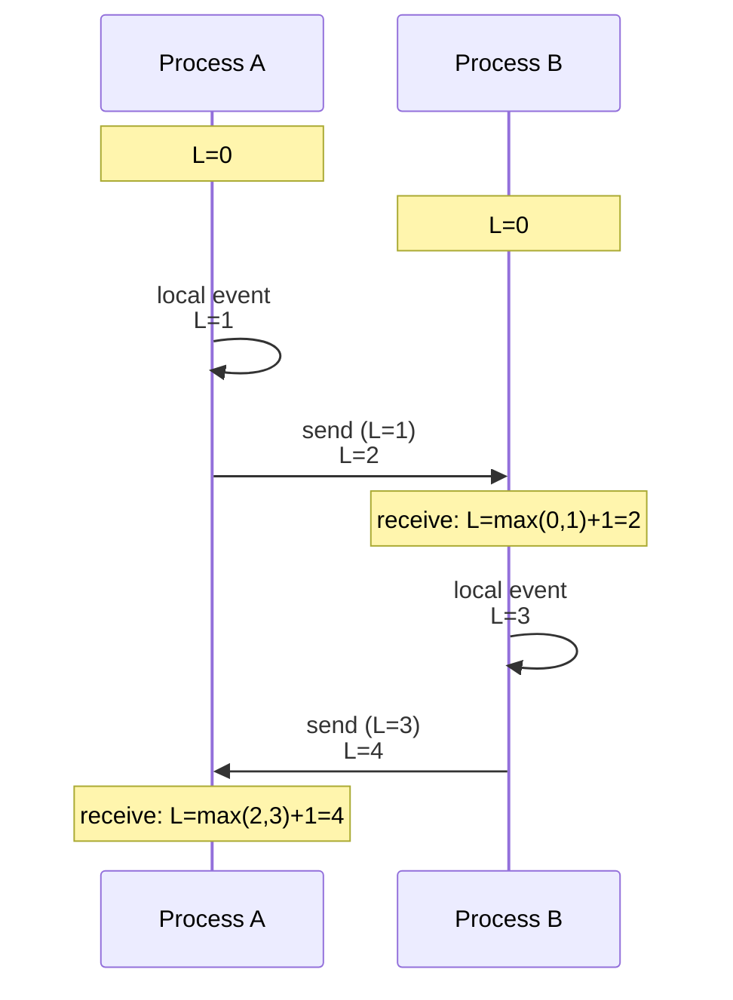
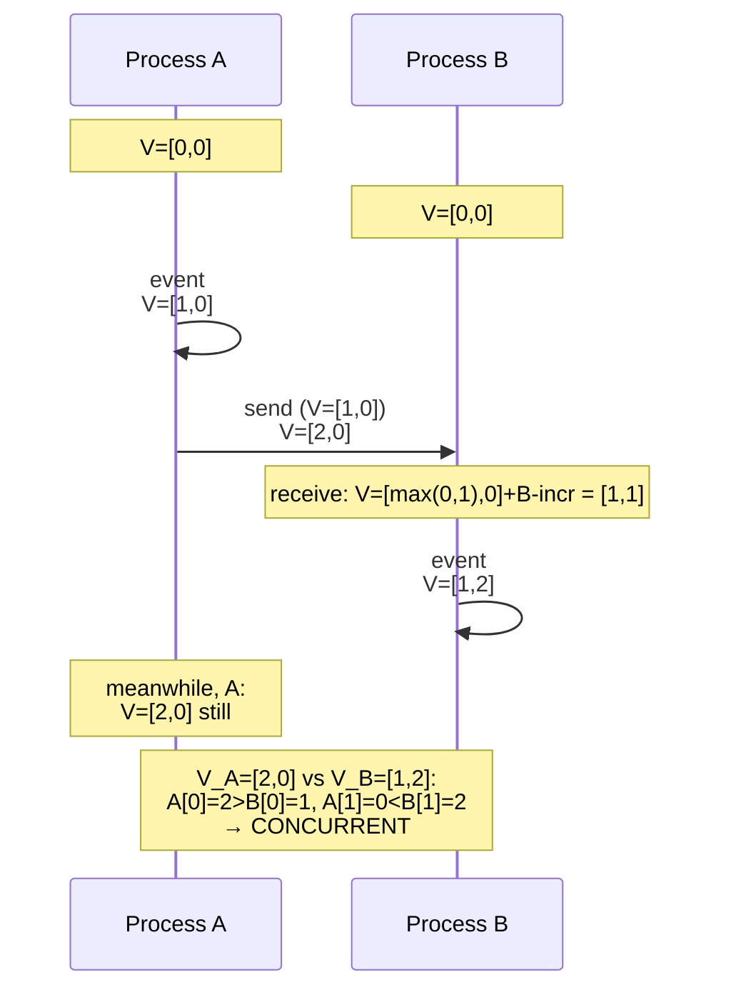
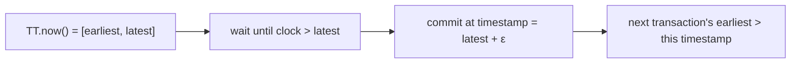

# Clocks & Ordering (Logical / Vector Clocks)

In a single computer, ordering events is easy — there's one clock; events are ordered by when they happened. In a distributed system, there is *no shared clock*: each machine's clock drifts independently, NTP synchronization gives bounded but never-zero error, and even the best hardware clock can disagree with a peer's by milliseconds (typical) or seconds (under stress). **Wall-clock ordering across machines is a lie that systems get away with most of the time** — and the times when they don't are the times that produce silently lost updates, "impossible" causality bugs, and the famous distributed-systems-are-hard incidents.

The solution Leslie Lamport published in 1978 ("Time, Clocks, and the Ordering of Events in a Distributed System" — a foundational paper) is the **logical clock**: an integer per process, incremented on each event, exchanged with every message, with a simple update rule. Logical clocks give a *total order* on events that respects **causality** (if event A could have caused event B, A's clock is less than B's), without requiring any physical clock synchronization. **Vector clocks** (1988, Mattern and Fidge independently) extend this to detect not just total order but *concurrent* events that have no causal relationship. **Hybrid Logical Clocks** (Kulkarni et al., 2014) combine logical and physical clocks for the best of both. **Spanner's TrueTime** (Google, 2012) takes a different path — invest in hardware (GPS + atomic clocks) to make physical clocks tight enough to use directly.

The depth bar here is **the mechanism plus the cases where naive timestamps silently break**. We trace Lamport's algorithm step by step, show what happens-before means and why it matters, build a vector clock and demonstrate detecting concurrent events, and explain why Dynamo and Riak originally used version vectors and why most have moved to LWW with operational compromise. We name the **clock-skew incidents** that motivated each invention — the famous 2012 leap-second bug that took down Hadoop and Java applications, the cross-region timestamp inversions that produce duplicate IDs, the AWS clock-skew incidents that led to TrueTime. We map clocks to real systems — Cassandra's wall-clock timestamps for LWW, Riak's dotted version vectors, CockroachDB's HLC, Spanner's TrueTime — and explain each design choice. By the end you will reason about causality in distributed systems with the same fluency you reason about happens-before in concurrent Java, choose the right clock for the consistency need, and recognize the failure modes of naive wall-clock-based systems.

> [!NOTE]
> Prerequisites: [Consistency Models](./T02-consistency-models-strong-eventual.md) (causal consistency is built on these clocks), [Replication](./T04-replication-strategies.md) (multi-leader conflict resolution needs them). Clocks are the substrate for causality, the substrate for many consistency models.

## Where Logical Clocks Came From — Lamport's 1978 Paper And The "Happened Before" Insight

Of all the papers in distributed systems, **Leslie Lamport's [*Time, Clocks, and the Ordering of Events in a Distributed System*](https://lamport.azurewebsites.net/pubs/time-clocks.pdf)** (Communications of the ACM, July 1978) has arguably had the most lasting impact. The paper introduced **logical clocks**, the **happens-before relation**, and the conceptual foundation for *all* subsequent distributed-systems algorithms that need to reason about ordering. The paper is also remarkable for being **highly readable** — 11 pages, accessible to a thoughtful undergraduate, yet containing insights that took the field 30+ years to fully internalize.

### The Pre-1978 Context

In the 1970s, the only distributed systems were *small clusters of mainframes* communicating via leased lines. The "distributed systems" research community was tiny — a few dozen academics. The questions being asked were *foundational*: how do multiple machines agree on anything? How do they share data? How do they detect failures?

A specific 1970s paper that motivated Lamport: **Frances Allen's 1972 work on intermediate representations** had introduced the *partial order* of operations as a way to reason about compiler optimization. The idea that "some operations must happen before others, but some are independent" was *new* in the 1970s; it provided the conceptual vocabulary Lamport would generalize.

The specific 1978 paper Lamport responded to: an earlier paper had proposed using **physical clocks** to order events in a distributed system. Lamport's paper opens by arguing that this is impossible — physical clocks drift; synchronization is bounded but never zero; the *concept* of "before" between distant events doesn't have a single answer.

### The Lamport Paper's Three Contributions

The 1978 paper made three permanent contributions:

#### 1. The Happens-Before Relation

Lamport defined `→` (read "happens before") as a partial order over events:
- If A and B are events in the same process, and A precedes B, then A → B.
- If A is the send of a message and B is the receipt of the same message, then A → B.
- If A → B and B → C, then A → C (transitivity).

Crucially, **A → B does NOT mean A happened "before" B in wall-clock time**. It means A *causally precedes* B — the effects of A could have influenced B. Two events that are not connected by `→` are *concurrent* — neither could have influenced the other.

This was the field's first *operational* definition of distributed time. "Before" no longer meant a global clock comparison; it meant a causal chain through messages.

#### 2. The Lamport Timestamp

Lamport then introduced an algorithm to *implement* the happens-before relation. Each process maintains a counter `C`. The rules:

- On a local event, increment `C`.
- On sending a message, include the current `C`.
- On receiving a message with timestamp `T`, set `C = max(C, T) + 1`.

The resulting timestamps satisfy: if A → B, then C(A) < C(B). The converse is *not* true (C(A) < C(B) doesn't imply A → B), but the timestamps provide a *total order* that's *consistent with* the partial order.

This algorithm is now in every distributed systems textbook. It's the foundation for Cassandra's timestamp-based conflict resolution, MongoDB's oplog timestamps, and many others.

#### 3. The Distributed Mutual Exclusion Algorithm

Lamport showed how to use timestamps to solve distributed mutual exclusion — multiple processes wanting to access a shared resource. The algorithm uses request timestamps to determine which process should access the resource next.

This was the *first* distributed algorithm built on logical clocks. It demonstrated that the timestamp idea was *useful*, not just theoretical.

### Who Leslie Lamport Is, Revisited

**Leslie Lamport** (born 1941) was 37 years old when he wrote the 1978 paper. He was at SRI International at the time. The paper was rejected from one conference before being accepted by *Communications of the ACM*; Lamport later noted that the reviewers didn't appreciate its significance.

Lamport's later contributions (Byzantine Generals 1982, Paxos 1989/1998, TLA+) are equally foundational. He won the **2013 Turing Award** — the closest thing computer science has to a Nobel Prize — for his contributions to distributed systems. The Turing committee's citation specifically mentioned the logical-clocks paper.

For 30+ years, Lamport's professional identity was as the *foundational theorist* of distributed systems. Almost every algorithm in the field traces back to one of his papers.

### Vector Clocks (Mattern And Fidge, 1988)

The 1978 Lamport timestamps had a known limitation: from the timestamp alone, you cannot tell if two events are causally related or concurrent. C(A) < C(B) could mean A → B *or* could mean A and B are concurrent and just happened to get different timestamps.

In 1988, two researchers independently extended Lamport's work to address this limitation:

- **Friedemann Mattern** (Germany), [*Virtual Time and Global States of Distributed Systems*](https://link.springer.com/chapter/10.1007/978-3-642-93849-4_19).
- **Colin Fidge** (Australia), [*Timestamps in Message-Passing Systems That Preserve the Partial Ordering*](https://citeseerx.ist.psu.edu/document?repid=rep1&type=pdf&doi=10.1.1.426.5784).

Both independently introduced **vector clocks** — instead of a single counter, each process maintains an *array* of counters, one per process in the system. The rules:

- On a local event at process i, increment V[i].
- On sending, include the entire vector V.
- On receiving with vector W, set V[j] = max(V[j], W[j]) for all j; then V[i] = V[i] + 1.

Now you can determine causality: A → B iff V(A) < V(B) component-wise. Concurrent events have incomparable vectors.

### The Dynamo Paper's Vector Clock Use (2007)

The Amazon Dynamo paper (2007) used vector clocks to detect concurrent updates to the same shopping cart. When two clients added items to the same cart from different devices, vector clocks identified that the updates were concurrent (not one-after-the-other), and the cart's reconciliation logic merged both updates.

This was the *first widely-deployed* industrial use of vector clocks. Riak (2009+) followed the same pattern. The vector-clock vocabulary became standard in NoSQL discussion.

### The Vector Clock Limitation And Dotted Version Vectors (2014)

Vector clocks grow in size proportional to the number of *writers* over the system's lifetime. For a system with millions of cumulative writers, vector clocks become enormous. **Dotted version vectors** (Almeida et al., 2014, used by Riak) addressed this by bounding the vector's growth.

This refinement is invisible to most engineers but matters at scale: a system that accumulates large per-key vector clocks eventually has *per-key metadata* exceeding the actual data, killing storage efficiency.

### Hybrid Logical Clocks (Kulkarni et al., 2014)

The 2014 paper [*Logical Physical Clocks*](https://www.cse.buffalo.edu/tech-reports/2014-04.pdf) (Kulkarni, Demirbas, Madappa, Avva, Leone) introduced **Hybrid Logical Clocks (HLC)** — combining a physical clock and a logical counter to give *both* near-real-time timestamps *and* causality preservation.

HLC was *crucial* for CockroachDB's design. Spanner needed TrueTime hardware to achieve linearizability; CockroachDB needed an alternative that worked on commodity machines. HLC gave them a software-only approach with slightly weaker guarantees but no hardware investment.

By 2024, HLC is the canonical "good enough" clock for distributed databases that want strong ordering without TrueTime infrastructure.

### TrueTime (Google Spanner, 2012)

The Spanner paper (2012) introduced **TrueTime** — a clock API that returns an *interval* rather than a single time, bounding the uncertainty. With GPS and atomic clocks in every datacenter, the uncertainty is bounded to roughly 1–10 ms.

TrueTime is the *most expensive* clock design — it requires hardware investment at every datacenter. Few companies outside Google can afford it. Spanner uses it to provide linearizable external consistency: transactions are timestamped within the uncertainty interval, and the system *waits out* the interval to ensure ordering.

The senior insight: TrueTime is *one way* to solve the clock problem. Most companies use HLC, Lamport timestamps, or vector clocks instead. Knowing which technology fits which scale matters.

## Why Clocks, Specifically: The Senior Engineer's Q&A

### Q1: Why can't we just use wall-clock time?

Three reasons that compound:

1. **Wall clocks drift**: NTP synchronizes to ~10 ms accuracy; PTP to sub-millisecond. Neither is *zero*. For events that happen within the uncertainty interval, wall-clock comparison is unreliable.

2. **Wall clocks jump**: NTP corrections, leap seconds, virtualized clock hiccups — all cause wall-clock time to move backward unexpectedly. Any algorithm assuming monotonic time breaks.

3. **Wall clocks don't capture causality**: even with perfectly synchronized clocks, two events with timestamps T1 < T2 may not have a causal relationship. Wall-clock ordering is too coarse for distributed reasoning.

Logical clocks address all three.

### Q2: When do I use Lamport timestamps vs vector clocks?

**Lamport timestamps** when you need a *total order* that respects causality but don't need to detect concurrency. Examples: ordering events in a single log, providing timestamps for last-writer-wins conflict resolution.

**Vector clocks** when you need to *detect concurrent updates*. Examples: multi-master replication with conflict detection, collaborative editing systems, version control.

The size trade-off: Lamport is O(1) per event; vector clocks are O(N) where N is the number of writers. For systems with few writers, vector clocks are fine. For systems with millions of writers, vector clocks become impractical.

### Q3: Why is causality so important in distributed systems?

Because causality is the *correctness condition* for many operations. Examples:

- **Comment threads**: a reply must appear after the comment it replies to. Causally, the reply happens after the comment.
- **Bank transactions**: a transfer's debit must precede its credit. Causally, the debit happens first.
- **Database constraints**: a foreign-key write must follow the primary-key write it references.

Without preserving causality, distributed systems can produce *correctness violations* — replies appearing before comments, money being credited before being debited, foreign keys referencing non-existent records.

The senior insight: **causality is the minimum-viable consistency guarantee** for most user-facing applications. Stronger guarantees (linearizability) cost more; weaker guarantees (eventual without causality) produce visible bugs.

### Q4: How does Spanner's TrueTime compare to HLC?

Both solve "we need linearizable distributed timestamps." The trade-offs:

- **TrueTime**: hardware investment (GPS + atomic clocks), ~10 ms uncertainty bound, true linearizability across the globe. Used by Google Spanner.
- **HLC**: software-only, runs on commodity hardware, weaker ordering guarantees but pragmatic for most needs. Used by CockroachDB, YugabyteDB.

The choice: if you can afford TrueTime infrastructure, you get the strongest guarantees. If you can't, HLC gives you "good enough" for almost all applications. The senior judgment: most companies should use HLC; Google can afford TrueTime.

### Q5: What's the relationship between clocks and the consistency models from T02?

The clocks *implement* the consistency models:

- **Linearizability** requires real-time ordering → TrueTime or similar.
- **Sequential consistency** requires program-order ordering → can be implemented with Lamport timestamps.
- **Causal consistency** requires causality preservation → vector clocks or HLC.
- **Eventual consistency** requires only convergence → no clock needed for ordering, but timestamps used for conflict resolution.

The clock is the *substrate*; the consistency model is the *contract*. The choice of clock constrains which consistency models you can achieve.

## Common Misconceptions Explained

### "Wall clocks are good enough with NTP."

False. NTP synchronizes to 10–50 ms typically. For high-frequency events (logging, financial trades, distributed tracing), this is *not* good enough — events can be timestamped out of order.

### "Logical clocks are slower than wall clocks."

False. Lamport timestamps are O(1) per event — a single increment. Vector clocks are O(N) — a single comparison per process. Neither is meaningfully slow.

### "Vector clocks are obsolete."

Partially true. Pure vector clocks are rarely used at scale due to their growth. But the *concept* survives in dotted version vectors, HLC, and other refinements. The 1988 idea is still active in modified forms.

### "TrueTime requires Google-scale infrastructure."

True. TrueTime requires GPS receivers and atomic clocks in every datacenter, plus NTP-like coordination. The hardware cost is substantial — typically tens of thousands of dollars per datacenter. Few companies invest in this.

### "Clocks are an implementation detail."

False. The choice of clock determines what consistency guarantees you can provide. It's an *architectural* decision, not an implementation detail.

### "If my system uses sequential timestamps, I don't have a clock problem."

Half true. Sequential timestamps (from a single coordinator) provide ordering *within* the coordinator's view. They don't help with multi-leader systems or causality reasoning. The coordinator becomes a single point of failure for the clock.

## Why Physical Clocks Don't Work

A naive distributed system says: "every event has a timestamp from `System.currentTimeMillis()`; order events by timestamp." The failures of this naive design are the entire reason logical clocks exist.

### NTP Sync Is Bounded, Not Zero

NTP (Network Time Protocol) synchronizes clocks to roughly **1–50 ms** accuracy under good conditions; the error is bounded but never zero. PTP (Precision Time Protocol) does better — sub-microsecond on dedicated networks — but requires hardware support. In cloud environments, virtualized clocks can drift by **seconds** during periods of host contention.

### Monotonic Vs Wall Clock

`System.currentTimeMillis()` can go *backward* — NTP can adjust the clock backward to correct drift. A naive program assuming time only goes forward is broken when this happens. **`System.nanoTime()` is monotonic** within a JVM but is meaningless across machines.

### Leap Seconds

Coordinated Universal Time (UTC) occasionally inserts a leap second to align with astronomical time. The June 2012 leap second triggered a famous bug in Linux's timer handling that brought down Hadoop clusters and Java applications worldwide. Many systems still don't handle them gracefully.

### Clock Skew On Failover

A primary writes records with timestamps; the primary dies; a replica with a slow clock takes over and writes records with *earlier* timestamps than the records it just inherited. Subsequent ordering by timestamp produces wrong results.

### The Conclusion

**Wall-clock timestamps cannot be relied upon for distributed event ordering.** They're approximately correct most of the time and catastrophically wrong some of the time. Production systems either:

1. **Accept the approximation** with LWW and live with the rare wrong answer.
2. **Use logical clocks** (Lamport, vector, HLC) that don't require physical synchronization.
3. **Engineer the physical clocks tight** (TrueTime) at significant infrastructure cost.

## Lamport Clocks — The 1978 Foundation

A **Lamport clock** is a single integer per process. The rules:

1. Each process has a counter `L`, initialized to 0.
2. On a local event: `L = L + 1`.
3. On sending a message: include current `L` with the message; then `L = L + 1`.
4. On receiving a message with timestamp `T`: `L = max(L, T) + 1`.



The Lamport-clock property: **if event A causally precedes event B (A happens-before B), then L(A) < L(B)**. The converse is not true — L(X) < L(Y) does *not* imply X happens-before Y; they may be concurrent.

This gives a *partial* causal order; to get a total order, tie-break with process ID. The resulting total order is *consistent with* the causal order but adds some arbitrary order to concurrent events.

### What Lamport Clocks Are For

The single most important application: **ordering events in a distributed log or event store** such that the ordering respects causality, without requiring synchronized clocks. Used in many event-sourcing systems for ordering events from multiple producers.

### What They Can't Do

A Lamport clock cannot tell you whether two events are *concurrent* or one happens-before the other. If event X has L=5 and event Y has L=8, X might happen-before Y, or they might be concurrent (and Y just got a later timestamp by chance). To detect concurrency, you need vector clocks.

## Vector Clocks — Detecting Concurrency

A **vector clock** is an array of counters, one per process. The rules:

1. Each process P_i has a vector `V[]`, initialized to all zeros.
2. On a local event at P_i: `V[i] = V[i] + 1`.
3. On sending a message: include `V` with the message; then `V[i] = V[i] + 1`.
4. On receiving a message with vector `W`: for each j, `V[j] = max(V[j], W[j])`; then `V[i] = V[i] + 1`.

Compare two vectors `V` and `W`:

- `V < W` (V happens-before W) iff `V[i] ≤ W[i] for all i, with at least one strict inequality`.
- `V > W` iff `W < V`.
- Otherwise V and W are **concurrent** (neither happened-before the other).



The system can detect when two events have happened concurrently (neither knew about the other) — the basis for *causal consistency* and for conflict detection in multi-leader systems.

### Vector Clocks In Production

- **Dynamo (2007)** and **Riak (early versions)** used vector clocks to detect concurrent writes; on read, the client received multiple "siblings" if there were concurrent writes and resolved them.
- **CouchDB** uses revision trees, which is essentially version vectors.

The operational pain: vector clocks grow with the number of writers. A long-lived value with thousands of writers has a vector clock of thousands of entries. **Dotted Version Vectors** and other refinements (Riak's eventual move) tried to bound the growth.

## Version Vectors — A Refinement

**Version vectors** are vector clocks specialized for replicated data. The counter increments only on writes (not local events); the vector tracks "the latest version this replica has from each other replica."

```java
record VersionVector(Map<NodeId, Long> versions) {
  VersionVector increment(NodeId node) {
    var copy = new HashMap<>(versions);
    copy.merge(node, 1L, Long::sum);
    return new VersionVector(copy);
  }
  boolean isAncestorOf(VersionVector other) {
    return other.versions.entrySet().stream()
        .allMatch(e -> e.getValue() >= versions.getOrDefault(e.getKey(), 0L));
  }
}
```

Used by Riak (pre-2.0), Voldemort, and CouchDB. The same growth-with-writer problem applies.

## Hybrid Logical Clocks (HLC) — Best Of Both

Proposed by Kulkarni, Demirbas, et al. in 2014. HLC combines a physical clock and a logical counter, giving:

- Timestamps close to wall-clock time (most of the time).
- Strict monotonicity even across clock backward-jumps.
- Causality preservation across messages.

```java
class HybridLogicalClock {
  long physical;       // wall-clock time
  long logical;        // increment for tie-breaking and forward progress

  synchronized HLCTimestamp now() {
    long currentPhysical = System.currentTimeMillis();
    if (currentPhysical > physical) {
      physical = currentPhysical;
      logical = 0;
    } else {
      logical++;
    }
    return new HLCTimestamp(physical, logical);
  }

  synchronized HLCTimestamp receive(HLCTimestamp incoming) {
    long currentPhysical = System.currentTimeMillis();
    long newPhysical = Math.max(Math.max(physical, incoming.physical), currentPhysical);
    long newLogical = 0;
    if (newPhysical == physical && newPhysical == incoming.physical) {
      newLogical = Math.max(logical, incoming.logical) + 1;
    } else if (newPhysical == physical) {
      newLogical = logical + 1;
    } else if (newPhysical == incoming.physical) {
      newLogical = incoming.logical + 1;
    }
    physical = newPhysical;
    logical = newLogical;
    return new HLCTimestamp(physical, logical);
  }
}
```

HLC is **used by CockroachDB** for distributed transactions, and **by Atlas** (Akka's CRDT-based system), and is the modern "we want timestamps that work" choice.

## TrueTime — Spanner's Hardware Approach

Google's Spanner takes the opposite approach: invest in **hardware-tight physical clocks**, then use them directly. Each data center has GPS receivers and atomic clocks; servers sync to these with bounded error. The `TT.now()` call returns an *interval* `[earliest, latest]` — the true time is *somewhere* in this interval, with the interval typically a few milliseconds wide.

For a transaction to commit, Spanner waits out the uncertainty window — `latest` from the now interval, then commit with timestamp `latest + epsilon`. Any subsequent transaction will have `earliest > latest`, guaranteeing a total real-time order.



This is **expensive** (the wait adds milliseconds to every commit) and requires significant infrastructure investment, but produces *linearizable* transactions across continents. Google ran the numbers; few others can.

## Mapping Clocks To Real Systems

| System | Clock |
|--------|-------|
| **PostgreSQL (single leader)** | Wall-clock, single source — no problem |
| **Cassandra** | Wall-clock per write — LWW with timestamps |
| **Riak (early)** | Vector clocks → moved to dotted version vectors |
| **DynamoDB** | Vector clocks internally, LWW exposed |
| **CockroachDB** | HLC |
| **Spanner** | TrueTime |
| **CouchDB** | Revision history (version vector variant) |
| **Kafka** | Log offsets per partition (a kind of physical-clock-free ordering) |
| **etcd** | Raft index (monotonic per-cluster) |
| **MongoDB** | Vector clocks for causal consistency mode |

Kafka deserves a callout: it doesn't use clocks at all for ordering. Each partition has a strictly-ordered log; messages have *offsets* (a per-partition counter). Cross-partition ordering is undefined. This is a different solution to the ordering problem — sidestep clocks by making ordering per-partition.

## Common Failures Of Wall-Clock Ordering

A few real-world examples of wall-clock failures and what fixed them.

### Cassandra LWW Lost-Write

Two writes to the same key from two different nodes. The node with the slower clock writes first, the node with the faster clock writes second — but its "second" timestamp is *before* the first node's "first" timestamp because of clock skew. Cassandra LWW picks the larger timestamp; the "later" write loses. The first write wins, the second is silently lost.

**Fix**: tighter NTP discipline, monitoring for clock skew, accepting LWW's limits. Some teams use HLC layered on top.

### Snowflake ID Collisions

Twitter Snowflake IDs include a timestamp; if two nodes have clocks misaligned by a millisecond and they generate IDs concurrently, they can produce duplicate IDs. Snowflake's design includes a sequence counter per millisecond and a worker ID to avoid this — but only if all assumptions hold.

### NTP Backward Jump

A monitoring agent records timestamps. NTP adjusts the clock backward by 200 ms. The agent now records timestamps *earlier* than already-stored timestamps. Downstream analysis treats events as out-of-order.

**Fix**: monotonic clocks (`System.nanoTime()` within a process) for short-interval measurements; HLC for cross-process ordering.

### Leap Second 2012

Linux's leap-second handling triggered futex livelocks in many Java apps. CPUs spiked; services unresponsive. Google's response was *leap-smearing* — distributing the leap-second across a 24-hour window so it's invisible to applications.

## Java Implementations

```java
// A practical HLC for distributed event ordering
public final class HybridLogicalClock {
  private final AtomicLong state = new AtomicLong(0);

  // Pack (physical millis) into upper 48 bits, logical into lower 16 bits
  public long now() {
    long currentPhysical = System.currentTimeMillis();
    while (true) {
      long s = state.get();
      long sPhysical = s >>> 16;
      long sLogical = s & 0xFFFF;
      long newPhysical, newLogical;
      if (currentPhysical > sPhysical) {
        newPhysical = currentPhysical;
        newLogical = 0;
      } else {
        newPhysical = sPhysical;
        newLogical = sLogical + 1;
        if (newLogical > 0xFFFF) {
          newPhysical++;
          newLogical = 0;
        }
      }
      long newS = (newPhysical << 16) | newLogical;
      if (state.compareAndSet(s, newS)) {
        return newS;
      }
    }
  }
}
```

CockroachDB's HLC implementation in Java/Go is in its codebase; a smaller reference is in the `hlc-java` library.

## Cross-Language Notes

| Ecosystem | Clock libraries |
|-----------|-----------------|
| **Java / Spring** | `java.time.Clock`, custom HLC implementations, jclock |
| **C# / .NET** | `DateTimeOffset`, custom HLC |
| **Go** | `time` package + custom HLC (CockroachDB's open source) |
| **Rust** | `chrono`, `hybrid-clocks` crate |
| **Node.js** | `Date`, HLC libraries |
| **Python** | `datetime`, `python-hlc` |

The algorithms are independent of language; implementations are a few hundred lines.

## Trade-Off Summary

| Clock type | Strengths | Weaknesses |
|------------|-----------|------------|
| **Wall-clock + LWW** | Simple, fast | Lost writes under skew, leap-second risks |
| **Lamport** | Causality-preserving total order | No concurrency detection |
| **Vector** | Detects concurrent events | Grows with writers |
| **Version vector** | Replica-state tracking | Same growth |
| **Dotted Version Vector** | Bounded growth | Complex |
| **HLC** | Near-wall-clock, causality-preserving | Implementation complexity |
| **TrueTime** | Linearizable real-time order | Hardware investment |

> [!INTERVIEW]
> A common L5 prompt: "Why don't you just use timestamps?" Strong answers (a) name clock skew, NTP adjustments, leap seconds, virtualization drift; (b) cite a real failure (Cassandra LWW lost-write); (c) propose Lamport / vector / HLC / TrueTime as the alternatives by use case.

## Deeper Dive — Lamport Clock Java Implementation

```java
public class LamportClock {
    private final AtomicLong counter = new AtomicLong();

    public long tick() {
        return counter.incrementAndGet();
    }

    public long onReceive(long messageTimestamp) {
        long updated;
        while (true) {
            long current = counter.get();
            updated = Math.max(current, messageTimestamp) + 1;
            if (counter.compareAndSet(current, updated)) break;
        }
        return updated;
    }

    public long current() {
        return counter.get();
    }
}

// Usage in a distributed service
@Service
public class OrderedEventService {
    private final LamportClock clock = new LamportClock();
    private final EventRepo repo;
    private final KafkaTemplate<String, Event> kafka;

    public void publish(Event event) {
        long ts = clock.tick();
        event.setLamportTs(ts);
        repo.save(event);
        kafka.send("events", event);
    }

    @KafkaListener(topics = "events")
    public void onEvent(Event event) {
        clock.onReceive(event.lamportTs());   // sync clock to received message
        process(event);
    }
}
```

**Property**: if A causally precedes B (A → B), then `L(A) < L(B)`. The converse is NOT true (smaller timestamp doesn't imply causality). For that, use vector clocks.

## Deeper Dive — Vector Clock Java Implementation

```java
public class VectorClock {
    private final Map<String, Long> clock = new ConcurrentHashMap<>();
    private final String nodeId;

    public VectorClock(String nodeId) {
        this.nodeId = nodeId;
        clock.put(nodeId, 0L);
    }

    public synchronized VectorClock tick() {
        clock.merge(nodeId, 1L, Long::sum);
        return this;
    }

    public synchronized VectorClock merge(VectorClock other) {
        for (Map.Entry<String, Long> e : other.clock.entrySet()) {
            clock.merge(e.getKey(), e.getValue(), Long::max);
        }
        clock.merge(nodeId, 1L, Long::sum);   // tick our own
        return this;
    }

    public synchronized Ordering compare(VectorClock other) {
        boolean thisLess = false, thisGreater = false;
        Set<String> allNodes = new HashSet<>(clock.keySet());
        allNodes.addAll(other.clock.keySet());

        for (String node : allNodes) {
            long thisVal = clock.getOrDefault(node, 0L);
            long otherVal = other.clock.getOrDefault(node, 0L);

            if (thisVal < otherVal) thisLess = true;
            if (thisVal > otherVal) thisGreater = true;
        }

        if (!thisLess && !thisGreater) return Ordering.EQUAL;
        if (thisLess && !thisGreater) return Ordering.BEFORE;   // this happened before other
        if (!thisLess && thisGreater) return Ordering.AFTER;    // this happened after other
        return Ordering.CONCURRENT;                              // truly concurrent
    }

    public enum Ordering { BEFORE, AFTER, EQUAL, CONCURRENT }
}
```

### Concrete Trace

```
Initial:  N1: {N1:0, N2:0, N3:0}
         N2: {N1:0, N2:0, N3:0}
         N3: {N1:0, N2:0, N3:0}

T1 — N1 does local event:
  N1: {N1:1, N2:0, N3:0}

T2 — N1 sends msg to N2 with VC:
  N2 receives, merges + ticks:
  N2: {N1:1, N2:1, N3:0}

T3 — N3 does local event (CONCURRENT with N1's event):
  N3: {N1:0, N2:0, N3:1}

T4 — Compare N2.VC vs N3.VC:
  N2: {N1:1, N2:1, N3:0}
  N3: {N1:0, N2:0, N3:1}
  N2 has N1:1 > N3 has N1:0 (this greater)
  N2 has N2:1 > N3 has N2:0 (this greater)
  N2 has N3:0 < N3 has N3:1 (this less)
  → CONCURRENT (some greater, some less)

  These events cannot be totally ordered; they happened in parallel.
```

## Deeper Dive — HLC (Hybrid Logical Clock) Java Implementation

```java
public class HybridLogicalClock {
    private long lastPhysical = 0;
    private long lastLogical = 0;

    public synchronized Timestamp now() {
        long currentPhysical = System.currentTimeMillis();
        long newPhysical = Math.max(currentPhysical, lastPhysical);
        long newLogical = (newPhysical == lastPhysical) ? lastLogical + 1 : 0;

        lastPhysical = newPhysical;
        lastLogical = newLogical;

        return new Timestamp(newPhysical, newLogical);
    }

    public synchronized Timestamp onReceive(Timestamp received) {
        long currentPhysical = System.currentTimeMillis();
        long newPhysical = Math.max(
            Math.max(currentPhysical, lastPhysical),
            received.physical()
        );

        long newLogical;
        if (newPhysical == lastPhysical && newPhysical == received.physical()) {
            newLogical = Math.max(lastLogical, received.logical()) + 1;
        } else if (newPhysical == lastPhysical) {
            newLogical = lastLogical + 1;
        } else if (newPhysical == received.physical()) {
            newLogical = received.logical() + 1;
        } else {
            newLogical = 0;
        }

        lastPhysical = newPhysical;
        lastLogical = newLogical;
        return new Timestamp(newPhysical, newLogical);
    }

    public record Timestamp(long physical, long logical) implements Comparable<Timestamp> {
        @Override
        public int compareTo(Timestamp other) {
            int physCmp = Long.compare(physical, other.physical);
            if (physCmp != 0) return physCmp;
            return Long.compare(logical, other.logical);
        }
    }
}
```

**Used by**: CockroachDB (timestamps for MVCC), YugabyteDB, MongoDB (causally consistent reads).

**Property**: HLC timestamps are close to wall-clock time (within bounded skew) AND preserve causal ordering — best of both worlds.

## Deeper Dive — Production Failures from Wall-Clock Reliance

### Cassandra LWW Lost Write

```
SCENARIO: 2 nodes, NTP drift of 50ms

Node A clock: 10:00:00.000
Node B clock: 10:00:00.050

User updates Profile.name = "Alice" at Node A → ts=10:00:00.001
User updates Profile.name = "Bob" at Node B → ts=10:00:00.020

Both writes propagate via gossip.
Cassandra LWW: max timestamp wins.
A's "Alice" has ts 10:00:00.001
B's "Bob" has ts 10:00:00.020
→ Bob wins everywhere (RIGHT, since clock-wise it's earlier on B)

BUT WAIT: in REAL time, the "Alice" write at Node A happened SECOND.
The user's last action was "set name to Alice".
Cassandra silently chose "Bob" (the older intent).

FIX:
  - Use unique timestamps with node ID tiebreaker
  - Use external timestamp source (NTP master)
  - Use HLC or vector clocks for true causality
  - Use TrueTime-style bounded uncertainty
  - Don't use LWW for important data
```

### Leap-Second Backward Jump (2012, 2015, 2016 incidents)

```
TIMELINE:
  June 30, 2012 23:59:60 UTC — leap second inserted
  Many Linux systems handled it as a backward jump
  
WHAT BROKE:
  - JVM HashMap concurrent access → infinite loops (locks deadlocked)
  - Java application timestamps went backwards
  - Hadoop tasks failed (timestamp comparisons)
  - Java EE app servers crashed
  
FIX MOVES:
  - Google Spanner: leap-second smearing over hours
  - AWS: smearing over 24 hours
  - JVM: java.time.Clock.systemUTC() now leap-second-aware (since Java 9)
  
PREVENTION:
  - Use monotonic clocks for elapsed time: System.nanoTime()
  - Don't rely on wall-clock for ordering
  - Use HLC for distributed ordering
```

### VM Snapshot Resume Time Jump

```
SCENARIO:
  VM is snapshotted at 10:00:00
  Resumed at 14:00:00 (4 hours later)
  
WHAT BREAKS:
  - Timers/timeouts that were scheduled before snapshot
  - Cache TTLs (everything expires immediately)
  - Token expiration checks (all invalid)
  - Heartbeats appear stale → forced re-election

FIX:
  - Use elapsed time (System.nanoTime()) for timeouts
  - Re-validate session state on resume
  - Cloud platforms now have "pause/resume" hooks for JVMs
```

## Deeper Dive — Distributed ID Generation Patterns

### Snowflake (Twitter)

```
64-bit ID layout:
  ┌─────────┬──────────────────────────────────────┬────────┬──────────┐
  │ unused  │ timestamp (41 bits)                  │ machine│ sequence │
  │ (1 bit) │ ms since custom epoch                │ ID     │ counter  │
  │         │                                      │ (10b)  │ (12 bits)│
  └─────────┴──────────────────────────────────────┴────────┴──────────┘

PROPERTIES:
  - Sortable by time (recent IDs > older IDs)
  - 4096 IDs/ms/machine → 4M IDs/sec/machine
  - 1024 machines max per cluster
  - 69 years from custom epoch (e.g., 2024-01-01)

JAVA IMPLEMENTATION:
public class SnowflakeId {
    private final long machineId;       // 0-1023
    private long lastTimestamp = -1;
    private long sequence = 0;

    public synchronized long next() {
        long ts = System.currentTimeMillis() - EPOCH;
        if (ts < lastTimestamp) {
            // Clock went backwards! Wait or throw
            throw new IllegalStateException("Clock skew detected");
        }
        if (ts == lastTimestamp) {
            sequence = (sequence + 1) & 0xFFF;
            if (sequence == 0) {
                ts = waitNextMs(ts);   // sequence exhausted in this ms
            }
        } else {
            sequence = 0;
        }
        lastTimestamp = ts;
        return (ts << 22) | (machineId << 12) | sequence;
    }
}
```

### UUID v7 (Time-Sortable, 2022 RFC)

```
128-bit UUID with time ordering:
  ┌──────────────────────────────┬───────────────────────────┐
  │ 48 bits: unix timestamp ms   │ 74 bits: random + version │
  └──────────────────────────────┴───────────────────────────┘

ADVANTAGES OVER UUID v4:
  - Time-ordered (better B-tree index locality)
  - Still globally unique
  - 122 bits of randomness > Snowflake's 12-bit sequence

JAVA (Java 21+ via libraries):
  UUID id = UuidCreator.getTimeOrderedEpoch();
```

### ULID (Universally Unique Lexicographically Sortable Identifier)

```
26-character Base32 ID:
  ┌────────────────────┬─────────────────┐
  │ 10 chars timestamp │ 16 chars random │
  └────────────────────┴─────────────────┘

Like UUID v7 but text-friendly.
Example: 01ARZ3NDEKTSV4RRFFQ69G5FAV
```

## Deeper Dive — Ordering in Real Systems

| System | Mechanism | Why |
|---|---|---|
| **Kafka** | Per-partition offset (monotonic) | Single sequencer per partition; no clock needed |
| **Postgres MVCC** | Transaction ID (xid) | Sequence per server |
| **CockroachDB** | HLC timestamps | Distributed ordering with bounded uncertainty |
| **Spanner** | TrueTime (GPS+atomic) | Real-time order globally |
| **Cassandra** | Wall-clock + node ID | LWW; subject to clock skew |
| **DynamoDB** | Server-side timestamp | Authoritative; no client clock issues |
| **MongoDB** | Oplog timestamp + HLC | Causally consistent reads |
| **Redis** | No global order | Per-key; clients manage if needed |
| **Etcd/ZK** | Modify-revision (sequence) | Consensus log index |
| **Snowflake/UUID v7** | Time + counter + node | Sortable distributed IDs |

## Deeper Dive — Choosing the Right Clock for Your Use Case

```
NEED                                  USE
─────────────────────────────────────────────────────────
Elapsed time (timeout)                System.nanoTime()
Wall clock display                    System.currentTimeMillis()
Distributed event ordering            Lamport clock OR HLC
Causally consistent reads             Vector clock OR HLC
LWW conflict resolution               HLC (better than wall-clock)
Global real-time order                TrueTime (Spanner only)
Distributed unique sortable ID        Snowflake OR UUID v7
Optimistic concurrency control        Version counter per row
Distributed pub/sub ordering          Kafka partition offset
```

## Practice

1. **Trace a Lamport clock.** Sketch three processes exchanging five messages; trace L at each process. Identify which events are causally related and which are concurrent.
2. **Vector clock concurrency.** Build a vector-clock implementation in Java. Generate two concurrent updates; verify the clocks correctly indicate concurrency.
3. **Find the Cassandra LWW bug.** Read Cassandra's docs on LWW. Identify the exact scenario where a write can be silently lost.
4. **HLC implementation.** Implement an HLC in Java. Generate timestamps across simulated clock skew; verify ordering preservation.
5. **Spanner TrueTime exercise.** Read the Spanner paper's TrueTime section. Compute the commit wait for a typical 7 ms uncertainty interval. Estimate the throughput impact.
6. **Leap-second test.** If you have a test environment, simulate a backward clock jump. Identify what breaks in your application.
7. **Snowflake-style ID design.** Design a distributed unique-ID scheme. Decide what to include (worker ID, timestamp, sequence). Defend against clock skew.
8. **The version-vector growth.** For a Riak-style system with 100 writers over a year, estimate the vector clock size per key. Decide whether it's acceptable.
9. **Kafka offsets as ordering.** Explain how Kafka achieves per-partition ordering without any clock. Compare to a clock-based design.
10. **The skeptic conversation.** A senior engineer says "we use NTP, our clocks are fine." Write a 200-word response naming three specific failure modes that NTP doesn't prevent.

## Recap

You should now be able to:

- Articulate **why physical clocks fail for distributed ordering** — NTP bounded error, monotonic-vs-wall, leap seconds, virtualization drift, clock-skew failover.
- Implement **Lamport clocks** with the three rules and explain the happens-before guarantee.
- Implement **vector clocks** and detect concurrent events via the partial-ordering comparison.
- Recognize **version vectors** as the replica-specialized variant and the growth-with-writers problem.
- Apply **Hybrid Logical Clocks (HLC)** to combine wall-clock approximate ordering with causality preservation.
- Explain **TrueTime** as the hardware-investment alternative and recognize its cost.
- Map real systems (Cassandra, Riak, DynamoDB, CockroachDB, Spanner, Kafka, etcd) to their clock approaches.
- Recognize the **wall-clock failure modes**: Cassandra LWW lost-writes, Snowflake collisions, NTP backward jumps, leap-second crashes.
- Choose the right clock for the consistency need — simple LWW for non-critical paths, HLC for cross-region ordering, TrueTime when the budget allows.
- Use **Kafka offsets** and **Raft indices** as alternative "logical clocks" that sidestep wall-clock entirely.

## Next

Continue to [Load Balancing (Algorithms, L4/L7)](./T10-load-balancing-algorithms-l4-l7.md) — how traffic distributes across N backends: the algorithms (round-robin, least-connections, consistent-hash, weighted random), the layers (L4 TCP, L7 HTTP), and the operational realities.
