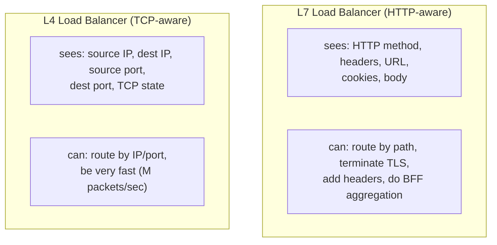
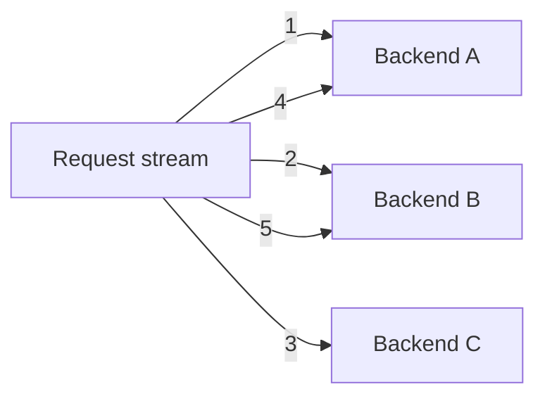

# Load Balancing (Algorithms, L4/L7)

A load balancer is the traffic cop in front of N backend replicas: when a request arrives, *which replica handles it?* The decision sounds trivial — pick one — but the choice of algorithm has profound effects on tail latency, fault isolation, cache hit rates, and the system's resilience to slow or failing backends. A round-robin LB sends the next request to the next backend regardless of how busy each is; a least-connections LB picks the backend with the lightest in-flight load; a consistent-hash LB routes the same client to the same backend for cache affinity; a power-of-two-choices LB picks the better of two randomly-chosen backends and outperforms least-connections in nearly all benchmarks. **Choosing the right algorithm is one of the highest-leverage operational decisions in a microservices system.**

The depth bar here is **the algorithms' actual behavior under load, the L4-vs-L7 distinction, and how Java/Spring apps interact with the LB layer**. We trace round-robin, weighted random, least-connections, P2C, consistent hashing (including bounded loads), and IP-hash — for each, what it optimizes for and when it fails. We cover **L4 (TCP)** vs **L7 (HTTP)** balancing — what each can see and do, why L7 dominates application traffic and L4 dominates raw-throughput needs. We name the production load balancers (HAProxy, NGINX, Envoy, AWS ELB family — Classic, NLB, ALB, GLB) and their algorithm support. We trace health-checking nuances (passive vs active, the "thundering-herd-on-recovery" problem), sticky sessions (when they're necessary, when they're a bug), and DNS-level load balancing (geo-DNS, anycast). We close with the **Java/Spring perspective** — `RestClient.builder().loadBalanced()`, Spring Cloud LoadBalancer, the deprecation of Ribbon — and the production reality that most Java teams don't write LB code, they configure the LB the platform provides.

> [!NOTE]
> Prerequisites: [Partitioning & Consistent Hashing](./T05-partitioning-and-consistent-hashing.md) — the consistent-hash algorithm here is the same technique applied to LB rather than data sharding.

## Where Load Balancing Came From — From DNS Round-Robin To Modern P2C

Load balancing has a 40-year history that's surprisingly under-discussed. The patterns engineers use today (round-robin, least-connections, power-of-two-choices) emerged from specific 1980s–2010s research and engineering, each motivated by failures of its predecessors.

### The 1980s — DNS Round-Robin And The Earliest Distribution

The first widely-deployed load-balancing mechanism was **DNS round-robin**. The concept: configure DNS to return multiple A records for a hostname; clients pick one. RFC 1034 (1987) implicitly enabled this; by the early 1990s it was common practice for distributing web traffic.

The limitations:

- **No health checking**: DNS returns dead servers as readily as live ones.
- **DNS caching**: long TTLs prevent quick rebalancing.
- **No server-state awareness**: round-robin treats all servers equally regardless of load.

DNS round-robin remains in use today for *geographic* distribution (different DNS responses per region) but isn't sufficient as a primary load-balancing mechanism.

### The Mid-1990s — Hardware Load Balancers And F5

The next major step was **dedicated hardware load balancers**. The pioneers:

- **Coyote Point** (1996): early appliance-based load balancer.
- **F5 Networks** (1996): the canonical hardware load balancer company.
- **Cisco LocalDirector** (1996): Cisco's entry into the market.

These were dedicated network appliances costing $20K–$100K. They supported:

- **L4 (TCP) load balancing**: routing based on IP/port.
- **Health checking**: probes verifying server health.
- **Session persistence**: routing the same client to the same server.
- **SSL termination**: decrypting at the appliance.

F5's BIG-IP product became iconic. Through the late 1990s and 2000s, F5 dominated enterprise load balancing.

### The Late 1990s — Software Load Balancers

Software alternatives emerged:

- **mod_proxy_balancer** (Apache): basic load balancing in the web server.
- **Pound** (2002): dedicated HTTP load balancer.
- **HAProxy** (Willy Tarreau, 2001): the canonical open-source TCP/HTTP load balancer.

**HAProxy** in particular became *the* open-source load balancer. By 2010 it was running at massive scale at companies like GitHub, Stack Exchange, and Twitter.

#### Who Willy Tarreau Is

**Willy Tarreau** is a French software engineer who created HAProxy in 2001. He's been the sole maintainer for over 20 years, releasing major versions on a regular cadence. HAProxy is one of the longest-lived single-maintainer open-source projects of its scale.

Tarreau's design philosophy: HAProxy should do *one thing well* — load balancing — without scope creep. The project has resisted feature additions that would compromise simplicity. This focused approach is why HAProxy remains competitive 23 years later.

### The 2000s — Algorithm Refinements

Through the 2000s, load-balancing algorithm research focused on improving distribution quality:

#### Power Of Two Choices (Mitzenmacher, 1996)

**Michael Mitzenmacher's PhD thesis** at Berkeley (1996) introduced **power-of-two-choices (P2C)** — when assigning a task to a server, pick two random servers and assign to the less-loaded one. The dramatic finding: this simple change *exponentially* reduces the maximum load.

The math is elegant: with random assignment, the maximum load is O(log n / log log n). With P2C, it's O(log log n). The improvement is enormous.

P2C was adopted gradually. By 2010, it was standard in load-balancer implementations — used in NGINX, Envoy, Linkerd, and most modern systems.

#### Consistent Hashing For Load Balancing

The same consistent hashing used for data partitioning ([T05](./T05-partitioning-and-consistent-hashing.md)) found applications in load balancing. Specifically, **consistent hashing with bounded loads** (Mirrokni et al., Google 2017) addresses the hot-key problem: cap the load per server, redirect to next on the ring when full.

### The 2010s — Envoy And L7 Mesh Load Balancing

The most influential modern load balancer is **Envoy** (Lyft, 2016, covered in [T07 of C01](../C01-software-architecture/T07-api-gateway-and-service-mesh.md)). Envoy implements:

- **L7 (HTTP) load balancing** with rich routing.
- **P2C** (and other algorithms).
- **Hot reload** of configuration.
- **xDS APIs** for external control.

Envoy became the data plane for Istio, Consul Connect, AWS App Mesh, and many other systems. By 2020, Envoy was the *default* L7 load balancer for new cloud-native systems.

### The 2020s — eBPF And Kernel-Level Load Balancing

The newest development is **eBPF-based load balancing**. eBPF (extended Berkeley Packet Filter) allows running sandboxed programs in the Linux kernel. **Cilium** (Isovalent, 2018+) uses eBPF for *kernel-level* load balancing, bypassing user-space.

Benefits:

- **Lower latency**: no user-space hop.
- **Lower CPU**: no context switches.
- **L4 and L7 capable**: same mechanism for both.

eBPF load balancing is *new* — adoption is still growing. By 2025+, it may displace traditional user-space load balancers for high-performance use cases.

## Why Load Balancing, Specifically: The Senior Engineer's Q&A

### Q1: Why does the choice of algorithm matter?

Because different algorithms produce different *maximum load* under realistic conditions. Round-robin gives even distribution under uniform request times but degrades when request times vary. Least-connections handles variable request times but doesn't account for varying server capacity. P2C balances both with low overhead.

For high-traffic systems, the algorithm choice can mean the difference between 50% server utilization (some servers overloaded, others idle) and 80% (uniform load). The cost difference is significant.

### Q2: When is round-robin sufficient?

When:

- Request times are uniform.
- Server capacities are uniform.
- Traffic volume is modest.

For most web applications with relatively uniform requests, round-robin is fine. For high-throughput or highly-variable workloads, more sophisticated algorithms (least-connections, P2C) improve distribution.

### Q3: What's the difference between L4 and L7 load balancing?

**L4 (TCP) load balancing**: routes based on IP and port. Doesn't inspect HTTP. Fast, simple.

**L7 (HTTP) load balancing**: routes based on URL, headers, cookies. Slower, more flexible.

The trade-off: L4 is faster but less capable; L7 is more capable but slower. Most modern systems use L7 (the overhead is negligible relative to application latency).

### Q4: How does load balancing interact with consistent hashing?

When you want **session affinity** — routing the same user/key to the same backend — consistent hashing provides it. Each key hashes to a specific backend; the assignment is stable across cluster changes.

Use cases:

- **Cache warming**: send the same key to the same cache server (improves hit rate).
- **Stateful protocols**: WebSocket connections, server-sent events.
- **Session storage**: avoid sticky sessions in favor of consistent-hash routing.

### Q5: How do health checks work?

The load balancer periodically queries each backend (typically GET /health or similar). If responses are within a threshold, the backend is "healthy"; otherwise it's removed from rotation.

Common parameters:

- **Check interval**: how often to check (typically 1–5 seconds).
- **Healthy threshold**: how many consecutive successes to mark healthy.
- **Unhealthy threshold**: how many consecutive failures to mark unhealthy.
- **Timeout**: how long to wait for a response.

Tuning is non-trivial — too aggressive and brief blips remove backends; too lax and dead backends keep receiving traffic.

## Common Misconceptions Explained

### "Round-robin is always fair."

False. Round-robin assumes uniform request times. With variable request times, some servers end up overloaded while others are idle.

### "Hardware load balancers are necessary at scale."

False. Software load balancers (HAProxy, Envoy, NGINX) handle massive scale on commodity hardware. F5 is still in use but isn't required.

### "L7 is always better than L4."

False. L4 is faster and sometimes appropriate (e.g., for non-HTTP protocols, for very high-throughput scenarios). Most web traffic uses L7, but L4 has its place.

### "Session affinity is required for web apps."

Mostly false. **Stateless services** don't need session affinity. Externalize session state to Redis/database; any server can handle any request. Session affinity is needed only for stateful protocols.

### "Health checks catch all problems."

False. Health checks verify the server is *responding*; they don't verify the server is *correctly responding*. A server that returns 200 OK with garbled data passes health checks but serves wrong responses.

### "Adding more backends improves performance."

Partially false. **More backends increase capacity** but don't reduce per-request latency. If your latency is dominated by per-request work, adding backends helps; if dominated by network or database, it doesn't.

## L4 Vs L7 — Two Layers, Two Capabilities

Load balancers operate at one of two layers in the network stack.



**L4 (transport layer)**: balances TCP/UDP connections. Sees IP and port; not the HTTP payload. Fast — packet-level forwarding can hit 10M+ pps. Used for raw TCP/UDP services (databases, custom protocols) or as the outermost layer in front of L7 balancers. Examples: AWS NLB, HAProxy in TCP mode, IPVS.

**L7 (application layer)**: balances HTTP/HTTPS. Sees the full request — method, path, headers, cookies, body. Can route by URL (`/api/v1/orders/*` → orders service), terminate TLS, modify headers, inject auth, log per-request. Slower than L4 (microseconds vs nanoseconds per request) but enormously more powerful. Examples: AWS ALB, NGINX, Envoy, HAProxy in HTTP mode, Spring Cloud Gateway.

The pragmatic deployment is often **both**: a L4 LB (or anycast) at the edge for raw throughput, fronting L7 LBs that do the routing and policy work.

## The Algorithms

The choice of algorithm determines which backend handles each request. The major ones:

### Round-Robin

Send requests to backends in a rotating order: A, B, C, A, B, C, ...



**Pros**: trivial, deterministic, default-safe.

**Cons**: ignores backend state. If A is slow (GC, hot CPU), it gets the same share as B and C. Slow backends drag down tail latency.

### Weighted Random / Weighted Round-Robin

Each backend has a weight; the LB picks proportionally. Used when backends differ in capacity (a beefy m5.4xlarge alongside m5.large), or for canary deployments (5% of traffic to the new version).

### Least Connections

Track the in-flight connection count per backend; route to the one with the fewest. Adapts to slow backends automatically — a backend whose responses are slow has more in-flight requests, so it gets fewer new ones.

**Pros**: adapts to backend health.

**Cons**: requires per-backend state in the LB (problematic if the LB itself is distributed across many instances — they need to share counts, or each maintains a local view, or use P2C instead).

### Power Of Two Choices (P2C)

Pick **two backends at random**; route to the one with fewer in-flight requests (or shorter recent response time). 1996 result (Mitzenmacher) showed P2C produces near-optimal load distribution while requiring only local state.

```java
Backend pick() {
  Backend a = backends.get(random.nextInt(backends.size()));
  Backend b = backends.get(random.nextInt(backends.size()));
  return a.inFlight() < b.inFlight() ? a : b;
}
```

**Pros**: O(1) per request, no global state, excellent load distribution.

**Cons**: requires per-backend in-flight counter (cheap but not free).

P2C is **the modern default for L7 LBs at scale** — used by Envoy, Linkerd, Finagle. If you have to choose one algorithm and don't have a specific reason otherwise, P2C is correct.

### Consistent Hashing

Route requests by `hash(key) -> backend` using the ring algorithm ([T05](./T05-partitioning-and-consistent-hashing.md)). The same client (or same cache key, or same user) always goes to the same backend.

**Pros**: cache affinity (the backend's local cache is warm for that key), sticky routing without explicit sessions.

**Cons**: hot-key risk (one popular key saturates one backend), uneven load.

**Bounded-load consistent hashing** (Mirrokni et al., Google 2017) adds a load cap per backend; if the natural target is overloaded, the LB walks the ring to the next.

### IP Hash

Hash the client's IP to a backend. Gives sticky routing without cookies (good for stateful protocols, bad if multiple clients sit behind one NAT).

### Random

Pick uniformly at random. Surprisingly competitive on average; tail latency worse than P2C.

### Least Response Time

Route to the backend with the lowest recent average response time. Adapts to backend health more aggressively than least-connections.

## Sticky Sessions (Session Affinity)

Some applications have *session state in memory* on a particular backend (the original sin — see [T12 of C01: Twelve-Factor's Process rule](../C01-software-architecture/T12-twelve-factor-app.md)). Sticky sessions route a client's subsequent requests to the same backend so their session is found.

Implementations:

- **Cookie-based**: the LB injects a cookie identifying the backend; subsequent requests carry it.
- **IP-hash**: the LB hashes client IP to backend (loses sticky when client IP changes).
- **App-cookie pass-through**: the application's own session cookie identifies the backend.

**Sticky sessions are a code smell** — the right answer is usually "externalize the session." Redis-backed sessions, JWTs, or other stateless mechanisms eliminate the need for sticky. Sticky is acceptable for legacy systems that can't be refactored, or for specific protocols (WebSocket connections must be sticky to the backend holding the connection).

## Health Checking

The LB must know which backends are healthy. Two approaches:

### Active Health Checks

The LB periodically pings each backend (`GET /health`); marks the backend up/down based on the response.

- Pros: explicit, observable, the backend can implement custom checks.
- Cons: latency (delay between a backend dying and the LB noticing), false positives under load (the health check fails because the backend is busy with real traffic).

### Passive Health Checks

The LB observes actual requests: if a backend returns 5xx or times out repeatedly, mark it unhealthy.

- Pros: faster to detect failures (uses real traffic), no separate check load.
- Cons: needs sample data to make decisions, can be fooled by mostly-healthy backends.

Modern LBs (Envoy, NGINX) do both — active for periodic state, passive for fast detection.

### The Thundering Herd On Recovery

A backend was down; it comes back up; the LB starts sending it traffic; it gets the *full normal share* immediately and might tip over from cold caches and unprimed JIT.

The fix: **slow start** — gradually ramp the recovered backend's weight from 0% to 100% over 30–60 seconds. NGINX's `slow_start`, Envoy's `slow_start` config.

## DNS-Level Load Balancing

For routing across data centers and regions, the LB sits at DNS:

- **Round-robin DNS**: multiple A records; client picks one (browser caches).
- **Geo-DNS**: DNS returns the nearest data center's IP based on client geo.
- **Anycast**: many data centers announce the same IP; the network routes to the nearest.
- **Health-aware DNS**: Route53 health checks, NS1, Cloudflare Load Balancer — DNS records returned only for healthy regions.

DNS has slow change propagation (TTL-bound, typically 60s–5min), so DNS-level LB is for *coarse routing* between regions/data centers, not per-request load distribution.

## Real-World Load Balancers

| Product | Layer | Strengths |
|---------|-------|-----------|
| **HAProxy** | L4 + L7 | Mature, very fast, free, extensive algorithm support |
| **NGINX / NGINX Plus** | L4 + L7 | Most-deployed, simple config, large community |
| **Envoy** | L7 (primarily) | Modern, programmable, the basis for Istio / Linkerd |
| **AWS ALB** | L7 | Managed, integrates with everything AWS |
| **AWS NLB** | L4 | Highest-throughput AWS LB |
| **AWS GLB** | L3 (with PROXY proto) | For third-party appliance forwarding |
| **GCP Cloud Load Balancing** | L4 + L7 | Anycast, global IP |
| **F5 BIG-IP** | L4 + L7 | Hardware appliance, financial / regulated enterprises |
| **Cloudflare Load Balancer** | L7 + DNS | Edge anycast, integrated with Cloudflare WAF |
| **Spring Cloud Gateway** | L7 | In-process Spring solution for internal routing |

For a Spring Boot service in Kubernetes, the typical stack is: cloud LB (ALB / GCP LB / Cloudflare) → Kubernetes Ingress (often NGINX or Envoy via Istio) → Pod (Spring Boot).

## Load Balancing In Spring And Java

Most Spring services *don't* implement load balancing — they receive load-balanced traffic from upstream. The exception is **client-side load balancing**, where a Java service calling another service balances across the target's instances.

### Spring Cloud LoadBalancer (Modern Default)

```java
@Configuration
public class ClientConfig {
  @Bean
  @LoadBalanced               // <-- intercepts RestClient calls
  public RestClient.Builder restClientBuilder() {
    return RestClient.builder();
  }
}

@Service
class OrderService {
  private final RestClient client;
  Customer fetchCustomer(long id) {
    return client.get()
        .uri("http://customer-service/customers/" + id)   // service name, not host
        .retrieve()
        .body(Customer.class);
  }
}
```

The `@LoadBalanced` interceptor resolves `customer-service` (a logical name) to a real backend via service discovery (Eureka, Consul, K8s Service), then load-balances across the instances using the configured algorithm (default: round-robin).

### Algorithm Customization

```java
@Configuration
public class LoadBalancerConfig {
  @Bean
  ReactorLoadBalancer<ServiceInstance> randomLoadBalancer(Environment env, LoadBalancerClientFactory factory) {
    String name = env.getProperty(LoadBalancerClientFactory.PROPERTY_NAME);
    return new RandomLoadBalancer(factory.getLazyProvider(name, ServiceInstanceListSupplier.class), name);
  }
}
```

Spring Cloud LoadBalancer ships with round-robin and random; custom algorithms (P2C, weighted) require a custom `ReactorLoadBalancer`.

### Ribbon Deprecation

The original Spring Cloud Netflix Ribbon is deprecated since 2018. Don't use it for new projects.

## Common Failure Modes

### Slow Backend Cascade

A backend is slow but not dead. Round-robin keeps sending it traffic; its in-flight count grows; threads queue. Eventually the backend tips over. Without least-connections or P2C, healthy backends are at full load while one drags the system down.

**Fix**: P2C or least-connections + per-request timeouts + circuit breakers ([T14](./T14-resilience-circuit-breaker-bulkhead-retry-timeout-backpressure.md)).

### Cold-Cache After Restart

A pod restarts; its caches are empty; cold requests are slow. Round-robin sends it the same share as warm pods; users hitting the cold pod see latency spikes.

**Fix**: slow-start; or pre-warming the cache from a known source before joining the LB rotation.

### Sticky Session Pinning To A Dead Backend

Sticky sessions tied to backend instances. The instance dies; sticky cookies still point to it; clients get errors. The LB has to detect and re-route, but the application has lost the session.

**Fix**: externalize sessions; sticky only for the lifetime of an HTTP connection (not across).

### Consistent-Hash Hot Key

A celebrity user's traffic all goes to one backend. That backend is hot; others are idle.

**Fix**: bounded-load consistent hashing; or partition by composite key.

### Health-Check False Positives

The `/health` endpoint queries a slow database; the health check times out; the backend is marked unhealthy and removed even though it's mostly fine.

**Fix**: lightweight `/health` (no DB), separate `/readyz` for full health, fast timeouts on health checks.

## Trade-Off Summary

| Algorithm | When to use |
|-----------|-------------|
| **Round-robin** | Default; healthy uniform backends |
| **Weighted RR** | Heterogeneous capacity, canary deploys |
| **Least connections** | Backends with varying response times |
| **P2C** | Modern default at scale; near-optimal with O(1) cost |
| **Consistent hashing** | Cache affinity, session affinity without cookies |
| **IP hash** | Sticky without cookies, legacy systems |
| **Random** | Simple, surprisingly OK |

| Layer | Use when |
|-------|----------|
| **L4** | Raw TCP throughput, non-HTTP protocols, outer edge |
| **L7** | HTTP/HTTPS, routing by URL or header, BFF aggregation |

> [!INTERVIEW]
> A common L5 prompt: "What load-balancing algorithm would you use?" Strong answers (a) ask about the backends' health and uniformity, (b) propose P2C as the modern default at scale, (c) name the L4-vs-L7 distinction, (d) mention slow-start and per-request timeouts as the operational details.

## Deeper Dive — Algorithm Implementations in Java

### Round-Robin (Naive Baseline)

```java
public class RoundRobinLoadBalancer<T> {
    private final List<T> backends;
    private final AtomicInteger counter = new AtomicInteger();

    public RoundRobinLoadBalancer(List<T> backends) {
        this.backends = List.copyOf(backends);
    }

    public T pick() {
        int idx = Math.abs(counter.getAndIncrement() % backends.size());
        return backends.get(idx);
    }
}
```

**Problem**: ignores backend load. A slow backend gets the same number of requests as a fast one.

### Weighted Round-Robin

```java
public class WeightedRoundRobinLoadBalancer<T> {
    private final List<WeightedBackend<T>> backends;
    private final AtomicInteger counter = new AtomicInteger();
    private final int totalWeight;

    public T pick() {
        int target = Math.abs(counter.getAndIncrement() % totalWeight);
        int cumulative = 0;
        for (WeightedBackend<T> b : backends) {
            cumulative += b.weight();
            if (target < cumulative) return b.backend();
        }
        return backends.get(backends.size() - 1).backend();   // safety
    }

    record WeightedBackend<T>(T backend, int weight) {}
}
```

**Use when**: heterogeneous hardware. Give 2× weight to 2× CPU machines.

### Least Connections

```java
public class LeastConnectionsLoadBalancer<T> {
    private final ConcurrentHashMap<T, AtomicInteger> activeConnections = new ConcurrentHashMap<>();
    private final List<T> backends;

    public LeastConnectionsLoadBalancer(List<T> backends) {
        this.backends = List.copyOf(backends);
        for (T b : backends) activeConnections.put(b, new AtomicInteger());
    }

    public T pick() {
        return backends.stream()
            .min(Comparator.comparingInt(b -> activeConnections.get(b).get()))
            .orElseThrow();
    }

    public void onRequestStart(T backend) {
        activeConnections.get(backend).incrementAndGet();
    }

    public void onRequestComplete(T backend) {
        activeConnections.get(backend).decrementAndGet();
    }
}
```

**Use when**: variable request processing times. Always balances by actual load.

**Limitation**: counter coordination across LB instances. Each LB sees only its own connection count.

### Power of Two Choices (P2C) — Modern Default

```java
public class P2CLoadBalancer<T> {
    private final ConcurrentHashMap<T, AtomicInteger> activeConnections = new ConcurrentHashMap<>();
    private final List<T> backends;
    private final Random random = ThreadLocalRandom.current();

    public T pick() {
        if (backends.size() == 1) return backends.get(0);

        // Random pick of 2 candidates
        int i = random.nextInt(backends.size());
        int j;
        do { j = random.nextInt(backends.size()); } while (j == i);

        T candidate1 = backends.get(i);
        T candidate2 = backends.get(j);

        // Pick the less-loaded of the two
        int load1 = activeConnections.get(candidate1).get();
        int load2 = activeConnections.get(candidate2).get();

        return load1 <= load2 ? candidate1 : candidate2;
    }

    public void onRequestStart(T backend) { activeConnections.get(backend).incrementAndGet(); }
    public void onRequestComplete(T backend) { activeConnections.get(backend).decrementAndGet(); }
}
```

**Why P2C wins**: pairing random picks with least-loaded-of-two approaches optimal with much less coordination overhead than true least-connections. Used by NGINX `least_conn`, AWS ALB "least outstanding requests", Envoy, Linkerd.

### Consistent Hashing for Cache Affinity

```java
public class ConsistentHashLoadBalancer<T> {
    private final SortedMap<Long, T> ring = new TreeMap<>();
    private final HashFunction hashFn = Hashing.murmur3_128();

    public ConsistentHashLoadBalancer(List<T> backends, int vnodesPerNode) {
        for (T backend : backends) {
            for (int i = 0; i < vnodesPerNode; i++) {
                long hash = hashFn.hashString(backend + "#" + i, UTF_8).asLong();
                ring.put(hash, backend);
            }
        }
    }

    public T pick(String key) {
        if (ring.isEmpty()) return null;
        long hash = hashFn.hashString(key, UTF_8).asLong();
        SortedMap<Long, T> tail = ring.tailMap(hash);
        Long nodeHash = tail.isEmpty() ? ring.firstKey() : tail.firstKey();
        return ring.get(nodeHash);
    }
}
```

**Use when**: backends maintain per-key state (cache, session). Same client/user/request → same backend.

## Deeper Dive — Spring Cloud LoadBalancer Customization

### Default Spring Cloud LB (Round-Robin)

```java
@SpringBootApplication
public class ClientApp {
    @Bean
    @LoadBalanced
    public WebClient.Builder webClientBuilder() {
        return WebClient.builder();
    }
}

@Service
public class OrderClient {
    private final WebClient webClient;

    public OrderClient(WebClient.Builder builder) {
        this.webClient = builder.baseUrl("http://orders-service").build();
    }

    public Order getOrder(String orderId) {
        return webClient.get()
            .uri("/orders/{id}", orderId)
            .retrieve()
            .bodyToMono(Order.class)
            .block();
    }
}
```

### Custom P2C-Style Load Balancer

```java
@Configuration
@LoadBalancerClient(name = "orders-service", configuration = OrdersLBConfig.class)
public class ClientApp { ... }

public class OrdersLBConfig {
    @Bean
    public ServiceInstanceListSupplier serviceInstanceListSupplier(
            ConfigurableApplicationContext context) {
        return ServiceInstanceListSupplier.builder()
            .withDiscoveryClient()
            .withCaching()
            .withHealthChecks()
            .build(context);
    }

    @Bean
    public ReactorLoadBalancer<ServiceInstance> p2cLoadBalancer(
            Environment env,
            LoadBalancerClientFactory clientFactory) {
        return new P2CReactiveLoadBalancer(
            clientFactory.getLazyProvider("orders-service", ServiceInstanceListSupplier.class),
            "orders-service"
        );
    }
}

public class P2CReactiveLoadBalancer implements ReactorServiceInstanceLoadBalancer {
    private final ObjectProvider<ServiceInstanceListSupplier> supplierProvider;
    private final String serviceId;
    private final ConcurrentHashMap<String, AtomicInteger> activeConnections = new ConcurrentHashMap<>();

    @Override
    public Mono<Response<ServiceInstance>> choose(Request request) {
        return supplierProvider.getIfAvailable().get()
            .next()
            .map(instances -> {
                if (instances.isEmpty()) return new EmptyResponse();
                if (instances.size() == 1) return new DefaultResponse(instances.get(0));

                ThreadLocalRandom random = ThreadLocalRandom.current();
                int i = random.nextInt(instances.size());
                int j;
                do { j = random.nextInt(instances.size()); } while (j == i);

                ServiceInstance c1 = instances.get(i);
                ServiceInstance c2 = instances.get(j);

                int load1 = activeConnections.computeIfAbsent(c1.getInstanceId(), k -> new AtomicInteger()).get();
                int load2 = activeConnections.computeIfAbsent(c2.getInstanceId(), k -> new AtomicInteger()).get();

                return new DefaultResponse(load1 <= load2 ? c1 : c2);
            });
    }
}
```

### Sticky Session via Consistent Hashing

```java
public Mono<Response<ServiceInstance>> choose(Request request) {
    return supplierProvider.getIfAvailable().get()
        .next()
        .map(instances -> {
            String hashKey = extractHashKey(request);   // e.g., user_id from session
            return new DefaultResponse(consistentHash.pick(hashKey, instances));
        });
}
```

## Deeper Dive — Production NGINX / Envoy Configurations

### NGINX Upstream with Health Checking and Slow Start

```nginx
upstream backend {
    least_conn;                           # algorithm: least-connections (close to P2C)
    server backend1.example.com max_fails=3 fail_timeout=30s slow_start=30s weight=2;
    server backend2.example.com max_fails=3 fail_timeout=30s slow_start=30s weight=2;
    server backend3.example.com max_fails=3 fail_timeout=30s slow_start=30s weight=1 backup;

    keepalive 32;                         # connection pool to backends
}

server {
    listen 80;

    location / {
        proxy_pass http://backend;
        proxy_http_version 1.1;
        proxy_set_header Connection "";    # for keepalive
        proxy_set_header X-Forwarded-For $proxy_add_x_forwarded_for;
        proxy_set_header X-Real-IP $remote_addr;
        proxy_connect_timeout 2s;
        proxy_read_timeout 10s;
        proxy_next_upstream error timeout http_502 http_503;
    }

    location /healthz {
        access_log off;
        proxy_pass http://backend/actuator/health;
    }
}
```

**`slow_start=30s`**: ramps traffic gradually over 30 seconds when a backend rejoins after failure or first-time addition. Prevents JIT cold-start latency spikes.

### Envoy Production Configuration

```yaml
static_resources:
  clusters:
  - name: orders-service
    type: STRICT_DNS
    lb_policy: LEAST_REQUEST              # Envoy's P2C
    least_request_lb_config:
      choice_count: 2                    # P2C default
    health_checks:
    - timeout: 1s
      interval: 10s
      unhealthy_threshold: 3
      healthy_threshold: 2
      http_health_check:
        path: /actuator/health/readiness
    outlier_detection:
      consecutive_5xx: 5
      interval: 30s
      base_ejection_time: 30s
      max_ejection_percent: 50
    circuit_breakers:
      thresholds:
      - priority: DEFAULT
        max_connections: 1024
        max_pending_requests: 1024
        max_requests: 1024
        max_retries: 3
    load_assignment:
      cluster_name: orders-service
      endpoints:
      - lb_endpoints:
        - endpoint:
            address:
              socket_address: { address: orders-1, port_value: 8080 }
```

## Deeper Dive — Tail-Latency Math

```
SCENARIO: round-robin LB across 5 backends, processing time skewed

Backend latencies: 50, 60, 70, 80, 500 ms (one slow)

ROUND-ROBIN OUTCOME:
  Average: (50+60+70+80+500)/5 = 152 ms
  p99: 500 ms (1/5 of requests hit slow backend)
  Tail-latency: bad

LEAST CONNECTIONS OUTCOME:
  Slow backend has more queued connections → fewer new requests
  Average: ~80 ms
  p99: ~150 ms
  Tail-latency: much better

P2C OUTCOME:
  Probability of picking slow backend = (1/5)² + 2×(1/5)×(4/5)×0 = ~4%
  vs round-robin 20%
  p99: ~120 ms
  Tail-latency: excellent

THE EFFECT IS REAL:
  Twitter's 2014 paper: P2C reduces p99 by 50%+ vs round-robin
  Linkerd uses P2C with peak EWMA (exponentially weighted moving average of latency)
  AWS ALB "least outstanding requests" = P2C-style
```

## Deeper Dive — Health Check Patterns

### Spring Boot Multi-Level Health Endpoints

```java
@RestController
public class HealthController {

    // Cheap liveness check — JVM is responding
    @GetMapping("/livez")
    public ResponseEntity<String> livez() {
        return ResponseEntity.ok("LIVE");
    }

    // Full readiness check — service can serve traffic
    @GetMapping("/readyz")
    public ResponseEntity<HealthStatus> readyz() {
        HealthStatus status = new HealthStatus();

        status.database = checkDatabase();
        status.cache = checkCache();
        status.downstream = checkDownstream();

        if (!status.allHealthy()) {
            return ResponseEntity.status(503).body(status);
        }
        return ResponseEntity.ok(status);
    }

    @GetMapping("/startupz")
    public ResponseEntity<String> startupz() {
        // Returns 200 only AFTER warmup complete (JIT warm, caches populated)
        if (!warmupComplete.get()) {
            return ResponseEntity.status(503).body("WARMING UP");
        }
        return ResponseEntity.ok("READY");
    }
}
```

### Spring Boot Actuator Built-in Probes

```yaml
management:
  endpoint:
    health:
      probes:
        enabled: true
      show-details: always
  health:
    livenessstate:
      enabled: true
    readinessstate:
      enabled: true
```

```yaml
# K8s manifest
livenessProbe:
  httpGet: { path: /actuator/health/liveness, port: 8080 }
  initialDelaySeconds: 30
  periodSeconds: 10
  failureThreshold: 3

readinessProbe:
  httpGet: { path: /actuator/health/readiness, port: 8080 }
  initialDelaySeconds: 10
  periodSeconds: 5
  failureThreshold: 2

startupProbe:
  httpGet: { path: /actuator/health/readiness, port: 8080 }
  failureThreshold: 30
  periodSeconds: 10
```

**Key distinction**:
- **Liveness fail** → restart pod (something's broken)
- **Readiness fail** → remove from LB (temporary; will recover)
- **Startup fail** → kill pod (initial startup failed)

Most common bug: pointing liveness at a check that depends on downstream → downstream slow → pods restart → cascade.

## Deeper Dive — Load Balancer Comparison Matrix

| LB | Layer | Algorithms | Health Check | Sticky | Slow Start | Used For |
|---|---|---|---|---|---|---|
| **AWS ALB** | L7 | RR, LOR (~P2C) | HTTP probes | Cookie or app-defined | Yes | AWS-native HTTPS |
| **AWS NLB** | L4 | Hash, flow hash | TCP probes | Source IP | Yes | TCP, high throughput |
| **NGINX** | L4/L7 | RR, weighted, least_conn, hash | Active + passive | IP hash, cookie | Yes | On-prem, multi-cloud |
| **HAProxy** | L4/L7 | All standard | Active checks | Source IP, cookie | Yes (with patch) | Highest TPS need |
| **Envoy** | L4/L7 | Round-robin, P2C, ring-hash, Maglev | Active + passive | Various | Yes | Service mesh sidecar |
| **Istio gateway** | L7 | Envoy-based | Envoy-based | Envoy-based | Envoy-based | K8s service mesh |
| **Cloudflare** | L7 (edge) | Geo-based, latency-based, weighted | Active | Cookie | Yes | Global edge |
| **Google Cloud LB** | L4/L7 | Various | Active | Session affinity | Yes | GCP-native |
| **Spring Cloud LB** | L7 (client-side) | RR + custom | Discovery client | Custom | Custom | Spring microservices |

### When to Pick Each

```
EDGE / INTERNET-FACING:
  - Single cloud: native LB (ALB, GCP LB)
  - Multi-cloud: Cloudflare, Fastly, AWS Global Accelerator

INTERNAL / SERVICE MESH:
  - K8s: Istio + Envoy
  - Spring-native: Spring Cloud LB

TCP / NON-HTTP:
  - High throughput: NLB or HAProxy in L4 mode
  - Latency-critical (DB connections): close-to-app NGINX or HAProxy

VERY HIGH TPS:
  - HAProxy (millions/sec on big hardware)
  - Envoy (specialized for sidecar density)
```

## Practice

1. **Algorithm benchmark.** Implement round-robin, least-connections, and P2C in Java. Simulate 1000 requests across 5 backends with skewed processing times. Compare tail latencies.
2. **L4-vs-L7 decision.** For five real services in any system you know, decide L4 or L7 for the front load balancer. Justify each.
3. **Consistent-hash LB.** Implement consistent hashing for a load balancer (not data partitioning). Use it for cache affinity. Verify that the same client routes to the same backend.
4. **Health-check tuning.** For a Spring Boot service, design `/livez` (cheap) and `/readyz` (full) endpoints. Configure the LB to use each appropriately.
5. **Slow-start drill.** Configure NGINX or Envoy with slow-start. Restart a backend; observe its traffic ramp.
6. **Sticky session audit.** Find any sticky-session use in your system. Identify whether the underlying need is real or whether the session can be externalized.
7. **Cold-cache mitigation.** For a JVM service with a 30s warmup, design a pre-warm-and-join-pool pattern. Verify no cold requests reach users.
8. **Geo-DNS exercise.** For a global service, design DNS-level routing across 4 regions. Decide on TTL, health checking, and fallback when one region is down.
9. **P2C in Spring Cloud.** Implement a custom `ReactorLoadBalancer` for P2C. Use it in a Spring Boot client. Compare latency to round-robin.
10. **The skeptic conversation.** A senior engineer says "round-robin is fine, we have AWS ALB." Write a 200-word response on when round-robin fails and the alternatives ALB offers (least-outstanding-requests is ALB's name for P2C-ish).

## Recap

You should now be able to:

- Distinguish **L4 (TCP)** from **L7 (HTTP)** load balancing and choose by what each can see and do.
- Apply **round-robin, weighted, least-connections, P2C, consistent-hash, IP-hash** algorithms with awareness of each one's failure modes.
- Recognize **P2C as the modern default at scale** and explain why it outperforms least-connections for the same operational cost.
- Use **consistent hashing for cache affinity** in the LB layer; bounded-load to prevent hot-key saturation.
- Configure **health checking** with active + passive modes, lightweight `/livez` separate from full `/readyz`, slow-start to prevent thundering herd.
- Recognize **sticky sessions** as usually a code smell; externalize session state where possible.
- Use **DNS-level load balancing** (round-robin DNS, geo-DNS, anycast) for cross-region routing.
- Map real LBs (HAProxy, NGINX, Envoy, AWS ALB/NLB, GCP LB, Cloudflare) to their layer and capabilities.
- Configure **Spring Cloud LoadBalancer** with a custom algorithm; recognize Ribbon as deprecated.
- Recognize **slow-backend cascade, cold-cache, sticky-pin-to-dead, hot-key, and health-check false-positive** failure modes.

## Next

Continue to [Caching Strategies at Scale](./T11-caching-strategies-at-scale.md) — the patterns for cache placement, invalidation, and consistency that turn a slow data path into a fast one without producing stale-data bugs.
