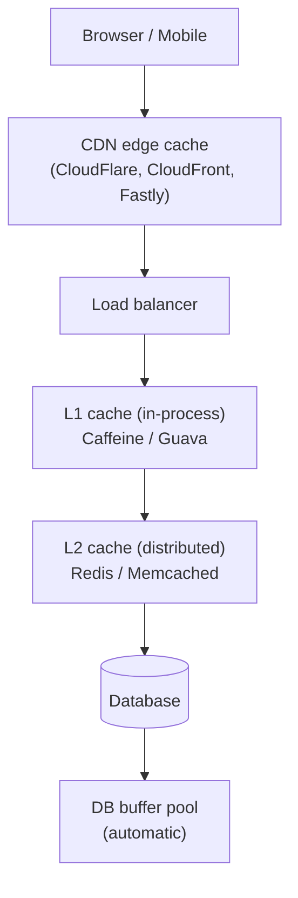
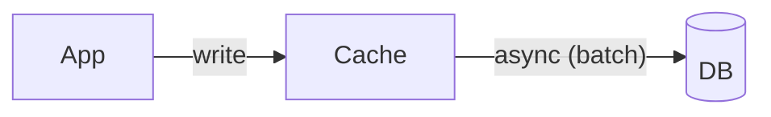
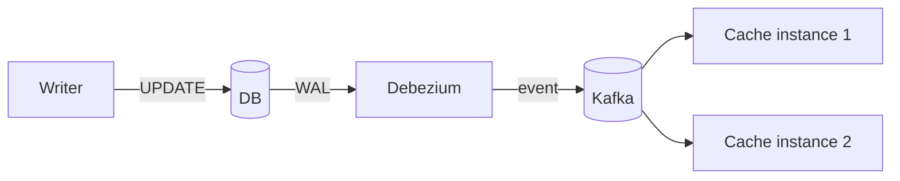
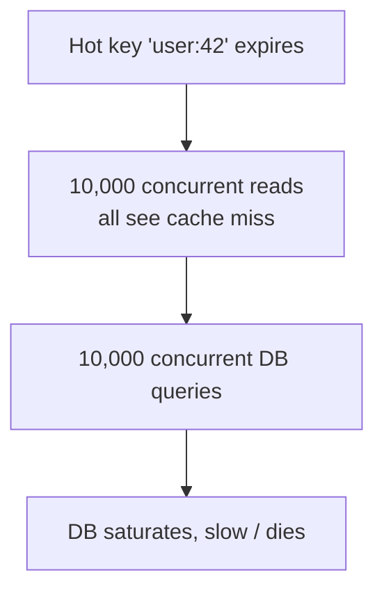
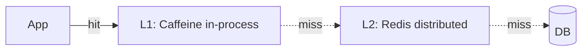

# Caching Strategies at Scale

A cache trades **memory and complexity** for **latency and database load**. The trade is so favorable that virtually every production system has multiple caches: a CDN at the edge, a HTTP cache in front of the application, an application-local cache inside each JVM, a distributed cache (Redis, Memcached) backing it, and the database's own buffer pool. The hard part is not adding caches but **invalidating them correctly** — the famous Phil Karlton quote: *"There are only two hard things in Computer Science: cache invalidation and naming things."* — and **avoiding the failure modes** that turn caches from a performance boost into a outage cause (cache stampedes, dogpiles, stale data corruption, the thundering herd on cache cold start).

The depth bar here is **the patterns and their failure modes**. We cover the five canonical access patterns (cache-aside, read-through, write-through, write-behind, refresh-ahead) and explain which fits which workload. We trace cache invalidation — TTL (simple, allows staleness), explicit invalidation (correct but coupling-heavy), event-driven invalidation (the modern answer). We name the production failures: the **cache stampede** when a hot key expires and 10,000 concurrent requests hit the database; the **dogpile** when a slow regeneration triggers cascading retries; the **stale-data corruption** when a write succeeds but the cache invalidation fails; the **cold-cache thundering herd** when a cache cluster restarts. We name eviction policies (LRU, LFU, ARC, segmented LRU) and their cost. We compare local caches (Caffeine, Guava, Ehcache) with distributed caches (Redis, Memcached, Hazelcast) and the **two-tier (L1 + L2)** pattern that combines them. By the end you will choose a cache pattern for an operation, design invalidation that doesn't silently corrupt, prevent stampedes, and recognize when a cache is making your system slower rather than faster.

> [!NOTE]
> Prerequisites: [Partitioning](./T05-partitioning-and-consistent-hashing.md) (cache clusters are partitioned), [Load Balancing](./T10-load-balancing-algorithms-l4-l7.md) (LB-level caching). Caching has its own failure modes that touch on but are separate from these topics.

## Where Caching Strategies Came From — From CPU Caches To Memcached

The patterns you use to cache distributed application data — cache-aside, write-through, write-behind, refresh-ahead — were not invented for web applications. They emerged from **CPU cache design** in the 1960s, were formalized in **operating systems theory** in the 1970s, and were finally applied to **distributed application caching** in the 2000s. Each pattern carries forward specific failure mode reasoning from its origin.

### The 1960s — CPU Cache Hierarchy

The first computer caches were *CPU caches*. The IBM System/360 Model 85 (1968) was the first commercial machine with a CPU cache, motivated by a specific problem: the CPU was faster than the main memory, and waiting on memory was wasting CPU cycles.

The Model 85's designers, led by **John Cocke** (later a Turing Award winner, 1987), introduced concepts that remain in modern CPU design:

- **Cache lines**: data is fetched in fixed-size blocks, not individual bytes.
- **Locality of reference**: programs tend to access nearby memory and recently-accessed memory.
- **Cache hit rate**: the percentage of accesses served from cache.
- **Write-through vs write-back**: two strategies for handling writes.

The 1968 paper *Structural aspects of the System/360 Model 85, II: The cache* (Liptay) introduced the vocabulary that distributed-application caching would later borrow. **Write-through** (every write goes to both cache and main memory) and **write-back** (writes accumulate in cache, eventually flushed to main memory) are the original names.

### The 1970s — Page Replacement And LRU Theory

The 1970s saw caching theory generalize to *virtual memory* systems. The OS needed to decide which pages to keep in physical memory and which to swap to disk. This was the same problem as CPU caching, at a different time scale.

**Belady's optimal algorithm** (László Bélády, IBM, 1966) was the theoretical baseline: evict the page that won't be used for the longest time. Of course, you can't know the future, so Belady's algorithm is just a benchmark — actual algorithms approximate it.

The practical algorithms of the 1970s:

- **LRU (Least Recently Used)**: evict the page accessed longest ago. Theoretically near-optimal for many workloads.
- **FIFO (First In, First Out)**: evict the page added longest ago. Simpler but worse.
- **Clock algorithm**: efficient LRU approximation, used in many OS kernels.
- **LFU (Least Frequently Used)**: evict the page accessed least often. Better than LRU for some workloads.

These algorithms are still used in modern caches. Redis's `maxmemory-policy` supports LRU, LFU, and randomized variants. Memcached uses an LRU variant. Caffeine (Java) uses a sophisticated combination called **Window-TinyLFU** (Einziger and Friedman, 2017).

### The 1990s — Web Caching And Squid

The web era introduced *application-level caching* in a new form. **Squid** (1996+) was an open-source web cache that sat between browsers and origin servers, caching HTTP responses. The CDN industry that emerged in the late 1990s (Akamai 1998) was effectively *distributed web caching at internet scale*.

Web caching introduced new concerns:
- **TTL (Time To Live)**: HTTP responses had explicit expiration.
- **Conditional requests**: ETag and If-Modified-Since allowed caches to validate freshness without re-downloading.
- **Cache control headers**: applications could explicitly control caching behavior.

These mechanisms are still standard in HTTP and CDN design.

### Memcached (2003) — The Generic Application Cache

**Brad Fitzpatrick** was a graduate student building **LiveJournal** in the early 2000s. LiveJournal's database was being overwhelmed by traffic; Fitzpatrick needed a fast, simple, distributed in-memory cache. In May 2003, he wrote and open-sourced **Memcached** — a stripped-down distributed key-value cache.

Memcached's design choices were *deliberately minimal*:
- **No persistence**: pure in-memory.
- **No replication**: each instance is independent.
- **Simple text protocol**: easy to debug.
- **Consistent-hashing client routing**: clients decided which Memcached instance held which key.
- **LRU eviction**: simple, well-understood.

The minimalism was the point. **LiveJournal, Facebook (early), Twitter (early), YouTube, Wikipedia, Slashdot** all adopted Memcached as their primary caching layer. By 2008, Memcached was running on tens of thousands of servers across the web.

Facebook eventually extended Memcached with its own additions (Memcache@Facebook, McDipper) for their scale, but the basic Memcached design remained foundational.

### Redis (2009) — The Multi-Functional Successor

**Salvatore Sanfilippo** (Italian developer working at AWS-acquired startup VMware-acquired Pivotal-spinoff) released **Redis** in May 2009. Where Memcached was deliberately minimal, Redis added:

- **Persistence**: snapshots and append-only file for durability.
- **Rich data types**: lists, sets, sorted sets, hashes, streams, hyperloglogs.
- **Pub/sub**: built-in messaging.
- **Lua scripting**: server-side procedures.
- **Replication and clustering**: built-in HA and scalability.

Redis grew rapidly to challenge Memcached's dominance. By 2015, Redis was the more commonly used caching system in new applications. Its rich data types made it useful for many things beyond pure caching — session storage, rate limiting, leaderboards, queues.

Redis Labs (founded 2011, renamed Redis Inc. in 2021) commercialized Redis. The open-source Redis remains the cache of choice for most teams.

### The CDN Lineage (1998+)

In parallel with application caches, **Content Delivery Networks** (CDNs) provided edge caching at internet scale:

- **Akamai** (1998): the first major CDN, based on Karger's consistent hashing.
- **Limelight Networks** (2001): Akamai competitor.
- **Cloudflare** (2010): combined CDN, security, and DDoS protection.
- **Fastly** (2011): edge computing platform with HTTP cache.
- **AWS CloudFront** (2008): Amazon's CDN.

CDNs apply the same caching patterns (TTL, ETag, cache invalidation) at the edge of the internet — geographically close to users. The patterns inherited from web caching (Squid era) carry forward; the scale is global.

### Why The Lineage Matters

When you choose a caching strategy today, you're inheriting the failure modes of all these earlier systems:

- **Cache-aside** comes from the CPU cache literature; the failure mode is *cache stampede* (many clients miss simultaneously, all fetch from origin).
- **Write-through** comes from CPU caches; the failure mode is *write latency* (every write waits for the slower backing store).
- **Write-back** comes from CPU caches; the failure mode is *data loss* (writes in cache lost if cache fails before flush).
- **TTL** comes from web caches; the failure mode is *stale data* (cache hit returns outdated value).
- **LRU** comes from OS theory; the failure mode is *scan resistance* (a one-time scan evicts hot data).

The senior engineer's value: recognizing which lineage you're using and what failure modes it brings.

## Why Caching, Specifically: The Senior Engineer's Q&A

### Q1: Why is caching so dangerous despite being so common?

Three structural reasons:

1. **Cache invalidation is famously hard**: Phil Karlton's "There are only two hard things in Computer Science: cache invalidation and naming things." Stale cache values produce silent bugs that are hard to diagnose.

2. **Cache failure modes are different from data store failure modes**: a cache miss is *transparent* (works, just slower); a stale read is *invisible* (returns wrong data). Engineers underweight the silent failures.

3. **Cache behavior under load is non-intuitive**: cache stampedes, hot keys, eviction storms — these emerge under load and are absent in testing.

The senior practice: treat caches as *first-class infrastructure*, not optimization afterthoughts. Cache failures should be tested, alerted on, and runbooked.

### Q2: When is caching the wrong answer?

Three regimes:

1. **Strongly-consistent reads**: if every read must return the latest value, caching adds nothing (you'd have to invalidate on every write, defeating the purpose).
2. **Write-heavy workloads**: caching primarily benefits reads. If writes dominate, caching's overhead exceeds its benefit.
3. **Naturally fast operations**: if the underlying operation is already < 5 ms, the caching overhead may exceed the savings.

For everything else, caching is almost always a win. The 80% case warrants caching; only specific edge cases don't.

### Q3: What's the canonical cache stampede scenario?

A popular cache entry expires (e.g., a homepage being viewed by 10,000 concurrent users). All 10,000 simultaneously miss the cache. All 10,000 query the database. The database is overwhelmed; latency spikes; users see errors.

Mitigations:
- **Probabilistic early expiration**: expire entries probabilistically before TTL, spreading the regeneration load.
- **Lock-and-regenerate**: only one client regenerates; others wait for the result.
- **Stale-while-revalidate**: serve stale data while async regenerating.
- **Background refresh**: pre-emptively regenerate before expiration.

The senior practice: identify potential stampede candidates (hot keys with shared TTL) and apply mitigation explicitly.

### Q4: How does caching interact with consistency models?

Caching *introduces eventual consistency*. Even if the underlying database is linearizable, caching makes reads eventually consistent (stale by up to TTL). This is a *deliberate trade-off* — you accept staleness for performance.

The senior judgment: per-operation, decide which consistency level is required. Cache only operations that tolerate staleness; route consistency-critical operations to the source of truth.

### Q5: When should I use Redis vs Memcached?

- **Redis** when you need rich data types, persistence, pub/sub, or HA. The default modern choice.
- **Memcached** when you need pure simple caching at extreme throughput. Still excellent at multi-million-QPS scale.

In 2024, Redis is the default. Memcached remains in use at Facebook and a few other specific deployments.

### Q6: How does L1 + L2 caching work?

Many systems use *multiple* cache layers:

- **L1**: in-process cache (Caffeine in Java, in-memory cache in Python/Node). Microseconds per access. Limited capacity.
- **L2**: distributed cache (Redis, Memcached). Milliseconds per access. Shared across instances.

The pattern: check L1 first; on miss, check L2; on miss, query origin. Populate both on miss.

Trade-off: L1 has *per-instance* consistency (different instances may have different L1 contents); L2 is shared. Stale L1 is the most common pitfall.

## Common Misconceptions Explained

### "Caching always improves performance."

False. Bad caching strategies *degrade* performance:
- Cache stampedes amplify load on origin.
- Stale data causes user-visible bugs.
- Cache misses with high origin latency dominate worst-case response time.

Caching requires careful design; "just add a cache" is rarely the right answer.

### "Cache hit rate is the only metric that matters."

False. Hit rate measures *efficiency*, not *correctness*. A cache with 99% hit rate that returns stale data is worse than a cache with 80% hit rate that returns correct data.

### "Cache invalidation is just a TTL."

False. TTL is one strategy; explicit invalidation (cache.delete on update), event-driven invalidation (subscribe to data change events), and versioned keys (include version in cache key) are alternatives. The choice depends on consistency requirements.

### "Caching solves database scaling problems."

Half true. Caching reduces *read load* on the database; it doesn't help with *write load*. Write-heavy workloads need different solutions (sharding, write-optimized stores).

### "Cache-aside is always the right pattern."

False. Cache-aside has its own failure modes (stampede, thundering herd). Write-through is better for consistency; write-behind is better for write performance; refresh-ahead is better for hot keys. The pattern should match the workload.

### "Bigger cache is always better."

False. Bigger caches have higher hit rates (good) but longer eviction-decision time and slower memory access (bad). Above a certain size, returns diminish or reverse.

## Why Cache — The Latency Pyramid

Without context, "cache" is vague. With context, it's the response to *specific* latency gaps:

| Path | Latency |
|------|--------:|
| L1 CPU cache | ~1 ns |
| L2 CPU cache | ~5 ns |
| L3 CPU cache | ~15 ns |
| RAM | ~100 ns |
| **Local JVM cache** (Caffeine) | ~100 ns–1 µs |
| **Network round-trip (datacenter)** | ~0.5 ms |
| **Distributed cache (Redis)** | ~1 ms |
| **Database (cache hit, PG buffer pool)** | ~1–5 ms |
| **Database (disk, SSD)** | ~50 µs–1 ms |
| **Database (disk, HDD seek)** | ~10 ms |
| **Network round-trip (cross-region)** | ~50–150 ms |
| **HTTP roundtrip (mobile)** | ~100–500 ms |

A cache moves data from a slower layer up to a faster one. The wins:

- **Local JVM cache** for repeated computations: 1ms → 100ns (10,000× speedup).
- **Redis cache** for database reads: 5ms → 1ms (5×).
- **CDN cache** for static content: 50ms → 5ms (10×).

Multiply by request rate and the wins are operational and financial — fewer database servers, smaller cross-region bills, lower latency budget for the rest of the stack.

## Cache Placement — Five Layers



Each layer caches the layer below, with progressively shorter TTLs as we get closer to the source of truth.

## The Five Access Patterns

How does the application interact with the cache? Five canonical patterns.

### 1. Cache-Aside (Lazy Loading)

The application reads from cache; on miss, reads from DB, populates cache, returns.

```java
public User findUser(long id) {
  User u = cache.get(id);
  if (u == null) {
    u = db.findUser(id);
    if (u != null) cache.put(id, u);
  }
  return u;
}
```

**Pros**: simple, only caches what's actually read, cache failure doesn't break the system.

**Cons**: first read is always a miss, cache must handle eviction.

**This is the default pattern** — the most common, the most flexible. Most caching libraries (Caffeine, Spring Cache with default) operate this way.

### 2. Read-Through

The cache itself loads from the DB on miss; the application only talks to the cache.

```java
LoadingCache<Long, User> cache = Caffeine.newBuilder()
    .maximumSize(10_000)
    .expireAfterAccess(Duration.ofMinutes(30))
    .build(id -> db.findUser(id));    // <-- loader

User u = cache.get(id);                // miss is transparent
```

**Pros**: cleaner application code, the cache library handles the miss.

**Cons**: the cache and DB are coupled inside the cache library.

### 3. Write-Through

Every write goes to both the cache and the DB synchronously.

```java
public void updateUser(User u) {
  db.save(u);
  cache.put(u.id(), u);
}
```

**Pros**: cache is always consistent with DB.

**Cons**: write latency increases (must wait for both); useless if writes are rarely re-read.

### 4. Write-Behind (Write-Back)

The write goes to the cache; the cache asynchronously writes to the DB.



**Pros**: write latency is cache-write only; can batch DB writes; high write throughput.

**Cons**: cache failure can lose writes; data isn't durable until flushed; complexity.

Used in specific high-throughput contexts (telemetry, analytics, ad clicks). Risky for transactional data.

### 5. Refresh-Ahead

The cache pre-emptively refreshes near-expiry entries before they expire, so reads never wait for the DB.

```java
LoadingCache<Long, User> cache = Caffeine.newBuilder()
    .refreshAfterWrite(Duration.ofMinutes(10))      // <-- refresh
    .expireAfterWrite(Duration.ofMinutes(30))
    .build(id -> db.findUser(id));
```

**Pros**: never blocks on cache miss for hot data.

**Cons**: extra DB load for data that won't be re-read; tuning required.

Caffeine's `refreshAfterWrite` does this automatically — the next read after the refresh time triggers an async refresh; the old value is returned immediately.

## Invalidation — The Hard Problem

How does the cache know data has changed? Three approaches:

### TTL (Time-To-Live)

Each entry has an expiry; after that, it's evicted. Simple, eventually consistent, allows staleness up to the TTL.

**When to use**: data where short staleness is acceptable (most cases — product details, configuration, user profiles). Tune TTL by tolerable staleness; shorter = less stale, more DB load.

### Explicit Invalidation

When data changes, the writer evicts (or updates) the cache entry.

```java
public void updateUser(User u) {
  db.save(u);
  cache.invalidate(u.id());        // explicit eviction
}
```

**When to use**: data where staleness is unacceptable (account balances, authorization decisions).

**Hazards**:
- The writer must know about the cache (coupling).
- Multi-cache layers: invalidating L2 doesn't invalidate L1; explicit cascade required.
- Race conditions: between DB write and cache invalidation, readers may populate the cache with the *old* value.

### Event-Driven Invalidation

The DB publishes change events (Debezium / outbox / native CDC); the cache subscribes and invalidates.



**Pros**: decoupled (writer doesn't know about caches), all caches see the same events.

**Cons**: delivery lag (events take time); requires CDC infrastructure.

## The Famous Failure Modes

### Cache Stampede / Thundering Herd

A popular cache entry expires. The next 10,000 concurrent requests all see the cache miss, all hit the database simultaneously. The database is overwhelmed.



**Mitigations**:

1. **Refresh-ahead** (Caffeine `refreshAfterWrite`): the value is async-refreshed before expiry; readers never see a miss.
2. **Single-flight / locking**: only one request regenerates; others wait. Redis's `SETNX` with TTL is a common implementation.
3. **Probabilistic early expiration**: a percentage chance of refresh as expiry approaches; spreads the load.
4. **Stale-while-revalidate**: serve the stale value to readers while a single background process regenerates.

### Dogpile

A slow database query is regenerating a cache entry. While it runs, requests for the same key arrive; if there's no single-flight, each request starts its own regeneration. The database queue grows; the regeneration time grows; more requests dogpile.

**Mitigation**: single-flight (only one regeneration at a time per key).

### Stale-Cache Corruption

A write is committed to the DB; the cache invalidation is queued or asynchronous; meanwhile, a reader populates the cache with the *new* DB value; later, the invalidation arrives and evicts the new value, replacing it with... a re-read that gets the new value. No actual problem — but the invalidation arrived "out of order" and could have been a bug.

**Worse**: between the DB write and the cache invalidation, a reader populates the cache with the *old* DB value. The cache now serves the old value indefinitely.

**Mitigation**: invalidate-after-write atomically (transactional outbox + Debezium), or use TTL as a safety net.

### Cold-Cache Thundering Herd

Cache cluster restarts; every cache entry is gone; the entire request stream hits the DB simultaneously.

**Mitigation**: warm the cache from a known source before serving traffic; gradual ramp-up; bulkheading the DB so cache cold-starts don't kill it.

### Negative Caching

Repeated queries for non-existent data (`findUser(999999)` for a deleted user) miss the cache every time and hit the DB every time.

**Mitigation**: cache "not found" results too (negative caching), with a shorter TTL than positive results. Bloom filters for whole-set negative checking.

## Eviction Policies

When a bounded cache fills up, which entry leaves?

| Policy | Description | Best for |
|--------|-------------|----------|
| **LRU** (Least Recently Used) | Evict the entry not touched longest | General purpose, default |
| **LFU** (Least Frequently Used) | Evict the entry with fewest accesses | Workloads with stable hot keys |
| **W-TinyLFU** (Caffeine's default) | LFU with admission window; the gold standard | Most real workloads |
| **ARC** (Adaptive Replacement Cache) | Balances LRU and LFU | IBM-patented; some Postgres |
| **2Q / SLRU** | Segmented LRU | Database buffer pools |
| **FIFO** | Evict oldest insertion | Rarely useful |

Caffeine's **W-TinyLFU** is widely considered the state-of-the-art. It uses a frequency sketch to admit only entries likely to be re-accessed.

## Local + Distributed (L1 + L2) Caching

The two-tier pattern: a small fast local cache in each JVM, backed by a larger distributed cache.



**L1 (local)**:
- Very fast (~100 ns).
- Limited by per-JVM heap (typically 100MB–1GB).
- Each instance has its own copy; per-key invalidation across instances is hard.

**L2 (distributed)**:
- Network call (~1 ms).
- Much larger (10GB–TB across cluster).
- Shared across all app instances; one invalidation evicts everywhere.

**Trade-off**: L1 gives the lowest latency for hot keys but is hard to keep consistent. L2 is consistent but slower. The two-tier pattern uses L1 for the very hot keys with short TTL (10s) and L2 for everything else with longer TTL (5min).

Spring Cache + Caffeine (L1) + Redis (L2) is a common configuration.

## Bloom Filters For Negative Caching

A Bloom filter is a probabilistic structure that tells you: "this key is *definitely not* in the set" (no false negatives) or "this key *might be* in the set" (false positives possible).

For a database with 100M users and a service that gets queries for nonexistent IDs, a Bloom filter sized for 100M entries (~120MB) can confidently say "this ID doesn't exist, don't bother querying" for ~99% of misses. The remaining 1% (false positives) go through to the DB and find nothing.

Used by many high-scale systems (Cassandra has built-in Bloom filters for SSTables; Bigtable similarly; HBase).

## Spring Caching

```java
@EnableCaching
@Configuration
class CacheConfig {
  @Bean
  CacheManager cacheManager(RedisConnectionFactory cf) {
    RedisCacheConfiguration config = RedisCacheConfiguration.defaultCacheConfig()
        .entryTtl(Duration.ofMinutes(30))
        .serializeKeysWith(/* ... */)
        .serializeValuesWith(/* ... */);
    return RedisCacheManager.builder(cf)
        .cacheDefaults(config)
        .build();
  }
}

@Service
class UserService {
  @Cacheable("users")                       // <-- cache-aside, read-through
  public User findUser(long id) {
    return repo.findById(id).orElseThrow();
  }

  @CachePut("users")                        // <-- write-through
  public User updateUser(User u) { return repo.save(u); }

  @CacheEvict("users")                      // <-- explicit invalidation
  public void deleteUser(long id) { repo.deleteById(id); }
}
```

Spring Cache abstracts away the cache backend (in-memory, Redis, EhCache, Caffeine, Hazelcast). The annotations are clean; the failure modes (stampede, stale invalidation) require additional thought.

## Real Cache Systems

| System | Type | Best for |
|--------|------|----------|
| **Caffeine** | Local JVM | L1 cache, hot-key hot-path |
| **Guava Cache** | Local JVM (legacy) | Replaced by Caffeine |
| **Ehcache** | Local JVM (large) | Off-heap, persistent |
| **Redis** | Distributed | L2 cache, leaderboard, rate-limit storage |
| **Memcached** | Distributed | Pure cache, no persistence |
| **Hazelcast** | Distributed | JVM-native, compute + cache |
| **Apache Ignite** | Distributed | SQL-queryable cache |
| **CloudFlare / Fastly / CloudFront** | CDN / edge | Static content, low-latency edge |
| **Varnish** | HTTP cache | Reverse-proxy caching for HTTP |

For a Spring Boot service in 2026: **Caffeine** (L1) + **Redis** (L2) is the dominant choice. **CloudFlare/Fastly** at the edge for static and HTTPable content.

## Cross-Language Notes

| Ecosystem | Caching libraries |
|-----------|-------------------|
| **Java / Spring** | Caffeine, Spring Cache + Redis, Hazelcast |
| **C# / .NET** | `IMemoryCache`, `IDistributedCache`, MemoryCache.Sliding |
| **Go** | bigcache, freecache, ristretto |
| **Rust** | moka (Caffeine port), cached |
| **Node.js** | node-cache, ioredis, dataloader |
| **Python** | cachetools, Django cache, redis-py |

## Trade-Off Summary

| Concern | Pattern / tool |
|---------|---------------|
| Hot key latency | L1 Caffeine in-process |
| Shared cache state | L2 Redis distributed |
| Static content at edge | CDN |
| Stampede prevention | Refresh-ahead, single-flight |
| Stale-tolerance | Long TTL + eventual invalidation |
| Strict consistency | Write-through + short TTL or no cache |
| Write-heavy hot data | Write-behind (carefully) |
| Negative cache | Bloom filter or short-TTL negatives |

> [!INTERVIEW]
> A common L5 prompt: "How would you cache a heavily-read database table?" Strong answers (a) start with cache-aside + TTL, (b) layer L1 (Caffeine) + L2 (Redis) for hot keys, (c) address stampedes with refresh-ahead or single-flight, (d) name the invalidation strategy (TTL vs explicit vs CDC events).

## Deeper Dive — Cache Stampede Mitigation Algorithms

### Algorithm 1: Locked Recompute (Single-Flight)

```java
public class SingleFlightCache<K, V> {
    private final Cache<K, V> cache;
    private final ConcurrentHashMap<K, CompletableFuture<V>> inflight = new ConcurrentHashMap<>();
    private final Function<K, V> loader;

    public V get(K key) {
        V cached = cache.getIfPresent(key);
        if (cached != null) return cached;

        // Coalesce concurrent misses
        CompletableFuture<V> future = inflight.computeIfAbsent(key, k ->
            CompletableFuture.supplyAsync(() -> {
                try {
                    V value = loader.apply(k);
                    cache.put(k, value);
                    return value;
                } finally {
                    inflight.remove(k);
                }
            })
        );

        try {
            return future.get(5, TimeUnit.SECONDS);
        } catch (Exception e) {
            throw new RuntimeException("Cache load failed", e);
        }
    }
}
```

Caffeine's `LoadingCache` does this automatically:

```java
LoadingCache<String, User> cache = Caffeine.newBuilder()
    .maximumSize(10_000)
    .expireAfterWrite(5, MINUTES)
    .build(key -> userRepo.findById(key).orElseThrow());

// Concurrent misses → only ONE thread loads; others wait
User u = cache.get("user-123");
```

### Algorithm 2: Probabilistic Early Expiration

```java
public V getWithEarlyExpiry(K key) {
    CachedEntry<V> entry = cache.getIfPresent(key);
    if (entry == null) return loadAndCache(key);

    // Compute if we should preemptively refresh
    double remaining = (entry.expiresAt - now()) / (double) entry.ttlMs;
    // 0.0 = expired; 1.0 = freshly cached
    // Probability of refresh = (1 - remaining)²
    double refreshChance = Math.pow(1 - remaining, 2);

    if (Math.random() < refreshChance) {
        // Async refresh; serve current value
        CompletableFuture.runAsync(() -> {
            V fresh = loader.apply(key);
            cache.put(key, new CachedEntry<>(fresh, now() + ttlMs));
        });
    }

    return entry.value;
}
```

**XFetch algorithm** (Vattani 2015): probabilistic early refresh smooths the stampede.

### Algorithm 3: Stale-While-Revalidate

```java
public V getSWR(K key) {
    CachedEntry<V> entry = cache.getIfPresent(key);
    if (entry == null) return loadAndCache(key);

    boolean isStale = now() > entry.expiresAt;
    boolean isTrulyExpired = now() > entry.staleUntil;

    if (isTrulyExpired) {
        // Past the stale-acceptance window; force refresh
        return loadAndCache(key);
    }

    if (isStale && !entry.refreshing.getAndSet(true)) {
        // Single refresh request; serve stale meanwhile
        CompletableFuture.runAsync(() -> {
            try {
                V fresh = loader.apply(key);
                cache.put(key, new CachedEntry<>(fresh, now() + ttlMs, now() + staleMs));
            } finally {
                entry.refreshing.set(false);
            }
        });
    }

    return entry.value;
}
```

**Used by**: HTTP `Cache-Control: stale-while-revalidate=N` directive; Cloudflare, Vercel.

### Algorithm 4: TTL with Jitter

```java
public void put(K key, V value) {
    long jitter = ThreadLocalRandom.current().nextLong(0, baseTTLMs / 10);
    cache.put(key, value, baseTTLMs + jitter);
}
```

**Simplest mitigation**: prevent simultaneous expiration of related keys. Doesn't fix hot-key stampede but spreads expirations smoothly.

## Deeper Dive — Spring Cache Multi-Tier Configuration

```java
@Configuration
@EnableCaching
public class CacheConfig {

    @Bean
    public CacheManager cacheManager(RedisConnectionFactory redisCf) {
        // L1 — Caffeine (in-process, fast)
        CaffeineCacheManager l1 = new CaffeineCacheManager();
        l1.setCaffeine(Caffeine.newBuilder()
            .maximumSize(10_000)
            .expireAfterWrite(Duration.ofSeconds(30))
            .recordStats());

        // L2 — Redis (distributed)
        RedisCacheConfiguration redisConfig = RedisCacheConfiguration.defaultCacheConfig()
            .entryTtl(Duration.ofMinutes(10))
            .serializeValuesWith(SerializationPair.fromSerializer(
                new GenericJackson2JsonRedisSerializer()));

        RedisCacheManager l2 = RedisCacheManager.builder(redisCf)
            .cacheDefaults(redisConfig)
            .build();

        // Composite L1 + L2
        CompositeCacheManager composite = new CompositeCacheManager(l1, l2);
        composite.setFallbackToNoOpCache(false);
        return composite;
    }

    @Bean
    public CacheStatisticsCollector cacheStats() {
        return new CacheStatisticsCollector();
    }
}

@Service
public class UserService {

    // Annotations cascade through L1 → L2 → DB
    @Cacheable(value = "user", key = "#id")
    public User getUser(String id) {
        return userRepo.findById(id).orElseThrow();
    }

    @CacheEvict(value = "user", key = "#user.id")
    public User updateUser(User user) {
        return userRepo.save(user);
    }

    @CachePut(value = "user", key = "#result.id")
    public User createUser(User user) {
        return userRepo.save(user);
    }
}
```

### Cross-Instance L1 Coherence via Redis Pub/Sub

```java
@Component
public class CacheCoherenceListener {

    @Autowired private CaffeineCacheManager l1;
    @Autowired private RedisTemplate<String, String> redis;

    @PostConstruct
    public void subscribe() {
        // Listen to Redis Pub/Sub for invalidation events
        redis.execute(new RedisCallback<Void>() {
            @Override
            public Void doInRedis(RedisConnection conn) {
                conn.subscribe((message, channel) -> {
                    String invalidationKey = new String(message.getBody());
                    String[] parts = invalidationKey.split(":");
                    Cache cache = l1.getCache(parts[0]);
                    if (cache != null) cache.evict(parts[1]);
                }, "cache-invalidation".getBytes());
                return null;
            }
        });
    }

    public void invalidateAndPublish(String cacheName, String key) {
        l1.getCache(cacheName).evict(key);
        l2.getCache(cacheName).evict(key);
        redis.convertAndSend("cache-invalidation", cacheName + ":" + key);
        // All instances drop the key from their L1
    }
}
```

## Deeper Dive — Cache Sizing Math

```
USECASE: Product catalog cache
  Total products: 10M
  Avg product size: 2 KB
  Total: 20 GB
  
  Hot set (Pareto 80/20): 2M products account for 80% of reads
  Hot set size: 4 GB

DECISION:
  Cache 4 GB hot set → 80% hit rate
  Add 4 GB more → 92% hit rate (diminishing returns)
  Cache entire 20 GB → 100% hit rate (only worth it if memory cheap vs DB queries)

REAL CALCULATION:
  Without cache: 1000 req/s × 5ms DB query = 5 seconds of DB time per second (5 instances)
  With 80% cache hit: 200 req/s × 5ms DB query = 1 second of DB time per second (1 instance)
  Saved: 4 DB instances at $200/mo = $800/mo

  Cache cost: 4GB Redis ElastiCache cache.t3.small = $20/mo

  ROI: 40× return
```

### Latency Pyramid

```
L1 (CPU cache)                  : 1-5 ns
L2 (Caffeine in-process)         : 50-200 ns
L3 (Redis on same host)          : 100-500 µs
L4 (Redis cluster)               : 1-5 ms
L5 (Database)                    : 5-50 ms
L6 (External API)                : 50-500 ms
L7 (Cross-region)                : 50-200 ms

DESIGN TRICK: each layer absorbs 80-95% of requests
  90% L1 hit → 9% to L2 → 0.9% to L3 → 0.09% to DB
  Average latency: 90% × 100ns + 9% × 1ms + 1% × 50ms ≈ 590µs
  Without cache: 100% × 50ms = 50,000µs
  Speedup: ~85× faster average
```

## Deeper Dive — Production Cache Monitoring

### Key Metrics

```yaml
# Prometheus alerting
- alert: CacheHitRateLow
  expr: |
    (rate(cache_hits_total[5m])
     / (rate(cache_hits_total[5m]) + rate(cache_misses_total[5m])))
    < 0.7
  for: 10m
  
- alert: CacheStampedeRisk
  expr: rate(cache_misses_total[1m]) > 1000   # spike in misses
  for: 1m
  
- alert: CacheEvictionRateHigh
  expr: rate(cache_evictions_total[5m]) > 100   # consistently evicting
  for: 5m
```

### Spring Boot Actuator Cache Metrics

```yaml
management:
  metrics:
    enable.cache: true
    export:
      prometheus.enabled: true
```

Caffeine metrics exposed automatically:
```
caffeine_hit_total                  # hits per cache
caffeine_miss_total                 # misses
caffeine_load_total                 # loader invocations
caffeine_load_failure_total          # loader failures
caffeine_eviction_total              # evicted
caffeine_estimated_size              # current size
```

## Deeper Dive — Caching Anti-Patterns

### Anti-Pattern 1: Caching Mutable Data Without Invalidation

```java
// BAD: caches user profile but doesn't invalidate on update
@Cacheable("user")
public User getUser(String id) { ... }

public User updateUser(User user) {
    // Cache holds stale data forever
    return userRepo.save(user);
}

// GOOD: explicit invalidation
@CacheEvict("user")
public User updateUser(User user) {
    return userRepo.save(user);
}
```

### Anti-Pattern 2: Caching Per-Request Unique Data

```
SCENARIO:
  Cache key: hash(query_params + user_id)
  Each request has unique parameters → cache hit rate ~0%
  Cache just adds latency + memory cost

FIX: don't cache this; or cache higher-up in the request hierarchy
```

### Anti-Pattern 3: No Cache TTL

```
SCENARIO:
  Cache has no TTL; entries live forever
  Over months, cache fills with stale entries
  Hit rate drops; memory grows
  
FIX: set reasonable TTL based on actual data lifetime
```

### Anti-Pattern 4: Cache Sometimes Returns Null, Sometimes Doesn't

```java
// BAD: ambiguous semantics
if (cache.get(key) == null) {
    return loadFromDB(key);   // assume cache miss
}
// But what if loadFromDB returns null AND we cached null?

// GOOD: distinct sentinel for "negative" cache
if (!cache.containsKey(key)) return loadAndCache(key);

V cached = cache.get(key);
if (cached == NULL_SENTINEL) return null;   // explicit "we checked, it doesn't exist"
return cached;
```

### Anti-Pattern 5: Synchronous Cache Population at Startup

```
SCENARIO:
  App startup: blocks on cache warm-up
  10K items × 5ms each = 50 seconds startup
  K8s readiness probe fails; pod doesn't start

FIX: load asynchronously after readiness; or accept cold cache + traffic ramp
```

## Deeper Dive — CDN Caching Strategies (Edge Layer)

```
CDN BENEFITS:
  - Sub-100ms latency anywhere in world
  - 70-95% offload from origin
  - DDoS absorption

WHAT TO CACHE:
  Static assets (JS, CSS, images): TTL 1 year + hash in URL
  Public API responses (e.g., product listings): TTL 5 min
  User-specific content: NOT cacheable globally
  
INVALIDATION:
  Purge API: invalidate by URL or tag
  Cloudflare: average purge time ~100ms globally
  
HEADERS:
  Cache-Control: public, max-age=300, stale-while-revalidate=600
  Cache-Control: private, no-cache (user data)
  ETag: "abc123" → conditional GET
  Vary: Accept-Encoding, Authorization → segment cache by header
```

### Spring Boot HTTP Cache Configuration

```java
@RestController
public class ProductController {

    @GetMapping("/api/products")
    public ResponseEntity<List<Product>> getProducts() {
        List<Product> products = productService.findAll();
        return ResponseEntity.ok()
            .cacheControl(CacheControl.maxAge(5, TimeUnit.MINUTES)
                .staleWhileRevalidate(10, TimeUnit.MINUTES))
            .eTag(computeETag(products))
            .body(products);
    }
}
```

## Practice

1. **Pick patterns.** For five real operations in any system you know, pick a caching pattern (cache-aside, read-through, write-through, write-behind, refresh-ahead). Justify each.
2. **L1 + L2 in Spring.** Configure Caffeine (L1) + Redis (L2) with Spring Cache. Measure latency for hot vs cold reads.
3. **Stampede test.** Force a hot-key expiration; measure DB query rate. Add refresh-ahead; measure again.
4. **Invalidation drill.** For a cache + DB system, implement CDC-driven invalidation via Debezium + Kafka. Verify no stale data after a write.
5. **TTL tuning.** For a real cache, decide TTL based on staleness tolerance and DB cost. Justify in two paragraphs.
6. **Bloom filter for nonexistent IDs.** Implement a Bloom filter for negative caching. Measure how many "not found" queries it saves.
7. **W-TinyLFU vs LRU benchmark.** With Caffeine, compare W-TinyLFU and LRU hit rates on a real (or simulated) access pattern.
8. **Cold-cache mitigation.** For a cache cluster restart, design a warm-up procedure that protects the DB.
9. **Cross-region cache.** Design caching for a multi-region service. Decide what's local vs shared, what's invalidated globally vs eventually.
10. **The skeptic conversation.** A senior engineer says "we don't need a cache; the DB is fast." Write a 200-word response on when the cache is essential and when it's a premature optimization.

## Recap

You should now be able to:

- Apply the **five canonical access patterns** — cache-aside, read-through, write-through, write-behind, refresh-ahead — and choose by workload.
- Plan **invalidation strategies** — TTL, explicit, event-driven CDC — and recognize the coupling and timing implications of each.
- Recognize and prevent **cache failure modes**: stampede, dogpile, stale-cache corruption, cold-cache thundering herd, negative-cache miss.
- Choose **eviction policies** — LRU, LFU, W-TinyLFU, ARC — by workload characteristics.
- Use **L1 + L2 (local + distributed)** caching with appropriate TTL and consistency policies per tier.
- Apply **Bloom filters** for efficient negative caching.
- Configure **Spring Cache** with Caffeine (L1) + Redis (L2) and handle the failure modes the annotations don't address.
- Place caches at the right **layer** — CDN edge, application, database — and recognize the tradeoffs at each.
- Recognize when a cache is the **wrong** answer — strong-consistency operations, low-cost DB reads, write-heavy data with low re-read.

## Next

Continue to [Scaling (Horizontal/Vertical, Autoscaling, Statelessness)](./T12-scaling-horizontal-vertical-autoscaling-statelessness.md) — the operational discipline of adding capacity: horizontal vs vertical scaling, autoscaling triggers, statelessness as the precondition, and the limits each one hits.
