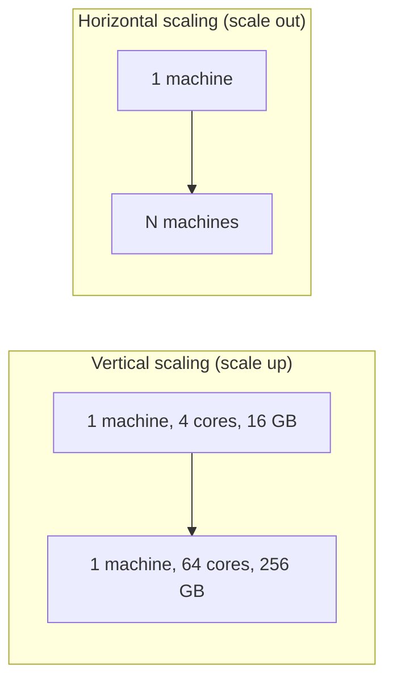
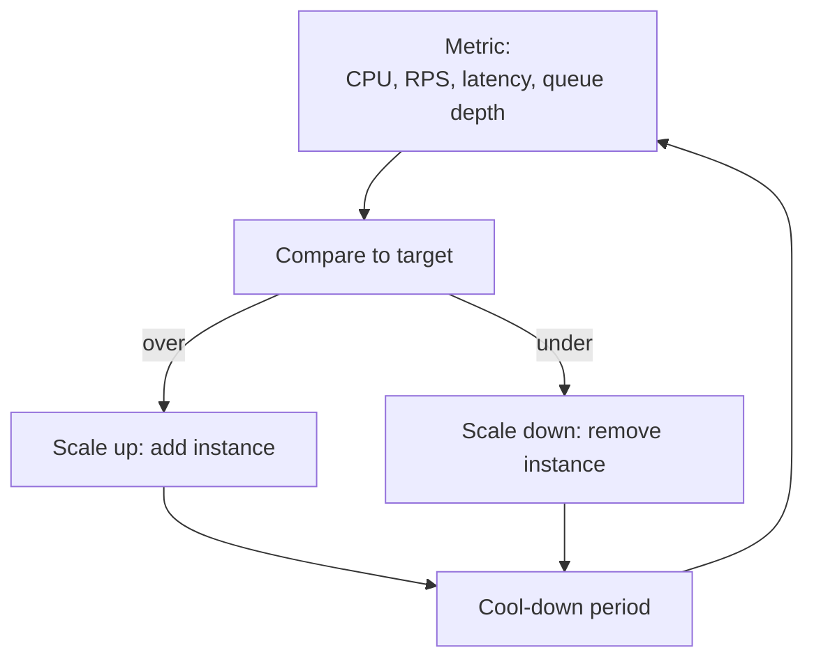

# Scaling (Horizontal/Vertical, Autoscaling, Statelessness)

When traffic doubles, the system must serve twice the load — or fail. **Scaling** is the discipline of adding capacity, and there are two canonical paths: **vertical** (bigger machine — more CPU, more RAM, more bandwidth on a single node) and **horizontal** (more machines — replicate the application across N instances behind a load balancer). The two have radically different cost curves, failure modes, and operational implications. Vertical maxes out at the largest available instance size (a few thousand cores, low TB RAM); horizontal in principle has no ceiling but requires the application to *be* horizontally-scalable, which means **stateless** ([T12 of C01](../C01-software-architecture/T12-twelve-factor-app.md)) and **partition-tolerant**. Autoscaling — adjusting capacity automatically based on demand — is the operational practice that makes elastic capacity actually deliver on its promise; the gap between "we have autoscaling" and "it works under real load" is one of the most consistently-underestimated areas in production engineering.

The depth bar here is **the operational realities**: which load profile each scaling axis fits, what the cool-down and warm-up dynamics actually do, how autoscaling interacts with cold caches and JIT-warmup, when statelessness is more nuanced than "no in-memory state," and what scaling looks like on Kubernetes (HPA, VPA, KEDA), AWS (Auto Scaling Groups, ECS task auto-scaling, Lambda concurrency), and serverless. We name the production failures: the auto-scaler that scaled *down* during a slow request burst, dropping in-flight; the auto-scaler that scaled *up* on a stampede caused by its own scale-down; the JVM that took 30 seconds to JIT-warm and dropped traffic during that window; the connection pool that exhausted upstream when the app horizontally scaled but the DB didn't. We cover **right-sizing** vertically and horizontally, the Amdahl-style limits on horizontal scaling (some operations don't parallelize), and the operational ergonomics that make scaling reliable.

> [!NOTE]
> Prerequisites: [Twelve-Factor App](../C01-software-architecture/T12-twelve-factor-app.md) (statelessness is the foundation), [Load Balancing](./T10-load-balancing-algorithms-l4-l7.md) (the LB distributes load across the scaled instances), [Caching](./T11-caching-strategies-at-scale.md) (caching is what reduces the load you have to scale to).

## Where Modern Scaling Came From — From Mainframes To Auto-Scaling

The scaling conversation has gone through three distinct eras: **mainframe era** (1960s–1990s, only vertical scaling), **scale-out era** (2000s–2010s, horizontal as the default), and **elastic era** (2010s+, auto-scaling). Each transition was driven by specific economic and technical pressures.

### The Mainframe Era — Vertical Scaling Was The Only Option

Before the 2000s, **vertical scaling was the only option** for most enterprise computing. The reasons:

1. **Operating systems couldn't easily distribute work**: pre-2000 Unix and Windows lacked the cluster management primitives that would emerge later.
2. **Distributed coordination was hard**: developers manually managed cross-machine state.
3. **Hardware scaled vertically reasonably well**: IBM mainframes in the 1990s reached 64+ CPUs in a single system.

Enterprise applications were sized for a single server. When that server's capacity was exceeded, the answer was to *buy a bigger server*. IBM, Sun, HP, and Tandem all sold large vertical-scale machines for this market.

The cost: vertical scaling has *steep* cost curves. A 4-CPU server might cost $20K; a 32-CPU server cost $500K; a 64-CPU mainframe cost millions. The per-CPU cost grew superlinearly.

### Google's Scale-Out Revolution (1998–2003)

The shift to horizontal scaling was driven by **Google's commodity-server architecture**. From its founding (1998), Google chose to run its services on **many cheap commodity servers** rather than a few expensive enterprise machines.

The 2003 Google paper [*Web Search for a Planet: The Google Cluster Architecture*](https://research.google/pubs/pub334/) documented this approach. Key insights:

1. **Commodity hardware fails more often** than enterprise hardware, but it's *much* cheaper.
2. **The software handles failures** rather than relying on hardware reliability.
3. **Many cheap servers** beat few expensive servers on price-performance.

Google's clusters by 2003 contained tens of thousands of commodity x86 servers. The economic argument was overwhelming: Google's per-query cost was a fraction of what equivalent enterprise architecture would have cost.

The Google approach defined the *scale-out era*. Through the 2000s, web companies (Amazon, Yahoo, Facebook, eBay) adopted similar architectures. Enterprise computing followed slowly.

### The 2006 Amazon Web Services Launch

The decisive moment was **Amazon Web Services' EC2 launch in August 2006**. EC2 made commodity-server scale-out *available to everyone*. Companies that previously needed massive capital to build commodity clusters could rent them by the hour.

Specific EC2 capabilities that enabled scale-out adoption:

- **Hourly billing**: pay only for what you use.
- **API-driven provisioning**: programmatic creation/destruction.
- **Standard instance types**: predictable performance characteristics.
- **Auto-scaling groups (2009)**: automatic capacity adjustment.

EC2's launch is widely considered the start of the cloud computing era. By 2010, most new web applications were AWS-native; scale-out was the default architectural assumption.

### Auto-Scaling Mechanisms

The progression of auto-scaling capabilities:

- **AWS Auto Scaling Groups** (2009): scale EC2 instances based on CloudWatch metrics.
- **Kubernetes Horizontal Pod Autoscaler** (2015): scale containers based on CPU/memory.
- **Kubernetes Vertical Pod Autoscaler** (2018): adjust container resource requests.
- **KEDA** (Kubernetes Event-Driven Autoscaling, 2019): scale based on external events (queue depth, etc.).
- **AWS Lambda concurrency** (2014+): function-level auto-scaling.

By 2020, auto-scaling was the *default* for cloud-native systems. Manual capacity management was uncommon outside specific enterprise contexts.

### The Statelessness Imperative

Horizontal scaling *requires* statelessness. The 12-Factor App methodology (Heroku, 2011 — see [C01/T12](../C01-software-architecture/T12-twelve-factor-app.md)) made statelessness Factor VI. The rationale: a stateless service can be scaled by simply adding instances; a stateful service requires complex coordination.

This shift required *architectural patterns*:

- **External session storage** (Redis, databases) instead of in-memory sessions.
- **External caches** (Memcached, Redis) instead of in-memory caches.
- **External configuration** (environment variables, config services) instead of file-based config.
- **External logging** (stdout, log aggregators) instead of file-based logs.

The 2010s saw most successful web applications adopt these patterns. The few that didn't (legacy enterprise systems, gaming servers) faced significantly harder scaling challenges.

## Why Scaling Matters, Specifically: The Senior Engineer's Q&A

### Q1: Why is horizontal scaling so dominant now?

Three reasons:

1. **Cost**: commodity servers are dramatically cheaper per unit of compute than large enterprise machines.
2. **Failure tolerance**: if one of 100 servers fails, you lose 1% capacity; if one of 1 large servers fails, you lose 100%.
3. **Cloud economics**: cloud providers price commodity scale-out advantageously; large vertical machines are expensive cloud SKUs.

The combination makes horizontal scaling the *default* unless specific constraints force vertical.

### Q2: When is vertical scaling still appropriate?

Three regimes:

1. **Legacy applications**: applications designed for vertical scaling can't easily be horizontalized.
2. **Latency-sensitive workloads**: distributing across many machines adds network latency.
3. **Stateful in-memory workloads**: in-memory databases (SAP HANA), large analytical workloads benefit from large single machines.

For most web applications, horizontal scales better. For specific niches, vertical scaling makes sense.

### Q3: What does "stateless" really require?

Strictly: **no instance-specific state**. Practically:

- Session data lives externally (Redis, database).
- Cached data is externally rebuildable.
- File uploads go to object storage (S3).
- Configuration comes from environment variables.

The discipline: an instance can be killed and replaced with no user-visible impact. A new instance with the same configuration behaves identically.

### Q4: How does auto-scaling actually work?

Three components:

1. **Metric collection**: CPU, memory, request rate, queue depth, custom metrics.
2. **Scaling policy**: rules for when to scale (e.g., "if CPU > 70% for 5 minutes, add 1 instance").
3. **Provisioning**: actually launching new instances.

The tricky parts:

- **Lag**: instances take time to start (cold start). Auto-scaling should be proactive, not reactive.
- **Stability**: avoid scaling oscillation (cooldown periods).
- **Cost**: balance responsiveness against money.

### Q5: How does scaling interact with database design?

Stateless application servers scale easily. **Databases are the choke point**.

For relational databases:

- **Vertical first**: bigger database server.
- **Read replicas**: horizontal scaling for reads.
- **Sharding**: horizontal scaling for writes (significant complexity).

For NoSQL:

- **Designed for horizontal**: Cassandra, DynamoDB scale by adding nodes.
- **Cost: weaker consistency**: trade-offs covered in T02.

The scaling architect's challenge: making sure the database can keep up with application scaling.

## Common Misconceptions Explained

### "Horizontal scaling is always cheaper."

Half true. Horizontal scaling is cheaper *per unit of compute*; total cost depends on the workload. Some workloads scale less efficiently horizontally (database transactions, in-memory analytics).

### "Auto-scaling solves capacity problems."

Partly true. Auto-scaling responds to changes; it doesn't solve underlying capacity issues. A poorly-designed application that can't scale horizontally will hit limits regardless of auto-scaling.

### "Statelessness is just about external storage."

False. **Statelessness is an architectural pattern** that affects design throughout the application. Externalizing storage is necessary but not sufficient.

### "Scaling is an operations concern."

False. Scaling decisions affect architecture; they're an engineering concern. Operations *implements* scaling; engineers must *enable* it.

### "Cloud auto-scaling eliminates capacity planning."

Mostly false. Auto-scaling responds to changes; capacity planning anticipates them. Both are needed for resilient operations.

### "Vertical scaling is obsolete."

False. Specific workloads (in-memory analytics, certain databases, legacy applications) still benefit from vertical scaling. The "horizontal-first" default doesn't mean "horizontal-only."

## The Two Axes



**Vertical**: more capacity on one machine. CPU more cores, more RAM, faster disk, more network bandwidth. Easy: no application change needed. Limits: largest instance (~96 vCPU / ~768 GB on common cloud SKUs, more on bare metal), single point of failure, cost curve is super-linear at the top end.

**Horizontal**: more machines doing the same work. Hard: application must be stateless (or stateful in a coordinated way), load must distribute. Limits: in principle none, in practice limited by shared resources (database, caches, network).

For most workloads, **the answer is both**: pick a *right-sized* vertical instance (often 4–16 vCPU is the sweet spot), then horizontally scale that footprint to meet demand. Pure vertical scaling hits the wall; pure horizontal scaling with tiny instances has per-instance overhead.

## Statelessness — The Precondition

Horizontal scaling requires that *any* instance can handle *any* request. The application must not depend on in-memory state that exists on a specific instance:

- HTTP sessions in memory: externalize to Redis or use JWTs.
- In-memory caches treated as truth: only as performance optimization; the source of truth is shared.
- Local file uploads / writes: use object storage.
- In-flight long operations: persistable + resumable, not tied to one process.
- Stateful WebSocket connections: sticky-routing OR move to a coordination layer (Redis Streams, Kafka).
- In-memory rate limiters: each instance counts independently; effective limit is N × intended; centralize.

A *truly* stateless service can be killed mid-request and the load balancer reroutes to another instance without user impact. **The lift to make a service stateless is often the single biggest scaling investment**, and once made, it pays for years.

## Vertical Scaling — When And Limits

Vertical scaling is the right answer for:

- **Stateful systems** that can't be sharded easily (databases on a single primary, in-memory analytics).
- **Latency-sensitive paths** where every cross-machine hop costs.
- **Single-threaded bottlenecks** that adding machines wouldn't help (a serialized writer, a leader-bound process).
- **Small-team operations** where N machines is more complexity than one big one.

Limits:

- **Largest cloud SKU**: AWS m7i.metal-48xl is 192 vCPU and 768 GB RAM; cost is ~$20,000/month. Going larger requires bare metal.
- **JVM heap**: G1 GC handles heaps up to ~16 TB; pause times grow super-linearly at huge heaps. ZGC scales better but has higher CPU cost.
- **Network bandwidth**: even huge instances cap out at ~100 Gbps; a network-bound service can't grow past that on one machine.
- **Single failure domain**: one machine = one outage on failure.
- **Cost curve**: prices go super-linear at the top — 96 vCPU isn't 12× 8 vCPU; it's often 18× to 24× because of premium SKUs and capacity.

A reasonable senior heuristic: **scale vertically until ~16–32 vCPU per instance, then start horizontal**. The middle of the curve is where price-per-performance is best; the top is for problems that demand it.

## Horizontal Scaling — The Cost And Limits

Horizontal scaling adds instances behind a load balancer. Each instance is independent; the system as a whole grows in capacity proportionally.

Limits:

- **Shared resources**: database, caches, queues. If the DB caps at 10K writes/sec, adding application instances past that doesn't help.
- **Coordination overhead**: leader election, cache coherence, distributed locks. Each adds cost.
- **Connection pool**: each app instance has its own DB connection pool of 20 connections; 50 instances × 20 = 1000 connections to the DB; the DB caps at ~500 concurrent. Now you must reduce the pool size or add a PgBouncer.
- **Per-instance overhead**: each Spring Boot instance uses ~500 MB before any traffic. 50 instances = 25 GB just for JVM + Spring overhead.
- **Diminishing returns** (Amdahl's Law): if 5% of the workload is serial, max horizontal speedup is 1/0.05 = 20×, regardless of instance count.

In practice, well-architected services scale horizontally to **hundreds of instances** before hitting a real limit. The wall is almost always a downstream system.

## Autoscaling — Adjusting Capacity Automatically

Manual capacity management doesn't fit traffic that varies hourly or daily. Autoscaling watches a metric and adjusts instance count.

### The Loop



The trigger (the metric and target):
- **CPU-based**: scale to keep average CPU at, say, 60%. Simple but lagging.
- **Request rate**: scale to keep requests-per-instance bounded. Better for stateless web services.
- **Queue depth**: scale to keep Kafka consumer lag below a threshold. Best for async workloads.
- **Custom**: P99 latency, in-flight requests, anything observable.

### Cool-Down

After a scaling action, wait before scaling again. Prevents oscillation: scale up, traffic drops below target briefly, scale down, traffic returns, scale up, ...

Typical cool-downs:
- Scale-up: 60–180 s (fast, to react to surges).
- Scale-down: 300–600 s (slow, to avoid premature removal).

### Warm-Up

When a new instance is added, it needs:
- **OS boot** (~10 s for VMs, ~1 s for containers).
- **JVM startup** (~3–8 s for Spring Boot, ~50 ms for GraalVM native).
- **Cache warm-up** (varies — minutes for fully cold).
- **JIT compilation** (~30–60 s for hot paths in HotSpot).

A new instance is *not* ready to serve full load immediately. LBs need slow-start ([T10](./T10-load-balancing-algorithms-l4-l7.md)) and readiness probes to delay traffic until JIT and caches are warm.

### Predictive Scaling

Instead of reacting to current metrics, predict future ones based on history. Useful for daily / weekly patterns (commute peaks, weekend dips). AWS Predictive Scaling, Kubernetes' future predictive HPA (in development).

## Kubernetes Autoscaling

Three mechanisms:

### HPA (Horizontal Pod Autoscaler)

Scales the number of pods based on CPU/memory or custom metrics.

```yaml
apiVersion: autoscaling/v2
kind: HorizontalPodAutoscaler
metadata: { name: orders }
spec:
  scaleTargetRef: { apiVersion: apps/v1, kind: Deployment, name: orders }
  minReplicas: 3
  maxReplicas: 50
  metrics:
  - type: Resource
    resource: { name: cpu, target: { type: Utilization, averageUtilization: 60 } }
```

### VPA (Vertical Pod Autoscaler)

Adjusts per-pod CPU/memory requests based on observed usage. Useful for right-sizing; can't be combined with HPA on the same resource.

### KEDA (Kubernetes Event-Driven Autoscaling)

Scales on external metrics: Kafka lag, RabbitMQ queue depth, Redis list length, Prometheus queries, cloud metrics. The right answer for non-CPU-bound workloads.

```yaml
apiVersion: keda.sh/v1alpha1
kind: ScaledObject
metadata: { name: order-consumer }
spec:
  scaleTargetRef: { name: order-consumer }
  minReplicaCount: 1
  maxReplicaCount: 20
  triggers:
  - type: kafka
    metadata:
      bootstrapServers: kafka:9092
      consumerGroup: orders
      topic: order-events
      lagThreshold: "1000"
```

## AWS Autoscaling

- **Auto Scaling Groups (ASG)**: traditional EC2 scaling.
- **ECS service autoscaling**: target-tracking on ECS tasks.
- **Lambda concurrency**: serverless; auto-scales to function-instance count based on invocations.
- **DynamoDB auto-scaling**: scales read/write capacity units.

## Scaling Failure Modes

### The Stampede On Scale-Down

Auto-scaler removes an instance during a brief lull. Two seconds later, traffic spikes. Remaining instances overload. Auto-scaler tries to scale up, but cold-start window is 30 s. Three seconds of degraded service.

**Fix**: longer scale-down cool-down; conservative scale-down; pre-provisioned headroom.

### The Cascade On Cold Start

New instance added; LB starts sending traffic; instance is JIT-warming; latency on those requests is 3× normal; the LB's least-connections sees more in-flight to that instance and routes *more* to it; latency cascades.

**Fix**: LB slow-start; readiness probes that fail until JIT-warm; explicit warm-up phase.

### Scaling The Wrong Dimension

App is database-bound; auto-scaler adds more app instances; database saturates; nothing improves. Or app is connection-pool-bound; adding instances exhausts the pool faster.

**Fix**: scale the actual bottleneck, not the easy thing. Use observability to find the binding constraint.

### Scaling Without Statelessness

Pop instance is added; sessions on existing instances aren't shared; new users routed to new instance work, but existing users get logged out when their instance hashes change.

**Fix**: externalize sessions BEFORE adding autoscaling.

### Unbounded Scaling

A misconfigured loop fires 10,000 requests per second; auto-scaler adds 50 instances; bill arrives. Or a downstream failure causes retries; retries trigger more requests; autoscaler scales up; the spiral.

**Fix**: maxReplicas hard limits; rate limits at the edge; observability alerts on instance-count anomalies.

## Connection Pool Sizing

Often missed: as you scale instances, each instance has its own pool. Total connections = `instance_count × pool_size_per_instance`.

A Spring Boot app with HikariCP at default 10 connections, scaled to 100 instances, requires 1000 DB connections. Postgres defaults to 100 max connections.

**Three responses**:

1. **Reduce per-instance pool**: 100 instances × 2 connections = 200. Each request waits longer for a connection, but the DB isn't crushed.
2. **PgBouncer**: a connection-pooling proxy. App holds many "logical" connections; PgBouncer multiplexes to fewer "physical" connections to PG.
3. **Different architecture**: queue-based serialization, read replicas, sharding.

**The rule**: when scaling horizontally, *always* check whether downstream resources (DB connections, broker connections, file descriptors) need adjustment.

## Right-Sizing — The Fitness Function

How do you know an instance is the right size? Three signals:

- **CPU at 50–70% sustained**: room to absorb bursts, not wasting capacity.
- **Memory at 70–80%**: comfortable, not pressured.
- **p99 latency stable**: not degrading under load.

If CPU is at 95%, instance is undersized — add capacity or scale up. If at 15%, oversized — scale down or consolidate.

Tools: cloud provider's recommendations (AWS Trusted Advisor, GCP Recommender), Kubernetes VPA in recommendation-only mode, Datadog / NewRelic infrastructure dashboards.

## Stateful Scaling — A Harder Problem

Some services have state that can't easily be moved. Databases, in-memory caches, search indices. Two patterns:

### Read Replicas

The primary handles writes; replicas handle reads. Read capacity scales horizontally; write capacity doesn't.

### Sharding

Split data across many primaries; each is a separate scaled instance. Vitess (MySQL), Citus (Postgres), DynamoDB (auto-sharded). See [T05](./T05-partitioning-and-consistent-hashing.md).

Stateful scaling is fundamentally harder than stateless and is the main reason "go stateless" is a key tenet of cloud-native design.

## Trade-Off Summary

| Approach | When to use |
|----------|-------------|
| Vertical, small | Tiny services, low traffic |
| Vertical, medium-large | Stateful systems, latency-sensitive paths |
| Horizontal, many small | Stateless web services, queue-driven workers |
| Horizontal, many medium | Most production Java services |
| Autoscaling HPA | Variable traffic stateless services |
| Autoscaling KEDA | Async workloads with queue depth |
| Autoscaling VPA | Right-sizing initial deployments |
| Lambda / serverless | Spiky, embarrassingly-parallel workloads |
| Read replicas | Read-heavy databases |
| Sharding | When read replicas don't suffice |

> [!INTERVIEW]
> A common L5 prompt: "How would you scale this service?" Strong answers (a) start by asking what's the actual bottleneck — CPU, memory, DB, downstream service?, (b) propose the right axis (horizontal if stateless, vertical if bound by single-thread state), (c) include autoscaling configuration, (d) name the downstream resources (DB pool, broker connections) that also need adjustment.

## Practice

1. **Find your bottleneck.** For a service you operate, identify the binding constraint at peak load. Is it CPU, memory, DB, downstream service, network?
2. **HPA tuning.** Configure HPA for a Spring Boot service. Pick the metric (CPU, request rate, custom). Tune target, cooldowns, min/max replicas.
3. **KEDA configuration.** For a Kafka consumer, configure KEDA to scale on consumer lag. Test by injecting load; verify scale-up.
4. **Connection-pool math.** For a service scaled to 50 instances with default HikariCP, compute total DB connections required. Compare to PG max. Reduce per-instance pool or add PgBouncer.
5. **Slow-start verification.** Restart an instance; observe LB routing. Verify slow-start is reducing initial traffic. Tune to prevent latency spikes.
6. **Right-size exercise.** For a real service, observe CPU/memory at peak. Decide if it's over-provisioned, under-provisioned, or right. Adjust.
7. **Statelessness audit.** Search a service's code for `HttpSession`, in-memory caches treated as truth, local file paths. Each is a barrier to horizontal scaling.
8. **Scaling-failure simulation.** During a traffic spike, kill an instance. Verify the system survives. Verify the auto-scaler reacts within the cool-down.
9. **The GraalVM exercise.** Compile a Spring Boot service to a native image. Measure startup time. Compare to JVM. Decide if it's worth it.
10. **The skeptic conversation.** A senior engineer says "we'll just add more pods." Write a 200-word response listing four downstream resources that also need attention as the service scales horizontally.

## Recap

You should now be able to:

- Distinguish **vertical** vs **horizontal** scaling and choose by workload, state, and cost curve.
- Identify **statelessness** as the precondition for horizontal scaling and refactor stateful components when needed.
- Recognize the **right vertical size** (often 4–16 vCPU) and the costs at the top of the SKU range.
- Recognize the **horizontal limits** — shared downstream resources, coordination overhead, connection pools.
- Configure **autoscaling** (HPA, VPA, KEDA on Kubernetes; ASG, ECS service autoscaling, Lambda on AWS) with appropriate triggers, cooldowns, and min/max.
- Account for **warm-up dynamics** — JVM startup, JIT compilation, cache warm-up — and use slow-start LBs and readiness probes.
- Recognize and prevent **scaling failure modes**: scale-down stampede, cold-start cascade, wrong-dimension scaling, stateful breakage, unbounded scaling.
- Manage **connection-pool sizing** as instance counts grow; deploy PgBouncer or equivalent.
- Apply **right-sizing** with CPU/memory/p99 latency signals.
- Plan for **stateful scaling** via read replicas, sharding, or accepting the single-primary cap.

## Next

Continue to [Rate Limiting Algorithms](./T13-rate-limiting-algorithms.md) — the algorithms that cap how much load a system accepts, protecting it from abuse, traffic spikes, and itself.
