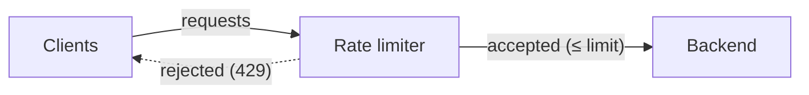
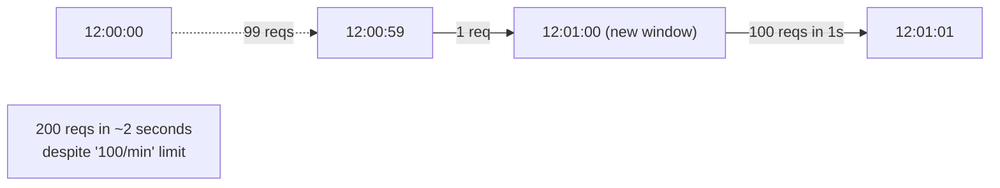

# Rate Limiting Algorithms

Rate limiting is the discipline of capping how much load a system accepts per client per time window — protecting backends from abuse, ensuring fair access, and shaping bursts into manageable streams. Every public API has rate limits; every multi-tenant system needs them; every system that retries failures needs them on itself. The naive approach ("count requests in the last minute, reject if over the limit") has subtle failure modes — burst at the window boundary, no smoothing, unfair across clients with synchronized clocks — that have produced sophisticated algorithms (token bucket, leaky bucket, sliding window, GCRA) each with measurable trade-offs.

The depth bar here is **each algorithm's actual behavior on the boundary and the steady state**. We trace fixed window (allows 2× burst at window boundary), sliding window log (memory-heavy, perfectly fair), sliding window counter (the practical default), token bucket (allows bursts up to bucket size, smooth steady-state), leaky bucket (smoothest, no burst), and the **Generic Cell Rate Algorithm (GCRA)** that ATM networks used before the web existed. We name the **distributed** rate-limiting problem — when a service has N instances and each must enforce a single global limit — and the canonical solutions (Redis Lua scripts, sliding-window counters with shared state, sentinel-based). We trace what real systems do: **Cloudflare, AWS API Gateway, Kong, NGINX, Spring Cloud Gateway, Bucket4j** — each with their algorithm choices and configurations. We cover the **HTTP semantics**: 429 Too Many Requests, the Retry-After header, the X-RateLimit-* response headers that Stripe popularized. By the end you will pick an algorithm by burst tolerance and fairness needs, implement distributed rate limiting in Spring with Redis, and refuse the most common form of rate-limiting misuse (rate-limiting the wrong dimension).

> [!NOTE]
> Prerequisites: [API Gateway & Service Mesh](../C01-software-architecture/T07-api-gateway-and-service-mesh.md) (where rate limiting often lives), [Caching](./T11-caching-strategies-at-scale.md) (rate-limit state is itself a cache).

## Where Rate Limiting Came From — From Network Routers To Modern API Quotas

Rate limiting has a 40-year history that spans network engineering (1980s), early internet abuse (1990s), and modern API protection (2010s). The specific algorithms (token bucket, leaky bucket, sliding window) descend from network traffic shaping in the 1980s — applied to a problem that didn't exist yet.

### The 1980s — Network Traffic Shaping

The conceptual foundation is **traffic shaping in network routers**. As ATM (Asynchronous Transfer Mode) networks emerged in the late 1980s, network engineers needed mechanisms to *smooth* bursty traffic into steady streams matching the network's capacity.

The canonical algorithms developed for this:

#### Token Bucket

**Token Bucket** is described in early 1980s networking literature. The mechanism: tokens are added to a bucket at a constant rate; each packet consumes a token; if the bucket is empty, the packet is delayed or dropped.

The bucket size determines burst tolerance — a bucket of 100 tokens allows bursts of up to 100 packets at once, but the steady-state rate is the token addition rate.

Token bucket is *the* canonical traffic-shaping algorithm. It's described in RFC 2697 (1999) and earlier networking texts.

#### Leaky Bucket

**Leaky Bucket** is similar but inverted: packets enter a buffer (the bucket); the buffer leaks at a constant rate, releasing one packet per time unit. If the buffer is full, new packets are dropped.

Leaky bucket is *more strict* than token bucket — it never allows bursts beyond the leak rate. Token bucket allows bursts up to the bucket size.

The two algorithms are mathematically related but produce different traffic patterns. Most modern rate limiters use token bucket because it allows occasional bursts.

### The 1990s — Internet Abuse And Early Rate Limiting

The 1990s saw the first widespread *application-level* rate limiting:

- **Email spam protection**: SMTP servers began rate-limiting per-sender to prevent spam floods.
- **Web crawler restriction**: search engines respected robots.txt rate limits.
- **Brute-force authentication protection**: login attempts were rate-limited per-IP.

These were *ad hoc* — each application implemented its own rate limiting, often poorly. The algorithms used were typically simple (fixed-window counts).

### The 2000s — DoS Defense

The 2000s brought **denial-of-service attacks** as a major concern. The famous 2000 attacks on Yahoo, eBay, Amazon, and CNN demonstrated that internet services could be brought down by *coordinated* request floods.

DoS defense required rate limiting at the network edge. Tools like:

- **Hardware DDoS appliances**: Arbor Networks, Riverhead Networks (acquired by Cisco).
- **Cloud DDoS services**: Akamai (Prolexic), CloudFlare.

These applied rate limiting at the *infrastructure* layer, before requests reached applications.

### The 2010s — API Rate Limiting Standardization

The 2010s saw rate limiting become a *standard API feature*. The shift was driven by:

1. **API platforms** (Twilio, Stripe, GitHub, Twitter): all imposed rate limits.
2. **Standardization** of rate-limit headers (`X-RateLimit-Limit`, `X-RateLimit-Remaining`, `X-RateLimit-Reset`).
3. **Distributed rate limiting** challenges as APIs scaled.

The GitHub API rate limit became famous: 5,000 requests/hour for authenticated users. Twitter's rate limit (180 requests/15 minutes for most endpoints) was equally well-known. Developers learned to *respect* rate limits as a normal API constraint.

### The Modern Distributed Rate Limiting Era

Modern systems implement rate limiting at scale using:

- **Redis-based**: token buckets stored in Redis, atomic operations via Lua scripts.
- **Sliding window logs**: log of recent requests, queried for window count.
- **Sliding window counters**: hybrid that approximates sliding window with bucket counts.
- **Edge rate limiting**: CDN-level (Cloudflare, Akamai) for early defense.

The challenge is *distributed consistency* — rate limiters running on many machines must agree on the count. Various trade-offs between accuracy and performance are made.

## Why Rate Limiting Matters, Specifically: The Senior Engineer's Q&A

### Q1: Why is rate limiting necessary?

Three primary reasons:

1. **Resource protection**: prevent a few users from overwhelming the system.
2. **Cost control**: prevent abuse from running up cloud bills.
3. **Fairness**: ensure all users get reasonable service.

Without rate limiting, a few users can degrade service for everyone. With it, the system degrades gracefully under load.

### Q2: When should I use token bucket vs sliding window?

**Token bucket**:
- Allows controlled bursts.
- Memory-efficient (one counter per user).
- Standard for most API rate limiting.

**Sliding window**:
- Smoother rate limiting (no burst-window edge effects).
- More accurate.
- More expensive (window logs require more memory).

Most APIs use token bucket for its simplicity. Sliding window is appropriate for precise rate enforcement.

### Q3: What's the right rate limit to set?

It depends on:

- **Server capacity**: don't set higher than the server can serve.
- **Use case**: API users vs anonymous users vs partners get different limits.
- **Fairness goals**: how to allocate capacity across users.

The pragmatic approach: start conservative, monitor, adjust based on actual usage.

### Q4: How do I implement distributed rate limiting?

Two main approaches:

1. **Centralized state**: store rate-limit counts in Redis. All instances check Redis. Atomicity via Lua scripts.
2. **Distributed agreement**: each instance maintains local counts, periodically syncs. Less accurate but lower-latency.

Centralized Redis is the standard for most use cases. Distributed agreement is appropriate for ultra-low-latency needs.

### Q5: How should I handle rate-limited requests?

Per the HTTP standard:

- **429 Too Many Requests** response code.
- **`Retry-After` header** indicating when to retry.
- **Rate-limit headers** showing remaining capacity.

The client SDK should *respect* these headers — backoff, retry after the specified time. Most modern SDKs do this automatically.

## Common Misconceptions Explained

### "Rate limiting is just about throttling abuse."

Partial. Rate limiting protects against abuse but also against *honest mistakes* (a client in a loop, a faulty integration). Both produce overload.

### "Rate limits should be per-IP."

False. Per-IP can be inappropriate (NAT means many users share an IP) or insufficient (a single user with many IPs). Most APIs rate-limit per-API-key.

### "Token bucket is always better than leaky bucket."

Half true. Token bucket allows bursts; leaky bucket smooths them. The choice depends on what you want.

### "Rate limiting should reject excess requests."

Not always. Three options: reject (429), queue, or shed (silently drop). Queueing is appropriate when the client can wait; shedding is appropriate when reliability is more important than completeness.

### "Distributed rate limiting requires consensus."

False. Most distributed rate limiting uses *centralized state* (Redis with Lua), not consensus protocols. Consensus would be overkill.

### "Rate limits eliminate DoS attacks."

False. **Rate limits help with abuse** but don't stop true DoS attacks (which can saturate the network before reaching the rate limiter). Network-layer DDoS defense (CDN, BGP) handles those.

## Why Rate Limit

Three reasons:

1. **Abuse protection**: a misbehaving client (intentional or not) flooding a service. Cap at a sane per-client level.
2. **Fairness across tenants**: multi-tenant systems must prevent one tenant's bad day from harming others.
3. **Backend protection**: the rate limit at the edge protects the database from a stampede.



## The Algorithms

### Fixed Window

Divide time into windows (each minute, each hour). Count requests per client per window. Reject if count exceeds limit.

```java
class FixedWindow {
  long windowStart = System.currentTimeMillis();
  AtomicInteger count = new AtomicInteger();
  final int limit = 100;
  final long windowMs = 60_000;

  boolean allow() {
    long now = System.currentTimeMillis();
    if (now - windowStart > windowMs) {
      windowStart = now;
      count.set(0);
    }
    return count.incrementAndGet() <= limit;
  }
}
```

**Pros**: simplest; one integer per client.

**Cons**: the **boundary burst** — a client can make 100 requests at 12:00:59 and 100 more at 12:01:00, hitting 200 requests in two seconds while "100 per minute" appears respected.



### Sliding Window Log

Store each request's timestamp; count requests in the last N seconds.

```java
class SlidingLog {
  Deque<Long> timestamps = new ArrayDeque<>();
  final int limit = 100;
  final long windowMs = 60_000;

  synchronized boolean allow() {
    long now = System.currentTimeMillis();
    while (!timestamps.isEmpty() && now - timestamps.peekFirst() > windowMs) {
      timestamps.pollFirst();
    }
    if (timestamps.size() < limit) {
      timestamps.addLast(now);
      return true;
    }
    return false;
  }
}
```

**Pros**: perfectly accurate.

**Cons**: memory proportional to limit (storing N timestamps per client); at 100,000 clients × 100-req limit = 10M timestamps.

### Sliding Window Counter

A practical hybrid: track the count for the current window AND a weighted portion of the previous window.

```java
class SlidingCounter {
  long currentWindow = System.currentTimeMillis() / 60_000;
  AtomicInteger currentCount = new AtomicInteger();
  AtomicInteger previousCount = new AtomicInteger();
  final int limit = 100;

  synchronized boolean allow() {
    long now = System.currentTimeMillis();
    long thisWindow = now / 60_000;
    if (thisWindow > currentWindow) {
      previousCount.set(currentCount.get());
      currentCount.set(0);
      currentWindow = thisWindow;
    }
    double pctOfPrev = 1.0 - ((now % 60_000) / 60_000.0);
    int effective = (int)(previousCount.get() * pctOfPrev) + currentCount.get();
    if (effective < limit) {
      currentCount.incrementAndGet();
      return true;
    }
    return false;
  }
}
```

**Pros**: smooths out boundary bursts; two counters per client; standard in production rate limiters.

**Cons**: slight imprecision; assumes uniform distribution within the previous window.

**This is the practical default** — used by NGINX, Cloudflare, Kong, and most production systems.

### Token Bucket

Each client has a bucket holding up to `capacity` tokens; tokens refill at a constant rate; each request consumes one token; reject if bucket is empty.

```java
class TokenBucket {
  final int capacity = 100;
  final double tokensPerSecond = 100.0 / 60;  // 100 per minute
  double tokens;
  long lastRefill = System.nanoTime();

  synchronized boolean allow() {
    long now = System.nanoTime();
    tokens = Math.min(capacity, tokens + (now - lastRefill) * tokensPerSecond / 1_000_000_000);
    lastRefill = now;
    if (tokens >= 1) {
      tokens -= 1;
      return true;
    }
    return false;
  }
}
```

**Pros**: allows bursts up to `capacity`; smooth steady state at refill rate; intuitive ("save up to N tokens, spend them when you need").

**Cons**: bursts are by design — protects steady-state load, allows occasional spikes.

Token bucket is *the* algorithm for APIs where occasional bursts are fine and steady-state is the constraint. **AWS API Gateway, Stripe API, GitHub API** all use token bucket variants.

### Leaky Bucket

Imagine a bucket with a hole that leaks at a fixed rate. Requests fill the bucket; if it overflows, reject. The leak rate is the request rate; the bucket capacity is the burst tolerance.

Operationally similar to token bucket but framed as smoothing rather than allowance — useful when you want to *queue* requests to a fixed-rate downstream rather than reject.

### GCRA (Generic Cell Rate Algorithm)

Used in ATM networks (the telephony network protocol, not the bank thing). Mathematically equivalent to leaky bucket but implemented with O(1) state (the time of the next allowed cell). Cloudflare's open-source `gcra-go` implements it; widely used in Cloudflare's WAF.

## Distributed Rate Limiting

The hard problem: a service has 50 instances; the rate limit is "100 req/min per API key globally"; each instance can't enforce its own 100. The state must be shared.

### Redis-Based Rate Limiting

```java
// Sliding-window counter in Redis (via Lua script for atomicity)
String script = """
  local key = KEYS[1]
  local window = tonumber(ARGV[1])
  local limit = tonumber(ARGV[2])
  local now = tonumber(ARGV[3])
  local windowStart = math.floor(now / window) * window
  local currentKey = key .. ':' .. windowStart
  local count = tonumber(redis.call('GET', currentKey) or '0')
  if count < limit then
    redis.call('INCR', currentKey)
    redis.call('EXPIRE', currentKey, window * 2)
    return 1
  end
  return 0
""";
boolean allowed = redis.eval(script, Keys.of("rl:" + apiKey),
    Args.of("60000", "100", System.currentTimeMillis())) == 1L;
```

Redis Lua scripts ensure atomicity; the state is shared across all app instances; the cost is one Redis call per request.

For very high throughput, **batch the counter updates** locally and sync to Redis periodically — at the cost of being approximate.

### Sentinel / Resilience Patterns

**Sentinel** (Alibaba's flow-control library) and **Resilience4j RateLimiter** provide in-process rate limiting; combine with Redis-shared state for distributed enforcement.

## HTTP Semantics

When a rate limit is exceeded, the standard response is HTTP **429 Too Many Requests** with a **Retry-After** header indicating when the client may retry.

```http
HTTP/1.1 429 Too Many Requests
Retry-After: 60
X-RateLimit-Limit: 100
X-RateLimit-Remaining: 0
X-RateLimit-Reset: 1736353200
```

**X-RateLimit-* headers** (Stripe popularized; not standard but widely adopted):

- `X-RateLimit-Limit`: the cap.
- `X-RateLimit-Remaining`: how many requests are left in the current window.
- `X-RateLimit-Reset`: unix timestamp when the window resets.

Modern clients (Stripe SDK, GitHub Octokit) read these headers to schedule retries intelligently. Returning them is good citizenship.

## Spring Cloud Gateway Rate Limiter

```yaml
spring:
  cloud:
    gateway:
      routes:
      - id: orders
        uri: lb://order-service
        predicates: [Path=/api/v1/orders/**]
        filters:
        - name: RequestRateLimiter
          args:
            redis-rate-limiter.replenishRate: 100      # tokens per second
            redis-rate-limiter.burstCapacity: 200      # bucket size
            redis-rate-limiter.requestedTokens: 1
            key-resolver: "#{@userKeyResolver}"
```

The built-in implementation uses Redis + Lua for token-bucket distributed rate limiting. `key-resolver` is a bean returning the rate-limit key (user ID, API key, IP).

## Bucket4j — Token Bucket For Java

[Bucket4j](https://bucket4j.com/) is the standard Java rate-limiting library, providing token bucket with multiple backends (in-memory, Hazelcast, Redis, Coherence).

```java
Bucket bucket = Bucket.builder()
    .addLimit(Bandwidth.classic(100, Refill.intervally(100, Duration.ofMinutes(1))))
    .build();

if (bucket.tryConsume(1)) {
  // process request
} else {
  // 429
}
```

Distributed bucket via Redis:

```java
ProxyManager<String> manager = Bucket4jRedis.casBased(redisClient);
Bucket bucket = manager.getProxy(apiKey,
    () -> BucketConfiguration.builder()
        .addLimit(Bandwidth.classic(100, Refill.intervally(100, Duration.ofMinutes(1))))
        .build());
```

## Choosing The Rate-Limit Dimension

A rate limit applies to *some* identifier. Common choices:

- **Per IP**: simplest; bad for clients behind NAT or proxies (all see one IP).
- **Per API key / per user**: most common for authenticated APIs.
- **Per endpoint per user**: different limits for different endpoints (cheap reads at 1000/min, expensive operations at 10/min).
- **Per tenant**: in a multi-tenant SaaS, limits enforced at the tenant level.
- **Per IP-and-user**: defense against credential-stuffing.

Most production rate limiters layer multiple dimensions — e.g., per-IP at the edge, per-user at the application, per-endpoint nested.

## Rate-Limiting At Multiple Layers

- **CDN edge (Cloudflare, CloudFront)**: gross abuse defense, very high limits.
- **API gateway (Kong, Spring Cloud Gateway, AWS API Gateway)**: per-API-key fine-grained.
- **Application service**: per-operation business limits.
- **Database / cache**: connection-level limits (don't exceed connection pool).

Each layer protects the next. The CDN absorbs DDoS; the gateway enforces customer plans; the service enforces business rules.

## Common Failure Modes

### Rate-Limit Bypass Via Distributed Clients

A client distributes its requests across 50 IPs. Per-IP limit doesn't catch them. Combine with per-user or per-API-key limits.

### Synchronous Retry Storm

The rate limit returns 429; clients retry immediately without backoff; the retry traffic itself exceeds the limit. Now the client is in a tight loop.

**Fix**: clients must respect `Retry-After`; exponential backoff on 429. Stripe's SDK does this by default; ad-hoc HTTP clients often don't.

### Burst Inside The Limit

Token bucket with capacity 100 allows 100 in one millisecond. Some downstream resources can't absorb that burst.

**Fix**: smaller burst capacity; or combine with a leaky-bucket smoothing step.

### State Drift Across Instances

Redis-based shared state goes down; instances fall back to in-memory limits; effective limit becomes N × intended.

**Fix**: monitor Redis availability; degrade to stricter local limits when Redis is unreachable.

### Hot Tenant Hot Partition

Rate-limit state is in Redis sharded by tenant; one tenant has 99% of traffic; one Redis shard saturates.

**Fix**: partition by composite key (tenant + endpoint), shard more, or use a CDN's distributed rate-limiting.

## Trade-Off Summary

| Algorithm | Burst | Memory | Fairness | When to use |
|-----------|:-----:|:------:|:--------:|-------------|
| Fixed window | High (boundary) | O(1) | Poor | Simple, low-stakes |
| Sliding window log | None | O(N) | Perfect | Small N, strict accuracy |
| Sliding window counter | Low | O(1) | Good | Default for HTTP APIs |
| Token bucket | Configurable | O(1) | Good | APIs allowing controlled bursts |
| Leaky bucket | None | O(1) | Good | Smoothing into a fixed-rate downstream |
| GCRA | Equivalent to leaky bucket | O(1) | Good | High-throughput edge enforcement |

> [!INTERVIEW]
> A common L5 prompt: "Design a rate limiter." Strong answers (a) pick an algorithm justified by burst tolerance and fairness, (b) handle the distributed-state problem (Redis Lua, sharded sentinel), (c) return 429 with Retry-After, (d) name the layer (CDN, gateway, app) where each limit lives.

## Deeper Dive — All Five Algorithms in Java

### Algorithm 1: Fixed Window Counter

```java
public class FixedWindowRateLimiter {
    private final int limit;
    private final long windowMs;
    private final AtomicLong windowStart;
    private final AtomicInteger count;

    public FixedWindowRateLimiter(int limit, long windowMs) {
        this.limit = limit;
        this.windowMs = windowMs;
        this.windowStart = new AtomicLong(System.currentTimeMillis());
        this.count = new AtomicInteger(0);
    }

    public boolean allowRequest() {
        long now = System.currentTimeMillis();
        long currentWindow = now - (now % windowMs);
        
        if (windowStart.get() < currentWindow) {
            // Reset window
            windowStart.set(currentWindow);
            count.set(0);
        }
        
        if (count.incrementAndGet() <= limit) {
            return true;
        }
        return false;
    }
}

// Usage
FixedWindowRateLimiter limiter = new FixedWindowRateLimiter(100, 60_000);

// PROBLEM: Boundary burst
// At 11:59:59 — 100 requests allowed (window: 11:59:00-12:00:00)
// At 12:00:00 — 100 more allowed (new window: 12:00:00-12:01:00)
// Result: 200 requests in 1 second (2× the intended rate)
```

### Algorithm 2: Sliding Window Log

```java
public class SlidingWindowLogRateLimiter {
    private final int limit;
    private final long windowMs;
    private final ConcurrentLinkedDeque<Long> requestTimestamps;

    public SlidingWindowLogRateLimiter(int limit, long windowMs) {
        this.limit = limit;
        this.windowMs = windowMs;
        this.requestTimestamps = new ConcurrentLinkedDeque<>();
    }

    public synchronized boolean allowRequest() {
        long now = System.currentTimeMillis();
        long windowStart = now - windowMs;
        
        // Remove timestamps outside window
        while (!requestTimestamps.isEmpty() && requestTimestamps.peekFirst() < windowStart) {
            requestTimestamps.pollFirst();
        }
        
        if (requestTimestamps.size() < limit) {
            requestTimestamps.offerLast(now);
            return true;
        }
        return false;
    }
}

// Pros: Exact - no boundary issues
// Cons: O(N) memory per key (every request stored)
//       At 1M req/s × 60s window = 60M entries per key
```

### Algorithm 3: Sliding Window Counter (Recommended Default)

```java
public class SlidingWindowCounterRateLimiter {
    private final int limit;
    private final long windowMs;
    private long previousWindowCount;
    private long currentWindowCount;
    private long currentWindowStart;

    public SlidingWindowCounterRateLimiter(int limit, long windowMs) {
        this.limit = limit;
        this.windowMs = windowMs;
        this.currentWindowStart = currentWindow();
    }

    public synchronized boolean allowRequest() {
        long now = System.currentTimeMillis();
        long currentWindow = now - (now % windowMs);
        
        if (currentWindow > currentWindowStart) {
            // Shift windows
            previousWindowCount = currentWindowCount;
            currentWindowCount = 0;
            currentWindowStart = currentWindow;
        }
        
        // Calculate effective count using weighted previous window
        long elapsedInCurrent = now - currentWindowStart;
        double fractionOfCurrent = (double) elapsedInCurrent / windowMs;
        double fractionOfPrevious = 1.0 - fractionOfCurrent;
        
        double effectiveCount = currentWindowCount + 
            previousWindowCount * fractionOfPrevious;
        
        if (effectiveCount < limit) {
            currentWindowCount++;
            return true;
        }
        return false;
    }

    private long currentWindow() {
        long now = System.currentTimeMillis();
        return now - (now % windowMs);
    }
}

// Pros: O(1) memory, O(1) time
//       Smooths boundary issue (interpolates)
//       Default choice for HTTP APIs
// Cons: Approximation (assumes uniform distribution in previous window)
```

### Algorithm 4: Token Bucket

```java
public class TokenBucketRateLimiter {
    private final long capacity;
    private final long refillTokensPerInterval;
    private final long refillIntervalMs;
    private double tokens;
    private long lastRefillTimestamp;

    public TokenBucketRateLimiter(long capacity, long refillTokensPerInterval, long refillIntervalMs) {
        this.capacity = capacity;
        this.refillTokensPerInterval = refillTokensPerInterval;
        this.refillIntervalMs = refillIntervalMs;
        this.tokens = capacity;
        this.lastRefillTimestamp = System.currentTimeMillis();
    }

    public synchronized boolean allowRequest(long tokensRequested) {
        refill();
        
        if (tokens >= tokensRequested) {
            tokens -= tokensRequested;
            return true;
        }
        return false;
    }

    public boolean allowRequest() {
        return allowRequest(1);
    }

    private void refill() {
        long now = System.currentTimeMillis();
        long elapsed = now - lastRefillTimestamp;
        
        double tokensToAdd = ((double) elapsed / refillIntervalMs) * refillTokensPerInterval;
        tokens = Math.min(capacity, tokens + tokensToAdd);
        lastRefillTimestamp = now;
    }
}

// Pros: Configurable burst (capacity vs steady rate)
//       Stripe, AWS use this
// Cons: Slightly more complex
```

### Algorithm 5: Leaky Bucket

```java
public class LeakyBucketRateLimiter {
    private final long capacity;
    private final long leakRatePerSecond;
    private final BlockingQueue<Request> queue;
    private final ExecutorService leaker;

    public LeakyBucketRateLimiter(long capacity, long leakRatePerSecond) {
        this.capacity = capacity;
        this.leakRatePerSecond = leakRatePerSecond;
        this.queue = new ArrayBlockingQueue<>((int) capacity);
        this.leaker = Executors.newSingleThreadExecutor();
        startLeaker();
    }

    public boolean allowRequest(Request request) {
        return queue.offer(request);  // Returns false if full
    }

    private void startLeaker() {
        leaker.submit(() -> {
            long intervalNs = TimeUnit.SECONDS.toNanos(1) / leakRatePerSecond;
            while (!Thread.currentThread().isInterrupted()) {
                Request req = queue.poll();
                if (req != null) {
                    req.process();
                }
                LockSupport.parkNanos(intervalNs);
            }
        });
    }
}

// Pros: Smooths bursts into steady output rate
//       Ideal for traffic shaping into a fixed-rate downstream
// Cons: Adds latency (requests wait in queue)
//       Not ideal for user-facing APIs
```

## Deeper Dive — Distributed Rate Limiter (Redis Lua)

### Sliding Window Counter in Redis

```lua
-- KEYS[1] = bucket key
-- ARGV[1] = max requests
-- ARGV[2] = window in seconds
-- ARGV[3] = current timestamp in ms

local key = KEYS[1]
local limit = tonumber(ARGV[1])
local window = tonumber(ARGV[2]) * 1000
local now = tonumber(ARGV[3])
local currentWindowStart = math.floor(now / window) * window
local previousWindowStart = currentWindowStart - window

local currentCount = tonumber(redis.call('GET', key .. ':' .. currentWindowStart) or "0")
local previousCount = tonumber(redis.call('GET', key .. ':' .. previousWindowStart) or "0")

local elapsedInCurrent = now - currentWindowStart
local fractionOfCurrent = elapsedInCurrent / window
local fractionOfPrevious = 1.0 - fractionOfCurrent

local effectiveCount = currentCount + previousCount * fractionOfPrevious

if effectiveCount < limit then
    redis.call('INCR', key .. ':' .. currentWindowStart)
    redis.call('EXPIRE', key .. ':' .. currentWindowStart, math.ceil(window * 2 / 1000))
    return {1, limit - math.floor(effectiveCount) - 1}
else
    return {0, 0}
end
```

### Spring Boot Integration

```java
@Service
public class RedisRateLimiter {
    private final StringRedisTemplate redis;
    private final DefaultRedisScript<List> script;

    public RedisRateLimiter(StringRedisTemplate redis) {
        this.redis = redis;
        this.script = new DefaultRedisScript<>();
        script.setLocation(new ClassPathResource("rate-limiter.lua"));
        script.setResultType(List.class);
    }

    public RateLimitResult checkLimit(String key, int limit, long windowSeconds) {
        Long now = System.currentTimeMillis();
        
        List<Long> result = redis.execute(
            script,
            List.of(key),
            String.valueOf(limit),
            String.valueOf(windowSeconds),
            String.valueOf(now)
        );
        
        boolean allowed = result.get(0) == 1L;
        long remaining = result.get(1);
        
        return new RateLimitResult(allowed, remaining);
    }
}

public record RateLimitResult(boolean allowed, long remaining) {}
```

## Deeper Dive — Spring Cloud Gateway Configuration

```yaml
spring:
  cloud:
    gateway:
      routes:
        - id: api-route
          uri: lb://api-service
          predicates:
            - Path=/api/**
          filters:
            - name: RequestRateLimiter
              args:
                redis-rate-limiter.replenishRate: 10
                redis-rate-limiter.burstCapacity: 20
                redis-rate-limiter.requestedTokens: 1
                key-resolver: "#{@userKeyResolver}"
```

```java
@Configuration
public class RateLimitConfig {
    
    @Bean
    public KeyResolver userKeyResolver() {
        // Per-user rate limiting
        return exchange -> Mono.just(
            exchange.getRequest().getHeaders().getFirst("X-User-Id")
        );
    }
    
    @Bean
    public KeyResolver ipKeyResolver() {
        // Per-IP rate limiting
        return exchange -> Mono.just(
            exchange.getRequest().getRemoteAddress().getAddress().getHostAddress()
        );
    }
}
```

## Deeper Dive — Bucket4j Library (Java Token Bucket)

```java
@Service
public class Bucket4jRateLimiter {
    private final Map<String, Bucket> buckets = new ConcurrentHashMap<>();

    public Bucket newBucket(String key, int limit, Duration window) {
        return Bucket.builder()
            .addLimit(Bandwidth.simple(limit, window))
            .build();
    }

    public boolean tryConsume(String key, int limit, Duration window) {
        Bucket bucket = buckets.computeIfAbsent(key, 
            k -> newBucket(k, limit, window));
        return bucket.tryConsume(1);
    }

    public ConsumptionProbe tryConsumeWithProbe(String key, int limit, Duration window) {
        Bucket bucket = buckets.computeIfAbsent(key,
            k -> newBucket(k, limit, window));
        return bucket.tryConsumeAndReturnRemaining(1);
    }
}

// Web filter usage
@Component
public class RateLimitFilter extends OncePerRequestFilter {
    private final Bucket4jRateLimiter limiter;
    
    @Override
    protected void doFilterInternal(HttpServletRequest req,
                                     HttpServletResponse resp,
                                     FilterChain chain) throws ServletException, IOException {
        String key = extractKey(req);
        
        ConsumptionProbe probe = limiter.tryConsumeWithProbe(key, 100, Duration.ofMinutes(1));
        
        if (probe.isConsumed()) {
            resp.setHeader("X-RateLimit-Remaining", String.valueOf(probe.getRemainingTokens()));
            chain.doFilter(req, resp);
        } else {
            long waitMs = probe.getNanosToWaitForRefill() / 1_000_000;
            resp.setStatus(HttpStatus.TOO_MANY_REQUESTS.value());
            resp.setHeader("Retry-After", String.valueOf(waitMs / 1000));
            resp.getWriter().write("Rate limit exceeded");
        }
    }
}
```

## Deeper Dive — Multi-Layer Rate Limiting

```
LAYER 1: CDN / WAF (Cloudflare, AWS WAF)
  - Coarse: 1000 req/sec per IP
  - Blocks volumetric DDoS
  - At edge for low latency

LAYER 2: API Gateway (Kong, AWS API Gateway, Spring Cloud Gateway)
  - Medium: 100 req/sec per API key
  - Enforces per-tenant quotas
  - Returns 429 with Retry-After

LAYER 3: Application
  - Fine: 10 req/sec per user per endpoint
  - Business logic constraints
  - Cost controls (e.g., expensive ML calls)

LAYER 4: Database
  - Backstop: query cost limits
  - Connection pool limits
  - Slow query timeouts
```

### Multi-Tenant Per-Endpoint Configuration

```java
@Service
public class TenantRateLimiter {
    
    public RateLimit getLimit(String tenantId, String endpoint) {
        Tenant tenant = tenantRepo.findById(tenantId).orElseThrow();
        TenantPlan plan = tenant.getPlan();
        
        return switch (plan) {
            case FREE -> getFreeLimit(endpoint);
            case STARTER -> getStarterLimit(endpoint);
            case ENTERPRISE -> getEnterpriseLimit(endpoint);
        };
    }
    
    private RateLimit getFreeLimit(String endpoint) {
        return switch (endpoint) {
            case "/api/search" -> new RateLimit(10, Duration.ofMinutes(1));
            case "/api/ml-inference" -> new RateLimit(5, Duration.ofMinutes(1));
            default -> new RateLimit(100, Duration.ofMinutes(1));
        };
    }
}
```

## Deeper Dive — HTTP Semantics for Rate Limiting

### Response Headers

```
HTTP/1.1 429 Too Many Requests
Content-Type: application/json
X-RateLimit-Limit: 100
X-RateLimit-Remaining: 0
X-RateLimit-Reset: 1700000060
Retry-After: 60
RateLimit-Policy: 100;w=60
RateLimit-Limit: 100
RateLimit-Remaining: 0
RateLimit-Reset: 60

{
  "error": "rate_limited",
  "message": "Too many requests. Try again in 60 seconds."
}
```

### Client Implementation

```java
@Component
public class RateLimitAwareHttpClient {
    private final RestTemplate restTemplate;

    public <T> T request(String url, Class<T> responseType) {
        int maxRetries = 3;
        for (int attempt = 0; attempt < maxRetries; attempt++) {
            try {
                return restTemplate.getForObject(url, responseType);
            } catch (HttpClientErrorException.TooManyRequests e) {
                String retryAfter = e.getResponseHeaders()
                    .getFirst(HttpHeaders.RETRY_AFTER);
                
                long waitSeconds = parseRetryAfter(retryAfter);
                if (waitSeconds > 60) {
                    throw new RateLimitExceededException("Wait too long", e);
                }
                
                try {
                    Thread.sleep(Duration.ofSeconds(waitSeconds).toMillis());
                } catch (InterruptedException ie) {
                    Thread.currentThread().interrupt();
                    throw new RuntimeException(ie);
                }
            }
        }
        throw new RateLimitExceededException("Max retries reached");
    }
}
```

## Deeper Dive — Common Failure Modes and Solutions

### Failure Mode 1: Boundary Burst (Fixed Window)

```
PROBLEM:
  Window: 1 minute, limit: 100 req/min
  At 11:59:59 - 100 requests allowed
  At 12:00:00 - new window, 100 more allowed
  → 200 requests in 1 second

SOLUTION: Use sliding window counter instead
```

### Failure Mode 2: Distributed Inconsistency

```
PROBLEM:
  Multiple app instances, each enforcing 100 req/sec locally
  Actual rate: 100 × (instances) = 1000 req/sec

SOLUTION: Centralized state in Redis with Lua scripts
```

### Failure Mode 3: Memory Explosion (Sliding Window Log)

```
PROBLEM:
  Store every request timestamp
  Hot endpoint: 10K req/sec × 60s window = 600K entries per key
  10K hot keys = 6B entries

SOLUTION: Use sliding window counter (O(1) memory) or token bucket
```

### Failure Mode 4: Clock Skew

```
PROBLEM:
  Distributed systems with different clocks
  One node thinks "now" is 12:00:00
  Another thinks 12:00:01
  Rate limit calculations diverge

SOLUTION: Use single source of time (Redis timestamps)
          Don't trust client/local clocks
```

### Failure Mode 5: Hot Key

```
PROBLEM:
  One API key sends 1M req/sec
  All hashed to same Redis shard
  Shard saturates

SOLUTION: 
  - Pre-shard hot keys (key1#shard1, key1#shard2)
  - Local approximate limit + periodic sync
  - Reject early at gateway
```

## Practice

1. **Implement each algorithm.** In Java, implement fixed window, sliding-window counter, token bucket. Run a microbenchmark; compare allowed/rejected counts under a burst.
2. **Show the boundary burst.** Drive 100 requests at 12:00:59 and 100 at 12:01:00 against your fixed-window. Show the 200-in-2-seconds problem.
3. **Bucket4j in Spring.** Add Bucket4j as a Spring filter for a REST API. Test per-API-key limiting.
4. **Redis distributed rate limiter.** Implement a sliding-window-counter rate limiter in Redis Lua. Run across multiple JVM instances; verify the limit holds globally.
5. **Spring Cloud Gateway rate limiter.** Configure `RequestRateLimiter` on a real Spring Cloud Gateway route. Test under burst.
6. **Layered limits.** Design a system with three layers (CDN, gateway, app) each with different limits. Verify each layer enforces its own.
7. **Retry-After handling.** Implement a client that respects `Retry-After`. Test against a deliberately-rate-limited endpoint.
8. **Per-tenant per-endpoint.** Design rate limits for a multi-tenant SaaS with different limits per endpoint per tenant. Justify the algorithm and dimension choices.
9. **Production trace.** In any system you operate, find the rate-limit configuration. Identify the algorithm, the dimension, the limits. Decide whether they're correct.
10. **The skeptic conversation.** A senior engineer says "we don't need rate limits, our customers won't abuse." Write a 200-word response on the four non-malicious causes of unintended bursts.

## Recap

You should now be able to:

- Apply **fixed window, sliding window log, sliding window counter, token bucket, leaky bucket, GCRA** algorithms with explicit burst and memory characteristics.
- Recognize the **boundary burst** problem of fixed windows and prefer sliding-window counter as the practical default.
- Implement **distributed rate limiting** with Redis Lua scripts to share state across N instances.
- Use **Bucket4j** in Spring with in-memory or Redis-backed token bucket.
- Configure **Spring Cloud Gateway's RequestRateLimiter** for distributed token bucket.
- Return **HTTP 429** with Retry-After and X-RateLimit-* response headers; respect them in clients.
- Pick the **rate-limit dimension** — IP, user, API key, tenant, endpoint, composite — by the threat model.
- Apply **layered rate limits** at CDN, gateway, application, downstream resource levels.
- Recognize and prevent **failure modes**: rate-limit bypass via distributed clients, synchronous retry storms, in-burst saturation, state drift, hot partitions.
- Map real systems (Cloudflare, AWS, Kong, NGINX, Stripe) to their algorithm choices and configurations.

## Next

Continue to [Resilience (Circuit Breaker, Bulkhead, Retry, Timeout, Backpressure)](./T14-resilience-circuit-breaker-bulkhead-retry-timeout-backpressure.md) — the patterns that let a distributed system tolerate the failures that happen all the time without cascading into outage.
