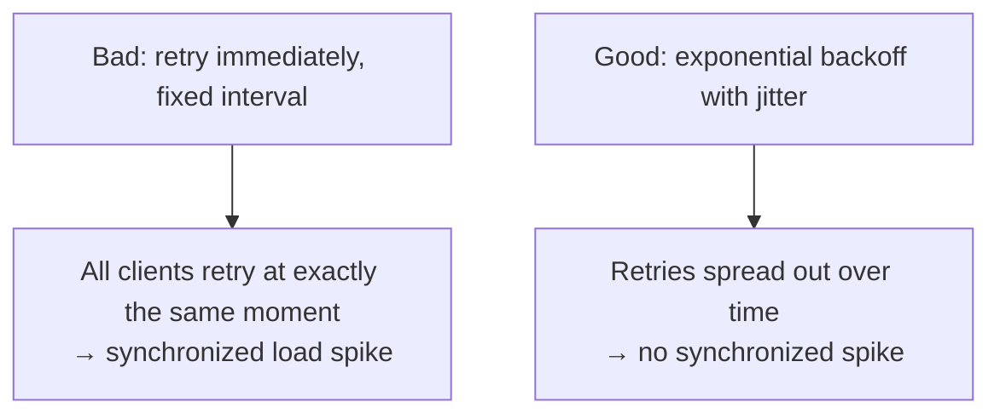
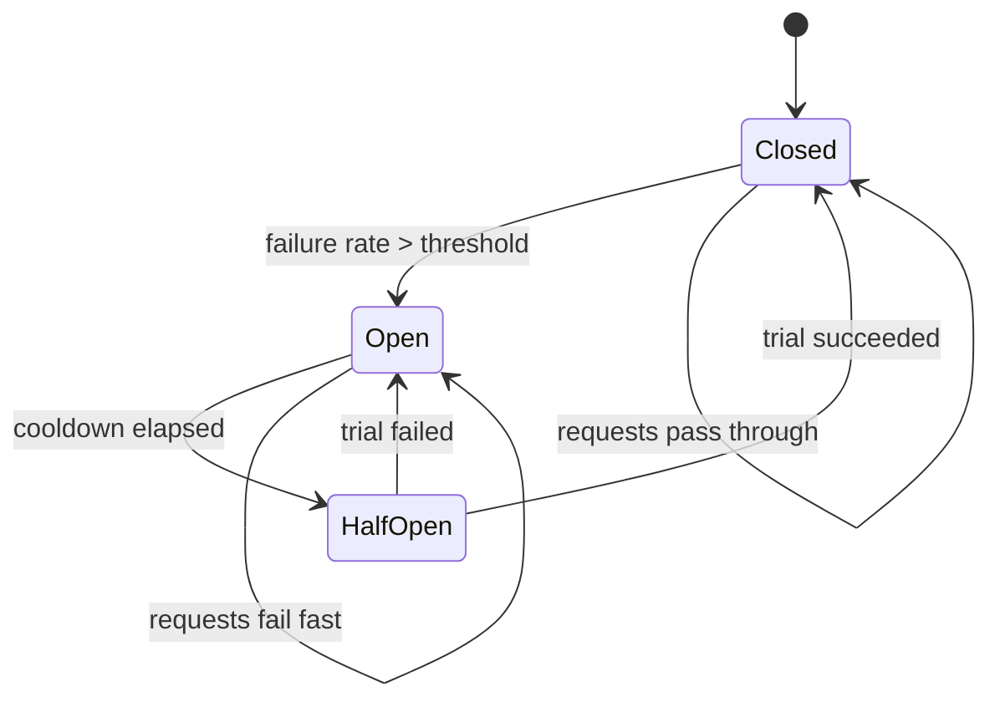
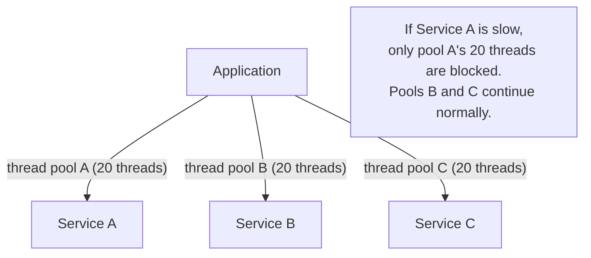

# Resilience (Circuit Breaker, Bulkhead, Retry, Timeout, Backpressure)

A microservices system depends on N other services, each of which can fail, slow down, or partition. **Without resilience patterns, every downstream failure becomes an upstream failure.** A slow database call holds a thread; threads pile up; the application can't accept new requests; the load balancer routes traffic to a thrashing instance; the system cascades. Michael Nygard's 2007 *Release It!* catalogued the patterns that prevent the cascade — **timeout** (don't wait forever), **retry** (transient errors recover), **circuit breaker** (stop calling a dead dependency), **bulkhead** (isolate failures to one compartment), **backpressure** (slow the producer when the consumer can't keep up). Each pattern addresses a specific failure mode; combined, they make distributed systems tolerable to operate.

The depth bar here is **how each pattern actually works under load, how they compose, and the failure modes when they're tuned wrong**. Tuning is the central skill: a circuit breaker with too-eager opening cuts off healthy traffic; too-lazy opening admits cascading load. A retry with no jitter produces synchronized retry storms. A timeout shorter than typical p99 latency causes spurious failures. A bulkhead sized too small under-utilizes the system; sized too large defeats the isolation purpose. We cover the **Hystrix → Resilience4j** transition (Netflix open-sourced Hystrix in 2012, then put it in maintenance mode; the JVM community moved to Resilience4j 2018+), the **Spring Cloud Circuit Breaker abstraction** (works with any backend), and the **reactive backpressure** model from Project Reactor and Reactive Streams. We name the production failures these patterns prevent: **Knight Capital 2012** (no circuit breaker on the legacy code path), **AWS S3 2017** (no fallback for sync S3 dependencies, cascade across the industry), **the 2018 Slack outage** (retries amplifying load). By the end you will configure Resilience4j with concrete numbers, recognize when a pattern is *missing* from a code review, and refuse retries that aren't paired with backoff + jitter + circuit breakers.

> [!NOTE]
> Prerequisites: [Service Communication](../C01-software-architecture/T06-service-communication-sync-vs-async.md) (synchronous communication's failure modes), [Idempotency](./T07-idempotency-and-deduplication.md) (retries require idempotency), [Load Balancing](./T10-load-balancing-algorithms-l4-l7.md) (LB-level resilience).

## Where Resilience Patterns Came From — Power Engineering, Industrial Safety, And A 2007 Book

The resilience pattern names — **circuit breaker, bulkhead, retry, timeout, backpressure** — are not software-engineering inventions. Every one is borrowed from older engineering disciplines that had already solved analogous problems. Understanding the heritage matters because each pattern carries forward *specific failure mode reasoning* from its origin field, and missing that reasoning produces shallow implementations.

### The 2007 Book That Named The Patterns: Michael Nygard's *Release It!*

The canonical software-engineering articulation of resilience patterns is **Michael Nygard's [*Release It! Design and Deploy Production-Ready Software*](https://pragprog.com/titles/mnee2/release-it-second-edition/)** (Pragmatic Bookshelf, March 2007; second edition 2018). The book is the *single most influential text on production-ready distributed systems* and is on virtually every staff-engineer reading list.

Nygard was a consulting architect at Cognitect (later Nubank) who had spent the early 2000s diagnosing post-mortem failures of newly-deployed systems. His pattern: a system that *passed all tests* in development would fail catastrophically in production within hours of launch. The failures were always cross-system, always involved cascading dependencies, and were never anticipated by the tests. He started cataloguing them.

The book's first edition (2007) named patterns that the industry had been *informally using*:
- **Circuit Breaker**
- **Bulkhead**
- **Timeout**
- **Steady State**
- **Fail Fast**
- **Handshaking**
- **Test Harness**
- **Decoupling Middleware**

Each pattern was given a *name*, a *failure scenario it addressed*, and a *concrete implementation*. The names borrowed from older disciplines, but the *systematic codification* was Nygard's contribution.

### Why "Circuit Breaker"? — The Electrical Engineering Origin

The term **circuit breaker** comes from electrical engineering, specifically the **household circuit breaker** invented incrementally between 1879 (Edison's fuse) and 1924 (Hugo Stotz's screw-in circuit breaker — the modern form).

The mechanism: an electrical circuit is monitored for *abnormal current*. If the current exceeds a threshold (indicating a short circuit or overload), the breaker *physically opens* the circuit, stopping current flow. The protection is to the *rest of the system* (preventing fire, equipment damage), not the failing circuit.

After a delay, the breaker can be reset. If the underlying problem persists, the breaker opens again. This is the **closed → open → half-open → closed** state machine you see in Resilience4j and Hystrix.

The software application of the pattern: a *service call* is the circuit. *Failures* are the abnormal current. When failures exceed a threshold, the breaker opens, stopping calls to the failing dependency, *protecting the caller from the cascade*.

The protection target is critical: **the circuit breaker protects the caller, not the callee**. The failing dependency continues to be down; the breaker just stops the caller from continuing to throw itself against it. This is the *failure containment* purpose.

### Why "Bulkhead"? — The Maritime Engineering Origin

The term **bulkhead** comes from shipbuilding. A bulkhead is a *vertical wall* inside a ship's hull that divides it into watertight compartments. If the hull is breached and water enters one compartment, the bulkheads prevent water from spreading to other compartments. The ship *takes on water* in the breached compartment but *stays afloat* because the rest is sealed.

The Titanic famously had insufficient bulkhead height — when enough compartments flooded, water spilled over the top of the bulkheads into adjacent compartments. The lesson is *implementation matters*: bulkheads work only if they're tall enough.

The software application: a *thread pool* is the compartment. If one dependency (Service B) becomes slow, threads waiting on it pile up in the pool. Without bulkheads, all threads from the application's main pool get stuck on B, and calls to healthy Services C and D also fail (no threads to handle them). With bulkheads, *each dependency has its own dedicated thread pool*. B's slowness floods only B's pool; C and D continue normally.

The Hystrix library (Netflix, 2012) implemented this literally: a `HystrixCommand` wrapping a call to Service B used a dedicated thread pool sized for B's expected concurrency. When Hystrix was deprecated in favor of Resilience4j (2018+), the bulkhead pattern survived in two forms: **thread-pool bulkhead** (same as Hystrix) and **semaphore bulkhead** (caps concurrent calls without dedicating threads).

### Why "Timeout"? — From Telephony

**Timeout** as a pattern long predates software. The earliest telephony switches (1880s) used *electromechanical timers* to disconnect calls that hadn't completed within a configured window. The motivation: a stuck call (one side hung up without notifying the switch) consumed scarce circuit resources indefinitely.

The same reasoning applies to every distributed system: a stuck call (the remote side never responds) consumes a thread, a connection, and a slot in the load balancer. Without a timeout, stuck calls accumulate until the system runs out of resources.

The deceptive simplicity: every senior engineer knows "always set a timeout," and yet *the default in many libraries is no timeout*. JDBC default for `socket_timeout`: infinite. RestTemplate default in old Spring versions: no read timeout. Java's `HttpURLConnection`: no read timeout unless explicitly set. These defaults have caused thousands of production incidents — the engineer assumed the library had a sensible default; the library didn't.

The senior practice: **timeout configuration is the first thing checked in any library integration**, regardless of language or framework. Trust no default.

### Why "Retry"? — From Network Protocols

Retry with exponential backoff comes from the **Ethernet collision resolution protocol** (Metcalfe and Boggs, 1976). When two devices on the same Ethernet segment transmitted simultaneously, they collided. The protocol's response: each device waited a *random* time, then retried. If they collided again, they waited longer (doubling the backoff window). This was called **truncated binary exponential backoff** in the 1976 paper.

The TCP/IP retransmission algorithm (TCP, 1981) used the same approach for lost packets. By the time DNS (1983) and HTTP/1.1 (1997) were standardized, exponential backoff was the canonical "try again, but politely" pattern.

The deep insight: **synchronized retries amplify failures**. If 1,000 clients all retry simultaneously after seeing a failure, the second wave of traffic is identical to the first — same simultaneous burst. Backoff with *randomization* (jitter) breaks the synchronization. AWS's [Architecture Blog post on exponential backoff and jitter](https://aws.amazon.com/blogs/architecture/exponential-backoff-and-jitter/) (2015) is the canonical modern articulation; jitter is now considered part of the standard retry pattern.

### Why "Backpressure"? — From Hydraulics

**Backpressure** is a term from fluid dynamics: the resistance to flow caused by downstream conditions. In a hydraulic system, if the downstream valve is partially closed, pressure builds up upstream. The upstream pump *senses* the pressure and (if well-designed) reduces its output rate to match the downstream capacity.

The software application: a producer (data source) is generating events faster than a consumer can process them. Without backpressure, events buffer until memory is exhausted, then are dropped or cause an OOM crash. *With* backpressure, the consumer signals "I can handle N more events," and the producer respects the demand.

The **Reactive Streams** specification (Lightbend, Netflix, Pivotal, Twitter, 2013) formalized backpressure for JVM systems. Project Reactor, RxJava, Akka Streams all implement the same protocol. The mechanical mechanism: the consumer calls `request(n)`; the producer emits at most n items before waiting for the next `request`.

Before Reactive Streams, JVM systems often handled backpressure implicitly via TCP (the slow consumer's socket fills, the producer's writes block) or via bounded queues with rejection. The Reactive Streams contribution: making backpressure explicit and composable in application code.

### Who Michael Nygard Is

**Michael Nygard** (born ~1968) is a consulting architect who spent the late 1990s and 2000s at companies like Sapient and IBM Global Services before moving to Cognitect (which became Nubank). His prior writings on systems thinking and his post-mortem-driven approach to architecture made him the natural person to codify the resilience patterns.

The *Release It!* second edition (2018) added chapters on the modern era (microservices, container orchestration, chaos engineering) but the original pattern catalog remained largely intact — those patterns have proven durable.

### Why Netflix's Hystrix (2012) Was The Industrial Validation

By 2012, Netflix was running its streaming service on AWS at internet scale. Failures of internal services were *constant* — AWS instance failures, network blips, software bugs. Without resilience patterns, every failure cascaded.

Netflix's [open-sourced Hystrix library](https://github.com/Netflix/Hystrix) (announced November 2012) was the *industrial validation* of Nygard's patterns. Hystrix wrapped every service call in a `HystrixCommand` with:
- A timeout.
- A thread-pool bulkhead.
- A circuit breaker.
- A fallback.

The pattern was now *infrastructure* — engineers didn't have to implement circuit breakers from scratch; they used Hystrix. By 2015, Spring Cloud Netflix had wrapped Hystrix for Spring Boot, and the patterns reached every Java engineer.

### Hystrix Deprecation And Resilience4j (2018+)

In 2018, Netflix announced Hystrix was in **maintenance mode** — no new features, only bug fixes. The reasons:
- Hystrix's thread-pool-per-dependency model was heavy.
- The JVM ecosystem had moved toward reactive/non-blocking I/O.
- A simpler, more modular alternative was needed.

**Resilience4j** (Robert Winkler, 2017+) became the replacement. It's modular (you pick the patterns you need), lighter, and reactive-friendly. By 2024, Resilience4j is the canonical Java resilience library; Hystrix is legacy.

The Spring Cloud Circuit Breaker abstraction (2019) provides an interface above Resilience4j (and other implementations), so Spring code can switch libraries without rewrites.

## Why Resilience, Specifically: The Senior Engineer's Q&A

### Q1: Why aren't well-engineered distributed systems just naturally resilient?

Because **the distribution adds failure modes that don't exist in monoliths**. Specifically:

1. **Partial failures**: in a monolith, a method call either returns or throws. In a distributed system, a network call can succeed on the remote side but fail on the response path — leaving the caller uncertain.
2. **Slow failures**: a network call can take 30 seconds before timing out. During that time, a thread is occupied.
3. **Correlated failures**: one slow dependency makes its callers slow, which makes their callers slow. Without circuit breakers, the slowness cascades across the entire system.

These failures *don't happen* in a monolith (no network = no partial failures), so the patterns are *specific to distribution*. Without explicit resilience, distributed systems naturally inherit all three failure modes.

### Q2: Why is timeout the most-violated rule?

Because **the default in most libraries is "no timeout"**. The engineer has to *actively configure* a timeout; if they forget, the call defaults to infinite. Examples:

- JDBC's `setNetworkTimeout(0, ...)`: no timeout.
- `RestTemplate.exchange(...)` with default `ClientHttpRequestFactory`: no read timeout.
- `Socket.read()`: no timeout unless `setSoTimeout` was called.
- `URL.openStream()`: no timeout (legacy API).
- `Files.readAllBytes()` on a network filesystem: blocks indefinitely.

The senior practice: **review every library integration for timeout defaults**. The mantra: "trust nothing; configure everything."

### Q3: What's the difference between a circuit breaker and a retry?

Subtly different:

- **Retry** attempts the same operation again *immediately*, hoping the transient failure was a blip.
- **Circuit breaker** *stops* attempts after repeated failures, giving the dependency time to recover.

They compose: retry with exponential backoff for transient failures; circuit breaker for sustained failures. Resilience4j combines them: `@CircuitBreaker @Retry @Timeout` on the same method.

The order of decoration matters: the *outermost* annotation runs first. Standard order: `Bulkhead → TimeLimiter → CircuitBreaker → Retry → Fallback`. This means: acquire a bulkhead permit, set the timeout, check the circuit, retry on failure, fall back if everything fails.

### Q4: When does a fallback make sense?

When you can return a *degraded but useful* response instead of an error. Examples:

- Recommendations service is down → return *popular* products instead of personalized ones.
- User profile service is down → return *cached* profile (potentially stale).
- Inventory check is slow → assume *available* and check at fulfillment time.

When can you *not* fall back? When the operation's correctness requires the call to succeed (e.g., taking payment — if the payment service is down, you cannot fall back to "assume paid").

The senior judgment: identify the *graceful degradation* options at design time. The fallback is a business decision, not a technical one.

### Q5: How does backpressure interact with the synchronous request/response model?

It doesn't, directly. **Backpressure is a streaming concept** — it requires that the producer and consumer be in a *continuous relationship*, where the consumer can signal demand. Synchronous request/response is one-shot; backpressure doesn't apply.

For sync, the equivalent is **rate limiting**: cap the upstream's request rate before it overwhelms the downstream. This is *external* control (the caller throttles itself), vs backpressure's *internal* control (the consumer signals demand).

The senior judgment: streaming systems need backpressure; sync systems need rate limiting. Mixing the two requires explicit boundaries.

## Common Misconceptions Explained

### "Resilience patterns slow down the system."

Half true. Each pattern adds some overhead (a circuit breaker check, a retry wait, a bulkhead permit acquisition). The overhead is microseconds — negligible against request budgets of milliseconds. The patterns make the system *significantly faster on failure* (fail fast instead of waiting for timeout) but slightly slower on success.

### "If you have retries, you don't need a circuit breaker."

False. Retries handle *transient* failures (lost packet, brief overload). Circuit breakers handle *sustained* failures (dependency is broken). Without a circuit breaker, retries amplify sustained failures (each retry burns a thread on a known-failing call).

### "Resilience patterns are optional optimization."

False. **In a distributed system with N dependencies, the probability of at least one being slow at any moment is high**. Without resilience patterns, every slowness cascades. Resilience is a *correctness* property, not an optimization.

### "Hystrix is still the right choice."

False. Hystrix is in maintenance mode since 2018. New systems should use Resilience4j (or Spring Cloud Circuit Breaker as an abstraction).

### "Fallbacks should always be present."

False. Fallbacks make sense when *degraded service is useful*. When the operation requires correctness (payments, security checks, inventory commits), no fallback is appropriate — fail fast and let the caller handle it.

### "Retries should be unlimited until success."

False. Unlimited retries amplify load and prevent the dependency from recovering. **Retry budgets** (cap total retries to a percentage of total request rate) prevent the retry storm pattern.

## Why Resilience Is Mandatory In Distributed Systems

A monolith has *internal* dependencies (method calls in one process). A method call either returns or throws; there is no "slow" or "partial." A distributed system has *network* dependencies, and the network adds three new failure modes:

1. **Timeouts** — the call hangs indefinitely (no response, no error).
2. **Slow responses** — the call returns, but in 10 seconds instead of 100 ms.
3. **Partial failures** — the call hits one instance of three; that instance is dead; the LB retries to another, doubling latency.

Without resilience patterns, every one of these failure modes leaks upward — a slow service consumes its caller's threads, the caller becomes slow, that caller's caller becomes slow, and the system cascades. **Production stability in a microservices system is not the absence of failures; it is the containment of them.**

## The Five Patterns

### 1. Timeout

The most basic pattern: every network call has an explicit timeout. **Without an explicit timeout, calls can hang for the OS-level TCP timeout (often 5+ minutes)**, holding threads.

```java
RestClient client = RestClient.builder()
    .requestFactory(builder -> builder
        .connectTimeout(Duration.ofMillis(500))
        .readTimeout(Duration.ofSeconds(3)))
    .build();
```

Two separate timeouts: **connect timeout** (max time to establish TCP/TLS) and **read timeout** (max time waiting for response after connect). Both must be set.

**The right value**: lower than the caller's own timeout budget. If your service has a 30-second SLA, downstream calls should time out at 1–5 seconds — leaving room for retries, mapping, and the rest of the request.

**The wrong value**: the framework default (often unlimited or 30+ s). Always set explicitly.

### 2. Retry With Backoff And Jitter

Transient errors (network blips, instance hiccups, brief timeouts) often recover on retry. Retry helps — but the wrong retry pattern *amplifies* failures.



**Exponential backoff**: each retry waits longer than the last. 100 ms, 200 ms, 400 ms, 800 ms, 1600 ms.

**Jitter**: add randomness to break synchronization. AWS recommends *equal jitter* (random in [base/2, base]) or *full jitter* (random in [0, base]).

```java
@Retryable(
  retryFor = TransientFailure.class,
  maxAttempts = 4,
  backoff = @Backoff(delay = 100, multiplier = 2, maxDelay = 5000, random = true)
)
public Result call() { /* ... */ }
```

**Retry budget**: cap total retry rate (e.g., "no more than 10% of total request rate may be retries"). Prevents retry storms when the underlying system is sick.

**Retries require idempotency** ([T07](./T07-idempotency-and-deduplication.md)). A non-idempotent operation retried produces duplicate side effects. **Don't retry unless idempotency is verified.**

### 3. Circuit Breaker

When a dependency is failing, *stop calling it*. The circuit breaker tracks recent failure rates; when failures exceed a threshold, it *opens* — subsequent calls fail fast without hitting the downstream. After a cooldown, it goes *half-open* and admits one trial call; if successful, *closes* (resume normal operation); if it fails, opens again.



The pattern's value: **the downstream gets a break to recover**. Continuing to slam a struggling service makes it slower; stopping for 30 seconds often allows it to recover.

**Resilience4j configuration**:

```yaml
resilience4j.circuitbreaker:
  instances:
    paymentService:
      failureRateThreshold: 50              # open if 50% of last N calls failed
      slidingWindowSize: 20
      minimumNumberOfCalls: 10
      waitDurationInOpenState: 30s
      permittedNumberOfCallsInHalfOpenState: 3
      slowCallRateThreshold: 80             # also count "slow" calls as failures
      slowCallDurationThreshold: 2s
```

```java
@CircuitBreaker(name = "paymentService", fallbackMethod = "paymentFallback")
public Receipt charge(ChargeRequest req) {
  return paymentClient.charge(req);
}
public Receipt paymentFallback(ChargeRequest req, Throwable t) {
  return Receipt.deferred(req);                 // graceful degradation
}
```

The **fallback** gives the caller something reasonable instead of an exception — return cached data, return an empty result, queue for later, anything that lets the system degrade gracefully rather than fail outright.

**Tuning**: too eager (low threshold) means brief blips open the circuit unnecessarily; too lazy (high threshold) means a sick service drags the caller down before the breaker opens. Default Resilience4j thresholds (50% failure rate over 20 calls) are reasonable starting points; tune by observation.

### 4. Bulkhead

Compartmentalize failures so one dependency's collapse doesn't drag down everything. Named after ship compartments — a hole in one compartment doesn't sink the ship.



Without bulkheads, all downstream calls share the application's main thread pool. A slow Service A consumes threads; eventually the pool is exhausted; calls to Services B and C also fail because there are no threads.

**Resilience4j thread-pool bulkhead**:

```yaml
resilience4j.thread-pool-bulkhead:
  instances:
    paymentService:
      maxThreadPoolSize: 20
      coreThreadPoolSize: 10
      queueCapacity: 50
```

Alternative: **semaphore bulkhead**, which caps concurrent calls without dedicating threads (lower overhead, but the calls still consume the caller's thread).

### 5. Backpressure

When a producer generates faster than a consumer can process, *the producer slows down*. The opposite — the producer continues at full rate — fills queues until something gives (memory pressure, OOM, dropped messages).

Reactive Streams (Project Reactor, RxJava, Akka Streams) implement backpressure explicitly: the consumer signals "I can handle N more items"; the producer respects the demand.

```java
Flux<Order> orders = Flux.fromStream(stream)
    .onBackpressureBuffer(1000, BufferOverflowStrategy.DROP_OLDEST);
orders.subscribe(consumer);
```

Without reactive streams, backpressure happens implicitly through TCP (a slow consumer's TCP socket fills, the producer's writes block) or via bounded queues with rejection policies.

## How They Compose

```java
@CircuitBreaker(name = "ext")
@Retry(name = "ext")
@TimeLimiter(name = "ext")
@Bulkhead(name = "ext")
public CompletionStage<Result> call() {
  return externalClient.fetch();
}
```

Order matters. Resilience4j's default decoration order (outer to inner): `Bulkhead → TimeLimiter → CircuitBreaker → Retry → Fallback`. Reading inside-out: a single request acquires a bulkhead permit, opens a timeout, passes through the circuit breaker, may be retried, and finally falls back if all else fails.

## Hedged Requests

A subtle pattern: if the first request is taking too long, send a second concurrent request to a different instance; whichever returns first wins. Reduces tail latency at the cost of a small increase in total load.

Google's [The Tail at Scale](https://research.google/pubs/the-tail-at-scale/) paper details how Google uses hedged requests to reduce p99 latency in distributed reads.

```java
CompletableFuture<Result> primary = service.call(serverA);
CompletableFuture<Result> hedge = CompletableFuture
    .delayedExecutor(50, TimeUnit.MILLISECONDS)
    .thenComposeAsync(unused -> service.call(serverB));
CompletableFuture<Result> result = CompletableFuture.anyOf(primary, hedge);
```

**Critical**: the operation must be idempotent ([T07](./T07-idempotency-and-deduplication.md)).

## Fail-Fast Vs Fail-Slow

A central design choice. When the system can't serve a request well, two paths:

- **Fail-fast**: return an error immediately. The caller sees the failure and acts (degrade, retry, fall back).
- **Fail-slow**: wait, hoping the dependency recovers. Threads pile up; the system degrades silently.

**Fail-fast is almost always correct.** Resilience patterns (timeout, circuit breaker) exist to enforce fail-fast in scenarios where the naive call would fail-slow.

## Graceful Degradation

When a non-critical dependency fails, *continue with reduced functionality*. The order page shows the product name and price but can't fetch recommendations — that's fine. The recommendations service is non-critical; the page loads.

The fallback pattern in circuit breakers implements this: define what "good enough" looks like when the dependency is down.

## Hystrix → Resilience4j

Netflix open-sourced **Hystrix** in 2012 — the canonical Java circuit-breaker. Hystrix put Java-based fault tolerance on the map. In 2018, Netflix announced Hystrix was in maintenance mode (no new features); the community migrated to **Resilience4j**:

- **Lightweight**: small footprint, modular (use only what you need).
- **Functional**: built on Java 8 functional interfaces; cleaner API.
- **Spring Cloud integration**: via `spring-cloud-starter-circuitbreaker-resilience4j`.
- **Actively maintained**: 2018+.

For a Java project starting in 2026, Resilience4j is the default.

## Spring Cloud Circuit Breaker

Spring's abstraction over circuit-breaker libraries — Resilience4j is the standard backend, but Sentinel, Spring Retry, and others are available.

```java
@Service
class OrderService {
  private final CircuitBreaker breaker;
  private final RestClient client;

  public OrderService(CircuitBreakerFactory factory, RestClient client) {
    this.breaker = factory.create("payment");
    this.client = client;
  }

  public Receipt charge(Request req) {
    return breaker.run(
        () -> client.post().uri("/charge").body(req).retrieve().body(Receipt.class),
        throwable -> Receipt.deferred(req)
    );
  }
}
```

## Real Production Incidents

### Knight Capital, August 1, 2012

Multiple factors, but one: a synchronous call to a legacy code path that had been "dead" but not removed. No circuit breaker or feature flag. The call worked normally; the side effect produced unwanted trades. $440M lost in 45 minutes. *A feature flag + circuit breaker around the legacy path would have caught the unexpected activation.*

### AWS S3 Outage, 28 February 2017

S3's index subsystem went down regionally. Many services that synchronously called S3 had **no fallback or circuit breaker**; their primary path was "S3 is up." When S3 failed, those services failed. Slack, Trello, GitHub status pages, AWS's own status page (running on S3) — all went down. *Each had a graceful-degradation answer (cache, async load, alternative store) they hadn't built.*

### Slack 2018 Multi-Hour Outage

A Kafka consumer was non-idempotent; under retry, duplicates multiplied load on a downstream service; that service tipped over; the system spent hours unwinding. *Idempotent consumers + retry budgets would have contained it.*

### The 2017 Cloudflare "Cloudbleed"

Different failure mode: a buffer-overflow bug in Cloudflare's edge worker leaked memory across customer requests. Not a resilience issue per se, but the cascade scope (millions of sites affected by one bug in one library) shows how a single-point dependency without isolation can spread.

## The Patterns That Aren't There — Anti-Patterns

### Retry Without Idempotency

A POST that creates an order is retried; the order is created twice. Solution: idempotency keys ([T07](./T07-idempotency-and-deduplication.md)).

### Retry Without Backoff

Tight-loop retries amplify load on a struggling dependency. Always exponential with jitter.

### Timeout Without Connect Timeout

`readTimeout = 30s` but no connect timeout: a slow TCP handshake hangs forever. Always set both.

### Circuit Breaker Without Fallback

The breaker opens; subsequent calls throw; the application throws to the user. The user sees an error instead of a degraded experience. Always implement a fallback.

### Bulkhead Sized Too Small

Per-dependency thread pool of 5 threads; legitimate traffic uses all 5; healthy calls queue. Match bulkhead size to expected concurrent demand.

### Backpressure Ignored

A reactive stream with no backpressure operator drops data silently or buffers unboundedly. Always specify the strategy (`onBackpressureBuffer`, `onBackpressureDrop`, `onBackpressureLatest`).

## Cross-Language Notes

| Ecosystem | Resilience library |
|-----------|--------------------|
| **Java / Spring** | Resilience4j (canonical), Spring Cloud Circuit Breaker, Hystrix (deprecated) |
| **C# / .NET** | Polly (canonical, similar API) |
| **Go** | hystrix-go, sony/gobreaker, failsafe-go |
| **Node.js** | opossum (circuit breaker), Bottleneck (rate limiter) |
| **Python** | tenacity (retry), pybreaker, circuitbreaker |
| **Rust** | failsafe-rs, fail-rs |

The patterns are universal; implementation libraries differ.

## Trade-Off Summary

| Pattern | When to use |
|---------|-------------|
| Timeout | Every network call. Always. |
| Retry (with backoff + jitter) | Idempotent operations with transient failures |
| Circuit breaker | Calls to dependencies that can degrade or fail |
| Bulkhead | When multiple dependencies share a thread pool |
| Backpressure | Streaming or async data flows |
| Hedged requests | High-tail-latency operations where extra load is acceptable |
| Fallback | Always pair with circuit breakers; give callers a degraded answer |

> [!INTERVIEW]
> A common L5 prompt: "Walk me through resilience patterns." Strong answers (a) name all five with the failure each prevents, (b) emphasize idempotency as the precondition for retries, (c) order them: timeout always, retry where idempotent, circuit breaker on shaky dependencies, bulkhead when isolating, backpressure on streams, (d) cite a real incident.

## Practice

1. **Audit timeouts.** In your service, find every network call. Verify each has both connect and read timeouts. Set explicit values for any that don't.
2. **Resilience4j configuration.** Configure a circuit breaker, retry, timeout, and bulkhead for one downstream dependency. Test by injecting failures.
3. **Retry with jitter.** Implement exponential backoff with full jitter in Java. Show that synchronized clients de-synchronize over a few retries.
4. **Find a missing circuit breaker.** Search any service's code for downstream calls without circuit breakers. Add one with a graceful fallback.
5. **Bulkhead exercise.** Set up two downstream dependencies sharing a single thread pool. Slow one deliberately; observe the other being affected. Add bulkheads; verify isolation.
6. **Hedged request prototype.** For a read-only endpoint with high p99 latency, prototype a hedged request after 50 ms. Measure p99 improvement.
7. **Backpressure verification.** In a Reactor-based service, force a slow consumer; observe whether the system handles backpressure gracefully or drops data.
8. **Retry-budget enforcement.** Implement a global retry budget (max 10% of total request rate is retries). Verify under a failure burst.
9. **Failure-injection drill.** Use a chaos-engineering tool (Chaos Monkey, Litmus, Gremlin) to inject failures. Verify each resilience pattern engages.
10. **The skeptic conversation.** A senior engineer says "we don't need circuit breakers, our dependencies are reliable." Write a 200-word response on the cascade scenarios circuit breakers prevent.

## Recap

You should now be able to:

- Articulate **why resilience is mandatory** — synchronous distributed calls produce three failure modes (timeout, slow response, partial failure) that cascade without patterns.
- Apply **timeout** with explicit connect and read values lower than the caller's budget.
- Apply **retry** with exponential backoff, jitter, retry budgets, and **idempotency as precondition**.
- Apply **circuit breaker** with appropriate threshold, sliding window, half-open trial; pair with **fallback**.
- Apply **bulkhead** to isolate dependencies' failure domains via per-dependency thread pools or semaphores.
- Apply **backpressure** in reactive streams via explicit strategies (buffer, drop, latest).
- Use **hedged requests** for tail-latency reduction on idempotent operations.
- Choose **fail-fast over fail-slow** as the design default.
- Implement **graceful degradation** via fallbacks that give callers reasonable answers when dependencies fail.
- Configure **Resilience4j** with concrete numbers, recognize Hystrix as deprecated, integrate via Spring Cloud Circuit Breaker.
- Recognize and refuse **anti-patterns**: retry without idempotency, retry without backoff, timeout without connect timeout, circuit breaker without fallback, bulkhead too small, ignored backpressure.
- Cite **real incidents** (Knight Capital, AWS S3 2017, Slack 2018) tied to missing patterns.

## Next

Continue to [Reliability (SLI/SLO/SLA, Redundancy, Failover)](./T15-reliability-sli-slo-sla-redundancy-failover.md) — the discipline of measuring and committing to reliability targets, and the patterns (redundancy, failover, multi-region) that achieve them.
