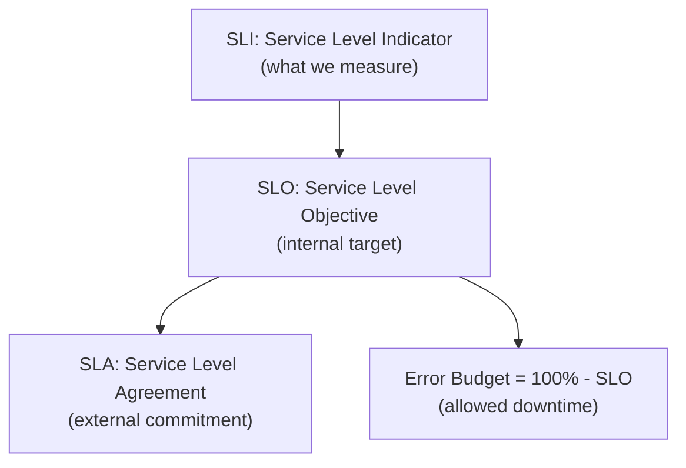
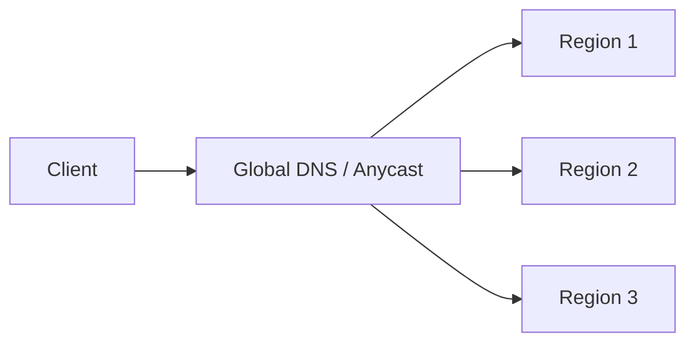
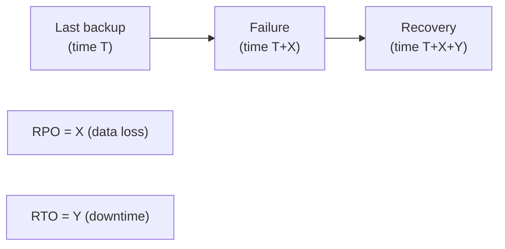

# Reliability (SLI/SLO/SLA, Redundancy, Failover)

Resilience patterns ([T14](./T14-resilience-circuit-breaker-bulkhead-retry-timeout-backpressure.md)) prevent individual failures from cascading. **Reliability** is the broader system property: the system is up and serving correctly **most of the time**, and when it isn't, it recovers within a defined window. Reliability is *measurable* — every minute the system is up counts toward "availability"; every error counts against it; the cumulative numbers form **SLIs** (Service Level Indicators), which are compared against **SLOs** (Service Level Objectives) and externally committed in **SLAs** (Service Level Agreements). This measurement discipline, formalized by Google's SRE practice and Ben Treynor Sloss's 2003 founding of Google SRE, is what makes reliability a *managed* property rather than a hopeful one.

The depth bar here is the **vocabulary** (SLI / SLO / SLA / Error Budget / RTO / RPO) and the **patterns that deliver each level of reliability**. We trace what "three nines" (99.9%) and "five nines" (99.999%) cost in engineering terms — five nines is 5.26 minutes of downtime per year, requires multi-region active-active, costs an order of magnitude more than three nines. We cover **error budgets** as the SRE innovation that aligns reliability with feature velocity (if you've exhausted the budget, slow new releases; if you have budget to burn, ship faster). We name the **redundancy patterns** (N+1, N+2, active-passive, active-active, multi-region, multi-cloud) and the failover dynamics that make them work. We cover **RTO** (Recovery Time Objective — how fast must we recover?) and **RPO** (Recovery Point Objective — how much data can we lose?) as the disaster-recovery vocabulary, and the real production architectures that achieve each tier. By the end you will set an SLO based on customer reality, design redundancy that meets it, calculate the cost of each additional nine, and refuse the most common form of reliability theater (vendor-quoted "99.99%" that doesn't include their dependencies).

> [!NOTE]
> Prerequisites: [Resilience](./T14-resilience-circuit-breaker-bulkhead-retry-timeout-backpressure.md), [Replication](./T04-replication-strategies.md). This topic generalizes from per-call resilience to system-level reliability targets.

## Where Reliability Engineering Came From — Telecom, Bell Labs, And Google SRE

The reliability vocabulary (SLI, SLO, SLA, error budget) traces back to **telecommunications industry standards** of the 1970s, was formalized in **Bell Labs research** through the 1980s, and was reinvented for software by **Google's Site Reliability Engineering team** starting in 2003. The Google SRE book (2016) made the vocabulary mainstream; before that, software teams largely improvised.

### The Telecom Origin — Nines Of Availability

The "nines of availability" notation (99%, 99.9%, 99.99%, 99.999%) originated in **telephony reliability standards** of the 1960s and 70s. The classic AT&T target was **five nines (99.999%) for phone switching equipment** — translating to about 5.26 minutes of downtime per year per switch.

Why five nines for telephony? Because **phone outages were a public-safety issue**. A phone unable to dial 911 (or its international equivalent) could cause deaths. Regulators required carriers to meet specific availability targets; AT&T and Bell System engineers developed the practices (redundancy, hot failover, regular testing) that made five nines achievable.

The five-nines vocabulary carried over to mainframe computing (which served business-critical applications in the 1970s) and then to early internet services (which adopted the same target without questioning whether they actually needed five nines).

### Bell Labs Reliability Engineering (1980s)

**Bell Labs** in the 1980s developed the *theoretical* basis for reliability engineering. The **Bell System Technical Journal** published numerous papers on:

- **Mean Time Between Failures (MTBF)**.
- **Mean Time To Recovery (MTTR)**.
- **Availability calculations** (A = MTBF / (MTBF + MTTR)).
- **Redundancy and failover** strategies.
- **Fault tolerance** through hardware replication.

These concepts were *engineering rigor* applied to *physical systems* (telephone switches, transmission lines, network equipment). The same concepts translate directly to software, but the field didn't immediately recognize this.

### The Software Reliability Gap (1990s–2000s)

Through the 1990s and early 2000s, **software teams treated reliability differently from telecom engineers**:

- **Reliability was binary**: either "the system works" or "it doesn't."
- **Outages were emergencies**, not measured.
- **Uptime targets were aspirational**, not engineered.
- **Postmortems were blame sessions**, not learning opportunities.

The reasons were partly cultural (software engineers came from different backgrounds than telecom engineers) and partly economic (early web services had no regulatory reliability requirements). Even Yahoo and AOL — the largest web companies of the late 1990s — operated more like advanced startups than reliability-engineered systems.

### Google's Site Reliability Engineering (2003)

**Ben Treynor Sloss** joined Google in 2003 and founded the **Site Reliability Engineering (SRE)** team. His charter: bring **software engineering practices to operations**. Until then, "operations" was a separate function — sysadmins, network engineers, DBAs — distinct from "software development."

Treynor's specific innovation: **SREs were software engineers** who happened to focus on operations. They wrote code; they automated infrastructure; they applied engineering rigor to reliability. The team had specific principles:

1. **Maintain at most 50% time on operations**; the rest on engineering. This forced automation.
2. **SREs were on-call for the services they engineered**. Skin in the game.
3. **Error budgets** allowed deliberate trade-offs between reliability and feature velocity.
4. **Blameless postmortems** focused on systemic causes, not individual blame.

The SRE team grew through the 2000s. By 2010, Google had thousands of SREs maintaining its enormous infrastructure. The practices proved enormously effective — Google's services achieved high reliability with relatively modest headcount per service.

### Who Ben Treynor Sloss Is

**Ben Treynor Sloss** (born ~1965) joined Google in 2003 from Microsoft (where he'd worked on Active Directory) and Sun. At Google he founded SRE and remained its leader through the 2010s. He's currently Senior Vice President at Google, responsible for reliability across all of Alphabet.

Treynor's specific contribution beyond founding SRE: **publicly evangelizing the practices**. His talks at conferences (USENIX SRECon, various keynotes) and his sponsorship of the SRE book series made the practices accessible outside Google.

### The Google SRE Book (2016)

The single most influential publication on software reliability is **[*Site Reliability Engineering: How Google Runs Production Systems*](https://sre.google/sre-book/table-of-contents/)** (Beyer, Jones, Petoff, Murphy, O'Reilly, 2016). The book is *freely available online* and has been read by hundreds of thousands of engineers.

The book documented Google's specific practices in detail:

- **SLI definition methodology**.
- **SLO target setting based on user happiness, not aspiration**.
- **Error budgets as the mechanism for reliability-vs-velocity trade-offs**.
- **On-call practices** (rotations, escalations, runbooks).
- **Incident management** (incident commander roles, communication protocols).
- **Postmortem culture** (blameless, action-item-driven).

The book *shifted the industry*. Reliability practices that had been Google-specific became standard at Facebook, Amazon, Netflix, Twitter, and dozens of other companies. The vocabulary (SLI, SLO, SLA, error budget) became universal.

### Why SRE Matters For Senior Engineers

Pre-SRE: reliability was operational; it was the ops team's problem.
Post-SRE: reliability is engineered; it's everyone's problem.

The senior engineer's value: bringing SRE thinking to feature engineering. Asking "what's our SLO?" before building. Asking "what's the error budget impact?" before shipping. Making reliability part of the engineering vocabulary, not just operations.

## Why Reliability Engineering, Specifically: The Senior Engineer's Q&A

### Q1: Why didn't software engineers always think this way?

Three structural reasons:

1. **Software is more flexible than hardware**: hardware engineers had to design for known failure rates; software engineers could "just fix the bug." This led to a culture of reactive fixes rather than proactive reliability engineering.

2. **The cost of downtime was less visible**: a phone switch failure causes immediate, measurable revenue loss. A web service outage's revenue impact is harder to measure (until it isn't — Amazon's 2013 outage cost ~$5M per minute).

3. **The talent pool was different**: software engineers came from CS programs that taught algorithms and OOP, not reliability engineering. Telecom engineers came from electrical engineering programs that emphasized reliability mathematics.

The SRE movement addressed all three: making the cost of downtime visible (SLOs), bringing reliability mathematics to software (error budgets), and training engineers in reliability engineering.

### Q2: How do you actually pick an SLO?

The Google SRE methodology:

1. **Measure user happiness**. What error rate or latency makes users complain?
2. **Set the SLO at the threshold of unhappiness**, not at perfection.
3. **Allow some slack** for engineering work and unexpected events.

For most consumer-facing services, the SLO is 99.9% (about 43 minutes downtime per month) or 99.95% (22 minutes). Five nines is rarely justified for software services — the engineering cost is enormous and users rarely notice the difference between 99.99% and 99.999%.

The senior judgment: avoid *aspirational* SLOs (set so high you can never meet them). Set realistic ones; meet them; then improve.

### Q3: Why are error budgets transformative?

Because they *operationalize* the reliability-velocity trade-off. Pre-error-budget, engineering pushed for velocity (more features faster); operations pushed for reliability (fewer changes). They argued.

Error budgets quantify the disagreement: "you have X minutes of acceptable downtime per month. If you spend it on feature changes that cause incidents, fine. If you spend it on reliability investments, fine. But you don't get more than X."

This forces a *deliberate* trade-off rather than a political one. The team can choose to spend its error budget on shipping; if they exhaust it, they invest in reliability work.

The cultural impact is enormous: features and reliability become commensurate, not opposed.

### Q4: How do SLOs relate to availability nines?

SLO targets are usually expressed in nines:

- **99% (two nines)**: ~7.3 hours downtime per month. Acceptable for some internal tools.
- **99.9% (three nines)**: ~43 minutes per month. Typical for consumer services.
- **99.95%**: ~22 minutes per month. Higher-priority services.
- **99.99% (four nines)**: ~4.3 minutes per month. Critical services.
- **99.999% (five nines)**: ~26 seconds per month. Almost no software service needs this.

Each additional nine roughly doubles or triples the cost (more redundancy, more on-call, more engineering time). The senior judgment: only commit to as many nines as the business actually needs.

### Q5: How is the SLI different from a metric?

A *metric* is anything you measure. An SLI is a *user-experience-relevant* metric — something that correlates with whether users are happy.

Examples:
- **Metric**: CPU utilization. Not an SLI; users don't care about CPU.
- **SLI**: Request success rate. Users care about whether their requests work.
- **Metric**: Database query count. Not an SLI.
- **SLI**: p99 latency. Users care about response speed.

The discipline: pick SLIs that *track user happiness*. Pick metrics for *internal monitoring*. They overlap but aren't identical.

## Common Misconceptions Explained

### "Five nines is the gold standard."

False. Five nines is **rarely justified for software services**. The engineering cost is enormous. Most consumer services need 99.9% or 99.95%; that's adequate for user expectations and reasonable for engineering investment.

### "SLAs and SLOs are the same."

False. **SLAs are contractual commitments** (typically with customers); **SLOs are internal targets**. SLAs typically have weaker thresholds than SLOs (the SLO gives engineering room before the SLA is breached).

### "An incident violates the SLO."

False. **The SLO is an average over a window** (typically 28 days). A single incident might consume some error budget but doesn't necessarily violate the SLO if it's brief enough.

### "Reliability engineering means zero downtime."

False. Reliability engineering means **planned downtime**: engineering can spend its error budget deliberately on changes that risk small outages. The goal isn't zero downtime; it's *deliberate* downtime distribution.

### "SRE is just DevOps with a different name."

Half true. DevOps and SRE share goals (breaking down dev-ops silos, automation, software-defined infrastructure). SRE is *one specific implementation* of DevOps principles, with specific practices (error budgets, blameless postmortems, on-call rotations). DevOps is broader.

### "Postmortems blame engineers."

Should be false. **Blameless postmortems** focus on systemic causes: what process, tool, or design choice allowed the incident? Individual error is treated as a symptom, not a cause. Blaming individuals discourages incident reporting and prevents learning.

## The Vocabulary — SLI, SLO, SLA, Error Budget



### SLI — Service Level Indicator

A *measured* property of the service. Common SLIs:

- **Availability**: % of requests that succeed (2xx or 3xx, depending on definition).
- **Latency**: % of requests under a target (e.g., p99 < 500 ms).
- **Throughput**: requests per second served.
- **Error rate**: % of requests returning 5xx.
- **Durability**: % of data persisted without loss.

An SLI is a number, observed via metrics. **What's measured matters**: "uptime" measured at the load balancer is different from "uptime" measured at the database, which is different from "uptime" measured by a real user. Define the SLI precisely.

### SLO — Service Level Objective

An *internal target* for an SLI: "availability ≥ 99.9% over a rolling 30-day window," or "p99 latency < 500 ms for 95% of 5-minute intervals." Aspirational; the team aims for it.

### SLA — Service Level Agreement

An *external commitment*, typically in a contract: "if availability falls below 99.9%, we credit your bill." SLAs are usually **looser** than SLOs (SLO is a stretch goal; SLA is a safety threshold). The gap absorbs the inevitable lulls without breaching contracts.

### Error Budget

The complement of the SLO: how much *un*availability is permitted. For a 99.9% availability SLO, the error budget is 0.1% — about **43.2 minutes per month** of allowed downtime. The discipline:

- If you're using the budget faster than expected: slow new releases, focus on reliability.
- If you have budget to spare: ship faster.

This is the SRE innovation that aligns reliability with velocity. Without it, "uptime" is a constraint engineers route around; with it, the team has a *budget* they can spend wisely.

## The Nines

| Availability | Downtime / year | Downtime / month | Downtime / week |
|:-:|:-:|:-:|:-:|
| 90% (one nine) | 36.5 days | 73 hours | 16.8 hours |
| 99% (two nines) | 3.65 days | 7.3 hours | 1.68 hours |
| 99.9% (three nines) | 8.76 hours | 43.2 min | 10.1 min |
| 99.95% | 4.38 hours | 21.6 min | 5.05 min |
| 99.99% (four nines) | 52.6 minutes | 4.32 min | 1.01 min |
| 99.999% (five nines) | 5.26 minutes | 26.3 sec | 6.05 sec |

Each additional nine **multiplies engineering cost roughly 10×**. Going from three to four nines requires multi-AZ deployment, fast failover, real on-call. Going from four to five nines requires multi-region active-active, chaos engineering, redundancy at every layer. **Almost no real-world product needs five nines for most use cases**; it's reserved for life-safety, payments, and the very largest services.

The right SLO is the *minimum* the business actually needs, not "as many nines as we can manage."

## Compound Availability — The Dependency Trap

If your service depends on N independent services each at 99.9%, your *theoretical* availability is **0.999^N**:

| Dependencies | Compound availability |
|:-:|:-:|
| 1 | 99.9% |
| 5 | 99.5% |
| 10 | 99.0% |
| 50 | 95.1% |
| 100 | 90.5% |

Twenty 99.9% dependencies in a sync chain produce 98% availability. **The math says: synchronous chains of microservices are inherently lower-availability than the individual services.** Resilience patterns (caching, fallbacks, async) break the dependency for SLO purposes.

The corollary: a service hosted on AWS *cannot exceed AWS's own SLA*. AWS EC2 commits 99.99% per region. Your service in one region can't be more reliable than that — multi-region is required.

## Redundancy Patterns

### N+1, N+2

Always have one (or two) more instance than you need. If you need 4 instances to serve peak load, run 5 (N+1). One can fail without immediate capacity impact.

Costs: 25% (N+1 on 4) or 50% (N+2) more compute. Worth it for any non-trivial reliability target.

### Active-Passive Failover

One primary serves all traffic; one or more standbys are ready to take over. Standby is **warm** (running, replicating state, ready to promote) or **cold** (not running, must boot on failover).

- Warm: failover in seconds (typical RTO 30s–5min).
- Cold: failover in minutes (RTO 5–30min).

```mermaid
flowchart LR
  Client --> LB[LB]
  LB --> Primary
  Standby[Standby <br/>(warm)]
  Primary -.->|"async replicate"| Standby
  LB -.->|"failover only"| Standby
```

The hard part: **detecting that the primary is down**. Health checks fail; the LB decides to promote standby. Risk of split-brain if the primary recovers and didn't actually fail.

### Active-Active

Multiple primaries simultaneously serve traffic. Load is split across regions. Failure of any one shifts traffic to others without a "failover" event.



Pros: no failover latency; cheaper per-instance utilization; tolerates region failures without user-visible impact.

Cons: data must replicate across regions (eventually consistent or expensive synchronous replication); cross-region writes are slow; conflict resolution required if data is mutable.

### Multi-Region

Active-active across geo-distributed regions (us-east, us-west, eu-west, ap-southeast). Each region has full capacity to handle global traffic if others fail. Provides:

- **Regional fault tolerance**: an AWS region outage doesn't take down the service.
- **Geo-distributed latency**: users hit the nearest region.
- **Disaster recovery**: in the worst case, traffic shifts globally.

Costs: complex data replication, eventual consistency across regions, infrastructure spend.

### Multi-Cloud

Across cloud providers (AWS + GCP + Azure). Defends against a *single cloud's* total outage — rare but has happened (AWS US-EAST-1 has had hours-long outages multiple times). Costs are very high: each cloud's tooling differs, data replication across cloud boundaries is expensive, operational complexity multiplies.

**Most teams don't need multi-cloud.** Multi-region within one cloud is the standard high-reliability answer.

## RTO And RPO — Disaster Recovery Vocabulary



- **RPO (Recovery Point Objective)**: how much data can the business afford to lose? 1 hour? 1 minute? 0?
- **RTO (Recovery Time Objective)**: how long can the business be down? 4 hours? 1 hour? 5 minutes?

RPO determines replication choice: daily backups give RPO=24h; hourly snapshots give RPO=1h; synchronous replication gives RPO~0.

RTO determines failover style: cold standby (RTO hours); warm standby (RTO minutes); active-active (RTO seconds, or zero from the user's perspective).

Setting RTO and RPO is a *business* decision, not engineering. The team builds to the targets the business sets, with the engineering cost transparent.

## Real Reliability Numbers

A few production examples:

- **AWS EC2** SLA: 99.99% per region. The fine print: not single-instance; you must use multiple AZs.
- **AWS S3** SLA: 99.9% availability, 99.999999999% durability (11 nines).
- **Google Cloud Spanner** SLA: 99.999% for multi-region.
- **GitHub** typical: 99.95%.
- **Cloudflare** SLA: 100% — but only for enterprise; only for control plane; everything has exceptions.
- **Netflix Streaming**: not publicly committed; engineering target ~99.99%.

**Critical reading**: vendor SLAs typically *only commit to availability of the vendor's piece*. AWS EC2's 99.99% doesn't protect you from AWS-wide outages (US-EAST-1 has had ~hours), from your application bugs, from DNS misconfiguration. Your effective SLO is bounded above by your weakest dependency's SLO.

## Operationalizing Reliability

The mechanics that make reliability real:

### Observability

Metrics, logs, traces. Without observability, you can't measure SLIs. Standard tooling: Prometheus (metrics), OpenTelemetry (tracing), Loki / Splunk / Datadog (logs), Grafana (dashboards).

### Alerting

Page when SLOs are at risk. Critical: alert on **error budget burn rate**, not on individual metric spikes. A single 5-min spike of errors might be fine; a sustained burn that will exhaust the month's budget in days is a problem.

### Runbooks

For every known failure mode, document the response: who's paged, what to check, what to do. Tested runbooks are a key SRE artifact.

### Game Days / Chaos Engineering

Deliberately introduce failures (Chaos Monkey, Litmus, Gremlin). Verify the system recovers. Verify alerts fire. Verify runbooks work. **Production reliability comes from regular practice.**

### Postmortems

Every incident has a blameless postmortem. What happened? Why? What was the impact? What changes prevent recurrence? Track action items to completion.

## Designing For A Specific SLO

Three nines (99.9%, 43 min/month):

- Single region, multi-AZ.
- Automated failover (Patroni for Postgres, replica sets for MongoDB).
- N+1 instances.
- Comprehensive monitoring + on-call.

Four nines (99.99%, 4 min/month):

- Multi-region with active-passive or hot standby.
- Cross-region database replication.
- Automated traffic shifting (Route53 health checks).
- Chaos engineering practice.

Five nines (99.999%, 5 min/year):

- Multi-region active-active.
- No single point of failure anywhere.
- 24/7 operations team across regions.
- Real chaos engineering (regular failure injection).
- Rigorous change management (slow rollouts, canaries).

Each step is a roughly 10× engineering investment. The right SLO is determined by the business cost of downtime, not the technical possibilities.

## Anti-Patterns

### "We're 99.99%" Without Measurement

The team aspires to high reliability but doesn't measure SLIs. They can't tell if they're hitting it. The number is fiction.

### Aspirational SLA In The Contract

Marketing promises 99.99%; engineering can deliver 99.9% on the existing architecture. Customer-facing breaches accumulate; credits flow; trust erodes.

### Compound SLO Without Architectural Slack

Service A has an SLO of 99.9%; Service A depends on B, C, D, E, F at 99.9% each. A's *compound* dependency ceiling is 99.5%. The team is silently signed up for the impossible.

### "Multi-Region" That's Actually Multi-AZ

The team thinks they're multi-region; the deployment is across availability zones in one region. A region-wide outage takes them down.

### Untested Failover

Failover code exists. It's never been exercised. Game day reveals it doesn't work.

## Trade-Off Summary

| Reliability tier | Architecture | Cost |
|:----------------:|-------------|------|
| 99% | Single instance, manual recovery | Low |
| 99.9% | Multi-AZ, automated recovery, monitoring | Medium |
| 99.99% | Multi-region active-passive, chaos eng, on-call | High |
| 99.999% | Multi-region active-active, no SPOF, deep practice | Very high |
| 99.9999%+ | Specialized engineering (telecom, finance) | Extreme |

> [!INTERVIEW]
> A common L5 prompt: "How would you design for 99.99% availability?" Strong answers (a) state the cost in minutes (~4 min/month), (b) name the architecture (multi-region, active-passive with automated failover), (c) mention error budgets, observability, runbooks, chaos engineering, (d) refuse to commit five nines unprompted unless asked.

## Deeper Dive — Implementing SLI/SLO with Prometheus

### Defining SLIs

Three classes of SLI (Google SRE Workbook):
1. **Request-driven**: success rate of HTTP requests
2. **Pipeline-driven**: data freshness, processing throughput
3. **Synchronous**: end-to-end function call success

### Availability SLI in Prometheus

```promql
# Success rate over 5 min sliding window
sum(rate(http_server_requests_seconds_count{
  status!~"5..", uri!~"/actuator/.*"
}[5m]))
/
sum(rate(http_server_requests_seconds_count{
  uri!~"/actuator/.*"
}[5m]))
```

The numerator counts non-5xx (plus excludes health checks); denominator counts all real requests.

### Latency SLI

```promql
# p99 latency over 5 min
histogram_quantile(0.99,
  sum(rate(http_server_requests_seconds_bucket[5m])) by (le)
)
```

Or as success against threshold (more interpretable):
```promql
# % of requests under 200ms
sum(rate(http_server_requests_seconds_bucket{le="0.2"}[5m]))
/
sum(rate(http_server_requests_seconds_count[5m]))
```

### Spring Boot Configuration

```yaml
management:
  endpoints.web.exposure.include: health,prometheus
  metrics:
    distribution:
      percentiles-histogram.http.server.requests: true
      sla.http.server.requests: 50ms,100ms,200ms,500ms,1s,2s,5s
    tags:
      application: ${spring.application.name}
      env: ${ENV:dev}
      region: ${REGION:us-east-1}
```

### Burn Rate Alerting (The Modern Standard)

```yaml
# SLO: 99.9% availability over 30 days
# Error budget: 0.1% of total requests = 43.2 minutes/month

groups:
- name: slo-burn-rate
  rules:
  # Page on FAST burn (consuming a month's budget in hours)
  - alert: HighBurnRate_Fast
    expr: |
      (
        sum(rate(http_server_requests_seconds_count{status=~"5.."}[1h]))
        /
        sum(rate(http_server_requests_seconds_count[1h]))
      ) > 0.0144  # 14.4× normal error rate
    for: 2m
    labels: { severity: page }
    annotations:
      summary: "Service consuming SLO error budget at 14.4× rate (1h window)"
      description: "At this rate, full month budget exhausted in ~2 hours"

  # Page on SLOW burn (consuming a month's budget over days)
  - alert: HighBurnRate_Slow
    expr: |
      (
        sum(rate(http_server_requests_seconds_count{status=~"5.."}[6h]))
        /
        sum(rate(http_server_requests_seconds_count[6h]))
      ) > 0.001  # 1× normal error rate
    for: 1h
    labels: { severity: ticket }
```

Google SRE's **multi-window, multi-burn-rate** approach: fast burn pages immediately, slow burn opens tickets. Avoids both alert fatigue and missed-incident risk.

## Deeper Dive — Calculating Error Budgets (Concrete Examples)

For 99.9% SLO over 30 days (43,200 minutes):

```
Allowed downtime: 0.1% × 43,200 min = 43.2 minutes/month
Allowed failure rate: 0.1% of requests can fail

For a service handling 1M requests/day:
  30M requests/month × 0.1% = 30,000 failures allowed/month
  At ~1000 req/sec sustained, that's 30 seconds of total downtime per month

For a 99.99% SLO:
  Downtime budget: 4.32 minutes/month
  Failures: 3,000/month for the same 30M request volume
  → 3 seconds of total outage
```

**Burn rate** = current consumption rate / sustainable rate:
- Burn rate 1.0 = consuming exactly what you can afford
- Burn rate 10.0 = consuming 10× sustainable; you'll be out in 3 days (10% of month)
- Burn rate 100.0 = consuming month's budget in ~7 hours

### Error Budget Policy (Document This)

```markdown
# SLO Policy — Order Service

## SLO
- Availability: 99.9% over rolling 30 days
- Latency: 95% of requests < 500ms over rolling 30 days

## Error Budget Actions
| Budget remaining | Action |
|---|---|
| >75% | Normal velocity; ship freely |
| 50-75% | Normal; postmortem any incidents |
| 25-50% | Slow risky deploys; increase canary % time |
| 10-25% | Freeze non-critical changes; focus on stability |
| <10% | Freeze all but P0 fixes; mandatory postmortem review |
| 0% | Stop deploys until budget recovers |

## Escalation
- 24h after policy violation: tech lead notified
- 72h: engineering manager
- 168h (1 week): director
```

## Deeper Dive — Multi-Region Failover Patterns

### Active-Passive (DR Standby)

```
PRIMARY (us-east-1) — serves all traffic
SECONDARY (us-west-2) — replicates from primary, ready to take over

NORMAL: 100% to primary
FAILOVER:
  1. Detect primary failure (health checks, alerts)
  2. Promote secondary database (e.g., AWS RDS Multi-Region failover or manual promote)
  3. Update DNS / load balancer to direct traffic to secondary
  4. RTO: 5-30 minutes typically
  5. RPO: depends on replication lag (usually <1 second async)
```

**Costs**: ~1.5× single-region (secondary mostly idle but provisioned).

### Active-Active (Both Serve)

```
us-east-1 ←→ us-west-2 ←→ eu-west-1
  Both regions serve traffic concurrently
  Bi-directional replication (CRDT or conflict-free schemas)

NORMAL: split traffic by:
  - Geographic (route nearest region)
  - Latency-based (route fastest)
  - Account-shard (each account "homed" to a region)

FAILOVER:
  1. Detect region failure
  2. Redistribute traffic to surviving regions
  3. RTO: seconds (DNS TTL + LB drain)
  4. RPO: 0 (if data was already replicated)
```

**Costs**: ~2-3× single-region. Requires conflict-free design.

**Challenges**:
- Data conflicts (two writers update same row in different regions)
- Cross-region latency (~100ms for transactions touching multiple regions)
- Eventual consistency for reads (read-your-own-writes guarantee complicates routing)

### Cell-Based (AWS-style)

```
us-east-1 has multiple "cells":
  cell-a (10% of traffic)
  cell-b (10%)
  ... cell-j (10%)

Each cell is INDEPENDENT — own DB, own service instances
One cell failure → 10% of users impacted, NOT 100%
"Blast radius" contained
```

Used by AWS S3, DynamoDB, AWS Lambda. Massive reliability gains; massive operational complexity.

## Deeper Dive — Chaos Engineering Practice

### Failure Modes to Inject

| Tier | Failure | Tool | Severity |
|---|---|---|---|
| Network | Latency injection (100ms-5s) | Toxiproxy, Chaos Mesh | Medium |
| Network | Packet loss (5-30%) | tc-netem | Medium |
| Network | Partition (region from region) | iptables, Chaos Mesh | High |
| Process | SIGKILL pod | Chaos Monkey | Low (test self-healing) |
| Resource | CPU exhaustion (stress 100% one core) | stress-ng | Medium |
| Resource | Memory pressure (allocate 2GB) | stress-ng | Medium |
| Resource | Disk fill (fill /tmp) | dd | Low |
| Database | Slow queries (sleep 10s) | toxic query proxy | High |
| Database | Disconnection (kill all connections) | manual pg_terminate_backend | High |
| Cache | Cache flush (DEL *) | redis-cli | High |
| Time | Clock skew (ntpdate-d offset 30s) | manual | Medium |
| Cloud | AZ outage simulation | AWS FIS | High |

### Sample Chaos Day Plan

```markdown
# Chaos Day — Order Service — 2024-Q2

## Scope
- Order service + payment integration + inventory service
- 2pm-4pm IST, all engineers + on-call present
- Production-like staging environment

## Hypotheses to Test
1. If primary DB fails over, transactions complete with <5s pause
2. If Redis cache fails entirely, latency grows but service stays up
3. If payment provider is slow (5s), circuit breaker opens within 30s
4. If one of 3 K8s nodes dies, pods reschedule within 2 minutes

## Schedule
14:00 Kick-off; on-call confirms monitoring active
14:10 Hypothesis 1: ToxicProxy adds 2s latency to DB → escalate to full DB kill
14:30 Hypothesis 2: redis-cli FLUSHALL → observe cache miss spike + latency
14:50 Hypothesis 3: Add 5s sleep to payment provider stub
15:10 Hypothesis 4: Delete a node
15:30 Coffee break, share observations
15:45 Postmortem-style review: did each system behave as expected?
16:00 Action items captured
```

## Deeper Dive — Postmortem Template

```markdown
# Incident YYYY-MM-DD — [Title]

## Summary
[1-2 sentence describing impact]

## Impact
- Customers affected: X (out of Y total)
- Duration: HH:MM — HH:MM UTC (T hours)
- Revenue impact: $X (if calculable)
- Data loss: Y/N (and what)
- SLO budget consumed: Z% of monthly budget

## Timeline
- HH:MM Alert fired
- HH:MM On-call paged
- HH:MM Initial diagnosis (...)
- HH:MM Root cause identified
- HH:MM Mitigation applied
- HH:MM Verified recovery

## Root Cause
[Detailed technical explanation. Not blame.]

## Contributing Factors
- [Things that made this worse than necessary]

## What Went Well
- [Quick alerting, runbook worked, etc.]

## What Could Have Gone Better
- [Things to improve]

## Action Items
| Item | Owner | Priority | Due |
|---|---|---|---|
| Fix root cause | @alice | P0 | 2024-MM-DD |
| Improve detection | @bob | P1 | 2024-MM-DD |
| Update runbook | @carol | P2 | 2024-MM-DD |
| Chaos test the fix | @dave | P1 | 2024-MM-DD |

## Lessons Learned
[Patterns to apply elsewhere. Industry-shareable insights.]

## Blameless Reflection
[How systems/processes need to change to prevent this whole class of issue]
```

## Deeper Dive — Real-World Reliability Numbers

| Service | Stated SLA | Real Track Record (last 12mo) |
|---|---|---|
| AWS S3 | 99.9% | ~99.95% |
| AWS DynamoDB | 99.999% (multi-region) | ~99.99% |
| AWS RDS Multi-AZ | 99.95% | ~99.9% |
| AWS Lambda | 99.95% | ~99.9% |
| Google Cloud Storage | 99.9% (multi-region) | ~99.95% |
| GitHub | (no contractual SLA) | ~99.5% |
| Slack | (no contractual SLA) | ~99% |
| Stripe API | 99.99% | ~99.99% |
| Twilio | 99.95% | ~99.9% |
| Cloudflare | 100% (workers) | ~99.99% |
| Postmark email | 99.99% | ~99.95% |

**Insight**: even the most reliable cloud services have a real track record below their stated SLA. Plan for that. Vendor SLAs include extensive carve-outs (planned maintenance, force majeure, etc.).

## Deeper Dive — On-Call Operations

### Tier Definitions

```
P0 (Critical): customer-facing outage, data loss risk
  Response: page immediately, declare incident, all-hands
  Examples: API returning 500 to all users, DB corruption, data exfil

P1 (High): major degradation, partial outage
  Response: page on-call, notify EM
  Examples: p99 latency >10× normal, 10% error rate, single region down

P2 (Medium): degradation in non-critical features
  Response: ticket for next business day
  Examples: notification delays >5min, search re-ranking offline

P3 (Low): minor issues without customer impact
  Response: backlog
  Examples: dashboard graph wrong, dev environment issue
```

### On-Call Rotation Best Practices

```
ROTATION SHAPE
  Primary: 1 person, 1 week (M-M)
  Secondary: 1 person, 1 week (covers if primary unreachable)
  Manager: rotation lead (decides escalation)

HANDOFF
  Monday morning sync (10 min)
  Outgoing on-call walks through:
    - Active incidents
    - Recently-resolved issues that might recur
    - Pending changes likely to cause issues

COMPENSATION
  Stipend per week of on-call ($200-500 typical)
  Comp time for hours worked overnight
  Strict "no work calls outside on-call week"

HEALTHY ROTATION
  Frequency: weekly or biweekly
  Team size: 5-8 engineers (1-in-5 frequency tolerable; 1-in-3 causes burnout)
  Incident load: target <2 pages/week; >5 is unsustainable
  No incidents the previous month → rotation may be over-staffed
```

## Practice

1. **Set an SLO.** For a service you operate, define an availability SLI (which requests count?) and a target SLO. Calculate the error budget.
2. **Measure SLI.** Implement SLI measurement via Prometheus or your APM. Verify the number matches reality.
3. **Compound availability calculation.** For a service with five 99.9% dependencies in a sync chain, calculate compound. Identify which dependencies could be made async to lift the ceiling.
4. **Failover drill.** In a test environment, kill the primary database. Measure RTO. Identify any data loss; measure RPO.
5. **Game day.** Plan a chaos exercise. List failure modes to inject; expected responses; success criteria.
6. **Runbook authoring.** For one known failure mode, write a runbook: detection, diagnosis, mitigation, recovery. Test by having a teammate run it.
7. **Multi-region cost estimate.** For a service running 10 instances at $500/month, calculate the cost of multi-region active-active across 3 regions. Compare to multi-AZ single-region.
8. **Vendor SLA review.** Read AWS or GCP's actual SLA. Identify the exclusions and qualifications. Compare to your service's stated SLO.
9. **Error budget conversation.** Sketch the conversation: error budget consumed at 50%, halfway through the month. Should the team slow releases?
10. **The skeptic conversation.** A product manager wants 99.999% availability. Write a 200-word response on the cost, the engineering investment, the operational discipline, and whether the product genuinely needs it.

## Recap

You should now be able to:

- Distinguish **SLI** (measured), **SLO** (internal target), and **SLA** (external contract) and choose appropriate ones for a service.
- Calculate **error budgets** and apply them to align reliability with velocity.
- Read the **nines table** and know the engineering investment for each level.
- Recognize **compound availability** in synchronous dependency chains and break dependencies with async, caching, or fallbacks.
- Design **N+1, N+2, active-passive, active-active, multi-region, multi-cloud** redundancy by reliability target and cost.
- Specify **RTO** and **RPO** for disaster recovery and choose backup / replication strategies to meet them.
- Recognize that **vendor SLAs cap your effective SLO**; multi-region or multi-cloud is required for tighter targets.
- Operationalize reliability with **observability, alerting on burn rate, runbooks, game days, postmortems**.
- Design architectures for **specific SLO tiers** (three to five nines) and identify the cost step at each.
- Refuse **anti-patterns**: SLA without SLI, compound SLO ignoring dependency math, multi-AZ called multi-region, untested failover.

## Next

Continue to [System Design Methodology / Framework](./T16-system-design-methodology-framework.md) — the structured process for designing a new system from scratch under interview or real-world conditions. The seven worked designs that follow (URL shortener through ride-hailing) all use this framework.
