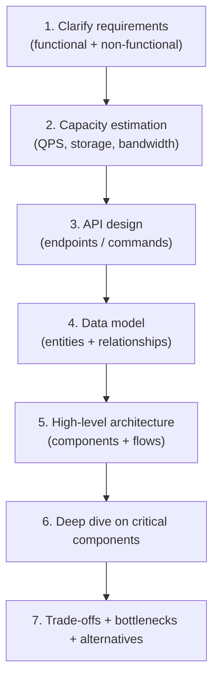
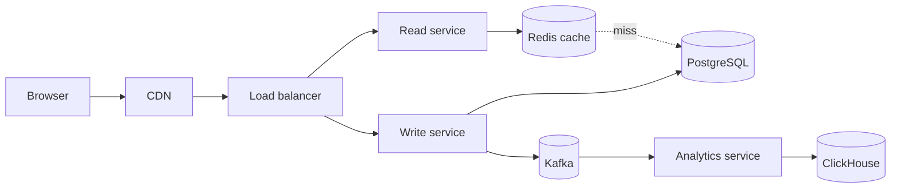

# System Design Methodology / Framework

System design — whether in an interview, an architecture review, or the start of a real project — is a structured process. There is a recognizable shape that good system designs follow, and senior engineers move through it deliberately: clarify what's being built, estimate the scale, sketch the API, model the data, design the high-level components, deep-dive the critical pieces, and articulate the trade-offs. The shape is widely taught (Alex Xu's *System Design Interview*, Donne Martin's open repository, Gaurav Sen's videos) because it works — a candidate who follows the framework produces a design that addresses the right questions; a candidate who doesn't produces a design that misses fundamentals.

The depth bar here is **the framework as an operational practice, not a recitation**. We cover each step with the questions a senior engineer asks at it, the artifacts the step produces, and the *escape valves* — when the discussion has stalled at one step and needs to move on. We name common interview traps (jumping to the architecture before requirements; calculating QPS without a sanity check; deep-diving the wrong component) and the senior tells that distinguish strong candidates from average ones (asking the requirements question even when the interviewer hasn't asked, calling out the unstated assumption, returning to a missed trade-off). We end on **real-world adaptation** — the same framework runs in a 90-minute architecture review for a real product, with the steps stretched and the trade-offs more concrete. The seven worked designs that follow this topic ([T17–T23](./T17-worked-design-url-shortener.md)) all walk through this framework end to end.

> [!NOTE]
> Prerequisites: most of C02. This topic synthesizes the patterns you've learned into a process for applying them.

## Where The System Design Interview Came From — Google, Amazon, And The Modern Tech Hiring Era

The system design interview as a *standard interview format* emerged in the mid-2000s at Google and Amazon, then spread to every major tech company. Before that, system design was *not* a standard interview question — coding interviews dominated. The shift reflected a recognition that *engineering judgment* matters as much as coding ability for senior roles.

### The Pre-2005 Era — Coding Interviews Only

Through the 1990s and early 2000s, the standard tech interview was *coding*. Microsoft's "brainteaser" interviews of the 1990s, Google's algorithm-heavy interviews of the early 2000s, and most companies' standardized coding tests focused on programming ability.

The assumption: if you can code well, you can engineer. This assumption was *partly true* but missed something important — *system-level judgment* (where data lives, how services communicate, what failures look like) wasn't tested.

### The Mid-2000s — Google's System Design Question

The standard story: Google's interview process around 2005–2007 started including a "system design" question, especially for senior engineering candidates. The motivation: experienced engineers should be tested on *what they actually do*, not just coding.

The early Google system design questions:

- "Design a URL shortener."
- "Design Google search."
- "Design a chat system."

These open-ended questions probed candidates' ability to:

- Decompose problems.
- Reason about scale.
- Discuss trade-offs.
- Communicate complex ideas.

By 2010, system design was a standard part of Google's senior-engineer interviews.

### The 2014 Education Industry Response — Donne Martin's GitHub Repository

The system design interview *exploded* in popularity around 2013–2014. Candidates needed preparation resources. The first major resource was **Donne Martin's [system-design-primer](https://github.com/donnemartin/system-design-primer)** GitHub repository (started 2014).

The repository — currently 280K+ stars — documents the canonical system design framework, common questions, and answers. It became *the* preparation resource for system design interviews.

Donne Martin (a data engineer) wasn't a famous engineer; the repository's success came from filling a real need. The repository's organization (capacity estimation, components, real-world architectures) became the *de facto* methodology.

### Alex Xu's System Design Interview (2020)

The next major resource was **Alex Xu's [System Design Interview – An Insider's Guide](https://www.amazon.com/System-Design-Interview-insiders-Second/dp/B08CMF2CQF)** (2020, Volume 2 in 2022). Xu, a software engineer with experience at Zynga and Twitter, wrote a structured guide to system design interviews.

The book's contribution: a *consistent* methodology applied to multiple problems. Each chapter covers one classic design problem (URL shortener, news feed, chat, payment, etc.) using the same framework.

By 2022, *System Design Interview* was the most-recommended preparation resource for staff and principal engineer candidates. Most major tech companies' interview prep materials reference it.

### Who Alex Xu Is

**Alex Xu** is a Chinese-American software engineer who worked at Twitter, Zynga, Apple, and Oracle before becoming a self-publisher and educator. His **ByteByteGo** newsletter and YouTube channel have millions of subscribers; his Twitter (now X) presence has shaped how engineers think about system design.

Xu's pedagogical style: visual, structured, and accessible. His diagrams are widely shared in engineering communities; his explanations are often the first introduction to distributed systems concepts for new engineers.

### The Modern Framework

By 2024, the system design interview has converged on a *standard framework*:

1. **Requirements** — what's being built, functional and non-functional.
2. **Capacity estimation** — DAUs, QPS, storage.
3. **High-level design** — components and data flow.
4. **Detailed design** — specific components, data models, APIs.
5. **Trade-offs and bottlenecks** — what's hard, what's optimized.

This framework is used at Google, Meta, Amazon, Microsoft, Apple, and most other tech companies. Variations exist but the structure is recognizable across companies.

## Why The Framework Matters, Specifically: The Senior Engineer's Q&A

### Q1: Why does the system design interview exist?

Because *coding interviews* test the wrong thing for senior roles. A staff engineer's daily work isn't algorithm puzzles; it's architectural decisions. The system design interview tests *what the role actually does*.

Specifically, it tests:

- **Decomposition**: breaking complex problems into manageable pieces.
- **Trade-off reasoning**: explaining why one approach is better than another.
- **Communication**: explaining technical ideas clearly.
- **Scale reasoning**: thinking about thousands or millions of users.

These skills predict job performance better than algorithm interviews for senior roles.

### Q2: How long does a system design interview take?

Typically 45–60 minutes. The structure:

- 5 minutes: requirements clarification.
- 5 minutes: capacity estimation.
- 15 minutes: high-level design.
- 15–20 minutes: detailed design.
- 5–10 minutes: trade-offs and improvements.

The pacing is critical — spending too long on one phase leaves no time for others.

### Q3: What do interviewers actually evaluate?

Per leveling rubrics at major companies:

1. **Problem-solving approach**: structured, methodical.
2. **Technical knowledge**: appropriate use of patterns.
3. **Trade-off articulation**: explaining choices.
4. **Communication**: clarity and engagement.
5. **Scope management**: handling ambiguity.

The *quality* of the design matters less than the *quality of reasoning* about it. A simple design well-explained beats a sophisticated design poorly-explained.

### Q4: Should I prepare canonical answers to common questions?

Yes and no. **Memorized answers fail** because interviewers vary questions slightly. But *familiarity with patterns* (URL shortener, news feed, chat) helps you respond quickly to variants.

The senior practice: practice the *framework* applied to many problems; understand the *patterns* used in different problem types; don't memorize specific answers.

### Q5: How does this relate to actual engineering work?

The system design interview *resembles* actual engineering work but in compressed form. Real architectural decisions take weeks; the interview takes an hour. Real designs are documented; the interview is verbal.

The compression isn't perfect — real engineering involves political constraints, organizational dynamics, and learning over time that the interview can't capture. But the *technical reasoning* is similar.

## Common Misconceptions Explained

### "There's a right answer to system design questions."

False. Most questions have *multiple* valid answers; the interview is about reasoning, not getting "the" answer.

### "Detailed knowledge of specific technologies matters."

Partially false. Knowing patterns matters; knowing specific products (Cassandra vs MongoDB) matters less. The interviewer cares about reasoning, not vendor expertise.

### "Asking questions wastes time."

False. **Clarifying requirements** demonstrates senior judgment. Diving into solution without understanding the problem is junior behavior.

### "I should design for maximum scale."

False. The right scale matches the requirements. Designing for billions of users when the requirement is millions wastes interview time on over-engineering.

### "Capacity estimation matters."

True. **Quick estimates anchor the design** — reasoning about whether you need one server or 1000 servers fundamentally changes the architecture.

### "Interviewer interruptions are bad signs."

False. **Interviewer engagement is a good sign**. They're invested in your performance; they're guiding you to insights. Take their suggestions seriously.

## The Seven Steps



Each step is roughly 5–10 minutes in a 45-minute interview, with the deep dive (step 6) consuming the largest share.

## Step 1: Clarify Requirements

The most-skipped step, the most-critical. **A solution to a misunderstood problem is wrong regardless of how well-architected it is.**

### Functional Requirements

What does the system *do*? For a URL shortener: "users submit long URLs; we return short URLs; users click short URLs and are redirected." The conversation flushes out:

- What operations exist? (shorten, redirect, list-my-urls, delete, expire, analytics?)
- Who are the users? (anonymous, authenticated, enterprise tier?)
- What's in scope vs out of scope?

### Non-Functional Requirements

How well must it work? The dimensions:

- **Scale**: how many users, how many requests/sec, how much data?
- **Latency**: target p99 for each operation. Click redirect should be <50ms; analytics dashboard can be 2s.
- **Availability**: target SLO. Three nines or four?
- **Consistency**: strong, eventual, causal?
- **Durability**: can we lose data on a server crash?
- **Geographic distribution**: regional or global?
- **Compliance**: PII, GDPR, HIPAA, PCI?

The senior tell: **ask about non-functional requirements explicitly**. Junior candidates dive into architecture; senior candidates first establish what "good" means.

### Out Of Scope

Pin what's *not* being designed. "I'll assume billing, user management, and admin tools are separate systems." Narrowing scope makes the problem tractable.

## Step 2: Capacity Estimation

Back-of-envelope numbers that constrain the design. The senior practice:

- **Daily active users** → **requests per second**.
- **Average data per record** × **records per day** → **storage growth**.
- **Request size** × **requests/sec** → **bandwidth**.

A worked example: a URL shortener with 100M users, each shortening 1 URL/week.

- 100M × 1/7 = ~14M new URLs/day.
- 14M / 86400 = ~165 new URL writes/sec.
- 100:1 read/write ratio is typical → 16,500 redirects/sec.
- Each URL row: ~200 bytes. 14M/day × 200B × 365 days × 5 years = 5 TB.
- Each redirect response: ~500 bytes. 16,500 × 500 = 8 MB/sec = 64 Mbps.

The numbers shape the design — 5 TB fits in one PostgreSQL with effort; 50 TB doesn't. 16,500 QPS is well within one well-tuned PostgreSQL; 100,000 QPS isn't.

**The trap**: calculating without sanity-checking. "10M users, 100 requests/sec each = 1B QPS" — wrong by orders of magnitude, but easy to write down. Always ask "does this number feel right?"

## Step 3: API Design

What does the public API look like? For a URL shortener:

```http
POST /api/v1/urls
  body: { longUrl: "https://...", customAlias?: "...", expiresAt?: "..." }
  returns: { shortUrl: "https://x.co/abc123", id: "abc123" }

GET /{shortCode}
  → 302 redirect to longUrl

GET /api/v1/urls/{id}/analytics
  returns: { clicks: 1234, byCountry: {...}, byTime: [...] }

DELETE /api/v1/urls/{id}
```

The conversation: REST vs gRPC? Authenticated vs anonymous? Versioning? Rate limits? Idempotency?

API design is where **abstract requirements become concrete commitments**. A misleading API shape becomes a years-long migration to fix.

## Step 4: Data Model

What entities exist and how do they relate? For a URL shortener:

```
ShortenedURL
  id (string, primary key, e.g. "abc123")
  long_url (text)
  user_id (foreign key, nullable for anonymous)
  created_at (timestamp)
  expires_at (timestamp, nullable)
  
ClickEvent (separate table or stream)
  url_id (string)
  timestamp (timestamp)
  country (string)
  ip_hash (string)
  user_agent (string)
```

The conversation: SQL or NoSQL? Why? Single table or multiple? Partitioning key? Indexes?

For 5 TB across 5 years with ~165 writes/sec and ~16,500 reads/sec, **PostgreSQL is fine** with appropriate indexes. For 100× that scale, consider DynamoDB or Cassandra.

## Step 5: High-Level Architecture

The diagram with the boxes and arrows. A typical URL shortener:



The conversation: what's CDN-cached? What's in Redis? Why a separate read service? Why split analytics? Why Kafka and not direct writes?

Each box and arrow is a decision the candidate should be able to defend.

## Step 6: Deep Dive On Critical Components

The largest chunk of the conversation. Pick the highest-leverage component or hardest sub-problem and trace it in detail. For a URL shortener:

- **Short code generation**: random 7-char base62 (62^7 ≈ 3.5T combinations); collision detection; or use Snowflake-style IDs.
- **Cache invalidation**: TTL only (URLs don't change) or explicit (URL deletion)?
- **Analytics ingestion**: synchronous vs async via Kafka.
- **Geographic distribution**: how do we serve clicks from the nearest region without a cross-region write?

The senior tell: **pick the deep dive that matters**. Junior candidates deep-dive whatever they thought of first; senior candidates pick the *highest-risk* or *hardest* component.

## Step 7: Trade-Offs, Bottlenecks, Alternatives

Articulate what's hard and what's been traded away. For each major decision:

- "I chose to write the URL synchronously to Postgres because durability is non-negotiable; the alternative is write to Kafka and let Postgres catch up, which adds latency for the user."
- "I chose to cache aggressively in Redis to handle the 100:1 read/write ratio; the cost is stale data if a URL is deleted (TTL handles the staleness)."
- "I chose a single global write region with eventual replication for reads; a multi-master setup would reduce write latency for non-US users but introduces conflict resolution."

**This is the most senior step.** A design without articulated trade-offs is a sales pitch. A design with explicit trade-offs is engineering.

## Common Pitfalls

### Pitfall 1: Jumping To The Architecture

The candidate hears "design X" and starts drawing boxes. The interviewer brings them back to requirements. Three minutes of clarification before any architecture saves twenty minutes of unnecessary detail later.

### Pitfall 2: Numerical Sloppiness

Calculations done quickly are often wrong by orders of magnitude. Always sanity-check: "Does 1 billion QPS make sense for this product?" — usually not.

### Pitfall 3: Buzzword Soup

"We'll use Kafka, Redis, Kubernetes, microservices, GraphQL, gRPC, Elasticsearch, ..." Every named tool needs justification: "Kafka *because* we need durable async event delivery."

### Pitfall 4: Premature Sharding

The candidate shards from the start without checking if it's necessary. For a system that fits in one Postgres, sharding adds complexity without benefit.

### Pitfall 5: Wrong Deep Dive

The candidate deep-dives the easy component (the load balancer's algorithm) instead of the hard one (the consistency model under partition).

### Pitfall 6: Single-Region Design For A Global Product

The product is for users worldwide; the design has a single US-East region. The interviewer asks about latency for EU users; the design has no answer.

### Pitfall 7: No Failure Conversation

The design assumes everything works. What if the database is down? What if Kafka is partitioned? The interviewer's "what happens if X fails?" reveals the gap.

## Real-World Adaptation

In a real-world architecture review, the same steps run *longer* and produce *deliverables*:

- **Requirements** (step 1): an explicit PRD with functional + non-functional commitments.
- **Capacity** (step 2): a sized infrastructure plan with cost estimates.
- **API** (step 3): an OpenAPI/Protobuf spec.
- **Data model** (step 4): an ERD and the chosen database technology.
- **Architecture** (step 5): a deployment diagram with the technology choices.
- **Deep dives** (step 6): per-component design docs, ADRs ([C03/T03](../C03-engineering-leadership/T03-architecture-decision-records-adrs.md)).
- **Trade-offs** (step 7): an architecture trade-off matrix and ADRs documenting the decisions.

The framework is the same; the time scales from 45 minutes to 90 days.

## What Strong System Design Looks Like

Three signs of a strong design conversation:

1. **The candidate asks more questions than the interviewer.** Requirements clarification, scale numbers, consistency needs.
2. **The candidate names a constraint and adjusts the design accordingly.** "If this needs to support 10× this scale, I'd switch from Postgres to DynamoDB." Versus a candidate who designs for one scale and can't articulate growth.
3. **The candidate names a trade-off they made and why.** "I chose eventual consistency for analytics because the business doesn't need instantaneous accuracy; this costs us read-your-writes for the dashboard."

The framework is what produces this. Working through the seven steps deliberately gives the candidate space to articulate at each stage.

## Common Designs And Their Patterns

Most system-design questions reduce to a handful of patterns. Recognizing the pattern saves time.

| Question | Pattern |
|----------|--------|
| URL shortener | Hash-based ID gen + KV store + heavy caching ([T17](./T17-worked-design-url-shortener.md)) |
| Rate limiter | Token bucket + Redis Lua + edge enforcement ([T18](./T18-worked-design-rate-limiter.md)) |
| News feed | Fan-out vs fan-in + denormalized read store + cache ([T19](./T19-worked-design-news-feed-timeline.md)) |
| Chat / messaging | Persistent connections + pub/sub + storage tier ([T20](./T20-worked-design-chat-messaging.md)) |
| Payment system | Idempotency + saga + ledger + audit ([T21](./T21-worked-design-payment-system.md)) |
| Notifications | Fan-out + delivery channels + retries + dedup ([T22](./T22-worked-design-notification-system.md)) |
| Ride-hailing | Geo-spatial index + real-time matching + state machine ([T23](./T23-worked-design-ride-hailing-food-delivery.md)) |

Each of T17–T23 walks the full framework on one of these.

## Trade-Off Summary

| Step | Time in 45-min interview | Common pitfall |
|------|:-----------------------:|----------------|
| 1. Clarify | 5–7 min | Skipped or rushed |
| 2. Capacity | 3–5 min | Numerical sloppiness |
| 3. API | 5–7 min | Over-engineered or under-specified |
| 4. Data model | 5–7 min | Wrong storage choice |
| 5. High-level arch | 5–7 min | Buzzword soup |
| 6. Deep dive | 10–15 min | Wrong component deep-dived |
| 7. Trade-offs | 3–5 min | Skipped entirely |

> [!INTERVIEW]
> A common L5 prompt: an open-ended "design X." Strong candidates (a) ask requirements before drawing, (b) calculate scale with sanity checks, (c) name trade-offs explicitly, (d) deep-dive the highest-risk component, (e) address failure modes unprompted.

## Deeper Dive — Full Worked Example: "Design Twitter"

A complete 45-min interview run through all 7 steps with concrete numbers and commentary.

### Step 1: Clarify Requirements (5 min)

```
INTERVIEWER: "Design Twitter."

YOU: "Let me clarify scope.

  FUNCTIONAL REQUIREMENTS:
  - Post tweets (text + media)
  - Follow users
  - View timeline (tweets from people you follow, ordered by time)
  - Search? Notifications? Direct messages?

  Let's focus on the core: post tweets, follow, view timeline.
  
  NON-FUNCTIONAL:
  - Scale: how many users? Let's assume 500M DAU like real Twitter.
  - Read-heavy vs write-heavy? Likely 100:1 read:write
  - Latency target? Sub-200ms for timeline reads
  - Consistency? Eventually consistent OK for timeline
  - Availability? 99.9% (8.76 hr/year)

  CONSTRAINTS:
  - Mobile app, web app, API for third parties
  - Global users → multi-region considerations
  - Media (images, videos) requires CDN

  Anything I'm missing?"
```

### Step 2: Capacity Estimation (5 min)

```
USERS
  500M DAU
  Peak concurrent users: 50M (10% online at any moment)

POSTS
  Avg 2 tweets/user/day = 1B tweets/day = 11.6K tweets/sec
  Peak 3× avg: 35K tweets/sec

READS
  Avg 5 timeline views/user/day = 2.5B reads/day = 29K reads/sec
  Peak: 90K reads/sec

STORAGE
  Tweet size: 280 chars × 4 bytes UTF-8 ≈ 1 KB (with metadata)
  Plus 20% with media (avg 100 KB)
  Storage/day: 1B × 1 KB + 0.2B × 100 KB = 1 TB + 20 TB ≈ 21 TB/day
  5-year: 21 × 365 × 5 ≈ 38 PB

FOLLOWERS
  Avg 200 followers/user → 100B follow relationships
  Total: ~5 TB indexed

TIMELINE FANOUT
  If pure push: 1B tweets/day × avg 200 followers = 200B timeline writes/day
  At peak: 7M timeline-writes/sec
  → Need hybrid push/pull at celebrity threshold
```

### Step 3: API Design (5 min)

```
POST /tweets
  Headers: Authorization: Bearer <jwt>, Idempotency-Key: <uuid>
  Body: { "text": "Hello", "media_ids": ["abc"] }
  Response 201: { "tweet_id": "tw-123", "created_at": "..." }
  Rate limit: 100/hour/user

GET /timeline?cursor=<cursor>&limit=20
  Headers: Authorization: Bearer <jwt>
  Response 200: {
    "tweets": [...],
    "next_cursor": "..."
  }
  Cacheable: max-age=30s

POST /follows
  Body: { "user_id": "u-456" }
  Response 204

DELETE /follows/{user_id}
  Response 204

GET /users/{user_id}/tweets?cursor=&limit=20
  Same shape as timeline
```

### Step 4: Data Model (5 min)

```
TWEETS (Cassandra — write-heavy, no strict schema)
  CREATE TABLE tweets (
    tweet_id UUID,
    user_id UUID,
    week_bucket TEXT,        -- partition key for time-bucketing
    created_at TIMESTAMP,
    text TEXT,
    media JSONB,
    PRIMARY KEY ((user_id, week_bucket), tweet_id)
  ) WITH CLUSTERING ORDER BY (tweet_id DESC);

FOLLOWS (PostgreSQL — relational queries, strong consistency for "who do I follow")
  CREATE TABLE follows (
    follower_id UUID,
    followee_id UUID,
    created_at TIMESTAMPTZ,
    PRIMARY KEY (follower_id, followee_id)
  );
  CREATE INDEX ON follows(followee_id);

TIMELINE CACHE (Redis sorted set per user)
  Key: "timeline:user-123"
  Score: timestamp
  Value: tweet_id
  Trimmed to ~800 entries

CELEBRITY LIST (Redis set or PostgreSQL)
  Users with >10K followers; their tweets are pulled at read time, not pushed
```

### Step 5: High-Level Architecture (5 min)

```
                 ┌─────────────┐
                 │  Mobile/Web │
                 └──────┬──────┘
                        │
                 ┌──────▼──────┐
                 │ API Gateway │ (auth, rate limit, routing)
                 └──────┬──────┘
                        │
        ┌───────────────┼───────────────┐
        │               │               │
   ┌────▼────┐     ┌────▼────┐     ┌────▼────┐
   │ Tweet   │     │ Timeline│     │ Social  │
   │ Service │     │ Service │     │ Service │
   └────┬────┘     └────┬────┘     └────┬────┘
        │               │               │
   ┌────▼────┐     ┌────▼────┐     ┌────▼────┐
   │Cassandra│     │ Redis   │     │Postgres │
   │ Tweets  │     │Timelines│     │ Follows │
   └─────────┘     └─────────┘     └─────────┘
        │
   ┌────▼────┐
   │ Kafka   │ (tweet events for fan-out)
   └────┬────┘
        │
   ┌────▼──────────┐
   │ Fan-out Worker │ (push to followers' timelines)
   └────────────────┘
```

### Step 6: Deep Dive — Fan-out Service (10 min)

```
WHY: most-asked component in this design

PUSH FAN-OUT (for normal users):
  Tweet posted by user U with N followers
  Worker pushes tweet_id to each follower's Redis timeline:
    ZADD timeline:follower-N score=timestamp tweet_id
    Trim to top 800

  Cost: O(N) Redis writes per tweet
  For 200 avg followers, 11.6K tweets/sec → 2.3M Redis writes/sec
  Doable with Redis cluster

CELEBRITY HANDLING (>10K followers):
  Don't push at write time
  At read time, merge user's push-cached timeline with celebrity tweets
  Read from celebrity user's tweet table directly + sort

CODE:
  publish-tweet flow:
    1. Save to Cassandra
    2. Publish to Kafka 'tweet-events' topic
    3. Fan-out worker subscribes:
       - For each follower:
         - If user is below celebrity threshold: ZADD to follower's timeline
         - Else: skip (will be pulled at read)

  read-timeline flow:
    1. ZREVRANGE timeline:user-X 0 19 → list of tweet_ids
    2. MGET tweet contents from cache + Cassandra fallback
    3. Get user's followed celebrities (small set)
    4. For each celebrity, fetch their recent tweets
    5. Merge by timestamp, return top 20
```

### Step 7: Trade-Offs & Bottlenecks (5 min)

```
TRADE-OFF: HYBRID PUSH/PULL
  PRO: handles celebrities without write storm
  CON: read path more complex; needs merging
  ALTERNATIVE: pure pull → simpler but high read fan-out
  ALTERNATIVE: pure push → can't handle 100M-follower accounts

BOTTLENECKS:
  1. Redis cluster write capacity at 2-3M ops/sec peak
     Solution: shard by user_id; multiple clusters
  2. Cassandra hot partitions for power users
     Solution: time-bucketing partition key (week)
  3. Fan-out worker lag during traffic spike
     Solution: autoscale Kafka consumers; alert on lag

OPEN QUESTIONS:
  - Search? Would be separate Elasticsearch cluster
  - Notifications? Separate notification service
  - Direct messages? Different model (1-1 chat)
  - Media storage? S3 + CDN, separate from tweet text

NEXT-LEVEL CONCERNS:
  - Multi-region deployment for global latency
  - GDPR / data residency
  - Content moderation pipeline
  - Spam / abuse detection
```

## Deeper Dive — Time Budget Per Step (45-min Interview)

```
TOTAL: 45 min

CLARIFY (5 min)     ████░░░░░░░░░░░░░░░░░░░░░░░░░░░░░░░░░░░░░░░░░
CAPACITY (5 min)    ░░░░████░░░░░░░░░░░░░░░░░░░░░░░░░░░░░░░░░░░░░
API (5 min)         ░░░░░░░░████░░░░░░░░░░░░░░░░░░░░░░░░░░░░░░░░░
DATA (5 min)        ░░░░░░░░░░░░████░░░░░░░░░░░░░░░░░░░░░░░░░░░░░
HIGH-LEVEL (5 min)  ░░░░░░░░░░░░░░░░████░░░░░░░░░░░░░░░░░░░░░░░░░
DEEP DIVE (15 min)  ░░░░░░░░░░░░░░░░░░░░░░░░░░░░████████████░░░░░
TRADE-OFFS (5 min)  ░░░░░░░░░░░░░░░░░░░░░░░░░░░░░░░░░░░░░░░░████░

WARNINGS:
  - Spending >7 min on requirements → drawing too late, interviewer's worried
  - Skipping capacity → looks junior, every senior asks numbers
  - 20+ min on high-level diagram → not enough depth on interesting parts
  - 0 min on trade-offs → you don't think like a senior
```

## Deeper Dive — The Senior Differentiator Phrases

What separates Senior from Staff-level answers:

### Senior phrases (cover the basics)
```
"I'll use Kafka here for the message bus."
"This needs to be at least 99.9% available."
"We'll use Redis for caching."
```

### Staff phrases (show systems thinking)
```
"Kafka with exactly-once + idempotent consumer; the 10% throughput hit is
acceptable because financial reconciliation can't tolerate duplicates."

"99.9% means 43 min downtime/month. Burn rate alert at 14× normal triggers
within 2 hours if we deploy something bad. Error budget policy: freeze
deploys when at 25% remaining."

"Caching strategy: Caffeine L1 (in-process, 100ns) absorbs 80% of hits;
Redis L2 (network, 1ms) absorbs the rest. Invalidation via Postgres CDC →
Kafka → cross-instance pub/sub. Trade-off: 2× infrastructure cost for the
two tiers, but 10× latency improvement."

"This service has 3 downstream dependencies. Compound availability is
99.9%³ = 99.7% — we'd need 99.99% per dependency to maintain 99.9% overall.
Mitigation: async (Kafka) for the non-blocking dependency, circuit breaker
+ fallback for the rest."
```

The pattern: **specific trade-offs with numbers**, not abstract design choices.

## Deeper Dive — Common Interview Questions and Their Pattern Reduction

| Question | Reduces to |
|---|---|
| Design Twitter | Push/pull timeline + fan-out |
| Design Instagram | Same as Twitter + media + ML ranking |
| Design WhatsApp | Persistent connections + Kafka + Cassandra time-series |
| Design Uber | Geospatial index + real-time matching + multi-region |
| Design Netflix | CDN + recommendation + adaptive bitrate |
| Design Slack | Persistent connections + channel subscription pattern |
| Design Tinder | Geospatial index + matching algorithm + chat |
| Design YouTube | Video upload + transcoding pipeline + CDN + analytics |
| Design Google Drive | Object storage + delta sync + sharing model |
| Design Yelp | Geospatial + reviews + ratings + search |
| Design Spotify | Audio streaming + recommendations + offline sync |
| Design URL Shortener | Snowflake ID + base62 + Redis cache + analytics |
| Design Rate Limiter | Token bucket + Redis Lua + multi-tier |
| Design Distributed Cache | Consistent hashing + replication + invalidation |
| Design Web Crawler | Distributed queue + politeness + dedup + storage |
| Design Logging Pipeline | Kafka + ElasticSearch + retention policies |
| Design Search Autocomplete | Trie + ranking + Redis cache |
| Design Notification System | Multi-channel + dedup + preferences (T22) |
| Design Payment System | Double-entry + idempotency + saga (T21) |
| Design News Feed | Timeline fan-out + ranking (T19) |

**Pattern recognition**: most "design X" reduces to 5-7 fundamental patterns. Build mental indexes from pattern → variants → trade-offs.

## Deeper Dive — Anti-Patterns to Avoid

### "Just use microservices"

Don't decompose unless you can articulate WHY for each service. Bad: "well, we should microservices because that's modern." Good: "User service is its own deploy because authentication has different SLO requirements; we can deploy it independently from feature work."

### Drawing before discussing

Wait until requirements + capacity are clear before drawing boxes. Drawing too early signals you're going to design what you've memorized, not what the problem needs.

### Forgetting failure modes

Every component you add has a failure mode. "Use Redis" — what if Redis is down? "Use Kafka" — what about consumer lag? "Use Postgres" — failover time? Senior candidates address these unprompted.

### Equating throughput with QPS

"10K QPS" isn't a target unless you specify latency. "10K QPS at p99 < 200ms" is. Senior candidates always pair throughput with latency.

### Cargo-culting trendy tech

"We'll use Kafka, gRPC, GraphQL, Kubernetes." Why? If you can't explain the trade-off for each, you're cargo-culting. Senior candidates pick boring technology unless there's specific justification.

## Deeper Dive — Interview Performance Tips

```
THINK OUT LOUD
  "OK, I'm calculating storage. 1B writes × 1 KB = 1 TB/day..."
  Interviewer hears your reasoning; can correct if wrong.

ASK FOR HELP STRATEGICALLY
  "I'm not sure about the optimal cache TTL here — what's the
   business tolerance for stale data?"
  Shows you ask the right questions.

PRIORITIZE DEPTH
  Better to deep-dive ONE component well than skim five.
  Senior phrases: "I'll skip the API tier — it's standard. The
  interesting part is the fan-out."

ACKNOWLEDGE LIMITS
  "I'd want to look at real production traffic patterns before
   committing to this celebrity threshold."
  Honesty > false confidence.

USE THE WHITEBOARD WELL
  Erase early sketches; redraw cleanly mid-interview.
  Color-code: blue for services, red for hot paths, green for caches.
  Annotate numbers: "100K TPS", "200ms p99".

PRACTICE COMMON PATTERNS
  - Read-modify-write (idempotency, CAS)
  - Fan-out (push, pull, hybrid)
  - Geospatial (S2, quadtree, geohash)
  - Pub/sub (Kafka, fanout)
  - Distributed state (consensus, CRDT)
  Most "design X" problems use these patterns.
```

## Practice

1. **Run the framework cold.** Pick a system you've never designed (a chess server, a polling app, a CDN). Run the seven steps in 45 minutes. Time each step.
2. **Capacity estimation drills.** For five common products (Twitter, WhatsApp, YouTube, Uber, Spotify), estimate: DAUs, QPS, storage growth, bandwidth. Compare your numbers to public ones.
3. **API design exercise.** For a URL shortener, design the API: endpoints, methods, request/response shapes, rate limits, idempotency. Defend each decision.
4. **Deep dive selection.** For a chat system design, list three candidate deep-dive topics. Rank by risk; pick the one you'd dive into in an interview.
5. **Find the missing trade-off.** Re-read one of your old design docs. Identify a decision that lacks an articulated trade-off; add it.
6. **The numerical-sanity drill.** Take three made-up numbers: 100M users, 1000 req/user/day, 1 MB/req. Compute QPS and bandwidth; check the answer is "this product is bigger than Netflix" reasonable.
7. **Mock interview practice.** With a peer, do a 45-minute system-design mock. Have them score you against the framework.
8. **Real-world adaptation.** Take a recent architecture review at work. Re-frame it as the seven steps. Identify which steps were under-served.
9. **Pattern recognition.** For five common interview questions, identify the pattern they reduce to. Verify by comparing to the worked designs in [T17–T23](./T17-worked-design-url-shortener.md).
10. **The skeptic conversation.** A junior engineer says "system design is just about knowing the right tools." Write a 200-word response on what the framework adds.

## Recap

You should now be able to:

- Walk through the **seven steps** — clarify, capacity, API, data, high-level, deep dive, trade-offs — in 45 minutes with appropriate time per step.
- Ask **functional and non-functional requirements** before drawing any architecture.
- Run **capacity estimation** with sanity checks: DAU → QPS, record size × rate → storage, request size × rate → bandwidth.
- Design **API contracts** that match the requirements and that you can defend.
- Choose **data models and storage** by capacity and consistency needs.
- Sketch **high-level architecture** with each component justified.
- **Deep dive** the highest-risk component, not the easy one.
- Articulate **trade-offs** for every major decision.
- Avoid **seven common pitfalls**: skip-requirements, numerical sloppiness, buzzword soup, premature sharding, wrong deep dive, single-region for global, no failure conversation.
- Recognize **common patterns** (URL shortener, rate limiter, feed, chat, payment, notifications, geo) and apply the right pattern quickly.
- Adapt the framework to **real-world architecture reviews** that produce PRDs, ADRs, design docs.

## Next

Continue to [Worked Design: URL Shortener](./T17-worked-design-url-shortener.md) — the first of seven end-to-end designs that put this framework to use.
