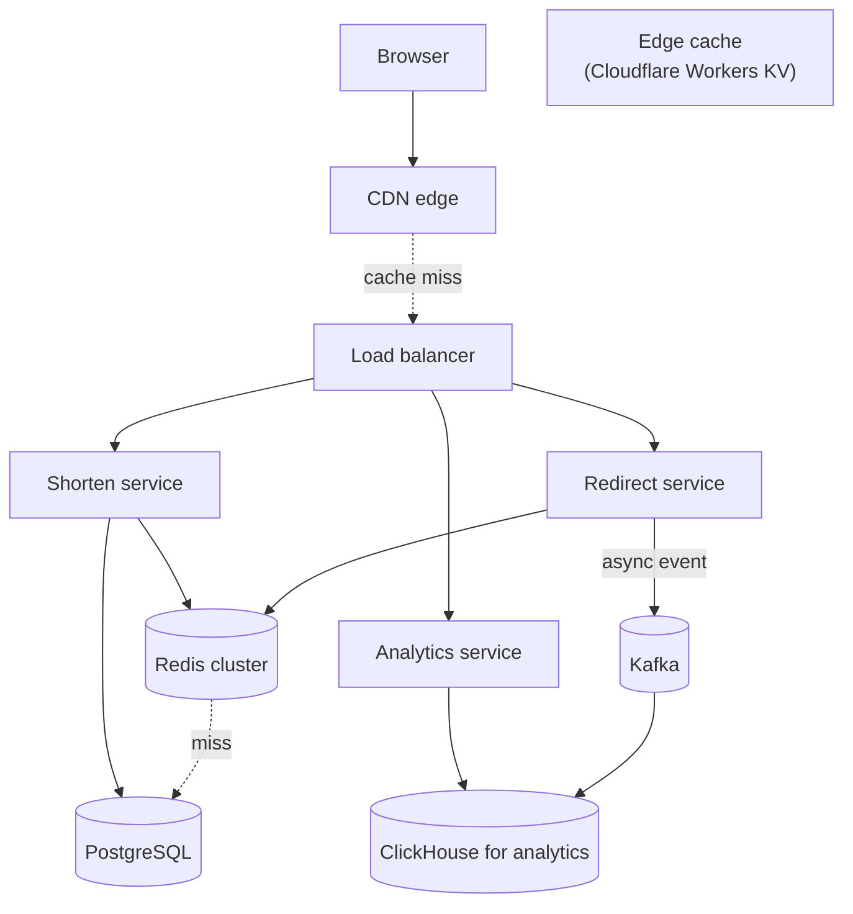
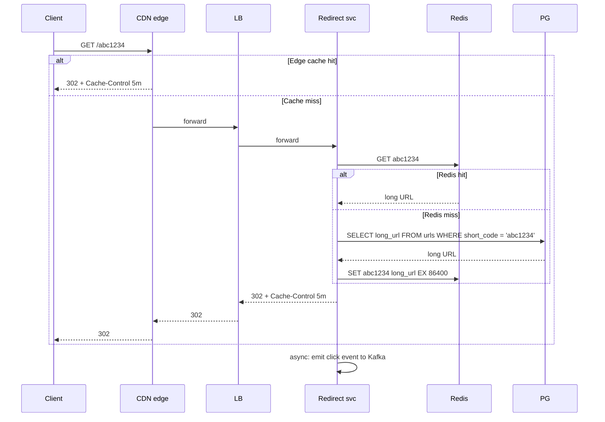

# Worked Design: URL Shortener

A URL shortener (Bitly, TinyURL, t.co) accepts a long URL and returns a short URL that, when clicked, redirects to the long one. The system is small enough to fit in a 45-minute interview yet rich enough to exercise capacity estimation, ID generation, caching, replication, and analytics. **This is the canonical "first" system-design question** — Google asks it, Meta asks it, Amazon asks it, every consulting interview asks it — because a good answer reveals whether the candidate can balance simplicity against scale.

This walkthrough runs the seven-step framework from [T16](./T16-system-design-methodology-framework.md) end to end. The final design serves a billion-redirects-per-day product on a manageable infrastructure, with explicit trade-offs at every decision.

## Where URL Shorteners Came From — TinyURL's 2002 Invention And The Twitter Catalyst

URL shortening is *not* a fundamental computing concept — it's a *response* to a specific 2002 web development problem: long URLs were hard to share. Understanding the origin reveals what URL shorteners actually optimize for and what trade-offs they make.

### The 2002 Origin — Kevin Gilbertson's TinyURL

The first major URL shortener was **TinyURL**, launched by **Kevin Gilbertson** in **January 2002**. Gilbertson, a Minnesota-based web developer, created TinyURL to solve a *personal* problem: he posted long URLs to unicycling newsgroups; the URLs broke when wrapped across multiple lines, becoming unclickable.

The TinyURL design was simple:

1. Generate a short identifier (typically 4-6 base-62 characters).
2. Store the mapping from short ID to long URL in a database.
3. Redirect requests to the short URL to the long URL.

TinyURL was *immediately popular*. Within months, it was being used by countless web users to share URLs in chat, email, and forums. By 2005, TinyURL handled millions of redirects per day.

The architecture was *radically simple* — a few servers, a single database, basic caching. The simplicity was a feature: TinyURL stayed up while more complex services failed.

### Bitly And The 2008 Twitter Era

The second major URL shortener was **Bitly** (then bit.ly), launched in 2008. Bitly's specific innovation: **analytics**. Users could see how many clicks their shortened URLs received, where the clicks came from, and when.

**Twitter's 140-character limit** (launched 2006, character limit imposed since launch) was the *killer use case* for URL shorteners. Tweets containing long URLs would exceed the limit; users needed short URLs. By 2008, Twitter had defaulted to URL shortening for any URL in a tweet.

Bitly capitalized on this. The company's analytics features became valuable for marketers and social media managers tracking campaign performance.

Twitter eventually introduced **t.co** (2010+) as Twitter's *own* URL shortener, automatically shortening all URLs in tweets. This was partly a *defense* against Bitly's analytics — Twitter wanted to know what URLs were being shared.

### Who Kevin Gilbertson Is

**Kevin Gilbertson** (born ~1970) is a Minnesota-based web developer with a specific passion for **unicycling**. He created **Unicyclist.com**, an early online community for unicyclists, and built TinyURL primarily to solve a problem on that community.

Gilbertson remained the *sole* operator of TinyURL for years. The service was profitable from ads and ran on minimal infrastructure. He sold a minority stake to investors in 2013 but maintained operational control.

The TinyURL story is a *small-business success* — a useful tool built by one person that became infrastructure for millions of users.

### The Modern URL Shortener Ecosystem

By 2024, URL shorteners are *infrastructure*. Major services include:

- **Bitly**: enterprise focus, analytics, branded links.
- **TinyURL**: free, simple.
- **t.co**: Twitter's internal shortener.
- **goo.gl** (discontinued 2018, replaced by Google's Firebase Dynamic Links).
- **fb.me**: Facebook's shortener.
- **rebrand.ly**, **ow.ly**, **buff.ly**: smaller services.

The market consolidated around a few major players. Most users don't choose; the platform they're using (Twitter, Facebook) selects the shortener.

### The Technical Lessons

URL shorteners taught the industry specific lessons:

1. **Simple infrastructure can scale far**: TinyURL handled millions of requests with basic architecture.
2. **Read-heavy workloads benefit from caching**: redirects vastly outnumber URL creations.
3. **Distributed ID generation matters**: as scale grows, single-machine ID generation becomes a bottleneck.
4. **Analytics is the business**: free redirection is the loss leader; analytics is the value.

These lessons appear in many subsequent system designs.

## Why URL Shortener Matters As An Interview Question, Specifically: The Senior Engineer's Q&A

### Q1: Why is this the canonical interview question?

Because **it tests the right things in 45 minutes**:

1. **Capacity estimation**: rough sizing of data and traffic.
2. **ID generation**: handling distributed identifiers.
3. **Caching**: read-heavy workload optimization.
4. **Replication**: high availability for redirects.
5. **Analytics**: secondary workload alongside primary.

These are exactly the concerns of distributed system design.

### Q2: What does a *bad* answer look like?

Three common failures:

1. **Skipping requirements**: jumping to architecture without understanding scope.
2. **Over-engineering**: designing for billion-user scale when millions suffice.
3. **Ignoring analytics**: focusing only on redirection.

Senior candidates avoid all three.

### Q3: What separates a senior from junior answer?

Three differences:

1. **Trade-off articulation**: senior candidates name what they're optimizing for.
2. **Scale awareness**: senior candidates rough-size before designing.
3. **Failure modes**: senior candidates discuss what happens when things go wrong.

Junior candidates often produce *cleaner* designs without these considerations. Senior candidates produce *messier* but more realistic designs.

### Q4: How long should I spend on each step?

Per the framework from T16:

- 5-7 min: requirements
- 3-5 min: capacity
- 5-7 min: API
- 5-7 min: data model
- 5-7 min: high-level architecture
- 10-15 min: deep dive
- 3-5 min: trade-offs

The senior practice: leave time for the deep dive and trade-offs; they distinguish strong from average answers.

### Q5: What variants exist?

Common variants:

1. **Custom short codes**: users specify their own.
2. **Branded domains**: bit.ly/yourbrand/x.
3. **Expiring URLs**: links that auto-expire.
4. **Password-protected URLs**: encrypted with passwords.
5. **Click analytics**: counting and analyzing clicks.

Senior candidates handle variants gracefully because the *core architecture* is unchanged.

## Common Misconceptions Explained

### "URL shorteners are simple."

Half true. **The core function is simple**; production-grade URL shorteners (Bitly's scale) involve sophisticated infrastructure.

### "Any database works."

False. The workload (extremely read-heavy, billion-scale) has specific requirements. Wrong database choice fails.

### "Caching solves everything."

Partially false. Caching handles hot URLs but cold URLs still need fast lookup. The system needs both.

### "Counter-based IDs are obvious."

Partially false. **Distributed counter** generation is non-trivial at scale. Single-counter bottleneck must be addressed.

### "Random IDs are simpler than counters."

False. Random IDs require collision detection. Counters avoid collisions but require coordination.

### "Analytics is an afterthought."

False. **Analytics is the business model** for most URL shorteners. Design must support analytics from the start.

> [!NOTE]
> Prerequisites: [System Design Methodology](./T16-system-design-methodology-framework.md), the C02 topics it depends on (partitioning, caching, replication, load balancing).

## Step 1: Clarify Requirements

### Functional

- **Shorten**: user submits a long URL; system returns a short URL.
- **Redirect**: visiting the short URL → 302 redirect to the long URL.
- **Custom alias**: optional user-supplied short code (`x.co/launch-2026`).
- **Expiration**: optional TTL on the short URL.
- **Analytics**: per-URL click counts (later — eventually consistent).

### Out Of Scope

- User authentication (assume identity is handled upstream).
- Admin dashboard.
- Bulk URL editing.
- Anti-abuse / phishing detection (mentioned but deferred).

### Non-Functional

- **Scale**: 100M DAUs; ~14M new URLs/day; ~1B redirects/day (≈ 100:1 read/write).
- **Latency**: redirect p99 < 100 ms (this is the user-visible path).
- **Availability**: 99.95% (the redirect path is critical for *other* sites — uptime matters).
- **Consistency**: strong for write-then-read of the same URL (mine should work immediately); eventual for analytics.
- **Durability**: a created short URL must not be lost.

## Step 2: Capacity Estimation

```
DAUs: 100M
Writes (new URLs): 14M/day → 14M / 86400 ≈ 165 writes/sec
Reads (redirects): 1B/day → 1B / 86400 ≈ 11,600 reads/sec average
Peak factor: 3× average → peak ~35,000 reads/sec

Storage per record:
  - id: 7 bytes (base62 7-char short code)
  - long_url: ~200 bytes average
  - user_id: 8 bytes
  - timestamps: 16 bytes
  - misc indexes: ~50 bytes
  - total: ~280 bytes per record

5 years of data:
  - 14M/day × 365 × 5 = ~25 billion URLs
  - 25B × 280B = 7 TB (manageable in PostgreSQL with partitioning; sharded if needed)

Bandwidth:
  - Redirect response: ~500 bytes
  - 35,000 × 500 = 17 MB/s = 136 Mbps
  - Negligible

Cache size (hot URLs):
  - Assume 10% of URLs receive 90% of clicks (heavy long-tail) → ~2.5B hot URLs over 5y
  - But only ~1% are *currently* hot → ~30M URLs
  - 30M × 300B = 9 GB → fits in a moderate Redis cluster
```

## Step 3: API Design

```http
POST /api/v1/urls
  Authorization: Bearer ...
  Idempotency-Key: uuid
  body: {
    "longUrl": "https://...",
    "customAlias": "launch-2026",       // optional
    "expiresAt": "2027-01-01T00:00:00Z" // optional
  }
  returns: 201 Created
  {
    "shortCode": "abc1234",
    "shortUrl": "https://x.co/abc1234",
    "longUrl": "https://...",
    "expiresAt": "2027-01-01T00:00:00Z"
  }

GET /{shortCode}
  → 302 Found
    Location: https://...long...url
    Cache-Control: max-age=300
  → 404 Not Found if expired or never existed

GET /api/v1/urls/{shortCode}/analytics
  Authorization: Bearer ...
  returns: {
    "totalClicks": 1234567,
    "byCountry": { "US": 800K, ... },
    "byDay": [ { "day": "2026-06-01", "clicks": 12345 }, ... ]
  }

DELETE /api/v1/urls/{shortCode}
  Authorization: Bearer ...
```

Notes:
- `Idempotency-Key` on POST ([T07](./T07-idempotency-and-deduplication.md)).
- The redirect uses 302 (temporary) not 301 (permanent), so analytics on each click. Major URL shorteners use 302.
- Cache-Control on the redirect; browsers cache it 5 minutes by default.

## Step 4: Data Model

```sql
-- Primary write store: PostgreSQL (or DynamoDB at higher scale)
CREATE TABLE urls (
  short_code   VARCHAR(10) PRIMARY KEY,
  long_url     TEXT NOT NULL,
  user_id      BIGINT,
  created_at   TIMESTAMPTZ NOT NULL DEFAULT NOW(),
  expires_at   TIMESTAMPTZ,
  is_deleted   BOOLEAN DEFAULT FALSE
);
CREATE INDEX idx_urls_user ON urls (user_id, created_at DESC);
CREATE INDEX idx_urls_expires ON urls (expires_at) WHERE expires_at IS NOT NULL;

-- Click events: separate write-heavy store
-- Option A: PostgreSQL append-only (good for ~100K/s)
-- Option B: ClickHouse / Druid / TimescaleDB for analytics workloads
-- Option C: Cassandra for raw events, ClickHouse for aggregations

-- For our scale (35K/s peak), append to Kafka then sink to ClickHouse
```

For 7 TB across 5 years and 35,000 reads/sec, **PostgreSQL with table partitioning (by `created_at` month) handles writes** and a Redis cache absorbs the reads. At 10× scale, consider DynamoDB.

## Step 5: High-Level Architecture



Three deployment regions (US, EU, APAC). DynamoDB Global Tables or Postgres logical replication for cross-region data. CDN caches redirects at the edge for hot URLs.

## Step 6: Deep Dives

### Deep Dive A: Short Code Generation

Three viable approaches:

**Option 1: Base62 random**. Generate a 7-character random base62 string. Check collision against the DB; retry if hit. With 62^7 ≈ 3.5 trillion combinations and 25B URLs, collision probability is ~0.7% over 5 years — manageable.

```java
String generate() {
  while (true) {
    String code = randomBase62(7);
    if (!db.exists(code)) {
      return code;
    }
  }
}
```

Trade-off: extra read per write to check collision. Use a Bloom filter to fast-path the non-existence check.

**Option 2: Snowflake-style ID + base62 encoding**. Each writer node has a worker ID; IDs are timestamp + worker + sequence, base62-encoded. No collisions by construction.

Trade-off: IDs are sequential within a worker, leaking creation order. Encoded length varies; we'd need to pad to a fixed 7 chars.

**Option 3: Counter + base62 encoding**. A global counter generates 1, 2, 3, ...; encode in base62. Trivial collision avoidance.

Trade-off: the counter is a write bottleneck unless distributed (Snowflake handles this). Predictable IDs are a leak (you can enumerate URLs).

**Decision: Option 1 (base62 random)** with a Bloom filter for pre-check. Simplicity, no predictability, scales easily. Some teams use Option 2 for higher write rates.

### Deep Dive B: Read Path And Caching

The redirect is the hot path. Target p99 < 100 ms includes network; the system itself should respond in <20 ms.



The CDN absorbs >90% of reads. Redis absorbs nearly all of the rest. PostgreSQL handles cold misses and writes. The DB sees a tiny fraction of total RPS.

**Cache invalidation**: on URL deletion, evict from Redis and rely on TTL for any edge caches.

### Deep Dive C: Analytics Pipeline

A click event is small (~200 bytes) but high-volume (35K/s peak). Synchronous DB writes would dominate write capacity.

Pattern: **async via Kafka → ClickHouse**.

```java
@RestController
class RedirectController {
  private final UrlService urls;
  private final KafkaTemplate<String, ClickEvent> kafka;

  @GetMapping("/{shortCode}")
  public ResponseEntity<Void> redirect(@PathVariable String shortCode, HttpServletRequest req) {
    String longUrl = urls.find(shortCode);
    if (longUrl == null) return ResponseEntity.notFound().build();
    kafka.send("click-events", new ClickEvent(shortCode, Instant.now(),
        req.getHeader("CF-IPCountry"), req.getHeader("User-Agent")));
    return ResponseEntity.status(HttpStatus.FOUND)
        .location(URI.create(longUrl))
        .header(HttpHeaders.CACHE_CONTROL, "max-age=300")
        .build();
  }
}
```

ClickHouse aggregates raw events into hourly/daily summaries. Analytics queries hit ClickHouse, not the raw events.

For "analytics" dashboards, p99 latency of 1–2 seconds is fine; the queries are pre-aggregated.

## Step 7: Trade-Offs And Failure Modes

### Trade-Offs

| Decision | Chosen | Alternative | Reason |
|----------|--------|-------------|--------|
| Storage | PostgreSQL | DynamoDB | Smaller scale; ops familiarity |
| Short code | Random base62 | Snowflake | Simplicity, no leak |
| Cache | Redis + CDN edge | Memcached or in-process | Distributed, cluster mode |
| Analytics path | Async Kafka → ClickHouse | Sync DB write | Decouple write throughput |
| Replication | Single primary + read replica | Multi-master | Simplicity; minor write availability cost |
| Consistency | Strong for own writes | Eventual everywhere | Write-then-read self-visibility |

### Failure Modes

- **CDN failure**: traffic falls back to origin; capacity 10× more than usual; rate-limit at gateway.
- **Redis failure**: all reads hit PostgreSQL; latency degrades to ~5 ms; capacity may saturate; degrade gracefully.
- **PostgreSQL primary failure**: failover to replica via Patroni; ~30 s RTO; recent writes (< 1 s) may be lost.
- **Kafka failure**: clicks are dropped (analytics gap); the user redirect still works.
- **Hot key (viral URL)**: the same Redis node sees disproportionate load; mitigated by CDN absorbing the bulk.

## Code Sketch

```java
@RestController
@RequiredArgsConstructor
class ShortenController {
  private final UrlService urls;
  private final IdempotencyStore idempotency;

  @PostMapping("/api/v1/urls")
  public ResponseEntity<ShortUrlResponse> shorten(
      @RequestHeader("Idempotency-Key") String idempotencyKey,
      @RequestBody @Valid ShortenRequest req,
      Authentication auth) {
    return idempotency.exec(idempotencyKey, () -> urls.create(req, auth.getName()));
  }
}

@Service
@RequiredArgsConstructor
class UrlService {
  private final UrlRepository repo;
  private final RedisTemplate<String, String> redis;

  public ShortUrlResponse create(ShortenRequest req, String userId) {
    String shortCode = req.customAlias() != null
        ? req.customAlias()
        : generateUniqueShortCode();
    Url url = new Url(shortCode, req.longUrl(), userId, Instant.now(), req.expiresAt());
    repo.save(url);
    redis.opsForValue().set(shortCode, req.longUrl(), Duration.ofDays(1));
    return ShortUrlResponse.from(url);
  }

  public String find(String shortCode) {
    String cached = redis.opsForValue().get(shortCode);
    if (cached != null) return cached;
    Url url = repo.findById(shortCode).orElse(null);
    if (url == null || url.isExpired()) return null;
    redis.opsForValue().set(shortCode, url.longUrl(), Duration.ofDays(1));
    return url.longUrl();
  }

  private String generateUniqueShortCode() {
    for (int i = 0; i < 5; i++) {
      String code = generateBase62(7);
      if (!repo.existsById(code)) return code;
    }
    throw new IllegalStateException("Failed to generate unique short code after 5 attempts");
  }
}
```

## Summary

A URL shortener at 1B redirects/day fits in a moderate-sized infrastructure: one PostgreSQL primary with replicas, a Redis cluster, a CDN, a Kafka cluster, and a ClickHouse instance for analytics. Spring Boot handles the application logic. The architecture is shaped by the 100:1 read-to-write ratio (heavy caching), the analytics-as-async pattern (Kafka decouples), and the durability requirement (Postgres primary not async-write).

> [!INTERVIEW]
> Strong candidates focus on the **read path with caching layers** (this is where the QPS lives), the **short-code generation strategy** (with collision discussion), and the **async analytics path**. Weak candidates over-engineer the data model and skip caching.

## Practice

1. **10× the scale.** Redesign for 10B redirects/day. What changes? (DynamoDB, sharded Redis, more CDN.)
2. **Custom domains.** Support `acme.co/launch-2026` for paying customers. How does routing change?
3. **Real-time analytics.** Move from "eventual" to "live" dashboards. What's the cost?
4. **Anti-abuse.** Add phishing-URL detection at write time. Sketch the path; identify the latency hit.
5. **Multi-region writes.** Allow writes in EU and APAC, not just US-East. Plan the cross-region replication.
6. **The custom-alias collision.** Two users try to claim `launch-2026` simultaneously. Resolve.
7. **The link-rotting analysis.** 30% of URLs in any 5-year-old shortener point to dead pages. Design a scanner.
8. **Pricing tiers.** Free tier: 1000 URLs/month. Paid tier: unlimited + custom domain + analytics export. How is each enforced?
9. **The interview retrospective.** Time yourself running this whole design from scratch in 45 minutes. Identify where you slow down.
10. **The skeptic conversation.** A junior engineer says "why not just use a database?" Write a 200-word response explaining what each layer (CDN, Redis, Postgres, Kafka, ClickHouse) is doing.

## Recap

You should now be able to:

- Run the **seven-step framework** end-to-end on a URL shortener in ~45 minutes.
- **Estimate capacity**: 100M DAUs → ~165 writes/s and ~35K reads/s peak → 7 TB over 5 years.
- Design **short-code generation** (random base62 with collision check) and defend against Snowflake-style alternatives.
- Build a **read path** that uses CDN edge → Redis → PostgreSQL with explicit cache lifetimes.
- Decouple the **analytics path** via Kafka and aggregate in ClickHouse.
- Articulate **trade-offs** for each decision and the failure modes.
- Recognize the **patterns**: hash-based KV store, heavy caching, async analytics.
- Adapt the design for **10× scale** by swapping Postgres → DynamoDB, scaling Redis cluster, and adding more CDN regions.

## Next

Continue to [Worked Design: Rate Limiter](./T18-worked-design-rate-limiter.md) — designing a distributed rate limiter at the scale of a public API.
