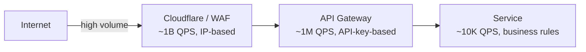

# Worked Design: Rate Limiter

Design a distributed rate limiter that protects a public API from abuse, fairly enforces per-customer plan limits, and handles 1M requests per second with sub-millisecond decision latency. The design is small enough that the constraints (low-latency decision, shared state across instances, fail-open vs fail-closed) dominate the conversation — the algorithm choice is straightforward; making it actually work at scale is the hard part.

## Why Rate Limiter Matters As An Interview Question

Rate limiting was covered comprehensively in [T13](./T13-rate-limiting-algorithms.md) (including the algorithm history from 1980s traffic shaping). This worked design adapts those concepts to the *system design interview format*.

The interview asks specifically:

1. **Algorithm choice**: token bucket vs sliding window vs others.
2. **Distributed coordination**: how do multiple rate limiter instances share state?
3. **Latency requirements**: sub-millisecond decisions at high request rates.
4. **Failure modes**: what happens when the rate limiter itself fails?

The senior judgment in this interview involves balancing *accuracy* (precise rate limits) against *performance* (low latency at high throughput).

### What Distinguishes A Senior Answer

Three distinguishing factors:

1. **Choosing fail-open over fail-closed**: the rate limiter shouldn't take down the API it protects.
2. **Distributed state management**: Redis is the typical answer; the senior candidate explains why.
3. **Configuration model**: how policies are defined and updated without redeployment.

### Common Mistakes

1. **Strict accuracy requirements**: real rate limiters tolerate some imprecision for performance.
2. **Centralized bottlenecks**: a single counter doesn't scale.
3. **Missing failure handling**: what if Redis is unavailable?

The senior answer addresses all three.

## Senior Engineer's Q&A For This Design

### Q1: Why fail-open instead of fail-closed?

**Answer**: A rate limiter's purpose is to *protect* the backend, not become a critical dependency itself. If the rate limiter fails:

- **Fail-open**: traffic flows through unconstrained. Worst case: temporary overload.
- **Fail-closed**: all traffic is rejected. Worst case: complete service outage.

The asymmetry: an overload is recoverable (auto-scale, degrade); a total outage is worse. For most APIs, fail-open is correct. Exceptions: regulatory rate limits where exceeding is illegal (rare).

### Q2: Why Redis for distributed state, not Cassandra or PostgreSQL?

**Answer**: Three reasons:

1. **Latency**: Redis is sub-millisecond; PostgreSQL is milliseconds; Cassandra is similar.
2. **Atomic operations**: Redis Lua scripts ensure atomicity for token-bucket updates.
3. **Memory pricing**: Redis is in-memory; the state is small (one counter per user); throwing memory at it is cheap.

Alternative: in-memory state per instance with eventual consistency. Loses precision; gains performance.

### Q3: How do you handle a 10x sudden traffic spike?

**Answer**: Three patterns:

1. **Tiered protection**: edge (CDN) rate limits first, gateway second, service third.
2. **Adaptive rate limits**: temporarily lower limits during overload.
3. **Backpressure signaling**: 429 with `Retry-After` headers.

The senior insight: rate limiting alone doesn't solve traffic spikes. It's one layer in a defense-in-depth strategy.

### Q4: How do you implement per-user fairness vs per-API-key?

**Answer**: Multiple levels:

- **Per-API-key**: the basic rate limit.
- **Per-user-within-key**: prevent one user from monopolizing.
- **Per-endpoint-within-user**: prevent one endpoint from monopolizing.

This becomes a complex multi-dimensional rate limit. Stripe-style: composite keys (user_id + endpoint + time_window).

### Q5: What about distributed token bucket vs sliding window?

**Answer**:

- **Token bucket**: simpler, allows controlled bursts, more common.
- **Sliding window log**: more accurate, higher memory cost.
- **Sliding window counter**: hybrid; common in production.

Stripe uses token bucket. Many high-end APIs use sliding window counter (better precision).

### Q6: How do you handle rate limit changes without redeployment?

**Answer**: Configuration service:

1. **Central config store**: Redis, Consul, or DynamoDB.
2. **SDK polls/subscribes**: services pick up changes within seconds.
3. **Validation**: prevent invalid configs (limit = 0, etc.).
4. **Audit**: log changes for compliance.
5. **Rollback**: ability to revert quickly.

The senior insight: rate limits are operational levers. They need to change quickly.

## Common Misconceptions Explained

### "Rate limiting prevents DoS attacks."

False. Rate limiting helps with *abuse* but doesn't stop true DoS attacks. Network-layer DDoS protection (CDN, BGP) handles those.

### "More accurate rate limits are always better."

False. Strict accuracy requires expensive distributed coordination. Most use cases tolerate ~5% imprecision for orders-of-magnitude better performance.

### "Rate limiting should reject all excess traffic."

False. Options: reject, queue, or shed (silently drop). The choice depends on whether the client can wait.

### "Per-IP rate limits are sufficient."

False. NAT means many users share one IP. APIs typically rate-limit by API key. Per-IP is fallback only.

### "Rate limit state must be perfectly consistent."

False. Brief inconsistency is acceptable. Eventually-consistent rate limiters perform much better.

### "Redis cluster mode handles all scalability needs."

Partially false. Redis cluster has limits (16384 slots). At extreme scale, you need sharding strategies.

> [!NOTE]
> Prerequisites: [Rate Limiting Algorithms](./T13-rate-limiting-algorithms.md) (algorithms), [Caching](./T11-caching-strategies-at-scale.md) (the rate-limit state is itself a hot cache), [Methodology](./T16-system-design-methodology-framework.md).

## Requirements

### Functional

- **Per-API-key limits**: each customer has a plan with requests-per-minute and requests-per-hour limits.
- **Per-endpoint differentiation**: expensive endpoints (`/search`) have lower limits than cheap ones (`/me`).
- **Per-IP fallback**: anonymous requests rate-limited by IP.
- **429 + Retry-After + X-RateLimit-* headers**: standard HTTP semantics.

### Out Of Scope

- DDoS mitigation (a separate edge / CDN concern).
- Quota / billing (longer-time-scale concern).

### Non-Functional

- **Decision latency**: < 1 ms p99 (added to every API request).
- **Throughput**: 1M req/s across the cluster.
- **Availability**: 99.99% (rate limiter must not be the single point of failure).
- **Consistency**: bounded error tolerable (off-by-a-few requests at boundaries is fine).
- **Fail-open**: when the rate-limit state is unreachable, fail open (allow), not fail-closed (block). The cost of a brief unlimited spike is less than the cost of a total API outage.

## Capacity Estimation

```
Requests: 1M req/s
Decision: 1 op per request → 1M rate-limit ops/s
State per key: a few small counters and timestamps → ~100 bytes
Active keys: ~10M (one per API key + IP)
State size: 10M × 100 B = 1 GB → comfortably in Redis cluster

Latency budget: < 1 ms means Redis must be reached and respond in << 1 ms
  → co-locate Redis with app, or use embedded cache + lazy sync
```

## API

The rate limiter is *internal* — invoked by every API request:

```java
public class RateLimitDecision {
  boolean allowed;
  long limit;
  long remaining;
  long resetAt;        // unix timestamp
  long retryAfter;     // seconds (when not allowed)
}

interface RateLimiter {
  RateLimitDecision check(String key, String resource);
}
```

The HTTP layer translates a denied decision to 429 with appropriate headers.

## Data Model

For sliding-window-counter, two counters per (key, resource):

```
Redis hash: ratelimit:{key}:{resource}
  current_window_start: unix-second
  current_count: int
  previous_count: int
```

Or for token bucket:

```
Redis hash: ratelimit:{key}:{resource}
  tokens: float
  last_refill: unix-nanos
```

## High-Level Architecture

```mermaid
flowchart LR
  Client --> Edge[Edge / CDN<br/>(coarse IP limits)]
  Edge --> Gateway[API Gateway<br/>(per-key limits)]
  Gateway -->|"check"| RL[Rate limiter library]
  RL -->|"if local-miss"| Redis[(Redis cluster)]
  RL -.-> Local[In-process cache<br/>(L1, optional)]
  Gateway --> Backend[Backend service]
```

**Multi-tier**: coarse limits at the edge / CDN (Cloudflare's built-in or AWS WAF), per-API-key limits at the application gateway, per-tenant business-level limits inside the service.

## Deep Dives

### Deep Dive A: The Sliding-Window Lua Script

Atomic in Redis:

```lua
-- KEYS[1] = "ratelimit:{api-key}:{endpoint}"
-- ARGV[1] = limit
-- ARGV[2] = window_ms
-- ARGV[3] = now_ms

local key = KEYS[1]
local limit = tonumber(ARGV[1])
local windowMs = tonumber(ARGV[2])
local nowMs = tonumber(ARGV[3])
local currentWindowStart = math.floor(nowMs / windowMs) * windowMs
local previousWindowStart = currentWindowStart - windowMs

local currentCountKey = key .. ':' .. currentWindowStart
local previousCountKey = key .. ':' .. previousWindowStart

local currentCount = tonumber(redis.call('GET', currentCountKey) or '0')
local previousCount = tonumber(redis.call('GET', previousCountKey) or '0')

local elapsedInCurrent = nowMs - currentWindowStart
local pctOfPrevious = (windowMs - elapsedInCurrent) / windowMs
local weighted = math.floor(previousCount * pctOfPrevious) + currentCount

if weighted < limit then
  redis.call('INCR', currentCountKey)
  redis.call('EXPIRE', currentCountKey, math.floor(windowMs / 1000) * 2)
  return {1, limit, limit - weighted - 1, currentWindowStart + windowMs}
else
  return {0, limit, 0, currentWindowStart + windowMs}
end
```

Atomic via Lua. One Redis round-trip per decision (~0.5 ms LAN). Each instance reads the script's SHA once and invokes via `EVALSHA`.

### Deep Dive B: Sharding And Hot Keys

A high-traffic API key concentrates load on one Redis node. Mitigations:

- **Composite key**: `ratelimit:{key}:{endpoint}:{shard}` where shard is the request hashed into a small set (e.g., 4 shards). Each shard tracks its own limit; the effective limit is `4 × per-shard-limit`. Loose but spreads load.
- **Local approximation**: each app instance counts locally; periodically syncs to Redis. Effectively `N × per-instance-limit` — only works if N is bounded.
- **Sharded Redis cluster**: spread keys across nodes naturally.

### Deep Dive C: Failure Modes — Fail-Open Vs Fail-Closed

If Redis is unreachable, what does the rate limiter do?

- **Fail-open** (allow): the API stays available; effective rate is unbounded for the outage duration.
- **Fail-closed** (deny): the API is unavailable; rate is exactly zero.

For most public APIs, **fail-open is correct** — the cost of brief unlimited access is small; the cost of total unavailability is huge. The rate limiter logs the failure and operators investigate.

Exceptions: critical resource limits (payment APIs, anti-fraud) where fail-closed is mandated.

### Deep Dive D: Tiered Architecture



Each tier has different limits and different state. The CDN absorbs gross abuse (millions of requests from one IP). The gateway enforces customer plans. The service enforces business rules (e.g., "only 10 orders per minute per user").

## Trade-Offs

| Decision | Chosen | Alternative | Reason |
|----------|--------|-------------|--------|
| Algorithm | Sliding window counter | Fixed window, token bucket | Boundary smoothness; works for most APIs |
| State | Redis cluster | DynamoDB | Lower latency (<1 ms vs 5 ms) |
| Approach | Centralized | Local with periodic sync | Strong enforcement vs eventual |
| Failure mode | Fail-open | Fail-closed | Availability over absolute correctness |
| Tier | Multi-layer | Single layer | Defense in depth |

## Failure Modes

- **Redis outage**: fall back to fail-open with local approximate limits.
- **Hot key (one API key dominates)**: degrade to coarse local limiting; alert on the imbalance.
- **Synchronized retry storm (client retries after 429)**: clients must honor Retry-After.
- **Spoofed API key**: edge IP-based limit catches volumetric abuse; gateway authn catches per-key.

> [!INTERVIEW]
> Strong answers cover (a) the algorithm choice with justification, (b) the distributed-state mechanism (Redis Lua), (c) fail-open vs fail-closed, (d) layered enforcement (edge → gateway → service).

## Deeper Dive — All 5 Rate-Limiting Algorithms Compared

### Algorithm 1: Fixed Window Counter

```
Window: [0:00:00 - 0:00:59]   counter = 0
Request arrives at 0:00:30    counter = 1
... limit = 100 reached at 0:00:45
Reject from 0:00:46 to 0:00:59
At 0:01:00 window resets      counter = 0
```

**Code (Redis)**:
```
INCR ratelimit:{key}:{window_minute_epoch}
EXPIRE ratelimit:{key}:{window_minute_epoch} 60
```

**Pros**: trivial implementation; 1 Redis op.

**Cons**: **boundary burst** — 100 requests at 0:00:59 + 100 at 0:01:01 = 200 in 2 seconds, breaking spirit of the limit.

### Algorithm 2: Sliding Window Log

Store each request timestamp:
```
ZADD ratelimit:{key} NOW NOW
ZREMRANGEBYSCORE ratelimit:{key} 0 (NOW - 60000)   # drop > 60s old
ZCARD ratelimit:{key}                               # count in window
EXPIRE ratelimit:{key} 60
```

**Pros**: exact precision; no boundary burst.

**Cons**: O(N) memory per key (one entry per request); ZADD/ZREM on every request expensive at scale.

### Algorithm 3: Sliding Window Counter (the "T18 default" above)

Hybrid of fixed-window simplicity + sliding-window smoothness. Weight previous-window count by fraction of current window remaining.

**Pros**: 1-2 Redis ops; smoothed; memory O(1) per key.

**Cons**: approximation (assumes uniform distribution within previous window).

### Algorithm 4: Token Bucket

Refill tokens at a steady rate; deduct one per request; deny when bucket empty.

```
Bucket state in Redis:
  HMSET ratelimit:{key} tokens N last_refill_ms NOW

On request:
  HMGET ratelimit:{key} tokens last_refill_ms
  elapsed = NOW - last_refill_ms
  new_tokens = MIN(capacity, tokens + (elapsed × refill_rate))
  if new_tokens >= 1:
    HMSET ratelimit:{key} tokens (new_tokens - 1) last_refill_ms NOW
    ALLOW
  else:
    DENY
```

**Pros**: allows **burst** up to bucket capacity, then steady rate. Best for APIs where occasional spikes are OK but sustained abuse is not.

**Cons**: 2 Redis ops; need Lua script for atomicity.

**Used by**: Stripe, AWS APIs, GitHub API.

### Algorithm 5: Leaky Bucket

Like token bucket but enforces uniform output rate. Requests queue; processed at steady rate; queue overflow rejects.

**Pros**: smooths output rate (no bursts at all).

**Cons**: in-memory queue per key; doesn't fit serverless / stateless.

**Used by**: traffic shaping (network routers), batch processing.

### Algorithm Selection Decision

| Use case | Algorithm |
|---|---|
| Simple internal limits, low scale | Fixed window |
| Strict per-second precision | Sliding window log (if scale permits) |
| Public API, large scale, smooth | Sliding window counter |
| Want burst capacity (typical API) | Token bucket |
| Strict output rate (e.g., outbound mailer) | Leaky bucket |

## Deeper Dive — Token Bucket Production Lua Script

```lua
-- KEYS[1] = bucket key  (e.g., "tb:user:123:api")
-- ARGV[1] = capacity (max tokens)
-- ARGV[2] = refill rate (tokens per second)
-- ARGV[3] = now (ms)
-- ARGV[4] = tokens requested (usually 1)

local key = KEYS[1]
local capacity = tonumber(ARGV[1])
local refillRate = tonumber(ARGV[2])
local now = tonumber(ARGV[3])
local requested = tonumber(ARGV[4])

local bucket = redis.call('HMGET', key, 'tokens', 'last_refill')
local tokens = tonumber(bucket[1]) or capacity
local lastRefill = tonumber(bucket[2]) or now

local elapsed = math.max(0, now - lastRefill)
local newTokens = math.min(capacity, tokens + (elapsed / 1000) * refillRate)

local allowed = newTokens >= requested
if allowed then
    newTokens = newTokens - requested
end

redis.call('HMSET', key, 'tokens', newTokens, 'last_refill', now)
redis.call('EXPIRE', key, math.ceil(capacity / refillRate) * 2)  -- key TTL = 2× refill time

return { allowed and 1 or 0, math.floor(newTokens), capacity, math.ceil((capacity - newTokens) / refillRate * 1000) }
-- returns: allowed (1/0), remaining tokens, capacity, retry-after-ms
```

Spring Boot integration:
```java
@Component
public class TokenBucketRateLimiter {
    private static final String LUA_SCRIPT = "..."; // load from classpath
    private final RedisTemplate<String, String> redis;
    private final DefaultRedisScript<List> script;

    public TokenBucketRateLimiter(RedisTemplate<String, String> redis) {
        this.redis = redis;
        this.script = new DefaultRedisScript<>(LUA_SCRIPT, List.class);
    }

    public RateLimitResult allow(String key, int capacity, int refillRatePerSec) {
        @SuppressWarnings("unchecked")
        List<Long> result = redis.execute(script,
            List.of("tb:" + key),
            String.valueOf(capacity),
            String.valueOf(refillRatePerSec),
            String.valueOf(System.currentTimeMillis()),
            "1");
        return new RateLimitResult(
            result.get(0) == 1,    // allowed
            result.get(1).intValue(),  // remaining
            result.get(3).intValue()   // retry-after-ms
        );
    }
}
```

## Deeper Dive — Multi-Tenant Rate Limit Design

A real SaaS rate limiter handles multiple dimensions:

```
KEY HIERARCHY:
  account:123                  → 10,000 req/sec across all users
  account:123:user:456         → 1,000 req/sec per user
  account:123:user:456:endpoint:/api/payments → 100 req/sec per user-endpoint
  ip:1.2.3.4                   → 100 req/sec across all accounts from this IP

ON REQUEST:
  Check ALL applicable limits (most restrictive wins)
  Return 429 with Retry-After from the most restrictive

PIPELINE: 4 Redis Lua evaluations per request, parallelized via MULTI:
  MULTI
  EVALSHA token_bucket KEYS[account:123]              ...
  EVALSHA token_bucket KEYS[account:123:user:456]     ...
  EVALSHA token_bucket KEYS[account:123:user:456:ep]  ...
  EVALSHA token_bucket KEYS[ip:1.2.3.4]               ...
  EXEC
```

**Plan-based limits**:
```
Plan "free":     account:* → 10 req/sec
Plan "pro":      account:* → 100 req/sec
Plan "enterprise": account:* → 10,000 req/sec
```

Stored in a config service / DB; rate-limiter reads on first request, caches with TTL.

## Deeper Dive — Response Headers (Standard)

Always set these headers on every response (allowed or rejected):

```
X-RateLimit-Limit: 100           ← the limit
X-RateLimit-Remaining: 87        ← what's left in current window
X-RateLimit-Reset: 1700000400    ← unix timestamp when limit resets
Retry-After: 30                  ← (on 429 only) seconds to wait

(Optional, IETF draft)
RateLimit: limit=100, remaining=87, reset=30
RateLimit-Policy: 100;w=60       ← 100 requests per 60s window
```

This lets well-behaved clients self-throttle and reduces server load from 429-retry storms.

## Deeper Dive — Distributed Rate Limiter Failure Recovery

What happens when Redis flaps?

```
T+0:    Redis unreachable
T+0:    rate limiter falls open (allow everything)
T+5s:   alerts fire; on-call notified
T+30s:  decide: leave fail-open or switch to fail-closed?

OPTION A: Stay fail-open
  Pro:  API stays up; users see no impact
  Con:  attacker can abuse
  Best for: public APIs without billing-sensitive endpoints

OPTION B: Switch to local-only (each pod with own counters)
  Pro:  approximate protection (N pods × pod_limit)
  Con:  N times the intended limit
  Best for: APIs where over-limit costs $$$ (payments, ML inference)

OPTION C: Switch to fail-closed
  Pro:  exact protection
  Con:  API outage
  Best for: rare scenarios (fraud, compliance)
```

**Spring Cloud Gateway pattern**:
```yaml
spring.cloud.gateway:
  routes:
    - id: api
      filters:
        - name: RequestRateLimiter
          args:
            redis-rate-limiter.replenishRate: 10
            redis-rate-limiter.burstCapacity: 20
            denyEmptyKey: false      # fail-open behavior
            emptyKeyStatus: 200      # if Redis down, allow
            # OR
            denyEmptyKey: true
            emptyKeyStatus: 429      # if Redis down, deny
```

## Deeper Dive — Hot-Key Problem Solutions

**Scenario**: one API key sends 100k req/sec (one customer's batch job). All 100k hits one Redis node.

### Solution 1: Client-side splitting
Customer SDK splits requests across N sub-keys: `key-1`, `key-2`, ..., `key-N`. Customer's effective limit = `N × per-key-limit`. Loose but spreads load.

### Solution 2: Server-side sharding
Append a random shard suffix server-side:
```
client_key = "abc"
shard = hash(request_id) % 4
key = "ratelimit:abc:shard-" + shard
limit_per_shard = total_limit / 4
```
Approximate but distributes load.

### Solution 3: Two-tier counters
Each pod maintains a local counter. Sync to Redis every 100ms (batched):
```
Local: increment per-key counter on each request
Every 100ms: read all keys, INCRBY each in Redis, reset local counts
On Redis result: if account exceeded → deny locally
```
Approximate ±100ms drift but very fast read path.

### Solution 4: Sticky routing
Load balancer routes same key to same pod (consistent hashing). Each pod owns a subset of keys. Eliminates cross-pod state but requires routing logic.

## Deeper Dive — Real-World Rate Limiter Comparisons

| Service | Algorithm | Tier | Notes |
|---|---|---|---|
| **Stripe API** | Token bucket | Per-key | 100 req/sec for live, 25 for test; burst capacity |
| **GitHub API** | Sliding window | Per-token | 5000/hour authenticated; 60/hour anonymous |
| **AWS API Gateway** | Token bucket | Per-stage + per-method | Configurable; throttle 429 |
| **Cloudflare** | Token bucket + leaky bucket | Edge | 1B+ req/sec at edge level |
| **Twitter API** | Sliding window | Per-endpoint | Resets in 15-min windows |
| **Discord** | Sliding window | Per-route | Returns Retry-After in seconds |
| **Spring Cloud Gateway** | Token bucket (default) | Configurable | Uses Redis Lua under the hood |

## Practice

1. **Spec the Lua script.** Implement and test the sliding-window-counter Lua. Verify atomicity under concurrent decrement.
2. **Local approximation.** Implement per-instance local counters with periodic Redis sync. Measure the error vs centralized.
3. **Hot-key mitigation.** Design composite-key sharding for hot API keys. Test under load.
4. **Multi-tier scenario.** Simulate a 100× abuse spike. Show which tier absorbs it.
5. **Fail-open verification.** Stop Redis; verify the API stays up. Restart; verify limits resume.
6. **Per-endpoint policy.** Configure different limits per endpoint. Express as YAML / config-as-code.
7. **Bucket4j integration.** Use Bucket4j with Redis backend in Spring Boot. Compare to a hand-rolled Lua script.
8. **Cost analysis.** Estimate Redis cluster size, instance count, and cost for 1M QPS at 100 ms p99.
9. **Hierarchical limits.** Per-account aggregate + per-API-key per-account. Express the constraint graph.
10. **The skeptic conversation.** A team builds a rate limiter using `synchronized` in Java. Write a 200-word response on why it's broken at multi-instance scale.

## Recap

You should now be able to:

- Design a **distributed rate limiter** that handles 1M req/s with sub-millisecond decision latency.
- Implement a **sliding-window counter via Redis Lua** atomically.
- Recognize and handle **hot keys** via composite sharding or local approximation.
- Choose **fail-open** as the default for most public APIs; refuse fail-closed unless mandated.
- Apply **multi-tier rate limiting** at CDN, gateway, and service layers.
- Configure **per-endpoint and per-tier policies** as code.
- Anticipate failure modes (Redis outage, hot keys, retry storms, spoofed keys) and design for each.

## Next

Continue to [Worked Design: News Feed / Timeline](./T19-worked-design-news-feed-timeline.md) — the fan-out vs fan-in architecture for personalized timelines at scale.
