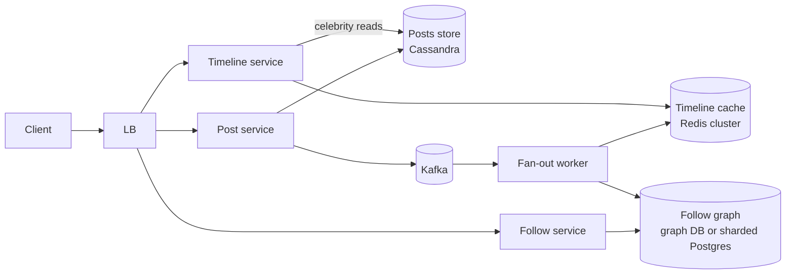
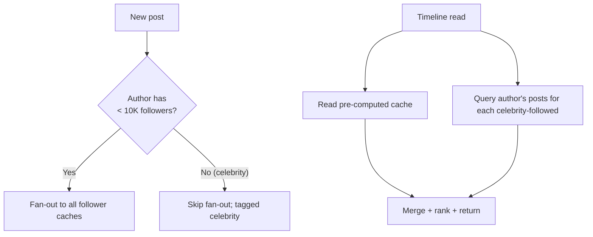

# Worked Design: News Feed / Timeline

Design a personalized news feed (Twitter timeline, Facebook feed, Instagram home) that shows each user a chronological or ranked list of posts from accounts they follow. The classic trade-off: do you compute the timeline at *write time* (fan-out: when someone posts, update every follower's feed) or at *read time* (fan-in: when someone opens the app, query all followed accounts)? Twitter's evolution from pull to push to hybrid is the canonical story; the answer for a system at scale is **hybrid**, with the line drawn deliberately.

## Where The News Feed System Came From — Facebook's 2006 News Feed And Twitter's Timeline

The "news feed" or "timeline" as a system design pattern was invented at **Facebook in 2006** and refined at **Twitter from 2008+**. The conceptual breakthrough — *aggregating content from many sources into one chronological stream* — was *not* obvious before these companies invented it.

### The 2006 Facebook News Feed Launch

**Facebook's News Feed** launched on **September 5, 2006**. Before the launch, Facebook users had to visit each friend's profile individually to see updates. The News Feed aggregated friends' activity into a single stream — a *radical* user experience change.

The launch was initially *controversial*. Users felt their privacy was violated as their activities became prominently visible. Protests erupted (the famous "Students against Facebook News Feed" Facebook group exceeded 700,000 members). Mark Zuckerberg posted an apology titled "An Open Letter from Mark Zuckerberg" within days.

But the news feed *worked*. Users spent dramatically more time on Facebook. Within months, the controversy died down and the News Feed became Facebook's central user experience.

Facebook's technical architecture for News Feed was *new* at internet scale:

1. **Activity aggregation**: collecting events from all friends.
2. **Ranking**: deciding which events to show.
3. **Real-time updates**: keeping feeds current.

The technical patterns Facebook invented became canonical for subsequent social media systems.

### Twitter's Timeline (2008+)

**Twitter** launched in 2006 but its timeline pattern emerged more gradually. Initially, Twitter showed a simple chronological list of followed users' tweets — *fan-in at read time* in the design vocabulary.

As Twitter grew, this approach became unsustainable. By 2008-2010, Twitter had moved to *fan-out at write time* — when a user tweets, the tweet is pushed to all followers' timelines.

The challenge: celebrity users (Justin Bieber, Lady Gaga) had millions of followers. Fan-out at write time meant a single celebrity tweet triggered millions of writes. Twitter eventually adopted a **hybrid approach**:

- **Normal users**: fan-out at write time.
- **Celebrity users**: fan-in at read time.
- **Hybrid for mixed cases**.

This hybrid pattern became *the* canonical news feed architecture. Twitter's specific scaling challenges (the "Justin Bieber problem") are now standard interview material.

### The 2014 Algorithm Era

The next major shift was **algorithmic ranking**. Facebook (2014+) and Twitter (2016+) moved from *chronological* feeds to *algorithmically-ranked* feeds — showing posts the user is most likely to engage with rather than most recent.

The technical implications:

1. **Engagement prediction**: ML models predicting clicks, likes, comments.
2. **Real-time ranking**: scoring posts as users open feeds.
3. **Feedback loops**: incorporating user actions into ranking models.

Algorithmic ranking is *the* current state of feed systems. Chronological feeds still exist (Twitter's "Latest" tab) but algorithmic is the default.

### The Pinterest, Instagram, And TikTok Variations

Modern feed systems vary by content type:

- **Instagram (2010)**: photo and video focus, algorithmic since 2016.
- **Pinterest (2010)**: visual discovery, less time-pressure.
- **TikTok (2018)**: short-form video, recommendation-driven.

TikTok's specific innovation was *prioritizing recommendation over follow graph*. The user's "For You" feed is largely from accounts they don't follow — algorithmic discovery dominates over social connection.

### The Algorithmic Feed's Controversies

By the 2020s, algorithmic feeds had become *controversial*:

- **Filter bubbles**: users see only what algorithms predict they'll like.
- **Misinformation amplification**: algorithms reward engagement, regardless of accuracy.
- **Mental health concerns**: especially for younger users.

The 2021 Facebook Papers (Frances Haugen's leaks) accelerated public concern. Regulatory pressure increased; Twitter (now X) and Meta both added options for chronological feeds.

These controversies don't change the *technical* design of feed systems but do change the *social* responsibility considerations.

## Why News Feed Matters As An Interview Question

The news feed question tests:

1. **Scale reasoning**: billions of users, millions of posts per second.
2. **Trade-off articulation**: fan-out vs fan-in.
3. **Edge case handling**: celebrity users, special accounts.
4. **Algorithmic vs chronological**: ranking complexity.

Senior candidates discuss the trade-offs explicitly. Junior candidates often jump to one approach.

## Senior Engineer's Q&A For This Design

### Q1: Why hybrid and not pure push or pull?

**Answer**: Pure push fails at scale because of celebrity users (millions of followers). Pure pull fails because of read amplification (every follower's read queries every followed user).

Hybrid leverages the *distribution* of follower counts. Most users have few followers; their posts can be pushed efficiently. A few celebrities have millions; their posts use pull.

Twitter discovered this empirically. Their early architecture was pure push; the Justin Bieber problem forced hybrid.

### Q2: How do you implement timeline ranking?

**Answer**: ML-based ranking has multiple stages:

1. **Candidate generation**: posts from followed users.
2. **Feature extraction**: signals about posts and users.
3. **Ranking model**: scores posts by predicted engagement.
4. **Diversification**: prevent monotonous feeds.

The senior insight: ranking adds significant complexity. Many systems start chronological, add ranking later when needed.

### Q3: How do you handle real-time updates?

**Answer**: Three patterns:

1. **Long-polling**: client polls; server holds connection until update.
2. **WebSocket**: bidirectional persistent connection.
3. **Push notifications**: APNs/FCM for mobile.

Modern systems use WebSocket for in-app; push notifications for closed-app. Twitter uses both.

### Q4: How do you handle the "celebrity user" problem?

**Answer**: Threshold-based bifurcation. Above N followers (typically 100K-1M), users are "celebrities":

- **Celebrity posts**: not pushed to follower feeds; pulled at read time.
- **Normal posts**: pushed to follower feeds.

Implementation challenges:
- **Threshold management**: when does someone become a celebrity?
- **Mixed feeds**: timeline combines pushed posts and pulled celebrity posts.
- **Latency**: celebrity post visibility delayed.

### Q5: How do you ensure timeline consistency across devices?

**Answer**: Client-side state synchronization:

1. **Cursor-based pagination**: client tracks position.
2. **Read receipts**: server knows what client has seen.
3. **Delta updates**: only new posts since last sync.

Cross-device challenges:
- **Eventually consistent state**: brief inconsistency between devices.
- **Conflict resolution**: which device's read state wins?

### Q6: How do you handle backfilling for new users?

**Answer**: New users have empty feeds. Options:

1. **Suggest popular accounts**: bootstrap with celebrity follows.
2. **Onboarding flow**: explicit topic selection.
3. **ML-based suggestions**: collaborative filtering on initial signals.
4. **Default content**: trending posts when user has no follows.

The senior insight: cold-start is a fundamental UX problem, not just technical.

## Common Misconceptions Explained

### "Chronological feeds are inherently better."

False. Algorithmic feeds increase engagement; chronological feeds are nostalgic. Both have valid use cases.

### "Pure push doesn't scale."

Partially true. Pure push has the celebrity problem but works fine for most users. Hybrid scales by handling both cases.

### "Timelines should be perfectly consistent across devices."

False. Strict consistency is expensive and rarely needed. Brief inconsistency is acceptable.

### "Fan-out at write time eliminates read complexity."

False. Hybrid still requires complex read logic. Fan-out simplifies *some* reads but not all.

### "Feed ranking is just about engagement."

False. Engagement is the metric; the goal is user value. Pure engagement optimization produces problematic outcomes (filter bubbles, misinformation).

### "Real-time updates require WebSockets."

False. Long-polling works fine for most use cases. WebSocket adds complexity for marginal benefit.

## Requirements

### Functional

- Users follow other users.
- Users post text/media items.
- Each user has a **home timeline**: a chronological (or ranked) feed of posts from followed accounts.
- Each user has a **profile timeline**: their own posts.
- Real-time: new posts appear "soon" (≤ a few seconds).

### Out Of Scope

- Direct messages.
- Notifications (separate system, see [T22](./T22-worked-design-notification-system.md)).
- Ads ranking.

### Non-Functional

- **Scale**: 500M DAUs, average 200 follows per user, posts at 10K/s, timeline reads at 1M/s peak.
- **Latency**: home timeline open in < 200 ms p99.
- **Availability**: 99.9% — feed must be usable.
- **Consistency**: eventual is fine (a tweet from 3 seconds ago appearing in 5 seconds is acceptable).

## Capacity Estimation

```
DAUs: 500M
Posts/s: 10K
Follows: average 200 per user, max ~100M for celebrities

Timeline reads: 1M/s peak

Storage (assume tweets are ~500 bytes including metadata):
  10K/s × 86400 × 365 = ~320B tweets/year
  320B × 500B = 160 TB/year → use compressed columnar storage

Pre-computed timelines (push model):
  500M users × 800 cached tweets × 100 bytes (ID + minimal metadata) = 40 TB
  → distributed Redis or specialized stores

Fan-out cost:
  10K posts/s × average 200 followers = 2M fan-out writes/s
  Sustainable with sharded Redis; celebrities (1M+ followers) are the problem
```

## API

```http
POST /api/v1/posts
  body: { "text": "...", "media": [...] }
  returns: { "postId": "...", "createdAt": "..." }

GET /api/v1/timeline/home?cursor=...
  returns: { "posts": [...], "nextCursor": "..." }

GET /api/v1/timeline/{userId}
  returns: { "posts": [...] }

POST /api/v1/follow/{userId}
DELETE /api/v1/follow/{userId}
```

## High-Level Architecture



## Deep Dive A: Push Vs Pull Vs Hybrid

### Push (Fan-Out On Write)

When user A posts, the system writes to every follower's pre-computed timeline cache.

- **Pros**: read is O(1) — fetch from Redis.
- **Cons**: write is O(N) where N = followers. Celebrity with 100M followers = 100M writes per post.

### Pull (Fan-In On Read)

When user opens the app, query all followed users' recent posts and merge.

- **Pros**: write is O(1).
- **Cons**: read is O(follows) — 200 queries per timeline open at 1M/s = 200M backend QPS. Worse for users following many accounts.

### Hybrid (The Right Answer)

- **Push** for normal users (most posts go to a handful of followers).
- **Pull** for celebrities (posts go to too many followers to push to all).
- **Mix on read**: for each user, fan-out has pre-filled their cache with normal accounts' posts; the read also queries their celebrity follows and merges.



The cutoff (10K or 1M followers) is tuned; Twitter's history suggests around 1M.

## Deep Dive B: Storage Of Posts And Timelines

**Posts**: append-heavy, read-by-author. Cassandra is a natural fit: partition by `user_id`, clustering by `timestamp DESC`. Bounded retention (90 days hot, archive longer).

**Timeline cache**: Redis. Per-user list of recent post IDs (e.g., last 800). Capped, with LRU eviction.

```
LPUSH timeline:{user_id} post_id
LTRIM timeline:{user_id} 0 799
```

The fetch is `LRANGE timeline:{user_id} 0 30`, returning 30 IDs. The post-fetch service then bulk-loads post content from Cassandra.

## Deep Dive C: Ranking

For a chronological timeline, the cache IS the order. For a *ranked* timeline (Facebook-style "interesting posts first"), an ML ranking layer scores and reorders per request.

```mermaid
flowchart LR
  Cache --> Candidates[Candidate posts<br/>(800 recent)]
  Candidates --> Features[Featurization<br/>(user features + post features)]
  Features --> Model[Ranking model]
  Model --> Ranked[Top 30 ranked]
```

Ranking adds 50–100 ms; cache the ranked output briefly to absorb repeat views.

## Trade-Offs

| Decision | Chosen | Alternative | Reason |
|----------|--------|-------------|--------|
| Fan-out | Hybrid | Pure push or pull | Celebrity problem makes pure push infeasible |
| Timeline storage | Redis list per user | Materialized view in DB | Latency; LRU built-in |
| Post storage | Cassandra | DynamoDB / Postgres | Append-heavy, partitioned by user |
| Ranking | Async, cached | Inline | Latency budget |
| Real-time | Push-on-read polling | WebSocket / SSE | Simpler; periodic-fetch is fine |

## Failure Modes

- **Fan-out backlog**: a celebrity posts; the queue grows. Bound queue size; degrade to "available on read" if backed up.
- **Redis cluster overload**: shard further; cap per-user timeline depth.
- **Hot user**: a celebrity's profile timeline read-heavy; cache the celebrity's profile timeline at a CDN.
- **Cold cache after restart**: rebuild from Cassandra slowly; live traffic uses degraded-mode pull.

## Code Sketch

```java
@RestController
class TimelineController {
  private final TimelineService timeline;

  @GetMapping("/api/v1/timeline/home")
  public TimelineResponse home(Authentication auth) {
    return timeline.homeTimelineFor(auth.getName());
  }
}

@Service
class TimelineService {
  private final RedisTemplate<String, String> redis;
  private final PostRepository posts;
  private final FollowGraph follows;
  private final RankingService ranking;

  public TimelineResponse homeTimelineFor(String userId) {
    // Pre-computed timeline IDs from fan-out
    List<String> ids = redis.opsForList().range("timeline:" + userId, 0, 800);

    // For celebrities the user follows, merge in their recent posts on read
    List<String> celebs = follows.celebrityFollowsOf(userId);
    List<Post> celebPosts = celebs.stream()
        .flatMap(c -> posts.recentByAuthor(c, 30).stream())
        .toList();

    List<Post> cached = posts.bulkLoad(ids);
    List<Post> combined = mergeByTime(cached, celebPosts);

    return new TimelineResponse(ranking.rank(combined, userId).subList(0, 30));
  }
}
```

> [!INTERVIEW]
> Strong candidates draw the **fan-out diagram with the celebrity-handling branch** unprompted, propose the **hybrid push/pull** model, and articulate **why pure-push doesn't work** at scale.

## Deeper Dive — End-to-End Spring Boot Implementation Sketch

### Post Creation with Hybrid Fan-out

```java
@Service
@Transactional
public class PostService {
    private final PostRepo postRepo;
    private final FollowGraph followGraph;
    private final KafkaTemplate<String, FanoutEvent> kafka;

    public Post create(String userId, String content) {
        // 1. Write the post (source of truth)
        Post post = postRepo.save(new Post(
            UUID.randomUUID().toString(),
            userId,
            content,
            Instant.now()
        ));

        // 2. Check follower count to decide push vs pull
        long followerCount = followGraph.followerCount(userId);
        if (followerCount < CELEBRITY_THRESHOLD) {     // e.g., 10,000
            // PUSH: enqueue fanout job
            kafka.send("post-fanout", new FanoutEvent(post.id(), userId, followerCount));
        }
        // ELSE: PULL on read — followers' read path will query celebrity timelines

        return post;
    }
}
```

### Fan-out Worker (Async Push to Followers' Timelines)

```java
@Component
public class FanoutConsumer {
    private static final int CELEBRITY_THRESHOLD = 10_000;
    private static final int TIMELINE_MAX_SIZE = 800;

    @KafkaListener(topics = "post-fanout", concurrency = "8")
    public void consume(FanoutEvent event) {
        // Stream followers in batches to avoid loading all into memory
        followGraph.streamFollowers(event.authorId())
            .buffer(1000)
            .forEach(batch -> redis.executePipelined((RedisCallback<?>) connection -> {
                for (String followerId : batch) {
                    String key = "timeline:" + followerId;
                    long score = event.timestamp().toEpochMilli();
                    connection.zSetCommands().zAdd(
                        key.getBytes(), score, event.postId().getBytes()
                    );
                    connection.zSetCommands().zRemRange(
                        key.getBytes(), 0, -TIMELINE_MAX_SIZE - 1
                    );
                    connection.keyCommands().expire(key.getBytes(), Duration.ofDays(30));
                }
                return null;
            }));
    }
}
```

**Critical**: stream followers in batches; never load 10M follower IDs into memory. Use Redis pipeline for batch ZADDs.

### Read Path — Merge Push Cache + Pull from Celebrities

```java
@Service
public class TimelineService {
    private static final int CELEBRITY_THRESHOLD = 10_000;
    private static final int PAGE_SIZE = 20;

    public List<Post> getTimeline(String userId, String cursor, int limit) {
        // 1. Read from user's push timeline cache
        Set<String> cachedPostIds = redis.opsForZSet()
            .reverseRange("timeline:" + userId, 0, 200);

        // 2. Find which followed users are celebrities (need pull-side fetch)
        List<String> celebrities = followGraph.followingsAbove(userId, CELEBRITY_THRESHOLD);

        // 3. Pull recent posts from each celebrity timeline
        List<Post> celebPosts = celebrities.parallelStream()
            .flatMap(celebId -> postRepo.findLatestByAuthor(celebId, 100).stream())
            .toList();

        // 4. Merge + sort + paginate
        List<Post> cachedPosts = postRepo.findByIds(cachedPostIds);
        return Stream.concat(cachedPosts.stream(), celebPosts.stream())
            .distinct()
            .sorted(Comparator.comparing(Post::createdAt).reversed())
            .skip(cursor == null ? 0 : Long.parseLong(cursor))
            .limit(limit)
            .toList();
    }
}
```

### Celebrity Cache (For Read-Side Pull Efficiency)

```java
@Service
public class CelebrityFeedService {
    @Cacheable(value = "celebrity-feed", key = "#celebId",
               unless = "#result.isEmpty()")
    public List<Post> recentPosts(String celebId, int n) {
        return postRepo.findLatestByAuthor(celebId, n);
    }
}
```

Cache TTL: 30 seconds. Trade-off: ~30s staleness for hot celebrity feeds vs DB load.

## Deeper Dive — Capacity Math (Twitter-scale)

```
INPUTS
  Daily active users (DAU)     : 500M
  Avg followers per user       : 200
  Avg posts per user per day   : 2
  Avg writes per user per day  : 2 posts × 200 followers = 400 timeline writes

WRITE QPS
  Posts/sec               : 500M × 2 / 86400 = 11.6k posts/sec
  Fanout writes/sec       : 11.6k × 200 = 2.3M timeline ZADDs/sec
  At peak (3× avg)        : ~7M ZADDs/sec

Tier-1 storage (push timelines) on Redis cluster
  Timeline size           : 800 post IDs × 30 bytes = ~24 KB per user
  Total storage           : 500M × 24 KB = 12 TB
  With 3× replication     : 36 TB
  Across ~70 r6gd.4xlarge : ~500 GB each = comfortable

READ QPS
  Timeline reads/sec      : 500M × 5 (avg sessions/day) / 86400 = 29k reads/sec
  Peak                    : ~87k reads/sec
  P99 target              : < 200ms

POST METADATA (DB)
  Posts/day               : 500M × 2 = 1B posts/day
  At 1KB avg              : 1 TB/day → ~365 TB/year
  → MUST be sharded (Cassandra or Postgres + sharding proxy like Vitess)
  Hot range partitioning by author + date
```

### Celebrity Math

```
WHAT IF NO CELEBRITY CUTOFF?
  Justin Bieber: 100M followers
  His one tweet → 100M Redis ZADDs
  At 1ms per ZADD on shard, even parallelized to 1000 shards → 100k operations/shard
  Each ZADD also evicts oldest → 200k operations/shard
  Total Redis load for ONE Bieber tweet ≈ 200M operations
  At 100 ZADDs/sec/shard headroom → 33 minutes of Redis saturation per tweet

WITH CELEBRITY CUTOFF AT 10K:
  Celebrity tweet → 0 fan-out writes
  Followers' read path: 1 extra Redis lookup per celebrity-following relation
  Net: 100M Bieber follows → 100M extra reads spread over multiple days, manageable
```

## Deeper Dive — Real-Time Push (WebSocket/SSE for "New Tweet" Notification)

```java
@Component
public class FeedRealtimeService {
    private final ConcurrentMap<String, List<SseEmitter>> emitters = new ConcurrentHashMap<>();

    public SseEmitter connect(String userId) {
        SseEmitter emitter = new SseEmitter(Duration.ofMinutes(30).toMillis());
        emitters.computeIfAbsent(userId, k -> new CopyOnWriteArrayList<>()).add(emitter);
        emitter.onCompletion(() -> remove(userId, emitter));
        emitter.onTimeout(() -> remove(userId, emitter));
        return emitter;
    }

    @KafkaListener(topics = "new-posts-realtime")
    public void onNewPost(NewPostEvent event) {
        // Notify followers who are currently connected
        followGraph.streamFollowers(event.authorId())
            .forEach(followerId -> {
                List<SseEmitter> userEmitters = emitters.get(followerId);
                if (userEmitters == null) return;
                userEmitters.removeIf(emitter -> {
                    try {
                        emitter.send(SseEmitter.event()
                            .name("new-post")
                            .data(Map.of("postId", event.postId(), "authorId", event.authorId())));
                        return false;
                    } catch (Exception e) {
                        return true;   // remove dead connection
                    }
                });
            });
    }
}
```

**For scale**: SSE emitter pool per pod, sticky LB routing (consistent hash by userId) so user's connection lands on same pod that gets their realtime events.

## Deeper Dive — Ranking Pipeline

```
USER REQUESTS TIMELINE
  ↓
1. Candidate Generation (50ms budget)
   - Read 200 latest items from push cache
   - Pull 200 latest items from each followed celebrity (parallel)
   - Merge to ~500 candidate posts
  ↓
2. Feature Hydration (30ms)
   - For each candidate: pull author features, post features, viewer-author affinity
   - Batch by feature service
  ↓
3. ML Ranking (50ms)
   - Score each candidate with a learned model (TensorFlow Serving, etc.)
   - Returns predicted engagement probability
  ↓
4. Re-ranking / Diversification (10ms)
   - Apply business rules: no >3 from same author, no >2 ads in row, mix content types
   - Diversity penalties (reduce similar posts)
  ↓
5. Pagination
   - Return top 20 for this request; cache the full ranked list for next page
   - Cache key: userId + ranking_version, TTL ~10 min

Total budget: 140ms server-side. p99 wire latency ~200ms.
```

### Cold-Start for New Users

```
New user signs up → no follows → no timeline cache → empty feed?
NO — bootstrap with:
  - Popular posts globally (last 24h)
  - Posts from accounts the user is likely to follow (based on signup interests)
  - Sponsored / promotional posts
  → Mix with explicit user feedback ("interested", "not interested")
```

## Deeper Dive — Failure Modes Comprehensive Table

| Failure | Impact | Mitigation |
|---|---|---|
| Redis cluster down | Reads fall back to DB (~10× slower); writes lost | Fallback to DB query; queue fanout; alert on cache hit rate |
| Fanout backlog grows | Followers see stale timelines | Scale Kafka consumers; alert on lag |
| Celebrity threshold misconfigured | Either fan-out storms or excessive reads | A/B test threshold; monitor both sides |
| Hot follower (read amplification) | One follower's pulls saturate Redis shard | Cache per-celebrity timeline; consistent-hash celebrity to dedicated cache |
| Timeline cache eviction storm | Cascade reads to DB | Probabilistic early refresh + DB query rate limiting |
| Database hot partition | Posts from popular author all in one shard | Salt the partition key with hash(post_id) |
| Ranking model failure | Empty/wrong-order feed | Fall back to chronological |
| WebSocket connection spike | Connection limit hit | Sticky LB + connection pool per pod + horizontal scaling |
| Spam attack (millions of follows) | Fanout storm | Rate-limit follow creates; verify follower account before counting |
| GDPR data deletion | Posts in millions of cached timelines | Tombstone in cache; lazy filter on read; backfill cleanup async |

## Deeper Dive — Twitter vs Instagram vs LinkedIn vs Facebook News Feed

| Aspect | Twitter | Instagram | LinkedIn | Facebook |
|---|---|---|---|---|
| Order | Reverse-chrono (option for ranked) | Algorithmic | Algorithmic | Algorithmic (heavy) |
| Following model | Asymmetric | Asymmetric | Symmetric (connect) | Symmetric (friend) |
| Content types | Text + media (mixed) | Photo/video first | Articles + posts | Mixed |
| Realtime emphasis | High | Medium | Low | Medium |
| Push vs pull | Hybrid (celebrity threshold ~10k) | Hybrid (heavy push) | Mostly pull (ranking) | Hybrid + heavy ranking |
| Cache strategy | Per-user timeline list | Per-user list + ranking | Pre-computed buckets | Heavy ML caching |
| Feed depth | ~800 items | ~500 items | ~200 items | 500-1000 items |

**Insight**: as content per second grows (TikTok-style), pure push becomes infeasible; algorithmic timelines dominate. Twitter's purely chronological model was an anomaly that held until 2016.

## Practice

1. **Set the celebrity threshold.** Justify a follower count threshold for push vs pull. What does the operational cost look like at each side?
2. **Real-time arrival.** Sketch how new posts arrive in the user's feed: polling, WebSocket, SSE. Pick one for your design.
3. **Ranking integration.** Where does the ranking model run? Cost vs latency.
4. **Timeline depth.** Why 800 cached items? What's the cost of 100 vs 5000?
5. **Multi-tenant scale.** Design for 5 different products' timelines (Twitter, Instagram, LinkedIn) — what differs?
6. **The unfollow.** What happens to cached timelines when a user unfollows? Lazy vs eager invalidation.
7. **Backfill on user-creation.** New user signs up; what's in their timeline before they follow anyone?
8. **A/B testing ranking.** Run two ranking models live; route 5% of users to each. Sketch the routing.
9. **Geo-distribution.** Multiple regions; posts from EU users vs US users; consistency story.
10. **The skeptic conversation.** A junior engineer says "let's just query the DB on each read." Write a 200-word response on the QPS math.

## Recap

You should now be able to:

- Design a **hybrid push/pull timeline** that handles 500M DAUs.
- Compute **fan-out cost** and identify the celebrity problem.
- Use **Redis lists** for pre-computed timeline caches with LRU eviction.
- Layer **ranking** on top of chronological retrieval with appropriate latency budget.
- Choose between **chronological and ML-ranked** timelines per product.
- Anticipate failures: fan-out backlog, hot users, Redis overload, cold cache after restart.

## Next

Continue to [Worked Design: Chat / Messaging](./T20-worked-design-chat-messaging.md) — persistent connections, pub/sub, message storage at scale.
