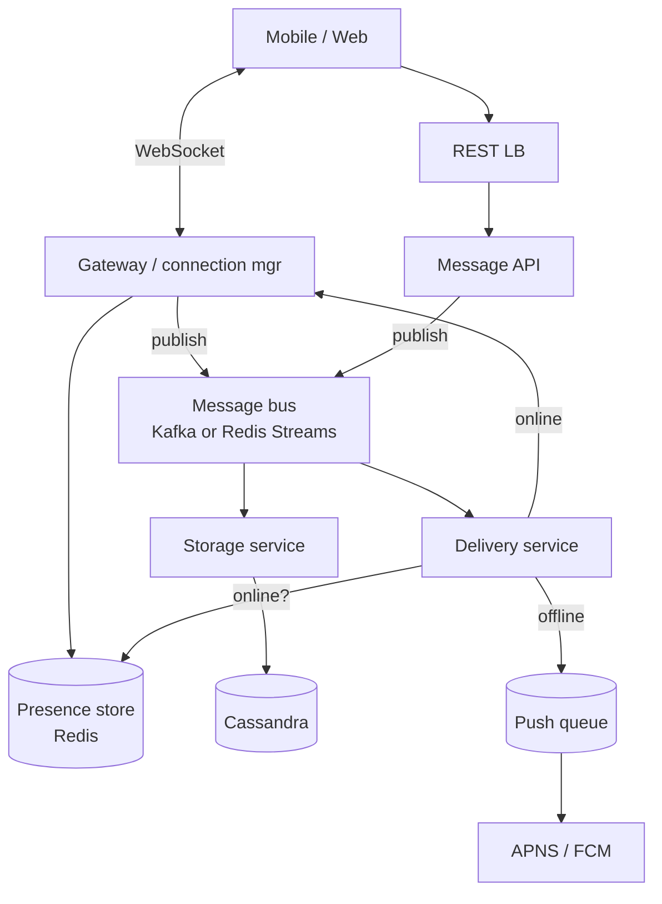
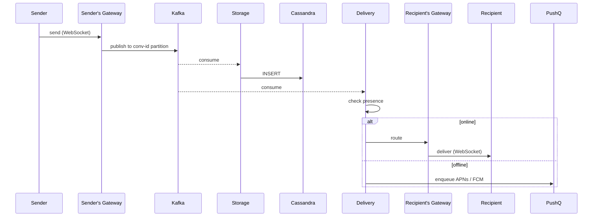

# Worked Design: Chat / Messaging

Design a real-time messaging system (WhatsApp, Signal, Slack, Discord). The defining characteristic: clients hold **persistent connections** for real-time delivery, and messages must reach recipients within seconds even when they're offline (push notifications + offline queue). The architecture combines a persistent-connection layer (WebSocket or similar), a message store (durable across delivery), a presence service (who's online), and a push-notification fallback.

## Where Real-Time Chat Systems Came From — From IRC To WhatsApp

Real-time chat has a long history that predates modern smartphone messaging by decades. The patterns used today descend from **IRC (1988)**, **AIM and ICQ (1996-1997)**, **WhatsApp (2009)**, and **Signal (2014)**. Each era added specific capabilities.

### The IRC Origin (1988)

**Internet Relay Chat (IRC)** was created by **Jarkko Oikarinen** in **August 1988** at the University of Oulu, Finland. IRC was *the* first widely-deployed real-time chat protocol on the internet.

IRC's design:

- **Server-based**: clients connect to servers; servers federate.
- **Channel-based**: conversations happen in named channels.
- **Plain text protocol**: easily debugged.
- **No persistence**: messages exist only while users are connected.

By the 1990s, IRC was *the* internet's chat infrastructure. EFNet, Undernet, and DALnet networks served millions of users. IRC remains in use today, particularly in technical communities.

### The 1996-1997 Consumer Messaging Era — AIM And ICQ

The consumer messaging era began with two services in 1996-1997:

- **ICQ** (Mirabilis, Israel, 1996): "I Seek You" — peer-to-peer style messaging.
- **AOL Instant Messenger (AIM)** (1997): bundled with AOL, became dominant in the US.

These services introduced:

- **Persistent identity**: usernames that survived across sessions.
- **Buddy lists**: friend lists with presence indicators.
- **Offline messaging**: messages delivered when recipient comes online.

By 2000, AIM had hundreds of millions of users. Microsoft (MSN Messenger), Yahoo, and Google followed with their own services.

### The Mobile Era — WhatsApp (2009) And iMessage (2011)

The smartphone era transformed messaging. **WhatsApp** (founded by Jan Koum and Brian Acton, 2009) was the breakthrough:

- **Phone number-based identity**: no separate usernames.
- **Free across countries**: bypassed expensive SMS charges.
- **Smartphone-native**: built specifically for mobile.
- **Lightweight protocol**: XMPP-based, optimized for mobile bandwidth.

By 2014, WhatsApp had 500 million users. Facebook acquired it for $19 billion — at the time, the largest tech acquisition ever.

**iMessage** (Apple, 2011) provided similar capabilities for iPhone users, with Apple's specific advantage: pre-installed on every iPhone.

### Who Jan Koum Is

**Jan Koum** (born 1976) emigrated from Ukraine to the US as a teenager. He worked at Yahoo as a security engineer before co-founding WhatsApp in 2009. His personal experience with expensive international communication (calling family in Ukraine) motivated WhatsApp's free-international focus.

Koum left Facebook in 2018 after disagreements over WhatsApp's monetization and encryption policies. He's known for his commitment to user privacy.

### The Encryption Era — Signal (2014+) And Default E2EE

**Signal** (Moxie Marlinspike and Stuart Anderson, 2014) introduced **default end-to-end encryption (E2EE)** for messaging. Pre-Signal, E2EE existed but required user configuration. Signal made it the default.

The Signal protocol (based on the Double Ratchet algorithm) became the standard for E2EE messaging. WhatsApp adopted it in 2016. Google Messages adopted it via RCS in 2020-2023.

By 2024, E2EE is the *default* for most consumer messaging. The privacy improvement is substantial; the technical complexity is significant.

### Who Moxie Marlinspike Is

**Moxie Marlinspike** (born 1980, pseudonym for Matthew Rosenfeld) is an American cryptographer and software developer. His prior work includes:

- **TextSecure** (2010): pre-Signal encrypted messaging.
- **RedPhone** (2012): encrypted voice calls.
- **SSL vulnerability research**: 2009 BlackHat presentation.

Marlinspike led Signal from 2014 to 2022. The Signal Foundation (founded 2018 with WhatsApp co-founder Brian Acton's $50M donation) continues his work.

Marlinspike's commitment to *open-source cryptography* and *user privacy* shapes Signal's design choices. The result is one of the most-trusted messaging platforms.

### The Modern Chat System Patterns

By 2024, chat system patterns are well-established:

1. **WebSocket connections**: for real-time delivery.
2. **Message stores**: typically Cassandra or similar.
3. **Push notifications**: APNs (Apple) and FCM (Google).
4. **End-to-end encryption**: Signal protocol or similar.
5. **Presence services**: tracking who's online.

The technical patterns evolved from decades of experience. Today's systems benefit from accumulated knowledge.

## Why Chat Matters As An Interview Question

The chat question tests:

1. **Real-time architecture**: persistent connections, push delivery.
2. **Scale handling**: billions of messages per day.
3. **Offline reliability**: queueing and delivery guarantees.
4. **Group dynamics**: handling large group chats.

Senior candidates address all four. Junior candidates often miss one or more.

## Senior Engineer's Q&A For This Design

### Q1: Why WebSocket instead of HTTP polling?

**Answer**: WebSocket provides true real-time delivery with lower overhead.

HTTP polling characteristics:
- Periodic requests (e.g., every 5 seconds).
- Latency: average half the polling interval.
- Overhead: HTTP headers per request.
- Server load: constant requests from idle clients.

WebSocket characteristics:
- Persistent connection.
- Latency: near-zero (network only).
- Overhead: minimal after initial handshake.
- Server load: idle connections cost little.

For chat, WebSocket's real-time delivery is essential.

### Q2: How do you handle offline message delivery?

**Answer**: Multi-layer approach:

1. **Server-side message storage**: messages persist regardless of recipient status.
2. **Delivery state tracking**: per-recipient delivery state.
3. **Push notifications**: APNs/FCM when recipient is offline.
4. **Sync on reconnect**: client requests missed messages.

Specific challenges:
- **Duplicate detection**: client sees same message twice (push + sync).
- **Read receipts**: how do you know recipient saw the message?

### Q3: How do you scale to billion-user groups (Discord servers)?

**Answer**: Server-level sharding:

1. **Channel sharding**: large channels split across multiple servers.
2. **Voice room limits**: voice channels have member caps.
3. **Permission caching**: avoid permission checks on every message.
4. **Lazy loading**: don't sync all member data on connect.

Discord-specific techniques:
- **Member chunking**: only load visible members.
- **Permission inheritance**: cached up the channel hierarchy.

### Q4: How do you implement end-to-end encryption?

**Answer**: Signal Protocol or similar:

1. **Key exchange**: Diffie-Hellman or X3DH.
2. **Per-message keys**: forward secrecy.
3. **Identity verification**: prevent MITM.
4. **Multi-device support**: each device has its own keys.

Trade-offs:
- **No server-side search**: messages encrypted before reaching server.
- **No server-side moderation**: same reason.
- **Complex multi-device**: each device must be enrolled.

### Q5: How do you handle message ordering across devices?

**Answer**: Hybrid logical clocks or vector clocks.

Mechanisms:
1. **Server timestamps**: monotonic per channel.
2. **Client-side ordering**: based on server timestamps.
3. **Conflict resolution**: last-write-wins for edits.

Specific challenges:
- **Concurrent messages**: tie-breaking.
- **Network delays**: messages arrive out of order.

### Q6: How do you handle typing indicators and presence?

**Answer**: Best-effort delivery without persistence:

1. **WebSocket events**: typing/presence broadcast.
2. **Rate limiting**: don't spam typing events.
3. **TTL**: presence expires automatically.
4. **No storage**: ephemeral by design.

Senior insight: presence is a UX feature, not core functionality. Best-effort is appropriate.

## Common Misconceptions Explained

### "Chat systems are just message stores."

False. Real-time delivery, presence, push notifications, encryption — chat is significantly more complex than a message store.

### "WhatsApp's architecture works for all chat."

False. Discord (groups), Slack (workplace), iMessage (Apple ecosystem) have very different architectures. Each optimized for its use case.

### "End-to-end encryption is binary."

False. E2EE has gradations: server can see metadata; client devices store decrypted messages; backup mechanisms vary.

### "Push notifications are reliable."

False. APNs/FCM have delivery failures. Chat systems must handle "notification was sent but not received."

### "Group chats are just N 1-on-1 chats."

False. Group dynamics (permissions, moderation, mentions) are fundamentally different.

### "Real-time means zero latency."

False. Even WebSocket has network latency. "Real-time" means seconds, not microseconds.

## Requirements

### Functional

- 1-to-1 messages and group messages (up to ~1000 members).
- Real-time delivery to online clients.
- Offline queue + push notification.
- Read receipts (1-to-1) and per-member delivery state (groups).
- Message history with search.
- Multimedia attachments (image, video, file).

### Out Of Scope

- Voice / video calling.
- End-to-end encryption (mention as an extension, since it changes the design).

### Non-Functional

- **Scale**: 2B accounts, 100B messages/day, 50M concurrent connected.
- **Latency**: in-app delivery < 500 ms p99.
- **Availability**: 99.99%.
- **Consistency**: per-conversation ordering must be preserved.
- **Durability**: messages must not be lost.

## Capacity Estimation

```
Connected users: 50M concurrent
Messages: 100B/day → 1.16M/s average; peak ~5M/s
Avg message size: 100 bytes; multimedia separate
Daily new bytes: 100B × 100 = 10 TB/day
Annual: 3.6 PB → cold storage tier eventually
50M connections × 100 KB per connection (TCP + TLS state) = 5 TB → 5K servers at 1M conns each (heavy duty)
```

## API

```http
WebSocket: /ws
  send: { "type": "message", "to": "conv_id", "body": "..." }
  receive: { "type": "message", "from": "user_id", "to": "conv_id", "body": "...", "ts": "..." }

REST:
POST /api/v1/messages
GET /api/v1/conversations/{id}/messages?cursor=...
GET /api/v1/conversations
POST /api/v1/conversations  // create group
```

## Data Model

```sql
-- Messages: append-heavy, partition by conversation
CREATE TABLE messages (
  conv_id    UUID,
  msg_id     UUID,
  sender_id  UUID,
  body       TEXT,
  attached   JSONB,
  ts         TIMESTAMPTZ,
  PRIMARY KEY (conv_id, ts, msg_id)
) PARTITION BY HASH (conv_id);

-- Conversations
CREATE TABLE conversations (
  id          UUID PRIMARY KEY,
  type        TEXT,            -- 'direct' or 'group'
  created_at  TIMESTAMPTZ
);

CREATE TABLE conversation_members (
  conv_id     UUID,
  user_id     UUID,
  joined_at   TIMESTAMPTZ,
  last_read   UUID,            -- last read message id
  PRIMARY KEY (conv_id, user_id)
);
```

Use Cassandra or HBase for messages (wide rows by conversation, append-heavy, time-ordered).

## High-Level Architecture



## Deep Dive A: Persistent Connections

WebSocket gateway holds connections. Each user → exactly one gateway instance (sticky by session token via consistent-hash LB). The gateway:

1. Authenticates the connection on upgrade.
2. Tracks the user as "online" in Redis (TTL'd).
3. Subscribes to a delivery channel.
4. Receives messages and forwards to the WebSocket.

State per connection is ~100 KB (TCP, TLS, app state). A single beefy host handles ~100K connections; 50M concurrent needs ~500 hosts.

## Deep Dive B: Message Flow

1. Sender's WebSocket → gateway.
2. Gateway publishes to Kafka topic `messages` (partition = conv_id, preserves order).
3. Storage service consumes, writes to Cassandra.
4. Delivery service consumes; for each recipient:
   - Look up presence in Redis.
   - If online: route to the gateway holding that connection (gateway-to-gateway via an internal pub/sub).
   - If offline: enqueue push notification.
5. Recipient's app reconnects later → fetches new messages from Cassandra.



## Deep Dive C: Ordering And Idempotency

Per-conversation ordering: Kafka partition = `conv_id`, single partition per conversation, single consumer per partition. Strict ordering guaranteed.

Message IDs: client-generated UUIDs serve as **idempotency keys** — duplicate sends produce one stored message.

## Deep Dive D: Read Receipts

Per-user `last_read` pointer in `conversation_members`. Receipts are aggregations:

```sql
-- "Joe has read up to msg_id X" → update conversation_members
UPDATE conversation_members SET last_read = $msg_id WHERE user_id = $user AND conv_id = $conv;
```

For groups: compute receipts on read by joining members' `last_read` against messages — or precompute aggregates per group.

## Deep Dive E: Group Messages At Scale

A 1000-member group: every message fans out to 1000 recipients. With 5M msg/s peak and 1000-member groups, the fan-out could be 5B/s — infeasible.

Mitigations:
- Most groups are small (median 5 members). The 1000-member case is rare.
- For large groups, fan-out is async — recipients pull recent messages on app open.
- Read receipts in large groups aggregate (don't track per-recipient; track ranges).

## Trade-Offs

| Decision | Chosen | Alternative | Reason |
|----------|--------|-------------|--------|
| Transport | WebSocket | gRPC streaming, SSE | Bidirectional, broad client support |
| Message store | Cassandra | DynamoDB | Wide rows by conv, append-heavy |
| Routing | Kafka by conv_id | Direct point-to-point | Order preserved per conversation |
| Presence | Redis with TTL | DB-backed | Latency, scale |
| Offline delivery | Push queue → APNS/FCM | Always pull | Real-time UX |

## Failure Modes

- **Gateway crash**: clients reconnect to another gateway; presence updates; missed messages backfilled on reconnect.
- **Kafka outage**: messages can't be delivered; queue at the gateway side; degrade to "sent" state with retry.
- **Cassandra outage**: messages still delivered live (in-memory routing); persistence catches up after recovery.
- **Push provider outage**: queue retries; user sees notification eventually.

## End-to-End Encryption (Note)

E2EE (Signal, WhatsApp) means servers can't read message content. Implications:

- Search must happen client-side.
- Read receipts and metadata still server-tracked (timestamps, recipients).
- Key exchange (X3DH, Double Ratchet) requires careful infrastructure.
- Adds significant complexity; out of scope for the basic design.

> [!INTERVIEW]
> Strong candidates draw the **gateway / connection layer separately from the storage layer**, name **Kafka partition = conv_id** for ordering, and articulate **online vs offline routing**.

## Deeper Dive — Full Production Implementation Sketch

### WebSocket Gateway with Redis-Backed Session Registry

```java
@Component
public class ChatGateway extends TextWebSocketHandler {
    private final SessionRegistry registry;     // Redis-backed
    private final MessageProducer producer;
    private final Map<String, WebSocketSession> localSessions = new ConcurrentHashMap<>();

    @Override
    public void afterConnectionEstablished(WebSocketSession session) {
        String userId = (String) session.getAttributes().get("userId");
        String connectionId = UUID.randomUUID().toString();
        localSessions.put(connectionId, session);

        // Tell Redis: "userId is on gateway-pod=X with connection=Y"
        registry.register(userId, podHost(), connectionId);
    }

    @Override
    public void handleTextMessage(WebSocketSession session, TextMessage msg) throws Exception {
        ChatMessage chat = json.readValue(msg.getPayload(), ChatMessage.class);

        // 1. Idempotency-key dedup at producer
        if (recentMessageCache.containsKey(chat.idempotencyKey())) return;
        recentMessageCache.put(chat.idempotencyKey(), true);

        // 2. Publish to Kafka, partitioned by conv_id (preserves ordering)
        producer.send("chat-messages", chat.convId(), chat);
    }

    @Override
    public void afterConnectionClosed(WebSocketSession session, CloseStatus status) {
        String userId = (String) session.getAttributes().get("userId");
        String connectionId = (String) session.getAttributes().get("connectionId");
        localSessions.remove(connectionId);
        registry.unregister(userId, podHost(), connectionId);
    }
}
```

### Session Registry (Redis)

```java
@Component
public class SessionRegistry {
    private final RedisTemplate<String, String> redis;

    public void register(String userId, String podHost, String connectionId) {
        // Sorted set per user: connection_id → pod_host:connection_id
        redis.opsForHash().put(
            "presence:" + userId,
            connectionId,
            podHost + ":" + Instant.now().toEpochMilli()
        );
        redis.expire("presence:" + userId, Duration.ofMinutes(5));
    }

    public List<UserSession> findActiveSessions(String userId) {
        Map<Object, Object> entries = redis.opsForHash().entries("presence:" + userId);
        return entries.entrySet().stream()
            .map(e -> UserSession.parse((String) e.getKey(), (String) e.getValue()))
            .filter(s -> !s.isStale(Duration.ofMinutes(5)))
            .toList();
    }

    public void unregister(String userId, String podHost, String connectionId) {
        redis.opsForHash().delete("presence:" + userId, connectionId);
    }
}
```

### Message Delivery Service (Kafka Consumer)

```java
@Component
public class MessageDeliveryConsumer {
    private final SessionRegistry registry;
    private final CassandraTemplate cassandra;
    private final PushNotificationService push;
    private final RestTemplate restTemplate;

    @KafkaListener(topics = "chat-messages", concurrency = "16")
    public void deliver(ChatMessage msg) {
        // 1. Persist to Cassandra (durable storage)
        cassandra.insert(msg);   // partition_key = (conv_id, time_bucket), clustering by msg_id

        // 2. Get conversation members
        Set<String> recipients = conversationService.members(msg.convId());

        // 3. For each recipient, deliver
        recipients.parallelStream()
            .filter(uid -> !uid.equals(msg.senderId()))
            .forEach(uid -> deliverToUser(uid, msg));
    }

    private void deliverToUser(String userId, ChatMessage msg) {
        List<UserSession> sessions = registry.findActiveSessions(userId);

        if (sessions.isEmpty()) {
            // OFFLINE: queue + push notification
            offlineQueue.enqueue(userId, msg);
            push.send(userId, buildPushPayload(msg));
            return;
        }

        // ONLINE: deliver to each active gateway pod via RPC
        sessions.forEach(session -> {
            try {
                restTemplate.postForObject(
                    "http://" + session.podHost() + "/internal/push/" + session.connectionId(),
                    msg,
                    Void.class
                );
            } catch (Exception e) {
                // Pod might be dying; will retry on reconnect; push fallback
                push.send(userId, buildPushPayload(msg));
            }
        });
    }
}
```

### Cassandra Schema (Message Storage)

```sql
CREATE TABLE messages (
    conv_id UUID,
    time_bucket TEXT,       -- e.g., "2024-W23"  (weekly bucket prevents huge partitions)
    msg_id TIMEUUID,
    sender_id UUID,
    body TEXT,
    media_url TEXT,
    edited_at TIMESTAMP,
    PRIMARY KEY ((conv_id, time_bucket), msg_id)
) WITH CLUSTERING ORDER BY (msg_id DESC);

CREATE TABLE conversation_members (
    conv_id UUID,
    user_id UUID,
    joined_at TIMESTAMP,
    last_read_msg_id TIMEUUID,
    PRIMARY KEY (conv_id, user_id)
);

CREATE TABLE user_conversations (
    user_id UUID,
    conv_id UUID,
    last_msg_id TIMEUUID,
    last_msg_preview TEXT,
    PRIMARY KEY (user_id, conv_id)
);
```

**Time bucketing rationale**: a chat that's been active for 2 years would create a partition with millions of rows otherwise. Weekly buckets cap partition size.

## Deeper Dive — Capacity Math (WhatsApp-Scale)

```
INPUTS
  Active users (daily)             : 2B DAU
  Concurrent connections           : 250M (12.5% of DAU active at any moment)
  Messages per user per day        : 40
  Average message size             : 100 bytes

WEBSOCKET GATEWAY
  Connections per pod              : 50,000 (with tuned kernel: file descriptors, TCP buffers)
  Pods needed                      : 250M / 50k = 5,000 gateway pods
  AWS m6a.4xlarge cost             : ~$0.55/hr × 5000 = $66M/year just for gateways

MESSAGE THROUGHPUT
  Messages/sec (avg)               : 2B × 40 / 86400 = 925k msg/sec
  Peak (3× avg)                    : 2.8M msg/sec
  Kafka cluster                    : 2.8M × 100B = 280 MB/sec; 12 brokers @ 50MB/sec each

STORAGE
  Storage/day                      : 2B × 40 × 100B = 8 TB/day
  6-month retention                : ~1.5 PB
  Cassandra ring at 6 TB/node      : 250 nodes (with RF=3)

DELIVERY LATENCY
  Sender → Gateway                 : 5-20 ms (WS roundtrip)
  Gateway → Kafka                  : 5-10 ms (LAN)
  Kafka → Consumer                 : 5-10 ms
  Consumer → Cassandra write       : 10-15 ms (RF=3)
  Consumer → Recipient Gateway     : 5-10 ms
  Gateway → Recipient WS frame     : 5-20 ms
  TOTAL: ~50ms steady state
  + Push fallback: ~1-3 seconds (APN/FCM)
```

## Deeper Dive — Group Chat at Scale (Discord-Style Servers)

```
PROBLEM: a Discord server with 1M members. Someone posts a message.
  Naive: 1M Cassandra writes (one per recipient's inbox) → 1M pod-to-pod RPCs.

DISCORD'S SOLUTION (read-side scatter):
  Store messages ONCE per conversation (channel_id partition).
  Recipients PULL from their channels' partitions.
  Send "new message" notification only to ACTIVE clients (those subscribed to channel right now).

KEY INSIGHT: most of 1M members aren't reading that channel right now.
  Notification: gateway pods subscribe to "channel-X-updates" Kafka topic.
  Gateway pods, upon seeing the event, look up which CONNECTED users
    have this channel open → push to only those WS connections.
```

```java
@Component
public class ChannelSubscriptionGateway {
    private final Map<String, Set<String>> channelToConnections = new ConcurrentHashMap<>();

    public void subscribe(String userId, String connectionId, String channelId) {
        channelToConnections.computeIfAbsent(channelId, k -> ConcurrentHashMap.newKeySet())
            .add(connectionId);
    }

    @KafkaListener(topics = "channel-events")
    public void onChannelEvent(ChannelEvent event) {
        Set<String> connections = channelToConnections.get(event.channelId());
        if (connections == null) return;
        connections.forEach(connId -> {
            WebSocketSession s = localSessions.get(connId);
            if (s != null) s.sendMessage(toFrame(event));
        });
    }
}
```

**Per-pod state**: which of MY connections subscribed to which channels. Kafka delivers channel events to ALL gateway pods (high topic partition count); each pod filters to its local connections.

## Deeper Dive — Reliable Delivery (At-Least-Once + Dedup)

Each message has a client-generated `idempotencyKey` (UUID). Server tracks recent keys per conversation.

```
CLIENT SEND
  generates uuid; sends with message
  retries on network failure (using SAME uuid)

GATEWAY
  receives message; checks recent-keys cache (last 5 min)
  if duplicate → ack send, drop
  else → produce to Kafka, ack send

CASSANDRA
  message stored with idempotencyKey as part of (or check on) msg_id
  duplicates filtered at storage

RECIPIENT GATEWAY
  delivers to recipient WS
  recipient ACKs reception (back through chat-acks Kafka topic)
  on no ACK after timeout → retry delivery (recipient's deduper drops duplicates)
```

Client-side dedup:
```javascript
const seenMessages = new Set();
ws.onmessage = (msg) => {
    const chat = JSON.parse(msg.data);
    if (seenMessages.has(chat.idempotencyKey)) return;   // already seen
    seenMessages.add(chat.idempotencyKey);
    renderMessage(chat);
};
```

## Deeper Dive — Read Receipts and Typing Indicators

```
READ RECEIPTS
  When user opens chat → client sends "read_marker" event with last_seen_msg_id
  Stored in conversation_members table per user
  Senders see read receipt as visualization (small avatar moves to read line)

  PRIVACY: aggregate read receipts (no per-msg-per-reader granularity); option to disable
  COST: every "read" is a Cassandra UPDATE → ~100M/sec at WhatsApp scale
        → batch by 1-2 seconds; debounce

TYPING INDICATORS
  Client sends "typing_start"/"typing_stop" ephemeral events
  NOT persisted; delivered via gateway → Kafka → recipient gateways
  TTL: typing event expires 3 seconds after last "typing_start"
  COST: small but non-trivial; channel subscription model helps
```

## Deeper Dive — End-to-End Encryption (Signal Protocol)

For E2EE chats, server can't read content. Architecture changes:

```
KEY EXCHANGE (Signal's X3DH)
  Each user uploads identity-key + signed-prekey + one-time-prekeys to server
  Sender fetches recipient's keys, performs X3DH → shared secret
  Establishes initial ratchet state

MESSAGE ENCRYPTION (Double Ratchet)
  Each message encrypted with per-message key (forward secrecy)
  Server sees: ciphertext + recipient_id + ephemeral routing metadata
  Server CANNOT read body, but DOES know:
    - Who sends to whom
    - Message timing
    - Group membership

WHAT BREAKS WITH E2EE
  ❌ Server-side search (encrypted bodies)
  ❌ Spam filtering (need client-side)
  ❌ Federated identity (key management complexity)
  ❌ Backups (encrypted backup with user-managed key)
  ❌ Read-receipts (encrypted; server can't verify)

SIGNAL IS REFERENCE IMPL; WhatsApp uses it; iMessage uses similar.
```

## Deeper Dive — Failure Modes Comprehensive Table

| Failure | Impact | Mitigation |
|---|---|---|
| Gateway pod crash | 50k connections drop; clients reconnect | Clients auto-reconnect with exponential backoff; sticky LB routes to any healthy pod |
| Kafka broker unavailable | Producers queue locally; lag grows | Producer buffer (64MB); local disk overflow; alerts |
| Cassandra hot partition | Writes timeout on popular conversation | Time-bucketing partitions; alert on partition size |
| Push provider (APN/FCM) down | Offline users don't get push | Queue + retry with backoff; fall back to email if critical |
| Region failover | Users on failed region can't send | Active-active multi-region; clients connect to nearest healthy |
| Spam attack (10M messages) | Cassandra/Kafka saturate | Rate-limit per-sender; ban senders with high spam score |
| Synthetic message replay | Old message reappears | Server-side idempotency cache for last 5 min |
| Connection limit reached | New users can't connect | Auto-scale gateway pods; increase ulimit/sysctl |
| Gateway-to-gateway RPC timeout | Online delivery fails; push fallback | Push notification as universal fallback path |
| Database schema change | Rolling deploy broken | Schema migrations are forward-compatible; expand-contract pattern |

## Practice

1. **WebSocket vs SSE.** Why WebSocket and not Server-Sent Events?
2. **Gateway scaling.** 50M concurrent connections; how many hosts; cost.
3. **Sticky routing.** How does the LB ensure a user reconnects to the same gateway? When does it have to?
4. **Group fan-out.** For a 1000-member group, sketch the delivery graph.
5. **Multi-region.** Users in different regions; cross-region message latency.
6. **End-to-end encryption.** Add E2EE to your design; identify what changes.
7. **Search.** Implement message search; consider Elasticsearch indexing.
8. **Media attachments.** Image / video upload flow; CDN delivery.
9. **Anti-spam.** Detect and block spammers in real-time.
10. **The skeptic conversation.** A junior engineer says "let's poll for new messages." Write a 200-word response on why persistent connections are necessary.

## Recap

You should now be able to:

- Design a **persistent-connection + Kafka + Cassandra + push-fallback** chat system at 50M concurrent.
- Use **WebSocket gateway** with sticky routing and presence-tracking.
- Preserve **per-conversation ordering** via Kafka partition = conv_id.
- Implement **online + offline + push** delivery paths.
- Scale **group fan-out** with async delivery and aggregated receipts.
- Identify failure modes (gateway crash, Kafka outage, push provider issues) and design recovery.
- Note the **E2EE extension** and its architectural implications.

## Next

Continue to [Worked Design: Payment System](./T21-worked-design-payment-system.md) — the most-regulated, highest-consistency design: ledger, idempotency, saga, audit, fraud.
