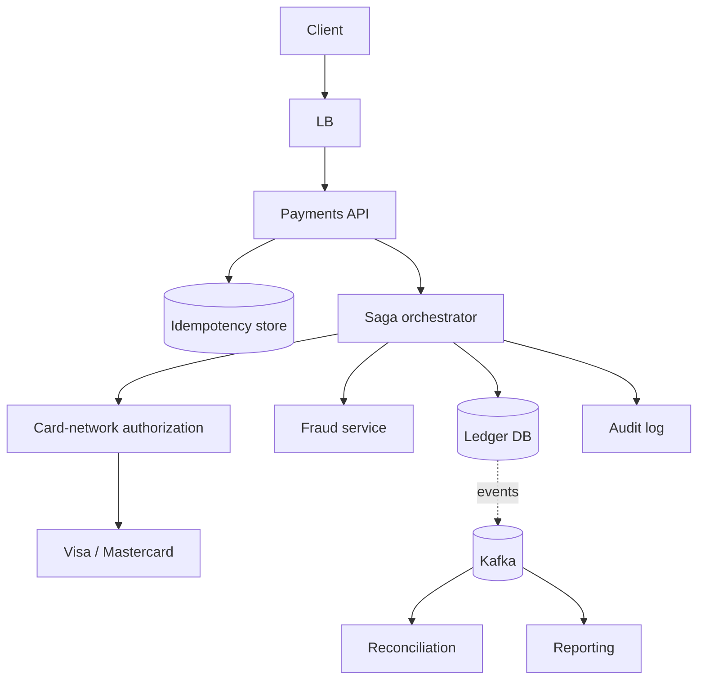
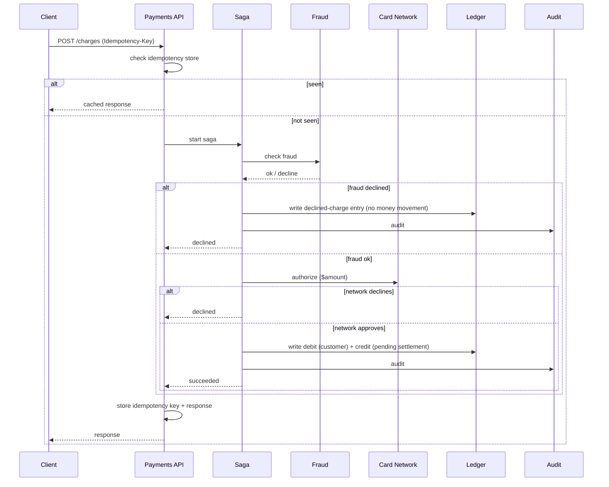

# Worked Design: Payment System

Design a payment system that processes card charges, refunds, and settlements. **This is the strictest-correctness design in this series**: a single lost or duplicated charge is a customer-visible failure with regulatory consequences. The architecture is dominated by *correctness invariants* — every money movement is an immutable double-entry journal entry; every external API call is idempotent; every multi-step flow is a saga; every action is auditable. Stripe, Square, Adyen, PayPal all have variations of this architecture.

## Where Modern Payment Systems Came From — From Diners Club To Stripe

Payment systems descend from a *long* history of financial infrastructure. The credit card industry (1950s+), card networks (Visa 1976, Mastercard 1979), online payments (PayPal 1998), and developer-friendly APIs (Stripe 2010) each contributed specific patterns. Understanding the lineage explains why modern payment systems have specific constraints.

### The Pre-Credit-Card Era

Before credit cards, payments were *cash*, *check*, or *store credit*. Cross-merchant credit (one card accepted at multiple merchants) didn't exist.

**Diners Club** (1950) was the first multi-merchant credit card. Founded by Frank McNamara, the Diners Club Card was accepted at a handful of New York restaurants. The card was *literally* a paper card with a list of accepted merchants.

The American Express Card (1958) and BankAmericard (1958, later Visa) followed. By the 1970s, credit cards were established consumer products.

### The 1970s — Card Networks Form

**Visa** was formed in 1976 from Bank of America's BankAmericard program. **Mastercard** evolved from the Interbank Card Association (founded 1966), renamed in 1979.

The card networks introduced *standardization*:

- **Card number format**: 16 digits, specific structure.
- **Magnetic stripe**: standard data format.
- **Authorization protocols**: standardized merchant-bank communication.

These standards enabled the modern card industry. Without them, every merchant would need separate processes for every bank.

### The 1990s — Online Payments Begin

The web era brought online payments. Major milestones:

- **CyberCash** (1994): early online payment processor.
- **VeriSign Payment Services** (1998): SSL-secured payments.
- **PayPal** (1998, founded by Max Levchin, Peter Thiel, Luke Nosek, Ken Howery): peer-to-peer email-based payments.

**PayPal** was the breakthrough. The eBay-friendly payment service grew rapidly; PayPal acquired its eBay competitor X.com (Elon Musk's company) in 2000. eBay acquired PayPal in 2002 for $1.5B.

PayPal's specific innovation: *making online payments easy*. Pre-PayPal, accepting online payments required complex merchant accounts; PayPal eliminated this friction.

### The 2010 Stripe Era

The next major shift was **Stripe** (founded 2010 by Patrick and John Collison — already covered in [T07 idempotency](./T07-idempotency-and-deduplication.md)). Stripe's specific innovation: *developer-friendly payment APIs*.

Pre-Stripe, accepting credit cards required:

1. Apply for a merchant account (weeks).
2. Integrate with payment gateways (complex APIs).
3. Manage compliance separately.

Stripe collapsed this:

1. Sign up online (minutes).
2. Add 7 lines of JavaScript (literal advertisement).
3. Compliance handled.

The developer experience was *transformative*. Stripe processed billions of dollars within years. By 2024, Stripe is one of the most valuable private tech companies ever.

### Adyen, Square, And The Modern Ecosystem

Adyen (Netherlands, 2006) became Europe's payments leader, serving enterprise customers. Square (US, 2009) focused on small businesses, providing card readers for mobile devices.

By 2024, the payment ecosystem includes:

- **Card networks**: Visa, Mastercard, American Express, Discover.
- **Payment processors**: Stripe, Adyen, Braintree, Square.
- **Acquiring banks**: traditional banks providing merchant accounts.
- **Issuing banks**: banks issuing cards to consumers.

The system involves many actors. Each transaction touches several.

### Why Payment Systems Are Hard

Payment systems have *specific* characteristics that make them hard:

1. **Money is real**: errors have financial consequences.
2. **Regulation is heavy**: PCI DSS, AML, KYC requirements.
3. **Latency matters**: customers don't tolerate slow payments.
4. **Availability is critical**: an outage costs real money per minute.
5. **Fraud is constant**: adversaries continuously attempt fraud.

These characteristics make payment system design uniquely demanding.

### The Double-Entry Bookkeeping Foundation

The deepest pattern in payment systems is **double-entry bookkeeping** — invented by Luca Pacioli in 1494 (covered in [T08 of C01](../C01-software-architecture/T08-event-sourcing.md)). Every payment creates two entries: a debit and a credit. The books must always balance.

Modern payment systems use double-entry bookkeeping *digitally*. Every transaction creates immutable journal entries. The total debits must equal the total credits.

This 500-year-old practice remains the foundation of payment system correctness.

## Why Payment Matters As An Interview Question

The payment system question tests:

1. **Correctness invariants**: money can't be created or destroyed accidentally.
2. **Idempotency**: retries must not double-charge.
3. **Sagas**: multi-step flows with compensating actions.
4. **Audit and compliance**: regulatory requirements.

Senior candidates discuss all four. The interview reveals whether the candidate understands what makes financial systems different.

## Senior Engineer's Q&A For This Design

### Q1: Why double-entry bookkeeping in software?

**Answer**: The 500-year-old practice ensures *balance invariants* — total debits must equal total credits. In software:

1. **Detect errors**: balance mismatches indicate bugs.
2. **Audit trail**: every transaction is two immutable entries.
3. **Reversibility**: refunds are reversing entries, not modifications.
4. **Compliance**: regulators require this structure.

The alternative (single-entry) makes errors invisible. With financial data, invisibility is unacceptable.

### Q2: How do you ensure idempotency in payments?

**Answer**: Multiple layers:

1. **Client idempotency keys**: per Stripe pattern (covered in T07).
2. **Server-side dedup**: store key + result, return cached result on retry.
3. **Database constraints**: unique constraints prevent duplicates.
4. **External callout dedup**: payment processors typically have their own idempotency.

Specific challenges:
- **Network failures**: client doesn't know if request succeeded.
- **Server failures**: server doesn't know if downstream succeeded.

The senior answer: layered idempotency at every boundary.

### Q3: How do you handle multi-currency transactions?

**Answer**: Several patterns:

1. **Store amount + currency**: never convert; always track original.
2. **Convert at settlement**: use spot rates with timestamps.
3. **Provider FX**: payment provider handles conversion.

Specific challenges:
- **Rate fluctuation**: rates change between authorization and settlement.
- **Rounding**: currency rounding rules vary.
- **Display**: showing user their currency, charging in card currency.

### Q4: How do you implement saga compensation for failed payments?

**Answer**: Each saga step has explicit compensation:

1. **Charge attempt**: compensation = void or refund.
2. **Inventory reservation**: compensation = release inventory.
3. **Email notification**: compensation = send cancellation email.

Critical: compensations must be idempotent. Retries during failure recovery should be safe.

Specific challenges:
- **Some operations can't be compensated**: sending email, dispatching truck.
- **Compensation failures**: retries with exponential backoff.

### Q5: How do you handle dispute and chargeback workflows?

**Answer**: Specialized workflow:

1. **Dispute received**: from card network.
2. **Evidence gathering**: prove transaction was legitimate.
3. **Provider response**: submit evidence within deadline (typically 7 days).
4. **Resolution**: win or lose dispute.
5. **Settlement adjustment**: chargeback amount + fees.

Specific challenges:
- **Time pressure**: deadlines are strict.
- **Evidence quality**: photos, receipts, communications.
- **Friendly fraud**: legitimate customer disputes legitimate charges.

### Q6: How do you ensure compliance (PCI DSS)?

**Answer**: Architectural choices:

1. **Tokenization**: don't store card numbers; use tokens.
2. **Network segmentation**: PCI scope is limited.
3. **Encryption**: at rest and in transit.
4. **Logging**: comprehensive but compliant.
5. **Annual audits**: required by card networks.

The senior insight: PCI DSS is *architectural*, not bolt-on. Compliance influences fundamental decisions.

## Common Misconceptions Explained

### "Payment systems are just databases."

False. Payment systems involve external dependencies (banks, networks), compliance requirements, fraud detection, dispute handling. Far more than CRUD.

### "Modern payment systems don't need double-entry."

False. The pattern survives because it works. New patterns haven't surpassed it.

### "Atomic transactions handle all consistency."

False. Cross-system transactions (payment + ledger + notification) can't be atomic. Sagas required.

### "Stripe handles all the complexity."

Partially false. Stripe handles card processing well; the business logic (charging customers, managing subscriptions, handling disputes) is still complex.

### "Strong consistency is too expensive for payments."

False. Eventually consistent payments allow double-charging. Strong consistency is required despite cost.

### "Cryptocurrency simplifies payments."

False. Crypto adds complexity (wallets, exchanges, volatility) while solving few problems. Most "crypto payments" are actually crypto-to-fiat conversions.

## Requirements

### Functional

- **Authorize and capture**: hold funds, then capture (or void).
- **Refund**: full or partial.
- **Recurring payments**: subscription billing.
- **Multi-currency**.
- **Dispute / chargeback** workflow.

### Out Of Scope

- The card networks themselves (Visa/Mastercard infrastructure).
- Bank reconciliation feeds (described, not built).
- Merchant onboarding / KYC.

### Non-Functional

- **Scale**: 10K payments/s peak.
- **Latency**: end-to-end charge < 2s p99.
- **Availability**: 99.99% for the API.
- **Consistency**: STRONG for every money movement. Eventual is unacceptable.
- **Audit**: every action immutable, attributable, traceable.
- **Idempotency**: every operation must be safely retryable.

## Capacity

```
10K txns/s × 86400 = ~860M txns/day
Each ledger entry: ~500 bytes (immutable)
500B × 860M × 365 × 7 yr retention = 1.1 PB
→ partitioned by date; archive older to cold storage
```

## API

```http
POST /api/v1/charges
  headers: Idempotency-Key: ...
  body: { "amount": 1000, "currency": "USD", "source": "tok_xyz", "customer": "cus_abc", "capture": true }
  returns: { "chargeId": "ch_...", "status": "succeeded" | "requires_action" | "failed" }

POST /api/v1/refunds
  headers: Idempotency-Key: ...
  body: { "chargeId": "ch_...", "amount": 1000 }

POST /api/v1/charges/{id}/capture
POST /api/v1/charges/{id}/void
```

Stripe-style. Every write requires Idempotency-Key.

## Data Model

### The Ledger (Double-Entry)

Every money movement produces **two** balanced journal entries (debit + credit).

```sql
CREATE TABLE ledger_entries (
  id            UUID PRIMARY KEY,
  txn_id        UUID NOT NULL,        -- groups debit + credit
  account_id    BIGINT NOT NULL,
  amount        BIGINT NOT NULL,       -- positive = credit, negative = debit
  currency      CHAR(3) NOT NULL,
  posted_at     TIMESTAMPTZ NOT NULL,
  -- immutable: no UPDATE, no DELETE
  -- corrections via reversing entries
  CONSTRAINT chk_currency CHECK (currency IN ('USD', 'EUR', 'GBP', ...))
);

-- Per-transaction, debits + credits must sum to zero:
CREATE TABLE transactions (
  id            UUID PRIMARY KEY,
  type          TEXT,            -- 'charge', 'refund', 'transfer'
  status        TEXT,
  created_at    TIMESTAMPTZ
);

-- Idempotency cache
CREATE TABLE idempotency_keys (
  key           TEXT PRIMARY KEY,
  txn_id        UUID,
  response      JSONB,
  expires_at    TIMESTAMPTZ
);
```

The double-entry invariant: for every `txn_id`, sum of amounts = 0. A charge of $10 from customer A to merchant B:

```
txn_id=t1, account=customer_A, amount=-1000  (debit)
txn_id=t1, account=merchant_B, amount=+1000  (credit)
```

Every refund reverses (with a new txn_id, but pointing to the original via metadata).

## High-Level Architecture



## Deep Dive A: The Charge Flow As A Saga



### Compensation On Failure

If the saga fails at step N, compensate steps 1..N−1. For payment auth + ledger update:
- Auth succeeded but ledger write failed: void the auth at the network.
- Fraud declined after the auth would have succeeded: do nothing (no auth happened).

The saga state is durable (event-sourced or DB-row); on coordinator crash, a recoverer resumes.

## Deep Dive B: Idempotency

Per the requirements, every POST has `Idempotency-Key`. The store:

```java
@Component
class IdempotencyStore {
  private final JdbcTemplate jdbc;

  public <T> T exec(String key, Supplier<T> op) {
    Optional<String> existing = jdbc.queryForOptional(
      "SELECT response FROM idempotency_keys WHERE key = ? AND expires_at > NOW()",
      String.class, key);
    if (existing.isPresent()) {
      return deserialize(existing.get());
    }
    T result = op.get();
    try {
      jdbc.update(
        "INSERT INTO idempotency_keys(key, response, expires_at) VALUES (?, ?, NOW() + INTERVAL '24 hours')",
        key, serialize(result));
    } catch (DuplicateKeyException e) {
      return deserialize(jdbc.queryForObject(
        "SELECT response FROM idempotency_keys WHERE key = ?",
        String.class, key));
    }
    return result;
  }
}
```

**24-hour TTL** by default. Stripe's pattern.

## Deep Dive C: Ledger Invariants

Every read of an account balance is a sum over the immutable ledger:

```sql
SELECT SUM(amount) FROM ledger_entries WHERE account_id = $id AND currency = 'USD';
```

For active balances, this is too slow at scale. **Materialized view**: per-account aggregate snapshot, updated on each ledger write, *plus* the ledger of changes since the snapshot. Snapshots are computed eventually (every minute, or on each entry); balance = snapshot + recent entries.

Periodic full re-aggregation verifies the snapshot.

## Deep Dive D: Reconciliation

Daily, the system compares:
- Internal ledger sums.
- Card network's settlement file.
- Bank statements.

Any discrepancy is investigated. Reconciliation is a *separate* asynchronous process that does not block payments but flags anomalies.

## Trade-Offs

| Decision | Chosen | Alternative | Reason |
|----------|--------|-------------|--------|
| Ledger | Append-only, double-entry | Mutable balance row | Audit, recovery |
| Idempotency | Required on all writes | Optional | Cost of duplicate charge >> cost of idempotency-key |
| Saga style | Orchestrated (Temporal) | Choreographed events | Explicit failure handling |
| Consistency | Strong inside a region; cross-region eventual | Multi-region strong | Latency budget |
| Schema | RDBMS (Postgres) for the ledger | NoSQL | ACID transactions; ledger correctness |

## Failure Modes

- **Network timeout during authorize**: the auth may have happened. Idempotency key on retry; recheck at the network.
- **Ledger write failure after network auth**: void the auth (compensation).
- **Database failover**: writes briefly fail; retries succeed (the API returns 5xx, client retries with same idempotency key).
- **Settlement-file mismatch**: reconciliation flags; operators investigate.
- **Currency conversion timing**: rate may shift between auth and capture; lock the rate at auth.

## Security And Compliance

- **PCI DSS**: tokenize cards; do not store raw PAN. The system handles `tok_xyz`, never `4242 4242 4242 4242`.
- **Encryption at rest**: ledger, audit, idempotency stores.
- **Audit log**: every action by every actor (user, admin, system) is immutable.
- **Segregation of duties**: refund authority differs from charge authority.

> [!INTERVIEW]
> Strong candidates name **double-entry ledger** unprompted, identify **idempotency as foundational**, and describe the **saga for cross-service operations**. Weak candidates use a single mutable `balance` column.

## Practice

1. **Implement double-entry.** Write the Postgres schema and the insert procedure that enforces sum-to-zero per txn.
2. **Idempotency key test.** Force-retry a charge with the same key; verify one charge, one ledger entry.
3. **Saga compensation drill.** Build a 3-step saga (fraud → auth → ledger). Force failure at step 3; verify compensation reverses steps 1–2.
4. **Reconciliation script.** Compare internal ledger sums to a simulated network settlement file; find discrepancies.
5. **Balance computation.** For 1B ledger entries, compute the active balance for an account in < 10 ms.
6. **Currency conversion.** Add multi-currency support; lock the rate at auth; verify reconciliation.
7. **Chargeback flow.** Sketch the dispute / chargeback workflow.
8. **Stripe SDK study.** Read Stripe's [API documentation](https://stripe.com/docs/api) for idempotency. Reverse-engineer their design.
9. **PCI scope reduction.** Identify which services are in PCI scope. Minimize.
10. **The skeptic conversation.** A junior engineer wants to use eventual consistency for the ledger. Write a 200-word response on why strong consistency is non-negotiable.

## Recap

You should now be able to:

- Design a **payment system** with a double-entry, append-only ledger as the truth.
- Make every write **idempotent** with the Stripe-style `Idempotency-Key` header.
- Orchestrate **multi-step flows** as sagas with explicit compensation.
- Maintain **active balances** as materialized views over the immutable ledger.
- Implement **reconciliation** as an async process comparing internal vs external truth.
- Apply **PCI DSS, encryption, audit logging, segregation of duties** as foundational security.
- Refuse eventual consistency for money movements; defend the design against latency complaints.

## Next

Continue to [Worked Design: Notification System](./T22-worked-design-notification-system.md) — multi-channel notifications (email, SMS, push) with retries, deduplication, and delivery guarantees.
