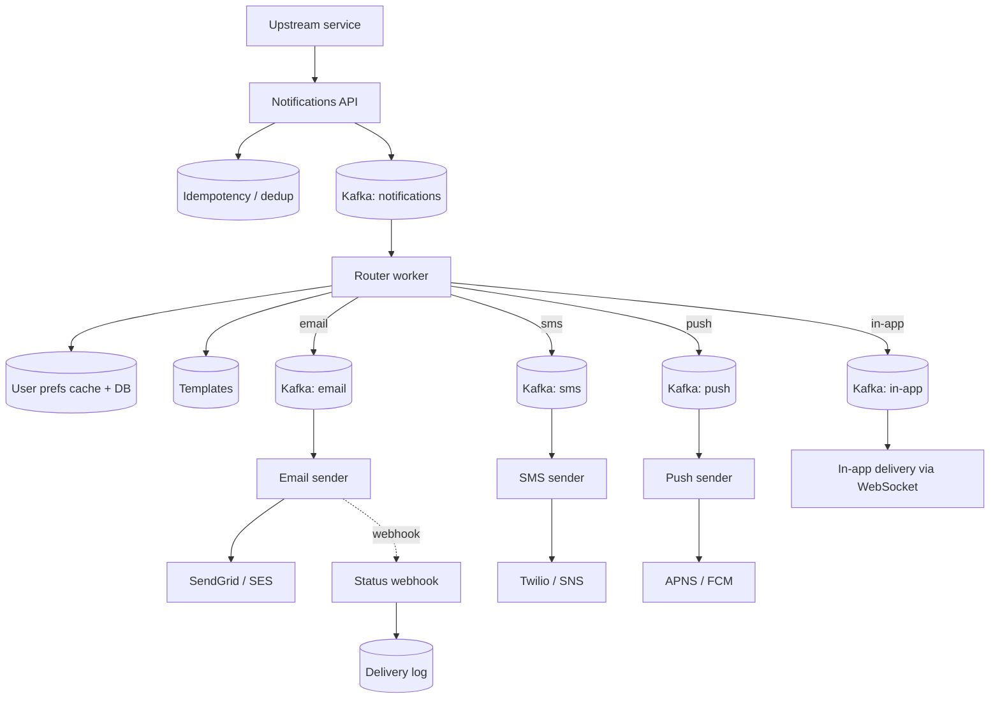

# Worked Design: Notification System

Design a multi-channel notification system that delivers emails, SMS, push notifications, and in-app alerts triggered by upstream events. **The defining challenge**: deliver reliably to channels with vastly different characteristics (email is durable but slow; SMS has carrier rate limits; push has device-specific routing; in-app is immediate). Add user preferences, dedup, retry, throttling — and the system must scale to billions of notifications per day across millions of users.

## Where Modern Notification Systems Came From — From Email To Push

Notification systems descend from **email** (1970s), **SMS** (1992), and **mobile push notifications** (2009). Each technology added a delivery channel; modern systems unify all channels.

### Email — The First Notification System (1971)

The first notification system was **email**, invented by **Ray Tomlinson** at BBN Technologies in **1971**. Tomlinson chose `@` as the separator between user and host — making `user@host` the canonical email address format that survives 50+ years later.

Email became the *default* notification channel for the internet. By the 1990s, automated email notifications (account creation, password resets, order confirmations) were standard.

The email infrastructure (SMTP, IMAP, POP3) remains substantially unchanged since the 1980s. It's not pretty but it works at internet scale.

### SMS — Mobile Notifications (1992)

**Short Message Service (SMS)** was first used commercially in **1992** when **Neil Papworth** sent the first SMS message ("Merry Christmas") from a computer to Richard Jarvis at Vodafone UK.

SMS became the *mobile* notification channel. Banks, airlines, and many other services adopted SMS for time-sensitive alerts.

SMS has specific limitations:

- **160 character limit**: based on technical constraints of the GSM standard.
- **Cost**: each message has a small but non-zero carrier cost.
- **Carrier rate limits**: protections against abuse limit throughput.

These limitations still affect SMS use in modern notification systems.

### Mobile Push — The 2009 iOS Era

**Apple Push Notification Service (APNs)** launched with **iOS 3.0 in June 2009**. APNs enabled apps to receive notifications even when not running — a substantial advance over previous mobile platforms.

The APNs design:

1. **App registers with APNs**: Apple's server.
2. **App's backend sends notifications to APNs**.
3. **APNs delivers to user's device**.
4. **Device shows notification (even if app isn't running)**.

This architecture became the *standard* for mobile push notifications. **Firebase Cloud Messaging (FCM)** (Google, 2014, evolved from Google Cloud Messaging) provided the equivalent for Android.

By 2024, every mobile app uses APNs and FCM. The infrastructure is *invisible* to developers but essential to user experience.

### The Modern Multi-Channel Notification Pattern

By the 2020s, notification systems became *multi-channel*:

1. **Push notifications**: APNs and FCM.
2. **Email**: SendGrid, Mailgun, Amazon SES.
3. **SMS**: Twilio, AWS SNS.
4. **In-app**: WebSocket-based real-time messaging.
5. **Voice**: automated phone calls for critical alerts.

Modern systems abstract these channels behind a unified API. The notification system *decides* which channels to use for each user.

### Who Built The Notification Infrastructure

Three companies dominate the notification infrastructure:

- **Twilio** (founded 2008 by Jeff Lawson): primary SMS and voice provider.
- **SendGrid** (founded 2009, acquired by Twilio 2018): email infrastructure.
- **Firebase** (founded 2011, acquired by Google 2014): push notifications and mobile backend.

These companies provide the *infrastructure*; consumer applications build their notification systems on top.

### Why Notification Systems Are Hard

Despite the infrastructure, building notification systems is hard because:

1. **User preferences are complex**: which notifications, which channels, when.
2. **Rate limiting is essential**: too many notifications cause user attrition.
3. **Failure handling matters**: notifications must be reliable but not duplicate.
4. **Privacy regulations apply**: GDPR, CAN-SPAM, TCPA.
5. **Multi-channel routing is non-trivial**: deciding the right channel for each notification.

These challenges make notification system design a real engineering problem.

## Why Notification Systems Matter As An Interview Question

The notification system question tests:

1. **Multi-channel architecture**: routing decisions per channel.
2. **Scale handling**: billions of notifications per day.
3. **Failure modes**: retries, dedup, dead-letter queues.
4. **User preferences**: storing and applying preferences efficiently.

Senior candidates address all four. The architecture should be cleaner than a "just call the channels" approach.

## Senior Engineer's Q&A For This Design

### Q1: How do you decide which channel to use?

**Answer**: Multi-factor decision:

1. **User preference**: explicit choice.
2. **Urgency**: critical → SMS; informational → email.
3. **Channel availability**: phone for SMS, valid email for email.
4. **Cost**: SMS expensive; email cheap.
5. **User context**: in-app users get in-app notifications.

The senior insight: channel selection is a policy decision, not a default.

### Q2: How do you handle delivery failures across channels?

**Answer**: Per-channel retry strategies:

- **Push**: APNs/FCM handle most retries; failures usually mean invalid token.
- **SMS**: provider retries; carrier rejections need manual handling.
- **Email**: bounces classified (hard vs soft); soft bounces retry.
- **In-app**: queued for delivery on next session.

Cross-channel: if primary fails, escalate to backup channel.

### Q3: How do you implement user preferences at scale?

**Answer**: Granular preference model:

1. **Channel preferences**: which channels enabled.
2. **Category preferences**: which notification types.
3. **Quiet hours**: time-of-day restrictions.
4. **Frequency limits**: max per day/week.

Storage:
- **Single table per user**: preferences as JSON.
- **Eventually consistent**: brief inconsistency acceptable.
- **Cache aggressively**: preferences rarely change.

### Q4: How do you handle GDPR compliance?

**Answer**: Multiple requirements:

1. **Consent tracking**: when/how user consented.
2. **Right to access**: user can see all notifications sent.
3. **Right to erasure**: delete user data on request.
4. **Data minimization**: don't store more than needed.
5. **Audit trail**: who saw what when.

Architecture implications:
- **Consent records**: must be cryptographically signed.
- **Retention policies**: automatic deletion.
- **Geographic routing**: comply with regional laws.

### Q5: How do you prevent notification fatigue?

**Answer**: Multiple layers:

1. **Rate limits**: max notifications per user per day.
2. **Importance scoring**: drop low-priority during high-volume.
3. **Batching**: combine multiple notifications.
4. **Smart timing**: don't notify at 3 AM.
5. **User feedback**: adjust based on user behavior.

The senior insight: each notification has a *cost* to user attention. Optimize for value.

### Q6: How do you handle template management?

**Answer**: Centralized template system:

1. **Template versioning**: track changes.
2. **A/B testing**: experiment with variants.
3. **Localization**: per-language templates.
4. **Validation**: prevent broken templates.
5. **Preview**: see template rendered.

Storage:
- **Database**: searchable, versionable.
- **Cache**: hot templates in memory.
- **Compilation**: pre-compile for performance.

## Common Misconceptions Explained

### "Notifications are just async messages."

False. Notifications involve user preferences, channel selection, compliance, fatigue management. Far more than queues.

### "Email is unreliable."

Partially true. Email has imperfect delivery but is the most established channel. Bounces and spam folders are manageable.

### "Push notifications are real-time."

Partially true. APNs/FCM are best-effort with seconds-to-minutes latency. Not truly real-time.

### "SMS is the most reliable channel."

Partially false. SMS has carrier rejections, country restrictions, and significant cost. Email is often more reliable.

### "Users want all notifications."

False. Most users want fewer notifications. Default to less, let users opt in to more.

### "Channel selection is straightforward."

False. Multiple factors: urgency, preference, cost, availability, context. Real decisions are complex.

## Requirements

### Functional

- **Channels**: email, SMS, push (APNs / FCM), in-app.
- **Per-user preferences**: which channels are enabled per event type.
- **Templating**: localize and personalize per recipient.
- **Scheduling**: deliver at a specific time / time zone.
- **Bulk and transactional**: support both marketing and per-event notifications.

### Out Of Scope

- Marketing campaign design / segmentation engine.
- Personalization ML.

### Non-Functional

- **Scale**: 1B notifications/day; peak 100K/s.
- **Latency**: transactional within 1 minute end-to-end p99.
- **Delivery guarantee**: at-least-once + dedup; no missed transactional.
- **Throttling**: per-user, per-channel — e.g., max 10 emails/day per user.

## Capacity

```
1B/day → ~12K/s avg, ~100K/s peak
1B × 500 bytes (rendered) = 500 GB/day
Per-user state: 100M users × 500 bytes prefs = 50 GB
```

## API

```http
POST /api/v1/notifications
  headers: Idempotency-Key
  body: {
    "userId": "u_123",
    "eventType": "order_shipped",
    "data": { "orderId": "o_456", "trackingNumber": "..." },
    "channels": ["email", "push"],   // optional override
    "scheduleAt": "2026-06-10T12:00:00Z"  // optional
  }

GET /api/v1/users/{userId}/preferences
PUT /api/v1/users/{userId}/preferences
```

## Data Model

```sql
-- Templates
CREATE TABLE templates (
  event_type    TEXT PRIMARY KEY,
  channels      TEXT[],   -- supported channels
  email_subject TEXT,
  email_body    TEXT,     -- Mustache / Handlebars
  sms_body      TEXT,
  push_title    TEXT,
  push_body     TEXT
);

-- User preferences
CREATE TABLE user_preferences (
  user_id     UUID,
  event_type  TEXT,
  channels    TEXT[],   -- enabled channels for this event
  PRIMARY KEY (user_id, event_type)
);

-- Delivery log (audit + dedup)
CREATE TABLE delivery_log (
  id            UUID PRIMARY KEY,
  user_id       UUID,
  event_type    TEXT,
  channel       TEXT,
  state         TEXT,    -- queued, sent, delivered, failed, suppressed
  idempotency_key TEXT UNIQUE,
  external_ref  TEXT,    -- e.g., Twilio message SID
  sent_at       TIMESTAMPTZ,
  delivered_at  TIMESTAMPTZ
);
```

## High-Level Architecture



## Deep Dive A: The Router

The router is the brain. For each notification:

1. Look up user preferences (which channels are enabled for this event).
2. Look up the template.
3. Apply throttling rules (e.g., not more than X emails per day).
4. Render the template per channel.
5. Publish to per-channel Kafka topics for delivery.

```java
@Component
@RequiredArgsConstructor
class NotificationRouter {
  private final PreferencesService prefs;
  private final TemplateService templates;
  private final ThrottlingService throttle;
  private final KafkaTemplate<String, RenderedNotification> kafka;

  @KafkaListener(topics = "notifications")
  public void route(NotificationRequest req) {
    if (deliveryLog.alreadyProcessed(req.idempotencyKey())) return;
    var userPrefs = prefs.get(req.userId(), req.eventType());
    var template = templates.get(req.eventType());
    
    for (String channel : intersect(req.channels(), userPrefs.channels(), template.channels())) {
      if (!throttle.allow(req.userId(), channel, req.eventType())) continue;
      RenderedNotification rendered = render(template, channel, req.data());
      kafka.send(channel + "-notifications", req.userId(), rendered);
    }
    deliveryLog.recordProcessed(req.idempotencyKey());
  }
}
```

## Deep Dive B: Channel-Specific Sending

Each channel has its own retry / failure semantics.

**Email**:
- Sender (SendGrid / SES) provides per-recipient delivery webhooks (delivered, bounced, complained).
- Retry on transient failures; suppress on hard bounces.
- Rate limits: ~10K/s per SendGrid sub-account; scale by adding sub-accounts or distributing across providers.

**SMS (Twilio)**:
- Per-country carrier rate limits.
- High cost (~$0.01/SMS) — throttle aggressively.
- Webhook for delivery status.

**Push (APNs / FCM)**:
- Per-device token (changes on app update, reinstall).
- Tokens go stale; mark invalid on failure.
- High volume capability; primary scaling concern is per-app rate limits.

**In-app**:
- Delivered via the WebSocket gateway (see [T20](./T20-worked-design-chat-messaging.md)).
- If user is offline, persist in DB; deliver on next app open.

## Deep Dive C: Dedup And Throttling

Two distinct concerns:

**Dedup** prevents the same notification (same Idempotency-Key) from being sent twice. Handled at API entry (idempotency store) and at the router (delivery log).

**Throttling** caps how many notifications a user gets. Examples:
- Max 10 promotional emails per user per day.
- Max 1 marketing SMS per user per week.
- Quiet hours: no push 10 PM–8 AM in user's time zone.

Implemented as Redis counter per (user, channel, period).

## Deep Dive D: Bulk Sending

Marketing pushes 100M emails. Strategies:

- **Pre-segment**: marketing tool produces user list.
- **Throttle producer**: spread the 100M over hours, not seconds, to avoid saturating SendGrid.
- **Per-user opt-out**: respect unsubscribed users; supress from the list.

## Trade-Offs

| Decision | Chosen | Alternative | Reason |
|----------|--------|-------------|--------|
| Async via Kafka | Per-channel topics | Single topic | Per-channel parallelism + isolation |
| Provider | SendGrid, Twilio, APNs (managed) | Self-hosted | Cost, reliability, focus |
| State | Delivery log in DB | Pure stateless | Dedup, audit, status |
| Templating | Server-side render | Pre-rendered per recipient | Localization, personalization |
| In-app | Reuse chat gateway | Separate service | Code reuse |

## Failure Modes

- **SendGrid outage**: queue grows; eventually deliver. Switch to backup provider if extended.
- **Bad template change**: every notification fails; alert on per-template failure rate.
- **Push token churn**: invalid tokens accumulate; clean up on hard failure.
- **Throttle bypass**: a misconfigured event sends 1M notifications to one user; per-user throttle is the safety.

> [!INTERVIEW]
> Strong candidates separate the **router** from the **per-channel senders** and address **user preferences and throttling** as first-class concerns.

## Deeper Dive — End-to-End Spring Boot Implementation

### Notification Router (Decouples Source from Channels)

```java
@Component
public class NotificationRouter {
    private final UserPreferenceService preferences;
    private final NotificationDedupCache dedup;
    private final ThrottleService throttle;
    private final KafkaTemplate<String, ChannelMessage> kafka;
    private final TemplateService templates;

    @KafkaListener(topics = "notifications.triggered", concurrency = "16")
    public void route(NotificationEvent event) {
        // 1. Dedup: same (event_type, user_id, dedup_key) within window
        if (dedup.alreadySent(event.eventType(), event.userId(), event.dedupKey())) {
            log.debug("Dedup skip: {}", event);
            return;
        }

        // 2. Get user preferences for this event_type
        UserPreferences prefs = preferences.findByUserId(event.userId());
        Set<Channel> enabledChannels = prefs.channelsFor(event.eventType());

        if (enabledChannels.isEmpty()) {
            log.debug("All channels opted out: {}", event);
            return;
        }

        // 3. Throttle check per channel
        for (Channel channel : enabledChannels) {
            if (!throttle.tryAcquire(event.userId(), channel, event.eventType())) {
                continue;   // throttle hit; skip this channel
            }

            // 4. Render template for channel
            RenderedMessage rendered = templates.render(
                event.eventType(), channel, event.payload(), prefs.locale()
            );

            // 5. Dispatch to channel-specific topic
            ChannelMessage msg = new ChannelMessage(
                UUID.randomUUID(),
                event.userId(),
                channel,
                rendered,
                event.eventType(),
                event.dedupKey()
            );
            kafka.send("notifications.channel." + channel.name().toLowerCase(),
                       event.userId(), msg);
        }

        // 6. Mark as sent in dedup cache
        dedup.markSent(event.eventType(), event.userId(), event.dedupKey());
    }
}
```

### Email Sender (SendGrid Integration)

```java
@Component
public class EmailSender {
    private final SendGrid sendgrid;
    private final DeliveryLogRepo deliveryLogRepo;
    private final UserContactRepo userContactRepo;

    @KafkaListener(topics = "notifications.channel.email", concurrency = "32")
    @Retryable(maxAttempts = 3, backoff = @Backoff(delay = 1000, multiplier = 2))
    public void send(ChannelMessage msg) {
        String email = userContactRepo.findEmailByUserId(msg.userId());
        if (email == null) {
            recordDelivery(msg, "FAILED", "NO_EMAIL_ON_FILE");
            return;
        }

        try {
            Mail mail = new Mail();
            mail.setFrom(new Email("notifications@example.com"));
            mail.addPersonalization(buildPersonalization(email, msg.payload()));
            mail.setSubject(msg.rendered().subject());
            mail.addContent(new Content("text/html", msg.rendered().htmlBody()));
            mail.addCustomArg("notification_id", msg.id().toString());  // for webhook correlation

            Request req = new Request();
            req.setMethod(Method.POST);
            req.setEndpoint("mail/send");
            req.setBody(mail.build());

            Response resp = sendgrid.api(req);
            if (resp.getStatusCode() >= 200 && resp.getStatusCode() < 300) {
                recordDelivery(msg, "SENT", resp.getHeaders().get("X-Message-Id"));
            } else {
                throw new EmailDeliveryException("SendGrid " + resp.getStatusCode());
            }
        } catch (Exception e) {
            recordDelivery(msg, "FAILED", e.getMessage());
            throw e;   // trigger retry
        }
    }

    @Recover
    public void recover(EmailDeliveryException e, ChannelMessage msg) {
        // After 3 retries; send to DLQ for ops review
        recordDelivery(msg, "PERMANENTLY_FAILED", e.getMessage());
        dlqProducer.send("notifications.dlq.email", msg);
    }
}
```

### Push Sender (FCM + APN with Token Lifecycle)

```java
@Component
public class PushSender {
    private final FirebaseMessaging fcm;
    private final ApnsClient apn;
    private final PushTokenRepo tokenRepo;

    @KafkaListener(topics = "notifications.channel.push")
    public void send(ChannelMessage msg) {
        List<PushToken> tokens = tokenRepo.activeTokensFor(msg.userId());
        if (tokens.isEmpty()) return;

        tokens.parallelStream().forEach(token -> {
            switch (token.platform()) {
                case ANDROID -> sendFCM(msg, token);
                case IOS -> sendAPN(msg, token);
            }
        });
    }

    private void sendFCM(ChannelMessage msg, PushToken token) {
        Message fcmMsg = Message.builder()
            .setToken(token.value())
            .putData("type", msg.eventType().name())
            .putData("payload", json.write(msg.rendered().data()))
            .setNotification(Notification.builder()
                .setTitle(msg.rendered().title())
                .setBody(msg.rendered().body())
                .build())
            .build();

        try {
            String response = fcm.send(fcmMsg);
            recordDelivery(msg, "SENT", response);
        } catch (FirebaseMessagingException e) {
            handleFcmError(e, token);
        }
    }

    private void handleFcmError(FirebaseMessagingException e, PushToken token) {
        switch (e.getErrorCode()) {
            case UNREGISTERED, INVALID_ARGUMENT ->
                tokenRepo.markInvalid(token);   // permanent failure; clean up
            case INTERNAL, UNAVAILABLE ->
                // transient; rely on Kafka retry
                throw new RuntimeException(e);
        }
    }
}
```

### SMS Sender (Twilio with Cost Awareness)

```java
@Component
public class SmsSender {
    private final TwilioRestClient twilio;
    private final SmsCostTracker costTracker;

    @KafkaListener(topics = "notifications.channel.sms")
    public void send(ChannelMessage msg) {
        // SMS is expensive ($0.01-0.05 per msg); rate-limit aggressively
        if (!costTracker.tryAllocateBudget(msg.userId(), msg.eventType())) {
            log.warn("SMS budget exceeded for user {}", msg.userId());
            recordDelivery(msg, "SKIPPED", "BUDGET_EXCEEDED");
            return;
        }

        String phone = userContactRepo.findPhoneByUserId(msg.userId());
        if (phone == null || !isValidPhone(phone)) return;

        try {
            Message smsResult = Message.creator(
                new PhoneNumber(phone),
                new PhoneNumber("+15555551212"),       // from
                msg.rendered().body()
            ).setStatusCallback(URI.create("https://api.example.com/webhooks/twilio/status"))
             .create();

            recordDelivery(msg, "SENT", smsResult.getSid());
        } catch (ApiException e) {
            recordDelivery(msg, "FAILED", e.getMessage());
            throw e;
        }
    }
}
```

### Webhook Receiver (Delivery Status from Providers)

```java
@RestController
@RequestMapping("/webhooks")
public class WebhookController {

    @PostMapping("/sendgrid/events")
    public ResponseEntity<Void> handleSendGrid(@RequestBody List<SendGridEvent> events,
                                                 @RequestHeader("X-Twilio-Email-Event-Webhook-Signature") String sig,
                                                 @RequestHeader("X-Twilio-Email-Event-Webhook-Timestamp") String ts,
                                                 @RequestBody byte[] rawBody) {
        // Verify signature
        if (!sendGridVerifier.verify(rawBody, sig, ts)) {
            return ResponseEntity.status(401).build();
        }

        for (SendGridEvent event : events) {
            String notificationId = event.getCustomArg("notification_id");
            switch (event.event()) {
                case "delivered" -> deliveryLogService.markDelivered(notificationId, event.timestamp());
                case "open" -> deliveryLogService.markOpened(notificationId, event.timestamp());
                case "click" -> deliveryLogService.markClicked(notificationId, event.url(), event.timestamp());
                case "bounce", "dropped" -> {
                    deliveryLogService.markFailed(notificationId, event.reason());
                    if ("hard".equals(event.bounceClass())) {
                        userContactRepo.markEmailInvalid(notificationId);
                    }
                }
                case "unsubscribe" -> preferenceService.markUnsubscribed(notificationId, event.url());
            }
        }
        return ResponseEntity.ok().build();
    }
}
```

## Deeper Dive — Multi-Provider Failover

```java
@Component
public class EmailProviderRouter {
    private final List<EmailProvider> providers = List.of(
        new SendGridProvider(),       // primary
        new MailgunProvider(),        // secondary
        new AmazonSESProvider()       // tertiary
    );
    private final HealthCheckService healthCheck;

    public DeliveryResult send(EmailMessage msg) {
        for (EmailProvider provider : providers) {
            if (!healthCheck.isHealthy(provider)) continue;

            try {
                return provider.send(msg);
            } catch (TransientException e) {
                log.warn("Provider {} failed transiently, trying next", provider.name());
                continue;
            } catch (PermanentException e) {
                return DeliveryResult.failed(e.getMessage());
            }
        }
        throw new AllProvidersDownException();
    }
}
```

**Cost vs reliability**: each provider has slightly different rates. Routing strategy:
- 95% to primary (best rate)
- 5% to secondary as ongoing warm-up
- Failover automatic on errors

## Deeper Dive — Template System

Templates need versioning, A/B testing, and i18n.

```sql
CREATE TABLE notification_templates (
    template_id TEXT NOT NULL,           -- e.g., "order.shipped"
    locale TEXT NOT NULL,                -- "en", "es", "ja"
    channel TEXT NOT NULL,                -- "email", "sms", "push", "in_app"
    version INT NOT NULL,
    subject TEXT,                         -- email only
    body_template TEXT NOT NULL,          -- with {{variables}}
    metadata JSONB,
    active BOOLEAN NOT NULL DEFAULT TRUE,
    created_at TIMESTAMPTZ NOT NULL DEFAULT NOW(),
    PRIMARY KEY (template_id, locale, channel, version)
);
```

```java
@Service
public class TemplateService {
    private final TemplateRepo repo;
    private final Handlebars handlebars = new Handlebars();   // or Thymeleaf, Mustache, etc.

    @Cacheable(value = "templates", key = "#templateId + ':' + #locale + ':' + #channel")
    public RenderedMessage render(String templateId, Channel channel, Map<String, Object> data, String locale) {
        Template template = repo.findActiveOrFallback(templateId, locale, channel);
        Template compiled = handlebars.compileInline(template.bodyTemplate());

        return new RenderedMessage(
            template.subject() != null ? handlebars.compileInline(template.subject()).apply(data) : null,
            compiled.apply(data),
            template.version()
        );
    }
}
```

**A/B testing**: store template variants with weight; user-id-based bucketing for consistency:

```java
public Template findActiveOrFallback(String templateId, String locale, Channel channel) {
    List<Template> variants = repo.findActiveVariants(templateId, locale, channel);
    if (variants.size() == 1) return variants.get(0);

    // Consistent hashing: user always sees same variant for same template
    int variant = Math.abs(userId.hashCode()) % weightSum(variants);
    return pickByWeight(variants, variant);
}
```

## Deeper Dive — Bulk Sending (1M Emails in One Job)

```java
@Service
public class BulkNotificationService {

    public BulkJob startBulk(BulkRequest request) {
        BulkJob job = jobRepo.save(new BulkJob(
            UUID.randomUUID(),
            request.eventType(),
            request.audience(),  // segment definition
            "QUEUED"
        ));

        // Run in chunks asynchronously
        bulkExecutor.submit(() -> processBulk(job, request));

        return job;
    }

    private void processBulk(BulkJob job, BulkRequest request) {
        long total = audienceService.count(request.audience());
        jobRepo.updateTotal(job.id(), total);

        AtomicLong sent = new AtomicLong();
        audienceService.streamUserIds(request.audience())
            .buffer(1000)
            .forEach(batch -> {
                List<CompletableFuture<Void>> futures = batch.stream()
                    .map(userId -> CompletableFuture.runAsync(() -> {
                        // Same router as transactional, with bulk_job_id for tracking
                        NotificationEvent event = new NotificationEvent(
                            request.eventType(),
                            userId,
                            "bulk:" + job.id() + ":" + userId,  // dedup key
                            request.payload()
                        );
                        notificationRouter.route(event);
                    }, bulkExecutor))
                    .toList();
                CompletableFuture.allOf(futures.toArray(CompletableFuture[]::new)).join();
                jobRepo.updateProgress(job.id(), sent.addAndGet(batch.size()));
            });

        jobRepo.updateStatus(job.id(), "COMPLETED");
    }
}
```

**Throttling for bulk**: send in chunks with delay to respect provider rate limits + spread spike load. SendGrid allows ~10K emails/sec, FCM ~1M push/sec, Twilio ~100 SMS/sec per account.

## Deeper Dive — User Preferences System

```sql
CREATE TABLE user_notification_preferences (
    user_id UUID NOT NULL,
    event_type TEXT NOT NULL,
    channel TEXT NOT NULL,
    enabled BOOLEAN NOT NULL,
    schedule_window JSONB,        -- "do not send before 9 AM" etc.
    created_at TIMESTAMPTZ NOT NULL DEFAULT NOW(),
    updated_at TIMESTAMPTZ NOT NULL DEFAULT NOW(),
    PRIMARY KEY (user_id, event_type, channel)
);

-- Defaults table
CREATE TABLE default_notification_preferences (
    event_type TEXT NOT NULL,
    channel TEXT NOT NULL,
    enabled BOOLEAN NOT NULL,
    description TEXT,
    PRIMARY KEY (event_type, channel)
);
```

```java
@Service
public class UserPreferenceService {
    public Set<Channel> channelsFor(String userId, EventType eventType) {
        Map<Channel, Boolean> userPrefs = prefRepo.findForUser(userId, eventType);
        Map<Channel, Boolean> defaults = defaultPrefRepo.findForEvent(eventType);

        Set<Channel> enabled = new HashSet<>();
        for (Channel channel : Channel.values()) {
            boolean isEnabled = userPrefs.getOrDefault(channel, defaults.get(channel));
            if (isEnabled && respectsScheduleWindow(userId, channel)) {
                enabled.add(channel);
            }
        }
        return enabled;
    }

    private boolean respectsScheduleWindow(String userId, Channel channel) {
        ScheduleWindow window = prefRepo.findScheduleWindow(userId, channel);
        if (window == null) return true;

        ZoneId userZone = userRepo.findTimezone(userId);
        LocalTime userTime = LocalTime.now(userZone);
        return window.contains(userTime);
    }
}
```

## Deeper Dive — Capacity Math (Notification-Scale)

```
INPUTS
  Transactional notifications      : 1B/day (order, login, security alerts)
  Marketing notifications          : 5B/day (broadcasts, drip campaigns)
  Channel breakdown                : 60% email, 25% in-app, 10% push, 5% SMS
  TOTAL                            : ~6B/day

THROUGHPUT (peak)
  Avg 6B / 86400                   : ~70K/sec
  Peak (5× avg during campaign)    : ~350K/sec
  Email: 350K × 60% = 210K/sec
  SMS: 350K × 5% = 17.5K/sec       ← Twilio account rate limits, multiple accounts
  Push: 350K × 10% = 35K/sec
  In-app: 350K × 25% = 87.5K/sec

PROVIDER COSTS (per day at 6B notifications)
  Email (SendGrid Enterprise)      : 3.6B × $0.0001 = $360,000/day
  SMS (Twilio US)                  : 300M × $0.01 = $3,000,000/day  ← biggest cost driver!
  Push (FCM/APN)                   : free
  TOTAL                            : ~$3M+/day notification costs

STORAGE (delivery logs)
  Records/day                      : 6B
  At 200 bytes/record              : 1.2 TB/day
  90-day retention                 : ~108 TB
  → ClickHouse or BigQuery, not Postgres
```

## Deeper Dive — Failure Modes Comprehensive Table

| Failure | Impact | Mitigation |
|---|---|---|
| SendGrid outage | Email backlog grows | Multi-provider failover (Mailgun, SES); queue size alert |
| Bad template change deployed | All notifications fail to render | Template versioning + rollback; canary deploy; per-template error rate alert |
| Push token churn (invalid) | Push delivery rate drops | Mark token invalid on hard failure; periodic cleanup of >30-day-stale tokens |
| Twilio rate limit hit | SMS delivery fails 429 | Multiple Twilio sub-accounts; rate-limit-aware throttling per account |
| Throttle bypass (misconfigured) | 1M notifications to one user | Per-user-per-channel daily throttle as universal safety net |
| User opt-out not respected | Compliance issue (CAN-SPAM, GDPR) | Preferences checked in router BEFORE channel queue; audit every send decision |
| Webhook signature failure | Can't process delivery events | Reject + log + alert; only accept signed events; manual recovery via provider dashboard |
| Bulk job stuck | Queued notifications never sent | Job timeout + auto-resume; dead-job detection |
| Delivery log write fails | Lost audit trail | Async write with retry to DLQ; eventually consistent log |
| In-app + push race | User sees both | Coordinator: in-app delivery suppresses scheduled push for 30s |

## Practice

1. **Idempotency key strategy.** What's the dedup window? 24 hours? Forever? Justify.
2. **User preferences UI.** Sketch the API + DB for user opt-in/opt-out.
3. **Template versioning.** A template changes; in-flight notifications use which version?
4. **Throttle expression language.** Define a config language for throttling rules per event type.
5. **Multi-region delivery.** Notifications for EU users from EU region; SMS via local carriers; respect timezone.
6. **Cost optimization.** SMS at $0.01 × 1M/day = $10K/day. Reduce by 50% — how?
7. **Push token lifecycle.** What happens to a stale token? How long do you keep retrying?
8. **In-app + push coordination.** User is in-app; we deliver in-app; don't send push. How do we know?
9. **Burst handling.** 10M notifications queued instantly. How does the system absorb?
10. **The skeptic conversation.** A junior engineer says "let's send notifications synchronously from the trigger service." Write a 200-word response on coupling and throughput.

## Recap

You should now be able to:

- Design a **multi-channel notification system** at 1B/day across email, SMS, push, in-app.
- Decouple the trigger from the channel-specific senders via **per-channel Kafka topics**.
- Apply **user preferences + per-channel throttling** to respect opt-outs and per-event limits.
- Use **delivery log** for dedup, audit, and status webhooks.
- Manage **provider-specific concerns**: SendGrid, Twilio, APNs/FCM rate limits and webhooks.
- Handle **bulk and transactional** notifications with the same pipeline.
- Anticipate failures: provider outage, token churn, bad template, throttle bypass.

## Next

Continue to [Worked Design: Ride-Hailing / Food Delivery](./T23-worked-design-ride-hailing-food-delivery.md) — the most complex design in this series: geospatial matching, real-time tracking, state machines, multi-party coordination.
