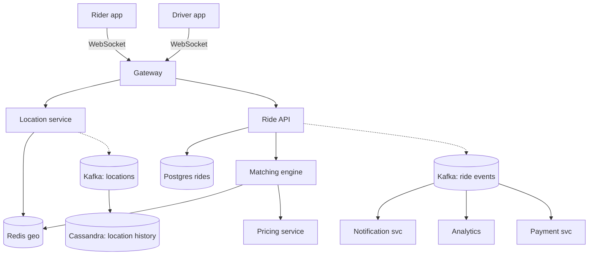
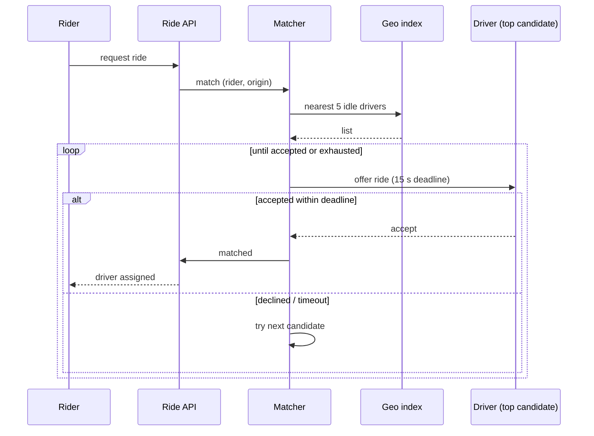
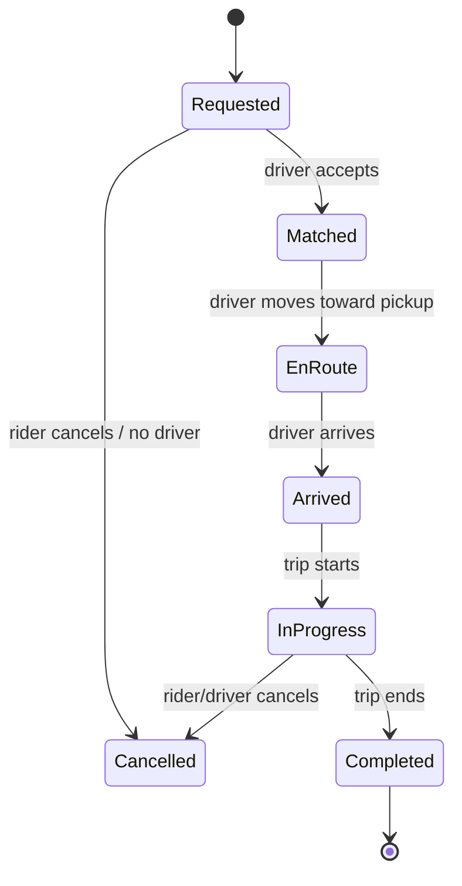

# Worked Design: Ride-Hailing / Food Delivery

Design Uber, Lyft, DoorDash, or a similar two-sided platform. **The hardest interview design**: real-time geo-spatial matching, persistent connections, multi-party state machines (rider, driver, restaurant for food delivery), payments, ratings, ETAs, route optimization. Uber's actual architecture has been documented extensively in their engineering blog; the lessons there shape this walkthrough.

## Where Ride-Hailing Systems Came From — Uber's 2009 Origin And The Smartphone Catalyst

Ride-hailing didn't exist before smartphones. The combination of GPS-enabled phones, mobile internet, and digital payments enabled Uber's launch in 2009. Understanding the origin reveals what makes ride-hailing different from previous transportation systems.

### The Pre-Uber Era

Before Uber, on-demand transportation was *taxis* (and limos for premium service). Taxis had specific problems:

- **Hailing required visibility**: you needed to find a taxi.
- **Cash payments**: card payment was slow and unreliable.
- **Quality variability**: clean cars and friendly drivers weren't guaranteed.
- **Cab medallion systems**: limited supply, often inflated prices.

These problems were *accepted* — there was no obvious alternative.

### The 2009 Uber Launch

**Uber** (originally UberCab) launched in **San Francisco in 2009**, founded by **Travis Kalanick** and **Garrett Camp**. The initial concept: black-car service summoned by smartphone app.

Camp had been frustrated with finding taxis in San Francisco. The vision: tap a button, see a car coming to you, ride, get out without paying (payment was automatic).

The technical enablers:

1. **GPS-enabled smartphones**: iPhone (2007), Android (2008).
2. **Mobile internet**: 3G ubiquitous by 2009.
3. **Mobile payments**: card-on-file with automated charging.

These were *new* in 2009. Pre-2007, ride-hailing wasn't technically possible.

### The 2012-2014 UberX And Scaling

The transformative moment was **UberX** (2012), expanding from black cars to regular drivers in regular cars. UberX dramatically increased supply and reduced prices. Demand exploded.

**Lyft** (founded 2012 by Logan Green and John Zimmer) introduced *competitor* ride-hailing with similar mechanics but different culture (fistbumps, pink mustaches).

By 2014, ride-hailing was a substantial industry. Uber's valuation grew from millions to billions in years.

### Technical Challenges Uber Solved

Uber's engineering blog (eng.uber.com) documents specific challenges:

1. **Real-time geo-spatial matching**: matching nearby riders with nearby drivers in milliseconds.
2. **Surge pricing**: dynamically adjusting prices based on supply-demand.
3. **ETA prediction**: estimating arrival times accurately.
4. **Driver experience**: keeping drivers happy enough to keep driving.
5. **Multi-party state machines**: riders, drivers, and the system coordinating.

Each is a *non-trivial* engineering problem. Uber's solutions became reference architectures.

### The 2017+ Food Delivery Expansion

The ride-hailing pattern *generalized*. **DoorDash** (founded 2013), **UberEats** (2014), **Grubhub** (founded 2004 but went public 2014) applied similar architectures to food delivery.

The pattern variations:

- **Restaurant intermediation**: food delivery has three parties (customer, restaurant, courier).
- **Batched delivery**: couriers handle multiple orders simultaneously.
- **Time windows**: restaurants prepare food during specific times.

The technical architecture remained largely similar to ride-hailing with extensions for the food-specific workflow.

### The Geo-Spatial Indexing Problem

The hardest technical problem in ride-hailing is **geo-spatial indexing** — finding nearby drivers/restaurants in milliseconds.

Uber's solution evolved:

1. **Initial**: simple latitude/longitude queries.
2. **Geohashing**: encoding locations as strings for indexing.
3. **H3 hexagonal grid** (Uber's own system, 2018): hexagonal cells for spatial indexing.

H3 became open-source and is widely used. The library has applications beyond ride-hailing (delivery, real estate, telecom).

### Who Travis Kalanick Is

**Travis Kalanick** (born 1976) is a controversial figure. He co-founded Uber in 2009 and led it through massive growth. He was forced to resign as CEO in 2017 after multiple controversies (sexual harassment scandals, trade secret theft allegations, "Greyball" anti-regulatory tool revelations).

Despite controversies, Kalanick's *engineering and product judgment* is widely respected. Uber's technical infrastructure, built under his leadership, remains best-in-class.

### The Modern Ride-Hailing Ecosystem

By 2024, ride-hailing is *mature* infrastructure. Major services include:

- **Uber**: global leader, expanded to food delivery, freight, etc.
- **Lyft**: US-focused, ride-hailing only.
- **DiDi**: Chinese leader, also expanded to delivery and finance.
- **Grab**: Southeast Asian leader.
- **Ola**: Indian leader.

Each operates similar architectures with local variations.

## Why Ride-Hailing Matters As An Interview Question

The ride-hailing question tests:

1. **Real-time geo-spatial systems**: matching nearby parties.
2. **Multi-party coordination**: state machines across parties.
3. **High-availability requirements**: outages cost real money per minute.
4. **Mobile infrastructure**: handling intermittent connectivity.

Senior candidates address all four. Junior candidates often miss the geo-spatial complexity or the multi-party coordination.

The interview reveals whether the candidate can handle a *complex* system with multiple interacting components.

## Senior Engineer's Q&A For This Design

### Q1: How do you handle geo-spatial matching at scale?

**Answer**: Specialized spatial indexing:

1. **H3 (Uber's hexagonal grid)**: hexagonal cells for spatial indexing.
2. **S2 (Google's)**: spherical geometry.
3. **Geohash**: simple string-based.
4. **Quadtree**: tree-based partitioning.

Hexagons (H3) have specific advantages: uniform neighbor distances, better edge handling. Uber's open-source H3 has become standard.

### Q2: How do you handle the matching algorithm?

**Answer**: Multi-stage matching:

1. **Candidate generation**: nearby drivers/restaurants.
2. **Filtering**: availability, capacity, type.
3. **Ranking**: distance, rating, ETA, surge.
4. **Optimization**: minimize total time across all matches.

Specific challenges:
- **Greedy vs optimal**: real-time vs perfect.
- **Batch matching**: optimize across many requests.
- **Cancellation handling**: rematch needed.

### Q3: How do you handle surge pricing?

**Answer**: Dynamic pricing based on demand-supply:

1. **Demand signals**: requests per area per time.
2. **Supply signals**: available drivers per area.
3. **Surge multiplier**: real-time calculation.
4. **Communication**: show users the surge.
5. **Driver incentive**: more drivers come to high-surge areas.

Specific challenges:
- **Public perception**: surge is controversial.
- **Surge capping**: regulatory limits in some jurisdictions.
- **Counter-gaming**: prevent drivers gaming the system.

### Q4: How do you handle multi-party state machines?

**Answer**: Each ride has explicit state:

1. **Requested**: rider wants ride.
2. **Matched**: driver assigned.
3. **En route**: driver going to pickup.
4. **Arrived**: driver at pickup.
5. **In progress**: ride underway.
6. **Completed**: ride finished.
7. **Cancelled**: any party cancelled.

Each transition involves multiple parties. State machine ensures consistency.

### Q5: How do you handle real-time location updates?

**Answer**: Tiered approach:

1. **High frequency** (active ride): every 1-5 seconds.
2. **Medium frequency** (waiting driver): every 10-30 seconds.
3. **Low frequency** (idle): every minute.

Storage:
- **Hot path**: in-memory for active rides.
- **Cold storage**: persisted for analytics.
- **Privacy**: location data has strict regulations.

### Q6: How do you handle the driver experience?

**Answer**: Often forgotten in interviews; drivers are users too.

Driver-specific considerations:

1. **Incentive systems**: bonuses, surge multipliers.
2. **Driver matching**: fair distribution.
3. **Cancellation tracking**: penalize driver no-shows.
4. **Earnings transparency**: clear payment calculation.
5. **Disputes**: handle complaints fairly.

The senior insight: driver experience affects supply. Bad driver experience → no drivers → no service.

## Common Misconceptions Explained

### "Ride-hailing is just about matching."

False. Matching is one component. Pricing, navigation, payments, ratings, fraud, regulations — all are major systems.

### "GPS makes location simple."

False. GPS has limitations: indoor accuracy, urban canyon issues, battery cost. Indoor positioning requires alternative techniques.

### "Single global service works."

False. Each region has regulations, payment systems, languages. Localization is significant.

### "Real-time matching is microsecond-fast."

False. Matching can take seconds. Users tolerate "looking for driver" UX.

### "Surge pricing is exploitative."

Partially false. Surge attracts more drivers to high-demand areas. Without surge, supply doesn't respond to demand.

### "Self-driving cars will simplify this."

Partially false. Self-driving removes drivers but adds fleet management, autonomous vehicle coordination, regulatory complexity.

## Requirements

### Functional

- **Rider**: request a ride to a destination; see ETA; track driver location; pay.
- **Driver**: appear available; receive ride request; accept/decline; navigate; complete; get paid.
- **Matching**: pair available drivers with rider requests minimizing pickup time.
- **Tracking**: rider sees driver's real-time location; system tracks driver's progress.
- **Pricing**: dynamic (surge) per location and time.
- **Ratings**: post-ride bidirectional ratings.

### Out Of Scope

- Onboarding / background checks.
- Driver payouts / merchant settlements (a payment design — see [T21](./T21-worked-design-payment-system.md)).
- Map data / routing engine (assume an external service: Google Maps, Mapbox, internal).

### Non-Functional

- **Scale**: 100M MAU, 30M DAU, 100K active drivers at peak, 5M rides/day.
- **Latency**: match within 2–5 seconds; location update propagation in < 5 s.
- **Availability**: 99.95% — outage is highly visible.
- **Real-time**: location updates from driver every 5–15 seconds.

## Capacity

```
Active drivers: 100K
Location updates: 100K × 1 every 10 s = 10K/s
Rider requests: 5M rides/day / 86400 = ~60/s avg; peak ~5x = 300/s
Tracking subscriptions: per active ride, both rider and driver receive each other's updates → 2× the active rides

Storage:
  Trip history: 5M/day × 2KB = 10 GB/day → ~3.6 TB/year
  Location history: 10K/s × 50 bytes × 86400 = 43 GB/day → archive aggressively
```

## API

```http
POST /api/v1/rides/request
  body: { "origin": {lat, lng}, "destination": {lat, lng}, "rideType": "standard" }
  returns: { "rideId": "...", "status": "matching" }

WebSocket: /ws (driver + rider)
  driver receives: { "type": "ride_request", "ride": {...}, "deadline": "..." }
  rider receives: { "type": "driver_assigned" / "driver_arriving" / "trip_started" / ... }
  location updates streamed both ways

POST /api/v1/rides/{id}/accept    // driver
POST /api/v1/rides/{id}/decline   // driver
POST /api/v1/rides/{id}/start
POST /api/v1/rides/{id}/complete

POST /api/v1/locations/update
  body: { "lat": ..., "lng": ... }
```

## Data Model

```sql
CREATE TABLE drivers (
  id              UUID PRIMARY KEY,
  status          TEXT,   -- offline, idle, en_route, on_trip
  current_lat     DOUBLE,
  current_lng     DOUBLE,
  current_geohash TEXT,
  -- indexed by geohash for proximity queries
  updated_at      TIMESTAMPTZ
);
CREATE INDEX idx_drivers_geohash ON drivers (current_geohash) WHERE status = 'idle';

CREATE TABLE rides (
  id              UUID PRIMARY KEY,
  rider_id        UUID,
  driver_id       UUID,
  status          TEXT,   -- requested, matched, accepted, en_route, in_progress, completed, cancelled
  origin_lat, origin_lng DOUBLE,
  dest_lat, dest_lng    DOUBLE,
  requested_at    TIMESTAMPTZ,
  matched_at      TIMESTAMPTZ,
  completed_at    TIMESTAMPTZ,
  fare            DECIMAL
);
```

Driver locations are very write-heavy. Two-tier:
- **Hot location store**: Redis with geo-spatial commands (`GEOADD`, `GEOSEARCH`) for live matching.
- **Cold trip history**: Cassandra for completed rides.

## High-Level Architecture



## Deep Dive A: Geo-Spatial Indexing And Matching

The matching problem: given a rider's pickup at `(lat, lng)`, find the nearest idle drivers within ~3 km. Naive scan of 100K drivers is too slow.

**Geohash / S2 / H3** divide the world into hierarchical cells. A geohash like `9q8yyk` represents a square region. Drivers are indexed by their geohash prefix. To find drivers near a point, query the prefix(es) covering the search radius.

Uber uses **H3** (hexagonal grid, open-sourced). Google uses **S2**. The basic idea is the same.

```java
class GeoIndex {
  // Redis GEOSEARCH does this natively
  List<Driver> findNearby(Coordinate point, double radiusKm) {
    return redis.opsForGeo().search(
        "drivers:idle",
        GeoReference.fromCoordinate(point),
        new Distance(radiusKm, Metrics.KILOMETERS),
        Sort.ASCENDING.limitTo(20));
  }
}
```

Redis `GEOSEARCH` returns the nearest N drivers within a radius. The matching engine then picks the best by ETA (distance + traffic + driver rating).

## Deep Dive B: The Matching Loop



**Driver offer**: a request is sent to one (or a few) candidate drivers. They have ~15 seconds to accept. If they decline, try the next.

**Why not broadcast to all candidates?** Drivers race-accept; only one wins; the others have done idle work. Single-offer-at-a-time is fairer and uses less bandwidth.

**Why not match instantly?** Often a slight wait yields a better match (a closer driver becomes available). Uber's matcher batches requests over 1–2 second windows.

## Deep Dive C: Location Updates At 10K/s

Every driver streams location every 5–15 seconds. The architecture:

1. Driver app → WebSocket gateway.
2. Gateway forwards to Location service.
3. Location service:
   - `GEOADD` to Redis (for matching).
   - Publish to Kafka (for archival, analytics, in-flight ride tracking).
4. For drivers on an active ride: forward the location to the rider's WebSocket.

10K/s writes to Redis is well within a sharded cluster. Kafka handles the archive.

## Deep Dive D: The Ride State Machine



State transitions are recorded as events for audit and replay. Each transition triggers downstream effects (notifications, payments, ratings). Implemented as a saga ([T06](./T06-distributed-transactions-2pc-saga.md)) for cross-service consistency.

## Deep Dive E: Surge Pricing

Per geo-cell, per time bucket, compute the supply-demand ratio. When demand exceeds supply, increase the price multiplier (1.0× normal, 1.5×, 2.0×, etc.).

Pricing is an ML-driven service; for the design, the input is the cell's (riders waiting) / (drivers available), and the output is a multiplier displayed to riders before they confirm.

## Trade-Offs

| Decision | Chosen | Alternative | Reason |
|----------|--------|-------------|--------|
| Geo index | Redis GEOSEARCH | Postgres PostGIS | Latency at 10K/s writes |
| Matching | Single-offer-at-a-time | Broadcast | Fairness, bandwidth |
| Connection layer | WebSocket | Polling | Real-time UX |
| State persistence | Postgres with events | Pure event-sourced | Familiar; events for downstream |
| Cross-service | Saga | 2PC | Microservices don't 2PC |

## Failure Modes

- **Driver app loses connectivity mid-trip**: cache the trip state locally; reconnect; sync.
- **Gateway crash with active ride**: WebSocket reconnects to another gateway; presence updated; state restored from DB.
- **Geo-index outage**: matching fails; rider sees "no drivers available." Fall back to a less-fresh secondary index.
- **Payment fails post-trip**: charge later (retries); driver still gets paid (per Uber's policy of absorbing customer no-pays in some cases).

## Code Sketch

```java
@Service
class MatchingEngine {
  private final GeoIndex geo;
  private final DriverNotifier notifier;
  private final RideRepository rides;

  public Optional<Driver> matchAsync(Ride ride) {
    List<Driver> candidates = geo.findNearby(ride.origin(), 5.0);
    for (Driver candidate : candidates) {
      OfferResult result = notifier.offer(candidate.id(), ride, Duration.ofSeconds(15));
      if (result == OfferResult.ACCEPTED) {
        rides.markMatched(ride.id(), candidate.id());
        return Optional.of(candidate);
      }
    }
    return Optional.empty();
  }
}
```

> [!INTERVIEW]
> Strong candidates name **H3 / geohash / S2** for spatial indexing, describe **single-offer-at-a-time** matching, draw the **state machine for ride lifecycle**, and address **location-update throughput** with a Redis + Kafka pattern.

## Practice

1. **Geohash exercise.** Compute the geohash for a coordinate. Find the 9 cells covering a search radius.
2. **Matching latency budget.** Match within 5 s p99. Decompose the budget: geo query, offer, accept, downstream.
3. **Surge model.** Sketch the per-cell supply/demand calculation.
4. **State-machine durability.** Implement the ride state machine with persistence. Force a crash; verify recovery.
5. **Location-update fan-out.** For 100K drivers each updating to 1 rider, what's the architecture for 100K WebSocket fan-outs?
6. **Multi-region.** Drivers in different cities; the matcher per region; cross-region rides (rare) handled via a gateway.
7. **ETA accuracy.** Use route-engine ETA vs simple distance/speed. Trade-off.
8. **Driver-stale detection.** Driver stopped reporting location 2 minutes ago; mark offline.
9. **Food delivery variant.** Add the restaurant as a third party. How does the state machine change?
10. **The skeptic conversation.** A junior engineer wants to use Postgres for the live geo index. Write a 200-word response on why a specialized geo tool is needed at scale.

## Recap

You should now be able to:

- Design a **ride-hailing / food delivery** platform at Uber-scale.
- Use **H3 / geohash / S2** geospatial indexing with Redis `GEOSEARCH` for live driver lookup.
- Implement **single-offer-at-a-time** matching with deadline-based candidate iteration.
- Stream **driver locations at 10K/s** via WebSocket + Redis + Kafka.
- Express **ride lifecycle as a state machine** persisted as events.
- Apply **surge pricing** via per-cell supply/demand monitoring.
- Anticipate failures: connectivity loss, gateway crash, geo-index outage, payment failure.
- Adapt the design to food delivery by adding the restaurant as a third party.

## C02 Complete

**You have completed C02 — Distributed Systems & System Design.** Twenty-three topics covering the fundamentals (CAP, consistency, consensus, replication, partitioning, transactions) plus operational patterns (idempotency, locking, clocks, load balancing, caching, scaling, rate limiting, resilience, reliability) plus the system-design framework plus seven end-to-end designs.

## Next

Continue to **[C03 — Engineering Craft & Leadership](../C03-engineering-leadership/)** — the people-and-process side of staff engineering: code review, ADRs, mentoring, tech debt, technical strategy, incident response, on-call, hiring, stakeholder communication.
