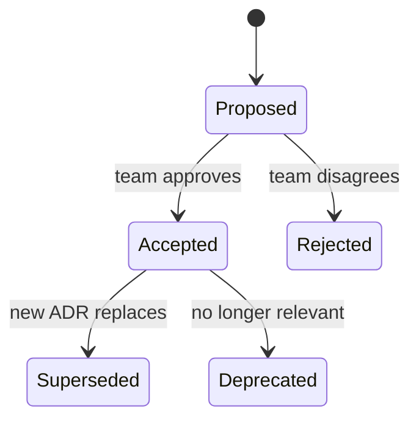

# Architecture Decision Records (ADRs)

An **Architecture Decision Record** is a one-page note capturing one architectural decision: *what* was decided, *what alternatives* were considered, *what trade-off* was accepted, *what the consequences* are. The format was named and popularized by Michael Nygard in a 2011 blog post; the practice has since become near-universal in mature engineering organizations. **ADRs are the "version-controlled memory" of an architecture** — three years from now, when a new engineer asks "why did we pick PostgreSQL over DynamoDB?", the ADR is the answer, and the answer survives the original author leaving the team.

The depth bar here is **how to write an ADR that's useful 5 years later** — not at the moment of writing, when context is fresh, but in the future when context is gone. We cover Nygard's canonical format, the explicit status lifecycle (Proposed → Accepted → Superseded), the **immutability rule** (an ADR is not edited; it's superseded by a new one), and the practical question of **where ADRs live** (in the repo, in a wiki, in an external archive). We cover the dance between **design docs** (proposing) and ADRs (recording) — when one becomes the other — and the **AI-era benefit**: a directory of ADRs feeds a code-aware assistant with the context that would otherwise be lost.

> [!NOTE]
> Pairs with [Technical Writing](./T02-technical-writing-and-design-docs-rfcs.md) (design docs propose; ADRs record) and [Architecture Trade-Off Analysis](../C01-software-architecture/T14-architecture-trade-off-analysis.md) (ADRs are the artifact of trade-off discussions).

## Where ADRs Came From — Michael Nygard's 2011 Essay And The Documentation Crisis

Architecture Decision Records (ADRs) have a *specific* origin: **Michael Nygard's [2011 blog post](https://cognitect.com/blog/2011/11/15/documenting-architecture-decisions)** "Documenting Architecture Decisions." Before this post, software teams *had no standard format* for documenting architectural choices. Nygard's contribution was naming the format and providing a template that teams could immediately adopt.

### The Pre-ADR Documentation Crisis

The 2000s software industry had a *documentation problem*. Every architect had seen:

- **System documentation that didn't match the system**: written once, never updated.
- **Decisions made and forgotten**: "why did we choose X?" — nobody remembered.
- **Wiki pages with stale information**: written enthusiastically, abandoned later.
- **Decisions re-litigated**: same arguments every 6 months because nobody documented the resolution.

The fundamental problem: documentation that documents *everything* documents nothing. Teams that tried to write comprehensive system documentation produced documents that were too long to maintain and too broad to be useful.

The 2000s saw various attempted solutions:

- **UML diagrams**: rigorous but high-effort, often abandoned.
- **Wiki pages**: easy to write, hard to keep current.
- **Architecture diagrams**: useful at creation, stale within months.
- **Comprehensive design docs**: useful for major projects, too heavy for individual decisions.

None of these solved the *specific* problem of *small individual decisions* — decisions important enough to remember but not large enough to justify a full design doc.

### Michael Nygard's 2011 Essay

The breakthrough came on **November 15, 2011**, when Michael Nygard (the author of *Release It!*) published his blog post **"Documenting Architecture Decisions"** on the Cognitect (then Relevance) blog. The post is *short* — about 700 words — but introduced the canonical ADR format.

The format Nygard proposed:

1. **Title**: short noun phrase.
2. **Context**: what's the situation requiring a decision?
3. **Decision**: what did we decide?
4. **Status**: proposed, accepted, deprecated, superseded.
5. **Consequences**: what becomes easier or harder?

Each section was *small* — typically a paragraph. The complete ADR fit on one page. The format was *immediately usable* — no tooling required, no process to adopt, just a markdown file in a repo.

Nygard's specific insight: **architectural decisions are made constantly; most are small; they all deserve to be remembered**. The ADR format made remembering *cheap enough* that teams would actually do it.

### Why The Format Spread

ADRs spread *organically* through the 2010s. The reasons:

1. **Cost was minimal**: no tooling, no process change, just a markdown file.
2. **Value was immediate**: future readers could understand past decisions.
3. **Format was simple**: anyone could write an ADR after reading one example.
4. **AI/Search benefits**: AI tools and code search treat ADRs as first-class content.

By 2018, ADRs were *standard* at most modern tech companies. The format Nygard proposed was used widely; specific variants existed but the structure was recognizable.

### The 2017+ AI Era Boost

The rise of AI coding assistants (GitHub Copilot, Claude, ChatGPT) gave ADRs *additional* value. When AI tools read codebases:

- **ADRs provide context** that the code alone doesn't show.
- **AI suggestions can reference ADR-decided patterns**.
- **AI summarization of ADRs** helps engineers understand large codebases quickly.

Companies that had been investing in ADR culture for years suddenly had *better AI assistance* than those without ADRs. This created an additional incentive for ADR adoption.

### Who Michael Nygard Is

Already covered in the [C02/T14 Resilience topic](../C02-distributed-systems-and-system-design/T14-resilience-circuit-breaker-bulkhead-retry-timeout-backpressure.md), but worth recapping: **Michael Nygard** is the author of *Release It!* (2007, 2018), one of the most influential books on production-ready software. His consulting work at Cognitect (later acquired by Nubank) gave him *deep* exposure to production systems and their failure modes.

Nygard's contributions span resilience patterns, deployment patterns, and architectural documentation. The ADR essay is *small* in his catalog of work but disproportionately influential.

## Why ADRs Matter, Specifically: The Senior Engineer's Q&A

### Q1: Why is the ADR format so simple?

Because **simplicity is the feature**. If ADRs required complex tooling, formal review, or extensive content, teams wouldn't write them. The simple format ensures ADRs *get written* — which is what actually matters.

The trade-off: ADRs aren't comprehensive. They capture *the decision*, not the full analysis. The detailed analysis goes in design docs; the ADR is the *summary record*.

### Q2: What goes in an ADR vs a design doc?

**Design doc**: the proposal, considered before the decision. Long, exploratory.

**ADR**: the decision, recorded after the proposal is accepted. Short, definitive.

A design doc often *generates* an ADR. The doc explores options; the ADR documents which option was chosen.

### Q3: When should I write an ADR?

For *any architectural decision* that:

- Future engineers would benefit from understanding.
- Was not obvious from the code alone.
- Required choice between alternatives.

Examples:
- Choosing a database.
- Choosing a serialization format.
- Choosing a deployment pattern.
- Choosing a programming paradigm.

Examples that don't need ADRs:
- Variable naming conventions.
- Specific function implementations.
- Routine refactoring.

### Q4: How do ADRs evolve over time?

Three patterns:

1. **Proposed**: under discussion, not yet accepted.
2. **Accepted**: decision made, in effect.
3. **Deprecated**: no longer in effect.
4. **Superseded**: replaced by another ADR (which is linked).

The chronological sequence is preserved. Old ADRs aren't deleted; they're marked as superseded so future readers can trace the decision history.

### Q5: How do ADRs work with AI coding tools?

ADRs in the repo become *context* for AI tools. When AI suggestions need to align with architectural patterns:

- AI can read relevant ADRs.
- AI can reference ADR decisions in suggestions.
- AI can summarize ADRs for engineers asking "why is this code structured this way?"

The senior practice: include enough ADRs that the AI can understand your team's architectural choices. Without ADRs, AI suggestions may conflict with established patterns.

## Common Misconceptions Explained

### "ADRs are bureaucratic overhead."

False. The minimum ADR is *one page*. It takes 15 minutes to write. The overhead is trivial relative to the long-term value.

### "ADRs replace design docs."

False. They complement each other. Design docs propose; ADRs record. Both have value.

### "Old ADRs should be deleted."

False. **ADRs are append-only**. Superseded ADRs remain in the repo; they're marked as superseded with links to replacements. Deletion erases history.

### "ADRs should cover everything."

False. ADRs cover *architectural decisions*, not implementation details. Code documents implementation; ADRs document choices.

### "ADRs are just for current decisions."

False. The most valuable ADRs are *retrospective* — documenting decisions made years ago that future engineers need to understand.

### "ADRs need a special tool."

False. **Markdown files in a repo are sufficient**. Specialized tools exist (adr-tools, log4brains) but aren't required.

## Nygard's Format

The canonical structure is short:

```markdown
# ADR-0042: Use PostgreSQL For The Order Service

## Status
Accepted (2026-06-08)

## Context
The order service needs durable, transactional persistence for order data.
We expect ~5K writes/sec peak, 200 GB of data within 5 years, strong
consistency requirements (no double-spend on inventory).

Three options were considered: PostgreSQL, DynamoDB, MongoDB.

## Decision
We will use PostgreSQL as the primary store, deployed via AWS RDS with
Multi-AZ failover and a read replica for reporting.

## Consequences
- Strong ACID transactions across order rows (positive).
- Well-known tooling (psql, pgAdmin, Datadog integrations) (positive).
- Manageable for the team's existing Postgres operational skill (positive).
- 200 GB fits in a single instance (current and 5-year projection) (positive).
- Single-region write capability; multi-region writes would require a
  major design change (negative, accepted).
- Schema migrations have downtime windows that DynamoDB doesn't (negative,
  accepted with Flyway and expand-contract).

## Alternatives Considered
- **DynamoDB**: lower operational burden, scales further. Rejected because
  of the team's lack of operational experience and because Postgres's
  transactional model maps directly to our domain.
- **MongoDB**: rejected due to historical Jepsen issues with consistency
  and the lack of strong ACID across documents in production
  configurations.
```

Five sections: Status, Context, Decision, Consequences, Alternatives Considered. Optional: References, Related Decisions.

**Length**: 1–2 pages. ADRs are deliberately short. If you need more than 2 pages, you're writing a design doc — write that, then summarize the decision into an ADR.

## Status Lifecycle



The **immutability rule**: once an ADR is Accepted, it's not edited. If the decision changes, a new ADR supersedes it. The old ADR's status becomes "Superseded by ADR-XYZ"; both remain readable.

Why immutable? **Because the goal is "what did we know then?" not "what do we know now?"** If someone reads ADR-0042 in 2030, they should learn what was true in 2026 — including the constraints that led to the decision. Updating the ADR erases that history.

## Where ADRs Live

Common choices:

1. **In the repo** — `/docs/adr/0042-postgres.md`. Versioned with the code. Pros: discoverable via `grep`, AI-tooled, immune to wiki rot. Cons: one repo per service means cross-service ADRs are awkward.
2. **In a docs repo** — `engineering-docs/adr/`. Shared across services. Pros: cross-service decisions visible. Cons: separate from the code.
3. **In a wiki** — Confluence, Notion. Pros: searchable. Cons: rotates, fragments, dies with subscriptions.

**The trend in 2026 is "in the repo,"** especially as AI tools (Claude Code, Copilot) increasingly read repo content for context. ADRs in `/docs/adr/` show up in AI's analysis; ADRs in Confluence don't.

## Naming Convention

`/docs/adr/####-short-title.md`:

```
0001-use-spring-boot.md
0002-postgres-for-primary.md
0003-kafka-for-events.md
...
0042-postgres-for-order-service.md
```

Numeric prefix for ordering; short title for readability. Use [adr-tools](https://github.com/npryce/adr-tools) (`adr new "use postgres for primary"`) to automate the numbering.

## What's Worth An ADR

Not every decision. The threshold:

- **Architecturally significant**: affects multiple components or future change.
- **Trade-off was made**: an alternative was reasonable; the choice deserves justification.
- **Hard to reverse**: if the team would have to spend significant effort to change, ADR it.

Examples worth ADR:
- Choice of primary database, message broker, cloud provider.
- Decision to adopt a particular architectural pattern (hexagonal, event-sourcing).
- A communication-style choice (REST vs gRPC vs events).
- A schema-evolution policy.

Not worth ADR:
- Choice of logging library (low impact, easy to swap).
- Naming conventions (live in CONTRIBUTING.md).
- Specific function implementations.

## Linking To Implementation

In code, link to the ADR:

```java
/**
 * Optimistic concurrency control via the version column.
 * See ADR-0017 for the choice over pessimistic locking.
 */
@Version
private Long version;
```

In commits:

```
feat(orders): add expand-contract for customer_id → customer_uuid

Implements step 2 of the migration plan in ADR-0042.
Closes #1234.
```

Now future readers — including AI tools — can follow the chain from code to decision.

## ADR Vs Design Doc

| | Design doc | ADR |
|---|---|-----|
| Purpose | Propose | Record |
| Length | 2–8 pages | 1–2 pages |
| Lifecycle | Single revision | Immutable |
| When | Before decision | After decision |
| Detail | Sufficient to evaluate | Sufficient to remember |
| Audience | Reviewers | Future maintainers |

A typical flow: a design doc proposes 3 alternatives. Team accepts one. The author writes an ADR distilling the decision. The design doc remains as the deeper rationale.

## Common Anti-Patterns

### Editing An Accepted ADR

The decision changes; someone edits the original instead of writing a new ADR. History is lost. Fix: enforce immutability via PR review of `/docs/adr/`.

### ADRs Without Alternatives

The ADR records the choice but not the rejected options. Reads as "we did it this way because we did" — no rationale. Fix: always include alternatives.

### ADRs Without Consequences

Records the choice but not what's been bought / lost. Fix: explicitly list positive and negative consequences.

### ADRs As Marketing

The ADR oversells the decision. Reads like a sales document. Future readers can't trust it. Fix: honest trade-offs; "we accepted this cost" beats "this is amazing."

### Unfindable ADRs

Stored in a private Confluence with no search; never linked from code. Fix: in the repo, named consistently, linked from code comments.

### ADRs For Trivial Decisions

The team writes 100 ADRs in a year, most about variable naming. Signal is lost in noise. Fix: only ADR architecturally-significant decisions.

## ADRs In The AI Era

A new benefit in 2026: AI coding assistants (Claude Code, Cursor, Copilot) read repo content. ADRs in `/docs/adr/` become part of the AI's context for any change touching the relevant area.

Example: an engineer asks Claude Code "should I add a denormalized cache here?" Claude reads ADR-0042 explaining the team's choice of PostgreSQL with explicit caching layer, finds the conventions, suggests an answer aligned with the existing architecture.

This is why **ADRs in the repo dominate over ADRs in wikis** for AI-assisted development. The repo is the LLM's context window.

## A Sample ADR Library Structure

```
docs/adr/
├── README.md
├── template.md
├── 0001-record-architecture-decisions.md     ← meta-ADR
├── 0002-use-spring-boot.md
├── 0003-use-postgres-for-primary-storage.md
├── 0004-use-kafka-for-events.md
├── 0005-hexagonal-architecture.md
├── ...
├── 0042-use-postgres-for-order-service.md
└── 0043-supersede-0017-use-optimistic-concurrency.md
```

The first ADR (0001) is meta: it explains that this team records ADRs and the format used. Sets the norm.

## Maintenance Discipline

ADRs are documents like any other; without care, they rot:

- **Status fields kept current**: when ADR-0017 is superseded, update its status.
- **Cross-links maintained**: ADR-0043 links to ADR-0017 it supersedes; ADR-0017 forward-links to ADR-0043.
- **README index**: `/docs/adr/README.md` lists all ADRs with title + status.
- **Annual audit**: in a quarterly engineering review, scan for stale or superseded ADRs.

## Trade-Off Summary

| Practice | Cost | Value |
|----------|------|-------|
| Write ADR per significant decision | ~1 hour | Preserved rationale, AI context |
| In-repo location | Repo merge friction | Discoverability, AI access |
| Numeric naming | Trivial | Clear ordering |
| Immutability | Discipline to enforce | Honest history |
| Alternatives mandatory | Slight extra writing | Future reader gets the comparison |

> [!INTERVIEW]
> A common L5 prompt: "How do you document architectural decisions?" Strong answers (a) name ADRs explicitly, (b) cite Nygard's 5-section format, (c) describe the immutability rule, (d) explain the difference from design docs.

## Practice

1. **Write your first ADR.** Take a decision your team made in the last 6 months. Write it as an ADR in Nygard's format.
2. **Audit existing decisions.** Find 5 architectural decisions in your codebase that lack ADRs. Pick the 3 most consequential; write ADRs.
3. **Set up the directory.** Create `/docs/adr/` with template + README + ADR-0001 (the meta-ADR). Get team buy-in.
4. **adr-tools install.** Install Nat Pryce's [adr-tools](https://github.com/npryce/adr-tools). Use `adr new "..."` for your next ADR.
5. **Find an unfindable ADR.** In your team's Confluence / Notion, find an ADR that should have been in-repo. Migrate it.
6. **Supersede an ADR.** Identify a decision that's changed; write the new ADR; update the superseded one's status.
7. **Link from code.** For one ADR, add comments in the relevant source files linking back to it.
8. **AI context test.** With an AI tool, ask "why is this code structured this way?" without giving it the ADR; then with. Compare the answers.
9. **Quarterly review.** Schedule a 30-minute review of recent ADRs with the team.
10. **The skeptic conversation.** A senior engineer says "ADRs are overhead — everyone knows why we did it." Write a 200-word response on engineer turnover and AI context.

## Recap

You should now be able to:

- Write an **ADR in Nygard's format** — Status, Context, Decision, Consequences, Alternatives Considered.
- Apply the **immutability rule**: ADRs are not edited; they are superseded.
- Choose **in-repo location** (`/docs/adr/`) over wiki for discoverability and AI access.
- Distinguish **ADR** from **design doc** by lifecycle and detail level.
- Set the **threshold** for what's worth an ADR (architecturally significant, trade-off made, hard to reverse).
- Link **code to ADRs** via comments and commit messages.
- Run an **ADR library** with naming, README index, status discipline, periodic audit.
- Recognize and prevent **anti-patterns**: editing accepted ADRs, missing alternatives, missing consequences, marketing language, unfindable storage, trivial ADRs.

## Next

Continue to [Estimation & Breaking Down Work](./T04-estimation-and-breaking-down-work.md) — turning vague feature requests into shippable units with defensible time estimates.
