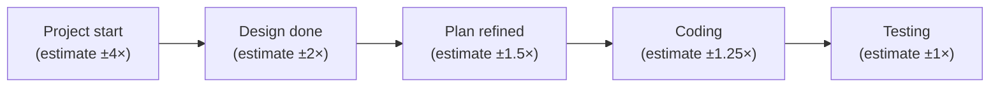
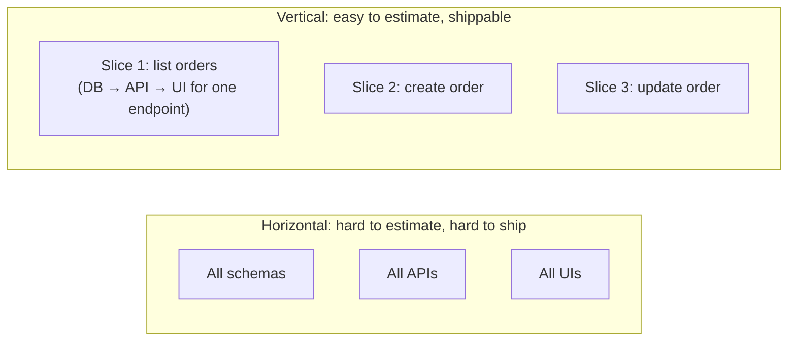

# Estimation & Breaking Down Work

Engineering estimation is **a structured guess about an unknowable future**. Every senior engineer has been asked "how long will this take?" and discovered the answer was wrong by 2× to 10×. The pattern is universal — Hofstadter's Law ("It always takes longer than you expect, even when you take into account Hofstadter's Law") quantifies what every engineer has experienced. The senior craft is not eliminating the error (impossible) but **bounding it, communicating it, and breaking work into pieces small enough that each piece's estimate has tight error bars even if the whole project's doesn't**.

The depth bar here is **the techniques that actually work in practice** (T-shirt sizing, planning poker, story points, #NoEstimates) and the **cognitive biases** that make naive estimates wrong (optimism bias, planning fallacy, sunk cost). We cover **vertical slicing** — breaking a feature into deployable end-to-end thin slices rather than horizontal layers — and the **MVP discipline** that ships the smallest useful thing first. We name the **failure modes**: the 6-month "big design upfront" estimate that's wrong by 3 months; the "we'll figure it out" approach with no estimate at all; the estimate quoted as a deadline. By the end you will produce estimates with explicit uncertainty bands, break work into shippable units, defend against false-precision demands, and refuse to commit calendar dates to architecture you haven't designed.

## Where Software Estimation Theory Came From — From Boehm's COCOMO To Modern #NoEstimates

Software estimation is one of the *oldest* and most-studied problems in software engineering. The field has produced multiple methodologies (COCOMO, function points, story points, T-shirt sizing) and one movement that rejects estimation entirely (#NoEstimates). Understanding the history reveals why estimation remains so hard.

### The 1981 Foundation — Boehm's COCOMO

The first major software estimation methodology was **Barry Boehm's COCOMO (COnstructive COst MOdel)**, introduced in his 1981 book [*Software Engineering Economics*](https://www.amazon.com/Software-Engineering-Economics-Barry-Boehm/dp/0138221227). Boehm (1935–2022) was a TRW engineer (later USC professor) who studied dozens of software projects to derive empirical estimation formulas.

COCOMO's structure:

1. **Estimate code size** (in thousands of source lines of code, KLOC).
2. **Apply effort formulas** based on project type (organic, semi-detached, embedded).
3. **Apply cost drivers** (~15 factors: programmer ability, complexity, schedule constraints).

COCOMO produced effort estimates in person-months. The model was *empirically grounded* — based on actual project data, not theoretical assumptions.

COCOMO II (1995) refined the model with updated data and improved formulas. COCOMO remains in use today in defense and aerospace contexts where rigorous estimation is required.

The fundamental limitation: COCOMO requires estimating *code size first*, which is itself a hard estimation problem. Estimating KLOC for a project that hasn't started is nearly as hard as estimating effort directly.

### Function Point Analysis (Albrecht, 1979)

Parallel to COCOMO, **Allan Albrecht (IBM, 1979)** developed [*Function Point Analysis*](https://en.wikipedia.org/wiki/Function_point) — an estimation method based on *functional complexity* rather than code size.

Function points count:

- **External inputs** (data entering the system).
- **External outputs** (data leaving the system).
- **External inquiries** (interactive queries).
- **Internal logical files** (data stores).
- **External interface files** (external integrations).

Each component is weighted by complexity. The total function points correlate with implementation effort.

Function point analysis became *the* standard in enterprise software estimation during the 1980s–1990s. ISO 14143 standardized it. Many large IT projects (especially government and finance) still use it.

The limitation: function points are *also* hard to estimate before the system exists. They're more accurate than KLOC but still uncertain.

### The 1990s — Empirical Studies Of Estimation Accuracy

Through the 1990s, **Steve McConnell** and others studied how accurate software estimates actually were in practice. His 2006 book [*Software Estimation: Demystifying the Black Art*](https://www.amazon.com/Software-Estimation-Demystifying-Developer-Best/dp/0735605351) is the canonical reference.

McConnell's findings:

- **Most estimates are systematically optimistic**: actual effort is typically 25–100% higher than estimates.
- **The "cone of uncertainty"**: estimates have wider uncertainty early in projects, narrower as work proceeds.
- **Specific patterns predict accuracy**: experienced teams estimate better than novices.

The "cone of uncertainty" became *the* standard image of estimation. Estimates 4× too low at project start, 1× accurate by completion — the cone narrows as work progresses.

### The 2000s — Story Points And Agile Estimation

The Agile movement (2001+, covered in [T05](./T05-agile-scrum-kanban.md)) brought new estimation methods. **Story points** emerged in the early 2000s as a *relative* estimation technique:

- **Pick a reference story**: a small, well-understood work item.
- **Compare other stories**: a story 3× more complex = 3 points.
- **Track velocity**: points completed per sprint.
- **Project completion**: divide remaining points by velocity.

The argument: humans are *worse* at absolute estimation (how many hours?) than at *relative* estimation (is this twice as big as that?). Story points exploit relative judgment.

**Planning poker** (Grenning, 2002) is the canonical story-point estimation technique. Each team member privately estimates a story; estimates are revealed simultaneously; the team discusses differences and re-estimates.

### The #NoEstimates Movement (2012+)

A more radical response emerged: **#NoEstimates**, started by **Vasco Duarte** (a software development consultant) and **Woody Zuill** (an Agile coach) around 2012. The argument:

1. **Estimates are systematically wrong** despite decades of methodology research.
2. **Estimates create pressure** to meet them, leading to quality compromises.
3. **Estimates consume time** that could be spent shipping.
4. **Alternative**: focus on *throughput* (work completed per unit time) rather than estimates.

#NoEstimates is controversial — many teams find estimates valuable for stakeholder communication. The movement's value: questioning whether estimation effort is justified by estimate accuracy.

### Why Estimation Remains Hard

Despite 40+ years of methodology research, software estimation remains famously inaccurate. The reasons:

1. **Discovery during implementation**: requirements clarify as work proceeds.
2. **Unknown technical complexity**: hard problems reveal themselves only by attempting them.
3. **Cognitive biases**: optimism bias, planning fallacy, anchoring.
4. **Variable team capacity**: people get sick, leave, prioritize differently.

The senior judgment: estimates are *useful* but inherently uncertain. The error is treating them as commitments.

## Why Estimation Matters, Specifically: The Senior Engineer's Q&A

### Q1: Why are software estimates so often wrong?

Per McConnell's research:

1. **Planning fallacy**: we underestimate by default.
2. **Discovery effect**: we don't know what we don't know.
3. **Pressure to be optimistic**: pessimistic estimates get pushed back.
4. **Reuse failures**: code that's "almost reusable" never is.

Combined, these produce typical estimates that are 50% to 100% too low.

### Q2: How do I make better estimates?

Three patterns:

1. **Multiple estimators**: planning poker, average of independent estimates.
2. **Reference class forecasting**: compare to similar past projects.
3. **Decompose**: large estimates are wrong; small estimates are more accurate.

Combined, these reduce estimation error by 30–50%.

### Q3: How do I communicate estimate uncertainty?

Three options:

1. **Range**: "3-5 days" instead of "4 days."
2. **Confidence interval**: "80% likely 3-5 days; 95% likely 2-7 days."
3. **Probabilistic estimate**: full distribution over possible durations.

Most stakeholders can handle ranges. Few benefit from full distributions.

### Q4: When should I refuse to estimate?

When the estimate would be *misleading*. Specifically:

- Before requirements are clear.
- Before technical approach is known.
- When stakeholders will treat the estimate as a commitment.

The senior practice: provide rough ranges but refuse precise estimates without analysis. Saying "I need 2 days to estimate properly" is better than guessing.

### Q5: How does vertical slicing improve estimation?

By making each piece *small enough to estimate accurately*. A 6-month project is hard to estimate; a 1-week vertical slice is easier.

The accumulated estimates of slices aren't necessarily accurate (each slice may have its own error), but the team can *adjust* as slices complete. Continuous re-estimation is more useful than initial accuracy.

## Common Misconceptions Explained

### "Better methodology produces better estimates."

Partly false. Methodologies *help marginally* but estimation remains fundamentally uncertain. The major gains come from decomposition and feedback, not formula sophistication.

### "More detailed estimates are more accurate."

False. Detailed estimates produce *more total errors* (more places to be wrong). The accumulated error often exceeds high-level estimate error.

### "Estimates should be commitments."

False. Estimates are *predictions*; commitments are *promises*. Treating estimates as commitments creates incentives to estimate optimistically, making estimates less accurate.

### "Story points eliminate estimation problems."

False. Story points are *less precise* than time estimates but allow easier comparison and tracking. The fundamental uncertainty remains.

### "If we just work harder, we'll meet estimates."

False. Estimates that require unsustainable effort cause burnout and quality compromises. Working "harder" produces worse outcomes than working at sustainable pace.

### "Velocity should always increase."

False. Velocity *stabilizes* as teams settle. Continuous improvement comes from process changes, not pushing for more points.

## Why Naive Estimates Are Wrong

Three cognitive biases make estimates optimistic by default:

1. **Planning fallacy** (Kahneman): we underestimate how long tasks will take, even when we know better. Our internal model is "ideal case" not "expected case."
2. **Survivor bias**: we remember the projects we shipped quickly; we forget the ones that overran.
3. **Optimism bias**: we believe our project is special — the usual problems won't happen to us.

The reliable observation: **engineering estimates are systematically low by 1.5–2× across the industry.** Knowing this is half the senior craft.

## The Cone Of Uncertainty

Barry Boehm's classic observation: at the start of a project, estimates can be wrong by a factor of 4× either way. As the project progresses and unknowns become knowns, the cone narrows to ±1×.

The implication: a confident estimate before design is fantasy. The senior practice is to *delay* commitment until estimates can be reliable, *or* to widen the range until commitment is honest.

## Techniques That Work

### Story Points

Relative-sizing: instead of "this is 3 days," say "this is 3 points." Calibrate against a known reference task ("authentication was 5 points; this is half that, so 3").

Pros: avoids the false precision of "3.5 days." Tracks velocity (points per sprint).

Cons: still wrong; managers convert points back to days. Story points can become "days in disguise."

### T-Shirt Sizing

XS, S, M, L, XL. Coarse-grained, signals uncertainty.

Pros: appropriate for vague work; communicates "we don't know precisely."

Cons: M and L overlap subjectively.

### Planning Poker

Team estimates simultaneously (hidden cards); reveal; discuss outliers; re-estimate.

Pros: surfaces hidden knowledge ("the database migration is harder than it looks"); avoids anchoring bias.

Cons: time-consuming for large backlogs.

### #NoEstimates

A movement (Vasco Duarte and others): don't estimate at all; break work into similarly-sized pieces; track throughput.

Pros: avoids the estimation theater that delivers no real signal.

Cons: stakeholders still want dates.

### Reference-Class Forecasting

Look at similar past projects. The new project will likely take the same. **Empirical, often the most accurate**, and almost always ignored in favor of optimistic internal estimates.

## The Breakdown — Vertical Slices

The single most impactful estimation practice: **break work into vertical slices**, not horizontal layers.

**Horizontal**: build all the schemas first, then all the APIs, then all the UIs. Nothing ships until everything's done. Estimates compound; integration is risky.

**Vertical**: build one slice end-to-end (one endpoint with DB + API + UI). Ship it. Repeat. Each slice is small, independently estimable, immediately useful.

**Rule of thumb: each slice should be 1–5 days of work for a single engineer.** Anything larger should be broken down further.

## MVP And Iteration

The Minimum Viable Product: the smallest thing that delivers user value. Ship it; learn; iterate.

The discipline: refuse the "we need all of it" pressure. **"We need feature X for the launch" usually means we need 30% of X.** Identify the 30%; ship; expand based on real feedback.

## Estimation Failures

### The Six-Month Big-Design-Upfront

"It'll take 6 months." 18 months later, still shipping. The estimate assumed perfect execution against a perfect plan.

**Fix**: break into smaller phases with re-estimation between each.

### The "We'll Figure It Out"

No estimate; no commitment; no accountability. Stakeholders lose confidence.

**Fix**: give *some* estimate with explicit uncertainty: "6 weeks ± 4 weeks" beats silence.

### The Estimate Quoted As Deadline

"You said 6 weeks; it's been 6 weeks; where is it?" Estimate becomes a contract.

**Fix**: communicate confidence intervals. "Most likely 6 weeks; could be 10 in worst case." Update as you learn.

### The Premature Detailed Estimate

The team commits to a detailed estimate before design. Of course it's wrong.

**Fix**: design first; estimate during design; commit only after.

### The Stretch Estimate

A junior engineer gives an optimistic estimate; the team accepts. They overrun.

**Fix**: senior reviews estimates; calibrates against historical reality.

### The Sunk-Cost Continuation

3 months in; the original estimate was wrong; the project should be cancelled. Instead, "we've invested too much to stop."

**Fix**: explicit re-evaluation at each milestone. Cancel ruthlessly when warranted.

## How To Communicate Estimates

Three formats:

### Single Number

"6 weeks." Easy for stakeholders; false precision. Avoid unless asked for a deadline.

### Range

"5–10 weeks." Honest; allows planning. The default for any non-trivial work.

### Probability-Adjusted

"P50: 6 weeks; P90: 12 weeks; P99: 20 weeks." For high-stakes commitments. Forces explicit uncertainty.

Senior engineers default to ranges. Stakeholders adjust quickly when given honest ones.

## Budget-Based Planning

Instead of "how long will this take?", flip to **"what can we ship in N weeks?"** Fixed budget; flexible scope. Often easier to estimate and more aligned with business reality.

## Trade-Off Summary

| Technique | When to use |
|-----------|-------------|
| Story points | Mature team with calibrated velocity |
| T-shirt sizing | Early estimation; high uncertainty |
| Planning poker | New work; surfacing hidden complexity |
| #NoEstimates | High-trust environment; throughput-based |
| Reference-class forecasting | Similar past projects exist |
| Budget-based | Fixed deadline, flexible scope |
| Range / probability | Default for senior communication |

> [!INTERVIEW]
> A common L5 prompt: "How do you estimate work?" Strong answers (a) name the cone of uncertainty, (b) describe vertical slicing, (c) communicate as ranges not single numbers, (d) cite reference-class forecasting and budget-based planning as alternatives, (e) name the failure mode of estimates becoming deadlines.

## Practice

1. **Estimate retrospective.** Pick 3 estimates you made in the past year. How wrong were they? What was the cause?
2. **Vertical-slice exercise.** Take a feature spec. Break it into vertical slices of 1–5 days each. Identify the MVP slice.
3. **Range communication.** On your next estimate, give a range with P50 and P90 instead of a single number. Note the stakeholder reaction.
4. **Planning poker.** Run planning poker for your team's backlog. Identify items where the spread was largest; investigate.
5. **Reference-class forecasting.** For your current project, find a similar past project. Compare timelines.
6. **Budget flip.** For a planning conversation, propose budget-based planning instead of scope-based.
7. **Sunk-cost audit.** Identify a project running over budget that's continuing because of sunk cost. Question the continuation.
8. **The optimism check.** When estimating, add 50% as a calibration buffer. Track whether you still overrun.
9. **Track velocity.** For one quarter, track points completed per sprint. Compute average and variance. Use for next quarter's planning.
10. **The skeptic conversation.** A product manager wants a "firm date." Write a 200-word response explaining ranges.

## Recap

You should now be able to:

- Recognize **three biases** that make naive estimates optimistic: planning fallacy, survivor bias, optimism bias.
- Apply the **cone of uncertainty**: estimates narrow from ±4× at project start to ±1× near completion.
- Use **story points, T-shirt sizing, planning poker, #NoEstimates, reference-class forecasting** by context.
- **Vertically slice** features into 1–5 day deployable units.
- Apply the **MVP discipline**: ship 30%; learn; iterate.
- Communicate estimates as **ranges or probability-adjusted** rather than single numbers.
- Recognize **six failure modes**: big-design-upfront, "we'll figure it out", estimate-as-deadline, premature detail, stretch estimate, sunk-cost continuation.
- Apply **budget-based planning** when scope is flexible.

## Next

Continue to [Agile / Scrum / Kanban](./T05-agile-scrum-kanban.md) — the process frameworks that organize the breakdown and delivery rituals.
