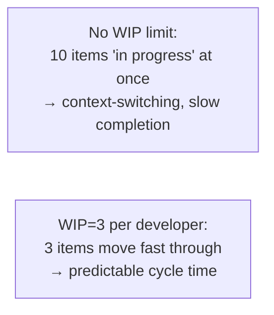

# Agile / Scrum / Kanban

The Agile Manifesto (2001) replaced waterfall's "plan everything up front" with iterative delivery — "respond to change over following a plan." **Scrum** and **Kanban** are the two dominant frameworks that operationalize Agile in software teams; Scrum from the 1990s (Ken Schwaber and Jeff Sutherland) is sprint-based with defined roles; Kanban (David Anderson, 2010 book) is continuous-flow with explicit WIP limits. Most modern teams run a hybrid ("Scrumban") that combines sprints for planning with Kanban for execution.

The depth bar here is **the operational reality** — not the certified-trainer framing — of what each ritual achieves, what fails in practice, and the patterns senior engineers apply when the textbook process doesn't fit. We cover **sprints, standups, retrospectives, planning, backlog grooming** as Scrum rituals; **WIP limits, cycle time, flow** as Kanban primitives; the **anti-patterns of "Scrum theater"** (process performed without value); and the cases where each fits versus doesn't.

## Where Agile, Scrum, And Kanban Came From — Toyota, Snowbird, And A 1986 Harvard Business Review Article

The three terms — Agile, Scrum, Kanban — have distinct origins spanning 50+ years. Agile is a 2001 American synthesis; Scrum descends from a 1986 Japanese paper; Kanban comes from 1940s Toyota factory floors. Understanding the separate origins matters because each carries forward specific assumptions that affect modern practice.

### Kanban's Origin — Taiichi Ohno And Toyota (1940s–1950s)

**Kanban** (看板, Japanese for "signboard" or "billboard") was developed at **Toyota Motor Company by Taiichi Ohno** in the late 1940s and 1950s. Ohno (1912–1990) was the industrial engineer who created the **Toyota Production System** (TPS), the foundational lean manufacturing methodology.

Toyota's problem in the late 1940s: post-war Japan had limited capital and demand was variable. The American mass-production model (assembling identical cars in large batches) didn't fit. Toyota needed a system that could **produce small batches efficiently and adapt to variable demand**.

Ohno's insights, developed over years of experimentation:

1. **Inventory is waste**: holding inventory ties up capital. Produce only what's needed, when it's needed (Just-In-Time).
2. **Pull, not push**: downstream stations request from upstream when they need parts. Upstream produces only in response to requests.
3. **Visualize work**: physical cards (kanban) signal what to produce and when.
4. **Limit work-in-progress**: a fixed number of cards in circulation limits batch size.
5. **Continuous improvement** (kaizen): incrementally reduce inventory, batch size, and waste.

Ohno's [*Toyota Production System: Beyond Large-Scale Production*](https://www.amazon.com/Toyota-Production-System-Beyond-Large-Scale/dp/0915299143) (1978, English 1988) is the canonical reference.

By the 1980s, Toyota's manufacturing efficiency was *world-class*. American automakers (GM, Ford) sent delegations to study TPS. **Lean manufacturing** as a global movement emerged in the 1990s, popularized by **James Womack and Daniel Jones's [*Lean Thinking*](https://www.amazon.com/Lean-Thinking-Corporation-Revised-Updated/dp/0743249275)** (1996).

The software application came later — **David J. Anderson's [*Kanban: Successful Evolutionary Change for Your Technology Business*](https://www.amazon.com/Kanban-Successful-Evolutionary-Technology-Business/dp/0984521402)** (2010) explicitly translated TPS kanban to software development. Anderson worked at Microsoft and Corbis applying lean principles before writing the book.

### Scrum's Origin — A 1986 Harvard Business Review Article

The most surprising origin in this story: **the term "Scrum" comes from a 1986 Harvard Business Review article about manufacturing, not software**. **Hirotaka Takeuchi and Ikujiro Nonaka** published [*The New New Product Development Game*](https://hbr.org/1986/01/the-new-new-product-development-game) in January 1986, studying how Japanese companies (Honda, Canon, Fuji-Xerox, NEC) developed new products faster than American competitors.

Takeuchi and Nonaka observed that the successful Japanese teams used a **"rugby" approach** — the team moved together, passing responsibility back and forth, instead of the American "relay race" approach where each phase was handed to the next. They borrowed the rugby term **"scrum"** to describe this team-as-a-unit dynamic.

The article had nothing to do with software. It was *management theory*, observing manufacturing teams. But it caught the attention of two software engineers:

- **Jeff Sutherland** (born 1941) had been a Vietnam War pilot and physician before becoming a software engineer.
- **Ken Schwaber** (born 1945) was a long-time software process consultant.

Sutherland and Schwaber were independently developing iterative software development practices in the late 1980s and early 1990s. They corresponded and collaborated; by 1995, they presented their methodology at **OOPSLA '95** in a paper titled [*SCRUM Development Process*](https://www.researchgate.net/publication/220967588_SCRUM_Development_Process), which adopted Takeuchi and Nonaka's term.

Scrum's specific elements (sprints, sprint planning, daily scrum, retrospectives, product owner, scrum master) were codified in the 1995 paper and refined over the next 5 years.

By 2001, Scrum was one of several "lightweight" software methodologies competing with the formal heavyweight processes (RUP, CMM, waterfall) of the 1990s.

### The Agile Manifesto — Snowbird, Utah, February 11–13, 2001

The **Agile Manifesto** is one of the most famous documents in software engineering. Seventeen engineers met at **Snowbird Ski Resort in Utah, February 11–13, 2001**, to discuss whether their various "lightweight" methodologies had enough common ground to constitute a movement.

The seventeen signatories:

- **Kent Beck** (Extreme Programming, XP)
- **Mike Beedle** (Scrum)
- **Arie van Bennekum**
- **Alistair Cockburn** (Crystal methods)
- **Ward Cunningham** (XP, wikis)
- **Martin Fowler** (Refactoring, PEAA)
- **James Grenning**
- **Jim Highsmith** (Adaptive Software Development)
- **Andrew Hunt** (Pragmatic Programmer)
- **Ron Jeffries** (XP)
- **Jon Kern**
- **Brian Marick**
- **Robert C. Martin** ("Uncle Bob", SOLID)
- **Steve Mellor**
- **Ken Schwaber** (Scrum)
- **Jeff Sutherland** (Scrum)
- **Dave Thomas** (Pragmatic Programmer)

Over three days, they hammered out the famous four-value statement:

> We are uncovering better ways of developing software by doing it and helping others do it. Through this work we have come to value:
> 
> - **Individuals and interactions** over processes and tools
> - **Working software** over comprehensive documentation
> - **Customer collaboration** over contract negotiation
> - **Responding to change** over following a plan
> 
> That is, while there is value in the items on the right, we value the items on the left more.

Plus **12 principles** that elaborated on the values.

The Manifesto was published at [agilemanifesto.org](https://agilemanifesto.org/) and is *still online unchanged 25 years later*. The signatories never met as a group again, but their work shaped the industry.

The senior insight: **Agile is a values statement, not a process specification**. Scrum, Kanban, XP are *implementations* of agile values, not "Agile" itself. Teams that "do Scrum" aren't necessarily Agile; teams that practice the four values can be Agile with any process.

### The 2001+ Industrial Adoption

The Manifesto's adoption was *gradual* — through the 2000s, "Agile" was associated with startups and progressive teams. By 2010, it was mainstream; by 2015, it was the *default* for new development; by 2020, Agile vocabulary was nearly universal.

But adoption produced **"Agile Theater"** — companies adopting the vocabulary without the values:

- "Scrum" without empowered teams.
- "Sprints" with rigid scope and unmovable deadlines.
- "Standups" used as status reports to managers.
- "Retrospectives" with no actual changes.

The pattern is documented extensively. **Martin Fowler's 2018 essay [*The State of Agile Software in 2018*](https://martinfowler.com/articles/agile-aus-2018.html)** described it: "Agile" had become a marketing term, often disconnected from the original values.

### Who Jeff Sutherland And Ken Schwaber Are

**Jeff Sutherland** has had one of the more colorful careers in software. He was a fighter pilot in Vietnam (75 combat missions), a physician, a Stanford Medical School professor, and finally a software engineer. He's the co-creator of Scrum and the author of *Scrum: The Art of Doing Twice the Work in Half the Time* (2014).

**Ken Schwaber** was a long-time consultant who'd seen many software methodologies before partnering with Sutherland. He founded the Scrum Alliance and later Scrum.org. He's the author of *Agile Software Development with Scrum* (2001) and *The Enterprise and Scrum* (2007).

The two have collaborated for 30+ years on Scrum but have had occasional disagreements about its direction. Their certifications (Scrum Alliance, Scrum.org) compete commercially while both promote the underlying methodology.

### Why The Lineage Matters

The Toyota → Takeuchi-Nonaka → Scrum lineage means **Scrum carries Japanese manufacturing assumptions**: small autonomous teams, continuous improvement, customer-pull, batch-size minimization. These work well in *some* software contexts and badly in others. Teams that don't fit (large coordination, deep regulatory requirements) struggle with Scrum because its assumptions don't fit.

The Agile Manifesto's *values* are more universal than any specific process. The senior judgment: adopt the values; choose the process that fits your context.

## Why Agile, Specifically: The Senior Engineer's Q&A

### Q1: Why did Agile replace waterfall?

Waterfall (sequential phases: requirements, design, implementation, testing, deployment) assumed requirements were known in advance and could be fully specified before implementation. In practice:

1. **Requirements changed during implementation**: customers learned what they wanted only by seeing partial systems.
2. **Estimates were systematically wrong**: software estimation is famously hard; waterfall plans assumed certainty that didn't exist.
3. **Integration revealed problems late**: phases that looked complete had hidden gaps.

Agile responded by **embracing change**: build incrementally, get feedback, adjust. The fundamental insight: software development is closer to *learning* than to *manufacturing*; the process should support discovery, not certainty.

### Q2: Why does Scrum work for some teams and not others?

Scrum's assumptions (small autonomous teams, customer-pull, sprint cadence) fit:

- **Small teams** (5–9 people).
- **Product development** with customer feedback.
- **Time-boxed work** that can be sliced into sprint-sized chunks.

Scrum doesn't fit:

- **Large teams** (Scrum's coordination doesn't scale; SAFe, LeSS try but with mixed success).
- **Specialized work** (security audit, hardware integration) where iterative feedback is hard.
- **Regulatory environments** that require specific documentation.

The senior judgment: pick the process for the work, not the work for the process.

### Q3: When is Kanban better than Scrum?

Kanban fits when work *flows continuously* rather than in time-boxed batches:

- **Support and operations teams**: work arrives continuously; batching into sprints is artificial.
- **Maintenance teams**: bug fixes don't align with sprint cadence.
- **Teams with variable work sizes**: some items take an hour, others a week. Sprint planning becomes guesswork.

Scrum fits when work *can be batched* into sprint-sized chunks. Most product development teams are between, using hybrid approaches (Scrumban).

### Q4: Why is "Agile theater" so common?

Three structural reasons:

1. **Vocabulary is easier than culture**: companies can adopt Scrum vocabulary in a week; the underlying culture takes years.
2. **Certifications drive adoption**: CSM (Certified Scrum Master) certifications create demand for vocabulary, not necessarily for values.
3. **Middle management resists empowered teams**: Agile's "self-organizing teams" threaten command-and-control management; many companies pretend to adopt Agile while preserving hierarchy.

The senior judgment: focus on outcomes (working software, customer feedback, sustainable pace), not on vocabulary compliance.

### Q5: How does Agile relate to DevOps?

DevOps (~2009+) is *Agile applied to operations*. Where Agile breaks down development silos, DevOps breaks down dev/ops silos. The values are aligned: small batches, continuous feedback, automation, customer focus.

Most modern teams practice both: Agile for development cadence; DevOps for deployment and operations. They reinforce each other.

## Common Misconceptions Explained

### "Agile means no documentation."

False. The Manifesto values *working software over comprehensive documentation* — not no documentation. Agile teams write documentation that serves the work; they don't waste effort on documentation that doesn't.

### "Scrum is the only Agile methodology."

False. Scrum is *one* implementation. XP, Kanban, Crystal, Lean Software Development, Feature-Driven Development are others. All can be Agile.

### "Agile is anti-planning."

False. The Manifesto values *responding to change over following a plan* — but plans are still useful. Agile teams plan; they just expect plans to change.

### "Scrum requires a Scrum Master and Product Owner."

True per the Scrum Guide, but **the roles can be filled in different ways**. Some teams have explicit Scrum Masters; others rotate the role; others have engineering managers playing it.

### "Kanban means no planning."

False. Kanban *visualizes* work and *limits* in-progress; it doesn't eliminate planning. Kanban teams plan continuously rather than in sprint batches.

### "Agile only works for small teams."

Half true. Pure Scrum works best for small teams (5–9). Scaled frameworks (SAFe, LeSS, Nexus) attempt to extend Agile to larger organizations with mixed results. Many large companies practice "Agile at the team level" with traditional management at higher levels.

## The Agile Manifesto

```
Individuals and interactions over processes and tools
Working software over comprehensive documentation
Customer collaboration over contract negotiation
Responding to change over following a plan
```

The "over" matters: the right side has value; the left side has *more* value. Process and documentation aren't bad; they're not *primary*. Many failed Agile adoptions invert this — they impose more process to "do Agile properly."

## Scrum — The Sprint Framework

Roles, events, artifacts.

### Roles

- **Product Owner**: owns the backlog; prioritizes; defines done.
- **Scrum Master**: facilitates; removes blockers; protects the team from interruptions.
- **Development Team**: 5–9 people; cross-functional; self-organizing.

### Events

- **Sprint** (1–4 weeks; commonly 2): a time-boxed iteration ending in shippable increment.
- **Sprint Planning** (start of sprint): pick stories from the backlog; commit.
- **Daily Standup** (15 min): yesterday, today, blockers.
- **Sprint Review** (end of sprint): demo what was built.
- **Retrospective** (end of sprint): what went well, what to change.

### Artifacts

- **Product Backlog**: prioritized list of all work.
- **Sprint Backlog**: subset committed for this sprint.
- **Increment**: shippable output of the sprint.

## Kanban — The Flow Framework

Less structure; explicit visualization and limits.

### Principles

- Visualize the flow (a board with columns: backlog, in progress, in review, done).
- Limit WIP (work in progress) per column.
- Manage flow (measure cycle time, throughput).
- Make policies explicit.
- Improve collaboratively (Kaizen).

### Why WIP Limits



Little's Law: average wait time = WIP / throughput. **Limit WIP and you reduce wait.**

### Cycle Time

The time from "started" to "done." Kanban teams optimize for low cycle time; Scrum teams optimize for sprint completion. Cycle time is more useful in stable-flow contexts (operations, support).

## When Each Fits

**Scrum** fits:
- Discrete features with clear scope.
- New teams that benefit from structure.
- Organizations that need predictability per sprint.

**Kanban** fits:
- Continuous flow (operations, support, platform teams).
- Mature teams comfortable without ceremony.
- Variable-size work that doesn't fit a sprint cadence.

**Scrumban** (hybrid) fits:
- Most product teams in practice: sprint cadence for planning + Kanban-style flow within the sprint.

## What Actually Works

### Standups

15-minute, walk-the-board, focus on blockers. The format "yesterday/today/blockers" is OK but easily becomes status theater. Better: walk the columns right-to-left (closest-to-done first), discuss flow, surface blockers.

**Anti-pattern**: 30-minute standups with every engineer narrating their day.

### Retrospectives

Every 2 weeks. Surface what's broken; commit to 1–2 changes. Many formats (Mad/Sad/Glad, Start/Stop/Continue).

**Anti-pattern**: retros that produce action items nobody owns.

### Sprint Planning

Pick stories that fit the team's capacity (based on past velocity). Commit. The team's *commitment* — not the manager's wish — is what they'll deliver.

**Anti-pattern**: managers piling work into the sprint regardless of capacity.

### Backlog Grooming

Mid-sprint, refine upcoming stories. Add detail. Estimate. Re-prioritize.

**Anti-pattern**: backlog ignored until next planning; planning takes 4 hours because nothing was ready.

## "Scrum Theater" — When Process Performs Without Value

Symptoms:
- Standups are status reports to the manager.
- Retros surface the same issues every sprint with no change.
- Velocity is a target instead of a measurement.
- Sprint commitments are aspirational; chronically missed.
- "Agile coaches" enforce ceremony.

**Fix**: read the Manifesto. Cut ceremonies that don't deliver. Trust the team.

## Velocity, Throughput, And The "Velocity As Target" Trap

Velocity (points per sprint) is a *measurement* of the team's recent throughput, useful for planning. It becomes broken when:

- Managers set velocity as a *target* — teams inflate point estimates to "hit" it.
- Compared across teams (impossible — points are subjective).
- Used in performance reviews.

**The senior practice**: velocity is for the team's planning, not for management dashboards.

## Tools

- **Jira**: industry standard; heavy.
- **Linear**: modern, fast, opinionated.
- **GitHub Projects**: lightweight; integrates with code.
- **ClickUp / Asana**: cross-functional.
- **Whiteboard / Miro**: explicit visualization for co-located or hybrid teams.

The tool matters less than the discipline. A team running Kanban well on a physical whiteboard outperforms a team running Jira badly.

## Anti-Patterns

### Scrum-But

"We do Scrum, but no retrospectives." "We do Scrum, but our sprints are 6 weeks." "We do Scrum, but the PO isn't engaged." Each "but" reduces the value.

### Sprint Goal Drift

The sprint is committed; mid-sprint, urgent requests bypass the backlog; the original commitment isn't met. **Fix**: protect the sprint; urgent work goes to next sprint unless truly critical.

### The Manager-As-Scrum-Master

The Scrum Master's role is to *serve* the team; the manager's role is to *manage* it. Combining them subtly compromises the team's safety (the SM should be safe to surface bad news).

### Estimation Used For Evaluation

Stories are estimated for planning; managers use the estimates to evaluate individual productivity. Teams stop being honest about complexity.

### Ceremony Without Practice

Standups, retros, planning all happen; nothing improves. Going through motions without internalizing the purpose.

## Trade-Off Summary

| Practice | Best for |
|----------|---------|
| Scrum sprints | Feature work with planning cadence |
| Kanban flow | Support, ops, platform |
| Daily standup | Coordination, blocker surfacing |
| Retrospective | Continuous improvement |
| WIP limit | Reducing context-switching |
| Velocity tracking | Team planning |

> [!INTERVIEW]
> A common L5 prompt: "How does your team work?" Strong answers (a) describe specifics (sprint length, team size, ritual cadence), (b) acknowledge what doesn't work (e.g., "our retros have become check-the-box"), (c) name modifications the team has made, (d) discuss outcomes (cycle time, predictability, satisfaction).

## Practice

1. **Audit ceremonies.** Track your team's ceremonies for 2 weeks. For each, identify the value delivered. Cut the lowest-value one.
2. **WIP limit experiment.** Set WIP limit = 1 per engineer for one sprint. Measure cycle time vs the previous sprint.
3. **Improvement retro.** In your next retro, propose 1 specific change. Track whether it lands.
4. **Velocity analysis.** Plot your team's velocity over 6 sprints. Identify variance. Is the team's planning realistic?
5. **The Manifesto re-read.** Read the original Agile Manifesto and the 12 principles. Map your team's practice against each.
6. **Cycle-time measurement.** Add cycle-time tracking to your tool. Identify the bottleneck stage.
7. **Sprint goal discipline.** For one sprint, articulate a single goal; refuse off-goal work. Measure outcome.
8. **The Scrum-but check.** List all the "buts" your team has applied to Scrum. Decide which to fix and which to keep.
9. **Tool simplification.** If your Jira has 50 custom fields, identify the 10 actually used. Remove the rest.
10. **The skeptic conversation.** A senior engineer says "we don't need Scrum, we just code." Write a 200-word response on why some structure pays.

## Recap

You should now be able to:

- Apply the **Agile Manifesto** as a check on whether process serves outcomes.
- Run **Scrum** with sprints, planning, daily standup, review, retrospective.
- Run **Kanban** with WIP limits, cycle-time tracking, continuous flow.
- Choose **Scrum vs Kanban vs Scrumban** by team type and work stability.
- Recognize and refuse **anti-patterns**: Scrum theater, velocity-as-target, manager-as-Scrum-Master, ceremony without practice.
- Use **velocity for planning, not evaluation**.
- Modify process based on **measured outcome**, not orthodoxy.

## Next

Continue to [Mentoring & Growing Engineers](./T06-mentoring-and-growing-engineers.md) — the multiplier effect of growing the engineers around you.
