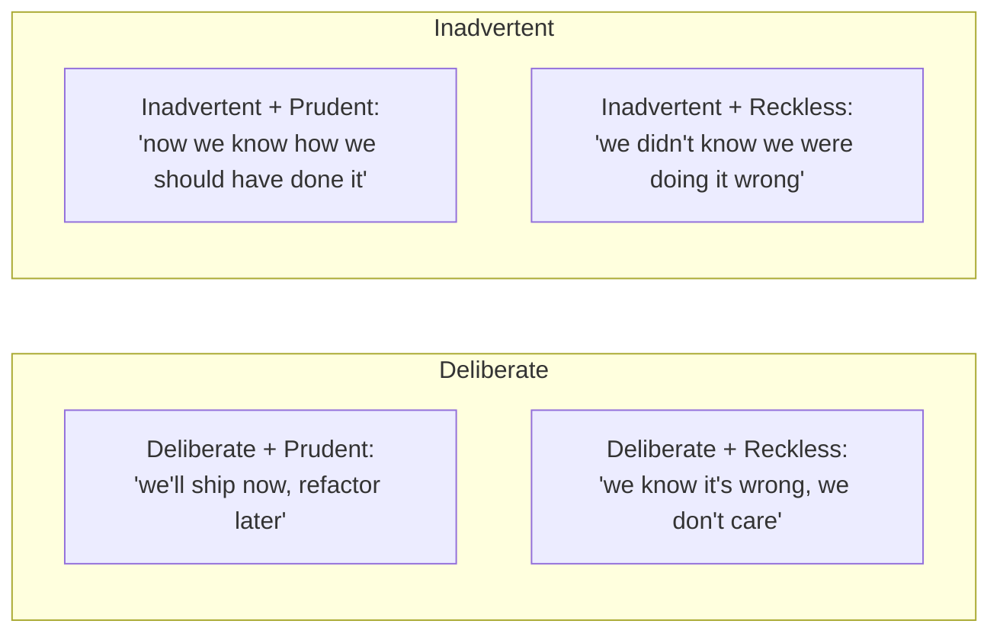

# Tech-Debt Management

Ward Cunningham coined "technical debt" in 1992 as a financial metaphor: shortcuts in code accrue interest in the form of slower future development, more bugs, harder onboarding. **Some debt is fine** — taking a shortcut to ship a deadline is deliberate, like taking a loan; some debt is **reckless** — sloppy code with no plan to fix, like running up a credit card you can't pay off. Managing tech debt is **the senior engineer's investment-portfolio problem**: which debts to take, which to pay down first, when the interest is killing the team.

The depth bar here is **the strategy** (not "we should write better code"). We cover Martin Fowler's tech-debt quadrants (deliberate/inadvertent × prudent/reckless), the metrics that surface debt (cycle time, defect rate, onboarding time, "WTF" rate in code review), the **dedicated allocation pattern** (e.g., 20% of capacity to debt; 1 sprint per quarter for paydown), the **rewrite trap** (Joel Spolsky 2000 — see [T11 of C01](../C01-software-architecture/T11-strangler-fig-and-migration-patterns.md)). We name the failure modes: the team that *only* does features (debt builds, eventually paralyzes); the team that *only* refactors (no business value shipped); the architect's pet rewrite that drains a year of velocity.

## Where Technical Debt Came From — Ward Cunningham's 1992 Metaphor

The concept of "technical debt" was coined by **Ward Cunningham** in 1992 — not in an academic paper, but in a brief experience report at the OOPSLA conference. The metaphor was so apt that it became one of the most-cited concepts in software engineering, despite originating in a few minutes of conference discussion.

### Who Ward Cunningham Is

**Ward Cunningham** (born 1949) is one of the foundational figures of software engineering. His career includes:

- **Inventing the wiki** (1995, WikiWikiWeb): the first wiki software, the model for Wikipedia.
- **Co-inventing Extreme Programming** (1996, with Kent Beck): foundational Agile methodology.
- **Pattern movement contribution** (with Beck): the original CRC cards technique.
- **Signing the Agile Manifesto** (2001): one of the 17 original signatories.

Cunningham's career has been a series of *influential brief contributions*. The wiki, CRC cards, and "technical debt" all emerged from his ability to *name* ideas that engineers had been struggling with.

### The 1992 OOPSLA Experience Report

The original technical debt comment came in **Cunningham's 1992 OOPSLA experience report** [*The WyCash Portfolio Management System*](http://c2.com/doc/oopsla92.html). Cunningham was describing a financial system he'd built at WyCash. The relevant passage:

> "Shipping first time code is like going into debt. A little debt speeds development so long as it is paid back promptly with a rewrite. Objects make the cost of this transaction tolerable. The danger occurs when the debt is not repaid. Every minute spent on not-quite-right code counts as interest on that debt."

The metaphor was *immediately understood* by engineers. The financial analogy mapped perfectly:

- **Principal**: the not-quite-right code.
- **Interest**: ongoing cost of working with that code.
- **Compound interest**: the cost grows as more code builds on the debt.
- **Repayment**: refactoring eliminates the principal.

Cunningham later clarified (in a 2009 video) that his original intent was *narrower* than how the term came to be used. He meant *intentional, well-understood* code shortcuts. The industry expanded "technical debt" to include all kinds of code quality problems, which Cunningham noted dilutes the metaphor.

### Martin Fowler's 2009 Quadrants

The most influential refinement was **Martin Fowler's [Technical Debt Quadrant](https://martinfowler.com/bliki/TechnicalDebtQuadrant.html)** (October 2009). Fowler addressed Cunningham's concern by distinguishing:

- **Reckless vs Prudent**: did we make a *deliberate* choice or a *careless* mistake?
- **Deliberate vs Inadvertent**: was the debt *known* at the time or *discovered* later?

The four quadrants:

1. **Reckless + Deliberate**: "We don't have time for design." Bad debt.
2. **Reckless + Inadvertent**: "What's layering?" Worst debt — you don't know what you don't know.
3. **Prudent + Deliberate**: "We must ship now, will deal with consequences." Acceptable debt with explicit acknowledgment.
4. **Prudent + Inadvertent**: "Now we know how we should have done it." Discovery debt — unavoidable.

Fowler's quadrants gave teams *vocabulary* for discussing debt without judgment. "Prudent deliberate" is acceptable; "reckless inadvertent" is dangerous. The distinctions matter.

### The 2010s — Tech Debt As Operational Concern

Through the 2010s, technical debt evolved from a *coding concept* to an *operational concern*. Major developments:

- **SonarQube** (2007): automated tool for measuring code quality and tech debt.
- **NDepend** (2007): .NET-specific debt measurement.
- **CodeScene** (2015+): debt visualization through commit-history analysis.
- **DORA metrics** (2016+): DevOps Research and Assessment — quantitative measures of engineering health.

Tech debt became *measurable* in ways it hadn't been before. Teams could track debt accumulation over time, identify hotspots, and prioritize paydown.

### Why The Metaphor Endures

The technical debt metaphor works because:

1. **Universal experience**: every engineer has experienced it.
2. **Clear financial analogy**: easy to communicate to non-engineers.
3. **Actionable**: implies specific decisions (take debt, pay back, ignore).
4. **Captures nuance**: prudent vs reckless, deliberate vs inadvertent.

The metaphor is *flawed* in some ways (real debt has interest rates; tech debt doesn't), but the strengths outweigh the limitations.

## Why Tech Debt Matters, Specifically: The Senior Engineer's Q&A

### Q1: Why does tech debt accumulate?

Three structural reasons:

1. **Deadline pressure**: shipping requires shortcuts.
2. **Imperfect knowledge**: we don't know the right design until we've worked with it.
3. **Changing requirements**: code optimized for one purpose isn't optimal for new purposes.

The fundamental issue: software requires *time* to design well, and time is always constrained. Some debt is unavoidable; the question is how to manage it.

### Q2: How do I measure tech debt?

Multiple metrics:

1. **Cycle time**: how long from PR to merge? Long cycle times indicate friction.
2. **Defect rate**: how many bugs per change? Many bugs indicate quality problems.
3. **Onboarding time**: how long for new engineers to be productive? Long times indicate complexity.
4. **Test coverage**: how much code is tested? Low coverage indicates quality risk.
5. **Code smell counts**: SonarQube and similar tools detect anti-patterns.

No single metric captures debt; combinations are more informative.

### Q3: What's the right percentage of capacity to spend on debt?

Industry consensus: **15-25%**. Less and debt accumulates faster than it's paid; more and feature work slows excessively.

The specific number depends on:

- **Current debt level**: high debt requires more paydown.
- **Team maturity**: experienced teams need less paydown.
- **System age**: older systems require more maintenance.

The senior practice: allocate explicitly, track outcomes, adjust based on results.

### Q4: How do I prioritize which debt to pay first?

Three criteria:

1. **Interest rate**: how much daily cost does this debt impose?
2. **Frequency of access**: code touched daily costs more than code touched yearly.
3. **Risk**: debt blocking critical features deserves priority.

The senior judgment: pay high-interest, high-frequency, high-risk debt first.

### Q5: When is a rewrite the right answer?

Almost never. Per Joel Spolsky's 2000 essay [Things You Should Never Do, Part I](https://www.joelonsoftware.com/2000/04/06/things-you-should-never-do-part-i/) and the strangler fig pattern (see [T11 of C01](../C01-software-architecture/T11-strangler-fig-and-migration-patterns.md)):

- Rewrites discard *encoded knowledge* (bug fixes, edge cases).
- Rewrites take longer than expected.
- Rewrites ship later than parallel evolutionary improvement would.

Strangler fig migration is the right answer in 95% of cases.

## Common Misconceptions Explained

### "Tech debt is just bad code."

False per Cunningham's original definition. **Tech debt is well-known shortcuts taken deliberately**. Bad code is bad code; that's a different problem.

### "We can pay off all tech debt."

False. Software systems *always* have debt; the question is how much. Targeting zero debt produces analysis paralysis.

### "More paydown is always better."

False. Excessive paydown produces no business value. The right level balances debt and features.

### "Refactoring is the only solution."

False. Refactoring is one tool; rewrites (rarely), strangler fig migration, and architectural changes are others.

### "If we just write better code, we won't have debt."

False. Even excellent code accumulates debt as requirements change. Debt isn't a quality issue; it's a *time* issue.

### "Tech debt only affects engineers."

False. Tech debt manifests as feature delays, outages, and security incidents — all visible to stakeholders.

## The Quadrants — Martin Fowler

- **Prudent** debt: documented, accepted, with a plan.
- **Reckless** debt: undocumented, accidental, accumulating.
- **Deliberate**: chosen consciously.
- **Inadvertent**: discovered after the fact.

Senior engineers create **deliberate prudent** debt and convert **inadvertent reckless** debt into prudent through documentation.

## Detecting Debt

Symptoms (each measurable):

- **Cycle time grows**: PRs that used to ship in 2 days now take 5.
- **Defect rate rises**: more incidents per release.
- **Onboarding takes longer**: new engineers take 3 months to ship, not 3 weeks.
- **"WTF" rate in code review**: comments like "why is it like this?" multiply.
- **Team morale drops**: "I hate working on this codebase."
- **Estimates explode**: simple features take 3× the estimate.

If two or three of these are present, the team has accumulated debt that needs attention.

## Allocation Models

### 20% Rule

20% of each sprint's capacity goes to tech debt. The team picks the debts.

Pros: continuous; small chunks; team chooses.
Cons: easily de-prioritized under deadline pressure.

### Paydown Sprints

One full sprint per quarter dedicated to debt. No features.

Pros: focused; visible; significant progress per sprint.
Cons: tempting to skip when delivery is "more important."

### Boy-Scout Rule (Bob Martin)

"Leave the campsite cleaner than you found it." Every feature touches some debt; pay it down opportunistically.

Pros: ambient, low-overhead.
Cons: only addresses debt near current work; deep debt persists.

### The Combination

Most mature teams: 10–20% routine + one dedicated sprint per quarter + boy-scout rule.

## Prioritizing Debt

Not all debt is equal. Prioritize by **interest rate × frequency of touch**:

- High-touch + high-interest = pay first (the file everyone edits where every PR has 5 nits).
- Low-touch + high-interest = pay if you'll touch it (dormant module's bad code isn't hurting anyone).
- High-touch + low-interest = nice to have.
- Low-touch + low-interest = ignore.

The "interest rate" is what it costs *each engineer each time* they encounter the debt.

## The Rewrite Trap

The temptation: "this is all bad; let's rewrite." The history: rewrites almost always fail (Netscape 1998, see [T11 of C01](../C01-software-architecture/T11-strangler-fig-and-migration-patterns.md)).

The senior practice: **incremental modernization via strangler fig**. Pick a seam; replace it with the new pattern; live with both during transition; remove the old when the new owns the traffic.

## Communicating Debt To Non-Engineers

Stakeholders don't see debt; they see slow delivery. The senior communication:

- **Concrete cost**: "our last 3 features ran 2× the estimate; here's the specific debt that caused each."
- **Specific paydown**: "this 2-week investment would reduce our future cost by ~30%."
- **Business framing**: "every feature we ship in this area is 50% more expensive than the same feature elsewhere."

Vague "we have tech debt" without data is ignored; specific cases with numbers move budgets.

## Failure Modes

### The Endless Backlog

"We have 200 debt items." Nobody triages; the list is meaningless. Fix: top 10; everything else closes after 6 months.

### The Architect's Pet Rewrite

A senior engineer's vision becomes the team's drain. No incremental shipping; no business value. Fix: strangler fig with shipping milestones every 2 weeks.

### The "No Debt" Team

The team *only* does features. Debt builds. In year 3, velocity has halved. Fix: enforce allocation discipline.

### The "All Refactor" Team

The team is always cleaning up. Nothing ships. Fix: business value goals on every sprint.

### Debt-As-Excuse

"We can't deliver because of debt." Sometimes true; often a lazy excuse for not engineering well within constraints. Fix: separate "this debt is blocking feature X" (legitimate) from "the codebase is hard" (always true).

## Tooling

- **SonarQube / CodeClimate**: scan for code smells, complexity, duplication.
- **ArchUnit**: enforce architectural rules; failing tests = uncovered debt.
- **Cycle-time dashboards**: visualize trends.
- **Tech-debt issue label**: dedicated label in the issue tracker.

The tools surface; the team decides.

## Trade-Off Summary

| Strategy | Best for |
|----------|---------|
| 20% rule | Mature team, ambient cleanup |
| Paydown sprint | Backlog of specific known debts |
| Boy-scout rule | Constant low-grade improvement |
| Strangler-fig modernization | Replacing whole subsystems |
| Big-bang rewrite | Almost never; specific narrow cases |

> [!INTERVIEW]
> A common L5 prompt: "How do you manage tech debt?" Strong answers (a) cite Fowler's quadrants, (b) describe specific allocation discipline, (c) describe how they communicate debt to non-engineers with data, (d) refuse the big rewrite.

## Practice

1. **Audit your debt.** List 10 debts in your codebase. Categorize using Fowler's quadrants.
2. **Quantify one debt.** Pick one; quantify the interest (e.g., "this adds 30 min to every PR in this area" × 50 PRs/quarter = 25 hrs/quarter).
3. **Allocation experiment.** For one quarter, enforce 20% allocation. Measure cycle time at start and end.
4. **Strangler-fig identification.** Find a subsystem worth strangler-fig replacing. Sketch the seam, the first slice, the rollout plan.
5. **Convert inadvertent to prudent.** Take a debt that's accidental. Document it; add an ADR; create a paydown plan.
6. **Stakeholder communication.** Write a 1-page memo to a product manager explaining a specific debt's cost in business terms.
7. **The endless-backlog cleanup.** Triage your tech-debt backlog. Close 50% as "won't fix"; promote the rest to specific PRs.
8. **Cycle-time tracking.** Add cycle-time measurement to your team's metrics. Identify trends.
9. **Refuse a rewrite.** Find a team member advocating for a big rewrite. Propose the strangler-fig alternative.
10. **The skeptic conversation.** A product manager says "we don't have time for tech debt." Write a 200-word response on the compounding cost.

## Recap

You should now be able to:

- Apply **Fowler's quadrants** (deliberate/inadvertent × prudent/reckless) to classify debt.
- **Detect debt** via cycle time, defect rate, onboarding time, code-review "WTFs", morale.
- Choose **allocation strategies**: 20% rule, paydown sprints, boy-scout rule, or combinations.
- Prioritize by **interest rate × frequency-of-touch**.
- Refuse the **rewrite trap**; reach for **strangler-fig modernization** instead.
- Communicate debt to non-engineers with **concrete numbers and business framing**.
- Recognize **failure modes**: endless backlog, architect's pet rewrite, no-debt team, all-refactor team, debt-as-excuse.

## Next

Continue to [Technical Strategy & Roadmaps](./T08-technical-strategy-and-roadmaps.md) — articulating multi-quarter direction that aligns engineering with the business.
