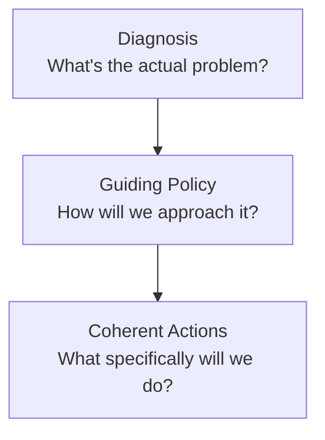
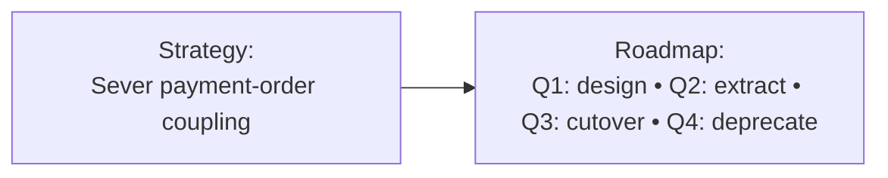

# Technical Strategy & Roadmaps

A **technical strategy** is the senior engineer's answer to the question: *given our constraints and the next 12–24 months, where should we invest engineering effort?* It's *not* a list of features; it's an *opinionated direction* that says what the team will do, what it won't, and why. Richard Rumelt's 2011 *Good Strategy / Bad Strategy* defines the structure — **diagnosis** (what's the problem?) + **guiding policy** (the principle for how we'll act) + **coherent actions** (the specific things we'll do). Most "strategies" miss one or more, becoming feature lists, slogans, or aspirations. **A real strategy commits and excludes.**

The depth bar here is **how to write a strategy that aligns a team for a year**, the difference between strategy and roadmap (strategy says "why"; roadmap says "what" and "when"), and the **failure modes** — strategies that are wish-lists, strategies that change every quarter, strategies that no engineer actually reads.

## Where Strategy Thinking Came From — From Sun Tzu To Porter To Rumelt

Strategy as a discipline is older than software, older than computers, older than industrialization. The vocabulary you use to write technical strategy today — diagnosis, guiding policy, competitive advantage, distinctive competence — emerged from **30+ centuries of military and business thinking**. The most influential modern synthesis is **Richard Rumelt's 2011 book**, but the underlying ideas trace back through Michael Porter (1979–80), Alfred Chandler (1962), Carl von Clausewitz (1832), and ultimately Sun Tzu (5th century BCE).

### The Ancient Origins — Sun Tzu And The Art Of War (5th Century BCE)

The oldest strategy treatise is **Sun Tzu's [*The Art of War*](https://classics.mit.edu/Tzu/artwar.html)** (孫子兵法, ~500 BCE). Sun Tzu was a Chinese military strategist; his treatise codified strategic thinking that had been developed over generations of Chinese warfare.

Sun Tzu's core insights, still cited today:

1. **Know your enemy and know yourself** (謀攻篇): strategy starts with accurate assessment.
2. **Win without fighting**: the best victories don't require battle.
3. **Strategy is positional**: choose where and when to engage.
4. **All warfare is based on deception**: appearances differ from reality.

The Art of War remained influential through 2,500 years. Translations to European languages began in the 19th century; the book is now standard reading in military academies and business schools.

The strategic vocabulary — strengths, weaknesses, terrain, position, distinction — descends from Sun Tzu's framework.

### Carl von Clausewitz And On War (1832)

The European strategic tradition reached its modern form with **Carl von Clausewitz's [*On War*](https://en.wikipedia.org/wiki/On_War)** (1832, posthumous). Clausewitz was a Prussian general who fought against Napoleon; his book synthesized lessons from the Napoleonic Wars.

Clausewitz's central contributions:

1. **War is a continuation of politics by other means**: strategy serves political ends.
2. **The fog of war**: incomplete information is permanent.
3. **Friction**: the gap between plan and execution is always larger than expected.
4. **The culminating point**: every offensive has limits; pushing past them is disaster.

On War influenced military thinking for 150+ years. Its translation to business strategy is direct: business is competition; strategy serves business goals; execution is harder than planning.

### Alfred Chandler And Strategy And Structure (1962)

The first major *business* strategy text was **Alfred Chandler's [*Strategy and Structure: Chapters in the History of the Industrial Enterprise*](https://www.amazon.com/Strategy-Structure-Chapters-Industrial-Enterprise/dp/0262530090)** (MIT Press, 1962). Chandler was a Harvard Business School professor who studied the development of large American corporations (GM, DuPont, Standard Oil, Sears Roebuck).

Chandler's central thesis: **structure follows strategy**. The form of an organization should follow from its strategic goals. Diversified corporations needed divisional structures; focused corporations needed functional structures. Pre-Chandler, organizational design was *ad hoc*; post-Chandler, it was strategic.

Chandler also introduced the concept of **strategy as choice** — strategy is what you *choose* not to do as much as what you choose to do.

### Michael Porter And Competitive Strategy (1980)

The most influential business strategist is arguably **Michael Porter**, whose 1980 book [*Competitive Strategy*](https://www.amazon.com/Competitive-Strategy-Techniques-Industries-Competitors/dp/0684841487) introduced:

1. **Five Forces Framework**: industry competition, threat of new entrants, threat of substitutes, supplier power, buyer power.
2. **Generic Strategies**: cost leadership, differentiation, focus.
3. **Value Chain Analysis**: how activities create value.

Porter (born 1947) is a Harvard Business School professor. His work formalized business strategy as an *analytical* discipline rather than an art. The Five Forces framework remains the most-cited strategy framework in business education.

Porter's 1996 *Harvard Business Review* essay [*What Is Strategy?*](https://hbr.org/1996/11/what-is-strategy) sharpened the distinction between **strategy** (a *position* in the market) and **operational effectiveness** (doing the same things better). Companies competing on operational effectiveness alone, Porter argued, were not strategic — they would be matched by competitors.

This distinction matters for technical strategy: improving development velocity, deploying faster, fixing more bugs — all *operational effectiveness*, not strategy. Technical strategy is about *choices* that differentiate, not just doing the same things better.

### The Failure Of "Strategy" In The 1990s–2000s

Through the 1990s and 2000s, "strategy" became a *bloated* corporate function. Consulting firms (McKinsey, BCG, Bain) sold *strategic plans* that ran hundreds of pages. The plans typically failed to produce results because:

1. **They confused strategy with planning**: lots of action items, no actual choices.
2. **They confused goals with strategy**: "achieve market leadership" is a goal, not a strategy.
3. **They lacked focus**: pursuing multiple priorities is not strategy.
4. **They were vague**: "leverage core competencies" sounds strategic but says nothing.

By 2010, "strategy" was a corporate joke. Engineering teams treated strategy documents as theater.

### Richard Rumelt's Good Strategy / Bad Strategy (2011)

The book that *recovered* strategic thinking is **Richard Rumelt's [*Good Strategy / Bad Strategy: The Difference and Why It Matters*](https://www.amazon.com/Good-Strategy-Bad-Difference-Matters/dp/0307886239)** (Crown Business, 2011). Rumelt (born 1942) is a UCLA Anderson School of Management professor and one of the most respected strategy academics.

Rumelt's argument: **most "strategy" documents are bad strategy** — they confuse goals with strategy, lack focus, fail to identify the actual challenge. Good strategy has three elements (the "kernel"):

1. **Diagnosis**: a clear understanding of the situation and the central challenge.
2. **Guiding Policy**: an approach to addressing the challenge.
3. **Coherent Action**: actions consistent with the policy.

Rumelt's specific contribution: **making strategic thinking accessible**. The book is full of concrete examples (Apple's resurgence, the 2008 financial crisis, Walmart's competitive position) showing what good and bad strategy look like.

By 2020, *Good Strategy / Bad Strategy* was on virtually every senior-engineering reading list. It's the canonical reference for what makes a strategy *actually strategic*.

### Who Richard Rumelt Is

**Richard Rumelt** has had a fascinating career. He was a Caltech engineer, then a Harvard MBA, then an INSEAD professor, before settling at UCLA Anderson. His prior books include *Strategy, Structure, and Economic Performance* (1974) — a Chandler-influenced analysis of corporate strategy.

Rumelt's 2011 book was, in his own description, a synthesis of 50 years of strategy research expressed in accessible prose. The book's success surprised him — academic strategy books rarely become mainstream — but the timing was right. The 2008 financial crisis had made strategic thinking newly urgent; Rumelt's clear framework fit the moment.

### Will Larson And Technical Strategy For Engineering (2017+)

The application of strategic thinking *specifically to engineering teams* was pioneered by **Will Larson** in essays and books since 2017. Larson is an engineering manager (Stripe, Calm, Uber, formerly Digg) who's published widely on technical leadership.

Larson's books *An Elegant Puzzle* (2019) and *Staff Engineer* (2021) include strategy chapters that explicitly apply Rumelt to engineering contexts. His framework:

- **Diagnose**: what's the technical situation?
- **Strategy**: what approach addresses it?
- **Tactics**: specific actions.

The Larson contribution: showing that strategic thinking matters *at the team level*, not just the company level. A staff engineer's technical strategy for their team is as important as a CEO's strategy for the company.

## Why Strategy Matters, Specifically: The Senior Engineer's Q&A

### Q1: Why is strategy so hard to write?

Three structural reasons:

1. **Strategy requires choice**, and choices are uncomfortable. Saying "we won't do X" is harder than saying "we'll do everything."
2. **Strategy requires honest diagnosis**, which can surface uncomfortable truths (the team has skill gaps, the architecture is wrong, the market is unfavorable).
3. **Strategy requires focus**, but every stakeholder wants their priority addressed.

Most "strategies" avoid these difficulties by being vague — generic goals, multiple priorities, no explicit choices. This is *bad strategy* per Rumelt: it appears strategic without actually being so.

### Q2: What's the difference between strategy and roadmap?

**Strategy** is about *why* and *how*: diagnosis of the situation, approach to addressing it, principles for choice.

**Roadmap** is about *what* and *when*: specific deliverables, milestones, dates.

Strategy persists across multiple roadmaps. A single strategy might inform 4–6 quarters of roadmaps. Most teams confuse the two, writing roadmaps and calling them strategies.

### Q3: How long should a strategy document be?

Per Rumelt, a *real* strategy can be expressed in 1–3 pages. The three elements (diagnosis, guiding policy, coherent action) don't require more space.

Longer "strategy" documents are usually:

- **Planning documents** (action items, timelines).
- **Aspirational statements** (vague goals).
- **Communication artifacts** (justifying decisions to stakeholders).

These have value but aren't strategy itself.

### Q4: When should strategy change?

Three triggers:

1. **The diagnosis is wrong**: new information reveals the situation differs from what you thought.
2. **The strategy didn't work**: actions taken produced unexpected outcomes.
3. **The environment changed**: external conditions shifted significantly.

Strategy that changes *every quarter* isn't strategy — it's reaction. Strategy that *never* changes is dogma. The right cadence depends on the rate of environmental change.

### Q5: How does technical strategy differ from business strategy?

Less than you'd think. Both require:

- Diagnosis of the situation.
- Clear choices about approach.
- Coherent actions.

The differences:

- **Technical strategy** is *about* engineering: architecture choices, technology choices, team structure.
- **Business strategy** is *about* the business: markets, products, competitive position.

Good technical strategy is *informed by* business strategy. The team's architecture choices should serve the business's goals; misalignment is strategic failure.

## Common Misconceptions Explained

### "Strategy is the same as vision."

False. **Vision** is the desired future state. **Strategy** is the approach to get there. Many "strategies" are vague visions without specific approaches.

### "Strategy means having a 5-year plan."

False per Rumelt. Strategy is about diagnosis and guiding policy, not extended planning. A 5-year plan with specific milestones is usually fiction in fast-changing contexts.

### "All strategic decisions should be made by senior management."

False. Per the *Inverse Conway Maneuver* and Larson's work, technical strategy operates at every level. Team leads make team strategy; staff engineers make domain strategy; CTOs make company-wide strategy.

### "Strategy is what you do when you have time."

False. Strategy is *what guides what you do*. Teams without strategy waste effort on misaligned work; teams with strategy spend the same effort more effectively.

### "Strategies should accommodate everyone's priorities."

False. **Strategy requires choice**, which means saying no to some priorities. A strategy that includes everyone's pet project isn't strategy.

### "Bad strategy is better than no strategy."

False per Rumelt. Bad strategy actively misdirects effort and provides false confidence. No strategy at least leaves room for ad-hoc good decisions.

## Rumelt's Triangle



**Diagnosis**: a specific, falsifiable claim about why things are the way they are. Not "we have tech debt" — but "the order service's coupling to the payment service means every payment change risks an order outage."

**Guiding Policy**: an overall approach that addresses the diagnosis. Not "be more careful" — but "extract payment processing into a separate service with an event-driven interface; sever the synchronous coupling within 6 months."

**Coherent Actions**: the actual work, sequenced. Not "improve our codebase" — but "Q1: design + Order Service feature freeze; Q2: extract payment processor; Q3: cut over; Q4: deprecate the synchronous path."

## What Bad Strategy Looks Like

Common patterns Rumelt names:

- **Fluff**: "leverage best-in-class technologies to deliver world-class outcomes." Says nothing.
- **Failure to face the problem**: pretends the obstacle isn't there.
- **Mistaking goals for strategy**: "we'll be the leader in X" — that's an aspiration.
- **Bad strategic objectives**: a long list of unprioritized items.

A senior engineer reads a draft strategy and applies this filter. If it survives, it's worth circulating.

## Strategy Vs Roadmap

Often conflated:

- **Strategy**: the *why* and *how* (diagnosis, policy, principles).
- **Roadmap**: the *what* and *when* (specific deliverables on a timeline).



Strategy survives 12+ months. Roadmap shifts quarterly as reality unfolds.

## The Quarterly Roadmap

A practical roadmap:

```markdown
## Q3 2026 — Order Service Roadmap

### Strategy Connection
This quarter advances the "sever payment-order coupling" strategy by extracting payment processing.

### Themes
- **Extract**: complete the new PaymentProcessor service.
- **Migrate**: 50% of payment traffic via the new path.
- **Stabilize**: SRE-led on-call rotation begins.

### Specific Deliverables
- Week 1–2: PaymentProcessor MVP shipped to staging.
- Week 3–5: Shadow traffic in production; comparison runs.
- Week 6–8: Canary 5% real traffic; ramp to 50%.
- Week 9–12: Stabilization; on-call onboarding.

### Stretch Goals
- 75% traffic if the canary stays clean.

### What We're NOT Doing
- Refund processing (Q4).
- Multi-currency (Q1 2027).
```

The "What We're NOT Doing" is the most-skipped section. Strategy without exclusions accepts everything.

## The North Star

The senior engineer's role: articulate the **north star** — the long-term outcome the work serves. "By 2028, the order system handles 100× current volume with 99.99% availability and same team size."

The roadmap is the path; the north star is the destination. Every quarter's work should advance toward it.

## OKRs (Objectives And Key Results)

The Google-popularized framework:

- **Objective**: qualitative, inspiring ("become the most reliable order system in the industry").
- **Key Results**: 3–5 specific, measurable outcomes that, if achieved, prove the objective ("99.95% → 99.99% availability"; "p99 latency 200 ms → 100 ms"; "0 incidents above sev-2").

For technical teams, OKRs work *if* used as outcome metrics and not as task lists.

## Strategy In Conversation

The senior practice: when stakeholders propose work, ask "does this advance the strategy?" If yes, prioritize. If no, decline politely (or update the strategy if the new work is more important).

Without explicit strategy, every request is equally weighted. With strategy, the team has a defensible "no."

## Writing The Strategy

A typical document:

```markdown
# Order Service Strategy 2026–2027

## Diagnosis
- Order service is tightly coupled to payment service via synchronous HTTP calls.
- 80% of order-flow incidents trace to payment-side issues.
- New payment integrations (Stripe + Adyen) require coordinated releases.

## Guiding Policy
- Sever synchronous coupling via event-driven integration.
- Each integration owns its own service with stable event contracts.

## Coherent Actions
- 2026 Q1–Q2: extract PaymentProcessor; live alongside existing path.
- 2026 Q3: migrate 100% of traffic.
- 2026 Q4: deprecate old path.
- 2027 Q1–Q2: extend pattern to remaining tightly-coupled subsystems.

## What We're Not Doing
- Rewriting the order data model (separate effort).
- Multi-region active-active (future strategy).

## Risks
- Migration takes longer than 2 quarters (mitigation: strangler-fig allows partial completion).
- Event-driven coupling introduces new failures (mitigation: dead-letter topics + circuit breakers).

## Success Metrics
- Order-payment incident rate: 80% → < 10%.
- Independent deploy of payment service: target 5+/week.
- New integration time: 4 weeks → 1 week.
```

Length: 3–5 pages. Circulated for feedback. Updated on a 6-month cadence.

## Anti-Patterns

### The Aspiration List

"Strategy: be excellent. Ship great features. Maintain reliability." Says everything; commits to nothing.

### The Pet Project Strategy

The strategy is the senior engineer's hobby horse. Team doesn't believe it; stakeholders don't fund it.

### The Reactive Roadmap

Roadmap changes every sprint. Team can't plan; engineers lose confidence.

### The Hidden Strategy

The senior engineer has a clear strategy in their head; never writes it down. Team operates without coherent direction.

### The Strategy-In-Slides-Only

The strategy is in a 40-slide deck; nobody reads it; daily work doesn't reflect it.

## Tools

- **One-page strategy** (Rumelt format) in the repo.
- **Quarterly roadmap** in the repo or a planning tool.
- **OKRs** in a tracking tool (often a separate page).
- **Monthly strategy review**: 60 min; check alignment; update if needed.

## Trade-Off Summary

| Discipline | Cost | Value |
|------------|------|-------|
| Written strategy | Days of writing | Multi-quarter alignment |
| North star articulation | Long-term thinking | Cohesion of small decisions |
| Roadmap quarterly | Process | Predictability for stakeholders |
| OKRs | Goal-setting time | Measurable outcomes |
| Strategy review monthly | Hour/month | Stays current |

> [!INTERVIEW]
> A common L5 prompt: "What's your technical strategy for next year?" Strong answers (a) state a specific diagnosis, (b) state a guiding policy, (c) list 3–5 coherent actions, (d) name what's explicitly out of scope.

## Practice

1. **Apply Rumelt.** Take your team's current strategy (or write one). Identify diagnosis, policy, actions. Refine missing parts.
2. **The "not doing" section.** For your current roadmap, list 5 things you're NOT doing this quarter.
3. **North-star articulation.** Write the 24-month outcome your team is working toward. Get 3 colleagues to react.
4. **OKR drafting.** Draft Q+1 OKRs for your team. Stress-test: are KRs measurable? Does achievement of all KRs prove the objective?
5. **The strategy circulation.** Share a draft strategy with 5 reviewers; gather feedback; revise; publish.
6. **Decline a request.** When the next off-strategy request arrives, refuse with reference to the strategy.
7. **Find a bad strategy.** Identify a "strategy" doc in your org that's actually a wish-list. Suggest fixes.
8. **Reactive-roadmap diagnosis.** Track how your roadmap has changed in 6 months. If it's churned, identify why.
9. **Monthly strategy review.** Schedule a 1-hour monthly review with the team.
10. **The skeptic conversation.** A product manager says "we don't need a technical strategy." Write a 200-word response on the costs of operating without one.

## Recap

You should now be able to:

- Write a strategy in **Rumelt's diagnosis + guiding policy + coherent actions** form.
- Distinguish **strategy** (12+ months, why and how) from **roadmap** (quarterly, what and when).
- Articulate a **north star** as the multi-year outcome.
- Use **OKRs** as outcome metrics, not task lists.
- Include a **"What We're NOT Doing"** section explicitly.
- Recognize and refuse **anti-patterns**: aspiration list, pet project, reactive roadmap, hidden strategy, strategy-in-slides-only.
- Use the strategy as a **defensible "no"** to off-strategy requests.

## Next

Continue to [Cross-Team Collaboration & Communication](./T09-cross-team-collaboration-and-communication.md) — moving work across team boundaries without dropping it.
