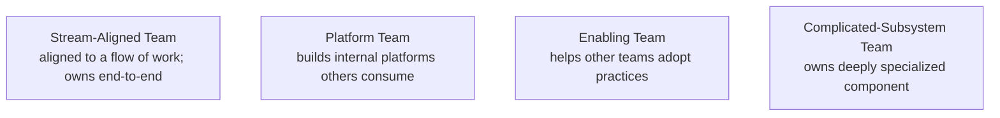

# Cross-Team Collaboration & Communication

Most non-trivial work in a sufficiently large engineering organization crosses team boundaries. Your team's database migration depends on the platform team's pipeline; your feature requires the iOS team's release; your security fix needs SRE's deployment window. **The senior engineer's work is increasingly the management of these boundaries** — translating between teams' contexts, escalating when blocked, ensuring nothing falls into the gaps. *Team Topologies* (Skelton & Pais, 2019) named the canonical team types (stream-aligned, platform, enabling, complicated-subsystem) and the **interaction modes** (collaboration, X-as-a-service, facilitating); the language is a useful lens for designing cross-team work.

The depth bar here is **the operational practice**: how to write a request that another team can act on, how to escalate without burning bridges, how to run async standups across timezones, when to call a meeting and when not to. We cover **RACI** (Responsible / Accountable / Consulted / Informed) as a discipline for clarifying who decides, the **escalation paths** that work in real organizations, and the **failure modes** (silent dependencies, broken-telephone communication, blame across boundaries).

## Where Cross-Team Practices Came From — Conway, Brooks, And Team Topologies

Cross-team engineering coordination has a *long* intellectual history. The challenges of working across organizational boundaries have been studied since at least Conway's 1968 observation, but the modern *practices* (Team Topologies, async-first work, RACI matrices) emerged through specific 2010s–2020s developments.

### Conway's Law (1968) — The Theoretical Foundation

Already covered in [T05 of C01](../C01-software-architecture/T05-microservices-decomposition.md), but worth recapping: **Mel Conway's 1968 paper** observed that systems mirror their organizations' communication structures.

For cross-team coordination, the implication: *team boundaries become system boundaries*. If two teams communicate poorly, the systems they own integrate poorly.

### Fred Brooks — The Mythical Man-Month (1975)

**Fred Brooks's 1975 book** [*The Mythical Man-Month*](https://en.wikipedia.org/wiki/The_Mythical_Man-Month) quantified the cross-team coordination problem. Brooks observed:

- **Communication overhead grows as N²**: N people have N(N-1)/2 communication paths.
- **Adding people to a late project makes it later**: integration overhead exceeds productivity gains.

Brooks's analysis explains why cross-team coordination is *expensive*. Two teams of 5 have 10 internal channels + 25 cross-team channels = 35 total channels. Adding a third team adds another 50 cross-team channels.

### The 2019 Team Topologies Synthesis

The modern synthesis is **Matthew Skelton and Manuel Pais's [*Team Topologies*](https://teamtopologies.com/book)** (IT Revolution Press, 2019). The book identifies four team types and three interaction modes that produce healthy cross-team coordination.

**Team Types**:

1. **Stream-aligned teams**: own a stream of work end-to-end (most teams).
2. **Platform teams**: provide internal services to stream-aligned teams.
3. **Enabling teams**: help other teams adopt new practices.
4. **Complicated subsystem teams**: own specific complex components.

**Interaction Modes**:

1. **Collaboration**: two teams work together intensively (high coordination cost).
2. **X-as-a-Service**: one team provides a service that others consume (low coordination cost).
3. **Facilitating**: enabling team helps another team adopt practices (medium cost).

The book's specific insight: **most teams should interact as X-as-a-Service**, not collaboration. Collaboration is expensive; making it the default produces excessive coordination overhead.

### Who Matthew Skelton And Manuel Pais Are

**Matthew Skelton** is a British consultant who's been writing about DevOps and team practices since 2010. He's a regular speaker at DevOpsDays and similar conferences.

**Manuel Pais** is a Portuguese consultant with similar focus areas. His writing on team patterns appeared in IT Revolution publications before *Team Topologies*.

The two collaborated on *Team Topologies*, which became a *standard reference* for engineering organization design.

### The Async-First Movement (2020+)

The COVID-19 pandemic (2020+) forced widespread remote work. This accelerated an existing trend: **async-first communication** as the default. Pre-2020, sync meetings dominated; async was the exception. Post-2020, async became *the* default for many companies.

The async-first patterns:

- **Written documentation** instead of meetings.
- **Asynchronous code review** rather than pair programming.
- **Time-shifted standups** instead of synchronous standups.
- **Working hours flexibility** within reasonable overlap windows.

Companies like GitLab, Automattic, and Zapier (all distributed for years before COVID) provided early models. By 2024, async-first is the default for most distributed engineering organizations.

### The RACI Matrix (1960s)

**RACI** (Responsible, Accountable, Consulted, Informed) is a *management* methodology that predates modern software by decades. It emerged in the 1950s–1960s management literature.

For each task or decision:

- **Responsible**: who does the work?
- **Accountable**: who owns the outcome?
- **Consulted**: whose input is needed?
- **Informed**: who needs to know?

RACI matrices clarify *who decides* in complex cross-team situations. The framework is widely used in tech but originates from manufacturing/operations management.

## Why Cross-Team Matters, Specifically: The Senior Engineer's Q&A

### Q1: Why is cross-team work so hard?

Three structural reasons:

1. **Communication overhead**: each team has internal context that's expensive to share.
2. **Priority misalignment**: each team has different goals.
3. **Bureaucratic costs**: cross-team agreements require negotiation.

These factors make cross-team work *significantly* more expensive than within-team work — typically 3-5× the effort.

### Q2: When should I prefer async over sync?

Three triggers for async:

1. **Time zones differ**: when teams span timezones, sync is expensive.
2. **Context is dense**: complex topics need writing, not talking.
3. **Decision is consequential**: written records matter.

Three triggers for sync:

1. **Urgency**: real-time discussion needed.
2. **Sensitive topics**: emotional content benefits from tone.
3. **High ambiguity**: rapid back-and-forth helps clarify.

Most cross-team interactions should be async-first with sync escalation when needed.

### Q3: How do I escalate without burning bridges?

Three principles:

1. **Escalate transparently**: tell the other team you're escalating.
2. **Frame the problem, not the people**: "we have a coordination challenge" not "team X isn't responding."
3. **Provide context**: escalation targets need to understand the situation.

The senior practice: escalation is a *normal* part of cross-team work, not a failure. Treating it as failure produces avoidance, which is worse.

### Q4: How do I use RACI effectively?

Three guidelines:

1. **One accountable**: exactly one person owns the outcome. Multiple accountable = nobody accountable.
2. **Few responsible**: the work-doers should be small in number.
3. **Many consulted/informed**: stakeholders should know what's happening.

The senior practice: RACI matrices should be *short* (one page per decision). Long matrices indicate too much complexity.

### Q5: What does Team Topologies recommend for typical teams?

For most engineering teams:

- **Stream-aligned**: most teams own end-to-end product features.
- **Platform**: small number of platform teams support stream-aligned teams.
- **Enabling**: limited use, typically for technology adoption.
- **Complicated subsystem**: only for genuinely complex components.

Most interactions should be X-as-a-Service (platform team provides; stream teams consume). Collaboration should be rare and bounded.

## Common Misconceptions Explained

### "Cross-team work is just internal politics."

False. Real cross-team work involves *substantive coordination*: aligning on schemas, agreeing on contracts, managing dependencies. Politics is overlay.

### "More meetings improve cross-team coordination."

False. **More meetings increase overhead** without proportional benefit. Async documentation usually scales better.

### "RACI is bureaucratic."

Partially false. RACI *can be* bureaucratic but doesn't have to be. A one-page RACI for a major decision is *appropriate*; a full RACI matrix for every task is bureaucratic.

### "Cross-team conflicts are about technology."

Often false. Cross-team conflicts are often about *priorities, capacity, or recognition* — wrapped in technical vocabulary. Understanding the real concern helps resolution.

### "Async work eliminates coordination problems."

False. Async work *changes* coordination problems. New issues emerge (delayed responses, time zone challenges, written-language ambiguity). Trade-offs not eliminations.

### "Team Topologies is just consulting jargon."

False. The framework provides *specific* vocabulary that helps teams design their organization. Implementations vary, but the categories are useful.

## Why Cross-Team Is Hard

The default mode of organizations is *each team optimizes locally*. Cross-team requests look like:

- **Different priorities**: their critical thing is your "later."
- **Different vocabulary**: "user" means different things to two teams.
- **Different timelines**: their quarter just started; yours ends in 2 weeks.
- **Different tools**: they use Jira; you use Linear.
- **No shared incentive**: their bonus doesn't depend on your work.

Conway's Law: the system's architecture mirrors the organization. If teams don't communicate, the systems they own don't integrate.

## Team Topologies — The Four Types



The interaction modes:
- **Collaboration**: two teams work together intensively for a bounded period.
- **X-as-a-Service**: one team provides; others consume.
- **Facilitating**: enabling team helps stream-aligned teams.

When two teams "must work closely together for an unbounded time," the topology is wrong; they should merge or one should provide X-as-a-Service.

## RACI

For every cross-team item, identify:

- **Responsible**: who does the work?
- **Accountable**: who owns the outcome? (exactly one person)
- **Consulted**: whose input is needed?
- **Informed**: who needs to know?

```
Task: extract payment service
- R: Payment team's backend engineers
- A: Payment team's tech lead
- C: Order team, SRE, Security
- I: Product, Customer Support
```

The discipline catches subtle gaps. "Who's actually deciding this?" (the accountable) is often the most useful question.

## Async Communication

Most cross-team interaction is async, by necessity (different timezones, different schedules, different meetings).

The patterns:
- **Slack / Teams**: thread-based; searchable; ambient.
- **Written documents**: long-form decisions, designs.
- **Async standups**: team posts daily status; no meeting.
- **Code reviews / PR comments**: design discussions tied to code.

**Async-first** as a culture: assume the answer to "should I have a meeting?" is "no, write it down." Synchronous time is reserved for genuinely interactive needs (debate, sensitive feedback, trust-building).

## When To Have A Meeting

Meetings are appropriate for:
- High-bandwidth discussion: 5 people need to converge on a decision in 30 minutes.
- Sensitive feedback: 1:1 in person beats Slack.
- Trust-building: especially for newly-formed cross-team work.
- Crisis: incidents need fast coordination.

Meetings are *not* appropriate for:
- Status updates (use async).
- Information broadcasting (use written + Q&A).
- Decisions without preparation (read the doc first).

## Writing A Cross-Team Request

A request that another team can act on:

```
Subject: Order service needs new payment endpoint by Q3

Context: The order service is migrating to event-driven payments per
ADR-0042. We need a new `paymentauthorized` event published by the
PaymentService.

Specific ask: Add the event publication for the next 6 endpoints (list).
Schema: see attached Avro.

Timeline: We need this in production by Sept 15. We can support testing
from Aug 15 onwards.

Effort: We estimate ~1 engineer-week based on similar past work. Happy
to pair with you to scope.

Decision point: Confirm by Friday whether this fits your Q3.

Contact: alex@company.com or #order-svc channel.
```

Everything an engineer on the other team needs to act: context, ask, timeline, effort, decision point, contact. Vague "can you help us?" requests get ignored.

## Escalation

When a cross-team blocker persists:

1. **Direct contact**: talk to the engineer on the other team.
2. **Tech lead to tech lead**: leads escalate.
3. **Manager to manager**: explicit ownership conversation.
4. **Skip-level**: rare; reserve for genuine impasse.

The senior practice: **escalate early but politely**. "We're blocked on X; I want to make sure we have alignment on Q3 priorities" beats "you're blocking us."

## Building Cross-Team Trust

Trust is built through **delivering on small commitments first**. Don't promise something big to a new team; deliver something small reliably; expand.

Other practices:
- **Show up to their meetings** occasionally.
- **Praise their work** publicly.
- **Help with their pain** when you can.
- **Don't surprise** with bad news; warn early.

Cross-team trust *compounds*; once established, future requests are easy.

## Anti-Patterns

### The Silent Dependency

Your team depends on something the other team doesn't know they're providing. They change it; you break.

**Fix**: explicit contract; informed parties; tested integrations.

### The Throw-Over-The-Wall

Your team finishes work; throws it to another team to deploy / support / iterate. They feel imposed upon.

**Fix**: pair on the transition; ensure they're trained; check in afterward.

### The Blame Game

Cross-team failure happens; each team blames the other. Outcome: no improvement.

**Fix**: blameless postmortem ([T10](./T10-incident-response-and-blameless-postmortems.md)); systemic causes.

### The Endless Stand-In

A cross-team initiative has 10 weekly meetings; nothing decided. Meeting culture has replaced delivery.

**Fix**: kill meetings; rely on async; designate single owner.

### The Heroic Owner

One engineer holds the whole cross-team initiative. They burn out; nothing replaces them.

**Fix**: distribute ownership; document; rotate.

## Communication Tools

- **Slack / Teams**: real-time + threaded; default ambient channel.
- **Notion / Confluence**: long-form async.
- **Linear / Jira**: tickets with cross-team labels.
- **Loom**: async video for explaining complex things.
- **Google Docs / Figma**: collaborative editing.

The team's choice matters less than consistency. Tool sprawl is friction.

## Trade-Off Summary

| Practice | Cost | Value |
|----------|------|-------|
| RACI per cross-team item | Setup time | No ambiguity on owner |
| Async-first | Less personal connection | Scales across timezones |
| Explicit request format | Writing time | Higher response rate |
| Early escalation | Political capital | Avoids longer blocks |
| Pairing on handoff | 1-2 days | Avoids throw-over-the-wall |

> [!INTERVIEW]
> A common L5 prompt: "How do you work with other teams?" Strong answers (a) cite specific patterns (RACI, async-first), (b) describe a specific successful cross-team initiative with metrics, (c) describe escalation discipline, (d) acknowledge a failure and what you learned.

## Practice

1. **Map your dependencies.** List teams your team depends on. For each, identify the owner; check the relationship is healthy.
2. **Write a cross-team request.** Draft a request following the template; circulate to a teammate for critique.
3. **RACI exercise.** For your current cross-team work, complete a RACI; identify any "no accountable" or "multiple accountable" rows.
4. **Async-standup adoption.** For one week, replace your team's daily standup with async posts.
5. **Escalation practice.** When a cross-team blocker persists 3 days, escalate. Note the response.
6. **Trust-building deposit.** Pick a team you'll need a favor from in 6 months. Deliver something small for them now.
7. **Topology check.** Map your team's interactions using Team Topologies. Identify any mismatches.
8. **The silent-dependency hunt.** Find one dependency you're consuming without an explicit contract. Make it explicit.
9. **Meeting audit.** For one week, attend every cross-team meeting; mark whether async would have worked.
10. **The skeptic conversation.** A senior engineer says "if only the other team would do their work." Write a 200-word response on cross-team partnership.

## Recap

You should now be able to:

- Recognize **why cross-team is hard** — different priorities, vocabulary, timelines, tools, incentives.
- Apply **Team Topologies** to identify when interactions are mismatched.
- Use **RACI** to clarify owner, decider, consulted, informed.
- Default to **async-first**; reserve meetings for genuinely interactive needs.
- Write **cross-team requests** that include context, ask, timeline, effort, decision point, contact.
- Escalate **early and politely**; pair on handoffs; build trust through small delivered commitments.
- Recognize and refuse **anti-patterns**: silent dependency, throw-over-the-wall, blame game, endless stand-in, heroic owner.

## Next

Continue to [Incident Response & Blameless Postmortems](./T10-incident-response-and-blameless-postmortems.md) — what to do when production breaks.
