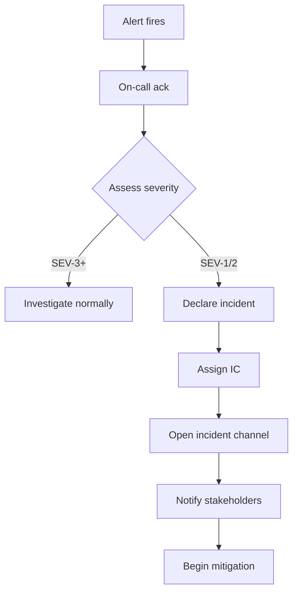

# Incident Response & Blameless Postmortems

When production breaks, the engineering team must do two things, in this order: **stop the bleeding**, then **learn from it**. Both are practices, not improvisations. The first uses **incident command** (a structured response with clear roles); the second uses **blameless postmortems** (John Allspaw's foundational 2012 Etsy post, building on Sidney Dekker's "Just Culture"). The discipline is what separates a team that recovers in 30 minutes from one that recovers in 4 hours; and a team that learns from each incident from one that repeats the same outage every six months.

The depth bar here is **the operational reality** — what to do in the first 15 minutes, who runs the incident, what to communicate to whom, how to extract real lessons without punishing engineers who happened to be touching the failing code. We cover **severity levels** (SEV-1 through SEV-4), the **Incident Commander** role, the **communications cadence**, the **5 Whys** technique and its limits, and the **action-items-with-owners** discipline that turns lessons into change.

## Where Modern Incident Response Came From — Aviation, NASA, And The 2012 Etsy Essay

Modern software incident response practices descend from **aviation safety culture** (which crystallized in the 1980s) and **NASA's post-mortem culture** (which emerged after the Challenger disaster in 1986). The software industry's adoption was led by **John Allspaw's 2012 Etsy essay** that named "blameless postmortems" and reshaped the field.

### The Aviation Safety Lineage (1970s–1990s)

The conceptual foundation of modern incident response is **Crew Resource Management (CRM)**, developed by **NASA's John Lauber and colleagues in 1979**, in response to a series of fatal commercial aviation crashes. The crashes had a common pattern: technical equipment was working, but crew miscommunication or hierarchical pressure caused catastrophic errors.

Specific tragedies that motivated CRM:

- **United Airlines Flight 173 (1978, Portland)**: pilots focused on a landing-gear indicator while the plane ran out of fuel. 10 deaths.
- **Tenerife Disaster (1977, KLM 4805 + Pan Am 1736)**: KLM captain's hierarchy intimidated co-pilots from voicing concerns. 583 deaths, the deadliest aviation accident in history.

CRM's principles addressed these failures:

1. **All crew members are responsible** for safe operation, regardless of rank.
2. **Junior members must speak up** if they see problems; senior members must listen.
3. **Communication is structured** to prevent ambiguity.
4. **Mistakes are systemic**, not individual.
5. **Investigation is blameless** — the goal is learning, not punishment.

By the late 1980s, CRM was mandatory in commercial aviation. **Fatal accident rates dropped dramatically** — from ~40 per million departures in 1970 to ~1 per million by 2010. CRM is widely credited with the bulk of this safety improvement.

The software industry didn't immediately learn from aviation. The cultural translation took decades.

### NASA's Challenger Disaster (1986)

The **Space Shuttle Challenger disaster** (January 28, 1986) was a watershed moment for engineering safety culture. The investigation (Rogers Commission, 1986) identified:

1. **Technical cause**: O-ring seal failure due to cold temperature.
2. **Organizational cause**: Morton Thiokol engineers knew the O-rings were dangerous below freezing; NASA management overrode their concerns.
3. **Cultural cause**: NASA's "can-do" culture suppressed dissenting voices; the engineers who flagged the risk were ignored.

The Challenger investigation **named the systemic causes**. It wasn't "the engineer who designed the O-rings made a mistake" — it was "the organization's decision process suppressed safety information."

This framing — *systemic causes, not individual blame* — would later inform software incident response. **Sidney Dekker** (cognitive systems engineer, born 1962) developed the academic foundation in books like *The Field Guide to Understanding 'Human Error'* (2002, third edition 2014), which became required reading for safety-critical industries.

### The "Just Culture" Movement (2000s)

The 2000s saw aviation's CRM principles generalized into **"Just Culture"** thinking. The argument:

- **Pure no-blame culture is naive**: there's a difference between honest mistakes (systemic) and reckless behavior (individual).
- **Pure blame culture is destructive**: it suppresses reporting and learning.
- **Just culture distinguishes**: honest mistakes get learning; reckless behavior gets accountability.

Sidney Dekker's *Just Culture: Balancing Safety and Accountability* (2007) is the canonical reference. The concept influenced medicine (which had similar safety challenges), nuclear power, and eventually software.

### John Allspaw's 2012 Etsy Essay

The single most influential document for software incident response is **John Allspaw's [*Blameless PostMortems and a Just Culture*](https://www.etsy.com/codeascraft/blameless-postmortems/)** (May 22, 2012, Etsy's Code as Craft blog).

Allspaw was VP of Operations at Etsy at the time. He had been studying aviation safety culture and Sidney Dekker's work, and was applying the principles at Etsy. The essay introduced the software industry to:

1. **Blameless postmortem**: post-incident investigations focus on systemic causes, not individual blame.
2. **Hindsight bias**: investigators tend to assume responders "should have known" — they didn't, in the moment.
3. **Learning over punishment**: the goal is improving the system, not assigning blame.
4. **Psychological safety**: engineers must feel safe reporting incidents.

The essay was *short but precise*. It cited Dekker explicitly. It contained specific operational guidance (questions to ask during postmortems).

The essay's impact was enormous. Within 3 years, "blameless postmortem" was standard vocabulary across the industry. **Google's SRE book (2016) codified the practice**, citing Allspaw's essay. Today, "blameless postmortem" is the standard for incident review at almost every modern software company.

### Who John Allspaw Is

**John Allspaw** has had a remarkable career. He was VP of Operations at Etsy from 2010–2016, where he established the blameless postmortem culture. He later co-founded **Adaptive Capacity Labs**, a consultancy focused on resilience engineering.

His academic background: he completed a Master's in Human Factors and Systems Safety at Lund University under Sidney Dekker. The combination of operational experience (Etsy, before that Flickr) and formal safety-engineering education gave him the unique standing to bridge aviation safety practices to software.

Allspaw's books *The Art of Capacity Planning* (2008) and the related work *Web Operations* (with Jesse Robbins, 2010) are required reading for operations engineers. His conference talks (Velocity, SRECon, multiple keynotes) have shaped a generation of SRE thinking.

### The Google SRE Codification (2016)

The Google SRE book (covered in [T15 of C02](../C02-distributed-systems-and-system-design/T15-reliability-sli-slo-sla-redundancy-failover.md)) dedicated chapters to incident response and postmortems. The book formalized:

- **Incident Commander role**: clear coordination authority.
- **Specific roles**: communications lead, operations lead, planning lead.
- **Postmortem templates**: structured documents.
- **Action item tracking**: ensuring follow-through.

These practices were Google-specific in the book but were quickly adopted industry-wide.

### Why The Lineage Matters

Modern software incident response is *not a software invention*. It descends from:

- **Aviation safety culture** (CRM, just culture).
- **NASA's post-disaster investigations** (Challenger).
- **Academic resilience engineering** (Sidney Dekker, Erik Hollnagel).
- **Etsy's 2012 essay** (John Allspaw).
- **Google's SRE codification** (2016 book).

The senior engineer's value: recognizing that these practices have *decades of evidence behind them*. When a team adopts blameless postmortems, they're inheriting aviation's hard-won safety knowledge.

## Why Incident Response, Specifically: The Senior Engineer's Q&A

### Q1: Why does blamelessness matter so much?

Because **blame suppresses learning**. When engineers fear punishment for incidents:

- They report fewer incidents (data shows ~50% reduction in self-reporting when blame is feared).
- They withhold context during investigations.
- They become risk-averse, slowing feature delivery.
- They leave the team (turnover increases).

When blame is absent:

- Engineers report all incidents, even minor ones.
- Investigations get full context.
- The system improves faster.
- Engineers stay longer.

Aviation has 50 years of data showing this. Software has 10+ years now. The pattern is robust.

### Q2: How does this conflict with accountability?

It doesn't, properly understood. **Blameless ≠ accountability-free**. Just culture distinguishes:

- **Honest mistakes** (the engineer didn't know; the system allowed it): learning, no blame.
- **Reckless behavior** (the engineer knowingly violated safety practices): accountability.

In practice, almost all software incidents are honest mistakes — the engineer didn't know the consequence, or the system allowed the wrong action. Reckless behavior is rare and clearly distinguishable.

The senior judgment: default to blameless; reserve accountability for genuine recklessness.

### Q3: Why have an Incident Commander role?

Because **multiple people doing the same incident response in parallel is chaos**. The Incident Commander:

- **Coordinates** all response activities.
- **Decides** what to do (with input from experts).
- **Communicates** with stakeholders.
- **Authorizes** specific actions (rollback, escalation).

Without an IC, multiple engineers debug independently, miss each other's findings, and may take conflicting actions. With an IC, response is coordinated.

The IC is typically *not* the most senior person — they're someone trained in incident response coordination. The senior engineer's role is often as *subject matter expert*, advising the IC.

### Q4: How long should a postmortem take?

Sized to the incident:

- **Minor incidents** (small impact, quick resolution): 30-minute write-up.
- **Major incidents** (significant impact): 1–2 hour write-up plus 1-hour review meeting.
- **Catastrophic incidents** (high-visibility, regulatory implications): multi-day investigation, formal review board.

The cost of a too-light postmortem: the same incident recurs. The cost of a too-heavy postmortem: engineering time consumed without proportionate learning.

### Q5: What goes in a postmortem document?

Standard sections:

1. **Summary**: one-paragraph description.
2. **Impact**: who was affected, how much, for how long.
3. **Timeline**: chronological events.
4. **Root cause**: systemic factors that allowed the incident.
5. **What went well**: successes during response.
6. **What went poorly**: failures during response.
7. **Action items**: specific changes to prevent recurrence, with owners and deadlines.

The senior practice: **action items must have owners and dates**. Postmortems without specific action items don't drive improvement.

## Common Misconceptions Explained

### "Blameless means no consequences."

False. Blameless means **systemic investigation, not absence of consequences**. Recurring reckless behavior should have consequences; systemic issues should be addressed by changing the system, not by punishing individuals.

### "5 Whys finds root causes."

Half true. **The 5 Whys technique** (asking "why?" five times) is a *starting point* for root cause analysis. It often surfaces useful information but can be misleading — there's rarely a single root cause; incidents have multiple contributing factors.

The senior practice: use 5 Whys as a tool, not as the definitive analysis method. Consider multiple contributing factors.

### "Postmortems should focus on technical causes."

False. **Most software incidents have organizational and process causes** alongside technical ones. Focusing only on technical fixes misses the deeper improvements.

### "The on-call engineer is responsible for incidents."

False. Per blameless culture, the on-call engineer is the *first responder*, not the *cause*. Treating them as responsible deters engineers from being on-call.

### "We don't need formal incident response for minor issues."

Partially false. Even minor incidents benefit from light-weight investigation. Patterns emerge across many minor incidents that wouldn't be obvious from any single one. The discipline of always investigating prevents complacency.

### "Action items will be addressed eventually."

Often false. **Action items without explicit owners and deadlines don't get done**. Postmortems with unowned action items are theater.

## Severity Levels

A common scale:

- **SEV-1**: complete outage of a critical surface. Page everyone. Resolve immediately.
- **SEV-2**: significant degradation. Page on-call.
- **SEV-3**: minor degradation. Address during business hours.
- **SEV-4**: noticed but no customer impact. Track but no urgency.

The trigger criteria should be explicit in the runbook — not "I think this is SEV-2," but "SEV-2 because checkout success rate dropped from 99% to 80%."

## The Incident Roles

For SEV-1 / SEV-2:

- **Incident Commander (IC)**: runs the response; makes decisions; not necessarily the deepest expert.
- **Subject Matter Experts (SMEs)**: do the diagnosis and fix; report to IC.
- **Communications**: publishes updates internally and externally.
- **Scribe**: records timeline, actions, decisions.

The IC's job is to **coordinate**, not to fix. If the IC is also the only one debugging, no one is running the incident. **Separating these roles is the difference between calm and panic.**

## The First 15 Minutes



The discipline:
1. **Acknowledge fast** — < 5 min.
2. **Declare and assign IC fast** — < 10 min.
3. **Open a dedicated incident channel** (Slack `#inc-NNN`) — all coordination there, not in DMs.
4. **First mitigation attempt** — within 15 minutes for SEV-1.

If you don't have a quick mitigation, **revert the last change**. A successful rollback before deep diagnosis often resolves the customer impact while the team continues investigating.

## Communications Cadence

Internal: post in the incident channel every 15–30 minutes, even if the update is "still investigating."

External: SEV-1 / SEV-2 typically warrants a status page update within 30 minutes; updates as situation changes.

The IC's communications template:

```
**Incident #INC-2026-0042**
Status: investigating | mitigating | monitoring | resolved
Impact: ~5% of checkout requests failing since 14:32 UTC
Current action: rolling back deploy v2.4.1
Next update: 15:00 UTC
IC: alex
```

Specific. Avoids panic. Stakeholders know what's happening.

## Mitigation Vs Resolution

**Mitigation**: customer impact is reduced or eliminated, possibly by a workaround.
**Resolution**: root cause is fixed.

Mitigation often comes first; that's correct. A rollback that stops the bleeding is valid even if the underlying bug isn't fixed. Mark the incident resolved when impact ends; track the follow-up fix separately.

## The Postmortem

Within 24–72 hours of resolution, write the postmortem. Sections:

```markdown
# Incident: Checkout Failure 2026-08-15

## Summary
At 14:32 UTC, ~5% of checkout requests began failing with 500 errors. The
team rolled back at 14:47 UTC; full recovery at 14:52 UTC. Duration: 20
minutes. Impact: ~12,000 failed checkouts (~$80K lost revenue).

## Timeline
- 14:25 UTC: Deploy v2.4.1 begins.
- 14:32 UTC: First alert fires.
- 14:34 UTC: On-call ack; IC assigned.
- 14:39 UTC: Cause identified as new field validation rejecting valid input.
- 14:47 UTC: Rollback initiated.
- 14:52 UTC: Metrics return to baseline.
- 15:00 UTC: Incident closed.

## Root Cause
The new validation regex rejected international phone numbers containing
the `+` character. The deploy passed pre-prod testing because test data
did not include international formats.

## What Went Well
- Alert fired within 7 minutes.
- IC declared within 2 minutes of ack.
- Rollback path was tested and worked.

## What Went Poorly
- Test data did not include the actual production distribution.
- The validation change was buried in a 300-line PR; reviewer missed.

## Action Items
- [ ] Add international phone test cases (owner: alex; due: Aug 22).
- [ ] PR size limit enforced in CI (owner: sam; due: Sep 1).
- [ ] Validation changes require test-data review (owner: kim; due: Sep 1).
```

The action items are the *output* of the postmortem. Each has an owner and a due date. Postmortems without action items teach the team nothing.

## Blamelessness

The key Etsy / Google SRE principle: **assume good intent**. The engineer who shipped the bug did the best they could with the information they had. The system failed; not the person.

In practice:
- The postmortem language is "the validation regex," not "alex's regex."
- The 5 Whys lead to *systemic* causes, not personal ones.
- No one is "in trouble" because of an incident.

Why? Because **punishing engineers for incidents teaches them to hide problems**. A culture of fear produces longer outages, slower learning, and worse psychological safety. Blameless postmortems are correlated with *higher reliability*, not lower.

This doesn't mean ignoring incompetence — but addressing it through ongoing performance management, not via the postmortem of one incident.

## The 5 Whys

A diagnosis technique: ask "why" 5 times to reach the root.

- The checkout failed. Why?
- The validation regex rejected valid input. Why?
- The regex was overly restrictive. Why?
- The author wasn't aware of international phone formats. Why?
- The test data didn't include them. Why?
- We've never measured test-data representativeness.

Each "why" drives toward systemic causes. **Stop at the systemic cause**, not at "human error." "Human error" is *never* the root cause — it's the place to start asking why.

The 5 Whys has limits — complex incidents have *many* contributing causes, not a single chain. Don't force a single root.

## MTTR, MTTD, MTBF

Operational metrics:

- **MTTD** (Mean Time To Detect): from incident start to alert.
- **MTTR** (Mean Time To Recover): from alert to mitigation.
- **MTBF** (Mean Time Between Failures): inverse of failure rate.

Track quarterly. Improving MTTD or MTTR is often where the team can move the needle fastest.

## Anti-Patterns

### The Witch Hunt

The postmortem assigns blame. The engineer is "talked to." Others learn to hide problems. Outages take longer. Repeat.

### The Action-Item Graveyard

Action items are filed and forgotten. The same incident recurs in 6 months.

**Fix**: action items go to the team's backlog with due dates; reviewed at every postmortem retrospective.

### The "It Won't Happen Again"

Postmortem concludes "we'll be more careful." No systemic change. It happens again.

**Fix**: systemic action items, not aspirational ones.

### The Postmortem As Performance Review

Manager uses the postmortem to evaluate the on-call engineer. Engineer becomes defensive. Future incidents are concealed.

### The Long Postmortem Nobody Reads

The doc is 30 pages; full of detail nobody needs. The lesson is lost.

**Fix**: 1-2 page summary; details in appendix.

## Incident Tooling

- **Slack** for incident channels.
- **PagerDuty / Opsgenie** for paging.
- **incident.io / Rootly / Jeli** as dedicated incident management.
- **Statuspage.io** for external comms.
- **Postmortem template** in the repo or wiki.

## Trade-Off Summary

| Practice | Cost | Value |
|----------|------|-------|
| IC role separated from SME | Process learning | Calm, coordinated response |
| Incident channel | Overhead | Single source of truth |
| 24–72h postmortem | Engineer time | Learning extracted |
| Action items with owners | Backlog discipline | Real change |
| Blamelessness | Cultural commitment | Psychological safety; faster recovery |

> [!INTERVIEW]
> A common L5 prompt: "Tell me about an incident you led." Strong answers (a) describe IC role, (b) name the mitigation taken, (c) describe the postmortem outcome, (d) cite action items that actually shipped, (e) acknowledge what went poorly.

## Practice

1. **Run an incident drill.** Simulate a SEV-2; declare; assign IC; communicate; mitigate. Time each step.
2. **Postmortem authoring.** Take a real recent incident; write the postmortem using the template.
3. **Action-item audit.** For the last 5 postmortems, track action-item completion rate. Aim for > 80%.
4. **MTTR analysis.** Compute your team's MTTR for the last quarter. Identify the bottleneck stage.
5. **Blamelessness language audit.** Re-read your team's postmortems; flag any blaming language; rewrite.
6. **5 Whys exercise.** For a recent incident, apply 5 Whys; identify the systemic cause.
7. **Runbook coverage.** For the top 5 alerts in your service, verify each has a runbook.
8. **Tool selection.** Evaluate one incident-management tool (incident.io, Rootly, Jeli) for your team.
9. **On-call review.** Interview an on-call engineer; identify what makes their experience worse.
10. **The skeptic conversation.** A senior engineer says "we should hold engineers accountable for outages." Write a 200-word response on the cost of blame.

## Recap

You should now be able to:

- Apply **severity levels** with explicit trigger criteria.
- Run an incident as **IC**, separated from SME role.
- Open a **dedicated incident channel** and maintain **15–30 minute communication cadence**.
- Distinguish **mitigation** (impact reduced) from **resolution** (root cause fixed); accept mitigation first.
- Write a **blameless postmortem** within 24–72 hours with summary, timeline, root cause, what went well/poorly, action items.
- Apply **5 Whys** to reach systemic causes; reject "human error" as a root cause.
- Track **MTTD, MTTR, MTBF** as quarterly metrics.
- Recognize and refuse **anti-patterns**: witch hunt, action-item graveyard, "it won't happen again," postmortem-as-performance-review, long postmortem nobody reads.

## Next

Continue to [On-Call & Production Ownership](./T11-on-call-and-production-ownership.md) — the engineer's life of carrying the pager and owning the system 24/7.
