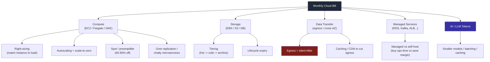
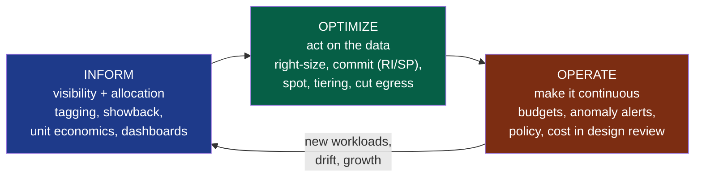

# Cost Engineering & FinOps for Backend Systems

There is a moment, somewhere between "promising startup" and "real business," when the cloud bill stops being a rounding error and becomes the second-largest line item after payroll. By then the architecture has already been chosen, the chatty microservices already deployed, the over-provisioned cluster already idling at 12% CPU. **The decisions that determined the bill were made by engineers, in code, months earlier — but no engineer ever saw a dollar figure attached to them.** That gap, between the people who *cause* spend and the people who *see* it, is the problem FinOps exists to close.

The depth bar here is **treating cost as an engineering property of the system**, on par with latency and reliability — measurable, ownable, designed-for. We cover **unit economics** (cost per request, per tenant, per transaction) and why a feature can be profitable or ruinous depending on it; the **big cost levers** of a backend system with the reasoning behind each; the **FinOps practices** (tagging, showback/chargeback, commitments, anomaly alerts) that make spend visible and accountable; and the **leadership craft** of driving a cost-ownership culture without strangling the velocity that makes the company worth running in the first place.

## Why Cost Became An Engineering Concern

In the data-center era, capacity was **capex**: you bought servers in bulk, depreciated them over three to five years, and the spending decision happened once, in a procurement meeting an engineer rarely attended. The marginal cost of one more request was effectively zero — the hardware was already paid for. Engineers optimized for correctness and performance; *cost* was finance's problem, settled annually.

The cloud inverted this. Capacity became **opex**, billed per second, per gigabyte, per API call. Now **every architectural decision is a spending decision**: choosing a chatty synchronous call over a batched one, an `m5.4xlarge` over an `m5.large`, cross-region replication over single-region, a managed database over a self-hosted one — each silently moves the monthly bill. The engineer writing a `for` loop that fans out a thousand S3 `GetObject` calls is *committing budget* as surely as if they had signed a purchase order, except no one asked them to and no figure appeared on screen.

> [!NOTE]
> This is the core premise of **FinOps**: a cultural and operational practice, formalized by the **FinOps Foundation** (under the Linux Foundation since 2020), for bringing **financial accountability to the variable spend model of the cloud**. It is explicitly a *collaboration* discipline — engineering, finance, and product working from shared data — not a cost-cutting mandate handed down from a CFO. The guiding principle: **"engineers should see and own the cost of what they build."**

### Where FinOps Came From — Spend Pain, Then A Discipline

The term *FinOps* did not appear in a vacuum; it crystallized around the mid-2010s as a name for practices that large cloud spenders had been improvising independently. The arc:

- **2006–2012 — the cloud bill is small.** Early cloud adopters ran modest workloads; spend was an afterthought, and "just spin up another instance" was a feature, not a liability. Cost discipline was nobody's job because there was nothing to discipline.
- **2013–2017 — spend gets real, and chaotic.** As companies moved meaningful workloads to AWS, GCP, and Azure, bills grew faster than anyone forecast, and the *attribution* problem appeared: finance saw a giant aggregate number it couldn't map to teams or products, and engineering saw no number at all. The early reaction was reactive cleanup — quarterly "kill the zombie instances" sprints.
- **2018–2020 — the practice gets a name and a body.** Practitioners at companies like Adobe, Atlassian, Spotify, and the major banks converged on a shared vocabulary; the book *Cloud FinOps* (J.R. Storment & Mike Fuller, 2019) codified it, and the **FinOps Foundation** formed to steward the framework, joining the Linux Foundation in 2020.
- **2021–present — FinOps as a standing function.** Cost moves from periodic cleanup to a *continuous discipline* with dashboards, anomaly detection, and (increasingly) cost as a first-class signal in CI/CD and design review. The 2023–2025 wave of generative-AI features added urgency, because **token spend made the per-request cost asymmetry impossible to ignore** — an AI feature can move the bill in a way a CRUD endpoint never could.

The throughline: each era's pain was *attribution and visibility* before it was raw dollars. FinOps is fundamentally the institutionalization of "put a name on every cost and let the owner decide."

### The Shared House With No Utility Bill

Untagged, unattributed cloud spend behaves like **a shared house where the utility bill arrives addressed to "Occupant."** Nobody turns off the lights, because nobody is charged for leaving them on. Everyone assumes someone else is watching the meter. The cluster that one team spun up for a load test in March is still running in September because deleting it is no one's job and keeping it costs *the house*, not *the person*. FinOps is, at its heart, the act of putting names on the rooms and splitting the bill — so the person who left the AC running all summer is the one who sees the number.

## Unit Economics — The Number That Decides If A Feature Should Exist

Total cloud spend is a vanity metric for an engineer; it goes up when the business grows, which is *good*. The number that actually carries information is **unit cost** — cost normalized to a unit of business value:

- **Cost per request** — total infra cost attributable to a service, divided by requests served.
- **Cost per tenant** — for multi-tenant SaaS, cost attributable to one customer.
- **Cost per transaction** — for a payments, order, or messaging system, cost per business event.

Unit cost is what tells you whether a feature is *fundamentally sound* or *structurally doomed*. A feature can serve a million happy users and still bankrupt you if each interaction costs more than it earns.

There is a subtlety that trips up even experienced engineers: the difference between **amortized** and **marginal** unit cost. Amortized cost spreads your already-committed, fixed infrastructure (the always-on cluster, the reserved database) across all requests — so the *more* traffic you serve, the *lower* the amortized cost per request, because the fixed cost is divided more ways. This is the comforting number, and it's the right one for a feature riding on capacity you've already paid for. **Marginal cost is the dangerous one**: what does *one additional* request cost in fresh money? For a request served by an idle, pre-paid CPU, marginal cost is near zero. For a request that triggers an LLM call, a new spot instance, or a gigabyte of egress, marginal cost is *real cash out the door that grows with every user*. The trap is reasoning with the comforting amortized number about a feature whose costs are actually marginal — which is exactly how AI and egress-heavy features sneak past a unit-economics review.

```java
// A back-of-envelope unit-economics calculation for one endpoint.
// The point is not precision — it is making the number EXIST and be reviewable.
record ServiceCost(
        double monthlyComputeUsd,   // EC2 / Fargate / GKE attributable to this service
        double monthlyDbUsd,        // RDS / DynamoDB / query units
        double monthlyEgressUsd,    // data transfer OUT (see "silent killer" below)
        double monthlyLlmUsd,       // token spend, if this endpoint calls a model
        long   monthlyRequests) {

    double costPerRequestUsd() {
        double total = monthlyComputeUsd + monthlyDbUsd + monthlyEgressUsd + monthlyLlmUsd;
        return total / monthlyRequests;
    }

    /** Margin per request given what we charge (or impute) per request. */
    double grossMarginUsd(double revenuePerRequestUsd) {
        return revenuePerRequestUsd - costPerRequestUsd();
    }
}

// Endpoint A: a cheap CRUD read. Profitable at almost any price.
var crud = new ServiceCost(900, 400, 50, 0, 30_000_000);
// crud.costPerRequestUsd() ≈ $0.000045  -> margin is enormous

// Endpoint B: an LLM-backed "summarize my account" feature on a flat-rate plan.
var aiFeature = new ServiceCost(1_200, 300, 200, 48_000, 4_000_000);
// aiFeature.costPerRequestUsd() ≈ $0.0124 -> on a $0 marginal-price free feature,
// every call is a pure loss; at scale this single endpoint can dwarf the rest of the bill.
```

> [!IMPORTANT]
> **A feature is not "free" because its incremental code cost was zero.** The "summarize my account" button shipped in an afternoon, but if it calls a frontier model on every click and the plan is flat-rate, its *unit economics are negative* and they get **worse as the product succeeds**. The senior move is to compute the unit cost *during design*, not discover it in a postmortem when the AI line item triples the bill.

**In Practice — the feature with terrible unit economics.** A B2B analytics product shipped a "Download full export" button. Engineering loved it: a thin endpoint streaming a query result to CSV. Three months later, finance flagged that a single enterprise customer accounted for 40% of the data-egress bill — their nightly automation hit the export endpoint and pulled the entire dataset out of the cloud every night. Cost per request on that endpoint was *200x* the product average. The fix was not "delete the feature" but **change the unit economics**: paginate, cache the export, serve it from a cheaper egress path, and — crucially — *meter and price* heavy usage. Unit cost turned a loss center into a sound feature.

## The Big Cost Levers Of A Backend System

Cloud cost is not one dial; it is a console of levers, each with different reach and different risk. A leader needs the mental map of which lever moves the bill the most for the least architectural disruption.



### Reference Magnitudes — A Mental Price List

You cannot reason about levers without a rough sense of the *relative* prices, which are remarkably stable across providers even as absolute figures drift. As of ~2026, the order-of-magnitude intuitions worth carrying in your head:

- **Compute** is billed per vCPU-second / GB-second. On-demand is the rack rate; **spot is 60–90% cheaper**; **1- or 3-year commitments are roughly 30–70% cheaper** depending on term and flexibility.
- **Storage tiers span ~20x**: hot object storage (S3 Standard, ~$0.023/GB-month) versus archive (Glacier Deep Archive, ~$0.001/GB-month). Block storage (EBS) sits well above object storage per GB.
- **Egress is the expensive one and it's tiered the wrong way for intuition**: data *in* is free; data *out to the internet* runs roughly $0.05–0.09/GB; **cross-region** transfer is billed per GB; **cross-AZ** transfer is *also* billed per GB in *both directions* — the line item that quietly funds your HA chatter. A CDN can collapse repeat egress to a fraction of origin pricing.
- **Managed-service premium** typically runs **20–100%+** over the raw compute and storage the same software would consume self-hosted — you are buying operational time, not just bits.
- **LLM tokens** are the outlier: a single frontier-model call can cost *thousands of times* a CRUD request, and cost scales with prompt + output length, so it is both high and *variable* per call.

Carry these ratios, not the exact dollars — the exact dollars change quarterly, but "egress is ~$0.08/GB out and spot is ~80% off" is enough to make most architecture trade-offs on the whiteboard.

### Compute Right-Sizing

The single most common waste in any cloud estate is **over-provisioned compute**: instances and container requests sized for a peak that rarely arrives, running at single-digit CPU utilization. Right-sizing matches the resource to the *actual* load profile. For JVM workloads this is its own deep discipline — heap, container memory limits, GC headroom, and CPU shares all interact — and is covered in detail in **[JVM Container Right-Sizing](./T15-jvm-container-right-sizing.md)**. The leadership point: right-sizing is the highest-yield, lowest-risk lever, and it is *recurring* — utilization drifts, so right-sizing is a habit, not a project.

**In Practice — the idle over-provisioned cluster.** A team stood up a 12-node Kubernetes cluster ahead of a launch that was expected to 10x traffic. The launch slipped two quarters; the cluster stayed, running at ~9% average CPU "in case we need to scale fast." It cost roughly $14,000/month to sit nearly idle — a pure tax on a hypothetical. Nobody downsized it because (a) it wasn't anyone's explicit job, (b) the team feared being blamed if the launch *did* spike and capacity wasn't there, and (c) the cost was invisible to them — no showback, no name on the room. The fix combined all three FinOps layers: **inform** (showback put the $14k on the team's dashboard), **optimize** (right-size to 3 nodes plus an autoscaler that can burst to 12 in minutes — capturing the safety *without* the standing cost), and **operate** (a utilization alert flags any service drifting below 20% CPU for a week). The lesson: idle capacity is rarely a *technical* failure; it's an *ownership and visibility* failure, which is exactly what FinOps targets.

### Autoscaling And Scale-To-Zero

If load varies — and it almost always does, by time of day and day of week — paying for peak capacity 24/7 is paying for empty seats on a red-eye. **Horizontal autoscaling** adds and removes replicas to track demand; **scale-to-zero** (KEDA, Knative, Lambda, Cloud Run) drops idle services to *no running instances*, paying only on invocation. The trade-off is **cold-start latency**, which is why scale-to-zero suits bursty, latency-tolerant workloads (batch, internal tools, async consumers) far better than a synchronous user-facing hot path. (Autoscaling mechanics are covered in **[Scaling: Horizontal, Vertical & Autoscaling](../C02-distributed-systems-and-system-design/T12-scaling-horizontal-vertical-autoscaling-statelessness.md)**.)

### Spot / Preemptible Capacity

Cloud providers sell their spare capacity at a steep discount — typically **60–90% off on-demand** — as **Spot Instances** (AWS), **Spot VMs** (Azure), or **Preemptible / Spot VMs** (GCP), with the catch that the provider can reclaim them on short notice (AWS gives a two-minute warning). For **fault-tolerant, interruptible, stateless** work — batch jobs, CI runners, stateless web tiers behind a queue, big-data processing — spot is close to free money. For a stateful primary database, it is malpractice. The art is matching workload tolerance to capacity type.

### Storage Tiering

Storage cost is dominated by *how much, how hot, how long*. Hot object storage (S3 Standard) costs roughly an order of magnitude more than cold/archive tiers (S3 Glacier / Deep Archive). Most data is written once and read rarely; **lifecycle policies** that automatically migrate aging objects from hot to cold to archive — and *expire* truly dead data — are a set-and-forget lever. The failure mode is the multi-terabyte bucket of logs from 2021 sitting in the most expensive tier because nobody set a lifecycle rule.

### Data Egress — The Silent Killer

Here is the lever that surprises everyone, because it is **the opposite of intuition**: getting data *into* the cloud is free, and getting it *out* is expensive. **Cheap to check in, expensive to check out** — the cloud is a roach motel for bytes. Data transfer *out to the internet* is billed per gigabyte; so, more insidiously, is **cross-AZ** and **cross-region** traffic, which racks up *inside* your own architecture every time a service in AZ-a chats with a database in AZ-b.

> [!WARNING]
> **Cross-AZ chatter is the egress bill nobody budgets for.** A chatty microservice mesh that does ten internal hops per request, with replicas spread across availability zones for HA, pays cross-AZ transfer on *every internal call*. The HA you designed for resilience is silently metering your inter-service gossip. Mitigations: **zone-aware / topology-aware routing** (keep traffic within an AZ when possible), collapsing chatty call chains, and putting a **CDN/cache** in front of egress-heavy paths so bytes leave the cloud once and are served from the edge thereafter.

**In Practice — the surprise egress bill.** A team migrated their analytics pipeline to a managed warehouse in a *different region* from their application data, for "data locality with the BI team." The pipeline copied raw event data cross-region nightly. The transfer cost — invisible in any architecture diagram — quietly became the single largest line on the bill, exceeding the warehouse compute it fed. The diagram showed boxes and arrows; it did not show that **every arrow that crosses a region boundary has a price tag**. The fix was to process in-region and ship only aggregates across the boundary, cutting transfer by 95%.

### Managed Service Vs Self-Host

A managed service (RDS, MSK/managed Kafka, Elasticache, a managed search cluster) carries a **margin premium** over self-hosting the same software on raw compute. The naive FinOps reflex is "self-host to save the margin." The senior analysis includes **the cost of the engineering time** to operate, patch, scale, and be paged for the self-hosted thing. For most teams, the managed premium *buys back on-call hours and reliability* and is the correct economic choice; self-hosting pays off only at large scale, where the absolute margin dollars exceed the fully-loaded cost of a platform team. The decision is a TCO comparison, not a sticker-price one.

Work the arithmetic and the trap becomes obvious. Suppose a managed Kafka cluster costs **$4,000/month** and self-hosting the equivalent on raw compute costs **$2,500/month** — a tempting $1,500/month, or $18,000/year, of apparent savings. But self-hosting adds: broker patching and version upgrades, partition rebalancing, capacity planning, disk-full incidents at 3 a.m., and the *page* that comes with all of it. If that work consumes even **two engineer-days a month** — conservative for a stateful distributed system — at a fully-loaded engineer cost north of **$1,000/day**, you've spent the savings and bought yourself on-call load. The managed option was *cheaper in total* and freed those days for product work. The calculus flips only at scale: when the managed premium is $80,000/month, a dedicated platform engineer who owns the self-hosted fleet is plainly worth it. **The number that decides is fully-loaded engineer time, not the line item on the cloud bill** — and that number is precisely what the sticker-price reflex ignores. (This ties directly to who carries the pager: see **[On-Call & Production Ownership](./T11-on-call-and-production-ownership.md)** — self-hosting is a decision to take on-call for that system.)

### Over-Replication And Chatty Microservices

Two architectural habits quietly inflate the bill. **Over-replication**: running five-way replication "to be safe" when three satisfies the durability target, paying 67% more for storage and write amplification you don't need. **Chatty microservices**: decomposing so finely that a single user request becomes a dozen network hops, each adding compute, serialization, and (per above) cross-AZ transfer. Both are cases where an architectural reflex toward "more safety" or "more separation" has an unpriced cost. The fix is to make the cost *visible at design time* so the trade-off is deliberate.

### Caching To Cut Compute And DB Cost

A cache is one of the rare levers that improves **cost and latency simultaneously**. Every request served from cache is a request that did *not* hit your most expensive resources — the database, the LLM, the compute fan-out. A well-placed cache in front of an expensive read path or an LLM call can cut both the bill and the p99. (Prompt/response caching for AI workloads is its own topic: **[Prompt Caching Strategies](../C11-ai-system-architecture/T03-prompt-caching-strategies.md)**.)

### The LLM / AI Cost Asymmetry

AI workloads break the usual cost intuitions and deserve their own treatment. Three asymmetries matter:

1. **Per-call cost is high and variable.** A single LLM request can cost cents to dollars — orders of magnitude more than a CRUD request — and scales with *input + output tokens*, so a verbose prompt or a long generation costs more, unpredictably.
2. **Cost scales with success.** Unlike infrastructure you've already paid for, token spend is purely marginal: every additional user, every retry, every "regenerate" click is fresh money out the door. A viral AI feature is a *runaway bill*, not a sunk cost amortized over more users.
3. **The levers are different.** The big AI cost levers are **model right-sizing** (use the smallest model that meets the quality bar — a 7B model may serve 80% of traffic a frontier model was doing), **batching**, and **caching**, covered in **[Cost & Latency Optimization: Smaller Models, Batching](../C11-ai-system-architecture/T07-cost-latency-optimization-smaller-models-batching.md)**.

> [!INTERVIEW]
> A common L5/staff prompt: *"Your AI feature's cloud bill is growing faster than revenue. Walk me through what you do."* A strong answer (a) immediately reaches for **unit economics** — cost per call vs revenue per call, is the marginal economics even positive; (b) names the AI-specific levers in order of yield: **caching identical/similar requests**, **routing to a smaller model** for the bulk of traffic with escalation to a frontier model only when needed, **batching**, **token-budget caps and truncation**; (c) addresses **product/pricing**, not just engineering — metering, rate limits, or a paid tier, because some features are *structurally* unprofitable at a flat price and no amount of optimization fixes negative unit economics; (d) makes it **observable** — per-feature token dashboards and anomaly alerts so the next runaway is caught in hours, not at month-end. Weak answers jump straight to "use a cheaper model" without checking whether the feature should exist at its current price.

## FinOps Practices — Making Spend Visible And Accountable

Levers only matter if someone can *see* where the money goes and *owns* the decision to pull them. That visibility-and-accountability machinery is the operational core of FinOps.

### Tagging And Cost Allocation

Everything starts with **tagging**: every resource carries metadata — `team`, `service`, `environment`, `cost-center` — so the bill can be *sliced* by who owns what. Untagged spend is the "Occupant" utility bill; tagged spend has a name on every room. Mature orgs enforce tagging as policy: resources without required tags are flagged, quarantined, or refused at provision time.

```yaml
# Example: a required-tag policy enforced at provisioning (IaC / policy-as-code).
# Resources missing any required tag are rejected before they ever cost a cent.
required_tags:
  - team            # who owns this — the name on the room
  - service         # which system it belongs to (maps to unit-economics rollups)
  - environment     # prod | staging | dev  (so you can see what dev is costing)
  - cost_center     # finance allocation bucket for showback/chargeback
policy:
  on_missing_tag: deny          # reject the apply; no orphan, un-owned resources
  on_drift:       alert_owner   # re-tagged or stripped later -> page the team tag
```

### Showback Vs Chargeback

Once spend is allocated, two models drive accountability:

- **Showback** — each team is *shown* its cost, for awareness, but the money isn't moved out of their budget. Low-friction; raises consciousness without internal billing bureaucracy. Good first step.
- **Chargeback** — each team's cloud cost is *actually charged* to their budget, like an internal invoice. High-friction, high-accountability; forces hard prioritization but can breed gaming (teams under-provisioning to dodge the chargeback, then causing incidents).

Most organizations succeed with **showback to build the culture**, escalating to chargeback only where the dollar amounts justify the overhead. Visibility usually changes behavior before billing does.

### Budgets And Anomaly Alerts

A budget is a *tripwire*: a threshold per team/service that fires an alert as actuals or forecasts approach it. **Anomaly detection** is the more powerful sibling — provider-native (AWS Cost Anomaly Detection, GCP/Azure equivalents) or third-party tooling that learns the normal spend shape and pages someone when it deviates. This is what turns the "surprise egress bill" from a month-end heart attack into a same-day Slack alert. **Treat a cost anomaly like a latency anomaly: it should page, and it should have an owner.**

### Reserved Instances, Savings Plans, And Committed Use

For the **stable, baseline** portion of your usage — the load you know you'll be running in a year — paying on-demand is paying the rack rate for a hotel you live in. The commitment instruments trade flexibility for discount:

- **Reserved Instances (RIs)** — commit to a specific instance type/region for 1 or 3 years for a large discount; less flexible.
- **Savings Plans (AWS)** — commit to a *dollars-per-hour* spend level for 1 or 3 years; applies across instance families and (Compute Savings Plans) even across compute services — more flexible, slightly smaller discount than the most rigid RIs.
- **Committed Use Discounts (GCP)** and **Reservations (Azure)** — the equivalents on other clouds.

The strategy: cover the **baseline** with commitments, serve the **spiky top** with on-demand and spot. Over-commit and you pay for capacity you don't use; under-commit and you leave discount on the table. This is finance's home turf — a textbook **engineering + finance collaboration** point, where engineers supply the load forecast and finance models the commitment.

### The FinOps Lifecycle — Inform, Optimize, Operate

The FinOps Foundation frames the practice as a continuous loop, not a one-time cleanup:



- **Inform** — you cannot optimize what you cannot see. Allocation, tagging, dashboards, unit-economics metrics. This phase *creates the map*.
- **Optimize** — pull the levers: right-size, commit, move to spot, tier storage, kill egress. This phase *moves the bill*.
- **Operate** — embed cost into how the org runs: budgets, anomaly alerts, tagging policy, cost in design reviews. This phase *keeps the bill from drifting back up*.

The loop is perpetual because the system keeps changing — new services, traffic growth, utilization drift — so today's right-sized cluster is next quarter's over-provisioned one.

## Cost-Aware Architecture And Culture — The Leadership Angle

Tools and levers are the easy half. The hard half is **culture**: making cost a thing engineers naturally consider, the way they consider latency, *without* turning the org into a penny-pinching machine that ships nothing.

### Make Cost A Visible, SLO-Like Metric

The most effective single move is to **put cost on the same dashboards as latency and error rate**, expressed as **unit cost** (cost per request / per tenant), not raw dollars. When an engineer can see "my endpoint's cost-per-request jumped 3x after my last deploy" next to its p99, cost becomes a *normal engineering signal* they reason about reflexively — not an annual surprise from finance. Some teams set soft **unit-cost budgets** ("this service should stay under $X per thousand requests") and alert on breach, treating a cost regression like a performance regression.

### Cost Review In Design Docs

The cheapest place to fix the bill is the design doc, before a line of expensive code exists. A lightweight **"Cost" section in the design/RFC template** — *what are the dominant cost drivers, what's the expected unit cost, what's the egress profile, what scales with success* — forces the conversation at the only moment it's nearly free to change course. The cross-region pipeline and the negative-margin AI button were both *design-doc-catchable* in hindsight. (Design docs and RFCs are covered in **[Technical Writing & Design Docs / RFCs](./T02-technical-writing-and-design-docs-rfcs.md)**.)

### Premature Optimization Vs Runaway Bills

The two failure modes are symmetric and a leader must hold both at once:

- **Over-optimizing cost too early** strangles a product that hasn't found fit. Spending a sprint shaving 15% off a $2,000/month bill for a pre-revenue feature is *negative* ROI — engineer time is the most expensive resource in the building, and the bill is a rounding error. "Make it work, make it right, make it fast (and cheap) — *in that order, when scale justifies it*."
- **Ignoring cost until it's a crisis** lets negative unit economics and runaway levers compound silently until the bill forces an emergency, and emergency cost-cutting is the *worst* time to make architectural decisions.

The senior judgment is **knowing which regime you're in**: a $50/month experiment doesn't need a FinOps review; a feature whose unit cost is negative *and scales with success* needs one before launch regardless of current spend. **Optimize where the dollars and the trajectory justify the engineering time — and nowhere else yet.**

### Driving Cost-Ownership Without Killing Velocity

The leadership trap is becoming the "cost cop" who reviews every provision and says no — which just teaches teams to route around you and resent the bill. The durable approach:

- **Give teams the data and the autonomy** (showback dashboards, their own unit-cost metrics) and let *them* own the trade-offs. Ownership beats policing.
- **Celebrate efficiency wins** the way you celebrate latency wins — make "cut cost-per-request 40% with no SLO regression" a visible, promotable accomplishment, not invisible janitorial work.
- **Default to guardrails over gates** — automated tagging policy, budget alerts, lifecycle defaults, and sensible IaC modules that are cheap-by-default — so the *easy path is the cost-aware path*, and engineers don't have to think about cost to avoid wasting it.
- **Protect velocity explicitly** — be the leader who says "this experiment is too small to optimize; ship it," as loudly as you say "this needs a cost review." That credibility is what lets the org trust you when a cost concern is real.

## Trade-Off Summary

| Lever / Practice | Yield | Risk / Cost | When To Reach For It |
|---|---|---|---|
| Compute right-sizing | High | Low | Always; recurring habit as utilization drifts |
| Autoscaling | High | Cold-start latency | Variable load; user-facing with warm-pool tuning |
| Scale-to-zero | Med–High | Cold starts | Bursty, latency-tolerant, internal/async |
| Spot / preemptible | Very High (60–90%) | Interruption | Stateless, fault-tolerant, batch, CI |
| Storage tiering / lifecycle | Med | Retrieval latency on cold | Write-once-read-rarely data; logs, backups |
| Cut data egress | High (often hidden) | Architectural change | Cross-region/AZ chatter; egress-heavy paths |
| Managed vs self-host | Varies | On-call / ops time | TCO call; self-host only at large scale |
| Caching | High (cost + latency) | Staleness, invalidation | Expensive read paths, LLM calls |
| RI / Savings Plans / CUDs | High on baseline | Lock-in if over-committed | Stable, forecastable baseline usage |
| Tagging + showback | Enabling (no direct $) | Org discipline | First step; prerequisite for everything else |
| Anomaly alerts | High (avoids disasters) | Tuning to avoid noise | Always; treat like a latency alert |

> [!TIP]
> When you inherit a cloud estate with no FinOps practice, the highest-ROI sequence is almost always: **(1) tag everything and turn on showback** (you can't fix what you can't see), **(2) hunt the top 3 line items** — usually idle/over-provisioned compute, untiered storage, and surprise egress, **(3) cover the stable baseline with a Savings Plan**, then **(4) turn on anomaly alerts** so it doesn't drift back. Steps 1 and 2 alone routinely cut 20–40% with zero architectural change.

## Practice

1. **Compute a unit cost.** Pick one service you own. Estimate its monthly compute + DB + egress cost and divide by requests served. Write down the cost per request.
2. **Find the silent egress.** Trace one user request through your architecture and mark every arrow that crosses an AZ or region boundary. Estimate the transfer cost of the chattiest path.
3. **The negative-margin hunt.** Identify one feature whose cost scales faster than its revenue (an AI call, a heavy export, a fan-out). Sketch how you'd fix its unit economics without deleting it.
4. **Tagging audit.** Pull your cloud bill grouped by tag. What percentage of spend is untagged ("Occupant")? Write a required-tag policy to fix it.
5. **Commitment math.** Identify your stable baseline compute. Estimate the annual saving of covering it with a 1-year Savings Plan vs on-demand.
6. **Right-size one cluster.** Find your most over-provisioned service (lowest CPU utilization). Propose a new size and estimate the saving and the risk.
7. **Add a Cost section.** Add a "Cost & Unit Economics" section to your team's design-doc template; fill it in for your next proposal.
8. **Anomaly drill.** Configure (or design) a cost anomaly alert for one service. Decide who it pages and what the runbook says.
9. **Spot candidate.** Identify one workload that could move to spot/preemptible. List what would have to be true (statelessness, retry, checkpointing) for it to be safe.
10. **The skeptic conversation.** A senior engineer says "cost is finance's job; I just build features." Write a 200-word response on why architecture decisions *are* spending decisions and what they're personally on the hook for.

## Recap

You should now be able to:

- Explain **why cost became an engineering concern** — cloud turned capex into per-request opex, so architecture decisions *are* spending decisions.
- Define **FinOps** as the eng + finance + product collaboration discipline, with "engineers see and own the cost of what they build" at its center.
- Compute and reason about **unit economics** (cost per request / tenant / transaction) and recognize a structurally unprofitable feature.
- Name the **big cost levers** — right-sizing, autoscaling, scale-to-zero, spot, storage tiering, egress, managed-vs-self-host, over-replication/chatty services, caching, and the LLM cost asymmetry — and the reasoning behind each.
- Apply **FinOps practices**: tagging/allocation, showback vs chargeback, budgets and anomaly alerts, RIs/Savings Plans/CUDs.
- Walk the **FinOps lifecycle** — inform → optimize → operate — as a continuous loop.
- Drive **cost-aware architecture and culture** — cost as an SLO-like metric, cost in design review — and balance **premature optimization against runaway bills**.
- Lead a **cost-ownership culture** with data, guardrails, and celebrated wins *without killing velocity*.

## Next

The single highest-yield, lowest-risk cost lever — and the one most specific to a JVM backend — is matching the runtime to its container. Continue to **[JVM Container Right-Sizing](./T15-jvm-container-right-sizing.md)**, which goes deep on heap, container memory limits, GC headroom, and CPU shares — where the abstract "right-sizing" lever meets the concrete reality of the JVM.
