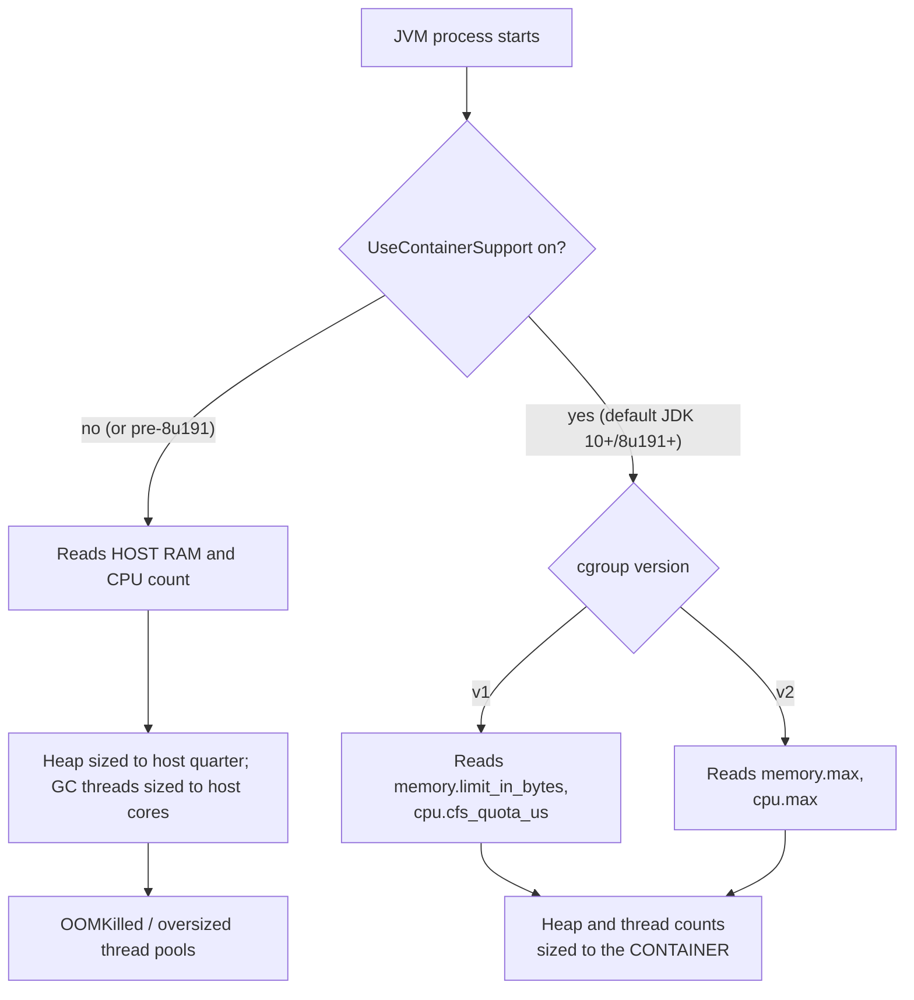
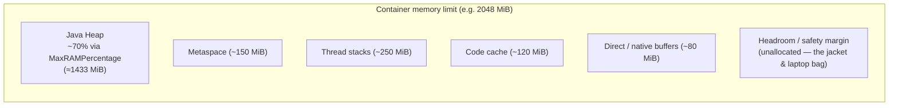
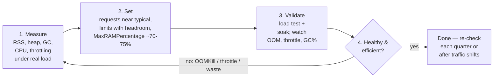

# JVM Container Right-Sizing

Walk into almost any Kubernetes cluster running JVM services and you will find the same two mistakes, side by side. One service is requesting 4 GiB and 2 vCPUs to run a workload that peaks at 900 MiB and 0.4 cores — quietly burning thousands of dollars a year in reserved-but-idle capacity. The service next to it is capped at 512 MiB, gets **OOMKilled** under load every few hours, and the team has been told "the JVM is leaky" when in fact the container is simply too small for the JVM's real footprint. **Right-sizing is the single highest-leverage knob a senior engineer owns that improves cost *and* reliability at the same time.** Over-provisioning wastes money (this ties directly into FinOps and capacity planning); under-provisioning causes OOMKills, CPU throttling, and GC death-spirals. Both are failures of the same skill: knowing how the JVM actually consumes the resources the orchestrator hands it.

The depth bar here is **the mechanism**: how the JVM discovers its container limits through cgroups, why hard-coding `-Xmx` is the wrong instinct in a container, why the heap is only *part* of the memory a JVM process consumes, how cgroup CPU quota silently reshapes GC and JIT behavior, and how to turn all of that into a defensible `requests`/`limits` block. We cover the measurement-and-iterate **method**, concrete flag configuration, and the failure modes — exit 137 vs `OutOfMemoryError`, CFS throttling, GC-thread explosion on fat nodes — with the diagnosis steps for each.

## Why Right-Sizing Is A Top Cost-And-Reliability Lever

In a bare-metal or single-tenant VM world, the JVM owned the whole machine. You sized the heap to the box, left the rest for the OS, and moved on. Containers broke that model. Now dozens of JVMs share a node, each fenced into a slice by **cgroups** (control groups), and the orchestrator schedules them based on what you *declare* you need (`requests`) and what you're *allowed* to use (`limits`). Get the declaration wrong and one of two things happens.

**Over-provisioning** is the quiet failure. The scheduler reserves your `requests` from the node's allocatable pool whether you use it or not. Request 4 GiB across 200 replicas and you've reserved 800 GiB of cluster memory — much of it idle. You pay for nodes you don't need. Nobody pages you, so nobody fixes it. This is exactly the waste FinOps practices exist to surface.

**Under-provisioning** is the loud failure. The container gets killed, throttled, or grinds to a halt under GC pressure — and because the symptoms (OOMKilled, latency spikes, slow startup) look like application bugs, teams burn days chasing the wrong cause.

The reason this is a *senior* responsibility, not a config-file footnote, is leverage. Memory and CPU `requests` are the inputs to cluster capacity and therefore to the cloud bill. A 30% over-request across a fleet of hundreds of replicas is a six-figure annual line item that no single team owns by default — it hides in the aggregate. At the same time, the under-provisioned services are the ones paging your on-call at 3 a.m. with OOMKill crash-loops. The same skill — knowing the JVM's true resource shape — fixes both the FinOps waste and the reliability pain. That dual payoff is rare, which is why it's worth doing deliberately.

> [!NOTE]
> A useful mental model: the cluster is a shared apartment building. `requests` is the floor space you've leased (reserved for you, billed to you, even empty). `limits` is the fire-code occupancy cap (exceed it and you get evicted). Right-sizing is leasing close to what you actually use, with just enough slack for the occasional party.

## How The JVM Sees A Container: cgroups And Container Awareness

The JVM does not magically know it's in a container. It reads the machine. Historically — before JDK 8u131 / JDK 9 — "the machine" meant the *host*. A JVM in a 512 MiB container on a 256 GiB node would call `Runtime.getMaxMemory()` based on host RAM, size its default heap to ~64 GiB (¼ of host), and get OOMKilled the instant it tried to grow. It read `Runtime.availableProcessors()` as the host's 64 cores and spun up GC and JIT threads for a machine it would never get.

The fix is **container awareness**, controlled by `-XX:+UseContainerSupport`. It became default and reliable in **JDK 10**, and was backported to **JDK 8u191**. Any modern LTS — 11, 17, 21, 25 — has it on by default. With it enabled, the JVM reads its limits from the cgroup filesystem instead of the host.

### cgroup v1 vs cgroup v2

The JVM reads different files depending on the cgroup version the host kernel exposes:

| Resource | cgroup v1 | cgroup v2 |
|----------|-----------|-----------|
| Memory limit | `memory.limit_in_bytes` | `memory.max` |
| CPU quota / period | `cpu.cfs_quota_us` / `cpu.cfs_period_us` | `cpu.max` (combined) |
| CPU shares (weight) | `cpu.shares` | `cpu.weight` |

By 2026, **cgroup v2 is the default** on essentially all current Linux distributions and managed Kubernetes (recent EKS, GKE, AKS node images ship v2). cgroup v1 awareness had real bugs — for example, certain kernel configs reported a misleading memory limit — that v2 and modern JDKs largely resolve. The practical takeaway: run a JDK that is at minimum 17 (ideally 21+) on a v2 host, and container detection "just works."

A subtlety worth internalizing: there are *two* memory numbers in a cgroup. The **limit** (`memory.max` / `memory.limit_in_bytes`) is the hard ceiling the OOMKiller enforces. The **request** you declared in Kubernetes becomes a *soft* reservation (`memory.low` on v2) — it doesn't cap anything, it tells the scheduler what to reserve and influences eviction order under node pressure. The JVM sizes its heap from the **limit**, not the request. So if you set `requests: 512Mi` and `limits: 2Gi`, `MaxRAMPercentage` computes against 2 GiB — a frequent surprise for engineers who assume the JVM honors the request.

One more historical trap: before container awareness, and still in some misconfigured setups, the JVM may read a memory limit that is the *host* value (a giant number like `9223372036854771712`, i.e. "unlimited"). If `os+container` logging shows an absurd limit, the JVM is not seeing the cgroup, and every downstream sizing decision is wrong.



> [!TIP]
> Confirm what your JVM actually sees with `java -Xlog:os+container=trace -version`. It prints the detected memory limit, CPU quota, and effective processor count. If those don't match your `limits`, container awareness is off or the JDK is too old — fix that *before* touching any other flag.

## Stop Hard-Coding `-Xmx`: Use `MaxRAMPercentage`

The reflex from the VM era is `-Xmx2g`. In a container this is brittle. The moment someone bumps the container `limit` from 2 Gi to 3 Gi to give the app breathing room, the heap stays pinned at 2 GiB — the extra gigabyte is reserved, paid for, and unused. Worse, if someone *lowers* the limit below 2 Gi, the JVM still tries for a 2 GiB heap and gets OOMKilled.

The container-native approach is to size the heap as a **percentage of the detected limit**:

- `-XX:MaxRAMPercentage=<n>` — cap heap at *n*% of the container memory limit.
- `-XX:InitialRAMPercentage=<n>` — initial heap as *n*% of the limit.
- `-XX:MinRAMPercentage` — *not* a minimum heap; it applies only when the container has very little memory (≤ ~256 MiB). A common gotcha: people set `MinRAMPercentage=50` expecting a floor and get nothing, because their container is larger than the threshold.

Now the heap tracks the limit automatically. Change the limit, the heap follows. One source of truth.

```bash
# Container-native heap sizing (heap = ~70% of the cgroup memory limit)
JAVA_TOOL_OPTIONS="-XX:MaxRAMPercentage=70.0 -XX:InitialRAMPercentage=70.0"
```

Setting `Initial == Max` is a deliberate production pattern: it commits the heap up front so the JVM doesn't pay for incremental growth (and surprise the node with a late memory spike). For a *batch* job where startup latency doesn't matter, you might leave them apart to start smaller.

## The Footprint People Forget: Heap ≠ Container Memory

Here is the mistake that causes most "but I set `-Xmx` to the container limit and it still OOMKilled" tickets. **The heap is not the JVM's total memory.** A JVM process's resident set (RSS — what the kernel and cgroup actually count against your limit) includes a substantial *non-heap* footprint:

- **Metaspace** — class metadata, off-heap, grows with the number of loaded classes (Spring apps load thousands). Often 100–300 MiB. Cap it with `-XX:MaxMetaspaceSize`.
- **Thread stacks** — each thread reserves ~1 MiB by default (`-Xss`). A service with 400 threads (Tomcat pools, async clients, GC, JIT) is ~400 MiB before any application object exists.
- **Code cache** — JIT-compiled native code, up to `-XX:ReservedCodeCacheSize` (240 MiB default).
- **GC structures** — card tables, remembered sets, marking bitmaps. G1/ZGC bookkeeping scales with heap size; can be several percent of heap.
- **Direct / native buffers** — `ByteBuffer.allocateDirect`, Netty pooled buffers, memory-mapped files. Bounded loosely by `-XX:MaxDirectMemorySize` but easy to forget. Heavy network services (gRPC, Kafka clients) live here.
- **Thread-local allocation, JNI, malloc arenas, the JVM's own C-heap.**



> [!IMPORTANT]
> Think of the container limit as the **overhead bin** on a plane. The heap is your rolling suitcase. But you also have to fit your jacket and laptop bag (metaspace, stacks, code cache, native buffers) in the *same* bin. If you size the suitcase to fill the entire bin, the jacket has nowhere to go — and the result isn't "please repack." The result is the airline taking the whole bag away from you (OOMKill). Leaving the heap at ~70–75% of the limit is reserving room for the jacket on purpose.

This is *why* `MaxRAMPercentage` defaults to a value well under 100 and why ~70–75% is the common production starting point: the remaining 25–30% is for the non-heap footprint plus a margin. For a memory-light service you can push to 80%; for a native-buffer-heavy one (Netty, lots of direct memory) you may need 60% or an explicit `MaxDirectMemorySize` budget.

The right percentage also depends on the **GC algorithm**, because each collector trades memory for different things:

- **G1GC** (default since JDK 9) — moderate off-heap bookkeeping (remembered sets scale with how cross-region your object graph is). A good general default; ~70–75% works.
- **Parallel GC** — minimal bookkeeping, highest throughput, longest pauses; you can run a slightly higher heap percentage.
- **ZGC / Shenandoah** — low-pause concurrent collectors, but they keep *more* off-heap metadata and (for some configurations) reserve extra address space; budget a bit more headroom, i.e. a lower `MaxRAMPercentage`. ZGC in particular is generous with virtual memory, which can alarm people reading `VIRT` — but `VIRT` is not what the cgroup counts; the working set is.

The lesson: don't copy a percentage from a blog post written for a different collector and workload. Derive it from *your* Native Memory Tracking output.

> [!TIP]
> To see the breakdown empirically, enable **Native Memory Tracking**: start with `-XX:NativeMemoryTracking=summary`, then run `jcmd <pid> VM.native_memory summary`. It itemizes heap, metaspace, thread, code, GC, and internal usage so you can size headroom from data instead of folklore.

## CPU: How cgroup Quota Reshapes GC, JIT, And Thread Pools

Memory gets the attention; CPU quietly causes just as much pain. Two distinct cgroup CPU controls exist, and they behave very differently:

- **CPU shares / weight** (`cpu.shares`, `cpu.weight`) — a *relative* priority used only when the node is contended. It does **not** cap you. In Kubernetes, this is set from your CPU **`requests`**.
- **CPU quota** (`cpu.cfs_quota_us` / `cpu.max`) — a *hard ceiling*. Within each ~100 ms CFS period, your container may run for `quota` microseconds of CPU time; once spent, every thread is **throttled** (frozen) until the next period. In Kubernetes, this is set from your CPU **`limits`**.

The JVM reads the quota to compute its **effective processor count**, which drives a cascade of internal sizing decisions:

- **GC threads** — `ParallelGCThreads` and `ConcGCThreads` scale with processor count.
- **JIT compiler threads** — C1/C2 compiler thread counts.
- **The common ForkJoinPool** — `ForkJoinPool.commonPool()`, used by parallel streams and many libraries, sizes to `availableProcessors() - 1`.
- Countless libraries that call `Runtime.availableProcessors()` to size their own pools (connection pools, Netty event loops, etc.).

So a CPU limit isn't just a throughput cap — it reshapes the JVM's concurrency from the inside.

### The CFS Throttling Trap

Here is the dangerous part. Suppose you set `cpu.limit = 1` (one core's worth of quota) but the JVM still detects, say, 4 logical processors from the node and sizes its parallel work for 4. During a burst — a GC pause, a flood of parallel-stream work — the JVM tries to use 4 cores' worth of CPU. It burns its 100 ms quota in ~25 ms of wall-clock time, and the CFS scheduler **freezes all of its threads for the remaining 75 ms**. The result is brutal **tail-latency spikes**: p50 looks fine, p99 is a cliff, and it correlates with nothing the application is doing.

> [!WARNING]
> CPU throttling is invisible in average CPU graphs. A container can show "40% CPU" *and be heavily throttled* if its usage is bursty within each 100 ms window. Always graph the throttling metric directly: `container_cpu_cfs_throttled_periods_total / container_cpu_cfs_periods_total`. If a meaningful fraction of periods are throttled, your CPU `limit` is too low (or you should remove the limit and rely on `requests` + headroom).

A widely used pattern for latency-sensitive JVM services is to set CPU **`requests`** generously (so the scheduler reserves real capacity and the JVM sizes its threads sanely) and set the CPU **`limit` high or omit it entirely**, avoiding hard CFS throttling while still being protected against noisy neighbors by the `requests`-derived shares. (This is a deliberate trade-off — it gives up the hard isolation a limit provides, so it suits trusted, well-behaved workloads, not untrusted multi-tenant ones.)

It helps to know the conversions Kubernetes performs. A CPU `request` of `1000m` (one core) becomes `cpu.shares = 1024` on cgroup v1 (`cpu.weight` is scaled on v2) — a *relative* slice that only bites under contention. A CPU `limit` of `1000m` becomes a quota of `100000µs` per `100000µs` period — a *hard* ceiling. Two fractional values matter for the JVM's processor detection: with only a limit set, the JVM rounds the quota up to a whole number of processors (`ceil(quota/period)`); on a fractional limit like `500m` it may see 1 processor and size pools accordingly. When you need the JVM's thread sizing to be deterministic regardless of how the cgroup math rounds, pin it explicitly with `-XX:ActiveProcessorCount=N`.

## A Practical Right-Sizing Method

Right-sizing is not a one-shot calculation; it's a measurement loop. Guessing a number and shipping it is how you end up in either failure mode.



**1. Measure actual usage.** Run the service under realistic load (production, or a load test that mirrors it). Collect: RSS (`container_memory_working_set_bytes` is the figure the OOMKiller uses — *not* `rss` alone), heap usage after GC, GC pause time and frequency, CPU usage, and the CFS throttle ratio. Let it soak — metaspace and caches grow over hours.

**2. Set the numbers.**
- **Memory `requests`** ≈ typical working set (steady-state RSS). This is what the scheduler reserves; you want it close to reality.
- **Memory `limit`** ≈ peak working set + headroom (often request × 1.2–1.5, or peak + a fixed margin). For the JVM, set `requests == limits` for memory: the JVM commits its heap and doesn't benefit from burstable memory, and a tight `requests`/`limits` ratio keeps you in Kubernetes' **Guaranteed** QoS class (last to be evicted under node pressure).
- **`MaxRAMPercentage`** ≈ 70–75% to start, adjusted from your Native Memory Tracking breakdown.
- **CPU `requests`** ≈ typical usage with room for parallel bursts; this also feeds the JVM's processor detection (back it with `-XX:ActiveProcessorCount=N` if you need to pin GC/pool sizing independent of the cgroup).
- **CPU `limit`** — high or omitted for latency-sensitive services to avoid throttling.

**3. Validate under load.** Re-run the load test with the new numbers. Confirm: no OOMKills, throttle ratio near zero, GC overhead acceptable (e.g. < 5% of wall-clock in pauses), and headroom holding during peak.

**4. Iterate and re-check.** Traffic patterns, dependency versions, and library defaults drift. Re-validate quarterly or after any significant change.

### Concrete Configuration

```yaml
# Kubernetes Deployment excerpt — a right-sized latency-sensitive JVM service
resources:
  requests:
    memory: "1536Mi"   # ≈ measured steady-state working set
    cpu: "1500m"       # generous: reserves real CPU, sizes JVM thread pools
  limits:
    memory: "1536Mi"   # == requests → Guaranteed QoS; JVM commits heap anyway
    cpu: "3000m"       # high (or omit) to avoid CFS throttling on bursts
env:
  - name: JAVA_TOOL_OPTIONS
    value: >-
      -XX:MaxRAMPercentage=70.0
      -XX:InitialRAMPercentage=70.0
      -XX:MaxMetaspaceSize=256m
      -XX:MaxDirectMemorySize=128m
      -XX:+UseG1GC
      -XX:+ExitOnOutOfMemoryError
      -Xlog:gc*:file=/var/log/gc.log:time,uptime:filecount=5,filesize=10m
```

```java
// What the JVM actually sees at runtime — log this at startup to verify sizing.
public final class RuntimeFootprint {
    public static void main(String[] args) {
        Runtime rt = Runtime.getRuntime();
        long maxHeap = rt.maxMemory();               // reflects MaxRAMPercentage of the cgroup limit
        int procs    = rt.availableProcessors();     // reflects cgroup CPU quota, NOT host cores
        System.out.printf("maxHeap=%d MiB, availableProcessors=%d%n",
                maxHeap / (1024 * 1024), procs);
        // ForkJoinPool.commonPool() will size to (procs - 1) — verify it matches your CPU limit.
    }
}
```

> [!NOTE]
> **In Practice:** the most reliable single guardrail is `-XX:+ExitOnOutOfMemoryError`. When the JVM hits a *Java* heap exhaustion, the default behavior is to throw `OutOfMemoryError` and limp along in an unknown state. `ExitOnOutOfMemoryError` makes the process die immediately so Kubernetes restarts it cleanly — turning a murky, half-broken pod into a clean crash-loop signal you can actually alert on.

### A Worked Example

Suppose Native Memory Tracking and a multi-hour soak on a Spring Boot service report, under peak load:

| Component | Measured |
|-----------|----------|
| Heap (live after GC) | ~950 MiB peak |
| Metaspace | ~180 MiB |
| Thread stacks (~250 threads) | ~250 MiB |
| Code cache | ~110 MiB |
| Direct buffers (HTTP client, Kafka) | ~90 MiB |
| GC + internal + malloc | ~120 MiB |
| **Total RSS (working set) peak** | **~1.7 GiB** |

The non-heap footprint is ~750 MiB — roughly 44% of RSS. That is the number people forget. If you'd sized a 1.7 GiB limit with `-Xmx1.7g`, the heap alone would be fine but RSS would blow straight past the limit → exit 137.

Right-sizing instead: set the **limit to ~2 GiB** (1.7 peak + ~15% headroom for spikes and the OS page cache the kernel charges to the cgroup), and `MaxRAMPercentage=70` → heap cap ≈ 1.4 GiB, comfortably above the 950 MiB live set with room for allocation bursts, while leaving ~600 MiB for the non-heap footprint. Set `requests == limits` for Guaranteed QoS. The heap fits; the jacket and laptop bag fit; the bin closes.

## Failure Modes And Diagnosis

### OOMKilled (Exit 137) ≠ Java `OutOfMemoryError`

These look similar and are completely different events — confusing them sends teams down the wrong path.

- **OOMKilled (exit 137)** is the **Linux kernel** killing the whole process because the cgroup's *total* memory (RSS, all of it — heap + non-heap + native) exceeded `memory.max`. There is no Java stack trace; the JVM never got to react. `kubectl describe pod` shows `Reason: OOMKilled`, `Exit Code: 137` (128 + SIGKILL's signal 9). This is the **container** running out of room. *The airline confiscated the entire bag — it didn't ask you to repack.*
- **Java `OutOfMemoryError`** is the **JVM** failing to allocate within the *Java heap* (or metaspace, or direct memory) and throwing a catchable error *with* a stack trace and usually a heap dump. The container had room; the JVM's own heap was the constraint.

**Diagnosis:** check the exit reason and code first. Exit 137 + no Java error → the limit is too small for the JVM's *total* footprint, or heap percentage too high (the non-heap footprint pushed RSS over). Lower `MaxRAMPercentage` or raise the limit. A Java `OutOfMemoryError` → a genuine application/heap issue (leak, undersized heap for the workload) — analyze the heap dump (`-XX:+HeapDumpOnOutOfMemoryError`). The fixes are opposite: one is a container/percentage problem, the other is an application/heap problem.

**Real-world scenario.** A team migrated a service from VMs to Kubernetes, kept `-Xmx1g`, and set `limits.memory: 1Gi` — "the heap is 1 GiB, so 1 GiB is enough." Pods began OOMKilling within minutes of taking traffic, with no `OutOfMemoryError` anywhere. The cause: the 1 GiB *heap* plus ~600 MiB of metaspace, stacks, and direct buffers meant RSS wanted ~1.6 GiB against a 1 GiB ceiling. The team's first instinct — "add replicas" — made it worse (every replica did the same thing). The fix was mechanical once the model was right: raise the limit to 2 GiB and switch to `MaxRAMPercentage=70`. The "leak" was a sizing arithmetic error.

### CPU Throttling

**Symptom:** intermittent p99/p999 latency spikes uncorrelated with traffic; average CPU looks moderate. **Diagnosis:** graph `container_cpu_cfs_throttled_periods_total` ratio. **Fix:** raise or remove the CPU `limit`; ensure `requests` reserves enough; pin `-XX:ActiveProcessorCount` so the JVM doesn't size threads for cores it can't use.

### GC-Thread Explosion On Fat Nodes

**Symptom:** a small container scheduled onto a 64- or 96-core node spawns dozens of GC and JIT threads, each grabbing ~1 MiB of stack, inflating RSS and causing context-switch overhead and surprise OOMKills — even though the app barely uses CPU. **Cause:** container awareness off, or the JVM sizing threads to detected cores that exceed the *quota*. **Fix:** modern JDK with `UseContainerSupport`; if needed, cap with `-XX:ActiveProcessorCount=N`, `-XX:ParallelGCThreads`, `-XX:ConcGCThreads`.

### Slow Startup From CPU Starvation (The Warmup Tax)

**Symptom:** a service takes 60–90 s to pass its readiness probe, fails liveness checks, gets killed and restarted before it ever serves traffic, and crash-loops. **Cause:** the JVM does heavy work at startup — classloading, JIT compilation (C1 then C2), framework wiring — that is CPU-bound. A CPU `limit` of `250m` chokes this work; the JIT compiler threads are throttled exactly when you most need throughput. **Fix:** give CPU headroom *during startup*. Patterns include a higher `limit` than steady-state would suggest, startup/liveness probes with generous `initialDelaySeconds` and `failureThreshold`, and on platforms that support it, Kubernetes **startup probes** (which gate liveness until the app is up) or a sidecar-free CPU "boost". This is also where AOT/CDS (Application Class Data Sharing) and newer warmup-reduction features earn their keep — they cut the startup CPU bill. The right-sizing lesson: a CPU limit tuned only for steady-state can be *too small for startup*, and the failure looks like a crash-loop rather than throttling.

### The Memory-Limit-Too-Low Death Spiral

**Symptom:** as the heap approaches its (too-small) ceiling, the GC runs more and more frequently, reclaiming less each time. CPU vanishes into garbage collection, throughput collapses, latency climbs — and the JVM may *not* OOMKill cleanly; it just thrashes. This is the GC death-spiral. **Diagnosis:** GC logs showing rising GC frequency and falling reclaimed bytes; "GC overhead limit exceeded" is the explicit version. **Fix:** the heap genuinely needs more room — raise the limit and/or `MaxRAMPercentage`. Do *not* "fix" it by adding more replicas; each new replica spirals the same way.

> [!INTERVIEW]
> A common senior-level prompt: *"Your Java service is getting OOMKilled in Kubernetes but you don't see any `OutOfMemoryError` in the logs. Walk me through it."* A strong answer (a) distinguishes kernel OOMKill / exit 137 from a Java `OutOfMemoryError`, (b) explains that RSS = heap **plus** metaspace, thread stacks, code cache, and native/direct buffers — so a heap sized to the full limit overflows, (c) names `MaxRAMPercentage` (~70%) and the headroom rationale, (d) mentions verifying container awareness and reading the real breakdown via Native Memory Tracking, and (e) notes `ExitOnOutOfMemoryError` as the clean-restart guardrail. Bonus points for raising CFS throttling as the CPU-side analogue.

## Practice

1. **Container-awareness audit.** Run `java -Xlog:os+container=trace -version` in one of your service images. Do the detected memory and CPU match the pod's `limits`? If not, why?
2. **Footprint breakdown.** Enable `-XX:NativeMemoryTracking=summary` on a service and run `jcmd <pid> VM.native_memory summary` under load. What fraction of RSS is non-heap? Does your `MaxRAMPercentage` leave enough room?
3. **Over-provisioning hunt.** For your five largest deployments, compare `container_memory_working_set_bytes` peak against the memory `request`. Estimate the reserved-but-idle memory and its monthly cost.
4. **Throttle check.** Graph the CFS throttle ratio for a latency-sensitive service. Is it being throttled? Correlate with p99 latency.
5. **`-Xmx` to percentage refactor.** Take a service that hard-codes `-Xmx` and convert it to `MaxRAMPercentage`. Validate the heap tracks a changed `limit`.
6. **OOMKill triage drill.** Given a pod with `Exit Code: 137` and no `OutOfMemoryError`, write the diagnosis-and-fix steps. Then do the same for a pod *with* an `OutOfMemoryError`.
7. **Right-sizing loop end-to-end.** Pick one service. Measure, set new `requests`/`limits`/percentage, load-test, and report the before/after on cost (reserved capacity) and reliability (OOMs, throttle, GC overhead).
8. **The skeptic conversation.** A teammate says "just give every JVM 4 GiB and 2 cores, memory is cheap." Write a 200-word response covering cluster cost, scheduler reservation, and why bigger isn't automatically safer (GC-thread explosion, hidden throttling).

## Recap

You should now be able to:

- Explain **why right-sizing is a top cost-and-reliability lever** and how over- vs under-provisioning each fail.
- Describe how the JVM reads its limits via **cgroups** (v1 vs v2) under **`UseContainerSupport`** (default JDK 10+/8u191+), and verify it with `os+container` logging.
- Replace hard-coded `-Xmx` with **`MaxRAMPercentage`/`InitialRAMPercentage`**, and avoid the `MinRAMPercentage` gotcha.
- Account for the **non-heap footprint** — metaspace, thread stacks, code cache, GC structures, direct/native buffers — and explain why heap ≠ container memory and why ~70–75% leaves the right headroom.
- Explain how **cgroup CPU quota vs shares** maps to JVM processor detection, GC/JIT threads, and the common ForkJoinPool, and recognize **CFS throttling** as a tail-latency cause.
- Apply Kubernetes **`requests` vs `limits`** correctly, including the Guaranteed-QoS and throttling implications.
- Run the **measure → set → validate → iterate** right-sizing loop with concrete JVM flags and a `resources` block.
- Diagnose the failure modes: **OOMKilled (137) vs Java `OutOfMemoryError`**, CPU throttling, GC-thread explosion on fat nodes, and the memory-too-low GC death-spiral.

## Next

Continue to [Spot & Preemptible Patterns](./T16-spot-and-preemptible-patterns.md) — running JVM workloads on interruptible capacity for the next tier of cost savings, and the graceful-shutdown and rebalancing patterns that make it safe.
