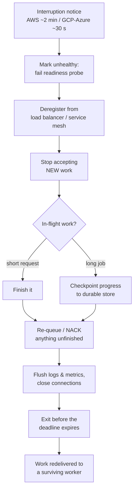
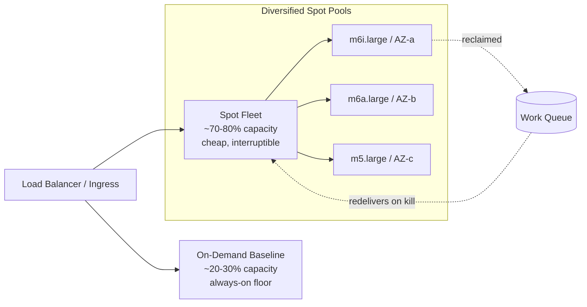

# Spot & Preemptible Instance Patterns

Cloud providers run vast fleets, and at any moment a large fraction sits idle — bought capacity nobody is renting yet. Rather than let it earn nothing, they sell it at a steep discount with one catch: **they can take it back at any moment, with only seconds to a couple of minutes of warning.** This is *spot* capacity (AWS), *Spot VMs* / *preemptible VMs* (GCP), and *Spot Virtual Machines* (Azure). The discount is enormous — frequently **60–90% off** the equivalent on-demand price — but the machine is borrowed, not owned.

The mental model: spot instances are **standby airline seats.** Far cheaper than a confirmed booking, but if a full-fare passenger shows up, you get bumped. If your trip can absorb being bumped — you're flexible on the flight, you packed light, you can re-book in minutes — standby is a fantastic deal. If you *must* be on the 9 a.m. flight to make a wedding, you pay for the confirmed seat. The senior craft is knowing **which of your workloads are wedding-bound and which are happy on standby** — and engineering the standby ones so a bump costs seconds, not hours.

This topic completes the cost-efficiency cluster of this chapter. The depth bar is **the design discipline of building for interruption**: how reclamation actually works, how the JVM should react to the termination signal, and the fleet-level patterns (diversification, on-demand baselines, queue-backed workers, Kubernetes node pools) that let you run real production load on borrowed machines without your users ever noticing.

## What Spot & Preemptible Capacity Actually Is

A cloud region's physical capacity is finite. On-demand and reserved customers have first claim; whatever is unsold at any instant can be rented out as spot. Because that pool **rises and falls with real demand**, the provider reserves the right to **reclaim** a spot instance the moment a higher-priority customer needs the hardware (or the spot price moves past your bid, on the older AWS pricing model).

The trade in one sentence: **you accept that the machine can vanish on short notice; in exchange you pay a fraction of the price.**

The reclamation contracts differ by provider, and the exact numbers matter for design:

| Provider | Product | Reclamation warning | Notes (as of 2026) |
|---|---|---|---|
| AWS | EC2 Spot | **~2-minute** Spot interruption notice; also a *rebalance recommendation* that often arrives earlier | No fixed price-bid required anymore; you pay the current spot price |
| GCP | Spot VMs (successor to Preemptible VMs) | **~30-second** preemption notice via `ACPI G2 soft-off` | Legacy *Preemptible VMs* had a hard 24-hour cap; Spot VMs removed the cap |
| Azure | Spot Virtual Machines | **~30-second** eviction notice via Scheduled Events | Evict by price or by capacity; you set a max price |

> [!IMPORTANT]
> The warning window is short and **not guaranteed**. AWS publishes "about 2 minutes"; GCP and Azure publish "about 30 seconds." Treat these as *best-effort* — occasionally a node disappears with no usable notice at all (hardware failure, or the signal not draining in time). Your design must survive a *hard kill*, and merely be *more graceful* when the notice arrives. Never build a system whose correctness depends on receiving the warning.

A second subtlety worth hedging: the headline "60–90% off" is a **typical range, not a contract.** Discounts vary by instance family, region, and current demand; a scarce GPU family during peak hours may be discounted far less, and prices move. Always read live pricing, not a remembered number.

### How The Model Evolved — From Auction Bids To Steadier Pricing

It helps to know where this came from, because old blog posts describe a world that no longer exists. AWS launched **EC2 Spot in 2009** as a true **auction**: you submitted a *bid price*, and your instance ran as long as the live spot price stayed below your bid — the moment it crossed, you were terminated, sometimes with violent price spikes. That made spot famously volatile and scary. In **2017–2018 AWS smoothed this out**: prices now move gradually based on long-term supply/demand, the bid is effectively a *max price* (default: the on-demand price), and most interruptions are driven by **capacity reclamation** rather than price crossings. The 2-minute interruption notice and later the *rebalance recommendation* were added to give workloads time to react.

GCP's story parallels this: the original **Preemptible VMs** were dirt-cheap but had a **hard 24-hour lifespan** and a flat discount. GCP later introduced **Spot VMs** that **removed the 24-hour cap** and use dynamic (but bounded, less volatile) pricing — Preemptible VMs are now the legacy product. Azure's **Spot VMs** let you evict on *price* or *capacity* and surface eviction through Scheduled Events.

> [!NOTE]
> The practical takeaway from this history: **modern spot is far steadier than its reputation.** Reclamation today is mostly "the provider needs the hardware back," not "you got outbid in a price war." But the *design obligation* is unchanged — you still must survive the machine vanishing. The pricing got friendlier; the interruption guarantee did not.

## The Core Design Principle: Build For Interruption

Everything about running on spot reduces to one principle: **assume the machine will be killed mid-flight, and make that survivable.** This is the *power-cut* analogy — a game that autosaves every few seconds turns a power outage into a five-second annoyance; a game with no saves turns it into hours of lost progress. Spot engineering is autosaving your work so a reclamation costs seconds, not a re-run.

Three properties make a workload survivable:

- **Stateless** — the instance holds no unique, unrecoverable state. Anything durable lives in a database, object store, or queue, not on the local disk or in-process memory.
- **Idempotent** — if the same unit of work runs twice (because the first attempt was killed and re-queued), the result is the same. No double-charges, no duplicate emails.
- **Checkpointable or short** — either each unit is short enough to lose-and-redo cheaply, or long work periodically writes a checkpoint it can resume from.

Map your workloads against this and a clear split appears:

| Great fit for spot | Poor fit for spot |
|---|---|
| Batch / ETL jobs that re-run cleanly | A database **primary** holding the only copy of data |
| CI/CD build and test runners | A stateful service that is the **leader** in a consensus group |
| Stateless web/API tier behind a load balancer | Long, non-resumable computations with no checkpointing |
| Queue-backed workers (SQS/Kafka consumers) | Anything where a single in-flight loss corrupts state |
| Fault-tolerant data processing (Spark, Flink with checkpoints) | Sticky-session servers holding in-memory user state |
| ML training that checkpoints to object storage | A workload that can't tolerate even a few minutes of reduced capacity |

> [!NOTE]
> "Stateful" does not automatically mean "no spot." A Kafka or Cassandra cluster *is* stateful, yet many teams run **followers/replicas** on spot while keeping the leader on on-demand — because the data is replicated, losing a follower is a re-sync, not a data loss. The real test is not "is there state?" but **"is this instance the sole custodian of unrecoverable state?"**

## The Mechanism Of Handling Interruption Gracefully

When the reclamation notice arrives, a well-built service runs a **drain** sequence. This is the same machinery as ordinary graceful shutdown (see the SIGTERM / PID-1 story in [Health Checks & Readiness/Liveness Probes](../../L4-backend-engineering/C10-devops-and-observability/T14-health-checks-and-readiness-liveness-probes.md)) — spot interruption is just graceful shutdown with a stopwatch running.



The order matters: **stop taking new work first** (so the in-flight set stops growing), deregister so the load balancer routes elsewhere, finish or checkpoint what's left, then exit *before* the deadline — because if you don't exit cleanly, the provider sends a hard kill anyway.

There's a subtle race worth calling out: marking yourself unready and *actually being removed from the load balancer's rotation* are not simultaneous. The endpoint controller and the LB are **eventually consistent** — for a brief window after you fail readiness, new requests may still arrive. That's why the `preStop` `sleep` exists: it holds the pod alive a few extra seconds *after* deregistration starts, so in-flight and just-arrived requests drain to completion before `SIGTERM` lands. Skip it and you'll see a small but real spike of dropped requests on every reclamation — exactly the kind of low-frequency, hard-to-reproduce error that costs hours of debugging later.

### The JVM Side: Catching The Signal

On Linux the provider's notice ultimately surfaces as a process **`SIGTERM`** (after the orchestrator translates the cloud event). The JVM turns that into running its **shutdown hooks**. The classic trap is the *PID-1 problem*: if the JVM is PID 1 in a container and you don't either run an init (`tini`, `--init`) or handle the signal, `SIGTERM` is silently dropped and you get a hard `SIGKILL` with zero draining. Get the signal plumbing right first; the Java code below assumes the signal actually reaches the process.

```java
public final class GracefulSpotShutdown {

    // Bounded so we always exit BEFORE the provider's deadline.
    // 25s budget leaves margin under a 30s GCP/Azure window.
    private static final Duration DRAIN_BUDGET = Duration.ofSeconds(25);

    public static void install(WorkerPool pool, HealthState health, JobQueue queue) {
        Runtime.getRuntime().addShutdownHook(new Thread(() -> {
            // 1. Fail readiness so the LB / k8s endpoint controller drops us.
            health.markNotReady();

            // 2. Stop pulling NEW work; let in-flight tasks keep running.
            pool.stopAcceptingNewWork();

            // 3. Wait for in-flight work, but never past the budget.
            boolean drained = pool.awaitInFlight(DRAIN_BUDGET);

            // 4. Anything not finished goes back on the queue for a survivor.
            //    Idempotency makes redelivery safe.
            if (!drained) {
                queue.requeueUnfinished(pool.snapshotInFlight());
            }

            // 5. Flush observability and close resources.
            Metrics.flush();
            Logs.flush();
            pool.closeConnections();
        }, "spot-drain"));
    }
}
```

> [!TIP]
> Always make the drain **time-boxed and idempotent**, not "drain until done." Under a 30-second GCP/Azure window you cannot afford to wait on a slow request — you mark it unfinished, re-queue it, and exit. The combination *idempotent work + re-queue on interrupt* means a killed worker is a non-event: another worker simply picks up the message. This is why **queue-backed workers are the single most robust spot pattern.**

#### Budgeting The Drain Against The Clock

The drain budget is not arbitrary — it's the warning window minus margin for everything that *isn't* your code. A realistic breakdown under AWS's ~2-minute window for a Kubernetes pod:

| Phase | Rough cost | Who owns it |
|---|---|---|
| Cloud event → orchestrator detects → cordon/drain | ~5–15 s | node-termination handler |
| `preStop` hook (e.g. `sleep 5` so the LB deregisters) | ~5 s | your pod spec |
| LB / endpoint controller actually stops routing | ~5–10 s | platform, eventually consistent |
| **Your drain hook** (finish/checkpoint/re-queue) | **the remainder** | your code |
| Final flush + clean exit | ~2–3 s | your code |

The lesson: under a 30-second GCP/Azure window there is **very little remainder** after the platform takes its share — sometimes only a handful of seconds. That's why short, idempotent, re-queueable units win: you don't *need* much remainder if "unfinished" simply means "redelivered." Don't set a drain budget equal to the warning window; set it to the window *minus* the platform overhead above, and verify empirically.

### Reacting To The Cloud Event, Not Just SIGTERM

You often want to start draining the moment the *cloud* signals intent — earlier than the orchestrator's `SIGTERM`. Each provider exposes the notice on the instance metadata service or an events channel:

```bash
# AWS: poll instance metadata for the spot interruption notice (IMDSv2)
TOKEN=$(curl -sX PUT "http://169.254.169.254/latest/api/token" \
  -H "X-aws-ec2-metadata-token-ttl-seconds: 60")
curl -s -H "X-aws-ec2-metadata-token: $TOKEN" \
  http://169.254.169.254/latest/meta-data/spot/instance-action
# -> {"action":"terminate","time":"2026-06-15T10:32:00Z"}  (else 404)

# GCP: the preemption flag flips to TRUE shortly before the 30s shutdown
curl -s -H "Metadata-Flavor: Google" \
  "http://metadata.google.internal/computeMetadata/v1/instance/preempted"
# -> TRUE
```

In Kubernetes you rarely poll this yourself — a **node-termination handler** (AWS Node Termination Handler, or a cloud-provider equivalent) watches the metadata/events endpoint and **cordons + drains** the node, which sends `SIGTERM` to your pods and runs their `preStop` hooks. Your job is to make the pod *react well* to that drain.

### Advanced: Checkpoint/Restore To Resume Instantly

For long, expensive in-memory state (a warmed JIT, a big cache, partial ML training), losing it to a kill is wasteful. Two complementary tools:

- **Application checkpointing** — periodically persist progress (offsets, partial aggregates, model weights) to durable storage so a fresh worker resumes near where the killed one stopped. This is the "autosave every few minutes" pattern, and it's the workhorse of frameworks like Spark and Flink.
- **CRaC (Coordinated Restore at Checkpoint)** — an OpenJDK project (mainstream in recent JDKs, with strong Azul/Spring support by ~2026) that snapshots a *running, warmed-up* JVM to disk and restores it in tens of milliseconds. On spot, the angle is **fast replacement**: a reclaimed worker is replaced by a CRaC-restored image that's already warm, shrinking the window of reduced capacity. CRaC has real constraints (open files/sockets must be closed via the `Resource` API at checkpoint), so treat it as an advanced optimization, not a default.

### What A Reclamation Actually Costs You In Memory & Warm-Up

The reason a JVM workload feels the sting of interruption more than, say, a Go binary is the **warm-up tax.** A freshly launched JVM starts cold: the JIT is interpreting bytecode, hot methods aren't compiled yet, the heap and metaspace are unpopulated, connection pools and caches are empty. For the first seconds-to-minutes the replacement worker runs at a *fraction* of steady-state throughput while the JIT profiles and recompiles hot paths and the OS page cache fills. **Every reclamation throws away that warmth** and forces a new worker to pay the tax again.

This has three concrete design consequences on spot:

- **Right-size the local working set you'll lose.** A worker holding a 20 GB in-memory cache is far more expensive to lose-and-rebuild than one holding 200 MB. Push large, reusable state into a shared cache (Redis/Memcached) or object store so a kill loses *compute*, not *data*. This is the same "sole custodian of unrecoverable state" test applied at the memory level.
- **Keep replacements warm.** Either over-provision slightly so the fleet's aggregate warmth never drops to zero on a single reclamation, or use CRaC/snapshotting so a replacement starts warm. The on-demand baseline doubles as a *warmth floor* — those nodes are never reclaimed, so their JITed, cache-populated state is always there.
- **Measure interruption as throughput, not just count.** "We lost 3 spot nodes today" understates the impact if each replacement spent two minutes at half throughput. Track *effective capacity over time*, not raw node count, so the warm-up cost is visible to capacity planning.

## Patterns To Run Safely On Spot

A single spot pool is fragile — if that exact instance type in that exact AZ gets reclaimed en masse, your whole fleet evaporates at once. Production spot usage is about **spreading risk** and **keeping a floor**.

Back to the airline analogy: a seasoned standby flyer doesn't pin their hopes on one overbooked flight. They check several flights to the same city, keep enough cash for a confirmed seat if every standby falls through, and pack so a re-route costs them nothing. Diversified pools are the several flights; the on-demand baseline is the confirmed-seat fallback; stateless, queue-backed work is the light packing. Each pattern below is one of those habits made concrete.



The patterns, in rough priority order:

- **Diversify across instance types and AZs.** Don't bet on one capacity pool. AWS Spot Fleet / Auto Scaling Groups with a *capacity-optimized* allocation strategy pull from the **deepest, least-likely-to-be-reclaimed** pools across many families and zones. More pools = more graceful degradation when one dries up.
- **Mix spot with an on-demand baseline.** Keep a floor (commonly ~20–30%, but tune to your risk tolerance) on on-demand or reserved capacity so a mass reclamation degrades you, never zeroes you. Burst the rest on spot.
- **Put a queue between producers and workers.** A killed worker just fails to ack; the message is redelivered to a survivor. This turns interruption from an incident into a no-op — the strongest single lever.
- **Use capacity rebalancing.** AWS *Capacity Rebalancing* acts on the **rebalance recommendation** (which often precedes the 2-minute notice) to proactively launch a replacement *before* the old node dies, so you're never caught short.
- **Lean on the right autoscaler.** **Karpenter** (AWS) provisions right-sized nodes from diversified spot pools and handles interruption natively; the **Cluster Autoscaler** works with mixed-instance node groups. Pair with the **node-termination handler** so pod drains happen on every reclamation. This is the cost-side complement to the scale-out/scale-in machinery in [Scaling (Autoscaling, Statelessness)](../C02-distributed-systems-and-system-design/T12-scaling-horizontal-vertical-autoscaling-statelessness.md).

### Allocation Strategy: Why "Cheapest" Is The Wrong Default

The single most common spot mistake is optimizing the *allocation strategy* for price instead of stability. AWS offers (roughly) a *lowest-price* strategy and a *capacity-optimized* (or *price-capacity-optimized*) strategy:

- **lowest-price** crams your fleet into the cheapest pool *right now*. That pool is cheap *because* it's in light demand — which often means it's also small, so when demand returns you get reclaimed in a wave. You optimized for the wrong variable.
- **capacity-optimized / price-capacity-optimized** picks from the **deepest** pools (the most spare capacity), which are statistically the *least* likely to be reclaimed, accepting a slightly higher price for materially fewer interruptions.

For most production fleets, **fewer interruptions is worth more than a marginally lower hourly rate** — every reclamation has a warm-up tax and a small reliability dent. The airline analogy: you don't want the single cheapest standby seat on the most overbooked flight; you want a cheap-enough seat on a flight with empty rows, where you're least likely to get bumped.

### Anti-Patterns To Avoid

- **All-spot, no floor.** A 100% spot fleet can drop to *zero* capacity in a regional crunch. Always keep an on-demand or reserved baseline.
- **Spot for the database primary, cache leader, or consensus leader.** Losing the sole custodian of unrecoverable state is a data-loss or split-brain incident, not a re-queue.
- **Depending on the warning.** Code that only cleans up *if* it receives the 2-minute notice corrupts state the day the notice doesn't arrive. Survive the hard kill first; treat the notice as a *bonus* that makes shutdown graceful.
- **One instance type, one AZ.** That's a single capacity pool wearing a spot costume — it can vanish all at once.
- **Unbounded drain.** A drain that "waits until in-flight work finishes" will blow past the deadline on a slow request and get hard-killed mid-flush. Always time-box.

### A Kubernetes Node-Pool Sketch

The common shape: two node groups — an on-demand baseline and a spot pool — with taints/tolerations and affinities steering interruption-tolerant pods onto spot while keeping the stateful floor on on-demand.

```yaml
# Spot node group: tainted so ONLY pods that explicitly tolerate it land here.
apiVersion: v1
kind: Node           # (conceptual; in practice set via ASG/Karpenter NodePool)
metadata:
  labels:
    capacity-type: spot      # vs capacity-type: on-demand on the baseline group
spec:
  taints:
    - key: capacity-type
      value: spot
      effect: NoSchedule
---
apiVersion: apps/v1
kind: Deployment
metadata:
  name: stateless-worker
spec:
  replicas: 10
  template:
    spec:
      terminationGracePeriodSeconds: 90   # room for the drain hook above
      tolerations:
        - key: capacity-type              # opt INTO spot nodes
          operator: Equal
          value: spot
          effect: NoSchedule
      affinity:                            # but PREFER spot, allow on-demand fallback
        nodeAffinity:
          preferredDuringSchedulingIgnoredDuringExecution:
            - weight: 80
              preference:
                matchExpressions:
                  - key: capacity-type
                    operator: In
                    values: ["spot"]
      topologySpreadConstraints:           # spread across AZs so one pool's loss != total loss
        - maxSkew: 1
          topologyKey: topology.kubernetes.io/zone
          whenUnsatisfiable: ScheduleAnyway
          labelSelector:
            matchLabels: { app: stateless-worker }
      containers:
        - name: worker
          image: registry.example.com/worker:1.4.2
          lifecycle:
            preStop:
              exec:
                # Give the LB time to deregister before SIGTERM races the drain.
                command: ["sh", "-c", "sleep 5"]
```

The piece that turns a *cloud reclamation event* into the `SIGTERM` your pod sees is a node-termination handler. Conceptually it runs as a DaemonSet, watches each node's metadata/events endpoint, and on a notice it **cordons** the node (no new pods scheduled) and **drains** it (evicts pods, which triggers `preStop` then `SIGTERM`):

```yaml
# AWS Node Termination Handler (conceptual values) — react to spot notices.
enableSpotInterruptionDraining: true     # act on the ~2-min interruption notice
enableRebalanceMonitoring: true          # act EARLIER on the rebalance recommendation
enableRebalanceDraining: true            # proactively drain before the node dies
cordonOnly: false                        # cordon AND drain, not just cordon
```

With `enableRebalanceMonitoring`, the handler can begin draining on the *rebalance recommendation* — which often precedes the formal 2-minute notice — buying your pods extra runway. This is the operational half of the **capacity rebalancing** pattern: the cloud hints early, the handler reacts early, and a replacement is coming up while the doomed node is still serving.

> [!IN PRACTICE]
> A media-processing company ran its transcode fleet ~80% on spot behind an SQS queue, with a ~20% on-demand floor and the AWS Node Termination Handler draining pods. When AWS reclaimed a batch of nodes during a regional capacity crunch, in-flight transcode messages simply became visible again after their visibility timeout and were picked up by survivors and freshly-launched spot nodes. End users saw a few seconds of extra latency on a handful of jobs; finance saw a transcode bill roughly a third of the on-demand equivalent. The interruption was a line on a dashboard, not a page to on-call.

> [!IN PRACTICE]
> **CI runners are almost the perfect spot workload** — a single build is short, fully idempotent (re-running it produces the same artifact), and disposable (its only durable output is pushed to an artifact store). A platform team moved their entire CI runner fleet to spot and let interrupted builds simply be **retried by the CI system's existing retry logic**: a reclaimed runner's job is automatically rescheduled onto a fresh runner, costing one developer a few extra minutes on the rare unlucky build. The catch they hit: a small number of *very long* integration suites didn't fit in the warning window and were retried wholesale, wasting compute. The fix was to keep that one long suite on an on-demand pool while everything else stayed on spot — a textbook *"short and idempotent on spot, long and non-resumable on on-demand"* split.

## Use Cases & Decision Guidance

The savings-vs-reliability math is concrete. Suppose a stateless tier needs ~10 instances of steady capacity:

- **All on-demand:** 10 × \$1.00/hr = **\$10.00/hr**, rock-solid.
- **Diversified spot, ~70% off:** 10 × \$0.30/hr = **\$3.00/hr**, but exposed to mass reclamation.
- **Hybrid (3 on-demand floor + 7 spot):** (3 × \$1.00) + (7 × \$0.30) = **\$5.10/hr** — roughly **half** the all-on-demand cost while guaranteeing you never drop below 30% capacity even if every spot node is reclaimed at once.

(Those per-hour numbers are illustrative placeholders, not current list prices — plug in live pricing for your region and family before committing.)

The hybrid number is the one to internalize: a modest on-demand floor barely moves the bill (you're paying full price on only 30% of the fleet) yet it transforms the *worst case* — instead of "we could hit zero capacity," it becomes "we can never drop below the floor." That asymmetry — **small premium, large reduction in tail risk** — is why hybrid fleets are the default for serious production spot usage. Tune the floor to your tolerance: a fire-and-forget batch job might run 100% spot with no floor at all, while a customer-facing API tier might keep 40–50% on-demand and only burst the rest on spot.

A decision checklist for "should this go on spot?":

- **Is the instance the sole custodian of unrecoverable state?** If yes → on-demand (or make it not so via replication).
- **Is the work idempotent and re-deliverable?** If yes → strong spot candidate behind a queue.
- **Can it tolerate a brief capacity dip?** If a 30% reduction for a few minutes is fine → spot the surplus, keep an on-demand floor.
- **Does the per-unit work fit comfortably inside the warning window, or does it checkpoint?** If neither → either shorten the unit or keep it on-demand.
- **Is it latency-critical with no headroom?** Treat the baseline as on-demand; burst on spot.

### The Suitability Spectrum, In Order

Rather than a binary spot/on-demand call, picture a spectrum from "ideal for spot" to "never on spot," and place each workload on it:

1. **Ideal** — short, idempotent, queue-backed, stateless: CI/CD runners, ETL/batch jobs, image/video transcoding, async event consumers. Run these aggressively on spot, often with no floor.
2. **Good with care** — stateless web/API tiers behind a load balancer, *if* sessions are externalized and you keep an on-demand floor. The drain hook and AZ spread matter here because users feel reduced capacity.
3. **Good as replicas only** — distributed stores and stream processors (Kafka, Cassandra, Spark, Flink): put **followers/replicas/workers** on spot and keep **leaders/coordinators/checkpoints** safe on on-demand.
4. **Marginal** — long computations that can checkpoint frequently (ML training, large simulations). Spot pays off only if the checkpoint interval is short relative to the interruption rate; otherwise you redo more than you save.
5. **Never** — sole-custodian state: a database primary holding the only copy, a cache that's the source of truth, a consensus leader, anything where a single mid-flight loss corrupts or loses data with no recovery path.

The senior move is to **decompose a system along this spectrum** rather than judging it as one unit. "The platform" isn't spot-or-not; its CI runners are tier 1, its API tier is tier 2, its Kafka followers are tier 3, and its Postgres primary is tier 5 — each placed independently.

This pattern combines naturally with the rest of the cost-efficiency toolkit: **autoscaling** decides *how many* nodes, **right-sizing** decides *how big* each node should be, and **spot** decides *how cheaply* you can buy the interruption-tolerant majority of them. FinOps work then attributes and reviews the resulting spend so the savings are visible and defended.

A practical FinOps note: **tag spot vs on-demand capacity distinctly and track the realized discount over time.** It's surprisingly common for a fleet to drift back toward on-demand — a misconfigured autoscaler falls back to on-demand when spot capacity is scarce and never recovers, quietly erasing the savings. Make "spot coverage %" and "blended savings vs on-demand list" first-class dashboard metrics, reviewed alongside reliability, so the discount you designed for is the discount you actually get. Savings that aren't measured tend to evaporate.

> [!INTERVIEW]
> *"How would you cut the compute bill for a stateless batch-processing service by 60–70% without hurting reliability?"* A strong answer names spot/preemptible capacity, then immediately reaches for **interruption tolerance**: put work on a queue so a killed worker's messages redeliver; keep a ~20–30% on-demand baseline so reclamation degrades rather than zeroes you; diversify across instance families and AZs (capacity-optimized allocation) so no single pool's loss is fatal; and wire a graceful drain — fail readiness, deregister from the LB, finish or checkpoint in-flight work, re-queue the rest, exit before the ~2-minute (AWS) / ~30-second (GCP/Azure) deadline. The senior signal is saying out loud *"this only works because the work is idempotent and the design survives a hard kill, not just a graceful one."* Weak answers stop at "use spot, it's cheaper" without the interruption story; the strongest answers also distinguish **followers/replicas on spot** from **the primary on on-demand.**

## Practice

1. **Classify five workloads.** For your own system (or: a Postgres primary, a Kafka follower, CI runners, a stateless REST tier, a 6-hour ML training job), decide spot vs on-demand and justify each using the "sole custodian of unrecoverable state" test.
2. **Write the drain hook.** Implement a time-boxed JVM shutdown hook that fails readiness, stops new work, awaits in-flight work up to a budget shorter than the provider's window, and re-queues the remainder. Prove it exits before a simulated 30-second deadline.
3. **Defend against a hard kill.** Force-kill a worker (`kill -9`) mid-job with no drain. Show the work still completes because it's idempotent and the queue redelivers after the visibility timeout. This proves you don't *depend* on the warning.
4. **Cost the hybrid.** With live pricing for one instance family in your region, compute the hourly cost of all-on-demand vs a 30% on-demand + 70% spot fleet for 10 units of capacity. State the worst-case capacity if every spot node is reclaimed simultaneously.
5. **Sketch the node pools.** Write a Kubernetes (or ASG/Karpenter) config with a tainted spot pool and an on-demand baseline, tolerations steering interruption-tolerant pods to spot, and AZ topology spread so one pool's loss isn't total.
6. **Budget the drain.** For a 30-second eviction window, lay out the timeline (platform detection, `preStop`, LB deregistration, your drain, final flush) and decide a concrete drain budget that exits with margin. Then repeat for a 2-minute window and note what extra work the larger budget buys you.
7. **Place a real system on the spectrum.** Take one service you know that has multiple components (e.g. an API tier + a Kafka cluster + a Postgres primary + async workers) and assign each component a suitability tier 1–5. Justify the tier-5 components specifically — what unrecoverable state makes them ineligible?
8. **Pick an allocation strategy.** Explain to a teammate why a *capacity-optimized* allocation strategy can be cheaper *overall* than a *lowest-price* one once you account for the warm-up tax and reliability cost of frequent reclamations.

## Recap

- **Spot/preemptible = deeply discounted (often 60–90% off) spare cloud capacity** the provider can reclaim with little notice — **~2 minutes on AWS, ~30 seconds on GCP/Azure**, best-effort and never guaranteed.
- The one principle is **build for interruption**: stateless, idempotent, checkpointable-or-short work survives a mid-flight kill; a sole-custodian-of-state primary does not.
- **Handle interruption as time-boxed graceful shutdown**: fail readiness, deregister from the LB, finish or checkpoint in-flight work, re-queue the rest, and exit before the deadline. On the JVM, get the SIGTERM/PID-1 plumbing right, then run a bounded, idempotent drain hook; CRaC can speed warm replacement.
- **Run it safely** by spreading and flooring risk: diversify across instance types and AZs, keep an on-demand baseline, put a queue in front of workers, enable capacity rebalancing, and use Karpenter/Cluster Autoscaler plus a node-termination handler.
- **Prefer a capacity-optimized allocation strategy** over chasing the lowest price — the deepest pools are reclaimed least often, and fewer interruptions beat a marginally lower hourly rate once you count the JVM warm-up tax.
- **Avoid the classic anti-patterns**: no on-demand floor, spot for the primary/leader, depending on the warning instead of surviving a hard kill, a single instance-type/AZ pool, and an unbounded "drain until done."
- **Decide per workload along a suitability spectrum** (ideal → never), decomposing a system component-by-component rather than judging it whole; spot is the cheap-buying complement to autoscaling (how many) and right-sizing (how big), with FinOps making the savings visible.

## Next

This completes the cost-efficiency cluster of the Engineering Leadership chapter. To see how the *count* and *size* of nodes get decided — the scaling machinery these cost patterns sit on top of — continue with [Scaling (Horizontal/Vertical, Autoscaling, Statelessness)](../C02-distributed-systems-and-system-design/T12-scaling-horizontal-vertical-autoscaling-statelessness.md), and revisit the operational drain mechanics in [Health Checks & Readiness/Liveness Probes](../../L4-backend-engineering/C10-devops-and-observability/T14-health-checks-and-readiness-liveness-probes.md). For the full chapter map, see the [Engineering Leadership chapter index](./README.md).
