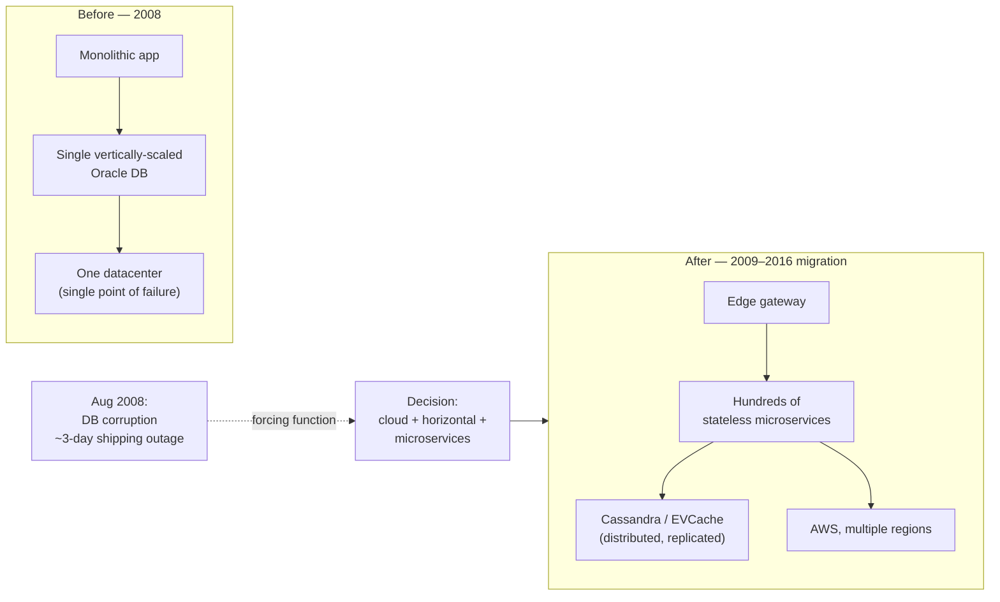
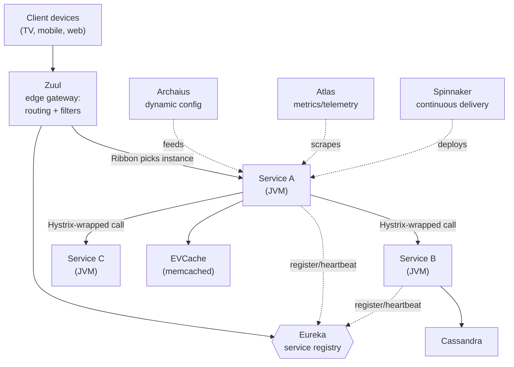
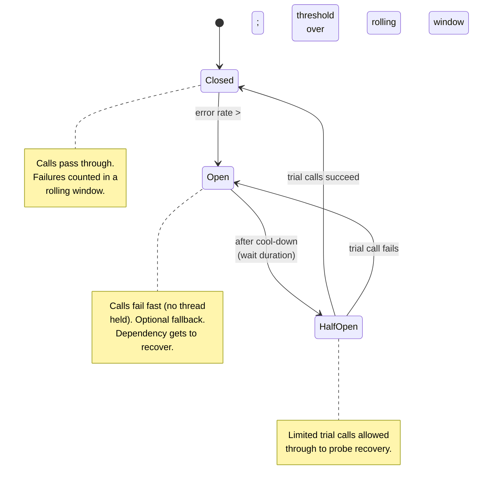
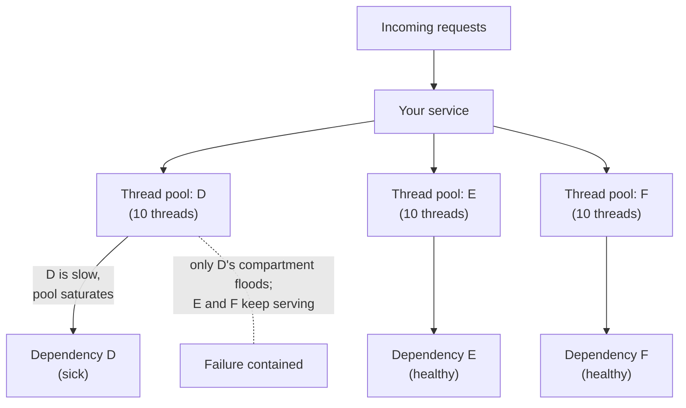
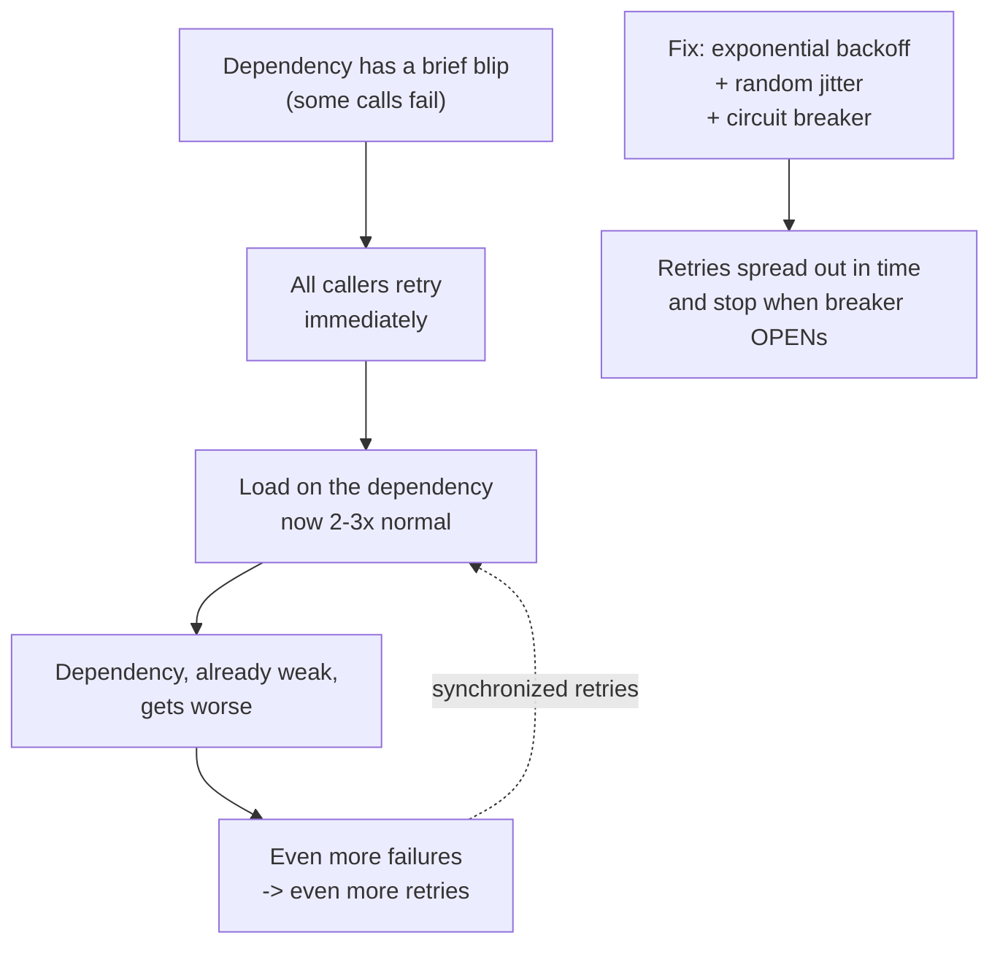
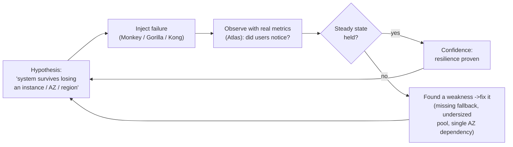
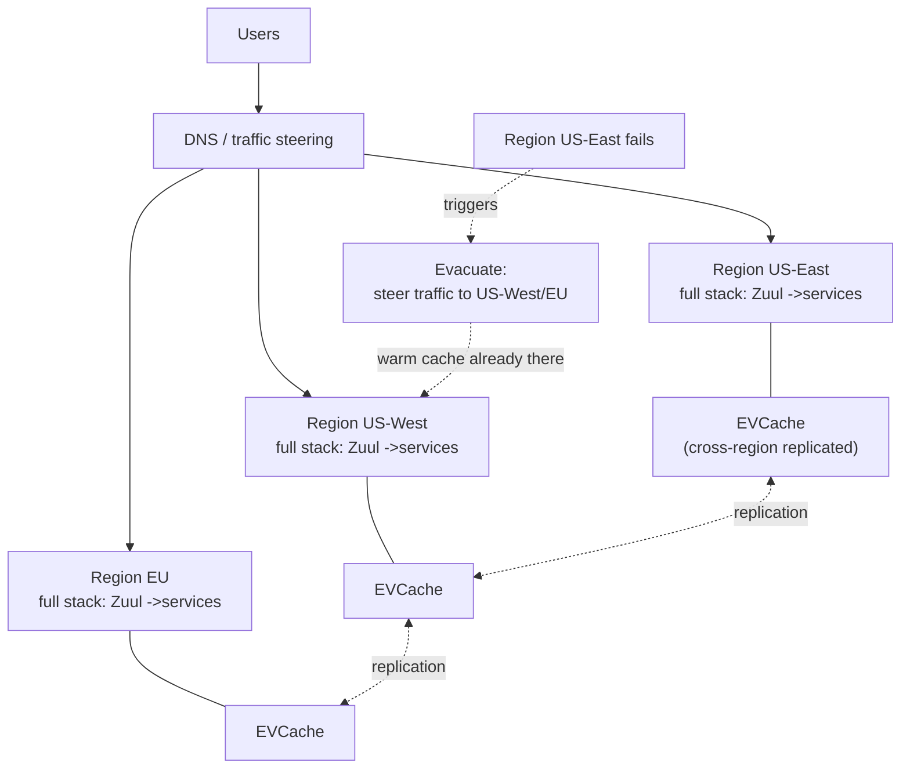
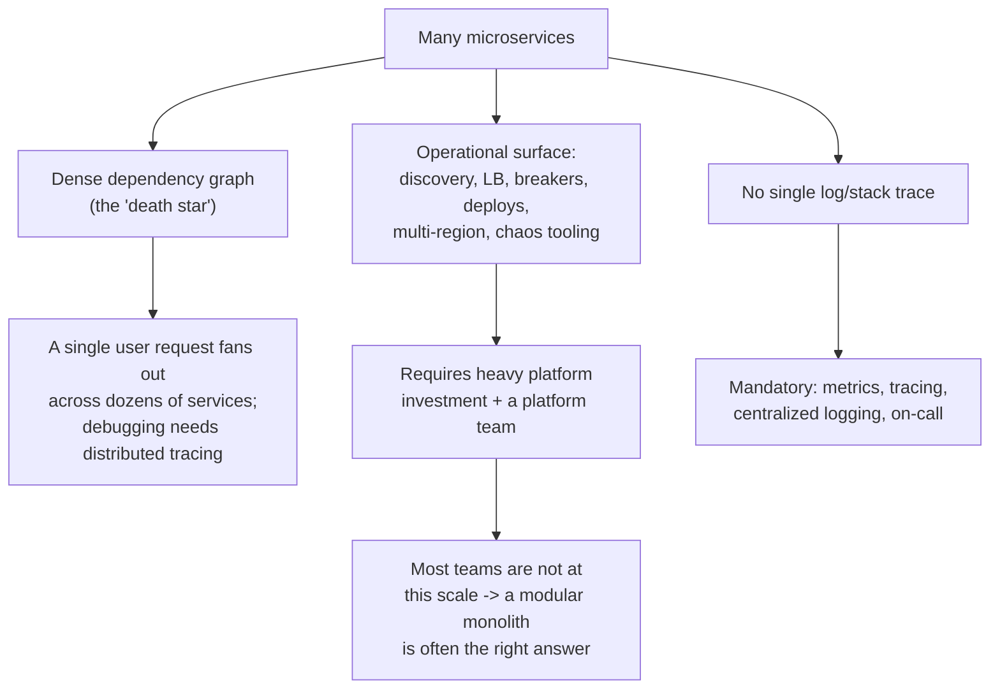
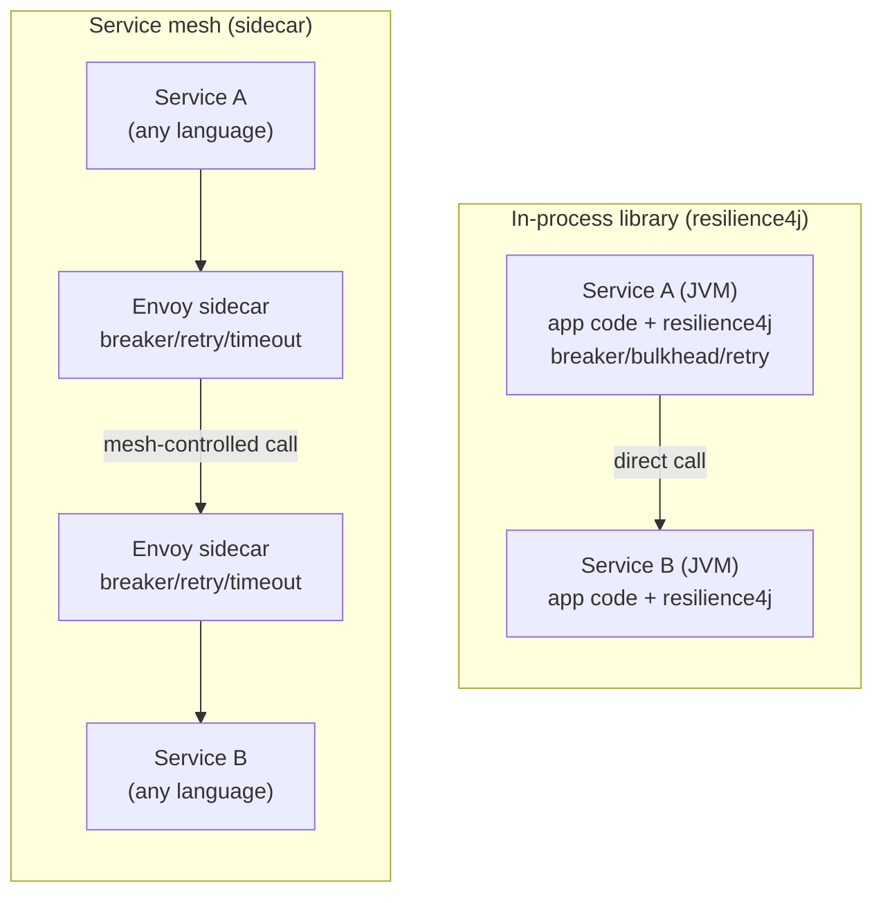

# Netflix — Resilience & Microservices at Scale

Netflix is the canonical case study for cloud-native microservices on the JVM. It is the company that *named and open-sourced* the patterns most of the industry now takes for granted — client-side service discovery, the circuit breaker as a library, chaos engineering, and multi-region active-active failover — and it did so under the forcing function of a single catastrophic outage. This topic reads the Netflix architecture as a **decision-and-trade-off study**: what they were forced to leave behind, the mechanisms they built to survive at scale, *why* each mechanism stops a specific failure mode, and — critically — the costs that mean **you should not copy this wholesale unless you are at Netflix's scale**. Because Netflix open-sourced its stack as the *Netflix OSS* libraries (Eureka, Hystrix, Zuul, Ribbon) and Spring Cloud wrapped them, these decisions reached straight into the everyday Java/Spring engineer's toolbox.

> [!NOTE]
> Prerequisites: [CAP Theorem & PACELC](../C02-distributed-systems-and-system-design/T01-cap-theorem-and-pacelc.md) (Netflix biases hard toward availability), and [Resilience Patterns](../C02-distributed-systems-and-system-design/T14-resilience-circuit-breaker-bulkhead-retry-timeout-backpressure.md) (circuit breaker, bulkhead, retry, timeout, backpressure — Netflix is the production embodiment of all five). Helpful context: [Software Architecture](../C01-software-architecture/) (monolith vs microservices decomposition) and [Caching at Scale](../C02-distributed-systems-and-system-design/T11-caching-strategies-at-scale.md) (EVCache).

## The Forcing Function — A 2008 Outage That Moved Netflix Off The Datacenter

Netflix did not adopt microservices because microservices were fashionable. It was *pushed* by a failure mode it could no longer tolerate.

In **August 2008**, Netflix — then primarily a DVD-by-mail business with a young streaming product — suffered a major **database corruption** event in its own datacenter. A corruption in the database that tracked DVD shipments halted shipping for roughly **three days**. The root problem was structural: Netflix ran a **single, vertically-scaled relational database** (Oracle) in a **single datacenter**. That is a system with a single point of failure by construction — when the one big box (or the one schema) goes bad, the whole company stops.

The engineering leadership drew two conclusions that defined the next decade:

1. **Stop scaling vertically.** A bigger box is still one box; reliability requires *horizontal* redundancy where any single node can die without taking the system down. (See [Scaling — Horizontal vs Vertical](../C02-distributed-systems-and-system-design/T12-scaling-horizontal-vertical-autoscaling-statelessness.md) if you want the general principle.)
2. **Stop running our own datacenter.** Netflix concluded it was not in the business of operating undifferentiated infrastructure better than a cloud provider, and that elastic capacity was the right answer to its spiky, fast-growing streaming load. It chose **AWS** as the cloud.



The migration ran from roughly **2009 to 2016**. Netflix publicly stated it finished moving the last of its operations to the cloud and **shut down its final remaining datacenter in January 2016** — a roughly seven-year program, not a quarter-long project. Along the way it re-platformed a monolith into a large fleet of independently deployable services.

> [!IMPORTANT]
> The Netflix story is often told as "they chose microservices for elegance." The accurate version: **a single-point-of-failure outage made the cost of the monolith-on-one-datacenter unacceptable**, and the cloud made horizontal redundancy economical. The architecture followed the *reliability requirement*, not the other way around. That ordering — pain first, pattern second — is the staff-level lesson.

### Why Microservices Specifically

Three properties of microservices map directly onto Netflix's needs at its growth rate (it now serves **hundreds of millions of subscribers** and, at peak hours, accounts for a *large share of downstream internet traffic* in many markets — characterize it as "a substantial double-digit percentage at peak" rather than a fixed number, because the figure varies by region and year):

- **Independent deployment.** A team can ship its service many times a day without coordinating a monolith-wide release. Deployment velocity scales with team count instead of being a single bottleneck.
- **Team autonomy (Conway's law, used deliberately).** Small two-pizza teams own a service end to end, choose their own tuning, and are paged for it. The org chart and the service graph are designed to mirror each other.
- **Fault isolation.** If the *recommendations* service degrades, the *play-button* path can still serve a fallback row of "Popular on Netflix." A failure is contained to a service boundary rather than crashing one giant process.

That third property — fault isolation — is the one Netflix had to *engineer*, not just assume. Splitting a monolith into 700 services does not by itself give you isolation; it gives you 700 ways for a slow dependency to take down its callers over the network. The rest of this topic is mostly about the machinery Netflix built so that splitting up *actually produced* isolation instead of a more fragile distributed monolith.

> [!NOTE]
> **A relatable picture of the three properties.** Think of the move from monolith to microservices like converting one giant open-plan office where everyone shares a single power switch into a building of separate rooms, each with its own breaker, its own door, and its own team. *Independent deployment* is each room being repainted without evacuating the building. *Team autonomy* is each room's team deciding their own furniture. *Fault isolation* is a fire in the supply closet not burning down the whole floor — **but only if you actually installed fire doors.** Netflix's hard-won lesson is that the walls between rooms (the network) are exactly where new fires start, so most of the engineering went into the fire doors, not the walls.

## The Netflix OSS Stack — A Flagship JVM Shop

Netflix is, foundationally, a **Java/JVM backend shop**. Its core mid-tier services run on the JVM, and the libraries it open-sourced as **Netflix OSS** are Java libraries. This is why the Netflix stack mattered so much to the Spring community: the patterns arrived as JARs you could put on a classpath.



The components and what each one does:

| Component | Role | Pattern it implements |
|---|---|---|
| **Eureka** | Service registry; instances **register** and **heartbeat**; clients **fetch the registry** and cache it | Client-side service discovery |
| **Ribbon** | Client-side library that picks *which* registered instance to call | Client-side load balancing |
| **Hystrix** | Wraps each outbound dependency call in a circuit breaker + thread-pool bulkhead + fallback | Circuit breaker, bulkhead, fallback |
| **Zuul** | The edge gateway: dynamic routing, auth, filters, request shaping | API gateway / edge |
| **Spinnaker** | Multi-cloud continuous-delivery pipelines (canaries, red/black deploys) | Deployment automation |
| **Archaius** | Dynamic, hot-reloadable configuration | Config as a runtime dial |
| **Atlas** | Dimensional time-series metrics for operational telemetry | Observability |

> [!NOTE]
> **Client-side discovery (Eureka + Ribbon) is the unusual choice.** Instead of routing every call through a central load balancer (a server-side LB is one more hop and one more thing to scale and fail), each *client* fetches the full registry from Eureka, caches it locally, and Ribbon picks an instance in-process. This trades a central chokepoint for client complexity and registry-propagation lag. Eureka is itself **deliberately AP** (see [CAP](../C02-distributed-systems-and-system-design/T01-cap-theorem-and-pacelc.md)): during a partition it serves *possibly-stale* registry data rather than refusing to answer, because for Netflix a slightly-stale instance list is far better than no instance list.

The single most influential of these is **Hystrix** — the library that turned the circuit breaker and bulkhead from book diagrams into a `@HystrixCommand` annotation. It is now in **maintenance mode** (Netflix stopped active feature development around 2018), and the community standard successor on the JVM is **Resilience4j**. The pattern survived; the specific library was replaced. The next sections take the two load-bearing resilience mechanisms — circuit breaker and bulkhead — to depth.

## Circuit Breaker In Depth — The Mechanism That Stops The Cascade

A microservice that calls a slow dependency is in mortal danger, and the danger is counter-intuitive: **the threat is slowness, not errors.** A fast error is harmless — you get an exception and move on. A *slow* dependency holds your thread for the duration of the timeout. Under sustained load, every request thread ends up parked waiting on the sick dependency; the thread pool drains; your service can no longer accept *any* request, including requests that have nothing to do with the slow dependency. Your service is now down — and its callers, waiting on *you*, start to drain *their* pools. The failure **cascades upstream** through the dependency graph.

The circuit breaker breaks this chain by **failing fast** once a dependency looks dead, so the caller's threads are returned immediately instead of parking.



The state machine:

- **CLOSED** — normal. Calls pass through to the dependency. The breaker counts outcomes in a **rolling window** (by count or by time). If the **error rate** (or slow-call rate) crosses a configured **threshold** while a **minimum number of calls** has been observed, it trips to OPEN.
- **OPEN** — the breaker **fast-fails** every call *without touching the dependency*. No thread is held; the caller gets an exception (or a fallback) instantly. This does two things at once: it **protects the caller** from thread exhaustion, and it **takes load off the sick dependency** so it has a chance to recover. After a configured **wait duration**, it moves to HALF-OPEN.
- **HALF-OPEN** — it lets a *small, limited number* of **trial calls** through. If they succeed, the dependency looks healthy and the breaker returns to CLOSED. If they fail, it snaps back to OPEN and waits again. This trial step prevents a thundering herd from slamming a just-recovering dependency the instant the timer expires.

> [!IMPORTANT]
> The breaker **protects the caller, not the callee**. The sick dependency stays sick; the breaker simply stops the caller from throwing itself against it and draining its own threads. This is *failure containment*. Pair it with a **timeout** (so a call can never hold a thread longer than X) and a **fallback** (so the caller has a degraded-but-useful answer), and a dead dependency becomes a *missing feature* instead of a *site outage*. The deeper treatment of all of this — windows, thresholds, tuning failure modes — is in [Resilience Patterns](../C02-distributed-systems-and-system-design/T14-resilience-circuit-breaker-bulkhead-retry-timeout-backpressure.md).

> [!TIP]
> **The analogy that makes the circuit breaker click: the breaker panel in your house.** When a short circuit draws too much current, the breaker in your electrical panel *trips* — it deliberately cuts the circuit so the fault doesn't overheat the wiring and start a fire that spreads to the whole house. It does **not** fix the short; the faulty appliance is still broken. What it does is *contain the damage* and let you keep the lights on everywhere else. Then, once you think you've fixed the appliance, you flip the breaker back on to *test* it — and if it trips again immediately, you know the fault is still there. That "flip it back on and see" step is exactly **HALF-OPEN**: a cautious trial before fully restoring the circuit. A software circuit breaker is the same device pointed at a network dependency instead of a wire.

> [!NOTE]
> **Scenario — a holiday-peak cascade that a breaker stopped.** Picture a retailer on its biggest sales day. The *checkout* service calls a *tax-calculation* service on every "Place Order." A bad deploy makes the tax service respond in 8 seconds instead of 40 ms — not failing, just *slow*. With no breaker, every checkout thread parks for 8 seconds waiting on tax; the checkout thread pool drains within a minute; checkout stops accepting **any** request, including ones that don't even need tax. The cart, recommendations, and product pages — all of which call checkout for stock checks — now park on *checkout* and drain *their* pools. By the time anyone reads a dashboard, the whole storefront is down on the highest-revenue day of the year, and the root cause (one slow service) is buried under a hundred symptoms. With a breaker plus a per-dependency **bulkhead** (next section), the story ends at "the tax call starts failing fast, checkout shows a 'tax estimated at checkout' fallback line, and the blast radius never leaves the tax compartment." The difference between those two outcomes is a few lines of configuration, decided *before* the incident.

Here is the modern JVM form, using **Resilience4j** (the successor to Hystrix) with a fallback:

```java
// Resilience4j config (typically in application.yml, shown here inline for clarity)
CircuitBreakerConfig config = CircuitBreakerConfig.custom()
    .failureRateThreshold(50)                       // open at 50% failures
    .slowCallRateThreshold(50)                      // ... or 50% "slow" calls
    .slowCallDurationThreshold(Duration.ofSeconds(1))
    .minimumNumberOfCalls(20)                        // don't trip on a tiny sample
    .slidingWindowType(SlidingWindowType.COUNT_BASED)
    .slidingWindowSize(50)                           // rolling window of 50 calls
    .waitDurationInOpenState(Duration.ofSeconds(5))  // cool-down before HALF_OPEN
    .permittedNumberOfCallsInHalfOpenState(5)        // trial calls
    .build();

CircuitBreaker breaker = CircuitBreaker.of("recommendations", config);

// Decorate the risky call; supply a fallback for OPEN / failure.
Supplier<List<Title>> guarded =
    CircuitBreaker.decorateSupplier(breaker, recommendationClient::topPicks);

List<Title> rows = Try.ofSupplier(guarded)
    .recover(ex -> popularFallback())   // degrade gracefully, never crash the page
    .get();
```

In Spring the same thing is one annotation via Spring Cloud Circuit Breaker / Resilience4j:

```java
@CircuitBreaker(name = "recommendations", fallbackMethod = "popularFallback")
public List<Title> topPicks(String userId) {
    return recommendationClient.topPicks(userId);   // wrapped: fast-fails when OPEN
}

public List<Title> popularFallback(String userId, Throwable t) {
    return popularRows();   // "Popular on Netflix" — degraded, still useful
}
```

## Bulkhead Isolation In Depth — Compartmentalizing The Ship

The circuit breaker handles a dependency that has *already* been detected as bad. The **bulkhead** is the complementary defense: it limits how much of your resources *any one dependency can consume*, so that one slow dependency cannot starve the calls to *every other* dependency before the breaker even trips.

The name is from naval engineering: ship hulls are divided into watertight **bulkhead** compartments so that a breach floods one compartment, not the whole hull. In a service, the "water" is your finite concurrency (threads or permits), and the "compartments" are per-dependency resource pools.

> [!TIP]
> **Hold the ship picture in your head the whole way through this section.** A modern ship's hull is split by steel **bulkhead** walls into sealed compartments. If an iceberg punches a hole in compartment 3, water floods compartment 3 — and the doors seal so it *stays* in compartment 3. The ship rides lower and slower, but it floats and reaches port. The disaster only happens when too many compartments flood at once, or when there were no bulkheads at all and the single open hull fills end to end. (The *Titanic* is the cautionary version: it had bulkheads, but they didn't extend high enough, so water spilled over the tops from one compartment to the next — a lesson that **a bulkhead sized wrong is barely a bulkhead at all**, which is exactly the pool-sizing warning below.) In a service, each dependency gets its own compartment of threads or permits. Dependency D springing a leak floods only D's compartment; the requests flowing to E and F sail on untouched.

Hystrix's signature design was **thread-pool-per-dependency**. Every dependency got its *own* bounded thread pool. A call to dependency D runs on D's pool. If D goes slow and saturates its pool, only *D's* pool fills — calls to dependencies E and F run on *their own* pools and are completely unaffected. The slow dependency is isolated to its compartment.



There are **two flavors** of bulkhead, and the choice is a real trade-off:

- **Thread-pool isolation** (Hystrix default; Resilience4j `ThreadPoolBulkhead`). The dependency call runs on a *separate* thread pool. Pro: you get a hard wall *and* the ability to apply a timeout by interrupting the worker thread, and the slow call never blocks the calling (request) thread. Con: extra threads, context-switch cost, and you lose `ThreadLocal` context across the hop unless you propagate it.
- **Semaphore isolation** (Resilience4j `Bulkhead`, semaphore-based). A counting **semaphore** caps the number of *concurrent* calls; the call runs on the *caller's* thread. Pro: cheap, no extra threads, no context loss. Con: because it runs on the calling thread, a semaphore bulkhead *cannot* enforce a timeout by interrupting — it only limits concurrency. Best for very fast, in-process, or trusted calls.

> [!TIP]
> Combine them: **bulkhead + timeout + circuit breaker** is the standard stack. The bulkhead caps the blast radius (no single dependency can grab more than N threads/permits), the timeout caps the per-call damage (no call holds a thread past X), and the circuit breaker cuts off the dependency entirely once it's clearly dead. Each covers a hole the others leave open. Sizing is the skill: a pool too small under-utilizes the service; too large defeats the isolation. Netflix tuned these per-dependency from production telemetry (Atlas), not from guesses.

### A Fuller Worked Example — The Whole Stack On One Call

The earlier snippets showed each mechanism alone. In a real service you compose them: a **bulkhead** to cap concurrency, a **timeout** to cap per-call time, a **retry with jitter** for transient blips, a **circuit breaker** to cut off a dead dependency, and a **fallback** for when all of that still can't get an answer. Resilience4j is built for exactly this layering. The decoration order matters — read it from the inside out: retry wraps the breaker wraps the time-limiter wraps the bulkhead wraps the raw call, and the fallback catches whatever escapes.

```java
// One risky outbound call — "topPicks" to the recommendations service —
// wrapped in the full resilience stack. Config shown inline for clarity;
// in production this lives in application.yml and is tuned from telemetry.

// 1) Bulkhead: at most 25 concurrent calls to recommendations; the
//    compartment that floods if it goes slow. Others get their own.
ThreadPoolBulkheadConfig bulkheadConfig = ThreadPoolBulkheadConfig.custom()
    .maxThreadPoolSize(25)
    .coreThreadPoolSize(25)
    .queueCapacity(50)        // small queue; reject fast rather than pile up
    .build();
ThreadPoolBulkhead bulkhead =
    ThreadPoolBulkhead.of("recommendations", bulkheadConfig);

// 2) Time limiter: no call to recommendations may take longer than 800 ms.
//    This is what CONVERTS a slow call into a fast failure the breaker sees.
TimeLimiterConfig timeLimiterConfig = TimeLimiterConfig.custom()
    .timeoutDuration(Duration.ofMillis(800))
    .cancelRunningFuture(true)   // interrupt the worker thread on timeout
    .build();
TimeLimiter timeLimiter = TimeLimiter.of("recommendations", timeLimiterConfig);

// 3) Circuit breaker: open at 50% failures OR 50% slow calls over the
//    last 50 calls; stay open 5s before probing recovery.
CircuitBreakerConfig cbConfig = CircuitBreakerConfig.custom()
    .failureRateThreshold(50)
    .slowCallRateThreshold(50)
    .slowCallDurationThreshold(Duration.ofMillis(800))
    .minimumNumberOfCalls(20)
    .slidingWindowType(SlidingWindowType.COUNT_BASED)
    .slidingWindowSize(50)
    .waitDurationInOpenState(Duration.ofSeconds(5))
    .permittedNumberOfCallsInHalfOpenState(5)
    .build();
CircuitBreaker breaker = CircuitBreaker.of("recommendations", cbConfig);

// 4) Retry WITH JITTER: up to 3 attempts, exponential backoff starting at
//    100 ms, multiplier 2, plus randomization so 40 callers don't re-sync.
//    Only retry transient errors — NEVER a non-idempotent write.
IntervalFunction backoffWithJitter =
    IntervalFunction.ofExponentialRandomBackoff(
        Duration.ofMillis(100),  // initial interval
        2.0,                     // multiplier: 100ms -> 200ms -> 400ms ...
        0.5);                    // jitter factor: +/-50% randomization
RetryConfig retryConfig = RetryConfig.custom()
    .maxAttempts(3)
    .intervalFunction(backoffWithJitter)
    .retryExceptions(IOException.class, TimeoutException.class)
    .ignoreExceptions(InvalidUserException.class)   // don't retry "bad input"
    .build();
Retry retry = Retry.of("recommendations", retryConfig);

// 5) Compose them around the call and attach the fallback. Decoration is
//    inside-out: bulkhead -> time limiter -> circuit breaker -> retry.
CompletableFuture<List<Title>> future = Decorators
    .ofSupplier(() -> recommendationClient.topPicks(userId))
    .withThreadPoolBulkhead(bulkhead)
    .withTimeLimiter(timeLimiter, scheduledExecutor)
    .withCircuitBreaker(breaker)
    .withRetry(retry, scheduledExecutor)
    .withFallback(
        List.of(TimeoutException.class, CallNotPermittedException.class,
                BulkheadFullException.class),
        throwable -> popularRows())   // "Popular on Netflix" — degraded, valid
    .get()
    .toCompletableFuture();

List<Title> rows = future.join();   // always returns SOMETHING the UI can render
```

> [!WARNING]
> Notice the three different exceptions the fallback catches: `TimeoutException` (the call was too slow), `CallNotPermittedException` (the **breaker is OPEN** and rejected the call without trying), and `BulkheadFullException` (the **compartment is full** — concurrency cap hit). These are three *distinct* failure modes — slow, dead, and saturated — and each one is supposed to land the user on the same graceful fallback row rather than a stack trace. If your fallback only catches one of them, the other two leak through as 500s during exactly the kind of incident this stack exists to survive. Catch *all* the resilience exceptions, not just the obvious one.

## Fallbacks, Timeouts, And Retries — And The Retry-Storm Trap

Three smaller mechanisms complete the resilience picture, and one of them is a foot-gun if used naively.

- **Timeout.** Every remote call needs a deadline *shorter than the caller's own deadline budget*. A call with no timeout can hold a thread forever. A timeout shorter than the dependency's normal p99 latency causes spurious failures and trips breakers on healthy dependencies. The timeout is what *converts* a slow call into a fast failure that the breaker and bulkhead can act on.
- **Fallback.** When a call fails or fast-fails, return a *degraded but useful* answer: a cached value, a default list, an empty-but-valid response. Netflix's product is full of this — if personalized rows can't load, you still see *something* playable. Graceful degradation is what turns "a service is down" into "a feature is slightly worse."
- **Retry — with backoff and jitter, or not at all.** Retrying a transient failure is reasonable. Retrying *naively* is how you turn a small hiccup into a self-inflicted outage.

The retry-storm mechanism is worth seeing explicitly, because it is one of the most common ways resilient-looking systems amplify their own failures:



Without backoff, every caller retries at the same instant — a **synchronized retry storm** that hits the weakened dependency with multiples of normal load, *causing* the full outage the retry was meant to survive. The fix is **exponential backoff** (wait longer after each failure) plus **random jitter** (so callers don't re-synchronize on the same backoff schedule), and a **circuit breaker** in front so retries stop entirely once the dependency is clearly dead. And retries are only safe on **idempotent** operations — retrying a non-idempotent write can double-charge or double-ship. (Full treatment: [Resilience Patterns](../C02-distributed-systems-and-system-design/T14-resilience-circuit-breaker-bulkhead-retry-timeout-backpressure.md).)

> [!TIP]
> **The analogy: everyone redialing a busy number at once.** Remember calling a radio station for concert tickets, or a box office the minute seats go on sale? The line is busy, so you hang up and *immediately* hit redial. So does everyone else — all at the same instant. The exchange, already at capacity, is now slammed by the entire crowd redialing in lockstep, which keeps it jammed, which makes everyone redial again. The line never clears not because there's no capacity *ever*, but because the demand arrives in perfectly synchronized waves. **Jitter** is the fix in human terms: if each caller waited a *random* few seconds before redialing, the calls would spread out across time, the exchange could drain between them, and people would actually get through. Exponential backoff is "wait a little longer each time it's busy"; jitter is "and don't all wait the *same* amount." A retry storm in a microservice fleet is this exact phenomenon, just at machine speed and machine scale — thousands of clients redialing a sick service in the same millisecond.

> [!NOTE]
> **Scenario — the retry that turned a 200 ms blip into a 40-minute outage.** A payments service has a 200 ms network blip; a handful of calls fail. All 40 client instances are configured to retry 3 times *immediately* on failure. The blip becomes a wall: 40 instances × the failed calls × 3 retries land on the payments service in the same heartbeat, pushing it to ~3× normal load. Already weak, it now genuinely falls over — and because it's *down*, every subsequent call fails, triggering *another* round of 3 immediate retries from everyone, locking the system into a self-sustaining storm that outlives the original blip by 40 minutes. The post-incident fix was three lines of config: exponential backoff with jitter (so retries fan out over seconds instead of stacking on one instant), a cap of 2 retries, and a circuit breaker that trips after the failure rate crosses the threshold (so once payments is clearly dead, clients **stop retrying entirely** and fail fast to a "we'll confirm your order by email" fallback). The same 200 ms blip a month later was a non-event. The lesson staff engineers carry: **an un-jittered retry is not a resilience feature, it's a load-amplification bug wearing a resilience costume.**

## Chaos Engineering — Proving Resilience By Causing Failure

Building circuit breakers and bulkheads is necessary but not sufficient: code that is *supposed* to fail over gracefully often doesn't, because the failure path was never exercised. Netflix's answer became an entire engineering discipline: **deliberately inject failure in production, continuously, to prove the system survives it.** The guiding principle is often phrased: *the best way to avoid large failures is to fail constantly in small, controlled ways.*

> [!TIP]
> **Two analogies that capture what chaos engineering really is: a fire drill and a vaccine.** A **fire drill** doesn't start a real fire — it triggers the alarm on a calm Tuesday so people *practice* the evacuation while nothing is actually burning. You discover the back stairwell is locked, the new hire doesn't know where the assembly point is, and the alarm on the third floor is too quiet — and you fix all of it *before* a real fire, when discovering those things is fatal. Chaos Monkey killing a random instance is precisely a fire drill for your servers. A **vaccine** is the sharper version: it introduces a small, *controlled* dose of the very harm you fear — a weakened pathogen — so the system builds immunity and is ready when the real thing arrives. Chaos engineering injects small, controlled failures into production so the system (and the on-call humans) develop "immunity": the failover paths get exercised regularly, so when an actual AWS zone evaporates at 3 a.m., the response is muscle memory, not improvisation. The whole philosophy is *controlled small harm now to prevent uncontrolled large harm later.*

It started with **Chaos Monkey** (introduced around 2011): a tool that **randomly terminates running instances in production** during business hours. The point is forcing function — if killing a random instance can take down your service, you have a single point of failure, and you find out on a Tuesday afternoon with engineers watching, not at 3 a.m. during a real AWS event. Chaos Monkey makes "any instance can die at any time" a *tested invariant* rather than a hope.

Chaos Monkey grew into the **Simian Army**, escalating the blast radius:

| Tool | What it breaks | Failure mode it validates |
|---|---|---|
| **Chaos Monkey** | Kills a single random instance | Instance loss / autoscaling recovery |
| **Latency Monkey** | Injects artificial latency and errors into service calls | Timeouts, circuit breakers, fallbacks under degradation |
| **Conformity Monkey** | Flags instances not following best practices | Configuration / standards drift |
| **Janitor Monkey** | Cleans up unused resources | Cost and clutter (not a failure injector) |
| **Chaos Gorilla** | Kills an **entire Availability Zone** | AZ-level redundancy |
| **Chaos Kong** | Evacuates an **entire AWS region** | Region-level failover (the big one) |

Later, Netflix moved from blunt random killing toward a more scientific **Chaos Automation Platform (ChAP)**: run a controlled experiment that routes a small slice of real traffic through a *failure-injected* variant and a control, compare the two with the same metrics you use for canaries, and automatically abort if the failure variant hurts users. This is chaos engineering matured into a **safe, hypothesis-driven experiment** rather than "pull a plug and watch."



> [!WARNING]
> Chaos engineering only works *because* the resilience machinery (breakers, bulkheads, fallbacks, multi-AZ deployment, autoscaling) is already in place to catch the injected failures. Running Chaos Monkey on a fragile single-instance system just causes outages — that is not chaos *engineering*, it is self-sabotage. The discipline assumes you have first built the safety nets, defined a measurable **steady state**, and can abort the experiment. Start in a test environment with a tiny blast radius before you ever touch production.

## Multi-Region Active-Active — Surviving The Loss Of A Whole Region

Chaos Kong evacuating a region is only survivable if Netflix can *actually run* out of more than one region at the same time. That is the **multi-region active-active** architecture: Netflix runs the full service stack in **multiple AWS regions simultaneously**, each region serving live user traffic, each capable of absorbing the others' load if a region fails.

The design rests on **regional isolation**: a region is as self-sufficient as possible, so a failure inside one region does not leak across regions. When a region is unhealthy, Netflix **evacuates** it — steers (re-routes) its user traffic to a healthy region — and the remaining regions, provisioned with headroom, carry the extra load.



A key enabler is **EVCache** — Netflix's distributed caching layer, built on **memcached**, with client-side sharding and replication. EVCache is replicated **across regions**, so when traffic is steered into a failover region, that region's cache is already *warm* with the relevant data instead of cold. A cold cache after a failover would hammer the backing datastores (a stampede) exactly when the system is already stressed; cross-region cache replication is what makes a region evacuation a non-event for users. (EVCache and stampede protection connect to [Caching Strategies at Scale](../C02-distributed-systems-and-system-design/T11-caching-strategies-at-scale.md).)

> [!IMPORTANT]
> Multi-region active-active is an emphatic **availability-over-consistency** bet — exactly the AP corner of [CAP / PACELC](../C02-distributed-systems-and-system-design/T01-cap-theorem-and-pacelc.md). Netflix accepts that data replicated across regions is *eventually* consistent (a profile change might take a moment to propagate) in exchange for being able to lose an entire region without taking down the service. For a streaming product this is the right trade: a slightly-stale "Continue Watching" row is invisible to users; a full outage is not. A bank's ledger would make the opposite trade — which is the whole point of CAP being a *choice*, not a default.

## The Costs — And Why You Are Probably Not Netflix

Everything above is impressive, and most engineering organizations **should not replicate it wholesale**. The Netflix architecture buys reliability at Netflix scale with costs that are crushing at smaller scale.



The concrete costs:

- **The "death star" dependency graph.** Netflix's own visualizations of its service-to-service call graph look like a dense star map. A single play request fans out across dozens of services. You *cannot* reason about such a system without **distributed tracing**; a stack trace from one service tells you almost nothing.
- **Operational complexity is the product now.** Service discovery, client load balancing, per-dependency circuit breakers and bulkheads, canary/red-black deploys, multi-region failover, and chaos tooling are not free features — they are a **platform** that needs a dedicated platform/SRE org to build and run. Netflix can amortize that over hundreds of millions of subscribers. A 15-person startup cannot.
- **Heavy observability is mandatory, not optional.** With no single process to attach a debugger to, you *must* have metrics (Atlas-equivalent), distributed tracing, centralized logging, and a real on-call practice before microservices are even operable.
- **Distributed-systems failure modes you didn't have before.** Splitting a monolith trades in-process method calls (which don't partition, don't time out, don't partially fail) for network calls (which do all three). You take on the entire [resilience](../C02-distributed-systems-and-system-design/T14-resilience-circuit-breaker-bulkhead-retry-timeout-backpressure.md) and [distributed-systems](../C02-distributed-systems-and-system-design/T01-cap-theorem-and-pacelc.md) burden as the price of admission.

### Netflix Scale vs Your Scale — Right-Sizing The Decision

The single most expensive mistake at this layer is copying a Netflix mechanism because it's *impressive* rather than because your scale *demands* it. The table below puts the two worlds side by side so you can locate yourself honestly. The rule of thumb: a mechanism is justified when the failure it prevents is one you would *actually experience at your traffic and team size*, and when you have the people to operate the mechanism itself.

| Dimension | Netflix scale | A typical team's scale | What it means for *your* decision |
|---|---|---|---|
| **Users / traffic** | Hundreds of millions of subscribers; a large share of peak internet traffic | Thousands to low millions; predictable diurnal load | Most of your "scale" problems are solved by a bigger instance and a read replica, not a service fleet |
| **Services** | Hundreds (the "death star" graph) | One app, or a handful | Each new service is a new network boundary, a new failure mode, a new on-call rotation — buy them one at a time, with cause |
| **Team** | Thousands of engineers, two-pizza teams, a dedicated platform/SRE org | 5–50 engineers, no platform team | If nobody owns the platform full-time, the platform owns *you* — every breaker/registry/mesh becomes unmaintained debt |
| **Regions** | Multi-region active-active, full-stack in each | Single region (maybe a DR standby) | Multi-region active-active is a multi-quarter program; a warm standby + good backups covers most teams' real RTO/RPO |
| **Failure you're defending against** | Losing an entire AWS *region* must be invisible to users | A bad deploy, a slow query, one instance dying | Match the mechanism to *your* worst realistic failure, not Netflix's |
| **Cost of the machinery** | Amortized over hundreds of millions of users | Paid by a handful of engineers' time | At your scale the operational tax often *exceeds* the reliability it buys |
| **Right default** | The full stack, and they earned every piece | **Modular monolith**, in-process resilience4j where genuinely needed, strangler-fig later | Start simple; add Netflix mechanisms only when a concrete pain appears |

> [!WARNING]
> **Scenario — "We're a 4-engineer startup; should we build like Netflix?"** A founder reads the Netflix tech blog and proposes: separate services for auth, billing, catalog, search, and notifications; Eureka for discovery; a service mesh; multi-region from day one. With four engineers, the result is predictable and grim. There is now a distributed system — five deploy pipelines, five on-call surfaces, network calls between things that used to be method calls, and *no one* to run the platform — serving traffic a single modest server would handle without noticing. Every feature now spans multiple repos and requires distributed tracing to debug a flow that used to be a stack trace. The team spends its scarce engineering hours operating infrastructure instead of shipping the product that determines whether the company survives. **The correct answer is a modular monolith**: one deployable Spring Boot app with clean internal module boundaries (a `billing` package that only talks to `catalog` through a defined interface, never reaching into its tables). You get fast iteration, a single trivial deploy, one log to read — and the boundaries are *already drawn*, so the day a specific module truly needs to scale or be owned by a separate team, you carve *that one* out via strangler-fig. You adopt Netflix's *ideas about boundaries* immediately and its *operational machinery* never, until a concrete need forces your hand. Premature microservices is the most expensive way a small team can express admiration for a big one.

> [!INTERVIEW]
> **"Should we move from our Spring Boot monolith to Netflix-style microservices?"** A staff-level answer does *not* say yes. It says: *what problem are we solving?* Netflix moved because a single-datacenter, vertically-scaled DB gave it an unacceptable single point of failure at a scale of hundreds of millions of users. If your pain is deployment coupling or a few hot modules, a **modular monolith** (clear internal boundaries, single deploy) gets you most of the benefit with a fraction of the operational cost — and you can carve out specific services later via the **strangler-fig** pattern when a *concrete* scaling or team-autonomy need justifies the distributed-systems tax. The cargo-cult failure mode is adopting the death-star graph *before* you have the scale, the platform team, and the observability to operate it. "You are not Netflix" is the correct default; the burden of proof is on microservices, not on the monolith.

## Java/Spring Relevance — How These Patterns Reached You

The reason a working Spring engineer knows these patterns is **Spring Cloud Netflix**, which wrapped the Netflix OSS libraries behind Spring abstractions: `@EnableEurekaClient` for Eureka discovery, Ribbon for client-side load balancing, `@HystrixCommand` for circuit breaking, and `@EnableZuulProxy` for the edge gateway. For several years this was *the* way to build microservices in Spring, and it carried Netflix's mechanisms into thousands of ordinary backends.

The important update for a **modern** Spring engineer: Spring Cloud has since **deprecated and moved on from the Netflix components**, while keeping the *patterns*. The current mapping is:

| Netflix OSS (legacy) | Modern Spring replacement | Same pattern |
|---|---|---|
| Hystrix | **Resilience4j** (via Spring Cloud Circuit Breaker) | Circuit breaker, bulkhead, rate limiter |
| Zuul (1.x) | **Spring Cloud Gateway** (reactive) | Edge gateway / routing |
| Ribbon | **Spring Cloud LoadBalancer** | Client-side load balancing |
| Eureka | Eureka *(still supported)*, or Consul / Kubernetes-native discovery | Service discovery |

So a Spring engineer today gets the circuit breaker, bulkhead, edge gateway, and client-side load balancing **without** the Netflix libraries — the patterns Netflix pioneered are now first-class, vendor-neutral building blocks. The Netflix libraries were the *delivery vehicle*; the patterns are the lasting contribution. (See [Spring Cloud — Config, Gateway, Eureka, OpenFeign](../../L4-backend-engineering/C01-spring-framework/T18-spring-cloud-config-gateway-eureka-openfeign.md) for the hands-on Spring view.)

> [!TIP]
> When you put `resilience4j-spring-boot` on a classpath and annotate a method with `@CircuitBreaker(name = "x", fallbackMethod = "y")`, you are using the exact pattern Netflix extracted from a 2008 outage — minus the obligation to run Netflix's platform. Take the *mechanism*; leave the *scale-only costs*.

### Where The Resilience Lives — In-Process Library vs Service Mesh

Netflix put resilience *in the application*, as a JVM library (Hystrix) on every service's classpath. The modern alternative is a **service mesh** (Istio, Linkerd) that puts a **sidecar proxy** (Envoy) next to every service and enforces timeouts, retries, and circuit breaking *in the network layer*, outside your code. Both implement the same patterns; they differ in *where the logic runs and who operates it*. This is a genuine architectural fork, and a staff engineer should be able to argue either side.



The trade-off, decision-first:

| Concern | In-process library (resilience4j) | Service mesh (Istio/Linkerd + Envoy) |
|---|---|---|
| **Where logic runs** | Inside the JVM, same process as your code | In a sidecar proxy, one per pod, outside your code |
| **Language fit** | JVM only — every language needs its own library | Polyglot — same policy for Java, Go, Python, Node |
| **Who changes a timeout** | A developer, redeploys the app | A platform/SRE team, applies a mesh config — *no app redeploy* |
| **Operational weight** | A JAR on the classpath; almost nothing to run | A whole control plane + sidecars to install, secure, upgrade |
| **Per-call cost** | None (in-process) | An extra network hop through two proxies |
| **Best when** | A handful of JVM services; small/medium team; no platform org | Many services, **multiple languages**, a platform team to run the mesh |

> [!IMPORTANT]
> **The decision rule.** If you are a **JVM-mostly shop with a handful of services and no platform team**, reach for the **in-process library** — resilience4j on the classpath, configured per service. You get circuit breaker, bulkhead, retry, and rate limiting for the cost of a dependency, with nothing extra to operate. Reach for a **service mesh** only when you have (a) **many services across multiple languages** so a per-language library is real duplication, *and* (b) a **platform/SRE team** to own the mesh, *and* (c) the desire to change resilience and traffic policy **without redeploying apps**. A mesh is powerful and language-neutral, but it is *also* a distributed system you now have to run — installing Istio "to get circuit breakers" on three Java services is the same right-sizing error as adopting microservices before you need them. Most Spring teams get everything they need from resilience4j and never need the mesh.

> [!TIP]
> **How a Spring Boot team gets all of this today.** The edge and the in-service resilience compose cleanly. At the **edge**, **Spring Cloud Gateway** routes traffic and can wrap each downstream route in a circuit breaker; *inside* each service, **resilience4j** guards individual dependency calls. A richer gateway config example:
>
> ```yaml
> # application.yml — Spring Cloud Gateway with a per-route circuit breaker + fallback
> spring:
>   cloud:
>     gateway:
>       routes:
>         - id: recommendations-route
>           uri: lb://recommendations-service        # client-side LB via discovery
>           predicates:
>             - Path=/api/recommendations/**
>           filters:
>             - name: CircuitBreaker
>               args:
>                 name: recommendationsCB
>                 fallbackUri: forward:/fallback/popular   # degraded "Popular" rows
>             - name: Retry
>               args:
>                 retries: 2
>                 statuses: BAD_GATEWAY, SERVICE_UNAVAILABLE
>                 backoff:
>                   firstBackoff: 100ms
>                   maxBackoff: 1s
>                   factor: 2
>                   basedOnPreviousValue: false           # jittered, capped backoff
> resilience4j:
>   circuitbreaker:
>     instances:
>       recommendationsCB:
>         slidingWindowSize: 50
>         failureRateThreshold: 50
>         slowCallRateThreshold: 50
>         slowCallDurationThreshold: 800ms
>         waitDurationInOpenState: 5s
>         permittedNumberOfCallsInHalfOpenState: 5
>   bulkhead:
>     instances:
>       recommendationsBH:
>         maxConcurrentCalls: 25                          # the compartment cap
> ```
>
> This is the Netflix edge-gateway + per-dependency resilience pattern, expressed entirely in vendor-neutral Spring config — Zuul's routing job done by Spring Cloud Gateway, Hystrix's breaker job done by resilience4j, and not a Netflix library in sight.

## Practice

1. **(Easy — recall)** Name the three properties of microservices that mapped onto Netflix's needs, and give the one-line reason each mattered at Netflix's growth rate.
2. **(Easy — recall)** For each Simian Army member — Chaos Monkey, Latency Monkey, Chaos Gorilla, Chaos Kong — state the *blast radius* (what it breaks) and the resilience invariant it validates.
3. **(Medium — explain the mechanism)** Explain, step by step, *why a slow dependency (not an erroring one) is the dangerous case*, and how the circuit breaker's OPEN state breaks the cascade. Reference thread pools explicitly.
4. **(Medium — mechanism)** Contrast **thread-pool isolation** and **semaphore isolation** bulkheads. Give one situation where you'd pick each, and explain *why a semaphore bulkhead cannot enforce a call timeout*.
5. **(Medium — trace the failure scenario)** A dependency has a 200 ms blip. All 40 caller instances retry immediately with no backoff. Trace what happens to the dependency's load and explain how **exponential backoff + jitter + a circuit breaker** would have changed the outcome.
6. **(Hard — trace the architecture)** A region (US-East) fails and Chaos-Kong-style evacuation kicks in. Walk through the request path *after* evacuation: DNS/steering, the receiving region's Zuul, Eureka/Ribbon instance selection, and the role of **cross-region EVCache replication**. Identify what would go wrong if EVCache were *not* cross-region replicated.
7. **(Hard — judgment / design)** Your 12-engineer company runs a Spring Boot monolith with one hot module (image processing) that needs to scale independently. Write the staff-level recommendation: do you go full Netflix-style microservices? If not, what *do* you do, which patterns from this topic do you adopt, and which costs do you deliberately avoid? Justify against the CAP and operational-cost trade-offs.
8. **(Hard — map to Spring)** For each legacy Netflix OSS component (Hystrix, Zuul, Ribbon, Eureka), name the modern Spring replacement and write the one annotation or dependency you'd use today to get the same behavior.
9. **(Medium — analogies to mechanism)** For each analogy — the household **breaker panel**, the ship's **bulkhead compartments**, the **fire drill / vaccine**, and **everyone redialing a busy number** — name the resilience mechanism it maps to and state the *one* property of the mechanism the analogy is meant to illuminate (e.g. which one captures HALF-OPEN, which captures jitter).
10. **(Hard — compose the full stack)** Using the fuller worked example as a reference, explain *why the decoration order* (retry outside, breaker, then time-limiter, then bulkhead innermost) matters, and name the three distinct resilience exceptions the fallback must catch and the failure mode each one represents.
11. **(Hard — judgment / right-sizing)** A 4-engineer startup proposes five services, Eureka, a service mesh, and multi-region on day one. Write the staff-level pushback: which specific costs land on a 4-person team, what you recommend instead, and what you'd carve out *first* when a real need finally appears.
12. **(Hard — library vs mesh)** You run six services: four Java, one Go, one Python, with a two-person platform group forming. Argue whether to standardize on **resilience4j in each service** or adopt a **service mesh**, citing the polyglot, redeploy-vs-config, and operational-weight trade-offs explicitly.

## Recap

By the end of this topic you should be able to:

- Explain the **2008 single-datacenter outage** as the *forcing function* behind Netflix's move to AWS + horizontal scaling + microservices (migration ~2009–2016, last datacenter shut **Jan 2016**), and articulate why the architecture followed the *reliability requirement*.
- Identify the **Netflix OSS stack** components (Eureka, Ribbon, Hystrix, Zuul, Spinnaker, Archaius, Atlas) and the pattern each implements, and explain why client-side discovery (Eureka, deliberately AP) is the unusual choice.
- Draw and explain the **circuit breaker CLOSED → OPEN → HALF-OPEN** state machine, and articulate *why it protects the caller* by failing fast and stopping thread-pool exhaustion from cascading upstream.
- Distinguish **thread-pool vs semaphore bulkheads**, and explain how bulkhead + timeout + breaker compose to contain a failing dependency.
- Explain the **retry-storm** mechanism and why **exponential backoff + jitter + circuit breaker + idempotency** are the antidote.
- Describe **chaos engineering** (Chaos Monkey → Simian Army → ChAP) as hypothesis-driven failure injection, and state the precondition: the safety nets must already exist.
- Explain **multi-region active-active**, region evacuation, and **EVCache** cross-region replication as an explicit **availability-over-consistency (AP)** bet.
- Argue *why most teams should not copy Netflix wholesale* (death-star graph, operational/observability cost) and recommend a **modular monolith + strangler-fig** default.
- Map every Netflix pattern to its **modern Spring replacement** (Resilience4j, Spring Cloud Gateway, Spring Cloud LoadBalancer) and take the *mechanism* without the *scale-only costs*.
- Reach for the right **intuition on demand** — breaker panel (fail fast + HALF-OPEN trial), ship bulkheads (per-dependency compartments), fire drill / vaccine (controlled small harm for immunity), busy-signal redialing (synchronized retry storms and why jitter dissolves them).
- **Compose the full resilience stack** on a single call (bulkhead + timeout + retry-with-jitter + circuit breaker + fallback), understand why decoration order matters, and catch *all* the distinct failure exceptions (timeout, breaker-open, bulkhead-full) on the fallback.
- **Right-size against Netflix** using the scale comparison (users, services, team, regions, cost), recognize the "4-engineer startup copying Netflix" antipattern, and default to a **modular monolith**.
- Choose between an **in-process resilience library and a service mesh** by the polyglot-fit, redeploy-vs-config, and operational-weight trade-offs, and express the Netflix edge + per-dependency resilience pattern in vendor-neutral **Spring Cloud Gateway + resilience4j** config.

## Next

- [Stripe — Idempotency, Ledgers & API Longevity](./T02-stripe-idempotency-ledgers-api-longevity.md) — where Netflix optimized for *availability*, Stripe optimizes for *correctness*: idempotency keys that make retries safe, double-entry ledgers that never lose money, and date-versioned APIs that stay backward-compatible for years.
