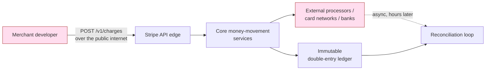
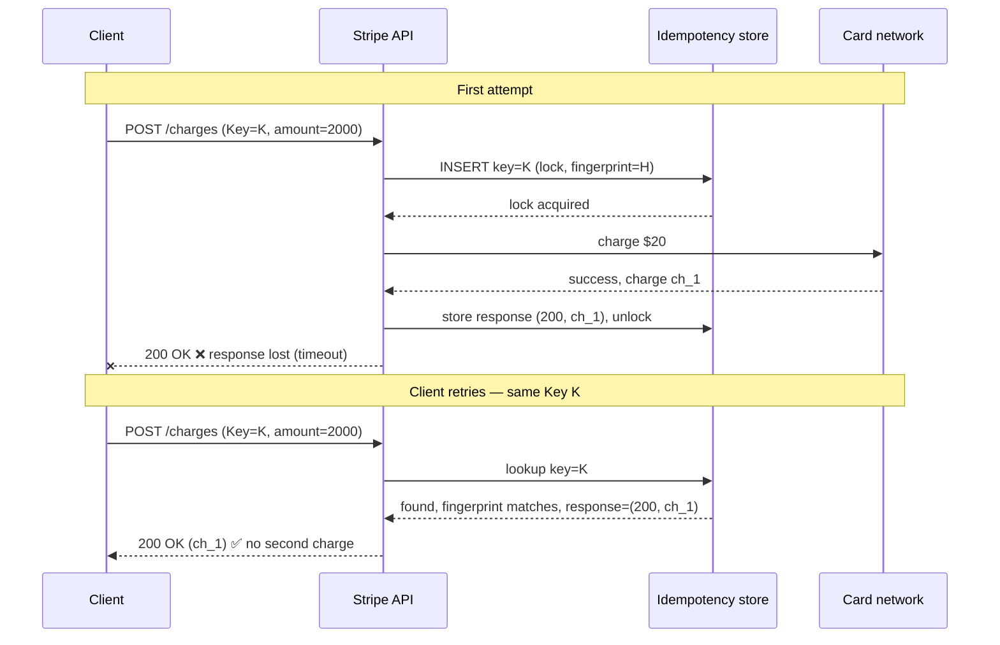
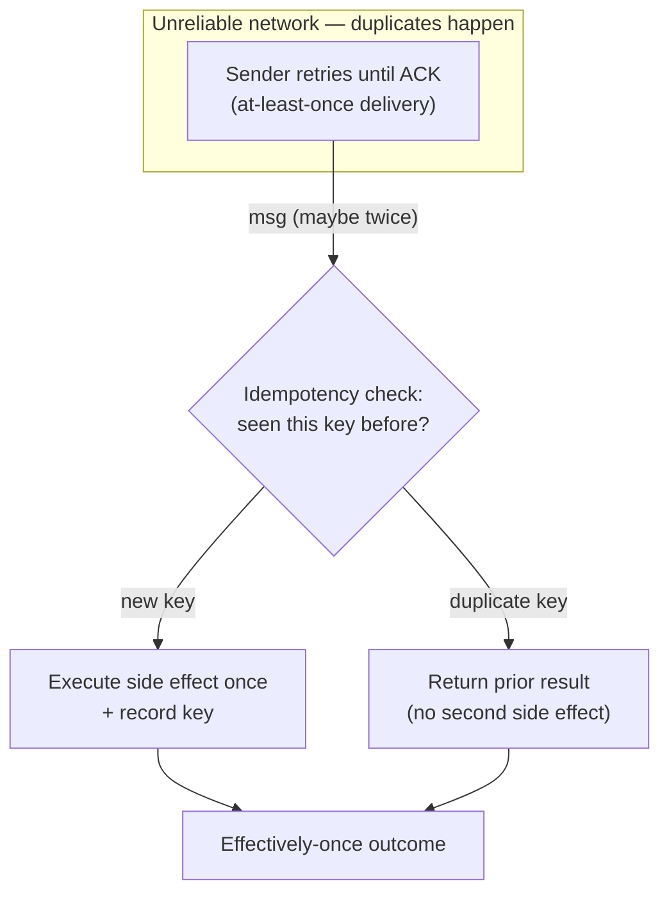
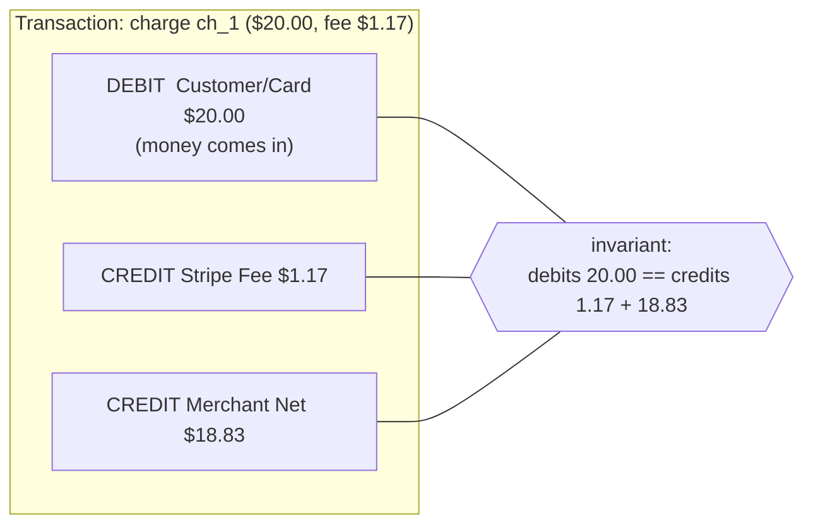
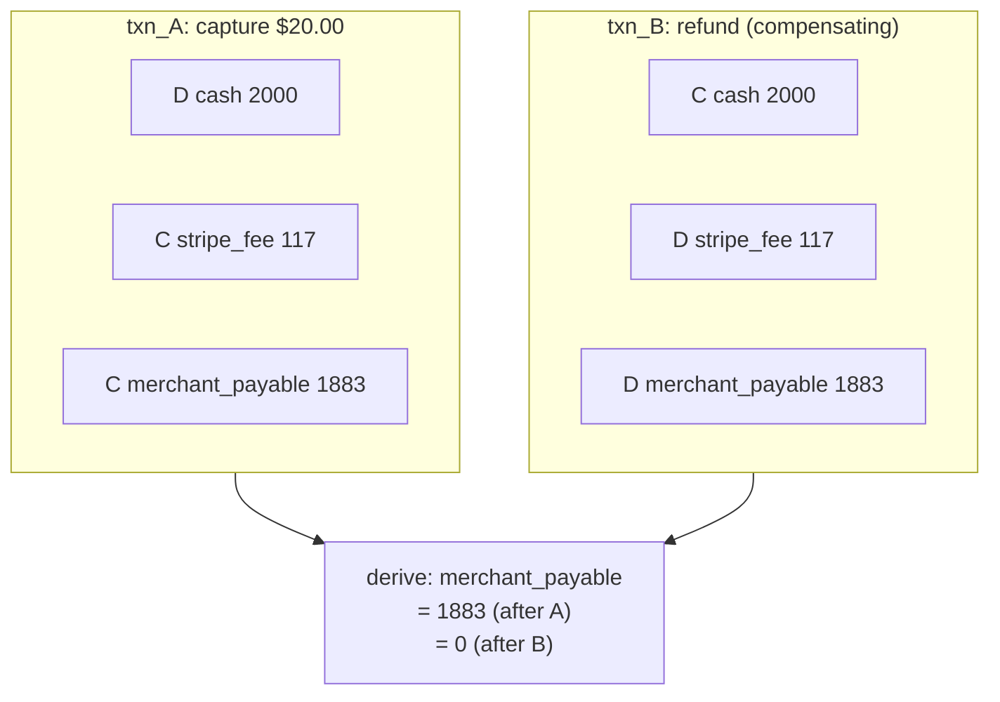
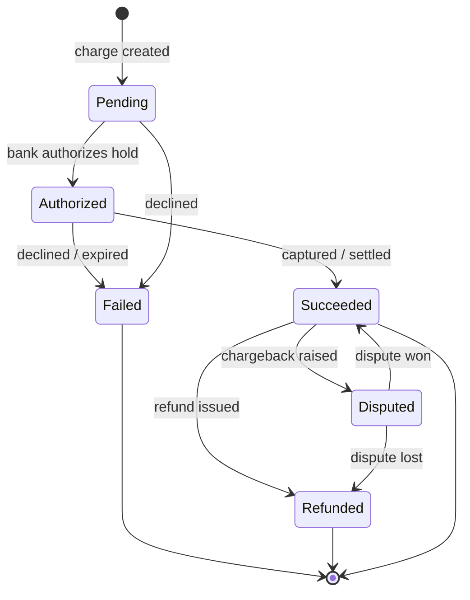
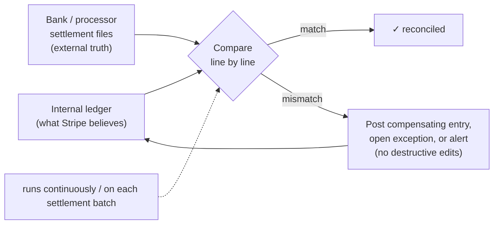
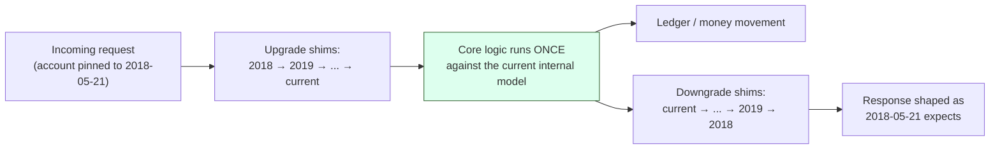
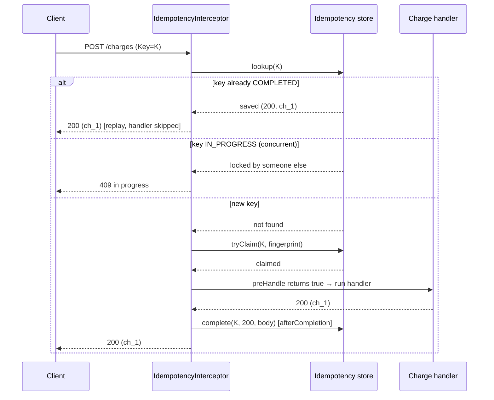

# Stripe — Idempotency, Ledgers & API Longevity

Stripe is the canonical engineering case study for a single, ruthless idea: **in a payments system, correctness is existential.** A web app that drops a search result loses a result; a payments API that double-charges a customer, or loses a charge it told the merchant succeeded, loses real money — and trust, and possibly its banking partnerships. Because every operation moves money that someone will eventually reconcile against a bank statement, Stripe's architecture is organized around a value most product companies only pay lip service to: *correctness over speed.* This case study unpacks the four mechanisms that make that value real in code — **idempotency keys**, **integer money + immutable double-entry ledgers**, **foreign state machines + reconciliation**, and **decade-long API longevity through versioned transformation** — and maps each one to concrete Java/Spring practice you can apply tomorrow.

> [!NOTE]
> **Prerequisites.** This topic assumes you understand [idempotency and deduplication](../C02-distributed-systems-and-system-design/T07-idempotency-and-deduplication.md) (idempotent operations, dedup windows, request fingerprints) and [distributed transactions, 2PC and saga](../C02-distributed-systems-and-system-design/T06-distributed-transactions-2pc-saga.md) (why a single ACID transaction can't span services or external banks). Stripe's design is essentially "how do you get correctness when 2PC across a bank is impossible?"

## Context: Why Correctness Is The Product

Stripe sells an API. The differentiator was never raw payment processing — banks already did that — it was a *developer-facing API so clean and reliable that a startup could accept money in an afternoon.* That framing has two architectural consequences that drive everything below:

1. **The API contract is the product.** If you break it, you break thousands of merchants' checkout flows simultaneously. So the external contract must be near-immortal (see API longevity).
2. **Money is the data.** Every record is auditable and must net to zero against external reality. So the data model is an accounting ledger, not a CRUD table, and every state-changing call must be safe to retry.



The recurring theme: Stripe controls its own database but **does not control the network to the merchant** (left edge) nor **the banks** (right edge). Both edges are unreliable and asynchronous. Idempotency tames the left edge; reconciliation tames the right edge; the ledger is the source of truth in the middle.

> [!NOTE]
> **A way to feel the stakes.** Imagine your bank's app shows your account balance off by one cent after a transfer. You would not shrug — you would call the bank, because money you can't trust is money you don't have. Now multiply that one customer by every merchant on the platform and every one of *their* customers. A search engine that returns slightly-wrong results gets a shrug and a refresh; a payments platform that returns slightly-wrong *balances* gets lawsuits, churn, and a regulator's attention. That asymmetry — "wrong" costs almost nothing for a content app and almost everything for a money app — is the single fact that explains every design choice in this case study. When you read "correctness over speed" below, picture that phone call.

> [!TIP]
> **How to read this case study.** Each of the four mechanisms answers a different "what could go wrong?" question, and it helps to hold the question in mind as you read:
> - *"What if the customer's request arrives twice?"* → **idempotency keys**.
> - *"What if my arithmetic is off by a fraction of a cent?"* → **integer money + double-entry ledgers**.
> - *"What if the bank and I disagree about what happened?"* → **foreign state machines + reconciliation**.
> - *"What if I need to change my API but ten thousand merchants depend on the old shape?"* → **versioned transformation**.
> Every analogy, war story, and code sample in this topic hangs off one of these four questions.

## Idempotency Keys: The Signature Pattern

The network problem is fundamental and worth stating precisely, because the whole pattern exists to solve exactly one ambiguity:

> [!IMPORTANT]
> When a client sends `POST /v1/charges` and the connection dies before a response arrives, **the client cannot distinguish "my request never reached the server" from "the server processed it but the response was lost."** A naive retry risks charging twice. Not retrying risks never charging at all. There is no client-only solution — the server must help.

> [!TIP]
> **The coat-check analogy.** Think of an idempotency key as a **coat-check ticket**. You hand your coat to the attendant and get a numbered ticket. If you walk up to the counter and present that ticket twice — maybe you forgot you'd already collected your coat, maybe the line was confusing — you still get the *one* coat back, not two. The ticket *identifies a specific coat*, not "give me a coat." An idempotency key works exactly the same way: it identifies one specific logical operation ("charge *this* $20"), so presenting it twice returns the result of that one operation, never a second charge. And just as a coat-check counter would (rightly) refuse a ticket that doesn't match any coat it's holding, the server rejects a key whose request parameters don't match what it remembers. Hold this image — it makes every rule below obvious.

Stripe's answer is the **idempotency key**: the client generates a unique key (a UUID is typical) and sends it as an HTTP header on the mutating request:

```http
POST /v1/charges HTTP/1.1
Idempotency-Key: 8f1d3c2a-7b4e-4c19-9a2f-2e6b1d0c5a44
Content-Type: application/x-www-form-urlencoded

amount=2000&currency=usd&source=tok_visa
```

The contract: **a request with a given idempotency key is executed at most once.** Retries with the same key return the *same saved response* — same status, same body, same charge ID — without re-running the side effect.

### The Mechanism In Detail

What makes this real (and what interviewers probe) is the storage, locking, and fingerprinting. Stripe persists, keyed by `(account_id, idempotency_key)`:

- the **request fingerprint** — a hash of the route + relevant parameters,
- a **status / lock** indicating in-progress vs. completed,
- the **saved response** (status code + body) once the operation finishes,
- a **created-at timestamp** for TTL expiry (idempotency keys are remembered for roughly **24 hours**; after that the key is forgotten and a fresh request with the same key would execute again).

Three subtle rules fall out:

1. **Same key, same params → return the stored response.** This is the happy path of a retry.
2. **Same key, *different* params → reject with an error.** The fingerprint hash won't match the stored one, which means the client is reusing a key for a logically different request — almost always a client bug. Returning the *old* response would be silently wrong; Stripe returns an error instead.
3. **Two concurrent requests, same key → one wins, the other waits or is rejected.** This is the race that naive implementations miss. Stripe uses a lock (conceptually a row lock / unique constraint on the key) so the second concurrent request does not also execute the charge. It either blocks until the first completes and then returns that result, or returns a "request currently in progress" error.



The diagram shows the core win: the card was charged **once**, the client got the **same `ch_1`** on retry, and the second attempt never reached the bank. The merchant's idempotent retry loop is now *safe* — they can blindly retry on timeout.

> [!WARNING]
> **War story: the double-charged customer.** A real and extremely common failure looks like this. A mobile app fires `POST /charges` over a flaky cellular connection. The charge *succeeds* at the server, but the customer is in an elevator and the response never makes it back to the phone. The app's networking library sees a timeout and — following its own perfectly reasonable retry policy — fires the request again. With **no idempotency key**, the server has no way to know this is the same logical purchase, so it charges the card a *second* time. The customer sees two `$49.99` line items on their statement, opens a dispute, leaves a one-star review, and tells the support team "your app charged me twice." Engineering spends a day reading logs to confirm what the customer already knew. The fix is one HTTP header: had the retry carried the same `Idempotency-Key`, the second attempt would have returned the *first* charge's response and the card would never have been touched again. This is why the rule is "**every retried mutation carries a key**" — not "keys are nice to have." The cost of forgetting is a double charge in production.

> [!NOTE]
> **In Practice — where to generate the key.** A subtle real-world point: the *client* must generate the key, and it must generate it **once per logical operation, then reuse it across retries.** A frequent bug is generating a fresh UUID inside the retry loop — now every attempt has a different key and the whole mechanism does nothing. In a mobile or web client, generate the key when the user taps "Pay," store it with the pending request, and attach that *same* key to every retry of that request until you get a definitive success or failure. Treat the key like the coat-check ticket you put in your pocket: you keep handing over the *same* ticket, not a new one each time you approach the counter.

> [!TIP]
> Idempotency keys only protect **mutating** requests (`POST`, sometimes `DELETE`). `GET` is already idempotent by HTTP semantics. Scope the key per account so two merchants who happen to generate the same UUID never collide, and make the client — not the server — generate the key, because only the client knows that two transmissions are "the same logical request."

See [idempotency and deduplication](../C02-distributed-systems-and-system-design/T07-idempotency-and-deduplication.md) for the general theory (dedup windows, the difference between idempotent *operations* and idempotent *delivery*, and natural idempotency keys derived from business identifiers).

### When You Need Idempotency (And When You Don't)

The instinct to reach for idempotency keys *everywhere* is as wrong as forgetting them. The deciding question is simple: **"if this operation runs twice, does something bad happen that the user can observe or that costs money?"** If yes, you need idempotency. If no, you're adding machinery for nothing.

**You need it for any retried mutation with a real side effect:**

- **Charging a card / moving money.** The canonical case — a double charge is real money lost.
- **Sending an email, SMS, or push notification.** Retried without a key, a "your order shipped" email goes out three times; a "reset your password" SMS triple-fires and looks like an attack. The dedup key here is often a natural business identifier (`order_id + "shipped"`) rather than a random UUID.
- **Creating an order / booking / reservation.** A retried "place order" can create three orders for one cart; a retried "book seat 14C" can oversell the flight.
- **Provisioning a resource.** "Create a VM," "issue an API token," "open a bank account" — each duplicate costs money or creates a dangling resource.
- **Decrementing inventory or credits.** A retried "spend 100 credits" can charge the user 300.

**You usually don't need it for:**

- **Reads (`GET`).** Already idempotent by HTTP semantics — running a query twice changes nothing.
- **Naturally idempotent writes.** `PUT /users/42 {name: "Ana"}` sets a field to a value; running it twice leaves the same value. Setting a flag to `true` twice is harmless. The operation's *meaning* is already "make the world be in this state," so duplicates converge.
- **Operations keyed by a unique business constraint that already rejects duplicates.** If `username` is `UNIQUE`, a retried "register username `ana`" fails the second time on its own — though you may still want a key so the retry returns the *original success* rather than a confusing "already taken" error.

> [!TIP]
> **A quick litmus test.** Ask: *"Is this operation a counter increment or a value assignment?"* Counter-style operations ("add a charge," "send another email," "create another order") are **not** naturally idempotent and need a key. Assignment-style operations ("set name to X," "mark as read") usually are. When in doubt for anything touching money, add the key — the cost is a few bytes and a lookup; the cost of being wrong is a customer's bank statement.

### Choosing The Dedup Store: Redis vs. A Database Unique Constraint

Once you've decided you need idempotency, *where* you store the keys is a real architectural choice with trade-offs. There is no universally right answer — there is a right answer **for your durability requirement.**

| Concern | Redis (`SET NX EX`) | DB `UNIQUE` constraint |
| --- | --- | --- |
| **Speed** | Microsecond in-memory lookups; great for very high throughput. | A DB round-trip + index check; still fast, but slower than Redis. |
| **Durability** | Depends on persistence config; a crash between write and fsync *can* lose recent keys. Risky for money if misconfigured. | As durable as the rest of your data — the key is committed in the same WAL as everything else. |
| **Atomicity with the side effect** | The key lives in a *different* system from your business data, so "store key" and "write the charge" can't share one transaction → a window where they disagree. | You can `INSERT` the key **in the same DB transaction** as the ledger entry, so they commit or roll back together. This is the killer feature for correctness-critical paths. |
| **TTL / expiry** | Built in (`EX 86400`) — Redis evicts the key for you. | You add a `created_at` and a background sweep job, or filter on read. More code. |
| **Operational cost** | Another stateful service to run, monitor, and capacity-plan. | Reuses the database you already operate. |

> [!IMPORTANT]
> **The decision rule.** If the idempotent operation's side effect *is a database write you control* (creating an order, posting a ledger entry), prefer the **DB unique constraint**, because you can make the key and the side effect commit atomically in one transaction — there's no window where the key exists but the charge doesn't, or vice versa. Reach for **Redis** when you need extreme throughput, when the side effect is *external* (calling a third-party API, where atomicity with your DB is impossible anyway), or when the keyspace is huge and short-lived and you don't want it bloating your primary database. Many mature systems use both: Redis as a fast first-line guard to shed obvious duplicates, with a DB unique constraint as the durable backstop that actually guarantees correctness.

## At-Least-Once + Idempotency = Effectively-Once

A frequent confusion is the dream of "exactly-once delivery." Over an unreliable network, **true exactly-once delivery is impossible** — the FLP/Two Generals intuition applies: the sender can never be certain a message arrived, so to guarantee delivery it must be willing to resend, which means messages can arrive more than once. You get to pick:

- **At-most-once:** never retry → may lose messages (unacceptable for a charge).
- **At-least-once:** always retry until acknowledged → may *duplicate* messages.

Stripe chooses **at-least-once delivery** and then makes duplicate *processing* harmless with idempotent handlers. The combination yields **effectively-once** (a.k.a. "exactly-once *processing*") semantics — the observable outcome is as if the operation ran exactly once, even though the message may have been delivered several times.



> [!IMPORTANT]
> The slogan to remember: **you cannot make the network exactly-once, so you make the *processing* idempotent.** This same pattern reappears everywhere in backend work — Kafka consumers (`enable.idempotence`, dedup on a message key), webhook receivers (dedupe on event ID), and outbox-pattern publishers all rely on at-least-once delivery + idempotent application.

## Money Representation: Integers, Never Floats

Before a ledger can be correct, the *numbers* must be correct. Stripe represents amounts as **integers in the smallest currency unit** ("minor units"): `2000` means **$20.00 USD** (2000 cents), `500` means ¥500 (the yen has no minor unit, so the smallest unit *is* the yen). The amount is always an integer count of the smallest unit plus a currency code.

Why never floating point? Because IEEE-754 binary floating point **cannot exactly represent most decimal fractions**, including 0.10. The textbook demonstration:

```java
// WRONG — money as double
double a = 0.1, b = 0.2;
System.out.println(a + b);          // 0.30000000000000004  ❌
System.out.println(a + b == 0.3);   // false                ❌

// A 10-cent item summed 1000 times drifts off the true $100.00:
double total = 0.0;
for (int i = 0; i < 1000; i++) total += 0.10;
System.out.println(total);          // 100.00000000000007   ❌
```

Those tiny errors accumulate, and in money a sub-cent drift across millions of transactions is both an accounting failure and, sometimes, a fraud/compliance problem. The fixes in Java:

```java
// RIGHT (Stripe-style): integer minor units. Exact, fast, compact.
long amountMinor = 2000L;           // $20.00 as cents
long currencyCode;                  // store ISO-4217 "usd" separately
// $20.00 + $0.30 fee:
long net = 2000L + 30L;             // = 2030, exact

// RIGHT (when you need decimal math, e.g. tax/interest): BigDecimal.
BigDecimal price = new BigDecimal("19.99");   // string ctor, NOT new BigDecimal(19.99)
BigDecimal tax   = price.multiply(new BigDecimal("0.0825"))
                        .setScale(2, RoundingMode.HALF_EVEN);   // explicit rounding
```

> [!WARNING]
> Two classic Java traps. (1) `new BigDecimal(0.1)` takes a `double` and faithfully copies its *binary* imprecision — `0.1000000000000000055...`. Always use the **`String` constructor**: `new BigDecimal("0.1")`. (2) `BigDecimal.equals` compares scale too, so `new BigDecimal("2.0").equals(new BigDecimal("2.00"))` is `false` — use `compareTo() == 0` for value equality. For most payment code, prefer storing a `long` of minor units and only reach for `BigDecimal` where genuine decimal arithmetic (percentages, currency conversion, rounding rules) is required.

> [!WARNING]
> **War story: the float that broke reconciliation.** A team stored line-item prices as `double` "because it was easier." Each invoice summed dozens of items, and the per-invoice rounding error was sub-cent — invisible in the UI, which displayed two decimals. But the payment processor computed the *same* invoice total using exact decimal arithmetic, so its number and the team's number differed by a penny here and there. At the end of the month the **reconciliation loop** (see below) compared the team's ledger to the processor's settlement file and found *thousands* of one-cent mismatches. None of them was individually a bug anyone could point at — they were the accumulated residue of `0.1 + 0.2 != 0.3` repeated across millions of line items. The cleanup took weeks: every historical invoice had to be recomputed in integer cents and re-reconciled. The lesson is brutal and simple: **a money bug doesn't announce itself as a crash. It announces itself as a reconciliation mismatch weeks later, by which point it's everywhere.** Storing `long` cents from day one would have made the entire class of bug impossible — the arithmetic is exact, so the team's total and the processor's total can never silently drift.

> [!TIP]
> **The penny-jar analogy.** Integer minor units are like counting a jar of physical coins: there is no such thing as "0.7 of a penny" in the jar, so you can never lose or invent a fraction — every count is exact and repeatable. Floating-point money is like estimating the jar's value by weighing it: fast, *approximately* right, and guaranteed to disagree with an actual coin count by a little. For money you always do the coin count, never the weigh-in.

## The Double-Entry Ledger

Stripe's source of truth for money is an **immutable, append-only, double-entry ledger** — the same model invented for accounting centuries ago, because it is *self-checking*. Every monetary event records balanced **debits** and **credits** across accounts, and the system maintains one inviolable invariant:

> **For every transaction, the sum of debits equals the sum of credits. The whole ledger always nets to zero.**

> [!TIP]
> **The checkbook analogy.** Double-entry bookkeeping is like keeping a checkbook where **every entry must balance or you know you made a mistake.** When you write a check, you don't just scribble "money left" — you record where it came *from* and where it went *to*, and the two sides must agree. If you sit down to balance the checkbook against the bank statement and the numbers don't line up, that disagreement is itself the alarm: it tells you, precisely, that an entry is wrong *somewhere*, before the error can compound. The genius of the centuries-old technique is that it's **self-checking** — correctness isn't something you hope for, it's something the structure forces. A single-entry system (just a running balance you increment and decrement) has no such alarm: if you fat-finger a number, nothing complains, and the error silently lives in your balance forever. The whole reason payment systems use double-entry is to get that built-in alarm on every single money movement.

If a bug ever posts an unbalanced entry, the invariant breaks loudly and immediately — you cannot silently lose or conjure money. Consider a $20.00 charge with a $0.59 + 2.9% fee:



The two properties that make this powerful:

- **Immutability / append-only.** You never `UPDATE` or `DELETE` a posted entry. A correction is a *new* compensating entry (a reversal), so the full history is preserved. This is what gives you **auditability** — you can replay the ledger from the beginning to reconstruct any balance at any point in time, and an auditor can verify nothing was tampered with.
- **Double-entry.** Because every movement touches at least two accounts and must balance, the ledger is *internally consistent by construction*. This is precisely what makes **reconciliation** tractable: you can sum an account's entries and compare to external truth.

A balance is therefore never a stored mutable number you increment (that would be lossy and race-prone). It is a **derived value**: `balance(account) = Σ credits − Σ debits` over the immutable entries. In practice high-volume ledgers keep periodic *snapshots/checkpoints* so you don't re-sum all of history on every read, but the snapshot is always reproducible from the entries.

> [!TIP]
> This connects directly to **event sourcing**: the ledger *is* an event log, and the balance is a projection. The same discipline — never mutate history, derive state by folding events — gives you time-travel debugging, audit trails, and correctness-by-replay for free.

### A Worked Double-Entry Posting (With Numbers)

Diagrams are abstract; let's post a real charge and a real refund as concrete table rows so you can see the invariant hold and the balance get *derived* rather than stored. We model three internal accounts: `cash` (money Stripe is holding), `stripe_fee` (Stripe's revenue), and `merchant_payable` (what Stripe owes the merchant). A customer pays **$20.00**; Stripe's fee is **$1.17**; the merchant is owed the **$18.83** remainder.

**Transaction `txn_A` — capture a $20.00 charge:**

| entry | txn_id | account | direction | amount_minor | running meaning |
| --- | --- | --- | --- | --- |
| 1 | `txn_A` | `cash` | **D** (debit) | `2000` | Stripe now holds $20.00 in cash |
| 2 | `txn_A` | `stripe_fee` | **C** (credit) | `117` | Stripe earned $1.17 in fees |
| 3 | `txn_A` | `merchant_payable` | **C** (credit) | `1883` | Stripe owes the merchant $18.83 |

Check the invariant: debits `= 2000`; credits `= 117 + 1883 = 2000`. **Balanced.** ✅ Notice every number is an integer count of cents — no float anywhere.

Now the merchant balance is *derived*, not stored. Using the convention "credits add, debits subtract" for a payable (liability) account:

```text
balance(merchant_payable) = Σ credits − Σ debits
                          = 1883 − 0
                          = 1883  → $18.83 owed to the merchant
```

**Transaction `txn_B` — the customer requests a full refund.** We do **not** edit or delete `txn_A`. We post a *new, compensating* transaction that reverses the money movement. (Assume the fee is returned too, for simplicity.)

| entry | txn_id | account | direction | amount_minor | running meaning |
| --- | --- | --- | --- | --- |
| 4 | `txn_B` | `cash` | **C** (credit) | `2000` | $20.00 leaves Stripe's cash (back to the customer) |
| 5 | `txn_B` | `stripe_fee` | **D** (debit) | `117` | the $1.17 fee is reversed |
| 6 | `txn_B` | `merchant_payable` | **D** (debit) | `1883` | Stripe no longer owes the merchant the $18.83 |

Invariant for `txn_B`: credits `= 2000`; debits `= 117 + 1883 = 2000`. **Balanced.** ✅ Re-derive the merchant balance over *all* entries:

```text
balance(merchant_payable) = Σ credits − Σ debits
                          = 1883 − 1883
                          = 0   → the merchant is owed nothing; fully refunded
```

The full history is intact: an auditor can see exactly that a charge happened *and then* a refund happened. Nothing was overwritten. This is the entire ledger philosophy in six rows — **append a balanced set, never mutate, derive the balance.**



> [!NOTE]
> **In Practice — why a refund is a new transaction, not an `UPDATE`.** A junior instinct is to "undo" the charge by flipping its status column to `refunded` or deleting the rows. That destroys the audit trail and, worse, makes concurrent reads race-prone and historical reports wrong. The mature move — and the one every real ledger uses — is to leave the original entries frozen and post a *compensating* transaction that nets them out. The balance falls to zero not because you erased the charge, but because the refund offsets it. Same reason accountants never erase ink: they draw a new line.

## Foreign State Machines & Reconciliation

A charge is not instantaneous and Stripe does not own the money's whole journey. A card charge moves through a **lifecycle (a state machine)**, and part of that state lives at **external processors and banks Stripe cannot control or directly transact with.** Stripe must *track* foreign state it can only observe asynchronously.



The hard part: the transition from `Authorized` to `Succeeded` (settlement) and events like `Disputed` (chargebacks, which can arrive **weeks later**) are driven by the bank, not by Stripe. Stripe's internal record is a *belief* about external reality that can drift. Closing that gap is the job of the **reconciliation loop**: a continuous, idempotent batch process that compares Stripe's ledger against the authoritative external records (bank settlement files, processor reports) and flags or auto-corrects any divergence.



Notice the design choices echo earlier sections: corrections are **compensating entries** (append-only, never destructive), and the loop is **idempotent** so re-running it over the same settlement file is safe. Because 2PC across a bank is impossible (you can't hold a lock inside someone else's bank — see [distributed transactions, 2PC and saga](../C02-distributed-systems-and-system-design/T06-distributed-transactions-2pc-saga.md)), reconciliation is the *eventually-consistent* substitute: detect divergence after the fact and converge via compensation. This is a saga-shaped pattern: forward steps plus compensating actions, with the ledger recording every step.

> [!TIP]
> **The two-friends-splitting-a-bill analogy.** Reconciliation is what happens when two friends each keep their own running tally of who owes whom after a weekend trip. Neither tally is automatically authoritative; they only find out they disagree when they sit down at the end and compare line by line — "wait, I have you paying for dinner Friday, but you don't." The *act of comparing* is what surfaces the discrepancy, and then they resolve it with a single corrective payment rather than tearing up the whole weekend's records. Stripe and the bank are those two friends, the settlement file is the bank's tally, the ledger is Stripe's, and the reconciliation loop is the sit-down. The crucial discipline: when they disagree, you **add a correcting entry**, you don't rewrite history to pretend the disagreement never happened.

> [!WARNING]
> **War story: when the processor and your ledger disagree.** Here's a divergence that actually happens. Stripe authorizes a charge and records it as `Succeeded` in its ledger — its *belief* is "this $50 settled." But at the bank, the cardholder's account had insufficient funds at settlement time, so the bank silently *reverses* it in the nightly settlement file. Now the two records disagree: Stripe's ledger says `+$50`, the bank's file says `$0`. Nobody threw an exception; no API call failed; the disagreement is pure data drift discovered hours later. The reconciliation loop reads the settlement file, compares it line-by-line to the ledger, and finds the mismatch. Its response is *not* to silently flip the original entry — it posts a **compensating** transaction (a reversal) that brings the ledger back into agreement with the bank, and opens an exception ticket so a human can see what happened. The merchant, who was *not* told the money had settled (because the system exposes the honest state machine, not the optimistic belief), is never paid out for a charge that didn't really clear. This is the entire reason the loop exists: **your database's belief about money held at a bank is a hypothesis, and reconciliation is the experiment that confirms or refutes it — continuously, idempotently, and non-destructively.**

> [!WARNING]
> "Eventually consistent with external reality" means **your database can be temporarily wrong** and you must design for it: never tell a merchant money has *settled* based only on your internal `pending` belief; expose the state machine honestly; and make every step reversible via compensation rather than in-place edits.

## API Longevity: Never Break The Contract

Stripe is famous for an extreme commitment: **old API integrations keep working for years, untouched.** A merchant who integrated in 2015 can, in principle, still run that exact code. This is not laziness about deprecation — it is a deliberate strategy that *decouples the internal model from the external contract.*

> [!TIP]
> **The wall-sockets analogy.** Date-based API versioning is like **keeping the old wall sockets working so you never have to rewire every customer's house.** When a country introduces a new electrical standard, it does *not* march into every home and rip out the existing outlets — that would break every appliance everyone owns, all at once. Instead the old sockets keep delivering power exactly as they always did, while new construction uses the new standard, and homeowners upgrade on *their* schedule, if ever. Stripe's API is the wall socket and merchants' integrations are the appliances plugged into it. Stripe is free to renovate everything *behind the wall* — rewire the whole house's internals — as long as the socket on the surface keeps delivering the same shape of response to the appliance that was built against it. The merchant who "plugged in" in 2015 never has to touch their wiring; their code keeps getting power. That promise — *we change our internals, never your socket* — is the whole product strategy in one image.

The mechanism is **date-based API versioning pinned per account.** Versions look like `2020-08-27`. When an account first makes a request, it is **pinned** to the then-current version; that pin is sticky. Stripe can evolve its internal data model freely, ship new versions with breaking changes, and *every old account keeps receiving responses shaped exactly as its pinned version expects* — until the merchant explicitly upgrades.

How does one codebase serve dozens of historical contracts without drowning in `if (version < X)` branches everywhere? Through a **chain of versioned transformation shims**:



The key ideas:

1. **One internal representation.** Core business logic is written *once* against the latest model. It does not know or care which API version the caller uses.
2. **Upgrade on the way in, downgrade on the way out.** A request arriving in an old shape is passed through a *chain* of small, independent **version-change** transformations, each of which knows how to convert *one* version forward to the next. The output is downgraded back through the inverse chain.
3. **Each version change is a tiny, isolated, well-tested unit.** Adding a new version means writing one more forward/backward transformer, not editing the core. Old transformers, once written, almost never change — which is exactly why decade-old integrations keep working.

The transferable lesson — and one of the highest-leverage ideas in this whole book — is:

> [!IMPORTANT]
> **Decouple your internal model from your external contract.** Your database schema, domain objects, and service internals should be free to evolve. The public API is a *stable projection* of them, maintained by an explicit translation layer. Never let an internal refactor leak into a breaking API change. Additive changes (new optional fields) are safe; removals and renames are not — version them instead.

> [!WARNING]
> **War story: the rename that would have broken thousands of integrations.** A team decided to rename a field in their JSON response from `card` to `payment_method` because the company now supported bank transfers and wallets, not just cards, and `card` was misleading. Internally this was the *right* model change. Shipped naively, it would have been a catastrophe: every merchant whose code read `response.card.last4` would suddenly read `undefined`, and checkout pages across thousands of integrations would break the moment the deploy went out — with no warning, because the merchants did nothing wrong. The team caught it in review and instead shipped it as a **new API version** with a `downgrade` shim: clients pinned to old versions keep seeing the field as `card`, clients on the new version see `payment_method`, and the internal model uses the new name everywhere. *Zero* integrations broke. The renovation happened behind the wall; every old socket kept delivering `card`. This is the difference between a versioned platform and a fragile one: in a fragile API, "we improved our internal naming" silently becomes "we broke your checkout"; in a versioned one, the two events are completely decoupled.

> [!NOTE]
> **In Practice — additive is free, breaking is expensive.** A practical rule you can apply today, even without Stripe's full version-chain machinery: **adding a new optional field is always safe** — old clients ignore what they don't read. **Removing or renaming a field, or changing its type or meaning, is a breaking change** — old clients will misread or crash. So evolve by *adding* whenever you can (introduce `payment_method` alongside `card`, keep both populated for a deprecation window), and only when you genuinely must remove the old shape do you reach for per-version transformation. Most "API changes" turn out to be additive if you're disciplined, which is why most teams never need the full shim chain — but knowing the pattern exists is what lets you promise longevity when you *do* need it.

## Reliability Culture (Briefly)

None of the above survives contact with reality without an engineering culture to match. Stripe's practices reinforce the architecture: **heavy automated testing** (so refactors of the internal model don't break old API versions), **rigorous code review** for money-touching code, and a systemic insistence that **everything be safe to retry** — which is only possible *because* idempotency and append-only ledgers are baked in at the foundation. The culture and the architecture are the same decision viewed from two angles: correctness is a property you design in, not a thing you test in afterward.

## Java / Spring: How To Build This Yourself

These patterns are not Stripe-exclusive. Here is how a Java backend engineer implements each one.

### 1. An Idempotency Filter / Interceptor

Read the `Idempotency-Key` header, look it up in a fast store (Redis or a DB table with a `UNIQUE` constraint), and either replay the stored response or proceed and store it. A `HandlerInterceptor` (or servlet `Filter`) is the natural seam:

```java
@Component
public class IdempotencyInterceptor implements HandlerInterceptor {

  private final IdempotencyStore store;   // backed by Redis or JDBC

  @Override
  public boolean preHandle(HttpServletRequest req, HttpServletResponse res, Object handler)
      throws Exception {
    if (!"POST".equals(req.getMethod())) return true;          // only guard mutations
    String key = req.getHeader("Idempotency-Key");
    if (key == null) return true;                              // or reject, per policy

    String fingerprint = sha256(req.getRequestURI() + "|" + cachedBody(req));
    var existing = store.lookup(accountId(req), key);

    if (existing != null) {
      if (!existing.fingerprint().equals(fingerprint)) {       // rule 2: same key, diff params
        res.sendError(422, "Idempotency-Key reused with different parameters");
        return false;
      }
      replay(res, existing.savedResponse());                  // rule 1: return stored response
      return false;                                            // short-circuit the handler
    }
    // rule 3: claim the key atomically; loser of the race gets 409
    if (!store.tryClaim(accountId(req), key, fingerprint)) {
      res.sendError(409, "A request with this Idempotency-Key is already in progress");
      return false;
    }
    return true;   // proceed; afterCompletion stores the response under this key
  }
  // ... afterCompletion(...) persists (status, body) and releases the lock ...
}
```

The atomic claim is the crux. With Redis, use `SET key value NX EX 86400` (set-if-absent with a 24h TTL). With a relational DB, lean on a `UNIQUE` constraint:

```sql
CREATE TABLE idempotency_key (
  account_id     BIGINT       NOT NULL,
  idem_key       VARCHAR(255) NOT NULL,
  fingerprint    CHAR(64)     NOT NULL,
  response_code  INT,
  response_body  TEXT,
  status         VARCHAR(16)  NOT NULL DEFAULT 'IN_PROGRESS',
  created_at     TIMESTAMPTZ  NOT NULL DEFAULT now(),
  PRIMARY KEY (account_id, idem_key)        -- INSERT fails for a concurrent duplicate
);
-- a background job (or a WHERE created_at > now() - 24h read) enforces the TTL
```

The first `INSERT` wins; the concurrent duplicate gets a constraint violation, which the code maps to "in progress." This is the database doing your concurrency control for free.

The `preHandle` above only does half the job — it *claims* the key. The other half is **storing the response after the handler runs** so future retries can replay it. That's `afterCompletion`, plus the small store contract both halves share. Here is the fuller picture, end to end:

```java
@Component
public class IdempotencyInterceptor implements HandlerInterceptor {

  private final IdempotencyStore store;

  // ... preHandle from above: claim key, replay stored response, or 409 ...

  @Override
  public void afterCompletion(HttpServletRequest req, HttpServletResponse res,
                              Object handler, Exception ex) {
    if (!"POST".equals(req.getMethod())) return;
    String key = req.getHeader("Idempotency-Key");
    if (key == null) return;

    int status = res.getStatus();
    if (ex != null || status >= 500) {
      // transient server error: RELEASE the claim so the client's retry can try again.
      // (Do NOT store a 500 — a retry should get a real attempt, not a cached failure.)
      store.release(accountId(req), key);
      return;
    }
    // success (or a deterministic 4xx): freeze the response so retries replay it verbatim.
    store.complete(accountId(req), key, status, capturedBody(res));
  }
}

/** The store contract both halves rely on. */
interface IdempotencyStore {
  /** Atomically claim the key. Returns false if someone else already holds it. */
  boolean tryClaim(long accountId, String key, String fingerprint);
  /** Look up a prior record (fingerprint + saved response), or null if unseen. */
  Record lookup(long accountId, String key);
  /** Persist the final (status, body) under the key and mark it COMPLETED. */
  void complete(long accountId, String key, int status, byte[] body);
  /** Release an IN_PROGRESS claim so a retry can re-attempt (used on transient failure). */
  void release(long accountId, String key);

  record Record(String fingerprint, Integer status, byte[] body, Status state) {}
  enum Status { IN_PROGRESS, COMPLETED }
}
```

Two production-grade subtleties this fuller version surfaces:

1. **Don't cache transient failures.** If the handler blew up with a 500 or threw, you must *release* the claim (or mark it failed), not store the error. Otherwise the client's perfectly valid retry would replay a stale 500 forever. Only freeze *deterministic* outcomes — successes, and 4xx errors that will happen identically on retry (like "amount must be positive").
2. **Capturing the response body** requires wrapping the response in a `ContentCachingResponseWrapper` (Spring provides one) so you can read the bytes the handler wrote *and* still flush them to the client. The same trick (`ContentCachingRequestWrapper`) lets `preHandle` read the request body for the fingerprint without consuming the stream the handler needs.



This is the same three-rule machine from the conceptual section — replay on match, 409 on concurrent duplicate, execute-then-store on a fresh key — now wired through Spring's interceptor lifecycle.

### 2. Money As `long` Minor Units (or `BigDecimal`)

Make illegal states unrepresentable with a small value type, and never expose a raw `double` for money anywhere in the codebase:

```java
public record Money(long minorUnits, Currency currency) {
  public Money plus(Money other) {
    if (!currency.equals(other.currency))
      throw new IllegalArgumentException("currency mismatch");
    return new Money(Math.addExact(minorUnits, other.minorUnits), currency);  // overflow-checked
  }
  public static Money usd(long cents) { return new Money(cents, Currency.getInstance("USD")); }
}
```

Persist it as a `BIGINT` column (`amount_minor`) plus a `currency` column — never a `FLOAT`/`DOUBLE`. Reserve `BigDecimal` (with an explicit `RoundingMode`) for tax, interest, and FX conversion.

A fuller `Money` type guards more illegal states and shows exactly where `BigDecimal` is and isn't appropriate:

```java
public record Money(long minorUnits, Currency currency) {

  public Money {                                   // compact constructor: validate on creation
    Objects.requireNonNull(currency, "currency");
  }

  public Money plus(Money o)  { requireSameCurrency(o); return new Money(Math.addExact(minorUnits, o.minorUnits), currency); }
  public Money minus(Money o) { requireSameCurrency(o); return new Money(Math.subtractExact(minorUnits, o.minorUnits), currency); }

  /** Percentage math (tax, fee). HERE BigDecimal is correct — we need a fractional rate. */
  public Money percentage(BigDecimal rate, RoundingMode rounding) {
    BigDecimal result = BigDecimal.valueOf(minorUnits)
                                  .multiply(rate)
                                  .setScale(0, rounding);     // back to whole minor units
    return new Money(result.longValueExact(), currency);
  }

  private void requireSameCurrency(Money o) {
    if (!currency.equals(o.currency))
      throw new IllegalArgumentException("currency mismatch: " + currency + " vs " + o.currency);
  }

  public static Money usd(long cents) { return new Money(cents, Currency.getInstance("USD")); }
}
```

> [!WARNING]
> **The `BigDecimal` pitfalls, collected.** When you *do* reach for `BigDecimal`, four traps bite repeatedly: **(1)** `new BigDecimal(0.1)` (the `double` constructor) copies binary imprecision — always pass a `String`: `new BigDecimal("0.1")`, or `BigDecimal.valueOf(longOrDouble)` which routes through `Double.toString`. **(2)** `equals` is scale-sensitive — `new BigDecimal("2.0").equals(new BigDecimal("2.00"))` is `false`; use `compareTo(...) == 0` for value equality, and beware that this also breaks `HashSet`/`HashMap` membership. **(3)** `divide` with a non-terminating result (e.g. `1/3`) throws `ArithmeticException` unless you supply a scale and `RoundingMode` — *always* pass both. **(4)** Rounding is a *business* decision, not a default: pick `RoundingMode.HALF_EVEN` ("banker's rounding," which avoids the upward bias of `HALF_UP` over many operations) unless a regulation says otherwise, and apply it explicitly with `setScale`. The meta-lesson: `BigDecimal` is *exact* but *fussy*; it removes the float-imprecision class of bug only if you use the `String`/`valueOf` constructors and never let a rounding mode default.

> [!TIP]
> **In Practice — the `long` cents vs. `BigDecimal` decision.** Default to **`long` minor units** for stored amounts and additive money movement (charges, fees, balances) — it's exact, compact (8 bytes), overflow-checkable with `Math.addExact`, and trivially indexable in the database. Switch to **`BigDecimal`** only at the moments you genuinely do fractional arithmetic — applying a tax rate, computing interest, converting currencies at an FX rate — and the instant you're done, round back to whole minor units and store the `long`. In other words: `long` for *holding and moving* money, `BigDecimal` for the brief *calculation* that produces a new whole-cent amount. Never let a `double` near any of it.

### 3. An Append-Only Ledger Table

Model entries, not balances. Each transaction inserts a *balanced set* of rows in one DB transaction:

```sql
CREATE TABLE ledger_entry (
  id           BIGINT GENERATED ALWAYS AS IDENTITY PRIMARY KEY,
  txn_id       UUID         NOT NULL,        -- groups the balanced set
  account      VARCHAR(64)  NOT NULL,        -- e.g. 'merchant_net', 'stripe_fee'
  direction    CHAR(1)      NOT NULL CHECK (direction IN ('D','C')),  -- Debit / Credit
  amount_minor BIGINT       NOT NULL CHECK (amount_minor > 0),
  currency     CHAR(3)      NOT NULL,
  created_at   TIMESTAMPTZ  NOT NULL DEFAULT now()
  -- NO update/delete: corrections are new compensating txns
);
```

Enforce the invariant before commit (in app code or a deferred constraint): `Σ(debits) == Σ(credits)` for each `txn_id`. Compute balances with a query (`SUM(CASE WHEN direction='C' THEN amount_minor ELSE -amount_minor END)`), optionally snapshotting periodically. Revoke `UPDATE`/`DELETE` on the table at the DB-grant level so immutability is enforced by the database, not by convention.

### 4. An API-Versioning Transformation Layer

Pin each client to a version, keep core logic version-agnostic, and chain small transformers:

```java
interface VersionChange {
  ApiVersion from();                         // e.g. 2019_10_17
  ApiVersion to();                           // e.g. 2020_03_02
  ObjectNode upgrade(ObjectNode req);        // forward: old shape -> newer shape
  ObjectNode downgrade(ObjectNode res);      // backward: newer shape -> old shape
}

ObjectNode handle(ApiVersion clientVersion, ObjectNode rawRequest) {
  ObjectNode req = rawRequest;
  for (var change : changesFrom(clientVersion))   // upgrade IN, in order
      req = change.upgrade(req);
  ObjectNode res = core.process(req);             // core runs once, current model only
  for (var change : reversed(changesFrom(clientVersion)))  // downgrade OUT, reverse order
      res = change.downgrade(res);
  return res;                                     // shaped exactly as the client expects
}
```

Each `VersionChange` is independently unit-tested and, once shipped, frozen. Adding a version means appending one transformer — never touching `core`.

> [!INTERVIEW]
> **"A client calls your payment endpoint, gets a timeout, and retries. How do you guarantee they aren't charged twice?"** Strong answer: require a client-generated `Idempotency-Key` header. On the server, atomically claim the key (Redis `SET NX` or a DB `UNIQUE`-constrained insert) *before* doing the side effect; store the response keyed by it. A retry with the same key returns the stored response without re-executing; a concurrent duplicate loses the race and gets a 409. Add a request **fingerprint** so the *same key with different params* is rejected rather than silently returning a stale result, and a ~24h TTL. Then make the senior point: you cannot get exactly-once *delivery* over a network — you get at-least-once delivery + idempotent processing = effectively-once. Bonus depth: store money as integer minor units, record the charge in an append-only double-entry ledger so the operation is auditable and reconcilable, and note that the external bank settlement is reconciled asynchronously because you can't 2PC across a bank.

## Practice

1. **Trace the ambiguity.** In one paragraph, explain why a client that receives a network timeout on `POST /charges` *cannot* know whether the charge succeeded, and why this makes server-side idempotency mandatory rather than a client-only retry-with-backoff.
2. **Implement the race.** Write an idempotency store backed by Redis `SET key val NX EX 86400`. Fire two threads with the same key simultaneously and assert that exactly one executes the side effect and the other receives the first one's stored response (or a 409).
3. **Break the float.** In a JUnit test, sum `0.10` a thousand times as a `double` and assert it is *not* exactly `100.00`; then redo it with `long` cents and `BigDecimal("0.10")` and assert exactness. Explain why `new BigDecimal(0.1)` (double ctor) still fails.
4. **Build the ledger.** Create the `ledger_entry` table, post a `$20.00` charge as a balanced debit/credit set (net + fee), and write a query that derives the merchant balance. Then issue a refund as a *compensating* transaction (no `UPDATE`) and re-derive the balance.
5. **Version a field.** You renamed `card` to `payment_method` internally. Write a `VersionChange` whose `downgrade` re-emits the old `card` field for clients pinned to the older version, and a unit test proving an old client's response is unchanged.
6. **Reconciliation drill.** Sketch (in pseudocode) an idempotent reconciliation loop that reads a settlement file, compares each line to the ledger, and posts a compensating entry on mismatch — and argue why re-running it on the same file is safe.
7. **Choose the store.** For each operation, decide whether you'd dedup with Redis `SET NX` or a DB `UNIQUE` constraint, and justify in one sentence: (a) posting a ledger entry you control, (b) calling an external SMS provider, (c) a 50k-requests/second "mark notification read" endpoint. Tie each answer back to durability and same-transaction atomicity.
8. **Classify the operations.** Label each as *needs an idempotency key* or *naturally idempotent*: `POST /charges`, `PUT /users/42 {name}`, `POST /emails/order-shipped`, `GET /balance`, `POST /orders`, "set account status to `closed`." For the ones that need a key, say whether a random UUID or a natural business identifier is the better key.
9. **Round like a bank.** Compute 8.25% tax on `$19.99` two ways — once with `RoundingMode.HALF_UP` and once with `HALF_EVEN` — across a list of prices, and show a case where the two disagree by a cent. Explain why `HALF_EVEN` is the safer default for high-volume money math.
10. **Refund without `UPDATE`.** Take the worked `txn_A`/`txn_B` posting from the ledger section, implement it as real `INSERT`s, and write the single `SUM(CASE ...)` query that derives `merchant_payable`. Confirm it reads `1883` after `txn_A` and `0` after `txn_B` — without ever mutating a row.
11. **Avoid the breaking rename.** You must rename `card` to `payment_method` in your responses. Write the additive-first migration plan (introduce the new field, dual-write for a deprecation window, version the removal) and contrast it with the naive "just rename it" deploy, naming exactly what breaks for old clients and when.

## Recap

- **Correctness is existential at Stripe** because the data *is* money; the architecture optimizes for correctness over speed, with unreliable edges on both sides (the network to merchants, the banks behind settlement).
- **Idempotency keys** make mutating requests safe to retry: client-generated key → server stores fingerprint + locked status + saved response, ~24h TTL; same key+params replays the response, same key+different params errors, concurrent duplicates are serialized by a lock / `UNIQUE` constraint.
- **Exactly-once delivery is impossible**; Stripe uses **at-least-once delivery + idempotent processing = effectively-once**.
- **Money is integer minor units** (or `BigDecimal` with explicit rounding), **never `double`**, because binary floats can't represent decimal fractions exactly.
- **An immutable, append-only double-entry ledger** keeps debits == credits as an always-checkable invariant, gives auditability, derives balances rather than mutating them, and makes reconciliation possible.
- **Foreign state machines + reconciliation** track money held at external banks Stripe can't control; corrections are compensating entries, the loop is idempotent, and convergence is eventual because 2PC across a bank is impossible.
- **API longevity** comes from per-account, date-based version pinning plus a chain of upgrade/downgrade transformation shims around version-agnostic core logic — the embodiment of *decouple the internal model from the external contract.*
- **In Java/Spring:** a `HandlerInterceptor`/`Filter` + Redis `SET NX` or a `UNIQUE`-constrained table for idempotency; a `Money` value type over `long` minor units; an append-only `ledger_entry` table with debit/credit balancing; and a `VersionChange` chain for API versioning.
- **Mental models to keep:** an idempotency key is a **coat-check ticket** (same ticket → one coat, never two); double-entry bookkeeping is a **self-checking checkbook** (entries must balance or you know you erred); integer cents are a **penny jar** (exact count, no fractions to lose); reconciliation is **two friends comparing tallies** and settling the difference; and date-based API versioning is **keeping the old wall sockets live** so you never rewire every customer's house.
- **When idempotency is required vs. not:** required for any *counter-style* retried mutation with a real side effect — charges, emails/SMS, order/booking/resource creation, inventory or credit decrements; usually unnecessary for reads and *assignment-style* writes (`PUT name=X`, set-a-flag) that converge on retry. For money, when in doubt, add the key.
- **Choosing the dedup store:** prefer a **DB `UNIQUE` constraint** when the side effect is a DB write you control, because the key and the side effect can commit in **one atomic transaction**; reach for **Redis `SET NX`** for extreme throughput, external side effects, or huge short-lived keyspaces — many systems use Redis as a fast guard *plus* a DB constraint as the durable backstop.
- **The war stories distilled:** a missing idempotency key double-charges a customer whose mobile client retried a timed-out POST; `double` money silently drifts (`0.1 + 0.2 != 0.3`) until reconciliation surfaces thousands of penny mismatches weeks later; a bank reversal makes the processor and your ledger disagree, caught by the reconciliation loop and fixed with a compensating entry; and a naive `card` → `payment_method` rename would break thousands of integrations unless shipped as a new, downgrade-shimmed API version.
- **Additive-first API evolution:** adding a new optional field is always safe (old clients ignore it); removing/renaming/retyping a field is breaking — dual-write through a deprecation window and version the removal. Most "API changes" are additive if you're disciplined, so most teams rarely need the full transformation chain — but knowing it exists is what lets you promise decade-long longevity.

## Next

Continue to [Discord — Storage Evolution (Cassandra to ScyllaDB)](./T03-discord-storage-evolution-cassandra-scylladb.md), where the existential constraint shifts from *correctness* to *scale*: how Discord migrated trillions of messages across storage engines without downtime, and the data-modeling and operational lessons that transfer to any high-volume Java backend.
