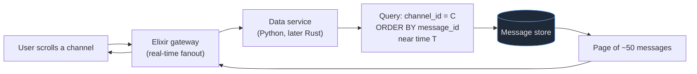
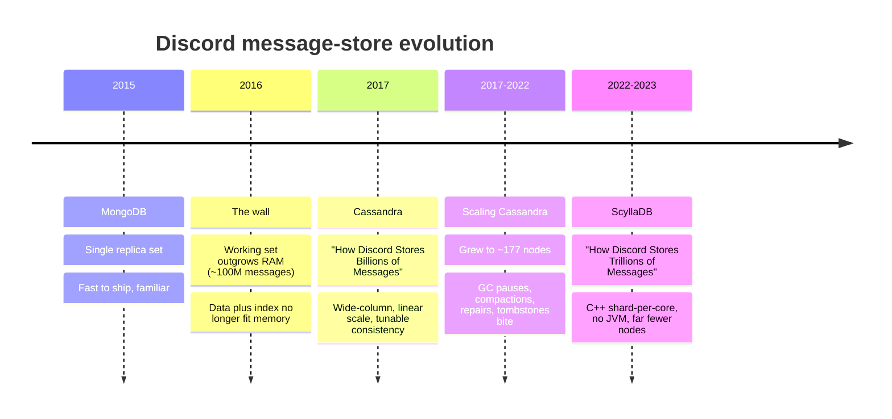
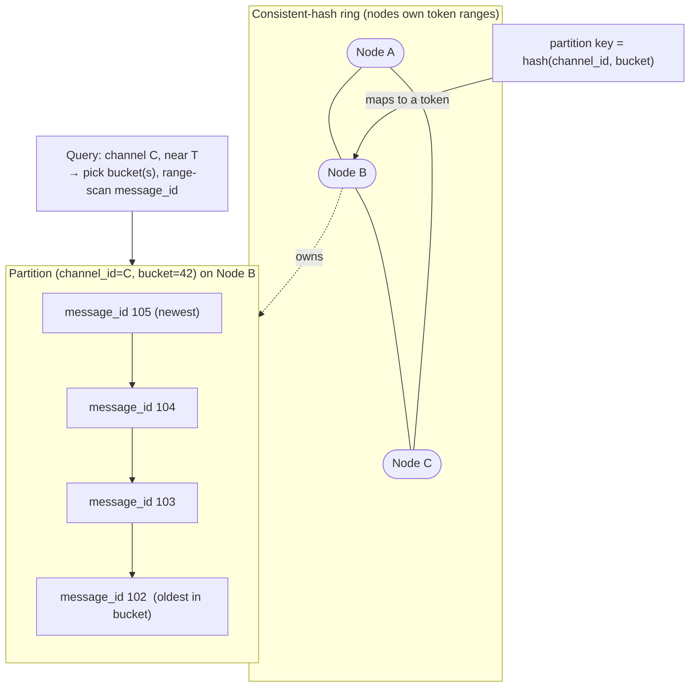
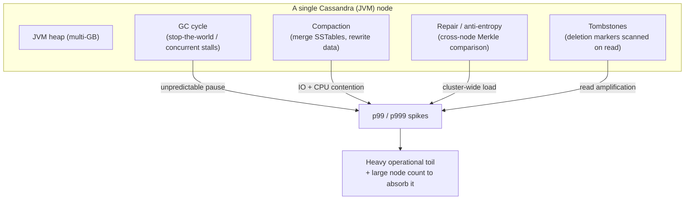
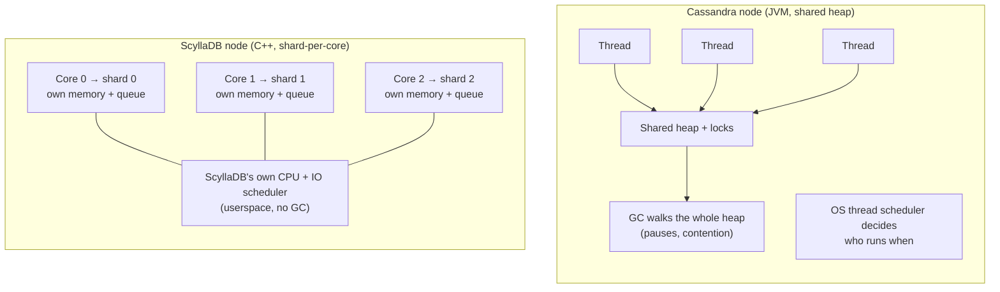
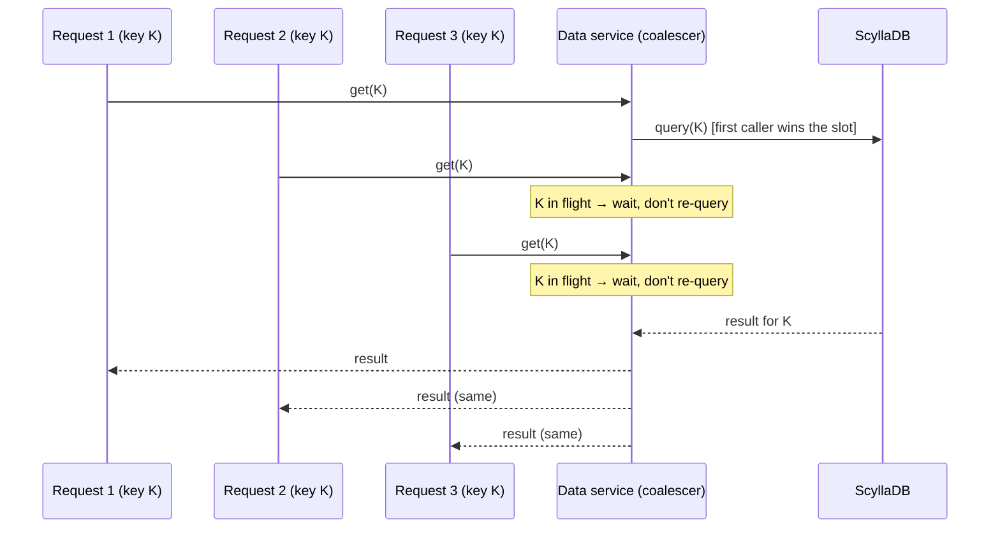
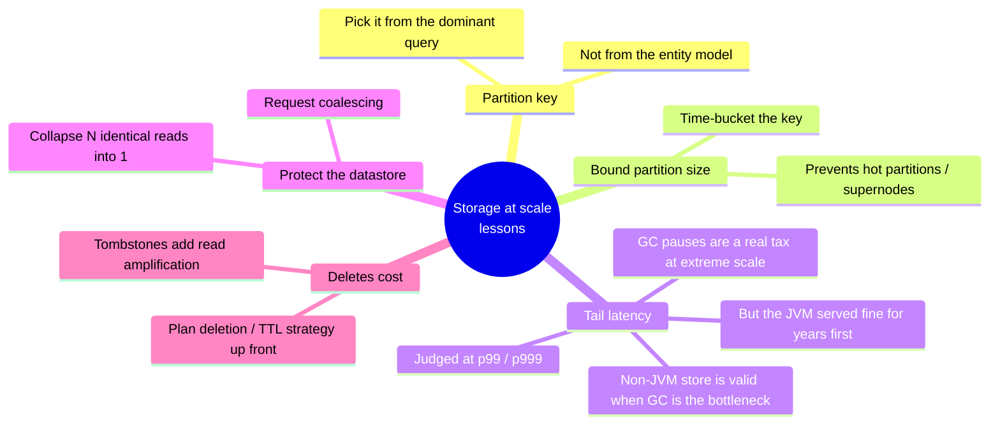
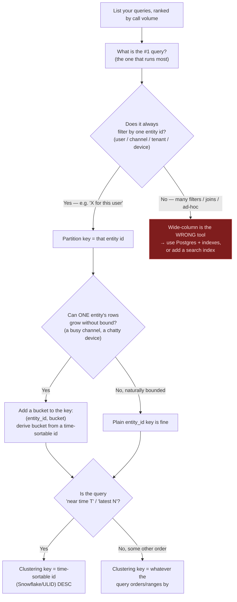

# Discord — Storage Evolution: MongoDB to Cassandra to ScyllaDB

Discord is, at its core, a place where people send messages. Everything else — voice, video, the friends list, server settings — orbits a single dominant workload: store every message and, on demand, render "the messages in *this* channel around *this* time." That workload grew from a few million messages to billions, and then past **a trillion**, while staying overwhelmingly **read-heavy**. This case study follows the datastore that carried that growth through three distinct homes — **MongoDB → Cassandra → ScyllaDB** — and extracts the durable engineering lessons: how to choose a partition key for your dominant access pattern, why you must *bound* partition size, what the JVM garbage-collection tail-latency tax really costs at extreme scale, and how request coalescing protects a hot datastore. The surrounding stack matters for context (the real-time gateway is written in **Elixir**, and the data-access services in front of the store were later rewritten in **Rust**), but the spotlight here is the message store itself.

> [!NOTE]
> **Prerequisites.** This topic assumes you understand partitioning and how a key is mapped onto a ring — see [Partitioning & consistent hashing](../C02-distributed-systems-and-system-design/T05-partitioning-and-consistent-hashing.md). It also leans on cache-protection patterns from [Caching strategies at scale](../C02-distributed-systems-and-system-design/T11-caching-strategies-at-scale.md). The ScyllaDB motivation hinges on JVM GC behaviour from [GC algorithms: Serial, Parallel, G1, ZGC, Shenandoah](../../L3-advanced-jvm/C02-jvm-internals-and-performance/T08-gc-algorithms-serial-parallel-g1-zgc-shenandoah.md).

## The Workload: What a Chat App Actually Asks of Storage

Before any database choice, fix the shape of the problem. A chat message is small (text, author, timestamp, a few flags, optional embeds), but there are *enormous* numbers of them, they are written once and almost never updated, and they are read far more often than written — every time a channel scrolls into view, every time someone jumps to an old message, every search.

The dominant query is deceptively specific:

> "Give me the messages in channel **C**, ordered by time, near point **T** (latest N, or N before/after a given message)."

That single sentence dictates the entire physical data model. The store must **co-locate** a channel's messages so one query touches one place, and it must keep them **time-ordered** so "near T" is a cheap range scan rather than a full sort.



The numbers are what make this hard. Reads dominate writes by a large factor, the corpus is measured first in billions and now trillions of rows, and latency is judged at the **tail** (p99/p999), not the average — a single slow page makes the app feel broken. Hold that read-heavy, tail-sensitive, time-ordered shape in mind; every later decision traces back to it.

> [!NOTE]
> **A relatable way to picture the tail.** Imagine a coffee shop where 99 out of every 100 customers are served in 10 seconds, but 1 in 100 waits 4 minutes because the barista occasionally stops to restock. The *average* wait looks fine on a spreadsheet, but the experience people remember and complain about is the 4-minute wait. A chat app is the same: users don't perceive your median; they perceive the worst page-load they hit while scrolling. "p999 of 20 ms" means "the slowest 1-in-1000 reads still finish in 20 ms" — and at Discord's request volume, 1-in-1000 happens millions of times a day, so the tail is not a rare edge case, it's a constant lived experience for *somebody*.

### Why "Read-Heavy and Tail-Sensitive" Changes Every Decision

It is worth slowing down on *why* this shape is so determinative, because the same reasoning applies to your system. A write-heavy workload (think an audit log nobody reads back) optimizes for cheap, append-only ingestion and tolerates slow reads. A read-heavy workload inverts that: you happily pay *more* at write time — denormalizing, pre-sorting, duplicating data into the exact shape a read wants — so that the read, which happens far more often, is as cheap as possible. Discord's `(channel_id, bucket)` + `message_id` layout is precisely this trade: it does real work on the write path (compute the bucket, place the row in time order) to make the dominant read a single sequential scan.

Think of it like a restaurant kitchen that does all its chopping and prep *before* service (mise en place). The prep is extra work up front, but during the dinner rush — when speed is everything and orders pour in — the cook just assembles. A read-optimized data model is mise en place for queries: the expensive arranging happens once at write time so the hot read path stays effortless.

> [!TIP]
> **A quick decision heuristic for your own workload.** Estimate your read:write ratio and where your latency SLO lives. If reads outnumber writes by 10x or more *and* your SLO is a tail percentile (p99/p999) rather than an average, you are in Discord's regime and should design the physical model around the dominant read — even at the cost of a heavier write path. If writes dominate, or your SLO is "average is fine," most of the machinery in this case study is over-engineering for you.

## The Evolution Timeline and the *Why* Behind Each Move

Discord did not pick its final architecture up front. Each migration was forced by a concrete wall the previous system hit.



**MongoDB (the first home).** Early Discord stored messages in MongoDB on a single replica set. This was the right *startup* decision: a document model maps cleanly onto a message, and it let the team ship. The wall arrived around **~100 million messages**: once the working set — the hot data plus the indexes needed to serve queries — no longer fit in RAM, the system started paging from disk on the read path. Random-access reads against a corpus larger than memory turn a sub-millisecond lookup into a disk seek, and tail latency fell apart. The problem was not "MongoDB is bad"; it was that a single-machine working-set model cannot survive a corpus that grows without bound.

> [!NOTE]
> **The "working set outgrows RAM" wall, made relatable.** Picture a librarian who keeps the most-requested books on a cart right next to the desk. As long as every popular book fits on the cart, every request is instant — she just turns around and grabs it. But the collection keeps growing, and one day the cart is full while requests keep coming for books now shelved deep in the stacks. Now *some* requests mean a long walk into the basement. The librarian didn't get slower and the cart didn't break; the collection simply outgrew the cart. That cart is RAM, the basement is disk, and the long walk is a disk seek. MongoDB hit this wall not because it was the wrong tool to start with, but because *no* single machine has an infinitely large cart — past a certain corpus size you must spread the books across many buildings, which is exactly what a horizontally-scaled, partitioned store does. This is also a textbook example of a startup making the *right* early call (ship fast on a familiar document store) and then correctly recognizing the moment that call expired.

**Cassandra (2017).** Discord moved to Apache Cassandra and wrote it up in *"How Discord Stores Billions of Messages."* Cassandra is a **wide-column** store designed for exactly this profile: it scales horizontally by adding nodes, it has no single master to bottleneck writes, it uses **consistent hashing** to spread data across the ring, and it offers tunable consistency. Critically, its data model — partition key plus clustering columns — *is* the "co-locate a channel, sort by time" pattern expressed as a schema. Cassandra carried Discord from billions of messages across several years and roughly 177 nodes at peak.

> [!IMPORTANT]
> **When does a wide-column store (Cassandra/ScyllaDB) actually beat Postgres — and when not?** This is the decision that trips up most teams, so let's make it concrete.
>
> **Reach for a wide-column store when:**
> - Your corpus genuinely grows without bound (trillions of rows is the headline, but even "tens of billions and climbing" qualifies) and would never fit comfortably on one machine plus its read replicas.
> - You have *one* dominant access pattern you can bake into a partition key (Discord: "messages in this channel near time T"). Wide-column stores are blazing fast for the query you partitioned for and bad at everything else.
> - You need linear horizontal write scaling with no single master, and you can tolerate eventual/tunable consistency rather than strict ACID transactions.
>
> **Stay on Postgres (or another relational store) when:**
> - You have *many* different query shapes — ad-hoc filters, joins across entities, "show me X grouped by Y where Z" reports. Postgres's query planner and secondary indexes shine here; a wide-column store forces you to pre-model a separate table per query (or bolt on a search index).
> - You need real multi-row transactions, foreign keys, and strong consistency by default.
> - Your data fits on a beefy primary plus read replicas for the foreseeable future. A single well-tuned Postgres box handles enormous load; do not reach for a distributed wide-column store to solve a problem partitioning a relational table or adding a cache would solve. The "we'll need to scale someday" instinct ships a lot of premature Cassandra clusters.
>
> The honest summary: **Cassandra/Scylla trade query flexibility for scale-of-one-known-query.** Discord made that trade correctly because they have exactly one query that matters, run at planetary scale. Most apps have neither property, and Postgres is the right answer for them — sometimes even at surprisingly large scale.

**ScyllaDB (2022–2023).** As the corpus passed a trillion messages, the operational and tail-latency cost of running Cassandra at that scale became the bottleneck (detailed below). Discord migrated to **ScyllaDB** — a C++, Cassandra-compatible rewrite — and documented it in *"How Discord Stores Trillions of Messages."* The data model barely changed; the *engine underneath it* did.

> [!IMPORTANT]
> Notice the pattern: each migration kept the **same logical model** as long as possible and changed only the layer that had become the constraint. MongoDB→Cassandra changed the data *model* (the working-set wall demanded it). Cassandra→ScyllaDB kept the model and changed the *runtime* (the constraint had moved from "how do we model this" to "how do we serve it with predictable latency"). Knowing *which* layer is the bottleneck is the whole game.

## Data Modeling and the Partition Key (the Heart of It)

Everything in a Cassandra/ScyllaDB design flows from the **primary key**, which has two parts: the **partition key** (which node owns the row, via consistent hashing) and the **clustering key** (how rows are sorted *within* a partition). Get these right and your dominant query is one cheap, sequential read; get them wrong and you scatter every query across the cluster.

> [!NOTE]
> **The partition key is how the library decides which shelf a book goes on.** Imagine a library so large it spans many buildings. When a book arrives, a rule decides its shelf — say, by the first letter of the author's surname. If the rule is good, finding any book by that author means walking straight to one shelf. If the rule is *bad* — books shelved at random — then every lookup means searching the *entire building*, floor by floor, because the book could be anywhere. The partition key is that shelving rule. `hash(channel_id, bucket)` says "all of this channel's messages for this 10-day window live on one shelf," so "give me this channel's recent messages" is one walk to one shelf. Pick the wrong key and the equivalent query becomes a search of every building in the system — a *scatter* across the whole cluster. That is why the partition key is, by a wide margin, the most consequential decision in the entire design.

Discord's message table is partitioned by a **compound partition key** of `(channel_id, bucket)` and clustered by `message_id`:

```sql
-- Conceptual schema (Cassandra/ScyllaDB CQL)
CREATE TABLE messages (
    channel_id  bigint,
    bucket      int,        -- static ~10-day time window
    message_id  bigint,     -- Snowflake: time-sortable 64-bit id
    author_id   bigint,
    content     text,
    -- ... embeds, flags, edits ...
    PRIMARY KEY ((channel_id, bucket), message_id)
) WITH CLUSTERING ORDER BY (message_id DESC);
--          ^^^^^^^^^^^^^^^^^^^^^^^^   ^^^^^^^^^^
--          partition key             clustering key
```

Three design choices are doing all the work here:

1. **`channel_id` co-locates a channel.** Every message in a channel hashes to the same partition (modulo the bucket), so "messages in channel C" reads from **one** place rather than fanning out across the ring.
2. **`bucket` bounds the partition.** `bucket` is a fixed-width time window (Discord uses a static bucket of roughly **10 days**). It splits a channel's lifetime into successive partitions so no single partition grows without limit (see the hot-partition section).
3. **`message_id` is a Snowflake, so clustering = time order *for free*.** A Snowflake ID is a 64-bit integer whose high bits are a timestamp (an offset from a custom epoch) and whose low bits are worker/sequence bits. Because the timestamp is in the most-significant bits, **numeric order equals chronological order**. Clustering by `message_id` therefore stores messages physically time-sorted, and "near time T" becomes a bounded range scan over a contiguous run of rows — no sort at query time, no secondary index.

### A Closer Look at the Snowflake ID Bit Layout

It is worth seeing exactly *why* numeric order equals time order, because the trick is reused all over large systems (Twitter/X invented Snowflake; Discord, Instagram, and many others run variants). A Snowflake packs three things into one 64-bit integer:

```text
 63                                      22        17        12                 0
  ┌─┬──────────────────────────────────────┬─────────┬─────────┬───────────────┐
  │0│        timestamp (42 bits)            │ worker  │ process │   sequence    │
  │ │   ms since a custom epoch             │ (5 bits)│ (5 bits)│   (12 bits)   │
  └─┴──────────────────────────────────────┴─────────┴─────────┴───────────────┘
   sign        most-significant bits                       least-significant
```

- **Bit 63** is the unused sign bit (kept 0 so the value is a positive `long`).
- **Bits 22–62 (42 bits)** are a millisecond timestamp measured from a *custom epoch* (Discord's epoch is the first second of 2015, not the Unix 1970 epoch — a custom epoch buys you decades of headroom because 42 bits of milliseconds only covers ~139 years from whenever you start counting).
- **Bits 12–21 (10 bits)** identify *which machine/process* generated the ID, so two servers minting IDs in the same millisecond never collide.
- **Bits 0–11 (12 bits)** are a per-millisecond sequence counter, allowing up to 4096 IDs per millisecond per worker.

The magic is the *ordering of the fields*: because the timestamp occupies the high bits, a larger `message_id` is always a later (or equal-time) message. So sorting by the raw 64-bit integer **is** sorting by time, with the worker/sequence bits acting only as a deterministic tiebreaker for IDs minted in the same millisecond. This is why Discord never needs a separate `created_at` column in the clustering key, never needs a secondary index on time, and can derive the time bucket straight from the ID itself — the timestamp is *inside* the primary key. In Java you would extract it with a shift: `long unixMillis = (messageId >>> 22) + DISCORD_EPOCH_MS;`.

> [!TIP]
> Snowflake IDs are also why "jump to a message from 2019" is cheap: the client already holds that message's ID, you shift out its timestamp to compute the bucket, and you range-scan that one partition. Contrast this with a random UUID primary key, which carries *no* time information — you would need a separate time index and a sort, reintroducing exactly the work Snowflake eliminates.



Compute `bucket` from the message's Snowflake timestamp: `bucket = floor((snowflake_timestamp - EPOCH) / BUCKET_SIZE)`. To answer "latest N in channel C," start at the current bucket and walk backward to older buckets only if the first bucket doesn't yield N messages. This maps the query directly onto the ring layout described in [Partitioning & consistent hashing](../C02-distributed-systems-and-system-design/T05-partitioning-and-consistent-hashing.md): the partition key is hashed to a token, the token picks the owning node(s), and the read is local to that partition.

### Worked Example: "Give Me the Latest 50 Messages in Channel C"

Let's trace the actual bucket math and CQL a data service runs. Suppose the bucket window is 10 days, so `BUCKET_SIZE_MS = 10 * 24 * 60 * 60 * 1000 = 864_000_000`, and Discord's epoch is `1_420_070_400_000` (2015-01-01 in Unix ms). The service computes the current bucket from "now":

```java
// Bucket math (Java) — turn a wall-clock time into a Discord bucket number.
static final long DISCORD_EPOCH_MS = 1_420_070_400_000L;   // 2015-01-01
static final long BUCKET_SIZE_MS   = 864_000_000L;          // 10 days in ms

static long bucketFor(long unixMillis) {
    return (unixMillis - DISCORD_EPOCH_MS) / BUCKET_SIZE_MS;
}

// Derive a bucket straight from a Snowflake message id, no DB round-trip:
static long bucketForMessageId(long messageId) {
    long unixMillis = (messageId >>> 22) + DISCORD_EPOCH_MS; // top 42 bits = ms since epoch
    return bucketFor(unixMillis);
}
```

For "latest 50," the service starts at `bucketFor(System.currentTimeMillis())` and issues:

```sql
-- One partition, one ordered range scan, capped at 50 rows.
SELECT message_id, author_id, content
FROM   messages
WHERE  channel_id = :channelId
  AND  bucket     = :currentBucket      -- pins us to ONE partition
ORDER  BY message_id DESC               -- already physically sorted; "ORDER BY" is free here
LIMIT  50;
```

Because the partition is already stored newest-first (`CLUSTERING ORDER BY (message_id DESC)`), this is a sequential read of the first 50 rows of one partition — no scatter, no sort, no index lookup. The interesting case is a **quiet channel**: if the current 10-day bucket holds only, say, 12 messages, the service got 12 rows and still owes 38. It then walks to `currentBucket - 1`, queries again with `LIMIT 38`, and continues backward until it has 50 rows or runs out of history:

```java
List<Row> latest(long channelId, int want) {
    var out = new ArrayList<Row>(want);
    long bucket = bucketFor(System.currentTimeMillis());
    long oldestPossible = bucketForMessageId(channelCreatedSnowflake(channelId));
    while (out.size() < want && bucket >= oldestPossible) {
        out.addAll(query(channelId, bucket, want - out.size())); // the CQL above
        bucket--;                                                // step to the previous window
    }
    return out;
}
```

For an active channel, the loop almost always runs **once** — the current bucket alone has far more than 50 messages — which is the whole point: the common case is a single local read, and only sparse channels pay for extra hops. This is the concrete payoff of choosing the bucket width well (more on the tuning trade-off below).

> [!NOTE]
> **Time-bucketing is like splitting one giant ledger into monthly volumes.** A shop that recorded every transaction in a single ever-growing ledger would eventually own a book too heavy to lift, too slow to open, and impossible for two clerks to use at once. The fix accountants have used for centuries: start a fresh volume each month. Any single volume stays a manageable size, you can hand different volumes to different clerks, and finding "transactions around last March" means grabbing one slim volume instead of heaving the whole tome onto the desk. The `bucket` is exactly that monthly volume — it stops any one channel's partition from becoming the book nobody can lift.

> [!TIP]
> The single most transferable idea in this whole topic: **choose the partition key from your dominant access pattern, not from your entity model.** "Partition by channel" is correct only because the dominant query is "by channel." If the dominant query were "all messages by this user across all channels," `channel_id` would be the wrong key and every such query would scatter across the cluster.

## The Hot-Partition / "Supernode" Problem

Partitioning by `channel_id` alone has a fatal flaw: a megapopular channel — a big announcement channel, a viral event — produces a torrent of messages that would all land in **one** partition on **one** set of replicas. That partition becomes a **hot partition** (sometimes called a *supernode*): it grows huge, its owning nodes get hammered with disproportionate read/write load, and it can blow past the practical size limits a single partition should hold. Wide-column stores degrade badly when a partition gets too large — reads slow down, compaction gets expensive, and the node hosting it becomes a hotspot the rest of the cluster can't relieve.

> [!WARNING]
> **War story: the celebrity announcement that melted one node.** Imagine a huge community server. A creator with millions of members posts "going live in 5 minutes" in the announcements channel. Tens of thousands of people open that channel at once — every client asks for "the recent messages in channel C" — while reactions and replies pour in. With partition key = `channel_id`, *all* of that traffic, read and write, converges on the single replica set that owns that one channel's partition. Those three or so nodes saturate their CPU and disk while the other 170+ nodes in the cluster sit nearly idle, unable to help: they don't own the data, so they can't serve the reads. The symptom on the dashboards is brutal and lopsided — one tiny cluster of nodes pegged at 100% with climbing p99, the rest cool. You cannot fix it by adding capacity, because the bottleneck isn't *total* capacity, it's that one partition is indivisible. This is the moment every wide-column team eventually learns the hard way: **an un-bounded partition key turns your most popular customer into your most painful outage.** The bucket is what breaks that single hot partition into a sequence of smaller ones spread across the ring, so popularity is shared by the whole cluster instead of crushing one corner of it.

The `bucket` in the compound key is precisely the fix.

```mermaid
flowchart TB
  subgraph Bad["Without bucketing: partition key = channel_id"]
    HC["Hot channel (millions of msgs)"] --> HP[("One giant partition<br/>→ supernode / hotspot")]
  end
  subgraph Good["With bucketing: partition key = (channel_id, bucket)"]
    HC2["Hot channel"] --> B1[("bucket 40")]
    HC2 --> B2[("bucket 41")]
    HC2 --> B3[("bucket 42 (current)")]
    B1 -. spread across ring .-> R1(["Node A"])
    B2 -. .-> R2(["Node B"])
    B3 -. .-> R3(["Node C"])
  end
```

Because `(channel_id, bucket)` hashes as a unit, **each bucket is an independent partition** and successive buckets land on *different* points of the ring. This does two things at once: it **bounds the size** of any single partition (a partition only ever holds ~10 days of one channel's traffic), and it **spreads load over time and across nodes** (an active channel's hot partition is the current bucket; older buckets are cold and live elsewhere). The bucket width is a tuning knob: too large and busy channels still build oversized partitions; too small and quiet channels fragment into many tiny partitions, forcing multi-bucket reads to satisfy a single page. Roughly 10 days is Discord's chosen balance for typical channel cadence.

> [!INTERVIEW]
> **Q:** *"You're storing chat messages in Cassandra partitioned by `channel_id`. A few channels are 1000x more active than the rest. What breaks, and how do you fix it without changing the query API?"*
>
> **A:** Partitioning by `channel_id` alone makes the hot channels into **hot partitions / supernodes** — one partition grows unbounded and its replica set becomes a hotspot that the rest of the cluster can't offload, hurting tail latency and making compaction expensive. The fix is to **add a time bucket to the partition key**: `(channel_id, bucket)` where `bucket` is a fixed window (e.g. ~10 days). Each bucket becomes its own partition hashed to a different point on the ring, which **bounds partition size** and **spreads load over time and across nodes**. The query API is unchanged: derive the bucket from the Snowflake timestamp and read the current bucket first, walking to older buckets only if you need more rows. The trade-off is choosing the bucket width — too small fragments quiet channels into multi-bucket reads, too large lets busy channels rebuild oversized partitions.

## The Cassandra Pain Points That Drove the ScyllaDB Move

Cassandra served Discord for years and through several orders of magnitude of growth. The move off it was not because Cassandra "failed" — it was because, at trillion-row scale with strict tail-latency goals, a cluster of *Java* nodes carries costs that compound. There were four mechanism-level pains.



**1. JVM garbage-collection pauses → unpredictable tail latency.** This is *the* Java lesson. Cassandra runs on the JVM with a large heap, and message-store workloads churn objects (read paths, caches, SSTable structures). Garbage collection — even with concurrent collectors — introduces pauses and CPU contention that the application cannot schedule around. The *average* read stays fast, but the **tail** (p99, p999) spikes whenever a node hits a GC event. For an experience judged at the tail, occasional multi-tens-of-milliseconds GC stalls are a direct, visible quality regression. Discord invested heavily in GC tuning to push these pauses down, but on the JVM you can shrink and smooth GC pauses, not *eliminate* them. This is exactly the behaviour catalogued in [GC algorithms](../../L3-advanced-jvm/C02-jvm-internals-and-performance/T08-gc-algorithms-serial-parallel-g1-zgc-shenandoah.md): collectors like G1, ZGC, and Shenandoah trade throughput for shorter, more predictable pauses, but a managed heap that the runtime — not your code — decides when to walk will always intrude on the tail.

> [!NOTE]
> **A GC pause is a janitor who locks every door to mop.** Picture a busy shop where, every so often, the janitor decides the floor needs mopping *right now* — so they briefly lock every door, and customers already inside have to stand still until the floor is done. Each individual mop is short, the shop is spotless, and 99% of customers never notice. But the unlucky few who arrive *during* a mop are frozen at the threshold, and they're the ones who leave a one-star review. A stop-the-world GC pause is that janitor: the runtime decides — not your code, not your request — that *now* is the moment to reclaim memory, and any request unlucky enough to be in flight just waits. You can hire a faster janitor (G1), one who mops in small sections while people keep walking (ZGC/Shenandoah's concurrent phases), or mop more often so each mop is shorter — but as long as there *is* a janitor with the authority to pause the room, some customer will occasionally be caught standing at the door. That residual, unschedulable pause is the JVM tail tax.

> [!WARNING]
> **War story: the 2 a.m. p99 spike that paged the on-call.** A read-latency alert fires: p99 on the message-fetch path has jumped from a calm ~5 ms to ~80 ms, sustained, and it's paging the on-call engineer. Throughput is normal, error rate is zero, the database is "up." The engineer correlates the latency graph against per-node GC logs and finds it: a handful of Cassandra nodes are spending tens of milliseconds in GC pauses that line up *exactly* with the latency spikes. Nothing is broken — the system is doing precisely what a managed-heap database does under churn. The maddening part is the *fix list*: tune heap sizing, switch or retune the collector, reduce allocation on the read path, add nodes to spread the heap pressure thinner. Each helps a little; none makes the spikes *go away*, because the pause is structural. Living through a few of these incidents — being woken up by a latency tax you can shrink but never eliminate — is precisely the experience that turns "should we leave the JVM?" from a theoretical debate into a concrete, well-justified decision. The point of the story is not "GC is bad," it's that at this scale the on-call cost of the tail tax is *real, recurring, and ultimately un-tunable past a floor.*

**2. Expensive compactions.** Cassandra/ScyllaDB are LSM-tree stores: writes append to immutable SSTables, and **compaction** periodically merges them to reclaim space and keep reads efficient. At Discord's volume, compaction consumed significant CPU and IO, competing with live query traffic and adding to tail latency — and a node mid-compaction is a node serving reads slowly.

**3. The cost and latency of repairs.** Cassandra maintains consistency across replicas with **repair** (anti-entropy), which compares data between replicas (via Merkle trees) and reconciles differences. At scale, repairs are heavy, long-running, cluster-wide operations that add load and operational babysitting.

**4. The tombstone problem.** This is subtle and bites read-heavy systems hard. In an LSM store you cannot delete in place — a delete writes a **tombstone**, a marker that says "this row/range is gone." The actual data isn't removed until a later compaction. Until then, **reads must scan past every tombstone** in the range to figure out what's still live. A range with many tombstones (e.g. a channel where lots of messages were deleted) inflates read cost dramatically — you pay to read data that no longer exists. Tombstone accumulation is a classic source of latency cliffs and even read timeouts.

> [!WARNING]
> **War story: "clear all messages" creates a tombstone storm.** A moderation tool ships a convenient feature: an admin can purge an entire channel — "delete all messages here." Someone uses it on a channel that had tens of thousands of messages. The deletes succeed, the channel now shows empty, everyone moves on. Days later, reports come in that *that channel* is slow to open — sometimes it even times out — even though it's empty. The mechanism is the tombstone: each deleted message left a marker, and those markers live in the partition until a future compaction sweeps them. Now every read of that channel's recent window has to scan a wall of "this is gone… this is gone… this is gone…" markers before it finds a live row (or confirms there are none). It is the cruel inverse of intuition: *emptying* the channel made reading it slower, not faster, because the reader pays for the ghosts of deleted data. Think of it as crossing out every line in a notebook page instead of tearing the page out — the page is "empty" of valid entries, but you still have to drag your eyes over every crossed-out line to be sure. The fixes split into "how you delete" (prefer a partition/bucket you can drop wholesale, or a single range tombstone over thousands of point tombstones) and "use TTL so rows expire and compact away on a schedule instead of being mass-deleted by hand." This is why a senior engineer treats *deletion* as a first-class design question, not an afterthought.

On top of all four, running ~177 JVM nodes at this scale was **heavy operational toil**: GC tuning, compaction tuning, repair scheduling, and on-call load that scaled with the fleet.

## Why ScyllaDB Fixed It: Shard-per-Core, No JVM

ScyllaDB is a ground-up **C++ rewrite of Cassandra** that is wire- and data-model-**compatible** — same CQL, same partition/clustering model, so Discord's schema and queries ported with minimal change. What's different is the *runtime architecture*, and it attacks every pain above at the source.



The key idea is **shard-per-core** (thread-per-core, shared-nothing). Each CPU core gets its own shard with its **own slice of memory** and **own request queue**; cores don't share mutable state, so there are **no locks** on the hot path and no cross-core contention. ScyllaDB runs its **own userspace CPU and IO scheduler** (the Seastar framework) instead of leaning on the OS thread scheduler, so it can prioritise latency-sensitive query traffic over background work like compaction. And because it's C++ with manually managed memory, there is **no JVM and no garbage collector** — therefore **no GC pauses**. The single biggest source of unpredictable tail latency simply doesn't exist.

The payoff was twofold:

- **Much lower and more consistent p99/p999.** Removing GC stalls and adding a latency-aware scheduler that throttles compaction/background work flattened the tail — the exact metric the chat experience is judged on.
- **Far fewer machines for the same load.** Shard-per-core uses hardware so much more efficiently that Discord drastically reduced node count — from a fleet on the order of **~177 Cassandra nodes down to roughly a tenth of that** (a small number of dozens of ScyllaDB nodes) for the same and growing workload. Fewer nodes means less operational surface, less repair overhead, and lower cost.

> [!NOTE]
> Do not over-read this as "the JVM is unfit for databases." Cassandra — a JVM system — served Discord for **years** across multiple orders of magnitude of growth, and the vast majority of systems never reach the scale where GC tail latency becomes the binding constraint. The lesson is narrower and sharper: *at extreme tail-latency requirements and trillion-row scale, a managed-heap runtime is a legitimate reason to choose a non-JVM datastore* — but only after it actually becomes your bottleneck.

> [!NOTE]
> **War story: the "tune the JVM forever or move off it?" decision meeting.** Eventually this stops being a tuning ticket and becomes a strategy meeting. Picture the room: the database team has spent quarters on GC tuning and shaved the pauses meaningfully, but the p999 floor won't drop further and the fleet is at ~177 nodes with on-call load to match. Someone frames the real choice on the whiteboard as two columns. **Column A — keep tuning the JVM:** lower risk, no migration, the system you already know, but you've hit diminishing returns and you'll keep paying the tail tax and the operational toil forever. **Column B — move to a non-JVM, Cassandra-compatible store (ScyllaDB):** removes the GC tail tax at the source and slashes node count, but it's a large migration with real risk (data movement at trillion-row scale, a new operational model, an unproven-for-*you* engine). The decision turns on three honest questions: *Have we actually exhausted tuning, or are we just tired of it?* (they had genuinely hit the floor); *Is the win structural or incremental?* (removing GC entirely is structural — you can't tune your way to "no garbage collector"); and *Can we migrate compatibly?* (Scylla speaks CQL, so the schema and queries port, dramatically lowering risk). When all three line up — exhausted tuning, a structural win, a low-risk compatible target — Column B wins. The lesson for *your* eventual version of this meeting: don't migrate to escape a problem you haven't actually exhausted cheaper fixes for, and don't *keep* tuning when the only real win is structural and a compatible target exists.

### When the JVM-GC Tail Tax Actually Matters (and the Reassurance That It Usually Doesn't)

Because this is a Java learning resource, it is worth being blunt about scope so you don't walk away over-correcting. The GC tail tax becomes a *binding* constraint only when **all** of these are true at once:

- Your SLO is a **high tail percentile** (p99 or p999), not an average or even p95.
- That tail is **tight** — single-digit to low-tens-of-milliseconds — so a 20–40 ms GC pause is a large fraction of your budget rather than noise.
- You are at a **scale and request rate** where GC events are frequent enough, across enough nodes, that *someone* is always hitting one.
- You have already **exhausted the cheaper fixes**: collector choice and tuning (G1 → ZGC/Shenandoah for shorter pauses), reducing allocation on the hot path, right-sizing the heap, and adding nodes to dilute heap pressure.

For the overwhelming majority of applications — internal tools, typical web backends, batch jobs, anything judged on averages or p95 with budgets in the hundreds of milliseconds — **the GC tail tax is invisible and you should never think about it.** A well-tuned modern collector (ZGC and Shenandoah routinely keep pauses under a millisecond) makes the JVM a perfectly good choice for the vast majority of latency-sensitive services too. Discord itself ran a JVM store happily for *years* before the tax became binding. So the honest takeaway is two-sided: *know* that the tail tax exists and is real at the extreme, but do not let that knowledge stampede you off the JVM for a system that will never live at Discord's scale and SLO. Reaching for a C++ datastore to serve a few thousand requests a second on a p95 SLO is solving a problem you don't have.

## Request Coalescing: Protecting Hot Data from Read Storms

A subtler problem appears in front of the database, in the data-access service layer. When a popular channel is active, **many concurrent requests ask for the exact same partition/row** at almost the same instant. If each request issues its own database query, a single hot row generates a storm of identical reads that hammers the store — the database-level equivalent of a cache stampede.

> [!NOTE]
> **Request coalescing is one coffee run for the whole office.** Ten people want coffee. Without coordination, ten people each walk to the café, stand in line, and walk back — ten trips for one café. The sensible version: the first person to want coffee announces "I'm doing a coffee run, who's in?" and everyone else just adds their order to that *one* trip. One person goes, one queue, one return, and ten cups come back. Request coalescing is that announcement. The first request for hot key *K* makes the "run" to the database; every other request for *K* that arrives while the run is in flight doesn't make its own trip — it adds itself to the list of people waiting for the one result. When the runner returns, everyone who asked gets handed the same cup. The café (your database) sees *one* customer no matter how many people in the office are thirsty, which is exactly the property that caps the load a single hot partition can ever generate.

Discord's data services (rewritten in Rust) solve this with **request coalescing**: if a request for key *K* is already in flight, later requests for *K* don't issue their own query — they **attach** to the in-flight one. When the single query returns, its **one result is fanned back out** to every waiting caller.



The effect is that **N concurrent reads of the same hot key collapse into 1 database query**, capping the load any single hot partition can generate no matter how many users pile onto it. This is the same family of protection as cache-stampede / dogpile prevention covered in [Caching strategies at scale](../C02-distributed-systems-and-system-design/T11-caching-strategies-at-scale.md) — there it shields the cache-fill path, here it shields the datastore directly. Same principle, different layer: **deduplicate concurrent identical work so popularity doesn't translate into proportional backend load.**

> [!TIP]
> A Java engineer implements this with a concurrent map from key to an in-flight future: `computeIfAbsent(key, k -> loadAsync(k))` returns the *existing* `CompletableFuture` for keys already loading, so all callers await one load and share its result. Evict the entry when the future completes so the next miss triggers a fresh load. That is request coalescing in ~10 lines — the same shape Discord runs in Rust.

### A Fuller Coalescing Helper in Java (Eviction + Failure Handling)

The ten-line version captures the idea, but a production helper has to get two things right that the toy version glosses over: it must **evict the entry once the load settles** (so a key isn't pinned to a stale or failed result forever), and it must **handle failure without poisoning** future callers. Here is a fuller, self-contained version:

```java
import java.util.concurrent.*;
import java.util.function.Function;

/** Collapses concurrent get(K) calls for the same key into a single in-flight load. */
public final class RequestCoalescer<K, V> {

    private final ConcurrentHashMap<K, CompletableFuture<V>> inFlight = new ConcurrentHashMap<>();
    private final Function<K, CompletableFuture<V>> loader;   // your async DB read

    public RequestCoalescer(Function<K, CompletableFuture<V>> loader) {
        this.loader = loader;
    }

    public CompletableFuture<V> get(K key) {
        // computeIfAbsent is atomic per key: only the FIRST caller starts a load;
        // every concurrent caller for the same key receives the SAME future.
        return inFlight.computeIfAbsent(key, k -> {
            CompletableFuture<V> load = loader.apply(k);
            // Evict ONLY this exact future once it settles (success OR failure), so:
            //  - the next miss triggers a fresh load (no permanently cached value here;
            //    real caching belongs in a separate layer with its own TTL), and
            //  - a failure does not get remembered and replayed to every later caller.
            load.whenComplete((value, error) ->
                inFlight.remove(k, load));   // remove(k, load): only if still the same future
            return load;
        });
    }
}
```

Two subtleties are doing the heavy lifting:

1. **Why `remove(k, load)` and not `remove(k)`?** Between the load completing and the eviction running, a *new* request for the same key may already have installed a *fresh* future. `remove(k, load)` removes the entry only if the mapped value is *still the future we created* — it will not accidentally evict a successor's in-flight load. (This is the same compare-and-remove discipline you'd use anywhere a map entry has a lifecycle.)
2. **Failure handling.** Because we evict on `whenComplete` (which fires on both success and exception), a failed load is *not* cached. The N callers currently attached all see the same exception (correct — they asked at the same instant and the backend was down), but the *next* caller after eviction gets a clean retry rather than a permanently poisoned key. Caching a failure — "negative caching" — is sometimes desirable to shield a flapping backend, but it must be a *deliberate* short-TTL choice, never the accidental result of forgetting to evict.

> [!WARNING]
> **The two classic bugs this guards against.** *If you never evict:* the map grows without bound (a memory leak), and worse, the first result for each key is pinned forever — callers get stale data and you've accidentally built a cache with no expiry. *If you cache a failure and never evict it:* a single transient blip (one timed-out query) gets replayed to every future caller of that key indefinitely — one hiccup becomes a permanent outage for that key. Coalescing and caching are different jobs: coalescing deduplicates *concurrent* work and should evict the instant the load settles; caching deliberately *retains* a result for a TTL. Keep them in separate layers and these bugs disappear.

## Lessons: What Transfers to Your System



### How a Java Team Actually Picks and Partitions for Their Dominant Query

The single most useful exercise is concrete and repeatable. Sit down and *write out your top three queries by volume*, then build the model for #1 and check that #2 and #3 are at worst tolerable. The decision flow looks like this:



Walking a Java team through a real example — a **per-device telemetry store** where the dominant query is "the latest 200 readings for device D":

- **#1 query filters by one entity (`device_id`)** → partition key starts as `device_id`.
- **One device can emit forever** (a sensor runs for years) → its partition would grow unbounded → add a bucket: `(device_id, bucket)`, bucket derived from the reading's time-sortable id, just like Discord.
- **Query is "latest N"** → clustering key is the time-sortable reading id, `DESC`.
- **Sanity-check #2 and #3:** if a secondary query is "all readings across all devices in region R near time T," that *scatters* — note it, and decide whether it's rare enough to tolerate a scatter/fan-out, or common enough to justify a second table partitioned by `(region_id, bucket)` (a deliberate denormalized copy). The wide-column rule of thumb: **one table per query shape you care about**, because you cannot retrofit a new partitioning onto an existing table.

> [!INTERVIEW]
> **Q:** *"Walk me through how you'd choose a partition key for a new wide-column table, and how you'd know if you chose wrong."*
>
> **A:** Start from the *dominant query by volume*, not the entity model. If that query always filters by a single id (user/channel/tenant/device), that id is the partition key. Then ask whether any single value of that id can accumulate unbounded rows — if yes, add a deterministic split (a time bucket derived from a time-sortable id) so no partition grows without limit and load spreads across the ring. Pick the clustering key to match the query's ordering/range ("latest N near T" → a time-sortable id, descending). I'd know I chose *wrong* if a common query has to scatter across many partitions (a sign the partition key doesn't match the access pattern), or if production shows hot partitions where a few key values carry disproportionate load (a sign I didn't bound partition size). The tell at design time is simple: if I can't answer my #1 query by reading *one* partition, the key is wrong.

- **Choose the partition key for your dominant access pattern.** The physical model is downstream of the query you run most. Discord partitions by channel because the query is "by channel." Identify *your* dominant query before you pick a key.
- **Always bound partition size.** Unbounded partitions become hotspots. Time-bucketing (or any deterministic split derived from data you already have) keeps any single partition small and spreads load. Choosing the bucket width is a real tuning decision, not a default.
- **The JVM-GC tail-latency tax is real at scale — and a legitimate reason to go non-JVM — but don't over-read it.** GC pauses you can shrink but not eliminate; at trillion-row, p999-sensitive scale that's enough to justify a C++ engine. At nearly every smaller scale, it isn't. Cassandra carried Discord for years first.
- **Request coalescing is a datastore-protection pattern, not just a cache trick.** Collapsing concurrent identical reads caps the load any hot key can generate. Reach for it any time popularity could turn into proportional backend load.
- **Deletes have a cost.** In LSM stores, deletes create tombstones that reads must scan until compaction removes them. Design your deletion/TTL strategy deliberately; a "just delete it" mindset can quietly create read-latency cliffs.

## Java/JVM Relevance

This case study is unusually rich for a Java engineer because it shows **both sides** of the JVM at scale. On one hand, **Cassandra *is* a JVM system** that ran one of the largest message stores on the internet for years — concrete proof that the JVM operates fine at massive scale. On the other hand, it is also the cleanest real-world illustration of the JVM's **one structural limit**: a managed heap means the *runtime* decides when to walk memory, and that intrusion lands on the tail. When your SLO is the average, GC is invisible; when your SLO is p999, GC is the enemy. That is the practical meaning of [GC algorithms](../../L3-advanced-jvm/C02-jvm-internals-and-performance/T08-gc-algorithms-serial-parallel-g1-zgc-shenandoah.md): G1 / ZGC / Shenandoah exist precisely to push pauses toward (but never to) zero, and knowing *which* collector buys you *which* tail behaviour is a staff-level skill. And the coalescing pattern — `computeIfAbsent` over a map of `CompletableFuture` — is a Java idiom you can lift directly to protect any expensive backend, exactly as covered under cache-stampede prevention in [Caching strategies at scale](../C02-distributed-systems-and-system-design/T11-caching-strategies-at-scale.md).

## Practice

1. **Design the key.** You're building a notifications store. The dominant query is "the latest 50 notifications for user U." Write the Cassandra/ScyllaDB primary key, decide whether you need a bucket, and justify the bucket width from expected per-user volume.
2. **Spot the hot partition.** Given `PRIMARY KEY ((region_id), event_id)` for an analytics event store, explain why one region going viral breaks the cluster and rewrite the key to fix it without changing the "events in a region near time T" query.
3. **Tombstone trap.** A team implements "clear chat" by deleting every message in a channel, then complains reads got slow even though the channel is now empty. Explain the mechanism and propose two fixes (hint: one involves *how* you delete, one involves TTL/partition design).
4. **Implement coalescing.** Write a Java `LoadingCache`-style helper using `ConcurrentHashMap<K, CompletableFuture<V>>` and `computeIfAbsent` so that N concurrent `get(K)` calls trigger exactly one `loadAsync(K)`. Make sure you evict on completion. What goes wrong if you *don't* evict, and what goes wrong if the load *fails*?
5. **GC reasoning.** Your Cassandra node shows a flat average read latency but p999 spikes every ~30 seconds. Name the most likely cause, the JVM tool you'd reach for to confirm it, and two non-migration mitigations before you consider a non-JVM store.
6. **Bucket math.** Given `DISCORD_EPOCH_MS = 1_420_070_400_000` and a 10-day bucket (`864_000_000` ms), write the function that maps a Snowflake `message_id` to its bucket number *without* a database round-trip. Then explain what the loop does when the current bucket of a quiet channel contains only 12 of the 50 messages a "latest 50" request needs.
7. **Decode a Snowflake.** Given a 64-bit Snowflake `message_id`, write the Java expression that extracts its creation time in Unix milliseconds. Explain why the *order* of the fields inside the 64 bits (timestamp in the high bits) is what makes "sort by id" equal to "sort by time," and why a random UUID primary key would force you to add a separate time index and sort.
8. **Wide-column or Postgres?** For each, decide between a wide-column store and Postgres and justify it in one sentence: (a) a multi-tenant SaaS with ad-hoc reporting and joins across 30 tables; (b) a per-user activity feed read "latest 100 for this user" billions of times a day at a p999 SLO; (c) a financial ledger needing multi-row ACID transactions; (d) an IoT store ingesting per-device readings forever, queried as "latest N for device D."
9. **Coalescer correctness.** Take the `RequestCoalescer` from this topic and reason about two race conditions: (a) why `remove(k, load)` rather than `remove(k)` matters when a second request installs a fresh future just as the first completes, and (b) what changes if you want *negative caching* (briefly remembering a failure to shield a flapping backend) — where would you add a short TTL, and why must it be deliberate rather than the default?
10. **The migration meeting.** You're the staff engineer in the "tune the JVM forever or move to a non-JVM store?" meeting. Write the two-column whiteboard (keep tuning vs. migrate) and the three questions that decide it. State the condition under which you'd *refuse* to migrate even though the tail tax annoys you.

## Recap

- Discord's message workload is **read-heavy, time-ordered, and tail-sensitive**, and grew from millions to **trillions** of messages.
- The store evolved **MongoDB → Cassandra (2017) → ScyllaDB (2022–2023)**, each move forced by a concrete wall: MongoDB's working set outgrew RAM (~100M messages); Cassandra's JVM/operational costs bit at trillion-row scale.
- Messages are partitioned by the **compound key `(channel_id, bucket)`** and clustered by **`message_id` (a time-sortable Snowflake)**, so the dominant query is one local, time-ordered range scan.
- The **`bucket`** (a ~10-day window) **bounds partition size** and defeats the **hot-partition / supernode** problem.
- Cassandra's pains were **GC tail-latency pauses, expensive compactions, costly repairs, tombstone read amplification, and operational toil** across ~177 nodes.
- **ScyllaDB** (C++, Cassandra-compatible, **shard-per-core**, **no JVM/GC**) flattened p99/p999 and cut the fleet to roughly a tenth of the nodes.
- **Request coalescing** collapses N concurrent identical reads into one query, protecting hot partitions — the datastore-layer sibling of cache-stampede protection.
- **The partition key is the shelving rule** that decides which "shelf" (node) owns a row; a bad rule turns every lookup into a search of the whole cluster, which is why it's the most consequential design choice.
- **Time-bucketing is splitting one giant ledger into monthly volumes** — it bounds partition size so no single partition becomes "the book nobody can lift," and spreads load across the ring.
- **A GC pause is the janitor who locks every door to mop:** unschedulable, mostly invisible, but a direct hit to the unlucky in-flight request — the JVM's one structural tail-latency limit, which you can shrink (G1/ZGC/Shenandoah) but not eliminate.
- **The GC tail tax is binding only at the extreme** (tight p99/p999 SLO + huge scale + cheaper fixes exhausted); for the vast majority of Java services it is invisible and should not push you off the JVM.
- **Snowflake IDs put a millisecond timestamp in the high bits**, so numeric id order equals chronological order — clustering by the id gives free time-sorting and lets you derive the time bucket straight from the id with a bit-shift, no extra column or index.
- **Deletes in an LSM store create tombstones** that reads must scan until compaction; a mass "clear all" can make an *empty* channel slow to read, so deletion strategy (range tombstones, droppable buckets, TTL) is a first-class design decision.
- **Wide-column beats Postgres only for unbounded scale on one dominant, partitionable query;** for many query shapes, joins, or strict transactions, Postgres is the right tool — don't ship a premature Cassandra cluster.

## Next

Continue to [Uber — Domain-Oriented Microservices & Geo-Sharding](./T04-uber-domain-oriented-microservices-geo-sharding.md), where the scaling problem shifts from a single datastore to organizing hundreds of services and sharding by geography.
