# Uber — Domain-Oriented Microservices & Geo-Sharding

Uber is a **real-time, two-sided marketplace**: at any instant it is matching riders to drivers and eaters to couriers, on a map, with a latency budget measured in milliseconds. That single shape — *geospatial supply meeting demand in real time* — drives almost every interesting architectural decision the company made. This case study follows two intertwined stories. The first is **organizational and structural**: how Uber went from a monolith to *thousands* of microservices, hit a governance and complexity wall, and answered it with **DOMA (Domain-Oriented Microservice Architecture)**. The second is **mechanism-deep and geospatial**: how the dispatch system (**DISCO**) matches supply and demand using the **H3 hexagonal grid**, how **Ringpop** lets a fleet of stateful nodes co-own a geographically sharded keyspace via consistent hashing and SWIM gossip, and how **Schemaless** stored it all on sharded MySQL. The thread connecting both stories is the same one that runs through every mature system: *unbounded growth — of services or of data — is its own failure mode, and the fix is principled decomposition.*

> [!NOTE]
> **Prerequisites.** This topic leans hard on how a key is hashed onto a ring and how ownership is split across nodes — see [Partitioning & consistent hashing](../C02-distributed-systems-and-system-design/T05-partitioning-and-consistent-hashing.md). The decomposition reasoning (bounded contexts, gateways, layering) is best read after [System design methodology](../C02-distributed-systems-and-system-design/T16-system-design-methodology-framework.md), and it builds on the architecture patterns collected in the [Software architecture chapter](../C01-software-architecture/).

## Context: A Real-Time Geospatial Marketplace

Before any architecture, fix the problem shape. Uber is not a CRUD app with a database in the middle — it is a **marketplace** with two distinct populations whose state changes continuously:

- **Supply** — drivers/couriers, each reporting a GPS location every few seconds, in one of a few states (available, en route, on trip).
- **Demand** — riders/eaters requesting a trip *from a specific point on the map* and expecting a match in seconds.

The dominant operation is therefore: **"given a request at location L, find nearby available supply, fast."** That is a *spatial nearest-neighbour* query under a hard latency budget, run millions of times a minute, across thousands of cities, where supply is itself a moving target. Everything else — pricing/surge, ETAs, the trip lifecycle — hangs off that core matching loop.

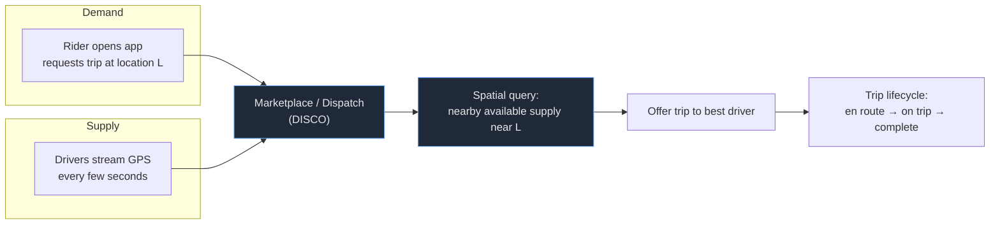

Two properties make this hard and special. **Geography** means a request only cares about a small region — you must not scan the planet to find a driver three blocks away. **Low latency** means the matching state must live in fast, in-memory, *geographically partitioned* infrastructure, not a slow round-trip to a central database. Hold that "geo + real-time" shape: it is the reason Uber built H3, Ringpop, and a sharded dispatch tier instead of reaching for an off-the-shelf database query.

> [!NOTE]
> **A relatable way to picture the latency budget.** Imagine you are a maître d' at a restaurant where every guest who walks in expects to be seated within two seconds, the available tables are physically moving around the room every few seconds, and there are *ten thousand* such restaurants you are running at once. You cannot afford to walk to a back office, open a ledger, and look up "all tables in the building" for every guest. You need a glance-able floor plan, divided into zones, where you can see *just the tables near the door the guest came in* and seat them instantly. That floor plan divided into zones is H3; the act of remembering which host is responsible for which zone is Ringpop; the back-office ledger you write the final seating into (but never consult on the hot path) is Schemaless. Every piece below exists to keep that two-second promise.

**A concrete war story — the stadium empties.** Picture a 60,000-seat stadium at 10:45 PM as the final whistle blows. Over the next ten minutes, tens of thousands of people walk out and open the app within a few city blocks — that is, within a *tiny handful of map cells*. Demand in those cells spikes 50× while supply (drivers who happen to be nearby) is almost flat. This **geo-hotspot** is the scenario that punishes any naive design: a single hot cell can melt one node if that node alone owns the area's state; a global database query would now be both slow *and* contended on exactly the rows everyone wants; and surge pricing has to be computed *per cell* fast enough to actually rebalance supply before the crowd disperses. Keep this stadium image in mind — it is the stress test that explains why dispatch is sharded by geography (so the load spreads across the nodes owning the surrounding cells), why surge is computed per H3 cell (so the hot cells, not the whole city, get the price signal), and why the k-ring expansion matters (riders in the jammed center cells get matched to drivers fanning in from the calmer neighbour cells).

## From Monolith to Microservice Sprawl

Like most fast-growing companies, Uber started (around 2014) with a **monolith** — a single large codebase serving the early product. As the company scaled to hundreds of engineers, dozens of cities, and new business lines (Eats, Freight), the monolith became the bottleneck: every change risked every feature, deploys were coupled, and teams contended for the same codebase.

The answer was the standard one — **break it into microservices** so teams could own and deploy independently. This worked, and Uber leaned into it hard. Over the following years the service count grew from a handful into the **hundreds, then well over two thousand** microservices.

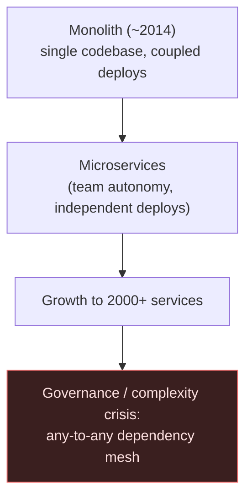

> [!WARNING]
> Microservices solved the monolith's coupling — and then created a *new* coupling at the system level. With thousands of services and no structural constraint on **who may call whom**, the dependency graph degenerated into a near-arbitrary mesh: any service could depend on any other. The org had traded one big tangled thing for thousands of small ones tangled together. This sprawl is its own failure mode, and recognizing it as such is the whole motivation for DOMA.

The symptoms of sprawl are concrete and painful: nobody can reason about the blast radius of a change; a single user request fans out across dozens of services (debugging and tracing become archaeology); there is duplicated functionality because teams can't find what already exists; onboarding is brutal; and reliability degrades because deep, unconstrained dependency chains multiply failure modes. Crucially, **none of this is fixed by adding more services or more infrastructure** — it is a *structural* problem that needs a *structural* answer.

> [!NOTE]
> **An analogy for the governance crisis.** Picture a company that grew from 20 people to 2,000 *without ever drawing an org chart*. Anyone can walk up to anyone else's desk and ask for something, so they do. There is no reception desk, no "talk to the team, not the person" rule, no notion of which teams are "platform" and which are "product." On day one this felt fast and friendly. By 2,000 people it is chaos: two different people have quietly built the same payroll spreadsheet because neither knew the other existed; changing how expenses are filed requires walking around and interrupting a dozen people whose desks all turned out to touch the expense flow; and when something breaks, tracing *who depends on what* means interviewing half the building. Nobody did anything wrong — the structure simply rotted as the count grew. **DOMA is the moment this company finally reorganizes into departments**, each with one reception desk you must go through, and a rule that product teams may ask platform teams for things but not the reverse. That reorganization is exactly what the next section describes.

**A representative war story — the change that touched a dozen services.** A product manager asks for what sounds trivial: "add a loyalty discount that applies at checkout for riders who've taken 50+ trips." An engineer starts pulling the thread. The discount needs trip-count data (one service), the rider's eligibility status (another), the fare calculation (pricing, which turns out to be *three* services with unclear boundaries), the receipt rendering (two more), the promotions audit log (another), and a feature flag system (another) — and each of those, it emerges, has its own upstream callers that might break. No single team *owns* the seam where "loyalty" lives, so the change becomes a six-week cross-team negotiation with a release-train standoff. This is the lived experience of microservice sprawl: the cost of a feature is dominated not by writing it but by *finding and coordinating the unowned seams it crosses*. It is precisely this pain — multiplied across hundreds of such changes a quarter — that made the case for DOMA inside Uber Engineering.

## DOMA: Domain-Oriented Microservice Architecture

Around 2020, Uber Engineering published **DOMA — Domain-Oriented Microservice Architecture** — its answer to sprawl. DOMA does not abandon microservices; it imposes **structure** on them. It rests on four ideas, and the goal of all four is the same: *make the dependency graph legible and bounded again.*

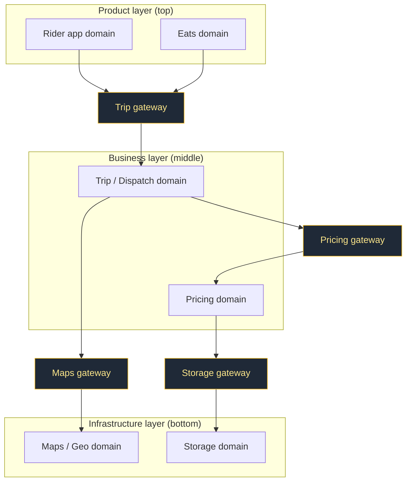

**1. Domains.** Related microservices are grouped into a **domain** — a collection of services that, together, own one coherent area of the business (e.g. *Maps*, *Pricing*, *Trip*, *Driver*). A domain is the unit of ownership and reasoning. This is **Domain-Driven Design's bounded context** applied at the level of *groups of services* rather than a single service or module.

**2. Gateways.** Each domain is fronted by a **gateway** — a single entry point that is the *only* way the rest of the system talks to that domain. The gateway hides the domain's **internal** services, structure, and implementation. Outside callers depend on the gateway's stable interface, not on the dozen services behind it. This is the **API-gateway / facade pattern** raised to the domain level, and it is the single most important constraint: it shrinks each domain's public surface from "all of its services" to "one interface."

> [!NOTE]
> **The gateway is the department's single reception desk.** Back to the reorganized company: the rule is no longer "walk up to anyone's desk." It is "to ask the Pricing department for anything, you go to *Pricing's reception desk* and ask through its published menu of services." You no longer know — or care — that behind that desk there are nine people and three internal tools; if Pricing reshuffles its internals tomorrow, your conversation with the reception desk is unchanged. That decoupling is the whole point. In the loyalty-discount war story above, the reason the change was a six-week negotiation was that there *were no reception desks*: the engineer had to talk to every individual service. With gateways, "apply a loyalty discount at checkout" becomes one call to the Pricing gateway, and Pricing owns the seam internally. The public surface area of the entire company collapses from "every desk" to "one desk per department."

**3. Layered architecture.** Domains are organized into **layers**, and dependencies may only point **downward** — from a *higher* layer to a *lower* one, never sideways within a layer in an uncontrolled way and never upward. A common cut is **product ← business ← infrastructure**: product-facing domains depend on business domains, which depend on infrastructure domains; the *Maps* (infra) domain must never depend on the *Rider app* (product) domain. This single rule is what kills the any-to-any mesh — it turns the dependency graph into a **directed acyclic, layered** structure where you can always answer "what does this break?" by looking *downward only*.

**4. Extension points.** To avoid forking a shared domain every time a new market or product line needs slightly different behaviour, domains expose **extension points** — well-defined hooks (interface implementations, plugins, logic injected at defined seams) where callers customize behaviour *without modifying the core domain*. This lets one *Pricing* domain serve many products instead of N copies, preserving the consolidation that decomposition was supposed to buy.

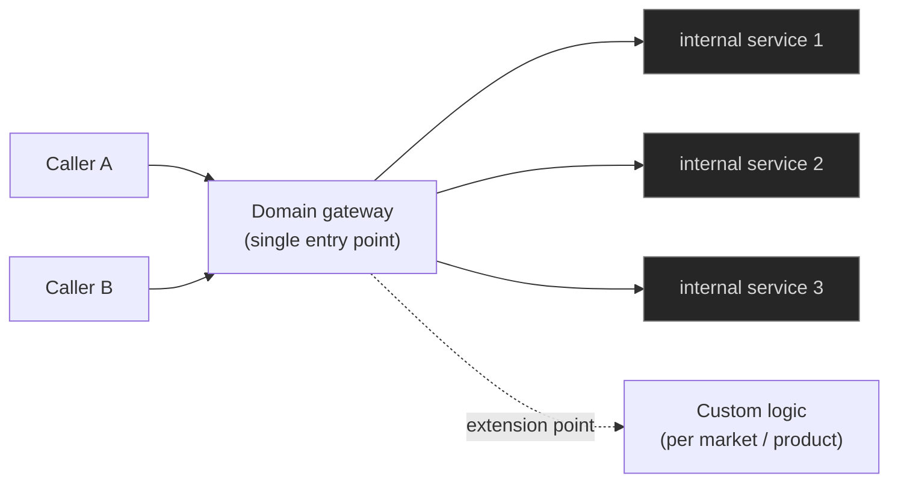

The problem DOMA solves, stated precisely: in an unconstrained microservice estate, **every team can depend on every other team**, so complexity grows roughly with the *square* of the service count and no one can reason about the whole. DOMA replaces "service ↔ service" with "domain ↔ domain via gateway, downward only," collapsing the reasoning surface from thousands of services to a few dozen domains with stable, layered interfaces. It is the **modularization of a microservice estate** — the same instinct as a modular monolith, applied to a distributed system.

> [!IMPORTANT]
> DOMA is not "fewer services." It is *the same services, with enforced structure*: domain boundaries (bounded contexts), gateways (one public interface per domain), strict downward layering (a DAG, not a mesh), and extension points (customize without forking). The lesson generalizes far beyond Uber: once you have enough services that the org graph is unintelligible, the next scaling move is not more services — it is **governing the dependency graph**.

### When Domain-Oriented Grouping Is The Right Cure (And When It Isn't)

DOMA is a heavyweight prescription, and reaching for it too early is its own mistake. Use this decision guidance:

- **It is the right cure when** you have the *specific* sprawl symptoms: dozens-to-hundreds of services, an any-to-any dependency mesh, multiple teams, "nobody can name the blast radius of a change," duplicated functionality nobody can find, and request traces that fan across 20+ services. These are the signs that complexity is now growing with the *square* of the service count and the bottleneck is **coordination**, not code. If three or more of those describe you, the grouping-plus-gateways-plus-layering move pays for itself.
- **It is overkill when** you have a handful of services and one or two teams. At that scale the dependency graph is still legible by eye; imposing gateways and a layered DAG adds indirection and ceremony that buys nothing. A **modular monolith** or a small set of services with clear ownership is cheaper and just as safe — and, as the [Shopify case study](./T05-shopify-modular-monolith.md) shows, can stay that way for a very long time.
- **The decision rule in one sentence:** introduce DOMA structure when the *cost of understanding who-calls-whom* starts to dominate the cost of writing the code — and ideally just *before* that point, because retrofitting domain boundaries onto a rotted mesh is far more expensive than drawing them while the graph is still small.

> [!TIP]
> **In Practice — pick a "seam-revealing" pilot domain first.** When a team adopts DOMA, the highest-leverage first move is not a big-bang reorg. Choose one painful, widely-depended-on area — *Pricing* is the classic choice because everything touches money — wrap it in a single gateway, and freeze all new direct calls to its internal services (enforce it with a dependency-lint rule that fails the build, e.g. ArchUnit on the JVM). The first gateway both delivers immediate relief on the most-touched seam *and* teaches the org what a domain boundary feels like, before you commit to drawing all of them.

## DISCO: The Dispatch System

**DISCO** (DISpatch optimization / the dispatch system) is the heart of the marketplace — the component that actually **matches supply to demand in real time**. When a rider requests a trip, DISCO is what finds candidate drivers, scores them (by ETA, direction of travel, fairness, and more), and dispatches an offer. It does this under a **strict latency budget**: a rider staring at a spinner for several seconds is a lost trip, so the whole match must complete in well under a couple of seconds end to end.

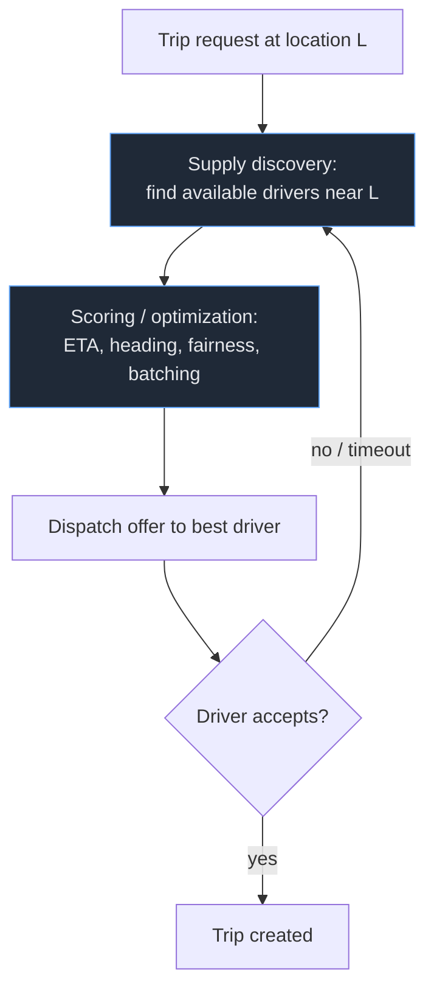

The reason DISCO can't just be "a service with a database" is the combination of **geography and latency**. The matching state — *which drivers are where, right now* — is high-churn (every driver updates location every few seconds) and intensely **local** (a request in San Francisco never needs Tokyo's drivers). Serving this from a central, disk-backed database would be both too slow (per-request round trips) and badly partitioned (a global table for a local query). So DISCO needs infrastructure that is (a) **in-memory and fast**, (b) **partitioned by geography** so a query touches only the relevant region, and (c) **horizontally scalable** so the fleet grows with traffic. The next three sections are exactly the pieces that provide this: **H3** for *how to bucket geography*, **Ringpop** for *how to shard stateful nodes by those buckets*, and **Schemaless** for *durable storage underneath*.

> [!TIP]
> **In Practice — spending a latency budget.** Make the constraint concrete by writing it down as a budget the architecture must fit inside. Suppose the product promise is "the rider sees a matched driver in under ~1 second." A plausible split of that budget might look like: ~50 ms for the mobile round trip and gateway hop; ~5 ms to resolve `(lat, lng)` to an H3 cell; ~10–20 ms to route to the Ringpop node owning that cell and read the live supply in it (in-memory, so cheap); another ~10–20 ms *per ring of expansion* if the center cell is thin on drivers; ~50–100 ms for scoring and optimization across candidates; and the rest held in reserve for the offer round trip to the driver and inevitable tail latency. Now read off what each design choice is *buying* against that budget: a central database read of 50–200 ms would blow the supply-lookup line item by itself, which is *why* the supply state is in memory and geo-sharded; each extra ring of k-expansion costs real milliseconds, which is *why* you want the resolution chosen so the typical center cell already holds enough drivers; and scoring is given the largest slice because that is where match *quality* (and therefore marketplace efficiency) is won. The discipline of assigning milliseconds to each stage is exactly how a senior engineer turns "it must be fast" into a checkable architecture — and how they catch, on a whiteboard, that "just add a database call here" silently overspends the budget.

## H3: A Hierarchical Hexagonal Geospatial Index

Uber **open-sourced H3 in 2018**. It is a **hierarchical, hexagonal, global grid system**: it tiles the surface of the Earth with hexagonal cells, each identified by a 64-bit `H3Index`, at multiple **resolutions** (zoom levels) that nest hierarchically. You convert a `(lat, lng)` into the H3 cell that contains it, and now "near this point" becomes "this cell and its neighbours" — a discrete, cheap, set-based operation instead of expensive continuous geometry.

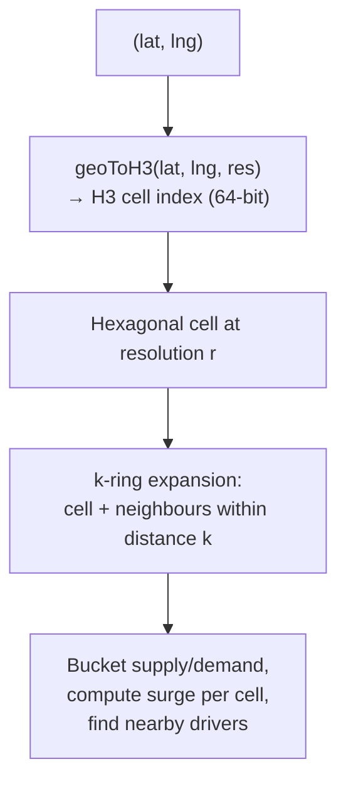

> [!NOTE]
> **A honeycomb laid over the map.** Picture H3 as a honeycomb stretched over the surface of the Earth: tessellating hexagonal cells, edge to edge, with no gaps. Because it is a honeycomb, *every cell's neighbours are equidistant* — step from any cell to any of its six touching cells and you have walked the same distance. A bee on one cell reaches all of its immediate neighbours with the same single step. That "all neighbours one equal step away" property is not a curiosity; it is the entire reason Uber chose hexagons over squares, and the next paragraph makes precise why.

**Why hexagons, specifically?** This is the crux, and it is a genuinely elegant reason. On a hexagonal grid **every cell has exactly 6 neighbours, and all six neighbour centers are at (approximately) the same center-to-center distance.** Contrast a square grid (like a geohash): a square has 4 *edge* neighbours and 4 *corner* neighbours, and the distance to a corner neighbour is √2× the distance to an edge neighbour. Squares have **two kinds of adjacency** with two different distances; hexagons have **one uniform adjacency**.

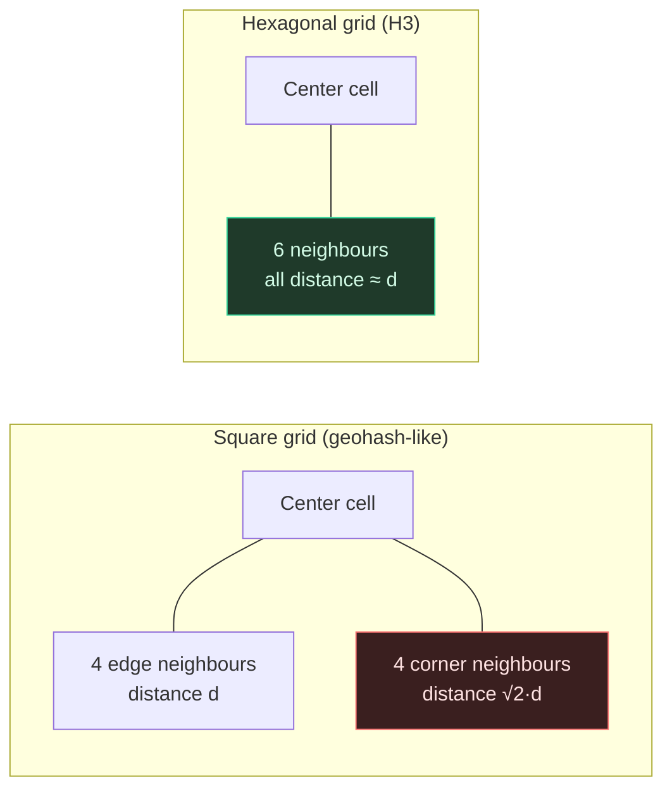

That uniformity matters for *exactly* the operations a marketplace runs constantly:

- **"Expand the search ring."** When there's no available driver in the current cell, DISCO widens the search to neighbours, then neighbours-of-neighbours. On hexagons this **k-ring** expansion grows in clean, roughly-circular bands where every cell at distance *k* is genuinely about the same distance away. On squares, expanding the ring mixes near edge-neighbours and far corner-neighbours, so a "ring" isn't a consistent radius and your nearest-driver search is distorted.
- **Smoothing and aggregation.** Computing a value over a cell and its neighbours (e.g. **surge pricing per area**, supply/demand density) is well-behaved when all neighbours are equidistant — no neighbour is artificially over- or under-weighted by being a "corner."

**Hierarchy (resolutions).** H3 has multiple resolutions; a coarse cell contains finer child cells (each step is roughly a 7× change in count — hexagons don't tile perfectly into children, so the nesting is approximate but practically very useful). This lets Uber **zoom**: aggregate supply/demand at a coarse resolution for a city-wide surge map, then drill into a fine resolution for the actual nearest-driver search. One index, many granularities.

In practice Uber uses H3 to **bucket supply and demand into cells**, **compute surge per cell**, and **find nearby drivers** by resolving the rider's location to a cell and gathering candidates from that cell and its k-ring. The geospatial query has become a discrete index lookup plus a ring expansion — fast, cache-friendly, and uniform.

### When A Heavyweight Spatial Index Is Warranted (And When A Geohash Is Enough)

It is easy to read this section and conclude "always use H3." That would be over-engineering for most teams. The honest decision guidance:

- **A simple geohash, or `ST_DWithin` in PostgreSQL/PostGIS, is enough when** your spatial workload is modest: a store-locator ("nearest 5 branches"), occasional geofencing, a "restaurants near me" list that runs hundreds of times a minute, or anything where a single Postgres instance comfortably absorbs the query volume and your "nearby" queries don't need *uniform* neighbour rings. Here a battle-tested database spatial index is simpler to operate, transactional, and perfectly fast. Do not stand up H3 infrastructure to find the closest coffee shop.
- **A heavyweight spatial index like H3 is warranted when** you have *all three* of: (1) genuinely high spatial query volume (millions/minute) that no single database can serve, so geography must become a **sharding key** not just a query predicate; (2) a need for **uniform neighbour expansion** — true ring-by-ring nearest search or per-cell aggregation where square-grid corner/edge distortion would actually bias the result (dispatch, surge, supply/demand heatmaps); and (3) **hierarchical zoom** — the same data aggregated at city scale and drilled to block scale. Uber has all three. Most apps have none.
- **The middle ground exists too.** Many teams get far with a geohash *as a coarse bucket key* (cheap, string-prefix, works in any KV store) and only adopt H3 when the corner/edge non-uniformity demonstrably hurts their nearest-neighbour or smoothing results. "Geohash until it bites, then H3" is a defensible path.

## Ringpop: Consistent Hashing + SWIM Gossip for Stateful Sharding

H3 tells you *how to bucket geography*. **Ringpop** tells you *how to spread those buckets across a fleet of stateful nodes and route each request to the node that owns its bucket.* Ringpop is an **application-layer library** (originally Node.js, with ports) that gives a set of cooperating processes three things at once: **consistent hashing**, **SWIM gossip-based membership**, and **request forwarding/sharding**. It turns a pool of identical app instances into a self-organizing, sharded, in-memory cluster — without a separate coordination service.

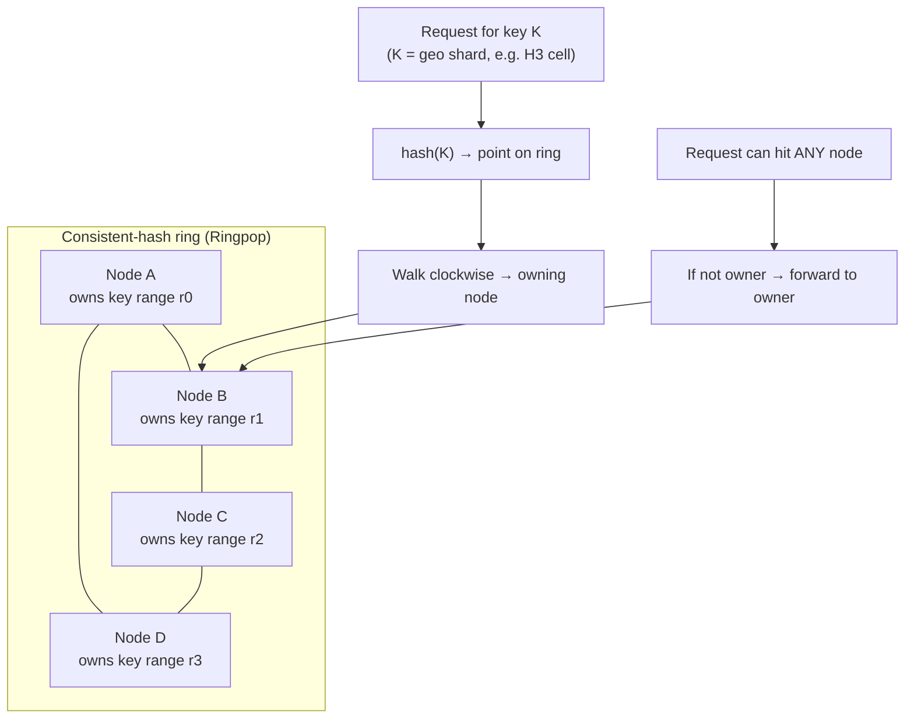

**Consistent hashing.** Ringpop maps both nodes and keys onto a hash ring. Each key is owned by the next node clockwise from its hash position. The key insight (covered in depth in [Partitioning & consistent hashing](../C02-distributed-systems-and-system-design/T05-partitioning-and-consistent-hashing.md)) is that when a node joins or leaves, **only the keys in its immediate arc move** — not the whole keyspace — so the dispatch cluster can scale and tolerate failures with minimal reshuffling of in-memory geo state. For Uber, the **key is the geographic shard** (e.g. derived from an H3 cell), so consistent hashing *is* the geo-sharding mechanism: a given area's live supply/demand state is co-owned by a specific node.

> [!NOTE]
> **A circular seating chart.** The cleanest way to feel why consistent hashing matters is to picture a **round banquet table with assigned seating arranged in a circle**. Every guest (a key — here, a geo cell) is assigned to "the next host sitting clockwise from where my name-card lands on the rim." Now a host (a node) leaves the party: with this circular scheme, only the guests *between the departing host and the previous host* need to be reassigned — they shift to the next host clockwise. **Everyone else keeps their seat.** Compare the naive alternative, "seat guest number *n* at host `n mod H`": remove one host and `H` changes, so *almost every guest* gets a new seat — a total reshuffle. Consistent hashing is exactly the circular-seating-chart trick: adding or removing a host shifts only a few neighbours, not the whole room. For Uber, "not reshuffling the whole room" means a node can die or be added mid-rush-hour and only a thin arc of geo cells migrates its in-memory state — the rest of the city's dispatch keeps humming.

Here is the mapping made fully concrete. Suppose the ring runs `0–99` (in reality it is a 2^32 or 2^64 space, but small numbers make it readable), four nodes hash to positions **A=10, B=35, C=60, D=85**, and a key is owned by the **first node clockwise at or after its hash**:

| Key (geo cell) | `hash(key) mod 100` | First node clockwise | Owner |
| --- | --- | --- | --- |
| `cell-SoMa` | 7 | A at 10 | **A** |
| `cell-Mission` | 22 | B at 35 | **B** |
| `cell-Castro` | 48 | C at 60 | **C** |
| `cell-Marina` | 71 | D at 85 | **D** |
| `cell-Sunset` | 91 | wraps → A at 10 | **A** |

Now **node C (position 60) crashes** during a surge. Only keys whose hash lands in the arc *(35, 60]* — the arc C used to own, sitting between B and C — need a new home; they roll clockwise to the next surviving node, **D at 85**:

| Key | `hash` | Owner before | Owner after C dies | Moved? |
| --- | --- | --- | --- | --- |
| `cell-SoMa` | 7 | A | A | no |
| `cell-Mission` | 22 | B | B | no |
| `cell-Castro` | 48 | C | **D** | **yes** |
| `cell-Marina` | 71 | D | D | no |
| `cell-Sunset` | 91 | A | A | no |

Only `cell-Castro` migrated; three of four keys never moved. That is the rebalancing property in miniature — and it is why, when a dispatch node fails mid-rush-hour, only the handful of cells it owned must be rebuilt elsewhere while the rest of the city is undisturbed. (In a real ring each physical node is placed at *many* virtual positions so the arcs are evenly sized and the load of a departing node spreads across several survivors rather than dumping entirely on its one clockwise neighbour — the same trick, finer-grained.)

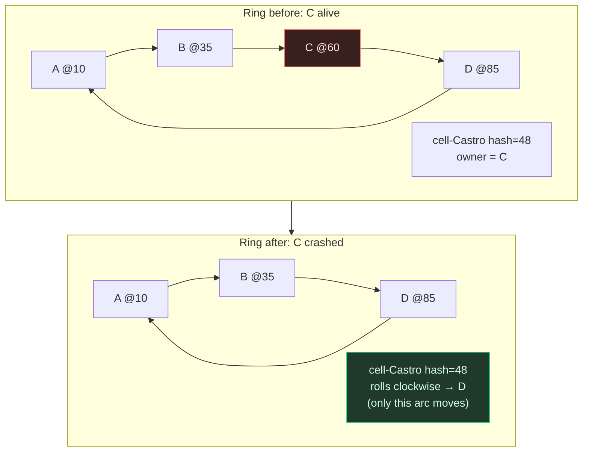

**SWIM gossip membership.** For consistent hashing to work, every node must agree on *who is in the ring right now*. Ringpop tracks this with **SWIM** — *Scalable Weakly-consistent Infection-style process group Membership*. Each node periodically **pings** a random peer; if it doesn't respond, it asks a few other peers to ping it **indirectly** (ruling out a single bad network path before declaring anyone dead). Membership changes (joins, suspicions, failures) spread **epidemically** — "infection-style" — by piggybacking on these ping messages, so the whole cluster converges on the membership list quickly without any central registry.

> [!NOTE]
> **Rumours spreading through a crowd.** Imagine a crowded party with no host on a microphone making announcements. Someone notices a friend has slipped out the door. They don't shout it to the room — they just mention it to the next person they happen to talk to: "hey, Sarah left." That person passes it along in their next conversation, and so on. Within a couple of minutes *everyone* at the party knows Sarah left, even though nobody ever made a central announcement and no two people had to talk directly. That is exactly SWIM gossip: each node tells a random peer what it knows, the news rides along on conversations that were happening anyway (piggybacked on pings), and membership facts ("D is gone," "E just joined") spread like a rumour — "infection-style" — until the whole cluster has converged. The beautiful part is that it needs **no central announcer** (no coordination server). The slightly uncomfortable part — *weak consistency* — is also exactly like the party: for a brief window, the people near the door know Sarah left while folks across the room haven't heard yet. SWIM accepts that brief disagreement on purpose, because the alternative (a central registry everyone must consult) doesn't scale and becomes a single point of failure. The indirect-ping step has a real-world analogue too: before you tell the room "Sarah left," you ask *two other people* to go check the door, in case *you* just couldn't see her — you don't want to spread a false rumour because of your own bad vantage point.

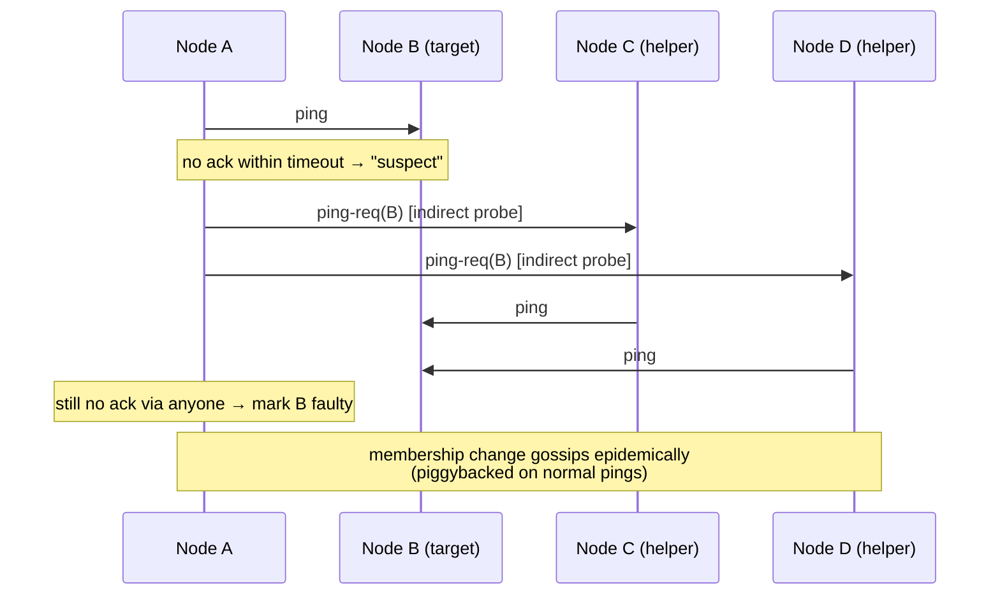

SWIM is *weakly consistent* on purpose: it accepts brief disagreement about membership in exchange for **scalability** (the per-node message load stays roughly constant as the cluster grows) and **fast failure detection**. The indirect-ping step is what makes it robust — it avoids falsely evicting a healthy node just because one link between two peers hiccupped.

**Request forwarding.** Because membership and the ring are *replicated to every node*, a request can land on **any** node (via a normal load balancer). That node hashes the request's key, finds the owner, and — if it isn't the owner — **forwards** the request to the node that is. Callers don't need to know the sharding; Ringpop makes the cluster look like one logical service while internally routing each key to its single owner. That single-owner property is exactly what stateful, in-memory dispatch needs: one place per geo shard accumulates that area's live state.

> [!TIP]
> Ringpop is a clean example of pushing coordination *into the application tier* instead of standing up a separate cluster manager. The three ingredients — **consistent hashing** (who owns what), **gossip membership** (who's alive), **forwarding** (route to the owner) — are the minimal kit for a self-organizing sharded service, and they're all language-agnostic patterns you can build on the JVM.

### When Consistent Hashing + Gossip Is Overkill

This machinery is genuinely elegant, which makes it tempting to reach for. Resist that unless you actually have **stateful, partitioned, in-memory ownership** to manage. Decision guidance:

- **You almost certainly don't need it when** your services are **stateless** and back onto a shared database or cache. If any instance can serve any request because the truth lives in Postgres or Redis, then a plain load balancer in front of a stateless fleet is the correct, boring answer — there is no "owner" to find, so consistent hashing and gossip solve a problem you don't have. The vast majority of web services are in this bucket.
- **A managed system already does this for you when** your need is "shard a keyspace with minimal reshuffle on scaling." Redis Cluster, Cassandra, DynamoDB, and Kafka partitioning all implement consistent-hashing-style ownership internally — lean on them rather than hand-rolling a ring. Hand-built Ringpop-style coordination is justified mainly when you need a *custom* in-memory, single-owner-per-shard service that no off-the-shelf store gives you — exactly Uber's live dispatch state.
- **The litmus test:** do you have data that *must* live in memory for latency, that is *too large or too hot* for one node, and where a *specific node must be the single owner* of each shard's mutable state? Only when all three are true does pushing consistent hashing + gossip into your application tier earn its considerable operational cost. If you're unsure, you don't need it yet.

## Schemaless: Append-Only Storage on Sharded MySQL

DISCO's hot state lives in memory, but trips, users, and the durable record of everything must be persisted. Uber built **Schemaless**, an append-only datastore built **on top of sharded MySQL**. The motivation is pragmatic and worth noting: Uber needed **horizontal scale** but wanted to keep the **operational familiarity, tooling, and reliability of MySQL** rather than bet the company on a then-immature distributed database. Schemaless is essentially a **triggerless, append-only abstraction layered over many MySQL shards.**

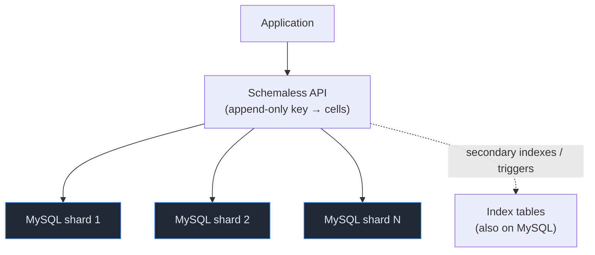

The model is **cell-based and append-only**: a logical row is a key with a column, and each version is a **cell** that is *never updated in place* — new versions append. This append-only design makes writes simple and replication safe, supports **buffered writes** (writes are acknowledged and durably queued, then applied/replicated), and offers **triggers and secondary indexes** built on top of the same sharded MySQL substrate so you can query by more than the primary key. The transferable point is small but important: *you do not always need a new database* — sometimes the right move at scale is a **purpose-built sharding/abstraction layer over a boring, battle-tested engine** you already operate well.

## The Trip-Dispatch Data Flow End to End

Now assemble the pieces into the path a single trip request takes — this is where H3, DISCO, and Ringpop click together.

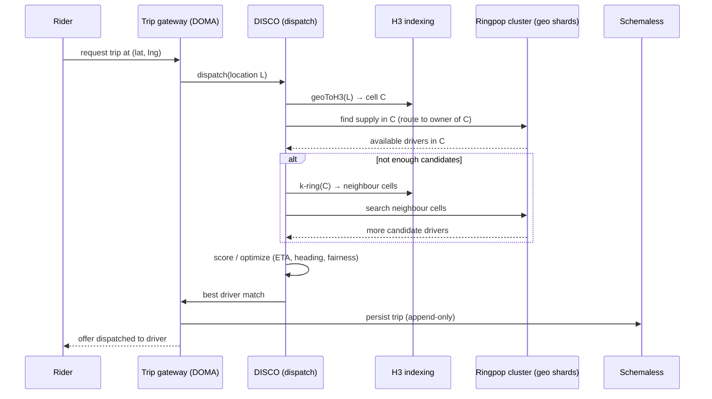

Step by step: the rider requests a trip; the **DOMA trip gateway** receives it and calls **DISCO**; DISCO resolves the rider's location to an **H3 cell**; it asks the **Ringpop** cluster for available drivers in that cell (the request is forwarded to the node that *owns* that geo shard); if there aren't enough candidates, it **expands the k-ring** to neighbouring cells and searches those owners too; it **scores** the candidates (ETA, direction of travel, batching/fairness) and picks the best; the match is **persisted** (Schemaless) and an **offer is dispatched** to the chosen driver. Geography narrowed the search (H3), sharding made the search local and in-memory (Ringpop), and the gateway kept the caller decoupled from all of it (DOMA).

#### A Fully Worked Walk-Through: One Rider Across The Cells

Let us make that abstract path completely concrete with a single named request, so every concept above lands on a specific event. **Maya opens the app at the Marina, San Francisco, 6:12 PM, and taps "Request UberX."**

1. **Gateway hop (≈50 ms).** Her phone hits the **Trip gateway** — the *one* DOMA reception desk for the Trip domain. Maya's app knows nothing about DISCO, H3, or Ringpop; it only knows the gateway's stable "request a trip" interface. The gateway does auth, basic validation, and calls DISCO.
2. **Resolve to a cell (≈5 ms).** DISCO calls `geoToH3(37.8037, -122.4368, res)` and gets back, say, cell **`C-Marina`** (a single 64-bit index). Maya's continuous GPS point is now a discrete bucket — the geospatial problem just became a set lookup.
3. **Route to the owner (≈15 ms).** DISCO asks the **Ringpop** cluster, "who has live supply in `C-Marina`?" It hashes the cell key, the ring says **Node B owns the arc that `C-Marina` falls into**, so the request is forwarded to Node B. Node B holds, *in memory*, the live roster of every available driver currently in `C-Marina`. Tonight that roster is thin — two drivers, both just dropped someone at a nearby restaurant and one is already accepting another ride.
4. **Expand the k-ring (≈15 ms per ring).** One viable candidate is not enough for a good match, so DISCO calls `kRing(C-Marina, 1)` → the six neighbour cells `C-N1 … C-N6` (the honeycomb's equidistant neighbours). Crucially, those neighbour cells may be owned by *different* Ringpop nodes — `C-N3` is owned by Node A, `C-N5` by Node D — so DISCO fans out the supply query to those owners in parallel. Each one answers from its own in-memory roster. Now DISCO has, say, nine candidate drivers drawn from a clean roughly-circular band around Maya. (Because the grid is hexagonal, every cell in that ring is genuinely about the same distance from her — a square grid would have mixed in corner cells √2× farther away and quietly biased the candidate set.)
5. **Score and optimize (≈50–100 ms).** DISCO scores the nine candidates by predicted ETA to Maya, heading (a driver already pointed her way beats one who'd have to U-turn), and marketplace fairness/batching. The winner is a driver in `C-N3`, three minutes out and already driving in her direction.
6. **Persist and offer.** The chosen match is written **append-only to Schemaless** (a durable record that never blocks the hot path), and the gateway dispatches the **offer** to that driver's app. Maya sees "Driver found — 3 min away" comfortably inside the latency budget.

Notice how each subsystem did exactly one job: **H3** turned a point into a cell and a neighbourhood into a clean ring; **Ringpop** made "the live drivers near here" a local, in-memory read on a *specific owner node* (and let the ring fan out across several owners when the search widened); **DISCO** spent its biggest time slice where match quality is won; and **DOMA's gateway** meant Maya's app — and every other caller — stayed decoupled from all of this machinery. If Node B had crashed at 6:11 PM, only the cells in B's arc (including `C-Marina`) would have re-homed to the next node clockwise, and Maya's 6:12 request would have been served by that node instead — the rest of the city's dispatch never noticing.

## Lessons: What Transfers to Your System

```mermaid
mindmap
  root(("Uber<br/>lessons"))
    Tame microservice sprawl
      Group services into domains
      One gateway per domain
      Strict downward layering (DAG not mesh)
      Govern the dependency graph
    Geo-sharding
      Use a spatial index (H3) for location workloads
      Hexagons → uniform neighbours, clean ring search
    Stateful sharding
      Consistent hashing for ownership
      Gossip (SWIM) for membership
      Forward each key to its owner
    Right-size services
      Beware premature microservices
      Sprawl is its own failure mode
    Reuse boring tech
      Schemaless over sharded MySQL
      New layer, not new database
```

- **Domain-oriented decomposition tames microservice sprawl.** Thousands of services with an any-to-any dependency mesh is a *real* failure mode — not a theoretical one. The fix is structural: bounded **domains**, a single **gateway** per domain, and strict **downward layering** so the dependency graph is a DAG you can reason about. At scale, the next move is governing dependencies, not adding services.
- **Geo-shard location workloads with a spatial index.** When a query only cares about a region, encode geography into a discrete index (like H3) so "nearby" is a cheap set operation. And the **hexagon insight** is genuinely useful anywhere you do neighbour-expansion or spatial smoothing: uniform adjacency beats square grids' two-distance neighbours.
- **Consistent hashing + gossip is the kit for stateful sharding.** To make a fleet of stateful nodes co-own a keyspace: **consistent hashing** decides ownership with minimal reshuffle on membership change, **SWIM gossip** keeps everyone agreed on who's alive, and **forwarding** routes each key to its owner. Ringpop packages exactly this.
- **Beware premature microservices.** Uber's sprawl is the cautionary tale: splitting too early or too finely, without boundaries, buys you distributed-systems pain *and* an unintelligible org graph. Decompose along real domain seams, and impose structure *before* the graph rots — not after.
- **Sometimes the right database is the one you already run.** Schemaless shows that a purpose-built sharding/abstraction layer over MySQL can beat adopting a brand-new datastore, by keeping operational familiarity while gaining horizontal scale.

> [!INTERVIEW]
> **Q:** *"Your company has grown to ~1,500 microservices. Teams complain nobody can reason about the system, a single request touches 30 services, and there's duplicated functionality everywhere. You can't realistically merge them back into a monolith. What do you do?"*
>
> **A:** This is microservice **sprawl**, and the fix is *structural governance of the dependency graph*, not more services — essentially Uber's DOMA. First, **group services into domains** (bounded contexts) that each own one coherent business area. Front each domain with a **single gateway** so the rest of the system depends on one stable interface per domain, not on its internal services — this collapses the public surface from ~1,500 services to a few dozen domains. Then impose a **layered architecture** (e.g. product ← business ← infrastructure) where dependencies may only point **downward**, turning the any-to-any mesh into a directed acyclic graph you can reason about; "what does this break?" is now answered by looking downward only. Add **extension points** so shared domains can be customized per market/product without forking, preserving consolidation. The duplicated functionality gets absorbed into the owning domain behind its gateway. Net effect: the same services, but now governed — legible blast radius, discoverable capabilities, bounded complexity. The trade-off is upfront work to define domain boundaries and the discipline to enforce the layering (often via tooling/lint on the dependency graph).

## Java/Spring Relevance

Although Uber's stack is largely Go/Node/Python, **every pattern here is language-agnostic and maps cleanly onto the JVM**:

- **DOMA ≈ DDD bounded contexts + API gateways.** A "domain" is a [bounded context](../C01-software-architecture/); a "gateway" is an API gateway you'd build with **Spring Cloud Gateway** (or a service mesh). The downward-layering rule is the same dependency discipline you enforce inside a [layered or modular architecture](../C01-software-architecture/) — and you can enforce it with module boundaries and architecture tests (e.g. ArchUnit) that fail the build when a lower layer imports an upper one. DOMA is essentially **DDD + facade applied to a whole microservice estate**.
- **Consistent hashing and gossip-based sharding are JVM-implementable.** The Ringpop pattern — consistent-hash ownership, SWIM membership, request forwarding — is exactly the machinery covered in [Partitioning & consistent hashing](../C02-distributed-systems-and-system-design/T05-partitioning-and-consistent-hashing.md), and there are mature JVM implementations of both consistent hashing and gossip membership. Nothing about geo-sharding a stateful service requires leaving the JVM.
- **H3 has a Java binding.** The H3 library ships JVM bindings, so you can resolve coordinates to cells and run k-ring expansions directly from Java/Spring services for any location workload (delivery, geofencing, spatial aggregation).
- **The right-sizing lesson is the one that matters most for most teams.** You are far more likely to *over*-decompose than to genuinely need 2,000 services. Start with clear domain boundaries (a [modular monolith](../C01-software-architecture/) is often the right first step), split along real seams, and impose DOMA-style structure *before* the graph becomes a mesh. The deeper architecture patterns behind all of this live in the [Software architecture chapter](../C01-software-architecture/).

### Mapping DOMA Onto Spring + DDD, Concretely

To make the "DOMA ≈ DDD bounded contexts + API gateway" claim tangible, picture a Spring shop building the same loyalty-discount feature from the war story above — but *with* DOMA structure in place:

- **A domain is a DDD bounded context.** "Pricing" is a bounded context with its own ubiquitous language (fares, surge multipliers, discounts, taxes). Inside it live several Spring services, but the *concept boundary* is the bounded context. The trip-count and eligibility data that the loyalty discount needs belong to clearly owned contexts (Trips, Rider), not to "wherever someone happened to put it."
- **A gateway is a Spring Cloud Gateway (or BFF/facade) in front of the context.** The Pricing domain publishes one **`PricingGateway`** API — say, a single `POST /pricing/quote` that accepts the trip, rider, and applicable promotions and returns a fare. The Checkout context calls *that*, not the three internal pricing services. Adding the loyalty discount becomes a change *inside* Pricing behind its gateway; the public `quote` contract may not even change. The six-week cross-team negotiation collapses to a one-team change.
- **Downward layering is enforced in the build, not by hope.** Put product, business, and infrastructure contexts in separate Gradle/Maven modules and add an **ArchUnit** rule that fails CI if an infrastructure module imports a product module, or if any module reaches around a gateway into another domain's internal package. This is how you keep the dependency graph a DAG instead of letting it rot back into a mesh — the layering rule becomes a *lint check on the dependency graph*, exactly the "governance" DOMA is about.
- **Extension points are Spring's own seams.** The loyalty discount is a perfect example: rather than forking Pricing per market, expose a `DiscountRule` interface and let each market/product contribute an implementation (a Spring bean, a plugin, a strategy wired by configuration). One Pricing domain serves many products — the consolidation that decomposition was supposed to buy, preserved.

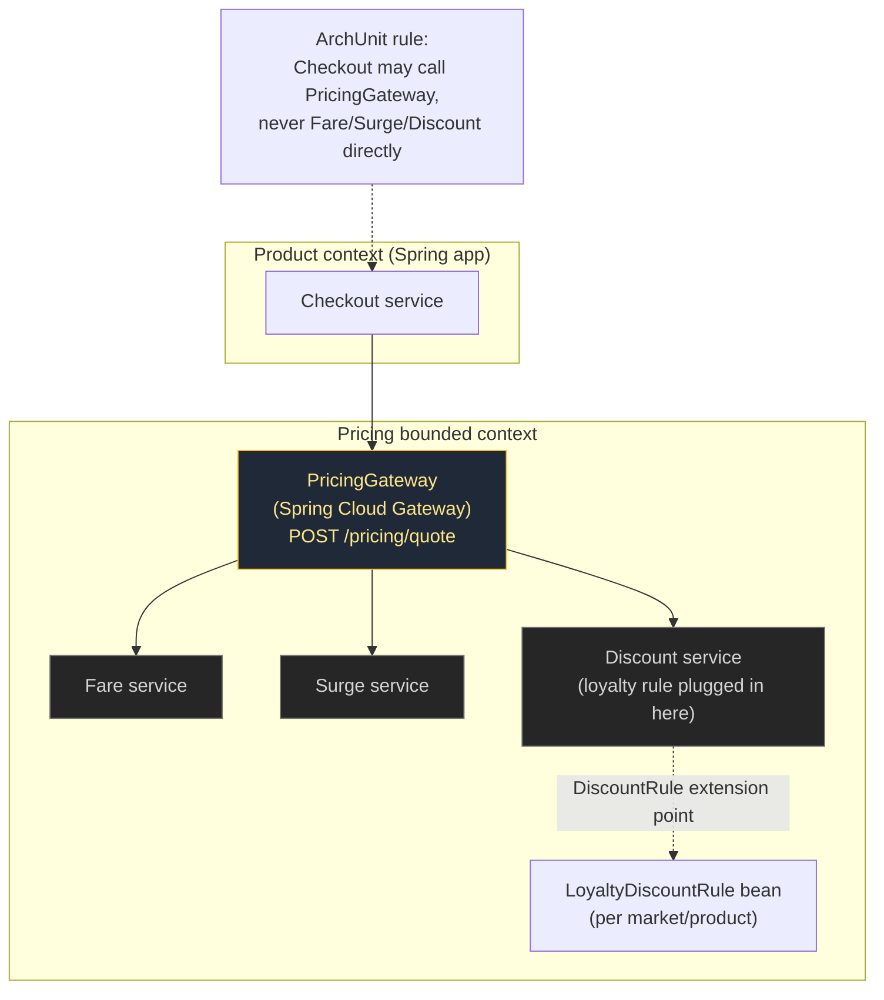

## Practice

1. **Apply DOMA.** You have 40 services with a tangled dependency graph: an `auth` service calls a `reporting` service which calls `auth` back, and a low-level `geo` service imports a top-level `checkout` service. Group the services into 3–4 domains, assign each a gateway, place them in layers, and identify which two dependencies violate downward-only layering and how you'd fix them.
2. **Why hexagons.** A teammate proposes a square-grid geohash for "find drivers within ring *k* of a rider." Explain concretely what goes wrong when you expand the search ring on squares vs. H3 hexagons, and give one operation (besides search) where hexagon uniformity also helps.
3. **Shard a stateful tier.** You're building an in-memory presence service sharded by `user_id`. Sketch how consistent hashing assigns owners, what moves when a node dies, and what role a SWIM-style gossip protocol plays. Why is *weak* consistency acceptable for membership here?
4. **Indirect ping.** In SWIM, when node A gets no ack from B, it asks C and D to ping B before declaring B dead. What failure does this indirect step specifically protect against, and what would break if you removed it?
5. **Right-size the split.** A 12-engineer startup wants to launch with "one microservice per noun" (~25 services). Argue for or against using the Uber sprawl story, and propose an alternative starting structure that still leaves a clean path to DOMA-style domains later.
6. **Walk the ring rebalance.** Using the worked ring from the Ringpop section (nodes at A=10, B=35, C=60, D=85, owner = first node clockwise), suppose instead a **new node E joins at position 25**. Which of the five example cells (`cell-SoMa`=7, `cell-Mission`=22, `cell-Castro`=48, `cell-Marina`=71, `cell-Sunset`=91) change owners, and to whom? Then explain in one sentence why the "circular seating chart" analogy predicts that only a thin arc moves.
7. **Spend a latency budget.** You're told a search-and-match must complete in ~800 ms end to end. Allocate that budget across mobile round trip, spatial lookup, candidate gathering (including possible ring expansion), and scoring — then identify the single design change ("add a database read on the hot path," "expand three rings instead of one," etc.) that would most threaten the budget, and what you'd do instead.
8. **Decide: index, ring, or Postgres?** For each workload, say whether you'd reach for H3 + Ringpop-style geo-sharding, a plain geohash/PostGIS query, or a stateless service over a shared store, and why: (a) a national store locator returning the nearest 3 branches; (b) real-time driver dispatch in 50 cities at millions of queries/minute; (c) a presence service that just needs "is user X online," backed by Redis.
9. **Pick the pilot domain.** Your 60-service estate is a mesh and leadership has bought into DOMA. Choose which *one* domain you'd wrap in a gateway first, justify the choice against the "seam-revealing pilot" guidance, and name the build-time check you'd add to stop new direct calls to its internals.

## Recap

- Uber is a **real-time, two-sided geospatial marketplace**; its core operation is "find nearby available supply near point L, fast," which drives every major architecture choice.
- It went from a **monolith (~2014)** to **well over 2,000 microservices**, which created a **governance/complexity crisis** — an any-to-any dependency **mesh** that is its own failure mode.
- **DOMA** (~2020) imposes structure: group services into **domains** (bounded contexts), front each with a **gateway** (one public interface), enforce **downward-only layering** (product ← business ← infrastructure, a DAG not a mesh), and add **extension points** to customize without forking.
- **DISCO** matches supply/demand under a strict latency budget; geography + low latency demand in-memory, geo-partitioned infrastructure rather than central-database queries.
- **H3** (open-sourced **2018**) is a **hierarchical hexagonal** global grid; hexagons give **6 equidistant neighbours** (vs. squares' edge/corner split), making **ring expansion** and **per-cell smoothing/surge** clean and uniform.
- **Ringpop** turns a stateful fleet into a sharded cluster via **consistent hashing** (ownership), **SWIM gossip** (weakly-consistent, infection-style membership with indirect pings), and **request forwarding** (route each key to its owner) — geo shards as keys.
- **Schemaless** is an **append-only, cell-based store over sharded MySQL** — horizontal scale with operational familiarity instead of a brand-new database.
- Transferable lessons: **govern the dependency graph** to tame sprawl, **geo-shard with a spatial index**, **consistent hashing + gossip for stateful sharding**, **beware premature microservices**, and **reuse boring tech** when a thin sharding layer suffices.
- **Mental models worth keeping:** consistent hashing is a *circular seating chart* (adding/removing a host shifts only a few neighbours, not the whole room); H3 is a *honeycomb over the map* (every cell's neighbours are equidistant, one equal step away); DOMA is *reorganizing a chaotic 2,000-person company into departments*, each with one reception desk (gateway) you go through; SWIM gossip is *rumours spreading through a crowd* so everyone learns who left without a central announcer.
- **Decision guidance, not just patterns:** apply DOMA when who-calls-whom cost dominates code cost (overkill at a handful of services); use a spatial index like H3 only with high query volume **and** uniform-neighbour needs **and** hierarchical zoom — otherwise a geohash/PostGIS query is enough; reach for consistent hashing + gossip only for **stateful, in-memory, single-owner-per-shard** state, not for stateless services backed by a shared store (where a load balancer, or a managed system like Redis Cluster/Cassandra, already solves it).
- **Make "it must be fast" checkable:** turn the latency promise into a per-stage **budget** (gateway hop, cell resolution, owner routing, per-ring expansion, scoring, offer) so every design choice can be read off against the milliseconds it spends — and so "just add a database read here" is caught on the whiteboard.

## Next

Continue to [Shopify — The Modular Monolith](./T05-shopify-modular-monolith.md), where the pendulum swings the other way: instead of thousands of services, a single deployable kept *internally* modular — the counterpoint to Uber's distributed estate.
