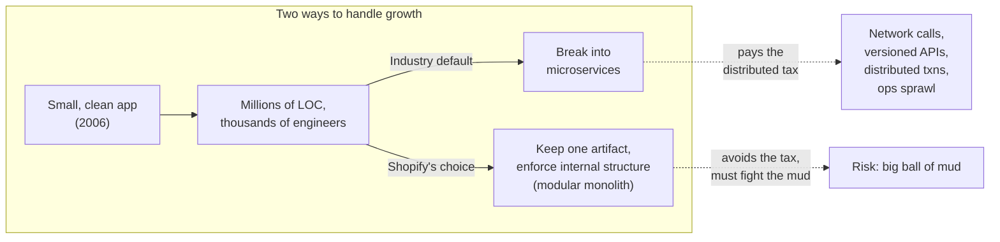
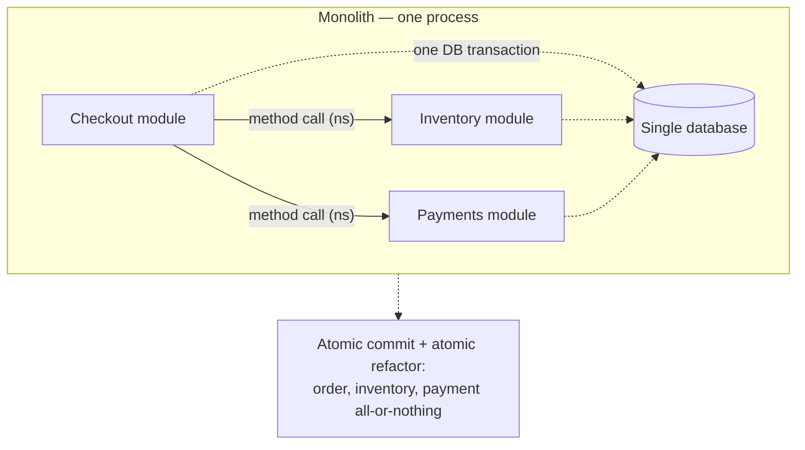
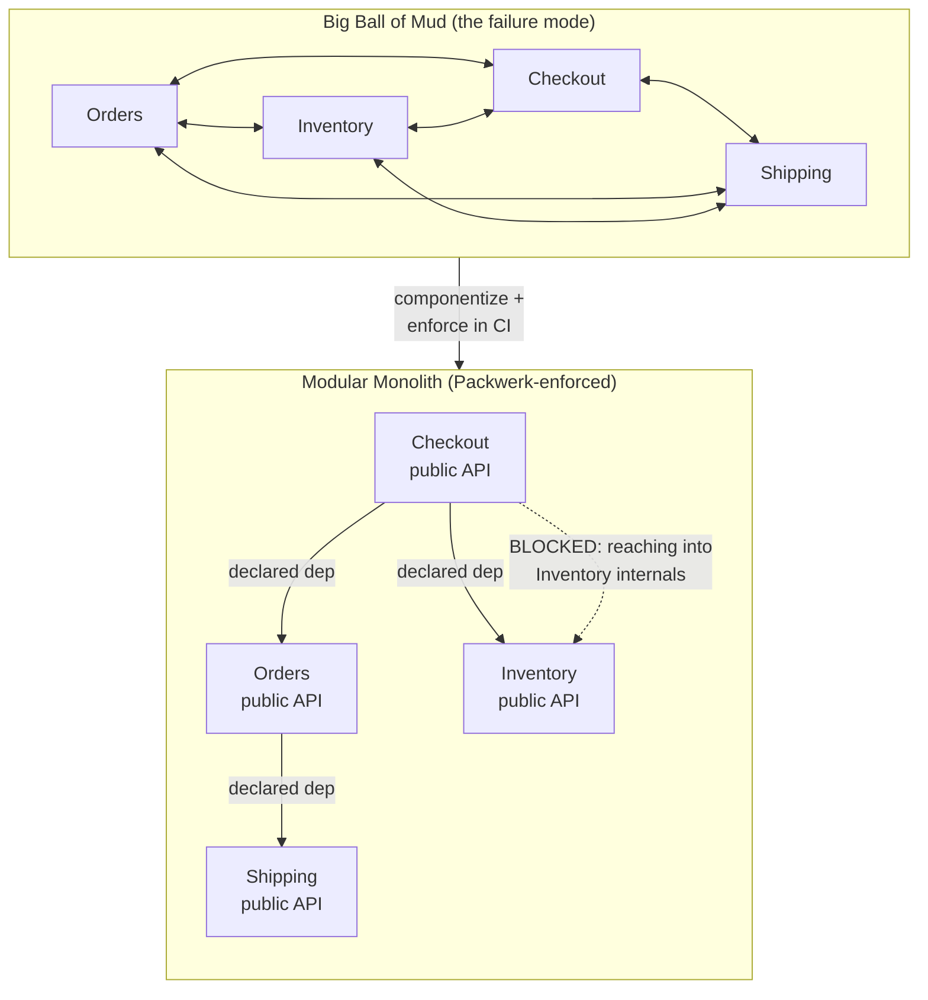
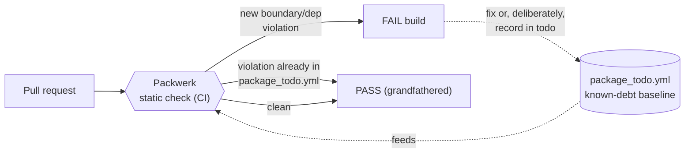
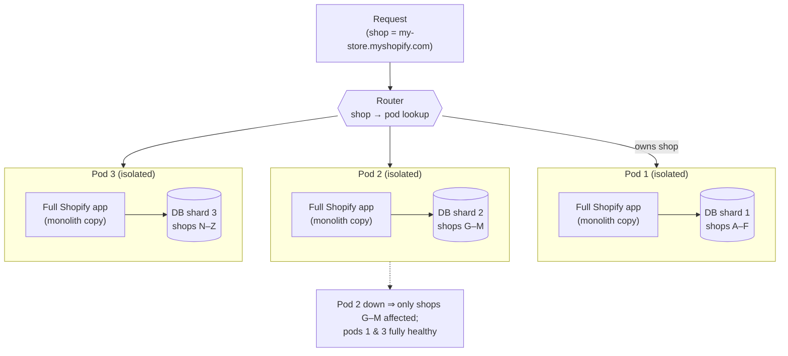
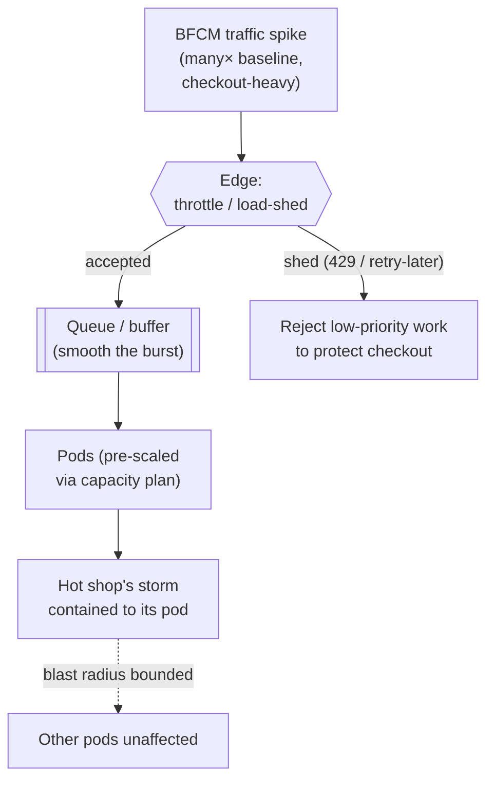
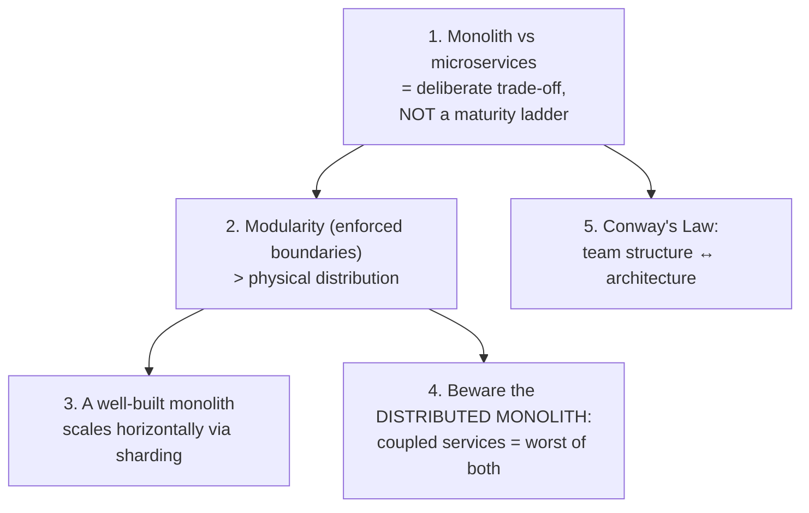
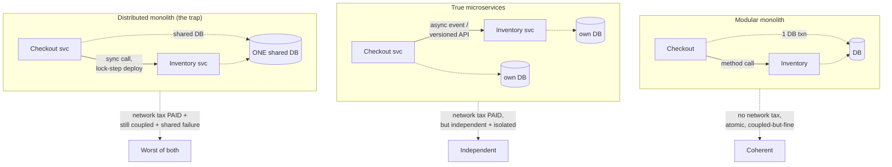
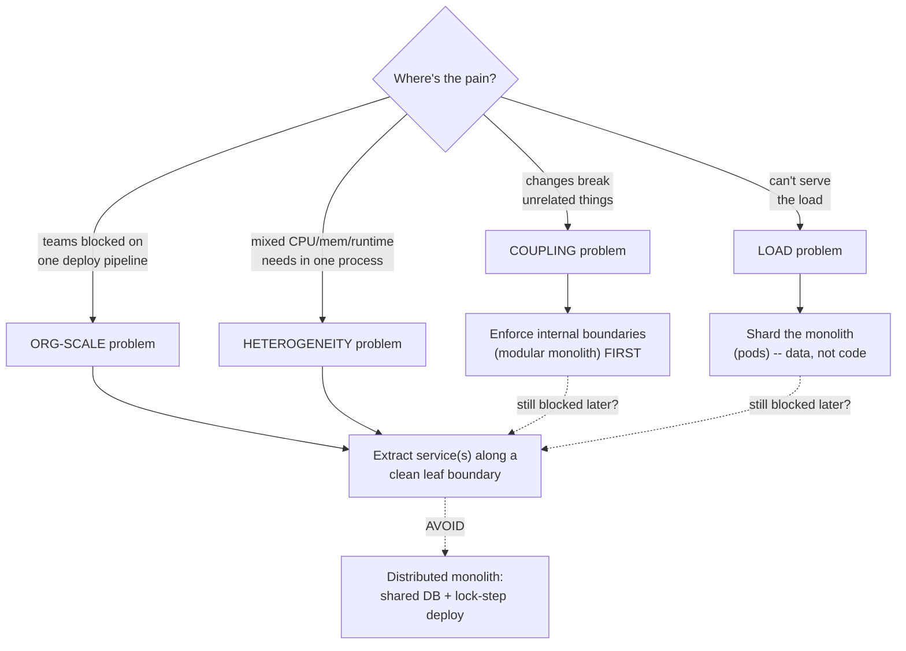
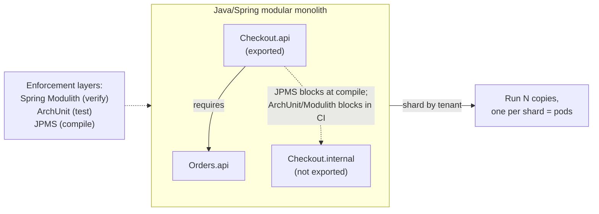

# Shopify — The Modular Monolith

Every preceding case study in this chapter is a *decomposition* story: Netflix, Discord, and Uber each broke things apart to survive at scale. Shopify is the deliberate **counter-narrative**. It runs one of the largest Ruby on Rails applications on earth — millions of lines of code in a single codebase, processing a very large share of independent online commerce — and it has *consciously refused* to break that codebase into microservices. This is not technical conservatism or an inability to migrate; it is a reasoned, well-documented engineering position. Shopify's bet is that the real enemy is not the monolith but the **unstructured** monolith — the "big ball of mud" — and that you can keep every benefit of a single deployable artifact while getting the modularity people *think* they need microservices for. This topic reads Shopify as a **decision-and-trade-off study**: what they kept, the one risk that bet exposes them to, the machinery they built to neutralise it (Packwerk + componentization), how they scale a monolith *horizontally* (pods), and how every one of those ideas maps directly onto a Java/Spring stack.

> [!NOTE]
> Prerequisites: [Partitioning & Consistent Hashing](../C02-distributed-systems-and-system-design/T05-partitioning-and-consistent-hashing.md) — the "pods" mechanism below is **sharding the application**, so you need the partition-key / shard-routing mental model. Strongly recommended companion reading: the [Software Architecture](../C01-software-architecture/) chapter, especially [Monolith vs Microservices vs Modular Monolith](../C01-software-architecture/T04-monolith-vs-microservices-vs-modular-monolith.md) and [Domain-Driven Design](../C01-software-architecture/T03-domain-driven-design-ddd.md) (componentization is DDD bounded contexts applied *inside one process*).

> [!TIP]
> **The house-vs-campus analogy — keep it in your head for the whole topic.** A **modular monolith** is *one large house with clearly-defined rooms and locked internal doors*: the kitchen, the bedroom, and the garage are unmistakably separate spaces with their own purpose, but you move between them instantly by opening a door — no walking outside, no weather, no commute. **Microservices** are *a campus of separate buildings you must walk between*: each building has its own address, plumbing, and front desk, and every trip between them means crossing the open quad (the network) where it can rain (latency), the path can flood (partial failure), and you need a map and a badge (service discovery and auth) to get in. Both layouts can be *organised* — the difference is not "tidy vs messy," it is **how far apart the rooms are and what it costs to walk between them.** Shopify's thesis, in one line: you can have crisply separated rooms *without* moving them into separate buildings. Hold this picture; every section below is a different room, door, or walk across the quad.

## The Setup — A Giant Rails Monolith, On Purpose

Shopify's core application ("the Shopify monolith", internally often nicknamed *Shopify Core*) is a Ruby on Rails codebase that has grown since 2006 into one of the largest Rails apps ever run in production — characterize it as **millions of lines of code** (publicly discussed as having crossed well over a couple of million) edited by **thousands of engineers**, all deploying to **one codebase that ships as one artifact**. By the late 2010s the conventional wisdom in the industry was that an application this size *must* be broken into microservices to remain workable. Shopify looked at that prescription and declined.

Their public framing borrowed a phrase from **DHH (David Heinemeier Hansson) and Basecamp: the "Majestic Monolith."** The argument: a small team — or even a large one with discipline — gets enormous leverage from a single, coherent application, and the move to microservices imposes a *distributed-systems tax* that most teams pay without ever needing to. Shopify adopted that posture explicitly and then did the engineering work to make it hold at *their* scale, where "a large team with discipline" alone is not enough.



> [!IMPORTANT]
> The framing matters. Shopify did **not** argue "microservices are bad." They argued that the monolith-vs-microservices decision is a **trade-off keyed to context**, not a maturity ladder you are obligated to climb. Treat the rest of this topic the same way: this is the *strong* version of the monolith case, presented to be taken seriously, not a strawman to knock down.

To see *why* the strong version is worth taking seriously, it helps to watch the two ways teams usually get this wrong — because Shopify's whole architecture is an answer to both of them.

> [!WARNING]
> **War story #1 — the monolith that became a haunted house.** A mid-size fintech started with a clean Rails app in 2014. Nothing *enforced* boundaries, so under deadline pressure each team reached straight into whatever class was convenient: the `Reporting` code read `Payments` internals directly, `Onboarding` wrote rows that `Ledger` assumed it owned, and a "quick" feature touched eleven domains. Five years later, *changing the email-template wording broke payouts in production* — because a shared helper had quietly grown a dependency no one could see. New hires were told "don't touch the `User` model, last person who did caused an outage." This is the **big ball of mud** made physical: a house where someone knocked down all the interior walls, so now the wiring for the bedroom runs through the kitchen sink and you cannot renovate one room without risking the whole building. The lesson Shopify internalised: *a monolith with no enforced structure does not stay a monolith — it rots into a single, un-renovatable room.*

> [!WARNING]
> **War story #2 — the team that fled into a distributed monolith.** A 25-engineer B2B startup read the same "you must adopt microservices to scale" advice and, before they had any real scaling problem, split their app into nine services. Two years on they had paid the *entire* distribution tax and collected *none* of the reward: the nine services still shared one database, still deployed in a fixed order (because of synchronous call chains), and a single feature now required editing three repos and coordinating a release train. Local dev needed eight services running just to load the homepage; onboarding a new engineer went from one afternoon to a week. Their P95 latency *rose* (every former method call was now a network hop), incidents got *harder* (a request crossed four services, so every outage was a murder mystery), and velocity *dropped*. They had built a **distributed monolith** — a campus of nine buildings connected by tunnels you can never close, so a fire in any one still fills them all with smoke. It took an 18-month, multi-team effort to merge most of it back into a modular monolith. That painful round-trip is the cost Shopify designed its way around.

## What They Kept — The Monolith Benefits

To understand why staying monolithic was rational, you have to be precise about what a single deployable buys you — and these are exactly the properties a microservices split *gives away*.

| Benefit kept | What it means concretely | What microservices would cost instead |
|---|---|---|
| **One deployable artifact** | One build, one release pipeline, one version of "the app" at any instant | N independently versioned services, deployment choreography, version-skew bugs |
| **In-process calls** | Module A calls module B as a plain method call — no network, no serialization, nanoseconds not milliseconds | Every cross-boundary call is a network hop with latency, marshalling, and a new failure mode |
| **Transactional consistency** | A checkout writes order + inventory + payment rows in **one database transaction**; it commits or rolls back atomically | Distributed transactions / sagas, compensating actions, eventual-consistency reasoning everywhere |
| **Atomic refactoring** | Rename a method and fix all 400 call sites in **one commit, one PR, one deploy** | A breaking change must be rolled out across services with backward-compatible API versioning |
| **Simple local dev & onboarding** | New engineer runs *one* app and can read the whole system; no service-mesh-on-a-laptop | Spin up a constellation of services (or mock them) just to run a feature locally |
| **One thing to reason about** | The entire control flow is in one repo, traceable in a debugger | Reasoning spans network boundaries; you need distributed tracing to follow a request |



The costs Shopify *avoided* are the recurring themes of this entire book: distributed transactions ([2PC & Saga](../C02-distributed-systems-and-system-design/T06-distributed-transactions-2pc-saga.md)), partial network failure and the resilience machinery to survive it ([circuit breakers / bulkheads](../C02-distributed-systems-and-system-design/T14-resilience-circuit-breaker-bulkhead-retry-timeout-backpressure.md)), versioned internal APIs, and the observability sprawl of tracing requests across a service graph. A monolith doesn't make those problems easier — it makes most of them **not exist**.

## The Real Risk — And The Answer

There is exactly **one** serious failure mode for the monolith strategy, and Shopify names it plainly: a large codebase with no enforced internal structure decays into a **big ball of mud**. Every module reaches into every other module's internals; an innocent change in one corner breaks something three domains away; "what depends on what" becomes unknowable. At that point you have all the coupling of a distributed monolith with none of the deployment independence — the *worst* outcome.

Their answer is **componentization**: turn the flat monolith into a **modular monolith**. The codebase is carved into **components** (roughly: bounded contexts — `Orders`, `Inventory`, `Checkout`, `Shipping`, `Billing`, …). Each component has:

1. A **public API** (the only surface other components may call), and
2. **Explicit, declared dependencies** (a component states which other components it is allowed to use).

The breakthrough is making those rules **enforced**, not aspirational. In **2020 Shopify open-sourced [Packwerk](https://github.com/Shopify/packwerk)** — a static-analysis tool (a "packaging" linter for Ruby) that checks two things at CI time:

- **Boundary / privacy violations** — code in component X reached into a *private* class of component Y instead of going through Y's public API.
- **Dependency violations** — X called Y without *declaring* a dependency on Y, or violated the allowed dependency direction.

A pull request that breaks a boundary fails the check. This is the whole trick: **modularity without distribution.** You get enforced boundaries — the thing microservices give you *physically* (you literally cannot reach into another service's heap) — but enforced *statically, in one process*, keeping all the monolith benefits above.



> [!TIP]
> The mud diagram is a *bidirectional tangle* (every arrow goes both ways); the modular diagram is a *directed graph of public APIs* with a blocked "reach-into-internals" edge. That visual contrast **is** the lesson: componentization replaces uncontrolled mutual reach with declared, one-way, public-only dependencies — and a tool that fails the build when you violate it.

> [!TIP]
> **Packwerk is a building inspector — and that analogy is the whole point of "enforced."** Go back to the house. Componentization draws the walls (the public APIs); but walls you can knock through whenever you're in a hurry are *suggestions*, not boundaries. Packwerk is the **building inspector who shows up at every renovation (every pull request) and enforces that the kitchen can't reach directly into the bedroom's wiring** — it has to go through the breaker panel (the public API). The inspector doesn't *prevent* you from designing a new doorway; it just refuses to sign off (fails the build) if you punch an undeclared hole through a load-bearing wall. The deep idea: in a plain monolith, *good intentions* are the only thing keeping rooms separate, and good intentions lose to deadlines every single time. An automated inspector that **fails CI** converts "we agreed not to do that" into "you literally cannot merge that." That is the entire difference between a modular monolith that *stays* modular and one that quietly relapses into mud.

### Healthy Modular Monolith Or Big Ball Of Mud? — A Field Diagnostic

Both a healthy modular monolith and a big ball of mud are "one deployable with one database," so you cannot tell them apart from the deployment diagram. The difference is entirely in the **dependency structure** and the **change experience**. Here is how to tell which one you actually have — useful both for auditing your own system and for answering "is our monolith fine, or is it a problem?" honestly.

| Symptom | Healthy modular monolith | Big ball of mud |
|---|---|---|
| **Making a change** | Touches one component; you know its blast radius before you start | Touches "wherever the code happens to be"; surprises in unrelated domains |
| **Dependency graph** | Acyclic, declared, drawable on a whiteboard | Cyclic, undeclared, *nobody* can draw it accurately |
| **Reaching across boundaries** | Through a public API; CI fails on internals access | Anywhere into anything; no tool would even notice |
| **Onboarding** | "Here are the components and their contracts" | "Don't touch the `User` model, ask Priya first" |
| **A bug's origin** | Localizable to a component | Could be anywhere; needs an archaeologist |
| **Adding enforcement today** | Already green, or a short to-do list | Thousands of violations — which is *why* you must ratchet, not big-bang |

> [!NOTE]
> The reassuring corollary: a big ball of mud is **not** a sentence — it is a *missing inspector*, and you can hire one retroactively. The next subsection is precisely the mechanism (a known-debt baseline plus "no new violations") that lets you install the inspector on a decade of existing tangle without stopping the world to rebuild it.

### How Packwerk Actually Enforces It

The mechanism is worth understanding because it answers the obvious objection — *"you can't retrofit boundaries onto ten years of tangled code overnight."* Packwerk's design is built precisely for incremental adoption.

A component is a directory containing a **`package.yml`** that declares the component's allowed **dependencies** and how strictly to enforce its **boundary** (privacy) and **dependency** rules. Public code lives in a designated public folder; everything else is private. At CI time Packwerk statically resolves every constant reference and flags violations in two families:

- **Dependency violation** — component X references component Y's public API, but X never *declared* a dependency on Y (or the dependency points the wrong way). This is what keeps the graph **acyclic and intentional**.
- **Privacy violation** — code reaches a *private* constant of another component instead of going through its public API. This is what makes "public API" mean something.

```yaml
# checkout/package.yml — a component's contract, machine-checked in CI.
enforce_dependencies: true       # may only call declared dependencies
enforce_privacy: true            # may only touch other components' public API
dependencies:
  - "components/orders"          # allowed
  - "components/inventory"       # allowed
# 'components/marketing' is NOT listed -> calling it fails the build
```

The retrofit trick is the **`package_todo.yml`** file (a recorded list of *pre-existing* violations). When you first turn enforcement on, Packwerk records the current tangle as a baseline of known debt and then **fails the build only on *new* violations**. Existing mud is grandfathered; the boundary cannot get *worse*, and teams burn down the to-do list over time. This is the ratchet that let Shopify add real enforcement to a decade-old monolith without a big-bang rewrite — the same "stop the bleeding, then pay down" strategy you'd use with ArchUnit baselines on the JVM.



## Pods — How You Scale A Monolith *Horizontally*

Here is the idea that breaks the most common misconception in this whole debate: people assume "monolith" means "can't scale horizontally — you can only buy a bigger box." Shopify proves the opposite. The trick is to realise you can distribute the **data** without distributing the **code**.

A **pod** is a **fully isolated, self-contained running copy of the entire Shopify application, plus its own database shard** that holds a *subset of shops*. Crucially:

- **Every shop lives entirely inside one pod.** A merchant's storefront, orders, inventory, and admin all resolve to a single pod. There is essentially no cross-pod query on the hot path — the data a request needs is co-located in the pod that owns the shop (**data locality**).
- **A pod failure is contained to its own shops (blast-radius containment).** If pod 7's database has a bad hour, only the shops on pod 7 are affected; every other shop is untouched. The failure domain is one shard, not the whole platform.
- **Capacity is near-linear.** Need to serve more shops? Add more pods. Each pod is independent, so throughput scales (close to) linearly with pod count — the textbook benefit of [horizontal partitioning](../C02-distributed-systems-and-system-design/T05-partitioning-and-consistent-hashing.md).
- **Routing is by ownership.** An edge/router layer maps an incoming request (resolved to a shop) to the **one pod that owns that shop's shard** and sends it there — exactly the shard-routing problem from the partitioning topic, applied at the whole-application granularity.



> [!TIP]
> **Pods are identical franchise locations.** Think of a fast-food chain. Every restaurant runs the *exact same* menu, kitchen layout, and operations manual (the identical monolith codebase) — what differs is only *which customers each one serves* (which shard of shops). A pod is a franchise location: self-contained, serving its own set of customers, so **one store's fire doesn't burn down the chain.** If the downtown branch has a grease fire (pod 7's database melts down), the customers of the suburban branch never even notice — they're being served by a completely separate building with its own kitchen. Corporate didn't have to design nine *different* restaurants to get this resilience; they cloned one good restaurant nine times and split the customers. That is the precise move that confuses people: *horizontal scale and fault isolation did not require architectural diversity.* The code is one thing, cloned; only the **customers (data)** are partitioned.

Notice what this is *not*: it is **not** microservices. Each pod runs the **same monolithic codebase** — a complete, identical copy of the application. There is no internal service graph, no inter-service network calls inside a pod, no API versioning between modules. What is distributed is the **set of shops** across **database shards**, with one app copy pinned in front of each shard.

> [!NOTE]
> Say the punchline out loud, because it overturns a near-universal assumption: **you can absolutely scale a monolith horizontally.** "Horizontal scaling" is about distributing *load and data*, not about chopping your *code* into separate services. Shopify scales by sharding shops across pods; the code stays whole. (Each pod can itself run many stateless app replicas behind a balancer for in-pod capacity — the "scale the app tier wide, shard the data" pattern from [scaling & statelessness](../C02-distributed-systems-and-system-design/T12-scaling-horizontal-vertical-autoscaling-statelessness.md).)

## Surviving The Spike — Black Friday / Cyber Monday

Pods give Shopify steady-state horizontal scale and blast-radius isolation. But commerce has a brutal second problem: **flash crowds**. **Black Friday Cyber Monday (BFCM)** is the canonical event — a single weekend where checkout traffic can spike many multiples above baseline, with the **checkout path** as the scorching-hot critical section, and a single viral product drop on one shop can hammer one pod. The defenses layer up:

- **Load shedding / throttling at the edge.** When demand exceeds safe capacity, the system deliberately *rejects or delays* lower-priority work to protect the hot path (checkout). It is better to shed some load gracefully than to let an overloaded node fall over and take everyone with it. (This is [rate limiting](../C02-distributed-systems-and-system-design/T13-rate-limiting-algorithms.md) used as a *survival* mechanism, not just an anti-abuse one.)
- **Queueing / buffering.** Spiky arrivals are absorbed into queues so the backend processes at a sustainable rate instead of being driven past its breaking point — backpressure rather than collapse.
- **Capacity planning + pre-scaling.** BFCM is a *known* date. Shopify pre-provisions and load-tests against modelled peak well in advance — capacity is a plan, not a reaction.
- **Pods bound the blast radius.** Because each shop is isolated to a pod, a hot shop's storm is largely confined to *its* pod. The viral drop punishes one shard's resources, not the global platform — the same containment property, now doing duty as overload isolation.



The shape of this should feel familiar from the resilience chapter: **shed early, queue to smooth, plan capacity, and isolate failure domains** so that the worst sustainable outcome is "some requests are slowed or rejected," never "the platform is down."

> [!IMPORTANT]
> **War story — the flash sale that *should* have taken everyone down, and didn't.** Picture a single merchant on the platform who lands a celebrity endorsement and announces a limited "1,000 units at 90% off, midnight Friday" drop. At 00:00 the link goes viral and that one shop sees a **200× traffic spike** in ninety seconds — a self-inflicted flash crowd. In a *flat* monolith on one shared database, that storm would saturate the connection pool, the slow checkout queries would pile up, and **every other merchant on the platform** — bakeries, bookstores, people who have never heard of this sale — would see their own checkouts time out. One shop's good luck becomes everyone's outage. With **pods**, the viral shop lives on exactly one shard. The hot merchant's storm hammers *its* pod's resources; load-shedding kicks in *on that pod* to protect *its* checkout path; and the other pods — the other thousands of franchise locations — keep serving at full health, blissfully unaware. **The blast radius is one pod, not the platform.** This is the same containment property from the franchise analogy, now doing emergency-room duty: the fire is real and hot, but it is *walled into one building.* The architectural decision (shard by shop) and the resilience decision (shed early) compound — pods turn a platform-wide catastrophe into a single-shard hiccup.

To make the routing concrete — *how does a request actually find its pod?* — here is the shard-resolution sketch in Java terms. This is the same partition-key lookup from the [partitioning topic](../C02-distributed-systems-and-system-design/T05-partitioning-and-consistent-hashing.md), applied at whole-application granularity (resolve tenant → shard → pod), so a viral tenant is *physically* confined to one shard's resources.

```java
// Edge router: resolve an incoming request to the ONE pod that owns its shop.
// This is "shard the data, not the code" made literal — every pod runs the
// same monolith; only the shop->shard mapping differs.
public final class PodRouter {

    private final ShardMap shardMap;        // shop -> shardId (stable, e.g. consistent hashing)
    private final Map<Integer, PodEndpoint> pods;  // shardId -> the pod that owns it

    /** Map a request's shop to the single pod that may serve it. */
    public PodEndpoint route(ShopHandle shop) {
        // 1. Deterministically resolve the shop to its owning shard.
        //    Using consistent hashing keeps a shop on the same shard across
        //    deploys, which is what gives us data locality + a stable failure domain.
        int shardId = shardMap.shardFor(shop);   // e.g. hash(shop.id) -> ring -> shard

        // 2. Look up the pod that owns that shard. One shard => exactly one pod.
        PodEndpoint pod = pods.get(shardId);
        if (pod == null) {
            // No pod owns this shard: hard fail, never silently fan out cross-pod.
            throw new ShardUnroutableException(shardId, shop);
        }

        // 3. Send the whole request there. The pod's local DB has all this
        //    shop's data co-located, so the request never leaves the pod on the
        //    hot path -- a viral shop's storm stays inside ITS pod.
        return pod;
    }
}
```

> [!WARNING]
> The sketch above also encodes the **one thing that breaks pods**: a query that needs data from *many* shops at once (platform-wide analytics, an admin "search all merchants" feature) cannot be answered inside a single pod, because no pod has everybody's data. Cross-shard work must be pushed *off* the hot path — into an async fan-out, a read replica, or a separate analytics store fed by change data capture — never a synchronous cross-pod join. The moment you add a hot-path feature that *must* read across tenants, you have re-introduced the coupling pods exist to remove. Guard that boundary as fiercely as the component boundaries above.

## The Transferable Lessons

These generalise far beyond Ruby or commerce. They are the staff/lead-level takeaways an interviewer is actually probing for.



1. **It's a decision, not a destination.** Microservices are one valid answer to specific forcing functions (independent team-scaled deployment, polyglot needs, isolated failure of *heterogeneous* workloads — see [Netflix](./T01-netflix-resilience-and-microservices.md)). They are *not* the mandatory "grown-up" architecture. Choosing a monolith at scale can be the more senior call.
2. **Modularity beats distribution.** The benefit people *attribute* to microservices — clean boundaries — comes from **modularity**, which you can enforce *inside one process* with tooling. Distribution adds boundaries *and* a network tax. If you only need the boundaries, don't pay the tax.
3. **Monoliths shard too.** Horizontal scaling is a data/load property. Sharding (pods) scales a monolith near-linearly while *improving* fault isolation. "We're hitting our limits, time for microservices" is often a non-sequitur; the real fix may be a shard key.
4. **The distributed monolith is the trap.** If you split into services but they remain tightly coupled — synchronous call chains, shared databases, lock-step deploys — you get the **worst of both worlds**: network latency and partial failure *and* coupling, with none of the independence you split for. Many "microservices migrations" land here. A clean modular monolith is strictly better than a distributed monolith.
5. **Conway's Law cuts both ways.** Architecture tends to mirror org structure. Shopify keeping one codebase reflects (and reinforces) a culture of shared ownership; component boundaries can still mirror team boundaries *without* a network between them. Design the boundary you want — physical or logical — to match how your teams actually own work.

To make lesson 4 concrete, contrast three architectures on a single checkout flow. The distributed monolith is the *only* one of the three that takes on every cost and earns none of the independence — which is exactly why it is the trap, not microservices done right.



| Property | Modular monolith | True microservices | Distributed monolith |
|---|---|---|---|
| Cross-boundary call | in-process method (ns) | network, versioned/async | network, **synchronous** |
| Data ownership | one shared DB, atomic txn | DB-per-service | **one shared DB** (coupling) |
| Deploy independence | one artifact (n/a) | **fully independent** | **lock-step** (no win) |
| Failure isolation | one process | **isolated per service** | **shared** (one DB down = all down) |
| Net result | coherent, low-cost | independent, costs justified | **all costs, no benefits** |

> [!INTERVIEW]
> **"Our monolith is getting hard to work in — should we move to microservices?"** The strong answer separates two problems. *Coupling* (the usual real pain — a change ripples unpredictably) is a **modularity** problem; the first move is enforced internal boundaries (a modular monolith), which is cheaper and lower-risk than distribution. *Scaling* (you genuinely can't serve the load) is a **data/load** problem; sharding the monolith (pods) may solve it without any decomposition. Only reach for microservices when you have a forcing function distribution *specifically* addresses — e.g., independently deployable teams at large org scale, or heterogeneous workloads needing isolated scaling/runtimes. Name the **distributed monolith** as the failure to avoid, and cite Shopify as proof that "monolith" and "scales horizontally" are not contradictory. Bonus: mention you'd enforce boundaries with a CI check (Packwerk in Ruby; **Spring Modulith / ArchUnit** on the JVM) so modularity doesn't erode.

### When To Reach For Each — Decision Guidance

The lessons above are principles; here is the *operational* version a lead actually uses when someone proposes a re-architecture. Default to the cheapest structure that solves the real problem, and only buy distribution when a concrete forcing function demands it.

**The modular monolith is the right default for the overwhelming majority of systems** — essentially every startup and most mid-size products. Choose it when:

- You are pre-product-market-fit or still iterating fast: you want **atomic refactors** and one-PR changes, because your domain boundaries are *still moving* and freezing them into network APIs now would be expensive guesswork.
- One team, or a handful of teams that coordinate easily, owns the system. There is no organisational pressure forcing independent deploys.
- Your pain is **coupling and "changes break unrelated things"** — that is a modularity problem, and enforced boundaries fix it *without* a network.
- Your load is fine, or scalable by sharding. (You can scale data without splitting code — that is the entire pod lesson.)

**Extract a service only when a specific forcing function makes distribution pay for its tax.** The honest triggers:

- **Independent deployability at org scale.** Dozens of teams stepping on one release pipeline is a real, measurable cost (deploy queues, merge conflicts, blast-radius fear). When the *organisation* — not the code — is the bottleneck, a service boundary that mirrors a team boundary buys genuine independence. This is Conway's Law used deliberately.
- **Heterogeneous scaling or runtime.** One workload is CPU-bound video transcoding, another is a memory-hungry ML model, another is a chatty I/O service — and bin-packing them into one process wastes resources or forces a bad-fit runtime. Isolated scaling/runtime is something distribution genuinely provides and a monolith cannot.
- **Independent failure isolation for a *heterogeneous* workload.** A flaky third-party integration that you want to *fail in isolation* (circuit-break it without risking the core) is a candidate for extraction.
- **Hard compliance / data-residency walls** that a single process and database cannot satisfy.

> [!TIP]
> **The "extract a leaf, not the trunk" rule.** When you *do* extract, the right first candidate is a component that is already a *clean leaf* in your modular monolith's dependency graph — few inbound dependencies, a well-defined public API, ideally already communicating via events. A modular monolith is the **best possible launchpad** for selective extraction precisely because Packwerk/ArchUnit have already made the seams visible and clean: you extract along a boundary that already exists, instead of trying to find one in a ball of mud. The progression *flat monolith → modular monolith → (extract a few services where justified)* is almost always cheaper and safer than *flat monolith → big-bang microservices.* Earn each service; never grant them all up front.



## Java / Spring Relevance — Build One On The JVM

None of this is Ruby-specific. The modular-monolith pattern maps cleanly onto a Java/Spring stack, and the JVM arguably has *better* tooling for it than Ruby does, because the type system and the module system give you enforcement at compile time as well as test time.

**1. Spring Modulith** — the direct analogue of componentization for Spring Boot. You declare **application modules** (typically one per top-level package) and their **allowed dependencies**, and Spring Modulith *verifies* them — a clean Packwerk-equivalent built for Spring. It also encourages module-to-module communication via **application events** rather than direct calls, giving you logical decoupling inside one deployable.

```java
// One test verifies the whole modular structure — the "Packwerk for Spring" move.
class ModularityTests {

    static final ApplicationModules modules =
        ApplicationModules.of(ShopApplication.class);

    @Test
    void enforceModuleBoundaries() {
        // Fails the build if any module reaches into another module's
        // internal (non-public) package, or uses an undeclared dependency.
        modules.verify();
    }
}
```

Spring Modulith also lets a module **declare exactly which other modules it is allowed to depend on** — the direct equivalent of a Packwerk `package.yml` `dependencies:` list, but expressed in Java on the module's `package-info.java`. Anything not declared is forbidden, and `modules.verify()` fails the build if violated:

```java
// com/shop/checkout/package-info.java
// Declares Checkout's ALLOWED dependencies -- the Packwerk 'dependencies:' list,
// in Java. Checkout may use Orders and Inventory; touching any OTHER module
// (e.g. 'marketing') fails modules.verify() at build time.
@ApplicationModule(
    allowedDependencies = { "orders", "inventory" }
)
package com.shop.checkout;

import org.springframework.modulith.ApplicationModule;
```

```java
// Prefer events over direct calls for cross-module communication:
// Checkout publishes; Inventory listens. Neither imports the other's services,
// so the dependency is logical, not a hard compile-time wire -- decoupling
// INSIDE one deployable (the "method call is fine, but an event is looser" move).
@Service
class CheckoutService {
    private final ApplicationEventPublisher events;

    CheckoutService(ApplicationEventPublisher events) { this.events = events; }

    @Transactional
    public void completeCheckout(Order order) {
        // ... persist order in the SAME local transaction ...
        events.publishEvent(new OrderPlaced(order.id(), order.lineItems()));
    }
}

// In the Inventory module -- reacts without Checkout knowing it exists.
@Component
class InventoryReservationListener {
    @ApplicationModuleListener                 // transactional, async, module-aware
    void on(OrderPlaced event) {
        // reserve stock for event.lineItems() ...
    }
}
```

> [!NOTE]
> The event-driven move is the in-process echo of how *true* microservices talk (async, versioned events) — but with **zero network tax and an optional shared transaction**. It is the cleanest way to get loose coupling *inside* the house: the kitchen rings a bell (`OrderPlaced`) and the pantry restocks, without the kitchen ever holding a direct wire into the pantry. If you later extract Inventory into its own building, the seam is already an event — so the extraction barely changes the calling code. That is the modular monolith earning its keep as an extraction launchpad.

**2. ArchUnit** — express architectural rules as ordinary **unit tests**: package dependencies, layering, and (critically) **no cyclic dependencies**. This is the lowest-friction way to bolt boundary enforcement onto an *existing* monolith without adopting a new framework.

```java
// A tiny, representative ArchUnit rule set — fails CI on a boundary violation.
@AnalyzeClasses(packages = "com.shop")
class ArchitectureRulesTest {

    // No reaching into another component's "internal" package.
    @ArchTest
    static final ArchRule componentsExposeOnlyApi =
        classes()
            .that().resideInAPackage("..checkout.internal..")
            .should().onlyBeAccessed()
            .byAnyPackage("..checkout..");

    // The whole point: keep the dependency graph acyclic (no mud).
    @ArchTest
    static final ArchRule noCyclicDependencies =
        slices().matching("com.shop.(*)..")
            .should().beFreeOfCycles();
}
```

Two rules earn their place in almost every real codebase: an explicit **forbidden-dependency** rule (the building inspector refusing one specific illegal doorway) and a **layered-architecture** rule (the inspector enforcing that water flows downhill — controllers may call services, services may call repositories, never the reverse):

```java
// A named forbidden dependency + a layered-architecture rule.
// These read almost like English, which is the point: the boundary is
// documented AND enforced by the same artifact.
@AnalyzeClasses(packages = "com.shop")
class BoundaryRulesTest {

    // Billing must never reach into Marketing. In plain English:
    // "a payments concern may not be entangled with a campaigns concern."
    // If anyone wires them together, CI fails -- the inspector blocks the doorway.
    @ArchTest
    static final ArchRule billingMustNotDependOnMarketing =
        noClasses()
            .that().resideInAPackage("..billing..")
            .should().dependOnClassesThat().resideInAPackage("..marketing..");

    // Classic layering: dependencies only point "downhill". A repository
    // calling back up into a controller is a cycle waiting to happen.
    @ArchTest
    static final ArchRule layeredArchitectureIsRespected =
        layeredArchitecture().consideringAllDependencies()
            .layer("Web").definedBy("..web..")
            .layer("Service").definedBy("..service..")
            .layer("Persistence").definedBy("..persistence..")
            .whereLayer("Web").mayNotBeAccessedByAnyLayer()
            .whereLayer("Service").mayOnlyBeAccessedByLayers("Web")
            .whereLayer("Persistence").mayOnlyBeAccessedByLayers("Service");
}
```

> [!NOTE]
> Notice these rules are **the documentation**. A wiki page saying "billing shouldn't depend on marketing" rots silently the day someone violates it; an `@ArchTest` saying the same thing *fails the build* the day someone violates it. Executable architecture is the only kind that stays true — the inspector never goes on vacation.

**3. The Java Platform Module System (JPMS)** — for the strongest guarantee, `module-info.java` enforces encapsulation at **compile time**: a module `exports` only its public packages, and code outside the module *cannot* reference an un-exported package — it won't compile. This is the closest thing the JVM has to a pod's *physical* isolation, achieved purely in the compiler.

```java
// module-info.java — only the public API package escapes the module.
module com.shop.checkout {
    exports com.shop.checkout.api;          // public surface, callable
    // com.shop.checkout.internal is NOT exported -> inaccessible, won't compile
    requires com.shop.orders;               // declared dependency, like Packwerk
}
```

**4. And you can shard it like pods.** A Spring Boot modular monolith is a single deployable; nothing stops you from running **N copies, each pinned to a shop/tenant shard**, with a routing layer resolving tenant → shard — pods, on the JVM. The mechanics are exactly the [partitioning & shard-routing](../C02-distributed-systems-and-system-design/T05-partitioning-and-consistent-hashing.md) you already know.



The payoff for a Java team: you can have a single artifact, in-process calls, atomic transactions, and one-PR refactors — *and* enforced boundaries that don't erode, *and* horizontal scale via sharding. That is the entire Shopify thesis, available on the JVM today. Read it alongside [Monolith vs Microservices vs Modular Monolith](../C01-software-architecture/T04-monolith-vs-microservices-vs-modular-monolith.md) for the decision framework, and the broader [Software Architecture](../C01-software-architecture/) chapter for DDD and decomposition.

## Practice

1. **Make the call.** A 600k-LOC Spring Boot monolith, ~40 engineers, one team complaining that unrelated changes keep breaking their domain. Latency and throughput are fine. Decide: modular monolith, sharded monolith, or microservices? Justify which *problem* you're solving and why the other two are wrong here.
2. **Spot the anti-pattern.** A team split their app into 12 services that share one database and deploy together in a fixed order because of synchronous call chains. Name the anti-pattern, explain why it's worse than their old monolith, and give the first remediation step.
3. **Design pods.** You run a multi-tenant SaaS where each tenant's data is independent. Sketch a pod architecture: choose the shard key, describe the tenant→pod routing layer, and explain the blast-radius and capacity properties. What breaks if a feature needs to query *across* tenants?
4. **Enforce a boundary.** Write an ArchUnit rule that forbids the `billing` package from depending on the `marketing` package, and a second rule that bans cyclic dependencies between any two top-level packages. What does each one prevent in plain English?
5. **BFCM plan.** Your checkout service will see a 20× spike on a known date. List four mechanisms (in priority order) you'd put in place, and for each say *what failure it prevents*. Which one protects you if a single tenant goes viral?
6. **Audit your own house.** Take a system you actually work on. Using the "Healthy Modular Monolith Or Big Ball Of Mud?" field diagnostic table, score it row by row. For each "mud" symptom you find, name the *single cheapest* first move toward the "healthy" column — and say honestly whether you'd reach for the building inspector (enforced boundaries) or whether the rot is bad enough to warrant a recorded-debt baseline first.
7. **Resist the premature split.** A peer proposes splitting your 200k-LOC, 15-engineer Spring Boot app into eight microservices "to be ready to scale," but your latency and throughput are healthy and one team owns the whole thing. Write the two-paragraph response you'd give: which *real* problem (if any) exists, why eight services would likely produce a distributed monolith here, and the modular-monolith-first path you'd recommend instead. Reference the franchise/house analogies to make it land for a non-architect stakeholder.
8. **Declare the dependencies.** For a `checkout`, `orders`, `inventory`, and `marketing` Spring Modulith app, write the `@ApplicationModule(allowedDependencies = …)` declaration for `checkout` such that checkout may use orders and inventory but *not* marketing. Then explain what `modules.verify()` does the moment someone adds a `MarketingClient` call inside checkout — and why catching it here is cheaper than catching it in code review.
9. **Plan the one extraction.** Your modular monolith is healthy, but the org has grown to 12 teams and the `Notifications` component (email/SMS/push) is a clean leaf: it depends on almost nothing, everything talks to it via events, and a third-party SMS provider's outages keep scaring people. Argue whether to extract it into a service, identify the forcing function, and describe how the existing event-based seam makes the extraction low-risk. What would you *refuse* to extract, and why?

## Recap

- Shopify deliberately runs a **giant Ruby on Rails monolith** (millions of LOC, thousands of engineers) and **chose not to go microservices** — the **"Majestic Monolith"** (DHH/Basecamp) framing, treated as a serious, context-dependent engineering decision.
- They **keep the monolith's benefits**: one deployable, in-process calls, transactional consistency, atomic refactoring, simple local dev — and **avoid the microservices tax**: distributed transactions, partial failure, versioned internal APIs, observability sprawl.
- The one real risk is the **big ball of mud**; the answer is **componentization into a modular monolith** — components with **public APIs** and **declared, enforced dependencies**, enforced by **Packwerk** (open-sourced 2020): *modularity without distribution*.
- **Pods** shard the monolith: each pod is an **isolated copy of the app + its own DB shard** owning a subset of shops; this gives **blast-radius containment**, **data locality**, and **near-linear horizontal scale** — proving you *can* scale a monolith by distributing **data, not code**.
- **BFCM / flash-sale survival** layers **edge load-shedding/throttling, queueing, capacity planning, and pod-level blast-radius bounding** to protect the checkout hot path.
- Lessons: it's a **trade-off, not a maturity ladder**; **modularity > distribution**; **monoliths shard**; **beware the distributed monolith** (coupling + network tax); **Conway's Law** links team structure to architecture.
- On the **JVM**, the pattern is first-class: **Spring Modulith** (verify module dependencies, `@ApplicationModule(allowedDependencies = …)`, event-driven module communication), **ArchUnit** (architectural unit tests — forbidden dependencies, layering, no cycles), and **JPMS** (compile-time encapsulation) — and you can **shard a Spring modular monolith into pods** via a tenant → shard → pod router.
- **Mental models to keep:** a modular monolith is *one house with locked internal doors*; microservices are *a campus you walk between*; **Packwerk/ArchUnit/Spring Modulith are the building inspector** who fails the build when you punch an undeclared hole through a wall; **pods are identical franchise locations** so one store's fire never burns down the chain.
- **Two failure stories to avoid:** the unenforced monolith that *rots into a haunted house* (mud) because good intentions lose to deadlines, and the *premature split into a distributed monolith* that pays the whole network tax for none of the independence. Both are answered by *modular-monolith-first, then shard, then extract a clean leaf only when a forcing function demands it.*
- **Decision rule:** match the move to the *problem* — coupling → enforce boundaries; load → shard; org-scale deploy contention or heterogeneous runtimes → extract a service along an *already-clean* boundary. The modular monolith is the right default for nearly all startups and mid-size products and the **best launchpad** for selective extraction.

## Next

Continue to [Airbnb — Monolith to SOA Migration](./T06-airbnb-monolith-to-soa-migration.md), the deliberate counterweight to this topic: a company that *did* decompose its monolith — and the disciplined, staged way it pulled that off without falling into the distributed-monolith trap.
