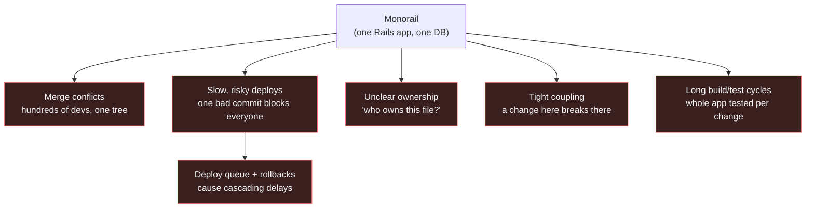
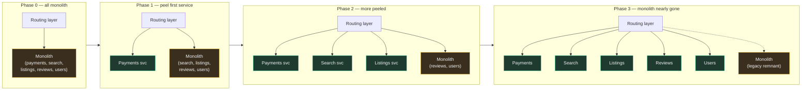
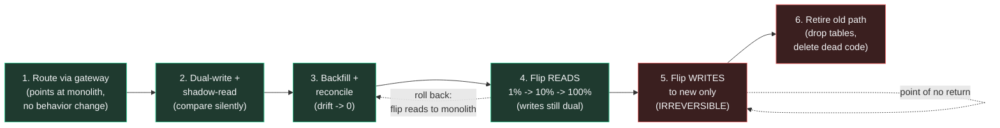
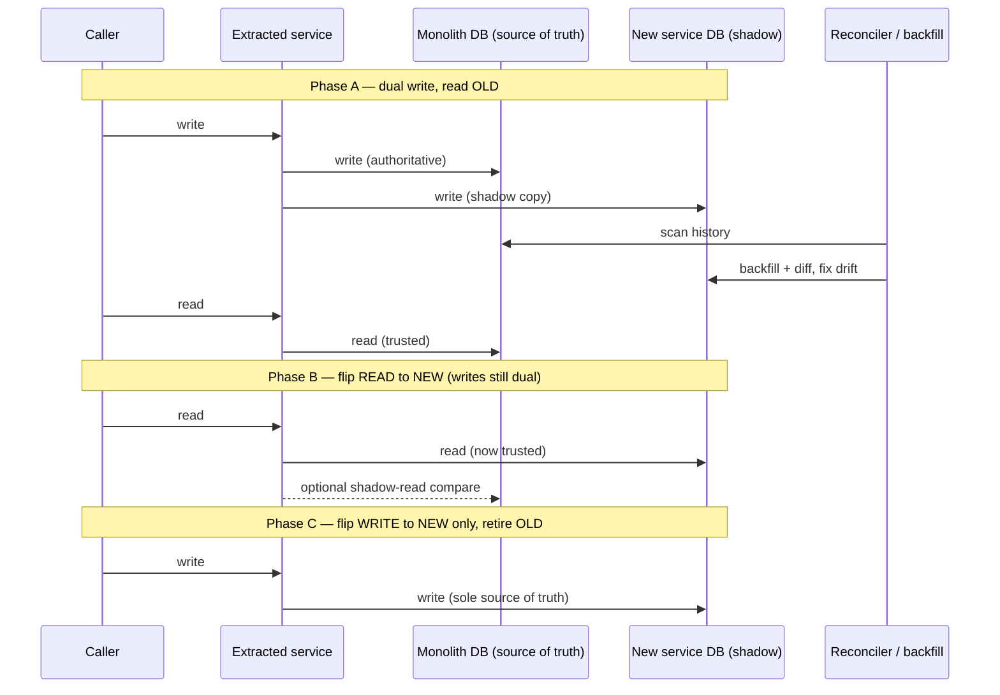
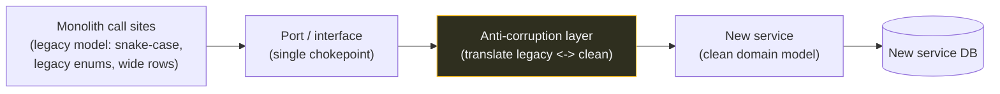
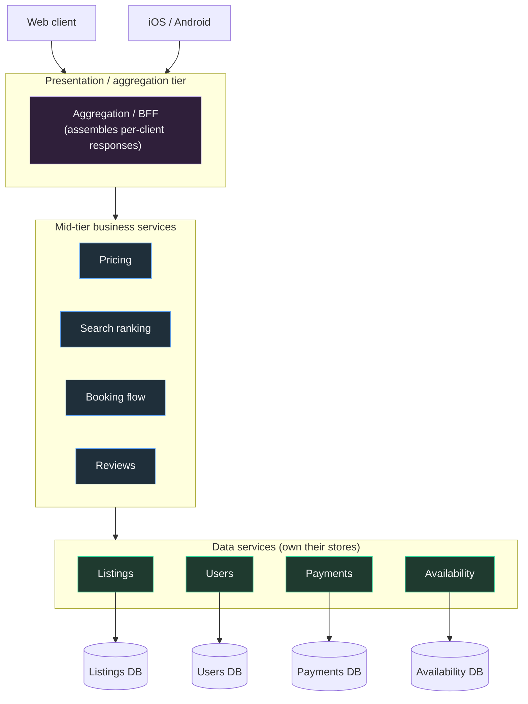
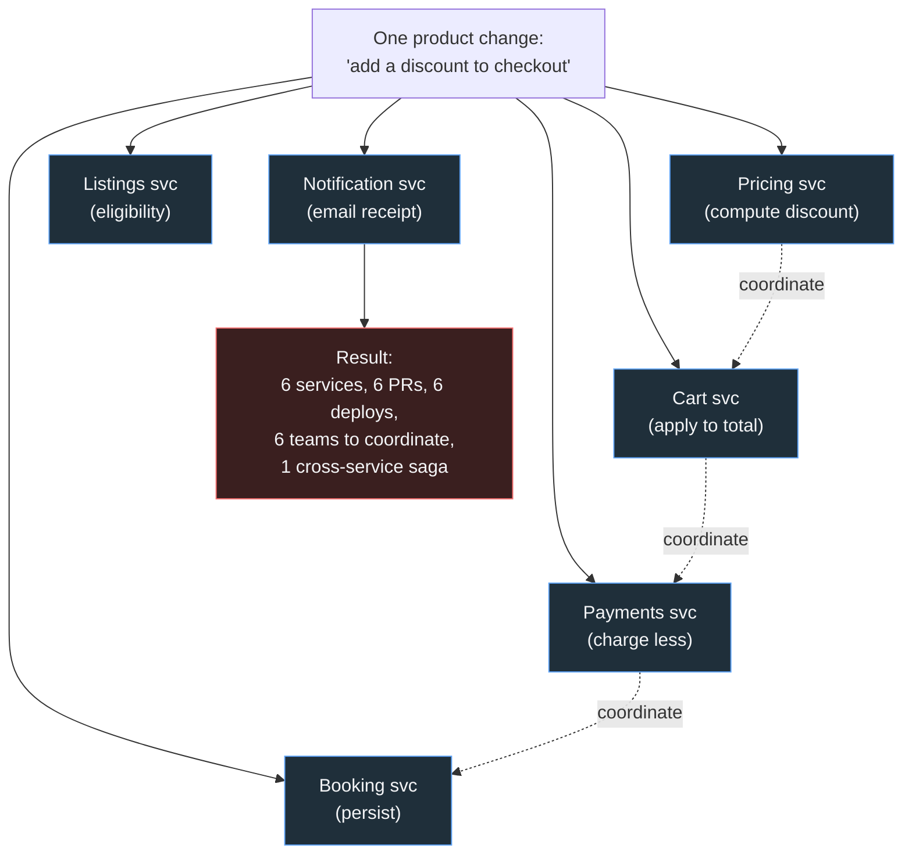
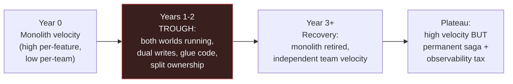
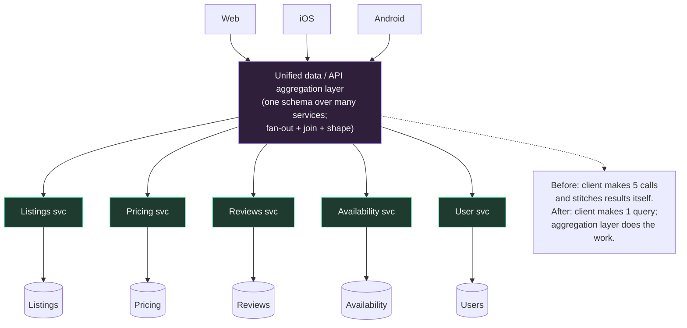

# Airbnb — Monolith to SOA Migration

Airbnb is the canonical worked example of the *full arc* of an architecture decision: a startup ships a Ruby on Rails monolith ("Monorail"), grows until that monolith chokes the org, migrates to a Service-Oriented Architecture (SOA) over several years using the **strangler fig** pattern — and then, crucially, publicly admits it went **too far**, having decomposed into so many services that simple product changes spanned a dozen of them. The honest reckoning is what makes this case study worth more than a triumphant "we did microservices" post. It teaches the two hardest lessons in architecture leadership at once: *how to migrate a large monolith safely without a big-bang rewrite*, and *how to recognise and reverse over-decomposition*. We will walk the migration mechanism in detail (routing, dual writes, read/write cutover), the SOA principles Airbnb standardised on, the specific pains that drove the correction, and the unified data-aggregation layer they built to tame the resulting service sprawl.

Three images carry this whole topic, so anchor them now and the rest follows. The **strangler fig** is a vine that takes root in the canopy of an old tree, sends roots down around the trunk, and slowly replaces the host branch by branch — all while the original tree keeps standing and growing leaves. That is *exactly* a safe migration: the new services grow around the monolith and replace it piece by piece while the monolith keeps serving live traffic the entire time. A **big-bang rewrite** is the opposite: it is demolishing a bridge while the commuters are still crossing it — you tear down the thing people depend on in the hope the replacement lands before anyone falls, and the few times that works are survivorship bias, not strategy. And **over-decomposition** — Airbnb's eventual mistake — is taking one recipe and chopping it into fifty micro-steps, each prepared in a different kitchen across town: every cook is "independent," but to plate a single dish you now coordinate fifty kitchens, and the dish is cold before it reaches the table. Hold those three pictures in your head and every decision below has an obvious right answer.

> [!NOTE]
> **Prerequisites.** The single most load-bearing concept here is cross-service consistency without a database transaction. Read [Distributed transactions: 2PC & saga](../C02-distributed-systems-and-system-design/T06-distributed-transactions-2pc-saga.md) first — once data is split across services, a single `BEGIN…COMMIT` is gone and *every* multi-service write becomes a saga. It also helps to have the architecture vocabulary from the [Software Architecture chapter](../C01-software-architecture/): monolith vs. microservices, the strangler fig and anti-corruption layer, and service decomposition.

## Context: The Monorail and Why It Had to Change

Airbnb began, like almost every successful startup, as a single Rails application — internally nicknamed **"Monorail."** That was the *right* early decision: one deployable, one database, one codebase, no network between any two pieces of logic, and a small team that could hold the whole thing in their heads. A monolith is the fastest way to find product-market fit, and it stays the right answer far longer than microservice enthusiasts admit (this is exactly the Shopify thesis — see [Shopify — The Modular Monolith](./T05-shopify-modular-monolith.md)).

The trouble is **organisational**, not technical, and it arrives with scale. Roughly across **2015–2018**, Airbnb's engineering org grew from dozens to many hundreds of engineers, all committing to one repository and deploying one artifact. At that size a monolith develops a predictable set of pathologies:



This is **Conway's Law** biting hard: a single shared artifact forces a single shared release process onto an org that has long since fragmented into many independent teams. The deploy train becomes a bottleneck — one team's failing test or bad migration blocks every other team's release. Ownership blurs because no module boundary is enforced by the language or the deployable; anyone can reach into anyone's tables. The decision to migrate to SOA was fundamentally a bet that *aligning service boundaries to team boundaries* would restore independent velocity. That bet was largely correct — and, as we'll see, slightly *over*-correct.

> [!TIP]
> The trigger for breaking up a monolith is almost never "the code is slow." It is "the **org** is slow" — merge conflicts, coupled deploys, and diffuse ownership. If your monolith's pain is CPU/latency, you have a performance problem, not an architecture problem, and microservices will make it *worse* by adding network hops. Diagnose which one you actually have before you decompose.

To make the org pain concrete, picture a single Tuesday on the Monorail at peak. Three teams merge to `main` within the same hour: the Payments team ships a fee change, the Search team tweaks a ranking model, and the Growth team adds a referral banner. They share one deploy train. The Payments change has a flaky migration that locks a table under load; the deploy fails and rolls back — and because it is *one* artifact, it drags Search's and Growth's perfectly-good changes back with it. Now three teams are blocked, the deploy queue backs up behind them, and an engineer who had nothing to do with payments is paged at 6pm to babysit a rollback. Nobody wrote bad code. The *architecture* serialized three independent teams onto one failure domain. That is the felt experience of "the org is slow," and it is what no amount of refactoring inside the monolith can fix — the only cure is to give those teams separate deployables.

> [!NOTE]
> **Scenario — "should we even migrate?"** A 25-engineer startup on a healthy Rails or Spring monolith asks whether they should "go microservices like Airbnb." The honest answer is usually **no, not yet** — and the reason is in the story above: they do not have the *org* problem. Three teams are not stepping on each other because there are barely three teams. Migrating now buys them sagas, dual writes, and a distributed-tracing bill in exchange for solving a coordination problem they do not have. The right move at that size is to *invest in modularity inside the monolith* (clear module boundaries, no cross-module table access) — the Shopify path — so that **if** the org problem ever arrives, the seams are already drawn and extraction is cheap. Migrate when the deploy train is visibly the bottleneck and team count has outgrown one shared release, not because a famous company did. Contrast deliberately with [Shopify — The Modular Monolith](./T05-shopify-modular-monolith.md): same root question, opposite answer, both correct *for their scale*.

## The Migration Approach: Strangler Fig, Not Big-Bang (the most valuable section)

The single most important decision Airbnb made was **not** to rewrite. A big-bang rewrite — "freeze the monolith, build the new system in parallel, flip the switch" — is the most reliably catastrophic move in software. It fails for structural reasons, not bad luck:

- **A multi-quarter (often multi-year) feature freeze** the business will never tolerate; the old system keeps changing underneath you, so you are rewriting a moving target.
- **No incremental value** — you ship nothing until the very end, so there is no feedback, no learning, and no way to course-correct.
- **All risk lands at once** at cutover, with no rollback short of "go back to the thing you spent two years trying to leave."

The alternative, named by **Martin Fowler** after the strangler fig vine that grows around a host tree and gradually replaces it, is to **incrementally build new services at the edges and route traffic to them**, slowly "strangling" the monolith until what remains is small enough to retire or freeze. (We cover the pattern in general in the architecture chapter — see [Strangler fig & migration patterns](../C01-software-architecture/T11-strangler-fig-and-migration-patterns.md).)

Stay with the botanical image for a moment, because it encodes the entire engineering discipline. The fig does not chop the tree down and plant a sapling in its place; it grows *alongside* the living tree, taking over one branch at a time, and at no single moment is the tree dead. If the fig's new branch fails, the host's original branch is still right there carrying the load. Translate that and you get the three rules that make the migration safe: (1) the old system stays *fully alive and authoritative* until each piece of the new system has earned its trust; (2) replacement happens *one branch at a time*, never the whole canopy at once; and (3) every step is *reversible* because the host branch is still there to fall back to. A team that internalizes "the tree must never die, even for a minute" will naturally build dual writes, route flips, and reconcilers — those mechanisms are just *how* you keep the host alive while the vine takes over.



The key property: a **routing/gateway layer sits in front** the whole time, so the *caller's* contract never changes — `/payments/charge` resolves to the monolith on Monday and to the new Payments service on Tuesday, transparently. Each peeled service is a small, reversible step: build it, mirror or shadow traffic, flip the route for a slice of requests, watch the metrics, and roll the route back instantly if something is wrong. The monolith shrinks one bounded context at a time, and the business keeps shipping the entire time.

#### A Cutover, Walked Step by Step

Abstract rules become muscle memory once you walk a single concrete extraction end to end. Suppose we are pulling the **Reviews** domain out of the Monorail. Here is the actual sequence a team runs, each step gated on the previous one's metrics, with the rollback always one config change away:

1. **Route through the gateway (no behavior change yet).** First, put *all* review traffic behind a gateway route `/reviews/**` that still points at the monolith. Nothing functionally changes — but now there is a single switch to throw. This step alone is shippable and reversible, and it proves the route exists before any risk is introduced.
2. **Stand up the new `reviews-service` and shadow/dual-write.** Build the new service against its own database. Begin **dual-writing**: every review create/edit goes to the monolith (authoritative) *and* the new service (shadow). In parallel, **shadow-read** — send a copy of read traffic to the new service and silently compare its responses to the monolith's, logging mismatches without ever serving them to users. The user sees only the monolith; you are quietly grading the understudy.
3. **Backfill and reconcile to zero drift.** Copy historical reviews into the new store, then run a continuous **reconciler** that diffs old vs. new and repairs drift. You do not advance until the mismatch rate from steps 2 and 3 sits at zero for a sustained window. This is the "earn trust" phase and it is supposed to be boring and long.
4. **Flip reads to the new service (writes still dual).** Move a *slice* of read traffic — 1%, then 10%, then 100% — to read from `reviews-service`. Writes still go to both stores, so if reads from the new service look wrong (latency, errors, content drift), you **flip reads back to the monolith instantly with zero data loss**, because the monolith never stopped being written to.
5. **Flip writes to the new service only.** Once reads have been served correctly from the new store long enough to trust it, make `reviews-service` the *sole* writer. This is the **irreversible** step — past here, the monolith's review tables stop receiving new data — so it is taken last and deliberately.
6. **Retire the old path.** Delete the dual-write code, drop the monolith's review tables (after a safety hold / final backup), and remove the now-dead code from the Monorail. The branch is fully strangled.



> [!IMPORTANT]
> Notice that every step from 1 to 4 has a *trivial, instant* rollback — flip a route, fall back to the monolith — because the monolith stays authoritative the whole way. The first genuinely irreversible action is step 5. This is the strangler fig's central promise made operational: you defer all the danger to the very last move, after the new system has already proven itself under real read load. A team that flips writes "to save time" before reads have been validated has thrown away the entire safety property and is back to demolishing the bridge mid-commute.

### The Hard Part Is the Data, Not the Code

Re-pointing a route is easy. The genuinely difficult, error-prone work is **moving the data** that the peeled-off logic owns, because at the moment you split a service out, its rows still live in the monolith's database — and you must move them to a new store **without downtime and without losing or corrupting writes**. The standard technique is the **dual write**: during the transition, every write goes to *both* the old store and the new store, while a backfill copies historical rows and a reconciler continuously checks the two are in agreement.



The ordering is deliberate and is the part teams most often get wrong. You **cut over reads before writes**:

1. **Dual-write, read old.** New store is a shadow; the old store is still the source of truth. Backfill history; run a reconciler to drive drift to zero. This phase can last weeks.
2. **Flip reads to the new store** while *still dual-writing*. Now you are validating the new store under real read load, but writes are still safely going to both — so if the new store is wrong, you flip reads back instantly with zero data loss.
3. **Flip writes to the new store only**, then decommission the old path. This is the irreversible step, and you only take it once reads have been served correctly from the new store for long enough to trust it.

> [!WARNING]
> The dual-write window is where consistency bugs breed. Two stores, two write paths, and any partial failure (write succeeds to old, fails to new) creates drift. This is *exactly* the dual-write problem that motivates the **transactional outbox**: instead of writing to two systems directly, write to one database plus an outbox row in the same local transaction, and let a relay propagate to the second store — making the dual write atomic on the source side. See the saga/outbox discussion in [Distributed transactions: 2PC & saga](../C02-distributed-systems-and-system-design/T06-distributed-transactions-2pc-saga.md). A standalone reconciler is mandatory regardless; never trust that two independent writes stayed in sync.

> [!WARNING]
> **War story — the silent dual-write corruption.** A representative way this goes wrong: a team extracting a `payments` ledger dual-writes "write to old DB, then write to new DB" as two sequential calls in application code. For weeks it looks fine. Then a deploy slows the new service just enough that, under a traffic spike, a slice of writes succeed to the old store and *time out* to the new one. No exception bubbles up loudly — the timeout is swallowed and retried into a different row — so the new store quietly accumulates **missing and duplicated** ledger entries. Because reads are still served from the old store, *nobody notices for a month*. When the team flips reads to the new store at 10%, customers start seeing wrong balances, and now there is corrupted financial data with no clean source of truth to reconcile against, because the drift is old. The lessons teams take away from this pattern are blunt: **(1)** never dual-write as two independent application calls — use the **outbox** so the second write can't silently diverge from the first; **(2)** run the **reconciler continuously from day one** and *alert* on non-zero drift, not just log it, so corruption surfaces in hours, not at cutover; and **(3)** during the cutover window, treat any non-zero, non-decreasing drift as a **stop-the-line** event — pause the migration, reconcile to zero, and only then proceed. The reconciliation *during* cutover is the unglamorous work that separates a migration that finishes from one that has to be rolled back and re-planned.

### Finding the Seam and the Anti-Corruption Layer

Before you can peel a service off, you have to find a clean **seam** — a boundary where the monolith's coupling is thin enough to cut. In a long-lived Rails monolith, that coupling lives in shared models, shared tables, and direct method calls; there is no network boundary advertising where one domain ends and the next begins. The practical technique is to *introduce* the boundary inside the monolith first: route all access to the target domain through a single interface (a "port"), so that the dozens of scattered call sites become one chokepoint. Once everything goes through that interface, you can swap its implementation from "call the local model" to "call the new remote service" in one place.

The risk during this swap is that the new, clean service inherits the monolith's messy data model — its awkward column names, its legacy enums, its denormalised quirks — because the callers still speak the old language. The defence is an **anti-corruption layer (ACL)**: a translation shell that converts between the monolith's legacy model and the new service's clean domain model, so the new service is not "corrupted" by the old representation and the old callers do not have to change all at once.



The ACL is temporary scaffolding by design: it lets the new service ship with a clean model *today* while legacy callers migrate to the new contract *over time*, and you delete the ACL once the last legacy caller is gone. We cover the pattern in general in [Anti-corruption layer](../C01-software-architecture/T13-anti-corruption-layer.md). The discipline — *establish the seam inside the monolith, translate at the boundary, then move the implementation across the wire* — is what turns a terrifying extraction into a series of small, boring, reversible commits.

## SOA Principles Airbnb Adopted

Airbnb's migration was not "chop the monolith into arbitrary pieces." It was a deliberate move to a set of SOA principles, the most important of which is **services own their data**.

- **Each service owns its data; no cross-service database access.** A service exposes an API; *no other service is allowed to reach into its tables*. This is the rule that makes independence real — if Team A can `JOIN` against Team B's table, you have a distributed monolith with all the cost of services and none of the decoupling. Every cross-boundary read goes through an API call.
- **Clear team ownership.** Each service has exactly one owning team responsible for its API, data, on-call, and SLA. Boundaries follow domains and, per Conway, follow teams.
- **A standardised service framework / templates.** With *hundreds* of services, consistency is survival. Airbnb invested in a service framework: scaffolding so a new service comes with build, deploy, configuration, logging, metrics, tracing, and standard API conventions **baked in**. You do not hand-roll observability per service; the platform provides it.
- **A tiered architecture.** Services are layered: thin **data services** wrap storage; **mid-tier business/derived services** compose data services and hold domain logic; **presentation/aggregation services** assemble data for specific clients (web, iOS, Android). Higher tiers call lower tiers, not vice-versa, which keeps dependencies acyclic.



The tiering matters because it is the structure that the *later* aggregation layer plugs into. A clean tier model means there is an obvious place to put a unified API: in front of the presentation tier.

## The Pain of SOA and Over-Decomposition

Here is the honest part. SOA solved the org-velocity problem and created a new class of problems, and Airbnb decomposed finely enough that those problems became acute. The recurring theme: **the boundaries you drew to gain team independence become walls that every product change must now climb over.**



The specific costs:

- **A single product change spans many services.** What used to be one pull request to the monolith becomes coordinated changes across six teams, each with its own review, deploy cadence, and on-call. Velocity *per service* went up; velocity *per cross-cutting feature* often went **down**.
- **Cross-service consistency now requires sagas.** Inside the monolith, "reserve availability, charge the card, write the booking" was one ACID transaction. Split across services, there is no shared transaction — you must orchestrate a **saga** with explicit compensating actions for every step that can fail after a prior step committed. This is strictly harder, must be designed per workflow, and is a permanent tax (the whole reason this topic's prerequisite is the saga chapter).
- **Testing, debugging, and observability get harder.** An end-to-end test now spins up many services. A bug means tracing a request across service hops; you *cannot* survive without distributed tracing, which is precisely why the service-framework standardisation was non-negotiable.
- **A real productivity dip during migration.** For a long stretch, engineers paid the cost of *both* worlds — the old monolith still existed *and* the new services existed, with glue, dual writes, and split ownership. Migrations are not free and not fast. The velocity curve over a multi-year migration is a **J-curve**: it gets *worse before it gets better*, and leadership must hold the line through the trough.



- **"Nanoservices" become chatty and tightly coupled.** This is the over-decomposition failure mode. Split too fine and services that always change together, or that need each other's data on every request, end up making chains of synchronous calls. You have re-created the monolith's coupling *plus* added network latency, partial-failure modes, and serialization cost — the worst of both worlds. Fine-grained does not mean decoupled; it often means *distributed coupling*.

The kitchen analogy makes the failure visceral. Splitting a cohesive domain into nanoservices is taking one recipe and assigning each step — "dice the onion," "heat the pan," "add salt" — to a different kitchen across town. Each kitchen is gloriously "independent" and "single-responsibility." But the onion has to be couriered from kitchen A to kitchen B before B can start; B's output rides across town to C; and if any one kitchen is down, the whole dish stalls mid-step. Worse, the moment you want to change the recipe — say, salt *before* searing instead of after — you cannot just edit one card; you must coordinate a synchronized change across all the kitchens at once, because the sequence is split across them. That is precisely what "a single product change spans many services" feels like, and it is why the cure for over-decomposition is to put the steps that always cook together *back in the same kitchen*.

> [!WARNING]
> **War story — the coordinated-deploy tax.** A team that over-split a checkout flow into `cart`, `pricing`, `discount`, `tax`, `payment-intent`, and `order` services hits this wall on a routine product ask: "show the discounted price *with tax* on the cart page." That one change has to be implemented in `discount`, threaded through `pricing`, recomputed in `tax`, surfaced by `cart`, and validated in `order`. Because the services share an implicit contract about the *shape* of a price object, the changes are not independent — deploy `pricing` before `tax` is ready and carts show wrong totals; deploy `tax` first and it reads a field `pricing` hasn't sent yet. So the teams end up scheduling a **synchronized, ordered, six-service release** with a shared rollback plan — a "deploy train" they thought they had escaped by leaving the monolith, now re-created *across the network* and far harder to coordinate than a single merge ever was. When you find yourself writing a cross-team deploy runbook for a one-line feature, that is the unmistakable signal you have over-decomposed: the services are not actually independent, they are a distributed monolith wearing six pipelines.

> [!IMPORTANT]
> **The honest reckoning.** Airbnb's most valuable contribution to the field is not the migration — plenty of companies did that — it is *publicly admitting they went too far and consolidating back*. That admission is hard precisely because reversing a decomposition looks, to a skeptic, like conceding microservices "failed." They did not fail; the **granularity** was wrong. Treating "we over-decomposed and had to merge services back into macroservices" as a sign of **engineering maturity** rather than embarrassment is the cultural lesson. A leader who cannot say "we cut too fine, let's consolidate" will keep paying the nanoservice tax forever to protect a sunk-cost narrative. The willingness to walk a boundary *back* is as important a skill as drawing it in the first place.

> [!INTERVIEW]
> **"A team proposes splitting a 5-method service into 5 single-method services 'for separation of concerns.' What do you say?"** Push back. Service boundaries should follow **bounded contexts and data ownership**, not method counts. If those five methods share data, change together, and call each other, splitting them creates *nanoservices*: chatty synchronous chains, distributed transactions where a local one sufficed, and 5 deploy pipelines for what is one cohesive unit. The right granularity is the *coarsest* boundary that still gives teams independent ownership of a cohesive domain. Cite Airbnb explicitly: they decomposed too far and had to *consolidate* toward coarser "macroservices." Separation of concerns is a *module* boundary, achievable inside one service; it does not require a network boundary, and the network boundary is expensive.

## The Correction: Macroservices and a Unified Data Layer

Around **2020 and after**, Airbnb engineering publicly reflected that the pendulum had swung too far and began **consolidating**. Two distinct moves came out of that reckoning.

**1. Right-size toward "macroservices."** Where a cluster of too-fine services always changed and deployed together, the answer was to merge them back into a coarser-grained service that owns a whole cohesive domain — a **macroservice**. This is not a retreat to the monolith; it is finding the *correct* granularity between "one giant app" and "a nanoservice per method." The target is: as few services as give teams genuine independent ownership, and no fewer.

How do you right-size *before* you over-shoot? The practical heuristics that fall out of Airbnb's experience are these. **Draw boundaries around bounded contexts and data ownership, not actions.** A service should own a whole cohesive domain (`Booking`, `Payments`, `Listings`) — all the operations on a coherent chunk of data — not a single verb. **Use the "deploy together / change together" test:** if two candidate services would almost always be modified in the same pull request and released in lockstep, they are one service wearing two names; keep them together. **Use the "data-sharing" test:** if service B needs to reach into service A's data on nearly every request, the boundary is in the wrong place — you have cut through the middle of one context. **Prefer the coarsest boundary that still gives a team independent ownership.** Separation of concerns inside a service is free (it is just modules and packages); a network boundary is expensive (latency, partial failure, a saga, a deploy pipeline, on-call). Only pay for the network boundary when you are buying *team independence* with it, not mere code tidiness.

> [!TIP]
> **Signs you have over-decomposed** — a field checklist to run on an existing service map. (1) A typical product feature touches **three or more** services and needs a coordinated, ordered deploy. (2) Two or more services are **almost always changed in the same PR** or release. (3) One service calls another **synchronously on nearly every request** just to get data it can't function without — a chatty chain, not an occasional cross-call. (4) You have **more services than teams**, so engineers context-switch across several services to ship one thing and no service has a clear single owner. (5) **End-to-end tests require spinning up a large subgraph** of services to exercise one user flow. (6) A "simple" change routinely requires a **cross-team deploy runbook**. If several of these are true, you are not enjoying microservice independence; you are paying microservice costs for monolith coupling — *consolidate*.

**2. Build a unified data / API aggregation layer.** Even with right-sized services, clients still faced the orchestration tax: to render one screen, a mobile app might have to call many services and stitch the results itself. Airbnb's answer was a **unified data-aggregation layer** — a single API (graph/schema-stitched, GraphQL-style) that sits in front of the many backing services. Clients issue **one** query describing the data they want; the aggregation layer fans out to the underlying services, joins the results, and returns a single shaped response. (Airbnb has described this kind of unified data layer publicly; their internal framework for it is known as **Viaduct**. If you are unsure of the exact product name in an interview, describe it functionally as a *unified data-aggregation / schema-stitching layer* — that is the transferable idea.)



The aggregation layer restores, at the *edge*, the convenience the monolith had — "ask for everything you need in one place" — without re-coupling the services behind it. It also centralises cross-cutting concerns (auth, field-level access, caching, batching to avoid N+1 fan-out) in one tier. This is the same architectural role a **Backend-for-Frontend (BFF)** or a GraphQL gateway plays, and it is the standard endgame for organisations that decomposed and then needed to re-simplify the client experience.

## Lessons: How to Migrate a Monolith (and When to Stop)

These are the transferable, lead-level takeaways — the reason this case study exists:

- **Migrate with the strangler fig: incremental, reversible, never big-bang.** Build new services at the edges behind a stable routing layer, cut traffic over in slices, and keep the ability to roll back at every step. The monolith shrinks; the business never freezes.
- **The data migration is the hard part — sequence it.** Dual-write during transition, **cut reads over before writes**, reconcile continuously, and make the dual write atomic at the source (outbox) so you don't breed drift. Re-routing code is trivial; moving stateful data safely is the actual project.
- **Right-size services; avoid nanoservices.** Granularity follows bounded contexts and data ownership, not method counts or fashion. Be explicitly willing to *consolidate* back into macroservices — Airbnb did, and that is a sign of maturity, not failure.
- **Standardise the platform so sprawl stays consistent.** A service framework with build/deploy/observability baked in is what lets hundreds of services remain operable. Without it, every service is a unique snowflake and the org drowns in toil.
- **Migrations are multi-year and have a real, sustained cost.** There is a productivity *dip*, you run both worlds at once for a long time, and you pay a permanent saga/observability tax afterward. Budget for it honestly; do not sell it as a quick win.
- **Have an explicit target architecture — including the simplification step.** Decompose *toward a defined endgame* (right-sized services + an aggregation layer), not "as many services as possible." Knowing where you intend to stop is what prevents over-decomposition in the first place.

### Contrast: Shopify and Uber Took Different Roads

Airbnb's arc is most instructive when set against the alternatives:

- **Shopify avoided the journey entirely** by staying a **modular monolith** — enforcing module boundaries *inside* one deployable (Packwerk) rather than splitting into services, so they got ownership clarity without the network, the sagas, or the dual-write migrations. If you can keep one deployable, you skip nearly everything in this topic. See [Shopify — The Modular Monolith](./T05-shopify-modular-monolith.md).
- **Uber answered the *sprawl* differently** with **DOMA** (Domain-Oriented Microservice Architecture): rather than consolidating back to coarser services, Uber grouped its many microservices into **domains** with gateways and layered dependencies, taming the chaos by organising services rather than merging them. See [Uber — Domain-Oriented Microservices & Geo-Sharding](./T04-uber-domain-oriented-microservices-geo-sharding.md).

All three are valid answers to the same root question — *how do you keep a large org moving fast?* — and the right one depends on your scale, team count, and tolerance for operational complexity. There is no universal answer, only a trade-off you must make consciously.

## Java/Spring Relevance

Everything above maps cleanly onto a Spring backend, which is why it belongs in this book and not just a war-stories anthology:

- **Strangler fig with an API gateway.** Spring Cloud Gateway (or any reverse proxy) is your routing layer. A predicate-based route sends `/payments/**` to the legacy monolith today and to a new `payments-service` tomorrow, with weighted routing to shift a slice of traffic and instant rollback by reverting the route — the strangler mechanism in literal configuration.
- **Sagas and the outbox for cross-service consistency.** Once data is split, a `@Transactional` method no longer spans services. You implement the saga explicitly (orchestration or choreography) and pair every external publish with a **transactional outbox**: write the business row and an outbox row in the *same* JPA transaction, and a relay (Debezium/CDC or a polling publisher) emits the event — making the dual write atomic on the source. This is the concrete remedy for the dual-write hazard above; the mechanics are in [Distributed transactions: 2PC & saga](../C02-distributed-systems-and-system-design/T06-distributed-transactions-2pc-saga.md).
- **Spring Boot starters *are* the service framework.** A shared internal "starter" parent (custom Boot starters bundling logging, Micrometer metrics, tracing, security defaults, health checks, and API conventions) is exactly Airbnb's service-framework idea: a new service inherits observability and deploy wiring instead of hand-rolling it. This is how you keep dozens of Spring services consistent.
- **A GraphQL / BFF aggregation layer.** Spring for GraphQL (or a dedicated BFF service) is the unified data layer: one schema in front of many downstream Spring services, batching downstream calls (DataLoader-style) to avoid N+1 fan-out, so clients issue one query instead of orchestrating five REST calls.

```java
// Strangler-fig routing as Spring Cloud Gateway config (conceptual)
@Bean
RouteLocator routes(RouteLocatorBuilder rlb) {
    return rlb.routes()
        // New extracted service takes payments traffic...
        .route("payments-new", r -> r.path("/payments/**")
            .filters(f -> f.addRequestHeader("X-Migrated", "true"))
            .uri("lb://payments-service"))
        // ...everything still in the monolith falls through here.
        .route("monolith", r -> r.path("/**")
            .uri("lb://monorail"))
        .build();
    // Flip a single route to advance the strangler; revert to roll back.
}
```

To shift only a *slice* of traffic — the "1% then 10% then 100%" read flip from the walked cutover above — you add a **weighted** route group so the gateway sends, say, 10% of `/reviews/**` to the new service and 90% to the monolith. Bumping the weights advances the strangler; resetting them to `0` for the new service is your instant rollback, all in configuration, no redeploy:

```java
// Weighted (canary) routing: send 10% of reviews traffic to the new service.
@Bean
RouteLocator weightedReviews(RouteLocatorBuilder rlb) {
    return rlb.routes()
        .route("reviews-new", r -> r.path("/reviews/**")
            .and().weight("reviews", 10)          // 10% to the new service
            .uri("lb://reviews-service"))
        .route("reviews-monolith", r -> r.path("/reviews/**")
            .and().weight("reviews", 90)          // 90% still on the monolith
            .uri("lb://monorail"))
        .build();
    // Raise to (50,50) then (100,0) to advance; reset new->0 to roll back instantly.
}
```

And here is the **outbox** that kills the silent dual-write corruption from the war story. Instead of writing to two systems in two independent calls, the service writes the business row **and** an outbox row in *one* local JPA transaction — so they commit or roll back together — and a separate relay (a polling publisher, or Debezium reading the DB's change log) ships the outbox row onward. The second write can no longer succeed-or-fail independently of the first, which is exactly the property a naive dual-write lacks:

```java
// Outbox: the business write and the "to be propagated" record commit atomically.
@Transactional                              // one local transaction = atomic on the source
public Review submitReview(NewReview cmd) {
    Review saved = reviewRepo.save(Review.from(cmd));      // 1. business row
    outboxRepo.save(new OutboxEvent(                       // 2. intent to propagate
        "ReviewCreated", saved.getId(), toJson(saved)));   //    SAME transaction
    return saved;
    // No direct call to the new store / Kafka here — both rows commit together
    // or not at all. A relay (polling or Debezium/CDC) reads outbox and publishes.
}
```

> [!NOTE]
> The outbox makes the *source-side* write atomic, but it does **not** make the cross-service business operation a single ACID transaction — nothing can, once data is split. A multi-step flow like "reserve availability → charge card → write booking" is still a **saga**: each step has an explicit **compensating action** (release the hold, refund the charge) that undoes it if a *later* step fails, because there is no global rollback. The outbox is how each step reliably *emits its event*; the saga is how the steps *coordinate and compensate* across services. You almost always need both, and the mechanics live in [Distributed transactions: 2PC & saga](../C02-distributed-systems-and-system-design/T06-distributed-transactions-2pc-saga.md).

## Practice

1. **Sequence a cutover.** You are extracting `reviews` from a monolith into a new service with its own database. List the phases in order (dual-write, backfill, reconcile, read flip, write flip, decommission) and, for each, state exactly how you would *roll back* if metrics go bad. Why must the read flip precede the write flip?
2. **Kill the dual-write hazard.** During dual writes, a request writes successfully to the new store but the write to the old store fails. Describe the resulting drift, then redesign the write path using a transactional outbox so the two writes can no longer diverge. What does the reconciler still do that the outbox does not?
3. **Right-size a split.** A team wants to break a cohesive `Booking` service into `BookingCreate`, `BookingCancel`, `BookingModify`, and `BookingRead` services. They share one table and call each other constantly. Argue for or against, citing the nanoservice failure mode, and propose where the *real* boundary should be.
4. **Saga the discount.** Take the "add a discount to checkout" change from the ripple diagram. It touches pricing, cart, payments, and booking. Write the saga as a sequence of steps with a compensating action for each, and name the step after which failure is hardest to compensate and why.
5. **Design the aggregation layer.** A mobile home screen needs listing details, price, the latest 3 reviews, and availability — today that is 4 REST calls the app stitches itself. Sketch a GraphQL/BFF schema that returns it in one query, and explain how you would batch the downstream calls to avoid an N+1 fan-out when rendering 20 listings.
6. **Should they migrate at all?** A 30-engineer company on a healthy Spring Boot monolith asks you whether to "do microservices like Airbnb." Walk through the diagnostic: what evidence would make the answer *yes*, what evidence makes it *no*, and what is the lower-cost intermediate move (hint: the Shopify path) that keeps the option open. State the one question whose answer settles it.
7. **Audit for over-decomposition.** You inherit a service map with 40 services and 12 teams. Using the "signs you have over-decomposed" checklist, list the *specific metrics or artifacts* you would gather (e.g., average services-touched-per-PR, count of synchronized cross-service releases last quarter) to decide *which* clusters to consolidate into macroservices, and how you would sequence those merges to be reversible.
8. **Canary the cutover in config.** Using the weighted Spring Cloud Gateway route, write the config progression that takes the extracted `reviews-service` from receiving 0% of reads to 100%, naming the metric you watch at each weight and the exact change you make to roll back. Why is this read-traffic canary safe to do *before* the write flip but not after?

## Recap

- Airbnb started as the **Monorail** (a Ruby on Rails monolith) and migrated to **SOA** across roughly **2015–2018** because the *org* — not the code — had outgrown one shared deployable: merge conflicts, coupled/risky deploys, and diffuse ownership.
- The migration used the **strangler fig** pattern: incrementally build edge services behind a stable routing layer, cut traffic over in reversible slices, and shrink the monolith — **never a big-bang rewrite**, which fails via long freezes, no incremental value, and all-at-once risk.
- The hard part is **data**: **dual-write** during transition, **cut reads over before writes**, reconcile continuously, and make the source-side dual write atomic with a **transactional outbox**.
- SOA principles adopted: **services own their data** (no cross-service DB access), **clear team ownership**, a standardised **service framework**, and a **tiered architecture** (data → business → presentation).
- The cost: a single product change now **spans many services**, cross-service consistency needs **sagas** instead of one transaction, testing/debugging/observability get harder, there is a **productivity dip**, and over-fine **nanoservices** become chatty and re-coupled.
- The correction (**~2020+**): consolidate toward coarser **macroservices** and build a **unified data-aggregation layer** (a GraphQL-style single API, internally "Viaduct") so clients make **one** query instead of orchestrating many.
- Contrast: **Shopify** avoided the journey via a modular monolith ([T05](./T05-shopify-modular-monolith.md)); **Uber** tamed sprawl via **DOMA** ([T04](./T04-uber-domain-oriented-microservices-geo-sharding.md)) — three valid, scale-dependent answers to the same org-velocity question.
- Three images anchor the whole topic: the **strangler fig** (a vine that replaces an old tree branch by branch while the tree keeps standing) is the safe migration; the **big-bang rewrite** (demolishing a bridge while commuters cross it) is the unsafe one; and **over-decomposition / nanoservices** (one recipe chopped into fifty micro-steps in fifty kitchens across town) is the failure you correct toward macroservices.
- **Migrate only when you have the *org* problem.** A small team on a healthy monolith should usually *not* decompose; invest in modularity inside the monolith (the Shopify path) so the seams exist if the deploy-train bottleneck ever actually arrives.
- The **cutover is a fixed sequence** — route via gateway → dual-write + shadow-read → backfill + reconcile to zero → flip reads in canary slices → flip writes (the one irreversible step) → retire the old path — and everything before the write flip rolls back instantly because the monolith stays authoritative.
- **Inconsistent dual-writes silently corrupt data**: a partial failure (old store ok, new store times out) breeds drift that hides until the read flip exposes it. The remedies are the **outbox** (atomic source-side write), a **continuously-running, *alerting* reconciler** from day one, and treating non-zero drift during cutover as **stop-the-line**.
- **Right-size by bounded context and the "change-together / data-sharing" tests**, prefer the *coarsest* boundary that buys real team independence, and treat consolidating back into **macroservices** as engineering maturity, not failure — use the "signs you have over-decomposed" checklist (features touch 3+ services, services change together, chatty synchronous chains, more services than teams) to decide what to merge.

## Next

Continue to [Meta — Data Infrastructure at Scale](./T07-meta-data-infrastructure-tao-memcache.md), where the scaling challenge shifts from *organising services* to *serving a read-dominated social graph* with memcache leases, the TAO graph store, and regional cache replication.
