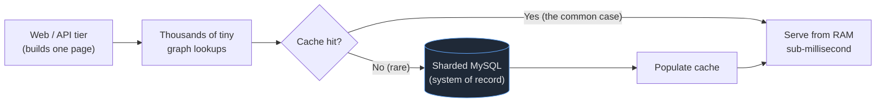
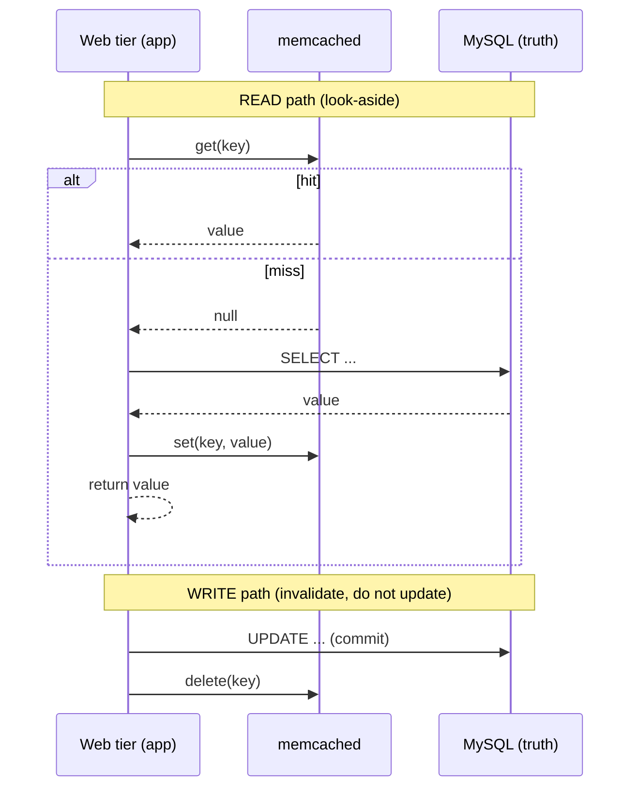
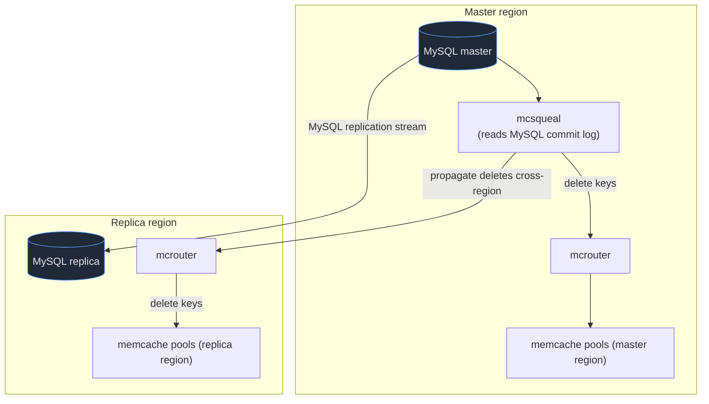
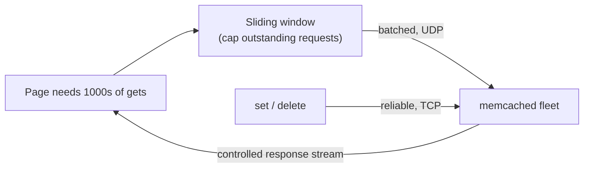
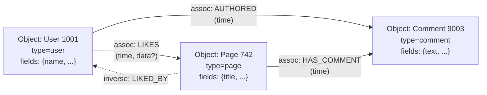
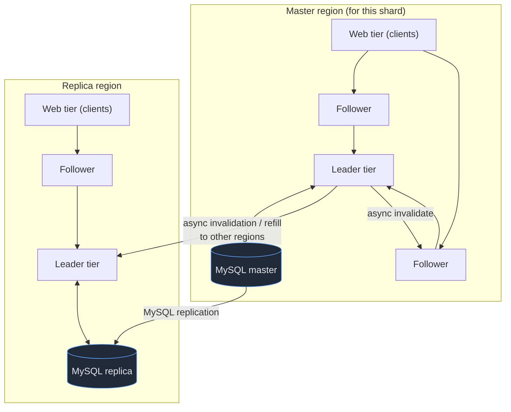
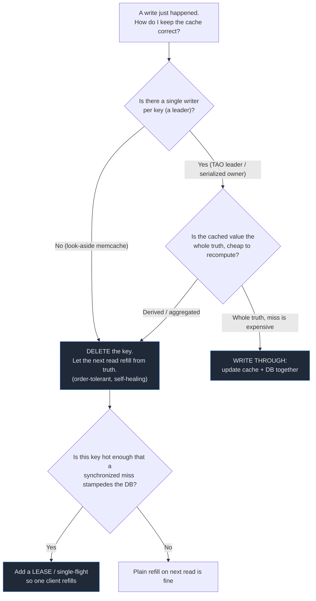
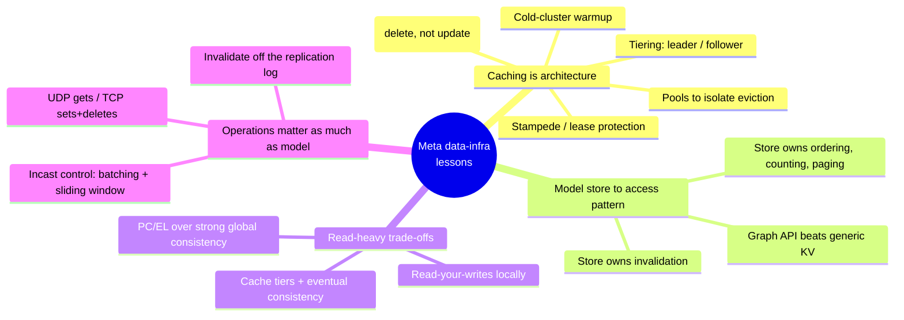

# Meta — Data Infrastructure at Scale: Memcache & TAO

Facebook (now Meta) runs one of the most **read-dominated** workloads on the internet. Loading a single profile or News Feed touches a sprawling web of friendships, likes, comments, and page memberships — the **social graph** — and almost every one of those touches is a *read*. Reads vastly outnumber writes, the corpus spans billions of users, and the latency budget for assembling one page is brutal. The durable database of record is **sharded MySQL**, but MySQL alone cannot serve that read load at the required latency, so Meta built two landmark caching systems on top of it. This case study covers both, mechanism-deep: first **scaled memcache** — a fleet of `memcached` instances used as a **look-aside cache** over MySQL, documented in *"Scaling Memcache at Facebook"* (NSDI 2013) — and then **TAO**, a purpose-built **write-through cache** that models the graph directly as objects and associations, documented in *"TAO: Facebook's Distributed Data Store for the Social Graph"* (USENIX ATC 2013). The transferable lesson is the spine of the topic: **caching is first-class architecture**, and **the data store should be modeled to the access pattern**, not the other way around.

> [!NOTE]
> **Prerequisites.** This topic builds directly on cache patterns and stampede protection from [Caching strategies at scale](../C02-distributed-systems-and-system-design/T11-caching-strategies-at-scale.md). The consistency trade-offs lean on [CAP theorem & PACELC](../C02-distributed-systems-and-system-design/T01-cap-theorem-and-pacelc.md) and [Consistency models: strong & eventual](../C02-distributed-systems-and-system-design/T02-consistency-models-strong-eventual.md). Read those first if "look-aside," "PC/EL," or "read-your-writes" are not already crisp.

### A Map of the Whole Story in Plain Language

Before the mechanisms, here is the entire chapter as one office-building analogy you can carry through every section. Imagine a colossal company library where billions of readers constantly look things up and only occasionally file new documents.

- A **look-aside cache** is **checking your own desk drawer before walking to the file room.** If the page you need is already in your drawer (cache hit), you read it instantly. If it is not (cache miss), you walk to the central file room (MySQL), photocopy the page, drop the copy in your drawer for next time, and read it. You — the office worker, i.e. the application — are the one doing the walking and copying; the drawer does not fetch anything for you. That "you do the orchestration" detail is exactly what *look-aside* means.
- A **lease** is **a "now serving" ticket at the coffee station.** When the communal coffee pot runs dry, you do not want twenty people all marching to the kitchen to brew a fresh pot at once. So the first person to notice grabs the single "I'm refilling it" ticket; everyone else sees the ticket is taken and waits by the pot. Exactly one trip to the kitchen happens, and when that person comes back the pot is full for everyone.
- **TAO's objects and associations** are **a giant shared address book of who-knows-whom and who-likes-what.** Every person, page, photo, and comment is an entry (an object); every "is friends with," "likes," "wrote," "commented on" line connecting two entries is an association. Almost everything Facebook shows you is answered by either "read this entry's details" or "list the most recent lines coming out of this entry."
- **Leader and follower cache tiers** are **one head librarian who alone is allowed into the archive, and many branch librarians who serve the public from copies.** Readers never bother the head librarian directly; they ask a nearby branch librarian, who keeps a working copy and only escalates to the head librarian on a true miss. Only the head librarian walks into the archive (MySQL), which keeps the archive calm no matter how many readers show up.

Keep these four pictures in your pocket. Each later section is just one of them made precise.

## The Workload: Why a Cache Is the Architecture, Not an Add-On

Fix the shape of the problem before the solution. Rendering a Facebook page is not one query; it is **thousands** of small graph lookups — "who are U's friends," "which of them liked this post," "what is the name and photo of each," "how many comments does this have." Each lookup is tiny, but there are an enormous number of them, they are overwhelmingly **reads**, and they must all complete inside a tight page budget. Three properties dominate every decision that follows.



1. **Reads vastly outnumber writes.** The graph is written rarely (you add a friend occasionally) and read constantly (every page view re-reads it). This asymmetry is what makes caching pay: a cache that absorbs reads removes load from a database that would otherwise need to be impossibly large.
2. **Fan-out is extreme.** One page issues thousands of dependent lookups, often in parallel. The cache must serve *aggregate* request rates that no single database tier could.
3. **Latency is judged at the tail.** A page is only as fast as its slowest lookup. One cache miss that falls through to a slow disk read, or one hot key that stampedes the database, makes the whole page feel broken.

Hold that read-heavy, high-fan-out, tail-sensitive shape in mind. Everything below — leases, pools, regional invalidation, TAO's graph API — is a direct response to it.

> [!WARNING]
> **The danger here is a read storm, not a write storm.** Engineers coming from transactional systems instinctively brace for *write* contention — lock conflicts, hot rows, write amplification. On a read-dominated social graph the failure that actually pages you at 2 a.m. is a **cache-miss storm**: a single popular key (a celebrity's friend list, a viral post's comment count) loses its cached copy and millions of reads that were quietly served from RAM all fall through to MySQL in the same second. The database did not get more *writes*; it got the same *read* suddenly multiplied by the fan-out it was supposed to be shielded from. Internalize this inversion early — almost every mechanism in Part 1 (leases, pools, cold-cluster warmup) exists to keep a *read* miss from becoming a *database* event.

> [!TIP]
> **A relatable yardstick for "read-dominated."** Think of a popular recipe blog. The author publishes a recipe *once* (a write) and then it is viewed *hundreds of thousands of times* (reads) — by people who found it on search, shared it in a group chat, or printed it for the kitchen. If every one of those views hit the author's little database directly, the blog would fall over the moment it went viral; the entire job of the cache is to let one stored copy answer a flood of identical questions. Now multiply that by every name, photo, like, and comment on every page Facebook renders, and you have the shape of the workload.

## Part 1 — Memcache as a Look-Aside Cache Over MySQL

The first system is conceptually simple and operationally deep: a huge fleet of `memcached` servers (plain in-memory key→value stores) sitting **beside** sharded MySQL. The application — not the cache, not the database — orchestrates the two. This is the **look-aside** (cache-aside) pattern.

The mental model from the opening map is worth repeating because it carries the entire pattern: look-aside is **checking your desk drawer before walking to the file room.** The drawer (memcache) is fast but forgetful; the file room (MySQL) is the slow, authoritative source. Crucially, the *worker* — your application code — is the one who checks the drawer, walks to the file room when the drawer is empty, photocopies the page, and tucks the copy back in the drawer. The drawer is passive. It never fetches on your behalf and never knows whether what it holds is still current. This is the defining contrast with the **read-through / write-through** caches we will meet in Part 2 (TAO), where the cache itself does the walking. In look-aside, *you* own the three-step dance of check-drawer, fetch-from-room, refill-drawer — which is both its simplicity (the cache is a dumb box) and its hazard (every correctness rule below is something *your code* must get right, because the box will not).

### The Look-Aside Read and Write/Invalidate Paths

On a **read**, the app asks memcache first. On a hit, it returns immediately. On a **miss**, it reads from MySQL, populates memcache with the result, and returns it. On a **write**, the app writes to MySQL (the source of truth) and then **deletes** the key from memcache — it does not update it.



Why **delete** on write rather than **update** the cached value? Three reasons, all about robustness:

- **Deletes are idempotent and order-tolerant.** A `delete` of a key always leaves the cache in a correct state — "absent" — regardless of how many times or in what order it arrives. An `update` carries a *value*, and two concurrent updates can land out of order, leaving the newer value overwritten by an older one. With deletes there is no value to race.
- **A miss self-heals from the source of truth.** After a delete, the next read recomputes from MySQL, which is authoritative. The cache can only ever be *stale by being empty*, never *stale by holding a wrong value*.
- **Updates couple the cache to the write's exact shape.** Cached entries are often derived or aggregated; pushing the right *new* value into every affected cache entry is hard and brittle. Deleting the key sidesteps all of it — recomputation is the cache's job, not the writer's.

> [!IMPORTANT]
> "Delete, don't update" is the single most transferable rule here. The cache holds *derived* state; the database holds *truth*. On a write you invalidate the derived state and let it be lazily rebuilt from truth. Trying to keep the cache *updated* in lock-step with the database re-creates the very consistency problem the cache was supposed to let you avoid.

> [!WARNING]
> **War story: the update-instead-of-delete that quietly served wrong prices.** A team caches product prices in Redis and, "to avoid a cache miss," decides that on every price change they will `SET product:42 -> newPrice` directly into the cache instead of deleting the key. It works in testing. In production, two near-simultaneous price changes — a scheduled promotion ending at midnight and a manual correction — both fire. The promotion-end write computes `$20` and the manual write computes `$18`; due to thread scheduling and network jitter the **`SET $20` lands *after* `SET $18`**, even though `$18` was the later, correct truth in the database. The cache now confidently serves `$20` to every customer, and because nothing ever *misses*, the wrong value never self-corrects. It persisted for hours until someone noticed the checkout total disagreed with the product page. Had they **deleted** the key on each write, the worst outcome would have been one extra database read — the next reader would have recomputed the true `$18` from MySQL. This is the concrete face of "deletes are order-tolerant; updates race": the bug is not hypothetical, it is the default outcome of two writers and a network.

> [!TIP]
> **Decision guide — when *update* (write-through) is actually fine.** "Delete, don't update" is the default, not a law. Updating the cached value in place is reasonable when **(a)** the cached value is the *whole* truth for that key (a simple scalar you fully own, not a derived/aggregated blob), **(b)** writes to that key are *serialized* through a single owner so two updates cannot race (this is precisely what TAO's leader tier buys you in Part 2 — a single writer per shard makes write-through safe), and **(c)** a miss is genuinely expensive to refill. Absent all three, prefer delete. The reason look-aside memcache deletes while TAO writes-through is exactly this: memcache has no single writer per key, so it must take the order-tolerant path; TAO funnels writes through a leader, so it can safely update.

### Leases: Solving Thundering-Herd *and* Stale Sets at Once

Look-aside has two classic failure modes. The **thundering herd** (cache stampede): a hot key expires or is deleted, and thousands of concurrent requests all miss simultaneously, all stampede MySQL with the *same* query, and crush it. And the **stale set**: a slow request reads MySQL, then — before it can `set` the cache — a *write* invalidates that key; the slow request finally writes its now-stale value back, resurrecting old data that can persist indefinitely. Meta's signature mechanism, the **lease**, kills both with one move.

Picture the coffee station again. A **lease is the "now serving" ticket that says one person — and only one person — is allowed to go refill the empty pot, while everyone else waits by the machine rather than all stampeding the kitchen.** When the pot empties (the key is missing), the first person to reach for it takes the single ticket; everyone who arrives after sees the ticket is taken and simply waits a beat. One trip to the kitchen, one fresh pot, no crowd jamming the doorway. And the ticket does double duty: if, while that person is in the kitchen, someone wheels in a *brand-new* pot from a delivery (a write invalidates the key), the old ticket is torn up — so when the original refiller wanders back with a pot brewed from now-stale grounds, the station says "that ticket is void, we already have a fresh pot," and refuses to let the stale one onto the counter. That single torn-up ticket is exactly how one lease solves *both* the herd and the stale set.

> [!WARNING]
> **War story: the midnight expiry that took down the database.** A team sets a flat 10-minute TTL on every cached homepage module. At a marketing launch, one module — the live "trending now" list — becomes wildly hot: it is served from cache tens of thousands of times a second. Ten minutes after it was first cached, its TTL expires *for everyone at the same instant*, because they all populated it at the same instant. In one tick, tens of thousands of concurrent requests miss the identical key, and every one of them issues the *same* expensive aggregation query to MySQL. The database's connection pool saturates, queries queue, latency spikes, healthy unrelated pages start timing out because they cannot get a connection, and the whole site browns out — all from *one* key expiring. Nothing was wrong with the data; the failure was purely the **synchronized miss**. A lease (single-flight fill) would have let exactly one request rebuild that key while the rest briefly waited or served the slightly-stale prior value, and MySQL would never have noticed. This is the canonical thundering-herd meltdown, and it is almost always triggered by *coordinated expiry* of a hot key — which is why production caches add jitter to TTLs *and* a single-flight guard.

On a miss, memcached does not just return "null." It returns a **lease token** (a 64-bit number) to *one* requesting client and remembers it. Only the holder of a valid token may `set` that key. Two rules make this powerful:

- **Stampede control.** While a lease is outstanding for a key, other clients that miss are told to *wait and retry shortly* (or are served a slightly stale value) rather than each hammering the database. Exactly **one** client fills the hot missing key; the herd is collapsed into a single backend query.
- **Stale-set rejection.** When a key is **invalidated** (deleted by a write), memcached **invalidates any outstanding lease token** for that key. So when the slow filler finally tries to `set` with its old token, memcached sees the token is no longer valid and **rejects the set**. The stale value never lands.

```mermaid
sequenceDiagram
  participant C1 as Client 1 (filler)
  participant C2 as Client 2..N (herd)
  participant MC as memcached
  participant DB as MySQL
  participant W as Writer

  C1->>MC: get(K)  [miss]
  MC-->>C1: null + lease token L1
  C2->>MC: get(K)  [miss]
  MC-->>C2: "hot miss" -> back off / retry
  Note over C2: herd is throttled, only C1 queries DB
  C1->>DB: SELECT K
  W->>DB: UPDATE K (commit)
  W->>MC: delete(K)  -> invalidates lease L1
  DB-->>C1: old value (read before write)
  C1->>MC: set(K, oldValue, token=L1)
  MC-->>C1: REJECTED (L1 invalidated)
  Note over MC: stale set blocked; next read re-fills from fresh DB
```

The elegance is that a single token simultaneously **(a)** rate-limits database fill to one client per key and **(b)** acts as a "has this been invalidated since I started reading?" guard. memcached can also rate-limit lease grants (e.g. at most one token per key per few seconds) to bound stampede pressure even further.

#### Reproducing a Lease in Java With Redis

You do not get memcached's native lease on Redis, but you can reproduce **both jobs of a lease** — single-flight fill *and* stale-set rejection — with two small primitives: an `NX PX` lock (single-flight) and a version/CAS guard (stale-set rejection). The code below is deliberately explicit so you can see each job map to each half.

```java
public class LeasingCache {

    private final StringRedisTemplate redis;
    private final ValueLoader loader; // your DB read, e.g. SELECT ...

    /** Look-aside read with a Redis "lease" so only one node fills a hot missing key. */
    public String get(String key) throws InterruptedException {
        // 1) Check the desk drawer (cache hit is the common case).
        String cached = redis.opsForValue().get(key);
        if (cached != null) {
            return cached;
        }

        // 2) Miss. Try to grab the single "now serving" ticket for this key.
        //    SET lease:key <token> NX PX 3000  == take the ticket only if no one holds it.
        String leaseKey = "lease:" + key;
        String token = UUID.randomUUID().toString();
        Boolean gotLease = redis.opsForValue()
                .setIfAbsent(leaseKey, token, Duration.ofMillis(3000)); // NX PX

        if (Boolean.TRUE.equals(gotLease)) {
            // 2a) We hold the ticket: we alone go to the "file room" (DB).
            try {
                // Snapshot the data version BEFORE reading, so a write during our read is detectable.
                long versionBefore = currentVersion(key);
                String fresh = loader.load(key);          // the one expensive DB query
                // 2b) Stale-set rejection: only commit if no write happened while we read.
                //     This is the CAS/version guard that mirrors memcached invalidating the token.
                commitIfVersionUnchanged(key, fresh, versionBefore);
                return fresh;
            } finally {
                releaseLease(leaseKey, token); // delete the ticket only if it is still ours
            }
        }

        // 3) Someone else holds the ticket: wait by the coffee pot, then re-check the drawer.
        for (int attempt = 0; attempt < 10; attempt++) {
            Thread.sleep(50); // back off; in real code use exponential backoff + jitter
            String filled = redis.opsForValue().get(key);
            if (filled != null) {
                return filled; // the single filler populated it for everyone
            }
        }
        // Fallback: lease holder was too slow / died. Read DB directly rather than wait forever.
        return loader.load(key);
    }

    /** Commit the freshly loaded value ONLY if the data version is unchanged (CAS guard). */
    private void commitIfVersionUnchanged(String key, String value, long versionBefore) {
        // Lua makes the version-check-and-set atomic, so a concurrent writer cannot slip between them.
        String lua =
            "if redis.call('GET', KEYS[2]) == ARGV[2] then " +
            "  redis.call('SET', KEYS[1], ARGV[1]); return 1 " +
            "else return 0 end"; // version moved on -> reject the stale set, do not overwrite
        redis.execute(
            new DefaultRedisScript<>(lua, Long.class),
            List.of(key, "ver:" + key),
            value, Long.toString(versionBefore));
    }

    /** Release the lease only if we still own it (don't delete someone else's ticket). */
    private void releaseLease(String leaseKey, String token) {
        String lua =
            "if redis.call('GET', KEYS[1]) == ARGV[1] " +
            "then return redis.call('DEL', KEYS[1]) else return 0 end";
        redis.execute(new DefaultRedisScript<>(lua, Long.class), List.of(leaseKey), token);
    }

    private long currentVersion(String key) {
        String v = redis.opsForValue().get("ver:" + key);
        return v == null ? 0L : Long.parseLong(v);
    }

    @FunctionalInterface interface ValueLoader { String load(String key); }
}
```

The mapping is exact: the **`setIfAbsent(... NX PX)`** is the "now serving" ticket — it collapses the **thundering herd** so only one node queries the DB. The **version/CAS guard** in `commitIfVersionUnchanged` is the torn-up ticket — it **rejects the stale set** when a write bumped the version mid-read. On a write you would `DEL key` (delete, don't update) and `INCR ver:key`, so any in-flight filler holding the old version is refused. Note the two halves are independent: the lock alone still admits a stale set if a write races the fill, and the version guard alone still admits a herd; you need **both** to reproduce what one memcached lease does for free.

> [!NOTE]
> **Spring shortcut for the single-flight half.** If you only need stampede protection within a *single JVM* (not across a cluster), `@Cacheable(sync = true)` already gives you single-flight: concurrent calls for the same key on the same instance collapse to one loader invocation while the others block on the in-flight result. The Redis lease above is what you reach for when the herd spans *many* JVMs and the loader hits a *shared* database — which is exactly Meta's situation, since the stampede is across a whole fleet, not one host.

### Regional Architecture: Pools, Replication, and Invalidation Propagation

A single cache tier is not enough at this scale; the deployment is **regional**. Several mechanisms matter.

**Pools.** Within a region, memcache is partitioned into **pools** by access pattern rather than one undifferentiated cache. Some keys are accessed frequently but cheap to recompute; others are rare but very expensive to miss. Mixing them lets churny, low-value keys **evict** high-value keys and destroy hit rate. Separate pools (e.g. a small "wildcard" pool for high-churn keys and a larger pool for valuable ones) **isolate eviction** so one access pattern cannot poison another.

A homely way to feel why this matters: imagine **one shared refrigerator for a whole office.** Someone keeps cramming in dozens of single-use takeout boxes they will toss tomorrow (high-churn, low-value keys), and to make room the fridge silently throws out the carefully-labeled insulin and the wedding cake someone is storing for Saturday (rare but very expensive to lose). The takeout boxes did not *deserve* the space, but LRU eviction does not know that — it just evicts whatever was touched least recently, and the precious-but-infrequently-accessed items lose. The fix is not a bigger fridge; it is **separate fridges** (pools): a small scratch fridge for the churny takeout, and a protected fridge for the irreplaceable items, so one access pattern can never evict another's contents. This is why "just add more RAM" is the wrong first instinct — undifferentiated RAM still lets the churn evict the gold; *partitioning* is what protects hit rate.

> [!TIP]
> **Decision guide — when to split a cache into pools.** Reach for pools the moment you can name **two populations of keys with very different (refill-cost × access-frequency) profiles sharing one eviction policy.** The tell-tale symptom in production is "our hit rate on the cheap-to-serve hot keys cratered after we started caching those big rarely-read reports in the same instance." If everything in your cache is roughly the same size and value, one pool is simpler and correct — do not pre-split. Pools are a response to *measured* eviction interference, not a default.

**Regions and a master for writes.** Data is **replicated across geographic regions** for read locality, but there is a **master (primary) region** that owns writes for a given shard; other regions hold **replica** MySQL instances. A web server in a remote region serves reads from its local memcache and local MySQL replica, but a *write* must reach the master region's MySQL.

**Invalidation propagation.** The hard part of multi-region caching is keeping caches consistent after a write. Meta's answer is to **drive invalidations off the MySQL replication stream**, not from application code. A daemon — described in the paper as **mcsqueal** — tails MySQL's commit log (the same stream that replicates data between regions), extracts the cache keys affected by each committed write, and emits `delete` commands to memcache. The routing layer, **mcrouter**, fans those deletes out to the right memcache servers across pools and regions.



Tying invalidation to the **replication log** (rather than to application `delete` calls) is the robust choice: a write is only *durable* once it is committed and in the log, so invalidations derived from the log are guaranteed to correspond to real, ordered, committed writes — no missed deletes when an app server crashes mid-request, and a single ordered source of truth for what changed.

The everyday equivalent is **letting the building's official mail-log decide what gets shredded, instead of trusting each clerk to remember to shred their own copies.** If clerk A updates a file and is then supposed to phone every branch to say "shred your old copy," any clerk who forgets — or who has a heart attack mid-call (the app server crashing after committing to MySQL but before sending the `delete`) — leaves stale copies alive across the building forever. But if the central, append-only mail-log records every committed change in order, a single dispatcher reading that log can issue the shred orders reliably: the change is not "real" until it is in the log, and the log cannot forget. That is precisely why Meta drives invalidation off the MySQL commit stream rather than off application code.

> [!TIP]
> **The Java version: invalidate off the binlog with Debezium, not from your write path.** In a Spring service, the tempting design is to call `cacheManager.getCache("x").evict(id)` right after your `@Transactional` write commits. It works until the process dies between commit and evict — and then a stale value lives until its TTL, which on a hot key is an outage. The robust pattern mirrors mcsqueal exactly: run **Debezium** (or another CDC tool) tailing MySQL's **binlog**, and have a small consumer translate each committed row change into a cache `evict`/`delete`. Because the binlog only contains *committed, ordered* writes, you can never "evict for a write that rolled back" or "forget to evict because the app crashed." It also decouples invalidation from request latency: your write path returns as soon as the DB commits, and the cache catches up asynchronously off the durable log. The cost is a little extra staleness window (the CDC pipeline lag) and an extra moving part to operate — a trade worth making precisely on the hot, correctness-sensitive keys where an in-process evict's failure mode is unacceptable.

### Incast Congestion and Request Batching

Fanning a page's thousands of lookups out to many memcached servers **in parallel** creates **incast congestion**: a flood of responses arrives at the requesting host's network link almost simultaneously, overrunning buffers and causing drops and retransmits — tail latency explodes. Meta mitigates this on two fronts. First, the client **batches** related `get`s and uses a **sliding window** that limits the number of outstanding requests, so responses arrive in a controlled stream rather than one synchronized burst. Second, it splits transports by operation: **UDP for `get`s** (cheap, connectionless, and a dropped read is harmless — it just becomes a miss) and **TCP for `set`s and `delete`s** (which must be reliable, since a lost invalidation means stale data).



### Cold-Cluster Warmup

When a fresh memcache cluster is brought online (new capacity, or after maintenance), it starts **empty** — every request is a miss. If those misses fall straight through to MySQL, the database is hit with the cluster's *entire* read load at once and can buckle. Meta's fix: a **cold cluster** is configured to fill its misses from an already-**warm** cluster (a sibling cache that is up to date) instead of from the database. The cold cluster heats up quickly, MySQL is shielded, and once the hit rate is healthy the cold cluster serves normally. (This needs care: while warming, a write must invalidate the cold cluster too, with a short hold-off so a just-written delete is not immediately re-populated with the warm cluster's slightly older value.)

## Part 2 — TAO: Modeling the Data Store to the Graph

The look-aside design is general-purpose: it caches arbitrary key→value blobs and knows nothing about *what* it stores. That generality is also its weakness for the **graph** specifically. The application had to encode every graph operation — "the most recent comments on this post," "is U a friend of V," "how many likes" — as ad-hoc keys over memcache, while the application itself remained responsible for invalidation correctness across a read-modify-write graph. **TAO** replaces that pattern *for the social graph* with a store that understands graphs natively: a **write-through cache** over MySQL whose API and data model *are* the graph.

### Data Model: Objects and Associations

TAO models the graph with exactly two primitives.

- **Objects** are typed nodes, each identified by a **64-bit id**, carrying a **fields map** (key→value) for that type. A user, a post, a comment, a page, a photo — each is an object with a type and a small bag of fields.
- **Associations** are typed, **directed edges** from one object to another. An association has a type, a source id, a destination id, a **time** (32-bit), and an optional **data** field. "U likes page P," "U authored comment C," "post O has comment C" — each is an association. Many association types are **bidirectional** (a friendship is two edges) and TAO maintains the inverse for you.



This is deliberately minimal. Almost the entire Facebook graph — and the operations a page needs — reduces to "fetch this object's fields" and "fetch / count / page through this object's edges of type T."

Think of TAO as **a single, gigantic shared address book of who-knows-whom and who-likes-what.** Each entry in the book is an *object*: a person, a page, a photo, a comment, each with a little block of details (name, title, text). Each penciled line connecting two entries is an *association*: "Alice → is friends with → Bob," "Alice → likes → that bakery's page," "Carol → wrote → this comment," "this post → has → that comment." Because friendships are mutual, the book keeps both directions of those lines automatically (you do not separately write "Bob → is friends with → Alice"). Rendering any Facebook screen then becomes a sequence of two boringly-simple questions to this address book: "read me this entry's details" and "list me the most recent lines coming out of this entry, newest first." That radical reduction — billions of users, the entire feed, every like and comment, all expressed as *entries and lines* — is the whole point of the model, and it is why a store *built around exactly those two questions* can outperform a generic key-value box that knows nothing about entries or lines.

### A Graph-Specific API Beats Generic Key→Value

TAO exposes operations tuned to exactly how the graph is read:

```text
// Objects
obj_get(id)                      // fetch an object's fields

// Associations
assoc_get(id1, type, id2set)     // do these specific edges exist? + their data
assoc_count(id1, type)           // how many edges of this type from id1 (e.g. like count)
assoc_range(id1, type, pos, n)   // the n most recent edges of type from id1 (paging)
assoc_time_range(id1, type, hi, lo, n)  // edges in a time window, newest first
```

The unifying query is *"the N most recent edges of type T from object X,"* served newest-first because feeds and comment lists are read that way. Why does this beat generic KV?

- **The store can keep edges sorted by time per `(id1, type)`,** so `assoc_range` is a cheap, already-ordered scan — no application-side sort, no over-fetch.
- **`assoc_count` is a maintained counter,** so a like count is an O(1) read rather than scanning every edge — exactly the read a page issues constantly.
- **The store owns invalidation.** Because TAO knows that adding a `LIKES` edge changes the count and the range list for that `(id1, type)`, *it* invalidates the right cached entries. With generic memcache, that bookkeeping was the application's burden, and getting it wrong meant stale counts.
- **Paging and time-windows are first-class,** matching feed/comment access directly instead of being reconstructed from opaque blobs.

This is the core lesson in concrete form: **a domain-specific data API lets the store do work the application would otherwise do badly** — ordering, counting, paging, and invalidation — because the store understands the *meaning* of the data.

> [!TIP]
> **Decision guide — build a domain-specific data API, or stay on generic key→value?** Most teams should *not* build a TAO. Generic KV (Redis, memcache) behind a cache-aside pattern is the right default for the overwhelming majority of caches. You graduate to a purpose-built data service only when **all** of these hold: **(1)** one or two access shapes *dominate* your read traffic (for Facebook: "recent edges of type T from X" and "count of edges of type T from X") and are *awkward or expensive* to express as opaque blobs; **(2)** the store could do work for you that the app is currently doing badly and repeatedly — maintaining sorted-by-time lists, keeping O(1) counters, paging — and **(3)** invalidation correctness across that access shape is a recurring source of bugs because the cache does not understand what a write *means*. A feed, a social graph, a "who's online" presence service, a leaderboard, a comment tree — these earn a domain API. A grab-bag of unrelated cached lookups does not; wrapping it in a bespoke service just adds a layer that owns nothing. The honest test: *can you name the two or three queries that, if the store understood them natively, would let you delete a pile of application-side sorting, counting, and invalidation code?* If yes, build the API. If you are inventing queries to justify it, stay generic.

> [!TIP]
> **Concrete use-case — a "recent comments" feed service in your own stack.** Suppose your product has posts with comments and you keep getting subtle bugs: comment counts drift, the "latest 20 comments" list occasionally shows stale or out-of-order entries after a delete, and every controller has its own ad-hoc Redis keys. That is the TAO smell. The fix is a small `CommentGraphService` whose API is `recentComments(postId, page, n)`, `commentCount(postId)`, and `addComment(postId, comment)` — and *that service alone* owns the sorted-by-time list, the maintained counter, and the invalidation on write. Controllers stop touching Redis keys directly. You have built a miniature TAO: a domain API that owns ordering, paging, counting, and invalidation for *one* access pattern that was previously scattered and bug-prone.

### Cache Tiers and Consistency: Leaders and Followers

TAO is a **write-through** cache (the write goes *through* the cache to MySQL, and the cache updates itself), organized in **two levels per region**:

- A **leader** tier per region. Leaders are the only caches that talk to **MySQL** for their region. There is effectively one leader responsible for a given shard's data in a region.
- Multiple **follower** tiers. Followers serve **clients** (the web tier) and talk to the leader, never to MySQL directly. There are many followers per leader, providing the read capacity.

The picture from the opening map makes this immediate: the leader is **the one head librarian who alone is allowed to walk into the locked archive**, and the followers are **the many branch librarians who serve readers from their own working copies.** A reader (the web tier) never sets foot near the archive; they ask the nearest branch librarian. If that branch has the page, they get it instantly. If not, the branch librarian asks the head librarian — who either has it on their desk or makes the single trip into the archive (MySQL) to fetch it. The reason this keeps the archive calm is the funnel: no matter how many millions of readers arrive, the archive only ever sees requests from the *one* head librarian per region, never from the crowd. The followers absorb the read fan-out; the single leader serializes access to the database — which, not incidentally, is also what makes TAO's write-*through* safe where memcache had to delete (a single writer per shard means no out-of-order update race).

A **read** is served by a follower from its cache; on a miss it asks its leader, which serves from cache or reads MySQL. A **write** is sent by the follower to its leader; the leader **writes through to MySQL**, and on success it **asynchronously invalidates or refills** the other followers in its region (and propagates to other regions). The follower that issued the write updates its own copy immediately, giving **read-your-writes** to that client.



The consistency model is a deliberate trade. Within the **originating follower**, you get **read-your-writes**: the writer sees its own change immediately. Across followers, regions, and the slave→master replication lag, the model is **eventual consistency** — a like may take a moment to appear on another continent. Writes for a shard funnel through that shard's **master region**; a write originating in a replica region is forwarded to the master, committed there, and flows back via replication and async invalidation.

> [!WARNING]
> **War story: the user whose own edit seemed to vanish.** A user in Europe (a replica region) edits their profile bio. The write is forwarded to the shard's master region in the US, committed, and begins propagating back. The page reloads a fraction of a second later — but the reload happens to be served by a *different follower* (or a different load-balanced web host) that has not yet received the async invalidation. The user sees their **old** bio. From the user's chair this is alarming: "I just saved my change and it disappeared — did the save fail? Did I lose my edit?" The data is perfectly safe and will be consistent everywhere within moments, but the *experience* is a broken save. This is the classic **read-your-writes surprise** in an eventually-consistent, multi-region system, and it is why TAO deliberately gives the *originating follower* read-your-writes: the host that took the write keeps the fresh value locally so *that* user sees *their* change immediately, even while the rest of the world converges. The bug appears precisely when a user's follow-up read is routed somewhere *other* than where their write landed — which is why session affinity (or read-from-primary-for-a-window) is the standard antidote.

> [!TIP]
> **The Java version: read-replica routing with read-your-writes.** The leader/follower picture is the everyday **primary + read-replica** topology, and the same surprise bites you the same way. The standard Spring patterns:
>
> ```java
> // Route writes to primary, reads to replicas via an AbstractRoutingDataSource.
> @Transactional                 // write tx -> primary
> public void updateBio(long userId, String bio) {
>     // ... commit to primary; then pin THIS user to primary reads for a short window
>     readYourWritesWindow.pin(userId, Duration.ofSeconds(3));
> }
>
> @Transactional(readOnly = true) // read tx -> replica BY DEFAULT...
> public Profile getProfile(long userId) {
>     // ...BUT if the user just wrote, read from primary so they see their own change.
>     DataSourceContext.useFor(readYourWritesWindow.isPinned(userId)
>             ? DataSourceContext.PRIMARY      // read-your-writes: avoid replica lag
>             : DataSourceContext.REPLICA);    // everyone else tolerates eventual consistency
>     return profileRepository.findById(userId);
> }
> ```
>
> The shape is exactly TAO's: writes funnel to the primary (the "master region"), reads fan out to replicas (the "followers"), and the *writer specifically* is routed back to the primary for a brief window so they get **read-your-writes** while everyone else happily accepts a few seconds of replication lag. Session-pinned routing or a short "sticky to primary after write" window is the production way to make a user's own edit never appear to vanish.

> [!IMPORTANT]
> Map this onto [CAP / PACELC](../C02-distributed-systems-and-system-design/T01-cap-theorem-and-pacelc.md) explicitly. TAO is a **PC/EL**-flavored choice in PACELC terms: it favors **low latency and availability** and accepts **eventual** cross-region consistency, rather than paying the latency/coordination cost of **strong** global consistency. In a system where reads vastly outnumber writes and a momentarily-stale like count is harmless, that is the *correct* trade — see [Consistency models](../C02-distributed-systems-and-system-design/T02-consistency-models-strong-eventual.md) for why "strong" is rarely worth its price on a read-heavy social graph.

### Sharding and Replication

The truth still lives in **sharded MySQL**: the graph is partitioned across **many shards** (an object's id determines its shard; its associations live with it). Each shard has **one master region** that owns its writes and **followers/replicas** in other regions for read locality. TAO's cache tiers map onto this — a leader fronts a shard's MySQL in a region, followers fan reads out beneath it — so the cache topology mirrors the storage topology, and invalidations flow along the same shard and region boundaries.

### A Decision Cheat-Sheet for Reusing These Moves

The two systems are full of micro-decisions you will face in your own architecture. The table collects the recurring ones with the *condition* that should push you each way — so these become reusable judgment, not Facebook trivia.

| Decision | Choose the left when… | Choose the right when… |
| --- | --- | --- |
| **Delete on write** vs **update (write-through)** | No single writer per key; cached value is derived/aggregated; a miss is cheap to refill — *use delete* | Writes serialized through one owner (a leader); cached value is the whole truth; a miss is expensive — *use write-through/update* |
| **Generic key→value** vs **domain-specific data API** | Heterogeneous, unrelated cached lookups; no dominant access shape — *use generic KV* | One or two access shapes dominate and are awkward as blobs; the store could own ordering/counting/paging/invalidation — *build the API* |
| **TTL-only expiry** vs **lease / single-flight** | Keys are cold or cheap to recompute; a synchronized miss would not hurt the DB — *TTL is fine* | Hot keys whose synchronized miss would stampede the DB; refill is expensive — *add a lease* |
| **One cache pool** vs **multiple pools** | Keys are homogeneous in size and value; no measured eviction interference — *one pool* | Two populations with very different (refill-cost × frequency) profiles share an eviction policy and hit rate is suffering — *split into pools* |
| **Evict from the write path** vs **evict off the binlog (CDC)** | Low stakes; a missed evict only costs a short TTL of staleness — *in-process evict is fine* | Hot, correctness-sensitive keys where a crash-after-commit leaving stale data is unacceptable — *drive invalidation off the durable log* |
| **Strong global consistency** vs **eventual + read-your-writes** | Money movement, inventory decrements, anything where a stale read causes real harm — *pay for strong* | Like counts, view counts, feed ordering — momentary staleness is harmless and reads dwarf writes — *eventual + read-your-writes* |



> [!INTERVIEW]
> **Q:** *"On a look-aside cache over a SQL database, a popular key expires and your database falls over from a flood of identical queries. Separately, you sometimes see old values reappear after a write. One mechanism fixes both — what is it, and how?"*
>
> **A:** A **lease** (Meta's memcache design). On a miss, the cache hands a **lease token** to exactly one client and tells the rest to back off and retry; only the token holder is allowed to `set` the key. That collapses the **thundering herd** into a single database fill. The *same* token fixes stale sets: when a write **invalidates** the key, the cache also **invalidates the outstanding token**, so the slow filler's later `set` — carrying a value read *before* the write — is **rejected** because its token is no longer valid. One token simultaneously rate-limits the fill and acts as a "has this been invalidated since I started reading?" guard. The Java analog is single-flight cache loading (one in-flight `CompletableFuture` per key, e.g. `@Cacheable(sync=true)` or a distributed lock) plus a version/CAS check so a stale load cannot overwrite a newer value.

## Lessons: What Transfers to Your System



- **Caching is first-class architecture, not an afterthought.** The hard parts are not "put a cache in front of the DB" — they are invalidation strategy (delete on write), stampede protection (leases), eviction isolation (pools), tiering (leader/follower), warmup (cold-cluster fill from warm), and propagation (off the replication log). Design these up front; bolting them on after an outage is far more expensive.
- **Model the data store to the access pattern.** A **graph API beats a generic key→value store for a graph** because the store can then own the ordering, counting, paging, and invalidation the application would otherwise do badly. When one access pattern dominates and is awkward to express generically, a purpose-built service is worth it.
- **Read-heavy systems deliberately trade strong global consistency for cache tiers + eventual consistency + read-your-writes.** If reads dwarf writes and momentary staleness is harmless, paying for strong global consistency is the wrong trade. Give the writer **read-your-writes** locally and let everyone else converge.
- **Operational mechanisms matter as much as the data model.** Driving invalidation off the **durable replication log**, controlling **incast** with batching and a sliding window, and splitting **UDP gets / TCP sets** are what make the design actually survive production. The elegant model is necessary but not sufficient.

## Java/Spring Relevance

Every mechanism here maps onto a concrete tool a Java backend engineer already has. With **Spring Cache** over **Redis or Memcached**, `@Cacheable` / `@CacheEvict` *is* the look-aside pattern — and the right discipline is **`@CacheEvict` on writes, not "update the cached value,"** which is Meta's "delete, don't update" rule expressed in annotations. Cache-stampede protection is the **lease** analog: **`@Cacheable(sync = true)`** (single-flight per key within a JVM), or a **distributed lock** (a Redis `SET key val NX PX`) so exactly one node fills a hot missing key, or a versioned compare-and-set so a slow loader cannot overwrite a newer value — that combination reproduces both jobs a lease does. The **leader/follower + eventual consistency** picture is the everyday **read-replica** topology: route writes to the primary, reads to replicas, accept replication lag, and give the writing user **read-your-writes** by reading their own writes from the primary (or a session-pinned route) for a short window. And TAO's deeper lesson — **design a domain-specific data API/service** — is the call to wrap your graph-like or feed-like access behind a service whose methods (`recentCommentsForPost(id, n)`, `likeCount(id)`) own ordering, paging, counting, and invalidation, rather than scattering ad-hoc cache keys through controllers. For the full menu of stampede and invalidation patterns in Java, see [Caching strategies at scale](../C02-distributed-systems-and-system-design/T11-caching-strategies-at-scale.md).

## Practice

1. **Delete vs update.** A teammate proposes that on every write your service should *recompute and `set`* the new value into Redis "to avoid a cache miss." Give two concrete failure scenarios where this corrupts the cache that "delete the key" would have avoided, and explain why deletes are order-tolerant.
2. **Build a lease.** Using Redis, implement single-flight fill for a hot key: on a miss, one client acquires a short-TTL lock (`SET lock val NX PX 2000`) and fills the cache while others retry; add a **version guard** so a filler whose lock expired cannot overwrite a value written meanwhile. Which two memcache-lease problems does each half solve?
3. **Pool design.** You cache (a) tiny, ultra-hot user-name lookups and (b) large, rarely-read report blobs in one Redis instance, and hit rate on (a) is collapsing. Explain the eviction interference and redesign with pools/instances to fix it without more total RAM than necessary.
4. **Invalidate off the log.** Argue why invalidating caches from a **CDC / binlog stream** (Debezium reading MySQL's binlog) is more robust than calling `cacheEvict()` inside the application's write path. What failure does the log-driven approach prevent?
5. **Pick the consistency.** For a "number of likes" counter that may be a few seconds stale across regions, justify choosing eventual consistency with read-your-writes over strong global consistency, in PACELC terms, and name one piece of data where you would *not* make that trade.
6. **Trace the thundering-herd meltdown.** Re-read the "midnight expiry" war story. Walk through exactly why a *flat TTL on a hot key* synchronizes the misses, then propose two independent mitigations (one that desynchronizes expiry, one that collapses concurrent fills) and explain why production caches typically apply *both* rather than relying on either alone.
7. **Design a domain API — or don't.** You maintain three caches: (a) "latest 50 comments per post" with drifting counts and occasional out-of-order entries, (b) per-user feature-flag lookups, (c) rendered marketing-page HTML. Using the decision guide, decide which one (if any) justifies a TAO-style domain service that owns ordering/counting/invalidation, and justify leaving the others on generic key→value.
8. **Stop the vanishing edit.** A user reports that right after saving a profile change, a quick reload sometimes shows the old value, then it "fixes itself." Diagnose this in terms of replica lag and request routing, and sketch the read-replica routing change (read-your-writes window or session affinity) that makes a user's own write never appear to vanish — while everyone else still reads from replicas.

## Recap

- Meta's social graph is **massively read-dominated** at billions-of-users scale; the system of record is **sharded MySQL**, and caching is what makes serving the read load at low latency possible.
- **Scaling Memcache at Facebook** (NSDI 2013) describes a **look-aside** cache fleet over MySQL: read-through on miss, and **delete (not update)** the key on write because deletes are idempotent, order-tolerant, and self-heal from the source of truth.
- **Leases** hand one client a token on a miss, fixing the **thundering herd** (one filler per hot key) *and* **stale sets** (a write invalidates the outstanding token, so the slow filler's `set` is rejected) with one mechanism.
- The regional design uses **pools** to isolate eviction, a **master region** for writes, invalidations propagated **off the MySQL replication stream** (mcsqueal) and routed by **mcrouter**, **batching + a sliding window** to fight **incast** (UDP gets, TCP sets/deletes), and **cold-cluster warmup** from a warm sibling to shield MySQL.
- **TAO** (USENIX ATC 2013) is a **write-through** cache that models the graph as **objects** (64-bit-id typed nodes with a fields map) and **associations** (typed, time-stamped directed edges), with a graph-specific API (`assoc_get/range/count/time_range`) that beats generic KV by owning ordering, counting, paging, and invalidation.
- TAO uses **leader** tiers (talk to MySQL) and **follower** tiers (serve clients); writes go through the leader to MySQL then async-invalidate followers and regions, giving **read-your-writes locally** and **eventual consistency** across regions — a **PC/EL** trade favoring availability and latency over strong global consistency.
- The transferable lessons: **caching is first-class architecture**, **model the store to the access pattern**, **read-heavy systems trade strong consistency for tiers + eventual + read-your-writes**, and **operational mechanisms matter as much as the data model**.
- Four analogies anchor the whole topic: look-aside is **checking your desk drawer before the file room**; a lease is **the "now serving" ticket so one person refills the empty coffee pot while the rest wait**; TAO's objects+associations are **a shared address book of who-knows-whom and who-likes-what**; leader/follower tiers are **one head librarian who alone enters the archive and many branch librarians who serve readers from copies**.
- The failures that actually page you are read-side: a **thundering-herd meltdown** when a hot key's flat TTL expires for everyone at once and a flood of identical queries hits MySQL; a **stale-cache bug** from updating-instead-of-deleting where two writes land out of order and the wrong value never self-corrects; and a **cross-region read-your-writes surprise** where a user's own edit seems to vanish because their reload was routed to a follower that had not yet seen the invalidation.
- In Java/Spring the mechanisms map directly: a Redis **`SET ... NX PX` + version/CAS guard** reproduces both jobs of a lease (single-flight fill *and* stale-set rejection); **`@CacheEvict` on writes (not update)** is delete-don't-update; **CDC/Debezium off the binlog** is the robust analog of mcsqueal; and **primary + read-replica routing with a read-your-writes window** is the leader/follower trade you ship every day.

## Next

Continue to [Cross-Cutting Patterns & a Decision Framework](./T08-cross-cutting-patterns-and-decision-framework.md), which distills the recurring moves across all these case studies — read-heavy caching, sharding, consistency trade-offs, domain-aligned services — into a reusable framework for making architecture decisions under your own constraints.
