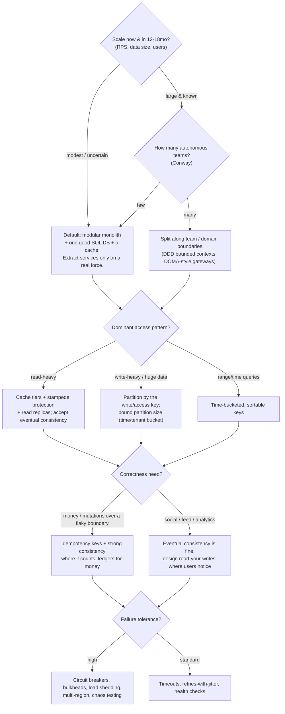
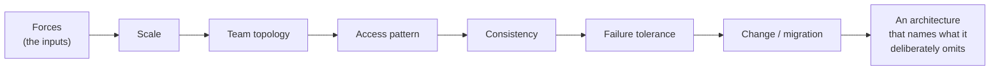
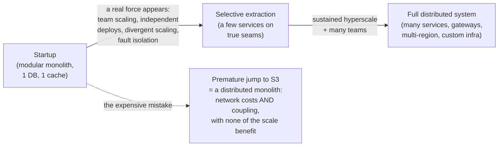
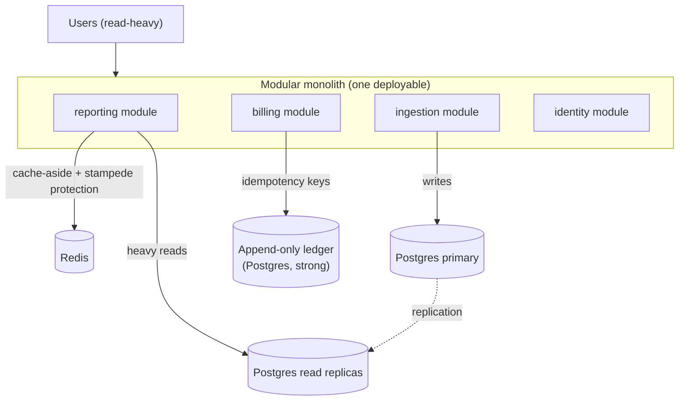
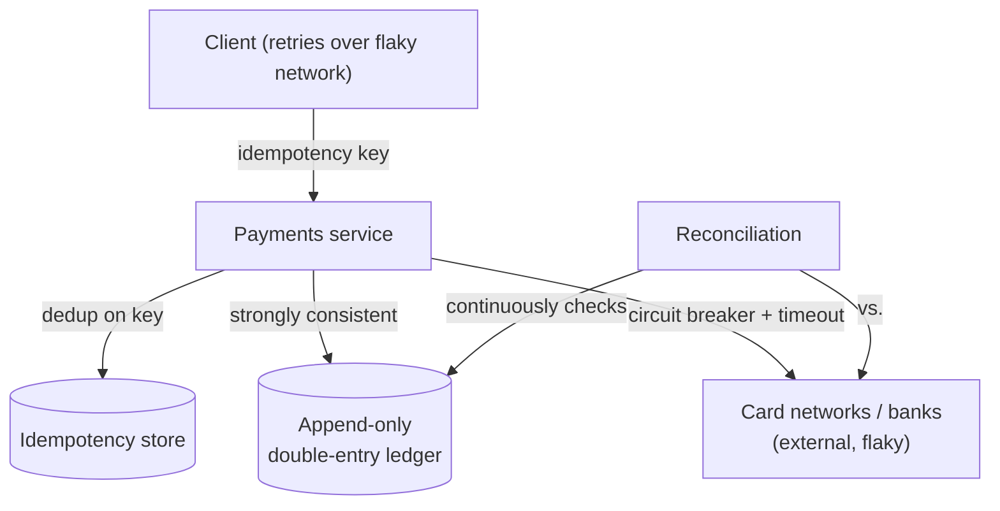

# Cross-Cutting Patterns & a Decision Framework

Seven case studies, seven very different businesses — payments, chat, ride-hailing, commerce, lodging, a social graph, streaming. Yet read them side by side and the same forces and the same handful of patterns recur. Stripe's idempotency keys and Netflix's safe retries are the same idea; Discord's channel-bucket partition key and Uber's H3 geo-cells and Shopify's per-shop pods are the same idea; Meta's memcache leases and the cache-stampede protection you'd put in a Spring app are the same idea. The differences between these systems are mostly *which forces dominated*, not *which patterns exist*.

This closing topic does two things. First, it distills the recurring patterns into a single catalog and maps each to where it is taught in this book, so the case studies become a reusable toolkit rather than seven stories. Second — and more important — it gives you a **decision framework**: a small set of questions that, answered honestly about *your* scale, team, access pattern, and consistency needs, point you at the right architecture. The overriding lesson of the chapter is **right-sizing**: every one of these companies earned its complexity by hitting a wall first. Copying the destination without the journey — "we'll do microservices like Netflix" at a startup with four engineers — is the most common and most expensive architecture mistake there is.

> [!NOTE]
> Prerequisites: the seven case studies [T01](./T01-netflix-resilience-and-microservices.md)–[T07](./T07-meta-data-infrastructure-tao-memcache.md), and the [System Design Methodology (L5/C02/T16)](../C02-distributed-systems-and-system-design/T16-system-design-methodology-framework.md), whose step-by-step method this framework feeds into.

## How to Read This Capstone

Three mental images run through everything below; keep them in your pocket because they are the difference between *knowing* the patterns and *deploying* them with judgment.

- **Right-sizing complexity is "don't buy a semi-truck to carry your groceries."** A 40-tonne articulated lorry will absolutely move your weekly shop home. It will also cost a fortune, demand a special licence, refuse to fit in the car park, and burn diesel idling at every light. The semi is *correct* for a haulage company moving pallets across a continent — and *absurd* for one person and twelve bags. Architecture is identical: a multi-region, event-sourced, twelve-service mesh is the right vehicle for a load it was sized for, and a catastrophe for a product that has 2,000 users and one squad. The skill is matching the vehicle to the cargo, not admiring the biggest vehicle.
- **The patterns are a toolbox where the skill is picking the right tool, not owning the most tools.** A master carpenter is not the one with the most chisels; it is the one who reaches for the *right* chisel without thinking. Idempotency keys, partition keys, cache tiers, circuit breakers — these are tools, and every one of them has a cost as well as a benefit. Knowing all nine patterns is table stakes. Knowing which two your system actually needs *this quarter*, and leaving the other seven in the drawer, is the senior move.
- **Cargo-culting big-tech architecture is "wearing a Formula-1 driver's gear to drive to the supermarket."** The fireproof suit, the HANS device, the six-point harness, the helmet — all of it is genuinely life-saving at 320 km/h with a real chance of a 5-g crash. None of it helps you reach the dairy aisle; it just makes you slow, sweaty, and unable to reach the pedals comfortably. When a four-person startup adopts Netflix's service mesh, Kafka backbone, and multi-region failover, it is wearing the F1 kit to buy milk. The gear is real engineering — earned by a real hazard those companies actually face. You are not facing that hazard yet, and the gear is pure drag until you are.

> [!NOTE]
> **In Practice — say the quiet part out loud.** In a design review, the most senior-sounding sentence you can utter is not "we'll use Kafka and a service mesh." It is: "Our cargo is twelve bags of groceries, so we're taking the car — here's the specific future load that would make us buy the truck, and here's the metric that would tell us we've reached it." Naming the *trigger* for added complexity, with a number attached, is the entire game.

## The Pattern Matrix

Each row is a pattern; each ✓ marks a case study where it was load-bearing. The clustering is the point — no single company invented these, and your system will reach for several at once.

| Pattern | NF | ST | DC | UB | SH | AB | MT |
|---|:--:|:--:|:--:|:--:|:--:|:--:|:--:|
| Idempotency / safe retries | ✓ | ✓ | | | | ✓ | |
| Partition/shard key for the access pattern | | | ✓ | ✓ | ✓ | | ✓ |
| Caching as first-class + stampede protection | ✓ | | ✓ | | | | ✓ |
| Resilience: circuit breaker / bulkhead / load-shed / chaos | ✓ | | | ✓ | ✓ | | |
| Monolith vs micro is contextual; modularity > distribution | | | | ✓ | ✓ | ✓ | |
| Strangler-fig incremental migration | ✓ | | | | | ✓ | |
| Data-store fit (incl. the JVM-GC tail tax) | | ✓ | ✓ | ✓ | | | ✓ |
| Eventual consistency as a deliberate trade | ✓ | | ✓ | ✓ | | ✓ | ✓ |
| Conway's law / team topology drives the split | ✓ | | | ✓ | ✓ | ✓ | |

*NF Netflix · ST Stripe · DC Discord · UB Uber · SH Shopify · AB Airbnb · MT Meta.*

## The Recurring Patterns

Each pattern below names *what it is*, *why it keeps reappearing*, and *where in this book the mechanism is taught*. To make the catalog usable rather than encyclopedic, each pattern also carries a **"you'll feel this when…"** trigger — the lived symptom that tells you you've walked into exactly the situation the pattern solves. If you don't recognize the trigger in your own system, you probably don't need the pattern yet; that recognition *is* the right-sizing discipline in miniature.

### 1. Idempotency Makes an Unreliable Network Safe

The network cannot tell you whether a request was lost or only its response was — so clients retry, and retries duplicate. Every system that moves money or mutates state behind a flaky boundary converges on the same fix: a client-supplied **idempotency key** plus server-side dedup, turning at-least-once delivery into effectively-once processing ([Stripe, T02](./T02-stripe-idempotency-ledgers-api-longevity.md)). It recurs because the network's unreliability is universal. **Taught in:** [Idempotency & Deduplication (L5/C02/T07)](../C02-distributed-systems-and-system-design/T07-idempotency-and-deduplication.md).

> *You'll feel this when…* a customer is double-charged because the checkout button was tapped twice on a flaky phone connection, or your payment webhook fires the same event again and you ship two parcels for one order. The instant a retry can cause a *duplicate side effect* a human would notice on their bank statement, you have arrived at idempotency.

### 2. The Partition Key Is the Most Important Decision

At scale, throughput and latency are decided by how data is split. The winning move is always to choose the shard/partition key to match the *dominant access pattern* and to *bound* partition size: Discord's `(channel_id, time-bucket)` ([T03](./T03-discord-storage-evolution-cassandra-scylladb.md)), Uber's H3 geo-cells ([T04](./T04-uber-domain-oriented-microservices-geo-sharding.md)), Shopify's per-shop pods ([T05](./T05-shopify-modular-monolith.md)), Meta's graph shards ([T07](./T07-meta-data-infrastructure-tao-memcache.md)). A wrong key creates hot partitions no amount of hardware fixes. **Taught in:** [Partitioning & Consistent Hashing (L5/C02/T05)](../C02-distributed-systems-and-system-design/T05-partitioning-and-consistent-hashing.md).

> *You'll feel this when…* one celebrity user, one viral channel, or one mega-tenant lights a single database node on fire while the other fifteen sit idle, and adding hardware does nothing because all the traffic still lands on the same shard. A skewed load that hardware can't flatten is the signature of a partition-key problem.

### 3. Caching Is Architecture, Not an Afterthought

Read-heavy systems live or die on the cache, and the hard part is never the hit — it's invalidation and the stampede when a hot key misses. Meta's **leases** ([T07](./T07-meta-data-infrastructure-tao-memcache.md)) and Netflix's EVCache ([T01](./T01-netflix-resilience-and-microservices.md)) treat the cache as a first-class subsystem with its own consistency and herd-protection design. **Taught in:** [Caching Strategies at Scale (L5/C02/T11)](../C02-distributed-systems-and-system-design/T11-caching-strategies-at-scale.md).

> *You'll feel this when…* a popular cache entry expires and ten thousand requests all miss in the same millisecond, slam the database in unison, and take the whole service down — the "thundering herd." Or when a user updates their profile and still sees the old version because something, somewhere, is serving stale data. Read amplification and stale reads are the twin triggers.

### 4. Design for Failure: Circuit Breakers, Bulkheads, Load Shedding, Chaos

A distributed system *is* a system in partial failure at all times. The discipline is to contain failure: circuit breakers stop cascades, bulkheads isolate resources, load shedding protects the hot path under spikes ([Netflix chaos engineering, T01](./T01-netflix-resilience-and-microservices.md); [Shopify BFCM, T05](./T05-shopify-modular-monolith.md)). **Taught in:** [Resilience Patterns (L5/C02/T14)](../C02-distributed-systems-and-system-design/T14-resilience-circuit-breaker-bulkhead-retry-timeout-backpressure.md).

> *You'll feel this when…* one slow downstream dependency — a sluggish recommendations service, a third-party API having a bad day — drags your entire request thread pool to exhaustion, and now *everything* is timing out even though only one thing was actually broken. A failure that spreads beyond its blast radius is the trigger for resilience patterns.

### 5. Monolith vs Microservices Is a Trade-off, Not a Ladder

This is the chapter's biggest myth-buster. Shopify scaled a deliberate **modular monolith** ([T05](./T05-shopify-modular-monolith.md)); Airbnb decomposed too far and had to consolidate ([T06](./T06-airbnb-monolith-to-soa-migration.md)); Uber tamed thousands of services with DOMA ([T04](./T04-uber-domain-oriented-microservices-geo-sharding.md)). The transferable truth: **modularity (enforced boundaries) matters more than physical distribution**, and distribution is a cost you pay only when a concrete force demands it. **Taught in:** [Software Architecture (L5/C01)](../C01-software-architecture/).

> *You'll feel this when…* two teams keep blocking each other's deploys in the same codebase, or one component genuinely needs to scale to 50× the rest and you're paying for that scale across the whole monolith. Independent-deploy contention or divergent scaling needs are the triggers — *not* "the codebase feels big."

### 6. Migrate with the Strangler Fig, Never a Big-Bang Rewrite

Nobody who succeeded rewrote from scratch. They routed traffic incrementally to new components and shrank the old system until it could be retired ([Airbnb, T06](./T06-airbnb-monolith-to-soa-migration.md); Netflix's multi-year cloud move, [T01](./T01-netflix-resilience-and-microservices.md)). It recurs because big-bang rewrites freeze delivery, deliver no value until the end, and concentrate all risk at the riskiest moment. **Taught in:** [Software Architecture (L5/C01)](../C01-software-architecture/) and the migration discussion in [T06](./T06-airbnb-monolith-to-soa-migration.md).

> *You'll feel this when…* someone proposes a "version 2" that will run for eighteen months in parallel before shipping anything, and the roadmap goes dark for a year and a half. The moment a plan promises *no value until the end*, the strangler fig is the answer.

### 7. Fit the Data Store to the Workload — and Mind the GC Tail Tax

There is no universal database; you pick the store whose model and operational profile match your access pattern. Meta built a graph-native store ([T07](./T07-meta-data-infrastructure-tao-memcache.md)); Discord moved off Cassandra specifically to escape **JVM garbage-collection pause tail latency** at extreme scale ([T03](./T03-discord-storage-evolution-cassandra-scylladb.md)). The GC lesson is a direct Java one — see [GC Algorithms (L3/C02/T08)](../../L3-advanced-jvm/C02-jvm-internals-and-performance/T08-gc-algorithms-serial-parallel-g1-zgc-shenandoah.md) — but note Cassandra/JVM served Discord for *years* first: a reason to migrate is not a reason never to have started.

> *You'll feel this when…* your p50 latency is great but your p99 is mysteriously terrible and spiky, tracing back to GC pauses or to a query pattern your store was never shaped for (range scans on a key-value store, deep joins on a document store). A tail you can't tame with tuning, or a query the store fights you on, is the trigger.

### 8. Eventual Consistency Is a Choice You Make on Purpose

Read-dominated, globally-distributed systems deliberately trade strong global consistency for availability, low latency, and read-your-writes ([Meta TAO, T07](./T07-meta-data-infrastructure-tao-memcache.md); Discord; Netflix multi-region). The skill is naming the trade explicitly rather than discovering it in an incident. **Taught in:** [CAP & PACELC (L5/C02/T01)](../C02-distributed-systems-and-system-design/T01-cap-theorem-and-pacelc.md).

> *You'll feel this when…* you want a single user's action to be visible globally in 50 ms *and* you want the system to stay up during a network partition — and you realize you cannot have both. The moment latency or availability across regions collides with "everyone must see the same value instantly," you are choosing your consistency level whether you admit it or not.

### 9. Conway's Law Is Always Voting

Architecture mirrors org structure whether you plan it or not. Uber's domains, Airbnb's service ownership, Shopify's component teams — each split followed team boundaries. Design the team topology and the architecture together. **Taught in:** [Software Architecture (L5/C01)](../C01-software-architecture/).

> *You'll feel this when…* a service boundary keeps causing pain because *two* teams own it, or one team owns *five* services and ships them in lockstep. When the seams in your software don't line up with the seams in your org chart, Conway's law is already voting against you — and it always wins eventually.

## A Decision Framework

Don't start from "monolith or microservices." Start from forces. Answer these in order; each answer narrows the design.

And whenever you change a live system: **strangler-fig, incrementally, reversibly — never a big-bang rewrite.**

| Force | The question to ask | What it points to |
|---|---|---|
| Scale | What is RPS / data size / user count, now and realistically in 18 months? | Most systems are small → a modular monolith is correct |
| Team topology | How many teams must deploy independently? | Few → monolith; many → services on team boundaries |
| Access pattern | Read-heavy, write-heavy, or range/time? | Cache tiers / partition key / time bucketing |
| Consistency | Does a wrong value cost money or just a stale feed? | Idempotency + strong vs eventual consistency |
| Failure tolerance | What is the cost of downtime? | Resilience patterns, multi-region, chaos |
| Change | How do we get from here to there safely? | Strangler fig, always |

### How the Framework Feels in the Room

The framework is deliberately a *sequence of forcing questions*, not a checklist of technologies, because the order encodes the right-sizing discipline. You ask about **scale first** so you can disqualify most of the toolbox before you're tempted by it — the honest answer for the overwhelming majority of systems is "modest," and that single answer collapses the whole tree to "modular monolith + one SQL database + a cache." Only systems that survive the first two gates (large *and* known scale, *and* many autonomous teams) earn the right to talk about service splits at all. Then — and only then — does the access pattern decide your data shape, the consistency need decides your correctness machinery, and the failure-tolerance need decides how much resilience kit you bolt on.

Read top to bottom, the framework is a series of *permissions you must earn*, not features you may add. That inversion is the entire point: complexity is guilty until proven necessary.

## "You Are Not Google" — Right-Size the Complexity

The single most useful diagram in this chapter is the relationship between scale and *justified* complexity. Complexity should *track* scale, lagging slightly behind it — never lead it.

Every case-study company started at S1 and moved right *because a specific wall forced it*. The failure mode is jumping to S3 by reputation. Extract a service only when you can name the force: a team that must deploy on its own cadence, a component that must scale differently from the rest, a fault you must isolate, or a domain boundary that has genuinely hardened.

> [!WARNING]
> The **distributed monolith** is the worst outcome: services so tightly coupled they must be deployed together, so you pay every network and operational cost of microservices *and* keep the coupling of a monolith. Symptoms: a single feature touches many repos; you can't deploy one service without others; shared databases across service lines. If you see these, you have distribution without modularity — exactly backwards.

> [!WARNING]
> **Nanoservices** are the over-decomposition trap Airbnb hit ([T06](./T06-airbnb-monolith-to-soa-migration.md)): services so fine-grained that ordinary work becomes a chatty, fragile dance across many of them. Right-size to coarse, cohesive domains.

### Common Cargo-Cult Mistakes

Cargo-culting is copying the *visible artifacts* of a successful system — the conference-talk architecture diagram — without the *invisible forces* that made those artifacts necessary. The original Pacific cargo cults built straw control towers and wooden headsets because they had seen those things accompany cargo planes; they had the form exactly right and the causation exactly backwards. Engineering teams do the same when they adopt Kafka because Netflix has Kafka. Below are the most common copies, the force the original team *actually* had, and the cheaper right answer for a team that does not yet have that force.

| Cargo-culted move | What the big-tech team actually had | Why it hurts at small scale | The cheaper right answer |
|---|---|---|---|
| **Premature microservices** ("we'll split into 12 services on day one") | Dozens of teams that physically could not share one deploy pipeline | You get network latency, distributed transactions, and 12 deploy pipelines to babysit — with *one* team, who now context-switch across all of them | A **modular monolith** with enforced module boundaries (Spring Modulith / ArchUnit). Split later, on a named force, along a seam that has already hardened |
| **Premature Kafka** ("we need an event backbone") | Millions of events/sec across many consumers, and a genuine need to decouple producers from a fan-out of teams | You run a multi-broker, ZooKeeper/KRaft-coordinated, partition-rebalancing cluster to move a few hundred messages/min that a database table would hold fine | A **Postgres table as a queue** (`SELECT … FOR UPDATE SKIP LOCKED`) or a managed SQS/Pub/Sub. Reach for Kafka when throughput, replay, or true multi-consumer fan-out is a real, measured need |
| **Premature multi-region active-active** ("we need global HA") | Regulatory data-residency rules, real users on three continents, and an SLA where a regional outage is a board-level event | You take on conflict resolution, cross-region replication lag, split-brain risk, and a doubled bill — to serve users who are mostly in one time zone | **One region, multi-AZ**, with backups and a tested restore. Add a second region when you can point to the users, the latency numbers, or the compliance clause that demands it |
| **A service mesh for 3 services** | Hundreds of services where uniform mTLS, retries, and observability could not be done by hand | A sidecar per pod, a control plane to operate, and a new failure mode (the mesh itself) — to manage three services you could wire together in an afternoon | A **shared library or a simple API gateway** for cross-cutting concerns. Introduce a mesh when the number of services makes per-service wiring genuinely unmanageable |
| **Premature CQRS + event sourcing** | A domain where the audit log *is* the product and read/write loads diverge by orders of magnitude | Every feature now requires writing an event, a projection, and reconciliation logic; "what is the current state?" becomes a research project | A **single normalized SQL schema** with an audit table where you actually need history. Event-source the *one* aggregate (e.g. the money ledger) that truly demands it |
| **Premature Kubernetes** ("we need to orchestrate containers") | Thousands of services across huge fleets needing bin-packing, self-healing, and declarative rollout | A cluster to operate, upgrade, secure, and debug — wrapping an app that two managed containers or a single VM would have run | A **managed platform** (a PaaS, Cloud Run, ECS/Fargate, a couple of VMs behind a load balancer). Adopt k8s when fleet size and deploy frequency make manual orchestration the bottleneck |

> [!NOTE]
> **In Practice — the cargo-cult tell.** Listen for justifications phrased as *"company X uses it"* rather than *"our load is Y, which needs it."* "Netflix uses Kafka" is a fact about Netflix's load, not an argument about yours. The fix is to make the proposer state the *force in their own system* — with a number — that the technology addresses. If they can't, the straw control tower is showing.

## Worked Example: Applying the Framework

*"A B2B SaaS, ~1,000 RPS, 8 engineers, read-heavy dashboards, billing involved, standard availability."* Walk the framework: scale is modest → **modular monolith** (Spring Boot with [Spring Modulith / ArchUnit-enforced boundaries](./T05-shopify-modular-monolith.md)); few teams → no service split yet; read-heavy → **Redis cache-aside with stampede protection** ([T07 patterns](./T07-meta-data-infrastructure-tao-memcache.md)) over PostgreSQL with read replicas; billing → **idempotency keys + an append-only ledger** ([T02](./T02-stripe-idempotency-ledgers-api-longevity.md)); standard availability → timeouts, retries-with-jitter, health checks. **What you do *not* build:** a service mesh, multi-region active-active, or twelve microservices. That is the chapter's whole thesis in one design.

### Walk-Through 1: A B2B SaaS Dashboard (Expanded)

Let's run the same B2B SaaS prompt above slowly and end to end, naming each force, each choice, and — just as importantly — each thing we *decline* to build, so the reasoning is reusable rather than memorized. Picture a concrete product: an analytics dashboard for marketing teams, the kind of tool where a customer logs in each morning, stares at charts of last week's campaign numbers, occasionally drills into a report, and pays a monthly subscription.

- **Force 1 — Scale.** ~1,000 RPS, a few thousand tenant companies, low-terabyte data. In the "modest" bucket. *Choice:* a single deployable **modular monolith**. *Decline:* any service split — there is no force demanding one.
- **Force 2 — Team topology.** Eight engineers, effectively one or two squads. Conway's law says one or two deploy units. *Choice:* keep it one deployable with internal modules (`billing`, `reporting`, `ingestion`, `identity`) whose boundaries are enforced by ArchUnit so they *could* be extracted later. *Decline:* per-module repos and pipelines — that's all cost, no benefit, at this team size.
- **Force 3 — Access pattern.** Overwhelmingly read-heavy: the same dashboards are loaded thousands of times between the relatively rare writes that ingest new campaign data. *Choice:* **cache-aside with Redis**, plus PostgreSQL **read replicas** for the heavier analytical queries, plus **stampede protection** (a single-flight lock or short randomized TTL jitter) so a popular dashboard's cache expiry doesn't dogpile the database. *Decline:* a separate OLAP warehouse or a streaming pipeline — Postgres with replicas and good indexes carries this load for a long time.
- **Force 4 — Consistency / correctness.** Dashboards can be a few seconds stale; nobody notices and nobody is harmed. **Billing cannot.** A double-charge or a dropped invoice is a refund, a support ticket, and a trust hit. *Choice:* the dashboard side accepts **eventual consistency** behind the cache; the billing side uses **idempotency keys** on every charge operation and an **append-only ledger** as the source of truth for money, so a retried payment request is processed effectively-once and every balance is reconstructable. *Decline:* global strong consistency across the whole system — you'd pay for it everywhere to protect the 5% that needs it. Strong consistency goes *only* where money lives.
- **Force 5 — Failure tolerance.** Standard SaaS availability; an occasional minute of downtime is survivable, not a board-level event. *Choice:* **timeouts, retries-with-jitter, health checks**, a single region across multiple availability zones, nightly backups with a *tested* restore. *Decline:* multi-region active-active, chaos engineering, a service mesh.
- **Force 6 — Change.** When the ingestion module eventually does need to scale on its own (say, a few huge tenants start firing 50× the events), extract *it* first, **strangler-fig**, behind the boundary ArchUnit has been guarding all along — route new ingestion traffic to the extracted service, dual-write during cutover, keep a rollback path.

**Landing architecture:** modular monolith + PostgreSQL (primary + read replicas) + Redis cache-aside with stampede protection + idempotency keys + append-only ledger for billing + single-region multi-AZ + timeouts/retries/health-checks. **Explicitly NOT built:** microservices, Kafka, a service mesh, multi-region, CQRS, Kubernetes-for-its-own-sake.

### Walk-Through 2: A Consumer Social / Feed App

Now a completely different shape: a consumer social app — think a photo-and-status feed where people follow each other, post, like, and scroll. The business reality is millions of casual users, an enormous read-to-write ratio (people scroll far more than they post), and a built-in tolerance for slight staleness (nobody is harmed if a like count lags by a second or a new post takes a moment to appear in a follower's feed).

- **Force 1 — Scale.** Large and, crucially, *known to be large* — this is a consumer product whose entire premise is mass adoption. Tens of thousands of RPS at the read tier, with viral spikes. *Choice:* we are past the monolith default; scale is a real force. But note *what kind* of scale — read scale, not write scale.
- **Force 2 — Team topology.** Several teams (feed, posting, social graph, media, notifications). *Choice:* split along those domain seams — a **feed service**, a **graph service**, a **media service** — with clear ownership, DOMA-style. *Decline:* nano-splitting "like-counter" and "comment-counter" into their own services; that's the Airbnb over-decomposition trap.
- **Force 3 — Access pattern.** Massively **read-heavy** with a fan-out problem: one post by a popular user must appear in millions of followers' feeds. *Choice:* aggressive **cache tiers** (a Meta-style memcache layer with lease-based stampede protection), **partition the social graph and feeds by `user_id`** so a given user's data and timeline live together, and choose **fan-out-on-write for ordinary users** (precompute feeds) while switching to **fan-out-on-read for celebrity accounts** (don't precompute into 50M timelines — pull their posts in at read time). *Decline:* a single global SQL database — the read volume and fan-out would melt it.
- **Force 4 — Consistency / correctness.** This is a feed, not a ledger. A like count that's eventually correct, a post that appears in your follower's feed a second late — all fine. *Choice:* **eventual consistency** as a deliberate, named trade, with **read-your-writes** carefully preserved where the user *would* notice (you must always see your *own* post and your *own* like immediately, even if others see it slightly later). *Decline:* strong global consistency — it would cost availability and latency to protect data that nobody is harmed by being slightly stale.
- **Force 5 — Failure tolerance.** High at the read path (an outage is front-page news) but the failure of a non-critical subsystem should degrade gracefully, not cascade. *Choice:* **circuit breakers** around the recommendation and notification services so a slow recommender doesn't take down the feed; **load shedding** to protect the hot read path during viral spikes; **multi-region** read replicas for latency and availability. *Decline:* synchronous strong cross-region writes — that fights the eventual-consistency choice you already made.

**Landing architecture:** domain services (feed / graph / media) + partition by `user_id` + heavy cache tiers with lease-based stampede protection + hybrid fan-out (write for normal users, read for celebrities) + eventual consistency with read-your-writes + circuit breakers and load shedding + multi-region reads. **Explicitly NOT built:** strong global consistency, a money-grade ledger (there's no money in the core feed), or per-counter nanoservices.

> [!NOTE]
> **In Practice — the celebrity problem is a partition-key story in disguise.** The reason a naive feed design falls over is the same reason a naive partition key falls over (Pattern 2): one extreme account (the celebrity) concentrates load that uniform sharding can't spread. The fix — special-casing high-fan-out accounts to read-time pull — is *bounding the blast radius of a hot key*, exactly the discipline Discord and Uber applied to their partition keys. Different surface, identical force.

### Walk-Through 3: A Fintech Payments Service

Now flip every dial. A payments service — it takes a request to move money from a customer to a merchant, talks to card networks and banks over flaky external boundaries, and must *never* lose or duplicate a cent. Here correctness dominates everything; latency and even availability are negotiable in a way that correctness is not. Lose a payment and you have a furious customer; duplicate one and you have a chargeback, a fine, and a compliance investigation.

- **Force 1 — Scale.** Could be modest or large, but scale is *not the dominant force* — correctness is. *Choice:* let correctness, not scale, drive the core design. Even a low-volume payments service must be built correctly from day one because the cost of a single wrong value is enormous.
- **Force 2 — Team topology.** Often a focused team. *Choice:* a **service (or a few services) with very hard boundaries** — payments, ledger, reconciliation — because the regulatory and audit requirements make those boundaries real and worth the distribution cost. *Decline:* sprawling micro-decomposition; you want few, extremely well-tested, auditable components.
- **Force 3 — Access pattern.** Write-heavy in the sense that *every* request is a state mutation that matters, but volume is usually moderate. *Choice:* a **partitioned but strongly-consistent store** keyed by account, with the **ledger as an append-only, immutable log** of debits and credits — the source of truth from which all balances are derived. *Decline:* an eventually-consistent store for the money path; here, eventual consistency is a *bug*, not a trade.
- **Force 4 — Consistency / correctness.** The whole reason the service exists. *Choice:* **idempotency keys** on every money-moving operation (so a client retry over a flaky network — or a card-network timeout where you don't know if the charge went through — is processed effectively-once); **strong consistency** on the ledger; **the double-entry ledger pattern** so every movement is balanced and auditable; and a **reconciliation** process that continuously checks your ledger against the external networks. *Decline:* "we'll dedupe later" or "we'll reconcile in a batch job someday" — correctness machinery is non-negotiable and goes in first.
- **Force 5 — Failure tolerance.** Failure must never *corrupt* state, even if it costs availability. *Choice:* prefer to **fail closed** (reject a payment you're unsure about) over failing open (process a payment twice); **circuit breakers and timeouts** around external networks; a **retry-with-idempotency-key** loop so safe retries can't double-spend; and durable, replayable records so a crash mid-flight can be recovered exactly. *Decline:* aggressive optimistic processing that trades correctness for throughput.

**Landing architecture:** a small set of hard-bounded services (payments / ledger / reconciliation) + idempotency keys on every mutation + an append-only double-entry ledger as source of truth + strong consistency where money lives + reconciliation against external networks + fail-closed resilience. **Explicitly NOT built:** eventual consistency on the money path, a giant cache layer (correctness over read-latency here), or premature global multi-region (add it for residency/compliance, not by reflex).

> [!NOTE]
> **In Practice — same key, opposite verdict.** Walk-Through 2 (the feed) and Walk-Through 3 (payments) reach *opposite* answers on consistency from the *same* question, because the same wrong value costs nothing in one and everything in the other. A stale like count is invisible; a stale balance is a crime. This is why the framework asks "does a wrong value cost money or just a stale feed?" — the answer flips the entire architecture, and a senior engineer flips it *on purpose*.

### Walk-Through 4: An IoT / Telemetry Ingestion Pipeline

One more shape, because it stresses a force the others didn't: a telemetry pipeline ingesting sensor readings from a fleet of devices — smart meters, vehicle trackers, factory sensors — millions of small writes per second, queried later mostly by device and by time range ("show me device 4471's readings for last Tuesday"). This is the mirror image of the social feed: **write-heavy**, time-series, with reads that are range-and-time-shaped rather than point lookups.

- **Force 1 — Scale.** Large and known, but the scale is in *writes*, not reads — the inverse of the feed. *Choice:* design the write path first; it's the bottleneck.
- **Force 2 — Team topology.** Often one platform team owning the pipeline. *Choice:* a small number of stages (ingest → store → query), not a service per sensor type. *Decline:* over-decomposition by device category.
- **Force 3 — Access pattern.** This is the heart of it: **write-heavy, time-series, range-and-time queries.** *Choice:* **partition by `(device_id, time-bucket)`** — exactly Discord's move — so each partition holds one device's readings for a bounded window, writes spread evenly across devices, and a "device X over time range Y" query hits a small, contiguous, sortable set of partitions. **Bound partition size** by the time bucket (e.g. one partition per device per day) so no partition grows without limit. Use a **time-series-fit store** (a column store or a purpose-built TSDB) rather than forcing this onto a row store designed for point lookups. *Decline:* partitioning by an unbounded key (like a monotonically increasing global sequence) that would create a single hot "latest" partition every device writes to at once.
- **Force 4 — Consistency / correctness.** Telemetry is append-mostly and tolerant of a tiny amount of loss or reordering; it's not money. *Choice:* **eventual consistency** and at-least-once ingestion with idempotent writes keyed by `(device_id, timestamp)` so a retried sensor send doesn't create a duplicate reading. *Decline:* strong consistency or distributed transactions across the write path — they'd throttle the ingest rate that is the whole point.
- **Force 5 — Failure tolerance.** A device or a region can drop without losing the fleet. *Choice:* **backpressure and load shedding** at the ingest tier so a traffic spike (every device reconnecting after a network blip) degrades gracefully instead of toppling the pipeline; a durable buffer so a downstream stall doesn't drop data. *Decline:* synchronous, unbuffered ingestion that turns a downstream hiccup into data loss.

**Landing architecture:** an ingest tier with backpressure + idempotent writes keyed by `(device_id, timestamp)` + partition by `(device_id, time-bucket)` with bounded partitions + a time-series-fit store + eventual consistency. **Explicitly NOT built:** strong consistency on the write path, a giant read-cache (reads are range scans, not hot point lookups), or an unbounded partition key.

> [!NOTE]
> **In Practice — "bound the partition" is the through-line.** Three of these four systems (feed, payments-by-account, telemetry) converge on the same discipline from Pattern 2: *bound the partition so no single one grows or heats without limit* — by user, by tenant, by `(device, day)`. When you find yourself choosing a partition key, the question is never just "what do I query by?" but "and will any single value of this key ever get too big or too hot?" If yes, add a bucketing dimension (usually time or tenant) until each partition is bounded.

### What the Four Walk-Throughs Share — and Don't

Lay the four landings side by side and the lesson of the whole chapter becomes concrete: the *same toolbox*, four *different selections*, each justified by *which force dominated*.

| Force / choice | B2B SaaS dashboard | Social feed | Fintech payments | IoT telemetry |
|---|---|---|---|---|
| Dominant force | Modest scale, billing correctness | Read scale + fan-out | Correctness | Write scale, time-series |
| Topology | Modular monolith | Domain services | Few hard-bounded services | Small staged pipeline |
| Data shape | Postgres + read replicas | Partition by `user_id` | Append-only ledger, strong | Partition by `(device, time)` |
| Caching | Cache-aside + stampede | Heavy tiers + leases | Minimal (correctness first) | Minimal (range reads) |
| Consistency | Eventual reads, strong billing | Eventual + read-your-writes | Strong on money | Eventual, idempotent writes |
| Idempotency | On billing only | Light (likes) | On every mutation | On every device write |
| Resilience | Timeouts, retries, health checks | Circuit breakers, load shed | Fail-closed, reconcile | Backpressure, load shed |
| Deliberately NOT built | Mesh, multi-region, 12 services | Strong global consistency, ledger | Eventual money path, reflex multi-region | Strong write consistency, unbounded key |

The columns differ in *every cell*, yet not one of them invented a pattern that isn't in the catalog above. Senior judgment is the act of reading the row labeled "dominant force" honestly and letting it pick the column — and being able to defend the bottom row, "deliberately NOT built," as articulately as the rest.

> [!INTERVIEW]
> The senior/staff system-design interview reward is *judgment*, not pattern-name recall. When asked to design a system, state the **forces first** (scale, team, access pattern, consistency, failure tolerance), choose patterns that follow from them, and *name what you're deliberately not doing and why* ("read-heavy and small, so a modular monolith with a cache — not microservices"). Citing a real case study as precedent ("like Shopify, I'd keep this a modular monolith and shard by tenant if it grows") signals exactly the right level. The anti-signal is reaching for Netflix's architecture at startup scale.

> [!INTERVIEW]
> A high-leverage move when the interviewer escalates ("now it's 100× the traffic") is to **walk the evolution, not jump to the endpoint**. Show the modular monolith, then name the *specific wall* that forces the first extraction (a divergent-scaling module, an independent-deploy team), strangler-fig that one service out along its hardened boundary, and stop. Demonstrating that you'd add complexity *incrementally, on a named force, with a rollback path* — rather than presenting a fully-distributed system as your opening answer — is the clearest signal of staff-level right-sizing. The trap to avoid is the F1-gear-to-the-supermarket answer: opening with Kafka, a mesh, and multi-region for a product that has no users yet.

## Practice

1. **Fill the matrix yourself.** Without looking, redraw the pattern matrix and place each of the seven companies; then justify one ✓ in each row from memory.
2. **Run the framework.** Take a system you know (or "a photo-sharing app, 50k users, 2 engineers") and walk the decision tree end to end. Write down each force, your choice, and one thing you deliberately won't build.
3. **Spot the distributed monolith.** Given a description of services that share a database and must deploy together, explain which property is missing (modularity) and how you'd fix it without necessarily merging the services.
4. **Right-size a migration.** Sketch a strangler-fig plan to extract *one* capability from a monolith: the routing layer, the first slice, the data cutover (dual-write), and the rollback path.
5. **Defend a boundary.** Argue, with a named force, when you *would* extract a microservice from a healthy modular monolith — and when you would refuse.
6. **Map to the book.** For each of the nine patterns, name the L5/C02 (or L3) topic that teaches its mechanism, and one case study that demonstrates it.
7. **Run a fresh prompt: a food-delivery app.** "A regional food-delivery app — customers browse restaurants (read-heavy), place orders (money + state mutations over flaky payment and restaurant boundaries), and track a driver's live location (write-heavy geo updates), ~5,000 RPS, three small teams." Walk the framework end to end. Where does each part of the system land — and where do payments, browsing, and live tracking demand *different* answers on consistency and partitioning within the *same* product? Name three things you would deliberately not build.
8. **Run a fresh prompt: an internal HR tool.** "An internal HR/leave-management app for a 2,000-person company, ~20 RPS, one team of four, read-heavy, occasional writes, must be correct about who approved what (audit), standard availability." Walk the framework. Justify why nearly every advanced pattern in this chapter is the *wrong* tool here, and what the boring, correct architecture is. This is a "groceries, take the car" exercise — the skill is restraint.
9. **Name the cargo-cult.** For each of these overheard proposals, name which big-tech artifact is being copied, the force the original team actually had, and the cheaper right answer: (a) "Let's put Kafka between our two services so they're decoupled" (the two services do ~50 messages/minute); (b) "We should go multi-region active-active before launch" (pre-launch, no users, no compliance requirement); (c) "Each microservice should own one table" (a five-person team); (d) "We need a service mesh for mTLS" (three services).
10. **Find the "you'll feel this when" trigger.** For a system you've worked on, pick the *single* pattern from the catalog whose trigger you have actually felt in production, and write two sentences: the symptom you observed, and the pattern that resolved (or would have resolved) it. Then pick one pattern whose trigger you have *never* felt — and argue why adopting it would be cargo-culting *for your system*.

## Recap

You should now be able to:

- Recognize the **recurring architecture patterns** — idempotency, partition-key selection, first-class caching with stampede protection, resilience/chaos, contextual monolith-vs-microservices, strangler-fig migration, data-store fit (incl. the JVM-GC tail tax), deliberate eventual consistency, and Conway's law — across otherwise unrelated systems.
- Map each pattern to **where its mechanism is taught** in this book and to the **case study** that demonstrates it.
- Attach a **"you'll feel this when…" trigger** to each pattern, so you can recognize from a lived symptom which situation you're actually in — and, just as importantly, recognize when you're *not* in it and the pattern would be premature.
- Apply a **forces-first decision framework** (scale → team topology → access pattern → consistency → failure tolerance → migration) to choose an architecture instead of defaulting to a trend.
- Run that framework end to end on **multiple distinct system shapes** — a B2B SaaS dashboard (modular monolith + cache-aside + idempotency for billing), a consumer social feed (cache tiers + partition by user + eventual consistency + hybrid fan-out), a fintech payments service (idempotency + double-entry ledger + strong consistency), and an IoT telemetry pipeline (partition by `(device, time)` + bounded partitions + idempotent writes) — and in each case **name what you deliberately do not build**.
- Right-size complexity to actual scale, recognize and avoid the **distributed monolith** and **nanoservice** anti-patterns, and articulate "you are not Google" with a concrete worked example.
- Diagnose and resist **cargo-cult mistakes** — premature microservices, premature Kafka, premature multi-region, a service mesh for three services, premature CQRS/event-sourcing, premature Kubernetes — by forcing the question "what force in *our* system, with a number attached, demands this?" and reaching for the cheaper right answer when the honest answer is "none yet."
- Internalize the three mental images — **don't buy a semi-truck for your groceries** (right-size complexity), **a toolbox where the skill is picking the right tool** (own judgment, not the most patterns), and **don't wear F1 gear to the supermarket** (big-tech architecture is earned hazard-protection you may not yet need).
- Carry these into a system-design interview as **judgment**: state forces, choose accordingly, walk the *evolution* rather than jumping to the endpoint, and name what you deliberately omit.

## Next

This completes **C12 — Real-World Case Studies** and Phase 4 of the book's expansion. To put the framework into practice as a repeatable process, return to the [System Design Methodology (L5/C02/T16)](../C02-distributed-systems-and-system-design/T16-system-design-methodology-framework.md) and the worked designs that follow it ([T17 URL shortener](../C02-distributed-systems-and-system-design/T17-worked-design-url-shortener.md) onward), now reading them through the lens of the forces and patterns this chapter named. For the architectural foundations the case studies assumed, see [L5/C01 Software Architecture](../C01-software-architecture/).
