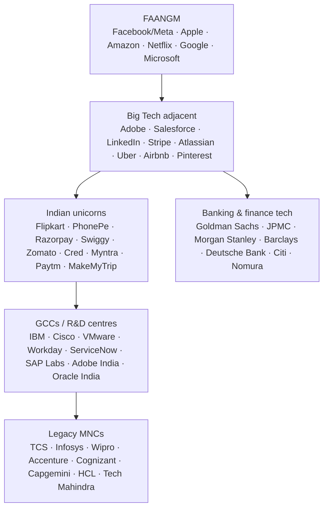
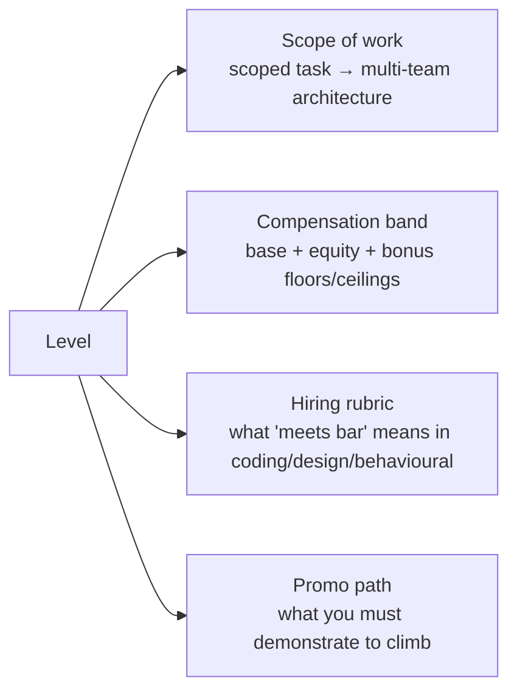
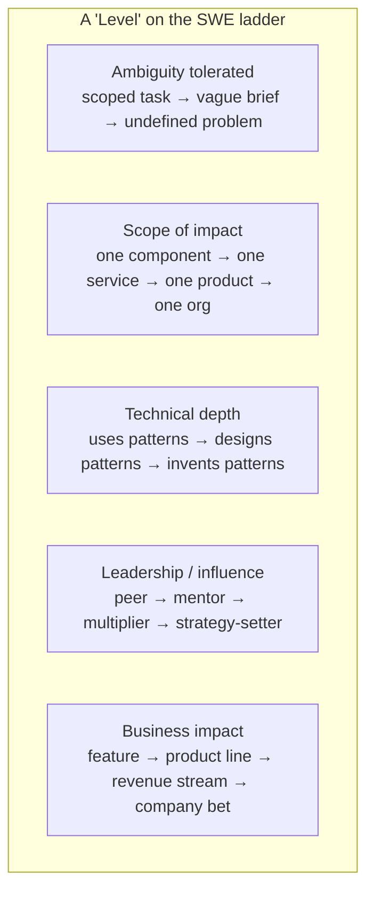
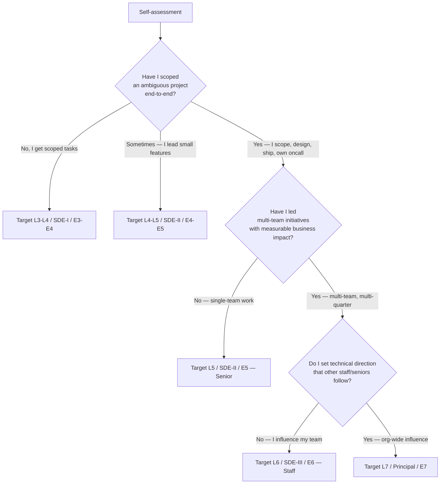
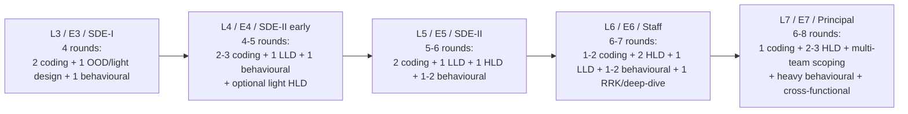

# How Tech Interviews & Leveling Work (MNC vs FAANGM)

Before you optimise a single LeetCode pattern or rehearse a single behavioural story, you need a map of the industry you're interviewing into. Tech hiring is **not one game**: it is a dozen overlapping games — FAANGM, the broader US "Big Tech" tier, Indian unicorns, the legacy MNC machine, GCCs, banking & finance tech, scale-up startups — each with its own pipeline, its own scoring rubric, its own definition of an "L5", and its own bar. A candidate who studies "interviews" in the abstract spends weeks on the wrong material; a candidate who locks the *target segment, target level, and target rubric* first cuts prep time in half and walks in calibrated.

This topic is the map. By the end you can answer: **which companies belong to which tier; what a "level" actually is (scope, not years); how Amazon's SDE-II maps to Google's L4, Meta's E4, Apple's ICT3, Netflix's E5, Microsoft's 62, and Flipkart's SDE-2; how loop structure and bar move with level; and how to pick the level *you* should target so the interview signal lines up with the offer you're hoping for.**

The other foundations topics build on this one: [T02](./T02-the-interview-funnel-recruiter-screen-loop-debrief-offer.md) takes you through the funnel step by step, [T03](./T03-the-interviewer-s-rubric-signals-scoring-calibration.md) opens the interviewer's scorecard, [T04](./T04-big-o-time-and-space-complexity.md) tightens your complexity reasoning, [T05](./T05-communication-mechanics-clarify-structure-think-aloud-recover.md) drills round mechanics, and [T06](./T06-prep-system-weeks-out-plan-mock-cadence-day-of-routine.md) is the prep plan.

> [!NOTE]
> All compensation numbers below are **levels.fyi 2026 medians** for the United States (or India, when explicitly tagged "India"). Use them for *band shape* — relative gaps between L4/L5/L6 etc. — not as quotes. Bands shift with market, location, RSU refresh cycles, and stock performance. Confirm with the recruiter for your specific offer.

## The Tech Hiring Landscape — Who's Who

The companies that hire Java engineers fall into roughly six tiers, each with its own pipeline and culture. The same candidate often interviews across tiers; recognising which tier you're talking to changes how you prep.

The diagram is a rough **bar gradient**, not a strict hierarchy — Goldman Bengaluru's bar for low-latency Java is at FAANGM level for the right team, and a "Big Tech adjacent" shop like Stripe famously runs a harder interview than several FAANGM. But as a first pass:

- **FAANGM** — the original Facebook (now Meta), Amazon, Apple, Netflix, Google, plus Microsoft as the unambiguous sixth. Highest compensation, longest pipelines, most calibrated rubrics, sharpest leveling. Each runs a recognisably distinct loop (Amazon's Leadership Principles, Google's hiring committee, Meta's two-question coding rounds, Apple's team-driven model, Netflix's culture-first design rounds, Microsoft's hybrid pipeline). The fame is justified: the bar is real and the prep material is voluminous, which is exactly why a candidate who reads the wrong company's material under-prepares for the actual loop.
- **Big Tech adjacent** — runs FAANGM-style loops, sometimes harder, sometimes shorter. Comp is competitive. Treat them as a single tier for prep.
- **Indian unicorns** — Flipkart, PhonePe, Razorpay, Swiggy, Zomato, Cred, Myntra, Paytm, MakeMyTrip, etc. The pipeline has one local feature that nearly every other tier lacks: the **Machine Coding round** (90-minute build-from-scratch OO design — covered in [L6/C03/T05](../C03-design-interviews/T05-machine-coding-round-flipkart-style-90-minute-build.md)). Comp is high (₹40 LPA–₹1+ Cr for senior), bar is genuinely competitive, and several Indian unicorns now run loops that match FAANGM India offices.
- **Banking & finance tech** — Goldman Sachs, JPMC, Morgan Stanley, Barclays, Deutsche Bank, Citi, Nomura, Wells Fargo. They are *enormous* Java shops, especially in Bengaluru/Pune/Mumbai for India and NYC/London/Singapore globally. The bar focuses on **Java depth** (collections internals, GC tuning, memory model, low-latency tricks), real-time systems, MQ/Kafka, and correctness over creativity. Compensation is strong, work-life balance varies (front-office trading systems = brutal; back-office = humane).
- **GCCs (Global Capability Centres) / R&D centres** — Indian or APAC arms of global tech companies (IBM, Cisco, VMware, Workday, ServiceNow, SAP Labs, Adobe India, Oracle India, Salesforce India). Pipeline mirrors the parent company, often slightly easier. Comp is somewhere between Indian unicorns and FAANGM-India.
- **Legacy MNCs** — TCS, Infosys, Wipro, Accenture, Cognizant, Capgemini, HCL, Tech Mahindra. The largest employers of Java engineers by sheer headcount, especially in India. Interview style: fundamentals-first (Core Java, basic SQL, basic Spring), JD-relevant Q&A, manager round, HR round. Bar is notably lower than the tiers above; this is reflected in compensation (₹4-15 LPA entry, ₹15-35 LPA mid). Useful to mention because many engineers' first job is here and they later move up the tiers.

> [!INTERVIEW]
> Interviewers at FAANGM and unicorns *will* ask "Why us and not [adjacent company]?" The honest answer — "comp and brand" — won't land. The answer that lands names a *specific product, team, or technical decision* that drew you to this company specifically. The map above is the start of that homework.

## Why Leveling Exists (And Why Every Company Has One)

A **level** is a discrete band on the engineering ladder — L3, L4, L5, L6, L7 in Google's scheme; SDE-1, SDE-2, SDE-3 at Amazon — that determines four things at once:

Without leveling, three things go wrong. **First**, comp drifts — two engineers doing the same job get paid wildly different amounts because each negotiated separately. **Second**, hiring loses calibration — interviewers default to "do they remind me of me?" and the bar wanders. **Third**, promotion becomes a black box — engineers stay stuck because nobody can say what "next level" looks like in observable behaviour. Leveling solves all three by anchoring scope, pay, hiring bar, and promo criteria to the *same* band name.

A famous historical case: **Netflix had no levels at all** for ~25 years (every IC was titled "Senior Software Engineer") and finally introduced a 5-tier ladder in **August 2022** specifically because the no-levels model was causing severe pay drift and complicating performance management as the company scaled past 12,000 employees ([Pragmatic Engineer, *The Scoop*](https://blog.pragmaticengineer.com/netflix-levels/)). The transition itself caused notable attrition — many engineers who had joined as "Senior" were re-mapped to E5 ("true Senior") rather than the Staff/Principal title they'd held at their previous employer.

The takeaway: **levels are the load-bearing concept of modern tech hiring.** Picking the wrong target level — say, applying to "SDE" without specifying SDE-1 vs SDE-2 vs SDE-3, or letting a recruiter "down-level" you from senior to mid — is the single most common self-inflicted prep mistake. A whole chapter of the [Resume, Profile & Career](../C05-resume-profile-and-career/) section addresses this.

## What "Level" Actually Means (Scope, Not Years)

The most common candidate misconception is that level = years of experience. It is not. Level is a description of the **scope of work you can autonomously own**, and YOE is a soft proxy with extremely wide overlap. Across all FAANGM, levels move along five axes simultaneously:

| Axis | L3 / Entry | L4 / Junior | L5 / Senior | L6 / Staff | L7 / Principal |
|------|------------|-------------|-------------|------------|----------------|
| **Ambiguity** | Task scoped by manager | Feature scoped by team | Project scoped by self from PRD | Cross-team initiative scoped by self | Problem scoped by self before anyone names it |
| **Scope** | Function / class | Component / feature | Service / subsystem | Product or org | Company-wide |
| **Tech depth** | Applies patterns | Picks patterns | Designs patterns for team | Designs frameworks for org | Defines what "good" means industry-wide |
| **Influence** | Learning from peers | Reliable peer | Mentors juniors, leads small projects | TL for multi-team work, mentors seniors | Strategy partner to directors/VPs |
| **Impact** | Hours to days of value | Days to weeks | Weeks to a quarter | A quarter to a year | A year to multi-year company bets |

This is why a 4-YOE engineer at one company can sit at L4 while a 4-YOE engineer at another sits at L5 — the *first* one was given scoped tasks; the *second* was thrown into ambiguous projects, learned to scope them, and now operates at L5 scope. **Interviewers calibrate to scope, not years.** When you tell your behavioural stories you are not selling years — you are selling instances of operating at the target level's scope. (T01 of [C04 Behavioural](../C04-behavioral-and-company-tracks/T01-behavioral-interviews-star-car-sbi.md) drills this hard.)

> [!IMPORTANT]
> A 7-YOE candidate who has only ever been handed scoped tasks is an **L4 interviewing for L5** and will fail behavioural. A 4-YOE candidate who has driven ambiguous projects end-to-end is an **L5 with light YOE** and will pass — provided they tell L5-scope stories, not L4-scope stories. *Pick the level you have stories for, not the level your YOE chart says.*

## The FAANGM Level Maps in Detail

Each FAANGM company has its own ladder names and shapes. Here are the five (Meta-style and Microsoft included), distilled from each company's published or widely-corroborated leveling data.

### Amazon — SDE-I → Principal

| Level | Title | Typical YOE | Scope | TC USD (median, 2026) |
|-------|-------|-------------|-------|----------------------|
| **L4** | SDE-I | 0-3 | Scoped tasks; works under mentorship | ~$185-235K |
| **L5** | SDE-II | 3-10 | Owns features and services end-to-end | ~$280-380K (widest band on the ladder) |
| **L6** | SDE-III / Senior SDE | 8-10+ | Multi-team architecture; tech direction for a product area | ~$450-600K |
| **L7** | Principal SDE | 10-15+ | Org-wide strategy; hands-on at director-equivalent scope | ~$700K-1.4M |
| **L8** | Senior Principal | 15-20+ | Cross-org influence (rare) | $1.5M+ |

Amazon's defining feature is its **16 Leadership Principles**, every interviewer is assigned to score 1-3 of them, and the **Bar Raiser** — an outside-team senior with veto power — covers 4-6 in a dedicated round. L5 is the widest band on purpose; most Amazon SDEs live and stay here for years. Promotion to L6 requires demonstrable multi-team architecture impact. ([amazon.jobs — SDE-II Interview Prep](https://amazon.jobs/content/en/how-we-hire/sde-ii-interview-prep), [amazon.jobs — SDE-III Interview Prep](https://amazon.jobs/content/en/how-we-hire/sde-iii-interview-prep), [levels.fyi Amazon leveling](https://www.levels.fyi/blog/amazon-leveling-progress.html))

### Google — L3 → L8

| Level | Title | Typical YOE | Scope | TC USD (median, 2026) |
|-------|-------|-------------|-------|----------------------|
| **L3** | SWE II | 0-2 | Well-scoped tasks under guidance | ~$212K |
| **L4** | SWE III | 2-5 | Independent feature ownership end-to-end | ~$305K |
| **L5** | Senior SWE | 5-9 | Subsystem design lead; **terminal level** — no up-or-out | ~$419K |
| **L6** | Staff SWE | 9-12+ | Tech leadership across teams / an org | ~$613K |
| **L7** | Senior Staff | 12+ | Org-to-company-wide direction | ~$935K |
| **L8** | Principal | 15-20+ | Company-wide technical scope; very rare | ~$1.79M |

Google's distinguishing process is the **Hiring Committee (HC)** — 3-6 senior engineers (L6+) read your packet and vote independently. L5 is a *terminal level*: you can stay there for your whole career without being managed out. **L4 system design** is conditional — usually no, sometimes yes for backend/infra; always ask the recruiter. ([levels.fyi Google blog](https://www.levels.fyi/blog/google-software-engineer-interview-process.html), [Pragmatic — Inside the Google 2026 Loop](https://dglearning.substack.com/p/inside-the-google-2026-loop-rounds))

### Meta — E3 → E7

| Level | Title | Typical YOE | Scope | TC USD (median, 2026) |
|-------|-------|-------------|-------|----------------------|
| **E3** | SWE | 0-2 | Scoped tasks | ~$210K |
| **E4** | SWE | 2-5 | Feature ownership; "production engineer" expectations | ~$320K |
| **E5** | Senior SWE | 5-10 | Project ownership + cross-team work; **terminal** | ~$485K |
| **E6** | Staff SWE | 10+ | Multi-team architecture / tech leadership | ~$750K |
| **E7** | Senior Staff | 12+ | Org-wide influence | ~$1.1M+ |

Meta's interview is famously the **"Ninja" coding round** (two problems in 45 minutes — speed matters more than at any other FAANGM) plus the **"Pirate" system design** and **"Jedi" behavioural** rounds. E5 is terminal here too. Meta also has parallel **Architect / Tech Lead / Manager** ladders that branch off at E5+.

### Apple — ICT2 → ICT6

| Level | Title (often opaque) | Typical YOE | Scope | TC USD (median, 2026) |
|-------|---------------------|-------------|-------|----------------------|
| **ICT2** | Software Engineer | 0-2 | Owns well-scoped tasks; ramping | ~$172K |
| **ICT3** | Software Engineer / Senior | 2-4 | Owns features with guidance | ~$226K |
| **ICT4** | Senior Software Engineer | 4-8 | Owns a domain, mentors; **terminal for most** | ~$334K |
| **ICT5** | Staff Engineer | 8+ | Cross-team scope; *extremely hard* promotion | ~$467K |
| **ICT6** | Principal Engineer | 10+ | Org-wide technical direction; rare | ~$796K |

Apple is the **most team-driven** of the FAANGM — each team designs its own loop with minimal corporate standardization, and the same candidate can pass at team A and fail at team B with the same skills. Titles are deliberately opaque (most engineers are titled "Software Engineer" or "Senior Software Engineer" regardless of true level), so scope is the only real signal. ICT4 → ICT5 is notoriously the hardest jump in industry — many engineers reportedly get perfect ICT4 reviews for years without moving. ([interviewing.io — Senior Engineer's Guide to Apple](https://interviewing.io/guides/hiring-process/apple), [Onsites.fyi — Apple ICT4 2025](https://www.onsites.fyi/blog/article/apple-ict4-software-engineer-interview-questions), [ResumeAdapter — Apple ICT levels](https://www.resumeadapter.com/companies/apple/levels))

### Netflix — E3 → E7 (since August 2022)

| Level | Title | Typical YOE | Scope | TC USD (median, 2026) |
|-------|-------|-------------|-------|----------------------|
| **E3** | Software Engineer | 0-2 | (Rarely hired externally) | ~$218K |
| **E4** | Software Engineer 2 | 2-5 | (Rarely hired externally) | ~$333K |
| **E5** | Senior Software Engineer | 5-10 | Senior — Netflix's most common hiring band | ~$537K |
| **E6** | Staff Software Engineer | 10+ | Staff | ~$781K |
| **E7** | Principal Software Engineer | 12+ | Principal | ~$1.22M |

Netflix introduced these levels only in **August 2022** — for the prior ~25 years, every IC was titled "Senior Software Engineer" with no public ladder ([Pragmatic Engineer](https://blog.pragmaticengineer.com/netflix-levels/)). Netflix **still does not hire entry-level meaningfully** — E3 and E4 are rare external hires; the bulk of external hiring is at E5+. The interview is **system-design dominated** (the inside saying: *"Netflix is to system design as Google is to coding"*) and culture-heavy (the Keeper Test + Freedom & Responsibility). Comp is unique: **all-cash, no RSU refresh, fully-vested 10-year stock options** (kept after leaving), with the option each year to choose how much of comp to take as cash vs options. ([Ravio — Netflix top-of-market comp](https://ravio.com/blog/compensation-strategy-examples-netflix), [Netflix Culture Memo](https://jobs.netflix.com/culture))

### Microsoft — 59 → 67+

| Level | Title | Typical YOE | Scope | TC USD (median, 2026) |
|-------|-------|-------------|-------|----------------------|
| **59-60** | SWE (entry) | 0-2 | Scoped tasks | ~$170K |
| **61** | SWE II | 2-5 | Feature ownership | ~$220K |
| **62** | Senior SWE | 5-10 | Project ownership; **terminal** | ~$310K |
| **63** | Principal SWE | 10+ | Multi-team architecture | ~$420K |
| **64** | Senior Principal | 12+ | Org-wide | ~$575K |
| **65-67+** | Partner SWE / Distinguished / TF | 15+ | Company-wide / industry-wide | $750K-2M+ |

Microsoft's numeric ladder is the longest of the FAANGM (and notably less generous in cash than peers, especially historically — RSU refresh has narrowed the gap). Microsoft is by far the largest **Java** employer among the FAANGM, with massive teams in Bengaluru, Hyderabad, and Noida.

## The Indian / MNC Tier

If you are based in India or interviewing for an India-located role, the Indian-tier ladders matter as much as the FAANGM ones — and the **Machine Coding round** is unique to this tier.

### Flipkart — SDE-1 → Principal

| Level | Title | Typical YOE | TC INR (median, 2026) |
|-------|-------|-------------|----------------------|
| **L1** | SDE-1 | 0-3 | ₹25-40 LPA |
| **L2** | SDE-2 | 3-7 | ₹40-70 LPA |
| **L3** | SDE-3 | 6-10 | ₹70 LPA – ₹1.2 Cr |
| **L4** | Staff SDE | 9-13 | ₹1.2-2 Cr |
| **L5** | Principal | 12+ | ₹2+ Cr |

Flipkart's pipeline famously includes a **90-minute Machine Coding round** — build a working object-oriented system from scratch (parking lot, splitwise, cab booking, library management, snake & ladder, tic-tac-toe). Candidates must produce compiling code with clean OO, SOLID applied, in-memory persistence, and unit tests if time permits. This round filters more aggressively than any of the FAANGM coding rounds. ([L6/C03/T05 — Machine Coding round](../C03-design-interviews/T05-machine-coding-round-flipkart-style-90-minute-build.md))

### Indian unicorns

PhonePe, Razorpay, Swiggy, Zomato, Cred, Myntra, Paytm, MakeMyTrip and similar generally run a 4-round loop: 2 DSA, 1 LLD/machine coding, 1 HLD/hiring manager. Senior loops add a behavioural and a deeper system design. Comp at senior bands has caught up with FAANGM India offices.

### Banking & finance tech (Goldman Sachs, JPMC, Morgan Stanley, Barclays, Deutsche Bank, Citi, Nomura)

These are some of the largest Java employers in the world. The bar is **Java depth-first**: collections internals (HashMap treeify, ConcurrentHashMap CAS), GC tuning, JMM (`volatile`, happens-before), multi-threading depth, real-time/low-latency tricks (object pooling, off-heap, primitive arrays), MQ/Kafka, exact-once semantics, idempotency. Front-office trading systems demand sub-millisecond latency thinking; back-office is more standard backend. Goldman Bengaluru, JPMC Mumbai, and Morgan Stanley Bengaluru run loops that match FAANGM India for the right team.

### GCCs / R&D centres

IBM, Cisco, VMware, Workday, ServiceNow, SAP Labs, Adobe India, Oracle India, Salesforce India. Pipeline mirrors the global parent (usually slightly easier). Comp is competitive (₹30-80 LPA at senior, with RSU upside on the global ticker).

### TCS / Infosys / Wipro / Accenture / Cognizant / Capgemini / HCL / Tech Mahindra

The legacy MNCs. Interview is **fundamentals-first**: Core Java (OOP, collections, exception handling), basic SQL, basic Spring, JD-relevant Q&A, manager fit round, HR round. The bar is much lower than the tiers above; compensation reflects that (₹4-15 LPA fresher, ₹15-35 LPA mid). This is by headcount the largest Java employer tier, especially for the first 1-3 years of a career, and almost every Indian senior Java engineer has spent time here.

## Cross-Company Leveling Cheat Map

The single table every candidate eventually wants. Read it as **roughly equivalent scope** — exact mapping varies team-by-team, year-by-year, and the level on your offer letter is what the recruiter and HM negotiate at debrief, not what a public table dictates.

| Tier | Entry | Junior | Mid | Senior (terminal at most) | Staff (Senior+) | Principal | Distinguished |
|------|-------|--------|-----|---------------------------|-----------------|-----------|---------------|
| **Google** | L3 | — | L4 | **L5** | L6 | L7 | L8 |
| **Amazon** | L4 SDE-I | — | — | **L5 SDE-II** | L6 SDE-III | L7 Principal | L8 Sr. Principal |
| **Meta** | E3 | — | E4 | **E5** | E6 | E7 | — |
| **Apple** | ICT2 | — | ICT3 | **ICT4** | ICT5 | ICT6 | — |
| **Netflix** | (E3 rare) | (E4 rare) | — | **E5** | E6 | E7 | — |
| **Microsoft** | 59 | 60 | 61 | **62** | 63 | 64 | 65+ |
| **Flipkart** | SDE-1 | — | SDE-1/2 | **SDE-2** | SDE-3 | Staff | Principal |
| **Goldman** | Analyst | Associate | Associate | **VP** | ED | MD | Partner MD |

> [!NOTE]
> **Why "Senior" is bolded across the row.** L5 / SDE-II / E5 / ICT4 / 62 is the **terminal IC level** at every major company — the level you can sit at for your whole career without being "managed out" for not promoting. This makes Senior the **single highest-value level to target** for most candidates: bar is real but achievable with disciplined prep, comp is excellent, and the job is permanent. Staff and above (L6+) are smaller populations with longer prep cycles and (especially Apple ICT5) much higher rejection rates.

## How to Pick the Level to Target

The recruiter will ask you in the first call: "What level are you targeting?" The wrong answer wastes weeks. Pick using this triage:

Three failure modes to avoid:

- **Down-leveling pressure.** A recruiter sees a 5-YOE candidate and pre-targets L4 (mid) — but you've actually been operating at L5 scope. *Push back politely* with concrete examples of L5-scope work in your first call; if the recruiter still down-levels, ask for the loop to be "L4/L5 calibrated" so the interviewers score against both bands.
- **Up-leveling FOMO.** A 4-YOE candidate insists on a Senior loop because the comp jump is large. The interview will be a Senior loop — coding will be Senior-bar, system design will be Senior-bar, and behavioural will demand Senior-scope stories *you don't yet have*. Result: across-the-board "lean no hire". Target the level your stories support.
- **Cross-company mis-mapping.** A Microsoft 62 senior assuming the equivalent at Amazon is L6. It's not — it's L5. Use the cheat map above to align.

> [!TIP]
> The most underused move: **ask the recruiter explicitly which level the loop is calibrated to** and **what specific signals the rubric expects**. Good recruiters will tell you. Bad recruiters dodge — that's also signal.

## How Levels Shape Your Interview Loop

Loops are not uniform across levels — the round mix, the round bar, and the time spent in each round all shift. The pattern is consistent across FAANGM:

| Round type | L3-L4 bar | L5 bar | L6 bar | L7 bar |
|------------|-----------|--------|--------|--------|
| **Coding** | LeetCode medium, clean code, articulate complexity | Medium → medium-hard, optimize-then-code, edge cases | Medium-hard + hard, production-quality | One hard, but compressed — coding weight drops |
| **LLD / OOD** | Light — one class diagram | Solid OO, SOLID applied, extensible design | Mature framework-design instincts, evolution path | Deep design partnership; defends choices vs alternatives |
| **HLD / System design** | Often absent; if present, conceptual | Full design with data model, scaling, failure modes | Two designs, including ambiguous brief; operational depth (oncall, blast radius) | Multi-org systems; strategy-level trade-offs |
| **Behavioural** | Owning your tasks, learning attitude | Owning features, navigating ambiguity, mentoring | Leading without authority, multi-team conflicts, technical strategy | Setting strategy, influencing VPs, betting on company direction |
| **Deep-dive / RRK** | — | — | One: deep-dive on a past project | Multiple deep-dives; defends architecture and process |

Notice the asymmetry: **coding weight drops as level rises; design and behavioural weight rise.** A common L5 → L6 prep mistake is to keep grinding LeetCode hards while ignoring the second design round and the leadership stories — exactly the rounds that decide L6 outcomes.

## The Bar (Why Same-Level at Different Companies Differs)

Cross-company leveling tables suggest L5 ≈ SDE-II ≈ E5 ≈ ICT4 ≈ 62 ≈ E5 (Netflix). True in *scope*, but the **calibration** of each company's bar at that level differs in well-documented ways:

- **Amazon SDE-II bar = "scope + LP discipline".** A candidate strong on coding + design who bombs *one* LP in the Bar Raiser round typically rejects. Conversely, a candidate with merely-adequate coding plus *exceptional* LP narratives can land an offer ([Amazon Bar Raiser philosophy — Carrus.io](https://www.carrus.io/blog/all-about-bar-raisers-amazons-essential-element-to-the-hiring-process)).
- **Google L5 bar = "consistency + depth".** Two design rounds at L6 are common; the **Hiring Committee** values low-variance packets (4 Hire votes beats 2 Strong-Hire + 1 No-Hire). Bombing one round at L5+ is more recoverable at Google than at Amazon, but a Strong No Hire from any single round is fatal.
- **Meta E5 bar = "speed + impact".** The two-problems-in-45-minutes "Ninja" round demands brute-force-then-optimize *fast*; design rounds reward concrete impact metrics ("our newsfeed change moved engagement +0.3% = 8M MAU equivalent"). Stories that lack metrics tend to under-score regardless of technical quality.
- **Apple ICT4 bar = "team fit".** Highly team-specific. The same candidate can pass at iCloud and fail at Apple Pay with identical answers. Team match is part of every round, not a separate step.
- **Netflix E5 bar = "judgment without process".** The Keeper Test ("would the hiring manager fight to keep you if you tried to leave?") is the implicit scoring rubric across every round. Candidates who needed cross-team alignment or process-heavy decision-making to ship tend to score poorly even when they did good work.
- **Microsoft 62 bar = "broad and durable".** Less specialised than Amazon's LPs or Google's HC; the Microsoft loop is more conservatively scored — fewer "strong hires" but also fewer aggressive rejections. The "growth mindset" cultural framing is honest, not theatre.

> [!INTERVIEW]
> "Strong hire at Amazon SDE-II ≠ strong hire at Google L5 ≠ strong hire at Meta E5." Prepare to the *specific company's rubric*, not a generic "FAANGM rubric". The [Behavioural & Company Tracks](../C04-behavioral-and-company-tracks/) chapter is built around this; pick the tracks of the companies you're actually interviewing with and study them in depth.

## Promo Dynamics Once In

A footnote that matters more than candidates realize: **the level you join at is much harder to change after the fact than to negotiate up-front.** Internal promo at FAANGM companies:

- Cycles annually or semi-annually (Amazon = OLR twice a year; Google = annual perf + promo packet; Meta = H1/H2 PSC cycles).
- Requires a **promo packet**: documented work at the next level's scope, supporting peer & manager feedback, often a calibration committee outside your immediate team.
- Has expected **time-in-level**: L3→L4 1-2 years; L4→L5 2-4 years; L5→L6 3-6+ years; L6→L7 4-8+ years. These are medians — outliers exist both ways.
- **L5 is terminal everywhere** — you can sit at L5 for 20+ years with no penalty. L6+ promo failure has career consequences at some companies (Amazon's "Focus" PIP, Meta's PSC cycles) but not at Google or Apple where L5 is genuinely safe.

Promotion is *not* a guaranteed upgrade path. The single highest-leverage move you can make is **negotiate the right level on entry** — every additional level at entry compounds for years.

## Sources & Further Reading

The level data above synthesises:

- [levels.fyi](https://www.levels.fyi/) — the canonical crowdsourced leveling and comp database
- [amazon.jobs — Interview Prep](https://amazon.jobs/content/en/how-we-hire) (SDE-I, II, III prep pages)
- [Pragmatic Engineer — Netflix levels](https://blog.pragmaticengineer.com/netflix-levels/)
- [interviewing.io — Senior Engineer's Guide to Apple](https://interviewing.io/guides/hiring-process/apple)
- [interviewing.io — Senior Engineer's Guide to Netflix](https://interviewing.io/guides/hiring-process/netflix)
- [IGotAnOffer — Google SWE Interview](https://igotanoffer.com/blogs/tech/google-software-engineer-interview)
- [Hello Interview — Google L6 Guide](https://www.hellointerview.com/guides/google/l6)
- [Carrus.io — Amazon Bar Raiser](https://www.carrus.io/blog/all-about-bar-raisers-amazons-essential-element-to-the-hiring-process)
- [Onsites.fyi — company-specific level guides](https://www.onsites.fyi/)
- [ResumeAdapter — Apple ICT levels](https://www.resumeadapter.com/companies/apple/levels)
- [Ravio — Netflix top-of-market comp](https://ravio.com/blog/compensation-strategy-examples-netflix)
- [Netflix Culture Memo](https://jobs.netflix.com/culture)

For each company you're actively interviewing with, read at least one *primary* (the company's own careers page) and one *secondary* (a recent leveling write-up) source. The [C04 Behavioural & Company Tracks](../C04-behavioral-and-company-tracks/) chapter does this per company.

## Practice

1. **Self-place yourself on the cross-company cheat map.** Pick the company you most want to interview with. Using the scope-not-years rubric above, name the level you think you'd land at and the level you'd *target* (these can differ). Write one paragraph per axis (ambiguity, scope, tech depth, influence, business impact) defending your placement with a concrete recent example.
2. **Map a peer.** Take a senior engineer you respect at your current company. Without asking them, place them on every FAANGM ladder (Google L?, Amazon SDE-?, Meta E?, Apple ICT?, Netflix E?, Microsoft 6?). Then ask them if they agree. Calibrate your map against the disagreement.
3. **Down-level rejection scenario.** A recruiter at Amazon has reviewed your resume and proposed an SDE-I loop. You believe SDE-II is correct. Write the email you would send pushing back, with 3 specific examples of SDE-II-scope work in your last role.
4. **Up-level overreach scenario.** Inverse: a 3-YOE friend insists on a Google L5 loop. List the three specific Senior-scope behaviours their packet probably won't contain, and the three risks of running an L5 loop without those.
5. **Round-mix prediction.** For a hypothetical Apple ICT4 loop, write out the expected round mix (count, type, duration) and one specific question style you'd expect in each. Now do the same for a Goldman Sachs VP loop and an Amazon SDE-II loop. Note where they overlap and where they diverge.
6. **Comp band shape.** For your target company at your target level, write down the published 25th / 50th / 75th percentile total comp from levels.fyi. Then write down what you'd negotiate as a starting ask given a competing offer 10% above the median. (No need to actually negotiate yet; this is just a calibration exercise.)
7. **The "Why L5 is terminal" point.** Explain in one paragraph why L5 / SDE-II / E5 / ICT4 / 62 is a permanent-stable level at every major company, and what the practical implication is for a candidate who is choosing between a "fast L4 offer" and a "longer L5 loop".
8. **Tier crossing.** A 6-YOE engineer at TCS wants to move to Razorpay (Indian unicorn). Write down the three biggest deltas in interview prep they should expect (round mix, bar, expected Java depth) compared to a TCS internal interview.

## Recap

You should now be able to:

- Name the **six tech-hiring tiers** (FAANGM, Big Tech adjacent, Indian unicorns, banking/finance tech, GCCs, legacy MNCs) and the loop differences between them.
- Explain **why leveling exists** and the four things a level binds together (scope, comp band, hiring rubric, promo criteria).
- State that **level = scope, not years**, and describe the five axes that shift with level (ambiguity, scope, tech depth, influence, business impact).
- Map any FAANGM level onto the cross-company cheat table (Amazon SDE-II ↔ Google L4-5 ↔ Meta E4-5 ↔ Apple ICT3-4 ↔ Netflix E4-5 ↔ Microsoft 61-62).
- Recall that **L5 / SDE-II / E5 / ICT4 / 62 is terminal** at every major FAANGM and explain why that makes it the highest-value target level for most candidates.
- Triage a self-assessment to a target level using the decision tree, and recognise the down-leveling and up-leveling failure modes.
- Predict the **round mix and bar shift** as you move from L3 to L7 — coding weight drops, design + behavioural weight rises.
- Explain why **same-level bar differs across companies** — Amazon (LP veto), Google (HC variance), Meta (speed + metrics), Apple (team fit), Netflix (judgment), Microsoft (broad and durable).
- Explain the **promo dynamics** once you're in — expected time-in-level, packets, why L5 is safe and L6+ has bite.

## Next

Continue to [The Interview Funnel — Recruiter, Screen, Loop, Debrief, Offer](./T02-the-interview-funnel-recruiter-screen-loop-debrief-offer.md).
