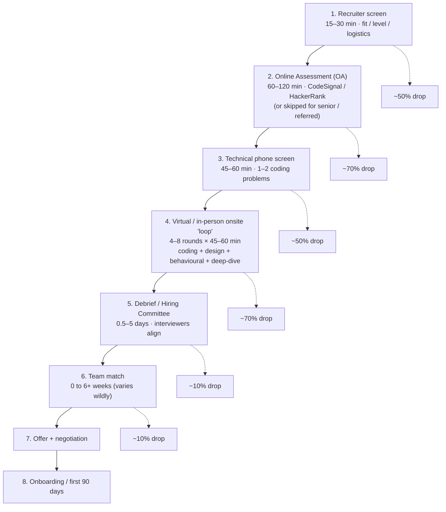
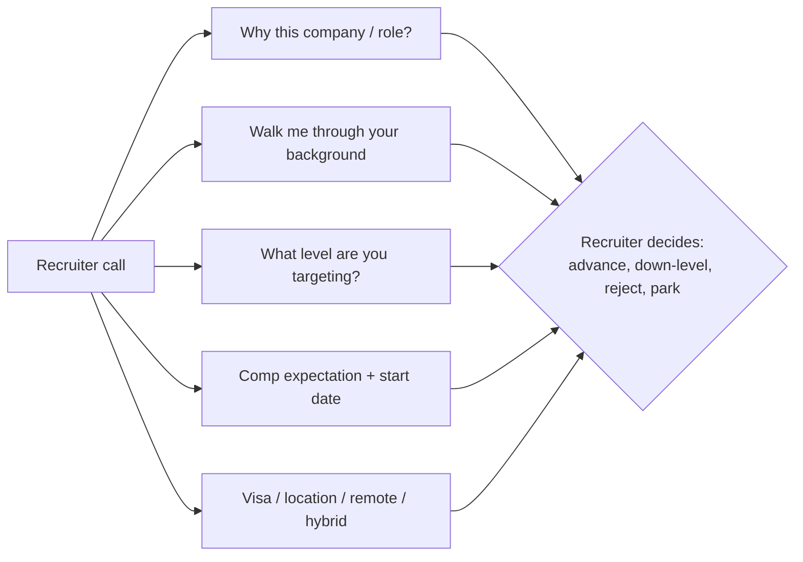
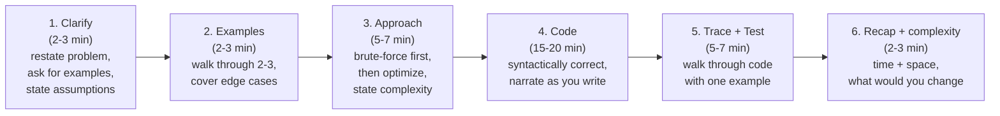
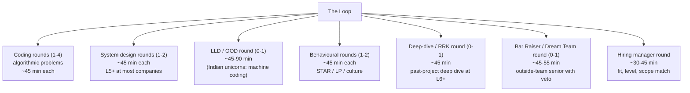
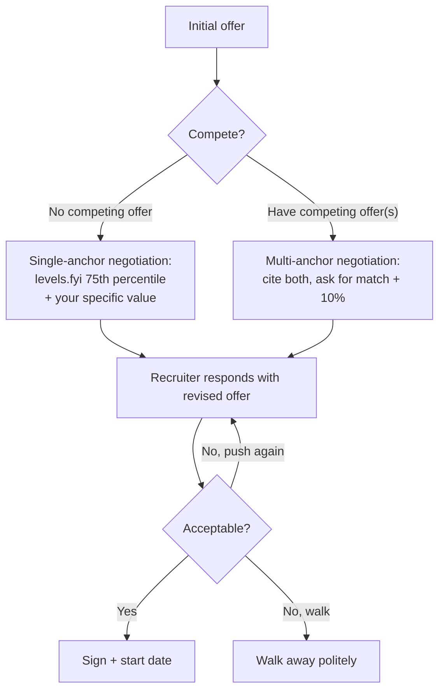

# The Interview Funnel — Recruiter, Screen, Loop, Debrief, Offer

A tech interview is **not one interview**: it is a 5–10 stage funnel that runs over 4–12 weeks, drops you at every step, and is scored differently at every step. Treat the loop as a single "interview" and you under-prepare for at least three of the stages. Treat each stage as its own contest with its own rubric, its own time budget, and its own recovery moves, and the entire funnel becomes navigable.

This topic walks the funnel end-to-end. Pipeline shape draws from the cross-company research summarized in [T01](./T01-how-tech-interviews-and-leveling-work-mnc-vs-faangm.md): Amazon's published [SDE-II](https://amazon.jobs/content/en/how-we-hire/sde-ii-interview-prep) and [SDE-III prep pages](https://amazon.jobs/content/en/how-we-hire/sde-iii-interview-prep), Google's HC-driven loop, Meta's two-question coding rounds plus team-match-before-offer (a 2023 change), Apple's team-driven model, Netflix's "Dream Team" round, Microsoft's hybrid pipeline, and the Flipkart-template Machine Coding round that propagated across Indian unicorns.

> [!NOTE]
> Pipeline details shift quarterly (Meta's CodeSignal OA appeared in 2025; Google piloted a Gemini-assisted coding round in 2026; Apple is detecting AI-assisted answers via typing-pattern analysis). The stages and their *purpose* are stable; the platform and exact format are not. Always confirm with your recruiter for your specific loop.

## The Universal Funnel — One Diagram

End-to-end conversion at FAANGM hovers at **0.1% to 2%** of cold applications; with a referral that rises into the **5–10% range** ([The Interview Guys — 2025 jobs market](https://blog.theinterviewguys.com/how-many-applications-it-takes-to-get-hired-in-2025/)). Most of the elimination happens in stages 2–4. **Stages 1, 6, 7, and 8 also have failure modes**, even though they don't feel like "the interview".

## Stage 1 — The Recruiter Screen

The recruiter screen is universally underestimated. Candidates treat it as a fluff conversation and walk away after a friendly 20-minute chat thinking "that went well." It went well *or* it went poorly; the recruiter has already made three decisions:

1. **Did you actually want this role and this company?** (Vague "I want to work at FAANG" answers get filtered.)
2. **Is your YOE/scope a fit for the open req's target level?** (Down-leveling and rejection both happen here.)
3. **Is your timing, location, comp expectation, and authorization in band?** (Mismatch ends the loop in 30 seconds.)

### What to do (and not do)

- **Have a one-sentence "why this company" tied to a specific product, team, blog post, or technical decision.** "I run your `kafka-connect-jdbc` connector in prod and want to work on the team that ships it." Not "I admire your culture."
- **State your target level explicitly.** "I'm targeting SDE-II at Amazon based on the scope of my last two years." This shows you've done [the leveling homework from T01](./T01-how-tech-interviews-and-leveling-work-mnc-vs-faangm.md) and pre-empts down-leveling.
- **On comp expectation, deflect to a range.** "Competitive; depends on level and full package." Don't volunteer a number first if you can avoid it ([Haseeb Qureshi — Ten Rules](https://haseebq.com/my-ten-rules-for-negotiating-a-job-offer/) #3: information is power; the first to anchor loses).
- **Ask three things back:** (a) what is the round-by-round loop structure; (b) what level is the loop calibrated to; (c) what are the top one or two signals interviewers will look for. Good recruiters answer; bad recruiters dodge — that's signal.
- **Confirm timing.** "I'm interviewing across 3-4 companies on a 4-week window" gives you scheduling leverage and credible pressure.

### Failure modes

- **Asking comp first.** Reads as transactional.
- **Trash-talking current employer.** Recruiter notes it; HM hears about it.
- **Not knowing the company's main product** (yes, this happens). Instant filter.
- **Letting the recruiter dictate the level.** A 5-YOE candidate who lets the recruiter pre-target SDE-I should push back — see T01.

> [!INTERVIEW]
> The recruiter is *your* point of contact for the entire loop, including the offer. Treat them as a partner, not a gatekeeper. A recruiter who likes you and trusts you will push harder on level, on comp, and on advancing borderline packets. A recruiter who finds you stiff or transactional will not.

## Stage 2 — The Online Assessment (OA)

The OA is the asynchronous coding test that filters most cold applicants before any human conversation. Common platforms and shapes:

| Company | Platform | Format | When skipped |
|---------|----------|--------|--------------|
| **Amazon** (full-time SDE OA) | HackerRank (likely, not officially named) / Chime proctoring | 4 sections, ~2 hr: coding (~70 min, 2 problems) + Workstyles (~15 min) + Work Simulation (~60 min) + survey ([amazon.jobs SDE OA](https://amazon.jobs/content/en/how-we-hire/university/sde-oa)) | Sometimes for SDE-II+ via referral; never skipped for new grads |
| **Amazon SDE-II OA** | HackerRank | 90 min coding + 20 min systems design + 8 min work style ([amazon.jobs SDE-II](https://amazon.jobs/content/en/how-we-hire/sde-ii-interview-prep)) | Skipped if a strong phone screen was already done |
| **Meta** | CodeSignal (added 2025) | 90 min with video+mic monitoring; coding | Sometimes for referrals or experienced senior+ |
| **Microsoft** | Codility / HackerRank | 60-90 min; 2-3 problems | Often skipped for experienced laterals |
| **Indian unicorns** (Flipkart, Razorpay, etc.) | HackerEarth / HackerRank | 60-90 min; 2-3 problems | Sometimes skipped for referrals; rare to skip otherwise |
| **Goldman / JPMC / MS** | HackerRank | 90 min: 2 coding + 10+ MCQs on threading / JVM / GC / Spring | Standard |
| **Google** | (no OA) | Goes straight to phone | N/A |
| **Apple** | (rarely OA) | Team-by-team; usually phone | N/A |
| **Netflix** | (no OA) | Goes straight to recruiter + HM screens | N/A |

### What scores well

- **Working code that compiles and passes the public test cases.** Hidden tests usually grade for edge cases and complexity; if your code TLE's on the second hidden case, you score ~50%.
- **Correctness first, optimisation second.** A brute-force solution that passes 100% of small tests is better than an optimal solution that doesn't compile.
- **Explicit complexity comments.** Some platforms grade automatically; some get reviewed by a human. Either way, `// O(n log n) — sort + binary search` is a positive signal.
- **No copy-pasted LeetCode answers.** Modern OAs detect copy-paste patterns and abnormal typing rhythms ([Hello Interview — Meta AI-enabled coding](https://www.hellointerview.com/blog/meta-ai-enabled-coding) on platform telemetry).

### Failure modes

- **Spending too long on problem 1, no time for problem 2.** OAs grade aggregate; 80% on each beats 100% + 0%.
- **Skipping the work-style / behavioural sections** (Amazon's full-time OA has them; they count).
- **Anti-cheat triggering.** Switching tabs constantly, opening external IDEs, hitting paste with large blocks — Amazon's Chime-proctored OA flags this.
- **Treating it as a "pass/fail" gate when it's also a leveling signal.** Strong OA scores can up-level a borderline candidate; weak OA scores can down-level.

## Stage 3 — The Technical Phone Screen

A 45–60 minute live coding session, usually in a shared collaborative editor with no execution.

| Company | Editor | Execution | Format |
|---------|--------|-----------|--------|
| **Google** | Google Docs (no autocomplete, no execution) | No | 45 min; 1–2 problems |
| **Amazon** | Amazon Chime + shared editor / CodePair | Sometimes | 45–60 min; 1 coding + 1–2 LP behavioural |
| **Meta** | CoderPad (execution **disabled** on phone) | No | 45 min; **2 problems in ~35 min** + chat |
| **Apple** | CoderPad / CodeSignal | Yes | 45–60 min; algorithmic or domain task |
| **Netflix** | CoderPad / CodeSignal | Yes | 45–60 min; practical engineering task |
| **Microsoft** | shared editor | Sometimes | 45–60 min; 1–2 problems |
| **Indian unicorns** | shared editor | Usually | 60 min; 1 problem + design probe |

### The phone-screen flow that wins

Amazon's official prep page literally lists this flow ([amazon.jobs SDE-II prep](https://amazon.jobs/content/en/how-we-hire/sde-ii-interview-prep)) and instructs interviewers to score against it. Most FAANGM rubrics align even if not as explicit.

### Failure modes

- **Diving straight into code without clarifying.** Scores poorly on every rubric.
- **Pseudocode after being told to write real code.** Amazon's prep page explicitly says: *"syntactically correct — no pseudocode"*.
- **Silent thinking.** The interviewer can't score what they can't hear. Narrate continuously. ([T05 Communication Mechanics](./T05-communication-mechanics-clarify-structure-think-aloud-recover.md) drills this hard.)
- **Refusing hints.** If the interviewer hints, it's not a gift — it's a signal that you're off track. Take the hint, attribute it ("Yes — sorting first would simplify this; let me rewrite"), keep moving.
- **Not stating final complexity.** Every coding round expects you to close with time + space Big-O.

## Stage 4 — The Virtual / In-Person Onsite "Loop"

This is the most variable stage. Loop length, round mix, and round duration depend on company and target level. The detailed maps live in [T01](./T01-how-tech-interviews-and-leveling-work-mnc-vs-faangm.md) and the per-company tracks in [C04](../C04-behavioral-and-company-tracks/). Here we cover what's common.

### Round mechanics that vary by company

- **Google** runs **4–6 rounds** of 45 min in Google Docs or whiteboard; **Hiring Committee** reviews the packet afterward ([levels.fyi Google](https://www.levels.fyi/blog/google-software-engineer-interview-process.html)).
- **Amazon** runs **4 rounds at SDE-II** (per [amazon.jobs](https://amazon.jobs/content/en/how-we-hire/sde-ii-interview-prep), 55 min each) and **5 rounds at SDE-III** ([amazon.jobs SDE-III](https://amazon.jobs/content/en/how-we-hire/sde-iii-interview-prep)). The **Bar Raiser** is one of those rounds — an outside-team senior with veto power.
- **Meta** runs **4–5 rounds for E3–E5** and **5–6 for E6+**, with the AI-enabled coding round rolling out to all SWE roles in 2026 ([Hello Interview — Meta AI-enabled coding](https://www.hellointerview.com/blog/meta-ai-enabled-coding)). E6+ candidates must **pass both** design rounds to be hired.
- **Apple** runs **4–8 rounds** depending on team (6–8 at senior+). Two architecture reviews with VP-level stakeholders at ICT4+. Team-driven loop = high variance ([Onsites.fyi — Apple ICT4 2025](https://www.onsites.fyi/blog/article/apple-ict4-software-engineer-interview-questions)).
- **Netflix** runs **~4–8 rounds** with a "Dream Team" round conducted by 1–2 directors (one from a *partner* org for bias reduction) ([interviewing.io Netflix](https://interviewing.io/guides/hiring-process/netflix)).
- **Microsoft** runs **3–5 rounds** in a more conservatively-scored loop.
- **Flipkart** runs **5 rounds**: phone screen → Machine Coding → DSA → HLD → HM + Bar Raiser. Indian unicorns mirror this template.

### What scores well across all loops

- **Consistency over peaks.** A flat "Hire/Hire/Hire/Hire" packet beats "Strong Hire + Hire + Lean No + No Hire" almost everywhere ([dglearning — Inside the Google 2026 Loop](https://dglearning.substack.com/p/inside-the-google-2026-loop-rounds)). Variance is risk.
- **Communication mechanics in every round** ([T05](./T05-communication-mechanics-clarify-structure-think-aloud-recover.md)).
- **Articulating trade-offs.** Especially in design rounds — naming AWS service vs explaining when you'd choose Cassandra vs DynamoDB is a level signal.
- **STAR-shaped behavioural stories with metrics** ([C04/T01](../C04-behavioral-and-company-tracks/T01-behavioral-interviews-star-car-sbi.md)).
- **Asking thoughtful questions at the end of every round.** "Pass" on questions is recorded and scored.

### Failure modes that span all loops

- **Bombing one round.** At Google with a Strong No Hire — likely fatal. At Amazon with one bombed LP in the Bar Raiser — usually fatal. At Meta with a behavioural fail — auto No-Hire ([interviewing.io Meta](https://interviewing.io/guides/hiring-process/meta-facebook)). At Microsoft, more recoverable but still a heavy negative weight.
- **Inconsistent stories.** Telling Round 2 "I owned X" and Round 4 "the team owned X" gets caught in debrief — interviewers triangulate.
- **Recycling one behavioural story across multiple prompts.** Signals narrow experience.
- **Not having thoughtful questions for the interviewer.** Universally noted as negative.

## Stage 5 — Debrief / Hiring Committee

The loop's results are aggregated through a structured process. The mechanics differ sharply by company.

### Amazon Debrief — 4-point vote + Bar Raiser veto

- All interviewers file **written feedback before the debrief** (rule: write before you discuss, to prevent groupthink).
- Each interviewer votes **Strong Hire / Inclined / Not Inclined / Strong No Hire** (or variant labels) ([Carrus — Amazon Bar Raiser](https://www.carrus.io/blog/all-about-bar-raisers-amazons-essential-element-to-the-hiring-process)).
- **Hiring manager + Bar Raiser must align.** If the Bar Raiser votes "Inclined Not to Hire," it functionally rejects even with other Hire votes.
- Debrief usually within 5 business days of the loop.

### Google Hiring Committee — Variance is risk

- 3–6 senior engineers (L6+) read the packet independently and vote.
- Vote scale: **Strong Hire / Hire / Leaning Hire / Leaning No-Hire / No-Hire / Strong No-Hire** ([levels.fyi](https://www.levels.fyi/blog/google-software-engineer-interview-process.html)).
- **Consistent 4-out-of-5 packet beats inconsistent 5-out-of-5 + 3-out-of-5** ([dglearning](https://dglearning.substack.com/p/inside-the-google-2026-loop-rounds)).
- A coding **Strong Hire** + leadership/Googleyness **Leaning No-Hire** still gets a no-hire.

### Meta Debrief — Async + level decision

- Interviewers submit packets independently; the recruiter compiles them.
- **Largely asynchronous, no live committee** ([interviewing.io Meta](https://interviewing.io/guides/hiring-process/meta-facebook)).
- Coding rounds vote binary Hire/No-Hire on the hire decision; **system design + behavioural decide the level**.
- Behavioural failure = auto No-Hire regardless of the rest.

### Apple Debrief — Live thumbs vote

- Live debrief meeting with thumbs-up/down voting — no written reviews.
- Hiring manager has the most influence ([interviewing.io Apple](https://interviewing.io/guides/hiring-process/apple)).

### Netflix Debrief

- Standard packet-and-discuss; Keeper-Test framing dominates the decision.
- Director-level Dream Team vote carries heavy weight.

### Microsoft + Flipkart + Indian unicorns

- Microsoft uses an "AS-AP" (As-Appropriate) vote internally + hiring manager final call.
- Flipkart's Bar Raiser plays Amazon's role — strong veto on a single round.
- Indian unicorns usually have an HM + senior engineer alignment with no formal HC.

### What you can do here

Almost nothing once the loop is over, *except*:

- **Send a brief, specific thank-you to your recruiter the same day.** Recap one positive moment from a round (shows reflection). Recruiters relay this in debrief framing.
- **Don't badger.** Following up daily reads as desperation. Once at the recruiter's stated timeline + 2 days is enough.

## Stage 6 — Team Match

The most painful stage. Hiring Committee approval is **not an offer**; it is **permission to be matched to a team**. Without a team that picks you, there is no offer.

| Company | Team-match timing | Typical wait | Variance |
|---------|-------------------|--------------|----------|
| **Amazon** | Mostly hired against a specific team req | Usually 0; sometimes 2–6 weeks for "generic" req | Low |
| **Google** | After HC approval | **2–6 weeks, sometimes 8+** (got slower in 2024-25 due to constrained headcount) | High |
| **Meta** | **Now before offer** (changed 2023); meet multiple HMs, mutual opt-in | 2–6 weeks; max ~60 days | High |
| **Apple** | Team-match is part of every round (you applied to a team) | 0 — already team-matched at loop time | Low |
| **Netflix** | Team-match before offer | 1–3 weeks | Low |
| **Microsoft** | Before loop usually (req-specific); sometimes after | 0–3 weeks | Low |
| **Indian unicorns** | Mostly req-specific | 0–1 week | Low |

### What to do during team match

- **Be proactive.** Reach out to your recruiter weekly. Ask for the list of teams considering you.
- **Talk to multiple HMs in parallel.** Don't anchor on the first call.
- **Evaluate the team as much as they evaluate you.** Manager, tech stack, on-call burden, growth path, recent hires/attrition. The team is your day-to-day reality for years.
- **Don't slack on prep.** Some companies (Meta) include an additional technical chat in the team-match call.

### Failure modes

- **Holding out for an "AI/Reality Labs/Search" team that has higher bar.** Some candidates time out without a match.
- **Picking the team that called first to escape the wait.** That team becomes your career for 2+ years.
- **Refusing team-match interviews.** Reads as not-serious.

## Stage 7 — Offer + Negotiation

The offer call typically comes from your recruiter. They walk you through base, signing bonus, equity grant, vesting schedule, level, start date, and any role-specific terms.

### The negotiation rules that always apply

The canonical reference is [Haseeb Qureshi — Ten Rules for Negotiating a Job Offer](https://haseebq.com/my-ten-rules-for-negotiating-a-job-offer/). The book chapter dedicated to negotiation is [C05/T09](../C05-resume-profile-and-career/T09-offer-evaluation-and-salary-negotiation.md); the highlights:

- **Always negotiate.** Out of hundreds of negotiations Haseeb has run, only ~once or twice has an offer been rescinded for negotiating politely.
- **Get everything in writing.** Verbal offers can drift; written ones cannot.
- **Don't be the sole decision-maker.** "I'd like to discuss with my partner / mentor" buys time without burning trust.
- **Have alternatives.** A competing offer is the strongest leverage; even a credible "current job is good and I can walk" works.
- **Ask higher than your target.** If you want $210k, ask $225–230k. Gives the recruiter room to "win" by negotiating down.
- **Negotiate the whole package, not just base.** Signing bonus, equity grant, refresh, vesting cliff, start date, relocation, level, remote/hybrid flexibility — every dimension has give.

### Failure modes

- **Accepting the first offer immediately.** Almost always under-negotiated.
- **Revealing your number first.** The first anchor wins ([Haseeb rule #3](https://haseebq.com/my-ten-rules-for-negotiating-a-job-offer/)).
- **Bluffing competing offers you don't have.** Fact-checked easily and burns trust.
- **Negotiating aggressively before the verbal offer.** Wait until they say "we want to hire you" — *then* negotiate.

## Stage 8 — Onboarding / First 90 Days

The funnel ends at signing, but the *career* doesn't. The first 90 days determine your reputation for the next 2+ years. [C05/T10](../C05-resume-profile-and-career/T10-first-90-days-onboarding-and-demonstrating-impact.md) covers this in depth; key beats:

- **Days 0–30**: ramp on infrastructure, get a tiny PR merged in week 1, build relationships with your team's seniors.
- **Days 30–60**: own a small feature end-to-end. Demonstrate the working style your interviewers calibrated for.
- **Days 60–90**: present a measurable outcome to your manager. Helps your first perf review.

## Timing — How Long Does the Whole Funnel Take?

```mermaid
gantt
  title End-to-end interview funnel (typical FAANGM)
  dateFormat  X
  axisFormat  Week %V
  section Stages
  Recruiter screen        :a1, 0, 1
  Online assessment       :a2, after a1, 1
  Phone screen            :a3, after a2, 2
  Loop scheduling         :a4, after a3, 1
  Onsite loop             :a5, after a4, 1
  Debrief / HC            :a6, after a5, 1
  Team match              :a7, after a6, 3
  Offer + negotiation     :a8, after a7, 1
```

| Company | Typical end-to-end |
|---------|-------------------|
| **Amazon** | 4–8 weeks (req-specific is faster) |
| **Google** | 6–12 weeks (team match dominates) |
| **Meta** | 6–10 weeks (team match-before-offer) |
| **Apple** | 5–8 weeks for IC, 6–10 for ICT4+ |
| **Netflix** | 3–5 weeks (shortest) |
| **Microsoft** | 4–6 weeks |
| **Flipkart / Indian unicorns** | 3–6 weeks |

> [!TIP]
> **Run loops in parallel.** Solo-interviewing one company at a time is a 2-month commitment per offer. Running 3–5 companies in parallel takes ~3 months for ~3+ offers — and **competing offers are the strongest negotiation lever**. The cost is calendar coordination and energy management ([T06 Prep System](./T06-prep-system-weeks-out-plan-mock-cadence-day-of-routine.md)).

## Variations & Special Cases

- **Referral track.** A referral skips you past initial resume screening and sometimes the OA. Mechanics covered in [C05/T07](../C05-resume-profile-and-career/T07-referrals-sourcing-and-asking.md).
- **Pipelined / "Loop hopping".** Some loops let you re-attempt one bombed round (rare; Apple sometimes, Meta E6+ design only).
- **Take-home assignments.** Cred and some startups use take-homes instead of a phone screen. Capped at 4–8 hours, but candidates routinely over-invest. Time-box strictly.
- **AI-enabled rounds.** Meta is rolling out an AI-assisted coding round to all SWE roles in 2026 ([Hello Interview](https://www.hellointerview.com/blog/meta-ai-enabled-coding)). Google is piloting a Gemini-assisted round for junior/mid US roles ([Exponent](https://www.tryexponent.com/blog/google-ai-coding-interview)). The skill being tested shifts from "write code from scratch" to "direct and critically review AI output". Ask your recruiter whether your loop is in the pilot.
- **In-person return.** Google announced 2025 return to in-person interviews to counter virtual-AI cheating ([Business Standard](https://www.business-standard.com/companies/news/google-ai-cheating-job-interviews-in-person-hiring-shift-sundar-pichai-125082600492_1.html)). Adoption is partial.

## What This Topic Sets Up for the Rest of the Book

- **Per-stage skill drills:** [T03 Rubric](./T03-the-interviewer-s-rubric-signals-scoring-calibration.md) opens the scorecard you're being graded against.
- **Communication mechanics in each round:** [T05](./T05-communication-mechanics-clarify-structure-think-aloud-recover.md).
- **The whole prep system that gets you through this funnel:** [T06](./T06-prep-system-weeks-out-plan-mock-cadence-day-of-routine.md).
- **DSA preparation for the coding rounds:** [C02](../C02-dsa-for-interviews/).
- **LLD/HLD preparation for the design rounds:** [C03](../C03-design-interviews/).
- **Behavioural + company-specific rubrics:** [C04](../C04-behavioral-and-company-tracks/).
- **Resume → recruiter → referral → tracking → negotiation:** [C05](../C05-resume-profile-and-career/).

## Practice

1. **Map a real loop.** Pick a company you actually want to interview at. From their official careers page + one secondary source (levels.fyi, interviewing.io, IGotAnOffer, Hello Interview), write the exact round-by-round map: number of rounds, duration per round, what's scored in each. Note where the published sources disagree.
2. **Recruiter call script.** Write a 5-minute recruiter-call script you would actually deliver: your "why this company" hook, your level target with one specific scope example, your comp deflection, the three questions you'd ask back. Practice it out loud once.
3. **OA failure-mode audit.** Take any past coding test (LeetCode contest, university exam, work test). Identify which of the OA failure modes (time mismanagement, missed edge cases, partial test passes, anti-cheat triggers) you committed. Plan one drill to fix the worst one.
4. **Phone-screen flow rehearsal.** Pick one LeetCode Medium you haven't seen. Set a 45-minute timer. Solve it *out loud*, narrating Clarify → Examples → Approach → Code → Test → Recap. Record yourself. Listen back — note where you went silent or skipped a step.
5. **Loop visualization.** For your target company at your target level, draw the loop on paper: every round, what's scored, what failure mode hits each, and which one is your weakest. That's where prep time goes.
6. **Debrief simulation.** After a self-administered mock loop, pretend to be each interviewer in turn. Write a one-sentence verdict for each round. Now imagine the Bar Raiser / HC reviewing your packet — what's the bottom-line vote?
7. **Team-match planning.** For Google or Meta, draft your message to the recruiter to start a parallel team-match across 3–4 candidate teams. What constraints would you state up-front (location, tech, on-call appetite)?
8. **Offer-call dry run.** Role-play: a recruiter calls with an offer of $X. Walk through your response: thank them, ask for the full package in writing, defer to discuss, state your range with one reason. Stop at the first acceptance temptation.

## Recap

You should now be able to:

- Draw the **universal 8-stage funnel** (recruiter → OA → phone → loop → debrief → team-match → offer → onboarding) and quote rough drop rates per stage.
- Explain what each of stages 1–8 actually scores, who decides, and what action you can take during it.
- Recall the platform / format of OA + phone screen at each FAANGM and major Indian tier (Amazon HackerRank+Chime, Meta CodeSignal, Google Docs, Flipkart-style 5-round, Goldman 90-min HackerRank).
- State the **decision mechanics** at each company's debrief: Amazon Bar Raiser veto, Google HC + variance-is-risk, Meta async + behavioural-fail-is-auto-No-Hire, Apple thumbs-vote + HM-weighted, Netflix Keeper-Test, Microsoft conservative, Flipkart Bar Raiser.
- Name the **team-match shape** at each major company (Meta now pre-offer; Google can take 8+ weeks; Apple team-matched at loop time).
- Recall the **negotiation rules** that always apply (always negotiate; don't anchor first; have alternatives; ask higher; negotiate the whole package).
- Predict the **end-to-end timeline** for each major company and explain why running loops in parallel beats serial.
- Identify the **modern variations** — AI-enabled rounds, in-person returns, take-homes, referral skips.

## Next

Continue to [The Interviewer's Rubric — Signals, Scoring, Calibration](./T03-the-interviewer-s-rubric-signals-scoring-calibration.md).
