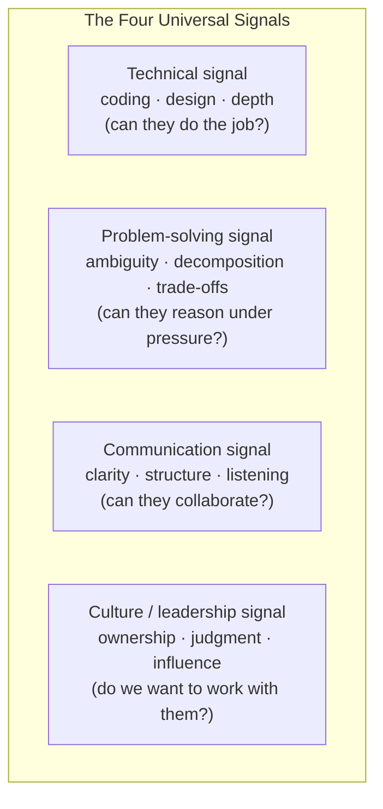
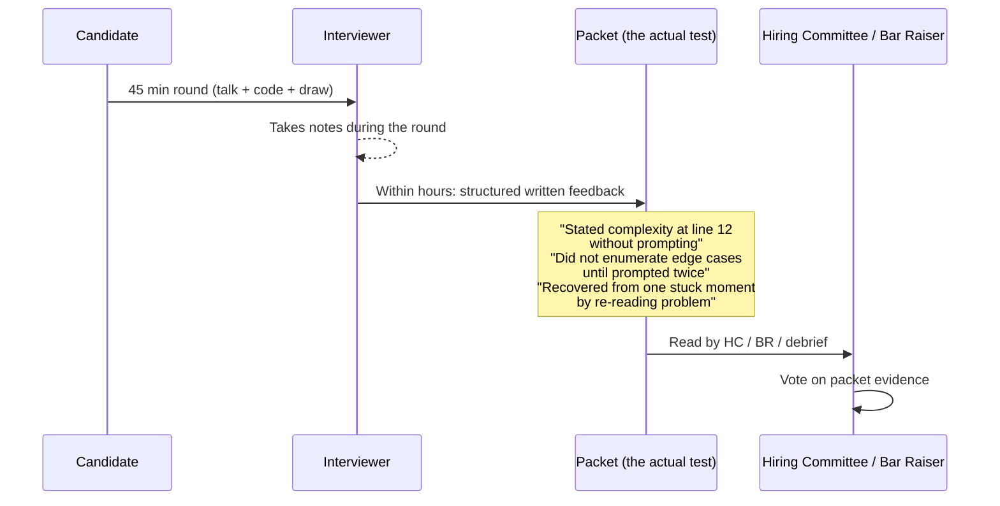
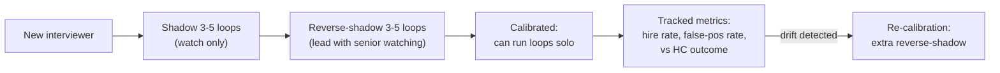
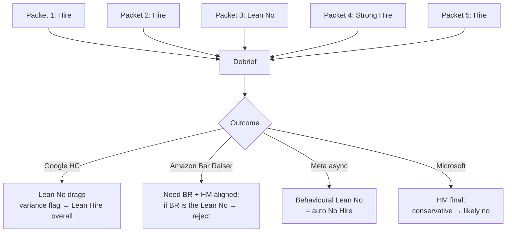
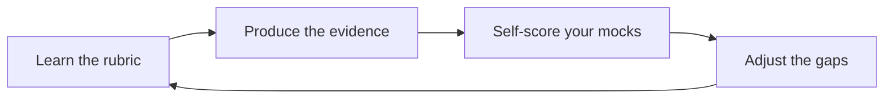

# The Interviewer's Rubric — Signals, Scoring, Calibration

Most candidates prepare for "the interview" without knowing what is actually being scored. They drill LeetCode, rehearse STAR stories, read system-design books — and arrive at the loop blind to the *exact* one-page scorecard the interviewer fills out before they leave the call. The scorecard decides the offer. Reading it before you walk into the room is the single highest-leverage prep move you have not yet made.

This topic opens that scorecard. You will see what the **signals** are (the small set of behaviours interviewers are explicitly trained to extract), how **scoring** translates those signals to a vote, how **calibration** prevents drift across interviewers and across loops, and how **the packet** — the written record an interviewer leaves behind — actually decides debrief outcomes. By the end you can predict, for any prompt you face, exactly what the interviewer is writing down about you.

## The Signal Anatomy — What Is Actually Being Scored

Every FAANGM company breaks the rubric into a small fixed list of signals. The names differ; the substance overlaps strongly. Across the industry, every loop scores some variant of these four:



These four map onto each company's published rubric:

| Company | Rubric names |
|---------|--------------|
| **Google** | General Cognitive Ability (GCA) · Role-Related Knowledge (RRK) · Leadership · Googleyness |
| **Amazon** | Coding · Design · Leadership Principles (16 LPs, scored individually) · Communication |
| **Meta** | Coding ("Ninja") · System Design ("Pirate") · Behavioural ("Jedi") · Resolving Conflicts / Driving Results / Embracing Ambiguity / Growing / Communicating |
| **Apple** | Per-team — typically Technical · Product Sense · Collaboration · "Why Apple" |
| **Netflix** | Technical · Judgment · Selflessness · Communication (Keeper-Test framed) |
| **Microsoft** | Coding · Design · Growth Mindset · Inclusive Collaboration |
| **Flipkart / Indian unicorns** | Coding · LLD (Machine Coding) · HLD · Values · Hiring-Manager Fit |

The naming differs but the *evidence* an interviewer looks for is the same: did this candidate produce working code, did they reason about trade-offs, did they communicate the journey, and did they behave like someone the team wants to work with for the next three years?

## How Scoring Actually Works — The Packet, Not The Conversation

The most expensive misconception in interview prep: candidates believe the conversation is the test. It is not. **The packet — the written record the interviewer files within hours of the round — is the test.** The conversation is just the source material the interviewer summarises for the packet.



Three implications follow:

1. **Specific moments outrank overall feeling.** "She seemed strong" gets a Lean Hire at best from a hiring committee that wants evidence. "She named the integer-overflow edge case at minute 14 unprompted, then asked whether to handle it now or after main logic" gets a Hire. Force the interviewer to write down concrete moments by *producing them*.
2. **Quotes you say go in the packet.** Interviewers literally write down phrases ("said: 'I'd start with brute force at O(n²) then optimise to O(n log n)'") because they're objective evidence. Use precise language. Avoid mumbled approximations.
3. **Vague performance is invisible.** A round in which you "did fine" but produced no concrete strong moments leaves the interviewer with nothing distinctive to write. The packet reads "completed problem; no notable signals" — which calibration committees read as "no hire" because the bar is "better than 50% of current employees at this level" (Amazon's stated philosophy ([Carrus.io](https://www.carrus.io/blog/all-about-bar-raisers-amazons-essential-element-to-the-hiring-process))).

### Anatomy of a real packet

Across Amazon, Google, Meta debrief leaks and ex-interviewer write-ups, the packet structure is consistent:

```text
ROUND TYPE:     Coding
INTERVIEWER:    [name + L-level]
DATE/TIME:      [stamp]
PROBLEM ASKED:  "Top K Frequent Elements (variant)"
OUTCOME:        Inclined to Hire

EVIDENCE — CLARIFY (2 min):
  • Asked 3 clarifying questions before coding (case sensitivity, k vs n,
    tie-breaking rule for equal frequencies)
  • Stated 2 assumptions out loud and confirmed with me

EVIDENCE — APPROACH (5 min):
  • Stated brute force first ("count with hashmap, sort O(n log n)") with
    correct complexity, called out it was suboptimal
  • Proposed heap optimisation to O(n log k) unprompted
  • Considered bucket-sort O(n) but chose heap for clarity — defended the
    trade-off when I pushed on it

EVIDENCE — CODE (20 min):
  • Wrote compiling Java, used PriorityQueue with Comparator
  • One bug at iteration boundary; spotted it on dry-run unprompted
  • Stated final complexity correctly without prompting

EVIDENCE — EDGE CASES (10 min):
  • Enumerated 4 edges unprompted: empty input, k > distinct count, single
    element, all-same frequencies
  • Did NOT consider integer overflow on extremely large k — pointed it
    out; she acknowledged and stated how she'd handle it

COMMUNICATION:
  • Narrated continuously, never went silent > 30 sec
  • Took one hint constructively at minute 28; attributed it
  • Asked thoughtful clarifying question about input scale before optimising

CULTURE / CONCERNS:
  • None significant
  • Mildly defensive when I pushed on bucket-sort alternative; recovered

VERDICT: Inclined to Hire (L5)
LEVELING SIGNAL: Strong L5; not L6 evidence in this round
```

**What you can control to influence each line:** asking clarifying questions out loud, naming brute force before optimising, stating complexity before and after code, enumerating edge cases unprompted, narrating continuously, accepting hints with attribution. These are the levers ([T05 Communication Mechanics](./T05-communication-mechanics-clarify-structure-think-aloud-recover.md) drills them).

## The Voting Scales

Each company uses a discrete scale, almost always 4 to 6 points. Scales matter because debrief committees treat them mathematically — "average above 3.5" type thresholds are common.

### Amazon — 4-point scale

`Strong Hire / Inclined to Hire / Not Inclined to Hire / Strong No Hire`

- Each interviewer files before the debrief (rule: write before discuss).
- Hiring Manager + Bar Raiser must align.
- One "Strong No Hire" from Bar Raiser is effectively a veto, even with other Hires.

### Google — 6-point scale + Hiring Committee

`Strong Hire / Hire / Leaning Hire / Leaning No-Hire / No-Hire / Strong No-Hire` ([levels.fyi](https://www.levels.fyi/blog/google-software-engineer-interview-process.html))

- HC of 3-6 senior engineers (L6+) reads packets independently.
- Some legacy numeric variant (1-4) circulates in third-party guides but is not officially confirmed.
- **Variance is risk.** Consistent 4-of-5 packet beats inconsistent 5-of-5 + 3-of-5 ([dglearning — Inside the Google 2026 Loop](https://dglearning.substack.com/p/inside-the-google-2026-loop-rounds)).

### Meta — Binary on hire, scaled on level

- Coding rounds vote **Hire / No-Hire** on the hire decision.
- System design + behavioural decide the **level** (E4 vs E5 vs E6).
- Behavioural failure ("Jedi") = auto No-Hire regardless of the rest ([interviewing.io Meta](https://interviewing.io/guides/hiring-process/meta-facebook)).

### Apple — Live thumbs

Live debrief, thumbs-up/down vote, no written reviews. Hiring manager weighted heaviest ([interviewing.io Apple](https://interviewing.io/guides/hiring-process/apple)).

### Netflix — Packet + Keeper Test framing

Standard packet-and-discuss. Director-level Dream Team vote carries heavy weight. Implicit cutoff: "would the hiring manager fight to keep this person if they tried to leave?"

### Microsoft — As-Appropriate + HM final

"AS-AP" internal vote per interviewer + hiring manager final call. Generally more conservative scoring (fewer Strong Hires, fewer aggressive rejections).

### Indian unicorns — HM + bar raiser alignment

Most run a Hiring Manager + Senior IC alignment with no formal HC. Flipkart and (post-Walmart acquisition) some others run a Bar Raiser modelled on Amazon's.

## Calibration — Why The Bar Doesn't Drift

A core anxiety of every hiring org: interviewer drift. One interviewer is too easy, another too hard, the bar wanders, the same candidate is hired one week and rejected the next. Big companies invest heavily in calibration mechanisms.



### Calibration mechanisms in practice

- **Shadow / reverse-shadow program.** Every FAANGM uses it. A new interviewer watches 3-5 loops silently, then leads 3-5 with a senior watching, before running solo.
- **Per-interviewer dashboards.** Tracked metrics: interview volume, hire-rate (% of candidates voted Hire+), and most importantly, alignment with HC outcome (false-positive and false-negative rates). Outliers get pulled back into reverse-shadowing.
- **Bar Raiser / Hiring Committee.** Amazon's Bar Raisers and Google's HC are explicitly calibration mechanisms — outside-team seniors who normalise the bar across teams. ([Carrus.io — Bar Raiser](https://www.carrus.io/blog/all-about-bar-raisers-amazons-essential-element-to-the-hiring-process))
- **Rubric anchoring.** Every interviewer receives a written rubric tied to *level*. "L5 candidate: expected to produce working code with correct complexity in 30 min, name 2+ edge cases unprompted, defend trade-offs when challenged." Calibration is "did I see that, or didn't I?", not "did I like them?".

### What this means for candidates

- **The bar at the loop you're running is a known quantity.** Your interviewer is calibrated to a written rubric for your target level. Predict it and meet it. (T01 has the level scopes.)
- **Surface-level vibes don't move the bar.** A friendly conversation that produces no rubric evidence still scores Not Inclined.
- **One interviewer being "tough" is not bad luck.** It's calibration. If you struggled with a tough interviewer, it's likely the round was a fair signal at your real level.

## The Specific Rubrics By Round Type

Within each round, the rubric breaks into sub-signals. Here are the dominant patterns.

### Coding round rubric

| Signal | What the interviewer writes |
|--------|----------------------------|
| **Problem comprehension** | "Restated problem in own words" / "Asked 3 clarifying questions before coding" |
| **Algorithmic reasoning** | "Stated brute force + complexity first" / "Articulated trade-off between heap and bucket sort" |
| **Code quality** | "Compiling Java, idiomatic collections, no dead code" / "Variable names clear, method-extracted appropriately" |
| **Edge cases** | "Enumerated empty input, k > n, single element, overflow, unicode" |
| **Complexity** | "Stated final O(n log k) time, O(k) space unprompted" |
| **Debugging** | "Spotted off-by-one in dry-run unprompted" / "Took hint constructively at minute 28" |
| **Testing** | "Walked through 2 examples covering happy path + edge" |
| **Communication** | "Narrated continuously" / "Silent > 60 sec twice" |
| **Java idiom (when applicable)** | "Used ArrayDeque over Stack" / "PriorityQueue with custom Comparator correctly" |

### System Design round rubric

| Signal | What the interviewer writes |
|--------|----------------------------|
| **Requirements gathering** | "Clarified functional vs non-functional reqs before starting" / "Asked about scale + SLOs" |
| **Capacity estimation** | "Did back-of-envelope: ~10M DAU × ~10 req/day → ~1k RPS sustained" |
| **High-level architecture** | "Drew clear box-and-line; named each component's role" |
| **Data model** | "Chose Postgres for relational data + Redis for hot reads, defended the split" |
| **Scaling** | "Discussed sharding key, hot-partition mitigation, read-replica fanout" |
| **Failure modes** | "Named what breaks if cache dies, DB primary fails, region goes down" |
| **Trade-off articulation** | "Chose Cassandra for AP over Mongo for CP, defended on write-heavy workload" |
| **Operational depth (senior+)** | "Discussed monitoring, oncall, blast radius, deploy strategy" |
| **Depth on probe** | "When pushed on consistency, articulated quorum reads correctly" |

### LLD / OOD round rubric

| Signal | What the interviewer writes |
|--------|----------------------------|
| **Requirements** | "Asked clarifying questions; bounded scope" |
| **Class boundaries** | "Entity / service / repository separation; no god class" |
| **SOLID** | "Strategy for pricing policy; Open/Closed applied" |
| **Extensibility** | "When asked to add VIP pricing, plugged in as new PricingStrategy impl" |
| **Concurrency** | "Used ConcurrentHashMap + AtomicInteger ID generator" |
| **Code quality** | "Custom exceptions per failure mode; constructor DI; enum for finite states" |
| **Driver / demo** | "Wrote main() that exercises the API end-to-end; runs successfully" |
| **Tests (bonus)** | "Added 3 JUnit tests covering happy + 2 edge" |

### Behavioural round rubric

| Signal | What the interviewer writes |
|--------|----------------------------|
| **Specificity** | "Named real project + real teammates + real dates" |
| **STAR completeness** | "Situation + Task + Action + Result all present" |
| **Use of 'I' not 'we'** | "Owned individual contribution clearly" |
| **Metrics** | "Quantified outcome: '35% latency reduction'" |
| **Self-awareness** | "Named what she would do differently" |
| **Conflict / disagreement** | "Showed disagreement skill without aggression" |
| **Story breadth** | "Used different stories for different prompts; not recycled" |
| **Alignment to value / LP** | (Amazon) "Strong Ownership story" / (Meta) "Move Fast evidenced" / (Google) "Googleyness shown through admitting uncertainty" |

## Anti-Patterns That Reliably Score Low

Across companies, the same five anti-patterns destroy packets:

1. **Diving into code without clarifying.** Scores low on every rubric.
2. **Going silent.** Interviewers cannot score what they cannot hear. > 60 seconds of silence is a red flag in the packet.
3. **Refusing hints.** If the interviewer hints, you are off track. Take it, attribute it, keep moving. Refusing = "didn't listen" in the packet.
4. **No metrics in behavioural stories.** Drops the story to "narrative" — interviewer cannot score impact.
5. **Recycling one story across prompts.** Signals narrow experience; interviewer's packet says "limited story inventory".

## How Loops Aggregate — The Math Of The Debrief

When the 4-6 individual packets meet in debrief, the aggregation rules differ — but the underlying logic is the same: each company privileges either *consistency* (Google) or *floor* (Amazon, Meta).



### Practical lesson

**Optimise for consistency, not for a peak.** A "Hire on all 5 rounds" outcome beats a "Strong Hire on 3 + No Hire on 1" outcome at almost every company. This shifts how you prep: instead of trying to be brilliant in one round, target *baseline solid* across every round of the loop.

## What You Can Do With This Knowledge



1. **Before every mock**, write the rubric for the round on a sticky note. Reference it mid-round.
2. **After every mock**, fill out a mock packet on yourself. What evidence did you produce against each signal? What evidence is missing?
3. **Track which signals you consistently miss.** Most candidates have 1-2 systematic gaps (no edge cases enumerated, no metrics in behavioural, silent during coding). Drill those.
4. **In the real loop**, produce evidence proactively. Don't wait to be asked: "Edge cases I'd handle: empty input, k > n, overflow." "Final complexity: O(n log k) time, O(k) space."

> [!INTERVIEW]
> The cheapest signal to produce — and the one most under-produced — is **stating complexity unprompted at the end of every coding answer.** Two seconds of "O(n log k) time, O(k) space; the trade vs bucket sort is clarity over linearity" goes into the packet and lifts your score on three signals at once: algorithmic reasoning, communication, and code quality.

## Sources & Further Reading

- [Carrus.io — All About Bar Raisers (Amazon)](https://www.carrus.io/blog/all-about-bar-raisers-amazons-essential-element-to-the-hiring-process)
- [Pragmatic — Inside the Google 2026 Loop](https://dglearning.substack.com/p/inside-the-google-2026-loop-rounds)
- [levels.fyi — Google SWE Interview Process](https://www.levels.fyi/blog/google-software-engineer-interview-process.html)
- [interviewing.io — Meta Hiring Process](https://interviewing.io/guides/hiring-process/meta-facebook)
- [interviewing.io — Apple Hiring Process](https://interviewing.io/guides/hiring-process/apple)
- [Hello Interview — Meta E5 / E6 guides](https://www.hellointerview.com/guides/meta/e5)
- [amazon.jobs — SDE-II Interview Prep](https://amazon.jobs/content/en/how-we-hire/sde-ii-interview-prep)

## Practice

1. **Write your own packet.** Take a recent mock or real interview. Write the packet on yourself in the exact format above (Round Type / Evidence / Communication / Concerns / Verdict / Leveling Signal). Be specific — quote yourself.
2. **Predict packets.** Before a mock, write down what you *want* the packet to say. Make it specific ("stated complexity at end of round 1"). After the mock, compare.
3. **Calibrate against the rubric.** For one coding round, list every rubric signal in the Coding table above. Score yourself 1-5 on each. Identify your weakest two.
4. **Identify your anti-pattern.** Which of the five anti-patterns above do you commit most? Write one drill that fixes it.
5. **Consistency vs peak experiment.** For a 4-round mock loop, decide in advance: "I will aim for solid Hire on all 4 rounds" rather than "I'll be brilliant in 2 and survive 2". Run the loop, packet yourself, evaluate.
6. **Reverse the rubric.** Read the rubric for your target company's behavioural round (Amazon LP, Meta Jedi, Google Googleyness). For each rubric line, identify the strongest story you have. Note any rubric line where you don't have a strong story — that's your prep gap.
7. **The unprompted-complexity drill.** For your next 10 LeetCode solutions, force yourself to say final complexity *unprompted* at the end. Notice how often you forget.

## Recap

You should now be able to:

- Name the **four universal signals** (technical / problem-solving / communication / culture) and the FAANGM rubric names that map onto each.
- Explain why the **packet** is the actual test and the conversation is just source material.
- Identify the structural elements of a real packet (Round Type / Evidence / Communication / Concerns / Verdict / Leveling Signal).
- Recall the **voting scales** of each company (Amazon 4-pt, Google 6-pt + HC, Meta binary + level decision, Apple thumbs, Netflix Keeper-Test, Microsoft AS-AP).
- Explain **calibration mechanisms** (shadow/reverse-shadow, dashboards, Bar Raiser/HC, rubric anchoring) and why the bar doesn't randomly drift.
- Recite the **dominant rubric signals** for coding, system design, LLD, and behavioural rounds.
- Recognise the **five universal anti-patterns** that reliably score low.
- Explain why **consistency** beats **peaks** in packet aggregation.
- Apply this knowledge in mocks: write your own packet, identify systematic gaps, produce evidence proactively in the real loop.

## Next

Continue to [Big-O / Time & Space Complexity](./T04-big-o-time-and-space-complexity.md).
