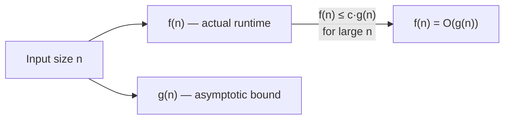

# Big-O / Time & Space Complexity

Big-O is the single piece of vocabulary that every interviewer assumes you can produce on demand. Coding rounds across every FAANGM company end the same way: *"What's the time and space complexity?"* — and an answer that is correct, fast, and includes the trade-off between alternatives lifts the round visibly. An answer that is wrong, halting, or missing entirely tanks the round just as visibly. This topic exists so that, in any interview moment, you can say the right Big-O, justify it, and articulate the trade-off in 20 seconds.

The topic also goes one layer deeper than typical Big-O tutorials. You will see **what Big-O actually means** (the formal definition matters when interviewers push), how to compute it for code patterns you'll meet in interviews, the **gotchas that trip mid-level candidates** (amortised vs worst-case, average vs expected, recursion costs hidden in the stack, hashing's worst-case), and the **per-data-structure cheat table** that anchors every algorithmic answer.

> [!IMPORTANT]
> Big-O is not just a vocabulary check. Interviewers use it to score **algorithmic reasoning** — your ability to compare approaches, predict performance, and choose. Reciting "O(n)" without the reasoning behind it scores nothing; producing "O(n) time with O(1) extra space, beating the sorting approach's O(n log n) at the cost of needing the hashmap" scores high.

## What Big-O Actually Means

Big-O is **asymptotic upper-bound notation** — a tool for describing how a function's growth scales with input size as the input gets large. Formally:

> `f(n) = O(g(n))` if there exist constants `c > 0` and `n₀` such that `0 ≤ f(n) ≤ c · g(n)` for all `n ≥ n₀`.

The definition has three useful implications:

1. **Constants are dropped.** `5n + 100` is `O(n)`. The `5` and the `100` don't change how it scales.
2. **Lower-order terms are dropped.** `n² + 100n + 50` is `O(n²)`. As `n` grows, the `n²` dominates.
3. **It is an upper bound, not an equality.** `n` is `O(n)` and also `O(n²)` and also `O(n³)`. In interviews we use the **tightest** upper bound we can prove. (Strictly that's Big-Theta `Θ`, but everyone says Big-O.)



### The growth-rate ladder (memorise this)

| Notation | Name | Example | n=10 | n=10⁶ |
|---|---|---|---:|---:|
| `O(1)` | Constant | Hash lookup, array index | 1 | 1 |
| `O(log n)` | Logarithmic | Binary search, balanced-tree op | ~3 | ~20 |
| `O(n)` | Linear | Single loop, linked-list traversal | 10 | 10⁶ |
| `O(n log n)` | Linearithmic | Merge sort, heap sort, fast comparison sort | ~33 | ~2×10⁷ |
| `O(n²)` | Quadratic | Nested loop, bubble sort, naive pair-comparison | 100 | 10¹² |
| `O(n³)` | Cubic | Three nested loops, Floyd-Warshall | 1000 | 10¹⁸ (unreachable) |
| `O(2ⁿ)` | Exponential | Recursive subsets, naive Fibonacci | 1024 | (galaxies) |
| `O(n!)` | Factorial | Permutations, brute-force TSP | 3.6M | (heat-death of universe) |

The rightmost column is where interview judgement lives: if your input scale is `~10⁶` and your answer is `O(n²)`, that's `10¹²` operations — minutes-to-hours of CPU time, unacceptable. **Most coding-round prompts are sized so that the brute-force approach is technically correct but too slow; the optimisation moves you down the ladder.**

### The first sentence to say in any interview

> *"At n equals our input size, this is roughly N operations — within / outside the safe range."*

A modern CPU does ~10⁸ to 10⁹ simple operations per second. Rough budgets:

| n | Safe complexity for ~1s |
|---|------------------------|
| 10 | Anything, including O(n!) |
| 100 | O(n³) and below |
| 1,000 | O(n²) and below |
| 10,000 | O(n²) borderline; O(n log n) safe |
| 100,000 | O(n log n) and below |
| 1,000,000 | O(n log n) and below |
| 10,000,000 | O(n) and below |
| 10⁹ | O(log n) / O(1) only |

This table answers the most common interview probe — *"can you afford O(n²) here?"* — without doing any math.

## Computing Complexity For The Patterns You'll Meet

### Single loop → O(n)

```java
int sum = 0;
for (int i = 0; i < n; i++) {        // n iterations
    sum += a[i];                      // O(1) per iteration
}
// Total: O(n) time, O(1) space
```

### Nested loop over same input → O(n²)

```java
for (int i = 0; i < n; i++) {
    for (int j = 0; j < n; j++) {     // n × n
        // O(1) work
    }
}
// Total: O(n²) time
```

### Nested loop over different inputs → O(n × m)

```java
for (int i = 0; i < n; i++) {
    for (int j = 0; j < m; j++) {
        // O(1) work
    }
}
// Total: O(n × m) time — NOT O(n²) unless m = O(n)
```

### Halving the input → O(log n)

```java
while (lo < hi) {
    int mid = lo + (hi - lo) / 2;     // each iteration halves the range
    if (target == a[mid]) return mid;
    if (target < a[mid]) hi = mid;
    else                  lo = mid + 1;
}
// Total: O(log n) time
```

### Recursion → think recurrence

```java
int fib(int n) {                       // T(n) = T(n-1) + T(n-2) + O(1)
    if (n < 2) return n;
    return fib(n-1) + fib(n-2);
}
// Solving the recurrence: T(n) = O(2ⁿ) time, O(n) stack space
```

For recursion, write the recurrence first. Common patterns:

| Recurrence | Solves to | Example |
|---|---|---|
| `T(n) = T(n-1) + O(1)` | `O(n)` | linear recursion |
| `T(n) = T(n-1) + O(n)` | `O(n²)` | building a string via concat |
| `T(n) = 2·T(n/2) + O(1)` | `O(n)` | tree traversal |
| `T(n) = 2·T(n/2) + O(n)` | `O(n log n)` | merge sort |
| `T(n) = T(n/2) + O(1)` | `O(log n)` | binary search |
| `T(n) = 2·T(n-1) + O(1)` | `O(2ⁿ)` | naive Fibonacci, naive subset gen |

**[Master Theorem](https://en.wikipedia.org/wiki/Master_theorem_(analysis_of_algorithms))** handles `T(n) = a·T(n/b) + O(n^d)` for divide-and-conquer; for interview purposes the table above covers ~95% of what you'll meet.

### Sums of complexities → take the dominant

```java
// Step 1
for (int i = 0; i < n; i++) { ... }      // O(n)
// Step 2
for (int i = 0; i < n; i++) {
    for (int j = 0; j < n; j++) { ... }  // O(n²)
}
// Total: O(n + n²) = O(n²)
```

When code runs **sequentially**, total = sum of phases = the **dominant** phase.

### Multiplications → take both factors

```java
for (int i = 0; i < n; i++) {            // n times
    binarySearch(a, target);              // O(log n) per call
}
// Total: O(n log n)
```

## Space Complexity — Don't Forget The Stack

Space complexity is **extra memory used beyond the input**. Two contributions matter most for interviews:

1. **Allocated data structures.** A hashmap of size `n` is `O(n)` space.
2. **Recursion stack depth.** Recursion uses stack frames; depth `d` ⇒ `O(d)` stack space.

```java
// Iterative fibonacci — O(1) extra space
int fib(int n) {
    int a = 0, b = 1;
    for (int i = 0; i < n; i++) {
        int next = a + b;
        a = b; b = next;
    }
    return a;
}

// Recursive fibonacci — O(2ⁿ) time, O(n) stack space (depth of recursion tree)
int fib(int n) {
    if (n < 2) return n;
    return fib(n-1) + fib(n-2);
}
```

A subtle one: **a recursive function that allocates an O(n) data structure at each level** is `O(n²)` space, not `O(n)`. Always sum the allocations down the recursion stack.

## Gotchas That Trip Mid-Level Candidates

### Amortised vs worst-case vs average

A single operation can be `O(n)` worst case while a sequence of operations averages `O(1)` per operation:

- **`ArrayList.add(x)`** is `O(1)` amortised (because doubling-resize is rare) but `O(n)` worst-case on the resize call.
- **`HashMap.put(k, v)`** is `O(1)` average / amortised but `O(n)` worst-case if every key collides into one bucket (pre-Java-8) or `O(log n)` worst-case post-Java-8 (treeified bucket).

In interviews, **always specify which case you mean**: "ArrayList add is O(1) amortised, O(n) worst-case on resize" scores higher than "ArrayList add is O(1)".

### Hashing's worst case

Hash maps offer `O(1)` average lookup, but **adversarial inputs** that force collisions degrade them. Pre-Java-8 HashMap collisioned to `O(n)`; Java-8+ treeifies the bucket at threshold 8 to give `O(log n)` worst-case. This is asked at every banking + senior product interview.

### Strings are not free

In Java, **`String.substring` is O(n)** (since Java 7u6 — it now copies; prior to that it was O(1) view into a shared char array, but with a memory-leak hazard). **`String.concat` and `+` in a loop are O(n²)** — use `StringBuilder` for any concatenation in a loop.

### Streams and lambdas don't change complexity

`list.stream().filter(...).map(...).count()` is still `O(n)`. Functional style doesn't make it faster; it just composes differently. If you do `list.stream().sorted().collect(...)`, you've added an `O(n log n)` sort.

### Boxing and unboxing are not free

`int` operations are nanoseconds; `Integer` operations allocate and dereference. The Big-O is the same, but the **constant factor** can differ by 5-10×. Interviewers don't usually ask about constant factors — but they do notice when senior candidates use primitive arrays instead of `List<Integer>` for hot paths.

### Java collection-specific complexities

| Operation | ArrayList | LinkedList | HashMap | TreeMap | PriorityQueue |
|---|---|---|---|---|---|
| `get(i)` | O(1) | O(n) | O(1) avg | O(log n) | — |
| `add(x)` | O(1) amortised | O(1) at head | O(1) avg | O(log n) | O(log n) |
| `remove(i)` | O(n) | O(1) if iterator | O(1) avg | O(log n) | O(log n) for poll |
| `contains(x)` | O(n) | O(n) | O(1) avg | O(log n) | O(n) |
| `iterate` | O(n) | O(n) | O(n) | O(n) | O(n) |

This table is the rest of the cheatsheet you need. Memorise it — interviewers reach for it in every coding round.

## How To Talk About Complexity In Interviews

The pattern that scores high:

```text
1. State brute-force complexity FIRST.
   "Brute force is sort + linear scan, O(n log n) time, O(1) extra space."

2. State the optimisation complexity SECOND.
   "Hashmap-based, O(n) time, O(n) extra space."

3. Articulate the trade-off.
   "I'd take the hashmap unless we're memory-constrained or the input is
    already sorted, in which case the brute force wins on space."

4. State final complexity AT THE END of your code.
   "Final: O(n) time, O(n) extra space."
```

Four sentences. Every one of them ends up in the packet. **Most candidates skip steps 1 and 3 — that's where the easy points are.**

> [!INTERVIEW]
> When you're not sure of the complexity, **say "let me think about that for a second" out loud, then reason through it**. Silent thinking reads as "doesn't know". Spoken thinking — "the outer loop is n, the inner loop is m which is bounded by k, so n·k" — reads as algorithmic reasoning. The packet captures the reasoning, not just the answer.

## Big-Ω, Big-Θ, Little-o, Little-ω — Quick Definitions

For completeness; interviewers rarely ask about these but a senior candidate should know them.

| Notation | Meaning | In English |
|---|---|---|
| `O(g(n))` | Upper bound | "grows no faster than g" |
| `Ω(g(n))` | Lower bound | "grows no slower than g" |
| `Θ(g(n))` | Tight bound | "grows exactly like g" |
| `o(g(n))` | Strict upper bound | "grows strictly slower than g" |
| `ω(g(n))` | Strict lower bound | "grows strictly faster than g" |

Practical takeaway: when you say "O(n)" you almost always mean "Θ(n)" — the tight bound. Interviewers don't fuss about the distinction unless you mis-claim a lower bound.

## Common Mistakes That Score Low

- **Claiming O(1) for `String.contains`.** It's `O(n)` (naive) or `O(n+m)` (KMP-style).
- **Confusing average and worst case** without specifying which.
- **Forgetting recursion stack space** in space complexity.
- **Saying "O(2n)" or "O(n + 5)"** instead of dropping constants.
- **Not computing complexity for the input format you have.** "I sort the array in O(n log n)" — but if the array is already sorted, the prompt may want you to recognise that and beat `n log n`.
- **Picking "complex" answers because they sound senior.** `O(n)` with a hashmap beats `O(n log n)` with sort. Pick the right complexity, not the most exotic.

## Sources & Further Reading

- [Big O Notation — Wikipedia](https://en.wikipedia.org/wiki/Big_O_notation)
- [Master Theorem — Wikipedia](https://en.wikipedia.org/wiki/Master_theorem_(analysis_of_algorithms))
- [The Big-O Cheat Sheet](https://www.bigocheatsheet.com/)
- [CLRS — *Introduction to Algorithms*, Chapter 3](https://mitpress.mit.edu/9780262046305/) — the canonical formal treatment

## Practice

1. **The growth ladder cold-recall.** Without looking, write the eight rows of the growth-rate ladder (O(1), O(log n), O(n), O(n log n), O(n²), O(n³), O(2ⁿ), O(n!)) and one example of each. Check yourself.
2. **The safe-budget table.** Without looking, fill in: at n=10⁴, what's the max complexity safe for 1 second? At n=10⁶? At n=10⁸?
3. **Recurrence drill.** Solve the complexity of each: `T(n) = T(n-1) + n`, `T(n) = 2T(n-1)`, `T(n) = T(n/2) + n`, `T(n) = 4T(n/2) + n²`.
4. **Compute complexity for a method.** Take any method from your codebase. Write its time and space complexity, justifying each loop and recursion.
5. **Amortised vs worst-case.** Explain in two sentences each: ArrayList.add, HashMap.put (pre-Java-8 vs Java-8+).
6. **The collection cheat-sheet drill.** Without looking, fill in the time complexity for: ArrayList.get(i), LinkedList.contains(x), HashMap.put(k,v), TreeMap.get(k), PriorityQueue.add(x).
7. **Talk-through the trade-off.** Take a coding problem you've solved (Two Sum, etc.) and verbalize the four-sentence pattern above (brute first, optimised second, trade-off, final).
8. **Space-complexity recursion trap.** A recursive function allocates a list of size n at each level of recursion (depth log n). What's the total space?
9. **String.substring trap.** Pre-Java-7u6 it was O(1); post-Java-7u6 it is O(n). Explain in one sentence why the change was made (memory leak).
10. **Stream complexity.** What's the complexity of `list.stream().sorted().distinct().count()` for a list of n elements? Justify each operation.

## Recap

You should now be able to:

- State the **formal definition** of Big-O and the three implications (drop constants, drop lower-order terms, upper-bound only).
- Recite the **growth-rate ladder** (8 levels) and one example of each.
- Use the **safe-budget table** to predict which complexities are tractable at each input size.
- Compute complexity for **single loops, nested loops, halving loops, recursion** — using recurrences for the recursive case.
- Compute **space complexity** including recursion stack depth.
- Distinguish **worst-case, average-case, and amortised** and apply each correctly to Java collection operations.
- Recite the **Java collection complexity cheat-sheet** (ArrayList, LinkedList, HashMap, TreeMap, PriorityQueue).
- Recognise the **gotchas**: amortised vs worst-case, String.substring/concat/builder, streams don't change Big-O, boxing constant-factor cost, hashing's worst case.
- Talk through complexity in interviews using the **four-sentence pattern** (brute first → optimised second → trade-off → final).
- Avoid the **common mistakes** that score low.

## Next

Continue to [Communication Mechanics — Clarify, Structure, Think-Aloud, Recover](./T05-communication-mechanics-clarify-structure-think-aloud-recover.md).
